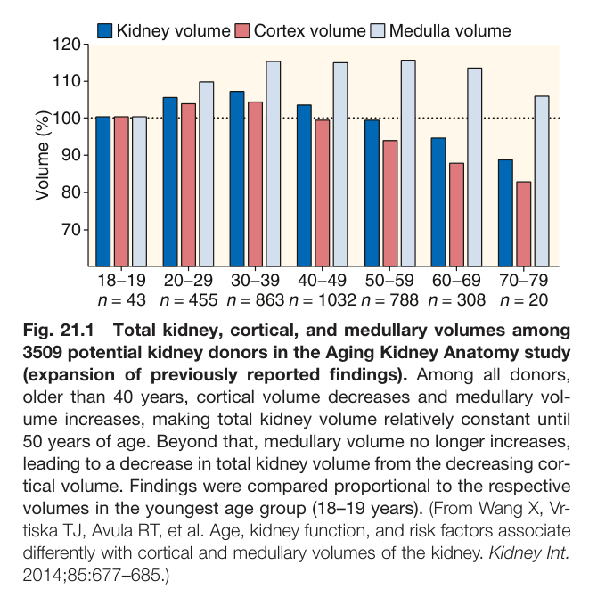
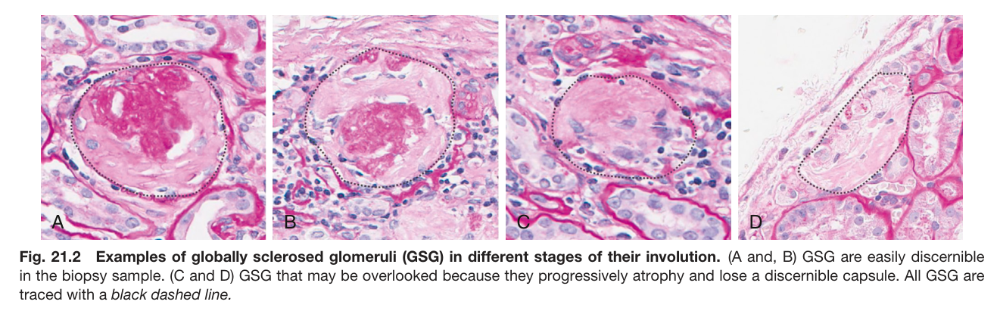
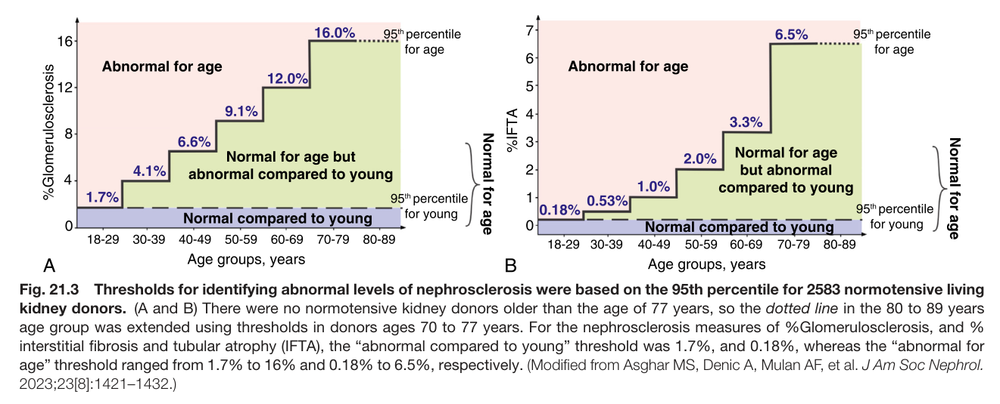
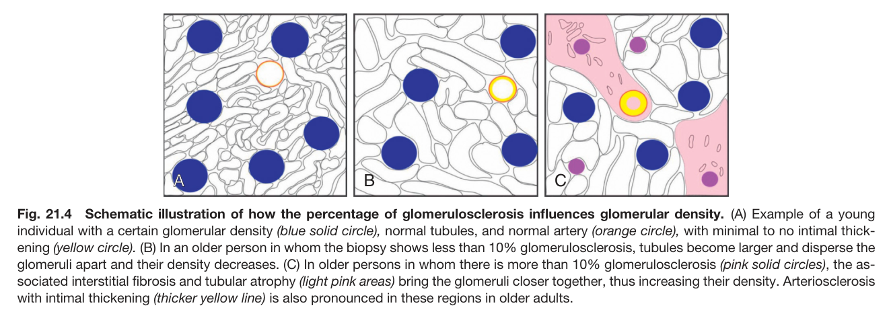
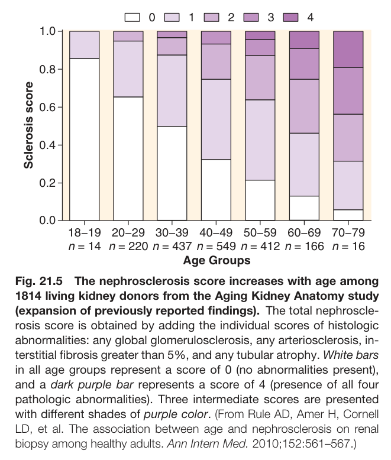
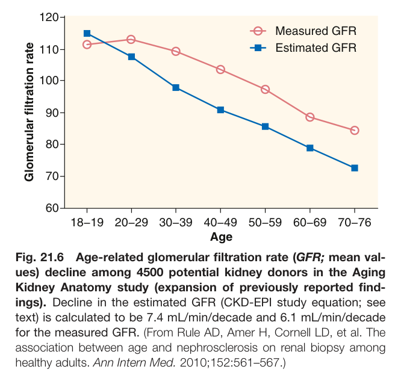
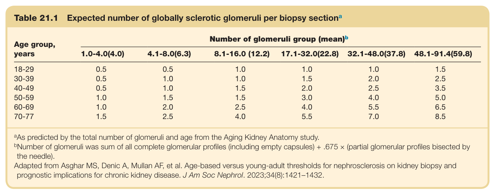
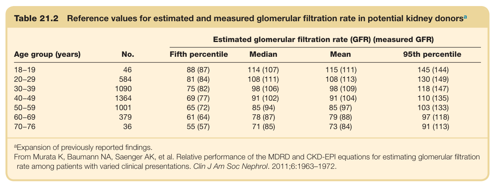
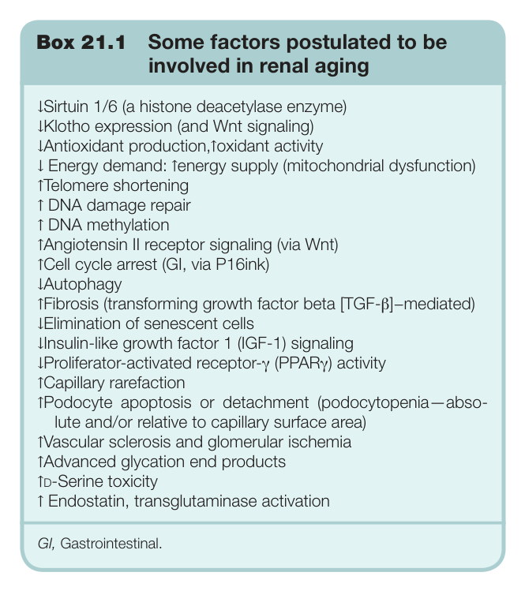
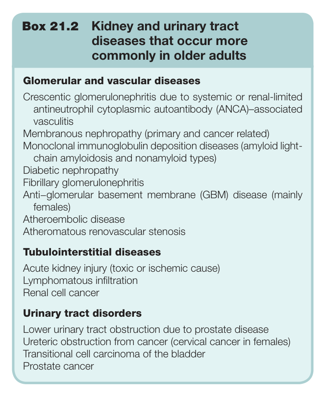

# 21. The Physiology and Pathophysiology of the Kidneys in Aging - Figures and Tables Index

This document lists all figures, tables and boxes extracted from `21. The Physiology and Pathophysiology of the Kidneys in Aging.pdf`.

## Table of Contents
- [Figures](#figures)
- [Tables](#tables)
- [Boxes](#boxes)

---

## Figures

### Fig_21_1



Fig. 21.1 Total kidney, cortical, and medullary volumes among 3509 potential kidney donors in the Aging Kidney Anatomy study (expansion of previously reported findings). Among all donors, older than 40 years, cortical volume decreases and medullary vol- ume increases, making total kidney volume relatively constant until 50 years of age. Beyond that, medullary volume no longer increases, leading to a decrease in total kidney volume from the decreasing cor- tical volume. Findings were compared proportional to the respective volumes in the youngest age group (18–19 years). (From Wang X, Vr- tiska TJ, Avula RT, et al. Age, kidney function, and risk factors associate differently with cortical and medullary volumes of the kidney. Kidney Int. 2014;85:677–685.)

---

### Fig_21_2



Fig. 21.2 Examples of globally sclerosed glomeruli (GSG) in different stages of their involution. (A and, B) GSG are easily discernible in the biopsy sample. (C and D) GSG that may be overlooked because they progressively atrophy and lose a discernible capsule. All GSG are traced with a black dashed line.

---

### Fig_21_3



Fig. 21.3 Thresholds for identifying abnormal levels of nephrosclerosis were based on the 95th percentile for 2583 normotensive living kidney donors. (A and B) There were no normotensive kidney donors older than the age of 77 years, so the dotted line in the 80 to 89 years age group was extended using thresholds in donors ages 70 to 77 years. For the nephrosclerosis measures of %Glomerulosclerosis, and % interstitial fibrosis and tubular atrophy (IFTA), the “abnormal compared to young” threshold was 1.7%, and 0.18%, whereas the “abnormal fo age” threshold ranged from 1.7% to 16% and 0.18% to 6.5%, respectively. (Modified from Asghar MS, Denic A, Mulan AF, et al. J Am Soc Nephrol. 2023;23[8]:1421–1432.)

---

### Fig_21_4



Fig. 21.4 Schematic illustration of how the percentage of glomerulosclerosis influences glomerular density. (A) Example of a young individual with a certain glomerular density (blue solid circle), normal tubules, and normal artery (orange circle), with minimal to no intimal thick- ening (yellow circle). (B) In an older person in whom the biopsy shows less than 10% glomerulosclerosis, tubules become larger and disperse the glomeruli apart and their density decreases. (C) In older persons in whom there is more than 10% glomerulosclerosis (pink solid circles), the as- sociated interstitial fibrosis and tubular atrophy (light pink areas) bring the glomeruli closer together, thus increasing their density. Arteriosclerosis with intimal thickening (thicker yellow line) is also pronounced in these regions in older adults.

---

### Fig_21_5



Fig. 21.5 The nephrosclerosis score increases with age among 1814 living kidney donors from the Aging Kidney Anatomy study (expansion of previously reported findings). The total nephroscle- rosis score is obtained by adding the individual scores of histologic abnormalities: any global glomerulosclerosis, any arteriosclerosis, in- terstitial fibrosis greater than 5%, and any tubular atrophy. White bars in all age groups represent a score of 0 (no abnormalities present), and a dark purple bar represents a score of 4 (presence of all four pathologic abnormalities). Three intermediate scores are presented with different shades of purple color. (From Rule AD, Amer H, Cornell LD, et al. The association between age and nephrosclerosis on renal biopsy among healthy adults. Ann Intern Med. 2010;152:561–567.)

---

### Fig_21_6



Fig. 21.6 Age-related glomerular filtration rate (GFR; mean val- ues) decline among 4500 potential kidney donors in the Aging Kidney Anatomy study (expansion of previously reported find- ings). Decline in the estimated GFR (CKD-EPI study equation; see text) is calculated to be 7.4 mL/min/decade and 6.1 mL/min/decade for the measured GFR. (From Rule AD, Amer H, Cornell LD, et al. The association between age and nephrosclerosis on renal biopsy among healthy adults. Ann Intern Med. 2010;152:561–567.)

---

## Tables

### Table_21_1

#### Table Image



#### Table Data (CSV: [Table_21_1.csv](Table_21_1.csv))

```markdown
| Table Text (OCR) |
| :--- |
| Table 21.1  Expected number of globally sclerotic glomeruli per biopsy section<sup>a</sup> Age group, years  Number of glomeruli group (mean)b    1.0-4.0(4.0)  4.1-8.0(6.3)  8.1-16.0 (12.2)  17.1-32.0(22.8)  32.1-48.0(37.8)  48.1-91.4(59.8)    18-29  0.5  0.5  1.0  1.0  1.0  1.5    30-39  0.5  1.0  1.0  1.5  2.0  2.5    40-49  0.5  1.0  1.5  2.0  2.5  3.5    50-59  1.0  1.5  1.5  3.0  4.0  5.0    60-69  1.0  2.0  2.5  4.0  5.5  6.5    70-77  1.5  2.5  4.0  5.5  7.0  8.5 <sup>a</sup>As predicted by the total number of glomeruli and age from the Aging Kidney Anatomy study. <sup>b</sup>Number of glomeruli was sum of all complete glomerular profiles (including empty capsules) + .675 × (partial glomerular profiles bisected by the needle). Adapted from Asghar MS, Denic A, Mullan AF, et al. Age-based versus young-adult thresholds for nephrosclerosis on kidney biopsy and prognostic implications for chronic kidney disease. J Am Soc Nephrol. 2023;34(8):1421–1432. |
```

Table 21.1 Expected number of globally sclerotic glomeruli per biopsy section<sup>a</sup>

---

### Table_21_2

#### Table Image



#### Table Data (CSV: [Table_21_2.csv](Table_21_2.csv))

```markdown
| Table Text (OCR) |
| :--- |
| Table 21.2  Reference values for estimated and measured glomerular filtration rate in potential kidney donors<sup>a</sup> Age group (years)  No.  Estimated glomerular filtration rate (GFR) (measured GFR)    Fifth percentile  Median  Mean  95th percentile    18–19  46  88 (87)  114 (107)  115 (111)  145 (144)    20–29  584  81 (84)  108 (111)  108 (113)  130 (149)    30–39  1090  75 (82)  98 (106)  98 (109)  118 (147)    40–49  1364  69 (77)  91 (102)  91 (104)  110 (135)    50–59  1001  65 (72)  85 (94)  85 (97)  103 (133)    60–69  379  61 (64)  78 (87)  79 (88)  97 (118)    70–76  36  55 (57)  71 (85)  73 (84)  91 (113) <sup>a</sup>Expansion of previously reported findings. From Murata K, Baumann NA, Saenger AK, et al. Relative performance of the MDRD and CKD-EPI equations for estimating glomerular filtration rate among patients with varied clinical presentations. Clin J Am Soc Nephrol. 2011;6:1963–1972. |
```

Table 21.2 Reference values for estimated and measured glomerular filtration rate in potential kidney donors<sup>a</sup>

---

## Boxes

### Box_21_1



#### Box Text

```markdown
Box 21.1 Some factors postulated to be involved in renal aging ↓Sirtuin 1/6 (a histone deacetylase enzyme) ↓Klotho expression (and Wnt signaling) ↓Antioxidant production,↑oxidant activity ↓ Energy demand: ↑energy supply (mitochondrial dysfunction) ↑Telomere shortening ↑ DNA damage repair ↑ DNA methylation ↑Angiotensin II receptor signaling (via Wnt) ↑Cell cycle arrest (GI, via P16ink) ↓Autophagy ↑Fibrosis (transforming growth factor beta [TGF-β]−mediated) ↓Elimination of senescent cells ↓Insulin-like growth factor 1 (IGF-1) signaling ↓Proliferator-activated receptor-γ (PPARγ) activity ↑Capillary rarefaction ↑Podocyte apoptosis or detachment (podocytopenia—abso- lute and/or relative to capillary surface area) ↑Vascular sclerosis and glomerular ischemia ↑Advanced glycation end products ↑d-Serine toxicity ↑ Endostatin, transglutaminase activation GI, Gastrointestinal.
```

Box 21.1 Some factors postulated to be involved in renal aging

---

### Box_21_2



#### Box Text

```markdown
Box 21.2 Kidney and urinary tract diseases that occur more commonly in older adults Glomerular and vascular diseases Crescentic glomerulonephritis due to systemic or renal-limited antineutrophil cytoplasmic autoantibody (ANCA)–associated vasculitis Membranous nephropathy (primary and cancer related) Monoclonal immunoglobulin deposition diseases (amyloid light- chain amyloidosis and nonamyloid types) Diabetic nephropathy Fibrillary glomerulonephritis Anti−glomerular basement membrane (GBM) disease (mainly females) Atheroembolic disease Atheromatous renovascular stenosis Tubulointerstitial diseases Acute kidney injury (toxic or ischemic cause) Lymphomatous infiltration Renal cell cancer Urinary tract disorders Lower urinary tract obstruction due to prostate disease Ureteric obstruction from cancer (cervical cancer in females) Transitional cell carcinoma of the bladder Prostate cancer
```

Box 21.2 Kidney and urinary tract diseases that occur more commonly in older adults

---
