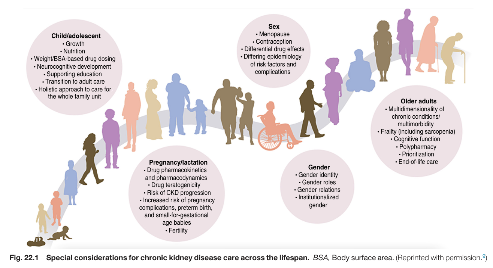
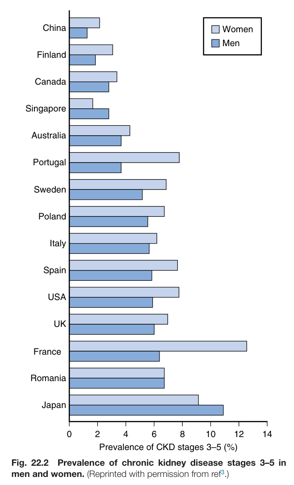
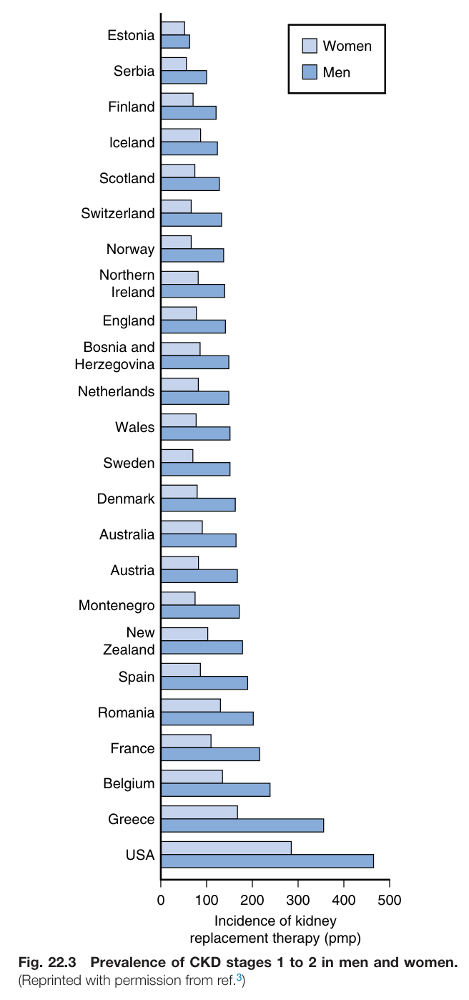
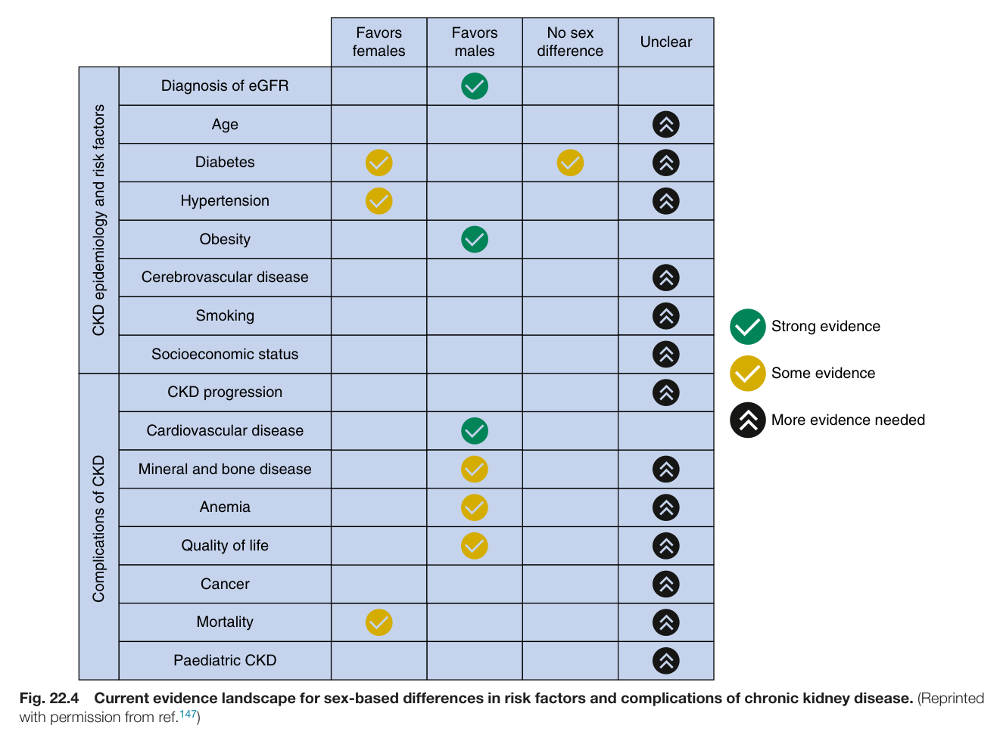
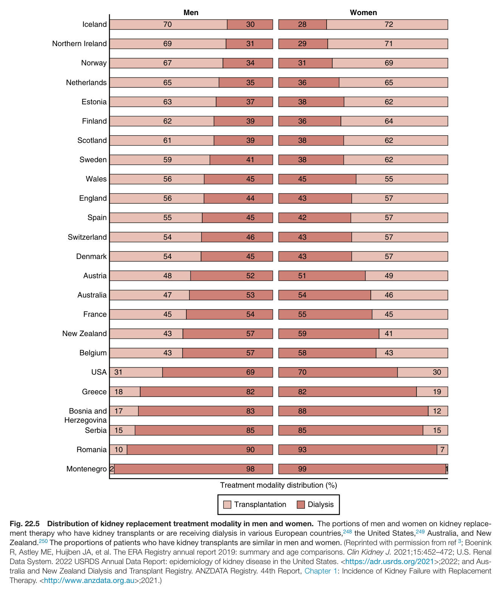
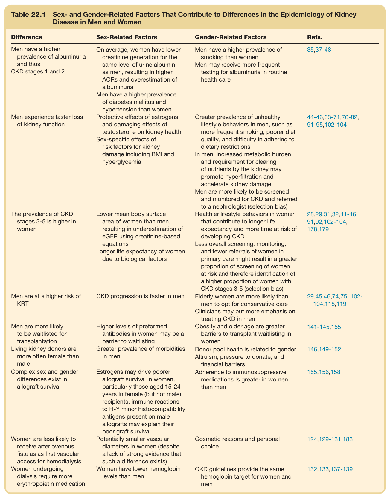
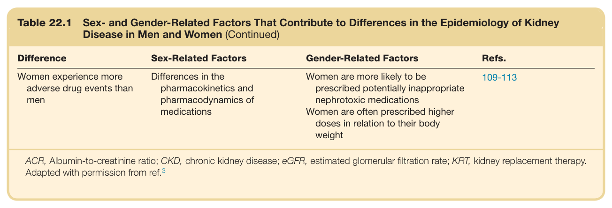

# 22. Sex and Gender in Kidney Health and Disease - Figures and Tables Index

This document lists all figures and tables extracted from `22. Sex and Gender in Kidney Health and Disease.pdf`.

## Table of Contents
- [Figures](#figures)
- [Tables](#tables)

---

## Figures

### Fig_22_1



Fig. 22.1 Special considerations for chronic kidney disease care across the lifespan. BSA, Body surface area. (Reprinted with permission.<sup>9</sup>)

---

### Fig_22_2



Fig. 22.2 Prevalence of chronic kidney disease stages 3–5 in men and women. (Reprinted with permission from ref<sup>3</sup>.)

---

### Fig_22_3



Fig. 22.3 Prevalence of CKD stages 1 to 2 in men and women. (Reprinted with permission from ref.<sup>3</sup>)

---

### Fig_22_4



Fig. 22.4 Current evidence landscape for sex-based differences in risk factors and complications of chronic kidney disease. (Reprinted with permission from ref.<sup>147</sup>)

---

### Fig_22_5



Fig. 22.5 Distribution of kidney replacement treatment modality in men and women. The portions of men and women on kidney replace- ment therapy who have kidney transplants or are receiving dialysis in various European countries,<sup>248</sup> the United States,<sup>249</sup> Australia, and New Zealand.<sup>250</sup> The proportions of patients who have kidney transplants are similar in men and women. (Reprinted with permission from ref <sup>3</sup>; Boenink R, Astley ME, Huijben JA, et al. The ERA Registry annual report 2019: summary and age comparisons. Clin Kidney J. 2021;15:452–472; U.S. Rena Data System. 2022 USRDS Annual Data Report: epidemiology of kidney disease in the United States. <https://adr.usrds.org/2021>;2022; and Aus tralia and New Zealand Dialysis and Transplant Registry. ANZDATA Registry. 44th Report, Chapter 1: Incidence of Kidney Failure with Replacement Therapy. <http://www.anzdata.org.au>;2021.)

---

## Tables

### Table_22_1

#### Table Images (2 Parts)

- **Part 1 (Page 2)**:
  

- **Part 2 (Page 3)**:
  

#### Table Data (CSV: [Table_22_1.csv](Table_22_1.csv))

```markdown
| Table Text (OCR) |
| :--- |
| Table 22.1  Sex- and Gender-Related Factors That Contribute to Differences in the Epidemiology of Kidney Disease in Men and Women Difference  Sex-Related Factors  Gender-Related Factors  Refs.    Men have a higher prevalence of albuminuria and thusCKD stages 1 and 2  On average, women have lower creatinine generation for the same level of urine albumin as men, resulting in higher ACRs and overestimation of albuminuriaMen have a higher prevalence of diabetes mellitus and hypertension than women  Men have a higher prevalence of smoking than womenMen may receive more frequent testing for albuminuria in routine health care  35,37-48    Men experience faster loss of kidney function  Protective effects of estrogens and damaging effects of testosterone on kidney healthSex-specific effects of risk factors for kidney damage including BMI and hyperglycemia  Greater prevalence of unhealthy lifestyle behaviors In men, such as more frequent smoking, poorer diet quality, and difficulty in adhering to dietary restrictionsIn men, increased metabolic burden and requirement for clearing of nutrients by the kidney may promote hyperfiltration and accelerate kidney damageMen are more likely to be screened and monitored for CKD and referred to a nephrologist (selection bias)  44-46,63-71,76-82,91-95,102-104    The prevalence of CKD stages 3-5 is higher in women  Lower mean body surface area of women than men, resulting in underestimation of eGFR using creatinine-based equationsLonger life expectancy of women due to biological factors  Healthier lifestyle behaviors in women that contribute to longer life expectancy and more time at risk of developing CKDLess overall screening, monitoring, and fewer referrals of women in primary care might result in a greater proportion of screening of women at risk and therefore identification of a higher proportion of women with CKD stages 3-5 (selection bias)  28,29,31,32,41-46,91,92,102-104,178,179    Men are at a higher risk of KRT  CKD progression is faster in men  Elderly women are more likely than men to opt for conservative careClinicians may put more emphasis on treating CKD in men  29,45,46,74,75,102-104,118,119    Men are more likely to be waitlisted for transplantation  Higher levels of preformed antibodies in women may be a barrier to waitlisting  Obesity and older age are greater barriers to transplant waitlisting in women  141-145,155    Living kidney donors are more often female than male  Greater prevalence of morbidities in men  Donor pool health is related to genderAltruism, pressure to donate, and financial barriers  146,149-152    Complex sex and gender differences exist in allograft survival  Estrogens may drive poorer allograft survival in women, particularly those aged 15-24 years In female (but not male) recipients, immune reactions to H-Y minor histocompatibility antigens present on male allografts may explain their poor graft survival  Adherence to immunosuppressive medications Is greater in women than men  155,156,158    Women are less likely to receive arteriovenous fistulas as first vascular access for hemodialysis  Potentially smaller vascular diameters in women (despite a lack of strong evidence that such a difference exists)  Cosmetic reasons and personal choice  124,129-131,183    Women undergoing dialysis require more erythropoietin medication  Women have lower hemoglobin levels than men  CKD guidelines provide the same hemoglobin target for women and men  132,133,137-139    Women experience more adverse drug events than men  Differences in the pharmacokinetics and pharmacodynamics of medications  Women are more likely to be prescribed potentially inappropriate nephrotoxic medicationsWomen are often prescribed higher doses in relation to their body weight  109-113 ACR, Albumin-to-creatinine ratio; CKD, chronic kidney disease; eGFR, estimated glomerular filtration rate; KRT, kidney replacement therapy. Adapted with permission from ref.<sup>3</sup> |
```

Table 22.1 Sex- and Gender-Related Factors That Contribute to Differences in the Epidemiology of Kidney Disease in Men and Women

---
