# 23. Laboratory Assessment of Kidney Disease_ Glomerular Filtration Rate, Proteinuria, and Urinalysis - Figures and Tables Index

This document lists all figures and tables extracted from `23. Laboratory Assessment of Kidney Disease_ Glomerular Filtration Rate, Proteinuria, and Urinalysis.pdf`.

## Table of Contents
- [Figures](#figures)
- [Tables](#tables)

---

## Figures

### Fig_23_1

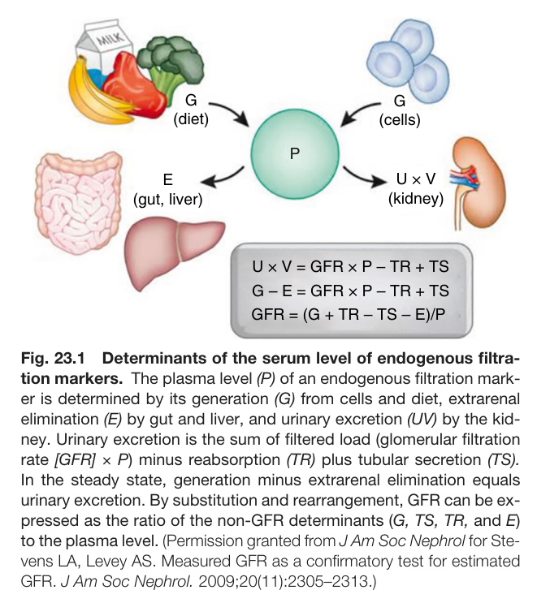

Fig. 23.1 Determinants of the serum level of endogenous filtra- tion markers. The plasma level (P) of an endogenous filtration mark- er is determined by its generation (G) from cells and diet, extrarenal elimination (E) by gut and liver, and urinary excretion (UV) by the kid- ney. Urinary excretion is the sum of filtered load (glomerular filtration rate [GFR] × P) minus reabsorption (TR) plus tubular secretion (TS). In the steady state, generation minus extrarenal elimination equals urinary excretion. By substitution and rearrangement, GFR can be ex- pressed as the ratio of the non-GFR determinants (G, TS, TR, and E) to the plasma level. (Permission granted from J Am Soc Nephrol for Ste- vens LA, Levey AS. Measured GFR as a confirmatory test for estimated GFR. J Am Soc Nephrol. 2009;20(11):2305–2313.)

---

### Fig_23_2

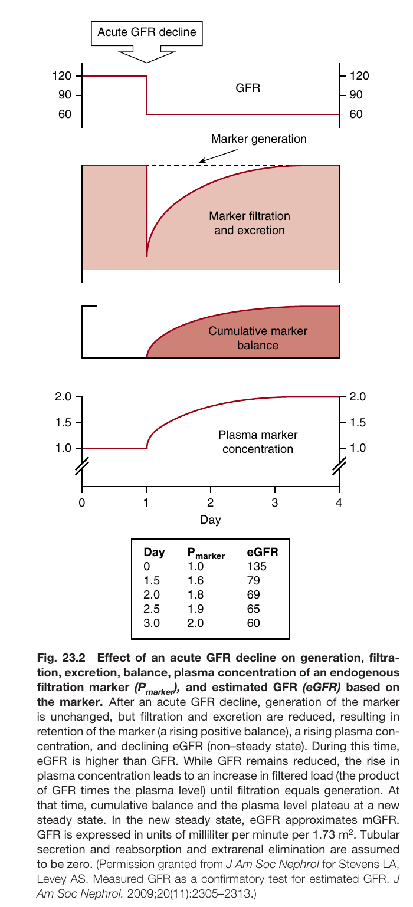

Fig. 23.2 Effect of an acute GFR decline on generation, filtra- tion, excretion, balance, plasma concentration of an endogenous filtration marker (P<sub>marker</sub>), and estimated GFR (eGFR) based on the marker. After an acute GFR decline, generation of the marker is unchanged, but filtration and excretion are reduced, resulting in retention of the marker (a rising positive balance), a rising plasma con- centration, and declining eGFR (non–steady state). During this time, eGFR is higher than GFR. While GFR remains reduced, the rise in plasma concentration leads to an increase in filtered load (the product of GFR times the plasma level) until filtration equals generation. At that time, cumulative balance and the plasma level plateau at a new steady state. In the new steady state, eGFR approximates mGFR. GFR is expressed in units of milliliter per minute per 1.73 m<sup>2</sup>. Tubular secretion and reabsorption and extrarenal elimination are assumed to be zero. (Permission granted from J Am Soc Nephrol for Stevens LA, Levey AS. Measured GFR as a confirmatory test for estimated GFR. J Am Soc Nephrol. 2009;20(11):2305–2313.)

---

### Fig_23_3

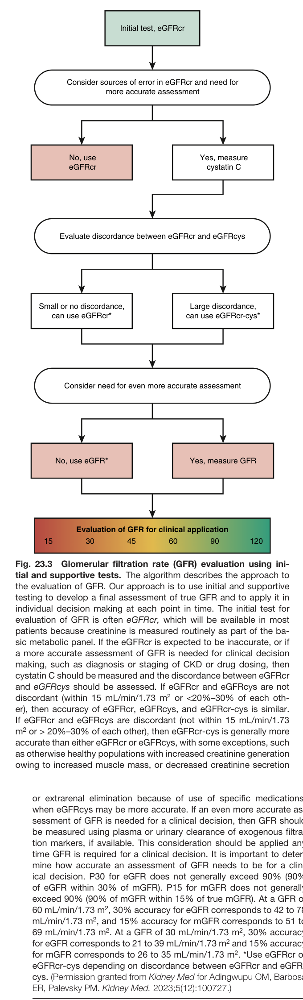

Fig. 23.3 Glomerular filtration rate (GFR) evaluation using ini- tial and supportive tests. The algorithm describes the approach to the evaluation of GFR. Our approach is to use initial and supportive testing to develop a final assessment of true GFR and to apply it in individual decision making at each point in time. The initial test for evaluation of GFR is often eGFRcr, which will be available in most patients because creatinine is measured routinely as part of the ba- sic metabolic panel. If the eGFRcr is expected to be inaccurate, or if a more accurate assessment of GFR is needed for clinical decision making, such as diagnosis or staging of CKD or drug dosing, then cystatin C should be measured and the discordance between eGFRcr and eGFRcys should be assessed. If eGFRcr and eGFRcys are not discordant (within 15 mL/min/1.73 m<sup>2</sup> or <20%–30% of each oth- er), then accuracy of eGFRcr, eGFRcys, and eGFRcr-cys is similar. If eGFRcr and eGFRcys are discordant (not within 15 mL/min/1.73 m<sup>2</sup> or > 20%–30% of each other), then eGFRcr-cys is generally more accurate than either eGFRcr or eGFRcys, with some exceptions, such as otherwise healthy populations with increased creatinine generation owing to increased muscle mass, or decreased creatinine secretion

---

### Fig_23_4

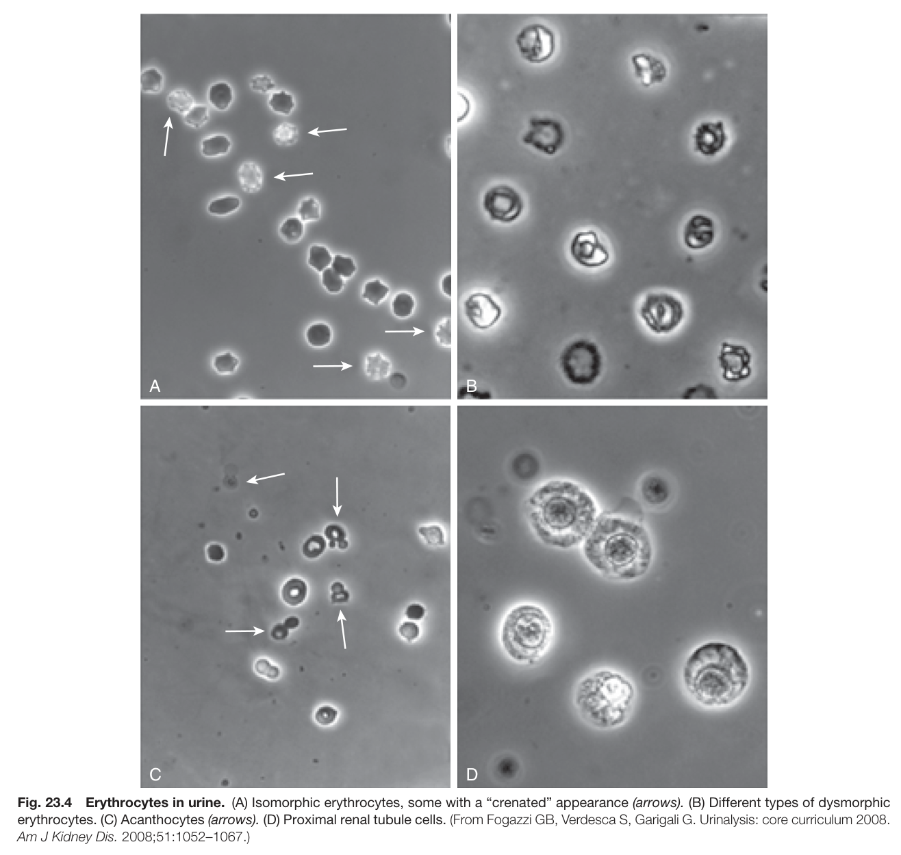

Fig. 23.4 Erythrocytes in urine. (A) Isomorphic erythrocytes, some with a “crenated” appearance (arrows). (B) Different types of dysmorphic erythrocytes. (C) Acanthocytes (arrows). (D) Proximal renal tubule cells. (From Fogazzi GB, Verdesca S, Garigali G. Urinalysis: core curriculum 2008. Am J Kidney Dis. 2008;51:1052–1067.)

---

### Fig_23_5

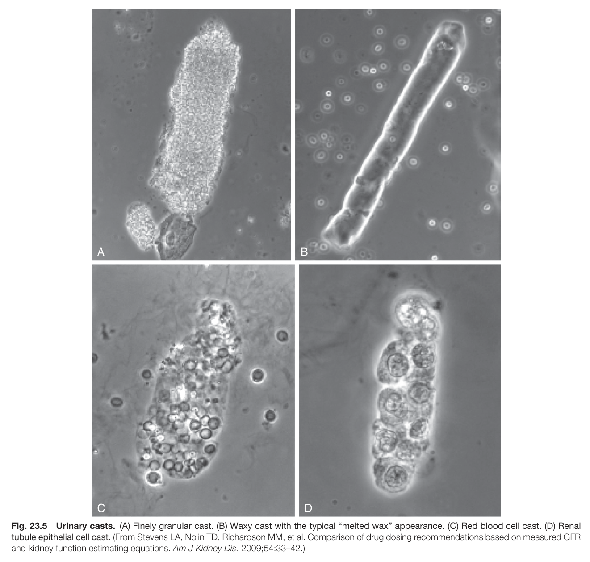

Fig. 23.5 Urinary casts. (A) Finely granular cast. (B) Waxy cast with the typical “melted wax” appearance. (C) Red blood cell cast. (D) Rena tubule epithelial cell cast. (From Stevens LA, Nolin TD, Richardson MM, et al. Comparison of drug dosing recommendations based on measured GFR and kidney function estimating equations. Am J Kidney Dis. 2009;54:33–42.)

---

### Fig_23_6

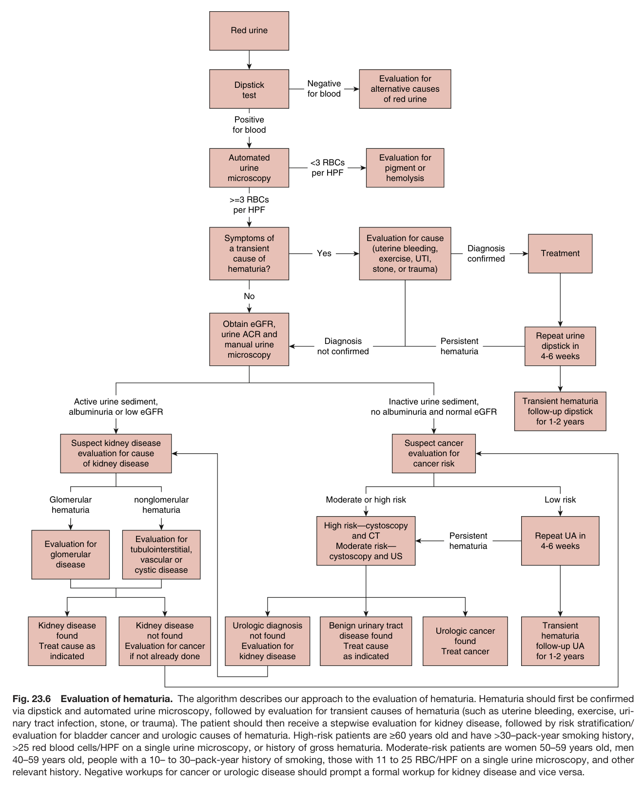

Fig. 23.6 Evaluation of hematuria. The algorithm describes our approach to the evaluation of hematuria. Hematuria should first be confirmed via dipstick and automated urine microscopy, followed by evaluation for transient causes of hematuria (such as uterine bleeding, exercise, uri- nary tract infection, stone, or trauma). The patient should then receive a stepwise evaluation for kidney disease, followed by risk stratification/ evaluation for bladder cancer and urologic causes of hematuria. High-risk patients are ≥60 years old and have >30–pack-year smoking history, >25 red blood cells/HPF on a single urine microscopy, or history of gross hematuria. Moderate-risk patients are women 50–59 years old, men 40–59 years old, people with a 10– to 30–pack-year history of smoking, those with 11 to 25 RBC/HPF on a single urine microscopy, and other relevant history. Negative workups for cancer or urologic disease should prompt a formal workup for kidney disease and vice versa.

---

## Tables

### Table_23_1

#### Table Image

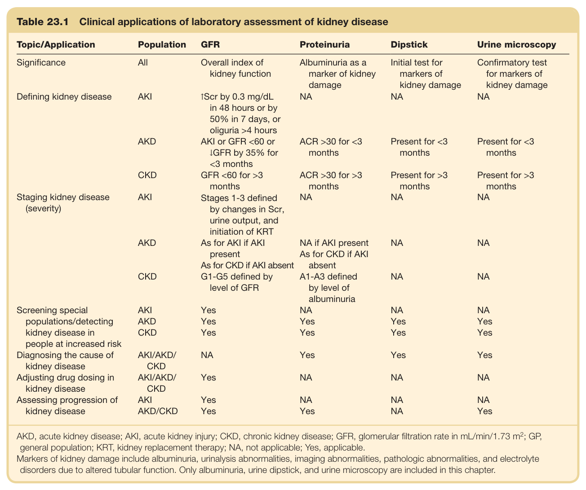

#### Table Data (CSV: [Table_23_1.csv](Table_23_1.csv))

```markdown
| Table Text (OCR) |
| :--- |
| Table 23.1  Clinical applications of laboratory assessment of kidney disease Topic/Application  Population  GFR  Proteinuria  Dipstick  Urine microscopy    Significance  All  Overall index of kidney function  Albuminuria as a marker of kidney damage  Initial test for markers of kidney damage  Confirmatory test for markers of kidney damage    Defining kidney disease  AKI  ↑Scr by 0.3 mg/dL in 48 hours or by 50% in 7 days, or oliguria >4 hours  NA  NA  NA    AKD  AKI or GFR <60 or ↓GFR by 35% for <3 months  ACR >30 for <3 months  Present for <3 months  Present for <3 months    CKD  GFR <60 for >3 months  ACR >30 for >3 months  Present for >3 months  Present for >3 months    Staging kidney disease (severity)  AKI  Stages 1-3 defined by changes in Scr, urine output, and initiation of KRT  NA  NA  NA    AKD  As for AKI if AKI present  NA if AKI present As for CKD if AKI absent  NA  NA    CKD  As for CKD if AKI absent G1-G5 defined by level of GFR  A1-A3 defined by level of albuminuria  NA  NA    Screening special populations/detecting kidney disease in people at increased risk  AKI  Yes  NA  NA  NA    AKD  Yes  Yes  Yes  Yes    CKD  Yes  Yes  Yes  Yes    Diagnosing the cause of kidney disease  AKI/AKD/CKD  NA  Yes  Yes  Yes    Adjusting drug dosing in kidney disease  AKI/AKD/CKD  Yes  NA  NA  NA    Assessing progression of kidney disease  AKI  Yes  NA  NA  NA    AKD/CKD  Yes  Yes  NA  Yes AKD, acute kidney disease; AKI, acute kidney injury; CKD, chronic kidney disease; GFR, glomerular filtration rate in mL/min/1.73 m<sup>2</sup>; GP, general population; KRT, kidney replacement therapy; NA, not applicable; Yes, applicable. Markers of kidney damage include albuminuria, urinalysis abnormalities, imaging abnormalities, pathologic abnormalities, and electrolyte disorders due to altered tubular function. Only albuminuria, urine dipstick, and urine microscopy are included in this chapter. |
```

Table 23.1 Clinical applications of laboratory assessment of kidney disease

---

### Table_23_2

#### Table Image

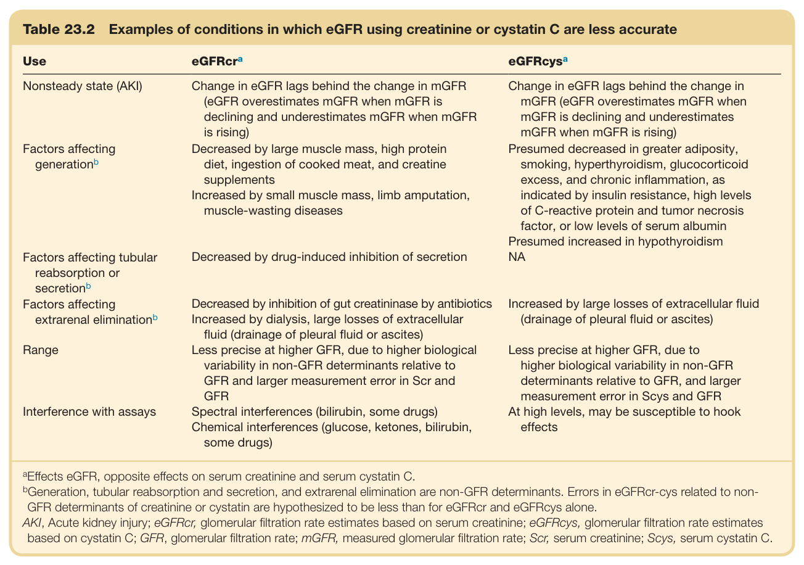

#### Table Data (CSV: [Table_23_2.csv](Table_23_2.csv))

```markdown
| Table Text (OCR) |
| :--- |
| Table 23.2 Examples of conditions in which eGFR using creatinine or cystatin C are less accurate Use  eGFRcra  eGFRcysa    Nonsteady state (AKI)  Change in eGFR lags behind the change in mGFR (eGFR overestimates mGFR when mGFR is declining and underestimates mGFR when mGFR is rising)  Change in eGFR lags behind the change in mGFR (eGFR overestimates mGFR when mGFR is declining and underestimates mGFR when mGFR is rising)    Factors affecting generationb  Decreased by large muscle mass, high protein diet, ingestion of cooked meat, and creatine supplementsIncreased by small muscle mass, limb amputation, muscle-wasting diseases  Presumed decreased in greater adiposity, smoking, hyperthyroidism, glucocorticoid excess, and chronic inflammation, as indicated by insulin resistance, high levels of C-reactive protein and tumor necrosis factor, or low levels of serum albuminPresumed increased in hypothyroidism    Factors affecting tubular reabsorption or secretionb  Decreased by drug-induced inhibition of secretion  NA    Factors affecting extrarenal eliminationb  Decreased by inhibition of gut creatininase by antibioticsIncreased by dialysis, large losses of extracellular fluid (drainage of pleural fluid or ascites)  Increased by large losses of extracellular fluid (drainage of pleural fluid or ascites)    Range  Less precise at higher GFR, due to higher biological variability in non-GFR determinants relative to GFR and larger measurement error in Scr and GFR  Less precise at higher GFR, due to higher biological variability in non-GFR determinants relative to GFR, and larger measurement error in Scys and GFR    Interference with assays  Spectral interferences (bilirubin, some drugs)Chemical interferences (glucose, ketones, bilirubin, some drugs)  At high levels, may be susceptible to hook effects <sup>a</sup>Effects eGFR, opposite effects on serum creatinine and serum cystatin C. <sup>b</sup>Generation, tubular reabsorption and secretion, and extrarenal elimination are non-GFR determinants. Errors in eGFRcr-cys related to non- GFR determinants of creatinine or cystatin are hypothesized to be less than for eGFRcr and eGFRcys alone. AKI, Acute kidney injury; eGFRcr, glomerular filtration rate estimates based on serum creatinine; eGFRcys, glomerular filtration rate estimates based on cystatin C; GFR, glomerular filtration rate; mGFR, measured glomerular filtration rate; Scr, serum creatinine; Scys, serum cystatin C. |
```

Table 23.2 Examples of conditions in which eGFR using creatinine or cystatin C are less accurate

---

### Table_23_3

#### Table Image

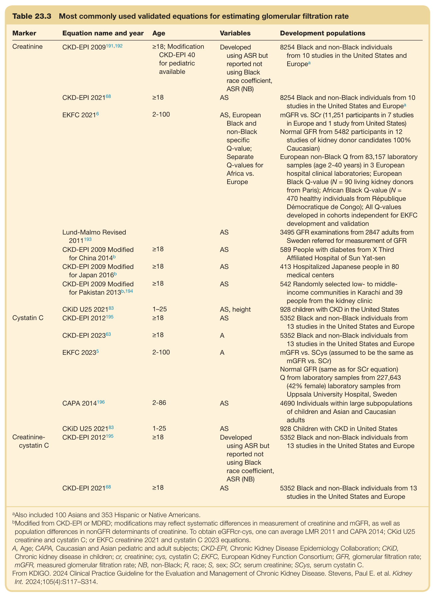

#### Table Data (CSV: [Table_23_3.csv](Table_23_3.csv))

```markdown
| Table Text (OCR) |
| :--- |
| Table 23.3 Most commonly used validated equations for estimating glomerular filtration rate Marker  Equation name and year  Age  Variables  Development populations    Creatinine   CKD-EPI 2009^{191,192}   ≥18; Modification CKD-EPI 40 for pediatric available  Developed using ASR but reported not using Black race coefficient, ASR (NB)  8254 Black and non-Black individuals from 10 studies in the United States and  Europe^a      CKD-EPI 2021^{68}   ≥18  AS  8254 Black and non-Black individuals from 10 studies in the United States and  Europe^a      EKFC 2021^6   2-100  AS, European Black and non-Black specific Q-value; Separate Q-values for Africa vs. Europe  mGFR vs. SCr (11,251 participants in 7 studies in Europe and 1 study from United States)Normal GFR from 5482 participants in 12 studies of kidney donor candidates 100% Caucasian)European non-Black Q from 83,157 laboratory samples (age 2-40 years) in 3 European hospital clinical laboratories; European Black Q-value (N = 90 living kidney donors from Paris); African Black Q-value (N = 470 healthy individuals from République Démocratique de Congo); All Q-values developed in cohorts independent for EKFC development and validation    Lund-Malmo Revised  2011^{193}     AS  3495 GFR examinations from 2847 adults from Sweden referred for measurement of GFR     CKD-EPI 2009 Modified for China 2014^b   ≥18  AS  589 People with diabetes from X Third Affiliated Hospital of Sun Yat-sen     CKD-EPI 2009 Modified for Japan 2016^b   ≥18  AS  413 Hospitalized Japanese people in 80 medical centers     CKD-EPI 2009 Modified for Pakistan 2013^{b,194}   ≥18  AS  542 Randomly selected low- to middle-income communities in Karachi and 39 people from the kidney clinic    Cystatin C   CKiD U25 2021^{83}   1-25  AS, height  928 children with CKD in the United States     CKD-EPI 2012^{195}   ≥18  AS  5352 Black and non-Black individuals from 13 studies in the United States and Europe     CKD-EPI 2023^{63}   ≥18  A  5352 Black and non-Black individuals from 13 studies in the United States and Europe     EKFC 2023^5   2-100  A  mGFR vs. SCys (assumed to be the same as mGFR vs. SCr)Normal GFR (same as for SCr equation)Q from laboratory samples from 227,643 (42% female) laboratory samples from Uppsala University Hospital, Sweden     CAPA 2014^{196}   2-86  AS  4690 Individuals within large subpopulations of children and Asian and Caucasian adults    Creatinine-cystatin C   CKiD U25 2021^{83}   1-25  AS  928 Children with CKD in United States     CKD-EPI 2012^{195}   ≥18  Developed using ASR but reported not using Black race coefficient, ASR (NB)  5352 Black and non-Black individuals from 13 studies in the United States and Europe     CKD-EPI 2021^{68}   ≥18  AS  5352 Black and non-Black individuals from 13 studies in the United States and Europe <sup>a</sup>Also included 100 Asians and 353 Hispanic or Native Americans. <sup>b</sup>Modified from CKD-EPI or MDRD; modifications may reflect systematic differences in measurement of creatinine and mGFR, as well as population differences in nonGFR determinants of creatinine. To obtain eGFRcr-cys, one can average LMR 2011 and CAPA 2014; CKid U25 creatinine and cystatin C; or EKFC creatinine 2021 and cystatin C 2023 equations. A, Age; CAPA, Caucasian and Asian pediatric and adult subjects; CKD-EPI, Chronic Kidney Disease Epidemiology Collaboration; CKiD Chronic kidney disease in children; cr, creatinine; cys, cystatin C; EKFC, European Kidney Function Consortium; GFR, glomerular filtration rate; mGFR, measured glomerular filtration rate; NB, non-Black; R, race; S, sex; SCr, serum creatinine; SCys, serum cystatin C. From KDIGO. 2024 Clinical Practice Guideline for the Evaluation and Management of Chronic Kidney Disease. Stevens, Paul E. et al. Kidney Int. 2024;105(4):S117–S314. |
```

Table 23.3 Most commonly used validated equations for estimating glomerular filtration rate

---

### Table_23_4

#### Table Image

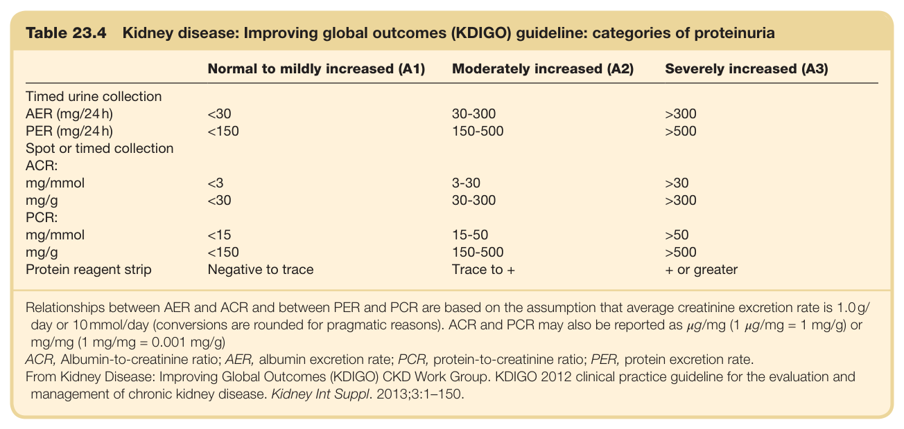

#### Table Data (CSV: [Table_23_4.csv](Table_23_4.csv))

```markdown
| Table Text (OCR) |
| :--- |
| Table 23.4  Kidney disease: Improving global outcomes (KDIGO) guideline: categories of proteinuria Normal to mildly increased (A1)  Moderately increased (A2)  Severely increased (A3)    Timed urine collection    AER (mg/24 h)  <30  30-300  >300    PER (mg/24 h)  <150  150-500  >500    Spot or timed collection    ACR:    mg/mmol  <3  3-30  >30    mg/g  <30  30-300  >300    PCR:    mg/mmol  <15  15-50  >50    mg/g  <150  150-500  >500    Protein reagent strip  Negative to trace  Trace to +  + or greater Relationships between AER and ACR and between PER and PCR are based on the assumption that average creatinine excretion rate is 1.0g/ day or 10mmol/day (conversions are rounded for pragmatic reasons). ACR and PCR may also be reported as μg/mg (1 μg/mg = 1 mg/g) or mg/mg (1 mg/mg = 0.001 mg/g) ACR, Albumin-to-creatinine ratio; AER, albumin excretion rate; PCR, protein-to-creatinine ratio; PER, protein excretion rate. From Kidney Disease: Improving Global Outcomes (KDIGO) CKD Work Group. KDIGO 2012 clinical practice guideline for the evaluation and management of chronic kidney disease. Kidney Int Suppl. 2013;3:1–150. |
```

Table 23.4 Kidney disease: Improving global outcomes (KDIGO) guideline: categories of proteinuria

---

### Table_23_5

#### Table Image

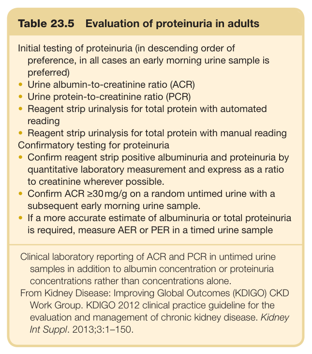

#### Table Data (CSV: [Table_23_5.csv](Table_23_5.csv))

```markdown
| Table Text (OCR) |
| :--- |
| Table 23.5 Evaluation of proteinuria in adults Initial testing of proteinuria (in descending order of preference, in all cases an early morning urine sample is preferred)    Urine albumin-to-creatinine ratio (ACR)    Urine protein-to-creatinine ratio (PCR)    Reagent strip urinalysis for total protein with automated reading    Reagent strip urinalysis for total protein with manual readingConfirmatory testing for proteinuria    Confirm reagent strip positive albuminuria and proteinuria by quantitative laboratory measurement and express as a ratio to creatinine wherever possible.    Confirm ACR ≥30 mg/g on a random untimed urine with a subsequent early morning urine sample.    If a more accurate estimate of albuminuria or total proteinuria is required, measure AER or PER in a timed urine sample Clinical laboratory reporting of ACR and PCR in untimed urine samples in addition to albumin concentration or proteinuria concentrations rather than concentrations alone. From Kidney Disease: Improving Global Outcomes (KDIGO) CKD Work Group. KDIGO 2012 clinical practice guideline for the evaluation and management of chronic kidney disease. Kidney Int Suppl. 2013;3:1–150. |
```

Table 23.5 Evaluation of proteinuria in adults

---

### Table_23_6

#### Table Image

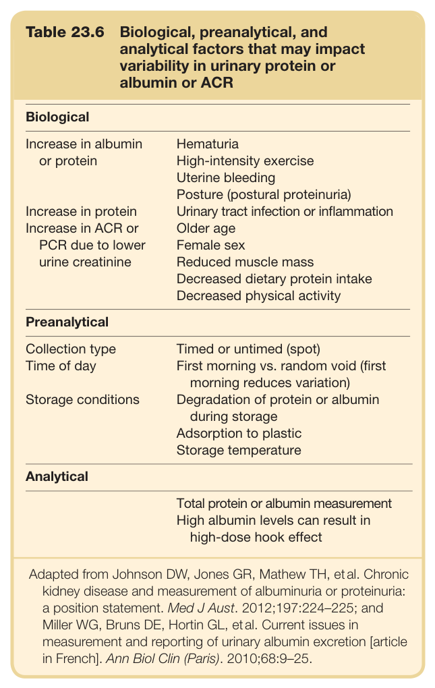

#### Table Data (CSV: [Table_23_6.csv](Table_23_6.csv))

```markdown
| Table Text (OCR) |
| :--- |
| Table 23.6 Biological, preanalytical, and analytical factors that may impact variability in urinary protein or albumin or ACR Biological    Increase in albumin or protein  HematuriaHigh-intensity exerciseUterine bleedingPosture (postural proteinuria)    Increase in protein  Urinary tract infection or inflammation    Increase in ACR or PCR due to lower urine creatinine  Older ageFemale sexReduced muscle massDecreased dietary protein intakeDecreased physical activity    Preanalytical    Collection type  Timed or untimed (spot)    Time of day  First morning vs. random void (first morning reduces variation)    Storage conditions  Degradation of protein or albumin during storageAdsorption to plasticStorage temperature    Analytical      Total protein or albumin measurementHigh albumin levels can result in high-dose hook effect    Adapted from Johnson DW, Jones GR, Mathew TH, et al. Chronic kidney disease and measurement of albuminuria or proteinuria: a position statement. Med J Aust. 2012;197:224-225; and Miller WG, Bruns DE, Hortin GL, et al. Current issues in measurement and reporting of urinary albumin excretion [article in French]. Ann Biol Clin (Paris). 2010;68:9-25. |
```

Table 23.6 Biological, preanalytical, and analytical factors that may impact variability in urinary protein or albumin or ACR

---

### Table_23_7

#### Table Image

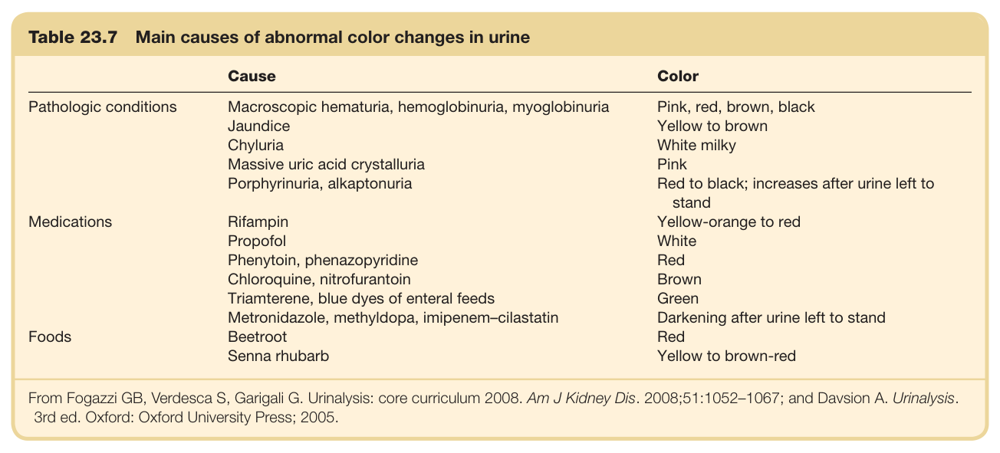

#### Table Data (CSV: [Table_23_7.csv](Table_23_7.csv))

```markdown
| Table Text (OCR) |
| :--- |
| Table 23.7 Main causes of abnormal color changes in urine Cause  Color    Pathologic conditions  Macroscopic hematuria, hemoglobinuria, myoglobinuria  Pink, red, brown, black    Jaundice  Yellow to brown    Chyluria  White milky    Massive uric acid crystalluria  Pink    Porphyrinuria, alkaptonuria  Red to black; increases after urine left to stand    Medications  Rifampin  Yellow-orange to red    Propofol  White    Phenytoin, phenazopyridine  Red    Chloroquine, nitrofurantoin  Brown    Triamterene, blue dyes of enteral feeds  Green    Metronidazole, methyldopa, imipenem-cilastatin  Darkening after urine left to stand    Foods  Beetroot  Red    Senna rhubarb  Yellow to brown-red From Fogazzi GB, Verdesca S, Garigali G. Urinalysis: core curriculum 2008. Am J Kidney Dis. 2008;51:1052–1067; and Davsion A. Urinalysis. 3rd ed. Oxford: Oxford University Press; 2005. |
```

Table 23.7 Main causes of abnormal color changes in urine

---

### Table_23_8

#### Table Image

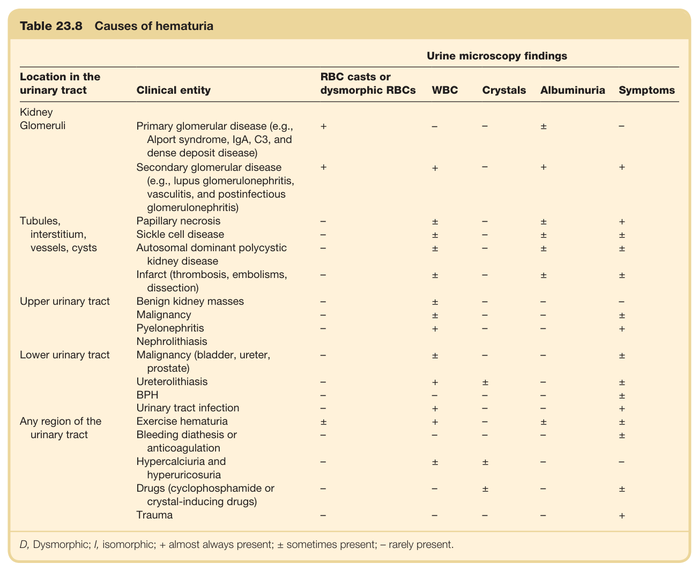

#### Table Data (CSV: [Table_23_8.csv](Table_23_8.csv))

```markdown
| Table Text (OCR) |
| :--- |
| Table 23.8  Causes of hematuria Location in the urinary tract  Clinical entity  RBC casts or dysmorphic RBCs  WBC  Crystals  Albuminuria  Symptoms    Kidney    Glomeruli  Primary glomerular disease (e.g., Alport syndrome, IgA, C3, and dense deposit disease)  +  -  -  ±  -    Secondary glomerular disease (e.g., lupus glomerulonephritis, vasculitis, and postinfectious glomerulonephritis)  +  +  -  +  +    Tubules, interstitium, vessels, cysts  Papillary necrosis  -  ±  -  ±  +    Sickle cell disease  -  ±  -  ±  ±    Autosomal dominant polycystic kidney disease  -  ±  -  ±  ±    Infarct (thrombosis, embolisms, dissection)  -  ±  -  ±  ±    Upper urinary tract  Benign kidney masses  -  ±  -  -  -    Malignancy  -  ±  -  -  ±    Pyelonephritis  -  +  -  -  +    Nephrolithiasis              Lower urinary tract  Malignancy (bladder, ureter, prostate)  -  ±  -  -  ±    Ureterolithiasis  -  +  ±  -  ±    BPH  -  -  -  -  ±    Urinary tract infection  -  +  -  -  +    Any region of the urinary tract  Exercise hematuria  ±  +  -  ±  ±    Bleeding diathesis or anticoagulation  -  -  -  -  ±    Hypercalciuria and hyperuricosuria  -  ±  ±  -  -    Drugs (cyclophosphamide or crystal-inducing drugs)  -  -  ±  -  ±    Trauma  -  -  -  -  + D, Dysmorphic; I, isomorphic; + almost always present; ± sometimes present; – rarely present. |
```

Table 23.8 Causes of hematuria

---

### Table_23_9

#### Table Image

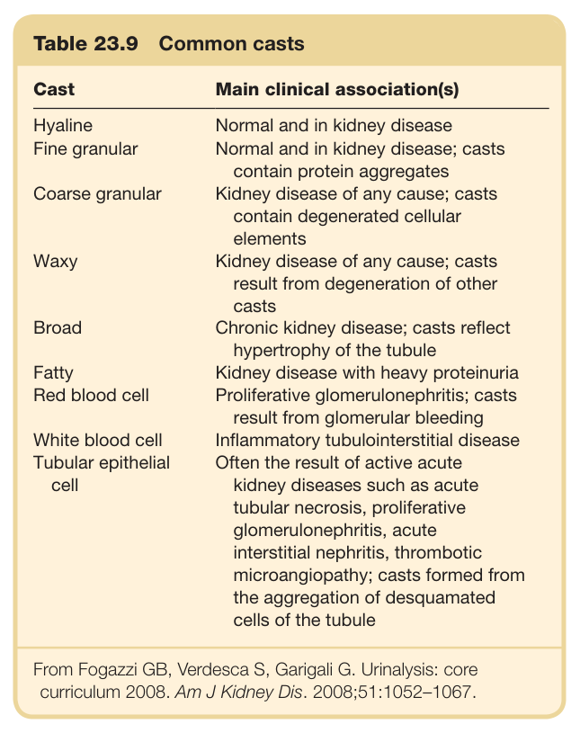

#### Table Data (CSV: [Table_23_9.csv](Table_23_9.csv))

```markdown
| Table Text (OCR) |
| :--- |
| Table 23.9 Common casts Cast  Main clinical association(s)    Hyaline  Normal and in kidney disease    Fine granular  Normal and in kidney disease; casts contain protein aggregates    Coarse granular  Kidney disease of any cause; casts contain degenerated cellular elements    Waxy  Kidney disease of any cause; casts result from degeneration of other casts    Broad  Chronic kidney disease; casts reflect hypertrophy of the tubule    Fatty  Kidney disease with heavy proteinuria    Red blood cell  Proliferative glomerulonephritis; casts result from glomerular bleeding    White blood cell  Inflammatory tubulointerstitial disease    Tubular epithelial cell  Often the result of active acute kidney diseases such as acute tubular necrosis, proliferative glomerulonephritis, acute interstitial nephritis, thrombotic microangiopathy; casts formed from the aggregation of desquamated cells of the tubule From Fogazzi GB, Verdesca S, Garigali G. Urinalysis: core curriculum 2008. Am J Kidney Dis. 2008;51:1052–1067. |
```

Table 23.9 Common casts

---

### Table_23_10

#### Table Image

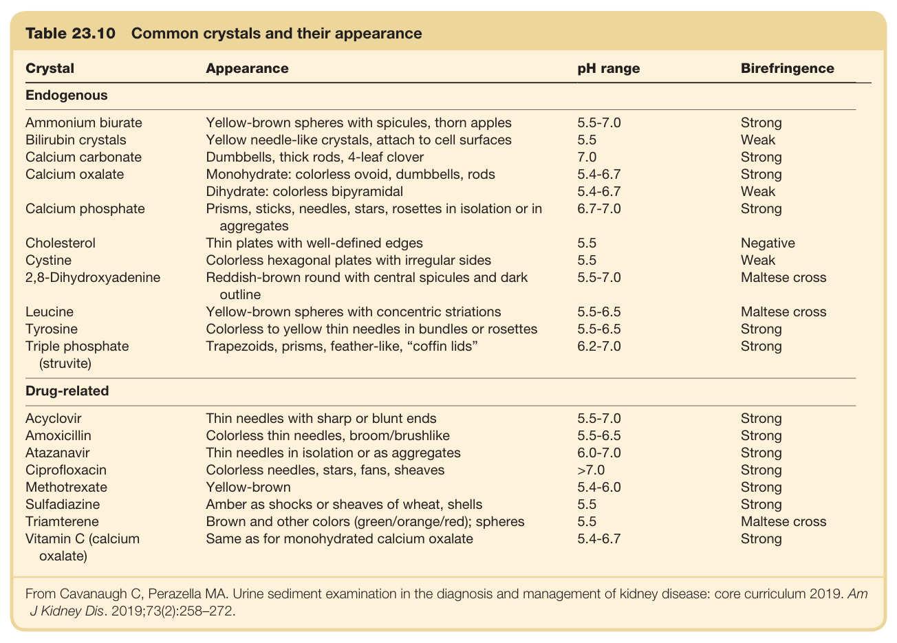

#### Table Data (CSV: [Table_23_10.csv](Table_23_10.csv))

```markdown
| Table Text (OCR) |
| :--- |
| Table 23.10  Common crystals and their appearance Crystal  Appearance  pH range  Birefringence    Endogenous    Ammonium biurate  Yellow-brown spheres with spicules, thorn apples  5.5-7.0  Strong    Bilirubin crystals  Yellow needle-like crystals, attach to cell surfaces  5.5  Weak    Calcium carbonate  Dumbbells, thick rods, 4-leaf clover  7.0  Strong    Calcium oxalate  Monohydrate: colorless ovoid, dumbbells, rods  5.4-6.7  Strong    Dihydrate: colorless bipyramidal  5.4-6.7  Weak    Calcium phosphate  Prisms, sticks, needles, stars, rosettes in isolation or in aggregates  6.7-7.0  Strong    Cholesterol  Thin plates with well-defined edges  5.5  Negative    Cystine  Colorless hexagonal plates with irregular sides  5.5  Weak    2,8-Dihydroxyadenine  Reddish-brown round with central spicules and dark outline  5.5-7.0  Maltese cross    Leucine  Yellow-brown spheres with concentric striations  5.5-6.5  Maltese cross    Tyrosine  Colorless to yellow thin needles in bundles or rosettes  5.5-6.5  Strong    Triple phosphate (struvite)  Trapezoids, prisms, feather-like, “coffin lids”  6.2-7.0  Strong    Drug-related    Acyclovir  Thin needles with sharp or blunt ends  5.5-7.0  Strong    Amoxicillin  Colorless thin needles, broom/brushlike  5.5-6.5  Strong    Atazanavir  Thin needles in isolation or as aggregates  6.0-7.0  Strong    Ciprofloxacin  Colorless needles, stars, fans, sheaves  >7.0  Strong    Methotrexate  Yellow-brown  5.4-6.0  Strong    Sulfadiazine  Amber as shocks or sheaves of wheat, shells  5.5  Strong    Triamterene  Brown and other colors (green/orange/red); spheres  5.5  Maltese cross    Vitamin C (calcium oxalate)  Same as for monohydrated calcium oxalate  5.4-6.7  Strong From Cavanaugh C, Perazella MA. Urine sediment examination in the diagnosis and management of kidney disease: core curriculum 2019. Am J Kidney Dis. 2019;73(2):258–272. |
```

Table 23.10 Common crystals and their appearance

---

### Table_23_11

#### Table Image

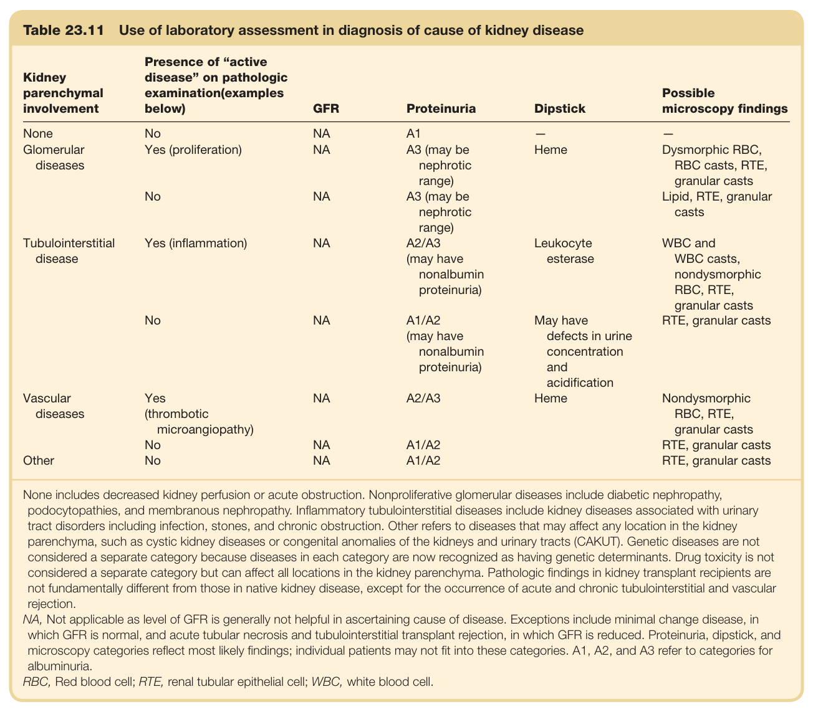

#### Table Data (CSV: [Table_23_11.csv](Table_23_11.csv))

```markdown
| Table Text (OCR) |
| :--- |
| Table 23.11  Use of laboratory assessment in diagnosis of cause of kidney disease Kidney parenchymal involvement  Presence of “active disease” on pathologic examination(examples below)  GFR  Proteinuria  Dipstick  Possible microscopy findings    None  No  NA  A1  —  —    Glomerular diseases  Yes (proliferation)  NA  A3 (may be nephrotic range)  Heme  Dysmorphic RBC, RBC casts, RTE, granular casts    No  NA  A3 (may be nephrotic range)    Lipid, RTE, granular casts    Tubulointerstitial disease  Yes (inflammation)  NA  A2/A3 (may have nonalbumin proteinuria)  Leukocyte esterase  WBC and WBC casts, nondysmorphic RBC, RTE, granular casts    No  NA  A1/A2 (may have nonalbumin proteinuria)  May have defects in urine concentration and acidification  RTE, granular casts    Vascular diseases  Yes (thrombotic microangiopathy)  NA  A2/A3  Heme  Nondysmorphic RBC, RTE, granular casts    No  NA  A1/A2    RTE, granular casts    Other  No  NA  A1/A2    RTE, granular casts None includes decreased kidney perfusion or acute obstruction. Nonproliferative glomerular diseases include diabetic nephropathy, podocytopathies, and membranous nephropathy. Inflammatory tubulointerstitial diseases include kidney diseases associated with urinary tract disorders including infection, stones, and chronic obstruction. Other refers to diseases that may affect any location in the kidney parenchyma, such as cystic kidney diseases or congenital anomalies of the kidneys and urinary tracts (CAKUT). Genetic diseases are not considered a separate category because diseases in each category are now recognized as having genetic determinants. Drug toxicity is not considered a separate category but can affect all locations in the kidney parenchyma. Pathologic findings in kidney transplant recipients are not fundamentally different from those in native kidney disease, except for the occurrence of acute and chronic tubulointerstitial and vascular rejection. NA, Not applicable as level of GFR is generally not helpful in ascertaining cause of disease. Exceptions include minimal change disease, in which GFR is normal, and acute tubular necrosis and tubulointerstitial transplant rejection, in which GFR is reduced. Proteinuria, dipstick, and microscopy categories reflect most likely findings; individual patients may not fit into these categories. A1, A2, and A3 refer to categories for albuminuria. RBC, Red blood cell; RTE, renal tubular epithelial cell; WBC, white blood cell. |
```

Table 23.11 Use of laboratory assessment in diagnosis of cause of kidney disease

---
