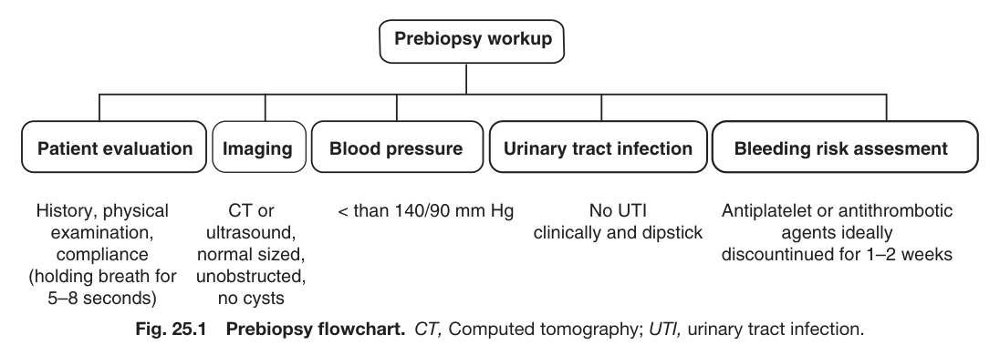
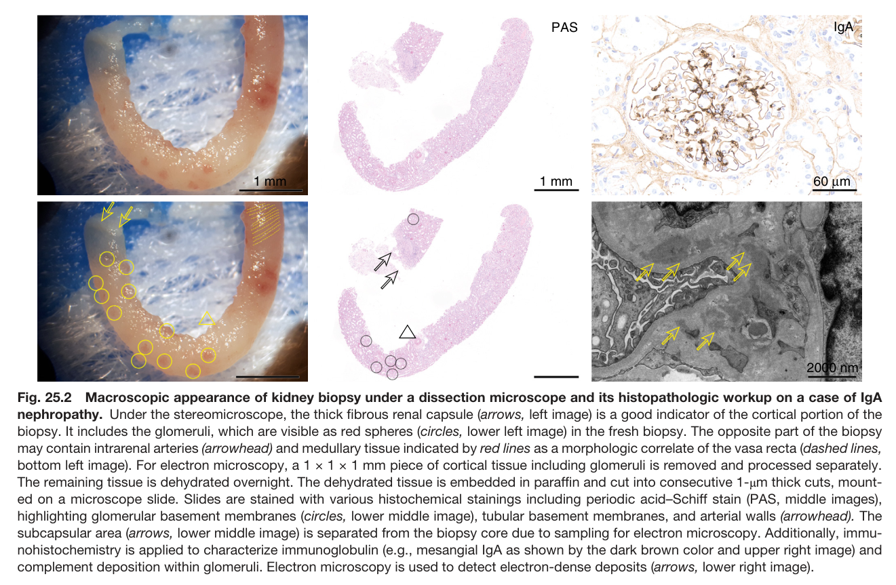
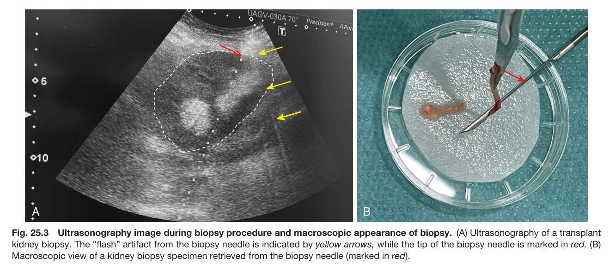
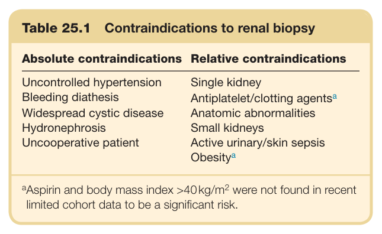
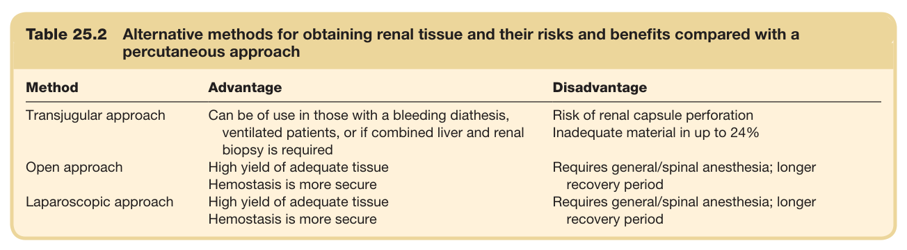
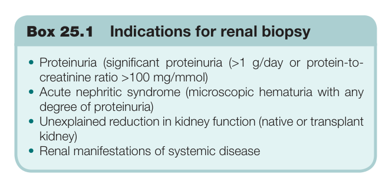
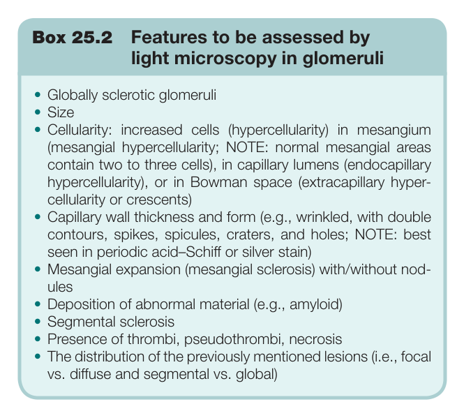
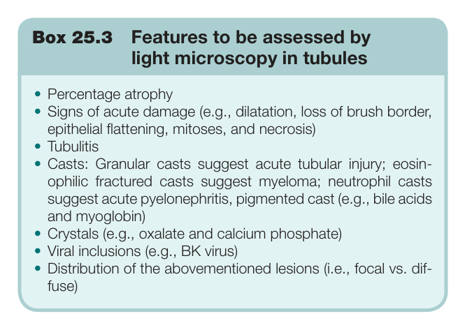
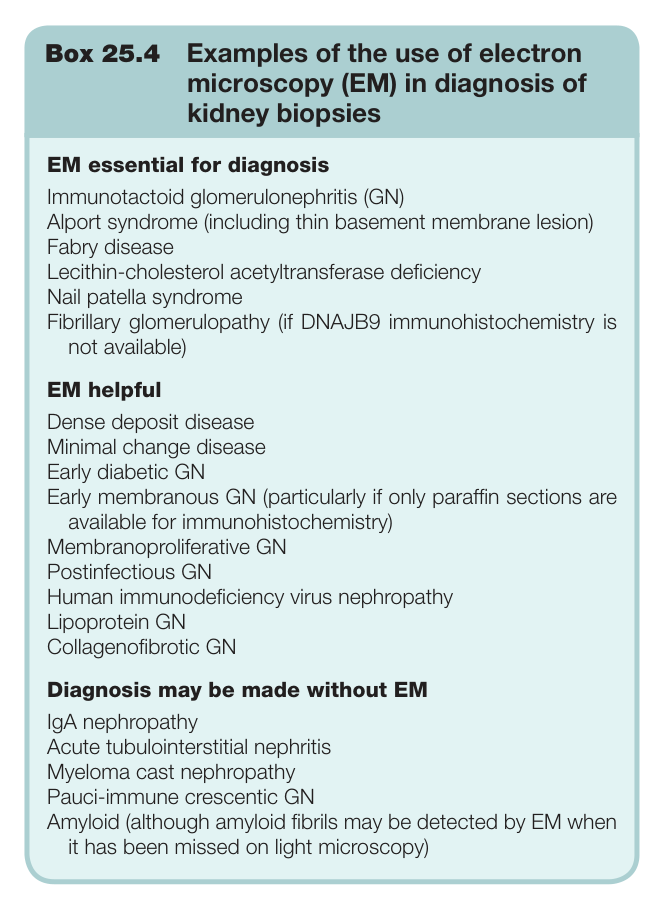

# 25. The Renal Biopsy - Figures and Tables Index

This document lists all figures, tables and boxes extracted from `25. The Renal Biopsy.pdf`.

## Table of Contents
- [Figures](#figures)
- [Tables](#tables)
- [Boxes](#boxes)

---

## Figures

### Fig_25_1



Fig. 25.1 Prebiopsy flowchart. CT, Computed tomography; UTI, urinary tract infection.

---

### Fig_25_2



Fig. 25.2 Macroscopic appearance of kidney biopsy under a dissection microscope and its histopathologic workup on a case of IgA nephropathy. Under the stereomicroscope, the thick fibrous renal capsule (arrows, left image) is a good indicator of the cortical portion of the biopsy. It includes the glomeruli, which are visible as red spheres (circles, lower left image) in the fresh biopsy. The opposite part of the biopsy may contain intrarenal arteries (arrowhead) and medullary tissue indicated by red lines as a morphologic correlate of the vasa recta (dashed lines, bottom left image). For electron microscopy, a 1 × 1 × 1 mm piece of cortical tissue including glomeruli is removed and processed separately. The remaining tissue is dehydrated overnight. The dehydrated tissue is embedded in paraffin and cut into consecutive 1-μm thick cuts, mount ed on a microscope slide. Slides are stained with various histochemical stainings including periodic acid–Schiff stain (PAS, middle images), highlighting glomerular basement membranes (circles, lower middle image), tubular basement membranes, and arterial walls (arrowhead). The subcapsular area (arrows, lower middle image) is separated from the biopsy core due to sampling for electron microscopy. Additionally, immu- nohistochemistry is applied to characterize immunoglobulin (e.g., mesangial IgA as shown by the dark brown color and upper right image) and complement deposition within glomeruli. Electron microscopy is used to detect electron-dense deposits (arrows, lower right image).

---

### Fig_25_3



Fig. 25.3 Ultrasonography image during biopsy procedure and macroscopic appearance of biopsy. (A) Ultrasonography of a transplant kidney biopsy. The “flash” artifact from the biopsy needle is indicated by yellow arrows, while the tip of the biopsy needle is marked in red. (B) Macroscopic view of a kidney biopsy specimen retrieved from the biopsy needle (marked in red).

---

## Tables

### Table_25_1

#### Table Image



#### Table Data (CSV: [Table_25_1.csv](Table_25_1.csv))

```markdown
| Table Text (OCR) |
| :--- |
| Table 25.1  Contraindications to renal biopsy Absolute contraindications  Relative contraindications    Uncontrolled hypertension  Single kidney    Bleeding diathesis  Antiplatelet/clotting agents ^{a}     Widespread cystic disease  Anatomic abnormalities    Hydronephrosis  Small kidneys    Uncooperative patient  Active urinary/skin sepsisObesity ^{a} <sup>a</sup>Aspirin and body mass index >40kg/m<sup>2</sup> were not found in recent limited cohort data to be a significant risk. |
```

Table 25.1 Contraindications to renal biopsy

---

### Table_25_2

#### Table Image



#### Table Data (CSV: [Table_25_2.csv](Table_25_2.csv))

```markdown
| Table Text (OCR) |
| :--- |
| Table 25.2 Alternative methods for obtaining renal tissue and their risks and benefits compared with a percutaneous approach Method  Advantage  Disadvantage    Transjugular approach  Can be of use in those with a bleeding diathesis, ventilated patients, or if combined liver and renal biopsy is required  Risk of renal capsule perforationInadequate material in up to 24%    Open approach  High yield of adequate tissueHemostasis is more secure  Requires general/spinal anesthesia; longer recovery period    Laparoscopic approach  High yield of adequate tissueHemostasis is more secure  Requires general/spinal anesthesia; longer recovery period |
```

Table 25.2 Alternative methods for obtaining renal tissue and their risks and benefits compared with a percutaneous approach

---

## Boxes

### Box_25_1



#### Box Text

```markdown
Box 25.1 Indications for renal biopsy • Proteinuria (significant proteinuria (>1 g/day or protein-to- creatinine ratio >100 mg/mmol) • Acute nephritic syndrome (microscopic hematuria with any degree of proteinuria) • Unexplained reduction in kidney function (native or transplant kidney) • Renal manifestations of systemic disease
```

Box 25.1 Indications for renal biopsy

---

### Box_25_2



#### Box Text

```markdown
Box 25.2 Features to be assessed by light microscopy in glomeruli • Globally sclerotic glomeruli • Size • Cellularity: increased cells (hypercellularity) in mesangium (mesangial hypercellularity; NOTE: normal mesangial areas contain two to three cells), in capillary lumens (endocapillary hypercellularity), or in Bowman space (extracapillary hyper- cellularity or crescents) • Capillary wall thickness and form (e.g., wrinkled, with double contours, spikes, spicules, craters, and holes; NOTE: best seen in periodic acid–Schiff or silver stain) • Mesangial expansion (mesangial sclerosis) with/without nod- ules • Deposition of abnormal material (e.g., amyloid) • Segmental sclerosis • Presence of thrombi, pseudothrombi, necrosis • The distribution of the previously mentioned lesions (i.e., focal vs. diffuse and segmental vs. global)
```

Box 25.2 Features to be assessed by light microscopy in glomeruli

---

### Box_25_3



#### Box Text

```markdown
Box 25.3 Features to be assessed by light microscopy in tubules • Percentage atrophy • Signs of acute damage (e.g., dilatation, loss of brush border, epithelial flattening, mitoses, and necrosis) • Tubulitis • Casts: Granular casts suggest acute tubular injury; eosin- ophilic fractured casts suggest myeloma; neutrophil casts suggest acute pyelonephritis, pigmented cast (e.g., bile acids and myoglobin) • Crystals (e.g., oxalate and calcium phosphate) • Viral inclusions (e.g., BK virus) • Distribution of the abovementioned lesions (i.e., focal vs. dif- fuse)
```

Box 25.3 Features to be assessed by light microscopy in tubules

---

### Box_25_4



#### Box Text

```markdown
Box 25.4 Examples of the use of electron microscopy (EM) in diagnosis of kidney biopsies EM essential for diagnosis Immunotactoid glomerulonephritis (GN) Alport syndrome (including thin basement membrane lesion) Fabry disease Lecithin-cholesterol acetyltransferase deficiency Nail patella syndrome Fibrillary glomerulopathy (if DNAJB9 immunohistochemistry is not available) EM helpful Dense deposit disease Minimal change disease Early diabetic GN Early membranous GN (particularly if only paraffin sections are available for immunohistochemistry) Membranoproliferative GN Postinfectious GN Human immunodeficiency virus nephropathy Lipoprotein GN Collagenofibrotic GN Diagnosis may be made without EM IgA nephropathy Acute tubulointerstitial nephritis Myeloma cast nephropathy Pauci-immune crescentic GN Amyloid (although amyloid fibrils may be detected by EM when it has been missed on light microscopy)
```

Box 25.4 Examples of the use of electron microscopy (EM) in diagnosis of kidney biopsies

---
