# 26. Point-of-Care Ultrasound - Figures and Tables Index

This document lists all figures and tables extracted from `26. Point-of-Care Ultrasound.pdf`.

## Table of Contents
- [Figures](#figures)
- [Tables](#tables)

---

## Figures

### Fig_26_1

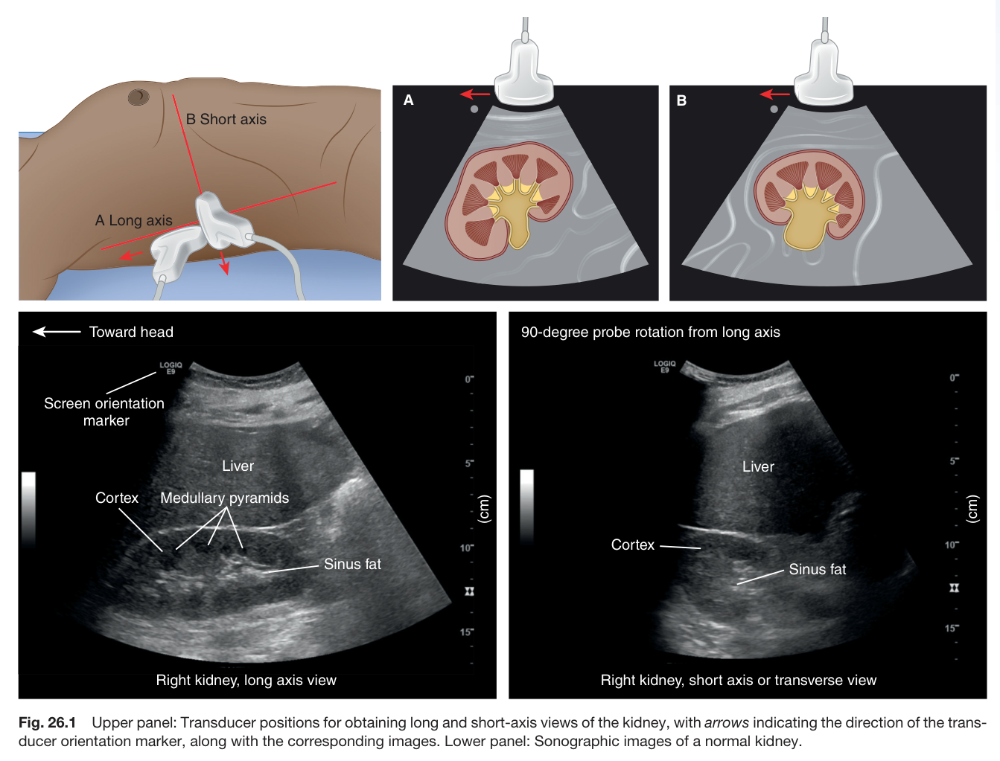

Fig. 26.1 Upper panel: Transducer positions for obtaining long and short-axis views of the kidney, with arrows indicating the direction of the trans- ducer orientation marker, along with the corresponding images. Lower panel: Sonographic images of a normal kidney.

---

### Fig_26_2

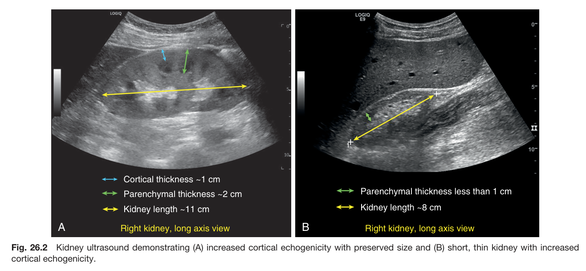

Fig. 26.2 Kidney ultrasound demonstrating (A) increased cortical echogenicity with preserved size and (B) short, thin kidney with increased cortical echogenicity.

---

### Fig_26_3

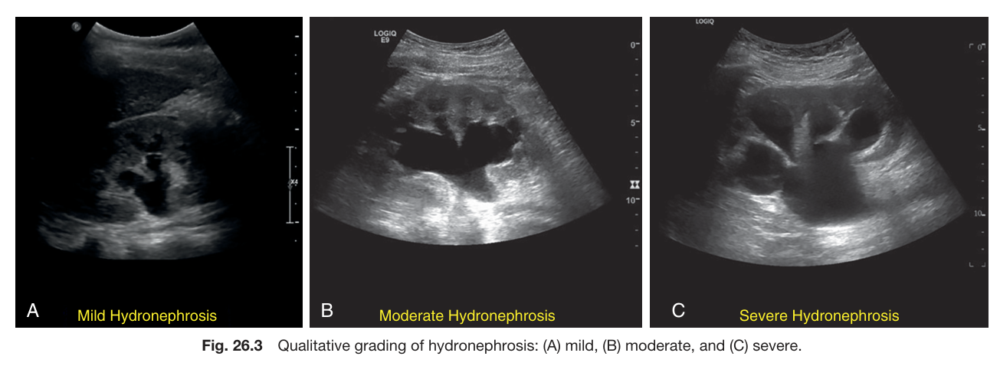

Fig. 26.3 Qualitative grading of hydronephrosis: (A) mild, (B) moderate, and (C) severe.

---

### Fig_26_4

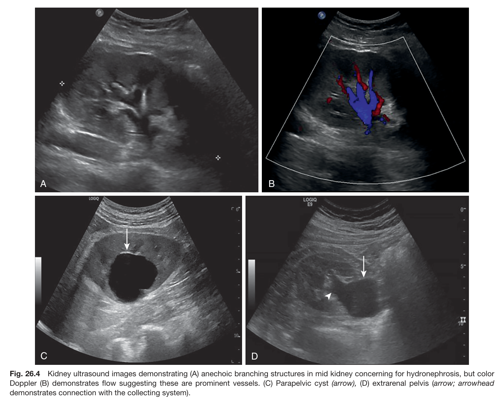

Fig. 26.4 Kidney ultrasound images demonstrating (A) anechoic branching structures in mid kidney concerning for hydronephrosis, but color Doppler (B) demonstrates flow suggesting these are prominent vessels. (C) Parapelvic cyst (arrow), (D) extrarenal pelvis (arrow; arrowhead demonstrates connection with the collecting system).

---

### Fig_26_5

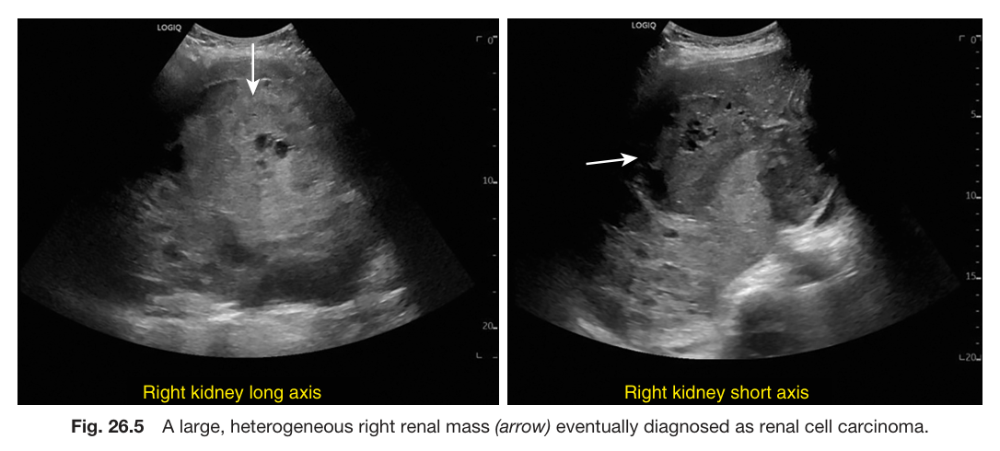

Fig. 26.5 A large, heterogeneous right renal mass (arrow) eventually diagnosed as renal cell carcinoma.

---

### Fig_26_6

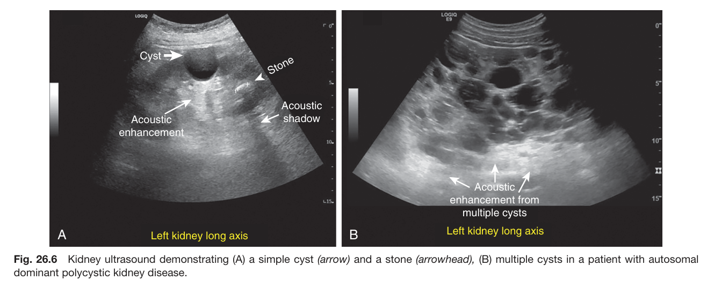

Fig. 26.6 Kidney ultrasound demonstrating (A) a simple cyst (arrow) and a stone (arrowhead), (B) multiple cysts in a patient with autosomal dominant polycystic kidney disease.

---

### Fig_26_7

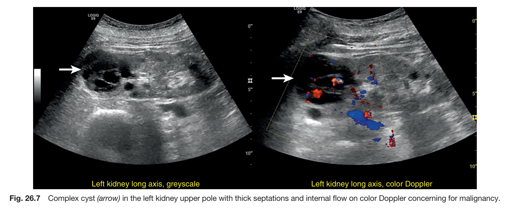

Fig. 26.7 Complex cyst (arrow) in the left kidney upper pole with thick septations and internal flow on color Doppler concerning for malignancy.

---

### Fig_26_8

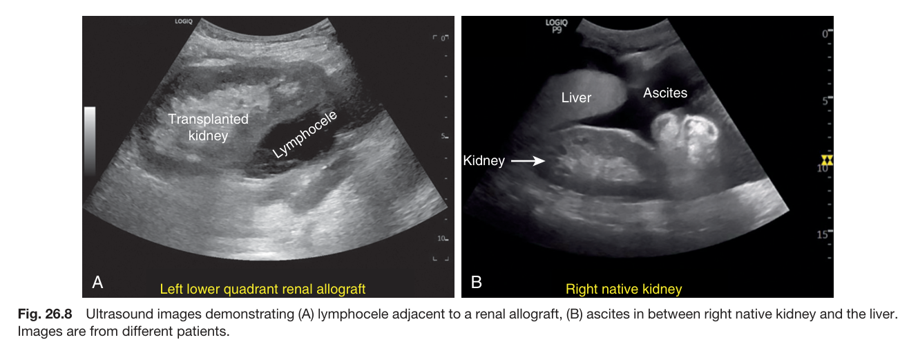

Fig. 26.8 Ultrasound images demonstrating (A) lymphocele adjacent to a renal allograft, (B) ascites in between right native kidney and the liver. Images are from different patients.

---

### Fig_26_9

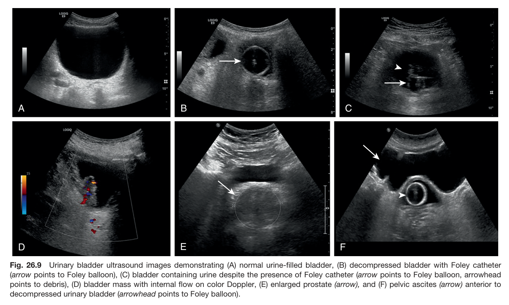

Fig. 26.9 Urinary bladder ultrasound images demonstrating (A) normal urine-filled bladder, (B) decompressed bladder with Foley catheter (arrow points to Foley balloon), (C) bladder containing urine despite the presence of Foley catheter (arrow points to Foley balloon, arrowhead points to debris), (D) bladder mass with internal flow on color Doppler, (E) enlarged prostate (arrow), and (F) pelvic ascites (arrow) anterior to decompressed urinary bladder (arrowhead points to Foley balloon).

---

### Fig_26_10

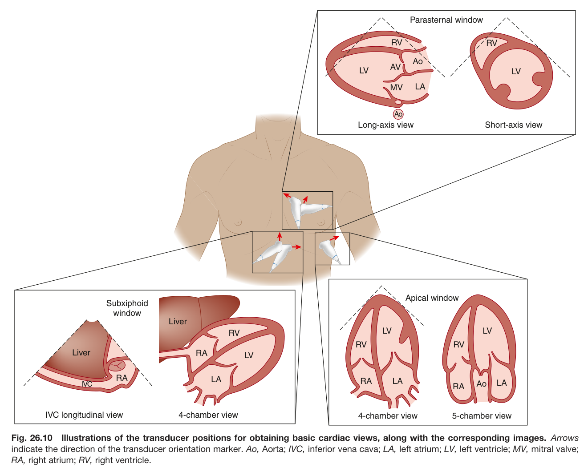

Fig. 26.10 Illustrations of the transducer positions for obtaining basic cardiac views, along with the corresponding images. Arrow indicate the direction of the transducer orientation marker. Ao, Aorta; IVC, inferior vena cava; LA, left atrium; LV, left ventricle; MV, mitral valve; RA, right atrium; RV, right ventricle.

---

### Fig_26_11

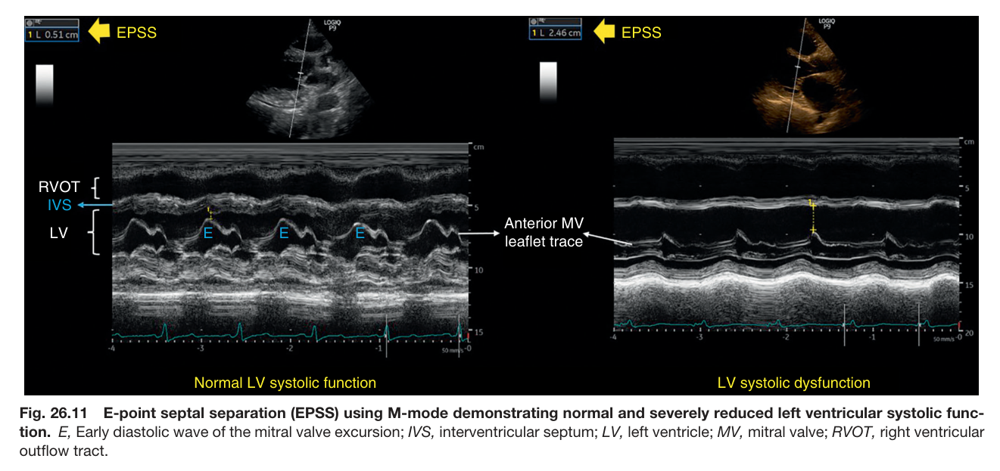

Fig. 26.11 E-point septal separation (EPSS) using M-mode demonstrating normal and severely reduced left ventricular systolic func- tion. E, Early diastolic wave of the mitral valve excursion; IVS, interventricular septum; LV, left ventricle; MV, mitral valve; RVOT, right ventricular outflow tract.

---

### Fig_26_12

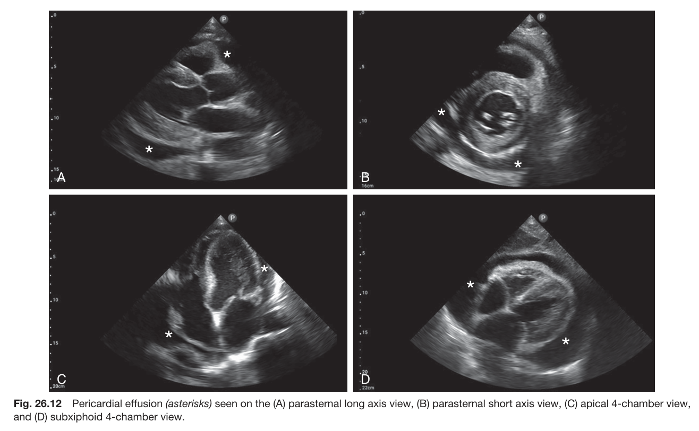

Fig. 26.12 Pericardial effusion (asterisks) seen on the (A) parasternal long axis view, (B) parasternal short axis view, (C) apical 4-chamber view, and (D) subxiphoid 4-chamber view.

---

### Fig_26_13

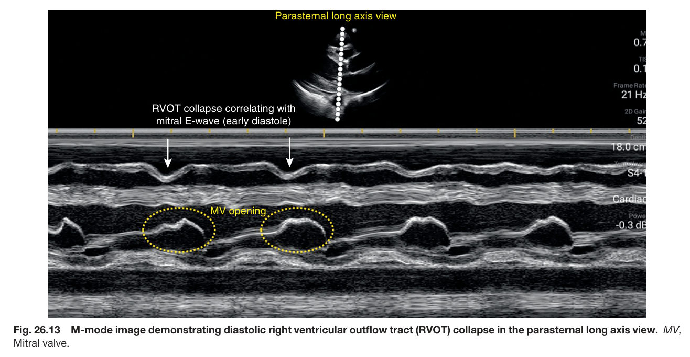

Fig. 26.13 M-mode image demonstrating diastolic right ventricular outflow tract (RVOT) collapse in the parasternal long axis view. MV, Mitral valve.

---

### Fig_26_14

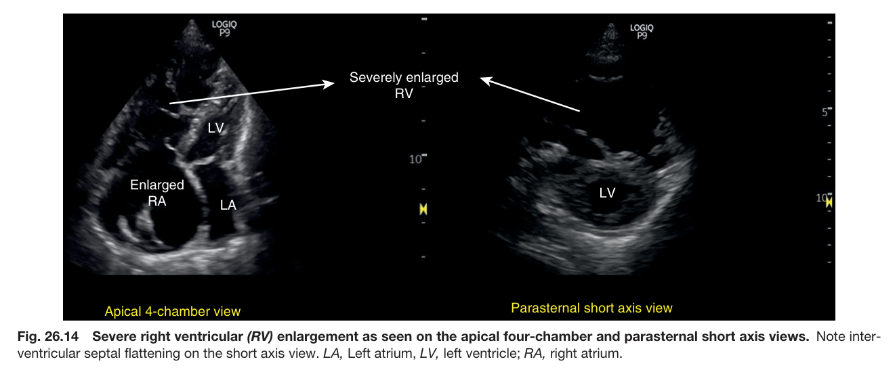

Fig. 26.14 Severe right ventricular (RV) enlargement as seen on the apical four-chamber and parasternal short axis views. Note inter- ventricular septal flattening on the short axis view. LA, Left atrium, LV, left ventricle; RA, right atrium.

---

### Fig_26_15

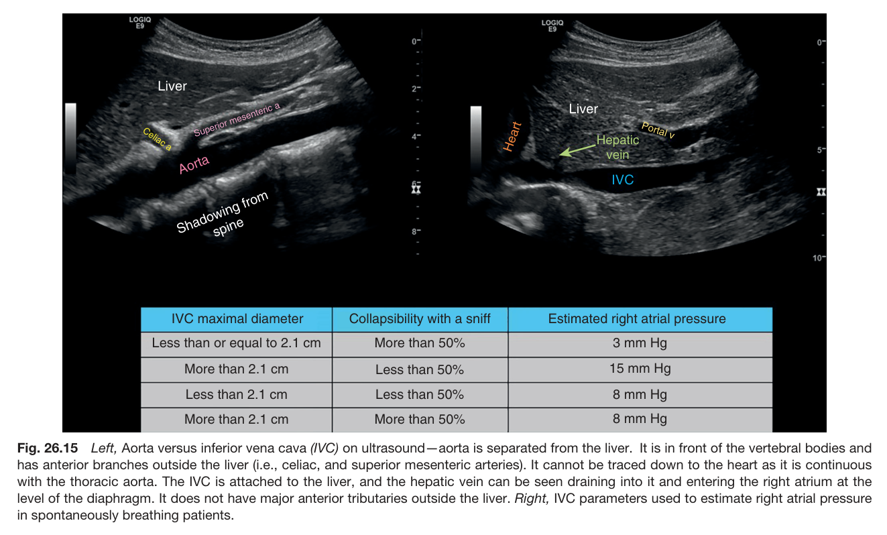

Fig. 26.15 Left, Aorta versus inferior vena cava (IVC) on ultrasound—aorta is separated from the liver. It is in front of the vertebral bodies and has anterior branches outside the liver (i.e., celiac, and superior mesenteric arteries). It cannot be traced down to the heart as it is continuous with the thoracic aorta. The IVC is attached to the liver, and the hepatic vein can be seen draining into it and entering the right atrium at the level of the diaphragm. It does not have major anterior tributaries outside the liver. Right, IVC parameters used to estimate right atrial pressure in spontaneously breathing patients.

---

### Fig_26_16

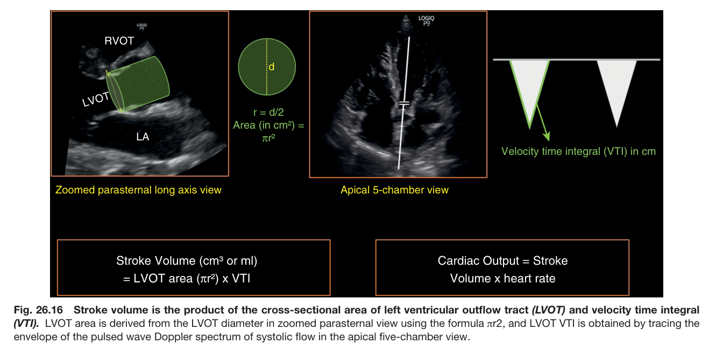

Fig. 26.16 Stroke volume is the product of the cross-sectional area of left ventricular outflow tract (LVOT) and velocity time integral (VTI). LVOT area is derived from the LVOT diameter in zoomed parasternal view using the formula πr2, and LVOT VTI is obtained by tracing the envelope of the pulsed wave Doppler spectrum of systolic flow in the apical five-chamber view.

---

### Fig_26_17

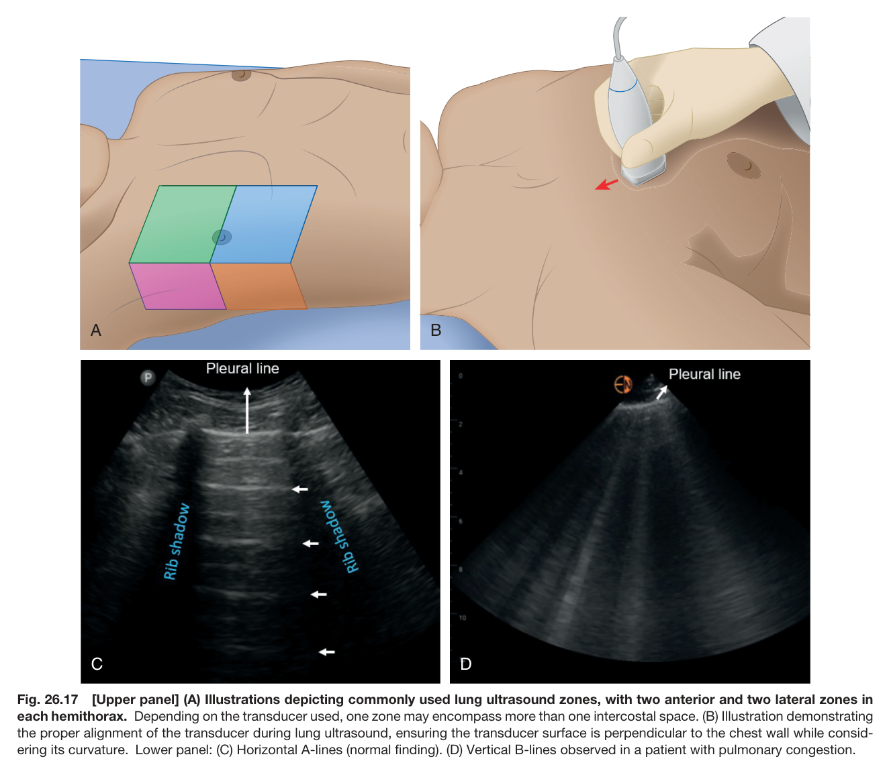

Fig. 26.17 [Upper panel] (A) Illustrations depicting commonly used lung ultrasound zones, with two anterior and two lateral zones in each hemithorax. Depending on the transducer used, one zone may encompass more than one intercostal space. (B) Illustration demonstrating the proper alignment of the transducer during lung ultrasound, ensuring the transducer surface is perpendicular to the chest wall while consid- ering its curvature. Lower panel: (C) Horizontal A-lines (normal finding). (D) Vertical B-lines observed in a patient with pulmonary congestion.

---

### Fig_26_18

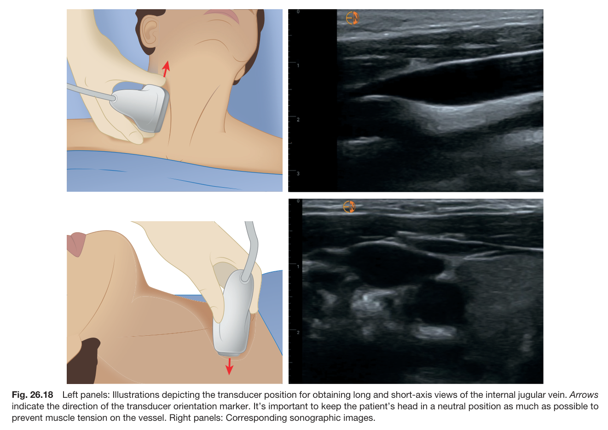

Fig. 26.18 Left panels: Illustrations depicting the transducer position for obtaining long and short-axis views of the internal jugular vein. Arrows indicate the direction of the transducer orientation marker. It’s important to keep the patient’s head in a neutral position as much as possible to prevent muscle tension on the vessel. Right panels: Corresponding sonographic images.

---

### Fig_26_19

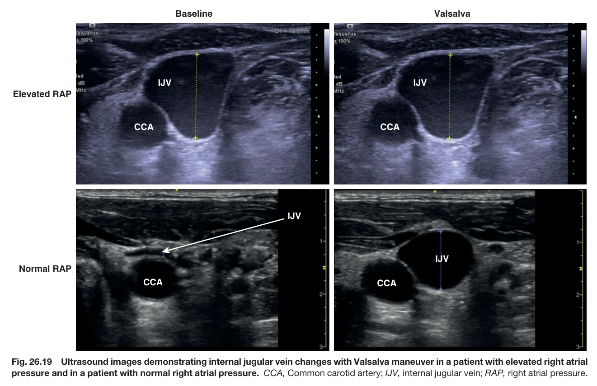

Fig. 26.19 Ultrasound images demonstrating internal jugular vein changes with Valsalva maneuver in a patient with elevated right atrial pressure and in a patient with normal right atrial pressure. CCA, Common carotid artery; IJV, internal jugular vein; RAP, right atrial pressure.

---

### Fig_26_20

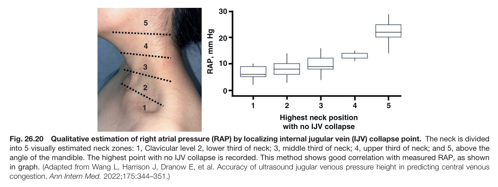

Fig. 26.20 Qualitative estimation of right atrial pressure (RAP) by localizing internal jugular vein (IJV) collapse point. The neck is divided into 5 visually estimated neck zones: 1, Clavicular level 2, lower third of neck; 3, middle third of neck; 4, upper third of neck; and 5, above the angle of the mandible. The highest point with no IJV collapse is recorded. This method shows good correlation with measured RAP, as shown in graph. (Adapted from Wang L, Harrison J, Dranow E, et al. Accuracy of ultrasound jugular venous pressure height in predicting central venous congestion. Ann Intern Med. 2022;175:344–351.)

---

### Fig_26_21

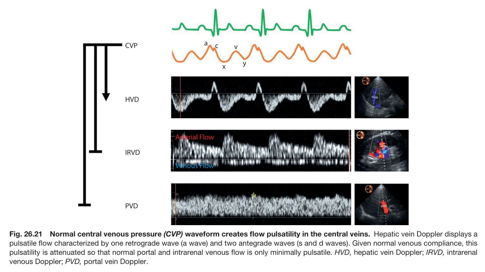

Fig. 26.21 Normal central venous pressure (CVP) waveform creates flow pulsatility in the central veins. Hepatic vein Doppler displays a pulsatile flow characterized by one retrograde wave (a wave) and two antegrade waves (s and d waves). Given normal venous compliance, this pulsatility is attenuated so that normal portal and intrarenal venous flow is only minimally pulsatile. HVD, hepatic vein Doppler; IRVD, intrarena venous Doppler; PVD, portal vein Doppler.

---

### Fig_26_22

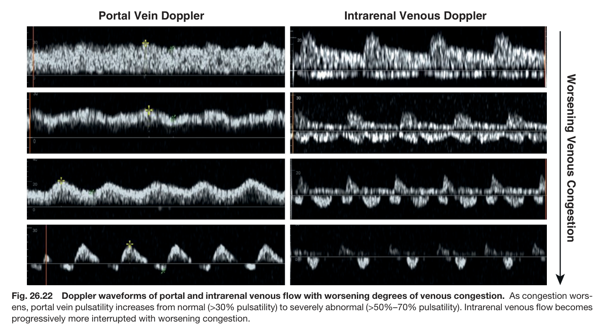

Fig. 26.22 Doppler waveforms of portal and intrarenal venous flow with worsening degrees of venous congestion. As congestion wors- ens, portal vein pulsatility increases from normal (>30% pulsatility) to severely abnormal (>50%–70% pulsatility). Intrarenal venous flow becomes progressively more interrupted with worsening congestion.

---

## Tables

### Table_26_1

#### Table Image

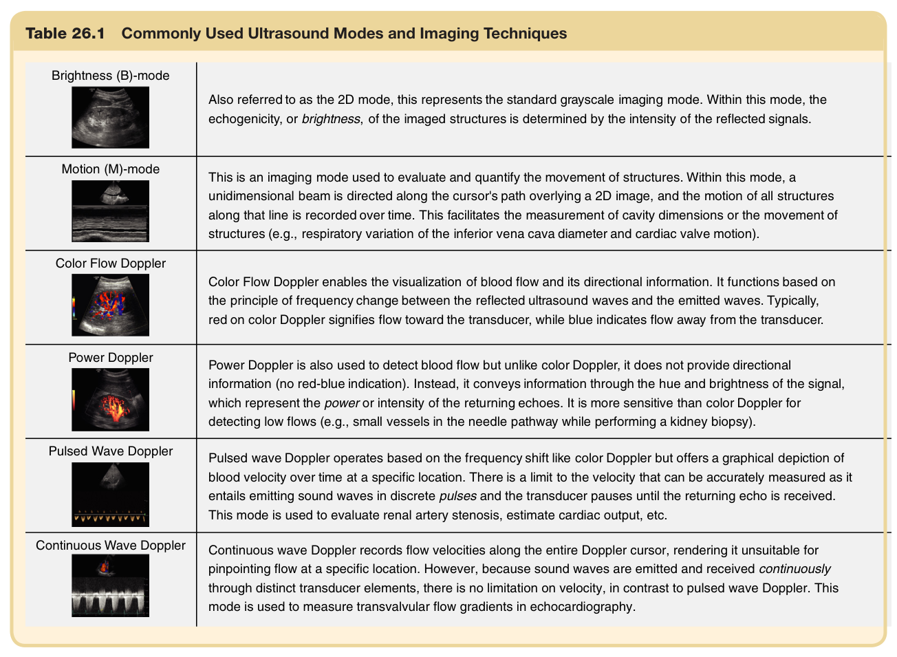

#### Table Data (CSV: [Table_26_1.csv](Table_26_1.csv))

```markdown
| Table Text (OCR) |
| :--- |
| Table 26.1  Commonly Used Ultrasound Modes and Imaging Techniques Brightness (B)-mode   Also referred to as the 2D mode, this represents the standard grayscale imaging mode. Within this mode, the echogenicity, or brightness, of the imaged structures is determined by the intensity of the reflected signals.    Motion (M)-mode   This is an imaging mode used to evaluate and quantify the movement of structures. Within this mode, a unidimensional beam is directed along the cursor's path overlying a 2D image, and the motion of all structures along that line is recorded over time. This facilitates the measurement of cavity dimensions or the movement of structures (e.g., respiratory variation of the inferior vena cava diameter and cardiac valve motion).    Color Flow Doppler   Color Flow Doppler enables the visualization of blood flow and its directional information. It functions based on the principle of frequency change between the reflected ultrasound waves and the emitted waves. Typically, red on color Doppler signifies flow toward the transducer, while blue indicates flow away from the transducer.    Power Doppler   Power Doppler is also used to detect blood flow but unlike color Doppler, it does not provide directional information (no red-blue indication). Instead, it conveys information through the hue and brightness of the signal, which represent the power or intensity of the returning echoes. It is more sensitive than color Doppler for detecting low flows (e.g., small vessels in the needle pathway while performing a kidney biopsy).    Pulsed Wave Doppler   Pulsed wave Doppler operates based on the frequency shift like color Doppler but offers a graphical depiction of blood velocity over time at a specific location. There is a limit to the velocity that can be accurately measured as it entails emitting sound waves in discrete pulses and the transducer pauses until the returning echo is received. This mode is used to evaluate renal artery stenosis, estimate cardiac output, etc.    Continuous Wave Doppler   Continuous wave Doppler records flow velocities along the entire Doppler cursor, rendering it unsuitable for pinpointing flow at a specific location. However, because sound waves are emitted and received continuously through distinct transducer elements, there is no limitation on velocity, in contrast to pulsed wave Doppler. This mode is used to measure transvalvular flow gradients in echocardiography. |
```

Table 26.1 Commonly Used Ultrasound Modes and Imaging Techniques

---
