# 27. Pathophysiology of Acute Kidney Injury - Figures and Tables Index

This document lists all figures and tables extracted from `27. Pathophysiology of Acute Kidney Injury.pdf`.

## Table of Contents
- [Figures](#figures)
- [Tables](#tables)

---

## Figures

### Fig_27_1

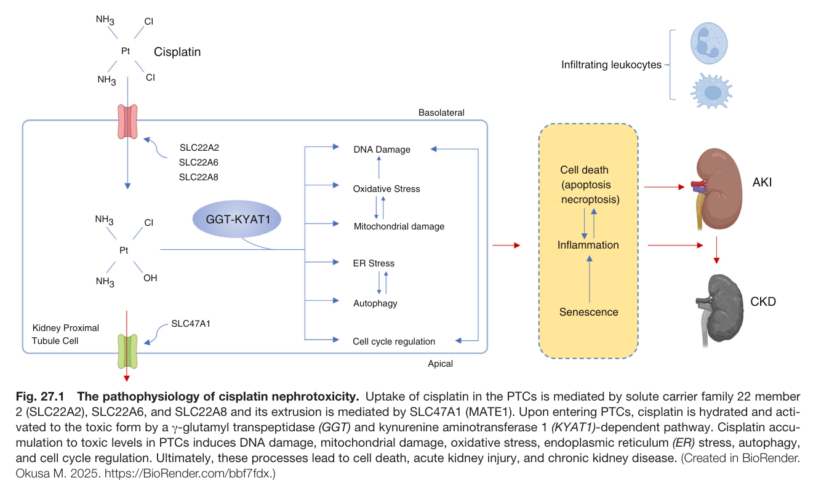

Fig. 27.1 The pathophysiology of cisplatin nephrotoxicity. Uptake of cisplatin in the PTCs is mediated by solute carrier family 22 member 2 (SLC22A2), SLC22A6, and SLC22A8 and its extrusion is mediated by SLC47A1 (MATE1). Upon entering PTCs, cisplatin is hydrated and acti- vated to the toxic form by a γ-glutamyl transpeptidase (GGT) and kynurenine aminotransferase 1 (KYAT1)-dependent pathway. Cisplatin accu- mulation to toxic levels in PTCs induces DNA damage, mitochondrial damage, oxidative stress, endoplasmic reticulum (ER) stress, autophagy, and cell cycle regulation. Ultimately, these processes lead to cell death, acute kidney injury, and chronic kidney disease. (Created in BioRender. Okusa M. 2025. https://BioRender.com/bbf7fdx.)

---

### Fig_27_2

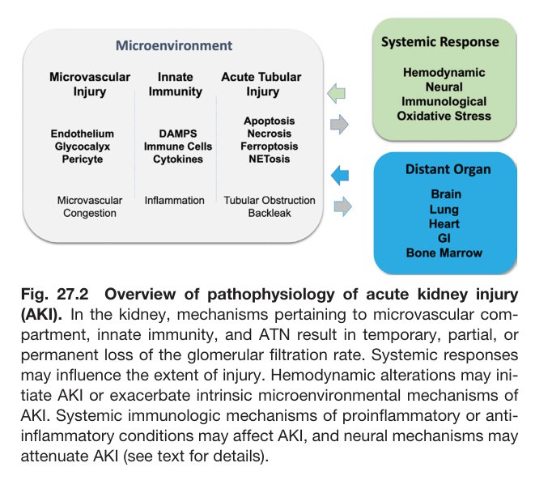

Fig. 27.2 Overview of pathophysiology of acute kidney injury (AKI). In the kidney, mechanisms pertaining to microvascular com- partment, innate immunity, and ATN result in temporary, partial, or permanent loss of the glomerular filtration rate. Systemic responses may influence the extent of injury. Hemodynamic alterations may ini- tiate AKI or exacerbate intrinsic microenvironmental mechanisms of AKI. Systemic immunologic mechanisms of proinflammatory or anti- inflammatory conditions may affect AKI, and neural mechanisms may attenuate AKI (see text for details).

---

### Fig_27_3

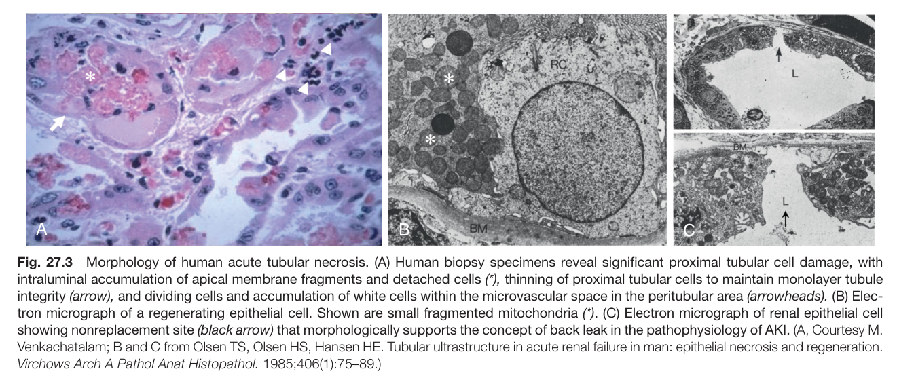

Fig. 27.3 Morphology of human acute tubular necrosis. (A) Human biopsy specimens reveal significant proximal tubular cell damage, with intraluminal accumulation of apical membrane fragments and detached cells (*), thinning of proximal tubular cells to maintain monolayer tubule integrity (arrow), and dividing cells and accumulation of white cells within the microvascular space in the peritubular area (arrowheads). (B) Elec- tron micrograph of a regenerating epithelial cell. Shown are small fragmented mitochondria (*). (C) Electron micrograph of renal epithelial cel showing nonreplacement site (black arrow) that morphologically supports the concept of back leak in the pathophysiology of AKI. (A, Courtesy M. Venkachatalam; B and C from Olsen TS, Olsen HS, Hansen HE. Tubular ultrastructure in acute renal failure in man: epithelial necrosis and regeneration. Virchows Arch A Pathol Anat Histopathol. 1985;406(1):75–89.)

---

### Fig_27_4

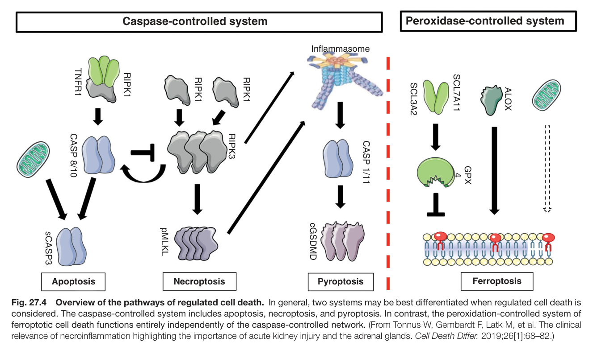

Fig. 27.4 Overview of the pathways of regulated cell death. In general, two systems may be best differentiated when regulated cell death is considered. The caspase-controlled system includes apoptosis, necroptosis, and pyroptosis. In contrast, the peroxidation-controlled system of ferroptotic cell death functions entirely independently of the caspase-controlled network. (From Tonnus W, Gembardt F, Latk M, et al. The clinica relevance of necroinflammation highlighting the importance of acute kidney injury and the adrenal glands. Cell Death Differ. 2019;26[1]:68–82.)

---

### Fig_27_5

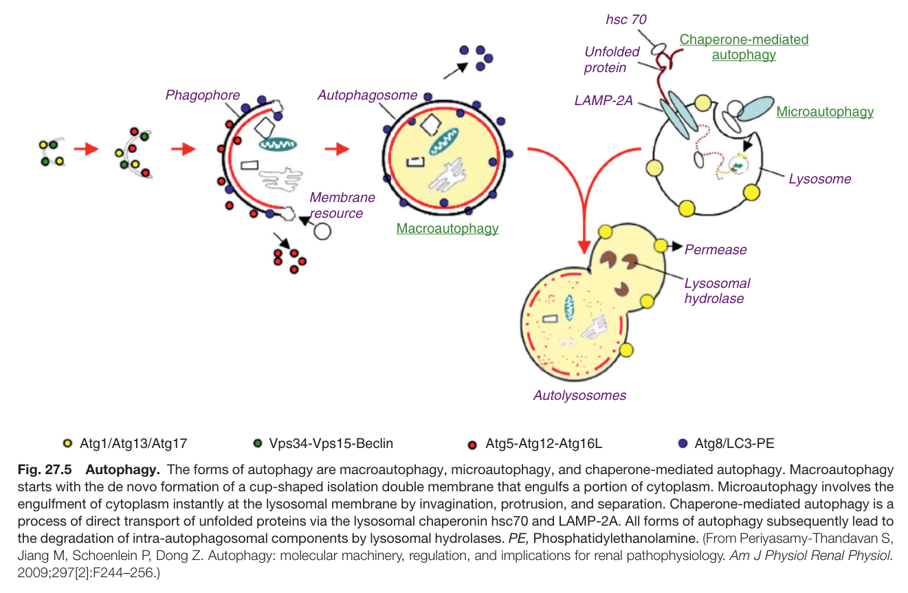

Fig. 27.5 Autophagy. The forms of autophagy are macroautophagy, microautophagy, and chaperone-mediated autophagy. Macroautophagy starts with the de novo formation of a cup-shaped isolation double membrane that engulfs a portion of cytoplasm. Microautophagy involves the engulfment of cytoplasm instantly at the lysosomal membrane by invagination, protrusion, and separation. Chaperone-mediated autophagy is a process of direct transport of unfolded proteins via the lysosomal chaperonin hsc70 and LAMP-2A. All forms of autophagy subsequently lead to the degradation of intra-autophagosomal components by lysosomal hydrolases. PE, Phosphatidylethanolamine. (From Periyasamy-Thandavan S, Jiang M, Schoenlein P, Dong Z. Autophagy: molecular machinery, regulation, and implications for renal pathophysiology. Am J Physiol Renal Physiol. 2009;297[2]:F244–256.)

---

### Fig_27_6

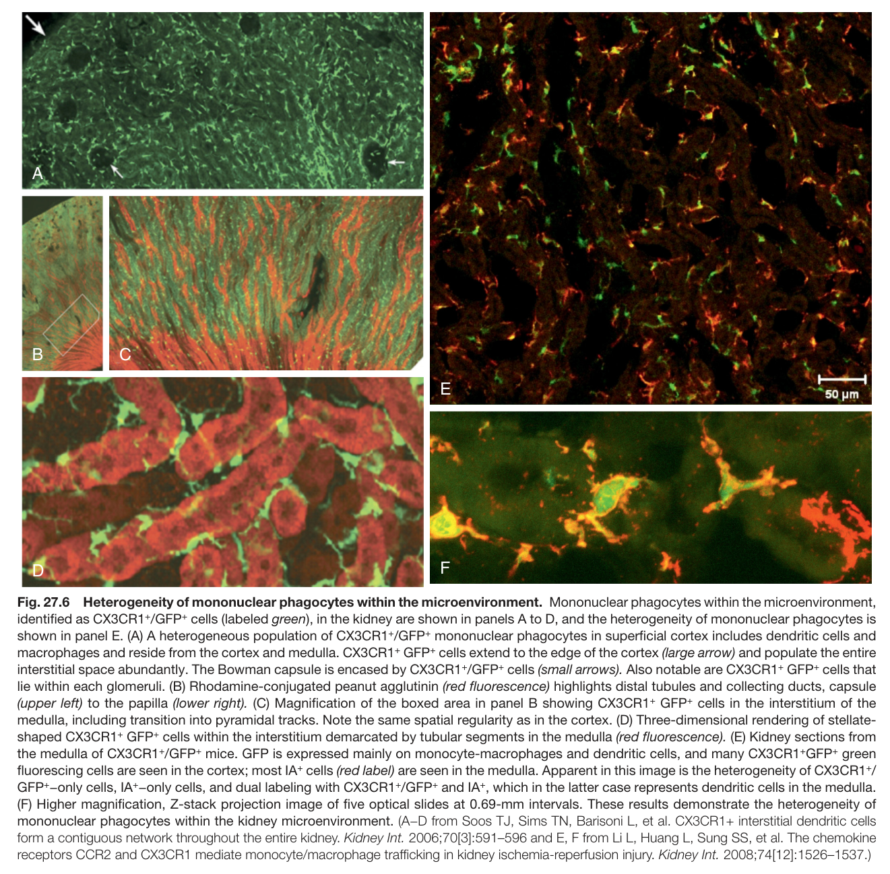

Fig. 27.6 Heterogeneity of mononuclear phagocytes within the microenvironment. Mononuclear phagocytes within the microenvironment, identified as CX3CR1<sup>+</sup>/GFP<sup>+</sup> cells (labeled green), in the kidney are shown in panels A to D, and the heterogeneity of mononuclear phagocytes is shown in panel E. (A) A heterogeneous population of CX3CR1<sup>+</sup>/GFP<sup>+</sup> mononuclear phagocytes in superficial cortex includes dendritic cells and macrophages and reside from the cortex and medulla. CX3CR1<sup>+</sup> GFP<sup>+</sup> cells extend to the edge of the cortex (large arrow) and populate the entire interstitial space abundantly. The Bowman capsule is encased by CX3CR1<sup>+</sup>/GFP<sup>+</sup> cells (small arrows). Also notable are CX3CR1<sup>+</sup> GFP<sup>+</sup> cells that lie within each glomeruli. (B) Rhodamine-conjugated peanut agglutinin (red fluorescence) highlights distal tubules and collecting ducts, capsule (upper left) to the papilla (lower right). (C) Magnification of the boxed area in panel B showing CX3CR1<sup>+</sup> GFP<sup>+</sup> cells in the interstitium of the medulla, including transition into pyramidal tracks. Note the same spatial regularity as in the cortex. (D) Three-dimensional rendering of stellate- shaped CX3CR1<sup>+</sup> GFP<sup>+</sup> cells within the interstitium demarcated by tubular segments in the medulla (red fluorescence). (E) Kidney sections from the medulla of CX3CR1<sup>+</sup>/GFP<sup>+</sup> mice. GFP is expressed mainly on monocyte-macrophages and dendritic cells, and many CX3CR1<sup>+</sup>GFP<sup>+</sup> green fluorescing cells are seen in the cortex; most IA<sup>+</sup> cells (red label) are seen in the medulla. Apparent in this image is the heterogeneity of CX3CR1<sup>+</sup>/ GFP<sup>+</sup>−only cells, IA<sup>+</sup>−only cells, and dual labeling with CX3CR1<sup>+</sup>/GFP<sup>+</sup> and IA<sup>+</sup>, which in the latter case represents dendritic cells in the medulla. (F) Higher magnification, Z-stack projection image of five optical slides at 0.69-mm intervals. These results demonstrate the heterogeneity of mononuclear phagocytes within the kidney microenvironment. (A−D from Soos TJ, Sims TN, Barisoni L, et al. CX3CR1+ interstitial dendritic cells form a contiguous network throughout the entire kidney. Kidney Int. 2006;70[3]:591–596 and E, F from Li L, Huang L, Sung SS, et al. The chemokine receptors CCR2 and CX3CR1 mediate monocyte/macrophage trafficking in kidney ischemia-reperfusion injury. Kidney Int. 2008;74[12]:1526–1537.)

---

### Fig_27_7

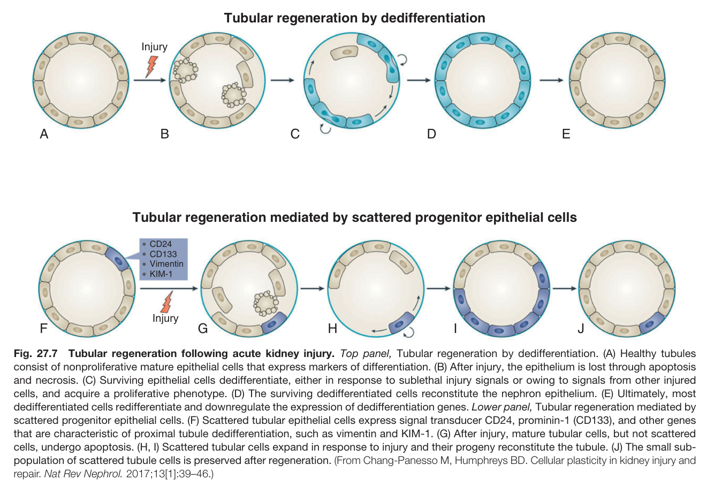

Fig. 27.7 Tubular regeneration following acute kidney injury. Top panel, Tubular regeneration by dedifferentiation. (A) Healthy tubules consist of nonproliferative mature epithelial cells that express markers of differentiation. (B) After injury, the epithelium is lost through apoptosis and necrosis. (C) Surviving epithelial cells dedifferentiate, either in response to sublethal injury signals or owing to signals from other injured cells, and acquire a proliferative phenotype. (D) The surviving dedifferentiated cells reconstitute the nephron epithelium. (E) Ultimately, most dedifferentiated cells redifferentiate and downregulate the expression of dedifferentiation genes. Lower panel, Tubular regeneration mediated by scattered progenitor epithelial cells. (F) Scattered tubular epithelial cells express signal transducer CD24, prominin-1 (CD133), and other genes that are characteristic of proximal tubule dedifferentiation, such as vimentin and KIM-1. (G) After injury, mature tubular cells, but not scattered cells, undergo apoptosis. (H, I) Scattered tubular cells expand in response to injury and their progeny reconstitute the tubule. (J) The small sub- population of scattered tubule cells is preserved after regeneration. (From Chang-Panesso M, Humphreys BD. Cellular plasticity in kidney injury and repair. Nat Rev Nephrol. 2017;13[1]:39–46.)

---

### Fig_27_8

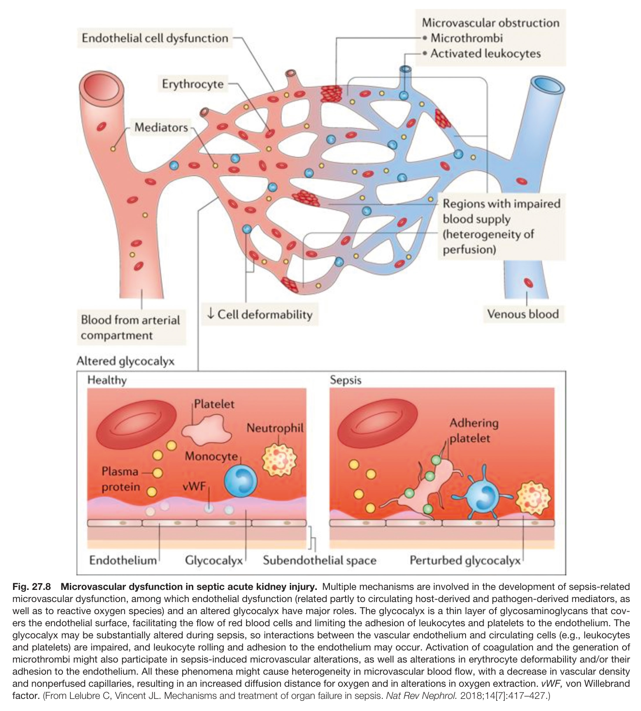

Fig. 27.8 Microvascular dysfunction in septic acute kidney injury. Multiple mechanisms are involved in the development of sepsis-related microvascular dysfunction, among which endothelial dysfunction (related partly to circulating host-derived and pathogen-derived mediators, as well as to reactive oxygen species) and an altered glycocalyx have major roles. The glycocalyx is a thin layer of glycosaminoglycans that cov- ers the endothelial surface, facilitating the flow of red blood cells and limiting the adhesion of leukocytes and platelets to the endothelium. The glycocalyx may be substantially altered during sepsis, so interactions between the vascular endothelium and circulating cells (e.g., leukocytes and platelets) are impaired, and leukocyte rolling and adhesion to the endothelium may occur. Activation of coagulation and the generation of microthrombi might also participate in sepsis-induced microvascular alterations, as well as alterations in erythrocyte deformability and/or their adhesion to the endothelium. All these phenomena might cause heterogeneity in microvascular blood flow, with a decrease in vascular density and nonperfused capillaries, resulting in an increased diffusion distance for oxygen and in alterations in oxygen extraction. vWF, von Willebrand factor. (From Lelubre C, Vincent JL. Mechanisms and treatment of organ failure in sepsis. Nat Rev Nephrol. 2018;14[7]:417–427.)

---

### Fig_27_9

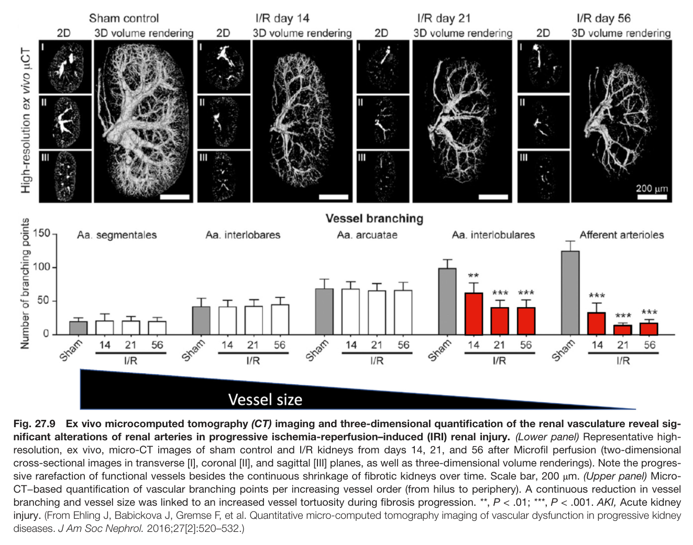

Fig. 27.9 Ex vivo microcomputed tomography (CT) imaging and three-dimensional quantification of the renal vasculature reveal sig- nificant alterations of renal arteries in progressive ischemia-reperfusion–induced (IRI) renal injury. (Lower panel) Representative high- resolution, ex vivo, micro-CT images of sham control and I/R kidneys from days 14, 21, and 56 after Microfil perfusion (two-dimensiona cross-sectional images in transverse [I], coronal [II], and sagittal [III] planes, as well as three-dimensional volume renderings). Note the progres- sive rarefaction of functional vessels besides the continuous shrinkage of fibrotic kidneys over time. Scale bar, 200 μm. (Upper panel) Micro- CT−based quantification of vascular branching points per increasing vessel order (from hilus to periphery). A continuous reduction in vesse branching and vessel size was linked to an increased vessel tortuosity during fibrosis progression. **, P < .01; ***, P < .001. AKI, Acute kidney injury. (From Ehling J, Babickova J, Gremse F, et al. Quantitative micro-computed tomography imaging of vascular dysfunction in progressive kidney diseases. J Am Soc Nephrol. 2016;27[2]:520–532.)

---

### Fig_27_10

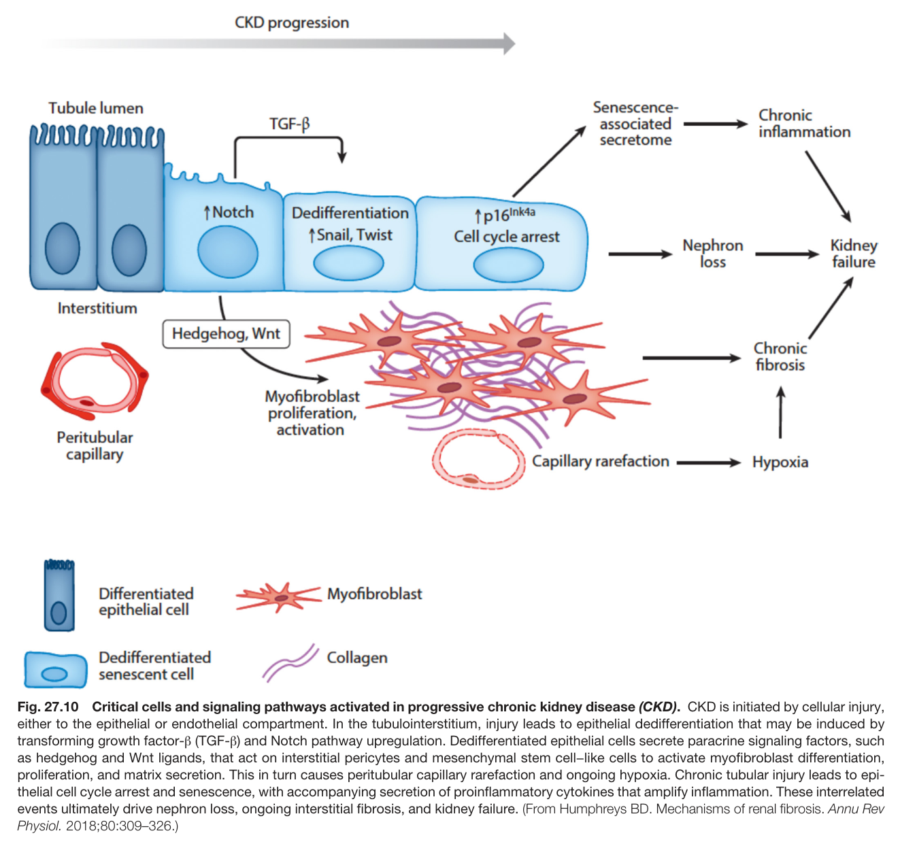

Fig. 27.10 Critical cells and signaling pathways activated in progressive chronic kidney disease (CKD). CKD is initiated by cellular injury, either to the epithelial or endothelial compartment. In the tubulointerstitium, injury leads to epithelial dedifferentiation that may be induced by transforming growth factor-β (TGF-β) and Notch pathway upregulation. Dedifferentiated epithelial cells secrete paracrine signaling factors, such as hedgehog and Wnt ligands, that act on interstitial pericytes and mesenchymal stem cell−like cells to activate myofibroblast differentiation, proliferation, and matrix secretion. This in turn causes peritubular capillary rarefaction and ongoing hypoxia. Chronic tubular injury leads to epi- thelial cell cycle arrest and senescence, with accompanying secretion of proinflammatory cytokines that amplify inflammation. These interrelated events ultimately drive nephron loss, ongoing interstitial fibrosis, and kidney failure. (From Humphreys BD. Mechanisms of renal fibrosis. Annu Rev Physiol. 2018;80:309–326.)

---

### Fig_27_11

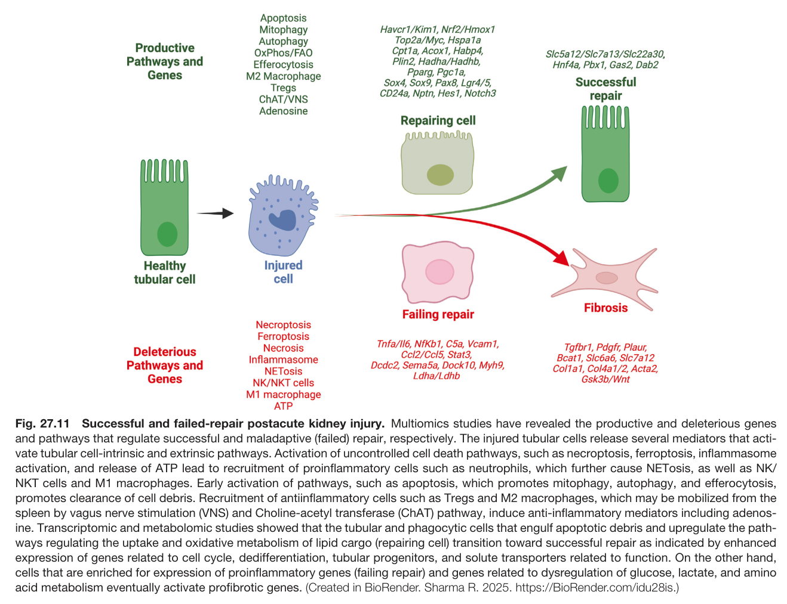

Fig. 27.11 Successful and failed-repair postacute kidney injury. Multiomics studies have revealed the productive and deleterious genes and pathways that regulate successful and maladaptive (failed) repair, respectively. The injured tubular cells release several mediators that acti- vate tubular cell-intrinsic and extrinsic pathways. Activation of uncontrolled cell death pathways, such as necroptosis, ferroptosis, inflammasome activation, and release of ATP lead to recruitment of proinflammatory cells such as neutrophils, which further cause NETosis, as well as NK/ NKT cells and M1 macrophages. Early activation of pathways, such as apoptosis, which promotes mitophagy, autophagy, and efferocytosis, promotes clearance of cell debris. Recruitment of antiinflammatory cells such as Tregs and M2 macrophages, which may be mobilized from the spleen by vagus nerve stimulation (VNS) and Choline-acetyl transferase (ChAT) pathway, induce anti-inflammatory mediators including adenos- ine. Transcriptomic and metabolomic studies showed that the tubular and phagocytic cells that engulf apoptotic debris and upregulate the path- ways regulating the uptake and oxidative metabolism of lipid cargo (repairing cell) transition toward successful repair as indicated by enhanced expression of genes related to cell cycle, dedifferentiation, tubular progenitors, and solute transporters related to function. On the other hand, cells that are enriched for expression of proinflammatory genes (failing repair) and genes related to dysregulation of glucose, lactate, and amino acid metabolism eventually activate profibrotic genes. (Created in BioRender. Sharma R. 2025. https://BioRender.com/idu28is.)

---

### Fig_e27_6

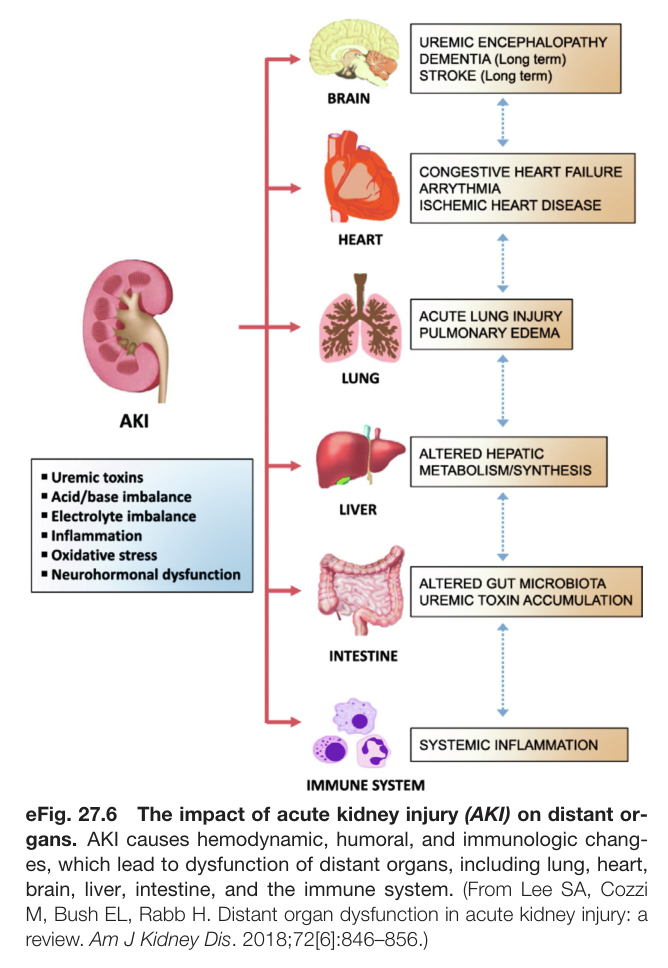

Fig. e27.6 The impact of acute kidney injury (AKI) on distant or- gans. AKI causes hemodynamic, humoral, and immunologic chang- es, which lead to dysfunction of distant organs, including lung, heart, brain, liver, intestine, and the immune system. (From Lee SA, Cozz M, Bush EL, Rabb H. Distant organ dysfunction in acute kidney injury: a review. Am J Kidney Dis. 2018;72[6]:846–856.)

---

## Tables

### Table_27_1

#### Table Image

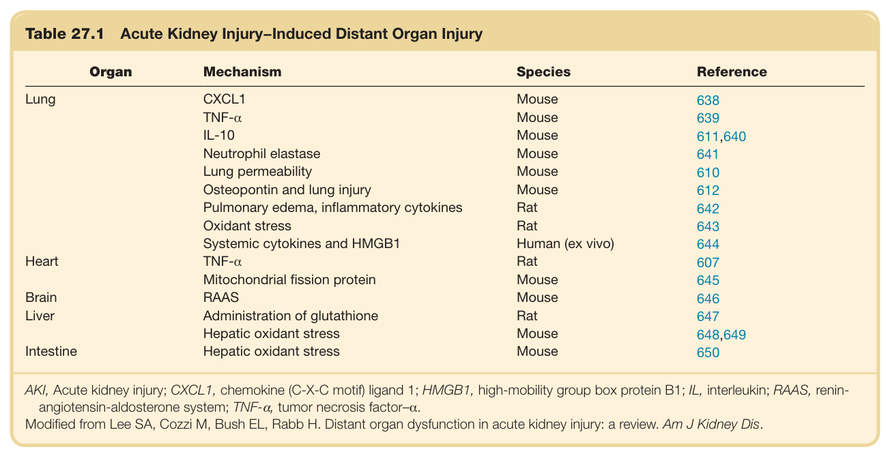

#### Table Data (CSV: [Table_27_1.csv](Table_27_1.csv))

```markdown
| Table Text (OCR) |
| :--- |
| Table 27.1  Acute Kidney Injury−Induced Distant Organ Injury Organ  Mechanism  Species  Reference    Lung  CXCL1  Mouse  638    TNF-α  Mouse  639    IL-10  Mouse  611,640    Neutrophil elastase  Mouse  641    Lung permeability  Mouse  610    Osteopontin and lung injury  Mouse  612    Pulmonary edema, inflammatory cytokines  Rat  642    Oxidant stress  Rat  643    Systemic cytokines and HMGB1  Human (ex vivo)  644    Heart  TNF-α  Rat  607    Mitochondrial fission protein  Mouse  645    Brain  RAAS  Mouse  646    Liver  Administration of glutathione  Rat  647    Hepatic oxidant stress  Mouse  648,649    Intestine  Hepatic oxidant stress  Mouse  650 AKI, Acute kidney injury; CXCL1, chemokine (C-X-C motif) ligand 1; HMGB1, high-mobility group box protein B1; IL, interleukin; RAAS, renin- angiotensin-aldosterone system; TNF-α, tumor necrosis factor–α. Modified from Lee SA, Cozzi M, Bush EL, Rabb H. Distant organ dysfunction in acute kidney injury: a review. Am J Kidney Dis. |
```

Table 27.1 Acute Kidney Injury−Induced Distant Organ Injury

---
