# 28. Prevention and Management of Acute Kidney Injury - Figures and Tables Index

This document lists all figures and tables extracted from `28. Prevention and Management of Acute Kidney Injury.pdf`.

## Table of Contents
- [Figures](#figures)
- [Tables](#tables)

---

## Figures

### Fig_28_1

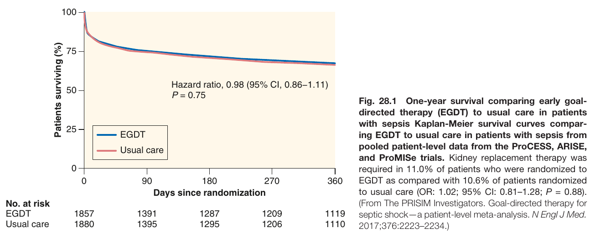

Fig. 28.1 One-year survival comparing early goal- directed therapy (EGDT) to usual care in patients with sepsis Kaplan-Meier survival curves compar- ing EGDT to usual care in patients with sepsis from pooled patient-level data from the ProCESS, ARISE, and ProMISe trials. Kidney replacement therapy was required in 11.0% of patients who were randomized to EGDT as compared with 10.6% of patients randomized to usual care (OR: 1.02; 95% CI: 0.81–1.28; P = 0.88). (From The PRISIM Investigators. Goal-directed therapy for septic shock—a patient-level meta-analysis. N Engl J Med. 2017;376:2223–2234.)

---

### Fig_28_2

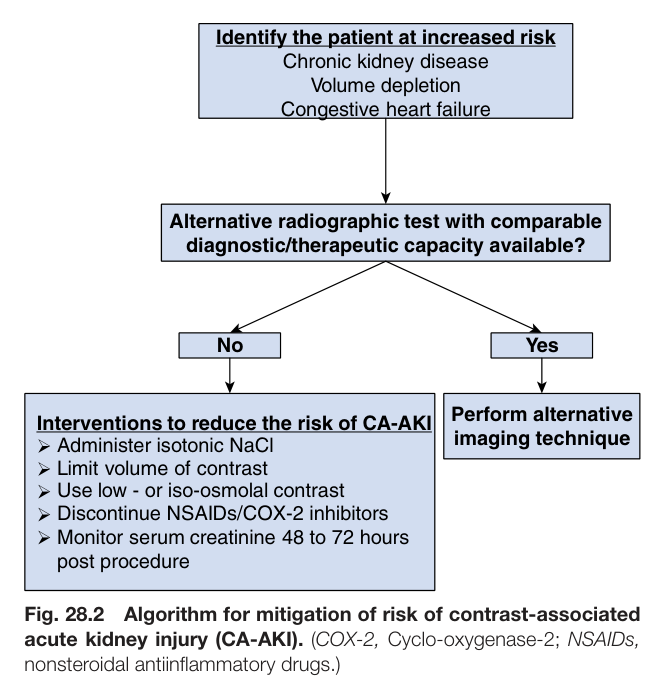

Fig. 28.2 Algorithm for mitigation of risk of contrast-associated acute kidney injury (CA-AKI). (COX-2, Cyclo-oxygenase-2; NSAIDs, nonsteroidal antiinflammatory drugs.)

---

### Fig_28_3

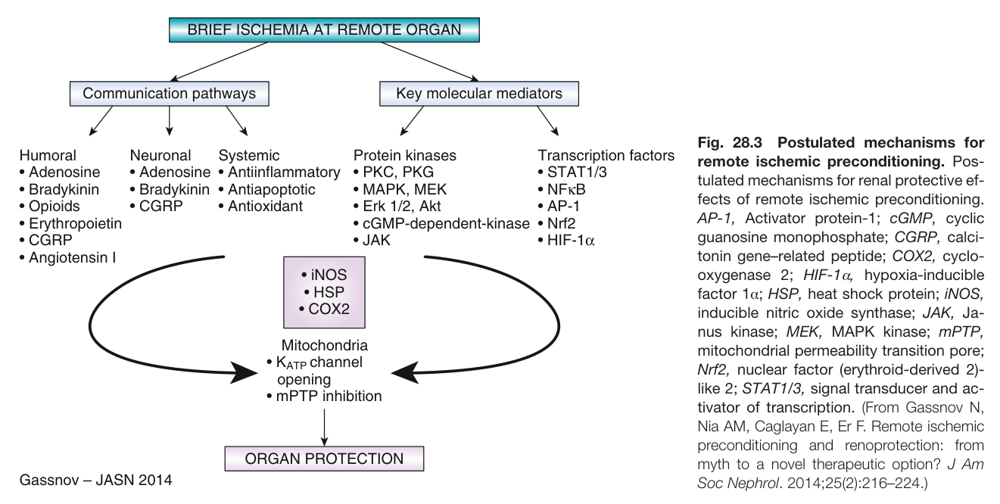

Fig. 28.3 Postulated mechanisms for remote ischemic preconditioning. Pos- tulated mechanisms for renal protective ef- fects of remote ischemic preconditioning. AP-1, Activator protein-1; cGMP, cyclic guanosine monophosphate; CGRP, calci- tonin gene–related peptide; COX2, cyclo- oxygenase 2; HIF-1α, hypoxia-inducible factor 1α; HSP, heat shock protein; iNOS, inducible nitric oxide synthase; JAK, Ja- nus kinase; MEK, MAPK kinase; mPTP, mitochondrial permeability transition pore; Nrf2, nuclear factor (erythroid-derived 2)- like 2; STAT1/3, signal transducer and ac- tivator of transcription. (From Gassnov N, Nia AM, Caglayan E, Er F. Remote ischemic preconditioning and renoprotection: from myth to a novel therapeutic option? J Am Soc Nephrol. 2014;25(2):216–224.)

---

### Fig_28_4

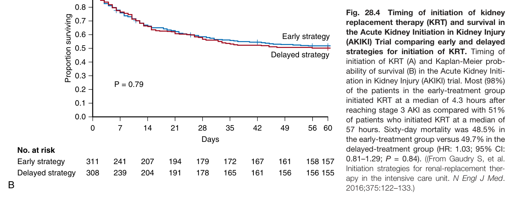

Fig. 28.4 Timing of initiation of kidney replacement therapy (KRT) and survival in the Acute Kidney Initiation in Kidney Injury (AKIKI) Trial comparing early and delayed strategies for initiation of KRT. Timing of initiation of KRT (A) and Kaplan-Meier prob- ability of survival (B) in the Acute Kidney Initi- ation in Kidney Injury (AKIKI) trial. Most (98%) of the patients in the early-treatment group initiated KRT at a median of 4.3 hours after reaching stage 3 AKI as compared with 51% of patients who initiated KRT at a median of 57 hours. Sixty-day mortality was 48.5% in the early-treatment group versus 49.7% in the delayed-treatment group (HR: 1.03; 95% CI: 0.81–1.29; P = 0.84). ((From Gaudry S, et al. Initiation strategies for renal-replacement ther- apy in the intensive care unit. N Engl J Med. 2016;375:122–133.)

---

### Fig_28_5

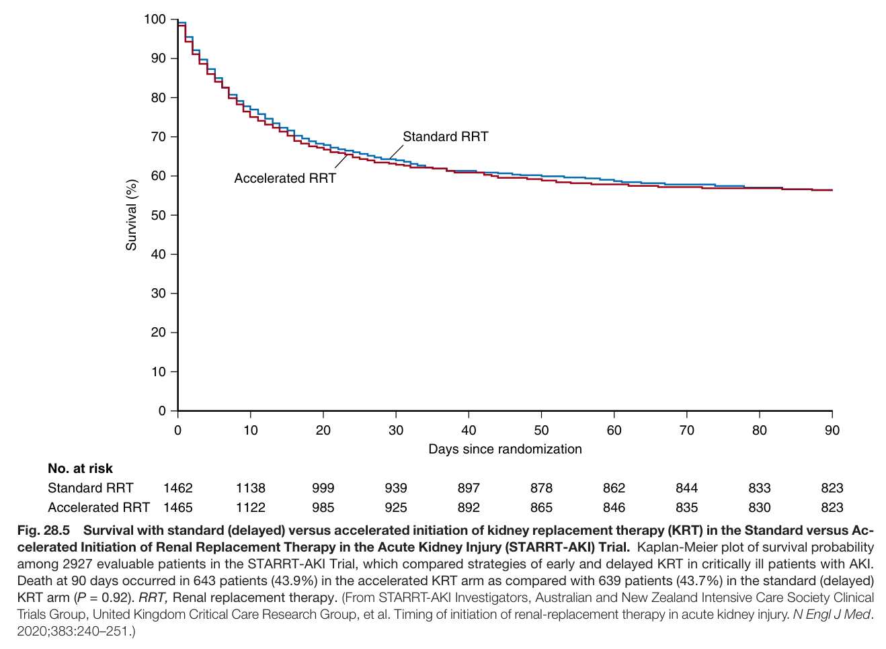

Fig. 28.5 Survival with standard (delayed) versus accelerated initiation of kidney replacement therapy (KRT) in the Standard versus Ac- celerated Initiation of Renal Replacement Therapy in the Acute Kidney Injury (STARRT-AKI) Trial. Kaplan-Meier plot of survival probability among 2927 evaluable patients in the STARRT-AKI Trial, which compared strategies of early and delayed KRT in critically ill patients with AKI. Death at 90 days occurred in 643 patients (43.9%) in the accelerated KRT arm as compared with 639 patients (43.7%) in the standard (delayed) KRT arm (P = 0.92). RRT, Renal replacement therapy. (From STARRT-AKI Investigators, Australian and New Zealand Intensive Care Society Clinica Trials Group, United Kingdom Critical Care Research Group, et al. Timing of initiation of renal-replacement therapy in acute kidney injury. N Engl J Med. 2020;383:240–251.)

---

### Fig_28_6

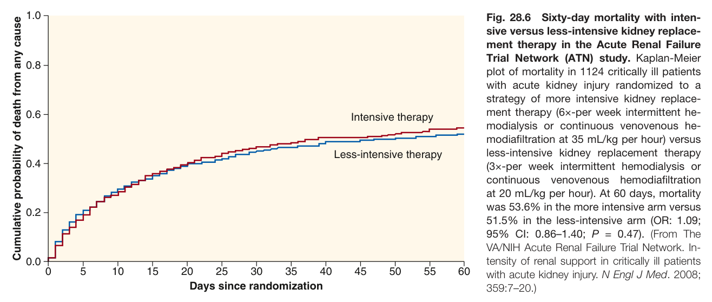

Fig. 28.6 Sixty-day mortality with inten- sive versus less-intensive kidney replace- ment therapy in the Acute Renal Failure Trial Network (ATN) study. Kaplan-Meier plot of mortality in 1124 critically ill patients with acute kidney injury randomized to a strategy of more intensive kidney replace- ment therapy (6×-per week intermittent he- modialysis or continuous venovenous he- modiafiltration at 35 mL/kg per hour) versus less-intensive kidney replacement therapy (3×-per week intermittent hemodialysis or continuous venovenous hemodiafiltration at 20 mL/kg per hour). At 60 days, mortality was 53.6% in the more intensive arm versus 51.5% in the less-intensive arm (OR: 1.09; 95% CI: 0.86–1.40; P = 0.47). (From The VA/NIH Acute Renal Failure Trial Network. In- tensity of renal support in critically ill patients with acute kidney injury. N Engl J Med. 2008; 359:7–20.)

---

### Fig_28_7

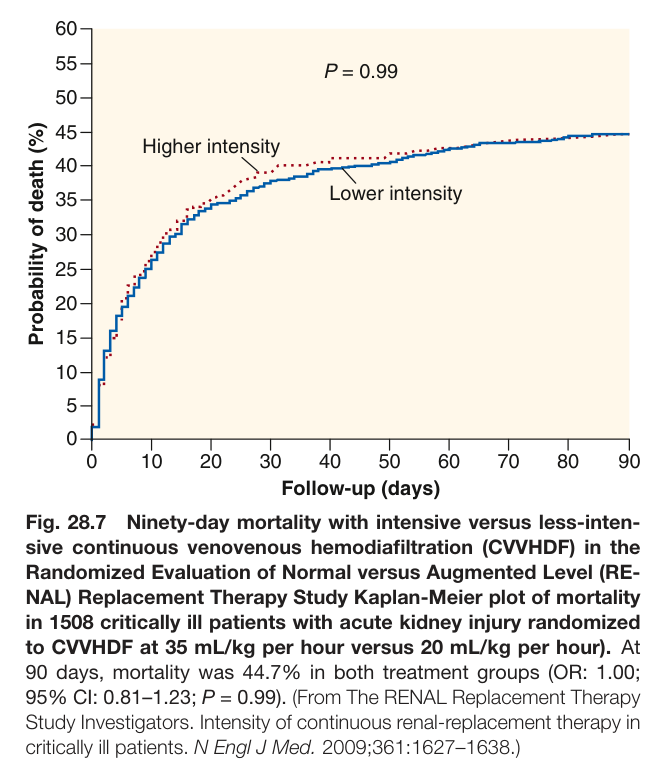

Fig. 28.7 Ninety-day mortality with intensive versus less-inten- sive continuous venovenous hemodiafiltration (CVVHDF) in the Randomized Evaluation of Normal versus Augmented Level (RE- NAL) Replacement Therapy Study Kaplan-Meier plot of mortality in 1508 critically ill patients with acute kidney injury randomized to CVVHDF at 35 mL/kg per hour versus 20 mL/kg per hour). At 90 days, mortality was 44.7% in both treatment groups (OR: 1.00; 95% CI: 0.81–1.23; P = 0.99). (From The RENAL Replacement Therapy Study Investigators. Intensity of continuous renal-replacement therapy in critically ill patients. N Engl J Med. 2009;361:1627–1638.)

---

### Fig_28_8

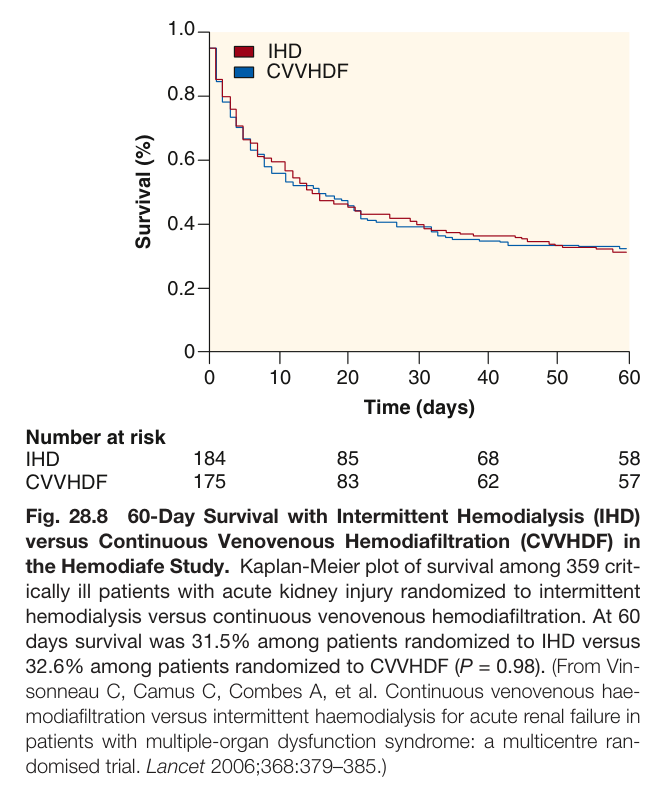

Fig. 28.8 60-Day Survival with Intermittent Hemodialysis (IHD) versus Continuous Venovenous Hemodiafiltration (CVVHDF) in the Hemodiafe Study. Kaplan-Meier plot of survival among 359 crit- ically ill patients with acute kidney injury randomized to intermittent hemodialysis versus continuous venovenous hemodiafiltration. At 60 days survival was 31.5% among patients randomized to IHD versus 32.6% among patients randomized to CVVHDF (P = 0.98). (From Vin- sonneau C, Camus C, Combes A, et al. Continuous venovenous hae- modiafiltration versus intermittent haemodialysis for acute renal failure in patients with multiple-organ dysfunction syndrome: a multicentre ran- domised trial. Lancet 2006;368:379–385.)

---

## Tables

### Table_28_1

#### Table Image

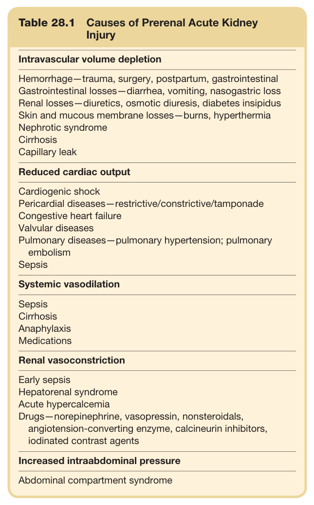

#### Table Data (CSV: [Table_28_1.csv](Table_28_1.csv))

```markdown
| Table Text (OCR) |
| :--- |
| Table 28.1  Causes of Prerenal Acute Kidney Injury Intravascular volume depletion    Hemorrhage—trauma, surgery, postpartum, gastrointestinal Gastrointestinal losses—diarrhea, vomiting, nasogastric loss Renal losses—diuretics, osmotic diuresis, diabetes insipidus Skin and mucous membrane losses—burns, hyperthermia Nephrotic syndrome Cirrhosis Capillary leak    Reduced cardiac output    Cardiogenic shock Pericardial diseases—restrictive/constrictive/tamponade Congestive heart failure Valvular diseases Pulmonary diseases—pulmonary hypertension; pulmonary embolism Sepsis    Systemic vasodilation    Sepsis Cirrhosis Anaphylaxis Medications    Renal vasoconstriction    Early sepsis Hepatorenal syndrome Acute hypercalcemia Drugs—norepinephrine, vasopressin, nonsteroidals, angiotension-converting enzyme, calcineurin inhibitors, iodinated contrast agents    Increased intraabdominal pressure    Abdominal compartment syndrome |
```

Table 28.1 Causes of Prerenal Acute Kidney Injury

---

### Table_28_2

#### Table Image

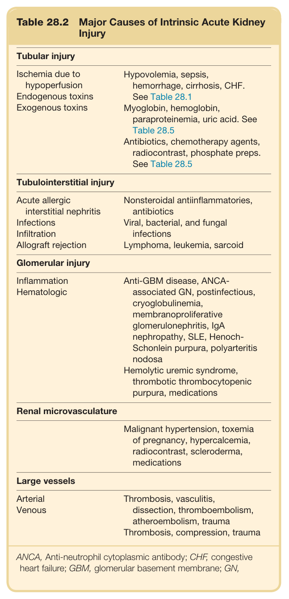

#### Table Data (CSV: [Table_28_2.csv](Table_28_2.csv))

```markdown
| Table Text (OCR) |
| :--- |
| Table 28.2  Major Causes of Intrinsic Acute Kidney Injury Tubular injury    Ischemia due to hypoperfusionEndogenous toxinsExogenous toxins  Hypovolemia, sepsis,hemorrhage, cirrhosis, CHF.See Table 28.1Myoglobin, hemoglobin,paraproteinemia, uric acid. See Table 28.5Antibiotics, chemotherapy agents,radiocontrast, phosphate preps.See Table 28.5    Tubulointerstitial injury    Acute allergic interstitial nephritisInfectionsInfiltrationAllograft rejection  Nonsteroidal antiinflammatories,antibioticsViral, bacterial, and fungal infectionsLymphoma, leukemia, sarcoid    Glomerular injury    InflammationHematologic  Anti-GBM disease, ANCA-associated GN, postinfectious,cryoglobulinemia,membranoproliferativeglomerulonephritis, IgAnephropathy, SLE, Henoch-Schonlein purpura, polyarteritis nodosaHemolytic uremic syndrome,thrombotic thrombocytopenic purpura, medications    Renal microvasculature      Malignant hypertension, toxemia of pregnancy, hypercalcemia,radiocontrast, scleroderma, medications    Large vessels    ArterialVenous  Thrombosis, vasculitis,dissection, thromboembolism,atheroembolism, traumaThrombosis, compression, trauma    ANCA, Anti-neutrophil cytoplasmic antibody; CHF, congestive heart failure; GBM, glomerular basement membrane; GN, |
```

Table 28.2 Major Causes of Intrinsic Acute Kidney Injury

---

### Table_28_3

#### Table Image

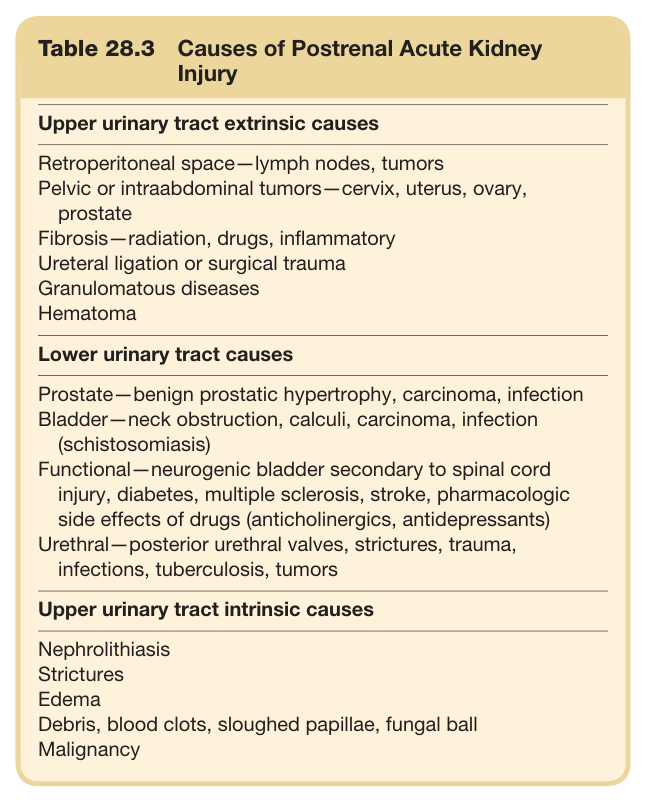

#### Table Data (CSV: [Table_28_3.csv](Table_28_3.csv))

```markdown
| Table Text (OCR) |
| :--- |
| Table 28.3 Causes of Postrenal Acute Kidney Injury Upper urinary tract extrinsic causes    Retroperitoneal space—lymph nodes, tumorsPelvic or intraabdominal tumors—cervix, uterus, ovary, prostateFibrosis—radiation, drugs, inflammatoryUreteral ligation or surgical traumaGranulomatous diseasesHematoma    Lower urinary tract causes    Prostate—benign prostatic hypertrophy, carcinoma, infectionBladder—neck obstruction, calculi, carcinoma, infection (schistosomiasis)Functional—neurogenic bladder secondary to spinal cord injury, diabetes, multiple sclerosis, stroke, pharmacologic side effects of drugs (anticholinergics, antidepressants)Urethral—posterior urethral valves, strictures, trauma, infections, tuberculosis, tumors    Upper urinary tract intrinsic causes    NephrolithiasisStricturesEdemaDebris, blood clots, sloughed papillae, fungal ballMalignancy |
```

Table 28.3 Causes of Postrenal Acute Kidney Injury

---

### Table_28_4

#### Table Image

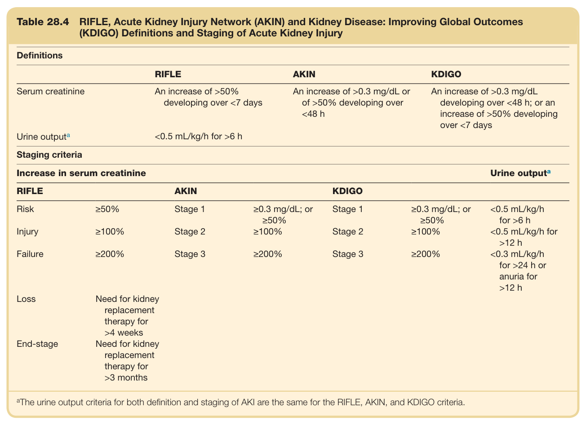

#### Table Data (CSV: [Table_28_4.csv](Table_28_4.csv))

```markdown
| Table Text (OCR) |
| :--- |
| Table 28.4  RIFLE, Acute Kidney Injury Network (AKIN) and Kidney Disease: Improving Global Outcomes (KDIGO) Definitions and Staging of Acute Kidney Injury Definitions RIFLE  AKIN  KDIGO    Serum creatinine  An increase of >50% developing over <7 days  An increase of >0.3 mg/dL or of >50% developing over <48 h  An increase of >0.3 mg/dL developing over <48 h; or an increase of >50% developing over <7 days    Urine outputa  <0.5 mL/kg/h for >6 h |
```

Table 28.4 RIFLE, Acute Kidney Injury Network (AKIN) and Kidney Disease: Improving Global Outcomes (KDIGO) Definitions and Staging of Acute Kidney Injury

---

### Table_28_5

#### Table Image

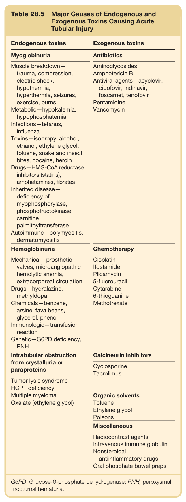

#### Table Data (CSV: [Table_28_5.csv](Table_28_5.csv))

```markdown
| Table Text (OCR) |
| :--- |
| Table 28.5  Major Causes of Endogenous and Exogenous Toxins Causing Acute Tubular Injury Endogenous toxins  Exogenous toxins    Myoglobinuria  Antibiotics    Muscle breakdown-trauma, compression,electric shock,hypothermia,hyperthermia, seizures,exercise, burnsMetabolic—hypokalemia,hypophosphatemiaInfections—tetanus,influenzaToxins—isopropyl alcohol,ethanol, ethylene glycol,toluene, snake and insectbites, cocaine, heroinDrugs—HMG-CoA reductaseinhibitors (statins),amphetamines, fibratesInherited disease—deficiency ofmyophosphorylase,phosphofructokinase,carnitinepalmitoyltransferaseAutoimmune—polymyositis,dermatomyositis  AminoglycosidesAmphotericin BAntiviral agents—acyclovir,cidofovir, indinavir,foscarnet, tenofovirPentamidineVancomycin    Hemoglobinuria  Chemotherapy    Mechanical—prosthetic valves, microangiopathic hemolytic anemia,extracorporeal circulationDrugs—hydralazine,methyldopaChemicals—benzene,arsine, fava beans,glycerol, phenolImmunologic—transfusionreactionGenetic—G6PD deficiency,PNH  CisplatinIfosfamidePlicamycin5-fluorouracilCytarabine6-thioguanineMethotrexate    Intratubular obstruction from crystalluria or paraproteins  Calcineurin inhibitors    CyclosporineTacrolimus    Tumor lysis syndromeHGPT deficiencyMultiple myelomaOxalate (ethylene glycol)  Organic solventsTolueneEthylene glycolPoisons    Miscellaneous    Radiocontrast agentsIntravenous immune globulinNonsteroidal antiinflammatory drugsOral phosphate bowel preps G6PD, Gliucose-6-phosphate dehydrogenase; PNH, paroxysmal nocturnal hematuria. |
```

Table 28.5 Major Causes of Endogenous and Exogenous Toxins Causing Acute Tubular Injury

---

### Table_28_6

#### Table Images (2 Parts)

- **Part 1 (Page 8)**:
  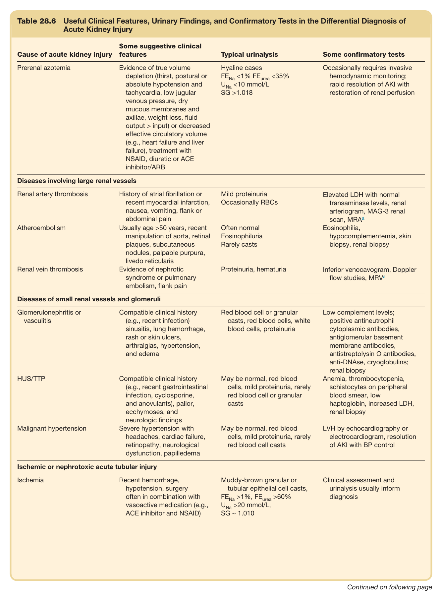

- **Part 2 (Page 9)**:
  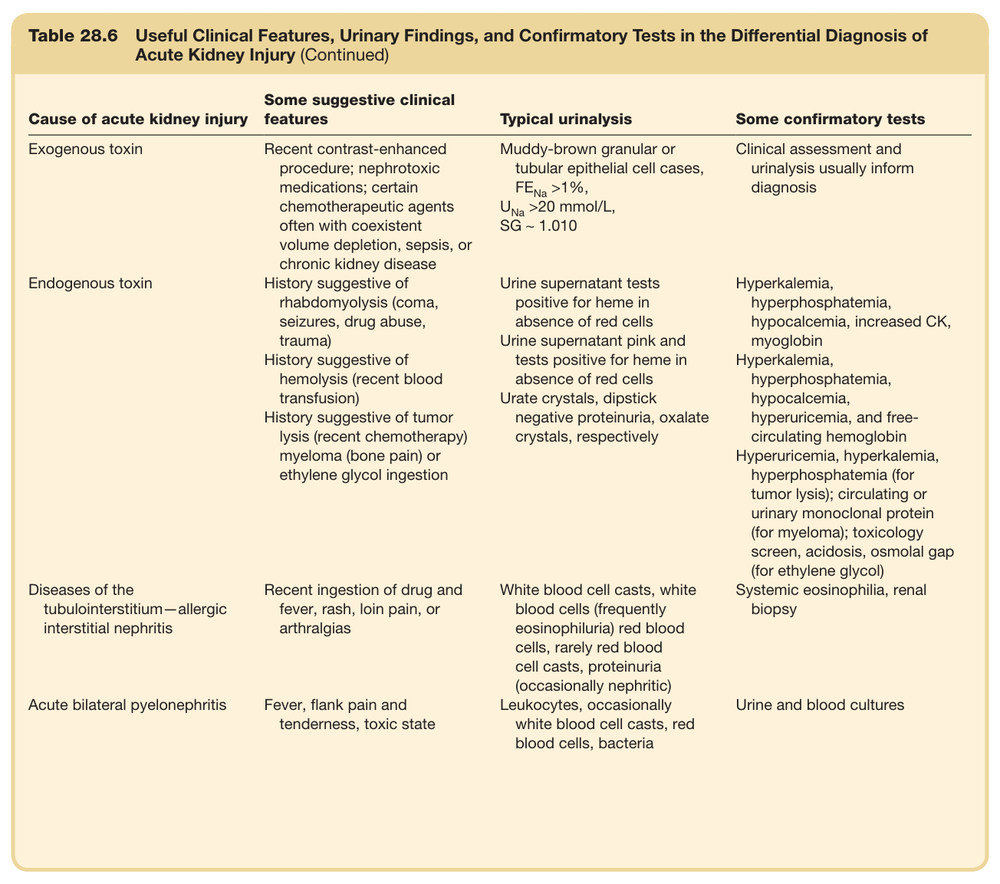

#### Table Data (CSV: [Table_28_6.csv](Table_28_6.csv))

```markdown
| Table Text (OCR) |
| :--- |
| Table 28.6  Useful Clinical Features, Urinary Findings, and Confirmatory Tests in the Differential Diagnosis of Acute Kidney Injury Cause of acute kidney injury  Some suggestive clinical features  Typical urinalysis  Some confirmatory tests    Prerenal azotemia  Evidence of true volume depletion (thirst, postural or absolute hypotension and tachycardia, low jugular venous pressure, dry mucous membranes and axillae, weight loss, fluid output > input) or decreased effective circulatory volume (e.g., heart failure and liver failure), treatment with NSAID, diuretic or ACE inhibitor/ARB  Hyaline cases FE_{Na} <1\%   FE_{urea} <35\%  U_{Na} <10  mmol/LSG >1.018  Occasionally requires invasive hemodynamic monitoring;rapid resolution of AKI with restoration of renal perfusion    Diseases involving large renal vessels    Renal artery thrombosis  History of atrial fibrillation or recent myocardial infarction, nausea, vomiting, flank or abdominal pain  Mild proteinuriaOccasionally RBCs  Elevated LDH with normal transaminase levels, renal arteriogram, MAG-3 renal scan,  MRA^a     Atheroembolism  Usually age >50 years, recent manipulation of aorta, retinal plaques, subcutaneous nodules, palpable purpura, livedo reticularis  Often normalEosinophiluriaRarely casts  Eosinophilia,hypocomplementemia, skin biopsy, renal biopsy    Renal vein thrombosis  Evidence of nephrotic syndrome or pulmonary embolism, flank pain  Proteinuria, hematuria  Inferior venocavogram, Doppler flow studies,  MRV^a     Diseases of small renal vessels and glomeruli    Glomerulonephritis or vasculitis  Compatible clinical history (e.g., recent infection) sinusitis, lung hemorrhage, rash or skin ulcers, arthralgias, hypertension, and edema  Red blood cell or granular casts, red blood cells, white blood cells, proteinuria  Low complement levels;positive antineutrophil cytoplasmic antibodies, antiglomerular basement membrane antibodies,antistreptolysin O antibodies,anti-DNAse, cryoglobulins; renal biopsy    HUS/TTP  Compatible clinical history (e.g., recent gastrointestinal infection, cyclosporine, and anovulants), pallor, ecchymoses, and neurologic findings  May be normal, red blood cells, mild proteinuria, rarely red blood cell or granular casts  Anemia, thrombocytopenia, schistocytes on peripheral blood smear, low haptoglobin, increased LDH, renal biopsy    Malignant hypertension  Severe hypertension with headaches, cardiac failure, retinopathy, neurological dysfunction, papilledema  May be normal, red blood cells, mild proteinuria, rarely red blood cell casts  LVH by echocardiography or electrocardiogram, resolution of AKI with BP control    Ischemic or nephrotoxic acute tubular injury    Ischemia  Recent hemorrhage, hypotension, surgery often in combination with vasoactive medication (e.g., ACE inhibitor and NSAID)  Muddy-brown granular or tubular epithelial cell casts, FE_{Na} >1\% ,  FE_{urea} >60\%  U_{Na} >20  mmol/L,SG ~ 1.010  Clinical assessment and urinalysis usually inform diagnosis    Exogenous toxin  Recent contrast-enhanced procedure; nephrotoxic medications; certain chemotherapeutic agents often with coexistent volume depletion, sepsis, or chronic kidney disease  Muddy-brown granular or tubular epithelial cell cases,  FE_{Na} >1\% , U_{Na} >20  mmol/L, SG ~ 1.010  Clinical assessment and urinalysis usually inform diagnosis    Endogenous toxin  History suggestive of rhabdomyolysis (coma, seizures, drug abuse, trauma)History suggestive of hemolysis (recent blood transfusion)History suggestive of tumor lysis (recent chemotherapy) myeloma (bone pain) or ethylene glycol ingestion  Urine supernatant tests positive for heme in absence of red cellsUrine supernatant pink and tests positive for heme in absence of red cellsUrate crystals, dipstick negative proteinuria, oxalate crystals, respectively  Hyperkalemia, hyperphosphatemia, hypocalcemia, increased CK, myoglobinHyperkalemia, hyperphosphatemia, hypocalcemia, hyperuricemia, and free-circulating hemoglobinHyperuricemia, hyperkalemia, hyperphosphatemia (for tumor lysis); circulating or urinary monoclonal protein (for myeloma); toxicology screen, acidosis, osmolal gap (for ethylene glycol)    Diseases of the tubulointerstitium-allergic interstitial nephritis  Recent ingestion of drug and fever, rash, loin pain, or arthralgias  White blood cell casts, white blood cells (frequently eosinophiluria) red blood cells, rarely red blood cell casts, proteinuria (occasionally nephritic)  Systemic eosinophilia, renal biopsy    Acute bilateral pyelonephritis  Fever, flank pain and tenderness, toxic state  Leukocytes, occasionally white blood cell casts, red blood cells, bacteria  Urine and blood cultures |
```

Table 28.6 Useful Clinical Features, Urinary Findings, and Confirmatory Tests in the Differential Diagnosis of Acute Kidney Injury

---

### Table_28_7

#### Table Image

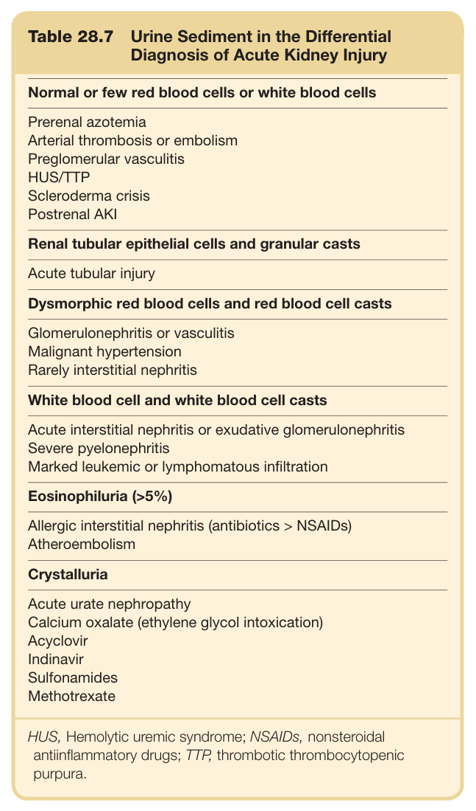

#### Table Data (CSV: [Table_28_7.csv](Table_28_7.csv))

```markdown
| Table Text (OCR) |
| :--- |
| Table 28.7  Urine Sediment in the Differential Diagnosis of Acute Kidney Injury Normal or few red blood cells or white blood cells    Prerenal azotemia    Arterial thrombosis or embolism    Preglomerular vasculitis    HUS/TTP    Scleroderma crisis    Postrenal AKI    Renal tubular epithelial cells and granular casts    Acute tubular injury    Dysmorphic red blood cells and red blood cell casts    Glomerulonephritis or vasculitis    Malignant hypertension    Rarely interstitial nephritis    White blood cell and white blood cell casts    Acute interstitial nephritis or exudative glomerulonephritis    Severe pyelonephritis    Marked leukemic or lymphomatous infiltration    Eosinophiluria (>5%)    Allergic interstitial nephritis (antibiotics > NSAIDs)    Atheroembolism    Crystalluria    Acute urate nephropathy    Calcium oxalate (ethylene glycol intoxication)    Acyclovir    Indinavir    Sulfonamides    Methotrexate    HUS, Hemolytic uremic syndrome; NSAIDs, nonsteroidal antiinflammatory drugs; TTP, thrombotic thrombocytopenic purpura. |
```

Table 28.7 Urine Sediment in the Differential Diagnosis of Acute Kidney Injury

---

### Table_28_8

#### Table Image

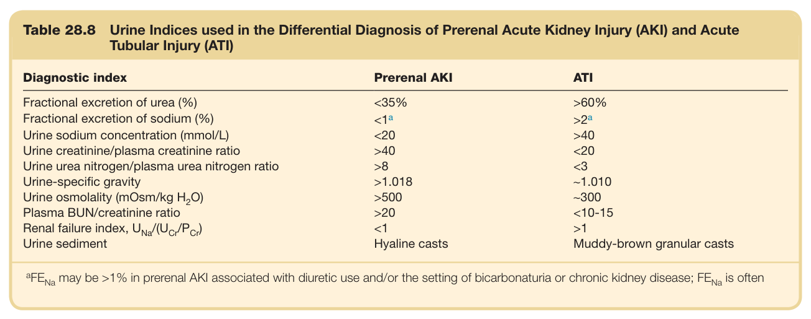

#### Table Data (CSV: [Table_28_8.csv](Table_28_8.csv))

```markdown
| Table Text (OCR) |
| :--- |
| Table 28.8 Urine Indices used in the Differential Diagnosis of Prerenal Acute Kidney Injury (AKI) and Acute Tubular Injury (ATI) Diagnostic index  Prerenal AKI  ATI    Fractional excretion of urea (%)  <35%  >60%    Fractional excretion of sodium (%)   <1^a    >2^a     Urine sodium concentration (mmol/L)  <20  >40    Urine creatinine/plasma creatinine ratio  >40  <20    Urine urea nitrogen/plasma urea nitrogen ratio  >8  <3    Urine-specific gravity  >1.018  ~1.010    Urine osmolality (mOsm/kg  H_2O )  >500  ~300    Plasma BUN/creatinine ratio  >20  <10-15    Renal failure index,  U_{Na}/(U_{Cr}/P_{Cr})   <1  >1    Urine sediment  Hyaline casts  Muddy-brown granular casts <sup>a</sup>FE<sub>Na</sub> may be >1% in prerenal AKI associated with diuretic use and/or the setting of bicarbonaturia or chronic kidney disease; FE<sub>Na</sub> is often |
```

Table 28.8 Urine Indices used in the Differential Diagnosis of Prerenal Acute Kidney Injury (AKI) and Acute Tubular Injury (ATI)

---

### Table_28_9

#### Table Images (2 Parts)

- **Part 1 (Page 15)**:
  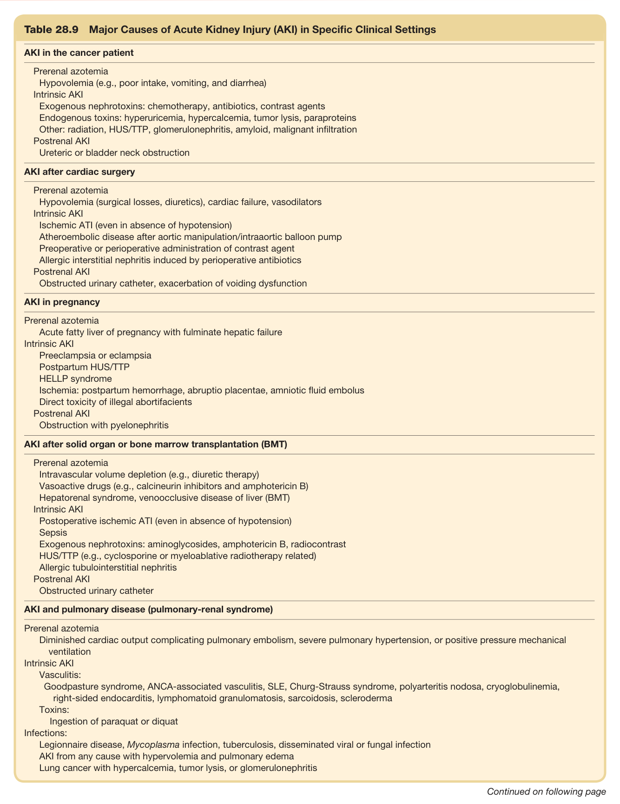

- **Part 2 (Page 16)**:
  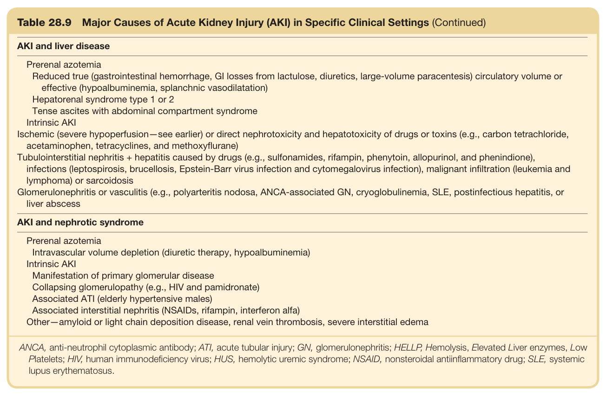

#### Table Data (CSV: [Table_28_9.csv](Table_28_9.csv))

```markdown
| Table Text (OCR) |
| :--- |
| Table 28.9  Major Causes of Acute Kidney Injury (AKI) in Specific Clinical Settings AKI in the cancer patient Prerenal azotemia    Hypovolemia (e.g., poor intake, vomiting, and diarrhea)    Intrinsic AKI    Exogenous nephrotoxins: chemotherapy, antibiotics, contrast agents    Endogenous toxins: hyperuricemia, hypercalcemia, tumor lysis, paraproteins    Other: radiation, HUS/TTP, glomerulonephritis, amyloid, malignant infiltration    Postrenal AKI    Ureteric or bladder neck obstruction |
```

Table 28.9 Major Causes of Acute Kidney Injury (AKI) in Specific Clinical Settings (Continued)

---

### Table_28_10

#### Table Image

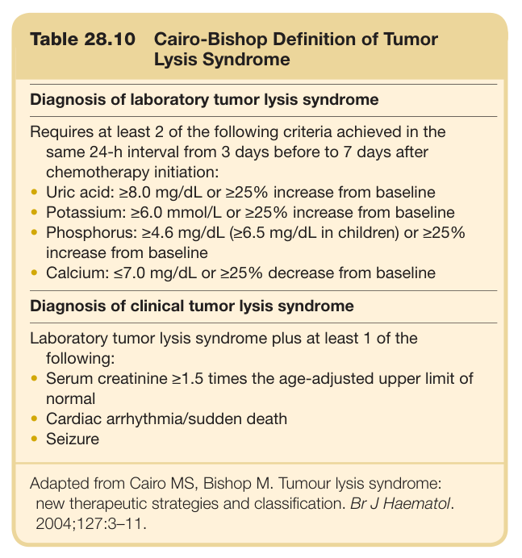

#### Table Data (CSV: [Table_28_10.csv](Table_28_10.csv))

```markdown
| Table Text (OCR) |
| :--- |
| Table 28.10  Cairo-Bishop Definition of Tumor Lysis Syndrome Diagnosis of laboratory tumor lysis syndrome Requires at least 2 of the following criteria achieved in the same 24-h interval from 3 days before to 7 days after chemotherapy initiation:Uric acid: ≥8.0 mg/dL or ≥25% increase from baselinePotassium: ≥6.0 mmol/L or ≥25% increase from baselinePhosphorus: ≥4.6 mg/dL (≥6.5 mg/dL in children) or ≥25% increase from baselineCalcium: ≤7.0 mg/dL or ≥25% decrease from baseline |
```

Table 28.10 Cairo-Bishop Definition of Tumor Lysis Syndrome

---

### Table_28_11

#### Table Image

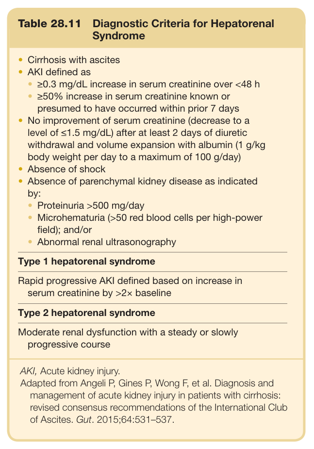

#### Table Data (CSV: [Table_28_11.csv](Table_28_11.csv))

```markdown
| Table Text (OCR) |
| :--- |
| Table 28.11  Diagnostic Criteria for Hepatorenal Syndrome •	 Cirrhosis with ascites •	 AKI defined as •	 ≥0.3 mg/dL increase in serum creatinine over <48 h ≥50% increase in serum creatinine known or presumed to have occurred within prior 7 days No improvement of serum creatinine (decrease to a level of ≤1.5 mg/dL) after at least 2 days of diuretic withdrawal and volume expansion with albumin (1 g/kg body weight per day to a maximum of 100 g/day) •	 Absence of shock •	 Absence of parenchymal kidney disease as indicated by: •	 Proteinuria >500 mg/day Microhematuria (>50 red blood cells per high-power field); and/or •	 Abnormal renal ultrasonography |
```

Table 28.11 Diagnostic Criteria for Hepatorenal Syndrome

---

### Table_28_12

#### Table Image

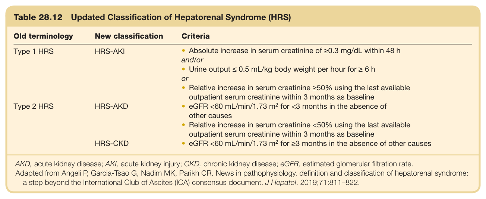

#### Table Data (CSV: [Table_28_12.csv](Table_28_12.csv))

```markdown
| Table Text (OCR) |
| :--- |
| Table 28.12  Updated Classification of Hepatorenal Syndrome (HRS) Old terminology  New classification  Criteria    Type 1 HRS  HRS-AKI  Absolute increase in serum creatinine of ≥0.3 mg/dL within 48 h and/orUrine output ≤ 0.5 mL/kg body weight per hour for ≥ 6 h orRelative increase in serum creatinine ≥50% using the last available outpatient serum creatinine within 3 months as baseline    Type 2 HRS  HRS-AKD  eGFR <60 mL/min/1.73  m^{2}  for <3 months in the absence of other causesRelative increase in serum creatinine <50% using the last available outpatient serum creatinine within 3 months as baseline    HRS-CKD  eGFR <60 mL/min/1.73  m^{2}  for ≥3 months in the absence of other causes AKD, acute kidney disease; AKI, acute kidney injury; CKD, chronic kidney disease; eGFR, estimated glomerular filtration rate. Adapted from Angeli P, Garcia-Tsao G, Nadim MK, Parikh CR. News in pathophysiology, definition and classification of hepatorenal syndrome: a step beyond the International Club of Ascites (ICA) consensus document. J Hepatol. 2019;71:811–822. |
```

Table 28.12 Updated Classification of Hepatorenal Syndrome (HRS)

---

### Table_28_13

#### Table Image

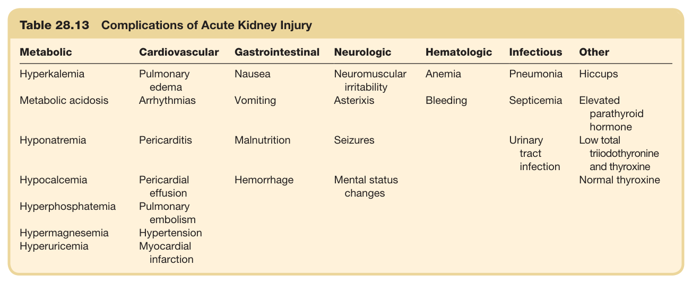

#### Table Data (CSV: [Table_28_13.csv](Table_28_13.csv))

```markdown
| Table Text (OCR) |
| :--- |
| Table 28.13  Complications of Acute Kidney Injury Metabolic  Cardiovascular  Gastrointestinal  Neurologic  Hematologic  Infectious  Other    Hyperkalemia  Pulmonary edema  Nausea  Neuromuscular irritability  Anemia  Pneumonia  Hiccups    Metabolic acidosis  Arrhythmias  Vomiting  Asterixis  Bleeding  Septicemia  Elevated parathyroid hormone    Hyponatremia  Pericarditis  Malnutrition  Seizures    Urinary tract infection  Low total triiodothyronine and thyroxine    Hypocalcemia  Pericardial effusion  Hemorrhage  Mental status changes      Normal thyroxine    Hyperphosphatemia  Pulmonary embolism              Hypermagnesemia  Hypertension              Hyperuricemia  Myocardial infarction |
```

Table 28.13 Complications of Acute Kidney Injury

---

### Table_28_14

#### Table Image

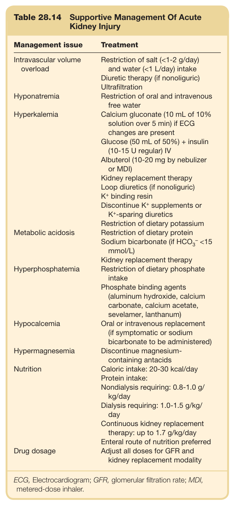

#### Table Data (CSV: [Table_28_14.csv](Table_28_14.csv))

```markdown
| Table Text (OCR) |
| :--- |
| Table 28.14  Supportive Management Of Acute Kidney Injury Management issue  Treatment    Intravascular volume overload  Restriction of salt (<1-2 g/day) and water (<1 L/day) intakeDiuretic therapy (if nonoliguric)Ultrafiltration    Hyponatremia  Restriction of oral and intravenous free water    Hyperkalemia  Calcium gluconate (10 mL of 10% solution over 5 min) if ECG changes are presentGlucose (50 mL of 50%) + insulin (10-15 U regular) IVAlbuterol (10-20 mg by nebulizer or MDI)Kidney replacement therapyLoop diuretics (if nonoliguric)K+binding resinDiscontinue K+supplements or K+-sparing diureticsRestriction of dietary potassium    Metabolic acidosis  Restriction of dietary proteinSodium bicarbonate (if HCO3-<15 mmol/L)Kidney replacement therapy    Hyperphosphatemia  Restriction of dietary phosphate intakePhosphate binding agents (aluminum hydroxide, calcium carbonate, calcium acetate, sevelamer, lanthanum)    Hypocalcemia  Oral or intravenous replacement (if symptomatic or sodium bicarbonate to be administered)    Hypermagnesemia  Discontinue magnesium-containing antacids    Nutrition  Caloric intake: 20-30 kcal/dayProtein intake:Nondialysis requiring: 0.8-1.0 g/kg/dayDialysis requiring: 1.0-1.5 g/kg/dayContinuous kidney replacement therapy: up to 1.7 g/kg/dayEnteral route of nutrition preferred    Drug dosage  Adjust all doses for GFR and kidney replacement modality ECG, Electrocardiogram; GFR, glomerular filtration rate; MDI, metered-dose inhaler. |
```

Table 28.14 Supportive Management Of Acute Kidney Injury

---

### Table_28_15

#### Table Image

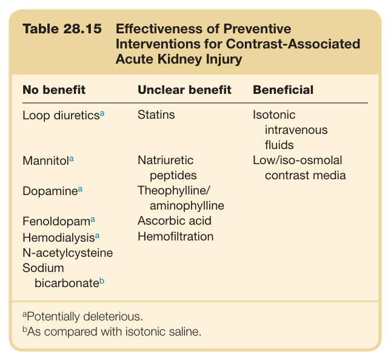

#### Table Data (CSV: [Table_28_15.csv](Table_28_15.csv))

```markdown
| Table Text (OCR) |
| :--- |
| Table 28.15 Effectiveness of Preventive Interventions for Contrast-Associated Acute Kidney Injury No benefit  Unclear benefit  Beneficial    Loop diuretics ^{a}   Statins  Isotonic intravenous fluids    Mannitol ^{a}   Natriuretic peptides  Low/iso-osmolal contrast media    Dopamine ^{a}   Theophylline/aminophylline      Fenoldopam ^{a}   Ascorbic acid      Hemodialysis ^{a}   Hemofiltration      N-acetylcysteine Sodium bicarbonate ^{b}          ^{a} Potentially deleterious. ^{b} As compared with isotonic saline. |
```

Table 28.15 Effectiveness of Preventive Interventions for Contrast-Associated Acute Kidney Injury

---

### Table_28_16

#### Table Image

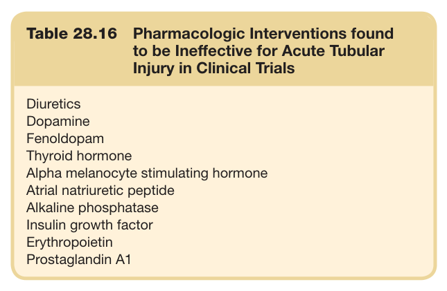

#### Table Data (CSV: [Table_28_16.csv](Table_28_16.csv))

```markdown
| Table Text (OCR) |
| :--- |
| Table 28.16 Pharmacologic Interventions found to be Ineffective for Acute Tubular Injury in Clinical Trials Diuretics    Dopamine    Fenoldopam    Thyroid hormone    Alpha melanocyte stimulating hormone    Atrial natriuretic peptide    Alkaline phosphatase    Insulin growth factor    Erythropoietin    Prostaglandin A1 |
```

Table 28.16 Pharmacologic Interventions found to be Ineffective for Acute Tubular Injury in Clinical Trials

---

### Table_28_18

#### Table Image

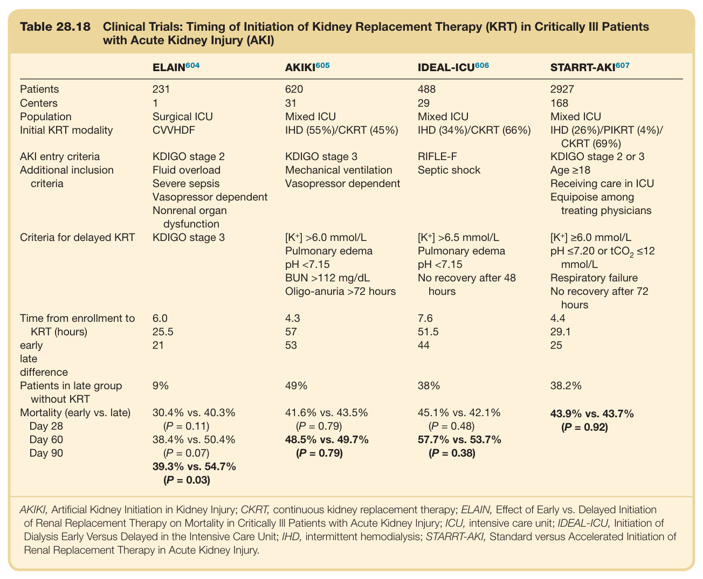

#### Table Data (CSV: [Table_28_18.csv](Table_28_18.csv))

```markdown
| Table Text (OCR) |
| :--- |
| Table 28.18  Clinical Trials: Timing of Initiation of Kidney Replacement Therapy (KRT) in Critically Ill Patients with Acute Kidney Injury (AKI) ELAIN ^{604}   AKIKI ^{605}   IDEAL-ICU ^{606}   STARRT-AKI ^{607}     Patients  231  620  488  2927    Centers  1  31  29  168    Population  Surgical ICU  Mixed ICU  Mixed ICU  Mixed ICU    Initial KRT modality  CVVHDF  IHD (55%)/CKRT (45%)  IHD (34%)/CKRT (66%)  IHD (26%)/PIKRT (4%)/CKRT (69%)    AKI entry criteria  KDIGO stage 2  KDIGO stage 3  RIFLE-F  KDIGO stage 2 or 3    Additional inclusion criteria  Fluid overload  Mechanical ventilation  Septic shock  Age ≥18    Severe sepsis  Vasopressor dependent    Receiving care in ICU    Vasopressor dependent      Equipoise among treating physicians    Nonrenal organ dysfunction          Criteria for delayed KRT  KDIGO stage 3  [K+] >6.0 mmol/L  [K+] >6.5 mmol/L  [K+] ≥6.0 mmol/L    Pulmonary edema  Pulmonary edema  pH ≤7.20 or tCO2 ≤12 mmol/L    pH <7.15  pH <7.15      BUN >112 mg/dL  No recovery after 48 hours  Respiratory failure    Oligo-anuria >72 hours    No recovery after 72 hours    Time from enrollment to KRT (hours)  6.0  4.3  7.6  4.4    25.5  57  51.5  29.1    early late difference  21  53  44  25    Patients in late group without KRT  9%  49%  38%  38.2%    Mortality (early vs. late)  30.4% vs. 40.3%  41.6% vs. 43.5%  45.1% vs. 42.1%  43.9% vs. 43.7%    Day 28  (P = 0.11)  (P = 0.79)  (P = 0.48)  (P = 0.92)    Day 60  38.4% vs. 50.4%  48.5% vs. 49.7%  57.7% vs. 53.7%      Day 90  (P = 0.07)  (P = 0.79)  (P = 0.38)        39.3% vs. 54.7%            (P = 0.03) AKIKI, Artificial Kidney Initiation in Kidney Injury; CKRT, continuous kidney replacement therapy; ELAIN, Effect of Early vs. Delayed Initiation of Renal Replacement Therapy on Mortality in Critically Ill Patients with Acute Kidney Injury; ICU, intensive care unit; IDEAL-ICU, Initiation of Dialysis Early Versus Delayed in the Intensive Care Unit; IHD, intermittent hemodialysis; STARRT-AKI, Standard versus Accelerated Initiation of Renal Replacement Therapy in Acute Kidney Injury. |
```

Table 28.18 Clinical Trials: Timing of Initiation of Kidney Replacement Therapy (KRT) in Critically Ill Patients with Acute Kidney Injury (AKI)

---
