# 29. Pathophysiology of Proteinuria - Figures and Tables Index

This document lists all figures and tables extracted from `29. Pathophysiology of Proteinuria.pdf`.

## Table of Contents
- [Figures](#figures)
- [Tables](#tables)

---

## Figures

### Fig_29_1

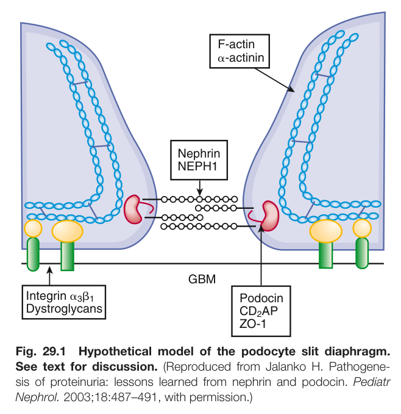

Fig. 29.1 Hypothetical model of the podocyte slit diaphragm. See text for discussion. (Reproduced from Jalanko H. Pathogene- sis of proteinuria: lessons learned from nephrin and podocin. Pediatr Nephrol. 2003;18:487–491, with permission.)

---

### Fig_29_2

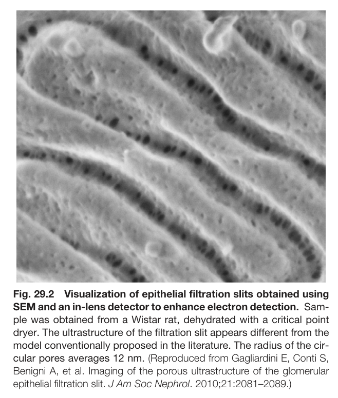

Fig. 29.2 Visualization of epithelial filtration slits obtained using SEM and an in-lens detector to enhance electron detection. Sam- ple was obtained from a Wistar rat, dehydrated with a critical point dryer. The ultrastructure of the filtration slit appears different from the model conventionally proposed in the literature. The radius of the cir- cular pores averages 12 nm. (Reproduced from Gagliardini E, Conti S, Benigni A, et al. Imaging of the porous ultrastructure of the glomerular epithelial filtration slit. J Am Soc Nephrol. 2010;21:2081–2089.)

---

### Fig_29_3

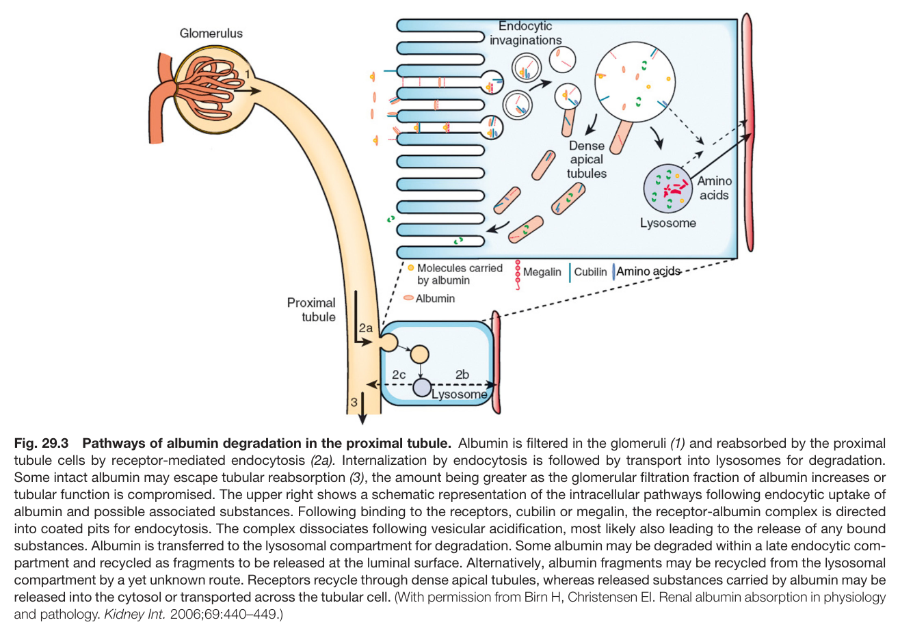

Fig. 29.3 Pathways of albumin degradation in the proximal tubule. Albumin is filtered in the glomeruli (1) and reabsorbed by the proxima tubule cells by receptor-mediated endocytosis (2a). Internalization by endocytosis is followed by transport into lysosomes for degradation. Some intact albumin may escape tubular reabsorption (3), the amount being greater as the glomerular filtration fraction of albumin increases or tubular function is compromised. The upper right shows a schematic representation of the intracellular pathways following endocytic uptake of albumin and possible associated substances. Following binding to the receptors, cubilin or megalin, the receptor-albumin complex is directed into coated pits for endocytosis. The complex dissociates following vesicular acidification, most likely also leading to the release of any bound substances. Albumin is transferred to the lysosomal compartment for degradation. Some albumin may be degraded within a late endocytic com- partment and recycled as fragments to be released at the luminal surface. Alternatively, albumin fragments may be recycled from the lysosoma compartment by a yet unknown route. Receptors recycle through dense apical tubules, whereas released substances carried by albumin may be released into the cytosol or transported across the tubular cell. (With permission from Birn H, Christensen EI. Renal albumin absorption in physiology and pathology. Kidney Int. 2006;69:440–449.)

---

### Fig_29_4

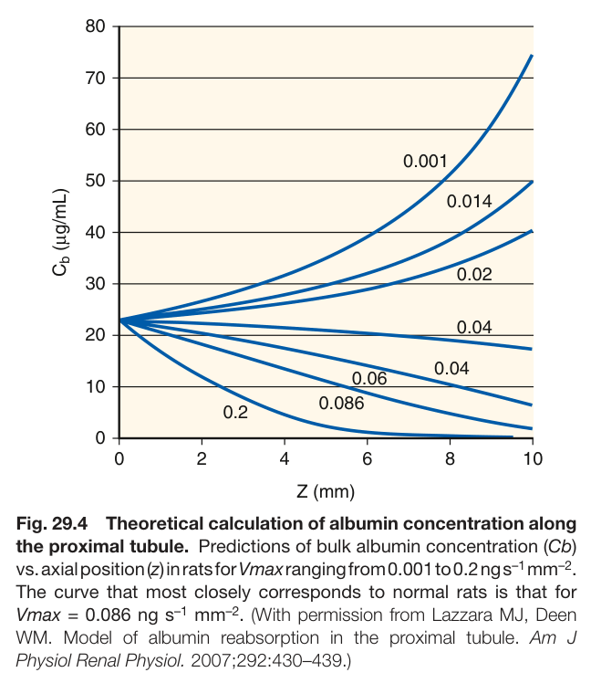

Fig. 29.4 Theoretical calculation of albumin concentration along the proximal tubule. Predictions of bulk albumin concentration (Cb) vs. axial position (z) in rats for Vmax ranging from 0.001 to 0.2 ng s–1 mm–2. The curve that most closely corresponds to normal rats is that for Vmax = 0.086 ng s–1 mm–2. (With permission from Lazzara MJ, Deen WM. Model of albumin reabsorption in the proximal tubule. Am J Physiol Renal Physiol. 2007;292:430–439.)

---

### Fig_29_5

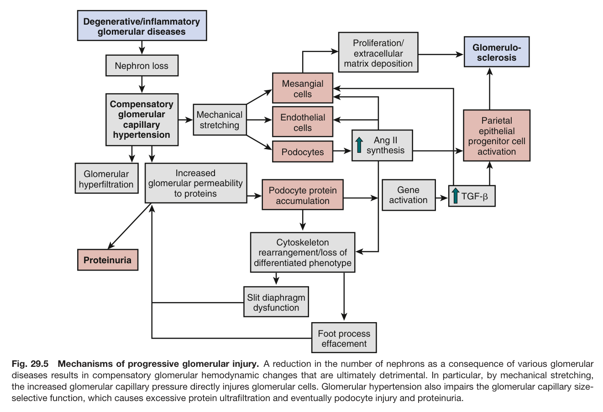

Fig. 29.5 Mechanisms of progressive glomerular injury. A reduction in the number of nephrons as a consequence of various glomerular diseases results in compensatory glomerular hemodynamic changes that are ultimately detrimental. In particular, by mechanical stretching, the increased glomerular capillary pressure directly injures glomerular cells. Glomerular hypertension also impairs the glomerular capillary size- selective function, which causes excessive protein ultrafiltration and eventually podocyte injury and proteinuria.

---

### Fig_29_6

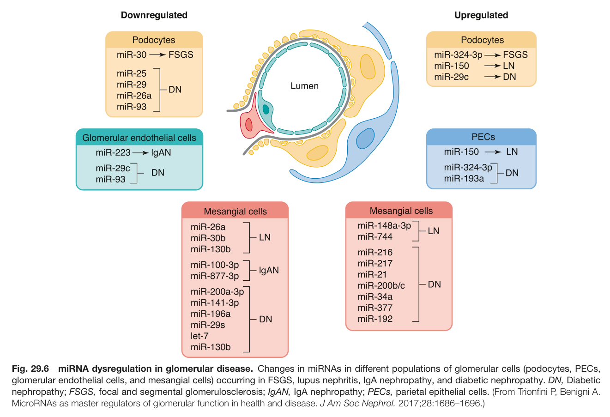

Fig. 29.6 miRNA dysregulation in glomerular disease. Changes in miRNAs in different populations of glomerular cells (podocytes, PECs, glomerular endothelial cells, and mesangial cells) occurring in FSGS, lupus nephritis, IgA nephropathy, and diabetic nephropathy. DN, Diabetic nephropathy; FSGS, focal and segmental glomerulosclerosis; IgAN, IgA nephropathy; PECs, parietal epithelial cells. (From Trionfini P, Benigni A. MicroRNAs as master regulators of glomerular function in health and disease. J Am Soc Nephrol. 2017;28:1686–1696.)

---

### Fig_29_7

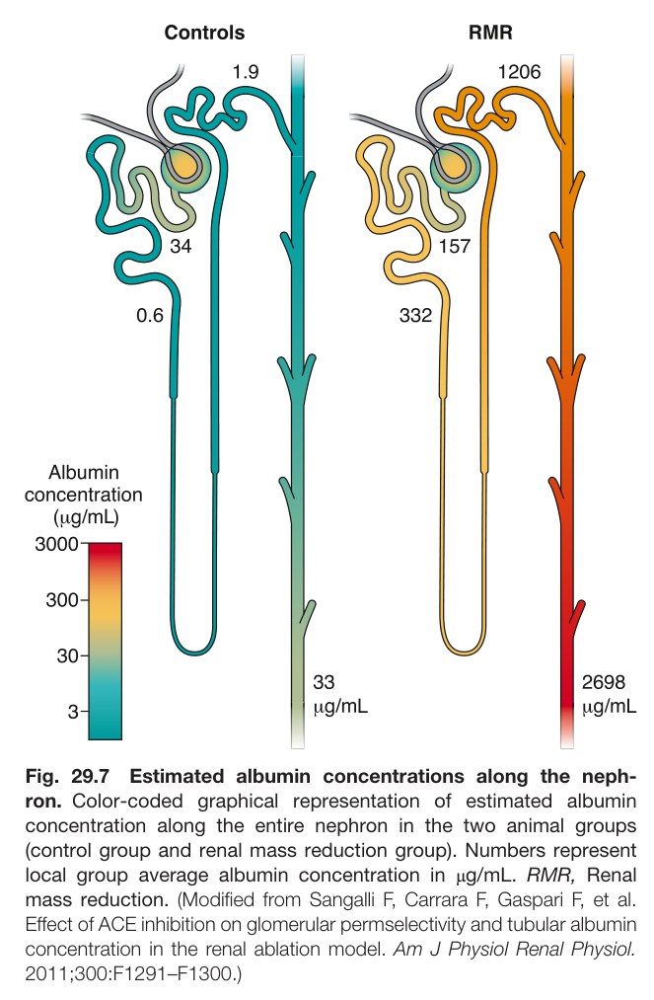

Fig. 29.7 Estimated albumin concentrations along the neph- ron. Color-coded graphical representation of estimated albumin concentration along the entire nephron in the two animal groups (control group and renal mass reduction group). Numbers represent local group average albumin concentration in μg/mL. RMR, Renal mass reduction. (Modified from Sangalli F, Carrara F, Gaspari F, et al. Effect of ACE inhibition on glomerular permselectivity and tubular albumin concentration in the renal ablation model. Am J Physiol Renal Physiol. 2011;300:F1291–F1300.)

---

### Fig_29_8

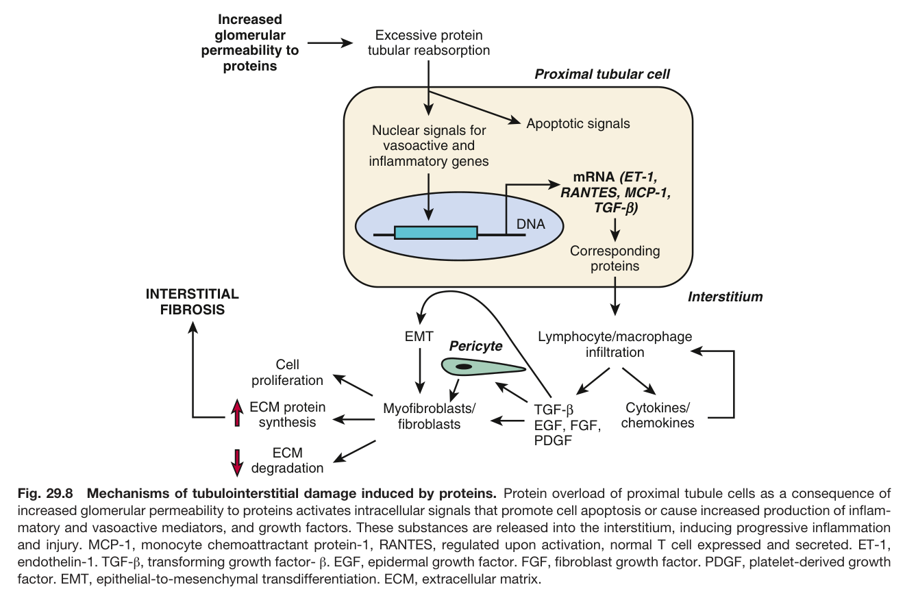

Fig. 29.8 Mechanisms of tubulointerstitial damage induced by proteins. Protein overload of proximal tubule cells as a consequence of increased glomerular permeability to proteins activates intracellular signals that promote cell apoptosis or cause increased production of inflam- matory and vasoactive mediators, and growth factors. These substances are released into the interstitium, inducing progressive inflammation and injury. MCP-1, monocyte chemoattractant protein-1, RANTES, regulated upon activation, normal T cell expressed and secreted. ET-1, endothelin-1. TGF-β, transforming growth factor- β. EGF, epidermal growth factor. FGF, fibroblast growth factor. PDGF, platelet-derived growth factor. EMT, epithelial-to-mesenchymal transdifferentiation. ECM, extracellular matrix.

---

### Fig_29_9

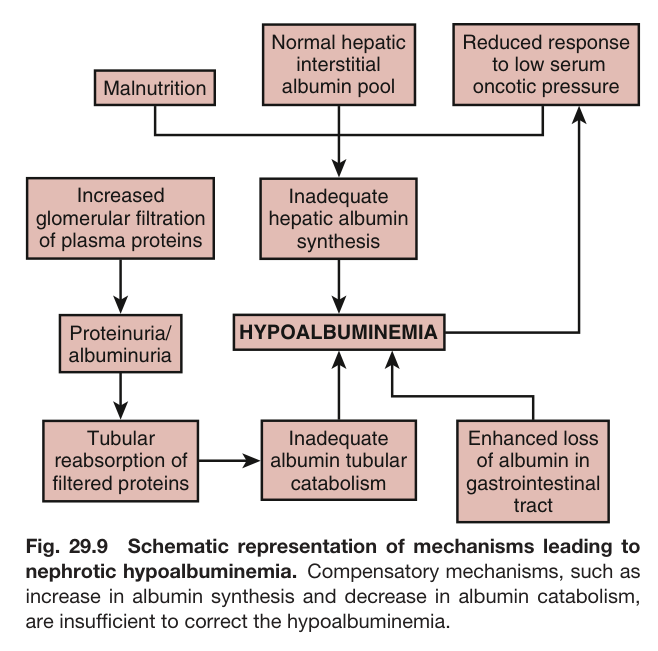

Fig. 29.9 Schematic representation of mechanisms leading to nephrotic hypoalbuminemia. Compensatory mechanisms, such as increase in albumin synthesis and decrease in albumin catabolism, are insufficient to correct the hypoalbuminemia.

---

### Fig_29_10

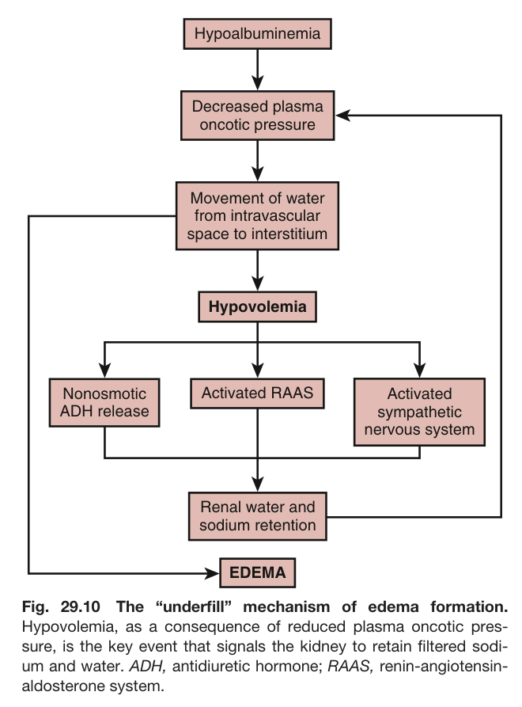

Fig. 29.10 The “underfill” mechanism of edema formation. Hypovolemia, as a consequence of reduced plasma oncotic pres- sure, is the key event that signals the kidney to retain filtered sodi- um and water. ADH, antidiuretic hormone; RAAS, renin-angiotensin- aldosterone system.

---

### Fig_29_11

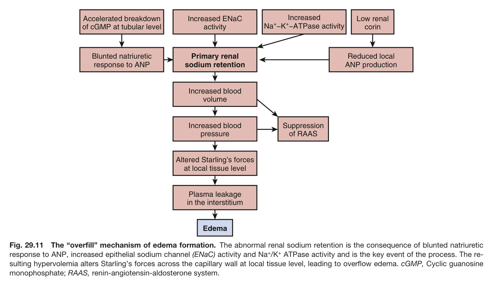

Fig. 29.11 The “overfill” mechanism of edema formation. The abnormal renal sodium retention is the consequence of blunted natriuretic response to ANP, increased epithelial sodium channel (ENaC) activity and Na+/K+ ATPase activity and is the key event of the process. The re- sulting hypervolemia alters Starling’s forces across the capillary wall at local tissue level, leading to overflow edema. cGMP, Cyclic guanosine monophosphate; RAAS, renin-angiotensin-aldosterone system.

---

### Fig_29_12

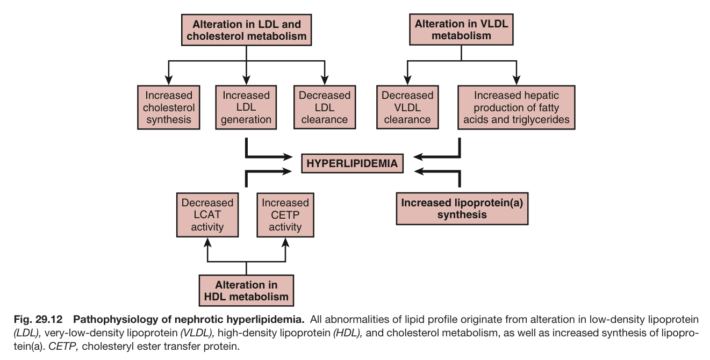

Fig. 29.12 Pathophysiology of nephrotic hyperlipidemia. All abnormalities of lipid profile originate from alteration in low-density lipoprotein (LDL), very-low-density lipoprotein (VLDL), high-density lipoprotein (HDL), and cholesterol metabolism, as well as increased synthesis of lipopro- tein(a). CETP, cholesteryl ester transfer protein.

---

### Fig_29_13

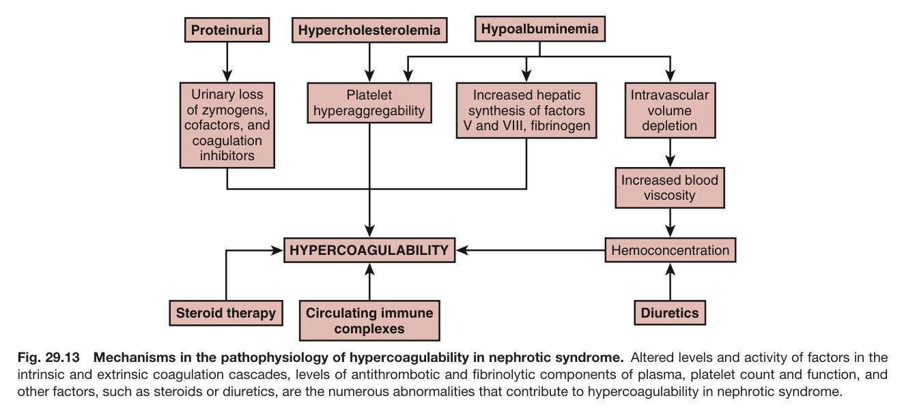

Fig. 29.13 Mechanisms in the pathophysiology of hypercoagulability in nephrotic syndrome. Altered levels and activity of factors in the intrinsic and extrinsic coagulation cascades, levels of antithrombotic and fibrinolytic components of plasma, platelet count and function, and other factors, such as steroids or diuretics, are the numerous abnormalities that contribute to hypercoagulability in nephrotic syndrome.

---

## Tables

*No tables resolved for this chapter.*
