# 30. Nephrotic Syndrome_ Primary and Secondary - Figures and Tables Index

This document lists all figures, tables and boxes extracted from `30. Nephrotic Syndrome_ Primary and Secondary.pdf`.

## Table of Contents
- [Figures](#figures)
- [Tables](#tables)
- [Boxes](#boxes)

---

## Figures

### Fig_30_1

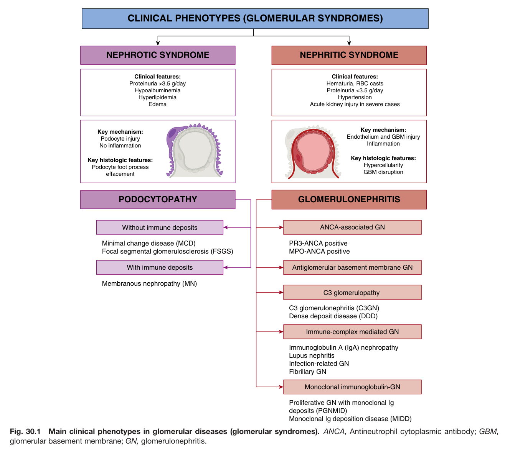

Fig. 30.1 Main clinical phenotypes in glomerular diseases (glomerular syndromes). ANCA, Antineutrophil cytoplasmic antibody; GBM, glomerular basement membrane; GN, glomerulonephritis.

---

### Fig_30_2

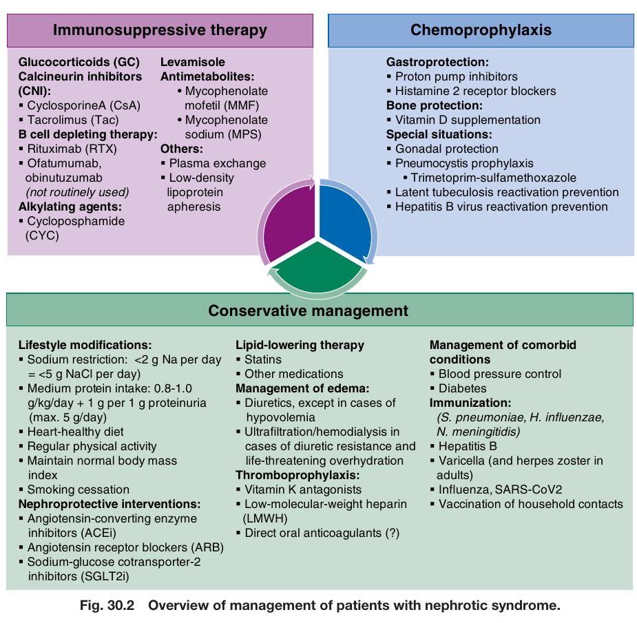

Fig. 30.2 Overview of management of patients with nephrotic syndrome.

---

### Fig_30_3

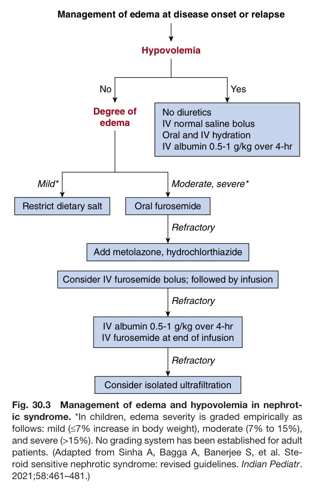

Fig. 30.3 Management of edema and hypovolemia in nephrot- ic syndrome. *In children, edema severity is graded empirically as follows: mild (≤7% increase in body weight), moderate (7% to 15%), and severe (>15%). No grading system has been established for adult patients. (Adapted from Sinha A, Bagga A, Banerjee S, et al. Ste- roid sensitive nephrotic syndrome: revised guidelines. Indian Pediatr. 2021;58:461–481.)

---

### Fig_30_4

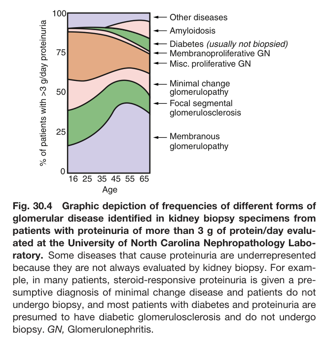

Fig. 30.4 Graphic depiction of frequencies of different forms of glomerular disease identified in kidney biopsy specimens from patients with proteinuria of more than 3 g of protein/day evalu- ated at the University of North Carolina Nephropathology Labo- ratory. Some diseases that cause proteinuria are underrepresented because they are not always evaluated by kidney biopsy. For exam- ple, in many patients, steroid-responsive proteinuria is given a pre- sumptive diagnosis of minimal change disease and patients do not undergo biopsy, and most patients with diabetes and proteinuria are presumed to have diabetic glomerulosclerosis and do not undergo biopsy. GN, Glomerulonephritis.

---

### Fig_30_5

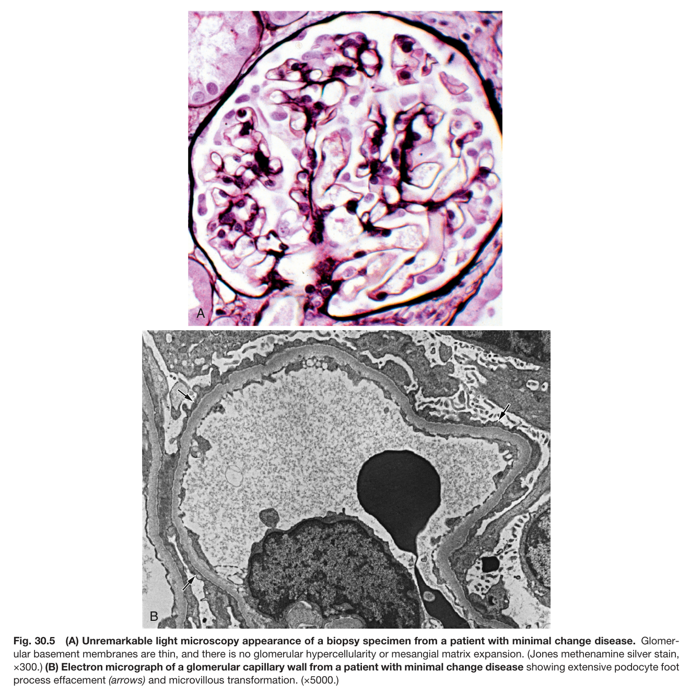

Fig. 30.5 (A) Unremarkable light microscopy appearance of a biopsy specimen from a patient with minimal change disease. Glomer- ular basement membranes are thin, and there is no glomerular hypercellularity or mesangial matrix expansion. (Jones methenamine silver stain, ×300.) (B) Electron micrograph of a glomerular capillary wall from a patient with minimal change disease showing extensive podocyte foot process effacement (arrows) and microvillous transformation. (×5000.)

---

### Fig_30_6

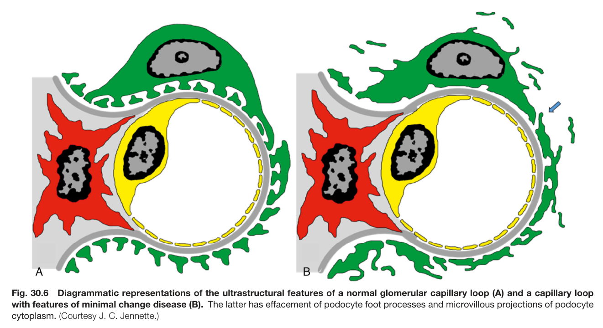

Fig. 30.6 Diagrammatic representations of the ultrastructural features of a normal glomerular capillary loop (A) and a capillary loop with features of minimal change disease (B). The latter has effacement of podocyte foot processes and microvillous projections of podocyte cytoplasm. (Courtesy J. C. Jennette.)

---

### Fig_30_7

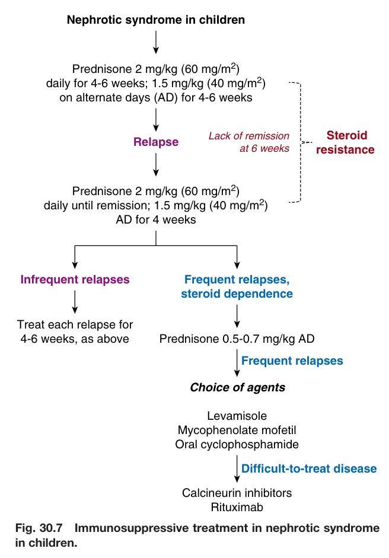

Fig. 30.7 )—both associated with similar outcomes.<sup>131</sup> Therapy should be given for 8 to 12 weeks total at 60 mg/ m<sup>2</sup>/day (or 2 mg/kg/day; maximum 60 mg) until remission (protein trace/nil for 3 consecutive days) and continued for 4 to 6 weeks, followed by 40 mg/m<sup>2</sup> (1.5 mg/kg, maximum 40 mg) on alternate days for 4 to 6 weeks. It has been shown that prolonged therapy, although it may delay the first relapse, does not affect the subsequent disease course (risk of subsequent or frequent relapses).<sup>38,40</sup>

---

### Fig_30_8

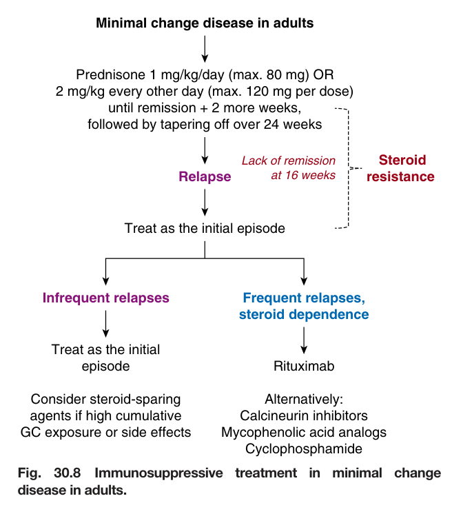

Fig. 30.8 Immunosuppressive treatment in minimal change disease in adults.

---

### Fig_30_9

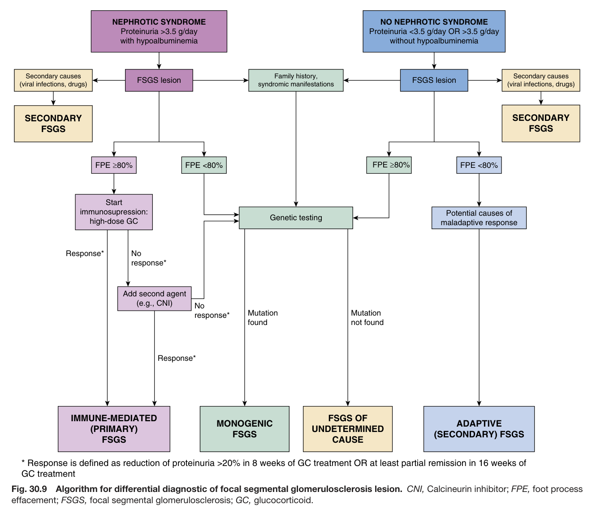

Fig. 30.9 Algorithm for differential diagnostic of focal segmental glomerulosclerosis lesion. CNI, Calcineurin inhibitor; FPE, foot process effacement; FSGS, focal segmental glomerulosclerosis; GC, glucocorticoid.

---

### Fig_30_10

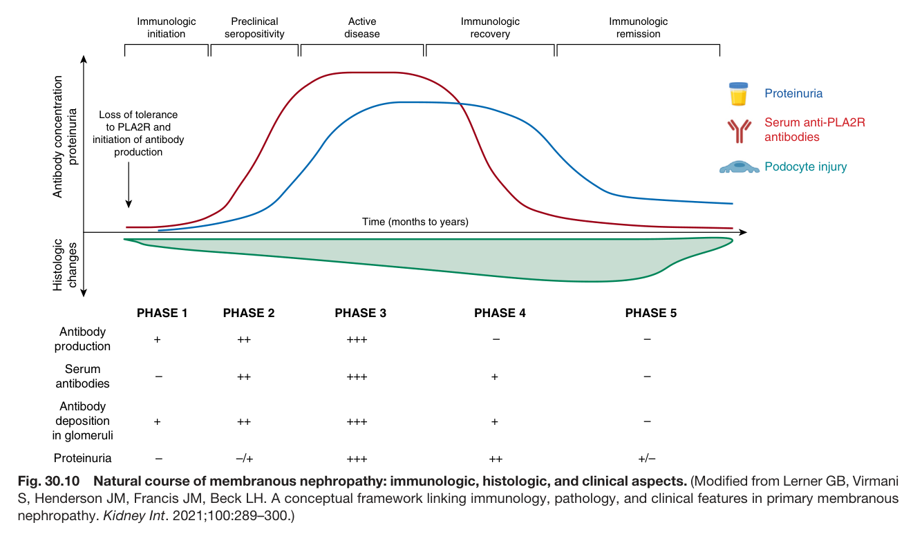

Fig. 30.10 Natural course of membranous nephropathy: immunologic, histologic, and clinical aspects. (Modified from Lerner GB, Virman S, Henderson JM, Francis JM, Beck LH. A conceptual framework linking immunology, pathology, and clinical features in primary membranous nephropathy. Kidney Int. 2021;100:289–300.)

---

### Fig_30_11

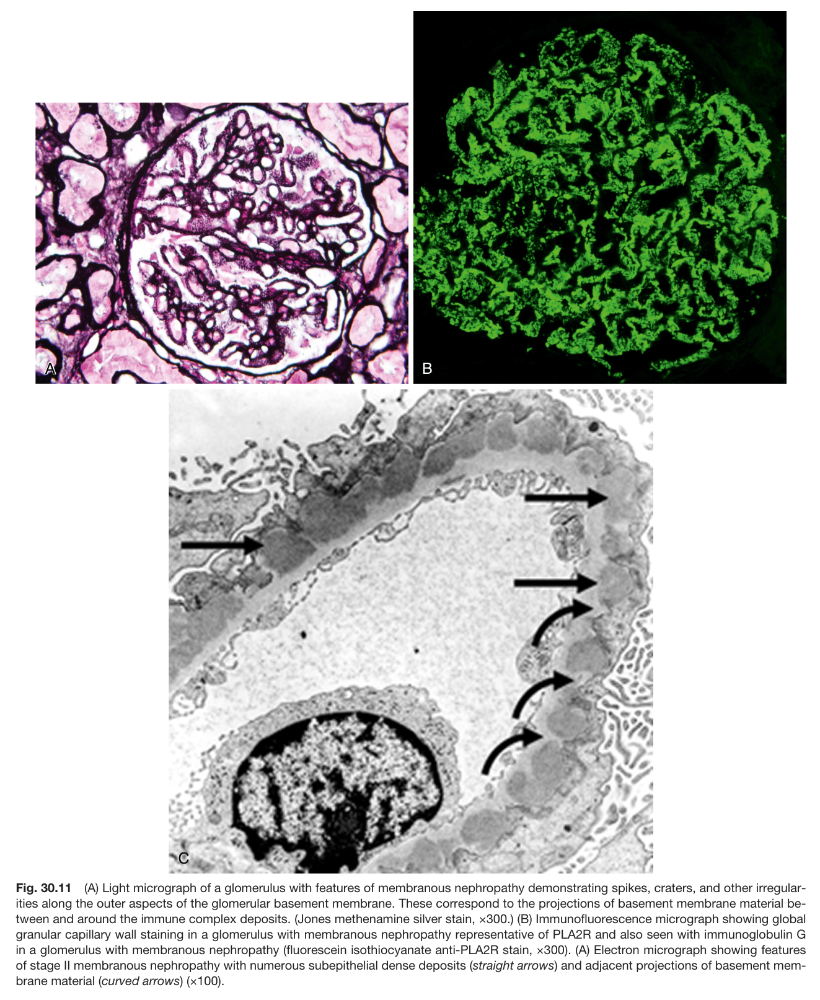

Fig. 30.11 (A) Light micrograph of a glomerulus with features of membranous nephropathy demonstrating spikes, craters, and other irregular- ities along the outer aspects of the glomerular basement membrane. These correspond to the projections of basement membrane material be- tween and around the immune complex deposits. (Jones methenamine silver stain, ×300.) (B) Immunofluorescence micrograph showing globa granular capillary wall staining in a glomerulus with membranous nephropathy representative of PLA2R and also seen with immunoglobulin G in a glomerulus with membranous nephropathy (fluorescein isothiocyanate anti-PLA2R stain, ×300). (A) Electron micrograph showing features of stage II membranous nephropathy with numerous subepithelial dense deposits (straight arrows) and adjacent projections of basement mem- brane material (curved arrows) (×100).

---

### Fig_30_12

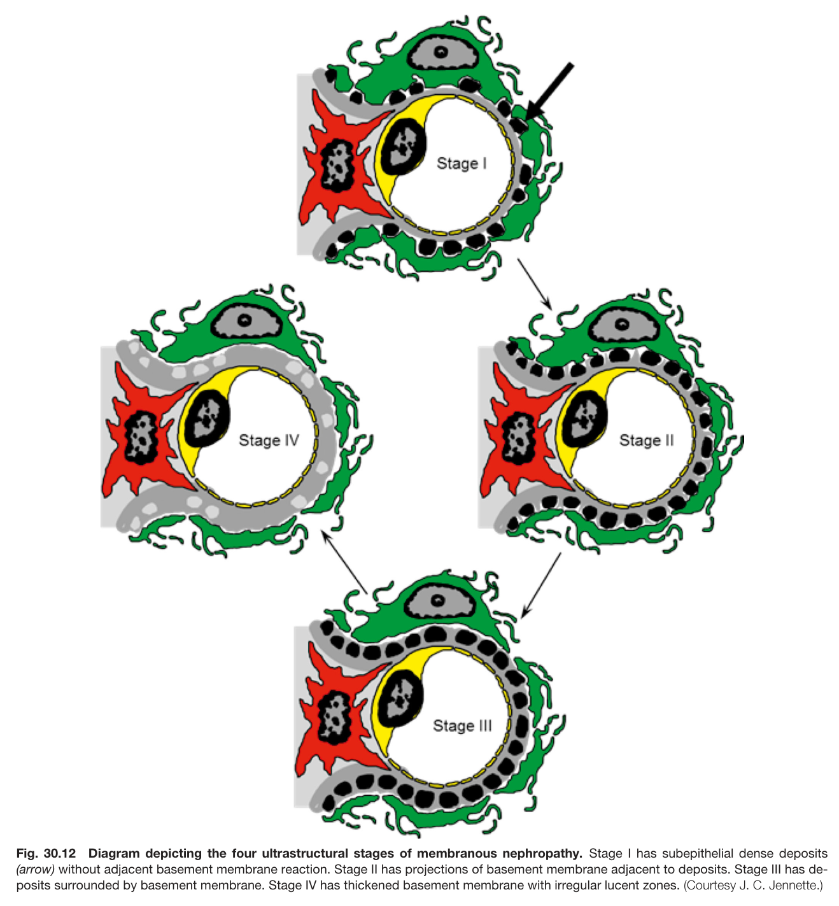

Fig. 30.12 Diagram depicting the four ultrastructural stages of membranous nephropathy. Stage I has subepithelial dense deposits (arrow) without adjacent basement membrane reaction. Stage II has projections of basement membrane adjacent to deposits. Stage III has de posits surrounded by basement membrane. Stage IV has thickened basement membrane with irregular lucent zones. (Courtesy J. C. Jennette.)

---

### Fig_30_13

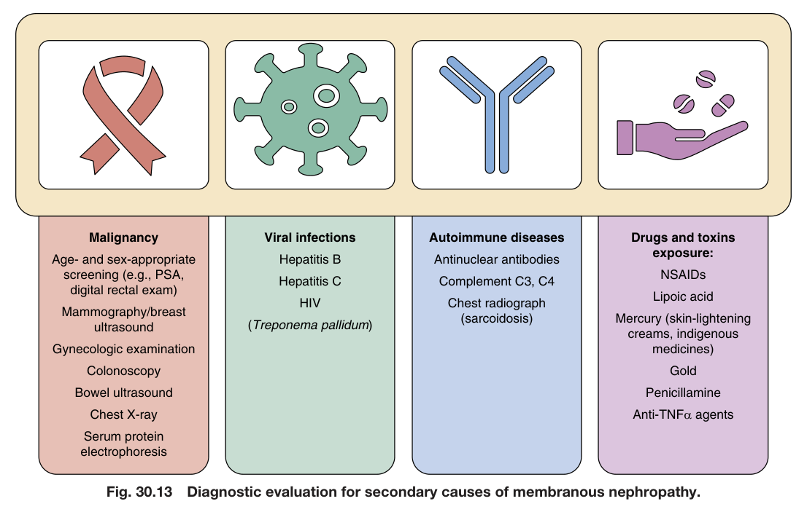

Fig. 30.13 Diagnostic evaluation for secondary causes of membranous nephropathy.

---

### Fig_30_14

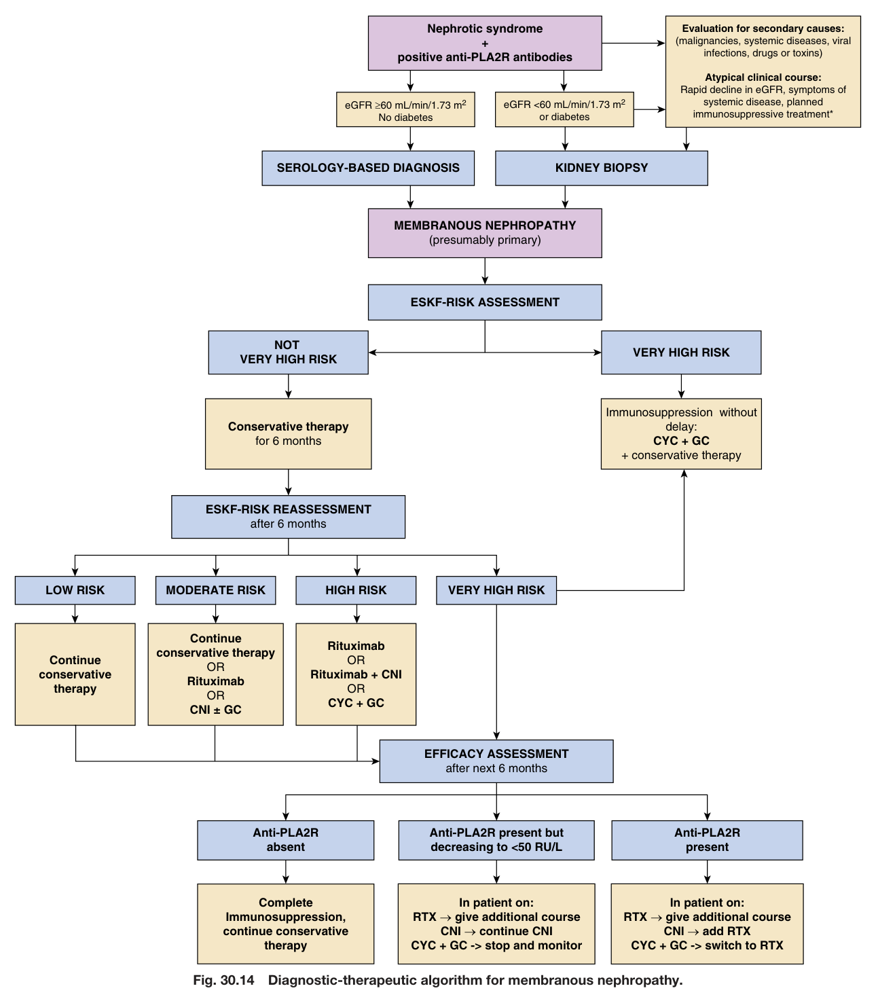

Fig. 30.14 Diagnostic-therapeutic algorithm for membranous nephropathy.

---

### Fig_30_15

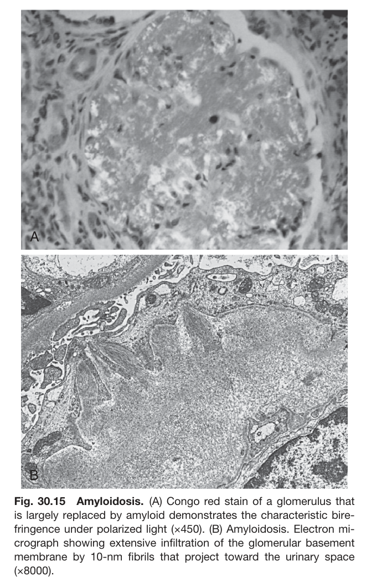

Fig. 30.15 Amyloidosis. (A) Congo red stain of a glomerulus that is largely replaced by amyloid demonstrates the characteristic bire- fringence under polarized light (×450). (B) Amyloidosis. Electron mi- crograph showing extensive infiltration of the glomerular basement membrane by 10-nm fibrils that project toward the urinary space (×8000).

---

### Fig_30_16

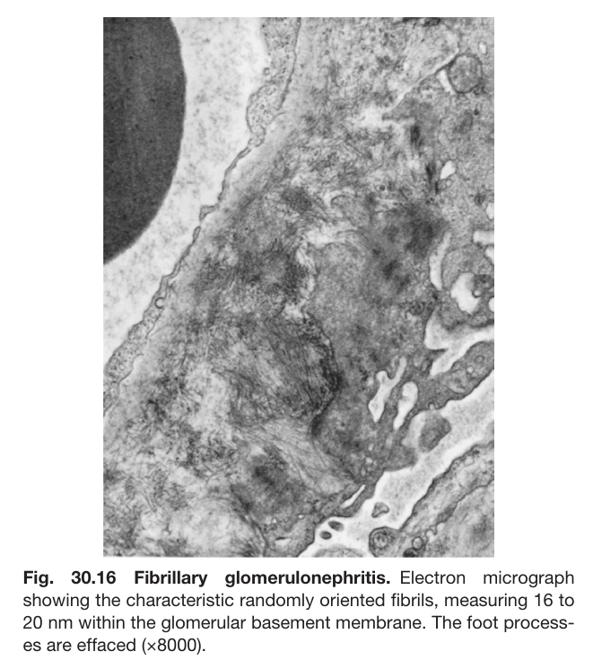

Fig. 30.16 Fibrillary glomerulonephritis. Electron micrograph showing the characteristic randomly oriented fibrils, measuring 16 to 20 nm within the glomerular basement membrane. The foot process- es are effaced (×8000).

---

### Fig_30_17

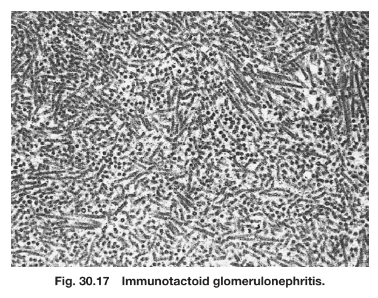

Fig. 30.17 Immunotactoid glomerulonephritis.

---

### Fig_30_18

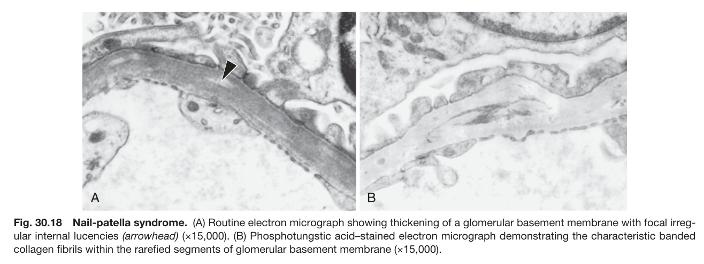

Fig. 30.18 Nail-patella syndrome. (A) Routine electron micrograph showing thickening of a glomerular basement membrane with focal irreg- ular internal lucencies (arrowhead) (×15,000). (B) Phosphotungstic acid–stained electron micrograph demonstrating the characteristic banded collagen fibrils within the rarefied segments of glomerular basement membrane (×15,000).

---

## Tables

### Table_30_1

#### Table Image

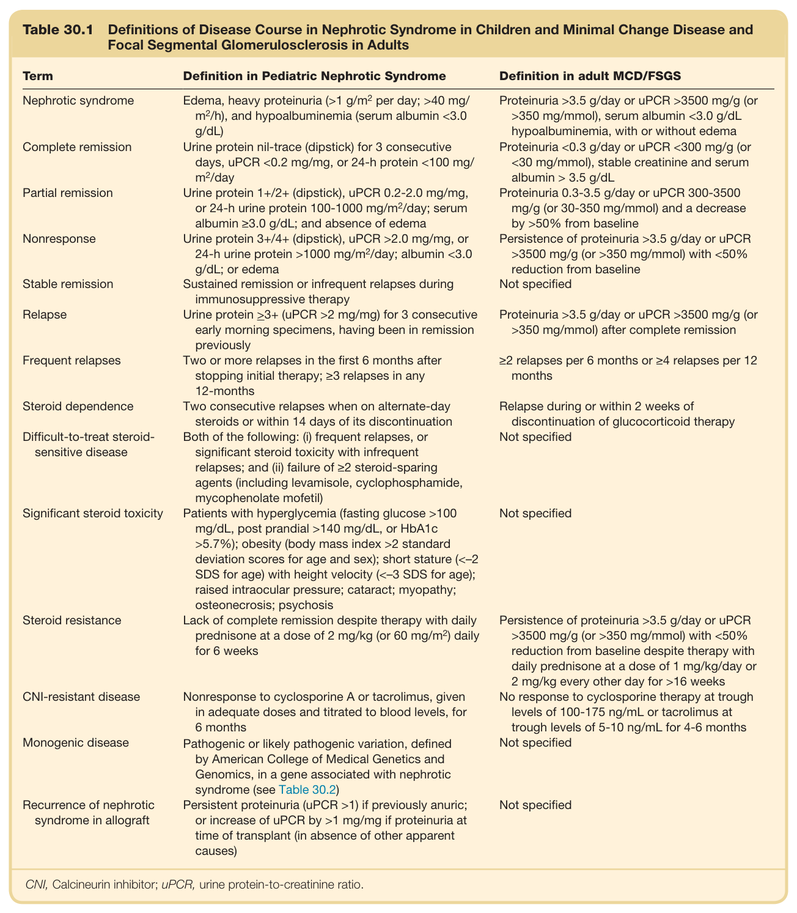

#### Table Data (CSV: [Table_30_1.csv](Table_30_1.csv))

```markdown
| Table Text (OCR) |
| :--- |
| Table 30.1  Definitions of Disease Course in Nephrotic Syndrome in Children and Minimal Change Disease and Focal Segmental Glomerulosclerosis in Adults Term  Definition in Pediatric Nephrotic Syndrome  Definition in adult MCD/FSGS    Nephrotic syndrome  Edema, heavy proteinuria (>1 g/m2 per day; >40 mg/m2/h), and hypoalbuminemia (serum albumin <3.0 g/dL)  Proteinuria >3.5 g/day or uPCR >3500 mg/g (or >350 mg/mmol), serum albumin <3.0 g/dL hypoalbuminemia, with or without edema    Complete remission  Urine protein nil-trace (dipstick) for 3 consecutive days, uPCR <0.2 mg/mg, or 24-h protein <100 mg/m2/day  Proteinuria <0.3 g/day or uPCR <300 mg/g (or <30 mg/mmol), stable creatinine and serum albumin >3.5 g/dL    Partial remission  Urine protein 1+/2+ (dipstick), uPCR 0.2-2.0 mg/mg, or 24-h urine protein 100-1000 mg/m2/day; serum albumin ≥3.0 g/dL; and absence of edema  Proteinuria 0.3-3.5 g/day or uPCR 300-3500 mg/g (or 30-350 mg/mmol) and a decrease by >50% from baseline    Nonresponse  Urine protein 3+/4+ (dipstick), uPCR >2.0 mg/mg, or 24-h urine protein >1000 mg/m2/day; albumin <3.0 g/dL; or edema  Persistence of proteinuria >3.5 g/day or uPCR >3500 mg/g (or >350 mg/mmol) with <50% reduction from baseline    Stable remission  Sustained remission or infrequent relapses during immunosuppressive therapy  Not specified    Relapse  Urine protein ≥3+ (uPCR >2 mg/mg) for 3 consecutive early morning specimens, having been in remission previously  Proteinuria >3.5 g/day or uPCR >3500 mg/g (or >350 mg/mmol) after complete remission    Frequent relapses  Two or more relapses in the first 6 months after stopping initial therapy; ≥3 relapses in any 12-months  ≥2 relapses per 6 months or ≥4 relapses per 12 months    Steroid dependence  Two consecutive relapses when on alternate-day steroids or within 14 days of its discontinuation  Relapse during or within 2 weeks of discontinuation of glucocorticoid therapy    Difficult-to-treat steroid-sensitive disease  Both of the following: (i) frequent relapses, or significant steroid toxicity with infrequent relapses; and (ii) failure of ≥2 steroid-sparing agents (including levamisole, cyclophosphamide, mycophenolate mofetil)  Not specified    Significant steroid toxicity  Patients with hyperglycemia (fasting glucose >100 mg/dL, post prandial >140 mg/dL, or HbA1c >5.7%); obesity (body mass index >2 standard deviation scores for age and sex); short stature (<-2 SDS for age) with height velocity (<-3 SDS for age); raised intraocular pressure; cataract; myopathy; osteonecrosis; psychosis  Not specified    Steroid resistance  Lack of complete remission despite therapy with daily prednisone at a dose of 2 mg/kg (or 60 mg/m2) daily for 6 weeks  Persistence of proteinuria >3.5 g/day or uPCR >3500 mg/g (or >350 mg/mmol) with <50% reduction from baseline despite therapy with daily prednisone at a dose of 1 mg/kg/day or 2 mg/kg every other day for >16 weeks    CNI-resistant disease  Nonresponse to cyclosporine A or tacrolimus, given in adequate doses and titrated to blood levels, for 6 months  No response to cyclosporine therapy at trough levels of 100-175 ng/mL or tacrolimus at trough levels of 5-10 ng/mL for 4-6 months    Monogenic disease  Pathogenic or likely pathogenic variation, defined by American College of Medical Genetics and Genomics, in a gene associated with nephrotic syndrome (see Table 30.2)  Not specified    Recurrence of nephrotic syndrome in allograft  Persistent proteinuria (uPCR >1) if previously anuric; or increase of uPCR by >1 mg/mg if proteinuria at time of transplant (in absence of other apparent causes)  Not specified CNI, Calcineurin inhibitor; uPCR, urine protein-to-creatinine ratio. |
```

Table 30.1 Definitions of Disease Course in Nephrotic Syndrome in Children and Minimal Change Disease and Focal Segmental Glomerulosclerosis in Adults

---

### Table_30_2

#### Table Image

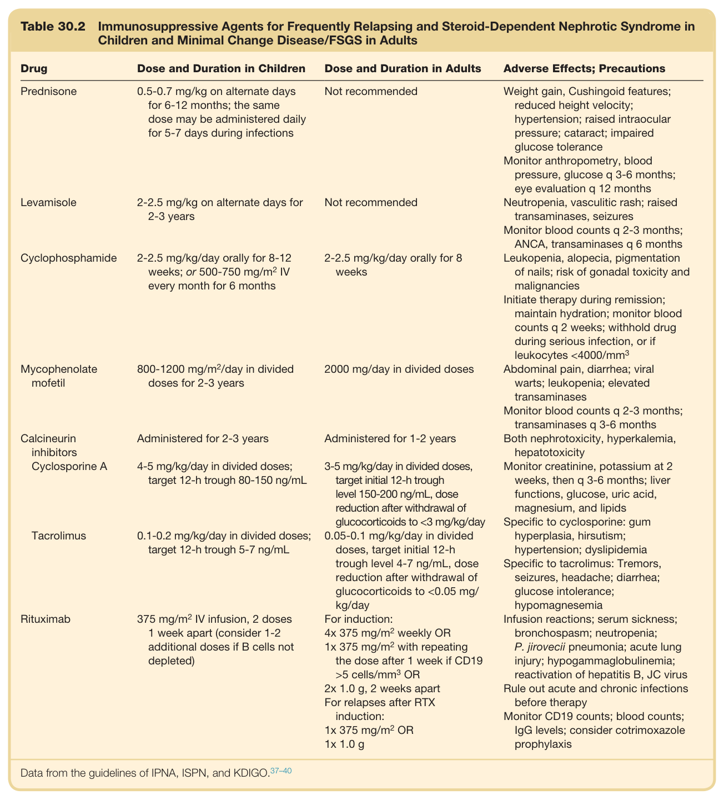

#### Table Data (CSV: [Table_30_2.csv](Table_30_2.csv))

```markdown
| Table Text (OCR) |
| :--- |
| Table 30.2  Immunosuppressive Agents for Frequently Relapsing and Steroid-Dependent Nephrotic Syndrome in Children and Minimal Change Disease/FSGS in Adults Drug  Dose and Duration in Children  Dose and Duration in Adults  Adverse Effects; Precautions    Prednisone  0.5-0.7 mg/kg on alternate days for 6-12 months; the same dose may be administered daily for 5-7 days during infections  Not recommended  Weight gain, Cushingoid features; reduced height velocity; hypertension; raised intraocular pressure; cataract; impaired glucose toleranceMonitor anthropometry, blood pressure, glucose q 3-6 months; eye evaluation q 12 months    Levamisole  2-2.5 mg/kg on alternate days for 2-3 years  Not recommended  Neutropenia, vasculitic rash; raised transaminases, seizuresMonitor blood counts q 2-3 months; ANCA, transaminases q 6 months    Cyclophosphamide  2-2.5 mg/kg/day orally for 8-12 weeks; or 500-750 mg/m2 IV every month for 6 months  2-2.5 mg/kg/day orally for 8 weeks  Leukopenia, alopecia, pigmentation of nails; risk of gonadal toxicity and malignanciesInitiate therapy during remission; maintain hydration; monitor blood counts q 2 weeks; withhold drug during serious infection, or if leukocytes <4000/mm3    Mycophenolate mofetil  800-1200 mg/m2/day in divided doses for 2-3 years  2000 mg/day in divided doses  Abdominal pain, diarrhea; viral warts; leukopenia; elevated transaminasesMonitor blood counts q 2-3 months; transaminases q 3-6 months    Calcineurin inhibitors  Administered for 2-3 years  Administered for 1-2 years  Both nephrotoxicity, hyperkalemia, hepatotoxicity    Cyclosporine A  4-5 mg/kg/day in divided doses; target 12-h trough 80-150 ng/mL  3-5 mg/kg/day in divided doses, target initial 12-h trough level 150-200 ng/mL, dose reduction after withdrawal of glucocorticoids to <3 mg/kg/day  Monitor creatinine, potassium at 2 weeks, then q 3-6 months; liver functions, glucose, uric acid, magnesium, and lipids    Tacrolimus  0.1-0.2 mg/kg/day in divided doses; target 12-h trough 5-7 ng/mL  0.05-0.1 mg/kg/day in divided doses, target initial 12-h trough level 4-7 ng/mL, dose reduction after withdrawal of glucocorticoids to <0.05 mg/kg/day  Specific to cyclosporine: gum hyperplasia, hirsutism; hypertension; dyslipidemiaSpecific to tacrolimus: Tremors, seizures, headache; diarrhea; glucose intolerance; hypomagnesemia    Rituximab  375 mg/m2 IV infusion, 2 doses 1 week apart (consider 1-2 additional doses if B cells not depleted)  For induction:4x 375 mg/m2 weekly OR1x 375 mg/m2 with repeating the dose after 1 week if CD19 >5 cells/mm3 OR2x 1.0 g, 2 weeks apartFor relapses after RTX induction:1x 375 mg/m2 OR1x 1.0 g  Infusion reactions; serum sickness; bronchospasm; neutropenia; P. jirovecii pneumonia; acute lung injury; hypogammaglobulinemia; reactivation of hepatitis B, JC virusRule out acute and chronic infections before therapyMonitor CD19 counts; blood counts; IgG levels; consider cotrimoxazole prophylaxis Data from the guidelines of IPNA, ISPN, and KDIGO.<sup>37–40</sup> |
```

Table 30.2 Immunosuppressive Agents for Frequently Relapsing and Steroid-Dependent Nephrotic Syndrome in Children and Minimal Change Disease/FSGS in Adults

---

### Table_30_3

#### Table Image

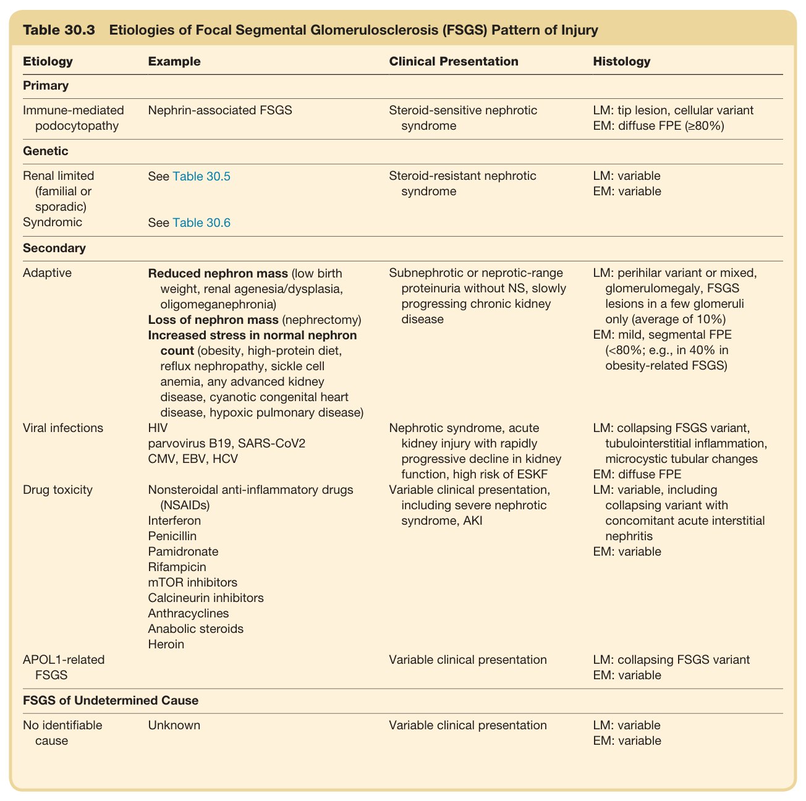

#### Table Data (CSV: [Table_30_3.csv](Table_30_3.csv))

```markdown
| Table Text (OCR) |
| :--- |
| Table 30.3  Etiologies of Focal Segmental Glomerulosclerosis (FSGS) Pattern of Injury Etiology  Example  Clinical Presentation  Histology    Primary    Immune-mediated podocytopathy  Nephrin-associated FSGS  Steroid-sensitive nephrotic syndrome  LM: tip lesion, cellular variantEM: diffuse FPE (≥80%)    Genetic    Renal limited (familial or sporadic)  See Table 30.5  Steroid-resistant nephrotic syndrome  LM: variableEM: variable    Syndromic  See Table 30.6        Secondary    Adaptive  Reduced nephron mass (low birth weight, renal agenesia/dysplasia, oligomeganephronia)Loss of nephron mass (nephrectomy)Increased stress in normal nephron count (obesity, high-protein diet, reflux nephropathy, sickle cell anemia, any advanced kidney disease, cyanotic congenital heart disease, hypoxic pulmonary disease)  Subnephrotic or neprotic-range proteinuria without NS, slowly progressing chronic kidney disease  LM: perihilar variant or mixed, glomerulomegaly, FSGS lesions in a few glomeruli only (average of 10%)EM: mild, segmental FPE (<80%; e.g., in 40% in obesity-related FSGS)    Viral infections  HIVparvovirus B19, SARS-CoV2CMV, EBV, HCV  Nephrotic syndrome, acute kidney injury with rapidly progressive decline in kidney function, high risk of ESKF  LM: collapsing FSGS variant, tubulointerstitial inflammation, microcystic tubular changesEM: diffuse FPE    Drug toxicity  Nonsteroidal anti-inflammatory drugs (NSAIDs)InterferonPenicillinPamidronateRifampicin mTOR inhibitorsCalcineurin inhibitorsAnthracyclinesAnabolic steroidsHeroin  Variable clinical presentation, including severe nephrotic syndrome, AKI  LM: variable, including collapsing variant with concomitant acute interstitial nephritisEM: variable    APOL1-related FSGS    Variable clinical presentation  LM: collapsing FSGS variantEM: variable    FSGS of Undetermined Cause    No identifiable cause  Unknown  Variable clinical presentation  LM: variableEM: variable |
```

Table 30.3 Etiologies of Focal Segmental Glomerulosclerosis (FSGS) Pattern of Injury

---

### Table_30_4

#### Table Image

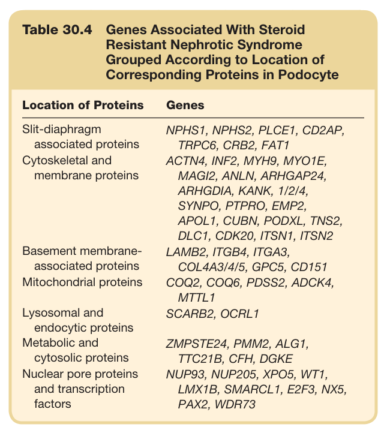

#### Table Data (CSV: [Table_30_4.csv](Table_30_4.csv))

```markdown
| Table Text (OCR) |
| :--- |
| Table 30.4  Genes Associated With Steroid Resistant Nephrotic Syndrome Grouped According to Location of Corresponding Proteins in Podocyte Location of Proteins  Genes    Slit-diaphragm associated proteins  NPHS1, NPHS2, PLCE1, CD2AP, TRPC6, CRB2, FAT1    Cytoskeletal and membrane proteins  ACTN4, INF2, MYH9, MYO1E, MAGI2, ANLN, ARHGAP24, ARHGDIA, KANK, 1/2/4, SYNPO, PTPRO, EMP2, APOL1, CUBN, PODXL, TNS2, DLC1, CDK20, ITSN1, ITSN2    Basement membrane-associated proteins  LAMB2, ITGB4, ITGA3, COL4A3/4/5, GPC5, CD151    Mitochondrial proteins  COQ2, COQ6, PDSS2, ADCK4, MTTL1    Lysosomal and endocytic proteins  SCARB2, OCRL1    Metabolic and cytosolic proteins  ZMPSTE24, PMM2, ALG1, TTC21B, CFH, DGKE    Nuclear pore proteins and transcription factors  NUP93, NUP205, XPO5, WT1, LMX1B, SMARCL1, E2F3, NX5, PAX2, WDR73 |
```

Table 30.4 Genes Associated With Steroid Resistant Nephrotic Syndrome Grouped According to Location of Corresponding Proteins in Podocyte

---

### Table_30_5

#### Table Image

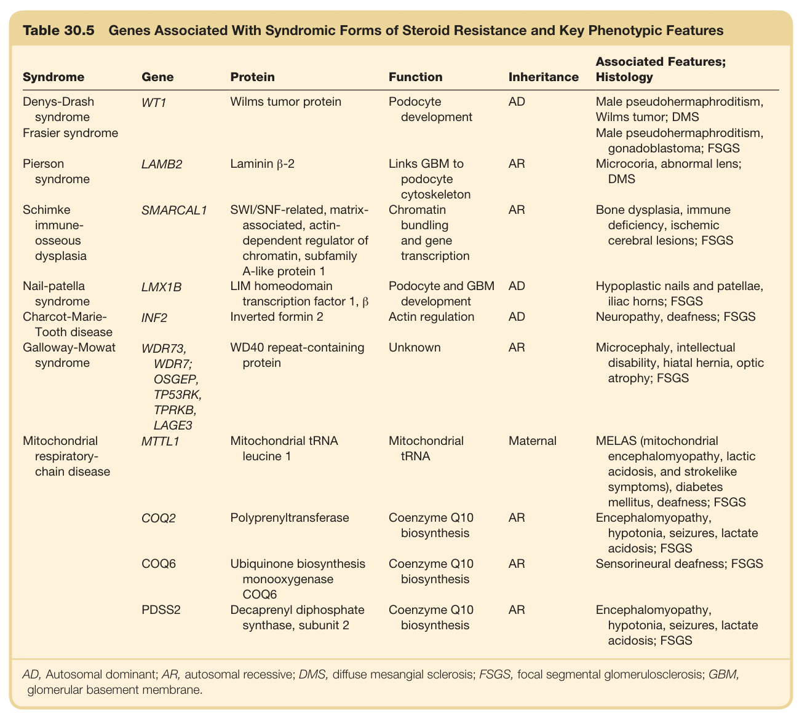

#### Table Data (CSV: [Table_30_5.csv](Table_30_5.csv))

```markdown
| Table Text (OCR) |
| :--- |
| Table 30.5 Genes Associated With Syndromic Forms of Steroid Resistance and Key Phenotypic Features Syndrome  Gene  Protein  Function  Inheritance  Associated Features; Histology    Denys-Drash syndrome  WT1  Wilms tumor protein  Podocyte development  AD  Male pseudohermaphroditism, Wilms tumor; DMSMale pseudohermaphroditism, gonadoblastoma; FSGS    Frasier syndrome              Pierson syndrome  LAMB2  Laminin β-2  Links GBM to podocyte cytoskeleton  AR  Microcoria, abnormal lens; DMS    Schimke immune-osseous dysplasia  SMARCAL1  SWI/SNF-related, matrix-associated, actin-dependent regulator of chromatin, subfamily A-like protein 1  Chromatin bundling and gene transcription  AR  Bone dysplasia, immune deficiency, ischemic cerebral lesions; FSGS    Nail-patella syndrome  LMX1B  LIM homeodomain transcription factor 1, β  Podocyte and GBM development  AD  Hypoplastic nails and patellae, iliac horns; FSGS    Charcot-Marie-Tooth disease  INF2  Inverted formin 2  Actin regulation  AD  Neuropathy, deafness; FSGS    Galloway-Mowat syndrome  WDR73, WDR7; OSGEP, TP53RK, TPRKB, LAGE3  WD40 repeat-containing protein  Unknown  AR  Microcephaly, intellectual disability, hiatal hernia, optic atrophy; FSGS    Mitochondrial respiratory-chain disease  MTTL1  Mitochondrial tRNA leucine 1  Mitochondrial tRNA  Maternal  MELAS (mitochondrial encephalomyopathy, lactic acidosis, and strokelike symptoms), diabetes mellitus, deafness; FSGS    COQ2  Polyprenyltransferase  Coenzyme Q10 biosynthesis  AR  Encephalomyopathy, hypotonia, seizures, lactate acidosis; FSGS    COQ6  Ubiquinone biosynthesis monooxygenase COQ6  Coenzyme Q10 biosynthesis  AR  Sensorineural deafness; FSGS    PDSS2  Decaprenyl diphosphate synthase, subunit 2  Coenzyme Q10 biosynthesis  AR  Encephalomyopathy, hypotonia, seizures, lactate acidosis; FSGS AD, Autosomal dominant; AR, autosomal recessive; DMS, diffuse mesangial sclerosis; FSGS, focal segmental glomerulosclerosis; GBM, glomerular basement membrane. |
```

Table 30.5 Genes Associated With Syndromic Forms of Steroid Resistance and Key Phenotypic Features

---

### Table_30_6

#### Table Image

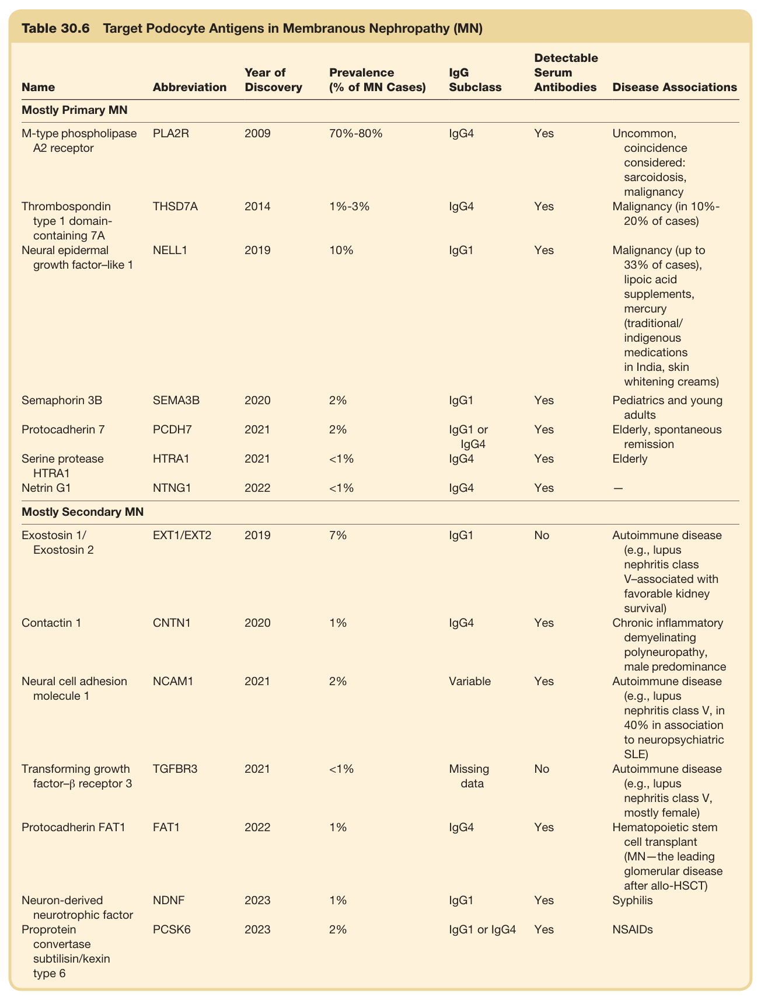

#### Table Data (CSV: [Table_30_6.csv](Table_30_6.csv))

```markdown
| Table Text (OCR) |
| :--- |
| Table 30.6  Target Podocyte Antigens in Membranous Nephropathy (MN) Name  Abbreviation  Year of Discovery  Prevalence (% of MN Cases)  IgG Subclass  Detectable Serum Antibodies  Disease Associations    Mostly Primary MN    M-type phospholipase A2 receptor  PLA2R  2009  70%-80%  IgG4  Yes  Uncommon, coincidence considered: sarcoidosis, malignancy    Thrombospondin type 1 domain-containing 7A  THSD7A  2014  1%-3%  IgG4  Yes  Malignancy (in 10%-20% of cases)    Neural epidermal growth factor-like 1  NELL1  2019  10%  IgG1  Yes  Malignancy (up to 33% of cases), lipoic acid supplements, mercury (traditional/indigenous medications in India, skin whitening creams)    Semaphorin 3B  SEMA3B  2020  2%  IgG1  Yes  Pediatrics and young adults    Protocadherin 7  PCDH7  2021  2%  IgG1 or IgG4  Yes  Elderly, spontaneous remission    Serine protease HTRA1  HTRA1  2021  <1%  IgG4  Yes  Elderly    Netrin G1  NTNG1  2022  <1%  IgG4  Yes  -    Mostly Secondary MN    Exostosin 1/ Exostosin 2  EXT1/EXT2  2019  7%  IgG1  No  Autoimmune disease (e.g., lupus nephritis class V-associated with favorable kidney survival)    Contactin 1  CNTN1  2020  1%  IgG4  Yes  Chronic inflammatory demyelinating polyneuropathy, male predominance    Neural cell adhesion molecule 1  NCAM1  2021  2%  Variable  Yes  Autoimmune disease (e.g., lupus nephritis class V, in 40% in association to neuropsychiatric SLE)    Transforming growth factor-β receptor 3  TGFBR3  2021  <1%  Missing data  No  Autoimmune disease (e.g., lupus nephritis class V, mostly female)    Protocadherin FAT1  FAT1  2022  1%  IgG4  Yes  Hematopoietic stem cell transplant (MN-the leading glomerular disease after allo-HSCT)    Neuron-derived neurotrophic factor  NDNF  2023  1%  IgG1  Yes  Syphilis    Proprotein convertase subtilisin/kexin type 6  PCSK6  2023  2%  IgG1 or IgG4  Yes  NSAIDs |
```

Table 30.6 Target Podocyte Antigens in Membranous Nephropathy (MN)

---

### Table_30_7

#### Table Image

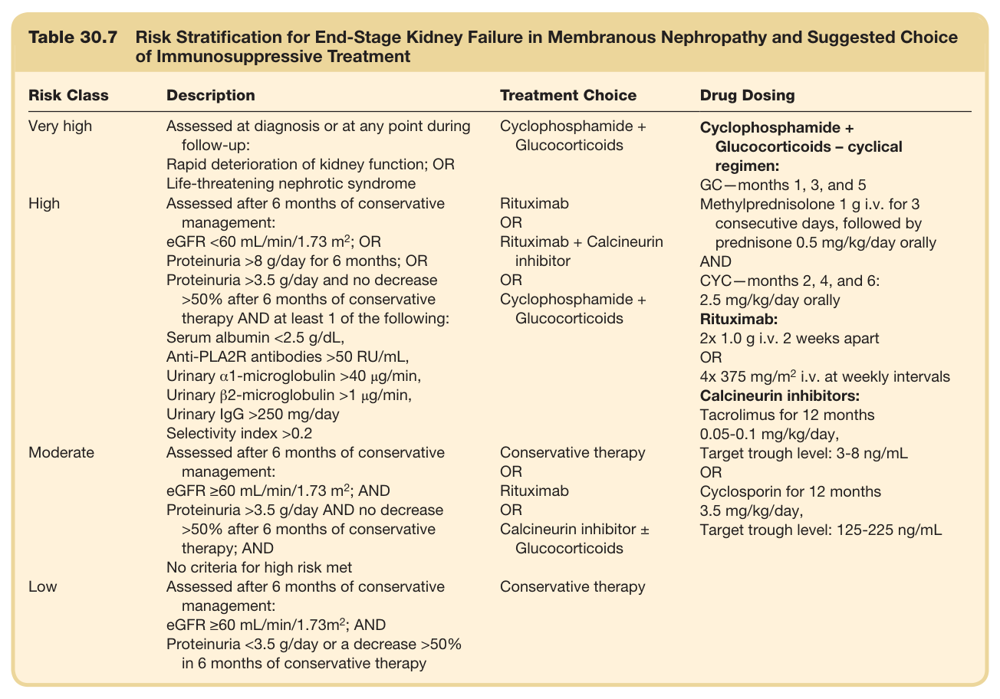

#### Table Data (CSV: [Table_30_7.csv](Table_30_7.csv))

```markdown
| Table Text (OCR) |
| :--- |
| Table 30.7  Risk Stratification for End-Stage Kidney Failure in Membranous Nephropathy and Suggested Choice of Immunosuppressive Treatment Risk Class  Description  Treatment Choice  Drug Dosing    Very high  Assessed at diagnosis or at any point during follow-up:  Cyclophosphamide + Glucocorticoids  Cyclophosphamide + Glucocorticoids - cyclical regimen:    Rapid deterioration of kidney function; OR      Life-threatening nephrotic syndrome    GC—months 1, 3, and 5    High  Assessed after 6 months of conservative management:  Rituximab  Methylprednisolone 1 g i.v. for 3 consecutive days, followed by prednisone 0.5 mg/kg/day orally    eGFR <60 mL/min/1.73  m^2 ; OR  OR    Proteinuria >8 g/day for 6 months; OR  Rituximab + Calcineurin inhibitor  AND    Proteinuria >3.5 g/day and no decrease >50% after 6 months of conservative therapy AND at least 1 of the following:  OR  CYC—months 2, 4, and 6:    Cyclophosphamide + Glucocorticoids  2.5 mg/kg/day orally    Serum albumin <2.5 g/dL, Anti-PLA2R antibodies >50 RU/mL, Urinary α1-microglobulin >40 μg/min, Urinary β2-microglobulin >1 μg/min, Urinary IgG >250 mg/day Selectivity index >0.2    Rituximab:2x 1.0 g i.v. 2 weeks apartOR4x 375  mg/m^2  i.v. at weekly intervalsCalcineurin inhibitors:Tacrolimus for 12 months0.05-0.1 mg/kg/day,    Moderate  Assessed after 6 months of conservative management:  Conservative therapy  Target trough level: 3-8 ng/mL    eGFR ≥60 mL/min/1.73  m^2 ; AND  OR  OR    Proteinuria >3.5 g/day AND no decrease >50% after 6 months of conservative therapy; AND  Rituximab  Cyclosporin for 12 months    OR  3.5 mg/kg/day,    Calcineurin inhibitor ± Glucocorticoids  Target trough level: 125-225 ng/mL    No criteria for high risk met        Low  Assessed after 6 months of conservative management:  Conservative therapy      eGFR ≥60 mL/min/1.73 m^2 ; AND        Proteinuria <3.5 g/day or a decrease >50% in 6 months of conservative therapy |
```

Table 30.7 Risk Stratification for End-Stage Kidney Failure in Membranous Nephropathy and Suggested Choice of Immunosuppressive Treatment

---

### Table_30_8

#### Table Image

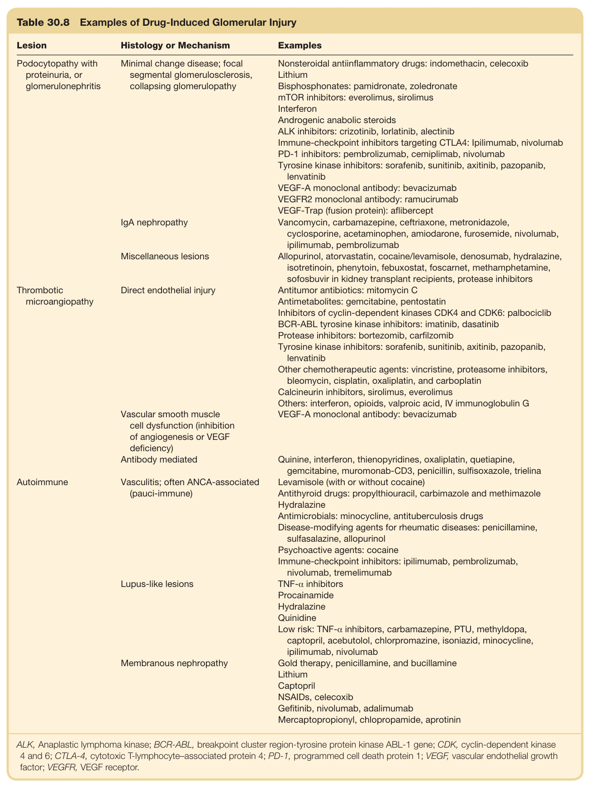

#### Table Data (CSV: [Table_30_8.csv](Table_30_8.csv))

```markdown
| Table Text (OCR) |
| :--- |
| Table 30.8  Examples of Drug-Induced Glomerular Injury Lesion  Histology or Mechanism  Examples    Podocytopathy with proteinuria, or glomerulonephritis  Minimal change disease; focal segmental glomerulosclerosis, collapsing glomerulopathy  Nonsteroidal antiinflammatory drugs: indomethacin, celecoxibLithiumBisphosphonates: pamidronate, zoledronate mTOR inhibitors: everolimus, sirolimusInterferonAndrogenic anabolic steroidsALK inhibitors: crizotinib, lorlatinib, alectinibImmune-checkpoint inhibitors targeting CTLA4: Ipilimumab, nivolumabPD-1 inhibitors: pembrolizumab, cemiplimab, nivolumabTyrosine kinase inhibitors: sorafenib, sunitinib, axitinib, pazopanib, lenvatinibVEGF-A monoclonal antibody: bevacizumabVEGFR2 monoclonal antibody: ramucirumabVEGF-Trap (fusion protein): aflibercept    IgA nephropathy  Vancomycin, carbamazepine, ceftriaxone, metronidazole, cyclosporine, acetaminophen, amiodarone, furosemide, nivolumab, ipilimumab, pembrolizumab    Miscellaneous lesions  Allopurinol, atorvastatin, cocaine/levamisole, denosumab, hydralazine, isotretinoin, phenytoin, febuxostat, foscarnet, methamphetamine, sofosbuvir in kidney transplant recipients, protease inhibitors    Thrombotic microangiopathy  Direct endothelial injury  Antitumor antibiotics: mitomycin CAntimetabolites: gemcitabine, pentostatinInhibitors of cyclin-dependent kinases CDK4 and CDK6: palbociclibBCR-ABL tyrosine kinase inhibitors: imatinib, dasatinibProtease inhibitors: bortezomib, carfilzomibTyrosine kinase inhibitors: sorafenib, sunitinib, axitinib, pazopanib, lenvatinibOther chemotherapeutic agents: vincristine, proteasome inhibitors, bleomycin, cisplatin, oxaliplatin, and carboplatinCalcineurin inhibitors, sirolimus, everolimusOthers: interferon, opioids, valproic acid, IV immunoglobulin G    Vascular smooth muscle cell dysfunction (inhibition of angiogenesis or VEGF deficiency)  VEGF-A monoclonal antibody: bevacizumab    Antibody mediated  Quinine, interferon, thienopyridines, oxaliplatin, quetiapine, gemcitabine, muromonab-CD3, penicillin, sulfisoxazole, trielina    Autoimmune  Vasculitis; often ANCA-associated (pauci-immune)  Levamisole (with or without cocaine)Antithyroid drugs: propylthiouracil, carbimazole and methimazole HydralazineAntimicrobials: minocycline, antituberculosis drugsDisease-modifying agents for rheumatic diseases: penicillamine, sulfasalazine, allopurinolPsychoactive agents: cocaineImmune-checkpoint inhibitors: ipilimumab, pembrolizumab, nivolumab, tremelimumab    Lupus-like lesions  TNF- \alpha  inhibitorsProcainamideHydralazineQuinidineLow risk: TNF- \alpha  inhibitors, carbamazepine, PTU, methyldopa, captopril, acebutolol, chlorpromazine, isoniazid, minocycline, ipilimumab, nivolumab    Membranous nephropathy  Gold therapy, penicillamine, and bucillamineLithiumCaptoprilNSAIDs, celecoxibGefitinib, nivolumab, adalimumabMercaptopropionyl, chlopropamide, aprotinin ALK, Anaplastic lymphoma kinase; BCR-ABL, breakpoint cluster region-tyrosine protein kinase ABL-1 gene; CDK, cyclin-dependent kinase 4 and 6; CTLA-4, cytotoxic T-lymphocyte–associated protein 4; PD-1, programmed cell death protein 1; VEGF, vascular endothelial growth factor; VEGFR, VEGF receptor. |
```

Table 30.8 Examples of Drug-Induced Glomerular Injury

---

### Table_e30_1

#### Table Image

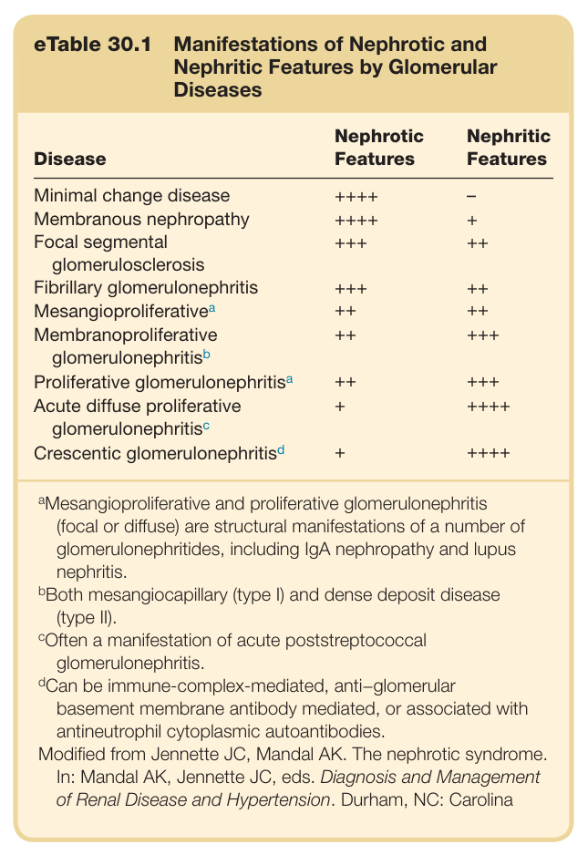

#### Table Data (CSV: [Table_e30_1.csv](Table_e30_1.csv))

```markdown
| Table Text (OCR) |
| :--- |
| eTable 30.1 Manifestations of Nephrotic and Nephritic Features by Glomerular Diseases Disease  Nephrotic Features  Nephritic Features    Minimal change disease  ++++  -    Membranous nephropathy  ++++  +    Focal segmental glomerulosclerosis  +++  ++    Fibrillary glomerulonephritis  +++  ++    Mesangioproliferative ^a   ++  ++    Membranoproliferative glomerulonephritis ^b   ++  +++    Proliferative glomerulonephritis ^a   ++  +++    Acute diffuse proliferative glomerulonephritis ^c   +  ++++    Crescentic glomerulonephritis ^d   +  ++++ <sup>a</sup>Mesangioproliferative and proliferative glomerulonephritis (focal or diffuse) are structural manifestations of a number of glomerulonephritides, including IgA nephropathy and lupus nephritis. <sup>b</sup>Both mesangiocapillary (type I) and dense deposit disease (type II). <sup>c</sup>Often a manifestation of acute poststreptococcal glomerulonephritis. <sup>d</sup>Can be immune-complex-mediated, anti−glomerular basement membrane antibody mediated, or associated with antineutrophil cytoplasmic autoantibodies. Modified from Jennette JC, Mandal AK. The nephrotic syndrome. In: Mandal AK, Jennette JC, eds. Diagnosis and Management of Renal Disease and Hypertension. Durham, NC: Carolina |
```

Table e30.1 Manifestations of Nephrotic and Nephritic Features by Glomerular Diseases

---

## Boxes

### Box_30_1

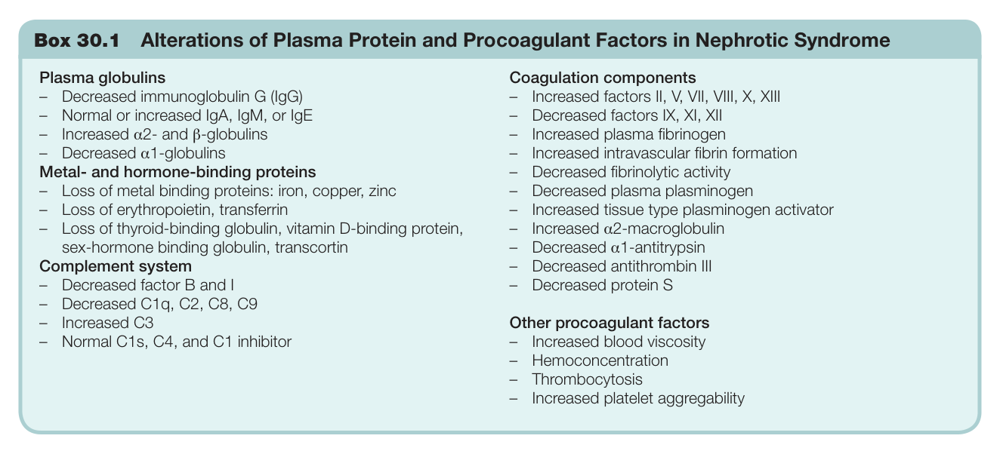

#### Box Text

```markdown
Box 30.1 Alterations of Plasma Protein and Procoagulant Factors in Nephrotic Syndrome Plasma globulins Coagulation components – Decreased immunoglobulin G (IgG) – Increased factors II, V, VII, VIII, X, XIII – Normal or increased IgA, IgM, or IgE – Decreased factors IX, XI, XII – Increased α2- and β-globulins – Increased plasma fibrinogen – Decreased α1-globulins – Increased intravascular fibrin formation Metal- and hormone-binding proteins – Decreased fibrinolytic activity – Loss of metal binding proteins: iron, copper, zinc – Decreased plasma plasminogen – Loss of erythropoietin, transferrin – Increased tissue type plasminogen activator Loss of thyroid-binding globulin, vitamin D-binding protein, sex-hormone binding globulin, transcortin – Increased α2-macroglobulin – Decreased α1-antitrypsin Complement system – Decreased antithrombin III – Decreased factor B and I – Decreased protein S – Decreased C1q, C2, C8, C9 – Increased C3 Other procoagulant factors – Normal C1s, C4, and C1 inhibitor – Increased blood viscosity – Hemoconcentration – Thrombocytosis – Increased platelet aggregability
```

Box 30.1 Alterations of Plasma Protein and Procoagulant Factors in Nephrotic Syndrome

---

### Box_e30_1

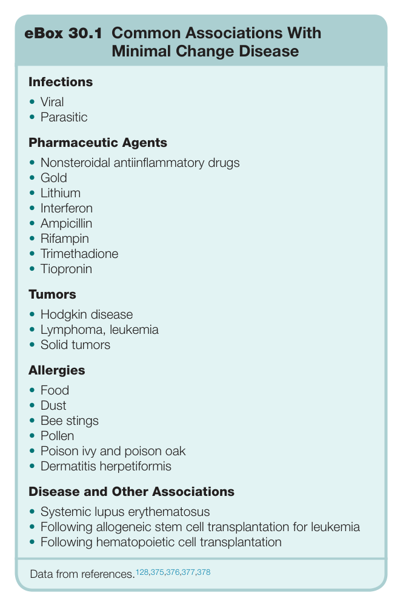

#### Box Text

```markdown
eBox 30.1 Common Associations With Minimal Change Disease Infections • Viral • Parasitic Pharmaceutic Agents • Nonsteroidal antiinflammatory drugs • Gold • Lithium • Interferon • Ampicillin • Rifampin • Trimethadione • Tiopronin Tumors • Hodgkin disease • Lymphoma, leukemia • Solid tumors Allergies • Food • Dust • Bee stings • Pollen • Poison ivy and poison oak • Dermatitis herpetiformis Disease and Other Associations • Systemic lupus erythematosus • Following allogeneic stem cell transplantation for leukemia • Following hematopoietic cell transplantation Data from references.<sup>128,375,376,377,378</sup>
```

Box e30.1 Common Associations With Minimal Change Disease

---
