# 31. Lupus Nephritis and Other Kidney Manifestations of Systemic Inflammatory and Autoimmune Diseases - Figures and Tables Index

This document lists all figures and tables extracted from `31. Lupus Nephritis and Other Kidney Manifestations of Systemic Inflammatory and Autoimmune Diseases.pdf`.

## Table of Contents
- [Figures](#figures)
- [Tables](#tables)

---

## Figures

### Fig_31_1

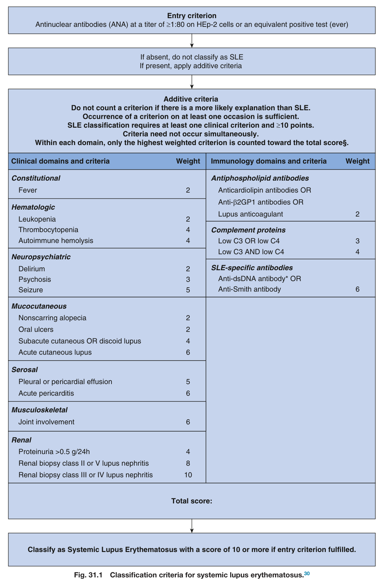

Fig. 31.1 Classification criteria for systemic lupus erythematosus.<sup>30</sup>

---

### Fig_31_2

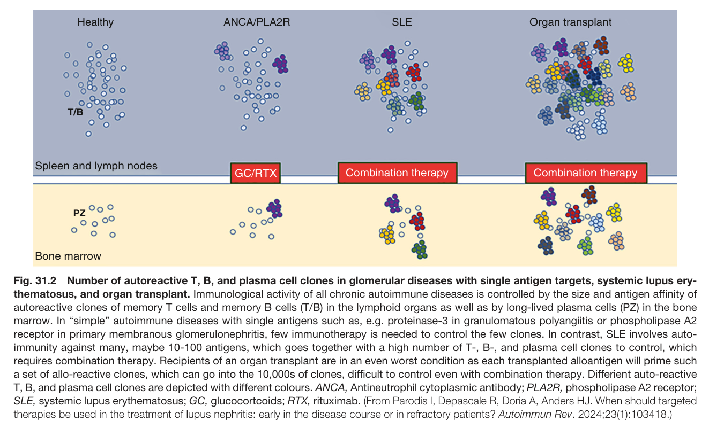

Fig. 31.2 Number of autoreactive T, B, and plasma cell clones in glomerular diseases with single antigen targets, systemic lupus ery thematosus, and organ transplant. Immunological activity of all chronic autoimmune diseases is controlled by the size and antigen affinity of autoreactive clones of memory T cells and memory B cells (T/B) in the lymphoid organs as well as by long-lived plasma cells (PZ) in the bone marrow. In “simple” autoimmune diseases with single antigens such as, e.g. proteinase-3 in granulomatous polyangiitis or phospholipase A2 receptor in primary membranous glomerulonephritis, few immunotherapy is needed to control the few clones. In contrast, SLE involves auto immunity against many, maybe 10-100 antigens, which goes together with a high number of T-, B-, and plasma cell clones to control, which requires combination therapy. Recipients of an organ transplant are in an even worst condition as each transplanted alloantigen will prime such a set of allo-reactive clones, which can go into the 10,000s of clones, difficult to control even with combination therapy. Differient auto-reactive T, B, and plasma cell clones are depicted with different colours. ANCA, Antineutrophil cytoplasmic antibody; PLA2R, phospholipase A2 receptor; SLE, systemic lupus erythematosus; GC, glucocortcoids; RTX, rituximab. (From Parodis I, Depascale R, Doria A, Anders HJ. When should targeted therapies be used in the treatment of lupus nephritis: early in the disease course or in refractory patients? Autoimmun Rev. 2024;23(1):103418.)

---

### Fig_31_3

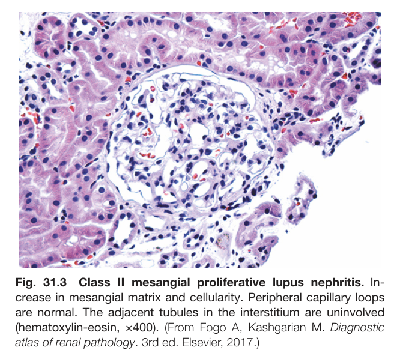

Fig. 31.3 Class II mesangial proliferative lupus nephritis. In- crease in mesangial matrix and cellularity. Peripheral capillary loops are normal. The adjacent tubules in the interstitium are uninvolved (hematoxylin-eosin, ×400). (From Fogo A, Kashgarian M. Diagnostic atlas of renal pathology. 3rd ed. Elsevier, 2017.)

---

### Fig_31_4

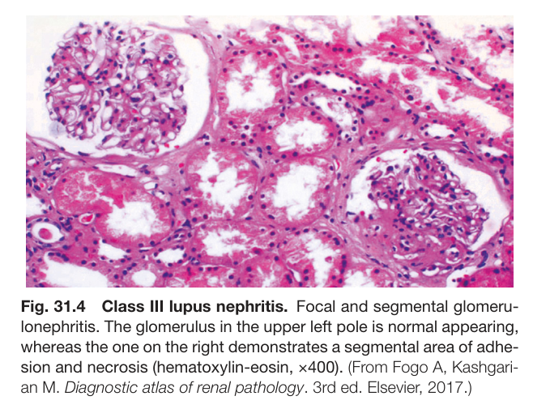

Fig. 31.4 Class III lupus nephritis. Focal and segmental glomeru- lonephritis. The glomerulus in the upper left pole is normal appearing, whereas the one on the right demonstrates a segmental area of adhe- sion and necrosis (hematoxylin-eosin, ×400). (From Fogo A, Kashgari- an M. Diagnostic atlas of renal pathology. 3rd ed. Elsevier, 2017.)

---

### Fig_31_5

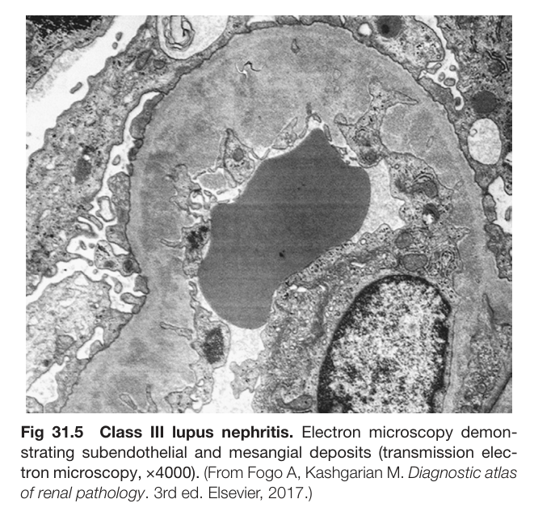

Fig. 31.5 Class III lupus nephritis. Electron microscopy demon- strating subendothelial and mesangial deposits (transmission elec- tron microscopy, ×4000). (From Fogo A, Kashgarian M. Diagnostic atlas of renal pathology. 3rd ed. Elsevier, 2017.)

---

### Fig_31_6

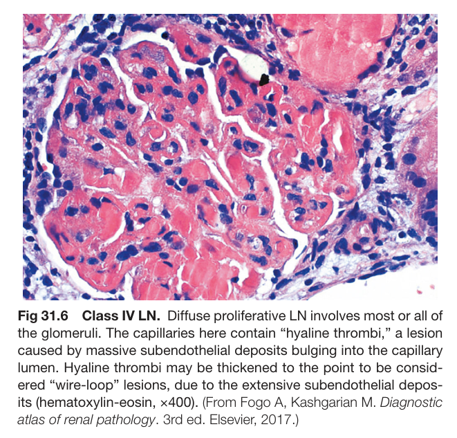

Fig. 31.6 Class IV LN. Diffuse proliferative LN involves most or all of the glomeruli. The capillaries here contain “hyaline thrombi,” a lesion caused by massive subendothelial deposits bulging into the capillary lumen. Hyaline thrombi may be thickened to the point to be consid- ered “wire-loop” lesions, due to the extensive subendothelial depos- its (hematoxylin-eosin, ×400). (From Fogo A, Kashgarian M. Diagnostic atlas of renal pathology. 3rd ed. Elsevier, 2017.)

---

### Fig_31_7

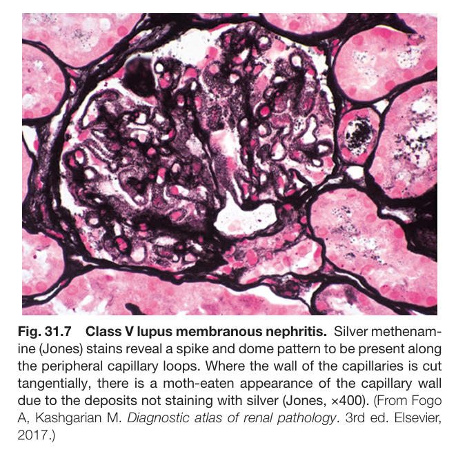

Fig. 31.7 Class V lupus membranous nephritis. Silver methenam- ine (Jones) stains reveal a spike and dome pattern to be present along the peripheral capillary loops. Where the wall of the capillaries is cut tangentially, there is a moth-eaten appearance of the capillary wall due to the deposits not staining with silver (Jones, ×400). (From Fogo A, Kashgarian M. Diagnostic atlas of renal pathology. 3rd ed. Elsevier, 2017.)

---

### Fig_31_8

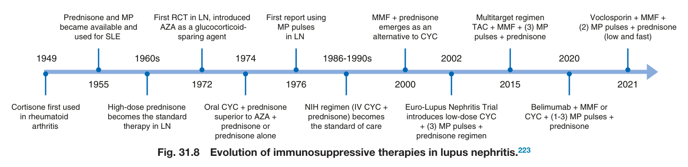

Fig. 31.8 Evolution of immunosuppressive therapies in lupus nephritis.<sup>223</sup>

---

### Fig_31_9

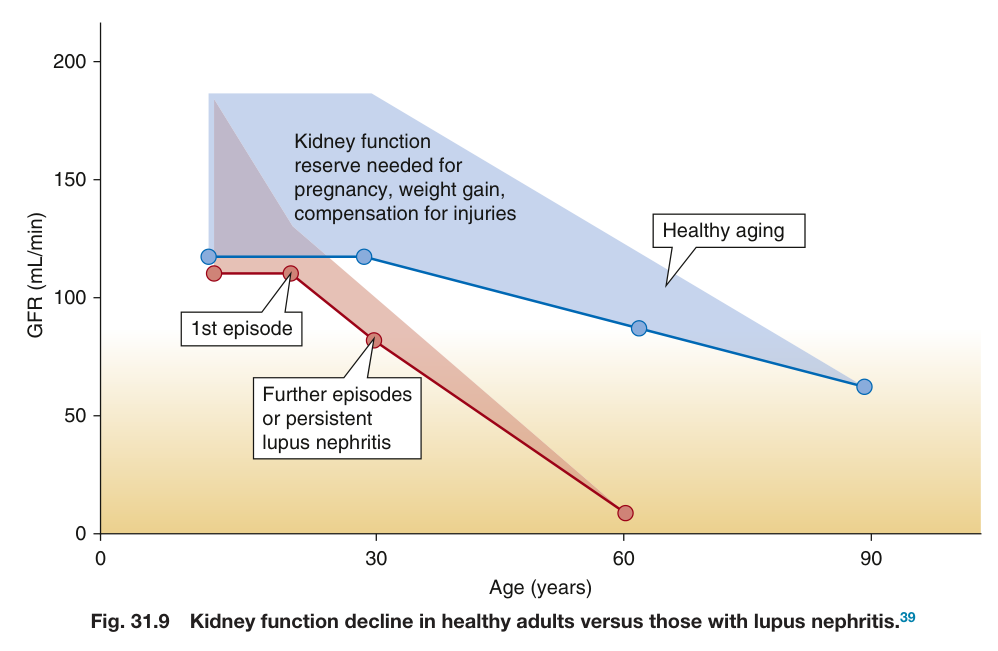

Fig. 31.9 Kidney function decline in healthy adults versus those with lupus nephritis.<sup>39</sup>

---

### Fig_31_10

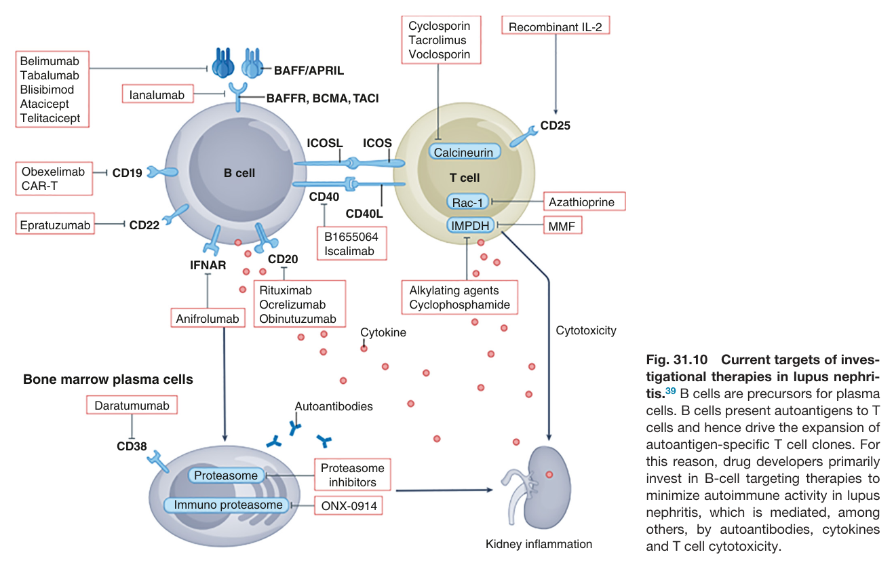

Fig. 31.10 Current targets of inves- tigational therapies in lupus nephri- tis.<sup>39</sup> B cells are precursors for plasma cells. B cells present autoantigens to T cells and hence drive the expansion of autoantigen-specific T cell clones. For this reason, drug developers primarily invest in B-cell targeting therapies to minimize autoimmune activity in lupus nephritis, which is mediated, among others, by autoantibodies, cytokines and T cell cytotoxicity.

---

### Fig_31_11

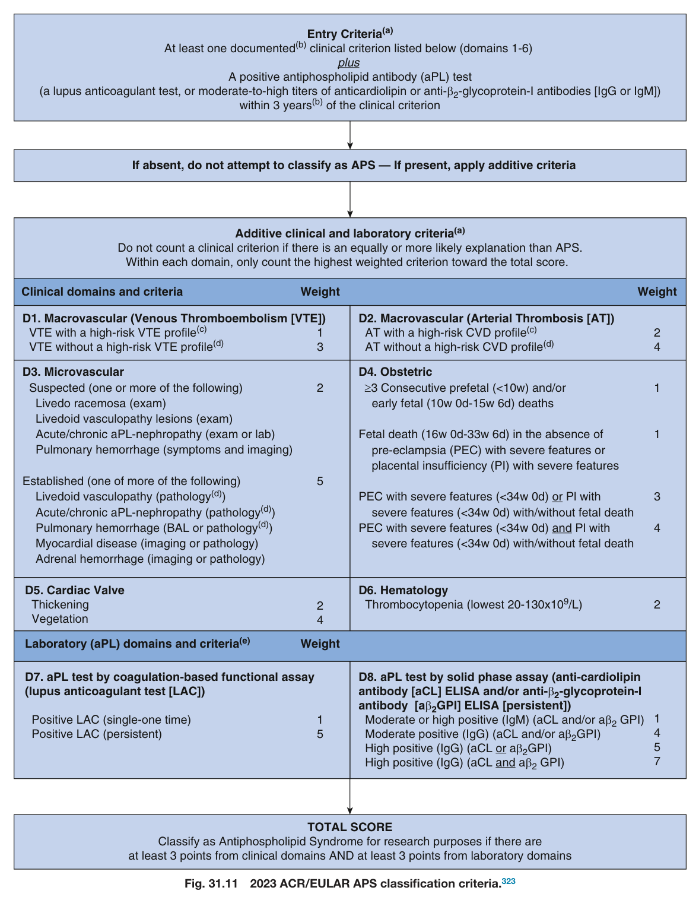

Fig. 31.11 2023 ACR/EULAR APS classification criteria.<sup>323</sup>

---

### Fig_31_12

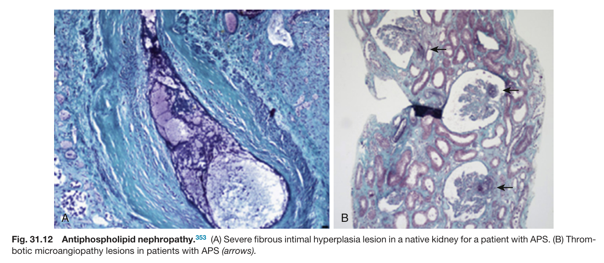

Fig. 31.12 Antiphospholipid nephropathy.<sup>353</sup> (A) Severe fibrous intimal hyperplasia lesion in a native kidney for a patient with APS. (B) Throm botic microangiopathy lesions in patients with APS (arrows).

---

### Fig_31_13

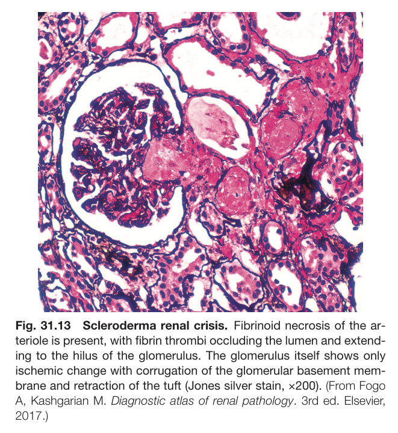

Fig. 31.13 Scleroderma renal crisis. Fibrinoid necrosis of the ar- teriole is present, with fibrin thrombi occluding the lumen and extend- ing to the hilus of the glomerulus. The glomerulus itself shows only ischemic change with corrugation of the glomerular basement mem- brane and retraction of the tuft (Jones silver stain, ×200). (From Fogo A, Kashgarian M. Diagnostic atlas of renal pathology. 3rd ed. Elsevier, 2017.)

---

## Tables

### Table_31_1

#### Table Image

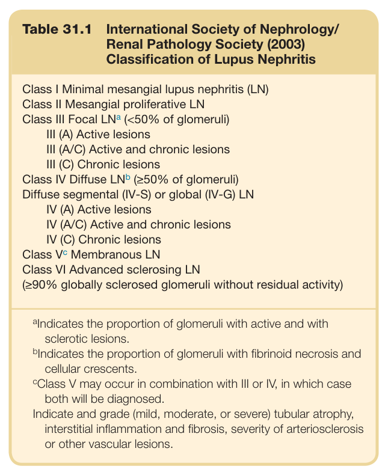

#### Table Data (CSV: [Table_31_1.csv](Table_31_1.csv))

```markdown
| Table Text (OCR) |
| :--- |
| Table 31.1  International Society of Nephrology/ Renal Pathology Society (2003) Classification of Lupus Nephritis Class I Minimal mesangial lupus nephritis (LN)    Class II Mesangial proliferative LN    Class III Focal  LN^a  (<50% of glomeruli)    III (A) Active lesions    III (A/C) Active and chronic lesions    III (C) Chronic lesions    Class IV Diffuse  LN^b  (≥50% of glomeruli)    Diffuse segmental (IV-S) or global (IV-G) LN    IV (A) Active lesions    IV (A/C) Active and chronic lesions    IV (C) Chronic lesions    Class  V^c  Membranous LN    Class VI Advanced sclerosing LN    (≥90% globally sclerosed glomeruli without residual activity) |
```

Table 31.1 International Society of Nephrology/ Renal Pathology Society (2003) Classification of Lupus Nephritis

---

### Table_31_2

#### Table Image

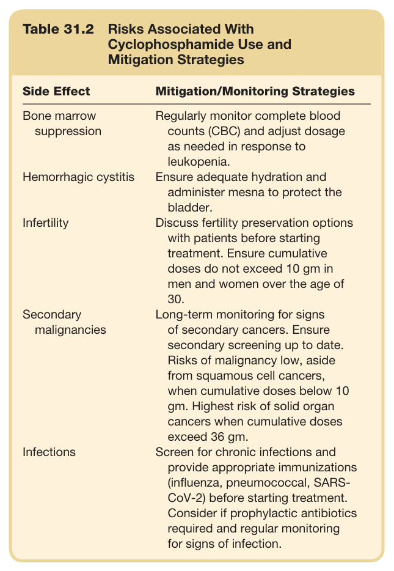

#### Table Data (CSV: [Table_31_2.csv](Table_31_2.csv))

```markdown
| Table Text (OCR) |
| :--- |
| Table 31.2 Risks Associated With Cyclophosphamide Use and Mitigation Strategies Side Effect  Mitigation/Monitoring Strategies    Bone marrow suppression  Regularly monitor complete blood counts (CBC) and adjust dosage as needed in response to leukopenia.    Hemorrhagic cystitis  Ensure adequate hydration and administer mesna to protect the bladder.    Infertility  Discuss fertility preservation options with patients before starting treatment. Ensure cumulative doses do not exceed 10 gm in men and women over the age of 30.    Secondary malignancies  Long-term monitoring for signs of secondary cancers. Ensure secondary screening up to date. Risks of malignancy low, aside from squamous cell cancers, when cumulative doses below 10 gm. Highest risk of solid organ cancers when cumulative doses exceed 36 gm.    Infections  Screen for chronic infections and provide appropriate immunizations (influenza, pneumococcal, SARS-CoV-2) before starting treatment. Consider if prophylactic antibiotics required and regular monitoring for signs of infection. |
```

Table 31.2 Risks Associated With Cyclophosphamide Use and Mitigation Strategies

---
