# 32. Antineutrophil Cytoplasmic AntibodyAssociated Vasculitis and Antiglomerular Basement Membrane Disease - Figures and Tables Index

This document lists all figures and tables extracted from `32. Antineutrophil Cytoplasmic AntibodyAssociated Vasculitis and Antiglomerular Basement Membrane Disease.pdf`.

## Table of Contents
- [Figures](#figures)
- [Tables](#tables)

---

## Figures

### Fig_32_1

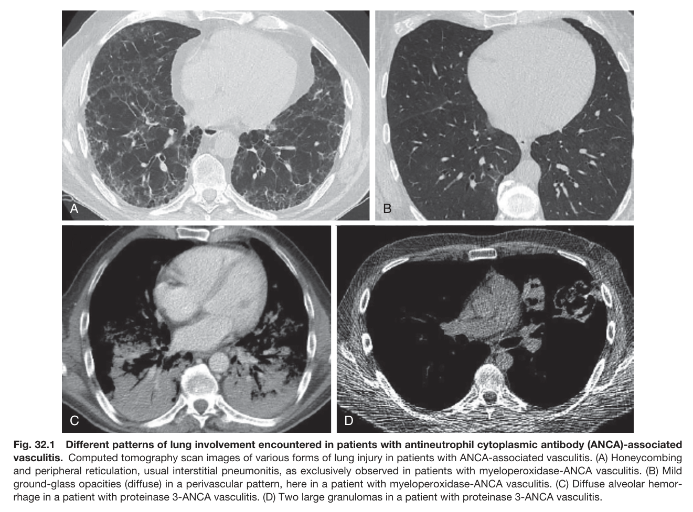

Fig. 32.1 Different patterns of lung involvement encountered in patients with antineutrophil cytoplasmic antibody (ANCA)-associated vasculitis. Computed tomography scan images of various forms of lung injury in patients with ANCA-associated vasculitis. (A) Honeycombing and peripheral reticulation, usual interstitial pneumonitis, as exclusively observed in patients with myeloperoxidase-ANCA vasculitis. (B) Mild ground-glass opacities (diffuse) in a perivascular pattern, here in a patient with myeloperoxidase-ANCA vasculitis. (C) Diffuse alveolar hemor- rhage in a patient with proteinase 3-ANCA vasculitis. (D) Two large granulomas in a patient with proteinase 3-ANCA vasculitis.

---

### Fig_32_2

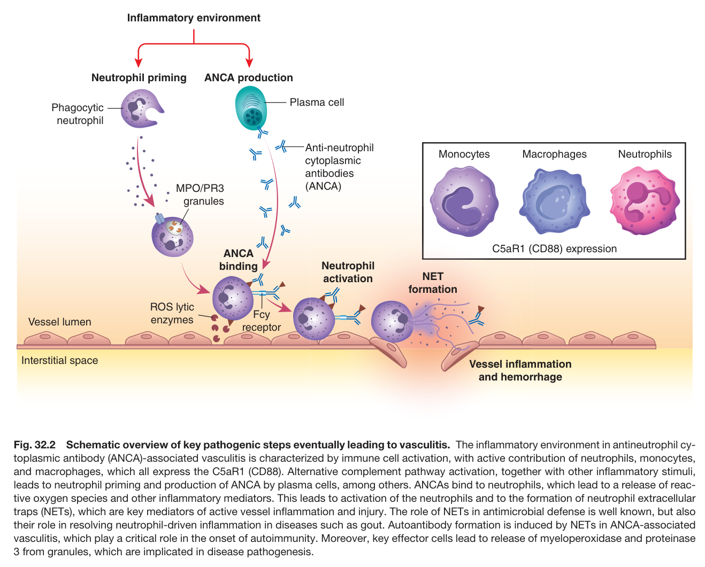

Fig. 32.2 Schematic overview of key pathogenic steps eventually leading to vasculitis. The inflammatory environment in antineutrophil cy- toplasmic antibody (ANCA)-associated vasculitis is characterized by immune cell activation, with active contribution of neutrophils, monocytes, and macrophages, which all express the C5aR1 (CD88). Alternative complement pathway activation, together with other inflammatory stimuli, leads to neutrophil priming and production of ANCA by plasma cells, among others. ANCAs bind to neutrophils, which lead to a release of reac tive oxygen species and other inflammatory mediators. This leads to activation of the neutrophils and to the formation of neutrophil extracellular traps (NETs), which are key mediators of active vessel inflammation and injury. The role of NETs in antimicrobial defense is well known, but also their role in resolving neutrophil-driven inflammation in diseases such as gout. Autoantibody formation is induced by NETs in ANCA-associated vasculitis, which play a critical role in the onset of autoimmunity. Moreover, key effector cells lead to release of myeloperoxidase and proteinase 3 from granules, which are implicated in disease pathogenesis.

---

### Fig_32_3

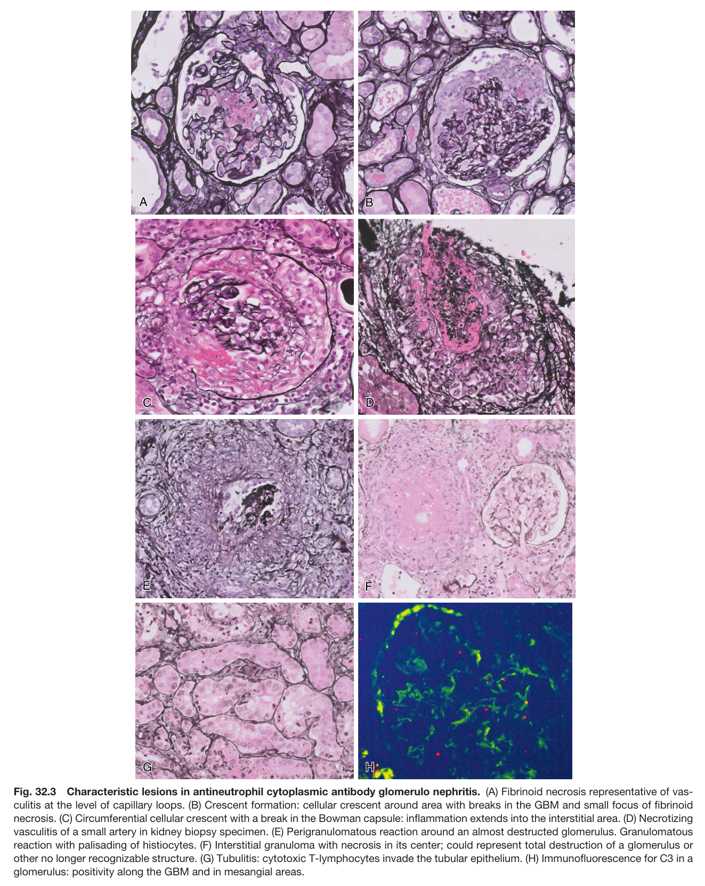

Fig. 32.3 Characteristic lesions in antineutrophil cytoplasmic antibody glomerulo nephritis. (A) Fibrinoid necrosis representative of vas- culitis at the level of capillary loops. (B) Crescent formation: cellular crescent around area with breaks in the GBM and small focus of fibrinoid necrosis. (C) Circumferential cellular crescent with a break in the Bowman capsule: inflammation extends into the interstitial area. (D) Necrotizing vasculitis of a small artery in kidney biopsy specimen. (E) Perigranulomatous reaction around an almost destructed glomerulus. Granulomatous reaction with palisading of histiocytes. (F) Interstitial granuloma with necrosis in its center; could represent total destruction of a glomerulus or other no longer recognizable structure. (G) Tubulitis: cytotoxic T-lymphocytes invade the tubular epithelium. (H) Immunofluorescence for C3 in a glomerulus: positivity along the GBM and in mesangial areas.

---

### Fig_32_4

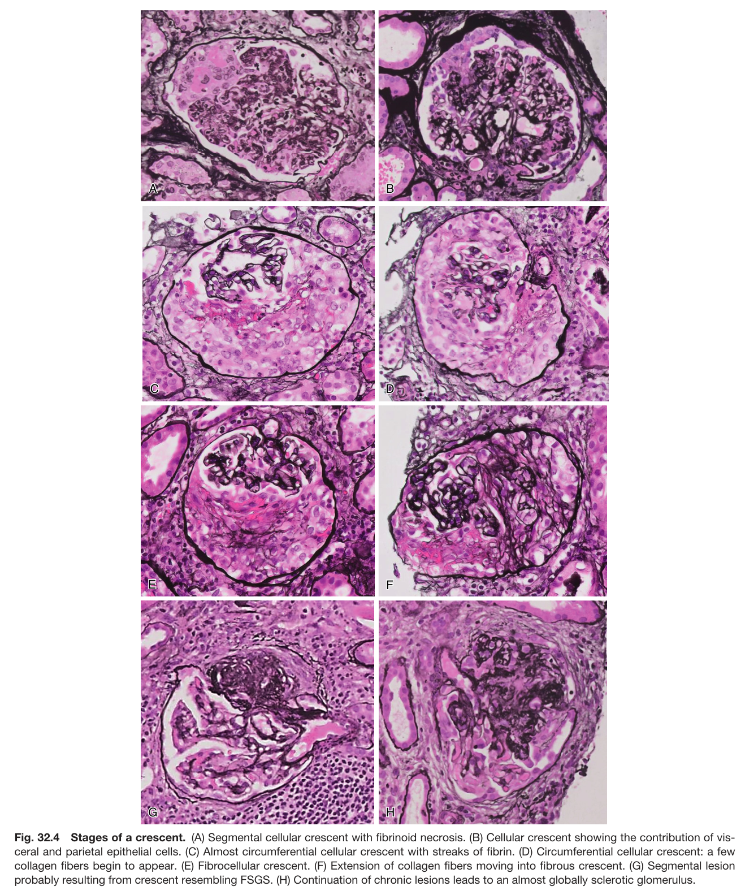

Fig. 32.4 Stages of a crescent. (A) Segmental cellular crescent with fibrinoid necrosis. (B) Cellular crescent showing the contribution of vis- ceral and parietal epithelial cells. (C) Almost circumferential cellular crescent with streaks of fibrin. (D) Circumferential cellular crescent: a few collagen fibers begin to appear. (E) Fibrocellular crescent. (F) Extension of collagen fibers moving into fibrous crescent. (G) Segmental lesion probably resulting from crescent resembling FSGS. (H) Continuation of chronic lesions leads to an almost globally sclerotic glomerulus.

---

### Fig_32_5

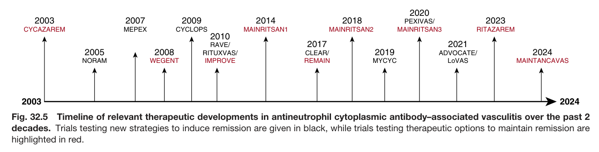

Fig. 32.5 Timeline of relevant therapeutic developments in antineutrophil cytoplasmic antibody–associated vasculitis over the past 2 decades. Trials testing new strategies to induce remission are given in black, while trials testing therapeutic options to maintain remission are highlighted in red.

---

### Fig_32_6

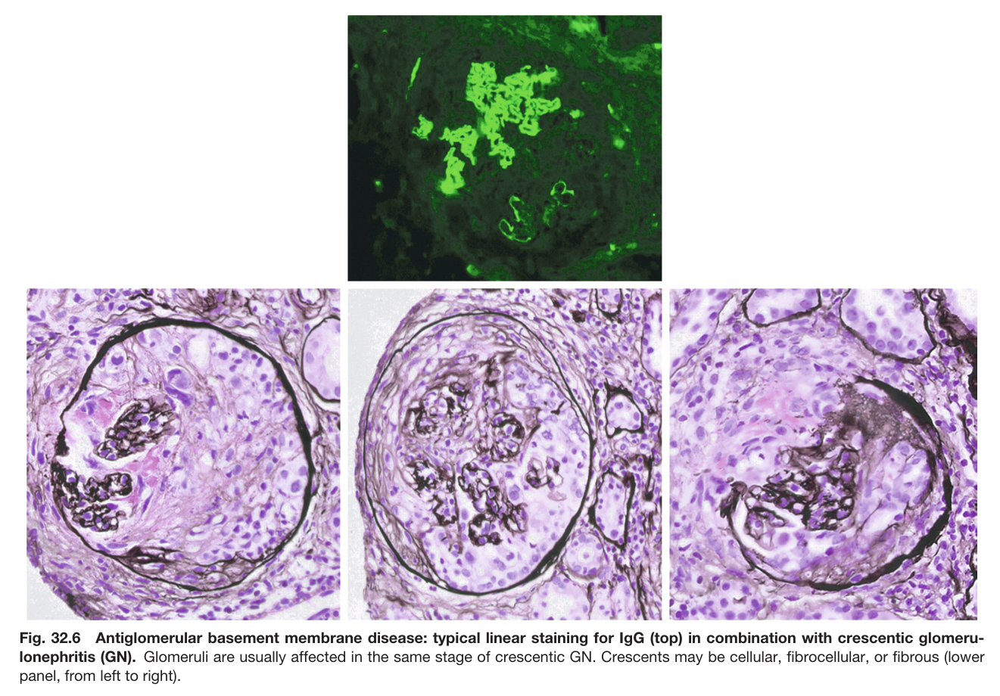

Fig. 32.6 Antiglomerular basement membrane disease: typical linear staining for IgG (top) in combination with crescentic glomeru- lonephritis (GN). Glomeruli are usually affected in the same stage of crescentic GN. Crescents may be cellular, fibrocellular, or fibrous (lower panel, from left to right).

---

## Tables

### Table_32_1

#### Table Image

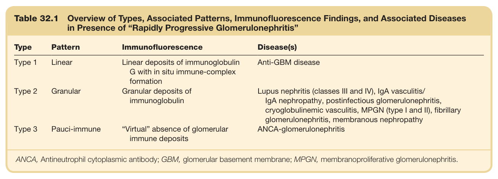

#### Table Data (CSV: [Table_32_1.csv](Table_32_1.csv))

```markdown
| Table Text (OCR) |
| :--- |
| Table 32.1 Overview of Types, Associated Patterns, Immunofluorescence Findings, and Associated Diseases in Presence of “Rapidly Progressive Glomerulonephritis” Type  Pattern  Immunofluorescence  Disease(s)    Type 1  Linear  Linear deposits of immunoglobulin G with in situ immune-complex formation  Anti-GBM disease    Type 2  Granular  Granular deposits of immunoglobulin  Lupus nephritis (classes III and IV), IgA vasculitis/IgA nephropathy, postinfectious glomerulonephritis, cryoglobulinemic vasculitis, MPGN (type I and II), fibrillary glomerulonephritis, membranous nephropathy    Type 3  Pauci-immune  “Virtual” absence of glomerular immune deposits  ANCA-glomerulonephritis ANCA, Antineutrophil cytoplasmic antibody; GBM, glomerular basement membrane; MPGN, membranoproliferative glomerulonephritis. |
```

Table 32.1 Overview of Types, Associated Patterns, Immunofluorescence Findings, and Associated Diseases in Presence of “Rapidly Progressive Glomerulonephritis”

---

### Table_32_2

#### Table Image

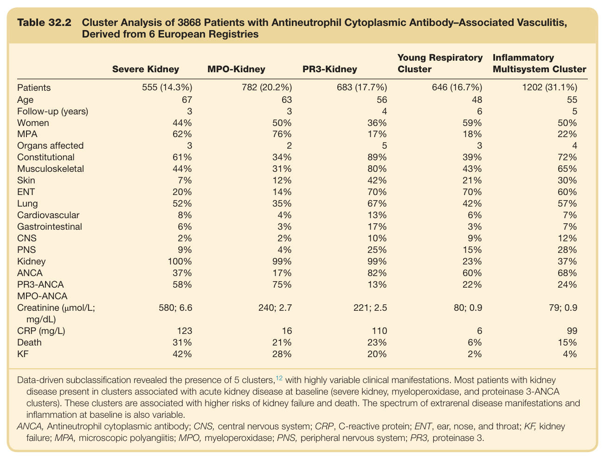

#### Table Data (CSV: [Table_32_2.csv](Table_32_2.csv))

```markdown
| Table Text (OCR) |
| :--- |
| Table 32.2  Cluster Analysis of 3868 Patients with Antineutrophil Cytoplasmic Antibody–Associated Vasculitis, Derived from 6 European Registries Severe Kidney  MPO-Kidney  PR3-Kidney  Young Respiratory Cluster  Inflammatory Multisystem Cluster    Patients  555 (14.3%)  782 (20.2%)  683 (17.7%)  646 (16.7%)  1202 (31.1%)    Age  67  63  56  48  55    Follow-up (years)  3  3  4  6  5    Women  44%  50%  36%  59%  50%    MPA  62%  76%  17%  18%  22%    Organs affected  3  2  5  3  4    Constitutional  61%  34%  89%  39%  72%    Musculoskeletal  44%  31%  80%  43%  65%    Skin  7%  12%  42%  21%  30%    ENT  20%  14%  70%  70%  60%    Lung  52%  35%  67%  42%  57%    Cardiovascular  8%  4%  13%  6%  7%    Gastrointestinal  6%  3%  17%  3%  7%    CNS  2%  2%  10%  9%  12%    PNS  9%  4%  25%  15%  28%    Kidney  100%  99%  99%  23%  37%    ANCA  37%  17%  82%  60%  68%    PR3-ANCA  58%  75%  13%  22%  24%    MPO-ANCA              Creatinine (μmol/L; mg/dL)  580; 6.6  240; 2.7  221; 2.5  80; 0.9  79; 0.9    CRP (mg/L)  123  16  110  6  99    Death  31%  21%  23%  6%  15%    KF  42%  28%  20%  2%  4% Data-driven subclassification revealed the presence of 5 clusters,<sup>12</sup> with highly variable clinical manifestations. Most patients with kidney disease present in clusters associated with acute kidney disease at baseline (severe kidney, myeloperoxidase, and proteinase 3-ANCA clusters). These clusters are associated with higher risks of kidney failure and death. The spectrum of extrarenal disease manifestations and inflammation at baseline is also variable. ANCA, Antineutrophil cytoplasmic antibody; CNS, central nervous system; CRP, C-reactive protein; ENT, ear, nose, and throat; KF, kidney failure; MPA, microscopic polyangiitis; MPO, myeloperoxidase; PNS, peripheral nervous system; PR3, proteinase 3. |
```

Table 32.2 Cluster Analysis of 3868 Patients with Antineutrophil Cytoplasmic Antibody–Associated Vasculitis, Derived from 6 European Registries

---

### Table_32_3

#### Table Image

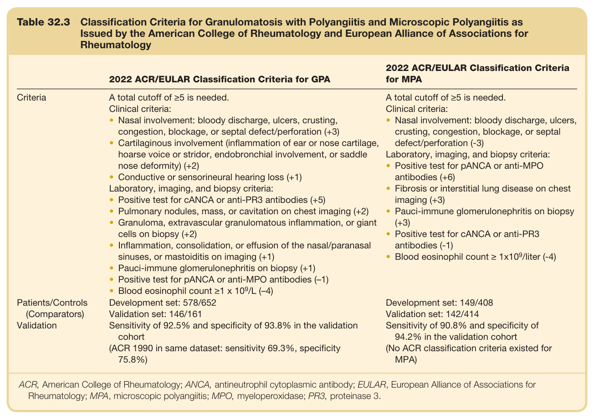

#### Table Data (CSV: [Table_32_3.csv](Table_32_3.csv))

```markdown
| Table Text (OCR) |
| :--- |
| Table 32.3  Classification Criteria for Granulomatosis with Polyangiitis and Microscopic Polyangiitis as Issued by the American College of Rheumatology and European Alliance of Associations for Rheumatology 2022 ACR/EULAR Classification Criteria for GPA  2022 ACR/EULAR Classification Criteria for MPA    Criteria  A total cutoff of ≥5 is needed.Clinical criteria:Nasal involvement: bloody discharge, ulcers, crusting, congestion, blockage, or septal defect/perforation (+3)Cartilaginous involvement (inflammation of ear or nose cartilage, hoarse voice or stridor, endobronchial involvement, or saddle nose deformity) (+2)Conductive or sensorineural hearing loss (+1)Laboratory, imaging, and biopsy criteria:Positive test for cANCA or anti-PR3 antibodies (+5)Pulmonary nodules, mass, or cavitation on chest imaging (+2)Granuloma, extravascular granulomatous inflammation, or giant cells on biopsy (+2)Inflammation, consolidation, or effusion of the nasal/paranasal sinuses, or mastoiditis on imaging (+1)Pauci-immune glomerulonephritis on biopsy (+1)Positive test for pANCA or anti-MPO antibodies (-1)Blood eosinophil count ≥1 x 109/L (-4)  A total cutoff of ≥5 is needed.Clinical criteria:Nasal involvement: bloody discharge, ulcers, crusting, congestion, blockage, or septal defect/perforation (-3)Laboratory, imaging, and biopsy criteria:Positive test for pANCA or anti-MPO antibodies (+6)Fibrosis or interstitial lung disease on chest imaging (+3)Pauci-immune glomerulonephritis on biopsy (+3)Positive test for cANCA or anti-PR3 antibodies (-1)Blood eosinophil count ≥ 1x109/liter (-4)    Patients/Controls (Comparators)Validation  Development set: 578/652Validation set: 146/161Sensitivity of 92.5% and specificity of 93.8% in the validation cohort(ACR 1990 in same dataset: sensitivity 69.3%, specificity 75.8%)  Development set: 149/408Validation set: 142/414Sensitivity of 90.8% and specificity of 94.2% in the validation cohort(No ACR classification criteria existed for MPA) ACR, American College of Rheumatology; ANCA, antineutrophil cytoplasmic antibody; EULAR, European Alliance of Associations for Rheumatology; MPA, microscopic polyangiitis; MPO, myeloperoxidase; PR3, proteinase 3. |
```

Table 32.3 Classification Criteria for Granulomatosis with Polyangiitis and Microscopic Polyangiitis as Issued by the American College of Rheumatology and European Alliance of Associations for Rheumatology

---

### Table_32_4

#### Table Image

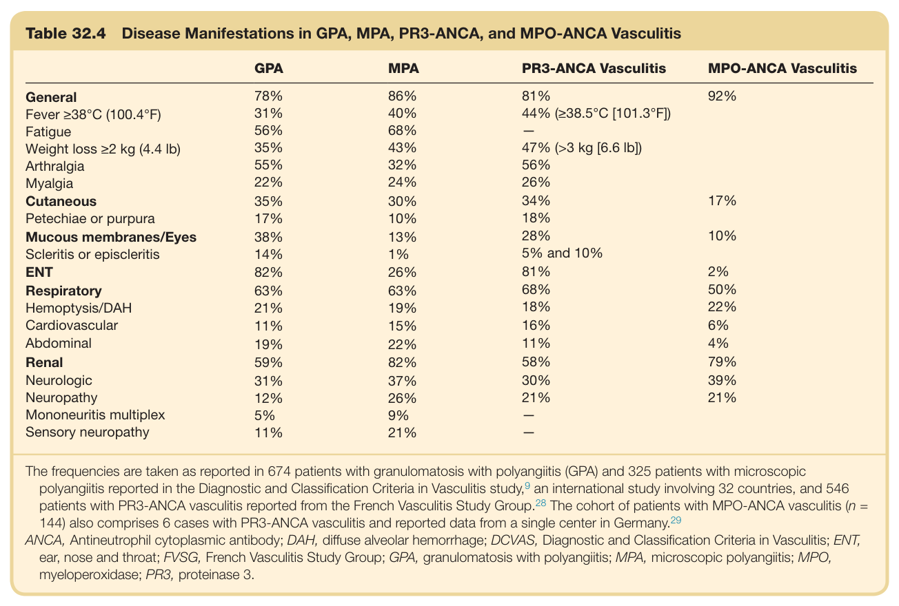

#### Table Data (CSV: [Table_32_4.csv](Table_32_4.csv))

```markdown
| Table Text (OCR) |
| :--- |
| Table 32.4 Disease Manifestations in GPA, MPA, PR3-ANCA, and MPO-ANCA Vasculitis GPA  MPA  PR3-ANCA Vasculitis  MPO-ANCA Vasculitis    General  78%  86%  81%  92%    Fever ≥38°C (100.4°F)  31%  40%  44% (≥38.5°C [101.3°F])      Fatigue  56%  68%  —      Weight loss ≥2 kg (4.4 lb)  35%  43%  47% (>3 kg [6.6 lb])      Arthralgia  55%  32%  56%      Myalgia  22%  24%  26%      Cutaneous  35%  30%  34%  17%    Petechiae or purpura  17%  10%  18%      Mucous membranes/Eyes  38%  13%  28%  10%    Scleritis or episcleritis  14%  1%  5% and 10%      ENT  82%  26%  81%  2%    Respiratory  63%  63%  68%  50%    Hemoptysis/DAH  21%  19%  18%  22%    Cardiovascular  11%  15%  16%  6%    Abdominal  19%  22%  11%  4%    Renal  59%  82%  58%  79%    Neurologic  31%  37%  30%  39%    Neuropathy  12%  26%  21%  21%    Mononeuritis multiplex  5%  9%  —      Sensory neuropathy  11%  21%  — The frequencies are taken as reported in 674 patients with granulomatosis with polyangiitis (GPA) and 325 patients with microscopic polyangiitis reported in the Diagnostic and Classification Criteria in Vasculitis study,<sup>9</sup> an international study involving 32 countries, and 546 patients with PR3-ANCA vasculitis reported from the French Vasculitis Study Group.<sup>28</sup> The cohort of patients with MPO-ANCA vasculitis (n = 144) also comprises 6 cases with PR3-ANCA vasculitis and reported data from a single center in Germany.<sup>29</sup> ANCA, Antineutrophil cytoplasmic antibody; DAH, diffuse alveolar hemorrhage; DCVAS, Diagnostic and Classification Criteria in Vasculitis; ENT, ear, nose and throat; FVSG, French Vasculitis Study Group; GPA, granulomatosis with polyangiitis; MPA, microscopic polyangiitis; MPO, myeloperoxidase; PR3, proteinase 3. |
```

Table 32.4 Disease Manifestations in GPA, MPA, PR3-ANCA, and MPO-ANCA Vasculitis

---

### Table_32_5

#### Table Image

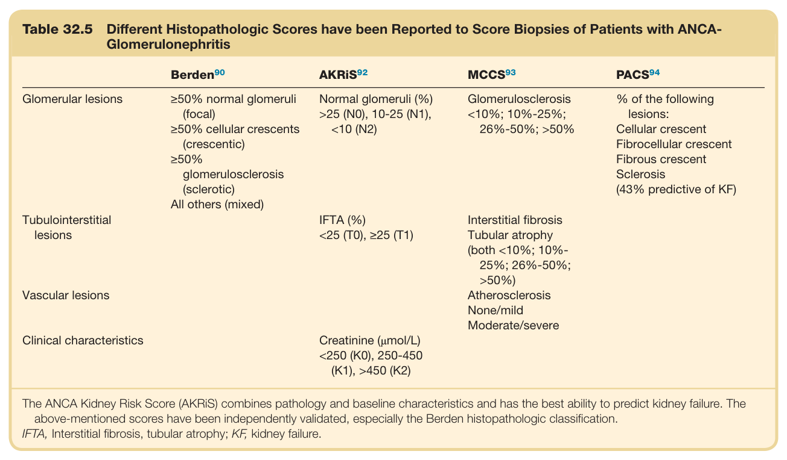

#### Table Data (CSV: [Table_32_5.csv](Table_32_5.csv))

```markdown
| Table Text (OCR) |
| :--- |
| Table 32.5 Different Histopathologic Scores have been Reported to Score Biopsies of Patients with ANCA- Glomerulonephritis Berden^{90}    AKRiS^{92}    MCCS^{93}    PACS^{94}     Glomerular lesions  ≥50% normal glomeruli (focal)≥50% cellular crescents (crescentic)≥50% glomerulosclerosis (sclerotic)All others (mixed)  Normal glomeruli (%) >25 (N0), 10-25 (N1), <10 (N2)  Glomerulosclerosis <10%; 10%-25%; 26%-50%; >50%  % of the following lesions:Cellular crescentFibrocellular crescentFibrous crescentSclerosis (43% predictive of KF)    Tubulointerstitial lesions    IFTA (%) <25 (T0), ≥25 (T1)  Interstitial fibrosisTubular atrophy (both <10%; 10%-25%; 26%-50%; >50%)      Vascular lesions      AtherosclerosisNone/mildModerate/severe      Clinical characteristics    Creatinine (μmol/L) <250 (K0), 250-450 (K1), >450 (K2) The ANCA Kidney Risk Score (AKRiS) combines pathology and baseline characteristics and has the best ability to predict kidney failure. The above-mentioned scores have been independently validated, especially the Berden histopathologic classification. IFTA, Interstitial fibrosis, tubular atrophy; KF, kidney failure. |
```

Table 32.5 Different Histopathologic Scores have been Reported to Score Biopsies of Patients with ANCA- Glomerulonephritis

---

### Table_32_6

#### Table Image

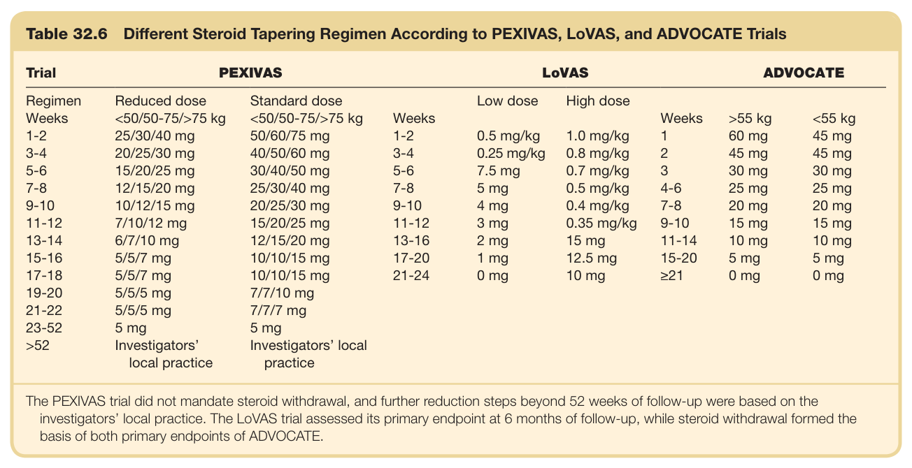

#### Table Data (CSV: [Table_32_6.csv](Table_32_6.csv))

```markdown
| Table Text (OCR) |
| :--- |
| Table 32.6  Different Steroid Tapering Regimen According to PEXIVAS, LoVAS, and ADVOCATE Trials Trial  PEXIVAS  LoVAS  ADVOCATE    Regimen  Reduced dose  Standard dose    Low dose  High dose          Weeks  <50/50-75/>75 kg  <50/50-75/>75 kg  Weeks      Weeks  >55 kg  <55 kg    1-2  25/30/40 mg  50/60/75 mg  1-2  0.5 mg/kg  1.0 mg/kg  1  60 mg  45 mg    3-4  20/25/30 mg  40/50/60 mg  3-4  0.25 mg/kg  0.8 mg/kg  2  45 mg  45 mg    5-6  15/20/25 mg  30/40/50 mg  5-6  7.5 mg  0.7 mg/kg  3  30 mg  30 mg    7-8  12/15/20 mg  25/30/40 mg  7-8  5 mg  0.5 mg/kg  4-6  25 mg  25 mg    9-10  10/12/15 mg  20/25/30 mg  9-10  4 mg  0.4 mg/kg  7-8  20 mg  20 mg    11-12  7/10/12 mg  15/20/25 mg  11-12  3 mg  0.35 mg/kg  9-10  15 mg  15 mg    13-14  6/7/10 mg  12/15/20 mg  13-16  2 mg  15 mg  11-14  10 mg  10 mg    15-16  5/5/7 mg  10/10/15 mg  17-20  1 mg  12.5 mg  15-20  5 mg  5 mg    17-18  5/5/7 mg  10/10/15 mg  21-24  0 mg  10 mg  ≥21  0 mg  0 mg    19-20  5/5/5 mg  7/7/10 mg                21-22  5/5/5 mg  7/7/7 mg                23-52  5 mg  5 mg                >52  Investigators' local practice  Investigators' local practice The PEXIVAS trial did not mandate steroid withdrawal, and further reduction steps beyond 52 weeks of follow-up were based on the investigators’ local practice. The LoVAS trial assessed its primary endpoint at 6 months of follow-up, while steroid withdrawal formed the basis of both primary endpoints of ADVOCATE. |
```

Table 32.6 Different Steroid Tapering Regimen According to PEXIVAS, LoVAS, and ADVOCATE Trials

---

### Table_32_7

#### Table Image

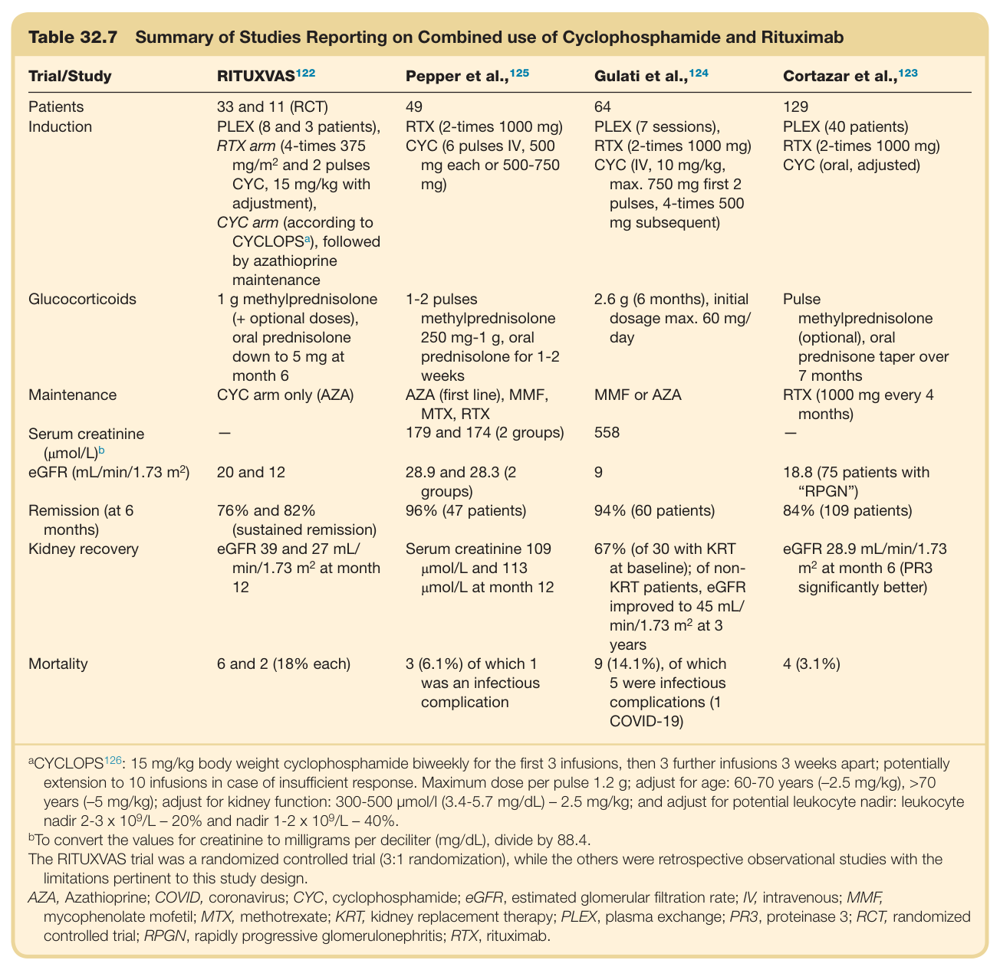

#### Table Data (CSV: [Table_32_7.csv](Table_32_7.csv))

```markdown
| Table Text (OCR) |
| :--- |
| Table 32.7 Summary of Studies Reporting on Combined use of Cyclophosphamide and Rituximab Trial/Study  RITUXVAS ^{122}   Pepper et al., ^{125}   Gulati et al., ^{124}   Cortazar et al., ^{123}     Patients  33 and 11 (RCT)  49  64  129    Induction  PLEX (8 and 3 patients), RTX arm (4-times 375 mg/m ^{2}  and 2 pulses CYC, 15 mg/kg with adjustment),CYC arm (according to CYCLOPS ^{a} ), followed by azathioprine maintenance  RTX (2-times 1000 mg)CYC (6 pulses IV, 500 mg each or 500-750 mg)  PLEX (7 sessions), RTX (2-times 1000 mg)CYC (IV, 10 mg/kg, max. 750 mg first 2 pulses, 4-times 500 mg subsequent)  PLEX (40 patients)RTX (2-times 1000 mg)CYC (oral, adjusted)    Glucocorticoids  1 g methylprednisolone (+ optional doses), oral prednisolone down to 5 mg at month 6  1-2 pulses methylprednisolone 250 mg-1 g, oral prednisolone for 1-2 weeks  2.6 g (6 months), initial dosage max. 60 mg/day  Pulse methylprednisolone (optional), oral prednisone taper over 7 months    Maintenance  CYC arm only (AZA)  AZA (first line), MMF, MTX, RTX  MMF or AZA  RTX (1000 mg every 4 months)    Serum creatinine (μmol/L) ^{b}   -  179 and 174 (2 groups)  558  -    eGFR (mL/min/1.73 m ^{2} )  20 and 12  28.9 and 28.3 (2 groups)  9  18.8 (75 patients with “RPGN”)    Remission (at 6 months)  76% and 82% (sustained remission)  96% (47 patients)  94% (60 patients)  84% (109 patients)    Kidney recovery  eGFR 39 and 27 mL/min/1.73 m ^{2}  at month 12  Serum creatinine 109 μmol/L and 113 μmol/L at month 12  67% (of 30 with KRT at baseline); of non-KRT patients, eGFR improved to 45 mL/min/1.73 m ^{2}  at 3 years  eGFR 28.9 mL/min/1.73 m ^{2}  at month 6 (PR3 significantly better)    Mortality  6 and 2 (18% each)  3 (6.1%) of which 1 was an infectious complication  9 (14.1%), of which 5 were infectious complications (1 COVID-19)  4 (3.1%) <sup>a</sup>CYCLOPS<sup>126</sup>: 15 mg/kg body weight cyclophosphamide biweekly for the first 3 infusions, then 3 further infusions 3 weeks apart; potentially extension to 10 infusions in case of insufficient response. Maximum dose per pulse 1.2 g; adjust for age: 60-70 years (–2.5 mg/kg), >70 years (–5 mg/kg); adjust for kidney function: 300-500 μmol/l (3.4-5.7 mg/dL) – 2.5 mg/kg; and adjust for potential leukocyte nadir: leukocyte nadir 2-3 x 10<sup>9</sup>/L – 20% and nadir 1-2 x 10<sup>9</sup>/L – 40%. <sup>b</sup>To convert the values for creatinine to milligrams per deciliter (mg/dL), divide by 88.4. The RITUXVAS trial was a randomized controlled trial (3:1 randomization), while the others were retrospective observational studies with the limitations pertinent to this study design. AZA, Azathioprine; COVID, coronavirus; CYC, cyclophosphamide; eGFR, estimated glomerular filtration rate; IV, intravenous; MMF, mycophenolate mofetil; MTX, methotrexate; KRT, kidney replacement therapy; PLEX, plasma exchange; PR3, proteinase 3; RCT, randomized controlled trial; RPGN, rapidly progressive glomerulonephritis; RTX, rituximab. |
```

Table 32.7 Summary of Studies Reporting on Combined use of Cyclophosphamide and Rituximab

---
