# 33. IgA Nephropathy and IgA Vasculitis - Figures and Tables Index

This document lists all figures and tables extracted from `33. IgA Nephropathy and IgA Vasculitis.pdf`.

## Table of Contents
- [Figures](#figures)
- [Tables](#tables)

---

## Figures

### Fig_33_1

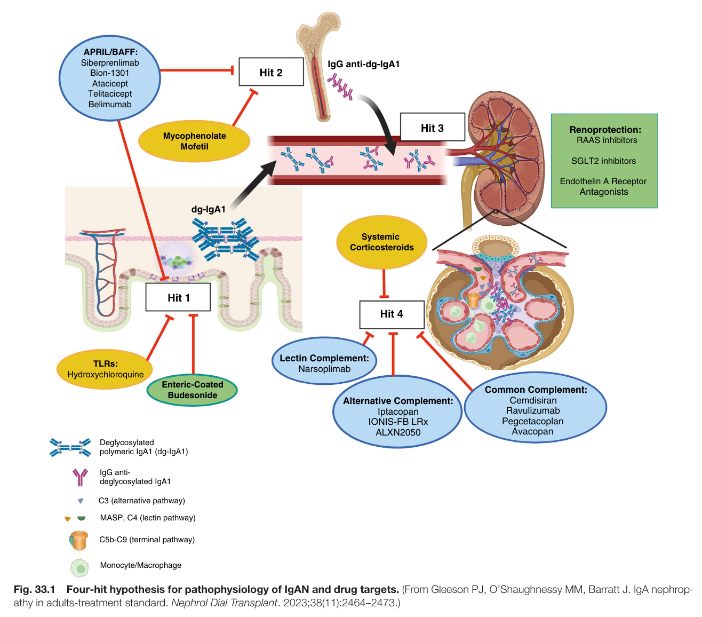

Fig. 33.1 Four-hit hypothesis for pathophysiology of IgAN and drug targets. (From Gleeson PJ, O’Shaughnessy MM, Barratt J. IgA nephrop athy in adults-treatment standard. Nephrol Dial Transplant. 2023;38(11):2464–2473.)

---

### Fig_33_2

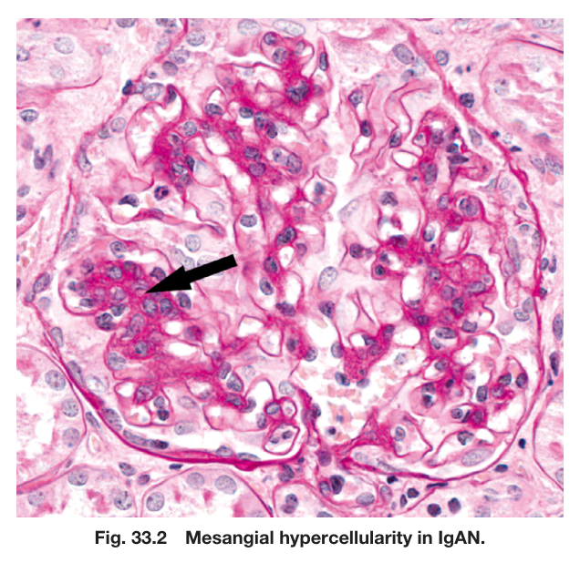

Fig. 33.2 Mesangial hypercellularity in IgAN.

---

### Fig_33_3

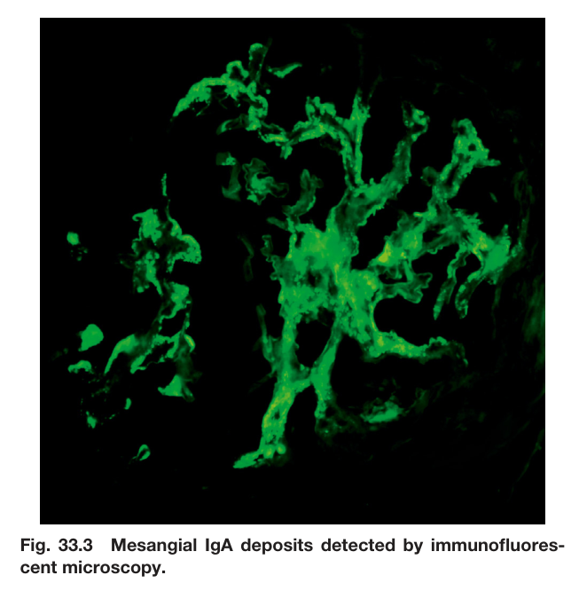

Fig. 33.3 Mesangial IgA deposits detected by immunofluores- cent microscopy.

---

### Fig_33_4

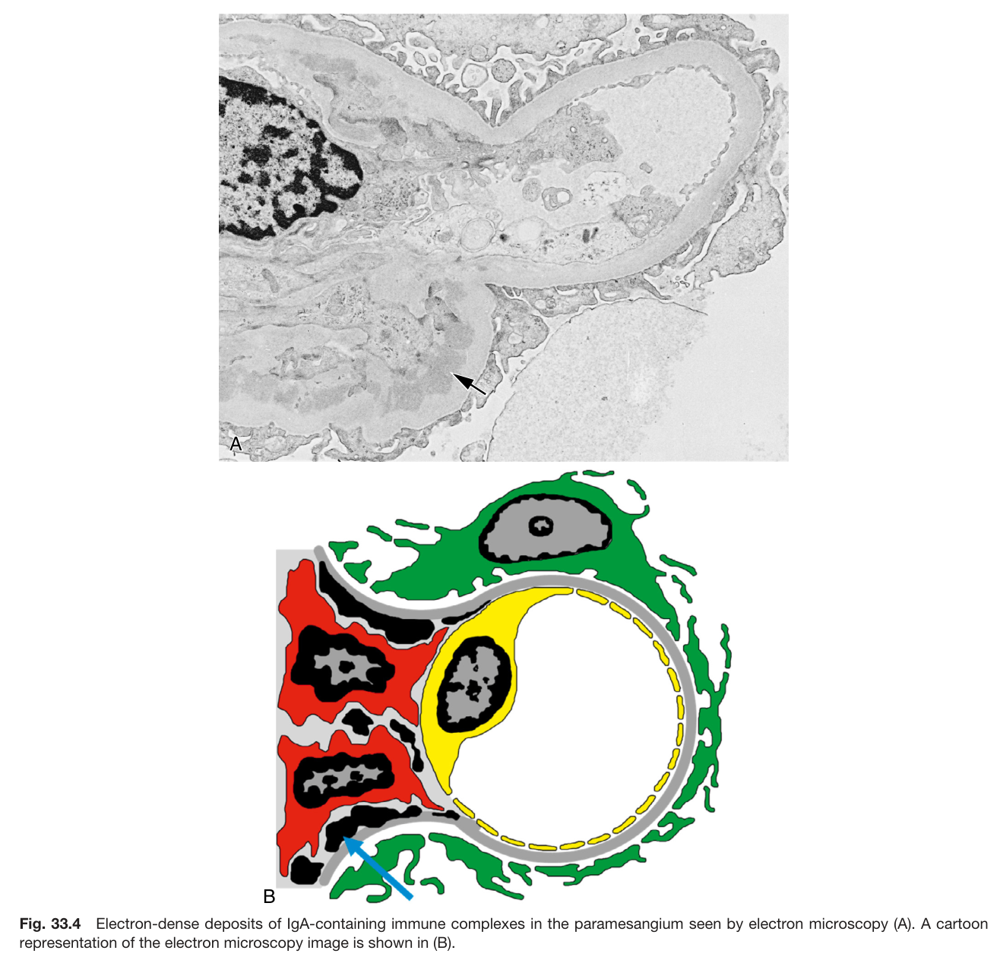

Fig. 33.4 Electron-dense deposits of IgA-containing immune complexes in the paramesangium seen by electron microscopy (A). A cartoon representation of the electron microscopy image is shown in (B).

---

### Fig_33_5

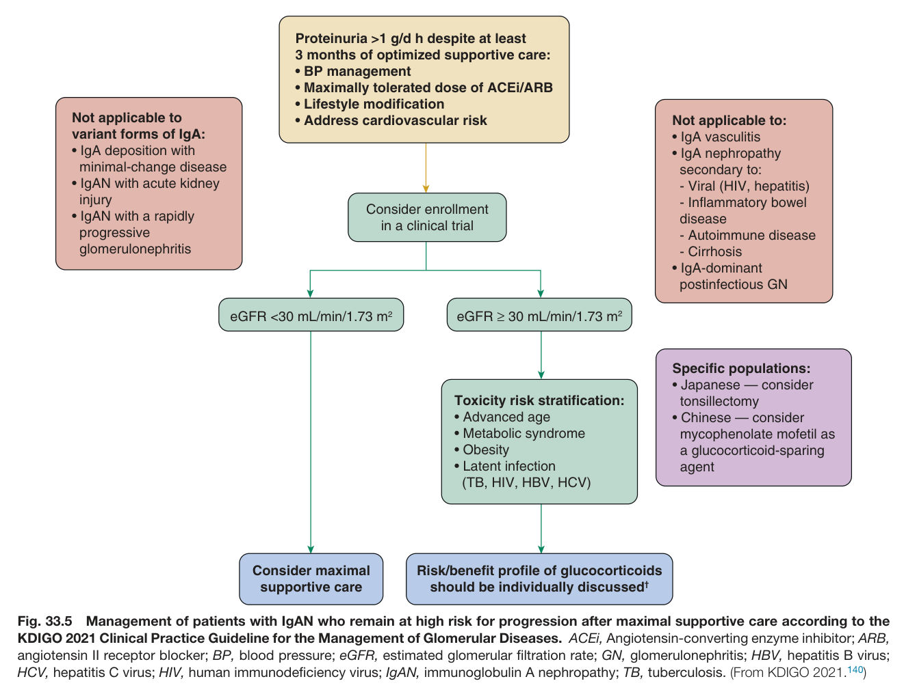

Fig. 33.5 Management of patients with IgAN who remain at high risk for progression after maximal supportive care according to the KDIGO 2021 Clinical Practice Guideline for the Management of Glomerular Diseases. ACEi, Angiotensin-converting enzyme inhibitor; ARB, angiotensin II receptor blocker; BP, blood pressure; eGFR, estimated glomerular filtration rate; GN, glomerulonephritis; HBV, hepatitis B virus; HCV, hepatitis C virus; HIV, human immunodeficiency virus; IgAN, immunoglobulin A nephropathy; TB, tuberculosis. (From KDIGO 2021.<sup>140</sup>)

---

### Fig_33_6

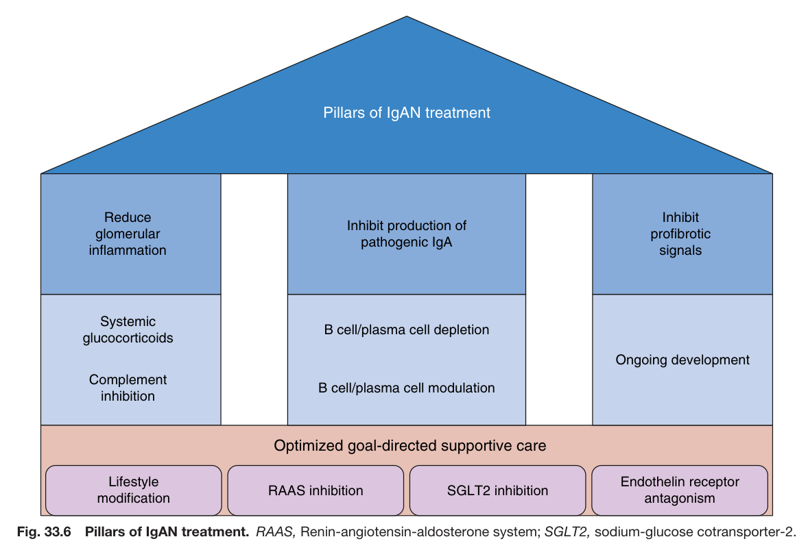

Fig. 33.6 Pillars of IgAN treatment. RAAS, Renin-angiotensin-aldosterone system; SGLT2, sodium-glucose cotransporter-2.

---

### Fig_33_7

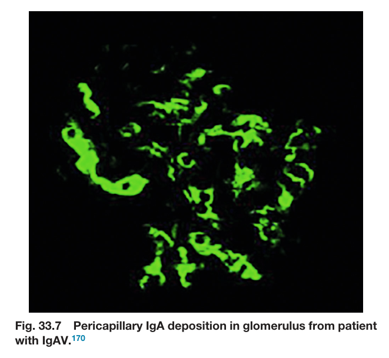

Fig. 33.7 Pericapillary IgA deposition in glomerulus from patient with IgAV.<sup>170</sup>

---

### Fig_33_8

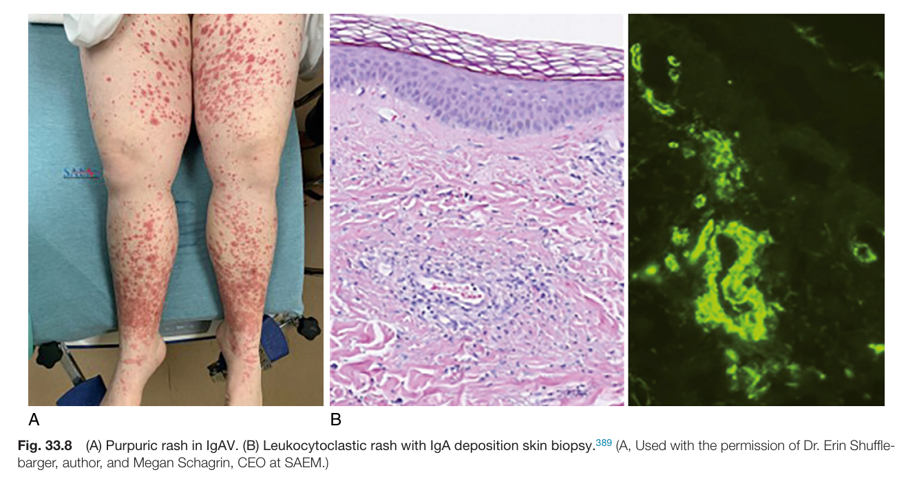

Fig. 33.8 (A) Purpuric rash in IgAV. (B) Leukocytoclastic rash with IgA deposition skin biopsy.<sup>389</sup> (A, Used with the permission of Dr. Erin Shuffle- barger, author, and Megan Schagrin, CEO at SAEM.)

---

## Tables

### Table_33_1

#### Table Image

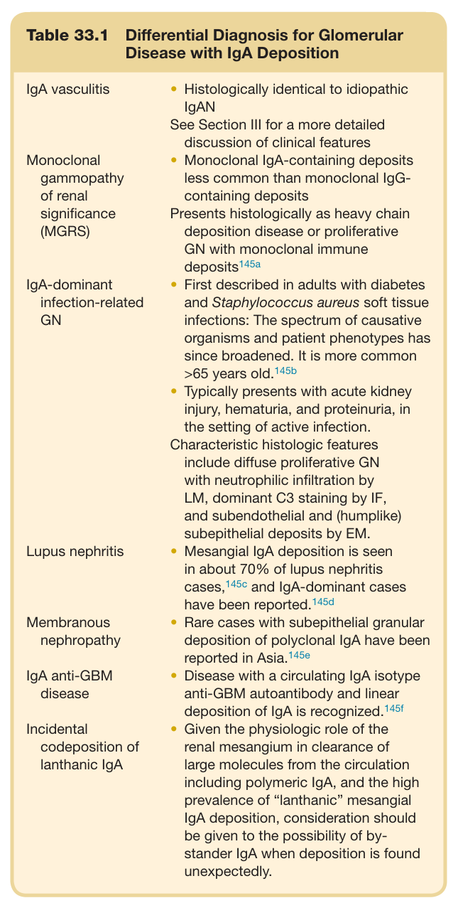

#### Table Data (CSV: [Table_33_1.csv](Table_33_1.csv))

```markdown
| Table Text (OCR) |
| :--- |
| Table 33.1  Differential Diagnosis for Glomerular Disease with IgA Deposition IgA vasculitis  Histologically identical to idiopathic IgANSee Section III for a more detailed discussion of clinical features    Monoclonal gammopathy of renal significance (MGRS)  Monoclonal IgA-containing deposits less common than monoclonal IgG-containing depositsPresents histologically as heavy chain deposition disease or proliferative GN with monoclonal immune deposits ^{145a}     IgA-dominant infection-related GN  First described in adults with diabetes and Staphylococcus aureus soft tissue infections: The spectrum of causative organisms and patient phenotypes has since broadened. It is more common >65 years old. ^{145b} Typically presents with acute kidney injury, hematuria, and proteinuria, in the setting of active infection.Characteristic histologic features include diffuse proliferative GN with neutrophilic infiltration by LM, dominant C3 staining by IF, and subendothelial and (humplike) subepithelial deposits by EM.    Lupus nephritis  Mesangial IgA deposition is seen in about 70% of lupus nephritis cases, ^{145c}  and IgA-dominant cases have been reported. ^{145d}     Membranous nephropathy  Rare cases with subepithelial granular deposition of polyclonal IgA have been reported in Asia. ^{145e}     IgA anti-GBM disease  Disease with a circulating IgA isotype anti-GBM autoantibody and linear deposition of IgA is recognized. ^{145f}     Incidental codeposition of lanthanic IgA  Given the physiologic role of the renal mesangium in clearance of large molecules from the circulation including polymeric IgA, and the high prevalence of “lanthanic” mesangial IgA deposition, consideration should be given to the possibility of bystander IgA when deposition is found unexpectedly. |
```

Table 33.1 Differential Diagnosis for Glomerular Disease with IgA Deposition

---

### Table_33_2

#### Table Image

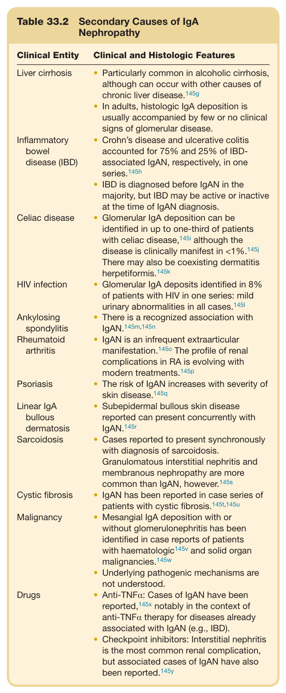

#### Table Data (CSV: [Table_33_2.csv](Table_33_2.csv))

```markdown
| Table Text (OCR) |
| :--- |
| Table 33.2  Secondary Causes of IgA Nephropathy Clinical Entity  Clinical and Histologic Features    Liver cirrhosis  Particularly common in alcoholic cirrhosis, although can occur with other causes of chronic liver disease. ^{145g} In adults, histologic IgA deposition is usually accompanied by few or no clinical signs of glomerular disease.    Inflammatory bowel disease (IBD)  Crohn’s disease and ulcerative colitis accounted for 75% and 25% of IBD-associated IgAN, respectively, in one series. ^{145h} IBD is diagnosed before IgAN in the majority, but IBD may be active or inactive at the time of IgAN diagnosis.    Celiac disease  Glomerular IgA deposition can be identified in up to one-third of patients with celiac disease, ^{145i}  although the disease is clinically manifest in <1%. ^{145j} There may also be coexisting dermatitis herpetiformis. ^{145k}     HIV infection  Glomerular IgA deposits identified in 8% of patients with HIV in one series: mild urinary abnormalities in all cases. ^{145l}     Ankylosing spondylitis  There is a recognized association with IgAN. ^{145m,145n}     Rheumatoid arthritis  IgAN is an infrequent extraarticular manifestation. ^{145o}  The profile of renal complications in RA is evolving with modern treatments. ^{145p}     Psoriasis  The risk of IgAN increases with severity of skin disease. ^{145q}     Linear IgA bullous dermatosis  Subepidermal bullous skin disease reported can present concurrently with IgAN. ^{145r}     Sarcoidosis  Cases reported to present synchronously with diagnosis of sarcoidosis.Granulomatous interstitial nephritis and membranous nephropathy are more common than IgAN, however. ^{145s}     Cystic fibrosis  IgAN has been reported in case series of patients with cystic fibrosis. ^{145t,145u}     Malignancy  Mesangial IgA deposition with or without glomerulonephritis has been identified in case reports of patients with haematologic ^{145v}  and solid organ malignancies. ^{145w} Underlying pathogenic mechanisms are not understood.    Drugs  Anti-TNF \alpha : Cases of IgAN have been reported, ^{145x}  notably in the context of anti-TNF \alpha  therapy for diseases already associated with IgAN (e.g., IBD).Checkpoint inhibitors: Interstitial nephritis is the most common renal complication, but associated cases of IgAN have also been reported. ^{145y} |
```

Table 33.2 Secondary Causes of IgA Nephropathy

---

### Table_33_3

#### Table Image

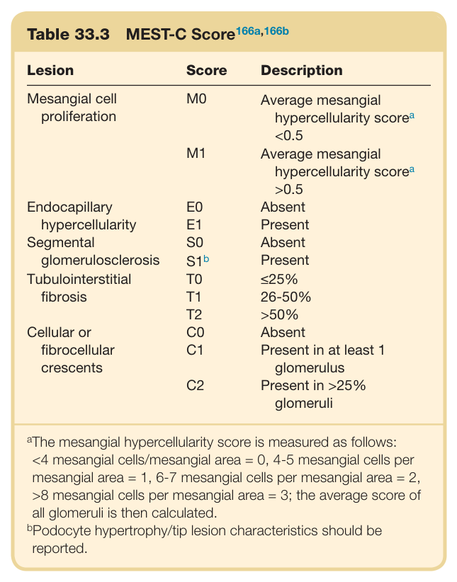

#### Table Data (CSV: [Table_33_3.csv](Table_33_3.csv))

```markdown
| Table Text (OCR) |
| :--- |
| Table 33.3 MEST-C Score<sup>166a,166b</sup> Lesion  Score  Description    Mesangial cell proliferation  M0  Average mesangial hypercellularity scorea<0.5    M1  Average mesangial hypercellularity scorea>0.5    Endocapillary hypercellularity  E0  Absent    E1  Present    Segmental glomerulosclerosis  S0  Absent    S1b  Present    Tubulointerstitial fibrosis  T0  ≤25%    T1  26-50%    T2  >50%    Cellular or fibrocellular crescents  C0  Absent    C1  Present in at least 1 glomerulus    C2  Present in >25% glomeruli <sup>a</sup>The mesangial hypercellularity score is measured as follows: <4 mesangial cells/mesangial area = 0, 4-5 mesangial cells per mesangial area = 1, 6-7 mesangial cells per mesangial area = 2, >8 mesangial cells per mesangial area = 3; the average score of all glomeruli is then calculated. <sup>b</sup>Podocyte hypertrophy/tip lesion characteristics should be reported. |
```

Table 33.3 MEST-C Score<sup>166a,166b</sup>

---

### Table_33_4

#### Table Image

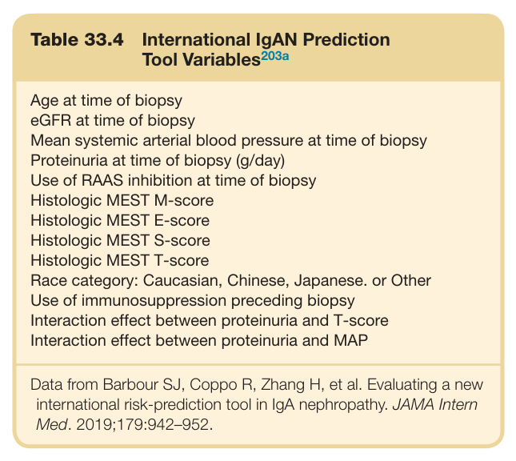

#### Table Data (CSV: [Table_33_4.csv](Table_33_4.csv))

```markdown
| Table Text (OCR) |
| :--- |
| Table 33.4  International IgAN Prediction Tool Variables<sup>203a</sup> Age at time of biopsy    eGFR at time of biopsy    Mean systemic arterial blood pressure at time of biopsy    Proteinuria at time of biopsy (g/day)    Use of RAAS inhibition at time of biopsy    Histologic MEST M-score    Histologic MEST E-score    Histologic MEST S-score    Histologic MEST T-score    Race category: Caucasian, Chinese, Japanese. or Other    Use of immunosuppression preceding biopsy    Interaction effect between proteinuria and T-score    Interaction effect between proteinuria and MAP Data from Barbour SJ, Coppo R, Zhang H, et al. Evaluating a new international risk-prediction tool in IgA nephropathy. JAMA Intern Med. 2019;179:942–952. |
```

Table 33.4 International IgAN Prediction Tool Variables<sup>203a</sup>

---

### Table_33_5

#### Table Image

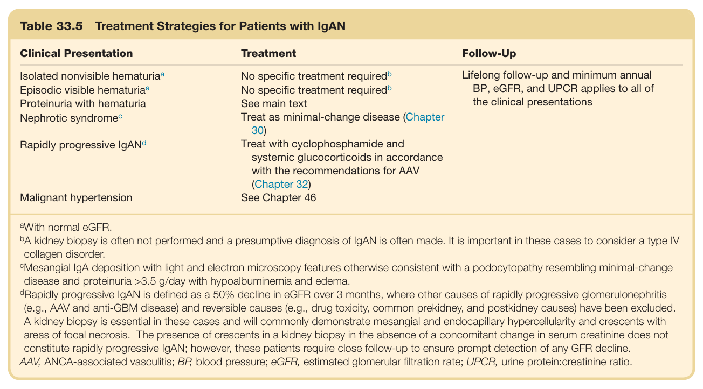

#### Table Data (CSV: [Table_33_5.csv](Table_33_5.csv))

```markdown
| Table Text (OCR) |
| :--- |
| Table 33.5  Treatment Strategies for Patients with IgAN Clinical Presentation  Treatment  Follow-Up    Isolated nonvisible hematuria ^{a}   No specific treatment required ^{b}   Lifelong follow-up and minimum annual BP, eGFR, and UPCR applies to all of the clinical presentations    Episodic visible hematuria ^{a}   No specific treatment required ^{b}     Proteinuria with hematuria  See main text    Nephrotic syndrome ^{c}   Treat as minimal-change disease (Chapter 30)      Rapidly progressive IgAN ^{d}   Treat with cyclophosphamide and systemic glucocorticoids in accordance with the recommendations for AAV (Chapter 32)      Malignant hypertension  See Chapter 46 <sup>a</sup>With normal eGFR. <sup>b</sup>A kidney biopsy is often not performed and a presumptive diagnosis of IgAN is often made. It is important in these cases to consider a type IV collagen disorder. <sup>c</sup>Mesangial IgA deposition with light and electron microscopy features otherwise consistent with a podocytopathy resembling minimal-change disease and proteinuria >3.5 g/day with hypoalbuminemia and edema. <sup>d</sup>Rapidly progressive IgAN is defined as a 50% decline in eGFR over 3 months, where other causes of rapidly progressive glomerulonephritis (e.g., AAV and anti-GBM disease) and reversible causes (e.g., drug toxicity, common prekidney, and postkidney causes) have been excluded. A kidney biopsy is essential in these cases and will commonly demonstrate mesangial and endocapillary hypercellularity and crescents with areas of focal necrosis. The presence of crescents in a kidney biopsy in the absence of a concomitant change in serum creatinine does not constitute rapidly progressive IgAN; however, these patients require close follow-up to ensure prompt detection of any GFR decline. AAV, ANCA-associated vasculitis; BP, blood pressure; eGFR, estimated glomerular filtration rate; UPCR, urine protein:creatinine ratio. |
```

Table 33.5 Treatment Strategies for Patients with IgAN

---

### Table_33_6

#### Table Image

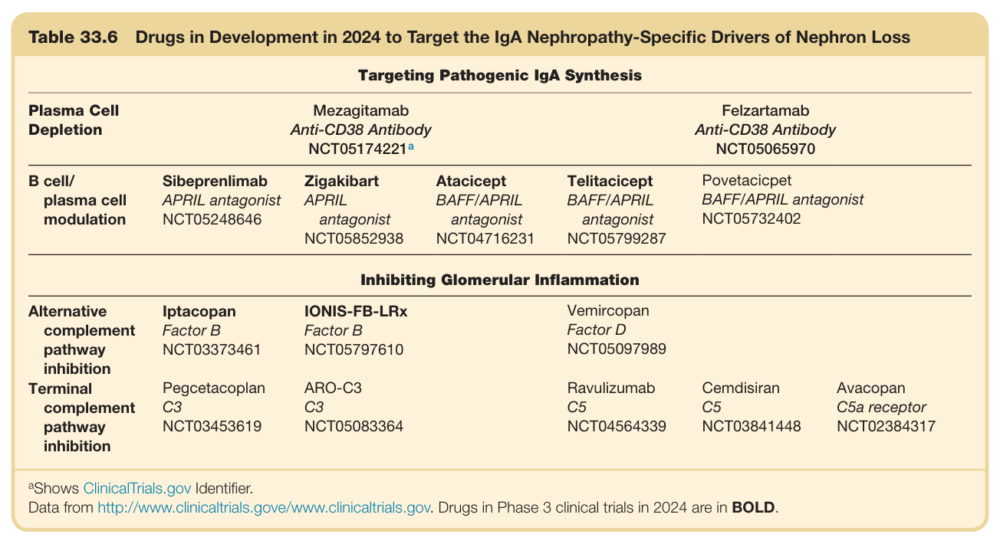

#### Table Data (CSV: [Table_33_6.csv](Table_33_6.csv))

```markdown
| Table Text (OCR) |
| :--- |
| Table 33.6 Drugs in Development in 2024 to Target the IgA Nephropathy-Specific Drivers of Nephron Loss Targeting Pathogenic IgA Synthesis Plasma Cell Depletion    Mezagitamab Anti-CD38 Antibody NCT05174221 ^{a}   Felzartamab Anti-CD38 Antibody NCT05065970    B cell/plasma cell modulation  SibeprenlimabAPRIL antagonistNCT05248646  ZigakibartAPRILantagonistNCT05852938  AtaciceptBAFF/APRILantagonistNCT04716231  TelitaciceptBAFF/APRILantagonistNCT05799287  PovetaciceptBAFF/APRIL antagonistNCT05732402 |
```

Table 33.6 Drugs in Development in 2024 to Target the IgA Nephropathy-Specific Drivers of Nephron Loss

---

### Table_33_7

#### Table Image

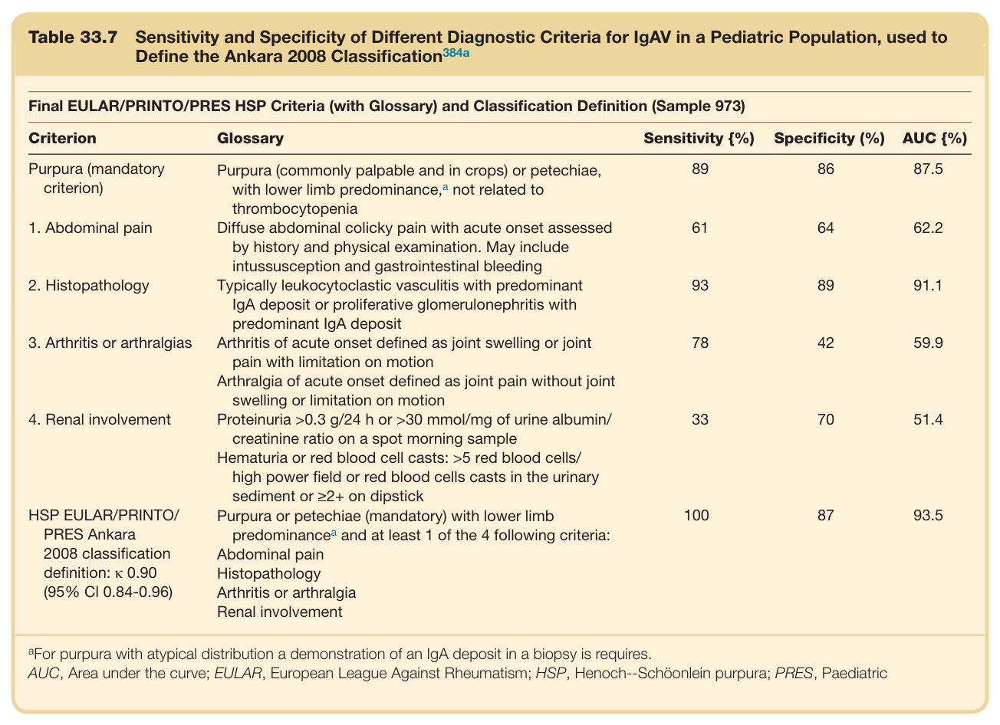

#### Table Data (CSV: [Table_33_7.csv](Table_33_7.csv))

```markdown
| Table Text (OCR) |
| :--- |
| Table 33.7  Sensitivity and Specificity of Different Diagnostic Criteria for IgAV in a Pediatric Population, used to Define the Ankara 2008 Classification<sup>384a</sup> Final EULAR/PRINTO/PRES HSP Criteria (with Glossary) and Classification Definition (Sample 973) Criterion  Glossary  Sensitivity (%)  Specificity (%)  AUC (%)    Purpura (mandatory criterion)  Purpura (commonly palpable and in crops) or petechiae, with lower limb predominance, ^{a}  not related to thrombocytopenia  89  86  87.5    1. Abdominal pain  Diffuse abdominal colicky pain with acute onset assessed by history and physical examination. May include intussusception and gastrointestinal bleeding  61  64  62.2    2. Histopathology  Typically leukocytoclastic vasculitis with predominant IgA deposit or proliferative glomerulonephritis with predominant IgA deposit  93  89  91.1    3. Arthritis or arthralgias  Arthritis of acute onset defined as joint swelling or joint pain with limitation on motion  78  42  59.9    Arthralgia of acute onset defined as joint pain without joint swelling or limitation on motion          4. Renal involvement  Proteinuria >0.3 g/24 h or >30 mmol/mg of urine albumin/creatinine ratio on a spot morning sample  33  70  51.4    Hematuria or red blood cell casts: >5 red blood cells/high power field or red blood cells casts in the urinary sediment or ≥2+ on dipstick          HSP EULAR/PRINTO/PRES Ankara2008 classification definition: κ 0.90(95% CI 0.84-0.96)  Purpura or petechiae (mandatory) with lower limb predominance ^{a}  and at least 1 of the 4 following criteria:Abdominal painHistopathologyArthritis or arthralgiaRenal involvement  100  87  93.5 <sup>a</sup>For purpura with atypical distribution a demonstration of an IgA deposit in a biopsy is requires. AUC, Area under the curve; EULAR, European League Against Rheumatism; HSP, Henoch--Schöonlein purpura; PRES, Paediatric |
```

Table 33.7 Sensitivity and Specificity of Different Diagnostic Criteria for IgAV in a Pediatric Population, used to Define the Ankara 2008 Classification<sup>384a</sup>

---

### Table_33_8

#### Table Image

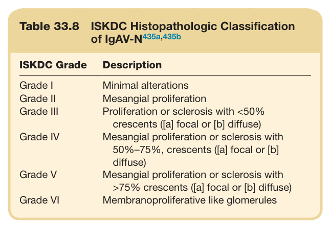

#### Table Data (CSV: [Table_33_8.csv](Table_33_8.csv))

```markdown
| Table Text (OCR) |
| :--- |
| Table 33.8  ISKDC Histopathologic Classification of IgAV-N<sup>435a,435b</sup> ISKDC Grade  Description    Grade I  Minimal alterations    Grade II  Mesangial proliferation    Grade III  Proliferation or sclerosis with <50% crescents ([a] focal or [b] diffuse)    Grade IV  Mesangial proliferation or sclerosis with 50%–75%, crescents ([a] focal or [b] diffuse)    Grade V  Mesangial proliferation or sclerosis with >75% crescents ([a] focal or [b] diffuse)    Grade VI  Membranoproliferative like glomerules |
```

Table 33.8 ISKDC Histopathologic Classification of IgAV-N<sup>435a,435b</sup>

---
