# 34. Infection-Related Glomerulonephritis - Figures and Tables Index

This document lists all figures and tables extracted from `34. Infection-Related Glomerulonephritis.pdf`.

## Table of Contents
- [Figures](#figures)
- [Tables](#tables)

---

## Figures

### Fig_34_1

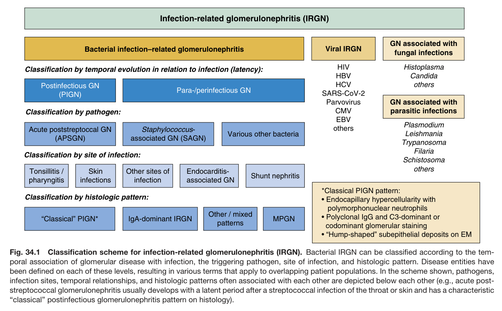

Fig. 34.1 Classification scheme for infection-related glomerulonephritis (IRGN). Bacterial IRGN can be classified according to the tem- poral association of glomerular disease with infection, the triggering pathogen, site of infection, and histologic pattern. Disease entities have been defined on each of these levels, resulting in various terms that apply to overlapping patient populations. In the scheme shown, pathogens, infection sites, temporal relationships, and histologic patterns often associated with each other are depicted below each other (e.g., acute post- streptococcal glomerulonephritis usually develops with a latent period after a streptococcal infection of the throat or skin and has a characteristic “classical” postinfectious glomerulonephritis pattern on histology).

---

### Fig_34_2

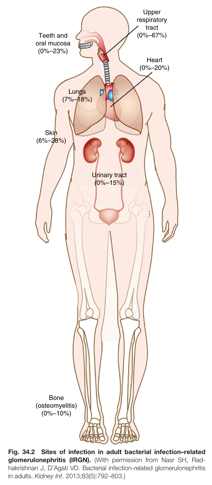

Fig. 34.2 Sites of infection in adult bacterial infection–related glomerulonephritis (IRGN). (With permission from Nasr SH, Rad- hakrishnan J, D’Agati VD. Bacterial infection-related glomerulonephritis in adults. Kidney Int. 2013;83(5):792–803.)

---

### Fig_34_3

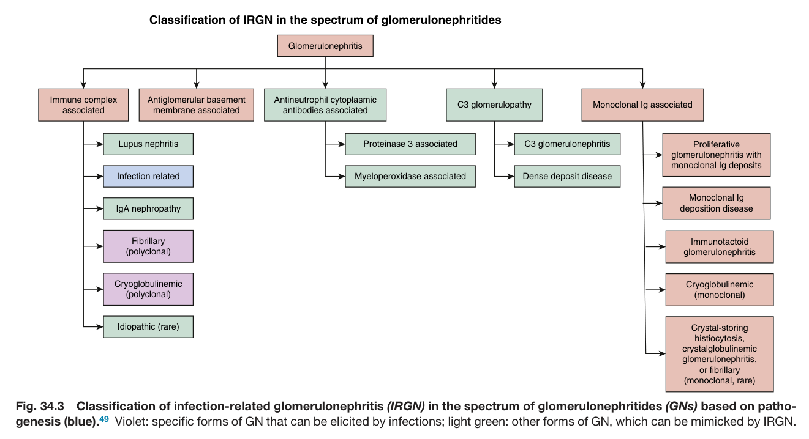

Fig. 34.3 Classification of infection-related glomerulonephritis (IRGN) in the spectrum of glomerulonephritides (GNs) based on patho- genesis (blue).<sup>49</sup> Violet: specific forms of GN that can be elicited by infections; light green: other forms of GN, which can be mimicked by IRGN.

---

### Fig_34_4

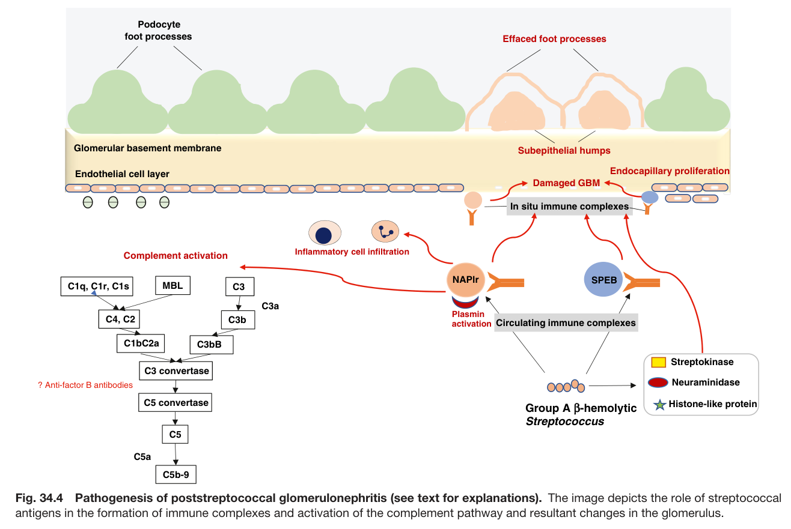

Fig. 34.4 Pathogenesis of poststreptococcal glomerulonephritis (see text for explanations). The image depicts the role of streptococca antigens in the formation of immune complexes and activation of the complement pathway and resultant changes in the glomerulus.

---

### Fig_34_5

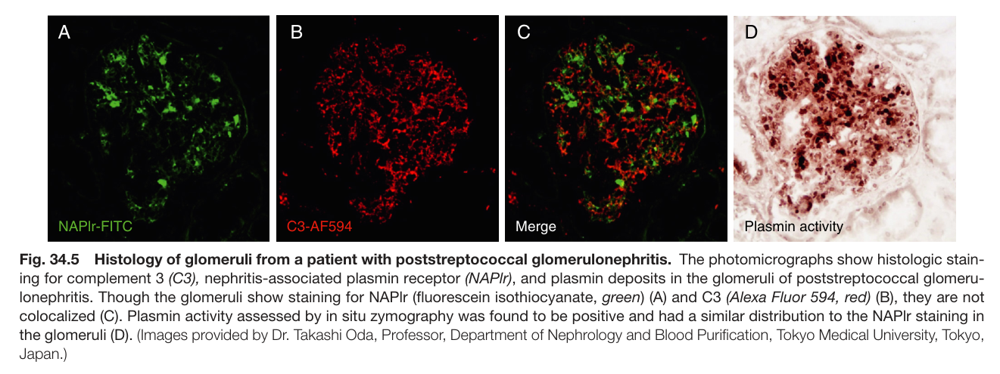

Fig. 34.5 Histology of glomeruli from a patient with poststreptococcal glomerulonephritis. The photomicrographs show histologic stain- ing for complement 3 (C3), nephritis-associated plasmin receptor (NAPlr), and plasmin deposits in the glomeruli of poststreptococcal glomeru- lonephritis. Though the glomeruli show staining for NAPlr (fluorescein isothiocyanate, green) (A) and C3 (Alexa Fluor 594, red) (B), they are not colocalized (C). Plasmin activity assessed by in situ zymography was found to be positive and had a similar distribution to the NAPlr staining in the glomeruli (D). (Images provided by Dr. Takashi Oda, Professor, Department of Nephrology and Blood Purification, Tokyo Medical University, Tokyo, Japan.)

---

### Fig_34_6

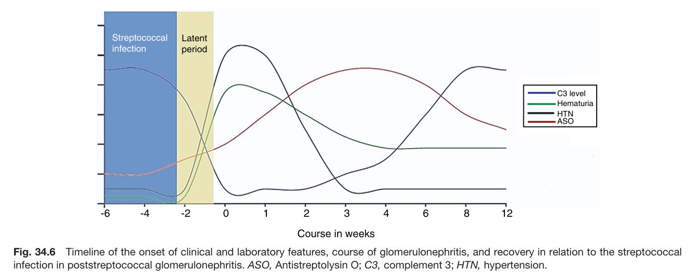

Fig. 34.6 Timeline of the onset of clinical and laboratory features, course of glomerulonephritis, and recovery in relation to the streptococca infection in poststreptococcal glomerulonephritis. ASO, Antistreptolysin O; C3, complement 3; HTN, hypertension.

---

### Fig_34_7

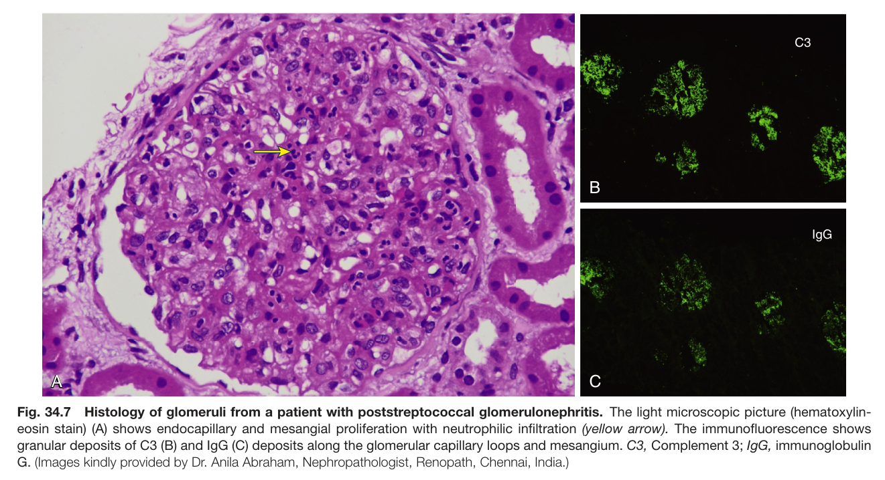

Fig. 34.7 Histology of glomeruli from a patient with poststreptococcal glomerulonephritis. The light microscopic picture (hematoxylin- eosin stain) (A) shows endocapillary and mesangial proliferation with neutrophilic infiltration (yellow arrow). The immunofluorescence shows granular deposits of C3 (B) and IgG (C) deposits along the glomerular capillary loops and mesangium. C3, Complement 3; IgG, immunoglobulin G. (Images kindly provided by Dr. Anila Abraham, Nephropathologist, Renopath, Chennai, India.)

---

### Fig_34_8

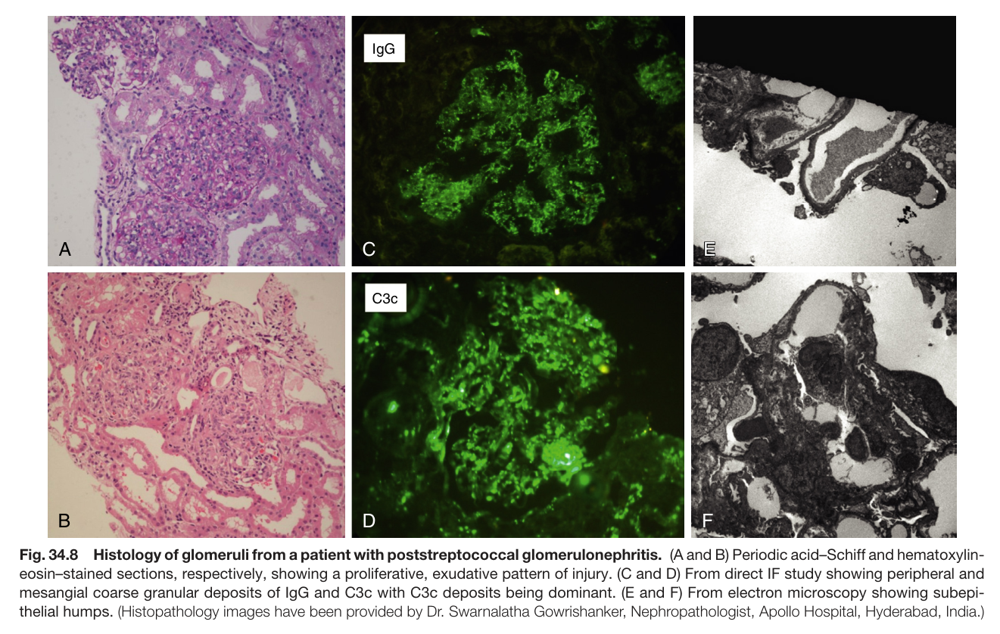

Fig. 34.8 Histology of glomeruli from a patient with poststreptococcal glomerulonephritis. (A and B) Periodic acid–Schiff and hematoxylin- eosin–stained sections, respectively, showing a proliferative, exudative pattern of injury. (C and D) From direct IF study showing peripheral and mesangial coarse granular deposits of IgG and C3c with C3c deposits being dominant. (E and F) From electron microscopy showing subepi- thelial humps. (Histopathology images have been provided by Dr. Swarnalatha Gowrishanker, Nephropathologist, Apollo Hospital, Hyderabad, India.)

---

### Fig_34_9

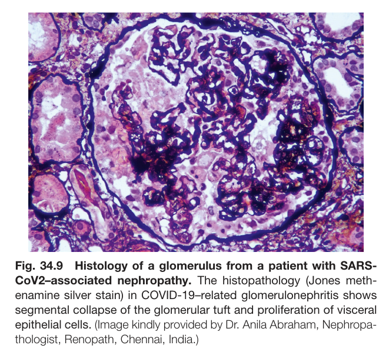

Fig. 34.9 Histology of a glomerulus from a patient with SARS- CoV2–associated nephropathy. The histopathology (Jones meth- enamine silver stain) in COVID-19–related glomerulonephritis shows segmental collapse of the glomerular tuft and proliferation of visceral epithelial cells. (Image kindly provided by Dr. Anila Abraham, Nephropa- thologist, Renopath, Chennai, India.)

---

### Fig_34_10

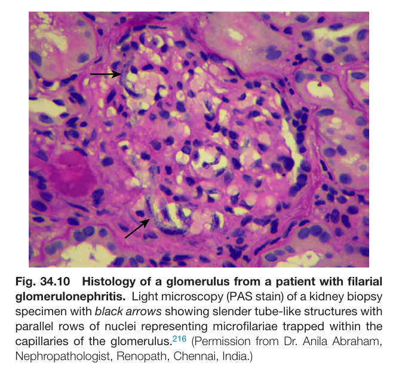

Fig. 34.10 Histology of a glomerulus from a patient with filarial glomerulonephritis. Light microscopy (PAS stain) of a kidney biopsy specimen with black arrows showing slender tube-like structures with parallel rows of nuclei representing microfilariae trapped within the capillaries of the glomerulus.<sup>216</sup> (Permission from Dr. Anila Abraham, Nephropathologist, Renopath, Chennai, India.)

---

## Tables

### Table_34_1

#### Table Image

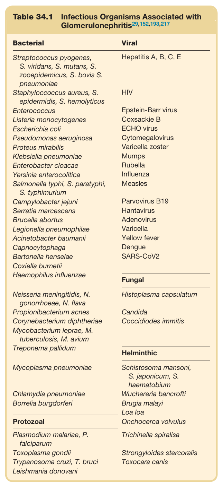

#### Table Data (CSV: [Table_34_1.csv](Table_34_1.csv))

```markdown
| Table Text (OCR) |
| :--- |
| Table 34.1  Infectious Organisms Associated with Glomerulonephritis<sup>29,152,193,217</sup> Bacterial  Viral    Streptococcus pyogenes,S. viridans, S. mutans, S.zooepidemicus, S. bovis S.pneumoniae  Hepatitis A, B, C, E    Staphylococcus aureus, S.epidermidis, S. hemolyticus  HIV    Enterococcus  Epstein-Barr virus    Listeria monocytogenes  Coxsackie B    Escherichia coli  ECHO virus    Pseudomonas aeruginosa  Cytomegalovirus    Proteus mirabilis  Varicella zoster    Klebsiella pneumoniae  Mumps    Enterobacter cloacae  Rubella    Yersinia enterocolitica  Influenza    Salmonella typhi, S. paratyphi,S. typhimurium  Measles    Campylobacter jejuni  Parvovirus B19    Serratia marcescens  Hantavirus    Brucella abortus  Adenovirus    Legionella pneumophilae  Varicella    Acinetobacter baumanii  Yellow fever    Capnocytophaga  Dengue    Bartonella henselae  SARS-CoV2    Coxiella burnetii      Haemophilus influenzae  Fungal    Neisseria meningitidis, N.gonorrhoeae, N. flava  Histoplasma capsulatum    Propionibacterium acnes  Candida    Corynebacterium diphtheriae  Coccidiodes immitis    Mycobacterium leprae, M.tuberculosis, M. avium      Treponema pallidum  Helminthic    Mycoplasma pneumoniae  Schistosoma mansoni,S. japonicum, S.haematobium    Chlamydia pneumoniae  Wuchereria bancrofti    Borrelia burgdorferi  Brugia malayi      Loa loa    Protozoal  Onchocerca volvulus    Plasmodium malariae, P.falciparum  Trichinella spiralisa    Toxoplasma gondii  Strongyloides stercoralis    Trypanosoma cruzi, T. bruci  Toxocara canis    Leishmania donovani |
```

Table 34.1 Infectious Organisms Associated with Glomerulonephritis<sup>29,152,193,217</sup>

---

### Table_34_2

#### Table Image

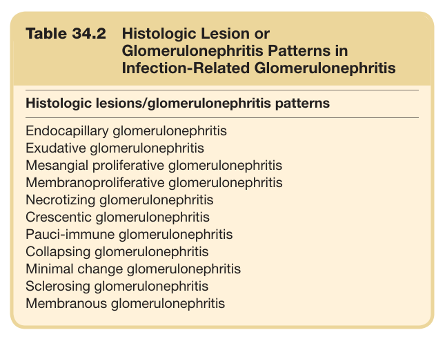

#### Table Data (CSV: [Table_34_2.csv](Table_34_2.csv))

```markdown
| Table Text (OCR) |
| :--- |
| Table 34.2  Histologic Lesion or Glomerulonephritis Patterns in Infection-Related Glomerulonephritis Histologic lesions/glomerulonephritis patterns Endocapillary glomerulonephritis    Exudative glomerulonephritis    Mesangial proliferative glomerulonephritis    Membranoproliferative glomerulonephritis    Necrotizing glomerulonephritis    Crescentic glomerulonephritis    Pauci-immune glomerulonephritis    Collapsing glomerulonephritis    Minimal change glomerulonephritis    Sclerosing glomerulonephritis    Membranous glomerulonephritis |
```

Table 34.2 Histologic Lesion or Glomerulonephritis Patterns in Infection-Related Glomerulonephritis

---
