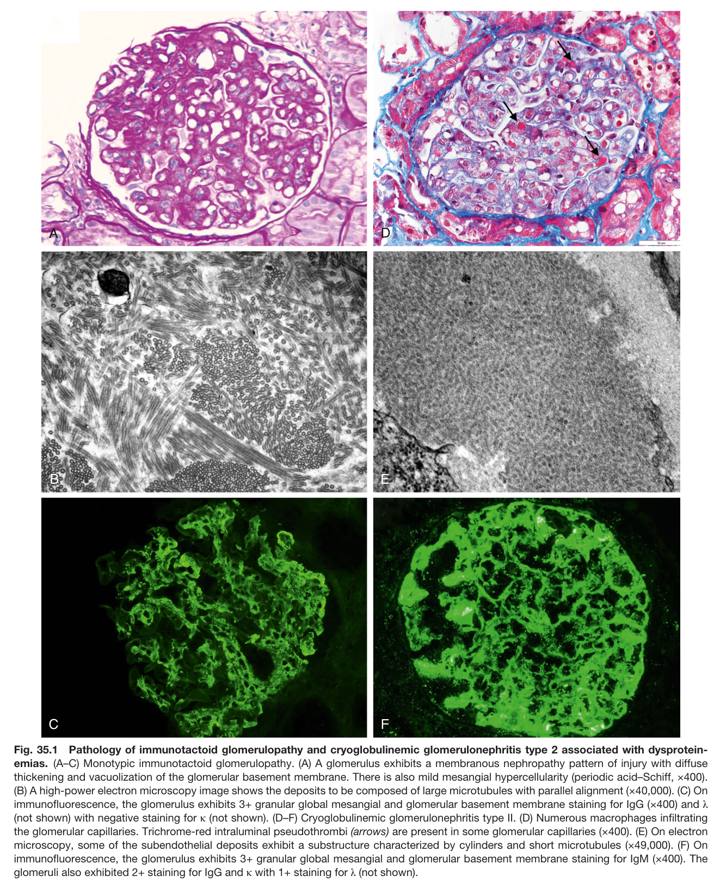
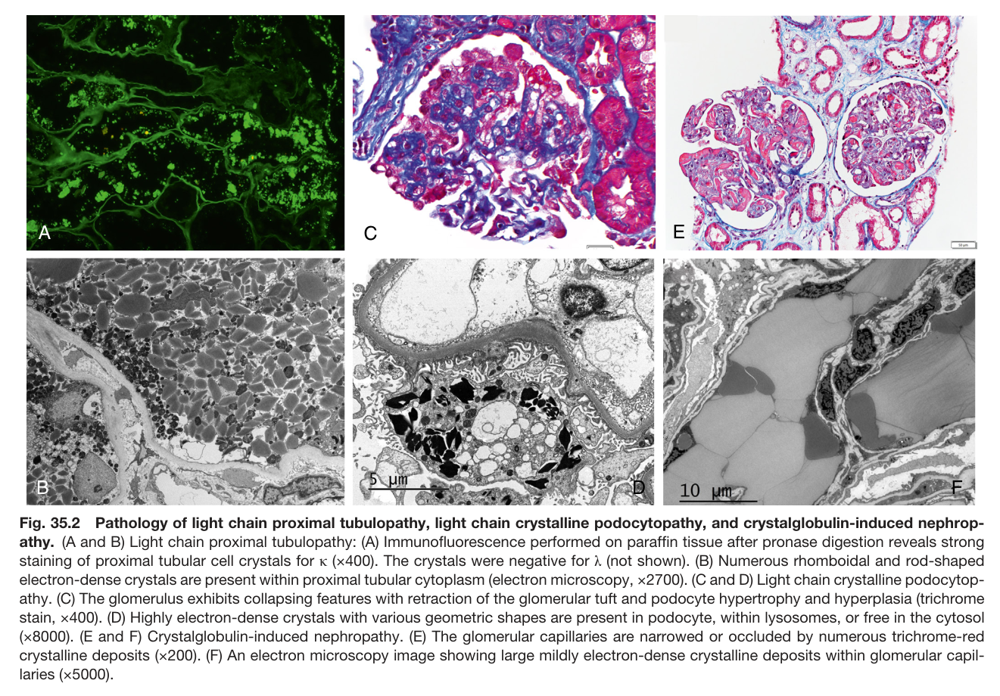
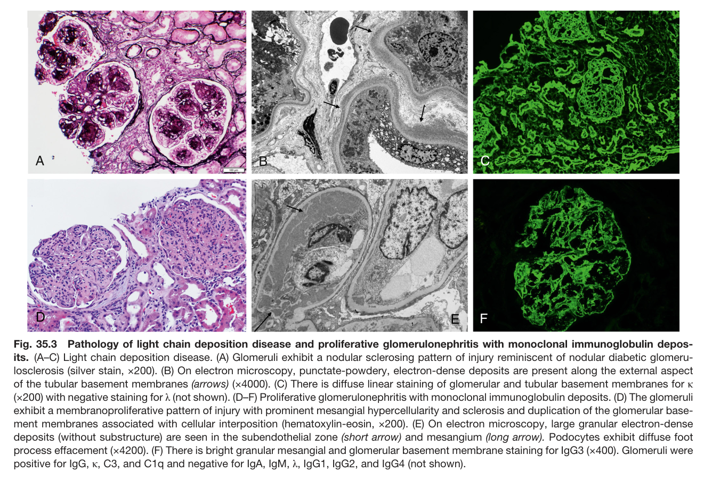

# 35. Kidney Lesions Associated With Dysproteinemias - Figures and Tables Index

This document lists all figures and tables extracted from `35. Kidney Lesions Associated With Dysproteinemias.pdf`.

## Table of Contents
- [Figures](#figures)
- [Tables](#tables)

---

## Figures

### Fig_35_1

Fig. 35.1 Pathology of immunotactoid glomerulopathy and cryoglobulinemic glomerulonephritis type 2 associated with dysprotein- emias. (A–C) Monotypic immunotactoid glomerulopathy. (A) A glomerulus exhibits a membranous nephropathy pattern of injury with diffuse thickening and vacuolization of the glomerular basement membrane. There is also mild mesangial hypercellularity (periodic acid–Schiff, ×400). (B) A high-power electron microscopy image shows the deposits to be composed of large microtubules with parallel alignment (×40,000). (C) On immunofluorescence, the glomerulus exhibits 3+ granular global mesangial and glomerular basement membrane staining for IgG (×400) and λ (not shown) with negative staining for κ (not shown). (D–F) Cryoglobulinemic glomerulonephritis type II. (D) Numerous macrophages infiltrating the glomerular capillaries. Trichrome-red intraluminal pseudothrombi (arrows) are present in some glomerular capillaries (×400). (E) On electron microscopy, some of the subendothelial deposits exhibit a substructure characterized by cylinders and short microtubules (×49,000). (F) On immunofluorescence, the glomerulus exhibits 3+ granular global mesangial and glomerular basement membrane staining for IgM (×400). The glomeruli also exhibited 2+ staining for IgG and κ with 1+ staining for λ (not shown).

---

### Fig_35_2

Fig. 35.2 Pathology of light chain proximal tubulopathy, light chain crystalline podocytopathy, and crystalglobulin-induced nephrop- athy. (A and B) Light chain proximal tubulopathy: (A) Immunofluorescence performed on paraffin tissue after pronase digestion reveals strong staining of proximal tubular cell crystals for κ (×400). The crystals were negative for λ (not shown). (B) Numerous rhomboidal and rod-shaped electron-dense crystals are present within proximal tubular cytoplasm (electron microscopy, ×2700). (C and D) Light chain crystalline podocytop- athy. (C) The glomerulus exhibits collapsing features with retraction of the glomerular tuft and podocyte hypertrophy and hyperplasia (trichrome stain, ×400). (D) Highly electron-dense crystals with various geometric shapes are present in podocyte, within lysosomes, or free in the cytoso (×8000). (E and F) Crystalglobulin-induced nephropathy. (E) The glomerular capillaries are narrowed or occluded by numerous trichrome-red crystalline deposits (×200). (F) An electron microscopy image showing large mildly electron-dense crystalline deposits within glomerular capil- laries (×5000).

---

### Fig_35_3

Fig. 35.3 Pathology of light chain deposition disease and proliferative glomerulonephritis with monoclonal immunoglobulin depos- its. (A–C) Light chain deposition disease. (A) Glomeruli exhibit a nodular sclerosing pattern of injury reminiscent of nodular diabetic glomeru- losclerosis (silver stain, ×200). (B) On electron microscopy, punctate-powdery, electron-dense deposits are present along the external aspect of the tubular basement membranes (arrows) (×4000). (C) There is diffuse linear staining of glomerular and tubular basement membranes for κ (×200) with negative staining for λ (not shown). (D–F) Proliferative glomerulonephritis with monoclonal immunoglobulin deposits. (D) The glomeruli exhibit a membranoproliferative pattern of injury with prominent mesangial hypercellularity and sclerosis and duplication of the glomerular base- ment membranes associated with cellular interposition (hematoxylin-eosin, ×200). (E) On electron microscopy, large granular electron-dense deposits (without substructure) are seen in the subendothelial zone (short arrow) and mesangium (long arrow). Podocytes exhibit diffuse foot process effacement (×4200). (F) There is bright granular mesangial and glomerular basement membrane staining for IgG3 (×400). Glomeruli were positive for IgG, κ, C3, and C1q and negative for IgA, IgM, λ, IgG1, IgG2, and IgG4 (not shown).

---

## Tables

*No tables resolved for this chapter.*
