# 36. Complement-Mediated Kidney Diseases - Figures and Tables Index

This document lists all figures and tables extracted from `36. Complement-Mediated Kidney Diseases.pdf`.

## Table of Contents
- [Figures](#figures)
- [Tables](#tables)

---

## Figures

### Fig_36_1

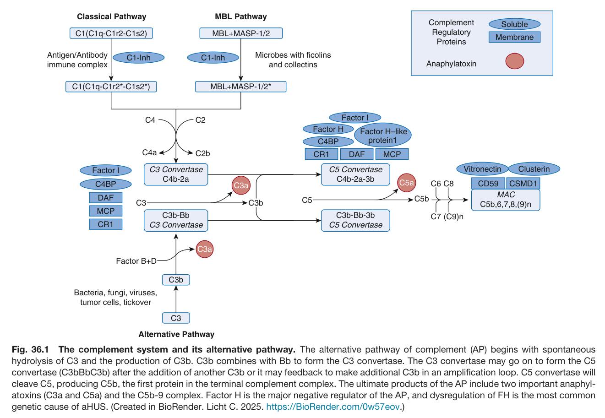

Fig. 36.1 The complement system and its alternative pathway. The alternative pathway of complement (AP) begins with spontaneous hydrolysis of C3 and the production of C3b. C3b combines with Bb to form the C3 convertase. The C3 convertase may go on to form the C5 convertase (C3bBbC3b) after the addition of another C3b or it may feedback to make additional C3b in an amplification loop. C5 convertase will cleave C5, producing C5b, the first protein in the terminal complement complex. The ultimate products of the AP include two important anaphyl- atoxins (C3a and C5a) and the C5b-9 complex. Factor H is the major negative regulator of the AP, and dysregulation of FH is the most common genetic cause of aHUS. (Created in BioRender. Licht C. 2025. https://BioRender.com/0w57eov.)

---

### Fig_36_2

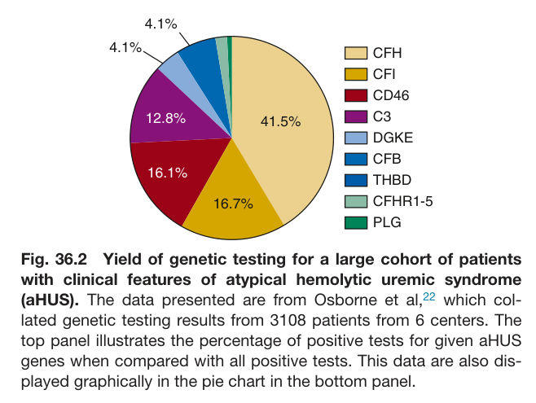

Fig. 36.2 Yield of genetic testing for a large cohort of patients with clinical features of atypical hemolytic uremic syndrome (aHUS). The data presented are from Osborne et al,<sup>22</sup> which col- lated genetic testing results from 3108 patients from 6 centers. The top panel illustrates the percentage of positive tests for given aHUS genes when compared with all positive tests. This data are also dis- played graphically in the pie chart in the bottom panel.

---

### Fig_36_3

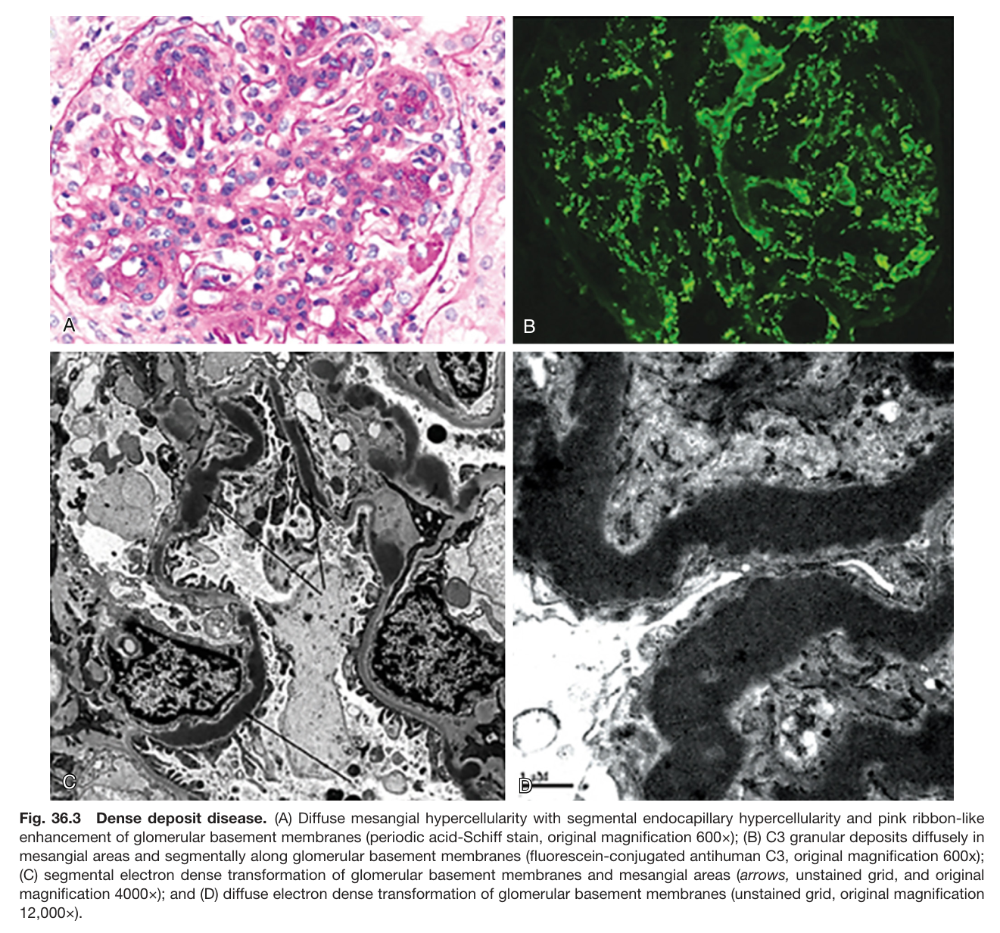

Fig. 36.3 Dense deposit disease. (A) Diffuse mesangial hypercellularity with segmental endocapillary hypercellularity and pink ribbon-like enhancement of glomerular basement membranes (periodic acid-Schiff stain, original magnification 600×); (B) C3 granular deposits diffusely in mesangial areas and segmentally along glomerular basement membranes (fluorescein-conjugated antihuman C3, original magnification 600x); (C) segmental electron dense transformation of glomerular basement membranes and mesangial areas (arrows, unstained grid, and origina magnification 4000×); and (D) diffuse electron dense transformation of glomerular basement membranes (unstained grid, original magnification 12,000×).

---

### Fig_36_4

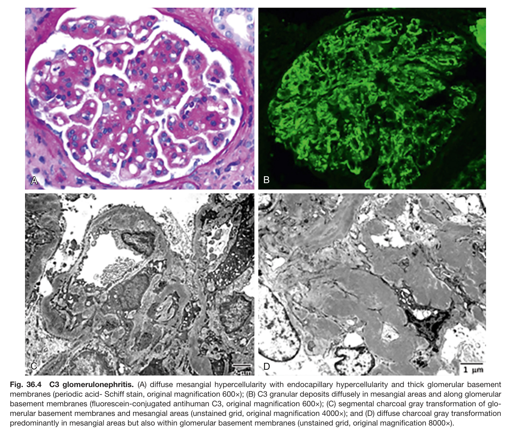

Fig. 36.4 C3 glomerulonephritis. (A) diffuse mesangial hypercellularity with endocapillary hypercellularity and thick glomerular basement membranes (periodic acid- Schiff stain, original magnification 600×); (B) C3 granular deposits diffusely in mesangial areas and along glomerular basement membranes (fluorescein-conjugated antihuman C3, original magnification 600×); (C) segmental charcoal gray transformation of glo- merular basement membranes and mesangial areas (unstained grid, original magnification 4000×); and (D) diffuse charcoal gray transformation predominantly in mesangial areas but also within glomerular basement membranes (unstained grid, original magnification 8000×).

---

### Fig_36_5

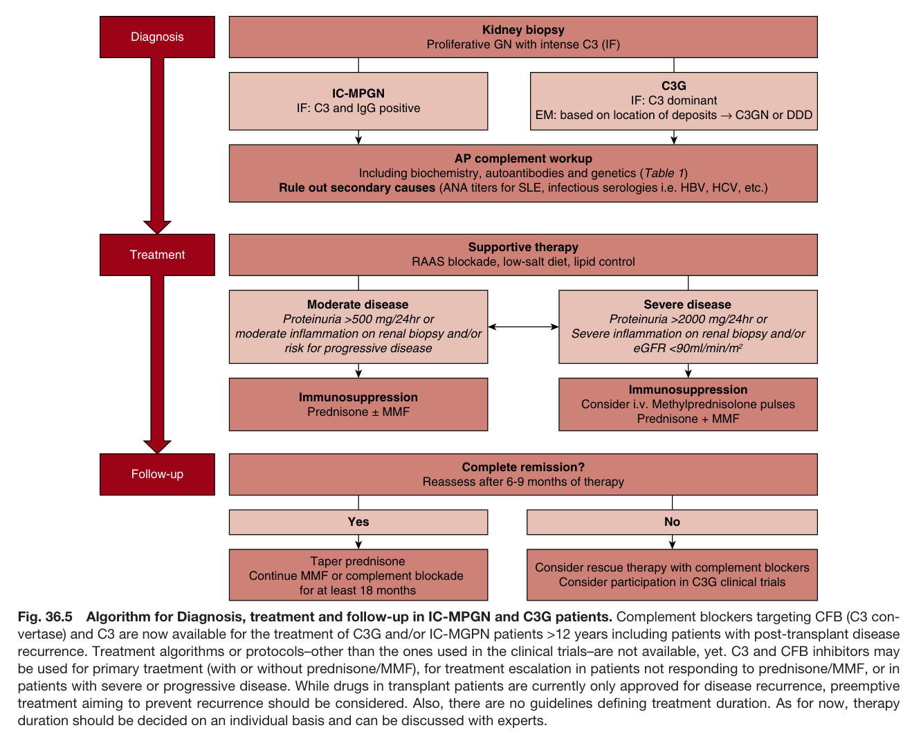

Fig. 36.5 Algorithm for Diagnosis, treatment and follow-up in IC-MPGN and C3G patients. Complement blockers targeting CFB (C3 con vertase) and C3 are now available for the treatment of C3G and/or IC-MGPN patients >12 years including patients with post-transplant disease recurrence. Treatment algorithms or protocols–other than the ones used in the clinical trials–are not available, yet. C3 and CFB inhibitors may be used for primary traetment (with or without prednisone/MMF), for treatment escalation in patients not responding to prednisone/MMF, or in patients with severe or progressive disease. While drugs in transplant patients are currently only approved for disease recurrence, preemptive treatment aiming to prevent recurrence should be considered. Also, there are no guidelines defining treatment duration. As for now, therap duration should be decided on an individual basis and can be discussed with experts.

---

## Tables

### Table_36_1

#### Table Image

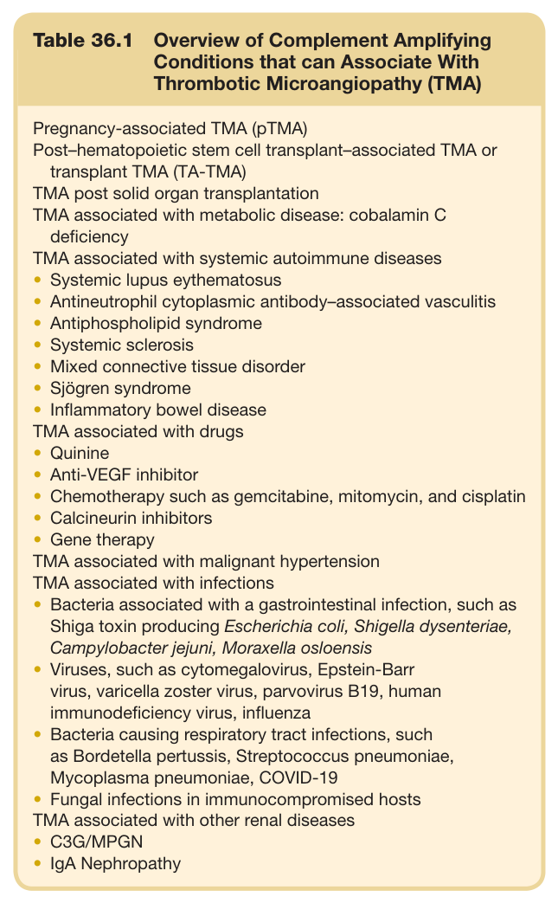

#### Table Data (CSV: [Table_36_1.csv](Table_36_1.csv))

```markdown
| Table Text (OCR) |
| :--- |
| Table 36.1  Overview of Complement Amplifying Conditions that can Associate With Thrombotic Microangiopathy (TMA) Pregnancy-associated TMA (pTMA) Post–hematopoietic stem cell transplant–associated TMA or transplant TMA (TA-TMA) TMA post solid organ transplantation TMA associated with metabolic disease: cobalamin C deficiency TMA associated with systemic autoimmune diseases •	 Systemic lupus eythematosus •	 Antineutrophil cytoplasmic antibody–associated vasculitis •	 Antiphospholipid syndrome •	 Systemic sclerosis •	 Mixed connective tissue disorder •	 Sjögren syndrome •	 Inflammatory bowel disease TMA associated with drugs •	 Quinine •	 Anti-VEGF inhibitor •	 Chemotherapy such as gemcitabine, mitomycin, and cisplatin •	 Calcineurin inhibitors •	 Gene therapy TMA associated with malignant hypertension TMA associated with infections Bacteria associated with a gastrointestinal infection, such as Shiga toxin producing Escherichia coli, Shigella dysenteriae, Campylobacter jejuni, Moraxella osloensis Viruses, such as cytomegalovirus, Epstein-Barr virus, varicella zoster virus, parvovirus B19, human immunodeficiency virus, influenza Bacteria causing respiratory tract infections, such as Bordetella pertussis, Streptococcus pneumoniae, Mycoplasma pneumoniae, COVID-19 •	 Fungal infections in immunocompromised hosts TMA associated with other renal diseases •	 C3G/MPGN •	 IgA Nephropathy |
```

Table 36.1 Overview of Complement Amplifying Conditions that can Associate With Thrombotic Microangiopathy (TMA)

---

### Table_36_2

#### Table Image

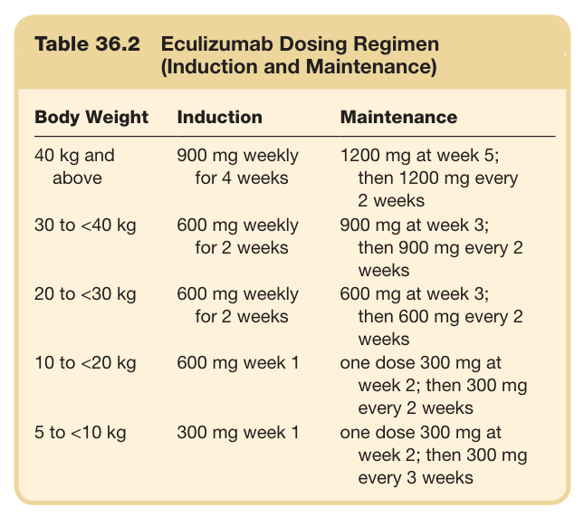

#### Table Data (CSV: [Table_36_2.csv](Table_36_2.csv))

```markdown
| Table Text (OCR) |
| :--- |
| Table 36.2  Eculizumab Dosing Regimen (Induction and Maintenance) Body Weight  Induction  Maintenance    40 kg and above  900 mg weekly for 4 weeks  1200 mg at week 5; then 1200 mg every 2 weeks    30 to <40 kg  600 mg weekly for 2 weeks  900 mg at week 3; then 900 mg every 2 weeks    20 to <30 kg  600 mg weekly for 2 weeks  600 mg at week 3; then 600 mg every 2 weeks    10 to <20 kg  600 mg week 1  one dose 300 mg at week 2; then 300 mg every 2 weeks    5 to <10 kg  300 mg week 1  one dose 300 mg at week 2; then 300 mg every 3 weeks |
```

Table 36.2 Eculizumab Dosing Regimen (Induction and Maintenance)

---

### Table_36_3

#### Table Image

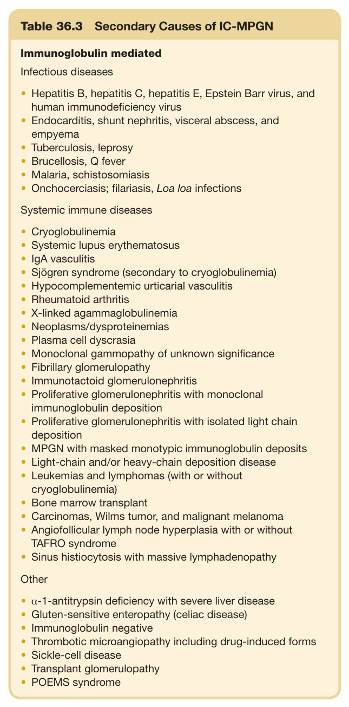

#### Table Data (CSV: [Table_36_3.csv](Table_36_3.csv))

```markdown
| Table Text (OCR) |
| :--- |
| Table 36.3 Secondary Causes of IC-MPGN Infectious diseases Hepatitis B, hepatitis C, hepatitis E, Epstein Barr virus, and human immunodeficiency virus •	 Endocarditis, shunt nephritis, visceral abscess, and empyema •	 Tuberculosis, leprosy •	 Brucellosis, Q fever •	 Malaria, schistosomiasis •	 Onchocerciasis; filariasis, Loa loa infections Systemic immune diseases •	 Cryoglobulinemia •	 Systemic lupus erythematosus •	 IgA vasculitis •	 Sjögren syndrome (secondary to cryoglobulinemia) •	 Hypocomplementemic urticarial vasculitis •	 Rheumatoid arthritis •	 X-linked agammaglobulinemia •	 Neoplasms/dysproteinemias •	 Plasma cell dyscrasia •	 Monoclonal gammopathy of unknown significance •	 Fibrillary glomerulopathy •	 Immunotactoid glomerulonephritis Proliferative glomerulonephritis with monoclonal immunoglobulin deposition •	 Proliferative glomerulonephritis with isolated light chain deposition •	 MPGN with masked monotypic immunoglobulin deposits •	 Light-chain and/or heavy-chain deposition disease •	 Leukemias and lymphomas (with or without cryoglobulinemia) •	 Bone marrow transplant •	 Carcinomas, Wilms tumor, and malignant melanoma Angiofollicular lymph node hyperplasia with or without TAFRO syndrome •	 Sinus histiocytosis with massive lymphadenopathy •	 α-1-antitrypsin deficiency with severe liver disease •	 Gluten-sensitive enteropathy (celiac disease) •	 Immunoglobulin negative •	 Thrombotic microangiopathy including drug-induced forms •	 Sickle-cell disease •	 Transplant glomerulopathy •	 POEMS syndrome |
```

Table 36.3 Secondary Causes of IC-MPGN

---

### Table_36_4

#### Table Image

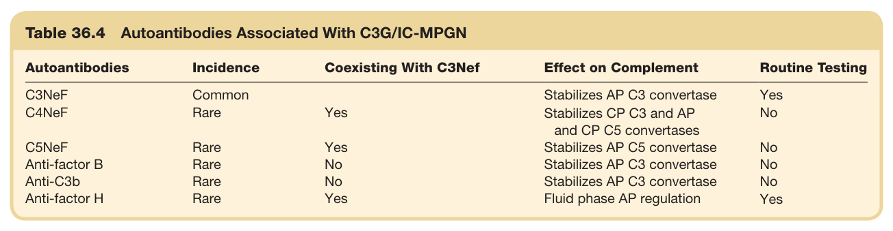

#### Table Data (CSV: [Table_36_4.csv](Table_36_4.csv))

```markdown
| Table Text (OCR) |
| :--- |
| Table 36.4 Autoantibodies Associated With C3G/IC-MPGN Autoantibodies  Incidence  Coexisting With C3Nef  Effect on Complement  Routine Testing    C3NeF  Common    Stabilizes AP C3 convertase  Yes    C4NeF  Rare  Yes  Stabilizes CP C3 and AP and CP C5 convertases  No    C5NeF  Rare  Yes  Stabilizes AP C5 convertase  No    Anti-factor B  Rare  No  Stabilizes AP C3 convertase  No    Anti-C3b  Rare  No  Stabilizes AP C3 convertase  No    Anti-factor H  Rare  Yes  Fluid phase AP regulation  Yes |
```

Table 36.4 Autoantibodies Associated With C3G/IC-MPGN

---

### Table_36_5

#### Table Image

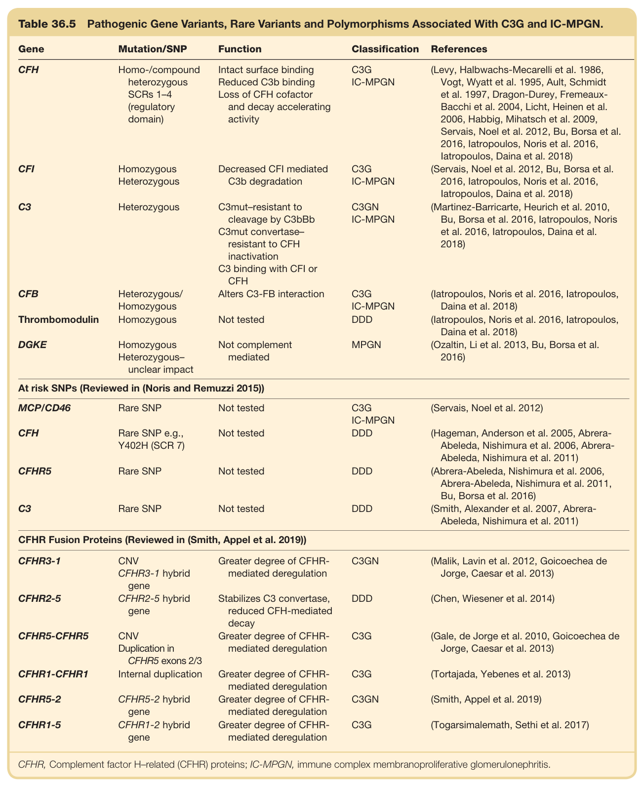

#### Table Data (CSV: [Table_36_5.csv](Table_36_5.csv))

```markdown
| Table Text (OCR) |
| :--- |
| Table 36.5  Pathogenic Gene Variants, Rare Variants and Polymorphisms Associated With C3G and IC-MPGN. Gene  Mutation/SNP  Function  Classification  References    CFH  Homo-/compound heterozygous SCRs 1-4 (regulatory domain)  Intact surface bindingReduced C3b bindingLoss of CFH cofactor and decay accelerating activity  C3GIC-MPGN  (Levy, Halbwachs-Mecarelli et al. 1986, Vogt, Wyatt et al. 1995, Ault, Schmidt et al. 1997, Dragon-Durey, Fremeaux-Bacchi et al. 2004, Licht, Heinen et al. 2006, Habbig, Mihatsch et al. 2009, Servais, Noel et al. 2012, Bu, Borsa et al. 2016, latropoulos, Noris et al. 2016, latropoulos, Daina et al. 2018)    CFI  Homozygous Heterozygous  Decreased CFI mediated C3b degradation  C3GIC-MPGN  (Servais, Noel et al. 2012, Bu, Borsa et al. 2016, latropoulos, Noris et al. 2016, latropoulos, Daina et al. 2018)    C3  Heterozygous  C3mut-resistant to cleavage by C3bBbC3mut convertase-resistant to CFH inactivationC3 binding with CFI or CFH  C3GNIC-MPGN  (Martinez-Barricarte, Heurich et al. 2010, Bu, Borsa et al. 2016, latropoulos, Noris et al. 2016, latropoulos, Daina et al. 2018)    CFB  Heterozygous/Homozygous  Alters C3-FB interaction  C3GIC-MPGN  (latropoulos, Noris et al. 2016, latropoulos, Daina et al. 2018)    Thrombomodulin  Homozygous  Not tested  DDD  (latropoulos, Noris et al. 2016, latropoulos, Daina et al. 2018)    DGKE  Homozygous Heterozygous-unclear impact  Not complement mediated  MPGN  (Ozaltin, Li et al. 2013, Bu, Borsa et al. 2016)    At risk SNPs (Reviewed in (Noris and Remuzzi 2015))    MCP/CD46  Rare SNP  Not tested  C3GIC-MPGN  (Servais, Noel et al. 2012)    CFH  Rare SNP e.g., Y402H (SCR 7)  Not tested  DDD  (Hageman, Anderson et al. 2005, Abrera-Abeleda, Nishimura et al. 2006, Abrera-Abeleda, Nishimura et al. 2011)    CFHR5  Rare SNP  Not tested  DDD  (Abrera-Abeleda, Nishimura et al. 2006, Abrera-Abeleda, Nishimura et al. 2011, Bu, Borsa et al. 2016)    C3  Rare SNP  Not tested  DDD  (Smith, Alexander et al. 2007, Abrera-Abeleda, Nishimura et al. 2011)    CFHR Fusion Proteins (Reviewed in (Smith, Appel et al. 2019))    CFHR3-1  CNVCFHR3-1 hybrid gene  Greater degree of CFHR-mediated deregulation  C3GN  (Malik, Lavin et al. 2012, Goicoechea de Jorge, Caesar et al. 2013)    CFHR2-5  CFHR2-5 hybrid gene  Stabilizes C3 convertase, reduced CFH-mediated decay  DDD  (Chen, Wiesener et al. 2014)    CFHR5-CFHR5  CNVDuplication in CFHR5 exons 2/3  Greater degree of CFHR-mediated deregulation  C3G  (Gale, de Jorge et al. 2010, Goicoechea de Jorge, Caesar et al. 2013)    CFHR1-CFHR1  Internal duplication  Greater degree of CFHR-mediated deregulation  C3G  (Tortajada, Yebenes et al. 2013)    CFHR5-2  CFHR5-2 hybrid gene  Greater degree of CFHR-mediated deregulation  C3GN  (Smith, Appel et al. 2019)    CFHR1-5  CFHR1-2 hybrid gene  Greater degree of CFHR-mediated deregulation  C3G  (Togarsimalemath, Sethi et al. 2017) CFHR, Complement factor H–related (CFHR) proteins; IC-MPGN, immune complex membranoproliferative glomerulonephritis. |
```

Table 36.5 Pathogenic Gene Variants, Rare Variants and Polymorphisms Associated With C3G and IC-MPGN.

---

### Table_36_6

#### Table Image

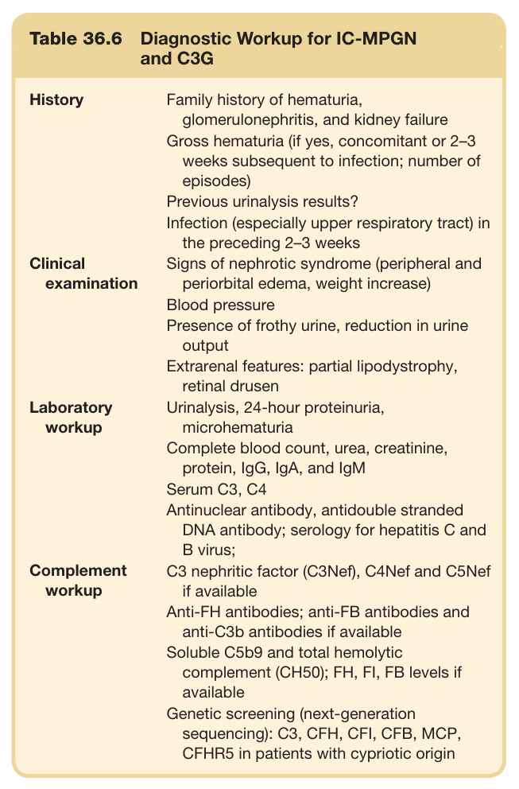

#### Table Data (CSV: [Table_36_6.csv](Table_36_6.csv))

```markdown
| Table Text (OCR) |
| :--- |
| Table 36.6  Diagnostic Workup for IC-MPGN and C3G History  Family history of hematuria, glomerulonephritis, and kidney failureGross hematuria (if yes, concomitant or 2-3 weeks subsequent to infection; number of episodes)Previous urinalysis results?Infection (especially upper respiratory tract) in the preceding 2-3 weeks    Clinical examination  Signs of nephrotic syndrome (peripheral and periorbital edema, weight increase)Blood pressurePresence of frothy urine, reduction in urine outputExtrarenal features: partial lipodystrophy, retinal drusen    Laboratory workup  Urinalysis, 24-hour proteinuria, microhematuriaComplete blood count, urea, creatinine, protein, IgG, IgA, and IgMSerum C3, C4Antinuclear antibody, antidouble stranded DNA antibody; serology for hepatitis C and B virus;    Complement workup  C3 nephritic factor (C3Nef), C4Nef and C5Nef if availableAnti-FH antibodies; anti-FB antibodies and anti-C3b antibodies if availableSoluble C5b9 and total hemolytic complement (CH50); FH, FI, FB levels if availableGenetic screening (next-generation sequencing): C3, CFH, CFI, CFB, MCP, CFHR5 in patients with cypriotic origin |
```

Table 36.6 Diagnostic Workup for IC-MPGN and C3G

---
