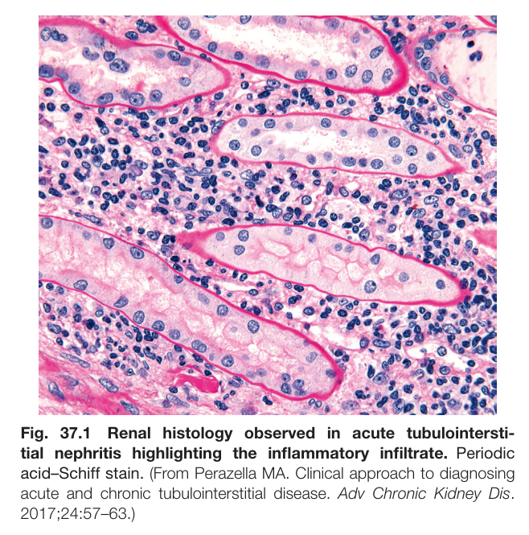
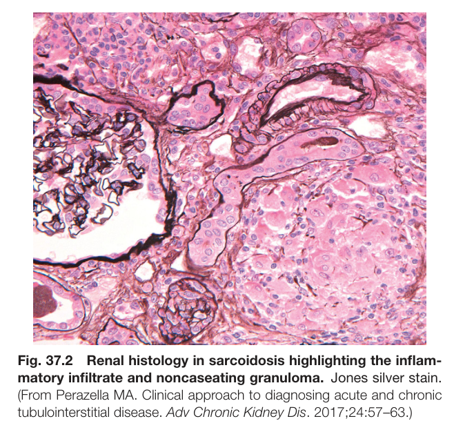
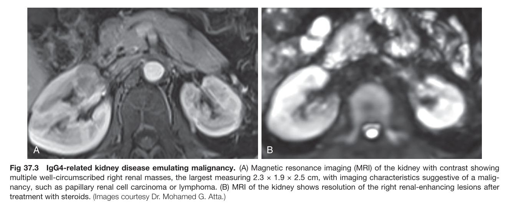
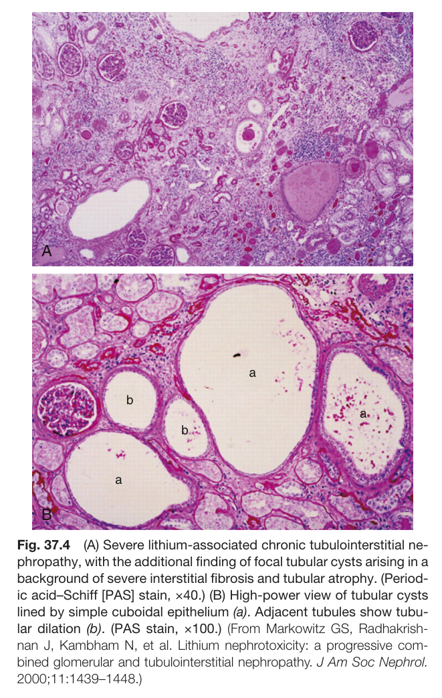
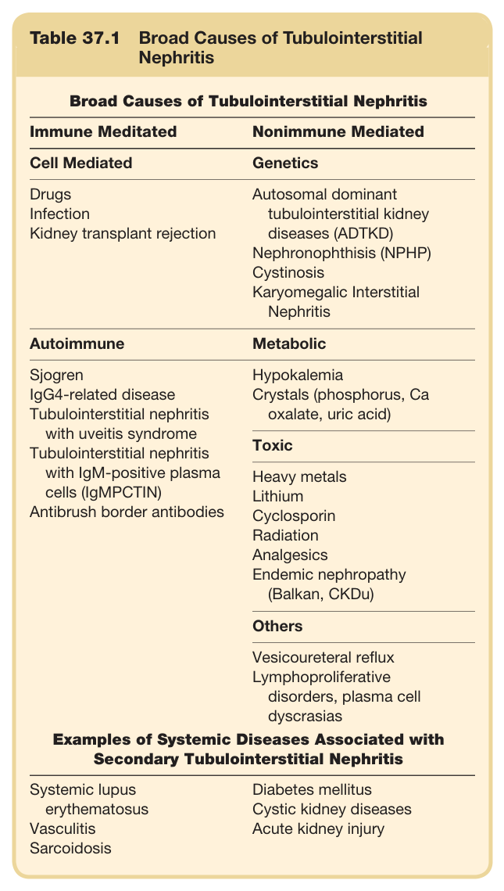
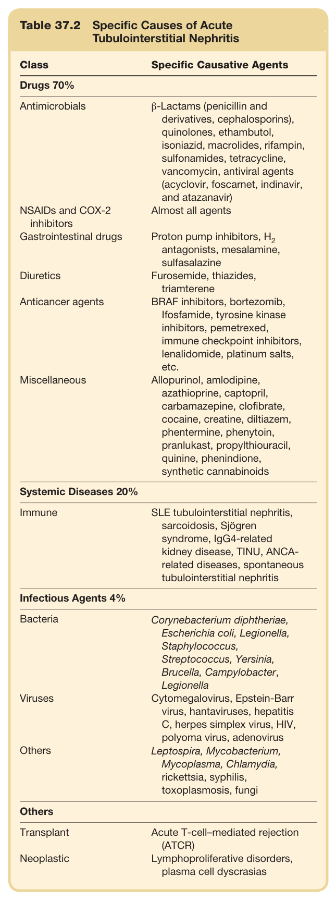
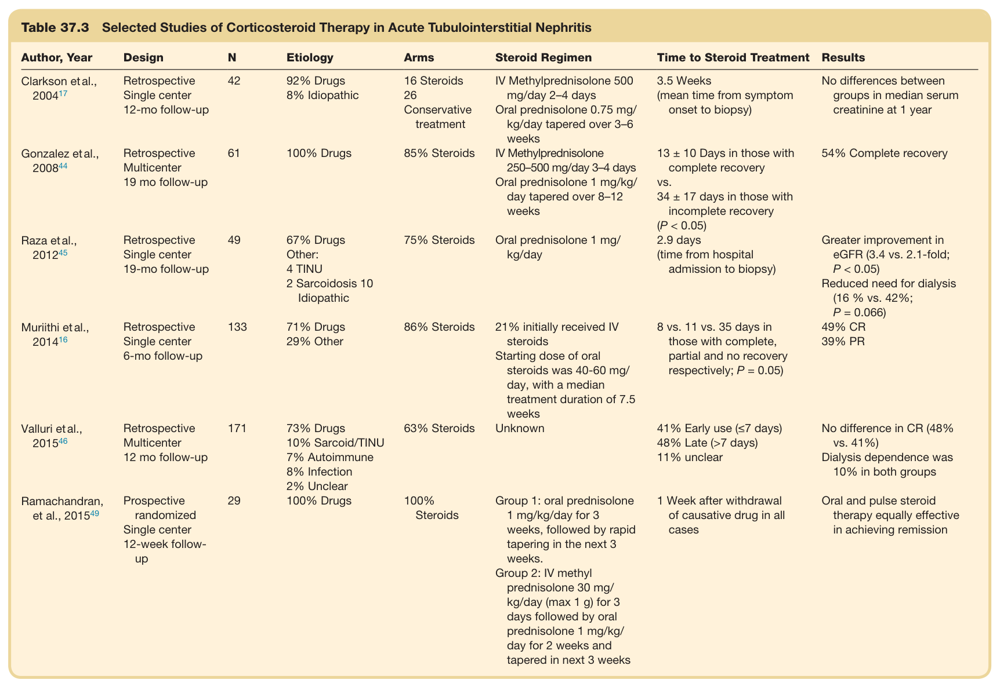
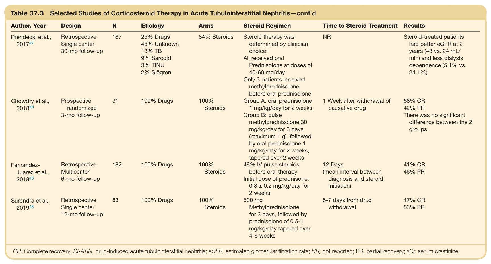
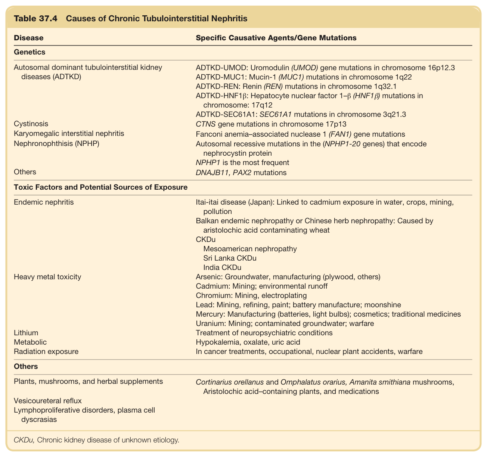

# 37. Tubulointerstitial Diseases - Figures and Tables Index

This document lists all figures and tables extracted from `37. Tubulointerstitial Diseases.pdf`.

## Table of Contents
- [Figures](#figures)
- [Tables](#tables)

---

## Figures

### Fig_37_1



Fig. 37.1 Renal histology observed in acute tubulointersti- tial nephritis highlighting the inflammatory infiltrate. Periodic acid–Schiff stain. (From Perazella MA. Clinical approach to diagnosing acute and chronic tubulointerstitial disease. Adv Chronic Kidney Dis. 2017;24:57–63.)

---

### Fig_37_2



Fig. 37.2 Renal histology in sarcoidosis highlighting the inflam- matory infiltrate and noncaseating granuloma. Jones silver stain. (From Perazella MA. Clinical approach to diagnosing acute and chronic tubulointerstitial disease. Adv Chronic Kidney Dis. 2017;24:57–63.)

---

### Fig_37_3



Fig. 37.3 IgG4-related kidney disease emulating malignancy. (A) Magnetic resonance imaging (MRI) of the kidney with contrast showing multiple well-circumscribed right renal masses, the largest measuring 2.3 × 1.9 × 2.5 cm, with imaging characteristics suggestive of a malig- nancy, such as papillary renal cell carcinoma or lymphoma. (B) MRI of the kidney shows resolution of the right renal-enhancing lesions after treatment with steroids. (Images courtesy Dr. Mohamed G. Atta.)

---

### Fig_37_4



Fig. 37.4 (A) Severe lithium-associated chronic tubulointerstitial ne- phropathy, with the additional finding of focal tubular cysts arising in a background of severe interstitial fibrosis and tubular atrophy. (Period- ic acid–Schiff [PAS] stain, ×40.) (B) High-power view of tubular cysts lined by simple cuboidal epithelium (a). Adjacent tubules show tubu- lar dilation (b). (PAS stain, ×100.) (From Markowitz GS, Radhakrish- nan J, Kambham N, et al. Lithium nephrotoxicity: a progressive com- bined glomerular and tubulointerstitial nephropathy. J Am Soc Nephrol. 2000;11:1439–1448.)

---

## Tables

### Table_37_1

#### Table Image



#### Table Data (CSV: [Table_37_1.csv](Table_37_1.csv))

```markdown
| Table Text (OCR) |
| :--- |
| Table 37.1  Broad Causes of Tubulointerstitial Nephritis Broad Causes of Tubulointerstitial Nephritis    Immune Meditated  Nonimmune Mediated    Cell Mediated  Genetics    DrugsInfectionKidney transplant rejection  Autosomal dominanttubulointerstitial kidneydiseases (ADTKD)Nephronophthisis (NPHP)CystinosisKaryomegalic InterstitialNephritis    Autoimmune  Metabolic    SjogrenIgG4-related diseaseTubulointerstitial nephritis with uveitis syndromeTubulointerstitial nephritis with IgM-positive plasma cells (IgMPCTIN)Antibrush border antibodies  HypokalemiaCrystals (phosphorus, Ca oxalate, uric acid)    Toxic    Heavy metalsLithiumCyclosporinRadiationAnalgesicsEndemic nephropathy (Balkan, CKDu)    Others    Vesicoureteral refluxLymphoproliferative disorders, plasma cell dyscrasias    Examples of Systemic Diseases Associated with Secondary Tubulointerstitial Nephritis    Systemic lupus erythematosusVasculitisSarcoidosis  Diabetes mellitusCystic kidney diseasesAcute kidney injury |
```

Table 37.1 Broad Causes of Tubulointerstitial Nephritis

---

### Table_37_2

#### Table Image



#### Table Data (CSV: [Table_37_2.csv](Table_37_2.csv))

```markdown
| Table Text (OCR) |
| :--- |
| Table 37.2  Specific Causes of Acute Tubulointerstitial Nephritis Class  Specific Causative Agents    Drugs 70%    Antimicrobials  β-Lactams (penicillin and derivatives, cephalosporins), quinolones, ethambutol, isoniazid, macrolides, rifampin, sulfonamides, tetracycline, vancomycin, antiviral agents (acyclovir, foscarnet, indinavir, and atazanavir)    NSAIDs and COX-2 inhibitors  Almost all agents    Gastrointestinal drugs  Proton pump inhibitors,  H_{2}  antagonists, mesalamine, sulfasalazine    Diuretics  Furosemide, thiazides, triamterene    Anticancer agents  BRAF inhibitors, bortezomib, Ifosfamide, tyrosine kinase inhibitors, pemetrexed, immune checkpoint inhibitors, lenalidomide, platinum salts, etc.    Miscellaneous  Allopurinol, amlodipine, azathioprine, captopril, carbamazepine, clofibrate, cocaine, creatine, diltiazem, phentermine, phenytoin, pranlukast, propylthiouracil, quinine, phenindione, synthetic cannabinoids    Systemic Diseases 20%    Immune  SLE tubulointerstitial nephritis, sarcoidosis, Sjögren syndrome, IgG4-related kidney disease, TINU, ANCA-related diseases, spontaneous tubulointerstitial nephritis    Infectious Agents 4%    Bacteria  Corynebacterium diphtheriae, Escherichia coli, Legionella, Staphylococcus, Streptococcus, Yersinia, Brucella, Campylobacter, Legionella    Viruses  Cytomegalovirus, Epstein-Barr virus, hantaviruses, hepatitis C, herpes simplex virus, HIV, polyoma virus, adenovirus    Others  Leptospira, Mycobacterium, Mycoplasma, Chlamydia, rickettsia, syphilis, toxoplasmosis, fungi    Others    Transplant  Acute T-cell-mediated rejection (ATCR)    Neoplastic  Lymphoproliferative disorders, plasma cell dyscrasias |
```

Table 37.2 Specific Causes of Acute Tubulointerstitial Nephritis

---

### Table_37_3

#### Table Images (2 Parts)

- **Part 1 (Page 7)**:
  

- **Part 2 (Page 8)**:
  

#### Table Data (CSV: [Table_37_3.csv](Table_37_3.csv))

```markdown
| Table Text (OCR) |
| :--- |
| Table 37.3Selected Studies of Corticosteroid Therapy in Acute Tubulointerstitial Nephritis Author, Year  Design  N  Etiology  Arms  Steroid Regimen  Time to Steroid Treatment  Results    Clarkson et al., 200417  Retrospective Single center 12-mo follow-up  42  92% Drugs8% Idiopathic  16 Steroids26Conservative treatment  IV Methylprednisolone 500 mg/day 2-4 daysOral prednisolone 0.75 mg/kg/day tapered over 3-6 weeks  3.5 Weeks(mean time from symptom onset to biopsy)  No differences between groups in median serum creatinine at 1 year    Gonzalez et al., 200844  Retrospective Multicenter 19 mo follow-up  61  100% Drugs  85% Steroids  IV Methylprednisolone 250-500 mg/day 3-4 daysOral prednisolone 1 mg/kg/day tapered over 8-12 weeks  13 ± 10 Days in those with complete recovery vs.34 ± 17 days in those with incomplete recovery (P<0.05)  54% Complete recovery    Raza et al., 201245  Retrospective Single center 19-mo follow-up  49  67% DrugsOther:4 TINU2 Sarcoidosis 10 Idiopathic  75% Steroids  Oral prednisolone 1 mg/kg/day  2.9 days(time from hospital admission to biopsy)  Greater improvement in eGFR (3.4 vs. 2.1-fold; P<0.05)Reduced need for dialysis (16 % vs. 42%; P=0.066)    Muriithi et al., 201416  Retrospective Single center 6-mo follow-up  133  71% Drugs29% Other  86% Steroids  21% initially received IV steroidsStarting dose of oral steroids was 40-60 mg/day, with a median treatment duration of 7.5 weeks  8 vs. 11 vs. 35 days in those with complete, partial and no recovery respectively; P=0.05)  49% CR39% PR    Valluri et al., 201546  Retrospective Multicenter 12 mo follow-up  171  73% Drugs10% Sarcoid/TINU7% Autoimmune8% Infection2% Unclear  63% Steroids  Unknown  41% Early use (≤7 days)48% Late (>7 days)11% unclear  No difference in CR (48% vs. 41%)Dialysis dependence was 10% in both groups    Ramachandran, et al., 201549  Prospective randomized Single center 12-week follow-up  29  100% Drugs  100% Steroids  Group 1: oral prednisolone 1 mg/kg/day for 3 weeks, followed by rapid tapering in the next 3 weeks.Group 2: IV methyl prednisolone 30 mg/kg/day (max 1 g) for 3 days followed by oral prednisolone 1 mg/kg/day for 2 weeks and tapered in next 3 weeks  1 Week after withdrawal of causative drug in all cases  Oral and pulse steroid therapy equally effective in achieving remission Continued |
```

Table 37.3 Selected Studies of Corticosteroid Therapy in Acute Tubulointerstitial Nephritis—cont’d

---

### Table_37_4

#### Table Image



#### Table Data (CSV: [Table_37_4.csv](Table_37_4.csv))

```markdown
| Table Text (OCR) |
| :--- |
| Table 37.4  Causes of Chronic Tubulointerstitial Nephritis Disease  Specific Causative Agents/Gene Mutations    Genetics    Autosomal dominant tubulointerstitial kidney diseases (ADTKD)  ADTKD-UMOD: Uromodulin (UMOD) gene mutations in chromosome 16p12.3ADTKD-MUC1: Mucin-1 (MUC1) mutations in chromosome 1q22ADTKD-REN: Renin (REN) mutations in chromosome 1q32.1ADTKD-HNF1β: Hepatocyte nuclear factor 1-β (HNF1β) mutations in chromosome: 17q12ADTKD-SEC61A1: SEC61A1 mutations in chromosome 3q21.3    Cystinosis  CTNS gene mutations in chromosome 17p13    Karyomegalic interstitial nephritis  Fanconi anemia-associated nuclease 1 (FAN1) gene mutations    Nephronophthisis (NPHP)  Autosomal recessive mutations in the (NPHP1-20 genes) that encode nephrocystin proteinNPHP1 is the most frequent    Others  DNAJB11, PAX2 mutations    Toxic Factors and Potential Sources of Exposure    Endemic nephritis  Itai-itai disease (Japan): Linked to cadmium exposure in water, crops, mining, pollutionBalkan endemic nephropathy or Chinese herb nephropathy: Caused by aristolochic acid contaminating wheatCKDuMesoamerican nephropathySri Lanka CKDuIndia CKDu    Heavy metal toxicity  Arsenic: Groundwater, manufacturing (plywood, others)Cadmium: Mining; environmental runoffChromium: Mining, electroplatingLead: Mining, refining, paint; battery manufacture; moonshineMercury: Manufacturing (batteries, light bulbs); cosmetics; traditional medicinesUranium: Mining; contaminated groundwater; warfare    Lithium  Treatment of neuropsychiatric conditions    Metabolic  Hypokalemia, oxalate, uric acid    Radiation exposure  In cancer treatments, occupational, nuclear plant accidents, warfare    Others    Plants, mushrooms, and herbal supplements  Cortinarius orellanus and Omphalatus orarius, Amanita smithiana mushrooms, Aristolochic acid-containing plants, and medications    Vesicoureteral reflux      Lymphoproliferative disorders, plasma cell dyscrasias      CKDu, Chronic kidney disease of unknown etiology. |
```

Table 37.4 Causes of Chronic Tubulointerstitial Nephritis

---
