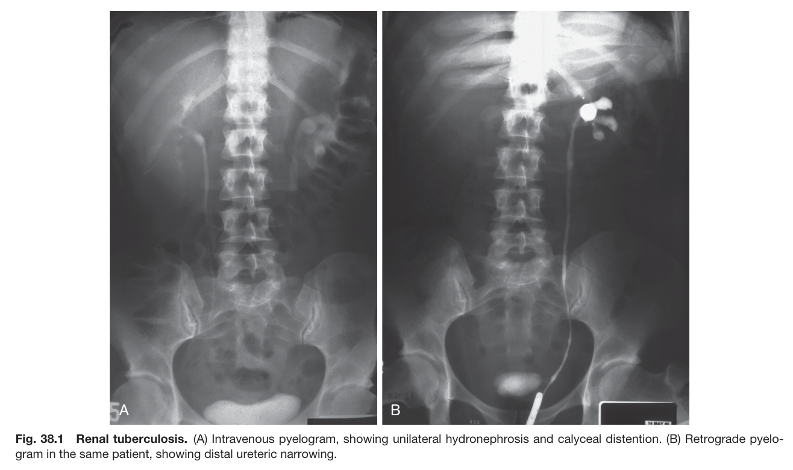
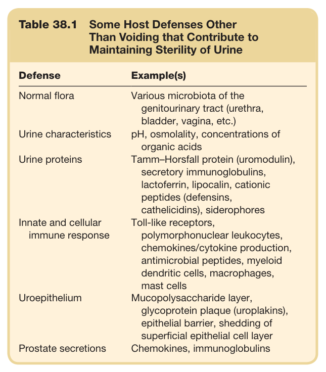
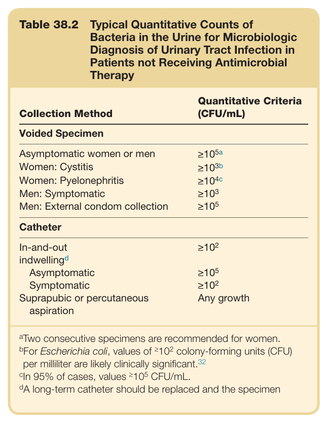
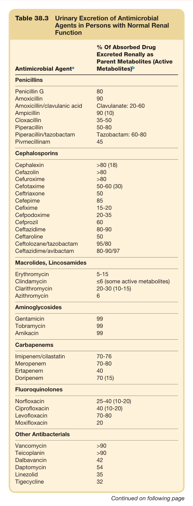
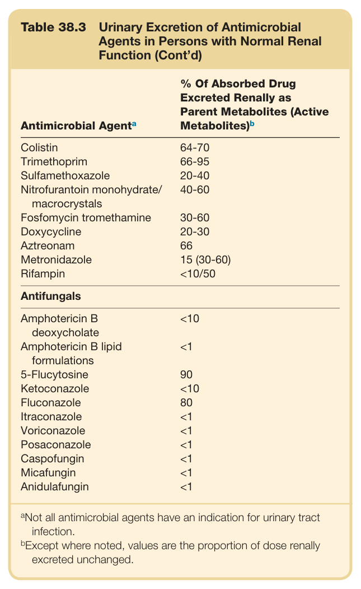
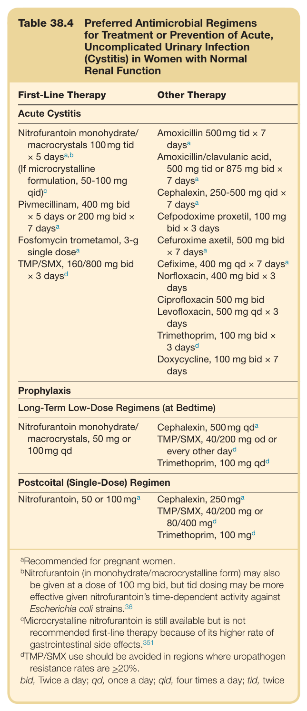
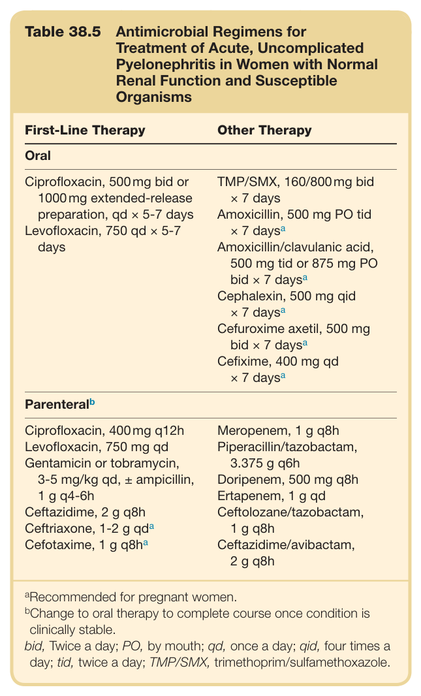
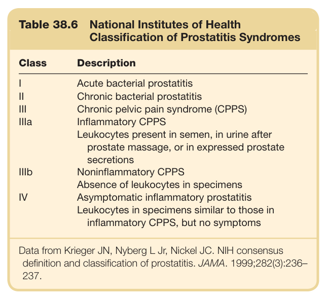
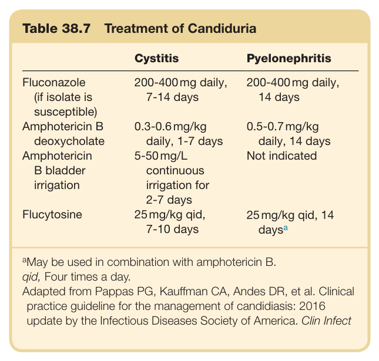
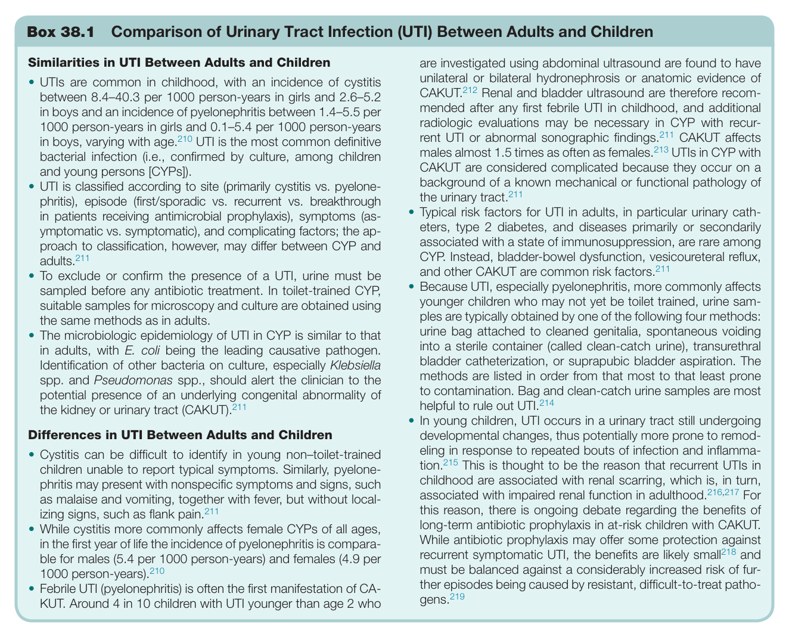

# 38. Urinary Tract Infection in Adults - Figures and Tables Index

This document lists all figures, tables and boxes extracted from `38. Urinary Tract Infection in Adults.pdf`.

## Table of Contents
- [Figures](#figures)
- [Tables](#tables)
- [Boxes](#boxes)

---

## Figures

### Fig_38_1



Fig. 38.1 Renal tuberculosis. (A) Intravenous pyelogram, showing unilateral hydronephrosis and calyceal distention. (B) Retrograde pyelo gram in the same patient, showing distal ureteric narrowing.

---

## Tables

### Table_38_1

#### Table Image



#### Table Data (CSV: [Table_38_1.csv](Table_38_1.csv))

```markdown
| Table Text (OCR) |
| :--- |
| Table 38.1  Some Host Defenses Other Than Voiding that Contribute to Maintaining Sterility of Urine Defense  Example(s)    Normal flora  Various microbiota of the genitourinary tract (urethra, bladder, vagina, etc.)    Urine characteristics  pH, osmolality, concentrations of organic acids    Urine proteins  Tamm-Horsfall protein (uromodulin), secretory immunoglobulins, lactoferrin, lipocalin, cationic peptides (defensins, cathelicidins), siderophores    Innate and cellular immune response  Toll-like receptors, polymorphonuclear leukocytes, chemokines/cytokine production, antimicrobial peptides, myeloid dendritic cells, macrophages, mast cells    Uroepithelium  Mucopolysaccharide layer, glycoprotein plaque (uroplakins), epithelial barrier, shedding of superficial epithelial cell layer    Prostate secretions  Chemokines, immunoglobulins |
```

Table 38.1 Some Host Defenses Other Than Voiding that Contribute to Maintaining Sterility of Urine

---

### Table_38_2

#### Table Image



#### Table Data (CSV: [Table_38_2.csv](Table_38_2.csv))

```markdown
| Table Text (OCR) |
| :--- |
| Table 38.2 Typical Quantitative Counts of Bacteria in the Urine for Microbiologic Diagnosis of Urinary Tract Infection in Patients not Receiving Antimicrobial Therapy Collection Method  Quantitative Criteria (CFU/mL)    Voided Specimen    Asymptomatic women or men   \geq 10^{5a}     Women: Cystitis   \geq 10^{3b}     Women: Pyelonephritis   \geq 10^{4c}     Men: Symptomatic   \geq 10^{3}     Men: External condom collection   \geq 10^{5}     Catheter    In-and-outindwelling ^{d}    \geq 10^{2}     Asymptomatic   \geq 10^{5}     Symptomatic   \geq 10^{2}     Suprapubic or percutaneous aspiration  Any growth <sup>a</sup>Two consecutive specimens are recommended for women. <sup>b</sup>For Escherichia coli, values of <sup>≥</sup>10<sup>2</sup> colony-forming units (CFU) per milliliter are likely clinically significant.<sup>32</sup> <sup>c</sup>In 95% of cases, values <sup>≥</sup>10<sup>5</sup> CFU/mL. <sup>d</sup>A long-term catheter should be replaced and the specimen |
```

Table 38.2 Typical Quantitative Counts of Bacteria in the Urine for Microbiologic Diagnosis of Urinary Tract Infection in Patients not Receiving Antimicrobial Therapy

---

### Table_38_3

#### Table Images (2 Parts)

- **Part 1 (Page 5)**:
  

- **Part 2 (Page 6)**:
  

#### Table Data (CSV: [Table_38_3.csv](Table_38_3.csv))

```markdown
| Table Text (OCR) |
| :--- |
| Table 38.3 Urinary Excretion of Antimicrobial Agents in Persons with Normal Renal Function Antimicrobial  Agent^a   % Of Absorbed Drug Excreted Renally as Parent Metabolites (Active  Metabolites)^b     Penicillins    Penicillin G  80    Amoxicillin  90    Amoxicillin/clavulanic acid  Clavulanate: 20-60    Ampicillin  90 (10)    Cloxacillin  35-50    Piperacillin  50-80    Piperacillin/tazobactam  Tazobactam: 60-80    Pivmecillinam  45    Cephalosporins    Cephalexin  >80 (18)    Cefazolin  >80    Cefuroxime  >80    Cefotaxime  50-60 (30)    Ceftriaxone  50    Cefepime  85    Cefixime  15-20    Cefpodoxime  20-35    Cefprozil  60    Ceftazidime  80-90    Ceftaroline  50    Ceftolozane/tazobactam  95/80    Ceftazidime/avibactam  80-90/97    Macrolides, Lincosamides    Erythromycin  5-15    Clindamycin  ≤6 (some active metabolites)    Clarithromycin  20-30 (10-15)    Azithromycin  6    Aminoglycosides    Gentamicin  99    Tobramycin  99    Amikacin  99    Carbapenems    Imipenem/cilastatin  70-76    Meropenem  70-80    Ertapenem  40    Doripenem  70 (15)    Fluoroquinolones    Norfloxacin  25-40 (10-20)    Ciprofloxacin  40 (10-20)    Levofloxacin  70-80    Moxifloxacin  20    Other Antibacterials    Vancomycin  >90    Teicoplanin  >90    Dalbavancin  42    Daptomycin  54    Linezolid  35    Tigecycline  32    Antimicrobial Agent ^{a}   % Of Absorbed Drug Excreted Renally as Parent Metabolites (Active Metabolites) ^{b}     Colistin  64-70    Trimethoprim  66-95    Sulfamethoxazole  20-40    Nitrofurantoin monohydrate/ macrocrystals  40-60    Fosfomycin tromethamine  30-60    Doxycycline  20-30    Aztreonam  66    Metronidazole  15 (30-60)    Rifampin  <10/50    Antifungals    Amphotericin B deoxycholate  <10    Amphotericin B lipid formulations  <1    5-Flucytosine  90    Ketoconazole  <10    Fluconazole  80    Itraconazole  <1    Voriconazole  <1    Posaconazole  <1    Caspofungin  <1    Micafungin  <1    Anidulafungin  <1 <sup>a</sup>Not all antimicrobial agents have an indication for urinary tract infection. <sup>b</sup>Except where noted, values are the proportion of dose renally excreted unchanged. |
```

Table 38.3 Urinary Excretion of Antimicrobial Agents in Persons with Normal Renal Function

---

### Table_38_4

#### Table Image



#### Table Data (CSV: [Table_38_4.csv](Table_38_4.csv))

```markdown
| Table Text (OCR) |
| :--- |
| Table 38.4 Preferred Antimicrobial Regimens for Treatment or Prevention of Acute, Uncomplicated Urinary Infection (Cystitis) in Women with Normal Renal Function First-Line Therapy  Other Therapy    Acute Cystitis    Nitrofurantoin monohydrate/ macrocrystals 100 mg tid × 5 daysa,b(If microcrystalline formulation, 50-100 mg qid)cPivmecillinam, 400 mg bid × 5 days or 200 mg bid × 7 daysaFosfomycin trometamol, 3-g single doseaTMP/SMX, 160/800 mg bid × 3 daysd  Amoxicillin 500 mg tid × 7 daysaAmoxicillin/clavulanic acid, 500 mg tid or 875 mg bid × 7 daysaCephalexin, 250-500 mg qid × 7 daysaCefpodoxime proxetil, 100 mg bid × 3 daysCefuroxime axetil, 500 mg bid × 7 daysaCefixime, 400 mg qd × 7 daysaNorfloxacin, 400 mg bid × 3 daysCiprofloxacin 500 mg bidLevofloxacin, 500 mg qd × 3 daysTrimethoprim, 100 mg bid × 3 daysdDoxycycline, 100 mg bid × 7 days    Prophylaxis    Long-Term Low-Dose Regimens (at Bedtime)    Nitrofurantoin monohydrate/ macrocrystals, 50 mg or 100 mg qd  Cephalexin, 500 mg qdaTMP/SMX, 40/200 mg od or every other daydTrimethoprim, 100 mg qdd    Postcoital (Single-Dose) Regimen    Nitrofurantoin, 50 or 100 mga  Cephalexin, 250 mgaTMP/SMX, 40/200 mg or 80/400 mgdTrimethoprim, 100 mgd    aRecommended for pregnant women.bNitrofurantoin (in monohydrate/macrocristalline form) may also be given at a dose of 100 mg bid, but tid dosing may be more effective given nitrofurantoin's time-dependent activity against Escherichia coli strains.36cMicrocrystalline nitrofurantoin is still available but is not recommended first-line therapy because of its higher rate of gastrointestinal side effects.351dTMP/SMX use should be avoided in regions where uropathogen resistance rates are ≥20%.bid, Twice a day; qd, once a day; qid, four times a day; tid, twice |
```

Table 38.4 Preferred Antimicrobial Regimens for Treatment or Prevention of Acute, Uncomplicated Urinary Infection (Cystitis) in Women with Normal Renal Function

---

### Table_38_5

#### Table Image



#### Table Data (CSV: [Table_38_5.csv](Table_38_5.csv))

```markdown
| Table Text (OCR) |
| :--- |
| Table 38.5  Antimicrobial Regimens for Treatment of Acute, Uncomplicated Pyelonephritis in Women with Normal Renal Function and Susceptible Organisms First-Line Therapy  Other Therapy    Oral    Ciprofloxacin, 500 mg bid or 1000 mg extended-release preparation, qd × 5-7 daysLevofloxacin, 750 qd × 5-7 days  TMP/SMX, 160/800 mg bid × 7 daysAmoxicillin, 500 mg PO tid × 7 days ^{a} Amoxicillin/clavulanic acid, 500 mg tid or 875 mg PO bid × 7 days ^{a} Cephalexin, 500 mg qid × 7 days ^{a} Cefuroxime axetil, 500 mg bid × 7 days ^{a} Cefixime, 400 mg qd × 7 days ^{a}     Parenteral ^{b}     Ciprofloxacin, 400 mg q12hLevofloxacin, 750 mg qdGentamicin or tobramycin, 3-5 mg/kg qd, ± ampicillin, 1 g q4-6hCeftazidime, 2 g q8hCeftriaxone, 1-2 g qdaCefotaxime, 1 g q8ha  Meropenem, 1 g q8hPiperacillin/tazobactam, 3.375 g q6hDoripenem, 500 mg q8hErtapenem, 1 g qdCeftolozane/tazobactam, 1 g q8hCeftazidime/avibactam, 2 g q8h     ^{a} Recommended for pregnant women. ^{b} Change to oral therapy to complete course once condition is clinically stable.bid, Twice a day; PO, by mouth; qd, once a day; qid, four times a day; tid, twice a day; TMP/SMX, trimethoprim/sulfamethoxazole. |
```

Table 38.5 Antimicrobial Regimens for Treatment of Acute, Uncomplicated Pyelonephritis in Women with Normal Renal Function and Susceptible Organisms

---

### Table_38_6

#### Table Image



#### Table Data (CSV: [Table_38_6.csv](Table_38_6.csv))

```markdown
| Table Text (OCR) |
| :--- |
| Table 38.6  National Institutes of Health Classification of Prostatitis Syndromes Class  Description    I  Acute bacterial prostatitis    II  Chronic bacterial prostatitis    III  Chronic pelvic pain syndrome (CPPS)    IIIa  Inflammatory CPPS    Leukocytes present in semen, in urine after prostate massage, or in expressed prostate secretions    IIIb  Noninflammatory CPPS    Absence of leukocytes in specimens    IV  Asymptomatic inflammatory prostatitis    Leukocytes in specimens similar to those in inflammatory CPPS, but no symptoms Data from Krieger JN, Nyberg L Jr, Nickel JC. NIH consensus definition and classification of prostatitis. JAMA. 1999;282(3):236– 237. |
```

Table 38.6 National Institutes of Health Classification of Prostatitis Syndromes

---

### Table_38_7

#### Table Image



#### Table Data (CSV: [Table_38_7.csv](Table_38_7.csv))

```markdown
| Table Text (OCR) |
| :--- |
| Table 38.7 Treatment of Candiduria Cystitis  Pyelonephritis    Fluconazole (if isolate is susceptible)  200-400 mg daily, 7-14 days  200-400 mg daily, 14 days    Amphotericin B deoxycholate  0.3-0.6 mg/kg daily, 1-7 days  0.5-0.7 mg/kg daily, 14 days    Amphotericin B bladder irrigation  5-50 mg/L continuous irrigation for 2-7 days  Not indicated    Flucytosine  25 mg/kg qid, 7-10 days  25 mg/kg qid, 14 daysa <sup>a</sup>May be used in combination with amphotericin B. qid, Four times a day. Adapted from Pappas PG, Kauffman CA, Andes DR, et al. Clinical practice guideline for the management of candidiasis: 2016 update by the Infectious Diseases Society of America. Clin Infect |
```

Table 38.7 Treatment of Candiduria

---

## Boxes

### Box_38_1



#### Box Text

```markdown
Box 38.1 Comparison of Urinary Tract Infection (UTI) Between Adults and Children Similarities in UTI Between Adults and Children are investigated using abdominal ultrasound are found to have unilateral or bilateral hydronephrosis or anatomic evidence of CAKUT.<sup>212</sup> Renal and bladder ultrasound are therefore recom- mended after any first febrile UTI in childhood, and additional radiologic evaluations may be necessary in CYP with recur- rent UTI or abnormal sonographic findings.<sup>211</sup> CAKUT affects males almost 1.5 times as often as females.<sup>213</sup> UTIs in CYP with CAKUT are considered complicated because they occur on a background of a known mechanical or functional pathology of the urinary tract.<sup>211</sup> UTIs are common in childhood, with an incidence of cystitis between 8.4–40.3 per 1000 person-years in girls and 2.6–5.2 in boys and an incidence of pyelonephritis between 1.4–5.5 per 1000 person-years in girls and 0.1–5.4 per 1000 person-years in boys, varying with age.<sup>210</sup> UTI is the most common definitive bacterial infection (i.e., confirmed by culture, among children and young persons [CYPs]). UTI is classified according to site (primarily cystitis vs. pyelone- phritis), episode (first/sporadic vs. recurrent vs. breakthrough in patients receiving antimicrobial prophylaxis), symptoms (as- ymptomatic vs. symptomatic), and complicating factors; the ap- proach to classification, however, may differ between CYP and adults.<sup>211</sup> Typical risk factors for UTI in adults, in particular urinary cath- eters, type 2 diabetes, and diseases primarily or secondarily associated with a state of immunosuppression, are rare among CYP. Instead, bladder-bowel dysfunction, vesicoureteral reflux, and other CAKUT are common risk factors.<sup>211</sup> • To exclude or confirm the presence of a UTI, urine must be sampled before any antibiotic treatment. In toilet-trained CYP, suitable samples for microscopy and culture are obtained using the same methods as in adults. Because UTI, especially pyelonephritis, more commonly affects younger children who may not yet be toilet trained, urine sam- ples are typically obtained by one of the following four methods: urine bag attached to cleaned genitalia, spontaneous voiding into a sterile container (called clean-catch urine), transurethral bladder catheterization, or suprapubic bladder aspiration. The methods are listed in order from that most to that least prone to contamination. Bag and clean-catch urine samples are most helpful to rule out UTI.<sup>214</sup> The microbiologic epidemiology of UTI in CYP is similar to that in adults, with E. coli being the leading causative pathogen. Identification of other bacteria on culture, especially Klebsiella spp. and Pseudomonas spp., should alert the clinician to the potential presence of an underlying congenital abnormality of the kidney or urinary tract (CAKUT).<sup>211</sup> • In young children, UTI occurs in a urinary tract still undergoing developmental changes, thus potentially more prone to remod- eling in response to repeated bouts of infection and inflamma- tion.<sup>215</sup> This is thought to be the reason that recurrent UTIs in childhood are associated with renal scarring, which is, in turn, associated with impaired renal function in adulthood.<sup>216,217</sup> For this reason, there is ongoing debate regarding the benefits of long-term antibiotic prophylaxis in at-risk children with CAKUT. While antibiotic prophylaxis may offer some protection against recurrent symptomatic UTI, the benefits are likely small<sup>218</sup> and must be balanced against a considerably increased risk of fur- ther episodes being caused by resistant, difficult-to-treat patho- gens.<sup>219</sup> Differences in UTI Between Adults and Children • Cystitis can be difficult to identify in young non–toilet-trained children unable to report typical symptoms. Similarly, pyelone- phritis may present with nonspecific symptoms and signs, such as malaise and vomiting, together with fever, but without local- izing signs, such as flank pain.<sup>211</sup> While cystitis more commonly affects female CYPs of all ages, in the first year of life the incidence of pyelonephritis is compara- ble for males (5.4 per 1000 person-years) and females (4.9 per 1000 person-years).<sup>210</sup> • Febrile UTI (pyelonephritis) is often the first manifestation of CA- KUT. Around 4 in 10 children with UTI younger than age 2 who
```

Box 38.1 Comparison of Urinary Tract Infection (UTI) Between Adults and Children

---
