# 39. Urinary Tract Obstruction - Figures and Tables Index

This document lists all figures, tables and boxes extracted from `39. Urinary Tract Obstruction.pdf`.

## Table of Contents
- [Figures](#figures)
- [Tables](#tables)
- [Boxes](#boxes)

---

## Figures

### Fig_39_1

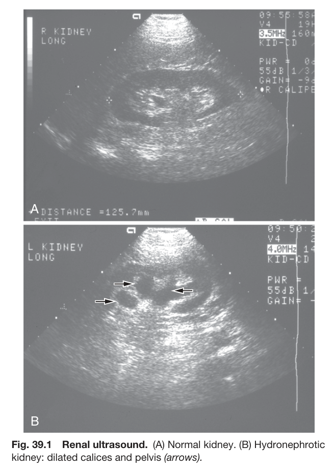

Fig. 39.1 Renal ultrasound. (A) Normal kidney. (B) Hydronephrotic kidney: dilated calices and pelvis (arrows).

---

### Fig_39_2

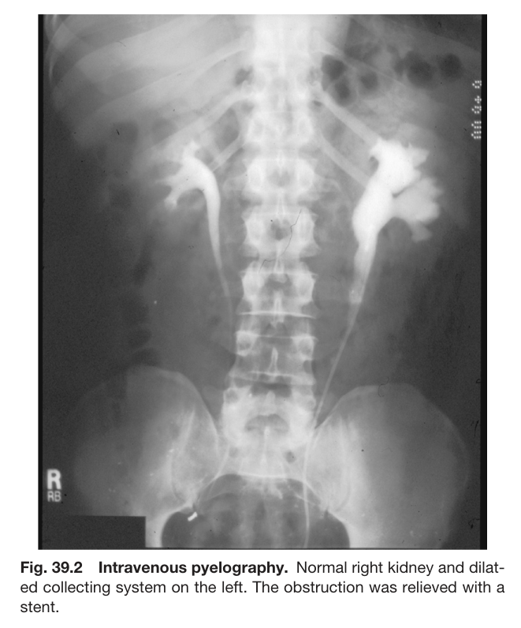

Fig. 39.2 Intravenous pyelography. Normal right kidney and dilat- ed collecting system on the left. The obstruction was relieved with a stent.

---

### Fig_39_3

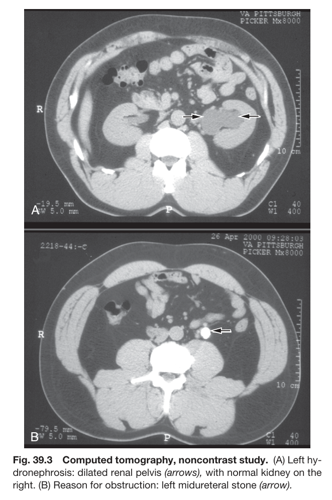

Fig. 39.3 Computed tomography, noncontrast study. (A) Left hy- dronephrosis: dilated renal pelvis (arrows), with normal kidney on the right. (B) Reason for obstruction: left midureteral stone (arrow).

---

### Fig_39_4

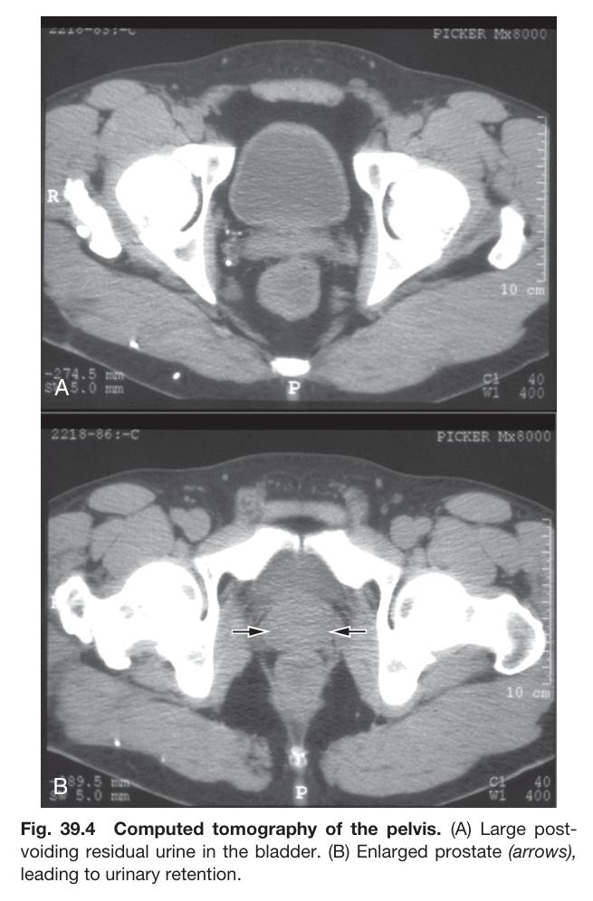

Fig. 39.4 Computed tomography of the pelvis. (A) Large post- voiding residual urine in the bladder. (B) Enlarged prostate (arrows), leading to urinary retention.

---

### Fig_39_5

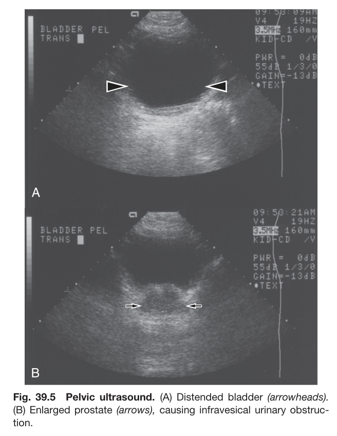

Fig. 39.5 Pelvic ultrasound. (A) Distended bladder (arrowheads). (B) Enlarged prostate (arrows), causing infravesical urinary obstruc- tion.

---

### Fig_39_6

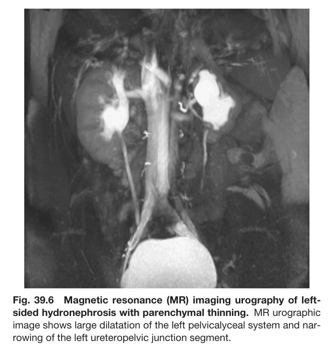

Fig. 39.6 Magnetic resonance (MR) imaging urography of left- sided hydronephrosis with parenchymal thinning. MR urographic image shows large dilatation of the left pelvicalyceal system and nar- rowing of the left ureteropelvic junction segment.

---

### Fig_39_7

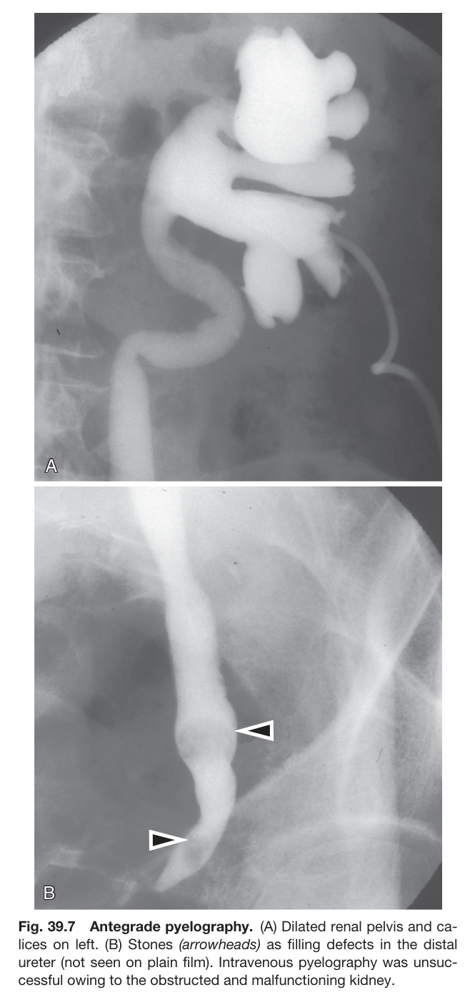

Fig. 39.7 Antegrade pyelography. (A) Dilated renal pelvis and ca- lices on left. (B) Stones (arrowheads) as filling defects in the distal ureter (not seen on plain film). Intravenous pyelography was unsuc- cessful owing to the obstructed and malfunctioning kidney.

---

### Fig_39_8

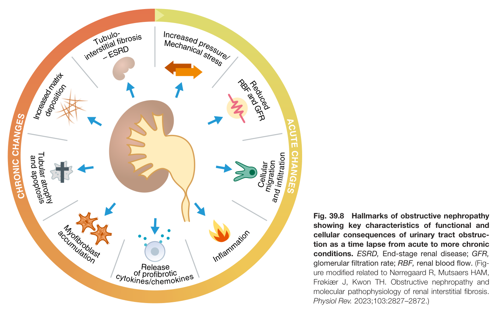

Fig. 39.8 Hallmarks of obstructive nephropathy showing key characteristics of functional and cellular consequences of urinary tract obstruc- tion as a time lapse from acute to more chronic conditions. ESRD, End-stage renal disease; GFR, glomerular filtration rate; RBF, renal blood flow. (Fig- ure modified related to Nørregaard R, Mutsaers HAM, Frøkiær J, Kwon TH. Obstructive nephropathy and molecular pathophysiology of renal interstitial fibrosis. Physiol Rev. 2023;103:2827–2872.)

---

### Fig_39_9

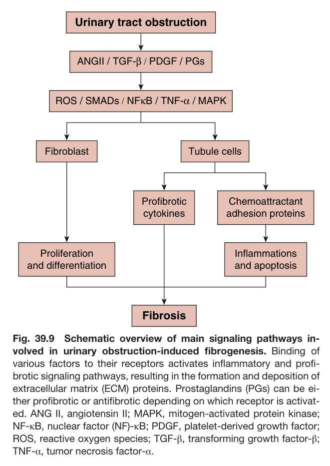

Fig. 39.9 Schematic overview of main signaling pathways in- volved in urinary obstruction-induced fibrogenesis. Binding of various factors to their receptors activates inflammatory and profi- brotic signaling pathways, resulting in the formation and deposition of extracellular matrix (ECM) proteins. Prostaglandins (PGs) can be ei- ther profibrotic or antifibrotic depending on which receptor is activat- ed. ANG II, angiotensin II; MAPK, mitogen-activated protein kinase; NF-κB, nuclear factor (NF)-κB; PDGF, platelet-derived growth factor; ROS, reactive oxygen species; TGF-β, transforming growth factor-β; TNF-α, tumor necrosis factor-α.

---

## Tables

### Table_39_1

#### Table Image

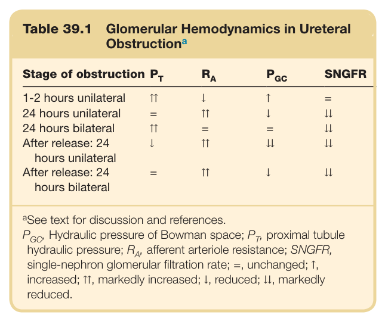

#### Table Data (CSV: [Table_39_1.csv](Table_39_1.csv))

```markdown
| Table Text (OCR) |
| :--- |
| Table 39.1  Glomerular Hemodynamics in Ureteral Obstruction<sup>a</sup> Stage of obstruction   P_T    R_A    P_{GC}   SNGFR    1-2 hours unilateral  ↑↑  ↓  ↑  =    24 hours unilateral  =  ↑↑  ↓  ↓↓    24 hours bilateral  ↑↑  =  =  ↓↓    After release: 24 hours unilateral  ↓  ↑↑  ↓↓  ↓↓    After release: 24 hours bilateral  =  ↑↑  ↓  ↓↓ <sup>a</sup>See text for discussion and references. P , Hydraulic pressure of Bowman space; P , proximal tubule hydraulic pressure; R , afferent arteriole resistance; SNGFR, single-nephron glomerular filtration rate; =, unchanged; ↑, increased; ↑↑, markedly increased; ↓, reduced; ↓↓, markedly reduced. |
```

Table 39.1 Glomerular Hemodynamics in Ureteral Obstruction<sup>a</sup>

---

### Table_39_2

#### Table Image

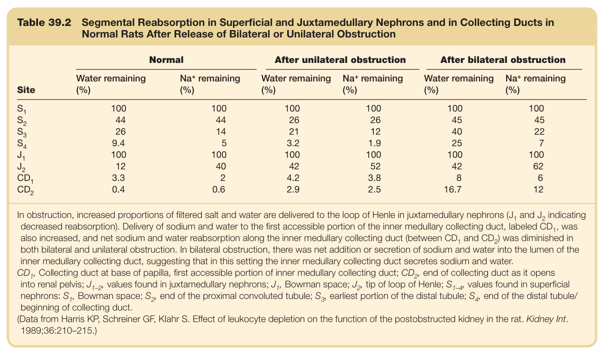

#### Table Data (CSV: [Table_39_2.csv](Table_39_2.csv))

```markdown
| Table Text (OCR) |
| :--- |
| Table 39.2 Segmental Reabsorption in Superficial and Juxtamedullary Nephrons and in Collecting Ducts in Normal Rats After Release of Bilateral or Unilateral Obstruction Site  Normal  After unilateral obstruction  After bilateral obstruction    Water remaining (%)   Na^+  remaining (%)  Water remaining (%)   Na^+  remaining (%)  Water remaining (%)   Na^+  remaining (%)     S_1   100  100  100  100  100  100     S_2   44  44  26  26  45  45     S_3   26  14  21  12  40  22     S_4   9.4  5  3.2  1.9  25  7     J_1   100  100  100  100  100  100     J_2   12  40  42  52  42  62     CD_1   3.3  2  4.2  3.8  8  6     CD_2   0.4  0.6  2.9  2.5  16.7  12 |
```

Table 39.2 Segmental Reabsorption in Superficial and Juxtamedullary Nephrons and in Collecting Ducts in Normal Rats After Release of Bilateral or Unilateral Obstruction

---

### Table_39_3

#### Table Image

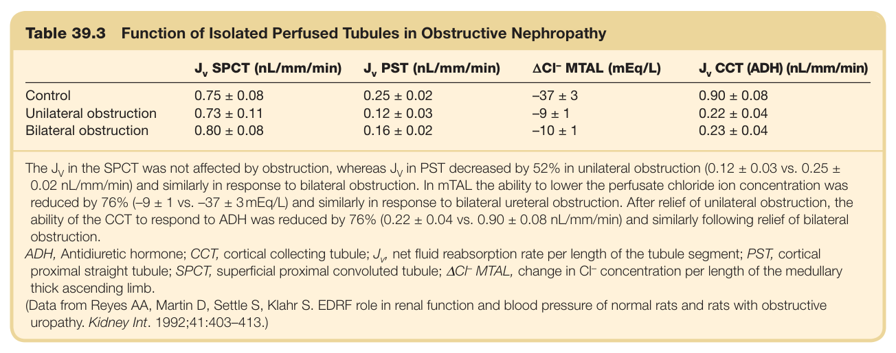

#### Table Data (CSV: [Table_39_3.csv](Table_39_3.csv))

```markdown
| Table Text (OCR) |
| :--- |
| Table 39.3  Function of Isolated Perfused Tubules in Obstructive Nephropathy J_v  SPCT (nL/mm/min)   J_v  PST (nL/mm/min)   \Delta Cl^-  MTAL (mEq/L)   J_v  CCT (ADH) (nL/mm/min)    Control  0.75 ± 0.08  0.25 ± 0.02  -37 ± 3  0.90 ± 0.08    Unilateral obstruction  0.73 ± 0.11  0.12 ± 0.03  -9 ± 1  0.22 ± 0.04    Bilateral obstruction  0.80 ± 0.08  0.16 ± 0.02  -10 ± 1  0.23 ± 0.04 |
```

Table 39.3 Function of Isolated Perfused Tubules in Obstructive Nephropathy

---

## Boxes

### Box_39_1

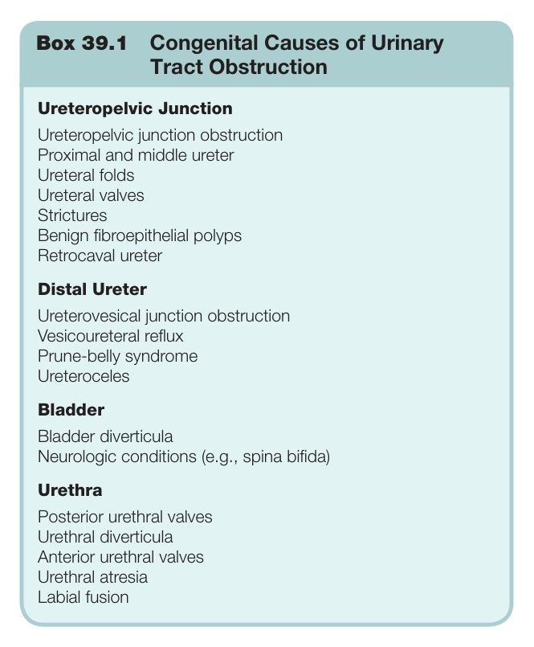

#### Box Text

```markdown
Box 39.1 Congenital Causes of Urinary Tract Obstruction Ureteropelvic Junction Ureteropelvic junction obstruction Proximal and middle ureter Ureteral folds Ureteral valves Strictures Benign fibroepithelial polyps Retrocaval ureter Distal Ureter Ureterovesical junction obstruction Vesicoureteral reflux Prune-belly syndrome Ureteroceles Bladder Bladder diverticula Neurologic conditions (e.g., spina bifida) Urethra Posterior urethral valves Urethral diverticula Anterior urethral valves Urethral atresia Labial fusion
```

Box 39.1 Congenital Causes of Urinary Tract Obstruction

---

### Box_39_2

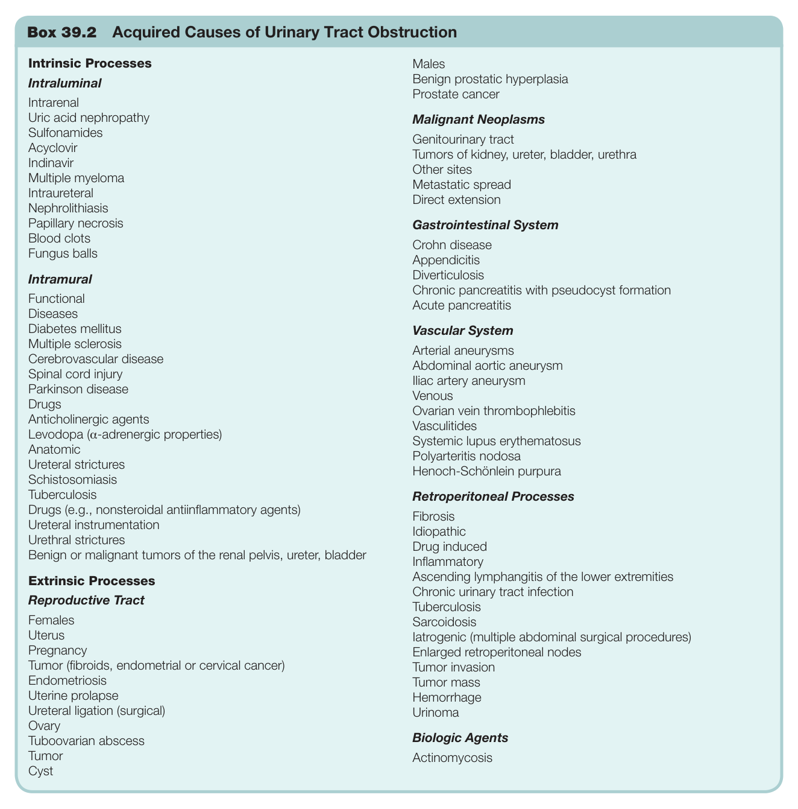

#### Box Text

```markdown
Box 39.2 Acquired Causes of Urinary Tract Obstruction
```

Box 39.2 Acquired Causes of Urinary Tract Obstruction

---

### Box_39_3

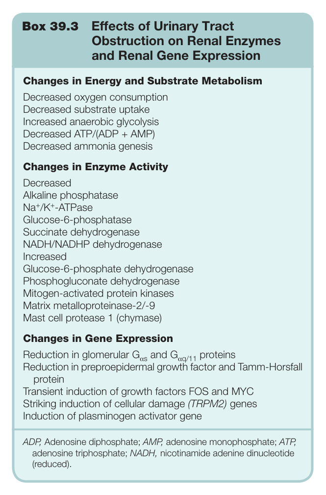

#### Box Text

```markdown
Box 39.3 Effects of Urinary Tract Obstruction on Renal Enzymes and Renal Gene Expression Changes in Energy and Substrate Metabolism Decreased oxygen consumption Decreased substrate uptake Increased anaerobic glycolysis Decreased ATP/(ADP + AMP) Decreased ammonia genesis Changes in Enzyme Activity Decreased Alkaline phosphatase Na<sup>+</sup>/K<sup>+</sup>-ATPase Glucose-6-phosphatase Succinate dehydrogenase NADH/NADHP dehydrogenase Increased Glucose-6-phosphate dehydrogenase Phosphogluconate dehydrogenase Mitogen-activated protein kinases Matrix metalloproteinase-2/-9 Mast cell protease 1 (chymase) Changes in Gene Expression Reduction in glomerular G <sub>s</sub> and G <sub>q/11</sub> proteins Reduction in preproepidermal growth factor and Tamm-Horsfall protein Transient induction of growth factors FOS and MYC Striking induction of cellular damage (TRPM2) genes Induction of plasminogen activator gene ADP, Adenosine diphosphate; AMP, adenosine monophosphate; ATP, adenosine triphosphate; NADH, nicotinamide adenine dinucleotide (reduced).
```

Box 39.3 Effects of Urinary Tract Obstruction on Renal Enzymes and Renal Gene Expression

---
