# 40. Nephrolithiasis - Figures and Tables Index

This document lists all figures and tables extracted from `40. Nephrolithiasis.pdf`.

## Table of Contents
- [Figures](#figures)
- [Tables](#tables)

---

## Figures

### Fig_40_1

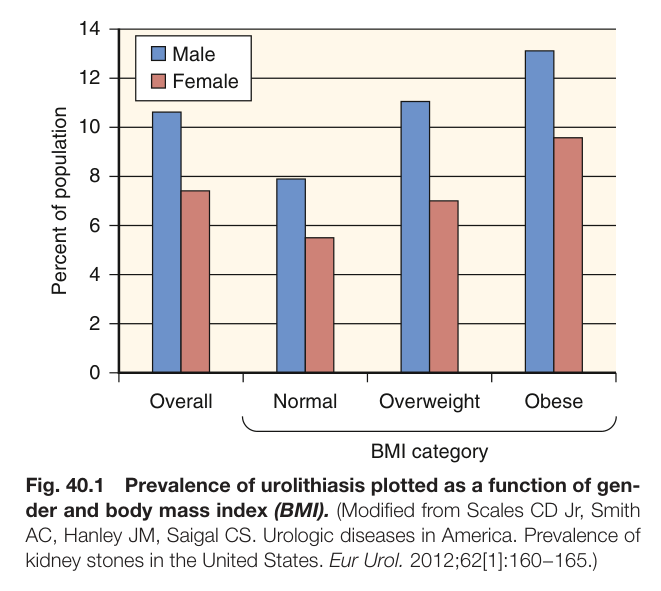

Fig. 40.1 Prevalence of urolithiasis plotted as a function of gen- der and body mass index (BMI). (Modified from Scales CD Jr, Smith AC, Hanley JM, Saigal CS. Urologic diseases in America. Prevalence of kidney stones in the United States. Eur Urol. 2012;62[1]:160−165.)

---

### Fig_40_2

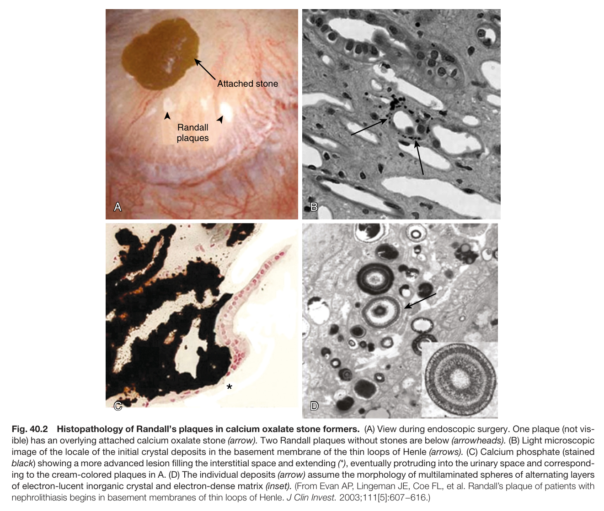

Fig. 40.2 Histopathology of Randall’s plaques in calcium oxalate stone formers. (A) View during endoscopic surgery. One plaque (not vis- ible) has an overlying attached calcium oxalate stone (arrow). Two Randall plaques without stones are below (arrowheads). (B) Light microscopic image of the locale of the initial crystal deposits in the basement membrane of the thin loops of Henle (arrows). (C) Calcium phosphate (stained black) showing a more advanced lesion filling the interstitial space and extending (*), eventually protruding into the urinary space and correspond- ing to the cream-colored plaques in A. (D) The individual deposits (arrow) assume the morphology of multilaminated spheres of alternating layers of electron-lucent inorganic crystal and electron-dense matrix (inset). (From Evan AP, Lingeman JE, Coe FL, et al. Randall’s plaque of patients with nephrolithiasis begins in basement membranes of thin loops of Henle. J Clin Invest. 2003;111[5]:607−616.)

---

### Fig_40_3

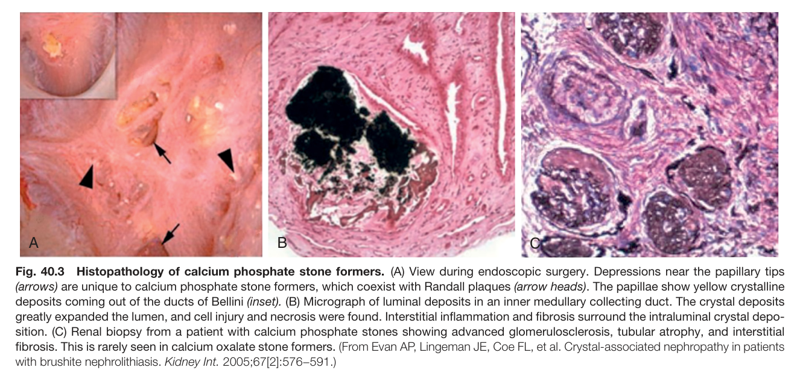

Fig. 40.3 Histopathology of calcium phosphate stone formers. (A) View during endoscopic surgery. Depressions near the papillary tips (arrows) are unique to calcium phosphate stone formers, which coexist with Randall plaques (arrow heads). The papillae show yellow crystalline deposits coming out of the ducts of Bellini (inset). (B) Micrograph of luminal deposits in an inner medullary collecting duct. The crystal deposit greatly expanded the lumen, and cell injury and necrosis were found. Interstitial inflammation and fibrosis surround the intraluminal crystal depo- sition. (C) Renal biopsy from a patient with calcium phosphate stones showing advanced glomerulosclerosis, tubular atrophy, and interstitia fibrosis. This is rarely seen in calcium oxalate stone formers. (From Evan AP, Lingeman JE, Coe FL, et al. Crystal-associated nephropathy in patients with brushite nephrolithiasis. Kidney Int. 2005;67[2]:576−591.)

---

### Fig_40_4

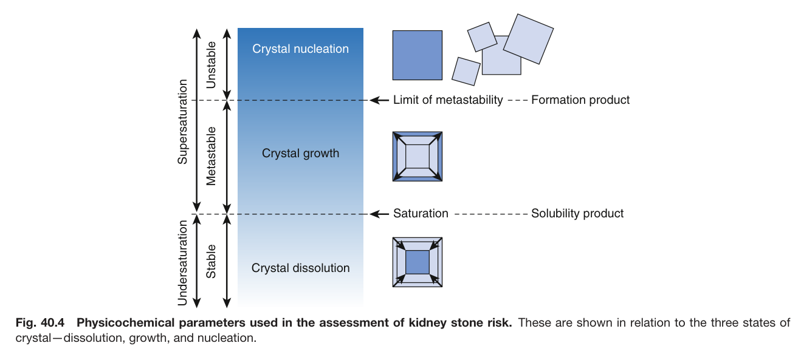

Fig. 40.4 Physicochemical parameters used in the assessment of kidney stone risk. These are shown in relation to the three states of crystal—dissolution, growth, and nucleation.

---

### Fig_40_5

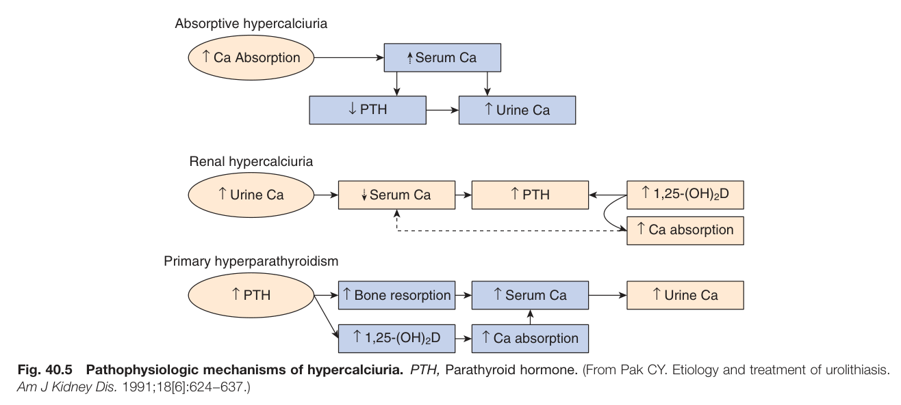

Fig. 40.5 Pathophysiologic mechanisms of hypercalciuria. PTH, Parathyroid hormone. (From Pak CY. Etiology and treatment of urolithiasis. Am J Kidney Dis. 1991;18[6]:624−637.)

---

### Fig_40_6

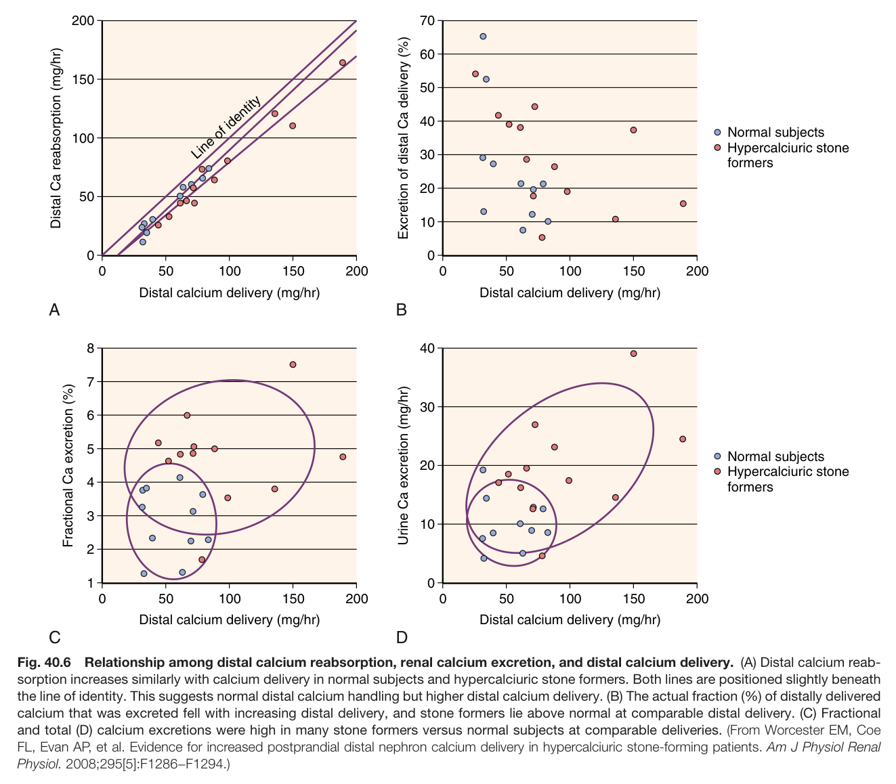

Fig. 40.6 Relationship among distal calcium reabsorption, renal calcium excretion, and distal calcium delivery. (A) Distal calcium reab sorption increases similarly with calcium delivery in normal subjects and hypercalciuric stone formers. Both lines are positioned slightly beneath the line of identity. This suggests normal distal calcium handling but higher distal calcium delivery. (B) The actual fraction (%) of distally delivered calcium that was excreted fell with increasing distal delivery, and stone formers lie above normal at comparable distal delivery. (C) Fractiona and total (D) calcium excretions were high in many stone formers versus normal subjects at comparable deliveries. (From Worcester EM, Coe FL, Evan AP, et al. Evidence for increased postprandial distal nephron calcium delivery in hypercalciuric stone-forming patients. Am J Physiol Rena Physiol. 2008;295[5]:F1286−F1294.)

---

### Fig_40_7

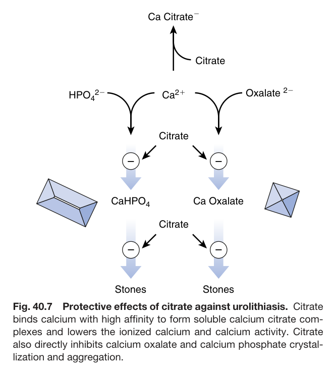

Fig. 40.7 Protective effects of citrate against urolithiasis. Citrate binds calcium with high affinity to form soluble calcium citrate com- plexes and lowers the ionized calcium and calcium activity. Citrate also directly inhibits calcium oxalate and calcium phosphate crystal- lization and aggregation.

---

### Fig_40_8

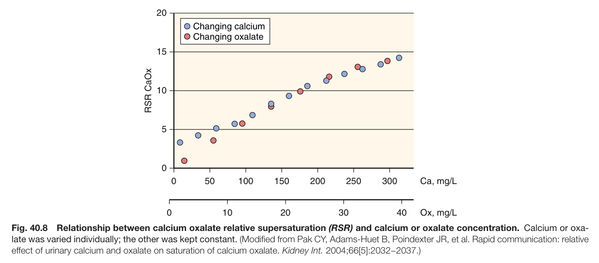

Fig. 40.8 Relationship between calcium oxalate relative supersaturation (RSR) and calcium or oxalate concentration. Calcium or oxa- late was varied individually; the other was kept constant. (Modified from Pak CY, Adams-Huet B, Poindexter JR, et al. Rapid communication: relative effect of urinary calcium and oxalate on saturation of calcium oxalate. Kidney Int. 2004;66[5]:2032−2037.)

---

### Fig_40_9

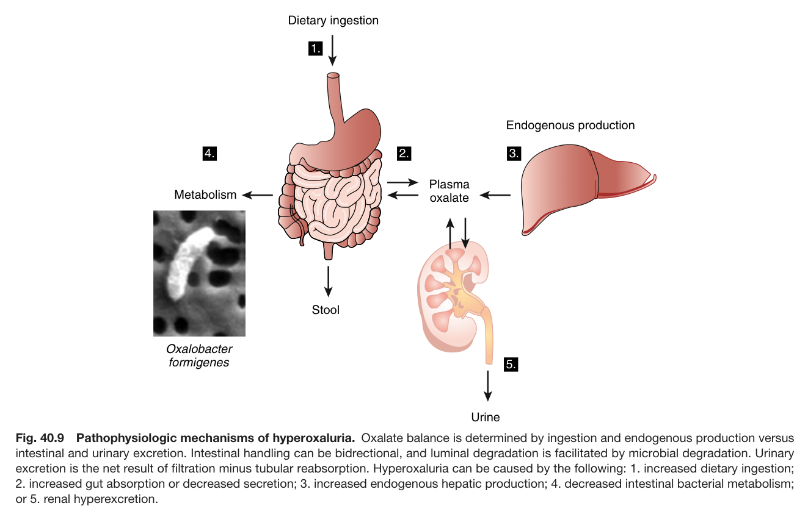

Fig. 40.9 Pathophysiologic mechanisms of hyperoxaluria. Oxalate balance is determined by ingestion and endogenous production versus intestinal and urinary excretion. Intestinal handling can be bidrectional, and luminal degradation is facilitated by microbial degradation. Urinary excretion is the net result of filtration minus tubular reabsorption. Hyperoxaluria can be caused by the following: 1. increased dietary ingestion; 2. increased gut absorption or decreased secretion; 3. increased endogenous hepatic production; 4. decreased intestinal bacterial metabolism; or 5. renal hyperexcretion.

---

### Fig_40_10

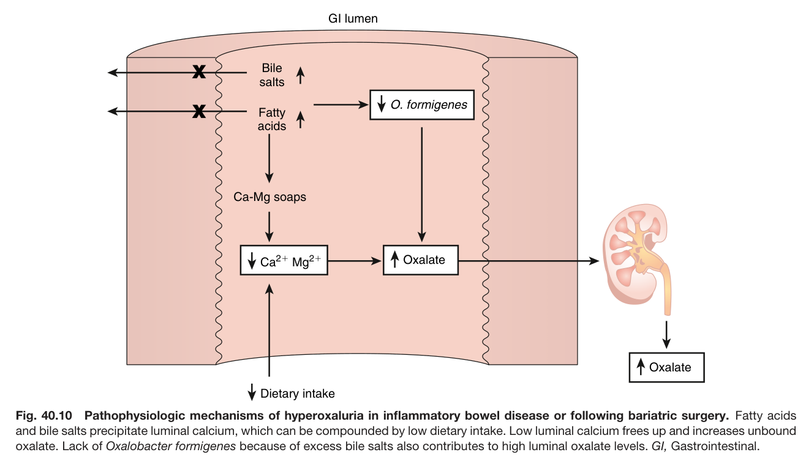

Fig. 40.10 Pathophysiologic mechanisms of hyperoxaluria in inflammatory bowel disease or following bariatric surgery. Fatty acids and bile salts precipitate luminal calcium, which can be compounded by low dietary intake. Low luminal calcium frees up and increases unbound oxalate. Lack of Oxalobacter formigenes because of excess bile salts also contributes to high luminal oxalate levels. GI, Gastrointestinal.

---

### Fig_40_11

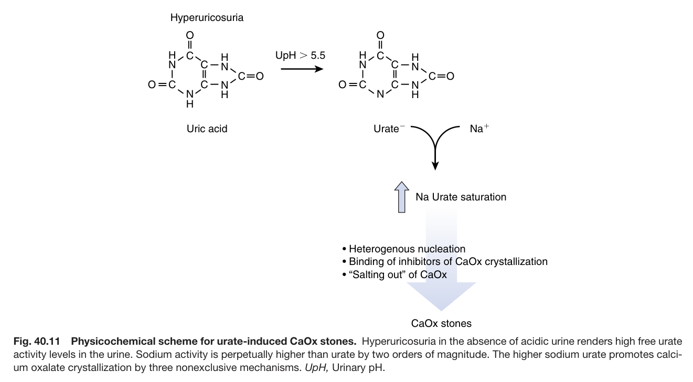

Fig. 40.11 Physicochemical scheme for urate-induced CaOx stones. Hyperuricosuria in the absence of acidic urine renders high free urate activity levels in the urine. Sodium activity is perpetually higher than urate by two orders of magnitude. The higher sodium urate promotes calci- um oxalate crystallization by three nonexclusive mechanisms. UpH, Urinary pH.

---

### Fig_40_12

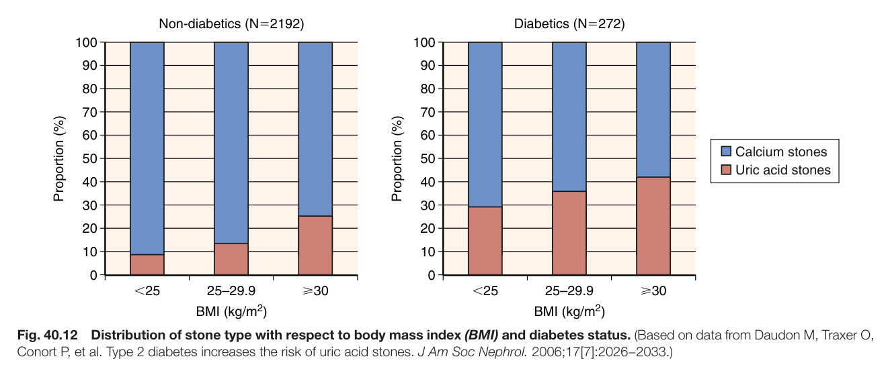

Fig. 40.12 Distribution of stone type with respect to body mass index (BMI) and diabetes status. (Based on data from Daudon M, Traxer O, Conort P, et al. Type 2 diabetes increases the risk of uric acid stones. J Am Soc Nephrol. 2006;17[7]:2026−2033.)

---

### Fig_40_13

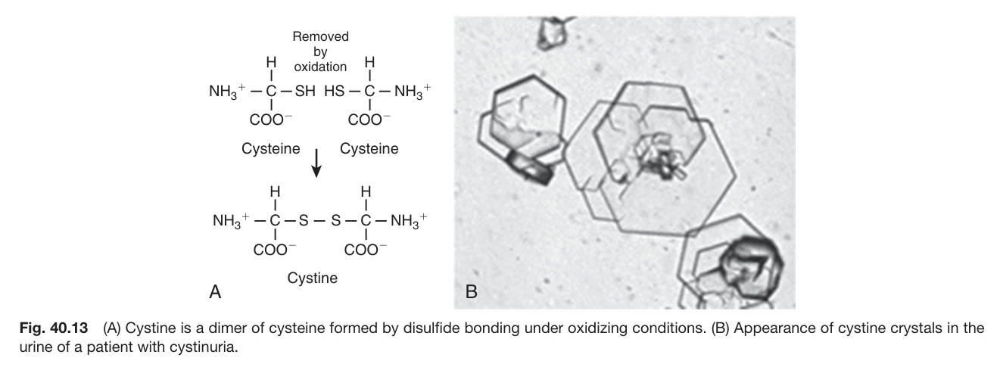

Fig. 40.13 (A) Cystine is a dimer of cysteine formed by disulfide bonding under oxidizing conditions. (B) Appearance of cystine crystals in the urine of a patient with cystinuria.

---

### Fig_40_14

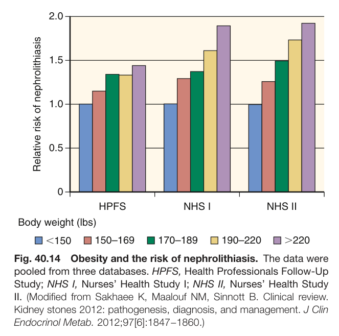

Fig. 40.14 Obesity and the risk of nephrolithiasis. The data were pooled from three databases. HPFS, Health Professionals Follow-Up Study; NHS I, Nurses’ Health Study I; NHS II, Nurses’ Health Study II. (Modified from Sakhaee K, Maalouf NM, Sinnott B. Clinical review. Kidney stones 2012: pathogenesis, diagnosis, and management. J Clin Endocrinol Metab. 2012;97[6]:1847−1860.)

---

### Fig_40_15

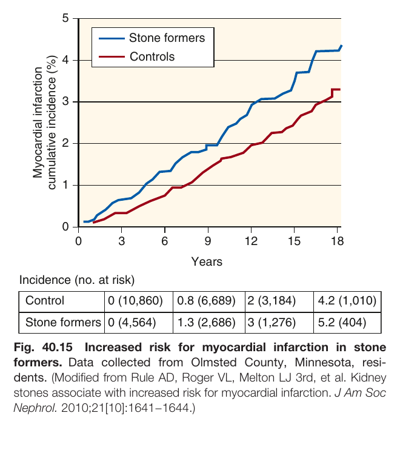

Fig. 40.15 Increased risk for myocardial infarction in stone formers. Data collected from Olmsted County, Minnesota, resi- dents. (Modified from Rule AD, Roger VL, Melton LJ 3rd, et al. Kidney stones associate with increased risk for myocardial infarction. J Am Soc Nephrol. 2010;21[10]:1641−1644.)

---

### Fig_40_16

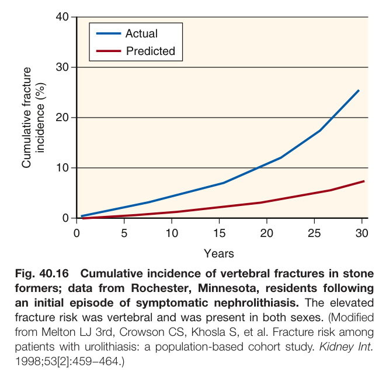

Fig. 40.16 Cumulative incidence of vertebral fractures in stone formers; data from Rochester, Minnesota, residents following an initial episode of symptomatic nephrolithiasis. The elevated fracture risk was vertebral and was present in both sexes. (Modified from Melton LJ 3rd, Crowson CS, Khosla S, et al. Fracture risk among patients with urolithiasis: a population-based cohort study. Kidney Int. 1998;53[2]:459−464.)

---

## Tables

### Table_40_1

#### Table Image

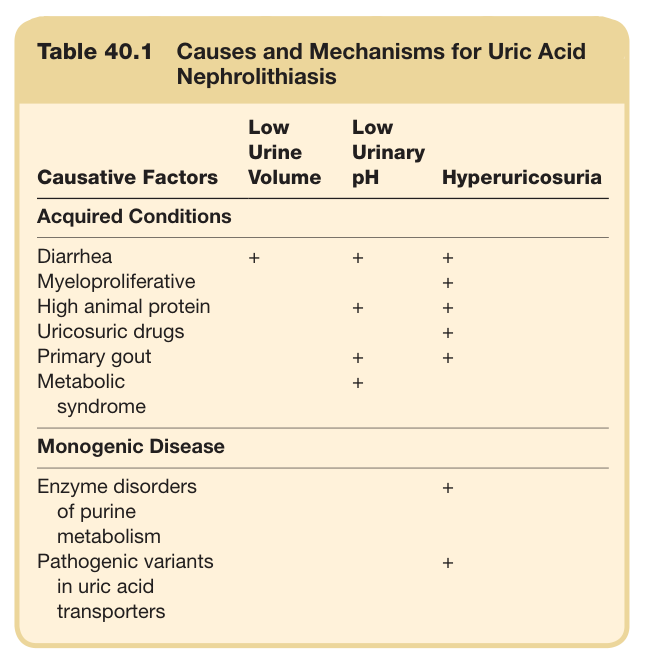

#### Table Data (CSV: [Table_40_1.csv](Table_40_1.csv))

```markdown
| Table Text (OCR) |
| :--- |
| Table 40.1 Causes and Mechanisms for Uric Acid Nephrolithiasis Causative Factors  Low Urine Volume  Low Urinary pH  Hyperuricosuria    Acquired Conditions    Diarrhea  +  +  +    Myeloproliferative      +    High animal protein    +  +    Uricosuric drugs      +    Primary gout    +  +    Metabolic syndrome    +      Monogenic Disease    Enzyme disorders of purine metabolism      +    Pathogenic variants in uric acid transporters      + |
```

Table 40.1 Causes and Mechanisms for Uric Acid Nephrolithiasis

---

### Table_40_2

#### Table Images (3 Parts)

- **Part 1 (Page 14)**:
  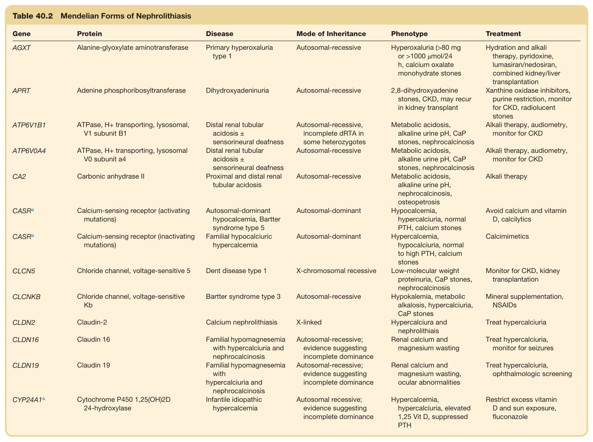

- **Part 2 (Page 15)**:
  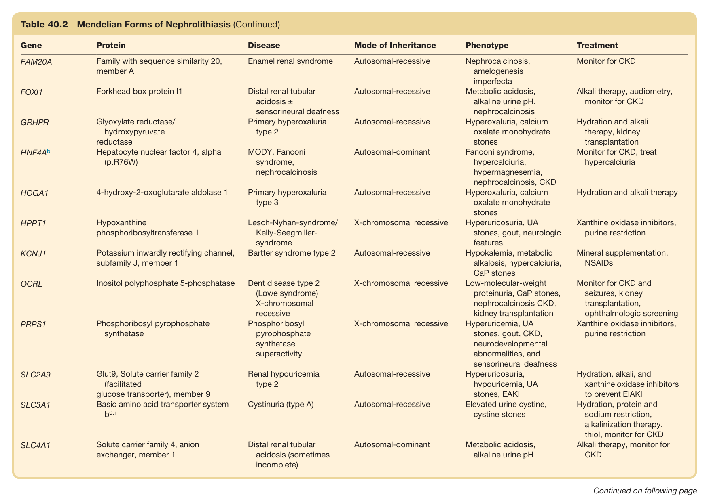

- **Part 3 (Page 16)**:
  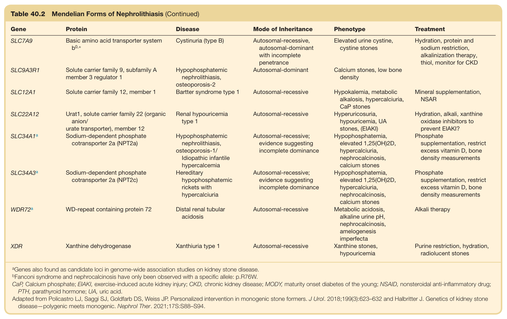

#### Table Data (CSV: [Table_40_2.csv](Table_40_2.csv))

```markdown
| Table Text (OCR) |
| :--- |
| Table 40.2Mendelian Forms of Nephrolithiasis Gene  Protein  Disease  Mode of Inheritance  Phenotype  Treatment    AGXT  Alanine-glyoxylate aminotransferase  Primary hyperoxaluria type 1  Autosomal-recessive  Hyperoxaluria (>80 mg or >1000 μmol/24 h, calcium oxalate monohydrate stones  Hydration and alkali therapy, pyridoxine, lumasiran/nedosiran, combined kidney/liver transplantation    APRT  Adenine phosphoribosyltransferase  Dihydroxyadeninuria  Autosomal-recessive  2,8-dihydroxyadenine stones, CKD, may recur in kidney transplant  Xanthine oxidase inhibitors, purine restriction, monitor for CKD, radiolucent stones    ATP6V1B1  ATPase, H+ transporting, lysosomal, V1 subunit B1  Distal renal tubular acidosis ± sensorineural deafness  Autosomal-recessive, incomplete dRTA in some heterozygotes  Metabolic acidosis, alkaline urine pH, CaP stones, nephrocalcinosis  Alkali therapy, audiometry, monitor for CKD    ATP6V0A4  ATPase, H+ transporting, lysosomal V0 subunit a4  Distal renal tubular acidosis ± sensorineural deafness  Autosomal-recessive  Metabolic acidosis, alkaline urine pH, CaP stones, nephrocalcinosis  Alkali therapy, audiometry, monitor for CKD    CA2  Carbonic anhydrase II  Proximal and distal renal tubular acidosis  Autosomal-recessive  Metabolic acidosis, alkaline urine pH, nephrocalcinosis, osteopetrosis  Alkali therapy     CASR^a   Calcium-sensing receptor (activating mutations)  Autosomal-dominant hypocalcemia, Bartter syndrome type 5  Autosomal-dominant  Hypocalcemia, hypercalciuria, normal PTH, calcium stones  Avoid calcium and vitamin D, calcilytics     CASR^a   Calcium-sensing receptor (inactivating mutations)  Familial hypocalciuric hypercalcemia  Autosomal-dominant  Hypercalcemia, hypocalciuria, normal to high PTH, calcium stones  Calcimimetics    CLCN5  Chloride channel, voltage-sensitive 5  Dent disease type 1  X-chromosomal recessive  Low-molecular weight proteinuria, CaP stones, nephrocalcinosis  Monitor for CKD, kidney transplantation    CLCNKB  Chloride channel, voltage-sensitive Kb  Bartter syndrome type 3  Autosomal-recessive  Hypokalemia, metabolic alkalosis, hypercalciuria, CaP stones  Mineral supplementation, NSAIDs    CLDN2  Claudin-2  Calcium nephrolithiasis  X-linked  Hypercalciura and nephrolithiasis  Treat hypercalciuria    CLDN16  Claudin 16  Familial hypomagnesemia with hypercalciuria and nephrocalcinosis  Autosomal-recessive; evidence suggesting incomplete dominance  Renal calcium and magnesium wasting  Treat hypercalciuria, monitor for seizures    CLDN19  Claudin 19  Familial hypomagnesemia with hypercalciuria and nephrocalcinosis  Autosomal-recessive; evidence suggesting incomplete dominance  Renal calcium and magnesium wasting, ocular abnormalities  Treat hypercalciuria, ophthalmologic screening     CYP24A1^a   Cytochrome P450 1,25(OH)2D 24-hydroxylase  Infantile idiopathic hypercalcemia  Autosomal recessive; evidence suggesting incomplete dominance  Hypercalcemia, hypercalciuria, elevated 1,25 Vit D, suppressed PTH  Restrict excess vitamin D and sun exposure, fluconazole    FAM20A  Family with sequence similarity 20, member A  Enamel renal syndrome  Autosomal-recessive  Nephrocalcinosis, amelogenesis imperfecta  Monitor for CKD    FOXI1  Forkhead box protein I1  Distal renal tubular acidosis ± sensorineural deafness  Autosomal-recessive  Metabolic acidosis, alkaline urine pH, nephrocalcinosis  Alkali therapy, audiometry, monitor for CKD    GRHPR  Glyoxylate reductase/hydroxypyruvate reductase  Primary hyperoxaluria type 2  Autosomal-recessive  Hyperoxaluria, calcium oxalate monohydrate stones  Hydration and alkali therapy, kidney transplantation     HNF4A^b   Hepatocyte nuclear factor 4, alpha (p.R76W)  MODY, Fanconi syndrome, nephrocalcinosis  Autosomal-dominant  Fanconi syndrome, hypercalciuria, hypermagnesemia, nephrocalcinosis, CKD  Monitor for CKD, treat hypercalciuria    HOGA1  4-hydroxy-2-oxoglutarate aldolase 1  Primary hyperoxaluria type 3  Autosomal-recessive  Hyperoxaluria, calcium oxalate monohydrate stones  Hydration and alkali therapy    HPRT1  Hypoxanthine phosphoribosyltransferase 1  Lesch-Nyhan-syndrome/Kelly-Seegmiller-syndrome  X-chromosomal recessive  Hyperuricosuria, UA stones, gout, neurologic features  Xanthine oxidase inhibitors, purine restriction    KCNJ1  Potassium inwardly rectifying channel, subfamily J, member 1  Bartter syndrome type 2  Autosomal-recessive  Hypokalemia, metabolic alkalosis, hypercalciuria, CaP stones  Mineral supplementation, NSAIDs    OCRL  Inositol polyphosphate 5-phosphatase  Dent disease type 2 (Lowe syndrome) X-chromosomal recessive  X-chromosomal recessive  Low-molecular-weight proteinuria, CaP stones, nephrocalcinosis CKD, kidney transplantation  Monitor for CKD and seizures, kidney transplantation, ophthalmologic screening    PRPS1  Phosphoribosyl pyrophosphate synthetase  Phosphoribosyl pyrophosphate synthetase superactivity  X-chromosomal recessive  Hyperuricemia, UA stones, gout, CKD, neurodevelopmental abnormalities, and sensorineural deafness  Xanthine oxidase inhibitors, purine restriction    SLC2A9  Glut9, Solute carrier family 2 (facilitated glucose transporter), member 9  Renal hypouricemia type 2  Autosomal-recessive  Hyperuricosuria, hypouricemia, UA stones, EAKI  Hydration, alkali, and xanthine oxidase inhibitors to prevent EIAKI    SLC3A1  Basic amino acid transporter system  b^{0,+}   Cystinuria (type A)  Autosomal-recessive  Elevated urine cystine, cystine stones  Hydration, protein and sodium restriction, alkalinization therapy, thiol, monitor for CKD    SLC4A1  Solute carrier family 4, anion exchanger, member 1  Distal renal tubular acidosis (sometimes incomplete)  Autosomal-dominant  Metabolic acidosis, alkaline urine pH  Alkali therapy, monitor for CKD Continued on following page |
```

Table 40.2 Mendelian Forms of Nephrolithiasis

---

### Table_40_3

#### Table Image

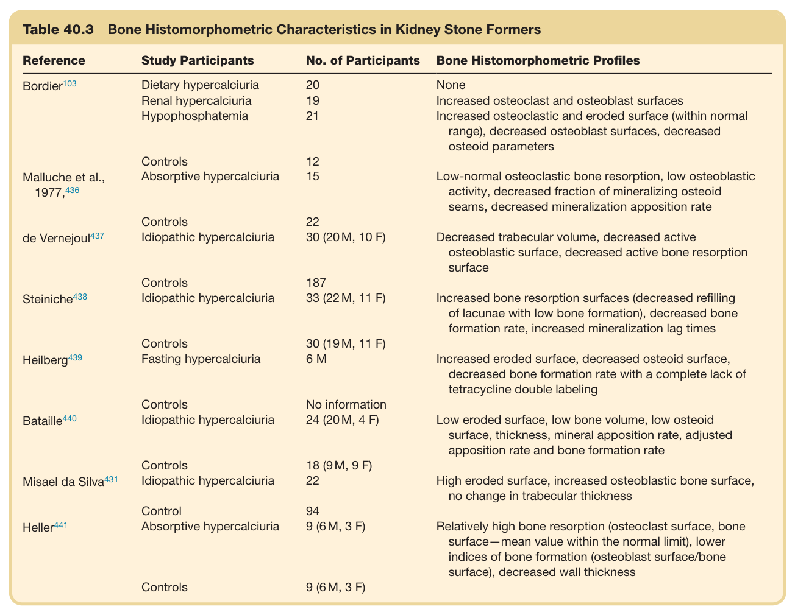

#### Table Data (CSV: [Table_40_3.csv](Table_40_3.csv))

```markdown
| Table Text (OCR) |
| :--- |
| Table 40.3  Bone Histomorphometric Characteristics in Kidney Stone Formers Reference  Study Participants  No. of Participants  Bone Histomorphometric Profiles     Bordier^{103}   Dietary hypercalciuria  20  None    Renal hypercalciuria  19  Increased osteoclast and osteoblast surfaces    Hypophosphatemia  21  Increased osteoclastic and eroded surface (within normal range), decreased osteoblast surfaces, decreased osteoid parameters    Controls  12       Malluche et al., 1977,^{436}   Absorptive hypercalciuria  15  Low-normal osteoclastic bone resorption, low osteoblastic activity, decreased fraction of mineralizing osteoid seams, decreased mineralization apposition rate    Controls  22       de Vernejoul^{437}   Idiopathic hypercalciuria  30 (20M, 10 F)  Decreased trabecular volume, decreased active osteoblastic surface, decreased active bone resorption surface    Controls  187       Steiniche^{438}   Idiopathic hypercalciuria  33 (22M, 11 F)  Increased bone resorption surfaces (decreased refilling of lacunae with low bone formation), decreased bone formation rate, increased mineralization lag times    Controls  30 (19M, 11 F)       Heilberg^{439}   Fasting hypercalciuria  6 M  Increased eroded surface, decreased osteoid surface, decreased bone formation rate with a complete lack of tetracycline double labeling    Controls  No information       Bataille^{440}   Idiopathic hypercalciuria  24 (20M, 4 F)  Low eroded surface, low bone volume, low osteoid surface, thickness, mineral apposition rate, adjusted apposition rate and bone formation rate    Controls  18 (9M, 9 F)       Misael da Silva^{431}   Idiopathic hypercalciuria  22  High eroded surface, increased osteoblastic bone surface, no change in trabecular thickness    Control  94       Heller^{441}   Absorptive hypercalciuria  9 (6M, 3 F)  Relatively high bone resorption (osteoclast surface, bone surface—mean value within the normal limit), lower indices of bone formation (osteoblast surface/bone surface), decreased wall thickness    Controls  9 (6M, 3 F) |
```

Table 40.3 Bone Histomorphometric Characteristics in Kidney Stone Formers

---

### Table_40_4

#### Table Image

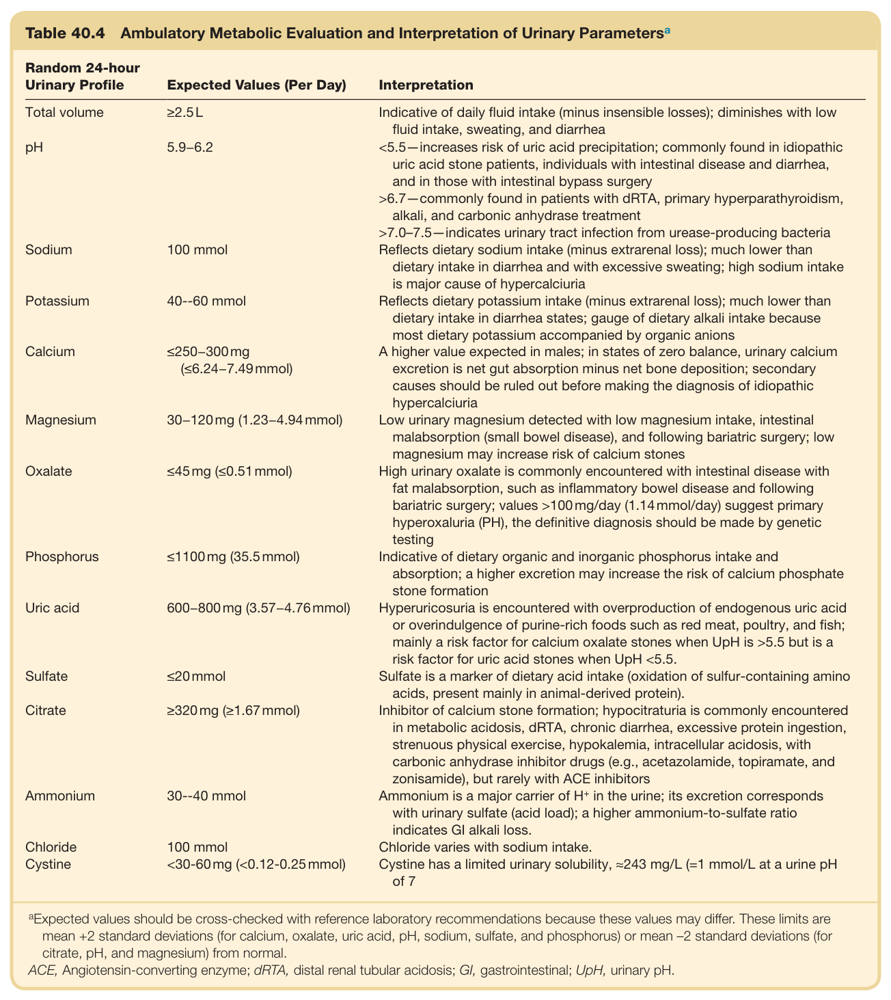

#### Table Data (CSV: [Table_40_4.csv](Table_40_4.csv))

```markdown
| Table Text (OCR) |
| :--- |
| Table 40.4  Ambulatory Metabolic Evaluation and Interpretation of Urinary Parameters<sup>a</sup> Random 24-hour Urinary Profile  Expected Values (Per Day)  Interpretation    Total volume  ≥2.5L  Indicative of daily fluid intake (minus insensible losses); diminishes with low fluid intake, sweating, and diarrhea    pH  5.9–6.2  <5.5—increases risk of uric acid precipitation; commonly found in idiopathic uric acid stone patients, individuals with intestinal disease and diarrhea, and in those with intestinal bypass surgery>6.7—commonly found in patients with dRTA, primary hyperparathyroidism, alkali, and carbonic anhydrase treatment>7.0–7.5—indicates urinary tract infection from urease-producing bacteria    Sodium  100 mmol  Reflects dietary sodium intake (minus extrarenal loss); much lower than dietary intake in diarrhea and with excessive sweating; high sodium intake is major cause of hypercalciuria    Potassium  40--60 mmol  Reflects dietary potassium intake (minus extrarenal loss); much lower than dietary intake in diarrhea states; gauge of dietary alkali intake because most dietary potassium accompanied by organic anions    Calcium  ≤250–300 mg (≤6.24–7.49 mmol)  A higher value expected in males; in states of zero balance, urinary calcium excretion is net gut absorption minus net bone deposition; secondary causes should be ruled out before making the diagnosis of idiopathic hypercalciuria    Magnesium  30–120 mg (1.23–4.94 mmol)  Low urinary magnesium detected with low magnesium intake, intestinal malabsorption (small bowel disease), and following bariatric surgery; low magnesium may increase risk of calcium stones    Oxalate  ≤45 mg (≤0.51 mmol)  High urinary oxalate is commonly encountered with intestinal disease with fat malabsorption, such as inflammatory bowel disease and following bariatric surgery; values >100 mg/day (1.14 mmol/day) suggest primary hyperoxaluria (PH), the definitive diagnosis should be made by genetic testing    Phosphorus  ≤1100 mg (35.5 mmol)  Indicative of dietary organic and inorganic phosphorus intake and absorption; a higher excretion may increase the risk of calcium phosphate stone formation    Uric acid  600–800 mg (3.57–4.76 mmol)  Hyperuricosuria is encountered with overproduction of endogenous uric acid or overindulgence of purine-rich foods such as red meat, poultry, and fish; mainly a risk factor for calcium oxalate stones when UpH is >5.5 but is a risk factor for uric acid stones when UpH <5.5.    Sulfate  ≤20 mmol  Sulfate is a marker of dietary acid intake (oxidation of sulfur-containing amino acids, present mainly in animal-derived protein).    Citrate  ≥320 mg (≥1.67 mmol)  Inhibitor of calcium stone formation; hypocitraturia is commonly encountered in metabolic acidosis, dRTA, chronic diarrhea, excessive protein ingestion, strenuous physical exercise, hypokalemia, intracellular acidosis, with carbonic anhydrase inhibitor drugs (e.g., acetazolamide, topiramate, and zonisamide), but rarely with ACE inhibitors    Ammonium  30--40 mmol  Ammonium is a major carrier of H+ in the urine; its excretion corresponds with urinary sulfate (acid load); a higher ammonium-to-sulfate ratio indicates GI alkali loss.    Chloride  100 mmol  Chloride varies with sodium intake.    Cystine  <30-60 mg (<0.12-0.25 mmol)  Cystine has a limited urinary solubility, ≈243 mg/L (=1 mmol/L at a urine pH of 7 <sup>a</sup>Expected values should be cross-checked with reference laboratory recommendations because these values may differ. These limits are mean +2 standard deviations (for calcium, oxalate, uric acid, pH, sodium, sulfate, and phosphorus) or mean –2 standard deviations (for citrate, pH, and magnesium) from normal. ACE, Angiotensin-converting enzyme; dRTA, distal renal tubular acidosis; GI, gastrointestinal; UpH, urinary pH. |
```

Table 40.4 Ambulatory Metabolic Evaluation and Interpretation of Urinary Parameters<sup>a</sup>

---

### Table_40_5

#### Table Image

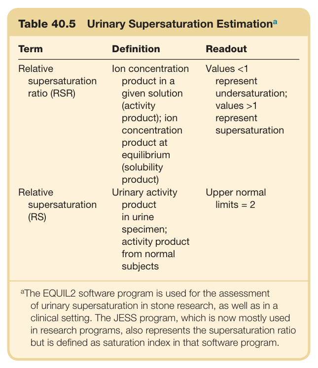

#### Table Data (CSV: [Table_40_5.csv](Table_40_5.csv))

```markdown
| Table Text (OCR) |
| :--- |
| Table 40.5  Urinary Supersaturation Estimation<sup>a</sup> Term  Definition  Readout    Relativesupersaturationratio (RSR)  Ion concentrationproduct in a given solution(activity product); ion concentrationproduct at equilibrium(solubility product)  Values <1 represent undersaturation; values >1 represent supersaturation    Relativesupersaturation(RS)  Urinary activityproductin urine specimen;activity productfrom normal subjects  Upper normal limits = 2 <sup>a</sup>The EQUIL2 software program is used for the assessment of urinary supersaturation in stone research, as well as in a clinical setting. The JESS program, which is now mostly used in research programs, also represents the supersaturation ratio but is defined as saturation index in that software program. |
```

Table 40.5 Urinary Supersaturation Estimation<sup>a</sup>

---

### Table_40_6

#### Table Image

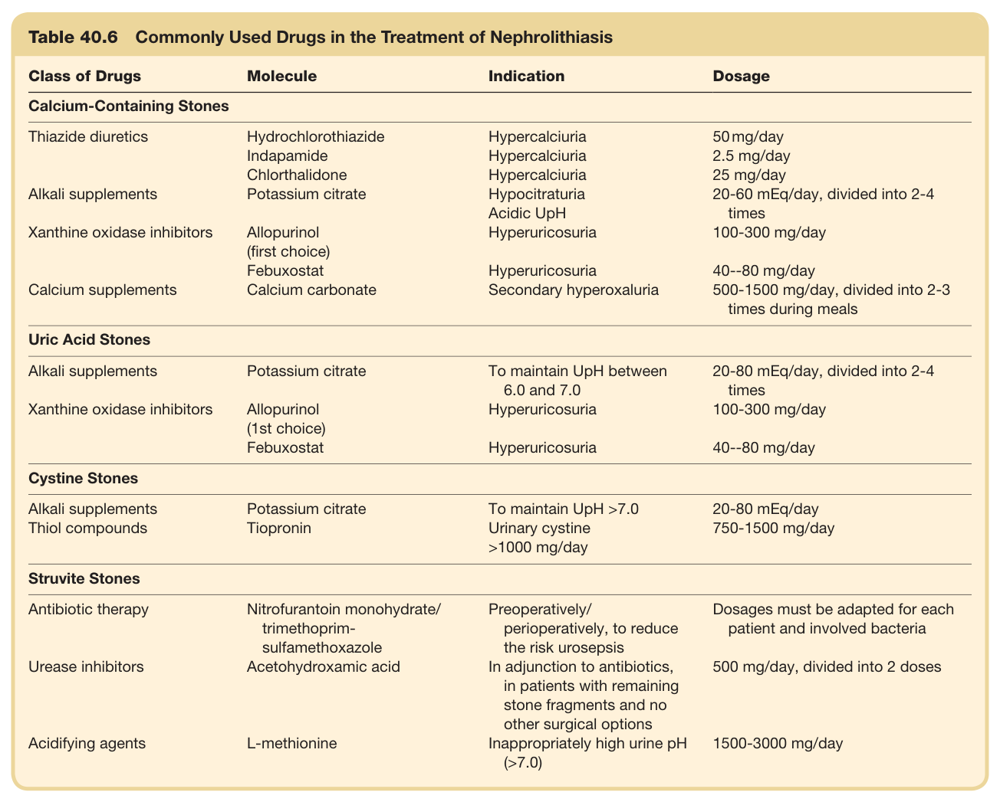

#### Table Data (CSV: [Table_40_6.csv](Table_40_6.csv))

```markdown
| Table Text (OCR) |
| :--- |
| Table 40.6  Commonly Used Drugs in the Treatment of Nephrolithiasis Class of Drugs  Molecule  Indication  Dosage    Calcium-Containing Stones    Thiazide diuretics  Hydrochlorothiazide  Hypercalciuria  50 mg/day    Indapamide  Hypercalciuria  2.5 mg/day    Chlorthalidone  Hypercalciuria  25 mg/day    Alkali supplements  Potassium citrate  Hypocitraturia  20-60 mEq/day, divided into 2-4 times    Acidic UpH    Xanthine oxidase inhibitors  Allopurinol (first choice)  Hyperuricosuria  100-300 mg/day    Febuxostat  Hyperuricosuria  40--80 mg/day    Calcium supplements  Calcium carbonate  Secondary hyperoxaluria  500-1500 mg/day, divided into 2-3 times during meals    Uric Acid Stones    Alkali supplements  Potassium citrate  To maintain UpH between 6.0 and 7.0  20-80 mEq/day, divided into 2-4 times    Xanthine oxidase inhibitors  Allopurinol (1st choice)  Hyperuricosuria  100-300 mg/day    Febuxostat  Hyperuricosuria  40--80 mg/day    Cystine Stones    Alkali supplements  Potassium citrate  To maintain UpH >7.0  20-80 mEq/day    Thiol compounds  Tiopronin  Urinary cystine >1000 mg/day  750-1500 mg/day    Struvite Stones    Antibiotic therapy  Nitrofurantoin monohydrate/trimethoprim-sulfamethoxazole  Preoperatively/perioperatively, to reduce the risk urosepsis  Dosages must be adapted for each patient and involved bacteria    Urease inhibitors  Acetohydroxamic acid  In adjunction to antibiotics, in patients with remaining stone fragments and no other surgical options  500 mg/day, divided into 2 doses    Acidifying agents  L-methionine  Inappropriately high urine pH (>7.0)  1500-3000 mg/day |
```

Table 40.6 Commonly Used Drugs in the Treatment of Nephrolithiasis

---
