# 41. Diabetic Kidney Disease - Figures and Tables Index

This document lists all figures and tables extracted from `41. Diabetic Kidney Disease.pdf`.

## Table of Contents
- [Figures](#figures)
- [Tables](#tables)

---

## Figures

### Fig_41_1

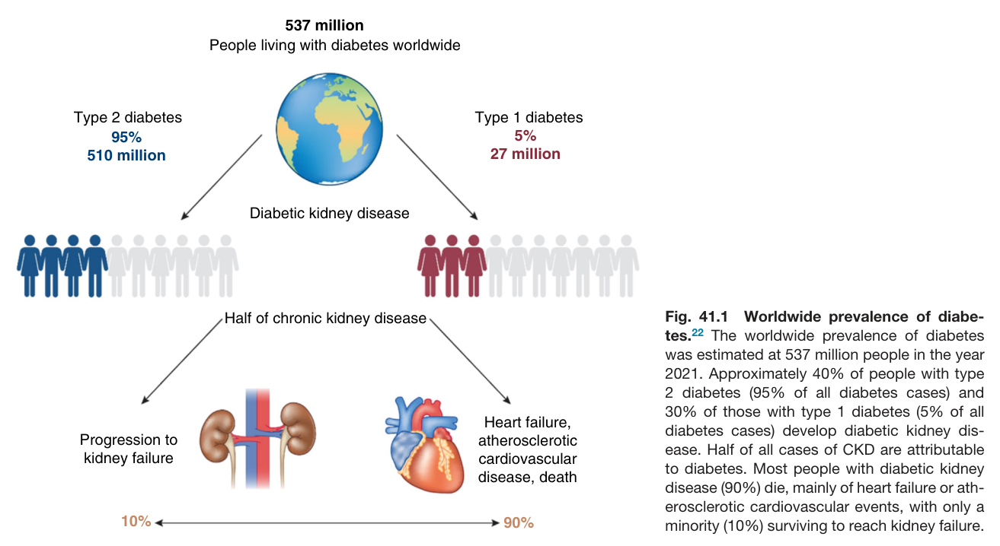

Fig. 41.1 Worldwide prevalence of diabe- tes.<sup>22</sup> The worldwide prevalence of diabetes was estimated at 537 million people in the year 2021. Approximately 40% of people with type 2 diabetes (95% of all diabetes cases) and 30% of those with type 1 diabetes (5% of all diabetes cases) develop diabetic kidney dis- ease. Half of all cases of CKD are attributable to diabetes. Most people with diabetic kidney disease (90%) die, mainly of heart failure or ath- erosclerotic cardiovascular events, with only a minority (10%) surviving to reach kidney failure.

---

### Fig_41_2

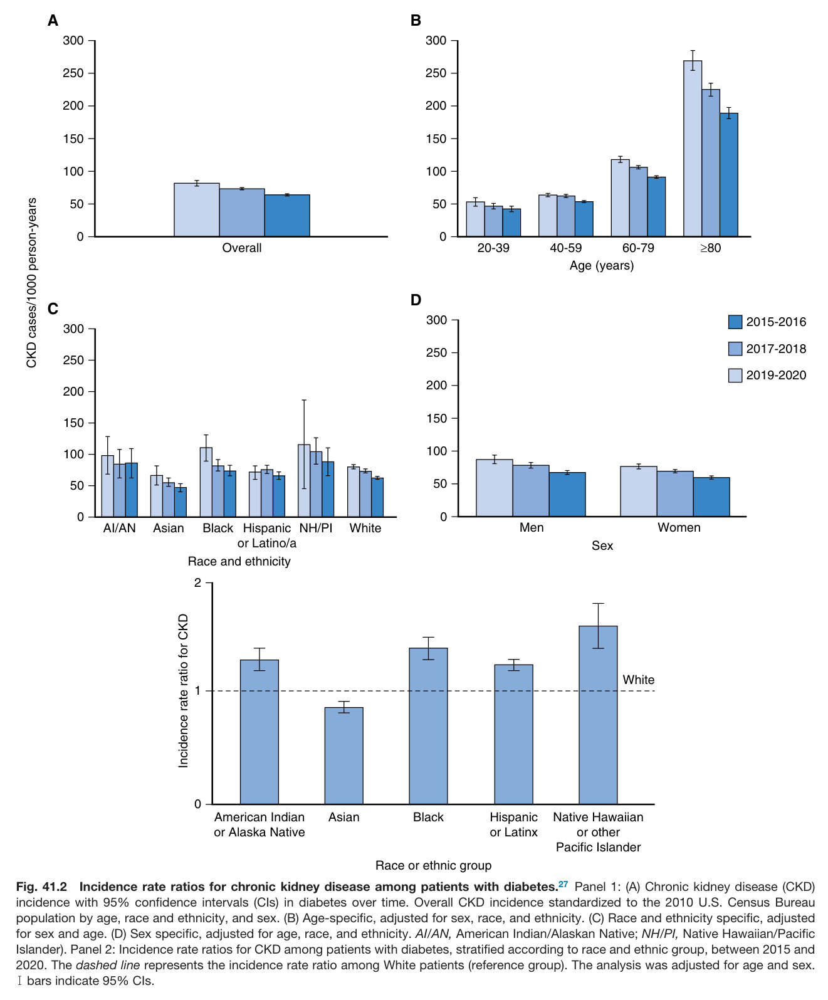

Fig. 41.2 Incidence rate ratios for chronic kidney disease among patients with diabetes.<sup>27</sup> Panel 1: (A) Chronic kidney disease (CKD) incidence with 95% confidence intervals (CIs) in diabetes over time. Overall CKD incidence standardized to the 2010 U.S. Census Bureau population by age, race and ethnicity, and sex. (B) Age-specific, adjusted for sex, race, and ethnicity. (C) Race and ethnicity specific, adjusted for sex and age. (D) Sex specific, adjusted for age, race, and ethnicity. AI/AN, American Indian/Alaskan Native; NH/PI, Native Hawaiian/Pacific Islander). Panel 2: Incidence rate ratios for CKD among patients with diabetes, stratified according to race and ethnic group, between 2015 and 2020. The dashed line represents the incidence rate ratio among White patients (reference group). The analysis was adjusted for age and sex. I bars indicate 95% CIs.

---

### Fig_41_3

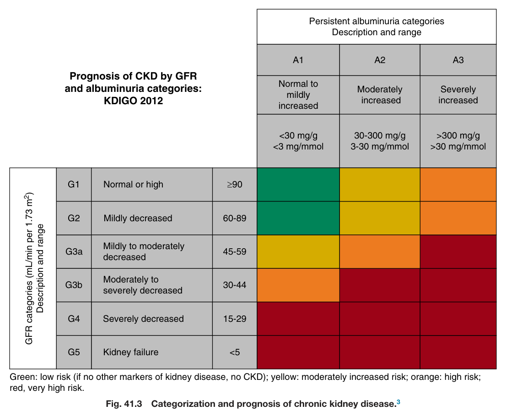

Fig. 41.3 Categorization and prognosis of chronic kidney disease.<sup>3</sup>

---

### Fig_41_4

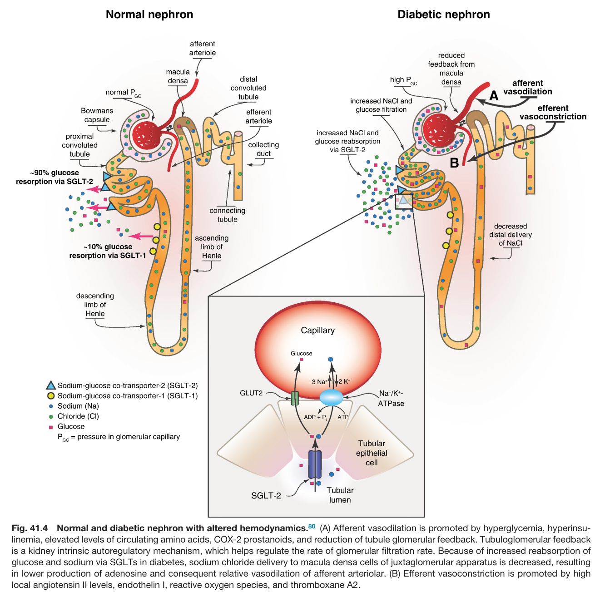

Fig. 41.4 Normal and diabetic nephron with altered hemodynamics.<sup>80</sup> (A) Afferent vasodilation is promoted by hyperglycemia, hyperinsu linemia, elevated levels of circulating amino acids, COX-2 prostanoids, and reduction of tubule glomerular feedback. Tubuloglomerular feedback is a kidney intrinsic autoregulatory mechanism, which helps regulate the rate of glomerular filtration rate. Because of increased reabsorption of glucose and sodium via SGLTs in diabetes, sodium chloride delivery to macula densa cells of juxtaglomerular apparatus is decreased, resulting in lower production of adenosine and consequent relative vasodilation of afferent arteriolar. (B) Efferent vasoconstriction is promoted by high local angiotensin II levels, endothelin I, reactive oxygen species, and thromboxane A2.

---

### Fig_41_5

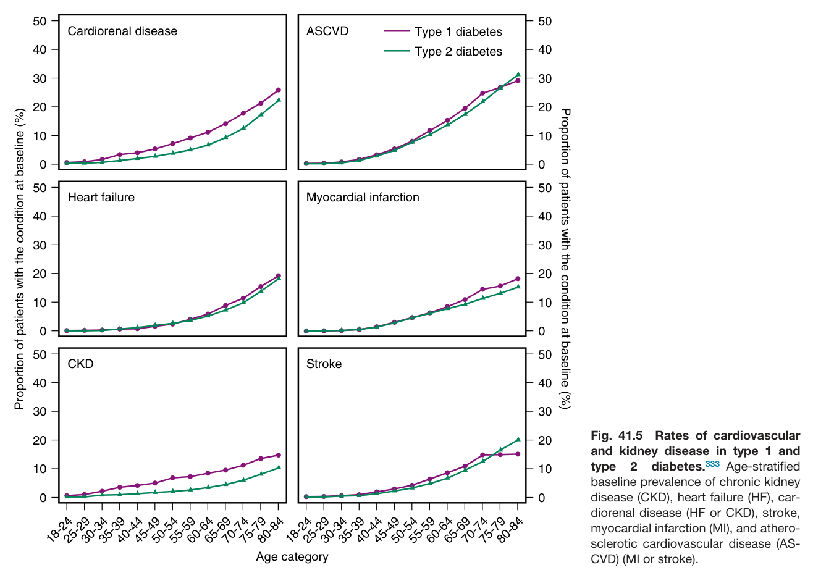

Fig. 41.5 Rates of cardiovascular and kidney disease in type 1 and type 2 diabetes.<sup>333</sup> Age-stratified baseline prevalence of chronic kidney disease (CKD), heart failure (HF), car- diorenal disease (HF or CKD), stroke, myocardial infarction (MI), and athero- sclerotic cardiovascular disease (AS- CVD) (MI or stroke).

---

### Fig_41_6

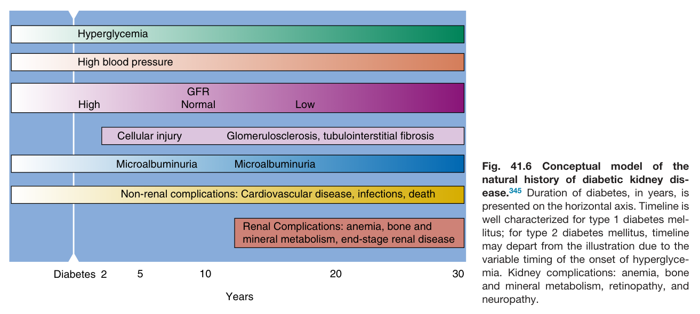

Fig. 41.6 Conceptual model of the natural history of diabetic kidney dis- ease.<sup>345</sup> Duration of diabetes, in years, is presented on the horizontal axis. Timeline is well characterized for type 1 diabetes mel- litus; for type 2 diabetes mellitus, timeline may depart from the illustration due to the variable timing of the onset of hyperglyce- mia. Kidney complications: anemia, bone and mineral metabolism, retinopathy, and neuropathy.

---

### Fig_41_7

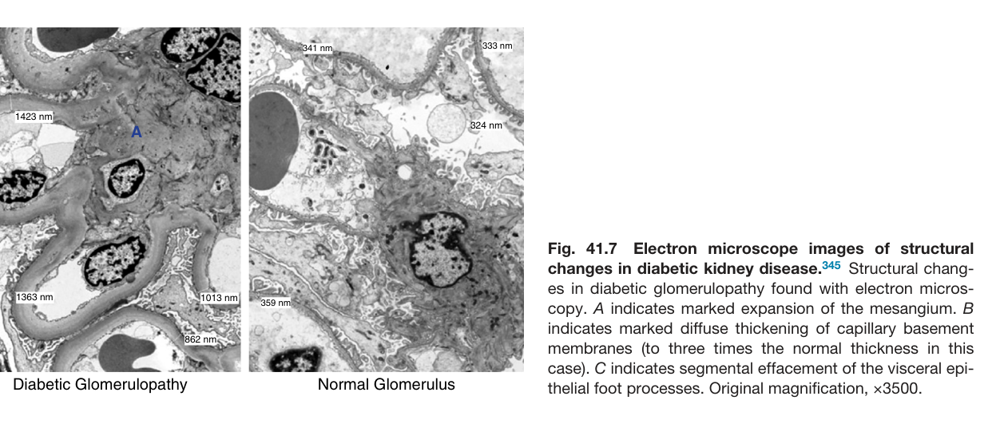

Fig. 41.7 Electron microscope images of structural changes in diabetic kidney disease.<sup>345</sup> Structural chang- es in diabetic glomerulopathy found with electron micros- copy. A indicates marked expansion of the mesangium. B indicates marked diffuse thickening of capillary basement membranes (to three times the normal thickness in this case). C indicates segmental effacement of the visceral epi- thelial foot processes. Original magnification, ×3500.

---

### Fig_41_8

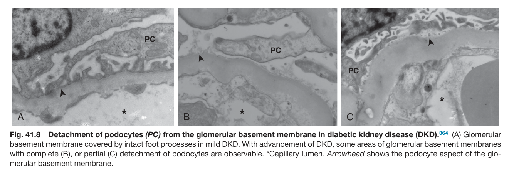

Fig. 41.8 Detachment of podocytes (PC) from the glomerular basement membrane in diabetic kidney disease (DKD).<sup>364</sup> (A) Glomerular basement membrane covered by intact foot processes in mild DKD. With advancement of DKD, some areas of glomerular basement membranes with complete (B), or partial (C) detachment of podocytes are observable. *Capillary lumen. Arrowhead shows the podocyte aspect of the glo- merular basement membrane.

---

### Fig_41_9

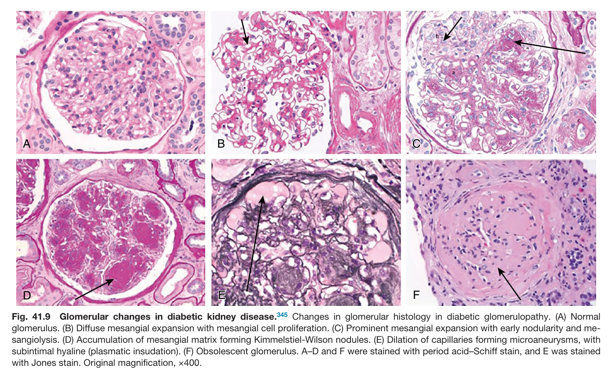

Fig. 41.9 Glomerular changes in diabetic kidney disease.<sup>345</sup> Changes in glomerular histology in diabetic glomerulopathy. (A) Normal glomerulus. (B) Diffuse mesangial expansion with mesangial cell proliferation. (C) Prominent mesangial expansion with early nodularity and me- sangiolysis. (D) Accumulation of mesangial matrix forming Kimmelstiel-Wilson nodules. (E) Dilation of capillaries forming microaneurysms, with subintimal hyaline (plasmatic insudation). (F) Obsolescent glomerulus. A–D and F were stained with period acid–Schiff stain, and E was stained with Jones stain. Original magnification, ×400.

---

### Fig_41_10

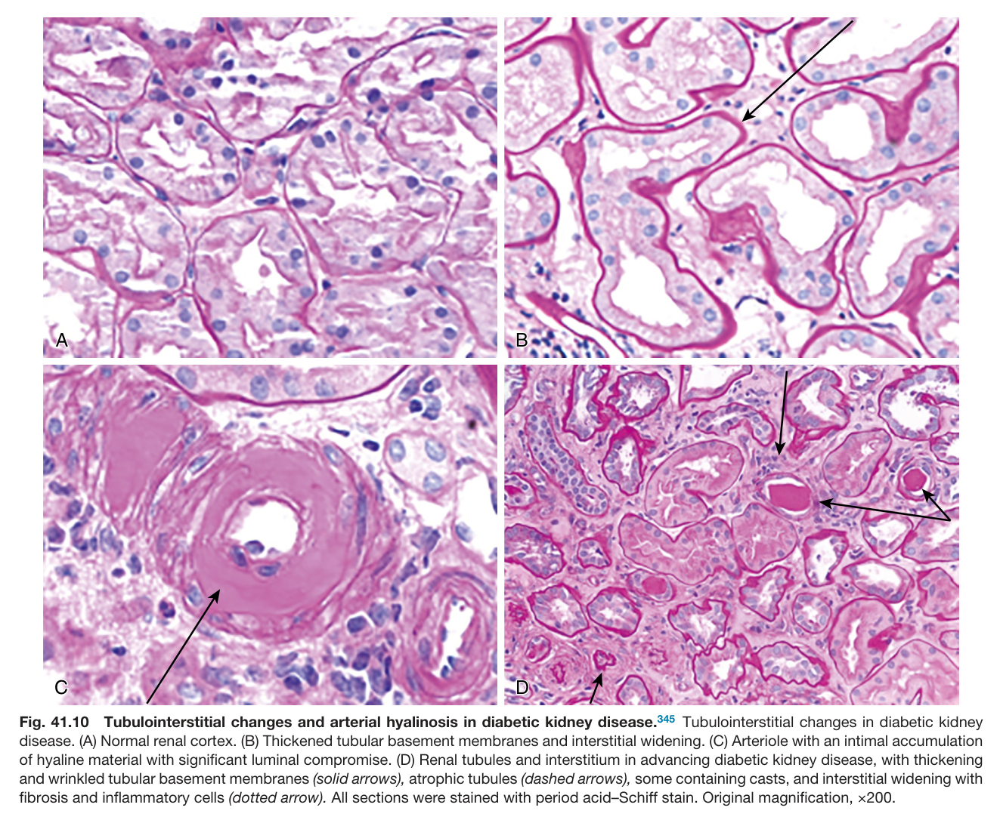

Fig. 41.10 Tubulointerstitial changes and arterial hyalinosis in diabetic kidney disease.<sup>345</sup> Tubulointerstitial changes in diabetic kidney disease. (A) Normal renal cortex. (B) Thickened tubular basement membranes and interstitial widening. (C) Arteriole with an intimal accumulation of hyaline material with significant luminal compromise. (D) Renal tubules and interstitium in advancing diabetic kidney disease, with thickening and wrinkled tubular basement membranes (solid arrows), atrophic tubules (dashed arrows), some containing casts, and interstitial widening with fibrosis and inflammatory cells (dotted arrow). All sections were stained with period acid–Schiff stain. Original magnification, ×200.

---

### Fig_41_11

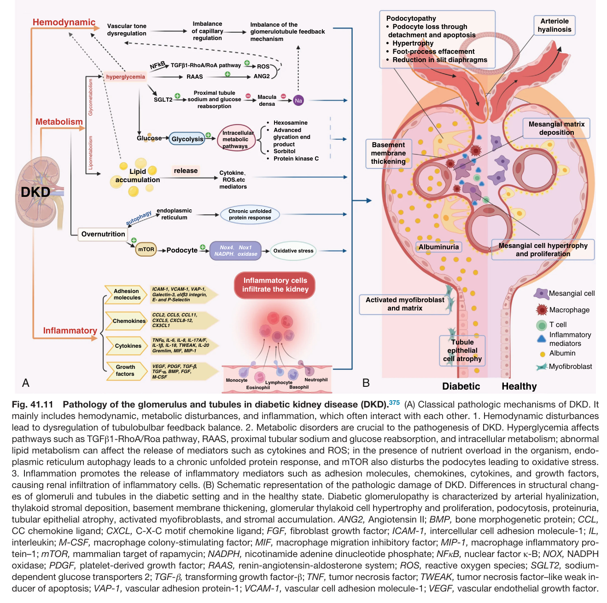

Fig. 41.11 Pathology of the glomerulus and tubules in diabetic kidney disease (DKD).<sup>375</sup> (A) Classical pathologic mechanisms of DKD. It mainly includes hemodynamic, metabolic disturbances, and inflammation, which often interact with each other. 1. Hemodynamic disturbances lead to dysregulation of tubulobulbar feedback balance. 2. Metabolic disorders are crucial to the pathogenesis of DKD. Hyperglycemia affects pathways such as TGFβ1-RhoA/Roa pathway, RAAS, proximal tubular sodium and glucose reabsorption, and intracellular metabolism; abnorma lipid metabolism can affect the release of mediators such as cytokines and ROS; in the presence of nutrient overload in the organism, endo- plasmic reticulum autophagy leads to a chronic unfolded protein response, and mTOR also disturbs the podocytes leading to oxidative stress. 3. Inflammation promotes the release of inflammatory mediators such as adhesion molecules, chemokines, cytokines, and growth factors, causing renal infiltration of inflammatory cells. (B) Schematic representation of the pathologic damage of DKD. Differences in structural chang es of glomeruli and tubules in the diabetic setting and in the healthy state. Diabetic glomerulopathy is characterized by arterial hyalinization, thylakoid stromal deposition, basement membrane thickening, glomerular thylakoid cell hypertrophy and proliferation, podocytosis, proteinuria, tubular epithelial atrophy, activated myofibroblasts, and stromal accumulation. ANG2, Angiotensin II; BMP, bone morphogenetic protein; CCL, CC chemokine ligand; CXCL, C-X-C motif chemokine ligand; FGF, fibroblast growth factor; ICAM-1, intercellular cell adhesion molecule-1; IL, interleukin; M-CSF, macrophage colony-stimulating factor; MIF, macrophage migration inhibitory factor; MIP-1, macrophage inflammatory pro- tein–1; mTOR, mammalian target of rapamycin; NADPH, nicotinamide adenine dinucleotide phosphate; NFκB, nuclear factor κ-B; NOX, NADPH oxidase; PDGF, platelet-derived growth factor; RAAS, renin-angiotensin-aldosterone system; ROS, reactive oxygen species; SGLT2, sodium- dependent glucose transporters 2; TGF-β, transforming growth factor-β; TNF, tumor necrosis factor; TWEAK, tumor necrosis factor–like weak in- ducer of apoptosis; VAP-1, vascular adhesion protein-1; VCAM-1, vascular cell adhesion molecule-1; VEGF, vascular endothelial growth factor.

---

### Fig_41_12

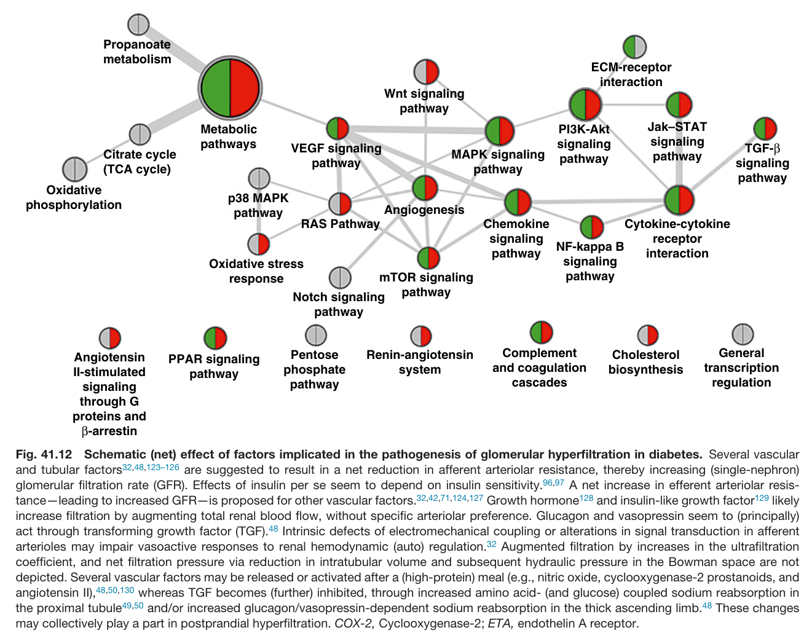

Fig. 41.12 Schematic (net) effect of factors implicated in the pathogenesis of glomerular hyperfiltration in diabetes. Several vascular and tubular factors<sup>32,48,123–126</sup> are suggested to result in a net reduction in afferent arteriolar resistance, thereby increasing (single-nephron) glomerular filtration rate (GFR). Effects of insulin per se seem to depend on insulin sensitivity.<sup>96,97</sup> A net increase in efferent arteriolar resis- tance—leading to increased GFR—is proposed for other vascular factors.<sup>32,42,71,124,127</sup> Growth hormone<sup>128</sup> and insulin-like growth factor<sup>129</sup> likely increase filtration by augmenting total renal blood flow, without specific arteriolar preference. Glucagon and vasopressin seem to (principally) act through transforming growth factor (TGF).<sup>48</sup> Intrinsic defects of electromechanical coupling or alterations in signal transduction in afferent arterioles may impair vasoactive responses to renal hemodynamic (auto) regulation.<sup>32</sup> Augmented filtration by increases in the ultrafiltration coefficient, and net filtration pressure via reduction in intratubular volume and subsequent hydraulic pressure in the Bowman space are not depicted. Several vascular factors may be released or activated after a (high-protein) meal (e.g., nitric oxide, cyclooxygenase-2 prostanoids, and angiotensin II),<sup>48,50,130</sup> whereas TGF becomes (further) inhibited, through increased amino acid- (and glucose) coupled sodium reabsorption in the proximal tubule<sup>49,50</sup> and/or increased glucagon/vasopressin-dependent sodium reabsorption in the thick ascending limb.<sup>48</sup> These changes may collectively play a part in postprandial hyperfiltration. COX-2, Cyclooxygenase-2; ETA, endothelin A receptor.

---

### Fig_41_13

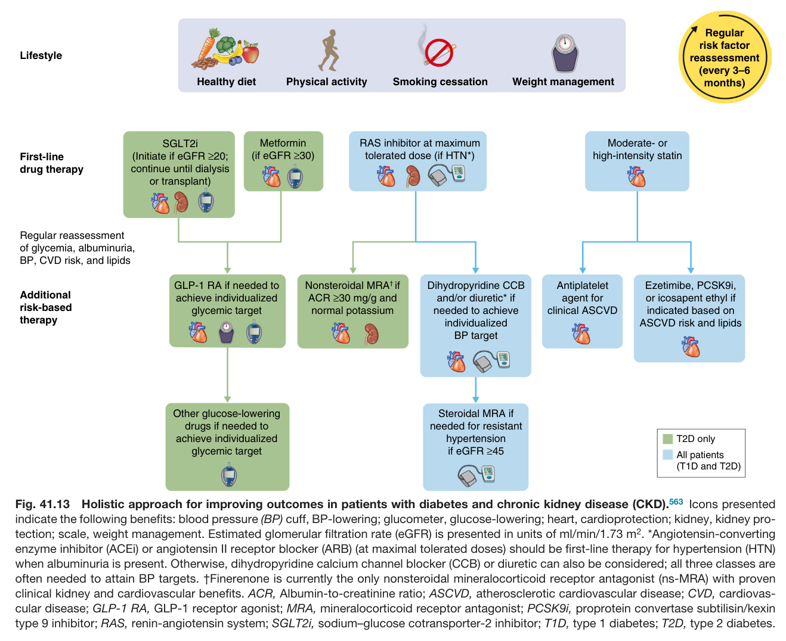

Fig. 41.13 Holistic approach for improving outcomes in patients with diabetes and chronic kidney disease (CKD).<sup>563</sup> Icons presented indicate the following benefits: blood pressure (BP) cuff, BP-lowering; glucometer, glucose-lowering; heart, cardioprotection; kidney, kidney pro tection; scale, weight management. Estimated glomerular filtration rate (eGFR) is presented in units of ml/min/1.73 m<sup>2</sup>. \*Angiotensin-converting enzyme inhibitor (ACEi) or angiotensin II receptor blocker (ARB) (at maximal tolerated doses) should be first-line therapy for hypertension (HTN) when albuminuria is present. Otherwise, dihydropyridine calcium channel blocker (CCB) or diuretic can also be considered; all three classes are often needed to attain BP targets. †Finerenone is currently the only nonsteroidal mineralocorticoid receptor antagonist (ns-MRA) with proven clinical kidney and cardiovascular benefits. ACR, Albumin-to-creatinine ratio; ASCVD, atherosclerotic cardiovascular disease; CVD, cardiovas cular disease; GLP-1 RA, GLP-1 receptor agonist; MRA, mineralocorticoid receptor antagonist; PCSK9i, proprotein convertase subtilisin/kexin type 9 inhibitor; RAS, renin-angiotensin system; SGLT2i, sodium–glucose cotransporter-2 inhibitor; T1D, type 1 diabetes; T2D, type 2 diabetes.

---

### Fig_41_14

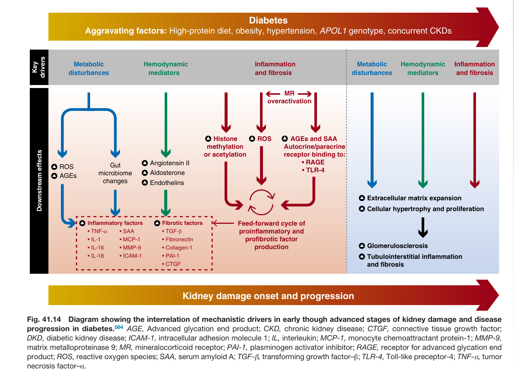

Fig. 41.14 Diagram showing the interrelation of mechanistic drivers in early though advanced stages of kidney damage and disease progression in diabetes.<sup>564</sup> AGE, Advanced glycation end product; CKD, chronic kidney disease; CTGF, connective tissue growth factor; DKD, diabetic kidney disease; ICAM-1, intracellular adhesion molecule 1; IL, interleukin; MCP-1, monocyte chemoattractant protein-1; MMP-9, matrix metalloproteinase 9; MR, mineralocorticoid receptor; PAI-1, plasminogen activator inhibitor; RAGE, receptor for advanced glycation end product; ROS, reactive oxygen species; SAA, serum amyloid A; TGF-β, transforming growth factor–β; TLR-4, Toll-like preceptor-4; TNF-α, tumor necrosis factor–α.

---

### Fig_41_15

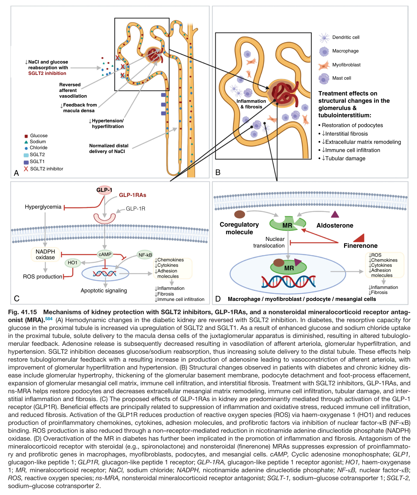

Fig. 41.15 Mechanisms of kidney protection with SGLT2 inhibitors, GLP-1RAs, and a nonsteroidal mineralocorticoid receptor antag- onist (MRA).<sup>584</sup> (A) Hemodynamic changes in the diabetic kidney are reversed with SGLT2 inhibition. In diabetes, the resorptive capacity for glucose in the proximal tubule is increased via upregulation of SGLT2 and SGLT1. As a result of enhanced glucose and sodium chloride uptake in the proximal tubule, solute delivery to the macula densa cells of the juxtaglomerular apparatus is diminished, resulting in altered tubuloglo- merular feedback. Adenosine release is subsequently decreased resulting in vasodilation of afferent arteriola, glomerular hyperfiltration, and hypertension. SGLT2 inhibition deceases glucose/sodium reabsorption, thus increasing solute delivery to the distal tubule. These effects help restore tubuloglomerular feedback with a resulting increase in production of adenosine leading to vasoconstriction of afferent arteriola, with improvement of glomerular hyperfiltration and hypertension. (B) Structural changes observed in patients with diabetes and chronic kidney dis- ease include glomerular hypertrophy, thickening of the glomerular basement membrane, podocyte detachment and foot-process effacement, expansion of glomerular mesangial cell matrix, immune cell infiltration, and interstitial fibrosis. Treatment with SGLT2 inhibitors, GLP-1RAs, and ns-MRA helps restore podocytes and decreases extracellular mesangial matrix remodeling, immune cell infiltration, tubular damage, and inter- stitial inflammation and fibrosis. (C) The proposed effects of GLP-1RAs in kidney are predominantly mediated through activation of the GLP-1 receptor (GLP1R). Beneficial effects are principally related to suppression of inflammation and oxidative stress, reduced immune cell infiltration, and reduced fibrosis. Activation of the GLP1R reduces production of reactive oxygen species (ROS) via haem-oxygenase 1 (HO1) and reduces production of proinflammatory chemokines, cytokines, adhesion molecules, and profibrotic factors via inhibition of nuclear factor-κB (NF-κB) binding. ROS production is also reduced through a non–receptor-mediated reduction in nicotinamide adenine dinucleotide phosphate (NADPH) oxidase. (D) Overactivation of the MR in diabetes has further been implicated in the promotion of inflammation and fibrosis. Antagonism of the mineralocorticoid receptor with steroidal (e.g., spironolactone) and nonsteroidal (finerenone) MRAs suppresses expression of proinflammato- ry and profibrotic genes in macrophages, myofibroblasts, podocytes, and mesangial cells. cAMP, Cyclic adenosine monophosphate; GLP1, glucagon-like peptide 1; GLP1R, glucagon-like peptide 1 receptor; GLP-1RA, glucagon-like peptide 1 receptor agonist; HO1, haem-oxygenase 1; MR, mineralocorticoid receptor; NaCl, sodium chloride; NADPH, nicotinamide adenine dinucleotide phosphate; NF-ᴋB, nuclear factor-ᴋB; ROS, reactive oxygen species; ns-MRA, nonsteroidal mineralocorticoid receptor antagonist; SGLT-1, sodium–glucose cotransporter 1; SGLT-2, sodium–glucose cotransporter 2.

---

### Fig_41_16

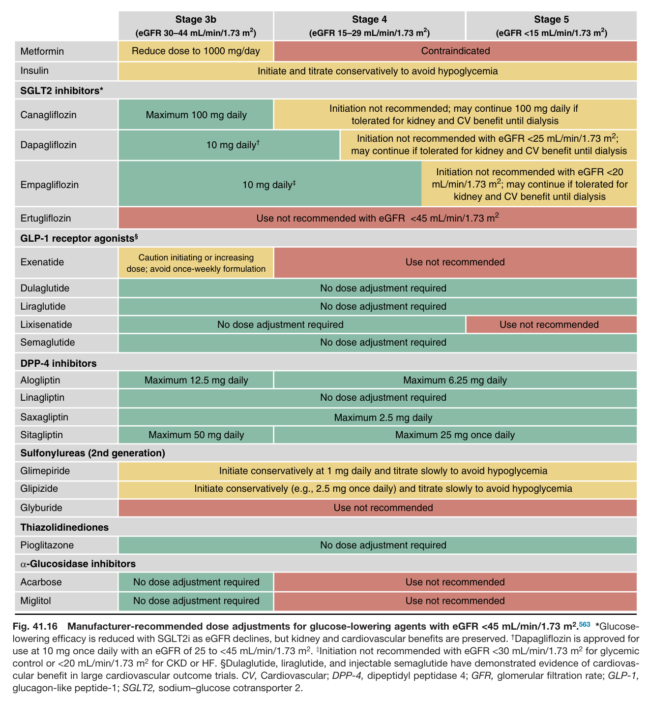

Fig. 41.16 Manufacturer-recommended dose adjustments for glucose-lowering agents with eGFR <45 mL/min/1.73 m<sup>2</sup>.<sup>563</sup> *Glucose lowering efficacy is reduced with SGLT2i as eGFR declines, but kidney and cardiovascular benefits are preserved. <sup>†</sup>Dapagliflozin is approved for use at 10 mg once daily with an eGFR of 25 to <45 mL/min/1.73 m<sup>2</sup>. ‡Initiation not recommended with eGFR <30 mL/min/1.73 m<sup>2</sup> for glycemic control or <20 mL/min/1.73 m<sup>2</sup> for CKD or HF. §Dulaglutide, liraglutide, and injectable semaglutide have demonstrated evidence of cardiovas- cular benefit in large cardiovascular outcome trials. CV, Cardiovascular; DPP-4, dipeptidyl peptidase 4; GFR, glomerular filtration rate; GLP-1, glucagon-like peptide-1; SGLT2, sodium–glucose cotransporter 2.

---

### Fig_41_17

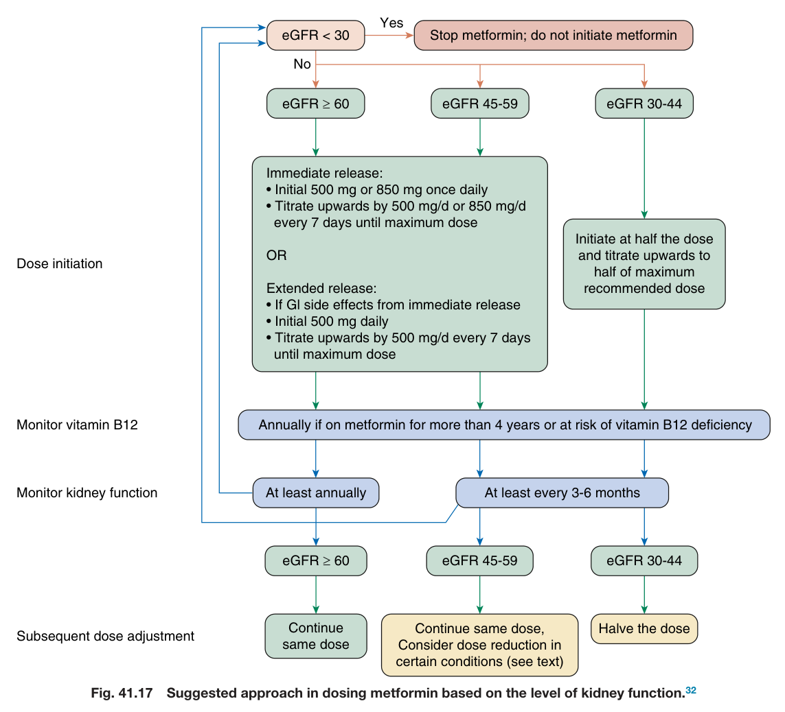

Fig. 41.17 Suggested approach in dosing metformin based on the level of kidney function.<sup>32</sup>

---

## Tables

### Table_41_1

#### Table Image

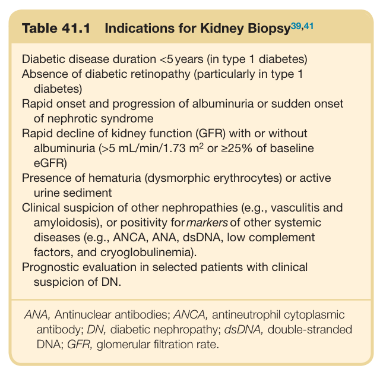

#### Table Data (CSV: [Table_41_1.csv](Table_41_1.csv))

```markdown
| Table Text (OCR) |
| :--- |
| Table 41.1  Indications for Kidney Biopsy<sup>39,41</sup> Diabetic disease duration <5years (in type 1 diabetes) Absence of diabetic retinopathy (particularly in type 1 diabetes) Rapid onset and progression of albuminuria or sudden onset of nephrotic syndrome Rapid decline of kidney function (GFR) with or without albuminuria (>5 mL/min/1.73 m<sup>2</sup> or ≥25% of baseline eGFR) Presence of hematuria (dysmorphic erythrocytes) or active urine sediment Clinical suspicion of other nephropathies (e.g., vasculitis and amyloidosis), or positivity formarkersof other systemic diseases (e.g., ANCA, ANA, dsDNA, low complement factors, and cryoglobulinemia). Prognostic evaluation in selected patients with clinical suspicion of DN. ANA, Antinuclear antibodies; ANCA, antineutrophil cytoplasmic antibody; DN, diabetic nephropathy; dsDNA, double-stranded DNA; GFR, glomerular filtration rate. compared with those with other forms of CKD. Hazard ratios (95% confidence intervals for progression to kidney failure) were 7.1 (2.46–20.49) and 0.89 (0.19–4.24) for patients with DKD and nondiabetic CKD, respectively.<sup>50</sup> |
```

Table 41.1 Indications for Kidney Biopsy<sup>39,41</sup>

---

### Table_41_2

#### Table Image

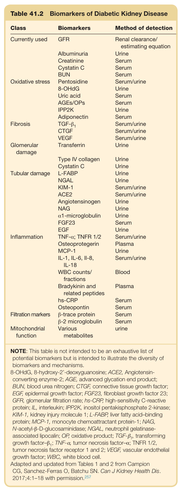

#### Table Data (CSV: [Table_41_2.csv](Table_41_2.csv))

```markdown
| Table Text (OCR) |
| :--- |
| Table 41.2  Biomarkers of Diabetic Kidney Disease Class  Biomarkers  Method of detection    Currently used  GFR  Renal clearance/estimating equation    Albuminuria  Urine    Creatinine  Serum    Cystatin C  Serum    BUN  Serum    Oxidative stress  Pentosidine  Serum/urine    8-OHdG  Urine    Uric acid  Serum    AGEs/OPs  Serum    IPP2K  Urine    Adiponectin  Serum    Fibrosis  TGF- \beta_1   Serum/urine    CTGF  Serum/urine    VEGF  Serum/urine    Glomerular damage  Transferrin  Urine    Type IV collagen  Urine    Cystatin C  Urine    Tubular damage  L-FABP  Urine    NGAL  Urine    KIM-1  Serum/urine    ACE2  Serum/urine    Angiotensinogen  Urine    NAG  Urine     \alpha 1-microglobulin  Urine    FGF23  Serum    EGF  Urine    Inflammation  TNF- \alpha ; TNFR 1/2  Serum/urine    Osteoprotegerin  Plasma    MCP-1  Urine    IL-1, IL-6, Il-8, IL-18  Serum/urine    WBC counts/fractions  Blood    Bradykinin and related peptides  Plasma    hs-CRP  Serum    Osteopontin  Serum    Filtration markers   \beta -trace protein  Serum     \beta -2 microglobulin  Serum    Mitochondrial function  Various metabolites  urine NOTE: This table is not intended to be an exhaustive list of potential biomarkers but is intended to illustrate the diversity of biomarkers and mechanisms. 8-OHdG, 8-hydroxy-2’-deoxyguanosine; ACE2, Angiotensin- converting enzyme-2; AGE, advanced glycation end product; BUN, blood urea nitrogen; CTGF, connective tissue growth factor; EGF, epidermal growth factor; FGF23, fibroblast growth factor 23; GFR, glomerular filtration rate; hs-CRP, high-sensitivity C-reactive protein; IL, interleukin; IPP2K, inositol pentakisphosphate 2-kinase; KIM-1, kidney injury molecule 1; L-FABP, liver fatty acid–binding protein; MCP-1, monocyte chemoattractant protein-1; NAG, N-acetyl-β-D-glucosaminidase; NGAL, neutrophil gelatinase- associated lipocalin; OP, oxidative product; TGF-β , transforming growth factor–β ; TNF-α, tumor necrosis factor–α; TNFR 1/2, tumor necrosis factor receptor 1 and 2; VEGF, vascular endothelial growth factor; WBC, white blood cell. Adapted and updated from Tables 1 and 2 from Campion CG, Sanchez-Ferras O, Batchu SN. Can J Kidney Health Dis. 2017;4:1–18 with permission.<sup>257</sup> |
```

Table 41.2 Biomarkers of Diabetic Kidney Disease

---

### Table_41_3

#### Table Image

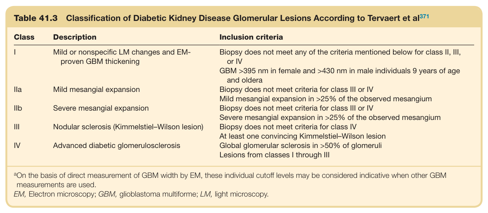

#### Table Data (CSV: [Table_41_3.csv](Table_41_3.csv))

```markdown
| Table Text (OCR) |
| :--- |
| Table 41.3 Classification of Diabetic Kidney Disease Glomerular Lesions According to Tervaert et al<sup>371</sup> Class  Description  Inclusion criteria    I  Mild or nonspecific LM changes and EM-proven GBM thickening  Biopsy does not meet any of the criteria mentioned below for class II, III, or IVGBM >395 nm in female and >430 nm in male individuals 9 years of age and oldera    IIa  Mild mesangial expansion  Biopsy does not meet criteria for class III or IVMild mesangial expansion in >25% of the observed mesangium    IIb  Severe mesangial expansion  Biopsy does not meet criteria for class III or IVSevere mesangial expansion in >25% of the observed mesangium    III  Nodular sclerosis (Kimmelstiel-Wilson lesion)  Biopsy does not meet criteria for class IVAt least one convincing Kimmelstiel-Wilson lesion    IV  Advanced diabetic glomerulosclerosis  Global glomerular sclerosis in >50% of glomeruliLesions from classes I through III <sup>a</sup>On the basis of direct measurement of GBM width by EM, these individual cutoff levels may be considered indicative when other GBM measurements are used. EM, Electron microscopy; GBM, glioblastoma multiforme; LM, light microscopy. |
```

Table 41.3 Classification of Diabetic Kidney Disease Glomerular Lesions According to Tervaert et al<sup>371</sup>

---

### Table_41_4

#### Table Image

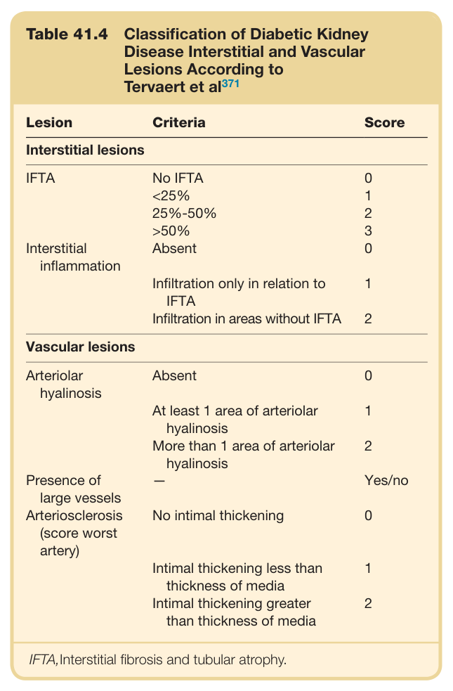

#### Table Data (CSV: [Table_41_4.csv](Table_41_4.csv))

```markdown
| Table Text (OCR) |
| :--- |
| Table 41.4  Classification of Diabetic Kidney Disease Interstitial and Vascular Lesions According to Tervaert et al<sup>371</sup> Lesion  Criteria  Score    Interstitial lesions    IFTA  No IFTA  0    <25%  1    25%-50%  2    >50%  3    Interstitial inflammation  Absent  0    Infiltration only in relation to IFTA  1    Infiltration in areas without IFTA  2    Vascular lesions    Arteriolar hyalinosis  Absent  0    At least 1 area of arteriolar hyalinosis  1    More than 1 area of arteriolar hyalinosis  2    Presence of large vessels  -  Yes/no    Arteriosclerosis (score worst artery)  No intimal thickening  0    Intimal thickening less than thickness of media  1    Intimal thickening greater than thickness of media  2 IFTA,Interstitial fibrosis and tubular atrophy. |
```

Table 41.4 Classification of Diabetic Kidney Disease Interstitial and Vascular Lesions According to Tervaert et al<sup>371</sup>

---

### Table_41_5

#### Table Image

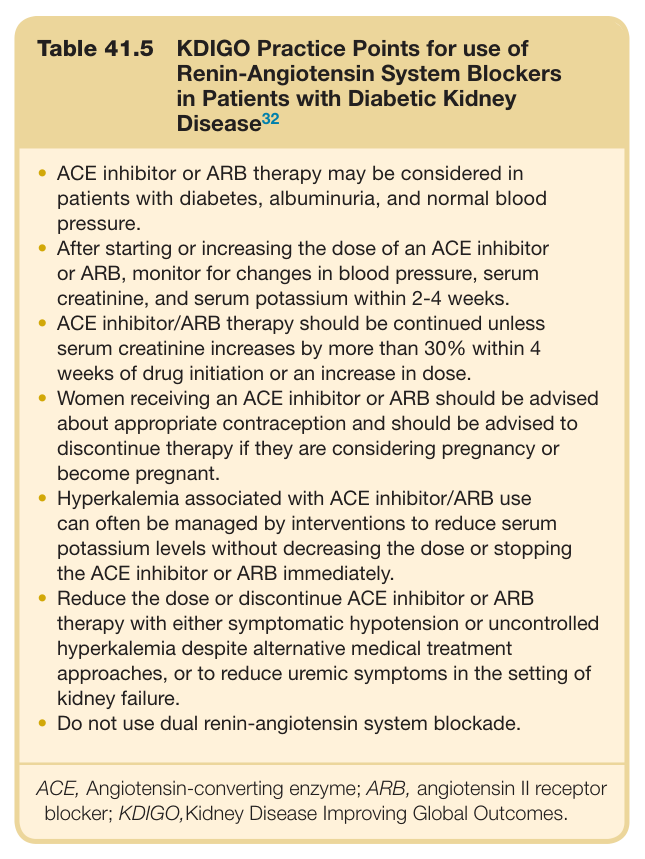

#### Table Data (CSV: [Table_41_5.csv](Table_41_5.csv))

```markdown
| Table Text (OCR) |
| :--- |
| Table 41.5 KDIGO Practice Points for use of Renin-Angiotensin System Blockers in Patients with Diabetic Kidney Disease<sup>32</sup> ACE inhibitor or ARB therapy may be considered in patients with diabetes, albuminuria, and normal blood pressure. After starting or increasing the dose of an ACE inhibitor or ARB, monitor for changes in blood pressure, serum creatinine, and serum potassium within 2-4 weeks. ACE inhibitor/ARB therapy should be continued unless serum creatinine increases by more than 30% within 4 weeks of drug initiation or an increase in dose. Women receiving an ACE inhibitor or ARB should be advised about appropriate contraception and should be advised to discontinue therapy if they are considering pregnancy or become pregnant. Hyperkalemia associated with ACE inhibitor/ARB use can often be managed by interventions to reduce serum potassium levels without decreasing the dose or stopping the ACE inhibitor or ARB immediately. Reduce the dose or discontinue ACE inhibitor or ARB therapy with either symptomatic hypotension or uncontrolled hyperkalemia despite alternative medical treatment approaches, or to reduce uremic symptoms in the setting of kidney failure. •	 Do not use dual renin-angiotensin system blockade. ACE, Angiotensin-converting enzyme; ARB, angiotensin II receptor blocker; KDIGO,Kidney Disease Improving Global Outcomes. |
```

Table 41.5 KDIGO Practice Points for use of Renin-Angiotensin System Blockers in Patients with Diabetic Kidney Disease<sup>32</sup>

---

### Table_41_6

#### Table Image

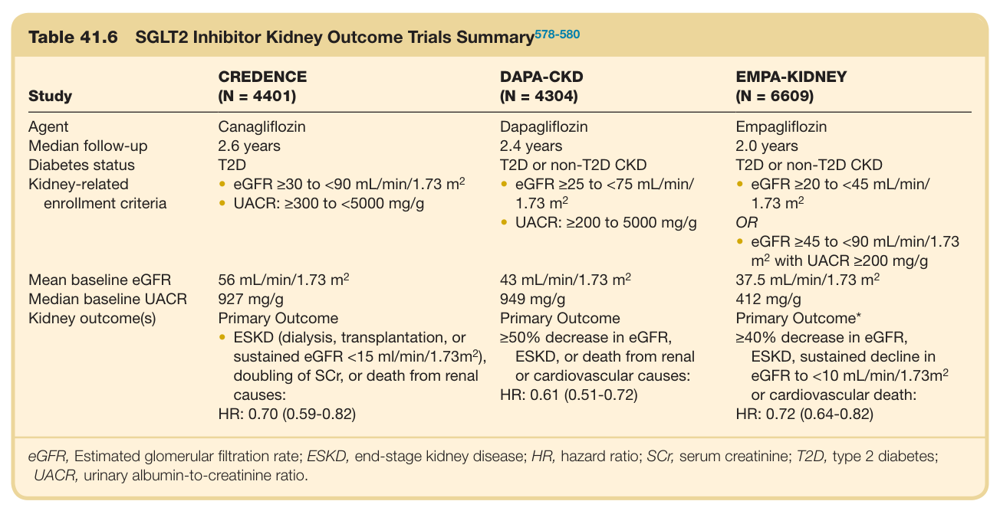

#### Table Data (CSV: [Table_41_6.csv](Table_41_6.csv))

```markdown
| Table Text (OCR) |
| :--- |
| Table 41.6  SGLT2 Inhibitor Kidney Outcome Trials Summary<sup>578-580</sup> Study  CREDENCE(N = 4401)  DAPA-CKD(N = 4304)  EMPA-KIDNEY(N = 6609)    Agent  Canagliflozin  Dapagliflozin  Empagliflozin    Median follow-up  2.6 years  2.4 years  2.0 years    Diabetes status  T2D  T2D or non-T2D CKD  T2D or non-T2D CKD    Kidney-related enrollment criteria  eGFR ≥30 to <90 mL/min/1.73  m^2 UACR: ≥300 to <5000 mg/g  eGFR ≥25 to <75 mL/min/1.73  m^2 UACR: ≥200 to 5000 mg/g  eGFR ≥20 to <45 mL/min/1.73  m^2 OReGFR ≥45 to <90 mL/min/1.73  m^2  with UACR ≥200 mg/g    Mean baseline eGFR  56 mL/min/1.73  m^2   43 mL/min/1.73  m^2   37.5 mL/min/1.73  m^2     Median baseline UACR  927 mg/g  949 mg/g  412 mg/g    Kidney outcome(s)  Primary OutcomeESKD (dialysis, transplantation, or sustained eGFR <15 ml/min/1.73 m^2 ), doubling of SCr, or death from renal causes:HR: 0.70 (0.59-0.82)  Primary Outcome≥50% decrease in eGFR,ESKD, or death from renal or cardiovascular causes:HR: 0.61 (0.51-0.72)  Primary Outcome*≥40% decrease in eGFR,ESKD, sustained decline in eGFR to <10 mL/min/1.73 m^2  or cardiovascular death:HR: 0.72 (0.64-0.82) eGFR, Estimated glomerular filtration rate; ESKD, end-stage kidney disease; HR, hazard ratio; SCr, serum creatinine; T2D, type 2 diabetes; UACR, urinary albumin-to-creatinine ratio. |
```

Table 41.6 SGLT2 Inhibitor Kidney Outcome Trials Summary<sup>578-580</sup>

---

### Table_41_7

#### Table Image

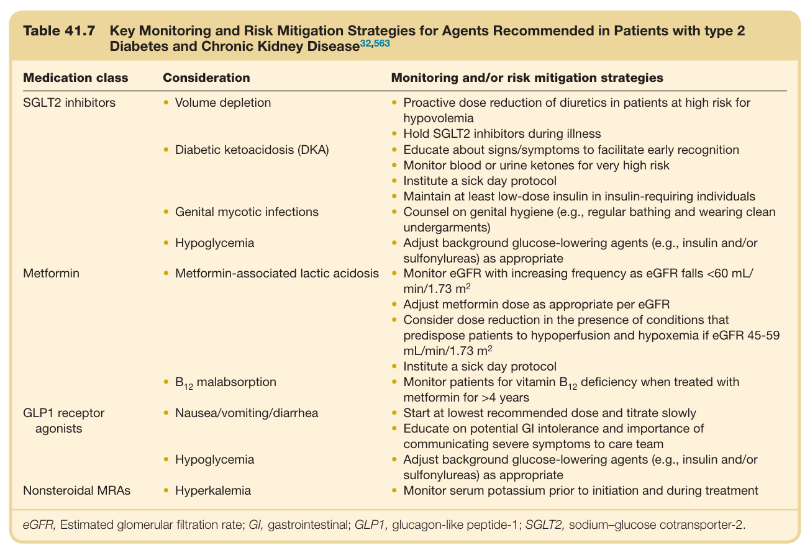

#### Table Data (CSV: [Table_41_7.csv](Table_41_7.csv))

```markdown
| Table Text (OCR) |
| :--- |
| Table 41.7  Key Monitoring and Risk Mitigation Strategies for Agents Recommended in Patients with type 2 Diabetes and Chronic Kidney Disease<sup>32,563</sup> Medication class  Consideration  Monitoring and/or risk mitigation strategies    SGLT2 inhibitors  Volume depletionDiabetic ketoacidosis (DKA)Genital mycotic infectionsHypoglycemia  Proactive dose reduction of diuretics in patients at high risk for hypovolemiaHold SGLT2 inhibitors during illnessEducate about signs/symptoms to facilitate early recognitionMonitor blood or urine ketones for very high riskInstitute a sick day protocolMaintain at least low-dose insulin in insulin-requiring individualsCounsel on genital hygiene (e.g., regular bathing and wearing clean undergarments)Adjust background glucose-lowering agents (e.g., insulin and/or sulfonylureas) as appropriate    Metformin  Metformin-associated lactic acidosis B_{12}  malabsorption  Monitor eGFR with increasing frequency as eGFR falls <60 mL/min/1.73  m^{2} Adjust metformin dose as appropriate per eGFConsider dose reduction in the presence of conditions that predispose patients to hypoperfusion and hypoxemia if eGFR 45-59 mL/min/1.73  m^{2} Institute a sick day protocolMonitor patients for vitamin  B_{12}  deficiency when treated with metformin for >4 years    GLP1 receptor agonists  Nausea/vomiting/diarrheaHypoglycemia  Start at lowest recommended dose and titrate slowlyEducate on potential GI intolerance and importance of communicating severe symptoms to care teamAdjust background glucose-lowering agents (e.g., insulin and/or sulfonylureas) as appropriate    Nonsteroidal MRAs  Hyperkalemia  Monitor serum potassium prior to initiation and during treatment eGFR, Estimated glomerular filtration rate; GI, gastrointestinal; GLP1, glucagon-like peptide-1; SGLT2, sodium–glucose cotransporter-2. |
```

Table 41.7 Key Monitoring and Risk Mitigation Strategies for Agents Recommended in Patients with type 2 Diabetes and Chronic Kidney Disease<sup>32,563</sup>

---

### Table_41_8

#### Table Image

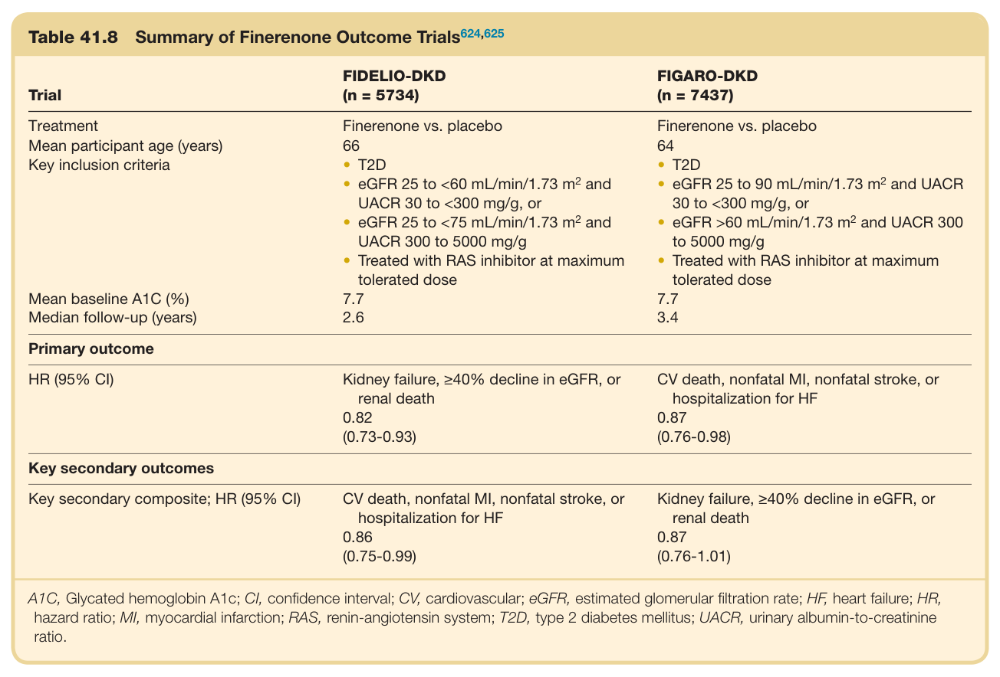

#### Table Data (CSV: [Table_41_8.csv](Table_41_8.csv))

```markdown
| Table Text (OCR) |
| :--- |
| Table 41.8 Summary of Finerenone Outcome Trials<sup>624,625</sup> Trial  FIDELIO-DKD(n = 5734)  FIGARO-DKD(n = 7437)    Treatment  Finerenone vs. placebo  Finerenone vs. placebo    Mean participant age (years)  66  64    Key inclusion criteria  T2DeGFR 25 to <60 mL/min/1.73  m^2  and UACR 30 to <300 mg/g, oreGFR 25 to <75 mL/min/1.73  m^2  and UACR 300 to 5000 mg/gTreated with RAS inhibitor at maximum tolerated dose  T2DeGFR 25 to 90 mL/min/1.73  m^2  and UACR 30 to <300 mg/g, oreGFR >60 mL/min/1.73  m^2  and UACR 300 to 5000 mg/gTreated with RAS inhibitor at maximum tolerated dose    Mean baseline A1C (%)  7.7  7.7    Median follow-up (years)  2.6  3.4    Primary outcome    HR (95% CI)  Kidney failure, ≥40% decline in eGFR, or renal death0.82(0.73-0.93)  CV death, nonfatal MI, nonfatal stroke, or hospitalization for HF0.87(0.76-0.98)    Key secondary outcomes    Key secondary composite; HR (95% CI)  CV death, nonfatal MI, nonfatal stroke, or hospitalization for HF0.86(0.75-0.99)  Kidney failure, ≥40% decline in eGFR, or renal death0.87(0.76-1.01) A1C, Glycated hemoglobin A1c; CI, confidence interval; CV, cardiovascular; eGFR, estimated glomerular filtration rate; HF, heart failure; HR, hazard ratio; MI, myocardial infarction; RAS, renin-angiotensin system; T2D, type 2 diabetes mellitus; UACR, urinary albumin-to-creatinine ratio. |
```

Table 41.8 Summary of Finerenone Outcome Trials<sup>624,625</sup>

---

### Table_41_9

#### Table Image

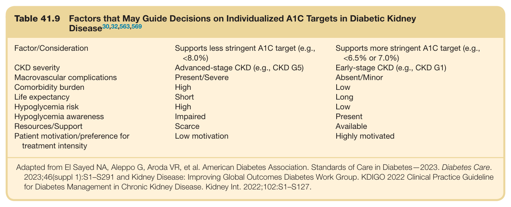

#### Table Data (CSV: [Table_41_9.csv](Table_41_9.csv))

```markdown
| Table Text (OCR) |
| :--- |
| Table 41.9  Factors that May Guide Decisions on Individualized A1C Targets in Diabetic Kidney Disease<sup>30,32,563,569</sup> Factor/Consideration  Supports less stringent A1C target (e.g., <8.0%)  Supports more stringent A1C target (e.g., <6.5% or 7.0%)    CKD severity  Advanced-stage CKD (e.g., CKD G5)  Early-stage CKD (e.g., CKD G1)    Macrovascular complications  Present/Severe  Absent/Minor    Comorbidity burden  High  Low    Life expectancy  Short  Long    Hypoglycemia risk  High  Low    Hypoglycemia awareness  Impaired  Present    Resources/Support  Scarce  Available    Patient motivation/preference for treatment intensity  Low motivation  Highly motivated Adapted from El Sayed NA, Aleppo G, Aroda VR, et al. American Diabetes Association. Standards of Care in Diabetes—2023. Diabetes Care. 2023;46(suppl 1):S1–S291 and Kidney Disease: Improving Global Outcomes Diabetes Work Group. KDIGO 2022 Clinical Practice Guideline for Diabetes Management in Chronic Kidney Disease. Kidney Int. 2022;102:S1–S127. |
```

Table 41.9 Factors that May Guide Decisions on Individualized A1C Targets in Diabetic Kidney Disease<sup>30,32,563,569</sup>

---

### Table_41_10

#### Table Image

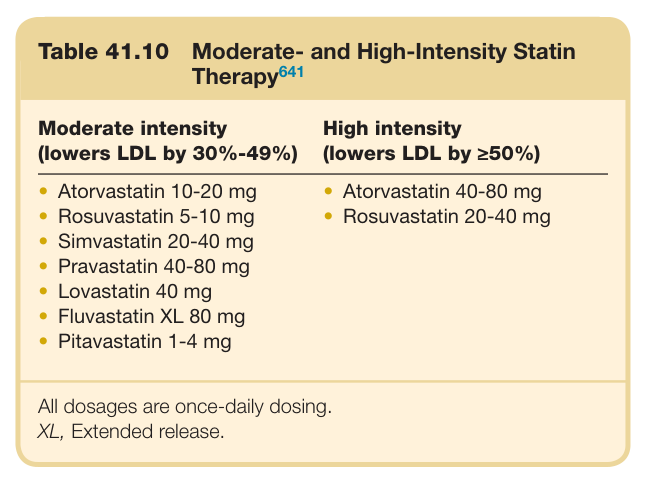

#### Table Data (CSV: [Table_41_10.csv](Table_41_10.csv))

```markdown
| Table Text (OCR) |
| :--- |
| Table 41.10  Moderate- and High-Intensity Statin Therapy<sup>641</sup> Moderate intensity (lowers LDL by 30%-49%)  High intensity (lowers LDL by ≥50%)    Atorvastatin 10-20 mgRosuvastatin 5-10 mgSimvastatin 20-40 mgPravastatin 40-80 mgLovastatin 40 mgFluvastatin XL 80 mgPitavastatin 1-4 mg  Atorvastatin 40-80 mgRosuvastatin 20-40 mg All dosages are once-daily dosing. XL, Extended release. |
```

Table 41.10 Moderate- and High-Intensity Statin Therapy<sup>641</sup>

---
