# 42. Cardiovascular Disease in Persons With Chronic Kidney Disease - Figures and Tables Index

This document lists all figures and tables extracted from `42. Cardiovascular Disease in Persons With Chronic Kidney Disease.pdf`.

## Table of Contents
- [Figures](#figures)
- [Tables](#tables)

---

## Figures

### Fig_42_1

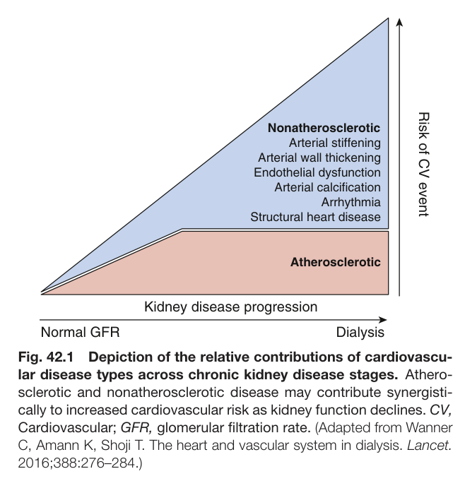

Fig. 42.1 Depiction of the relative contributions of cardiovascu- lar disease types across chronic kidney disease stages. Athero- sclerotic and nonatherosclerotic disease may contribute synergisti- cally to increased cardiovascular risk as kidney function declines. CV, Cardiovascular; GFR, glomerular filtration rate. (Adapted from Wanner C, Amann K, Shoji T. The heart and vascular system in dialysis. Lancet. 2016;388:276–284.)

---

### Fig_42_2

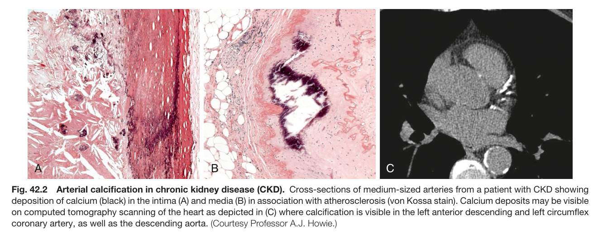

Fig. 42.2 Arterial calcification in chronic kidney disease (CKD). Cross-sections of medium-sized arteries from a patient with CKD showing deposition of calcium (black) in the intima (A) and media (B) in association with atherosclerosis (von Kossa stain). Calcium deposits may be visible on computed tomography scanning of the heart as depicted in (C) where calcification is visible in the left anterior descending and left circumflex coronary artery, as well as the descending aorta. (Courtesy Professor A.J. Howie.)

---

### Fig_42_3

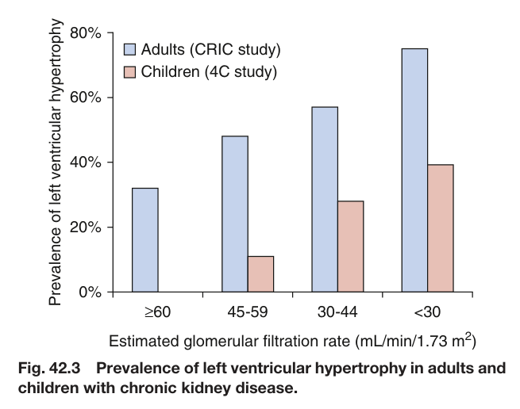

Fig. 42.3 Prevalence of left ventricular hypertrophy in adults and children with chronic kidney disease.

---

### Fig_42_4

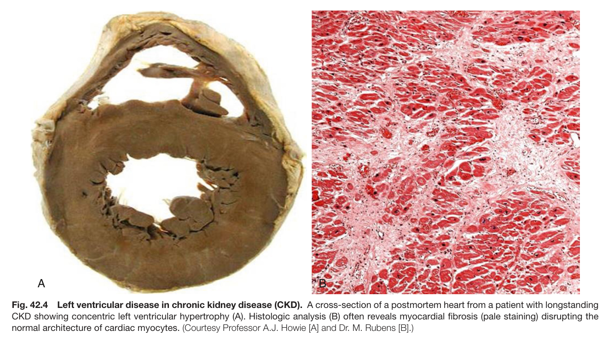

Fig. 42.4 Left ventricular disease in chronic kidney disease (CKD). A cross-section of a postmortem heart from a patient with longstanding CKD showing concentric left ventricular hypertrophy (A). Histologic analysis (B) often reveals myocardial fibrosis (pale staining) disrupting the normal architecture of cardiac myocytes. (Courtesy Professor A.J. Howie [A] and Dr. M. Rubens [B].)

---

### Fig_42_5

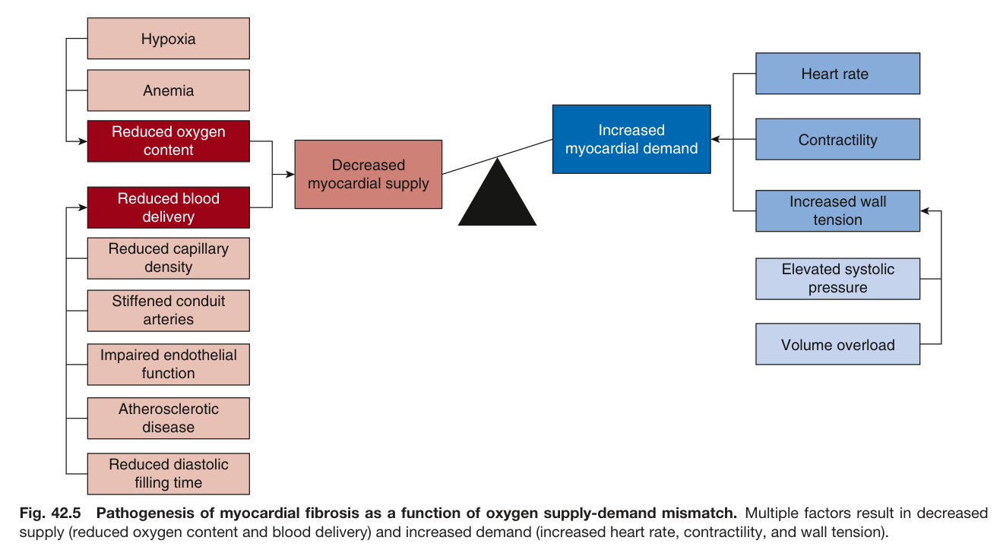

Fig. 42.5 Pathogenesis of myocardial fibrosis as a function of oxygen supply-demand mismatch. Multiple factors result in decreased supply (reduced oxygen content and blood delivery) and increased demand (increased heart rate, contractility, and wall tension).

---

### Fig_42_6

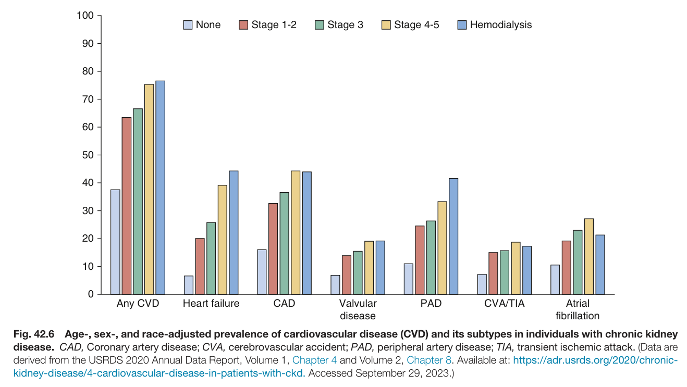

Fig. 42.6 Age-, sex-, and race-adjusted prevalence of cardiovascular disease (CVD) and its subtypes in individuals with chronic kidney disease. CAD, Coronary artery disease; CVA, cerebrovascular accident; PAD, peripheral artery disease; TIA, transient ischemic attack. (Data are derived from the USRDS 2020 Annual Data Report, Volume 1, Chapter 4 and Volume 2, Chapter 8. Available at: https://adr.usrds.org/2020/chronic- kidney-disease/4-cardiovascular-disease-in-patients-with-ckd. Accessed September 29, 2023.)

---

### Fig_42_7

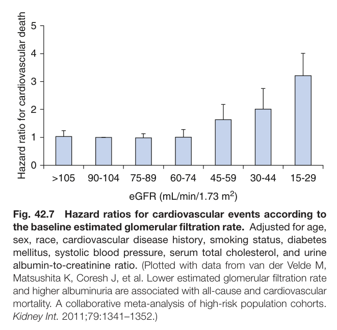

Fig. 42.7 Hazard ratios for cardiovascular events according to the baseline estimated glomerular filtration rate. Adjusted for age, sex, race, cardiovascular disease history, smoking status, diabetes mellitus, systolic blood pressure, serum total cholesterol, and urine albumin-to-creatinine ratio. (Plotted with data from van der Velde M, Matsushita K, Coresh J, et al. Lower estimated glomerular filtration rate and higher albuminuria are associated with all-cause and cardiovascular mortality. A collaborative meta-analysis of high-risk population cohorts. Kidney Int. 2011;79:1341–1352.)

---

### Fig_42_8

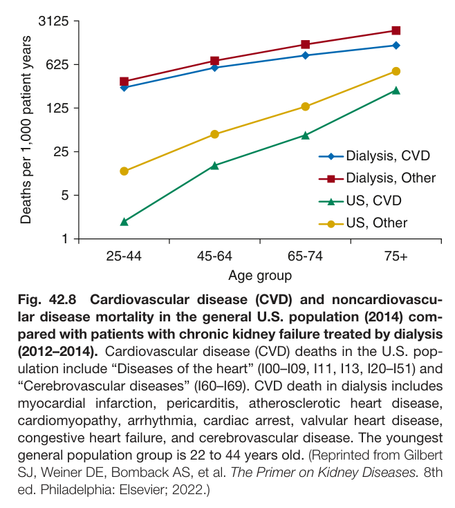

Fig. 42.8 Cardiovascular disease (CVD) and noncardiovascu- lar disease mortality in the general U.S. population (2014) com- pared with patients with chronic kidney failure treated by dialysis (2012–2014). Cardiovascular disease (CVD) deaths in the U.S. pop- ulation include “Diseases of the heart” (I00–I09, I11, I13, I20–I51) and “Cerebrovascular diseases” (I60–I69). CVD death in dialysis includes myocardial infarction, pericarditis, atherosclerotic heart disease, cardiomyopathy, arrhythmia, cardiac arrest, valvular heart disease, congestive heart failure, and cerebrovascular disease. The youngest general population group is 22 to 44 years old. (Reprinted from Gilbert SJ, Weiner DE, Bomback AS, et al. The Primer on Kidney Diseases. 8th ed. Philadelphia: Elsevier; 2022.)

---

### Fig_42_9

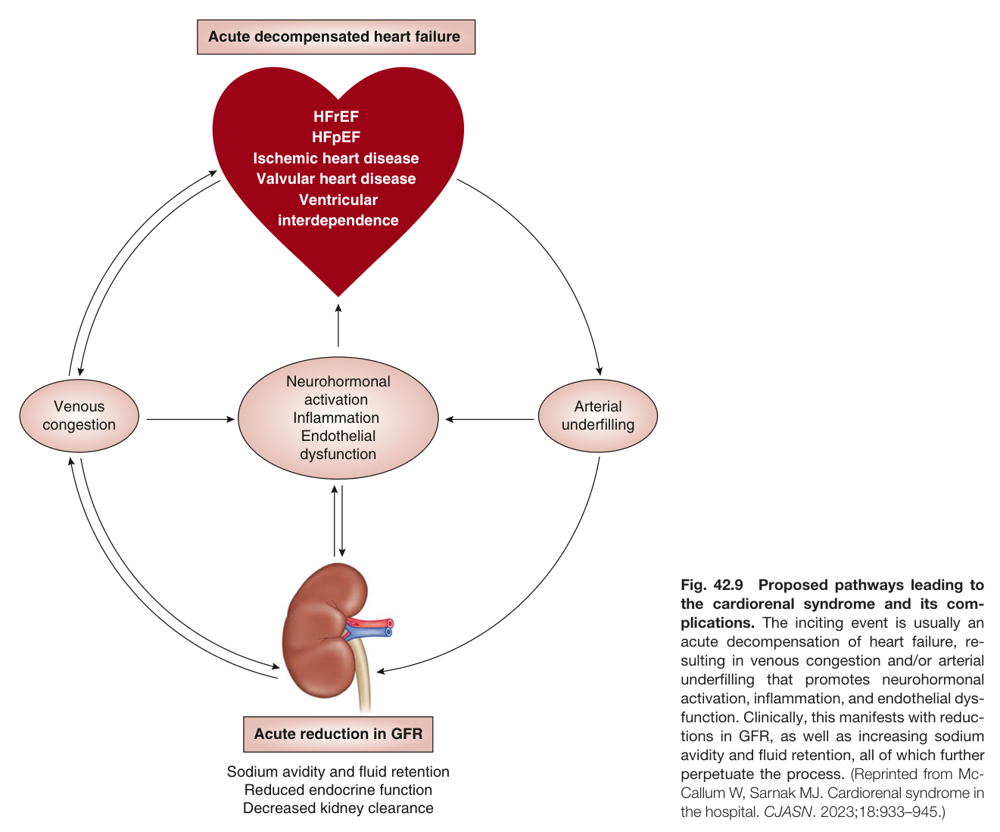

Fig. 42.9 Proposed pathways leading to the cardiorenal syndrome and its com- plications. The inciting event is usually an acute decompensation of heart failure, re- sulting in venous congestion and/or arterial underfilling that promotes neurohormonal activation, inflammation, and endothelial dys- function. Clinically, this manifests with reduc- tions in GFR, as well as increasing sodium avidity and fluid retention, all of which further perpetuate the process. (Reprinted from Mc- Callum W, Sarnak MJ. Cardiorenal syndrome in the hospital. CJASN. 2023;18:933–945.)

---

## Tables

### Table_42_1

#### Table Image

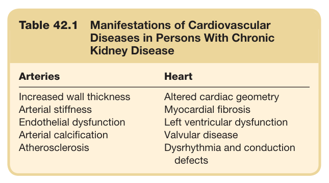

#### Table Data (CSV: [Table_42_1.csv](Table_42_1.csv))

```markdown
| Table Text (OCR) |
| :--- |
| Table 42.1 Manifestations of Cardiovascular Diseases in Persons With Chronic Kidney Disease Arteries  Heart    Increased wall thickness  Altered cardiac geometry    Arterial stiffness  Myocardial fibrosis    Endothelial dysfunction  Left ventricular dysfunction    Arterial calcification  Valvular disease    Atherosclerosis  Dysrhythmia and conduction defects |
```

Table 42.1 Manifestations of Cardiovascular Diseases in Persons With Chronic Kidney Disease

---

### Table_42_2

#### Table Image

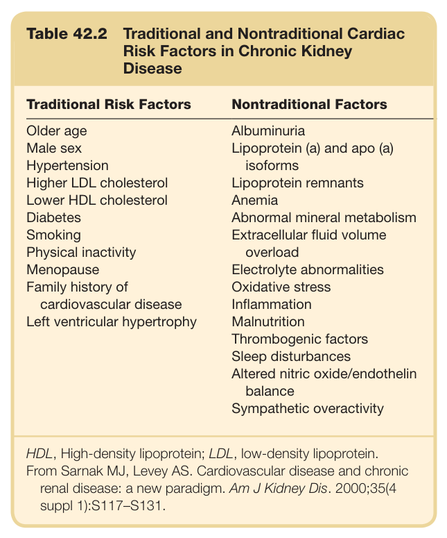

#### Table Data (CSV: [Table_42_2.csv](Table_42_2.csv))

```markdown
| Table Text (OCR) |
| :--- |
| Table 42.2 Traditional and Nontraditional Cardiac Risk Factors in Chronic Kidney Disease Traditional Risk Factors  Nontraditional Factors    Older age  Albuminuria    Male sex  Lipoprotein (a) and apo (a)    Hypertension  isoforms    Higher LDL cholesterol  Lipoprotein remnants    Lower HDL cholesterol  Anemia    Diabetes  Abnormal mineral metabolism    Smoking  Extracellular fluid volume    Physical inactivity  overload    Menopause  Electrolyte abnormalities    Family history of cardiovascular disease  Oxidative stress    Left ventricular hypertrophy  Inflammation      Malnutrition      Thrombogenic factors      Sleep disturbances      Altered nitric oxide/endothelin balance      Sympathetic overactivity HDL, High-density lipoprotein; LDL, low-density lipoprotein. From Sarnak MJ, Levey AS. Cardiovascular disease and chronic renal disease: a new paradigm. Am J Kidney Dis. 2000;35(4 suppl 1):S117–S131. |
```

Table 42.2 Traditional and Nontraditional Cardiac Risk Factors in Chronic Kidney Disease

---

### Table_42_3

#### Table Image

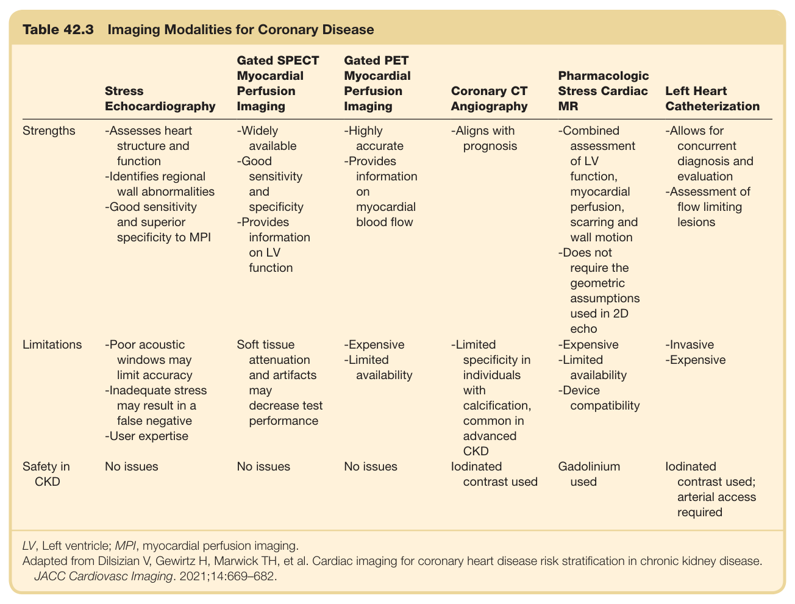

#### Table Data (CSV: [Table_42_3.csv](Table_42_3.csv))

```markdown
| Table Text (OCR) |
| :--- |
| Table 42.3  Imaging Modalities for Coronary Disease Stress Echocardiography  Gated SPECT Myocardial Perfusion Imaging  Gated PET Myocardial Perfusion Imaging  Coronary CT Angiography  Pharmacologic Stress Cardiac MR  Left Heart Catheterization    Strengths  -Assesses heart structure and function-Identifies regional wall abnormalities-Good sensitivity and superior specificity to MPI  -Widely available-Good sensitivity and specificity-Provides information on LV function  -Highly accurate-Provides information on myocardial blood flow  -Aligns with prognosis  -Combined assessment of LV function, myocardial perfusion, scarring and wall motion-Does not require the geometric assumptions used in 2D echo  -Allows for concurrent diagnosis and evaluation-Assessment of flow limiting lesions    Limitations  -Poor acoustic windows may limit accuracy-Inadequate stress may result in a false negative-User expertise  Soft tissue attenuation and artifacts may decrease test performance  -Expensive-Limited availability  -Limited specificity in individuals with calcification, common in advanced CKD  -Expensive-Limited availability-Device compatibility  -Invasive-Expensive    Safety in CKD  No issues  No issues  No issues  lodinated contrast used  Gadolinium used  lodinated contrast used; arterial access required LV, Left ventricle; MPI, myocardial perfusion imaging. Adapted from Dilsizian V, Gewirtz H, Marwick TH, et al. Cardiac imaging for coronary heart disease risk stratification in chronic kidney disease. JACC Cardiovasc Imaging. 2021;14:669–682. |
```

Table 42.3 Imaging Modalities for Coronary Disease

---

### Table_42_4

#### Table Image

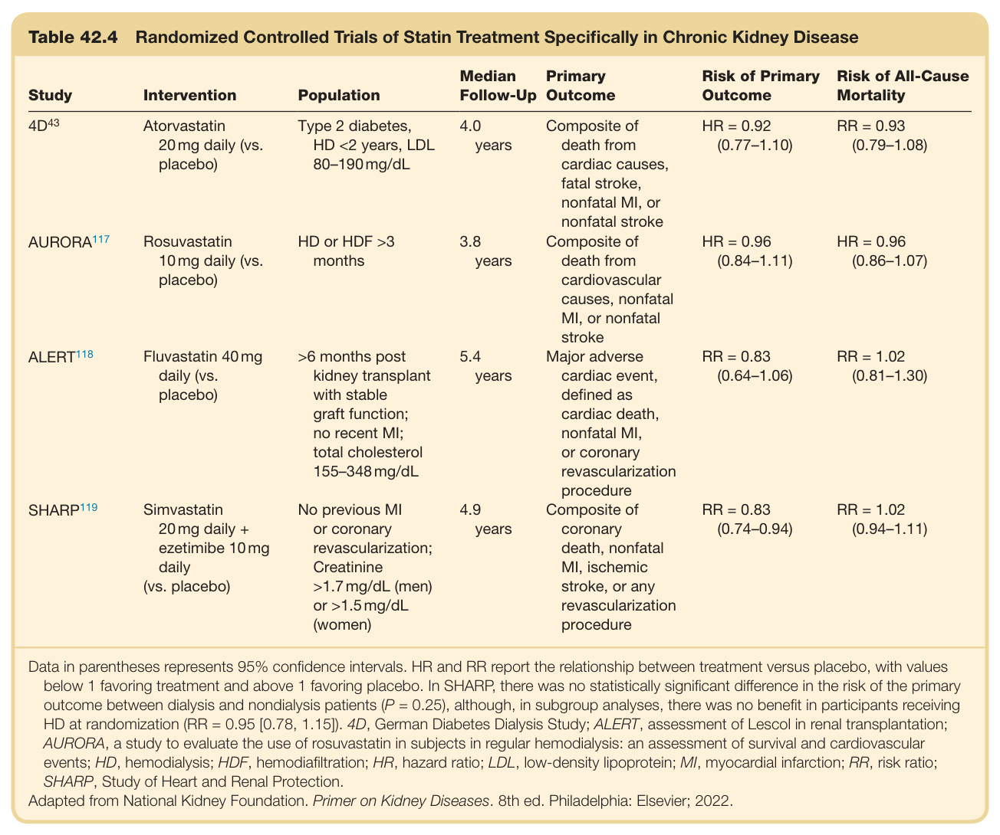

#### Table Data (CSV: [Table_42_4.csv](Table_42_4.csv))

```markdown
| Table Text (OCR) |
| :--- |
| Table 42.4 Randomized Controlled Trials of Statin Treatment Specifically in Chronic Kidney Disease Study  Intervention  Population  Median Follow-Up  Primary Outcome  Risk of Primary Outcome  Risk of All-Cause Mortality     4D^{43}   Atorvastatin 20mg daily (vs. placebo)  Type 2 diabetes, HD <2 years, LDL 80-190 mg/dL  4.0 years  Composite of death from cardiac causes, fatal stroke, nonfatal MI, or nonfatal stroke  HR = 0.92 (0.77-1.10)  RR = 0.93 (0.79-1.08)     AURORA^{117}   Rosuvastatin 10mg daily (vs. placebo)  HD or HDF >3 months  3.8 years  Composite of death from cardiovascular causes, nonfatal MI, or nonfatal stroke  HR = 0.96 (0.84-1.11)  HR = 0.96 (0.86-1.07)     ALERT^{118}   Fluvastatin 40mg daily (vs. placebo)  >6 months post kidney transplant with stable graft function; no recent MI; total cholesterol 155-348 mg/dL  5.4 years  Major adverse cardiac event, defined as cardiac death, nonfatal MI, or coronary revascularization procedure  RR = 0.83 (0.64-1.06)  RR = 1.02 (0.81-1.30)     SHARP^{119}   Simvastatin 20mg daily + ezetimibe 10mg daily (vs. placebo)  No previous MI or coronary revascularization; Creatinine >1.7 mg/dL (men) or >1.5 mg/dL (women)  4.9 years  Composite of coronary death, nonfatal MI, ischemic stroke, or any revascularization procedure  RR = 0.83 (0.74-0.94)  RR = 1.02 (0.94-1.11) Data in parentheses represents 95% confidence intervals. HR and RR report the relationship between treatment versus placebo, with values below 1 favoring treatment and above 1 favoring placebo. In SHARP, there was no statistically significant difference in the risk of the primary outcome between dialysis and nondialysis patients (P = 0.25), although, in subgroup analyses, there was no benefit in participants receiving HD at randomization (RR = 0.95 [0.78, 1.15]). 4D, German Diabetes Dialysis Study; ALERT, assessment of Lescol in renal transplantation; AURORA, a study to evaluate the use of rosuvastatin in subjects in regular hemodialysis: an assessment of survival and cardiovascular events; HD, hemodialysis; HDF, hemodiafiltration; HR, hazard ratio; LDL, low-density lipoprotein; MI, myocardial infarction; RR, risk ratio; SHARP, Study of Heart and Renal Protection. Adapted from National Kidney Foundation. Primer on Kidney Diseases. 8th ed. Philadelphia: Elsevier; 2022. |
```

Table 42.4 Randomized Controlled Trials of Statin Treatment Specifically in Chronic Kidney Disease

---
