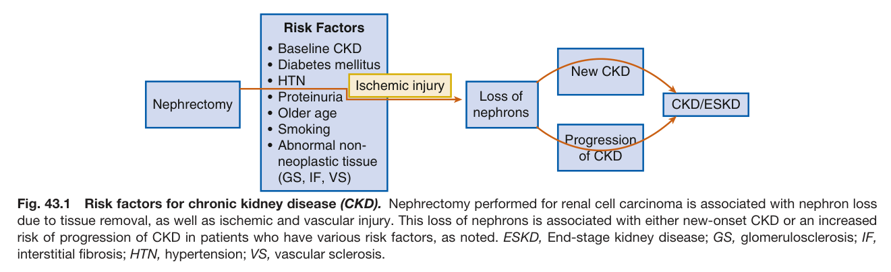
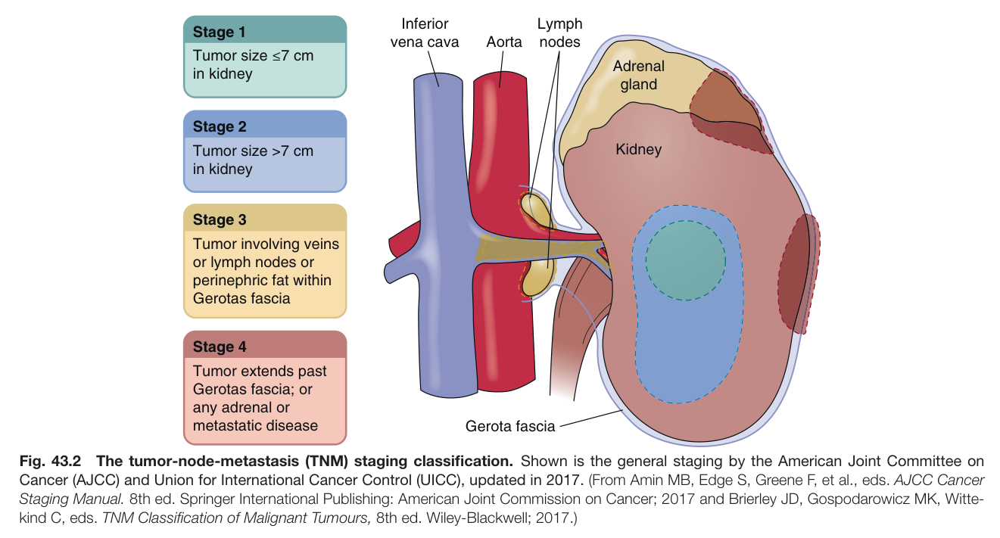
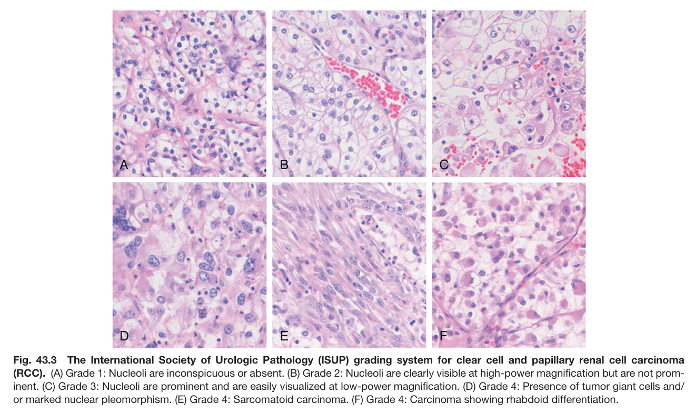
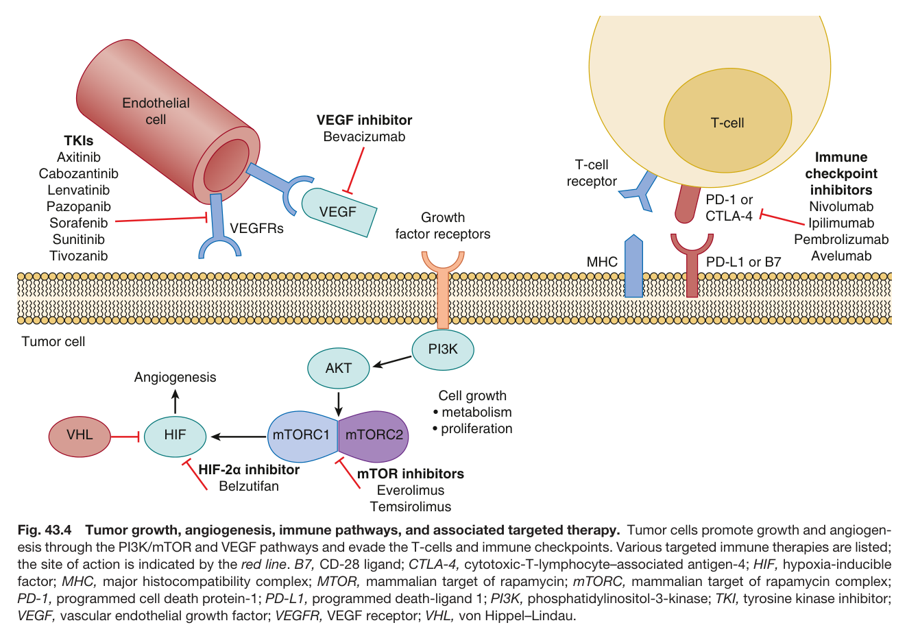
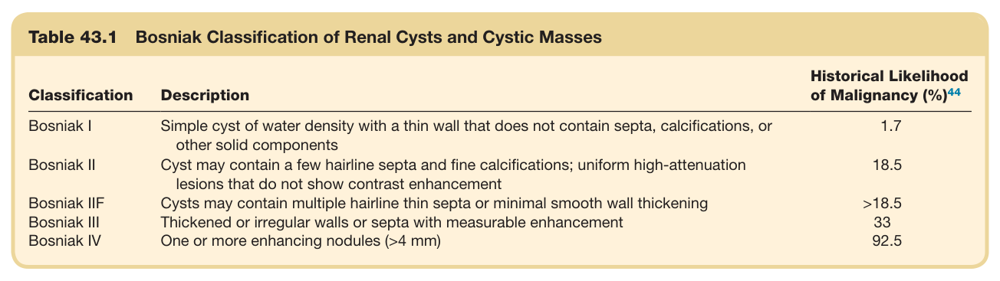
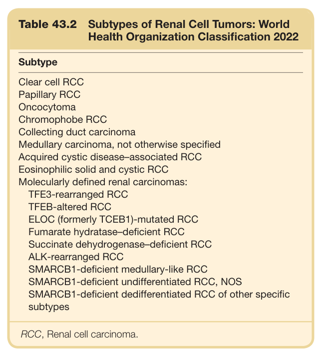

# 43. Kidney Cancer - Figures and Tables Index

This document lists all figures and tables extracted from `43. Kidney Cancer.pdf`.

## Table of Contents
- [Figures](#figures)
- [Tables](#tables)

---

## Figures

### Fig_43_1



Fig. 43.1 Risk factors for chronic kidney disease (CKD). Nephrectomy performed for renal cell carcinoma is associated with nephron loss due to tissue removal, as well as ischemic and vascular injury. This loss of nephrons is associated with either new-onset CKD or an increased risk of progression of CKD in patients who have various risk factors, as noted. ESKD, End-stage kidney disease; GS, glomerulosclerosis; IF, interstitial fibrosis; HTN, hypertension; VS, vascular sclerosis.

---

### Fig_43_2



Fig. 43.2 The tumor-node-metastasis (TNM) staging classification. Shown is the general staging by the American Joint Committee on Cancer (AJCC) and Union for International Cancer Control (UICC), updated in 2017. (From Amin MB, Edge S, Greene F, et al., eds. AJCC Cancer Staging Manual. 8th ed. Springer International Publishing: American Joint Commission on Cancer; 2017 and Brierley JD, Gospodarowicz MK, Witte kind C, eds. TNM Classification of Malignant Tumours, 8th ed. Wiley-Blackwell; 2017.)

---

### Fig_43_3



Fig. 43.3 The International Society of Urologic Pathology (ISUP) grading system for clear cell and papillary renal cell carcinoma (RCC). (A) Grade 1: Nucleoli are inconspicuous or absent. (B) Grade 2: Nucleoli are clearly visible at high-power magnification but are not prom- inent. (C) Grade 3: Nucleoli are prominent and are easily visualized at low-power magnification. (D) Grade 4: Presence of tumor giant cells and/ or marked nuclear pleomorphism. (E) Grade 4: Sarcomatoid carcinoma. (F) Grade 4: Carcinoma showing rhabdoid differentiation.

---

### Fig_43_4



Fig. 43.4 Tumor growth, angiogenesis, immune pathways, and associated targeted therapy. Tumor cells promote growth and angiogen esis through the PI3K/mTOR and VEGF pathways and evade the T-cells and immune checkpoints. Various targeted immune therapies are listed; the site of action is indicated by the red line. B7, CD-28 ligand; CTLA-4, cytotoxic-T-lymphocyte–associated antigen-4; HIF, hypoxia-inducible factor; MHC, major histocompatibility complex; MTOR, mammalian target of rapamycin; mTORC, mammalian target of rapamycin complex; PD-1, programmed cell death protein-1; PD-L1, programmed death-ligand 1; PI3K, phosphatidylinositol-3-kinase; TKI, tyrosine kinase inhibitor; VEGF, vascular endothelial growth factor; VEGFR, VEGF receptor; VHL, von Hippel–Lindau.

---

## Tables

### Table_43_1

#### Table Image



#### Table Data (CSV: [Table_43_1.csv](Table_43_1.csv))

```markdown
| Table Text (OCR) |
| :--- |
| Table 43.1  Bosniak Classification of Renal Cysts and Cystic Masses Classification  Description  Historical Likelihood of Malignancy (%)44    Bosniak I  Simple cyst of water density with a thin wall that does not contain septa, calcifications, or other solid components  1.7    Bosniak II  Cyst may contain a few hairline septa and fine calcifications; uniform high-attenuation lesions that do not show contrast enhancement  18.5    Bosniak IIF  Cysts may contain multiple hairline thin septa or minimal smooth wall thickening  >18.5    Bosniak III  Thickened or irregular walls or septa with measurable enhancement  33    Bosniak IV  One or more enhancing nodules (>4 mm)  92.5 |
```

Table 43.1 Bosniak Classification of Renal Cysts and Cystic Masses

---

### Table_43_2

#### Table Image



#### Table Data (CSV: [Table_43_2.csv](Table_43_2.csv))

```markdown
| Table Text (OCR) |
| :--- |
| Table 43.2 Subtypes of Renal Cell Tumors: World Health Organization Classification 2022 Subtype    Clear cell RCC    Papillary RCC    Oncocytoma    Chromophobe RCC    Collecting duct carcinoma    Medullary carcinoma, not otherwise specified    Acquired cystic disease–associated RCC    Eosinophilic solid and cystic RCC    Molecularly defined renal carcinomas:    TFE3-rearranged RCC    TFEB-altered RCC    ELOC (formerly TCEB1)-mutated RCC    Fumarate hydratase–deficient RCC    Succinate dehydrogenase–deficient RCC    ALK-rearranged RCC    SMARCB1-deficient medullary-like RCC    SMARCB1-deficient undifferentiated RCC, NOS    SMARCB1-deficient dedifferentiated RCC of other specific subtypes    RCC, Renal cell carcinoma. |
```

Table 43.2 Subtypes of Renal Cell Tumors: World Health Organization Classification 2022

---
