# 44. Genetics of Kidney Disease - Figures and Tables Index

This document lists all figures, tables and boxes extracted from `44. Genetics of Kidney Disease.pdf`.

## Table of Contents
- [Figures](#figures)
- [Tables](#tables)
- [Boxes](#boxes)

---

## Figures

### Fig_44_1

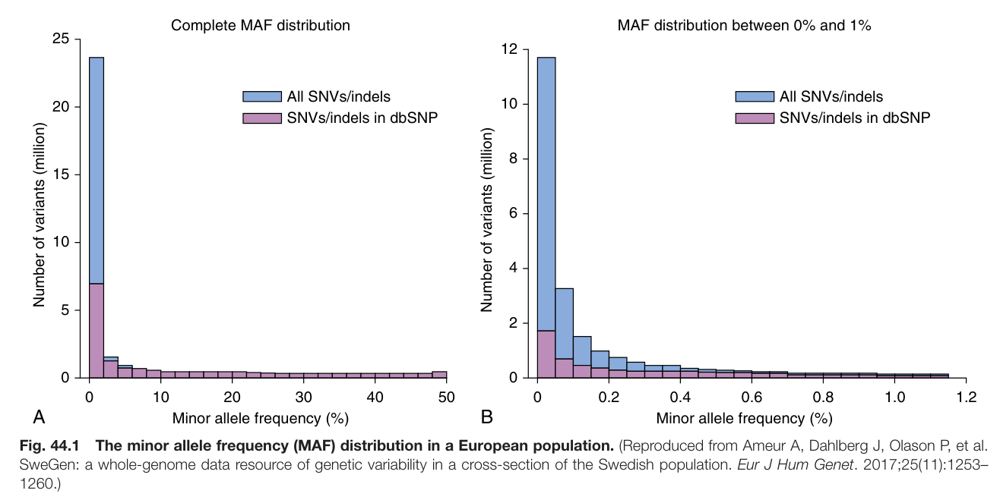

Fig. 44.1 The minor allele frequency (MAF) distribution in a European population. (Reproduced from Ameur A, Dahlberg J, Olason P, et al. SweGen: a whole-genome data resource of genetic variability in a cross-section of the Swedish population. Eur J Hum Genet. 2017;25(11):1253– 1260.)

---

### Fig_44_2

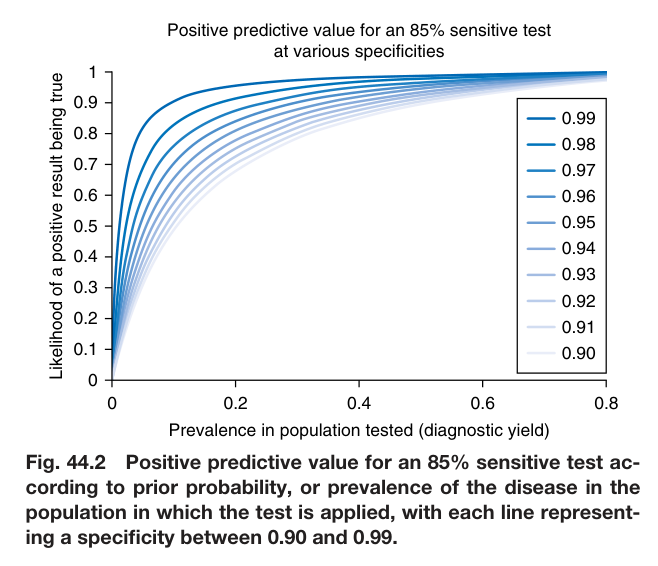

Fig. 44.2 Positive predictive value for an 85% sensitive test ac- cording to prior probability, or prevalence of the disease in the population in which the test is applied, with each line represent- ing a specificity between 0.90 and 0.99.

---

### Fig_44_3

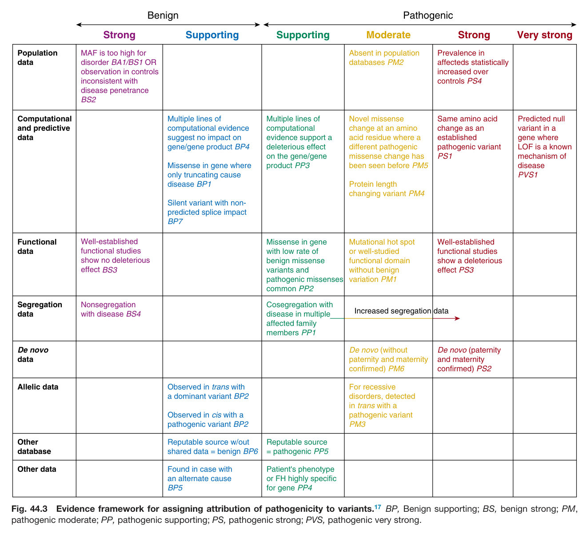

Fig. 44.3 Evidence framework for assigning attribution of pathogenicity to variants.<sup>17</sup> BP, Benign supporting; BS, benign strong; PM, pathogenic moderate; PP, pathogenic supporting; PS, pathogenic strong; PVS, pathogenic very strong.

---

### Fig_44_4

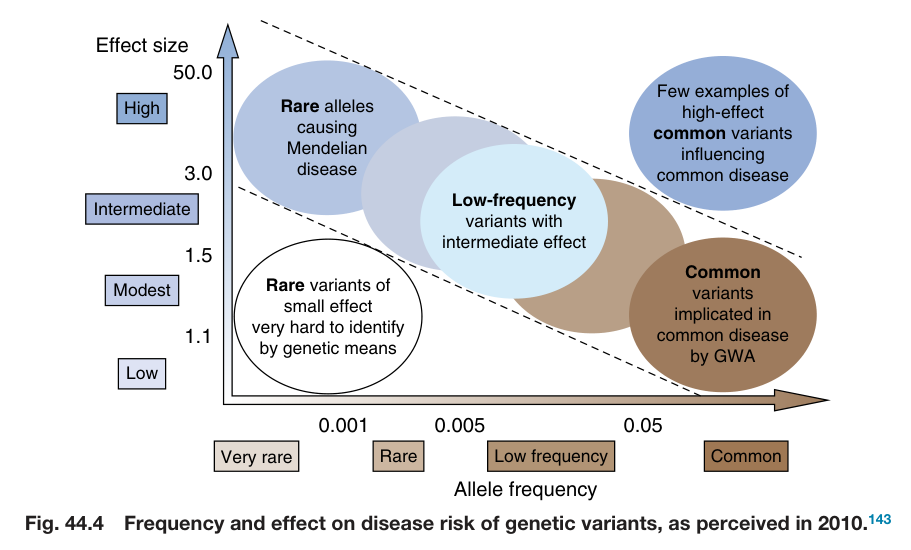

Fig. 44.4 Frequency and effect on disease risk of genetic variants, as perceived in 2010.<sup>143</sup>

---

### Fig_44_5

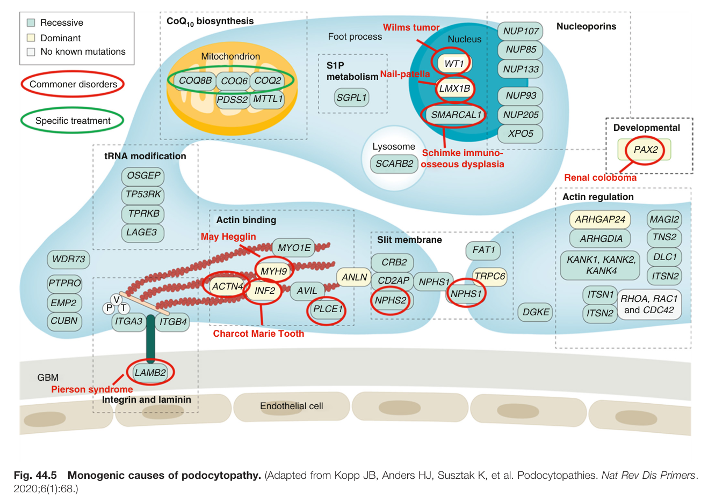

Fig. 44.5 Monogenic causes of podocytopathy. (Adapted from Kopp JB, Anders HJ, Susztak K, et al. Podocytopathies. Nat Rev Dis Primers. 2020;6(1):68.)

---

### Fig_44_6

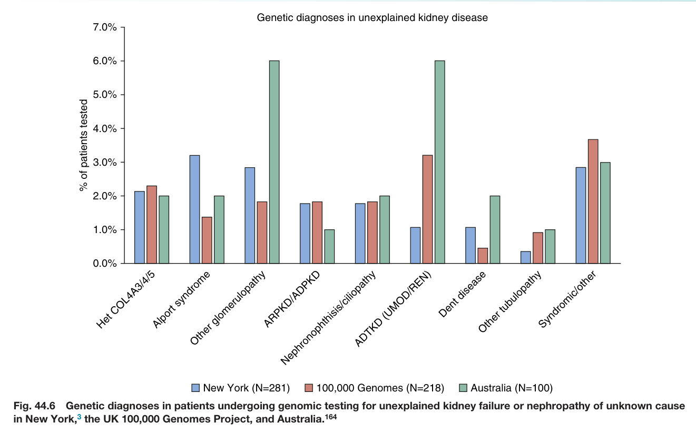

Fig. 44.6 Genetic diagnoses in patients undergoing genomic testing for unexplained kidney failure or nephropathy of unknown cause in New York,<sup>3</sup> the UK 100,000 Genomes Project, and Australia.<sup>164</sup>

---

## Tables

### Table_44_1

#### Table Image

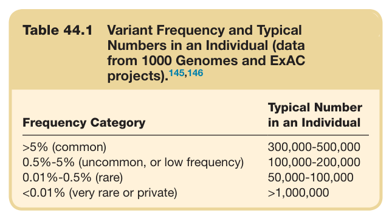

#### Table Data (CSV: [Table_44_1.csv](Table_44_1.csv))

```markdown
| Table Text (OCR) |
| :--- |
| Table 44.1 Variant Frequency and Typical Numbers in an Individual (data from 1000 Genomes and ExAC projects).<sup>145,146</sup> Frequency Category  Typical Number in an Individual    >5% (common)  300,000-500,000    0.5%-5% (uncommon, or low frequency)  100,000-200,000    0.01%-0.5% (rare)  50,000-100,000    <0.01% (very rare or private)  >1,000,000 |
```

Table 44.1 Variant Frequency and Typical Numbers in an Individual (data from 1000 Genomes and ExAC projects).<sup>145,146</sup>

---

### Table_44_2

#### Table Image

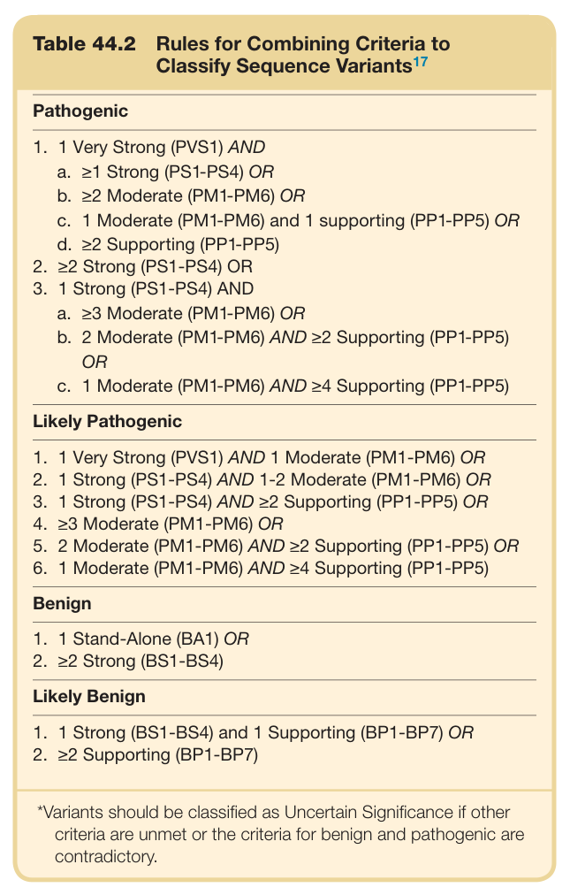

#### Table Data (CSV: [Table_44_2.csv](Table_44_2.csv))

```markdown
| Table Text (OCR) |
| :--- |
| Table 44.2  Rules for Combining Criteria to Classify Sequence Variants<sup>17</sup> Pathogenic 1. 1 Very Strong (PVS1) AND    a. ≥1 Strong (PS1-PS4) OR    b. ≥2 Moderate (PM1-PM6) OR    c. 1 Moderate (PM1-PM6) and 1 supporting (PP1-PP5) OR    d. ≥2 Supporting (PP1-PP5)    2. ≥2 Strong (PS1-PS4) OR    3. 1 Strong (PS1-PS4) AND    a. ≥3 Moderate (PM1-PM6) OR    b. 2 Moderate (PM1-PM6) AND ≥2 Supporting (PP1-PP5) OR    c. 1 Moderate (PM1-PM6) AND ≥4 Supporting (PP1-PP5) |
```

Table 44.2 Rules for Combining Criteria to Classify Sequence Variants<sup>17</sup>

---

### Table_44_3

#### Table Image

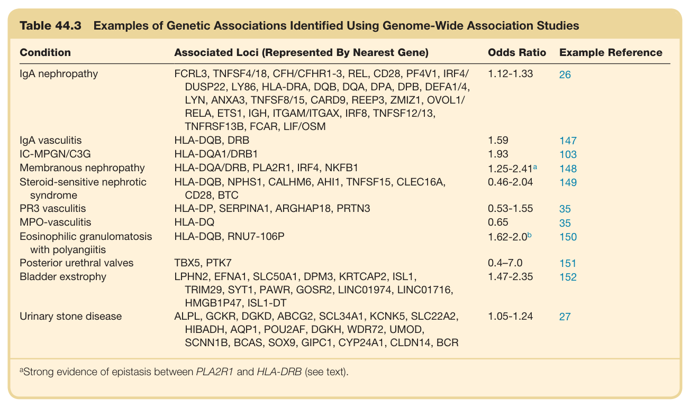

#### Table Data (CSV: [Table_44_3.csv](Table_44_3.csv))

```markdown
| Table Text (OCR) |
| :--- |
| Table 44.3 Examples of Genetic Associations Identified Using Genome-Wide Association Studies Condition  Associated Loci (Represented By Nearest Gene)  Odds Ratio  Example Reference    IgA nephropathy  FCRL3, TNFSF4/18, CFH/CFHR1-3, REL, CD28, PF4V1, IRF4/DUSP22, LY86, HLA-DRA, DQB, DQA, DPA, DPB, DEFA1/4,LYN, ANXA3, TNFSF8/15, CARD9, REEP3, ZMIZ1, OVOL1/RELA, ETS1, IGH, ITGAM/ITGAX, IRF8, TNFSF12/13,TNFRSF13B, FCAR, LIF/OSM  1.12-1.33  26    IgA vasculitis  HLA-DQB, DRB  1.59  147    IC-MPGN/C3G  HLA-DQA1/DRB1  1.93  103    Membranous nephropathy  HLA-DQA/DRB, PLA2R1, IRF4, NKFB1   1.25-2.41^a   148    Steroid-sensitive nephroticsyndrome  HLA-DQB, NPHS1, CALHM6, AHI1, TNFSF15, CLEC16A,CD28, BTC  0.46-2.04  149    PR3 vasculitis  HLA-DP, SERPINA1, ARGHAP18, PRTN3  0.53-1.55  35    MPO-vasculitis  HLA-DQ  0.65  35    Eosinophilic granulomatosiswith polyangiitis  HLA-DQB, RNU7-106P   1.62-2.0^b   150    Posterior urethral valves  TBX5, PTK7  0.4-7.0  151    Bladder exstrophy  LPHN2, EFNA1, SLC50A1, DPM3, KRTCAP2, ISL1,TRIM29, SYT1, PAWR, GOSR2, LINC01974, LINC01716,HMGB1P47, ISL1-DT  1.47-2.35  152    Urinary stone disease  ALPL, GCKR, DGKD, ABCG2, SCL34A1, KCNK5, SLC22A2,HIBADH, AQP1, POU2AF, DGKH, WDR72, UMOD,SCNN1B, BCAS, SOX9, GIPC1, CYP24A1, CLDN14, BCR  1.05-1.24  27 <sup>a</sup>Strong evidence of epistasis between PLA2R1 and HLA-DRB (see text). |
```

Table 44.3 Examples of Genetic Associations Identified Using Genome-Wide Association Studies

---

### Table_44_4

#### Table Image

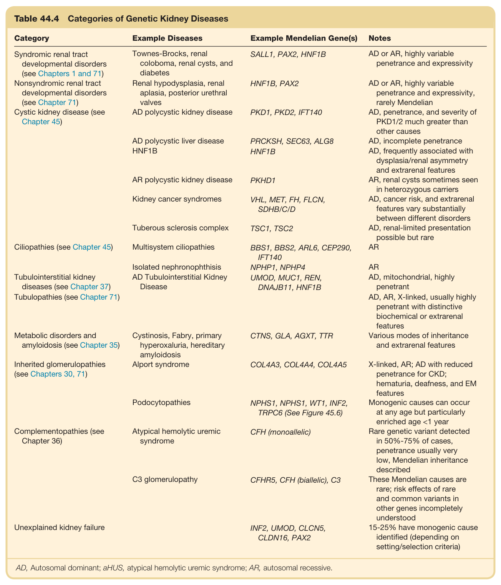

#### Table Data (CSV: [Table_44_4.csv](Table_44_4.csv))

```markdown
| Table Text (OCR) |
| :--- |
| Table 44.4  Categories of Genetic Kidney Diseases Category  Example Diseases  Example Mendelian Gene(s)  Notes    Syndromic renal tract developmental disorders (see Chapters 1 and 71)  Townes-Brocks, renal coloboma, renal cysts, and diabetes  SALL1, PAX2, HNF1B  AD or AR, highly variable penetrance and expressivity    Nonsyndromic renal tract developmental disorders (see Chapter 71)  Renal hypodysplasia, renal aplasia, posterior urethral valves  HNF1B, PAX2  AD or AR, highly variable penetrance and expressivity, rarely Mendelian    Cystic kidney disease (see Chapter 45)  AD polycystic kidney disease  PKD1, PKD2, IFT140  AD, penetrance, and severity of PKD1/2 much greater than other causes    AD polycystic liver disease  PRCKSH, SEC63, ALG8  AD, incomplete penetrance    HNF1B  HNF1B  AD, frequently associated with dysplasia/renal asymmetry and extrarenal features    AR polycystic kidney disease  PKHD1  AR, renal cysts sometimes seen in heterozygous carriers    Kidney cancer syndromes  VHL, MET, FH, FLCN, SDHB/C/D  AD, cancer risk, and extrarenal features vary substantially between different disorders    Tuberous sclerosis complex  TSC1, TSC2  AD, renal-limited presentation possible but rare    Ciliopathies (see Chapter 45)  Multisystem ciliopathies  BBS1, BBS2, ARL6, CEP290, IFT140  AR    Isolated nephronophthisis  NPHP1, NPHP4  AR    Tubulointerstitial kidney diseases (see Chapter 37)  AD Tubulointerstitial Kidney Disease  UMOD, MUC1, REN, DNAJB11, HNF1B  AD, mitochondrial, highly penetrant    Tubulopathies (see Chapter 71)  AD, AR, X-linked, usually highly penetrant with distinctive biochemical or extrarenal features    Metabolic disorders and amyloidosis (see Chapter 35)  Cystinosis, Fabry, primary hyperoxaluria, hereditary amyloidosis  CTNS, GLA, AGXT, TTR  Various modes of inheritance and extrarenal features    Inherited glomerulopathies (see Chapters 30, 71)  Alport syndrome  COL4A3, COL4A4, COL4A5  X-linked, AR; AD with reduced penetrance for CKD; hematuria, deafness, and EM features    Podocytopathies  NPHS1, NPHS1, WT1, INF2, TRPC6 (See Figure 45.6)  Monogenic causes can occur at any age but particularly enriched age <1 year    Complementopathies (see Chapter 36)  Atypical hemolytic uremic syndrome  CFH (monoallelic)  Rare genetic variant detected in 50%-75% of cases, penetrance usually very low, Mendelian inheritance described    C3 glomerulopathy  CFHR5, CFH (biallelic), C3  These Mendelian causes are rare; risk effects of rare and common variants in other genes incompletely understood    Unexplained kidney failure    INF2, UMOD, CLCN5, CLDN16, PAX2  15-25% have monogenic cause identified (depending on setting/selection criteria) AD, Autosomal dominant; aHUS, atypical hemolytic uremic syndrome; AR, autosomal recessive. |
```

Table 44.4 Categories of Genetic Kidney Diseases

---

### Table_44_5

#### Table Image

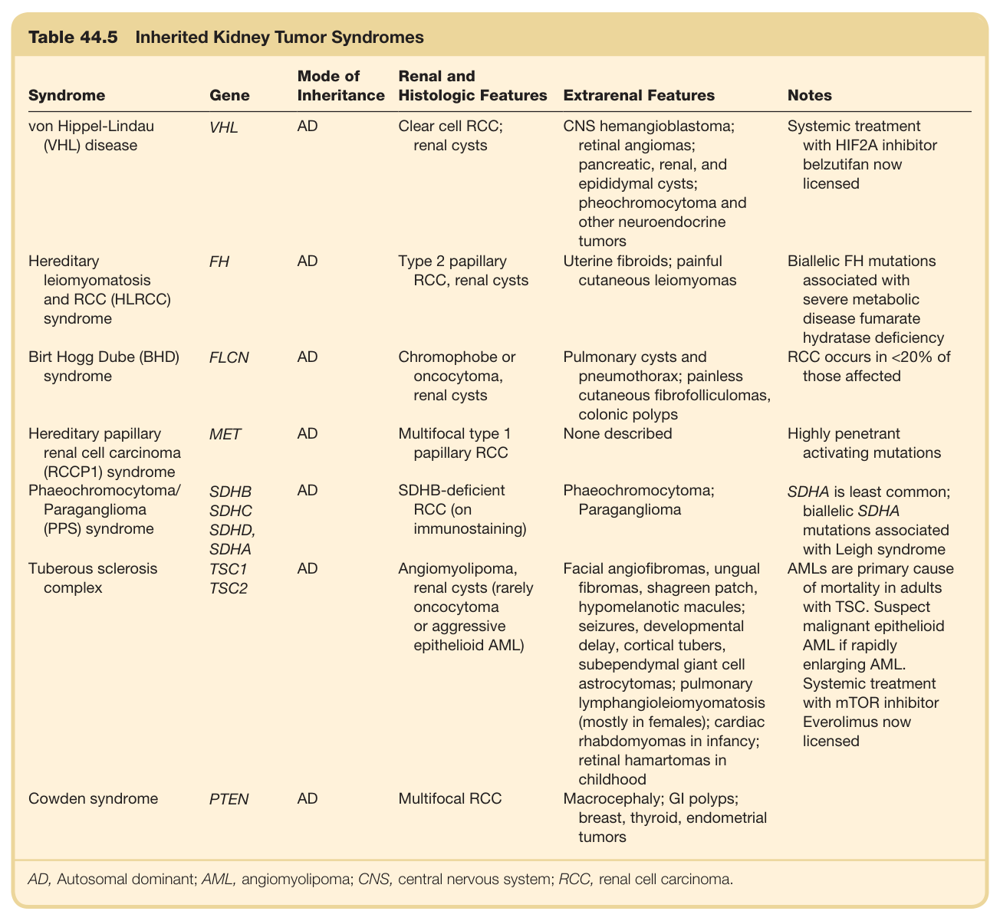

#### Table Data (CSV: [Table_44_5.csv](Table_44_5.csv))

```markdown
| Table Text (OCR) |
| :--- |
| Table 44.5  Inherited Kidney Tumor Syndromes Syndrome  Gene  Mode of Inheritance  Renal and Histologic Features  Extrarenal Features  Notes    von Hippel-Lindau (VHL) disease  VHL  AD  Clear cell RCC; renal cysts  CNS hemangioblastoma; retinal angiomas; pancreatic, renal, and epididymal cysts; pheochromocytoma and other neuroendocrine tumors  Systemic treatment with HIF2A inhibitor belzutifan now licensed    Hereditary leiomyomatosis and RCC (HLRCC) syndrome  FH  AD  Type 2 papillary RCC, renal cysts  Uterine fibroids; painful cutaneous leiomyomas  Biallelic FH mutations associated with severe metabolic disease fumarate hydratase deficiency    Birt Hogg Dube (BHD) syndrome  FLCN  AD  Chromophobe or oncocytoma, renal cysts  Pulmonary cysts and pneumothorax; painless cutaneous fibrofolliculomas, colonic polyps  RCC occurs in <20% of those affected    Hereditary papillary renal cell carcinoma (RCCP1) syndrome  MET  AD  Multifocal type 1 papillary RCC  None described  Highly penetrant activating mutations    Phaeochromocytoma/ Paraganglioma (PPS) syndrome  SDHB SDHC SDHD, SDHA  AD  SDHB-deficient RCC (on immunostaining)  Phaeochromocytoma; Paraganglioma  SDHA is least common; biallelic SDHA mutations associated with Leigh syndrome    Tuberous sclerosis complex  TSC1 TSC2  AD  Angiomyolipoma, renal cysts (rarely oncocytoma or aggressive epithelioid AML)  Facial angiofibromas, ungual fibromas, shagreen patch, hypomelanotic macules; seizures, developmental delay, cortical tubers, subependymal giant cell astrocytomas; pulmonary lymphangioleiomyomatosis (mostly in females); cardiac rhabdomyomas in infancy; retinal hamartomas in childhood  AMLs are primary cause of mortality in adults with TSC. Suspect malignant epithelioid AML if rapidly enlarging AML. Systemic treatment with mTOR inhibitor Everolimus now licensed    Cowden syndrome  PTEN  AD  Multifocal RCC  Macrocephaly; GI polyps; breast, thyroid, endometrial tumors AD, Autosomal dominant; AML, angiomyolipoma; CNS, central nervous system; RCC, renal cell carcinoma. |
```

Table 44.5 Inherited Kidney Tumor Syndromes

---

## Boxes

### Box_44_1

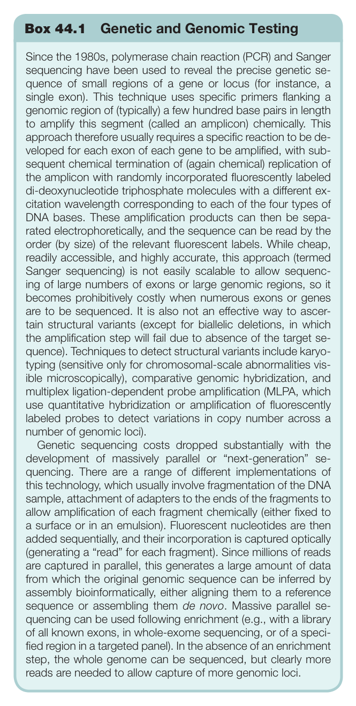

#### Box Text

```markdown
Box 44.1 Genetic and Genomic Testing Since the 1980s, polymerase chain reaction (PCR) and Sanger sequencing have been used to reveal the precise genetic se- quence of small regions of a gene or locus (for instance, a single exon). This technique uses specific primers flanking a genomic region of (typically) a few hundred base pairs in length to amplify this segment (called an amplicon) chemically. This approach therefore usually requires a specific reaction to be de- veloped for each exon of each gene to be amplified, with sub- sequent chemical termination of (again chemical) replication of the amplicon with randomly incorporated fluorescently labeled di-deoxynucleotide triphosphate molecules with a different ex- citation wavelength corresponding to each of the four types of DNA bases. These amplification products can then be sepa- rated electrophoretically, and the sequence can be read by the order (by size) of the relevant fluorescent labels. While cheap, readily accessible, and highly accurate, this approach (termed Sanger sequencing) is not easily scalable to allow sequenc- ing of large numbers of exons or large genomic regions, so it becomes prohibitively costly when numerous exons or genes are to be sequenced. It is also not an effective way to ascer- tain structural variants (except for biallelic deletions, in which the amplification step will fail due to absence of the target se- quence). Techniques to detect structural variants include karyo- typing (sensitive only for chromosomal-scale abnormalities vis- ible microscopically), comparative genomic hybridization, and multiplex ligation-dependent probe amplification (MLPA, which use quantitative hybridization or amplification of fluorescently labeled probes to detect variations in copy number across a number of genomic loci). Genetic sequencing costs dropped substantially with the development of massively parallel or “next-generation” se- quencing. There are a range of different implementations of this technology, which usually involve fragmentation of the DNA sample, attachment of adapters to the ends of the fragments to allow amplification of each fragment chemically (either fixed to a surface or in an emulsion). Fluorescent nucleotides are then added sequentially, and their incorporation is captured optically (generating a “read” for each fragment). Since millions of reads are captured in parallel, this generates a large amount of data from which the original genomic sequence can be inferred by assembly bioinformatically, either aligning them to a reference sequence or assembling them de novo. Massive parallel se- quencing can be used following enrichment (e.g., with a library of all known exons, in whole-exome sequencing, or of a speci- fied region in a targeted panel). In the absence of an enrichment step, the whole genome can be sequenced, but clearly more reads are needed to allow capture of more genomic loci.
```

Box 44.1 Genetic and Genomic Testing

---

### Box_44_2

#### Box Images (2 Parts)

- **Part 1 (Page 18)**:
  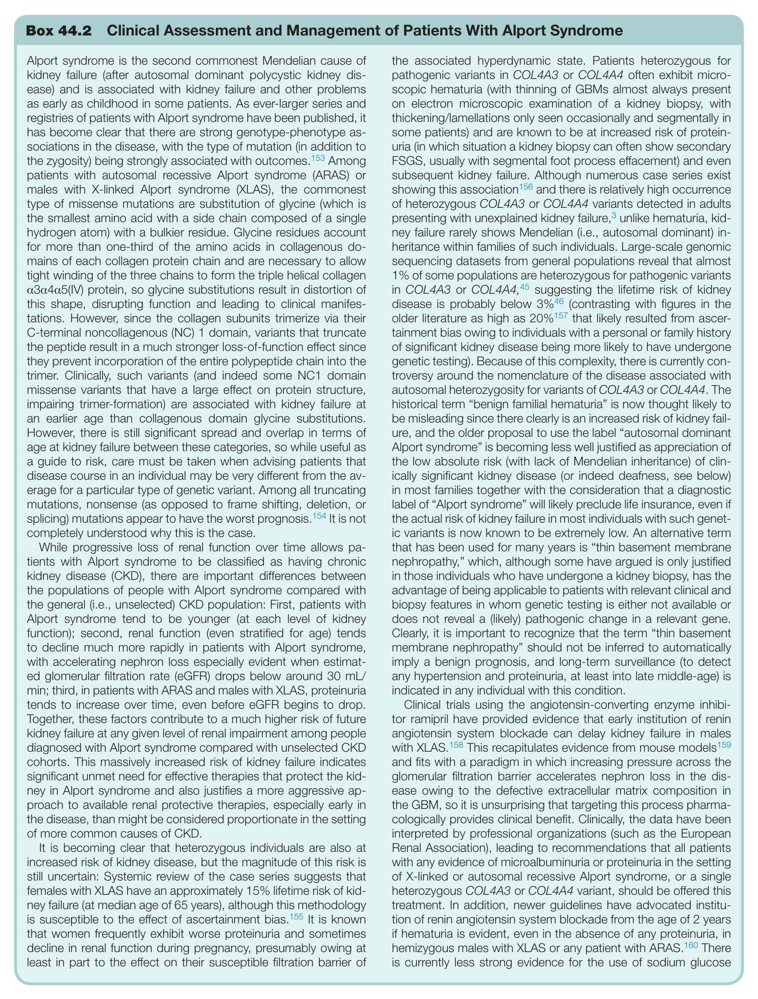

- **Part 2 (Page 19)**:
  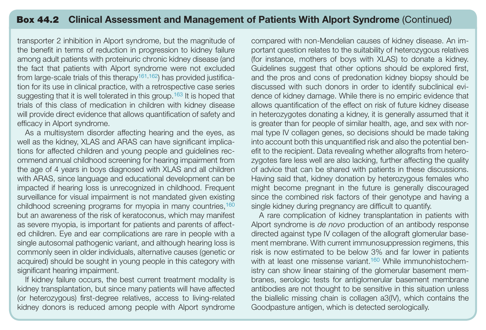

#### Box Text

```markdown
Box 44.2 Clinical Assessment and Management of Patients With Alport Syndrome Alport syndrome is the second commonest Mendelian cause of kidney failure (after autosomal dominant polycystic kidney dis- ease) and is associated with kidney failure and other problems as early as childhood in some patients. As ever-larger series and registries of patients with Alport syndrome have been published, it has become clear that there are strong genotype-phenotype as- sociations in the disease, with the type of mutation (in addition to the zygosity) being strongly associated with outcomes.<sup>153</sup> Among patients with autosomal recessive Alport syndrome (ARAS) or males with X-linked Alport syndrome (XLAS), the commonest type of missense mutations are substitution of glycine (which is the smallest amino acid with a side chain composed of a single hydrogen atom) with a bulkier residue. Glycine residues account for more than one-third of the amino acids in collagenous do- mains of each collagen protein chain and are necessary to allow tight winding of the three chains to form the triple helical collagen α3α4α5(IV) protein, so glycine substitutions result in distortion of this shape, disrupting function and leading to clinical manifes- tations. However, since the collagen subunits trimerize via their C-terminal noncollagenous (NC) 1 domain, variants that truncate the peptide result in a much stronger loss-of-function effect since they prevent incorporation of the entire polypeptide chain into the trimer. Clinically, such variants (and indeed some NC1 domain missense variants that have a large effect on protein structure, impairing trimer-formation) are associated with kidney failure at an earlier age than collagenous domain glycine substitutions. However, there is still significant spread and overlap in terms of age at kidney failure between these categories, so while useful as a guide to risk, care must be taken when advising patients that disease course in an individual may be very different from the av- erage for a particular type of genetic variant. Among all truncating mutations, nonsense (as opposed to frame shifting, deletion, or splicing) mutations appear to have the worst prognosis.<sup>154</sup> It is not completely understood why this is the case. While progressive loss of renal function over time allows pa- tients with Alport syndrome to be classified as having chronic kidney disease (CKD), there are important differences between the populations of people with Alport syndrome compared with the general (i.e., unselected) CKD population: First, patients with Alport syndrome tend to be younger (at each level of kidney function); second, renal function (even stratified for age) tends to decline much more rapidly in patients with Alport syndrome, with accelerating nephron loss especially evident when estimat- ed glomerular filtration rate (eGFR) drops below around 30 mL/ min; third, in patients with ARAS and males with XLAS, proteinuria tends to increase over time, even before eGFR begins to drop. Together, these factors contribute to a much higher risk of future kidney failure at any given level of renal impairment among people diagnosed with Alport syndrome compared with unselected CKD cohorts. This massively increased risk of kidney failure indicates significant unmet need for effective therapies that protect the kid- ney in Alport syndrome and also justifies a more aggressive ap- proach to available renal protective therapies, especially early in the disease, than might be considered proportionate in the setting of more common causes of CKD. Clinical trials using the angiotensin-converting enzyme inhibi- tor ramipril have provided evidence that early institution of renin angiotensin system blockade can delay kidney failure in males with XLAS.<sup>158</sup> This recapitulates evidence from mouse models<sup>159</sup> and fits with a paradigm in which increasing pressure across the glomerular filtration barrier accelerates nephron loss in the dis- ease owing to the defective extracellular matrix composition in the GBM, so it is unsurprising that targeting this process pharma- cologically provides clinical benefit. Clinically, the data have been interpreted by professional organizations (such as the European Renal Association), leading to recommendations that all patients with any evidence of microalbuminuria or proteinuria in the setting of X-linked or autosomal recessive Alport syndrome, or a single heterozygous COL4A3 or COL4A4 variant, should be offered this treatment. In addition, newer guidelines have advocated institu- tion of renin angiotensin system blockade from the age of 2 years if hematuria is evident, even in the absence of any proteinuria, in hemizygous males with XLAS or any patient with ARAS.<sup>160</sup> There is currently less strong evidence for the use of sodium glucose It is becoming clear that heterozygous individuals are also at increased risk of kidney disease, but the magnitude of this risk is still uncertain: Systemic review of the case series suggests that females with XLAS have an approximately 15% lifetime risk of kid- ney failure (at median age of 65 years), although this methodology is susceptible to the effect of ascertainment bias.<sup>155</sup> It is known that women frequently exhibit worse proteinuria and sometimes decline in renal function during pregnancy, presumably owing at least in part to the effect on their susceptible filtration barrier of the associated hyperdynamic state. Patients heterozygous for pathogenic variants in COL4A3 or COL4A4 often exhibit micro- scopic hematuria (with thinning of GBMs almost always present on electron microscopic examination of a kidney biopsy, with thickening/lamellations only seen occasionally and segmentally in some patients) and are known to be at increased risk of protein- uria (in which situation a kidney biopsy can often show secondary FSGS, usually with segmental foot process effacement) and even subsequent kidney failure. Although numerous case series exist showing this association<sup>156</sup> and there is relatively high occurrence of heterozygous COL4A3 or COL4A4 variants detected in adults presenting with unexplained kidney failure,<sup>3</sup> unlike hematuria, kid- ney failure rarely shows Mendelian (i.e., autosomal dominant) in- heritance within families of such individuals. Large-scale genomic sequencing datasets from general populations reveal that almost 1% of some populations are heterozygous for pathogenic variants in COL4A3 or COL4A4,<sup>45</sup> suggesting the lifetime risk of kidney disease is probably below 3%<sup>46</sup> (contrasting with figures in the older literature as high as 20%<sup>157</sup> that likely resulted from ascer- tainment bias owing to individuals with a personal or family history of significant kidney disease being more likely to have undergone genetic testing). Because of this complexity, there is currently con- troversy around the nomenclature of the disease associated with autosomal heterozygosity for variants of COL4A3 or COL4A4. The historical term “benign familial hematuria” is now thought likely to be misleading since there clearly is an increased risk of kidney fail- ure, and the older proposal to use the label “autosomal dominant Alport syndrome” is becoming less well justified as appreciation of the low absolute risk (with lack of Mendelian inheritance) of clin- ically significant kidney disease (or indeed deafness, see below) in most families together with the consideration that a diagnostic label of “Alport syndrome” will likely preclude life insurance, even if the actual risk of kidney failure in most individuals with such genet- ic variants is now known to be extremely low. An alternative term that has been used for many years is “thin basement membrane nephropathy,” which, although some have argued is only justified in those individuals who have undergone a kidney biopsy, has the advantage of being applicable to patients with relevant clinical and biopsy features in whom genetic testing is either not available or does not reveal a (likely) pathogenic change in a relevant gene. Clearly, it is important to recognize that the term “thin basement membrane nephropathy” should not be inferred to automatically imply a benign prognosis, and long-term surveillance (to detect any hypertension and proteinuria, at least into late middle-age) is indicated in any individual with this condition.
```

Box 44.2 Clinical Assessment and Management of Patients With Alport Syndrome (Continued)

---
