# 45. Cystic Kidney Diseases - Figures and Tables Index

This document lists all figures and tables extracted from `45. Cystic Kidney Diseases.pdf`.

## Table of Contents
- [Figures](#figures)
- [Tables](#tables)

---

## Figures

### Fig_45_1

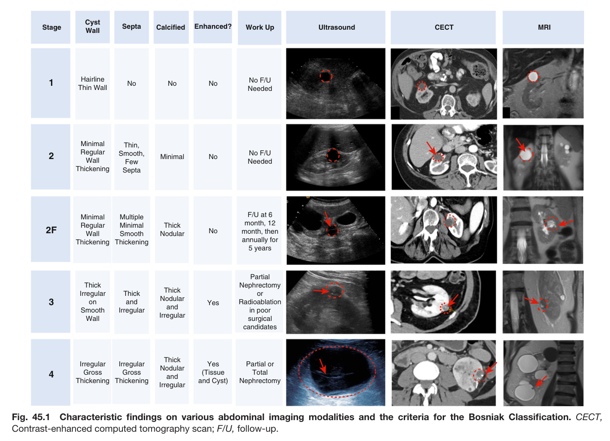

Fig. 45.1 Characteristic findings on various abdominal imaging modalities and the criteria for the Bosniak Classification. CECT, Contrast-enhanced computed tomography scan; F/U, follow-up.

---

### Fig_45_2

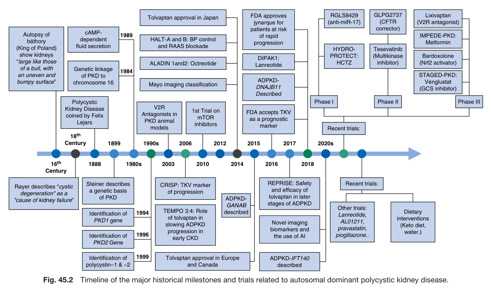

Fig. 45.2 Timeline of the major historical milestones and trials related to autosomal dominant polycystic kidney disease.

---

### Fig_45_3

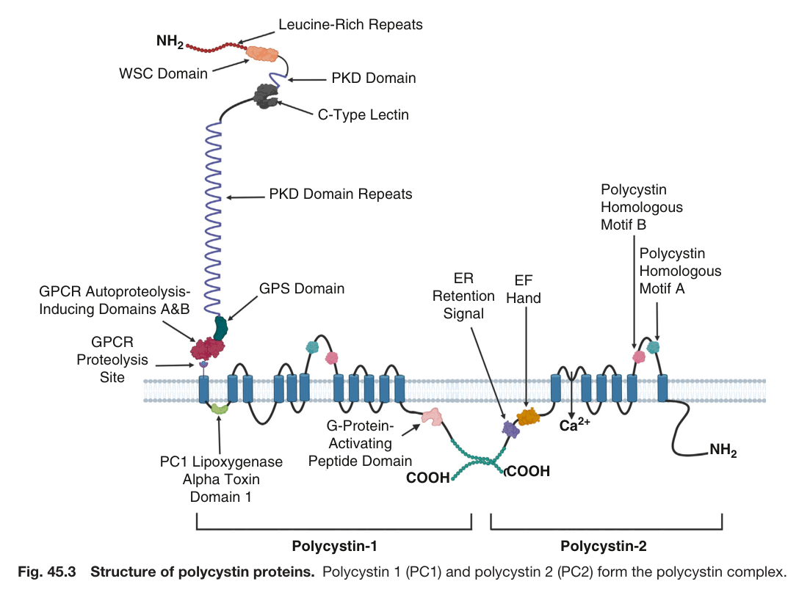

Fig. 45.3 Structure of polycystin proteins. Polycystin 1 (PC1) and polycystin 2 (PC2) form the polycystin complex.

---

### Fig_45_4

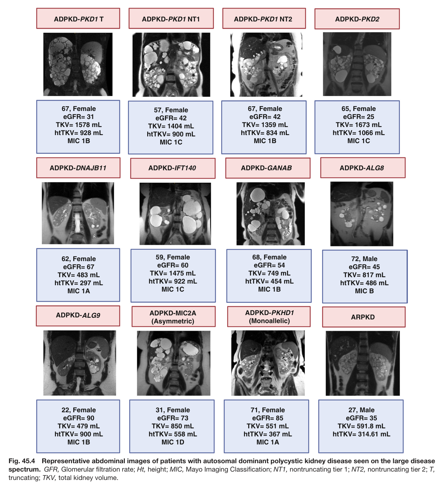

Fig. 45.4 Representative abdominal images of patients with autosomal dominant polycystic kidney disease seen on the large disease spectrum. GFR, Glomerular filtration rate; Ht, height; MIC, Mayo Imaging Classification; NT1, nontruncating tier 1; NT2, nontruncating tier 2; T, truncating; TKV, total kidney volume

---

### Fig_45_5

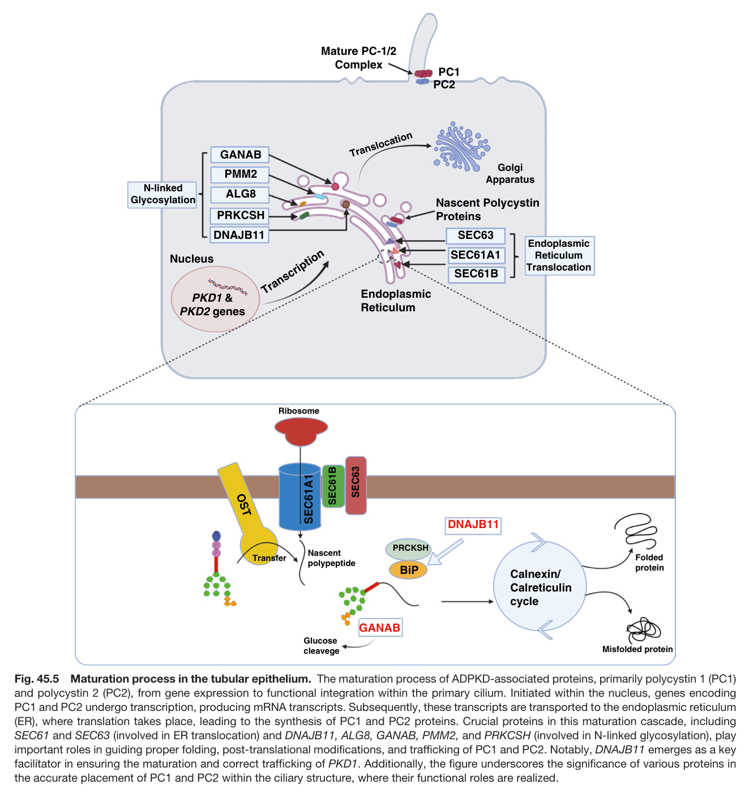

Fig. 45.5 Maturation process in the tubular epithelium. The maturation process of ADPKD-associated proteins, primarily polycystin 1 (PC1) and polycystin 2 (PC2), from gene expression to functional integration within the primary cilium. Initiated within the nucleus, genes encoding PC1 and PC2 undergo transcription, producing mRNA transcripts. Subsequently, these transcripts are transported to the endoplasmic reticulum (ER), where translation takes place, leading to the synthesis of PC1 and PC2 proteins. Crucial proteins in this maturation cascade, including SEC61 and SEC63 (involved in ER translocation) and DNAJB11, ALG8, GANAB, PMM2, and PRKCSH (involved in N-linked glycosylation), play important roles in guiding proper folding, post-translational modifications, and trafficking of PC1 and PC2. Notably, DNAJB11 emerges as a key facilitator in ensuring the maturation and correct trafficking of PKD1. Additionally, the figure underscores the significance of various proteins in the accurate placement of PC1 and PC2 within the ciliary structure, where their functional roles are realized.

---

### Fig_45_6

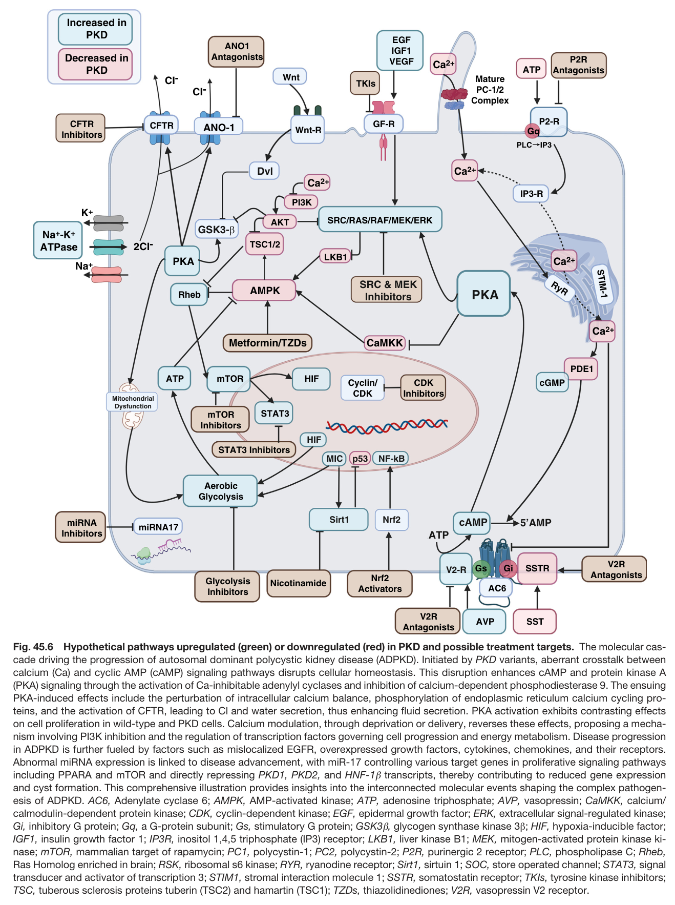

Fig. 45.6 Hypothetical pathways upregulated (green) or downregulated (red) in PKD and possible treatment targets. The molecular cas- cade driving the progression of autosomal dominant polycystic kidney disease (ADPKD). Initiated by PKD variants, aberrant crosstalk between calcium (Ca) and cyclic AMP (cAMP) signaling pathways disrupts cellular homeostasis. This disruption enhances cAMP and protein kinase A (PKA) signaling through the activation of Ca-inhibitable adenylyl cyclases and inhibition of calcium-dependent phosphodiesterase 9. The ensuing PKA-induced effects include the perturbation of intracellular calcium balance, phosphorylation of endoplasmic reticulum calcium cycling pro- teins, and the activation of CFTR, leading to Cl and water secretion, thus enhancing fluid secretion. PKA activation exhibits contrasting effects on cell proliferation in wild-type and PKD cells. Calcium modulation, through deprivation or delivery, reverses these effects, proposing a mecha nism involving PI3K inhibition and the regulation of transcription factors governing cell progression and energy metabolism. Disease progression in ADPKD is further fueled by factors such as mislocalized EGFR, overexpressed growth factors, cytokines, chemokines, and their receptors. Abnormal miRNA expression is linked to disease advancement, with miR-17 controlling various target genes in proliferative signaling pathways including PPARA and mTOR and directly repressing PKD1, PKD2, and HNF-1β transcripts, thereby contributing to reduced gene expression and cyst formation. This comprehensive illustration provides insights into the interconnected molecular events shaping the complex pathogen- esis of ADPKD. AC6, Adenylate cyclase 6; AMPK, AMP-activated kinase; ATP, adenosine triphosphate; AVP, vasopressin; CaMKK, calcium calmodulin-dependent protein kinase; CDK, cyclin-dependent kinase; EGF, epidermal growth factor; ERK, extracellular signal-regulated kinase; Gi, inhibitory G protein; Gq, a G-protein subunit; Gs, stimulatory G protein; GSK3β, glycogen synthase kinase 3β; HIF, hypoxia-inducible factor; IGF1, insulin growth factor 1; IP3R, inositol 1,4,5 triphosphate (IP3) receptor; LKB1, liver kinase B1; MEK, mitogen-activated protein kinase ki- nase; mTOR, mammalian target of rapamycin; PC1, polycystin-1; PC2, polycystin-2; P2R, purinergic 2 receptor; PLC, phospholipase C; Rheb, Ras Homolog enriched in brain; RSK, ribosomal s6 kinase; RYR, ryanodine receptor; Sirt1, sirtuin 1; SOC, store operated channel; STAT3, signa transducer and activator of transcription 3; STIM1, stromal interaction molecule 1; SSTR, somatostatin receptor; TKIs, tyrosine kinase inhibitors; TSC, tuberous sclerosis proteins tuberin (TSC2) and hamartin (TSC1); TZDs, thiazolidinediones; V2R, vasopressin V2 receptor.

---

### Fig_45_7

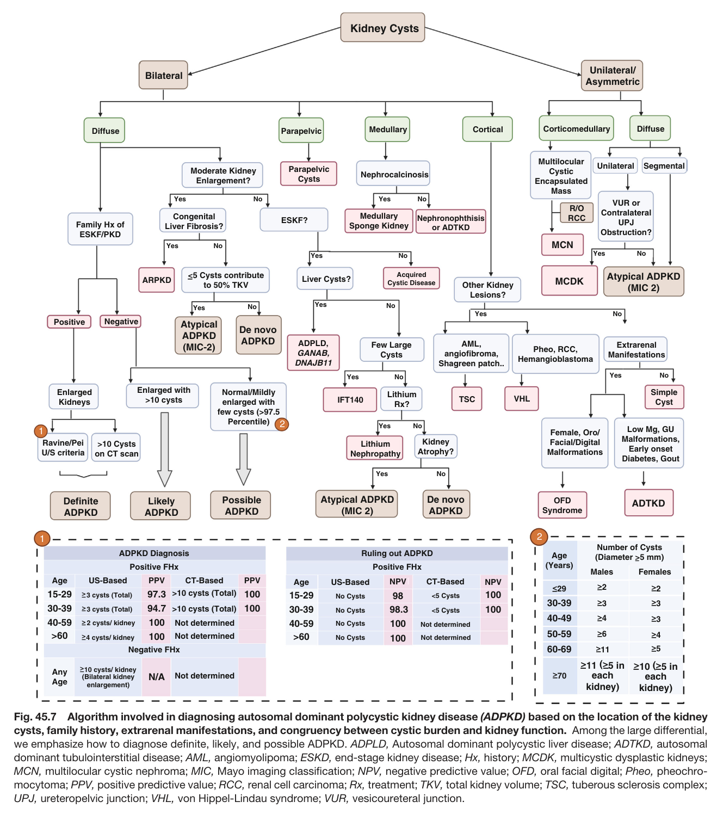

Fig. 45.7 Algorithm involved in diagnosing autosomal dominant polycystic kidney disease (ADPKD) based on the location of the kidney cysts, family history, extrarenal manifestations, and congruency between cystic burden and kidney function. Among the large differential, we emphasize how to diagnose definite, likely, and possible ADPKD. ADPLD, Autosomal dominant polycystic liver disease; ADTKD, autosoma dominant tubulointerstitial disease; AML, angiomyolipoma; ESKD, end-stage kidney disease; Hx, history; MCDK, multicystic dysplastic kidneys; MCN, multilocular cystic nephroma; MIC, Mayo imaging classification; NPV, negative predictive value; OFD, oral facial digital; Pheo, pheochro mocytoma; PPV, positive predictive value; RCC, renal cell carcinoma; Rx, treatment; TKV, total kidney volume; TSC, tuberous sclerosis complex; UPJ, ureteropelvic junction; VHL, von Hippel-Lindau syndrome; VUR, vesicoureteral junction.

---

### Fig_45_8

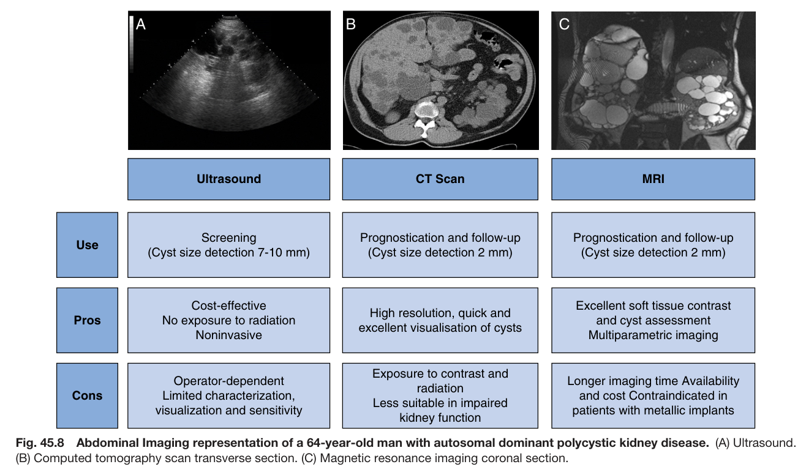

Fig. 45.8 Abdominal Imaging representation of a 64-year-old man with autosomal dominant polycystic kidney disease. (A) Ultrasound. (B) Computed tomography scan transverse section. (C) Magnetic resonance imaging coronal section.

---

### Fig_45_9

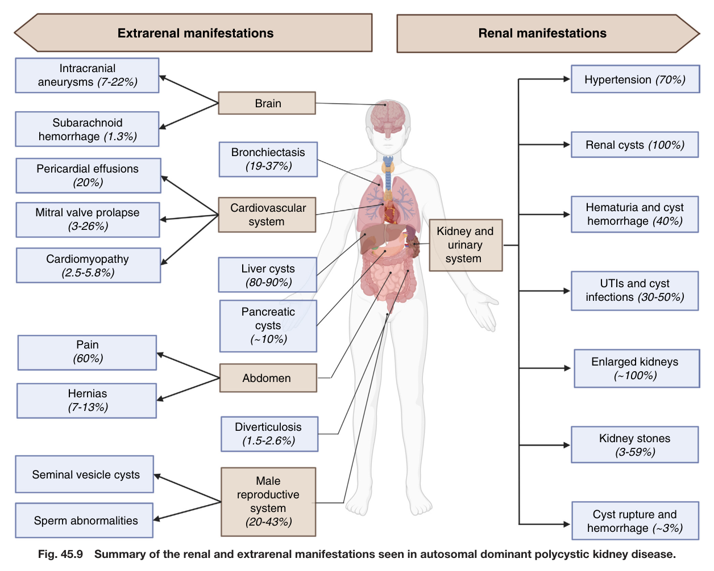

Fig. 45.9 Summary of the renal and extrarenal manifestations seen in autosomal dominant polycystic kidney disease.

---

### Fig_45_10

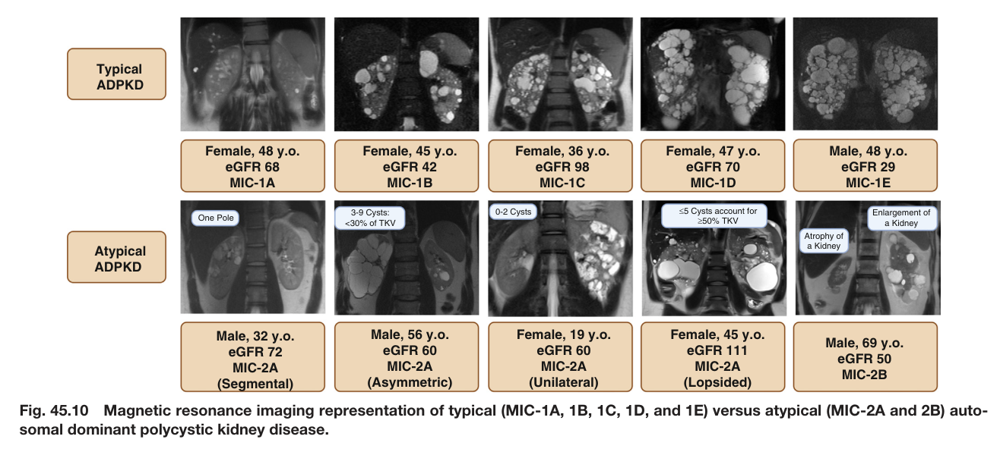

Fig. 45.10 Magnetic resonance imaging representation of typical (MIC-1A, 1B, 1C, 1D, and 1E) versus atypical (MIC-2A and 2B) auto somal dominant polycystic kidney disease.

---

### Fig_45_11

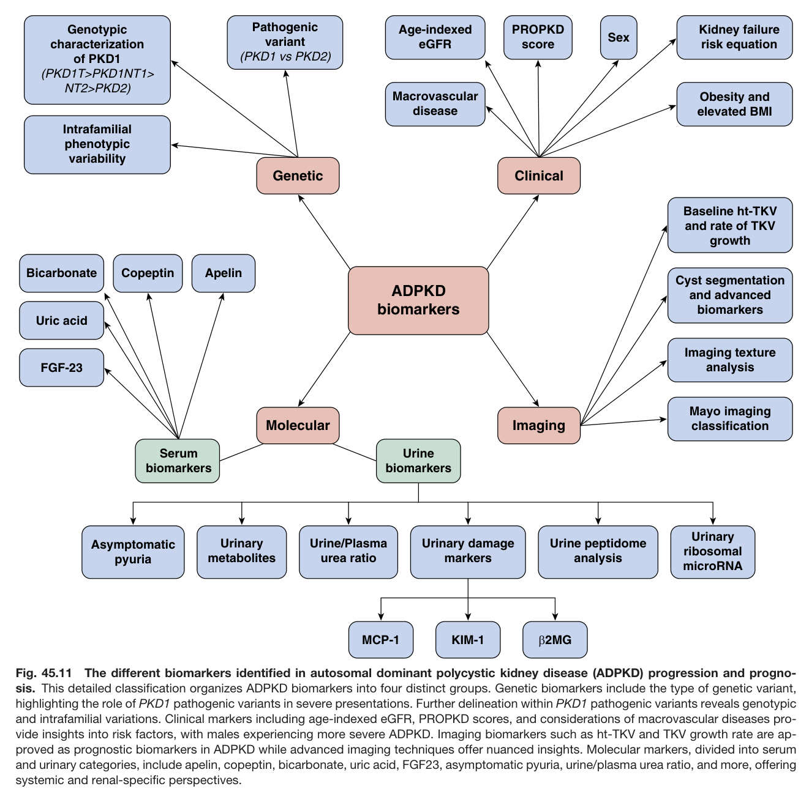

Fig. 45.11 The different biomarkers identified in autosomal dominant polycystic kidney disease (ADPKD) progression and progno- sis. This detailed classification organizes ADPKD biomarkers into four distinct groups. Genetic biomarkers include the type of genetic variant, highlighting the role of PKD1 pathogenic variants in severe presentations. Further delineation within PKD1 pathogenic variants reveals genotypic and intrafamilial variations. Clinical markers including age-indexed eGFR, PROPKD scores, and considerations of macrovascular diseases pro vide insights into risk factors, with males experiencing more severe ADPKD. Imaging biomarkers such as ht-TKV and TKV growth rate are ap- proved as prognostic biomarkers in ADPKD while advanced imaging techniques offer nuanced insights. Molecular markers, divided into serum and urinary categories, include apelin, copeptin, bicarbonate, uric acid, FGF23, asymptomatic pyuria, urine/plasma urea ratio, and more, offering systemic and renal-specific perspectives.

---

### Fig_45_12

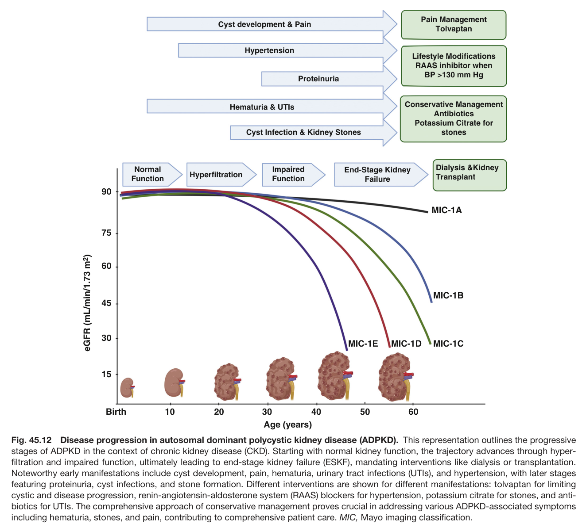

Fig. 45.12 Disease progression in autosomal dominant polycystic kidney disease (ADPKD). This representation outlines the progressive stages of ADPKD in the context of chronic kidney disease (CKD). Starting with normal kidney function, the trajectory advances through hyper- filtration and impaired function, ultimately leading to end-stage kidney failure (ESKF), mandating interventions like dialysis or transplantation. Noteworthy early manifestations include cyst development, pain, hematuria, urinary tract infections (UTIs), and hypertension, with later stages featuring proteinuria, cyst infections, and stone formation. Different interventions are shown for different manifestations: tolvaptan for limiting cystic and disease progression, renin-angiotensin-aldosterone system (RAAS) blockers for hypertension, potassium citrate for stones, and anti- biotics for UTIs. The comprehensive approach of conservative management proves crucial in addressing various ADPKD-associated symptoms including hematuria, stones, and pain, contributing to comprehensive patient care. MIC, Mayo imaging classification.

---

### Fig_45_13

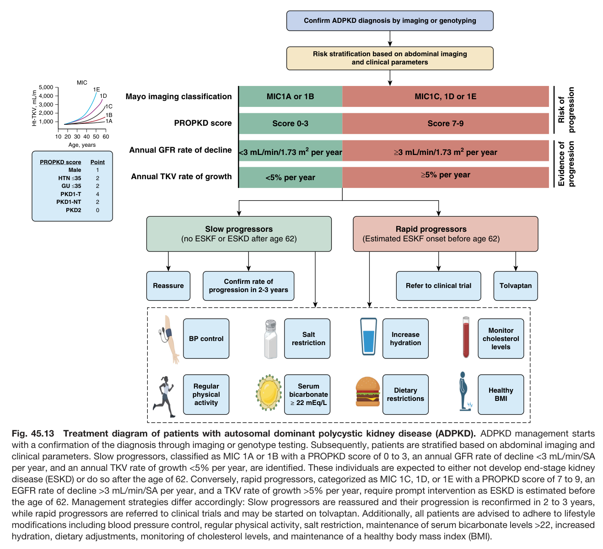

Fig. 45.13 Treatment diagram of patients with autosomal dominant polycystic kidney disease (ADPKD). ADPKD management starts with a confirmation of the diagnosis through imaging or genotype testing. Subsequently, patients are stratified based on abdominal imaging and clinical parameters. Slow progressors, classified as MIC 1A or 1B with a PROPKD score of 0 to 3, an annual GFR rate of decline <3 mL/min/SA per year, and an annual TKV rate of growth <5% per year, are identified. These individuals are expected to either not develop end-stage kidney disease (ESKD) or do so after the age of 62. Conversely, rapid progressors, categorized as MIC 1C, 1D, or 1E with a PROPKD score of 7 to 9, an EGFR rate of decline >3 mL/min/SA per year, and a TKV rate of growth >5% per year, require prompt intervention as ESKD is estimated before the age of 62. Management strategies differ accordingly: Slow progressors are reassured and their progression is reconfirmed in 2 to 3 years, while rapid progressors are referred to clinical trials and may be started on tolvaptan. Additionally, all patients are advised to adhere to lifestyle modifications including blood pressure control, regular physical activity, salt restriction, maintenance of serum bicarbonate levels >22, increased hydration, dietary adjustments, monitoring of cholesterol levels, and maintenance of a healthy body mass index (BMI).

---

### Fig_45_14

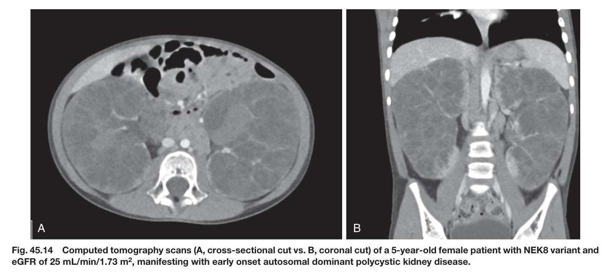

Fig. 45.14 Computed tomography scans (A, cross-sectional cut vs. B, coronal cut) of a 5-year-old female patient with NEK8 variant and eGFR of 25 mL/min/1.73 m<sup>2</sup>, manifesting with early onset autosomal dominant polycystic kidney disease.

---

### Fig_45_15

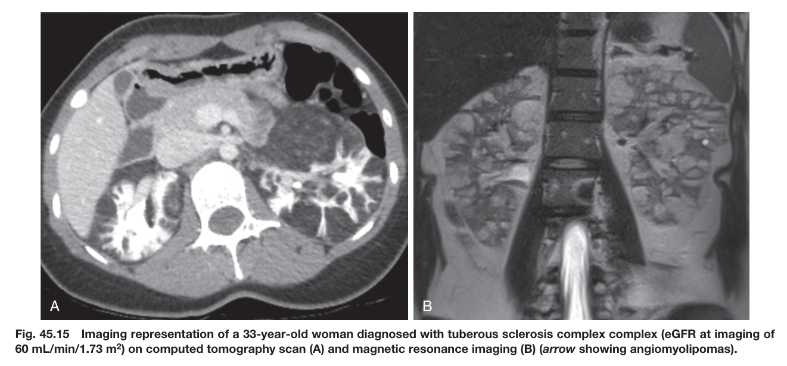

Fig. 45.15 Imaging representation of a 33-year-old woman diagnosed with tuberous sclerosis complex complex (eGFR at imaging of 60 mL/min/1.73 m<sup>2</sup>) on computed tomography scan (A) and magnetic resonance imaging (B) (arrow showing angiomyolipomas).

---

### Fig_45_16

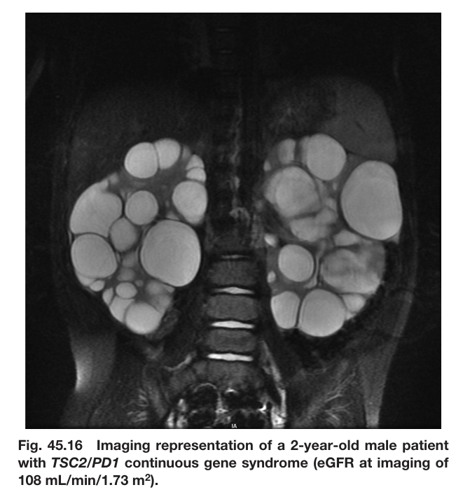

Fig. 45.16 Imaging representation of a 2-year-old male patient with TSC2/PD1 continuous gene syndrome (eGFR at imaging of 108 mL/min/1.73 m<sup>2</sup>).

---

### Fig_45_17

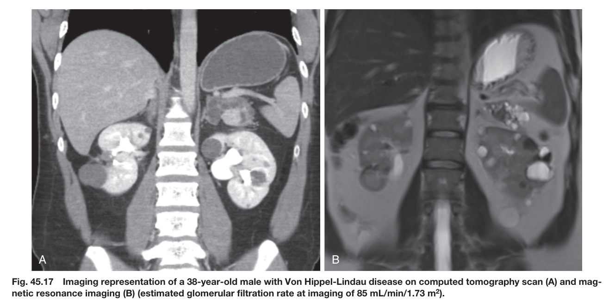

Fig. 45.17 Imaging representation of a 38-year-old male with Von Hippel-Lindau disease on computed tomography scan (A) and mag netic resonance imaging (B) (estimated glomerular filtration rate at imaging of 85 mL/min/1.73 m<sup>2</sup>).

---

### Fig_45_18

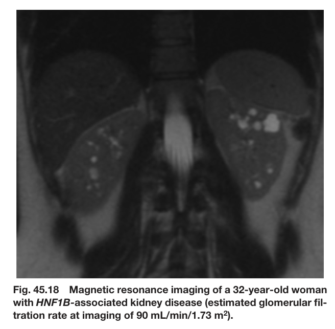

Fig. 45.18 Magnetic resonance imaging of a 32-year-old woman with HNF1B-associated kidney disease (estimated glomerular fil- tration rate at imaging of 90 mL/min/1.73 m<sup>2</sup>).

---

### Fig_45_19

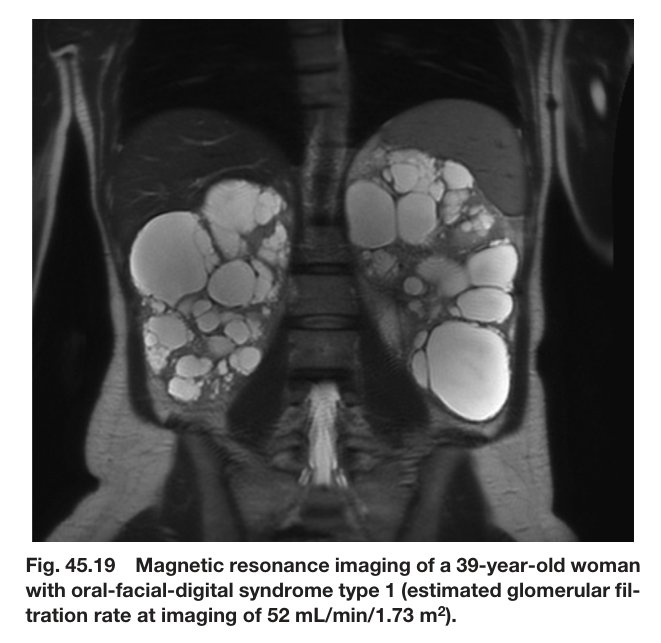

Fig. 45.19 Magnetic resonance imaging of a 39-year-old woman with oral-facial-digital syndrome type 1 (estimated glomerular fil- tration rate at imaging of 52 mL/min/1.73 m<sup>2</sup>).

---

### Fig_45_20

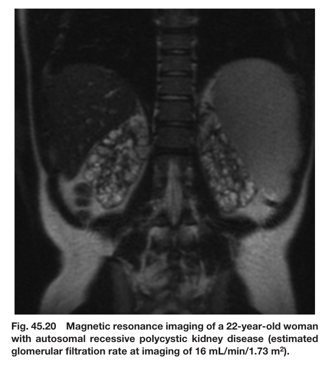

Fig. 45.20 Magnetic resonance imaging of a 22-year-old woman with autosomal recessive polycystic kidney disease (estimated glomerular filtration rate at imaging of 16 mL/min/1.73 m<sup>2</sup>).

---

### Fig_45_21

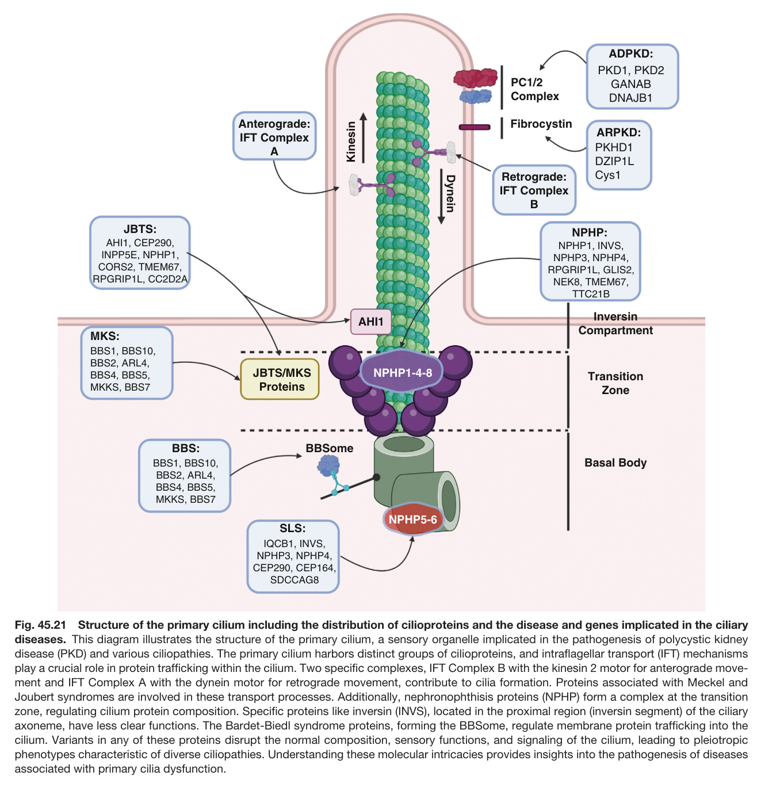

Fig. 45.21 Structure of the primary cilium including the distribution of cilioproteins and the disease and genes implicated in the ciliary diseases. This diagram illustrates the structure of the primary cilium, a sensory organelle implicated in the pathogenesis of polycystic kidney disease (PKD) and various ciliopathies. The primary cilium harbors distinct groups of cilioproteins, and intraflagellar transport (IFT) mechanisms play a crucial role in protein trafficking within the cilium. Two specific complexes, IFT Complex B with the kinesin 2 motor for anterograde move- ment and IFT Complex A with the dynein motor for retrograde movement, contribute to cilia formation. Proteins associated with Meckel and Joubert syndromes are involved in these transport processes. Additionally, nephronophthisis proteins (NPHP) form a complex at the transition zone, regulating cilium protein composition. Specific proteins like inversin (INVS), located in the proximal region (inversin segment) of the ciliary axoneme, have less clear functions. The Bardet-Biedl syndrome proteins, forming the BBSome, regulate membrane protein trafficking into the cilium. Variants in any of these proteins disrupt the normal composition, sensory functions, and signaling of the cilium, leading to pleiotropic phenotypes characteristic of diverse ciliopathies. Understanding these molecular intricacies provides insights into the pathogenesis of diseases associated with primary cilia dysfunction.

---

### Fig_45_22

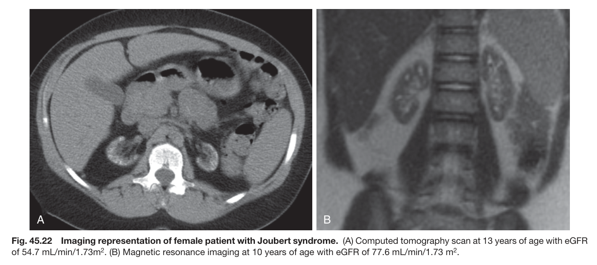

Fig. 45.22 Imaging representation of female patient with Joubert syndrome. (A) Computed tomography scan at 13 years of age with eGFR of 54.7 mL/min/1.73m<sup>2</sup>. (B) Magnetic resonance imaging at 10 years of age with eGFR of 77.6 mL/min/1.73 m<sup>2</sup>.

---

### Fig_45_23

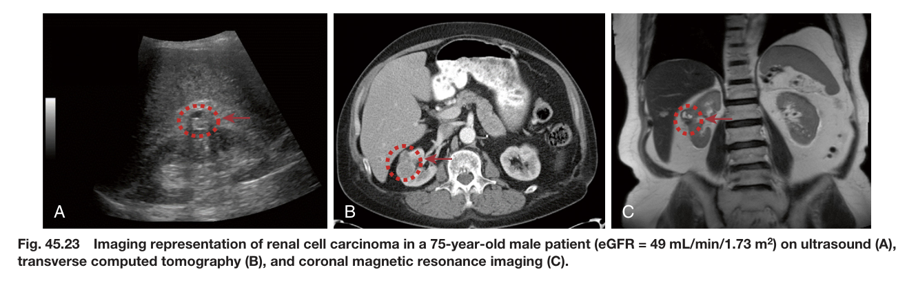

Fig. 45.23 Imaging representation of renal cell carcinoma in a 75-year-old male patient (eGFR = 49 mL/min/1.73 m<sup>2</sup>) on ultrasound (A), transverse computed tomography (B), and coronal magnetic resonance imaging (C).

---

## Tables

### Table_45_1

#### Table Image

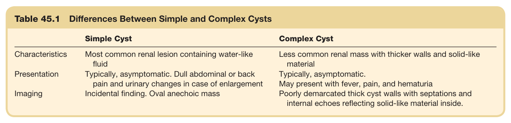

#### Table Data (CSV: [Table_45_1.csv](Table_45_1.csv))

```markdown
| Table Text (OCR) |
| :--- |
| Table 45.1  Differences Between Simple and Complex Cysts Simple Cyst  Complex Cyst    Characteristics  Most common renal lesion containing water-like fluid  Less common renal mass with thicker walls and solid-like material    Presentation  Typically, asymptomatic. Dull abdominal or back pain and urinary changes in case of enlargement  Typically, asymptomatic.May present with fever, pain, and hematuria    Imaging  Incidental finding. Oval anechoic mass  Poorly demarcated thick cyst walls with septations and internal echoes reflecting solid-like material inside. |
```

Table 45.1 Differences Between Simple and Complex Cysts

---

### Table_45_2

#### Table Image

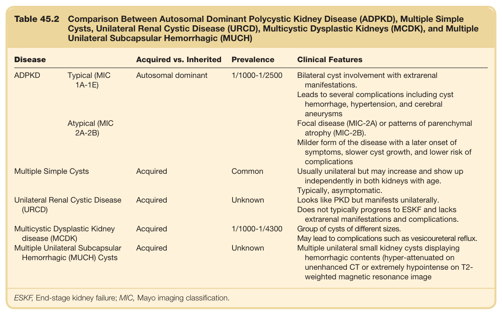

#### Table Data (CSV: [Table_45_2.csv](Table_45_2.csv))

```markdown
| Table Text (OCR) |
| :--- |
| Table 45.2 Comparison Between Autosomal Dominant Polycystic Kidney Disease (ADPKD), Multiple Simple Cysts, Unilateral Renal Cystic Disease (URCD), Multicystic Dysplastic Kidneys (MCDK), and Multiple Unilateral Subcapsular Hemorrhagic (MUCH) Disease  Acquired vs. Inherited  Prevalence  Clinical Features    ADPKD  Typical (MIC 1A-1E)  Autosomal dominant  1/1000-1/2500  Bilateral cyst involvement with extrarenal manifestations.Leads to several complications including cyst hemorrhage, hypertension, and cerebral aneurysms    Atypical (MIC 2A-2B)      Focal disease (MIC-2A) or patterns of parenchymal atrophy (MIC-2B).Milder form of the disease with a later onset of symptoms, slower cyst growth, and lower risk of complications    Multiple Simple Cysts  Acquired  Common  Usually unilateral but may increase and show up independently in both kidneys with age.Typically, asymptomatic.    Unilateral Renal Cystic Disease (URCD)  Acquired  Unknown  Looks like PKD but manifests unilaterally.Does not typically progress to ESKF and lacks extrarenal manifestations and complications.    Multicystic Dysplastic Kidney disease (MCDK)  Acquired  1/1000-1/4300  Group of cysts of different sizes.May lead to complications such as vesicoureteral reflux.    Multiple Unilateral Subcapsular Hemorrhagic (MUCH) Cysts  Acquired  Unknown  Multiple unilateral small kidney cysts displaying hemorrhagic contents (hyper-attenuated on unenhanced CT or extremely hypointense on T2-weighted magnetic resonance image ESKF, End-stage kidney failure; MIC, Mayo imaging classification. |
```

Table 45.2 Comparison Between Autosomal Dominant Polycystic Kidney Disease (ADPKD), Multiple Simple Cysts, Unilateral Renal Cystic Disease (URCD), Multicystic Dysplastic Kidneys (MCDK), and Multiple Unilateral Subcapsular Hemorrhagic (MUCH)

---

### Table_45_3

#### Table Image

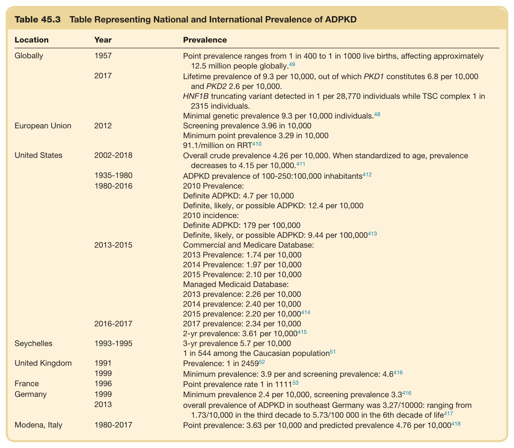

#### Table Data (CSV: [Table_45_3.csv](Table_45_3.csv))

```markdown
| Table Text (OCR) |
| :--- |
| Table 45.3 Table Representing National and International Prevalence of ADPKD Location  Year  Prevalence    Globally  1957  Point prevalence ranges from 1 in 400 to 1 in 1000 live births, affecting approximately 12.5 million people globally.49    2017  Lifetime prevalence of 9.3 per 10,000, out of whichPKD1constitutes 6.8 per 10,000 andPKD22.6 per 10,000.HNF1Btruncating variant detected in 1 per 28,770 individuals while TSC complex 1 in 2315 individuals.Minimal genetic prevalence 9.3 per 10,000 individuals.48    European Union  2012  Screening prevalence 3.96 in 10,000Minimum point prevalence 3.29 in 10,00091.1/million on RRT410    United States  2002-2018  Overall crude prevalence 4.26 per 10,000. When standardized to age, prevalence decreases to 4.15 per 10,000.411    1935-1980  ADPKD prevalence of 100-250:100,000 inhabitants412    1980-2016  2010 Prevalence:Definite ADPKD: 4.7 per 10,000Definite, likely, or possible ADPKD: 12.4 per 10,0002010 incidence:Definite ADPKD: 179 per 100,000Definite, likely, or possible ADPKD: 9.44 per 100,000413    2013-2015  Commercial and Medicare Database:2013 Prevalence: 1.74 per 10,0002014 Prevalence: 1.97 per 10,0002015 Prevalence: 2.10 per 10,000Managed Medicaid Database:2013 prevalence: 2.26 per 10,0002014 prevalence: 2.40 per 10,0002015 prevalence: 2.20 per 10,000414    2016-2017  2017 prevalence: 2.34 per 10,0002-yr prevalence: 3.61 per 10,000415    Seychelles  1993-1995  3-yr prevalence 5.7 per 10,0001 in 544 among the Caucasian population51    United Kingdom  1991  Prevalence: 1 in 245952    1999  Minimum prevalence: 3.9 per and screening prevalence: 4.6416    France  1996  Point prevalence rate 1 in 111153    Germany  1999  Minimum prevalence 2.4 per 10,000, screening prevalence 3.3416    2013  overall prevalence of ADPKD in southeast Germany was 3.27/10000: ranging from 1.73/10,000 in the third decade to 5.73/100 000 in the 6th decade of life417    Modena, Italy  1980-2017  Point prevalence: 3.63 per 10,000 and predicted prevalence 4.76 per 10,000418 |
```

Table 45.3 Table Representing National and International Prevalence of ADPKD

---

### Table_45_4

#### Table Image

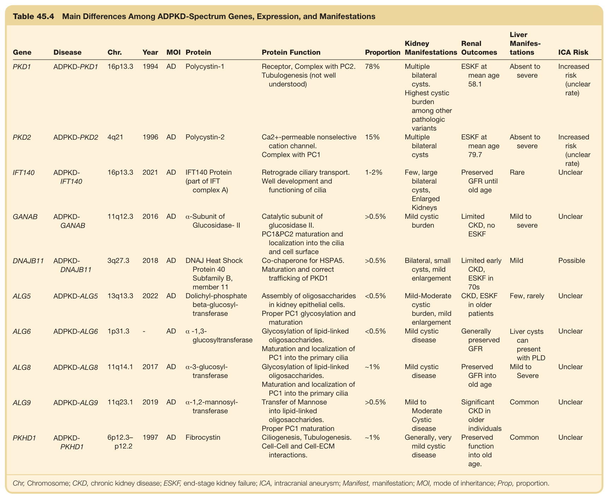

#### Table Data (CSV: [Table_45_4.csv](Table_45_4.csv))

```markdown
| Table Text (OCR) |
| :--- |
| Table 45.4Main Differences Among ADPKD-Spectrum Genes, Expression, and Manifestations Gene  Disease  Chr.  Year  MOI  Protein  Protein Function  Proportion  Kidney Manifestations  Renal Outcomes  Liver Manifestations  ICA Risk    PKD1  ADPKD-PKD1  16p13.3  1994  AD  Polycystin-1  Receptor, Complex with PC2.Tubulogenesis (not well understood)  78%  Multiple bilateral cysts. Highest cystic burden among other pathologic variants  ESKF at mean age 58.1  Absent to severe  Increased risk (unclear rate)    PKD2  ADPKD-PKD2  4q21  1996  AD  Polycystin-2  Ca2+-permeable nonselective cation channel.Complex with PC1  15%  Multiple bilateral cysts  ESKF at mean age 79.7  Absent to severe  Increased risk (unclear rate)    IFT140  ADPKD-IFT140  16p13.3  2021  AD  IFT140 Protein (part of IFT complex A)  Retrograde ciliary transport.Well development and functioning of cilia  1-2%  Few, large bilateral cysts, Enlarged Kidneys  Preserved GFR until old age  Rare  Unclear    GANAB  ADPKD-GANAB  11q12.3  2016  AD  α-Subunit of Glucosidase- II  Catalytic subunit of glucosidase II.PC1&PC2 maturation and localization into the cilia and cell surface  >0.5%  Mild cystic burden  Limited CKD, no ESKF  Mild to severe  Unclear    DNAJB11  ADPKD-DNAJB11  3q27.3  2018  AD  DNAJ Heat Shock Protein 40 Subfamily B, member 11  Co-chaperone for HSPA5.Maturation and correct trafficking of PKD1  >0.5%  Bilateral, small cysts, mild enlargement  Limited early CKD, ESKF in 70s  Mild  Possible    ALG5  ADPKD-ALG5  13q13.3  2022  AD  Dolichyl-phosphate beta-glucosyl-transferase  Assembly of oligosaccharides in kidney epithelial cells.Proper PC1 glycosylation and maturation  <0.5%  Mild-Moderate cystic burden, mild enlargement  CKD, ESKF in older patients  Few, rarely  Unclear    ALG6  ADPKD-ALG6  1p31.3  -  AD  α-1,3-glucosyltransferase  Glycosylation of lipid-linked oligosaccharides.Maturation and localization of PC1 into the primary cilia  <0.5%  Mild cystic disease  Generally preserved GFR  Liver cysts can present with PLD  Unclear    ALG8  ADPKD-ALG8  11q14.1  2017  AD  α-3-glucosyl-transferase  Glycosylation of lipid-linked oligosaccharides.Maturation and localization of PC1 into the primary cilia  ~1%  Mild cystic disease  Preserved GFR into old age  Mild to Severe  Unclear    ALG9  ADPKD-ALG9  11q23.1  2019  AD  α-1,2-mannosyl-transferase  Transfer of Mannose into lipid-linked oligosaccharides.Proper PC1 maturation  >0.5%  Mild to Moderate Cystic disease  Significant CKD in older individuals  Common  Unclear    PKHD1  ADPKD-PKHD1  6p12.3-p12.2  1997  AD  Fibrocystin  Ciliogenesis, Tubulogenesis.Cell-Cell and Cell-ECM interactions.  ~1%  Generally, very mild cystic disease  Preserved function into old age.  Common  Unclear Chr, Chromosome; CKD, chronic kidney disease; ESKF, end-stage kidney failure; ICA, intracranial aneurysm; Manifest, manifestation; MOI, mode of inheritance; Prop, proportion. |
```

Table 45.4 Main Differences Among ADPKD-Spectrum Genes, Expression, and Manifestations

---

### Table_45_5

#### Table Image

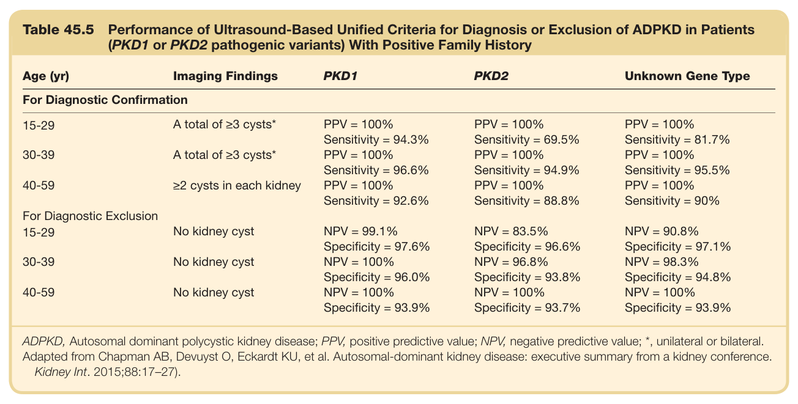

#### Table Data (CSV: [Table_45_5.csv](Table_45_5.csv))

```markdown
| Table Text (OCR) |
| :--- |
| Table 45.5  Performance of Ultrasound-Based Unified Criteria for Diagnosis or Exclusion of ADPKD in Patients (PKD1 or PKD2 pathogenic variants) With Positive Family History Age (yr)  Imaging Findings  PKD1  PKD2  Unknown Gene Type    For Diagnostic Confirmation    15-29  A total of ≥3 cysts*  PPV = 100%  PPV = 100%  PPV = 100%    Sensitivity = 94.3%  Sensitivity = 69.5%  Sensitivity = 81.7%    30-39  A total of ≥3 cysts*  PPV = 100%  PPV = 100%  PPV = 100%    Sensitivity = 96.6%  Sensitivity = 94.9%  Sensitivity = 95.5%    40-59  ≥2 cysts in each kidney  PPV = 100%  PPV = 100%  PPV = 100%    Sensitivity = 92.6%  Sensitivity = 88.8%  Sensitivity = 90%    For Diagnostic Exclusion    15-29  No kidney cyst  NPV = 99.1%  NPV = 83.5%  NPV = 90.8%    Specificity = 97.6%  Specificity = 96.6%  Specificity = 97.1%    30-39  No kidney cyst  NPV = 100%  NPV = 96.8%  NPV = 98.3%    Specificity = 96.0%  Specificity = 93.8%  Specificity = 94.8%    40-59  No kidney cyst  NPV = 100%  NPV = 100%  NPV = 100%    Specificity = 93.9%  Specificity = 93.7%  Specificity = 93.9% ADPKD, Autosomal dominant polycystic kidney disease; PPV, positive predictive value; NPV, negative predictive value; *, unilateral or bilateral. Adapted from Chapman AB, Devuyst O, Eckardt KU, et al. Autosomal-dominant kidney disease: executive summary from a kidney conference. Kidney Int. 2015;88:17–27). |
```

Table 45.5 Performance of Ultrasound-Based Unified Criteria for Diagnosis or Exclusion of ADPKD in Patients (PKD1 or PKD2 pathogenic variants) With Positive Family History

---

### Table_45_6

#### Table Image

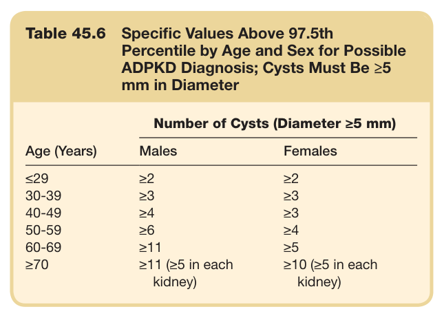

#### Table Data (CSV: [Table_45_6.csv](Table_45_6.csv))

```markdown
| Table Text (OCR) |
| :--- |
| Table 45.6  Specific Values Above 97.5th Percentile by Age and Sex for Possible ADPKD Diagnosis; Cysts Must Be ≥5 mm in Diameter Age (Years)  Number of Cysts (Diameter ≥5 mm)    Males  Females    ≤29  ≥2  ≥2    30-39  ≥3  ≥3    40-49  ≥4  ≥3    50-59  ≥6  ≥4    60-69  ≥11  ≥5    ≥70  ≥11 (≥5 in each kidney)  ≥10 (≥5 in each kidney) |
```

Table 45.6 Specific Values Above 97.5th Percentile by Age and Sex for Possible ADPKD Diagnosis; Cysts Must Be ≥5 mm in Diameter

---

### Table_45_7

#### Table Image

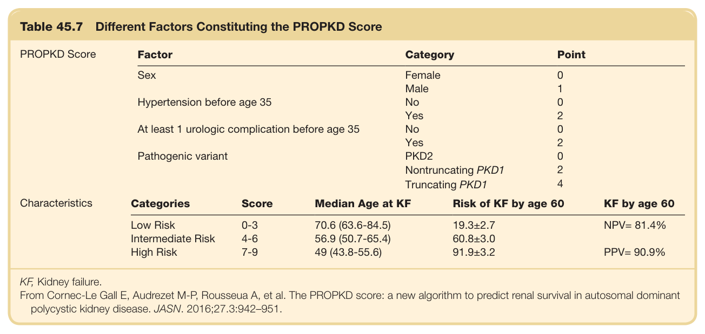

#### Table Data (CSV: [Table_45_7.csv](Table_45_7.csv))

```markdown
| Table Text (OCR) |
| :--- |
| Table 45.7  Different Factors Constituting the PROPKD Score PROPKD Score  Factor  Category  Point      Sex  Female  0      Male  1      Hypertension before age 35  No  0      Yes  2      At least 1 urologic complication before age 35  No  0      Yes  2      Pathogenic variant  PKD2  0      Nontruncating PKD1  2      Truncating PKD1  4      Characteristics  Categories  Score  Median Age at KF  Risk of KF by age 60  KF by age 60    Low Risk  0-3  70.6 (63.6-84.5)  19.3±2.7  NPV= 81.4%    Intermediate Risk  4-6  56.9 (50.7-65.4)  60.8±3.0      High Risk  7-9  49 (43.8-55.6)  91.9±3.2  PPV= 90.9% KF, Kidney failure. From Cornec-Le Gall E, Audrezet M-P, Rousseua A, et al. The PROPKD score: a new algorithm to predict renal survival in autosomal dominant polycystic kidney disease. JASN. 2016;27.3:942–951. |
```

Table 45.7 Different Factors Constituting the PROPKD Score

---

### Table_45_8

#### Table Image

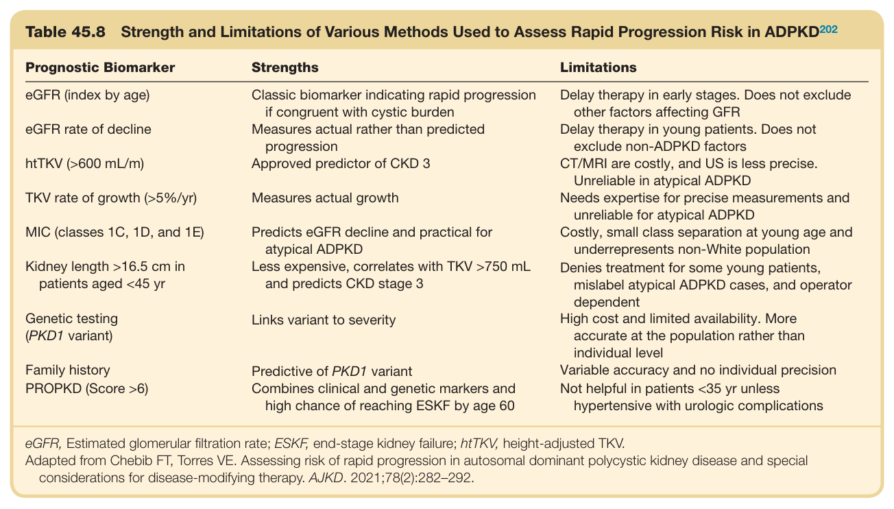

#### Table Data (CSV: [Table_45_8.csv](Table_45_8.csv))

```markdown
| Table Text (OCR) |
| :--- |
| Table 45.8 Strength and Limitations of Various Methods Used to Assess Rapid Progression Risk in ADPKD<sup>202</sup> Prognostic Biomarker  Strengths  Limitations    eGFR (index by age)  Classic biomarker indicating rapid progression if congruent with cystic burden  Delay therapy in early stages. Does not exclude other factors affecting GFR    eGFR rate of decline  Measures actual rather than predicted progression  Delay therapy in young patients. Does not exclude non-ADPKD factors    htTKV (>600 mL/m)  Approved predictor of CKD 3  CT/MRI are costly, and US is less precise. Unreliable in atypical ADPKD    TKV rate of growth (>5%/yr)  Measures actual growth  Needs expertise for precise measurements and unreliable for atypical ADPKD    MIC (classes 1C, 1D, and 1E)  Predicts eGFR decline and practical for atypical ADPKD  Costly, small class separation at young age and underrepresents non-White population    Kidney length >16.5 cm in patients aged <45 yr  Less expensive, correlates with TKV >750 mL and predicts CKD stage 3  Denies treatment for some young patients, mislabel atypical ADPKD cases, and operator dependent    Genetic testing (PKD1 variant)  Links variant to severity  High cost and limited availability. More accurate at the population rather than individual level    Family history  Predictive of PKD1 variant  Variable accuracy and no individual precision    PROPKD (Score >6)  Combines clinical and genetic markers and high chance of reaching ESKF by age 60  Not helpful in patients <35 yr unless hypertensive with urologic complications eGFR, Estimated glomerular filtration rate; ESKF, end-stage kidney failure; htTKV, height-adjusted TKV. Adapted from Chebib FT, Torres VE. Assessing risk of rapid progression in autosomal dominant polycystic kidney disease and special considerations for disease-modifying therapy. AJKD. 2021;78(2):282–292. |
```

Table 45.8 Strength and Limitations of Various Methods Used to Assess Rapid Progression Risk in ADPKD<sup>202</sup>

---

### Table_45_9

#### Table Images (2 Parts)

- **Part 1 (Page 26)**:
  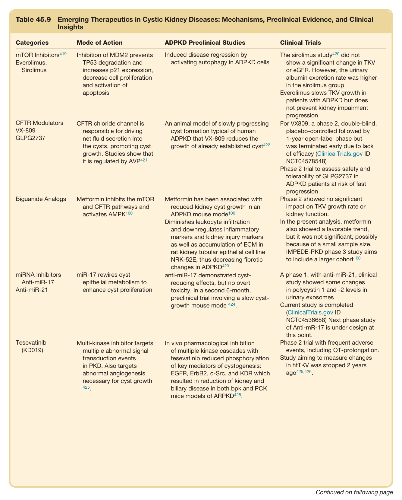

- **Part 2 (Page 27)**:
  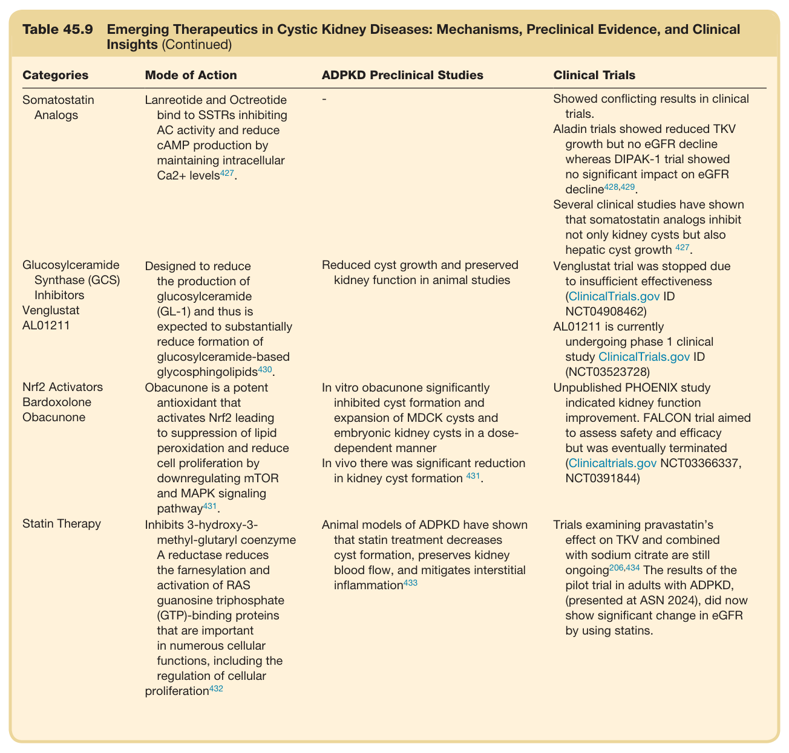

#### Table Data (CSV: [Table_45_9.csv](Table_45_9.csv))

```markdown
| Table Text (OCR) |
| :--- |
| Table 45.9  Emerging Therapeutics in Cystic Kidney Diseases: Mechanisms, Preclinical Evidence, and Clinical Insights Categories  Mode of Action  ADPKD Preclinical Studies  Clinical Trials    mTOR Inhibitors ^{419} Everolimus,Sirolimus  Inhibition of MDM2 prevents TP53 degradation and increases p21 expression, decrease cell proliferation and activation of apoptosis  Induced disease regression by activating autophagy in ADPKD cells  The sirolimus study ^{420}  did not show a significant change in TKV or eGFR. However, the urinary albumin excretion rate was higher in the sirolimus groupEverolimus slows TKV growth in patients with ADPKD but does not prevent kidney impairment progression    CFTR Modulators VX-809GLPG2737  CFTR chloride channel is responsible for driving net fluid secretion into the cysts, promoting cyst growth. Studies show that it is regulated by AVP ^{421}   An animal model of slowly progressing cyst formation typical of human ADPKD that VX-809 reduces the growth of already established cyst ^{422}   For VX809, a phase 2, double-blind, placebo-controlled followed by 1-year open-label phase but was terminated early due to lack of efficacy (ClinicalTrials.gov ID NCT04578548)Phase 2 trial to assess safety and tolerability of GLPG2737 in ADPKD patients at risk of fast progression    Biguanide Analogs  Metformin inhibits the mTOR and CFTR pathways and activates AMPK ^{100}   Metformin has been associated with reduced kidney cyst growth in an ADPKD mouse mode ^{100} Diminishes leukocyte infiltration and downregulates inflammatory markers and kidney injury markers as well as accumulation of ECM in rat kidney tubular epithelial cell line NRK-52E, thus decreasing fibrotic changes in ADPKD ^{423}   Phase 2 showed no significant impact on TKV growth rate or kidney function.In the present analysis, metformin also showed a favorable trend, but it was not significant, possibly because of a small sample size.IMPEDE-PKD phase 3 study aims to include a larger cohort ^{100}     miRNA Inhibitors Anti-miR-17 Anti-miR-21  miR-17 rewires cyst epithelial metabolism to enhance cyst proliferation  anti-miR-17 demonstrated cyst-reducing effects, but no overt toxicity, in a second 6-month, preclinical trial involving a slow cyst-growth mouse mode  ^{424} .  A phase 1, with anti-miR-21, clinical study showed some changes in polycystin 1 and -2 levels in urinary exosomesCurrent study is completed (ClinicalTrials.gov ID NCT04536688) Next phase study of Anti-mR-17 is under design at this point.    Tesevatinib (KD019)  Multi-kinase inhibitor targets multiple abnormal signal transduction events in PKD. Also targets abnormal angiogenesis necessary for cyst growth  ^{425} .  In vivo pharmacological inhibition of multiple kinase cascades with tesevatinib reduced phosphorylation of key mediators of cystogenesis: EGFR, ErbB2, c-Src, and KDR which resulted in reduction of kidney and biliary disease in both bpk and PCK mice models of ARPKD ^{425} .  Phase 2 trial with frequent adverse events, including QT-prolongation. Study aiming to measure changes in htTKV was stopped 2 years ago ^{425,426} . |
```

Table 45.9 Emerging Therapeutics in Cystic Kidney Diseases: Mechanisms, Preclinical Evidence, and Clinical Insights (Continued)

---

### Table_45_10

#### Table Image

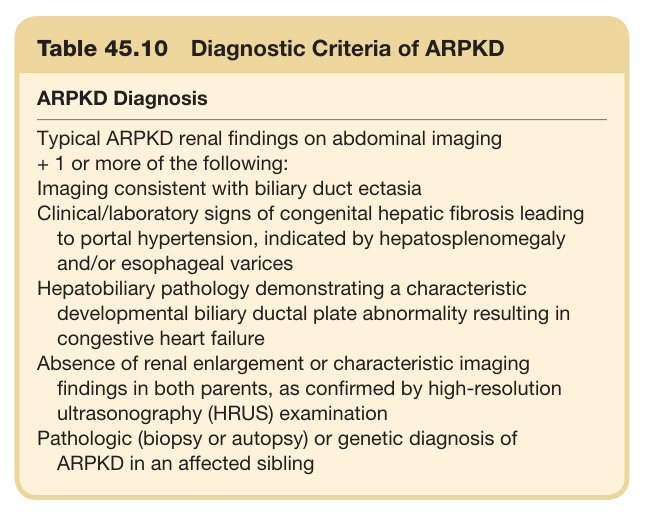

#### Table Data (CSV: [Table_45_10.csv](Table_45_10.csv))

```markdown
| Table Text (OCR) |
| :--- |
| Table 45.10 Diagnostic Criteria of ARPKD ARPKD Diagnosis Typical ARPKD renal findings on abdominal imaging+ 1 or more of the following:    Imaging consistent with biliary duct ectasia    Clinical/laboratory signs of congenital hepatic fibrosis leading to portal hypertension, indicated by hepatosplenomegaly and/or esophageal varices    Hepatobiliary pathology demonstrating a characteristic developmental biliary ductal plate abnormality resulting in congestive heart failure    Absence of renal enlargement or characteristic imaging findings in both parents, as confirmed by high-resolution ultrasonography (HRUS) examination    Pathologic (biopsy or autopsy) or genetic diagnosis of ARPKD in an affected sibling |
```

Table 45.10 Diagnostic Criteria of ARPKD

---

### Table_45_11

#### Table Images (2 Parts)

- **Part 1 (Page 39)**:
  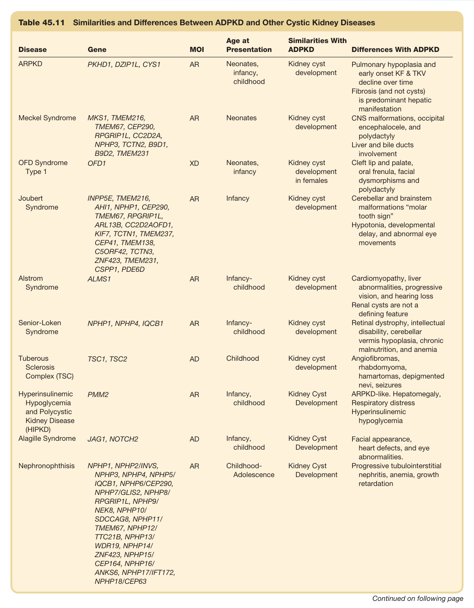

- **Part 2 (Page 40)**:
  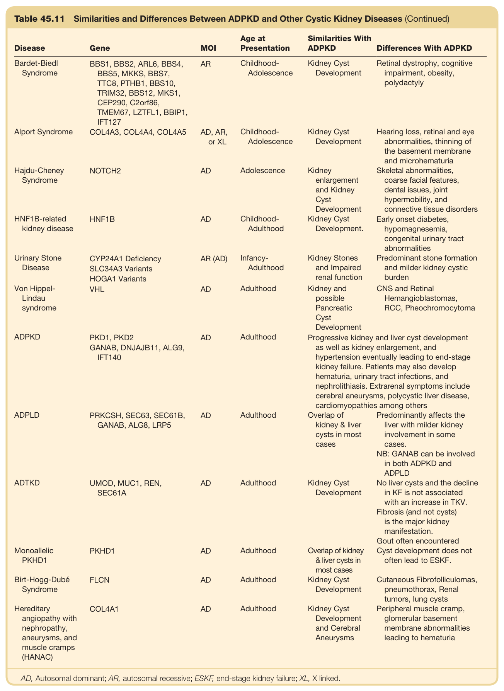

#### Table Data (CSV: [Table_45_11.csv](Table_45_11.csv))

```markdown
| Table Text (OCR) |
| :--- |
| Table 45.11  Similarities and Differences Between ADPKD and Other Cystic Kidney Diseases Disease  Gene  MOI  Age at Presentation  Similarities With ADPKD  Differences With ADPKD    ARPKD  PKHD1, DZIP1L, CYS1  AR  Neonates, infancy, childhood  Kidney cyst development  Pulmonary hypoplasia and early onset KF & TKV decline over timeFibrosis (and not cysts) is predominant hepatic manifestation    Meckel Syndrome  MKS1, TMEM216, TMEM67, CEP290, RPGRIP1L, CC2D2A, NPHP3, TCTN2, B9D1, B9D2, TMEM231  AR  Neonates  Kidney cyst development  CNS malformations, occipital encephalocele, and polydactylyLiver and bile ducts involvement    OFD Syndrome Type 1  OFD1  XD  Neonates, infancy  Kidney cyst development in females  Cleft lip and palate, oral frenula, facial dysmorphisms and polydactyly    Joubert Syndrome  INPP5E, TMEM216, AHI1, NPHP1, CEP290, TMEM67, RPGRIP1L, ARL13B, CC2D2AOFD1, KIF7, TCTN1, TMEM237, CEP41, TMEM138, C5ORF42, TCTN3, ZNF423, TMEM231, CSPP1, PDE6D  AR  Infancy  Kidney cyst development  Cerebellar and brainstem malformations “molar tooth sign”Hypotonia, developmental delay, and abnormal eye movements    Alstrom Syndrome  ALMS1  AR  Infancy-childhood  Kidney cyst development  Cardiomyopathy, liver abnormalities, progressive vision, and hearing lossRenal cysts are not a defining feature    Senior-Loken Syndrome  NPHP1, NPHP4, IQCB1  AR  Infancy-childhood  Kidney cyst development  Retinal dystrophy, intellectual disability, cerebellar vermis hypoplasia, chronic malnutrition, and anemia    Tuberous Sclerosis Complex (TSC)  TSC1, TSC2  AD  Childhood  Kidney cyst development  Angiofibromas, rhabdomyoma, hamartomas, depigmented nevi, seizures    Hyperinsulinemic Hypoglycemia and Polycystic Kidney Disease (HIPKD)  PMM2  AR  Infancy, childhood  Kidney Cyst Development  ARPKD-like. Hepatomegaly, Respiratory distressHyperinsulinemic hypoglycemia    Alagille Syndrome  JAG1, NOTCH2  AD  Infancy, childhood  Kidney Cyst Development  Facial appearance, heart defects, and eye abnormalities.    Nephronophthisis  NPHP1, NPHP2/INVS, NPHP3, NPHP4, NPHP5/ IQCB1, NPHP6/CEP290, NPHP7/GLIS2, NPHP8/ RPGRIP1L, NPHP9/ NEK8, NPHP10/ SDCCAG8, NPHP11/ TMEM67, NPHP12/ TTC21B, NPHP13/ WDR19, NPHP14/ ZNF423, NPHP15/ CEP164, NPHP16/ ANKS6, NPHP17/IFT172, NPHP18/CEP63  AR  Childhood-Adolescence  Kidney Cyst Development  Progressive tubulointerstitial nephritis, anemia, growth retardation    Bardet-Biedl Syndrome  BBS1, BBS2, ARL6, BBS4, BBS5, MKKS, BBS7, TTC8, PTHB1, BBS10, TRIM32, BBS12, MKS1, CEP290, C2orf86, TMEM67, LZTFL1, BBIP1, IFT127  AR  Childhood-Adolescence  Kidney Cyst Development  Retinal dystrophy, cognitive impairment, obesity, polydactyly    Alport Syndrome  COL4A3, COL4A4, COL4A5  AD, AR, or XL  Childhood-Adolescence  Kidney Cyst Development  Hearing loss, retinal and eye abnormalities, thinning of the basement membrane and microhematuria    Hajdu-Cheney Syndrome  NOTCH2  AD  Adolescence  Kidney enlargement and Kidney Cyst Development  Skeletal abnormalities, coarse facial features, dental issues, joint hypermobility, and connective tissue disorders    HNF1B-related kidney disease  HNF1B  AD  Childhood-Adulthood  Kidney Cyst Development.  Early onset diabetes, hypomagnesemia, congenital urinary tract abnormalities    Urinary Stone Disease  CYP24A1 Deficiency SLC34A3 Variants HOGA1 Variants  AR (AD)  Infancy-Adulthood  Kidney Stones and Impaired renal function  Predominant stone formation and milder kidney cystic burden    Von Hippel-Lindau syndrome  VHL  AD  Adulthood  Kidney and possible Pancreatic Cyst Development  CNS and Retinal Hemangioblastomas, RCC, Pheochromocytoma    ADPKD  PKD1, PKD2 GANAB, DNJAJB11, ALG9, IFT140  AD  Adulthood  Progressive kidney and liver cyst development as well as kidney enlargement, and hypertension eventually leading to end-stage kidney failure. Patients may also develop hematuria, urinary tract infections, and nephrolithiasis. Extrarenal symptoms include cerebral aneurysms, polycystic liver disease, cardiomyopathies among others      ADPLD  PRKCSH, SEC63, SEC61B, GANAB, ALG8, LRP5  AD  Adulthood  Overlap of kidney & liver cysts in most cases  Predominantly affects the liver with milder kidney involvement in some cases.NB: GANAB can be involved in both ADPKD and ADPLD    ADTKD  UMOD, MUC1, REN, SEC61A  AD  Adulthood  Kidney Cyst Development  No liver cysts and the decline in KF is not associated with an increase in TKV.Fibrosis (and not cysts) is the major kidney manifestation.Gout often encountered    Monoallelic PKHD1  PKHD1  AD  Adulthood  Overlap of kidney & liver cysts in most cases  Cyst development does not often lead to ESKF.    Birt-Hogg-Dubé Syndrome  FLCN  AD  Adulthood  Kidney Cyst Development  Cutaneous Fibrofolliculomas, pneumothorax, Renal tumors, lung cysts    Hereditary angiopathy with nephropathy, aneurysms, and muscle cramps (HANAC)  COL4A1  AD  Adulthood  Kidney Cyst Development and Cerebral Aneurysms  Peripheral muscle cramp, glomerular basement membrane abnormalities leading to hematuria AD, Autosomal dominant; AR, autosomal recessive; ESKF, end-stage kidney failure; XL, X linked. |
```

Table 45.11 Similarities and Differences Between ADPKD and Other Cystic Kidney Diseases

---

### Table_45_12

#### Table Images (6 Parts)

- **Part 1 (Page 44)**:
  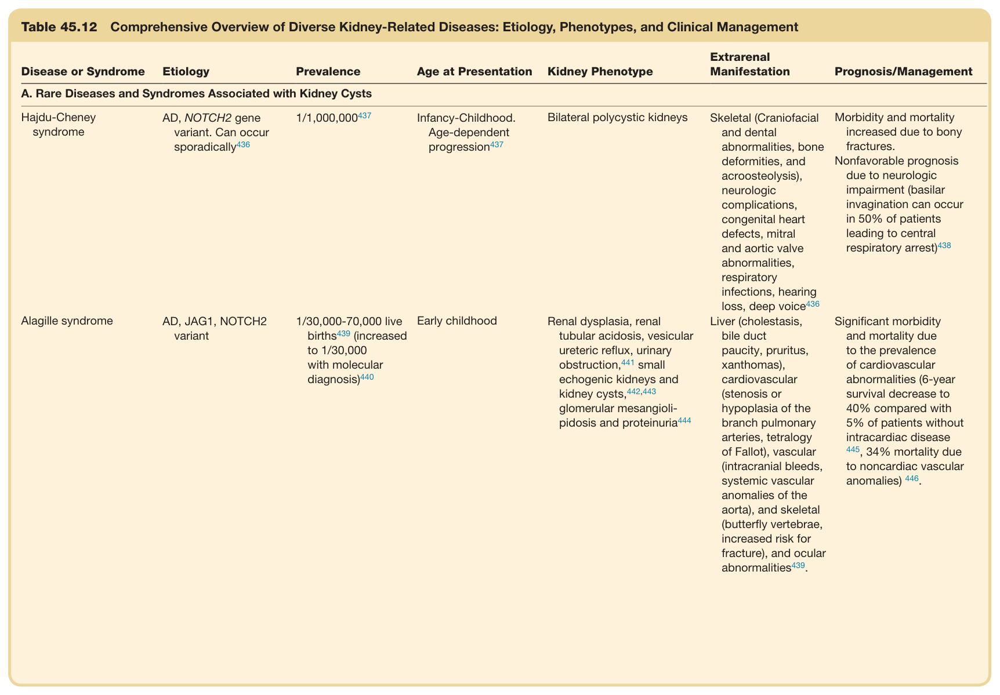

- **Part 2 (Page 45)**:
  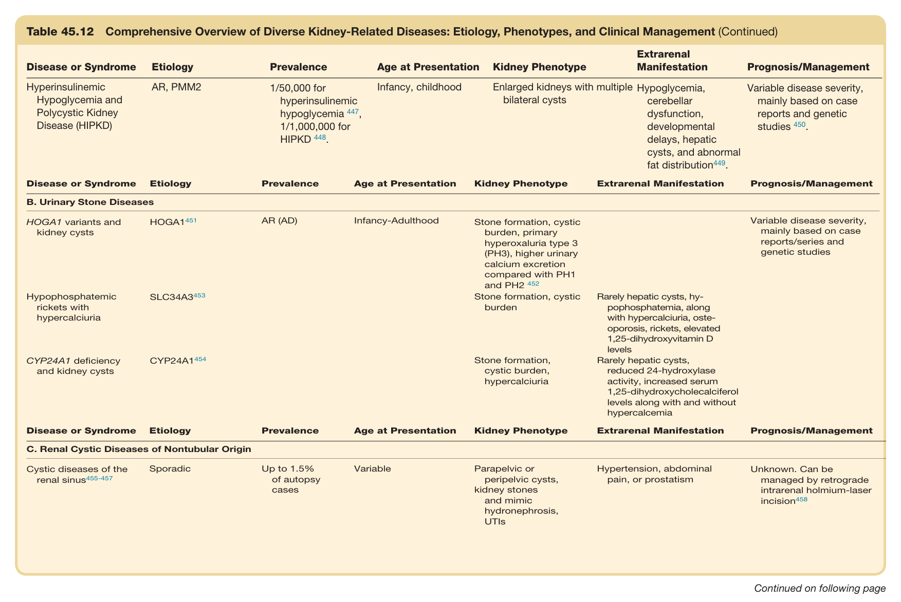

- **Part 3 (Page 46)**:
  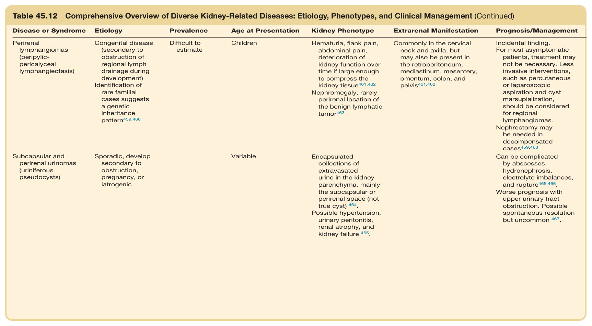

- **Part 4 (Page 47)**:
  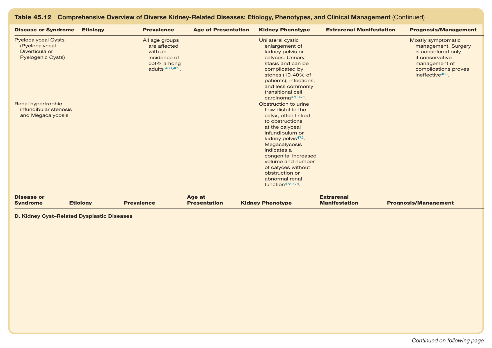

- **Part 5 (Page 48)**:
  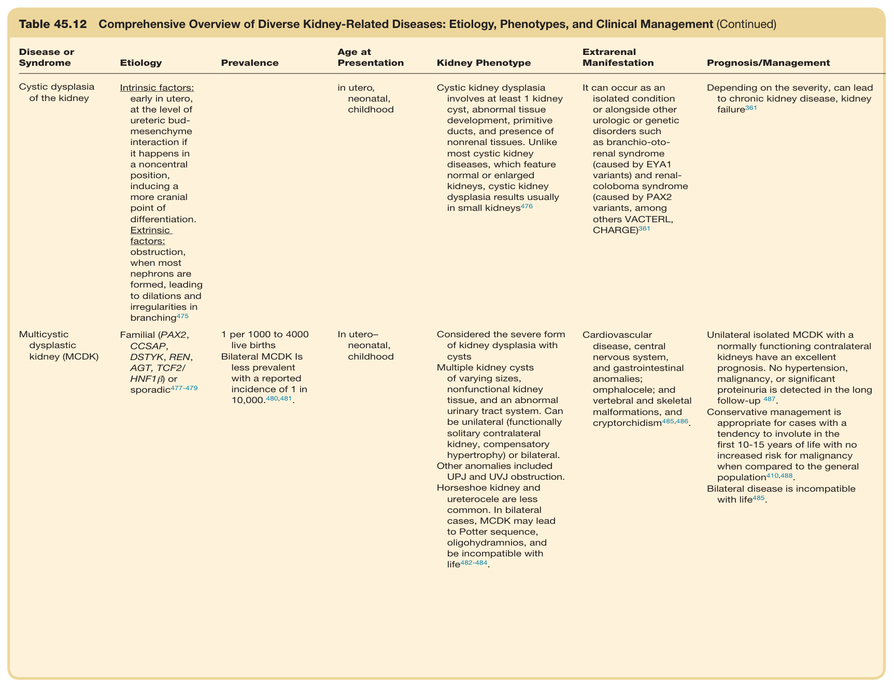

- **Part 6 (Page 49)**:
  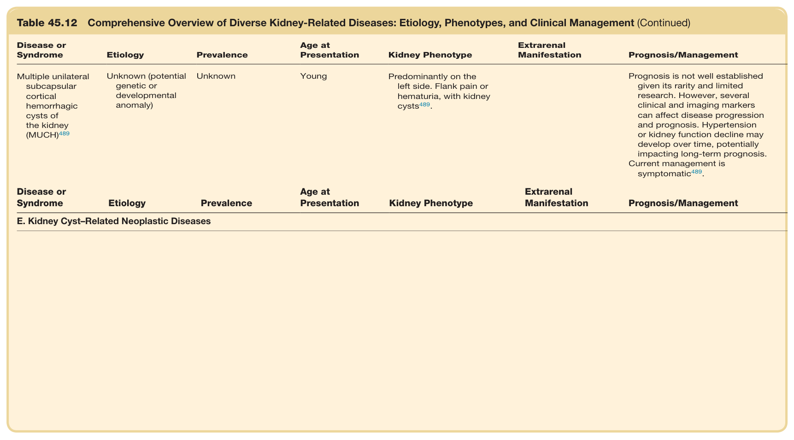

#### Table Data (CSV: [Table_45_12.csv](Table_45_12.csv))

```markdown
| Table Text (OCR) |
| :--- |
| Table 45.12Comprehensive Overview of Diverse Kidney-Related Diseases: Etiology, Phenotypes, and Clinical Management Disease or Syndrome  Etiology  Prevalence  Age at Presentation  Kidney Phenotype  Extrarenal Manifestation  Prognosis/Management    A. Rare Diseases and Syndromes Associated with Kidney Cysts    Hajdu-Cheney syndrome  AD, NOTCH2 gene variant. Can occur sporadically436  1/1,000,000437  Infancy-Childhood.Age-dependent progression437  Bilateral polycystic kidneys  Skeletal (Craniofacial and dental abnormalities, bone deformities, and acroosteolysis), neurologic complications, congenital heart defects, mitral and aortic valve abnormalities, respiratory infections, hearing loss, deep voice436  Morbidity and mortality increased due to bony fractures.Nonfavorable prognosis due to neurologic impairment (basilar invagination can occur in 50% of patients leading to central respiratory arrest)438    Alagille syndrome  AD, JAG1, NOTCH2 variant  1/30,000-70,000 live births439 (increased to 1/30,000 with molecular diagnosis)440  Early childhood  Renal dysplasia, renal tubular acidosis, vesicular ureteric reflux, urinary obstruction,441 small echogenic kidneys and kidney cysts,442,443 glomerular mesangiolipidosis and proteinuria444  Liver (cholestasis, bile duct paucity, pruritus, xanthomas), cardiovascular (stenosis or hypoplasia of the branch pulmonary arteries, tetralogy of Fallot), vascular (intracranial bleeds, systemic vascular anomalies of the aorta), and skeletal (butterfly vertebrae, increased risk for fracture), and ocular abnormalities439.  Significant morbidity and mortality due to the prevalence of cardiovascular abnormalities (6-year survival decrease to 40% compared with 5% of patients without intracardiac disease445, 34% mortality due to noncardiac vascular anomalies)446. |
```

Table 45.12 Comprehensive Overview of Diverse Kidney-Related Diseases: Etiology, Phenotypes, and Clinical Management (Continued)

---
