# 46. Primary and Secondary Hypertension - Figures and Tables Index

This document lists all figures and tables extracted from `46. Primary and Secondary Hypertension.pdf`.

## Table of Contents
- [Figures](#figures)
- [Tables](#tables)

---

## Figures

### Fig_46_1

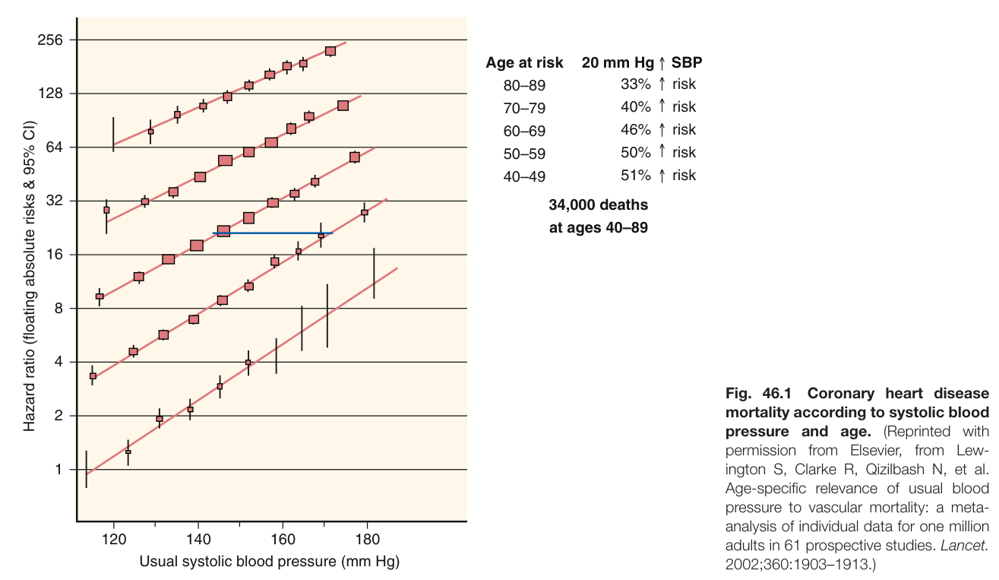

Fig. 46.1 Coronary heart disease mortality according to systolic blood pressure and age. (Reprinted with permission from Elsevier, from Lew- ington S, Clarke R, Qizilbash N, et al. Age-specific relevance of usual blood pressure to vascular mortality: a meta- analysis of individual data for one million adults in 61 prospective studies. Lancet. 2002;360:1903–1913.)

---

### Fig_46_2

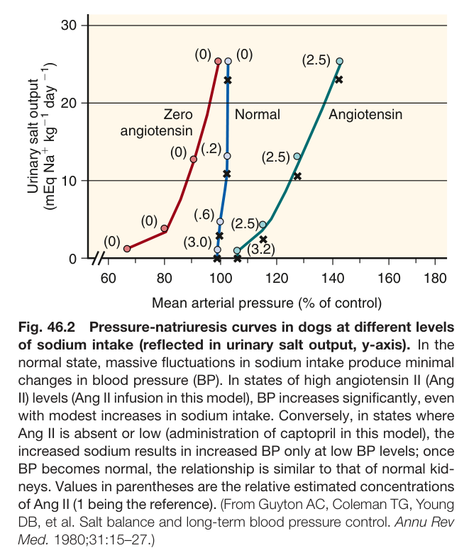

Fig. 46.2 Pressure-natriuresis curves in dogs at different levels of sodium intake (reflected in urinary salt output, y-axis). In the normal state, massive fluctuations in sodium intake produce minimal changes in blood pressure (BP). In states of high angiotensin II (Ang II) levels (Ang II infusion in this model), BP increases significantly, even with modest increases in sodium intake. Conversely, in states where Ang II is absent or low (administration of captopril in this model), the increased sodium results in increased BP only at low BP levels; once BP becomes normal, the relationship is similar to that of normal kid- neys. Values in parentheses are the relative estimated concentrations of Ang II (1 being the reference). (From Guyton AC, Coleman TG, Young DB, et al. Salt balance and long-term blood pressure control. Annu Rev Med. 1980;31:15–27.)

---

### Fig_46_3

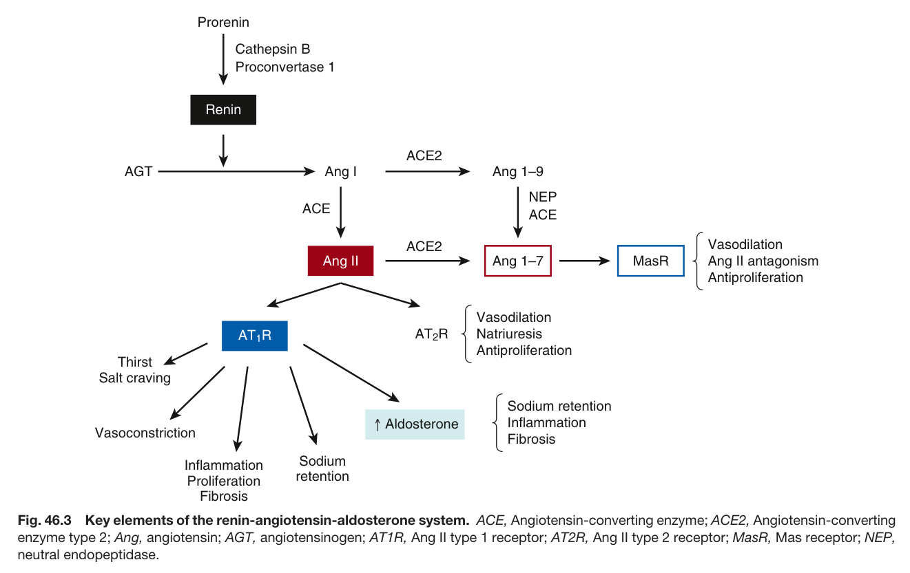

Fig. 46.3 Key elements of the renin-angiotensin-aldosterone system. ACE, Angiotensin-converting enzyme; ACE2, Angiotensin-converting enzyme type 2; Ang, angiotensin; AGT, angiotensinogen; AT1R, Ang II type 1 receptor; AT2R, Ang II type 2 receptor; MasR, Mas receptor; NEP, neutral endopeptidase.

---

### Fig_46_4

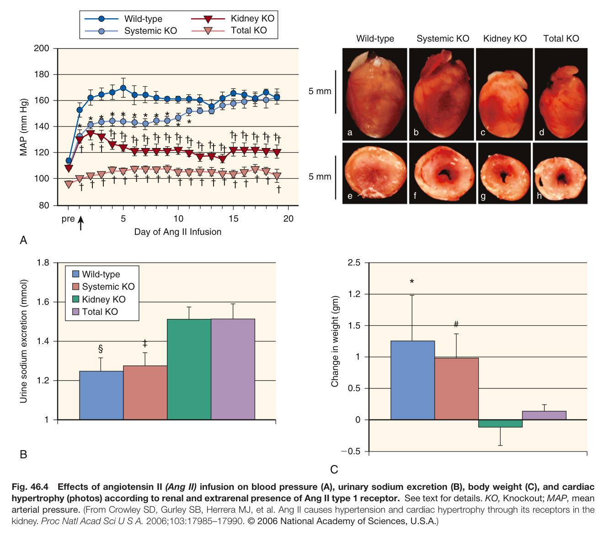

Fig. 46.4 Effects of angiotensin II (Ang II) infusion on blood pressure (A), urinary sodium excretion (B), body weight (C), and cardiac hypertrophy (photos) according to renal and extrarenal presence of Ang II type 1 receptor. See text for details. KO, Knockout; MAP, mean arterial pressure. (From Crowley SD, Gurley SB, Herrera MJ, et al. Ang II causes hypertension and cardiac hypertrophy through its receptors in the kidney. Proc Natl Acad Sci U S A. 2006;103:17985–17990. © 2006 National Academy of Sciences, U.S.A.)

---

### Fig_46_5

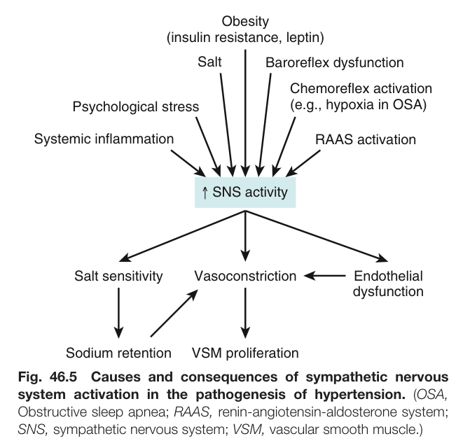

Fig. 46.5 Causes and consequences of sympathetic nervous system activation in the pathogenesis of hypertension. (OSA, Obstructive sleep apnea; RAAS, renin-angiotensin-aldosterone system; SNS, sympathetic nervous system; VSM, vascular smooth muscle.)

---

### Fig_46_6

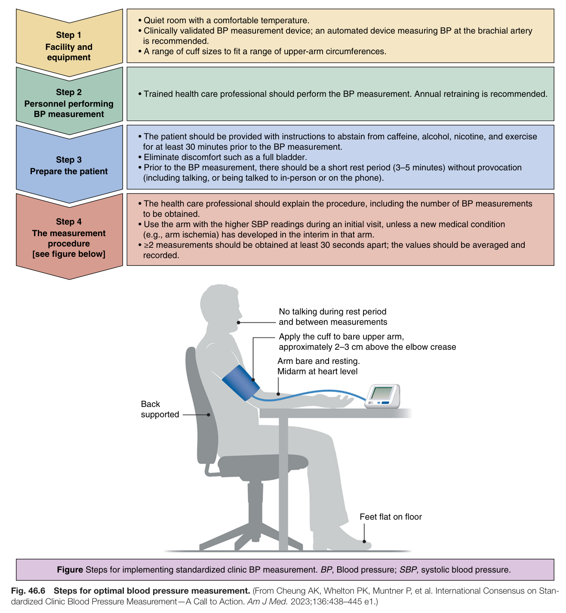

Fig. 46.6 Steps for optimal blood pressure measurement. (From Cheung AK, Whelton PK, Muntner P, et al. International Consensus on Stan dardized Clinic Blood Pressure Measurement—A Call to Action. Am J Med. 2023;136:438–445 e1.)

---

### Fig_46_7

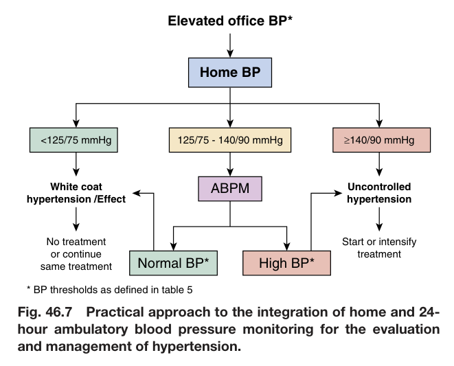

Fig. 46.7 Practical approach to the integration of home and 24- hour ambulatory blood pressure monitoring for the evaluation and management of hypertension.

---

### Fig_46_8

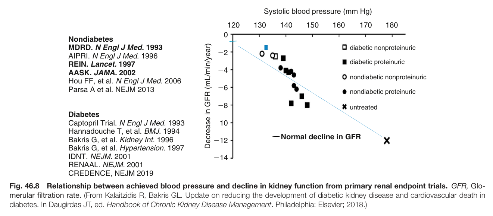

Fig. 46.8 Relationship between achieved blood pressure and decline in kidney function from primary renal endpoint trials. GFR, Glo- merular filtration rate. (From Kalaitzidis R, Bakris GL. Update on reducing the development of diabetic kidney disease and cardiovascular death in diabetes. In Daugirdas JT, ed. Handbook of Chronic Kidney Disease Management. Philadelphia: Elsevier; 2018.)

---

### Fig_46_9

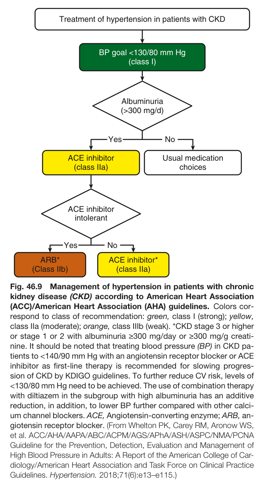

Fig. 46.9 Management of hypertension in patients with chronic kidney disease (CKD) according to American Heart Association (ACC)/American Heart Association (AHA) guidelines. Colors cor- respond to class of recommendation: green, class I (strong); yellow, class IIa (moderate); orange, class IIIb (weak). *CKD stage 3 or higher or stage 1 or 2 with albuminuria ≥300 mg/day or ≥300 mg/g creati- nine. It should be noted that treating blood pressure (BP) in CKD pa- tients to <140/90 mm Hg with an angiotensin receptor blocker or ACE inhibitor as first-line therapy is recommended for slowing progres- sion of CKD by KDIGO guidelines. To further reduce CV risk, levels of <130/80 mm Hg need to be achieved. The use of combination therapy with diltiazem in the subgroup with high albuminuria has an additive reduction, in addition, to lower BP further compared with other calci- um channel blockers. ACE, Angiotensin-converting enzyme; ARB, an- giotensin receptor blocker. (From Whelton PK, Carey RM, Aronow WS, et al. ACC/AHA/AAPA/ABC/ACPM/AGS/APhA/ASH/ASPC/NMA/PCNA Guideline for the Prevention, Detection, Evaluation and Management of High Blood Pressure in Adults: A Report of the American College of Car- diology/American Heart Association and Task Force on Clinical Practice Guidelines. Hypertension. 2018;71(6):e13–e115.)

---

## Tables

### Table_46_1

#### Table Image

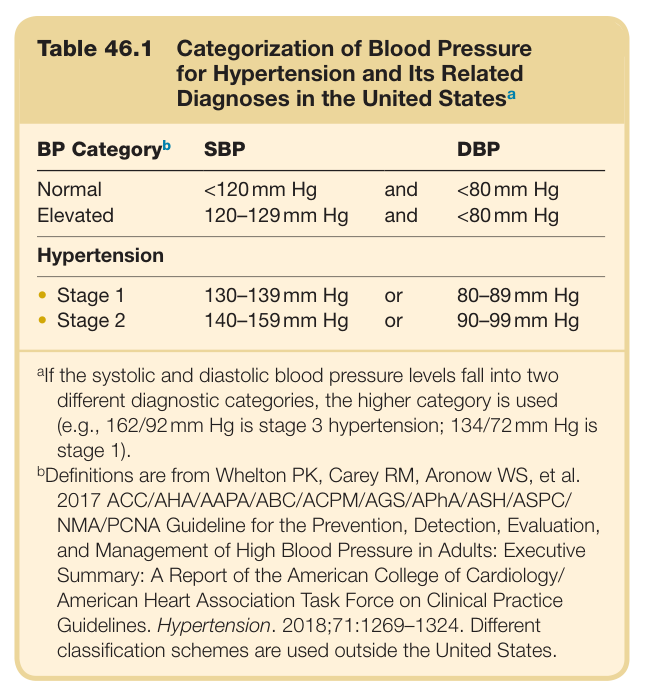

#### Table Data (CSV: [Table_46_1.csv](Table_46_1.csv))

```markdown
| Table Text (OCR) |
| :--- |
| Table 46.1 Categorization of Blood Pressure for Hypertension and Its Related Diagnoses in the United States<sup>a</sup> BP Categoryb  SBP  DBP    Normal  <120 mm Hg  and  <80 mm Hg    Elevated  120–129 mm Hg  and  <80 mm Hg    Hypertension    • Stage 1  130–139 mm Hg  or  80–89 mm Hg    • Stage 2  140–159 mm Hg  or  90–99 mm Hg |
```

Table 46.1 Categorization of Blood Pressure for Hypertension and Its Related Diagnoses in the United States<sup>a</sup>

---

### Table_46_2

#### Table Image

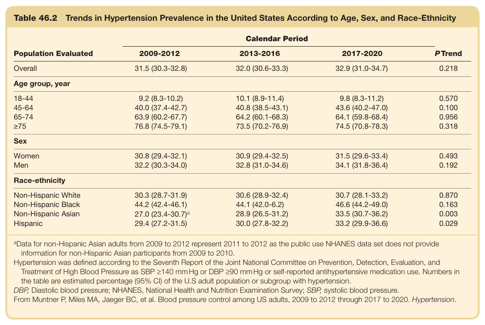

#### Table Data (CSV: [Table_46_2.csv](Table_46_2.csv))

```markdown
| Table Text (OCR) |
| :--- |
| Fig. 46.1 Coronary heart disease mortality according to systolic blood pressure and age. (Reprinted with permission from Elsevier, from Lew- ington S, Clarke R, Qizilbash N, et al. Age-specific relevance of usual blood pressure to vascular mortality: a meta- analysis of individual data for one million adults in 61 prospective studies. Lancet. 2002;360:1903–1913.) Table 46.2  Trends in Hypertension Prevalence in the United States According to Age, Sex, and Race-Ethnicity Population Evaluated  Calendar Period    2009-2012  2013-2016  2017-2020  PTrend    Overall  31.5 (30.3-32.8)  32.0 (30.6-33.3)  32.9 (31.0-34.7)  0.218    Age group, year    18-44  9.2 (8.3-10.2)  10.1 (8.9-11.4)  9.8 (8.3-11.2)  0.570    45-64  40.0 (37.4-42.7)  40.8 (38.5-43.1)  43.6 (40.2-47.0)  0.100    65-74  63.9 (60.2-67.7)  64.2 (60.1-68.3)  64.1 (59.8-68.4)  0.956    ≥75  76.8 (74.5-79.1)  73.5 (70.2-76.9)  74.5 (70.8-78.3)  0.318    Sex    Women  30.8 (29.4-32.1)  30.9 (29.4-32.5)  31.5 (29.6-33.4)  0.493    Men  32.2 (30.3-34.0)  32.8 (31.0-34.6)  34.1 (31.8-36.4)  0.192    Race-ethnicity    Non-Hispanic White  30.3 (28.7-31.9)  30.6 (28.9-32.4)  30.7 (28.1-33.2)  0.870    Non-Hispanic Black  44.2 (42.4-46.1)  44.1 (42.0-6.2)  46.6 (44.2-49.0)  0.163    Non-Hispanic Asian   27.0 (23.4-30.7)^a   28.9 (26.5-31.2)  33.5 (30.7-36.2)  0.003    Hispanic  29.4 (27.2-31.5)  30.0 (27.8-32.2)  33.2 (29.9-36.6)  0.029 <sup>a</sup>Data for non-Hispanic Asian adults from 2009 to 2012 represent 2011 to 2012 as the public use NHANES data set does not provide information for non-Hispanic Asian participants from 2009 to 2010. Hypertension was defined according to the Seventh Report of the Joint National Committee on Prevention, Detection, Evaluation, and Treatment of High Blood Pressure as SBP ≥140 mmHg or DBP ≥90 mmHg or self-reported antihypertensive medication use. Numbers in the table are estimated percentage (95% CI) of the U.S adult population or subgroup with hypertension. DBP, Diastolic blood pressure; NHANES, National Health and Nutrition Examination Survey; SBP, systolic blood pressure. From Muntner P, Miles MA, Jaeger BC, et al. Blood pressure control among US adults, 2009 to 2012 through 2017 to 2020. Hypertension. |
```

Table 46.2 Trends in Hypertension Prevalence in the United States According to Age, Sex, and Race-Ethnicity

---

### Table_46_3

#### Table Image

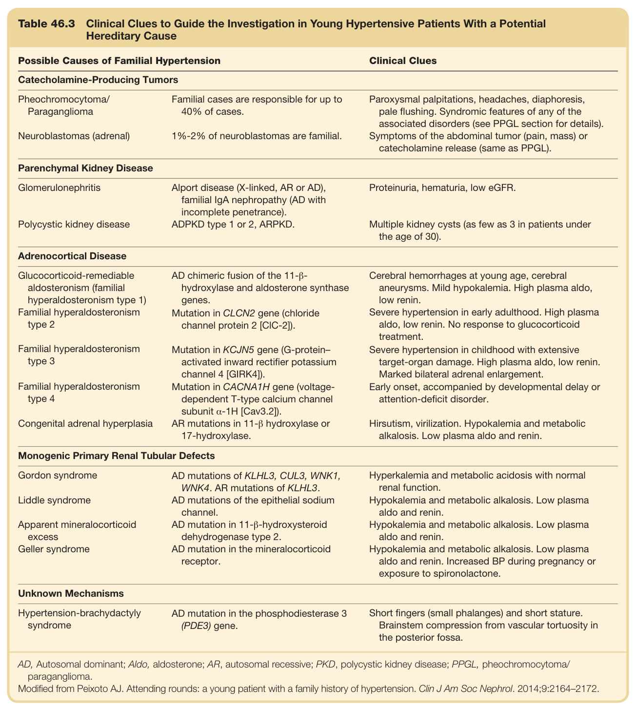

#### Table Data (CSV: [Table_46_3.csv](Table_46_3.csv))

```markdown
| Table Text (OCR) |
| :--- |
| Table 46.3  Clinical Clues to Guide the Investigation in Young Hypertensive Patients With a Potential Hereditary Cause Possible Causes of Familial Hypertension  Clinical Clues    Catecholamine-Producing Tumors    Pheochromocytoma/Paraganglioma  Familial cases are responsible for up to 40% of cases.  Paroxysmal palpitations, headaches, diaphoresis, pale flushing. Syndromic features of any of the associated disorders (see PPGL section for details).    Neuroblastomas (adrenal)  1%-2% of neuroblastomas are familial.  Symptoms of the abdominal tumor (pain, mass) or catecholamine release (same as PPGL).    Parenchymal Kidney Disease    Glomerulonephritis  Alport disease (X-linked, AR or AD), familial IgA nephropathy (AD with incomplete penetrance).  Proteinuria, hematuria, low eGFR.    Polycystic kidney disease  ADPKD type 1 or 2, ARPKD.  Multiple kidney cysts (as few as 3 in patients under the age of 30).    Adrenocortical Disease    Glucocorticoid-remediable aldosteronism (familial hyperaldosteronism type 1)  AD chimeric fusion of the 11-β-hydroxylase and aldosterone synthase genes.  Cerebral hemorrhages at young age, cerebral aneurysms. Mild hypokalemia. High plasma aldo, low renin.    Familial hyperaldosteronism type 2  Mutation in CLCN2 gene (chloride channel protein 2 [CIC-2]).  Severe hypertension in early adulthood. High plasma aldo, low renin. No response to glucocorticoid treatment.    Familial hyperaldosteronism type 3  Mutation in KCJN5 gene (G-protein-activated inward rectifier potassium channel 4 [GIRK4]).  Severe hypertension in childhood with extensive target-organ damage. High plasma aldo, low renin. Marked bilateral adrenal enlargement.    Familial hyperaldosteronism type 4  Mutation in CACNA1H gene (voltage-dependent T-type calcium channel subunit α-1H [Cav3.2]).  Early onset, accompanied by developmental delay or attention-deficit disorder.    Congenital adrenal hyperplasia  AR mutations in 11-β hydroxylase or 17-hydroxylase.  Hirsutism, virilization. Hypokalemia and metabolic alkalosis. Low plasma aldo and renin.    Monogenic Primary Renal Tubular Defects    Gordon syndrome  AD mutations of KLHL3, CUL3, WNK1, WNK4. AR mutations of KLHL3.  Hyperkalemia and metabolic acidosis with normal renal function.    Liddle syndrome  AD mutations of the epithelial sodium channel.  Hypokalemia and metabolic alkalosis. Low plasma aldo and renin.    Apparent mineralocorticoid excess  AD mutation in 11-β-hydroxysteroid dehydrogenase type 2.  Hypokalemia and metabolic alkalosis. Low plasma aldo and renin.    Geller syndrome  AD mutation in the mineralocorticoid receptor.  Hypokalemia and metabolic alkalosis. Low plasma aldo and renin. Increased BP during pregnancy or exposure to spironolactone.    Unknown Mechanisms    Hypertension-brachydactyly syndrome  AD mutation in the phosphodiesterase 3 (PDE3) gene.  Short fingers (small phalanges) and short stature. Brainstem compression from vascular tortuosity in the posterior fossa.    AD, Autosomal dominant; Aldo, aldosterone; AR, autosomal recessive; PKD, polycystic kidney disease; PPGL, pheochromocytoma/paraganglioma.Modified from Peixoto AJ. Attending rounds: a young patient with a family history of hypertension. Clin J Am Soc Nephrol. 2014;9:2164-2172. |
```

Table 46.3 Clinical Clues to Guide the Investigation in Young Hypertensive Patients With a Potential Hereditary Cause

---

### Table_46_4

#### Table Image

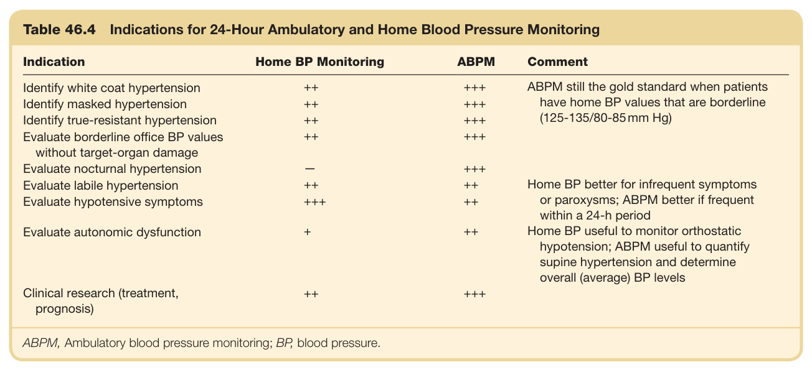

#### Table Data (CSV: [Table_46_4.csv](Table_46_4.csv))

```markdown
| Table Text (OCR) |
| :--- |
| Table 46.4 Indications for 24-Hour Ambulatory and Home Blood Pressure Monitoring Indication  Home BP Monitoring  ABPM  Comment    Identify white coat hypertension  ++  +++  ABPM still the gold standard when patients have home BP values that are borderline (125-135/80-85 mm Hg)    Identify masked hypertension  ++  +++    Identify true-resistant hypertension  ++  +++    Evaluate borderline office BP values without target-organ damage  ++  +++    Evaluate nocturnal hypertension  —  +++    Evaluate labile hypertension  ++  ++  Home BP better for infrequent symptoms or paroxysms; ABPM better if frequent within a 24-h period    Evaluate hypotensive symptoms  +++  ++    Evaluate autonomic dysfunction  +  ++  Home BP useful to monitor orthostatic hypotension; ABPM useful to quantify supine hypertension and determine overall (average) BP levels    Clinical research (treatment, prognosis)  ++  +++ ABPM, Ambulatory blood pressure monitoring; BP, blood pressure. |
```

Table 46.4 Indications for 24-Hour Ambulatory and Home Blood Pressure Monitoring

---

### Table_46_5

#### Table Image

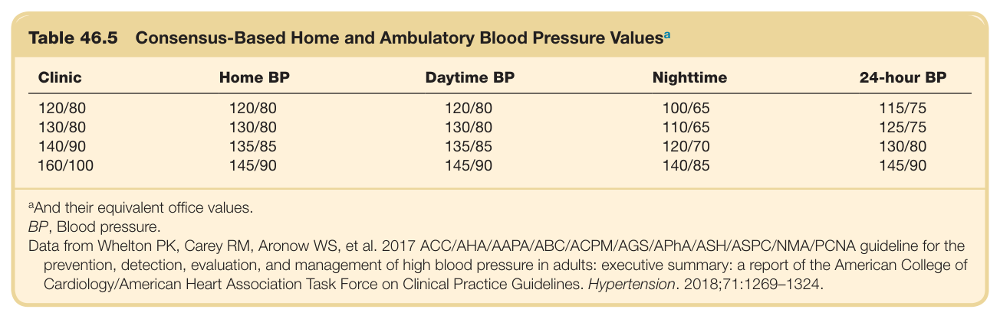

#### Table Data (CSV: [Table_46_5.csv](Table_46_5.csv))

```markdown
| Table Text (OCR) |
| :--- |
| Table 46.5 Consensus-Based Home and Ambulatory Blood Pressure Values<sup>a</sup> Clinic  Home BP  Daytime BP  Nighttime  24-hour BP    120/80  120/80  120/80  100/65  115/75    130/80  130/80  130/80  110/65  125/75    140/90  135/85  135/85  120/70  130/80    160/100  145/90  145/90  140/85  145/90 <sup>a</sup>And their equivalent office values. BP, Blood pressure. Data from Whelton PK, Carey RM, Aronow WS, et al. 2017 ACC/AHA/AAPA/ABC/ACPM/AGS/APhA/ASH/ASPC/NMA/PCNA guideline for the prevention, detection, evaluation, and management of high blood pressure in adults: executive summary: a report of the American College of Cardiology/American Heart Association Task Force on Clinical Practice Guidelines. Hypertension. 2018;71:1269–1324. |
```

Table 46.5 Consensus-Based Home and Ambulatory Blood Pressure Values<sup>a</sup>

---

### Table_46_6

#### Table Image

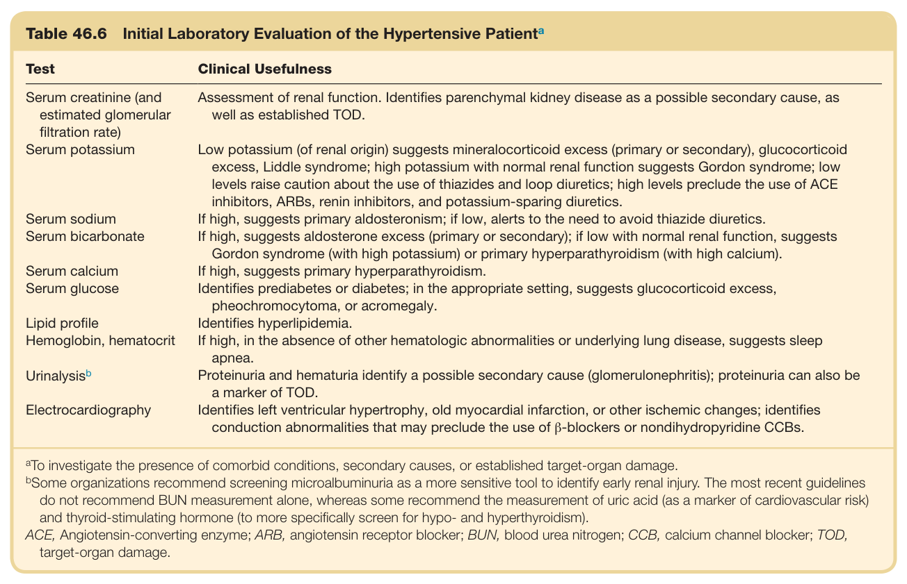

#### Table Data (CSV: [Table_46_6.csv](Table_46_6.csv))

```markdown
| Table Text (OCR) |
| :--- |
| Table 46.6 Initial Laboratory Evaluation of the Hypertensive Patient<sup>a</sup> Test  Clinical Usefulness    Serum creatinine (and estimated glomerular filtration rate)  Assessment of renal function. Identifies parenchymal kidney disease as a possible secondary cause, as well as established TOD.    Serum potassium  Low potassium (of renal origin) suggests mineralocorticoid excess (primary or secondary), glucocorticoid excess, Liddle syndrome; high potassium with normal renal function suggests Gordon syndrome; low levels raise caution about the use of thiazides and loop diuretics; high levels preclude the use of ACE inhibitors, ARBs, renin inhibitors, and potassium-sparing diuretics.    Serum sodium  If high, suggests primary aldosteronism; if low, alerts to the need to avoid thiazide diuretics.    Serum bicarbonate  If high, suggests aldosterone excess (primary or secondary); if low with normal renal function, suggests Gordon syndrome (with high potassium) or primary hyperparathyroidism (with high calcium).    Serum calcium  If high, suggests primary hyperparathyroidism.    Serum glucose  Identifies prediabetes or diabetes; in the appropriate setting, suggests glucocorticoid excess, pheochromocytoma, or acromegaly.    Lipid profile  Identifies hyperlipidemia.    Hemoglobin, hematocrit  If high, in the absence of other hematologic abnormalities or underlying lung disease, suggests sleep apnea.    Urinalysis ^{b}   Proteinuria and hematuria identify a possible secondary cause (glomerulonephritis); proteinuria can also be a marker of TOD.    Electrocardiography  Identifies left ventricular hypertrophy, old myocardial infarction, or other ischemic changes; identifies conduction abnormalities that may preclude the use of β-blockers or nondihydropyridine CCBs. <sup>a</sup>To investigate the presence of comorbid conditions, secondary causes, or established target-organ damage. <sup>b</sup>Some organizations recommend screening microalbuminuria as a more sensitive tool to identify early renal injury. The most recent guidelines do not recommend BUN measurement alone, whereas some recommend the measurement of uric acid (as a marker of cardiovascular risk) and thyroid-stimulating hormone (to more specifically screen for hypo- and hyperthyroidism). ACE, Angiotensin-converting enzyme; ARB, angiotensin receptor blocker; BUN, blood urea nitrogen; CCB, calcium channel blocker; TOD, target-organ damage. |
```

Table 46.6 Initial Laboratory Evaluation of the Hypertensive Patient<sup>a</sup>

---

### Table_46_7

#### Table Image

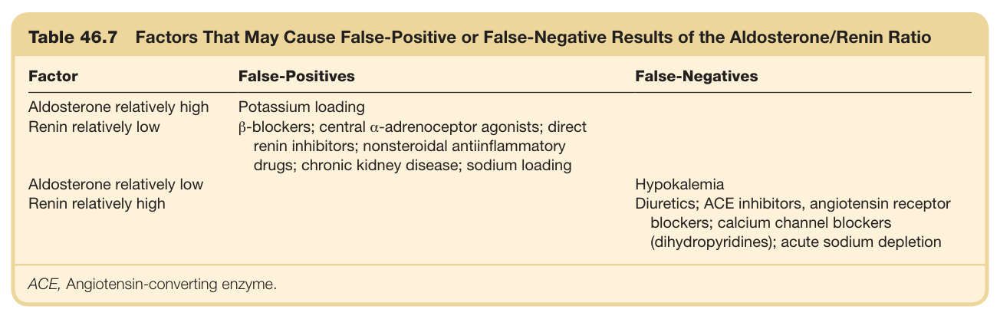

#### Table Data (CSV: [Table_46_7.csv](Table_46_7.csv))

```markdown
| Table Text (OCR) |
| :--- |
| Table 46.7 Factors That May Cause False-Positive or False-Negative Results of the Aldosterone/Renin Ratio Factor  False-Positives  False-Negatives    Aldosterone relatively highRenin relatively low  Potassium loading \beta -blockers; central  \alpha -adrenoceptor agonists; direct renin inhibitors; nonsteroidal antiinflammatory drugs; chronic kidney disease; sodium loading      Aldosterone relatively lowRenin relatively high    HypokalemiaDiuretics; ACE inhibitors, angiotensin receptor blockers; calcium channel blockers (dihydropyridines); acute sodium depletion    ACE, Angiotensin-converting enzyme. |
```

Table 46.7 Factors That May Cause False-Positive or False-Negative Results of the Aldosterone/Renin Ratio

---

### Table_46_8

#### Table Image

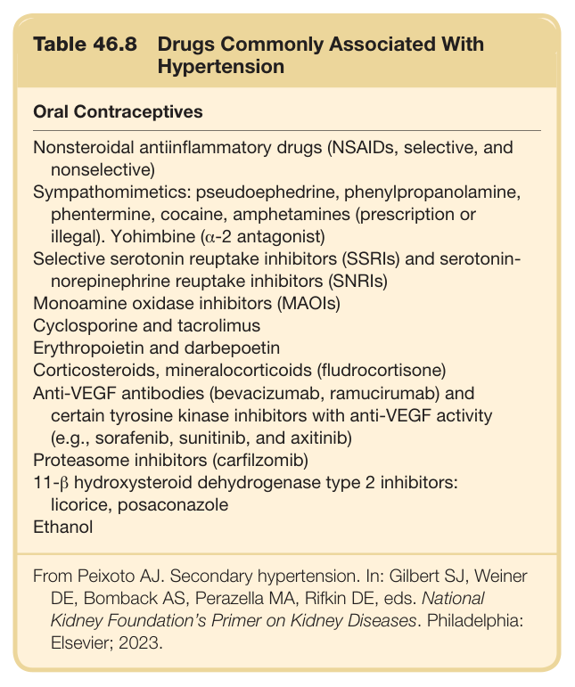

#### Table Data (CSV: [Table_46_8.csv](Table_46_8.csv))

```markdown
| Table Text (OCR) |
| :--- |
| Table 46.8  Drugs Commonly Associated With Hypertension Oral Contraceptives Nonsteroidal antiinflammatory drugs (NSAIDs, selective, and nonselective)    Sympathomimetics: pseudoephedrine, phenylpropanolamine, phentermine, cocaine, amphetamines (prescription or illegal). Yohimbine (α-2 antagonist)    Selective serotonin reuptake inhibitors (SSRIs) and serotonin-norepinephrine reuptake inhibitors (SNRIs)    Monoamine oxidase inhibitors (MAOIs)    Cyclosporine and tacrolimus    Erythropoietin and darbepoetin    Corticosteroids, mineralocorticoids (fludrocortisone)    Anti-VEGF antibodies (bevacizumab, ramucirumab) and certain tyrosine kinase inhibitors with anti-VEGF activity (e.g., sorafenib, sunitinib, and axitinib)    Proteasome inhibitors (carfilzomib)    11-β hydroxysteroid dehydrogenase type 2 inhibitors: licorice, posaconazole    Ethanol From Peixoto AJ. Secondary hypertension. In: Gilbert SJ, Weiner DE, Bomback AS, Perazella MA, Rifkin DE, eds. National Kidney Foundation’s Primer on Kidney Diseases. Philadelphia: Elsevier; 2023. |
```

Table 46.8 Drugs Commonly Associated With Hypertension

---

### Table_46_9

#### Table Image

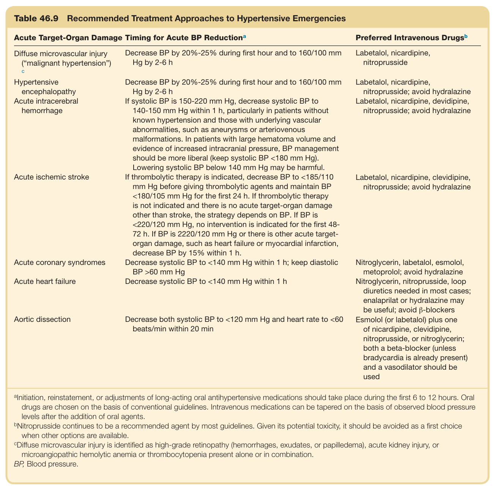

#### Table Data (CSV: [Table_46_9.csv](Table_46_9.csv))

```markdown
| Table Text (OCR) |
| :--- |
| Table 46.9  Recommended Treatment Approaches to Hypertensive Emergencies Acute Target-Organ Damage Timing for Acute BP Reductiona  Preferred Intravenous Drugsb    Diffuse microvascular injury ("malignant hypertension")c  Decrease BP by 20%-25% during first hour and to 160/100 mm Hg by 2-6 h  Labetalol, nicardipine, nitroprusside    Hypertensive encephalopathy  Decrease BP by 20%-25% during first hour and to 160/100 mm Hg by 2-6 h  Labetalol, nicardipine, nitroprusside; avoid hydralazine    Acute intracerebral hemorrhage  If systolic BP is 150-220 mm Hg, decrease systolic BP to 140-150 mm Hg within 1 h, particularly in patients without known hypertension and those with underlying vascular abnormalities, such as aneurysms or arteriovenous malformations. In patients with large hematoma volume and evidence of increased intracranial pressure, BP management should be more liberal (keep systolic BP <180 mm Hg). Lowering systolic BP below 140 mm Hg may be harmful.  Labetalol, nicardipine, devidipine, nitroprusside; avoid hydralazine    Acute ischemic stroke  If thrombolytic therapy is indicated, decrease BP to <185/110 mm Hg before giving thrombolytic agents and maintain BP <180/105 mm Hg for the first 24 h. If thrombolytic therapy is not indicated and there is no acute target-organ damage other than stroke, the strategy depends on BP. If BP is <220/120 mm Hg, no intervention is indicated for the first 48-72 h. If BP is 2220/120 mm Hg or there is other acute target-organ damage, such as heart failure or myocardial infarction, decrease BP by 15% within 1 h.  Labetalol, nicardipine, clevidipine, nitroprusside; avoid hydralazine    Acute coronary syndromes  Decrease systolic BP to <140 mm Hg within 1 h; keep diastolic BP >60 mm Hg  Nitroglycerin, labetalol, esmolol, metoprolol; avoid hydralazine    Acute heart failure  Decrease systolic BP to <140 mm Hg within 1 h  Nitroglycerin, nitroprusside, loop diuretics needed in most cases; enalaprilat or hydralazine may be useful; avoid β-blockers    Aortic dissection  Decrease both systolic BP to <120 mm Hg and heart rate to <60 beats/min within 20 min  Esmolol (or labetalol) plus one of nicardipine, clevidipine, nitroprusside, or nitroglycerin; both a beta-blocker (unless bradycardia is already present) and a vasodilator should be used <sup>a</sup>Initiation, reinstatement, or adjustments of long-acting oral antihypertensive medications should take place during the first 6 to 12 hours. Oral drugs are chosen on the basis of conventional guidelines. Intravenous medications can be tapered on the basis of observed blood pressure levels after the addition of oral agents. <sup>b</sup>Nitroprusside continues to be a recommended agent by most guidelines. Given its potential toxicity, it should be avoided as a first choice when other options are available. <sup>c</sup>Diffuse microvascular injury is identified as high-grade retinopathy (hemorrhages, exudates, or papilledema), acute kidney injury, or microangiopathic hemolytic anemia or thrombocytopenia present alone or in combination. BP, Blood pressure. |
```

Table 46.9 Recommended Treatment Approaches to Hypertensive Emergencies

---
