# 47. Renovascular Hypertension and Ischemic Nephropathy - Figures and Tables Index

This document lists all figures, tables and boxes extracted from `47. Renovascular Hypertension and Ischemic Nephropathy.pdf`.

## Table of Contents
- [Figures](#figures)
- [Tables](#tables)
- [Boxes](#boxes)

---

## Figures

### Fig_47_1

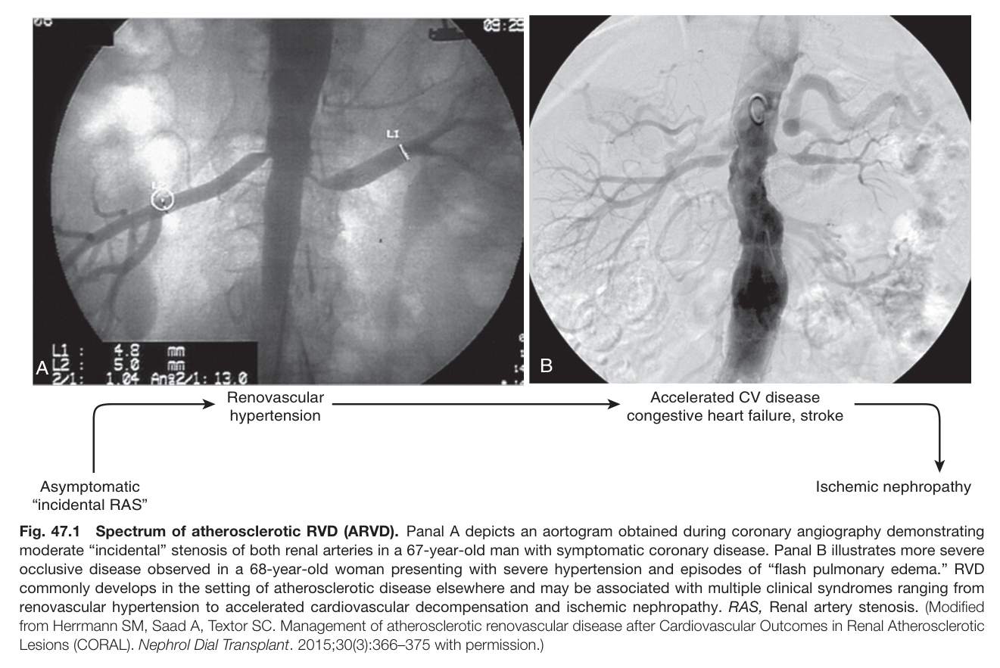

Fig. 47.1 Spectrum of atherosclerotic RVD (ARVD). Panal A depicts an aortogram obtained during coronary angiography demonstrating moderate “incidental” stenosis of both renal arteries in a 67-year-old man with symptomatic coronary disease. Panal B illustrates more severe occlusive disease observed in a 68-year-old woman presenting with severe hypertension and episodes of “flash pulmonary edema.” RVD commonly develops in the setting of atherosclerotic disease elsewhere and may be associated with multiple clinical syndromes ranging from renovascular hypertension to accelerated cardiovascular decompensation and ischemic nephropathy. RAS, Renal artery stenosis. (Modified from Herrmann SM, Saad A, Textor SC. Management of atherosclerotic renovascular disease after Cardiovascular Outcomes in Renal Atherosclerotic Lesions (CORAL). Nephrol Dial Transplant. 2015;30(3):366–375 with permission.)

---

### Fig_47_2

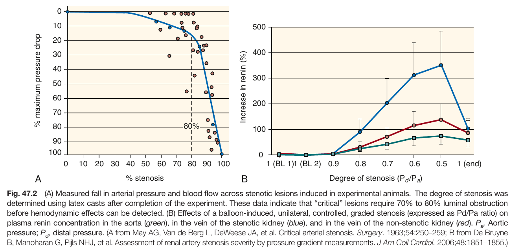

Fig. 47.2 (A) Measured fall in arterial pressure and blood flow across stenotic lesions induced in experimental animals. The degree of stenosis was determined using latex casts after completion of the experiment. These data indicate that “critical” lesions require 70% to 80% luminal obstruction before hemodynamic effects can be detected. (B) Effects of a balloon-induced, unilateral, controlled, graded stenosis (expressed as Pd/Pa ratio) on plasma renin concentration in the aorta (green), in the vein of the stenotic kidney (blue), and in the vein of the non-stenotic kidney (red). P , Aortic pressure; P , distal pressure. (A from May AG, Van de Berg L, DeWeese JA, et al. Critical arterial stenosis. Surgery. 1963;54:250–259; B from De Bruyne B, Manoharan G, Pijls NHJ, et al. Assessment of renal artery stenosis severity by pressure gradient measurements. J Am Coll Cardiol. 2006;48:1851–1855.)

---

### Fig_47_3

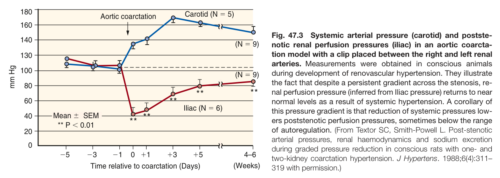

Fig. 47.3 Systemic arterial pressure (carotid) and postste- notic renal perfusion pressures (iliac) in an aortic coarcta- tion model with a clip placed between the right and left renal arteries. Measurements were obtained in conscious animals during development of renovascular hypertension. They illustrate the fact that despite a persistent gradient across the stenosis, re- nal perfusion pressure (inferred from Iliac pressure) returns to near normal levels as a result of systemic hypertension. A corollary of this pressure gradient is that reduction of systemic pressures low- ers poststenotic perfusion pressures, sometimes below the range of autoregulation. (From Textor SC, Smith-Powell L. Post-stenotic arterial pressures, renal haemodynamics and sodium excretion during graded pressure reduction in conscious rats with one- and two-kidney coarctation hypertension. J Hypertens. 1988;6(4):311– 319 with permission.)

---

### Fig_47_4

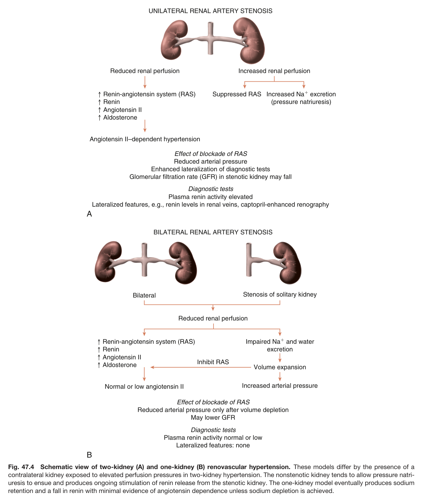

Fig. 47.4 Schematic view of two-kidney (A) and one-kidney (B) renovascular hypertension. These models differ by the presence of a contralateral kidney exposed to elevated perfusion pressures in two-kidney hypertension. The nonstenotic kidney tends to allow pressure natri- uresis to ensue and produces ongoing stimulation of renin release from the stenotic kidney. The one-kidney model eventually produces sodium retention and a fall in renin with minimal evidence of angiotensin dependence unless sodium depletion is achieved.

---

### Fig_47_5

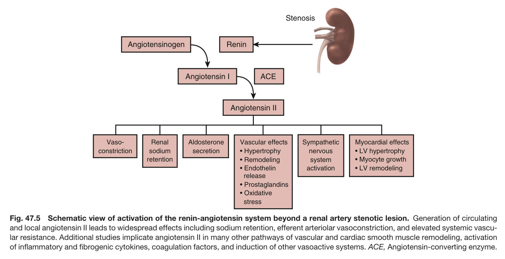

Fig. 47.5 Schematic view of activation of the renin-angiotensin system beyond a renal artery stenotic lesion. Generation of circulating and local angiotensin II leads to widespread effects including sodium retention, efferent arteriolar vasoconstriction, and elevated systemic vascu- lar resistance. Additional studies implicate angiotensin II in many other pathways of vascular and cardiac smooth muscle remodeling, activation of inflammatory and fibrogenic cytokines, coagulation factors, and induction of other vasoactive systems. ACE, Angiotensin-converting enzyme.

---

### Fig_47_6

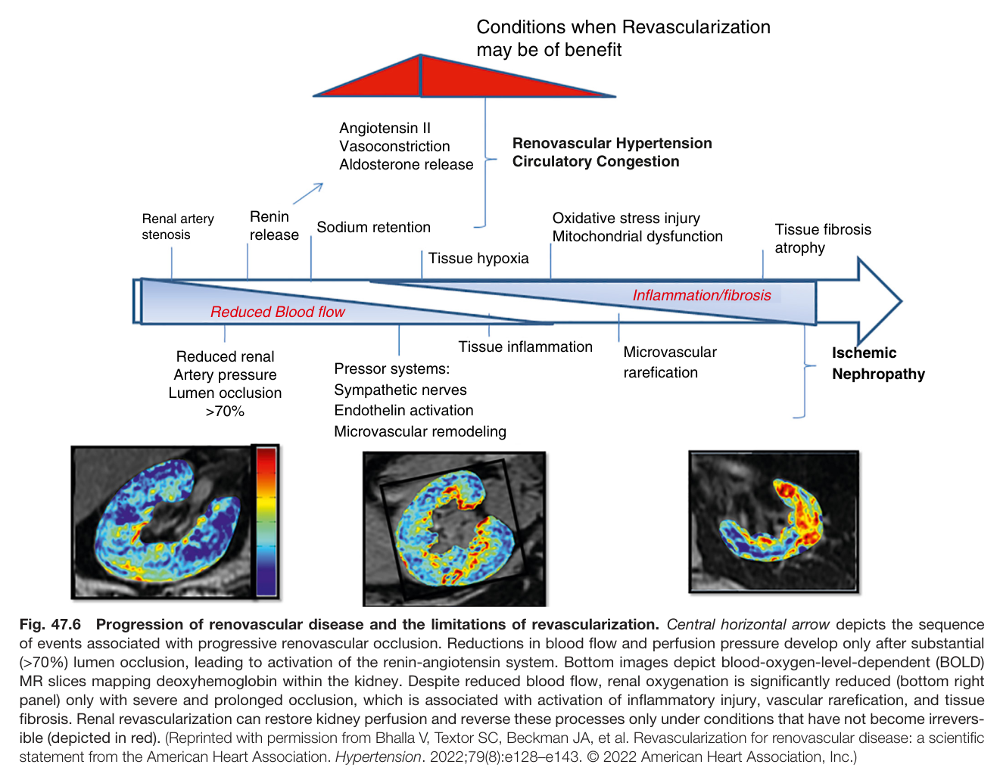

Fig. 47.6 Progression of renovascular disease and the limitations of revascularization. Central horizontal arrow depicts the sequence of events associated with progressive renovascular occlusion. Reductions in blood flow and perfusion pressure develop only after substantial (>70%) lumen occlusion, leading to activation of the renin-angiotensin system. Bottom images depict blood-oxygen-level-dependent (BOLD) MR slices mapping deoxyhemoglobin within the kidney. Despite reduced blood flow, renal oxygenation is significantly reduced (bottom right panel) only with severe and prolonged occlusion, which is associated with activation of inflammatory injury, vascular rarefication, and tissue fibrosis. Renal revascularization can restore kidney perfusion and reverse these processes only under conditions that have not become irrevers- ible (depicted in red). (Reprinted with permission from Bhalla V, Textor SC, Beckman JA, et al. Revascularization for renovascular disease: a scientific statement from the American Heart Association. Hypertension. 2022;79(8):e128–e143. © 2022 American Heart Association, Inc.)

---

### Fig_47_7

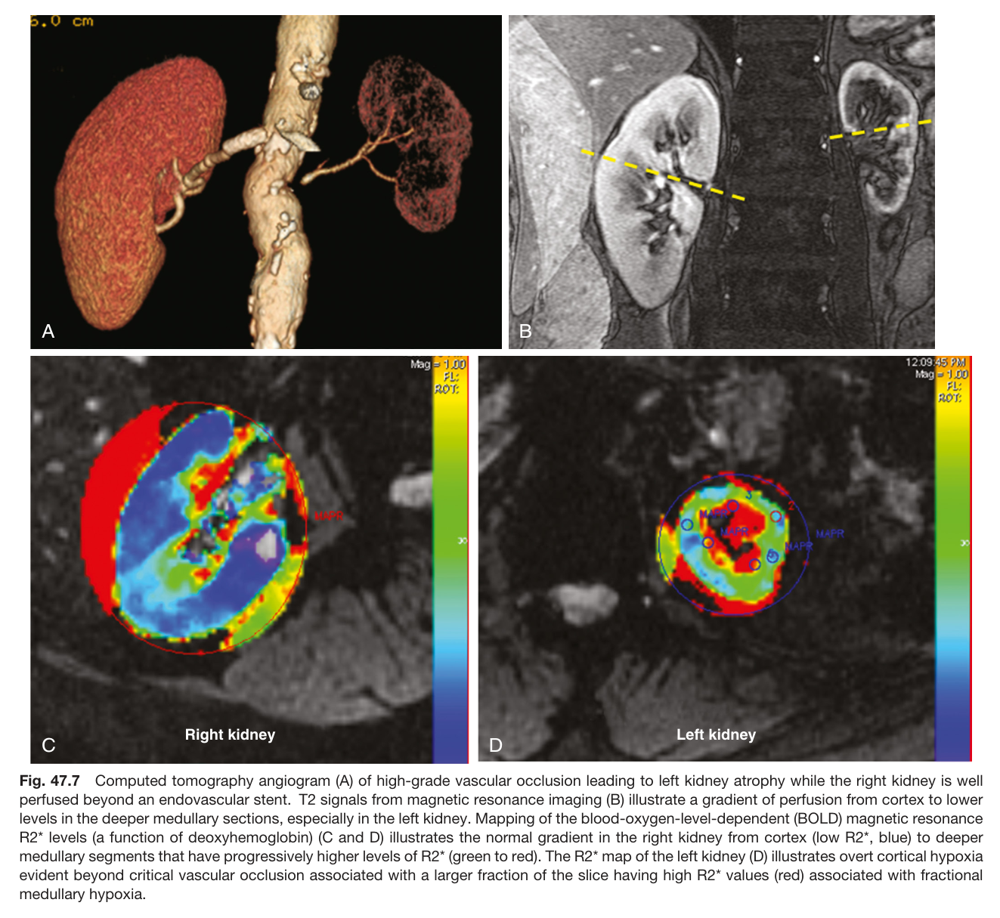

Fig. 47.7 Computed tomography angiogram (A) of high-grade vascular occlusion leading to left kidney atrophy while the right kidney is wel perfused beyond an endovascular stent. T2 signals from magnetic resonance imaging (B) illustrate a gradient of perfusion from cortex to lower levels in the deeper medullary sections, especially in the left kidney. Mapping of the blood-oxygen-level-dependent (BOLD) magnetic resonance R2\* levels (a function of deoxyhemoglobin) (C and D) illustrates the normal gradient in the right kidney from cortex (low R2\*, blue) to deeper medullary segments that have progressively higher levels of R2\* (green to red). The R2\* map of the left kidney (D) illustrates overt cortical hypoxia evident beyond critical vascular occlusion associated with a larger fraction of the slice having high R2\* values (red) associated with fractiona medullary hypoxia.

---

### Fig_47_8

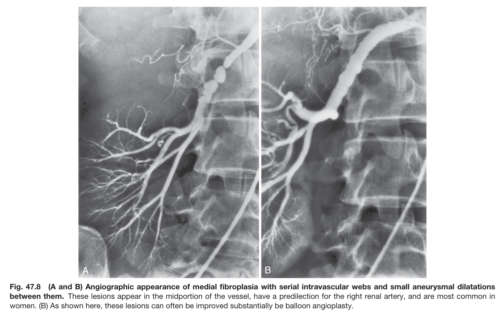

Fig. 47.8 (A and B) Angiographic appearance of medial fibroplasia with serial intravascular webs and small aneurysmal dilatations between them. These lesions appear in the midportion of the vessel, have a predilection for the right renal artery, and are most common in women. (B) As shown here, these lesions can often be improved substantially be balloon angioplasty.

---

### Fig_47_9

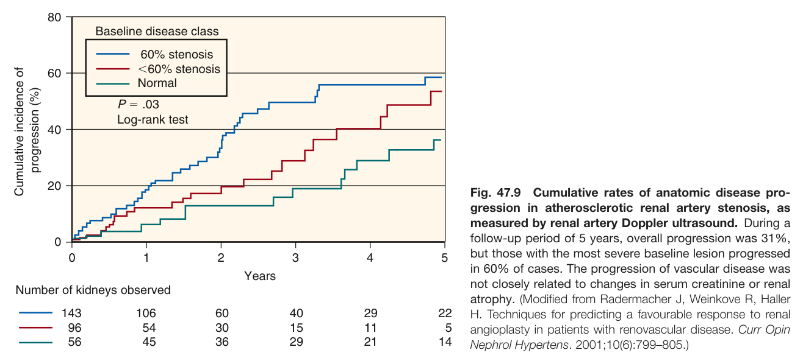

Fig. 47.9 Cumulative rates of anatomic disease pro- gression in atherosclerotic renal artery stenosis, as measured by renal artery Doppler ultrasound. During a follow-up period of 5 years, overall progression was 31%, but those with the most severe baseline lesion progressed in 60% of cases. The progression of vascular disease was not closely related to changes in serum creatinine or renal atrophy. (Modified from Radermacher J, Weinkove R, Haller H. Techniques for predicting a favourable response to renal angioplasty in patients with renovascular disease. Curr Opin Nephrol Hypertens. 2001;10(6):799–805.)

---

### Fig_47_10

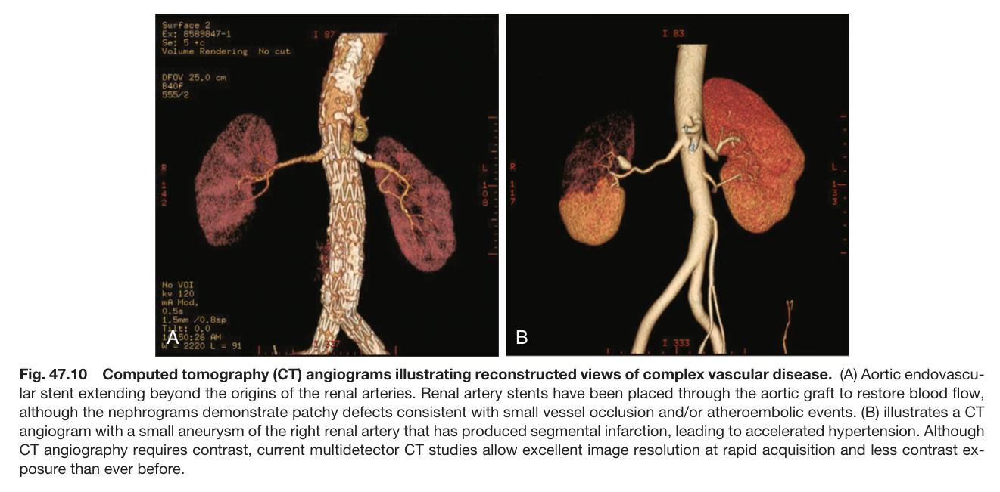

Fig. 47.10 Computed tomography (CT) angiograms illustrating reconstructed views of complex vascular disease. (A) Aortic endovascu- lar stent extending beyond the origins of the renal arteries. Renal artery stents have been placed through the aortic graft to restore blood flow, although the nephrograms demonstrate patchy defects consistent with small vessel occlusion and/or atheroembolic events. (B) illustrates a CT angiogram with a small aneurysm of the right renal artery that has produced segmental infarction, leading to accelerated hypertension. Although CT angiography requires contrast, current multidetector CT studies allow excellent image resolution at rapid acquisition and less contrast ex- posure than ever before.

---

### Fig_47_11

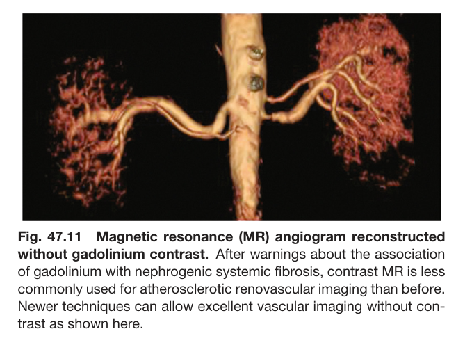

Fig. 47.11 Magnetic resonance (MR) angiogram reconstructed without gadolinium contrast. After warnings about the association of gadolinium with nephrogenic systemic fibrosis, contrast MR is less commonly used for atherosclerotic renovascular imaging than before. Newer techniques can allow excellent vascular imaging without con- trast as shown here.

---

### Fig_47_12

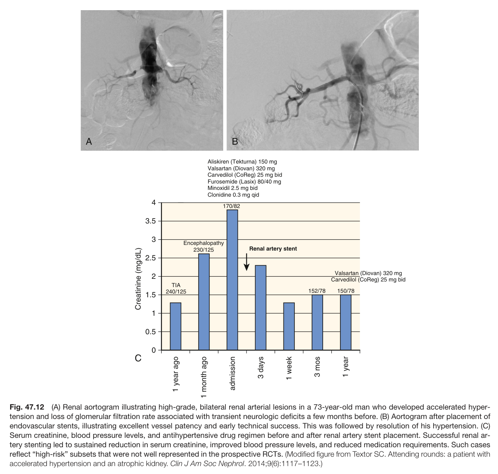

Fig. 47.12 (A) Renal aortogram illustrating high-grade, bilateral renal arterial lesions in a 73-year-old man who developed accelerated hyper- tension and loss of glomerular filtration rate associated with transient neurologic deficits a few months before. (B) Aortogram after placement of endovascular stents, illustrating excellent vessel patency and early technical success. This was followed by resolution of his hypertension. (C) Serum creatinine, blood pressure levels, and antihypertensive drug regimen before and after renal artery stent placement. Successful renal ar- tery stenting led to sustained reduction in serum creatinine, improved blood pressure levels, and reduced medication requirements. Such cases reflect “high-risk” subsets that were not well represented in the prospective RCTs. (Modified figure from Textor SC. Attending rounds: a patient with accelerated hypertension and an atrophic kidney. Clin J Am Soc Nephrol. 2014;9(6):1117–1123.)

---

### Fig_47_13

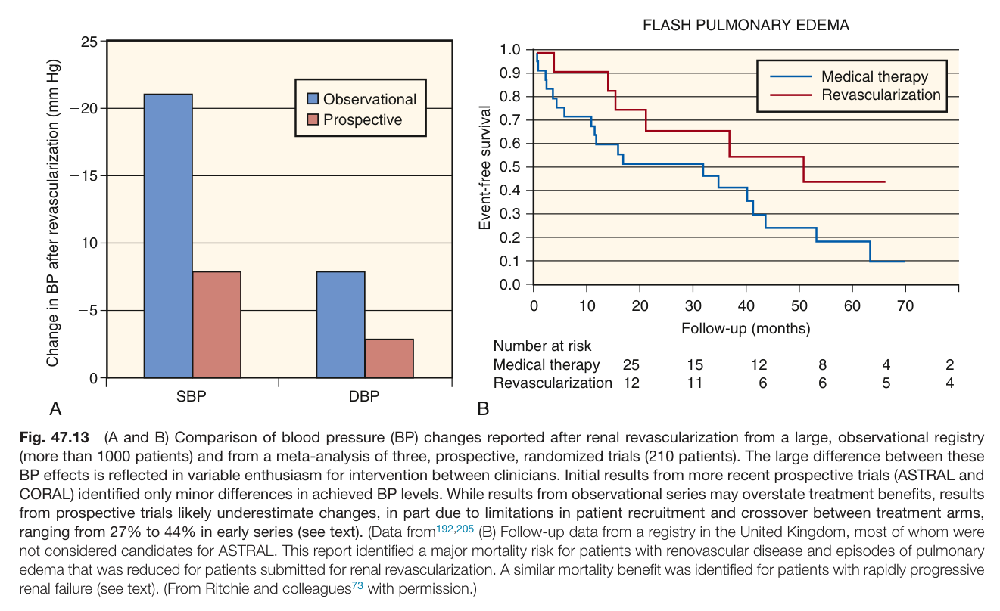

Fig. 47.13 (A and B) Comparison of blood pressure (BP) changes reported after renal revascularization from a large, observational registry (more than 1000 patients) and from a meta-analysis of three, prospective, randomized trials (210 patients). The large difference between these BP effects is reflected in variable enthusiasm for intervention between clinicians. Initial results from more recent prospective trials (ASTRAL and CORAL) identified only minor differences in achieved BP levels. While results from observational series may overstate treatment benefits, results from prospective trials likely underestimate changes, in part due to limitations in patient recruitment and crossover between treatment arms, ranging from 27% to 44% in early series (see text). (Data from<sup>192,205</sup> (B) Follow-up data from a registry in the United Kingdom, most of whom were not considered candidates for ASTRAL. This report identified a major mortality risk for patients with renovascular disease and episodes of pulmonary edema that was reduced for patients submitted for renal revascularization. A similar mortality benefit was identified for patients with rapidly progressive renal failure (see text). (From Ritchie and colleagues<sup>73</sup> with permission.)

---

### Fig_47_14

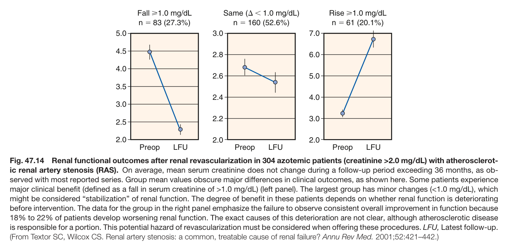

Fig. 47.14 Renal functional outcomes after renal revascularization in 304 azotemic patients (creatinine >2.0 mg/dL) with atherosclerot- ic renal artery stenosis (RAS). On average, mean serum creatinine does not change during a follow-up period exceeding 36 months, as ob- served with most reported series. Group mean values obscure major differences in clinical outcomes, as shown here. Some patients experience major clinical benefit (defined as a fall in serum creatinine of >1.0 mg/dL) (left panel). The largest group has minor changes (<1.0 mg/dL), which might be considered “stabilization” of renal function. The degree of benefit in these patients depends on whether renal function is deteriorating before intervention. The data for the group in the right panel emphasize the failure to observe consistent overall improvement in function because 18% to 22% of patients develop worsening renal function. The exact causes of this deterioration are not clear, although atherosclerotic disease is responsible for a portion. This potential hazard of revascularization must be considered when offering these procedures. LFU, Latest follow-up. (From Textor SC, Wilcox CS. Renal artery stenosis: a common, treatable cause of renal failure? Annu Rev Med. 2001;52:421–442.)

---

### Fig_47_15

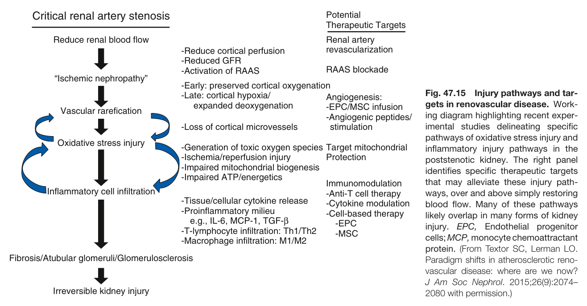

Fig. 47.15 Injury pathways and tar- gets in renovascular disease. Work- ing diagram highlighting recent exper- imental studies delineating specific pathways of oxidative stress injury and inflammatory injury pathways in the poststenotic kidney. The right panel identifies specific therapeutic targets that may alleviate these injury path- ways, over and above simply restoring blood flow. Many of these pathways likely overlap in many forms of kidney injury. EPC, Endothelial progenitor cells; MCP, monocyte chemoattractant protein. (From Textor SC, Lerman LO. Paradigm shifts in atherosclerotic reno- vascular disease: where are we now? J Am Soc Nephrol. 2015;26(9):2074– 2080 with permission.)

---

### Fig_47_16

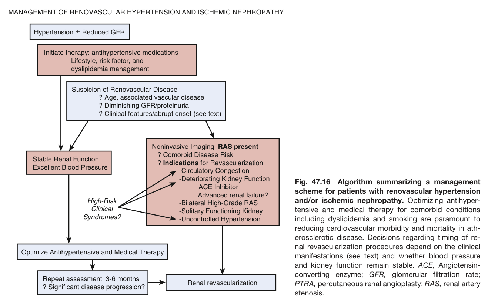

Fig. 47.16 Algorithm summarizing a management scheme for patients with renovascular hypertension and/or ischemic nephropathy. Optimizing antihyper- tensive and medical therapy for comorbid conditions including dyslipidemia and smoking are paramount to reducing cardiovascular morbidity and mortality in ath- erosclerotic disease. Decisions regarding timing of re- nal revascularization procedures depend on the clinical manifestations (see text) and whether blood pressure and kidney function remain stable. ACE, Angiotensin- converting enzyme; GFR, glomerular filtration rate; PTRA, percutaneous renal angioplasty; RAS, renal artery stenosis.

---

### Fig_e47_1

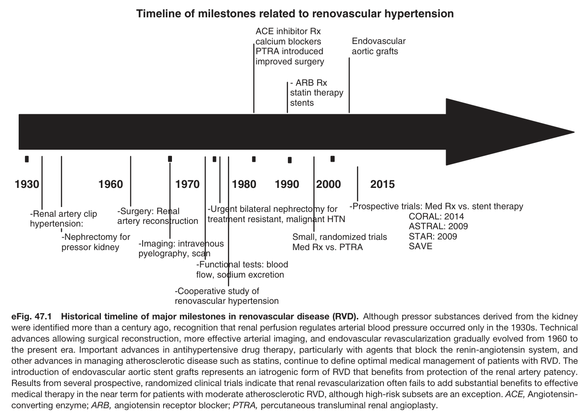

Fig. e47.1 Historical timeline of major milestones in renovascular disease (RVD). Although pressor substances derived from the kidney were identified more than a century ago, recognition that renal perfusion regulates arterial blood pressure occurred only in the 1930s. Technica advances allowing surgical reconstruction, more effective arterial imaging, and endovascular revascularization gradually evolved from 1960 to the present era. Important advances in antihypertensive drug therapy, particularly with agents that block the renin-angiotensin system, and other advances in managing atherosclerotic disease such as statins, continue to define optimal medical management of patients with RVD. The introduction of endovascular aortic stent grafts represents an iatrogenic form of RVD that benefits from protection of the renal artery patency. Results from several prospective, randomized clinical trials indicate that renal revascularization often fails to add substantial benefits to effective medical therapy in the near term for patients with moderate atherosclerotic RVD, although high-risk subsets are an exception. ACE, Angiotensin- converting enzyme; ARB, angiotensin receptor blocker; PTRA, percutaneous transluminal renal angioplasty.

---

### Fig_e47_2

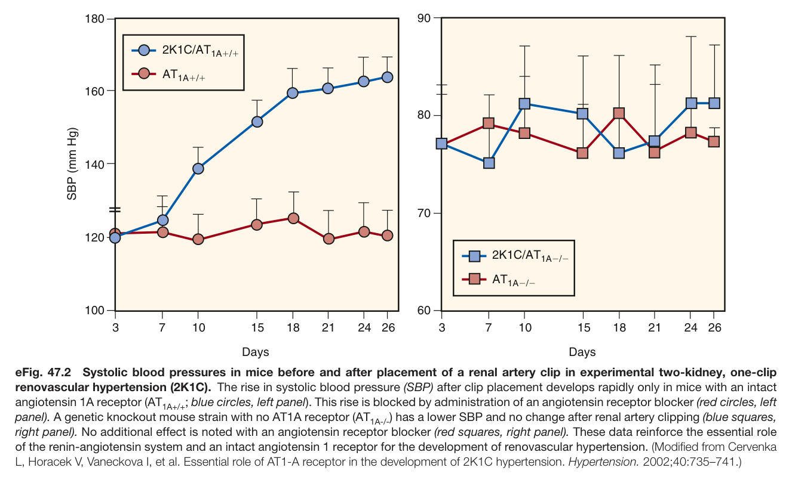

Fig. e47.2 Systolic blood pressures in mice before and after placement of a renal artery clip in experimental two-kidney, one-clip renovascular hypertension (2K1C). The rise in systolic blood pressure (SBP) after clip placement develops rapidly only in mice with an intact angiotensin 1A receptor (AT<sub>1A+/+</sub>; blue circles, left panel). This rise is blocked by administration of an angiotensin receptor blocker (red circles, left panel). A genetic knockout mouse strain with no AT1A receptor (AT ) has a lower SBP and no change after renal artery clipping (blue squares, right panel). No additional effect is noted with an angiotensin receptor blocker (red squares, right panel). These data reinforce the essential role of the renin-angiotensin system and an intact angiotensin 1 receptor for the development of renovascular hypertension. (Modified from Cervenka L, Horacek V, Vaneckova I, et al. Essential role of AT1-A receptor in the development of 2K1C hypertension. Hypertension. 2002;40:735–741.)

---

### Fig_e47_3

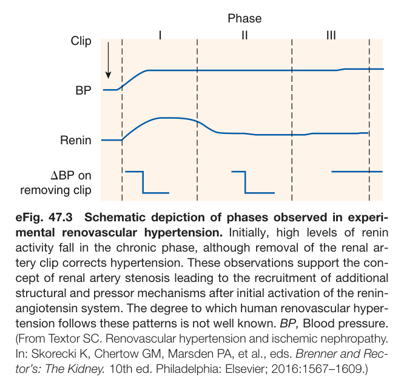

Fig. e47.3 Schematic depiction of phases observed in experi- mental renovascular hypertension. Initially, high levels of renin activity fall in the chronic phase, although removal of the renal ar- tery clip corrects hypertension. These observations support the con- cept of renal artery stenosis leading to the recruitment of additiona structural and pressor mechanisms after initial activation of the renin- angiotensin system. The degree to which human renovascular hyper- tension follows these patterns is not well known. BP, Blood pressure. (From Textor SC. Renovascular hypertension and ischemic nephropathy. In: Skorecki K, Chertow GM, Marsden PA, et al., eds. Brenner and Rec- tor’s: The Kidney. 10th ed. Philadelphia: Elsevier; 2016:1567–1609.)

---

### Fig_e47_4

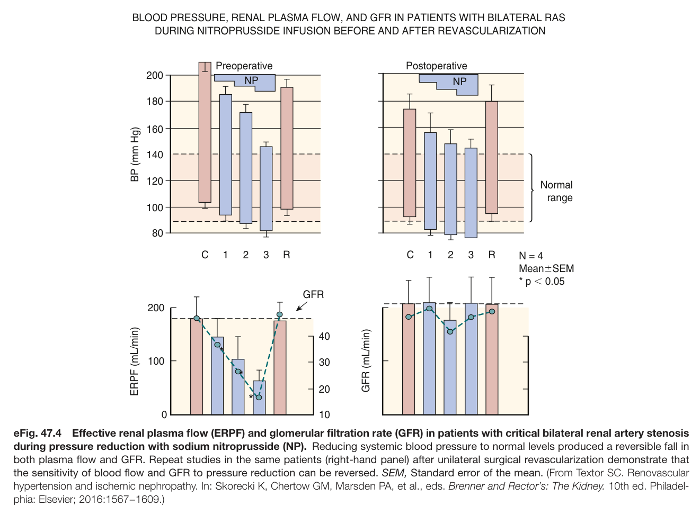

Fig. e47.4 Effective renal plasma flow (ERPF) and glomerular filtration rate (GFR) in patients with critical bilateral renal artery stenosis during pressure reduction with sodium nitroprusside (NP). Reducing systemic blood pressure to normal levels produced a reversible fall in both plasma flow and GFR. Repeat studies in the same patients (right-hand panel) after unilateral surgical revascularization demonstrate that the sensitivity of blood flow and GFR to pressure reduction can be reversed. SEM, Standard error of the mean. (From Textor SC. Renovascular hypertension and ischemic nephropathy. In: Skorecki K, Chertow GM, Marsden PA, et al., eds. Brenner and Rector’s: The Kidney. 10th ed. Philadel- phia: Elsevier; 2016:1567−1609.)

---

### Fig_e47_5

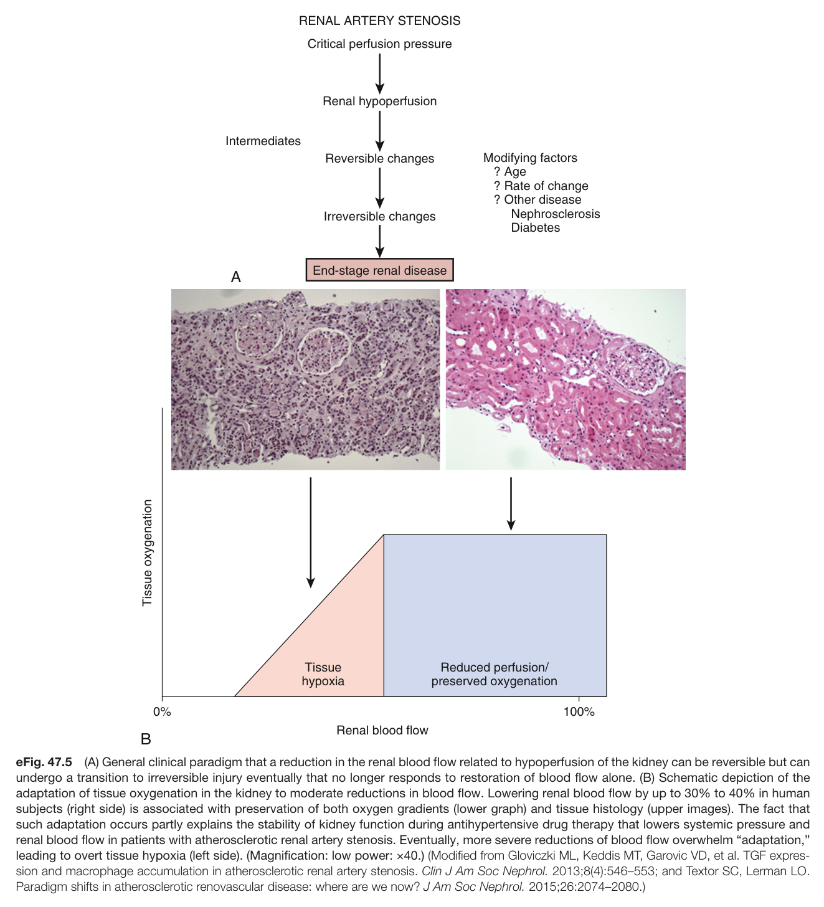

Fig. e47.5 (A) General clinical paradigm that a reduction in the renal blood flow related to hypoperfusion of the kidney can be reversible but can undergo a transition to irreversible injury eventually that no longer responds to restoration of blood flow alone. (B) Schematic depiction of the adaptation of tissue oxygenation in the kidney to moderate reductions in blood flow. Lowering renal blood flow by up to 30% to 40% in human subjects (right side) is associated with preservation of both oxygen gradients (lower graph) and tissue histology (upper images). The fact that such adaptation occurs partly explains the stability of kidney function during antihypertensive drug therapy that lowers systemic pressure and renal blood flow in patients with atherosclerotic renal artery stenosis. Eventually, more severe reductions of blood flow overwhelm “adaptation,” leading to overt tissue hypoxia (left side). (Magnification: low power: ×40.) (Modified from Gloviczki ML, Keddis MT, Garovic VD, et al. TGF expres- sion and macrophage accumulation in atherosclerotic renal artery stenosis. Clin J Am Soc Nephrol. 2013;8(4):546–553; and Textor SC, Lerman LO. Paradigm shifts in atherosclerotic renovascular disease: where are we now? J Am Soc Nephrol. 2015;26:2074–2080.)

---

### Fig_e47_6

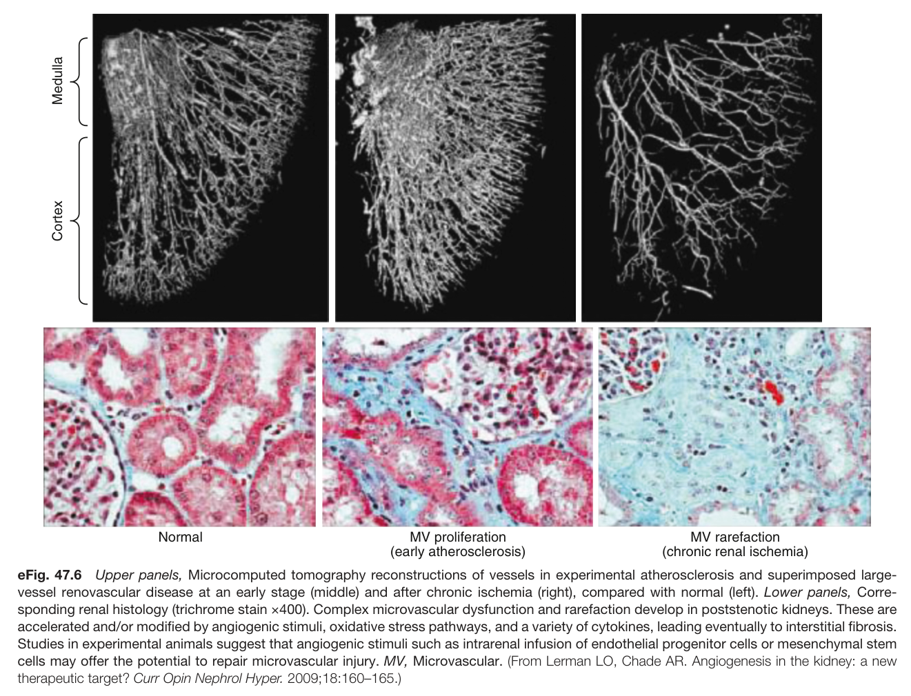

Fig. e47.6 Upper panels, Microcomputed tomography reconstructions of vessels in experimental atherosclerosis and superimposed large vessel renovascular disease at an early stage (middle) and after chronic ischemia (right), compared with normal (left). Lower panels, Corre- sponding renal histology (trichrome stain ×400). Complex microvascular dysfunction and rarefaction develop in poststenotic kidneys. These are accelerated and/or modified by angiogenic stimuli, oxidative stress pathways, and a variety of cytokines, leading eventually to interstitial fibrosis. Studies in experimental animals suggest that angiogenic stimuli such as intrarenal infusion of endothelial progenitor cells or mesenchymal stem cells may offer the potential to repair microvascular injury. MV, Microvascular. (From Lerman LO, Chade AR. Angiogenesis in the kidney: a new therapeutic target? Curr Opin Nephrol Hyper. 2009;18:160–165.)

---

### Fig_e47_7

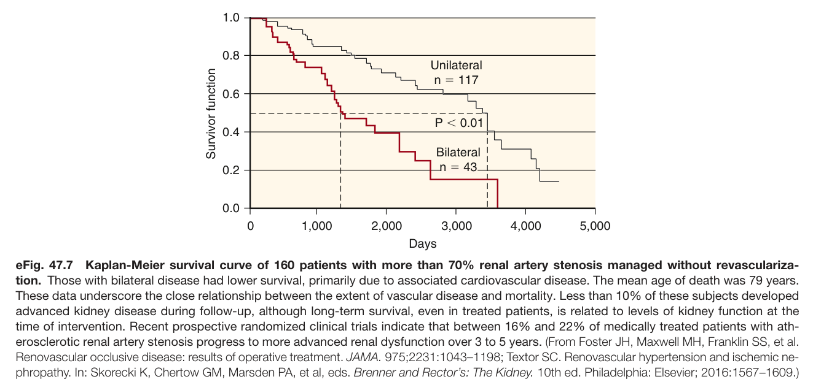

Fig. e47.7 Kaplan-Meier survival curve of 160 patients with more than 70% renal artery stenosis managed without revasculariza- tion. Those with bilateral disease had lower survival, primarily due to associated cardiovascular disease. The mean age of death was 79 years. These data underscore the close relationship between the extent of vascular disease and mortality. Less than 10% of these subjects developed advanced kidney disease during follow-up, although long-term survival, even in treated patients, is related to levels of kidney function at the time of intervention. Recent prospective randomized clinical trials indicate that between 16% and 22% of medically treated patients with ath- erosclerotic renal artery stenosis progress to more advanced renal dysfunction over 3 to 5 years. (From Foster JH, Maxwell MH, Franklin SS, et al. Renovascular occlusive disease: results of operative treatment. JAMA. 975;2231:1043–1198; Textor SC. Renovascular hypertension and ischemic ne- phropathy. In: Skorecki K, Chertow GM, Marsden PA, et al, eds. Brenner and Rector’s: The Kidney. 10th ed. Philadelphia: Elsevier; 2016:1567–1609.)

---

### Fig_e47_8

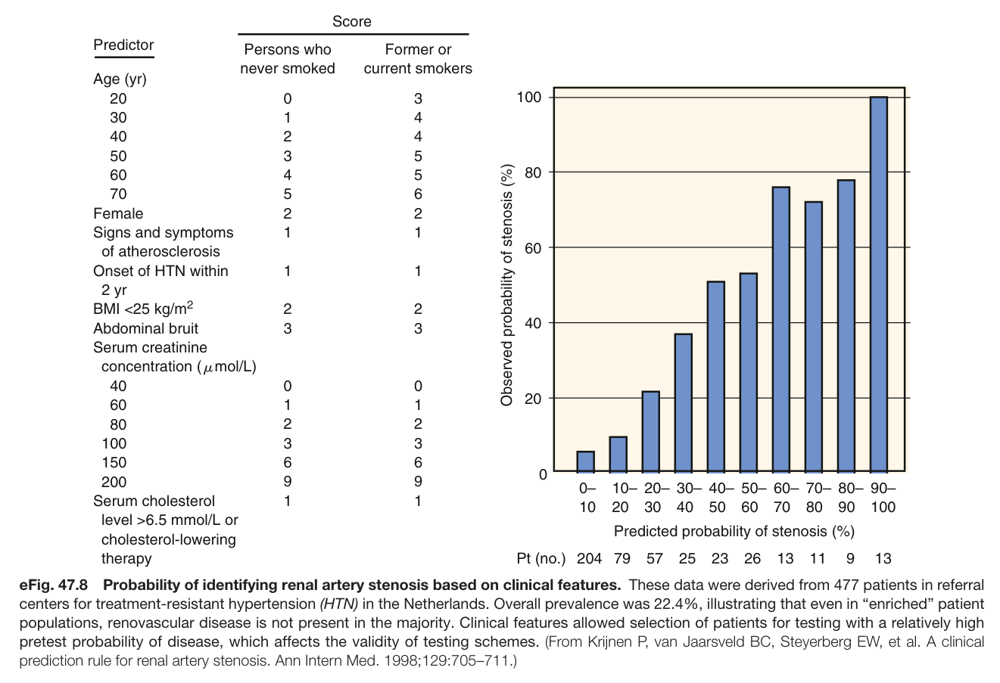

Fig. e47.8 Probability of identifying renal artery stenosis based on clinical features. These data were derived from 477 patients in referra centers for treatment-resistant hypertension (HTN) in the Netherlands. Overall prevalence was 22.4%, illustrating that even in “enriched” patient populations, renovascular disease is not present in the majority. Clinical features allowed selection of patients for testing with a relatively high pretest probability of disease, which affects the validity of testing schemes. (From Krijnen P, van Jaarsveld BC, Steyerberg EW, et al. A clinica prediction rule for renal artery stenosis. Ann Intern Med. 1998;129:705–711.)

---

### Fig_e47_9

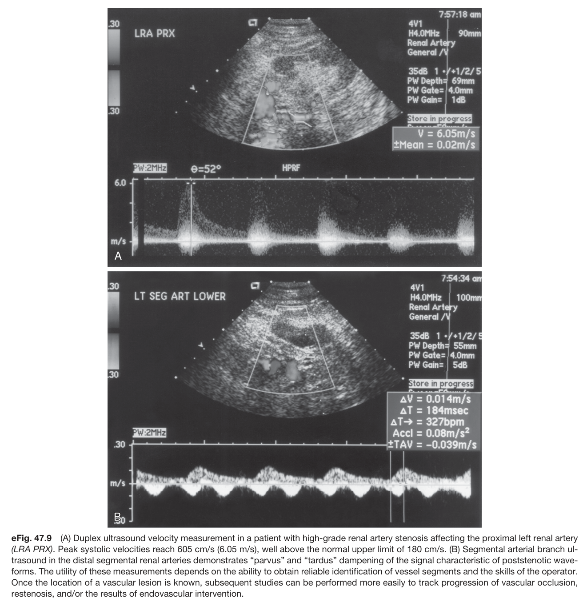

Fig. e47.9 (A) Duplex ultrasound velocity measurement in a patient with high-grade renal artery stenosis affecting the proximal left renal artery (LRA PRX). Peak systolic velocities reach 605 cm/s (6.05 m/s), well above the normal upper limit of 180 cm/s. (B) Segmental arterial branch ul- trasound in the distal segmental renal arteries demonstrates “parvus” and “tardus” dampening of the signal characteristic of poststenotic wave- forms. The utility of these measurements depends on the ability to obtain reliable identification of vessel segments and the skills of the operator. Once the location of a vascular lesion is known, subsequent studies can be performed more easily to track progression of vascular occlusion, restenosis, and/or the results of endovascular intervention.

---

### Fig_e47_10

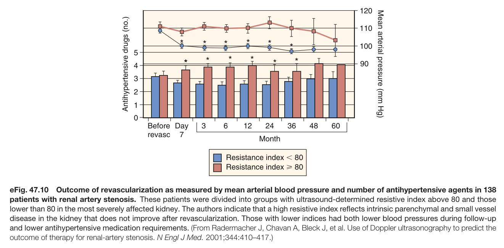

Fig. e47.10 Outcome of revascularization as measured by mean arterial blood pressure and number of antihypertensive agents in 138 patients with renal artery stenosis. These patients were divided into groups with ultrasound-determined resistive index above 80 and those lower than 80 in the most severely affected kidney. The authors indicate that a high resistive index reflects intrinsic parenchymal and small vessel disease in the kidney that does not improve after revascularization. Those with lower indices had both lower blood pressures during follow-up and lower antihypertensive medication requirements. (From Radermacher J, Chavan A, Bleck J, et al. Use of Doppler ultrasonography to predict the outcome of therapy for renal-artery stenosis. N Engl J Med. 2001;344:410–417.)

---

### Fig_e47_11

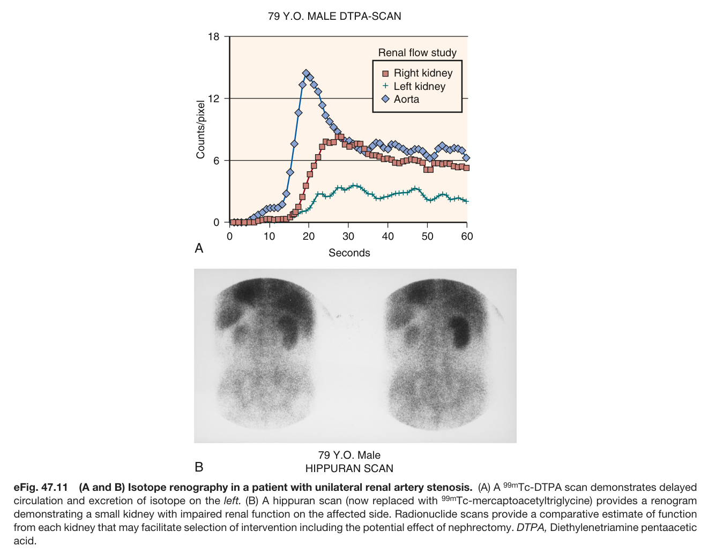

Fig. e47.11 (A and B) Isotope renography in a patient with unilateral renal artery stenosis. (A) A <sup>99m</sup>Tc-DTPA scan demonstrates delayed circulation and excretion of isotope on the left. (B) A hippuran scan (now replaced with <sup>99m</sup>Tc-mercaptoacetyltriglycine) provides a renogram demonstrating a small kidney with impaired renal function on the affected side. Radionuclide scans provide a comparative estimate of function from each kidney that may facilitate selection of intervention including the potential effect of nephrectomy. DTPA, Diethylenetriamine pentaacetic acid.

---

### Fig_e47_12

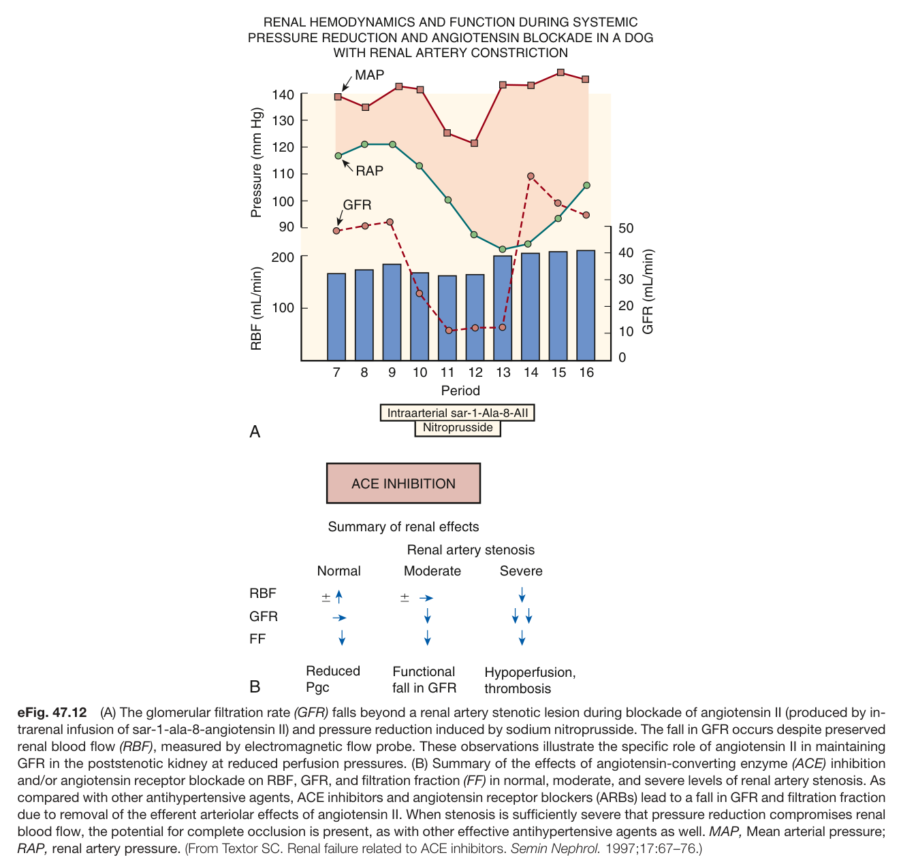

Fig. e47.12 (A) The glomerular filtration rate (GFR) falls beyond a renal artery stenotic lesion during blockade of angiotensin II (produced by in- trarenal infusion of sar-1-ala-8-angiotensin II) and pressure reduction induced by sodium nitroprusside. The fall in GFR occurs despite preserved renal blood flow (RBF), measured by electromagnetic flow probe. These observations illustrate the specific role of angiotensin II in maintaining GFR in the poststenotic kidney at reduced perfusion pressures. (B) Summary of the effects of angiotensin-converting enzyme (ACE) inhibition and/or angiotensin receptor blockade on RBF, GFR, and filtration fraction (FF) in normal, moderate, and severe levels of renal artery stenosis. As compared with other antihypertensive agents, ACE inhibitors and angiotensin receptor blockers (ARBs) lead to a fall in GFR and filtration fraction due to removal of the efferent arteriolar effects of angiotensin II. When stenosis is sufficiently severe that pressure reduction compromises rena blood flow, the potential for complete occlusion is present, as with other effective antihypertensive agents as well. MAP, Mean arterial pressure; RAP, renal artery pressure. (From Textor SC. Renal failure related to ACE inhibitors. Semin Nephrol. 1997;17:67–76.)

---

### Fig_e47_13

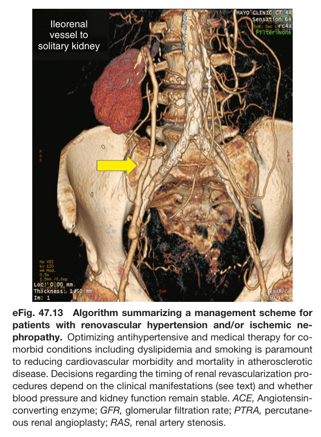

Fig. e47.13 Algorithm summarizing a management scheme for patients with renovascular hypertension and/or ischemic ne- phropathy. Optimizing antihypertensive and medical therapy for co- morbid conditions including dyslipidemia and smoking is paramount to reducing cardiovascular morbidity and mortality in atherosclerotic disease. Decisions regarding the timing of renal revascularization pro- cedures depend on the clinical manifestations (see text) and whether blood pressure and kidney function remain stable. ACE, Angiotensin- converting enzyme; GFR, glomerular filtration rate; PTRA, percutane- ous renal angioplasty; RAS, renal artery stenosis.

---

## Tables

### Table_47_1

#### Table Image

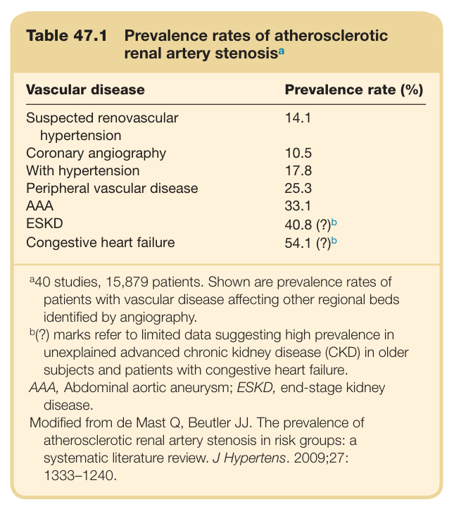

#### Table Data (CSV: [Table_47_1.csv](Table_47_1.csv))

```markdown
| Table Text (OCR) |
| :--- |
| Table 47.1 Prevalence rates of atherosclerotic renal artery stenosis<sup>a</sup> Vascular disease  Prevalence rate (%)    Suspected renovascular hypertension  14.1    Coronary angiography  10.5    With hypertension  17.8    Peripheral vascular disease  25.3    AAA  33.1    ESKD  40.8 (?)b    Congestive heart failure  54.1 (?)b |
```

Table 47.1 Prevalence rates of atherosclerotic renal artery stenosis<sup>a</sup>

---

### Table_47_2

#### Table Image

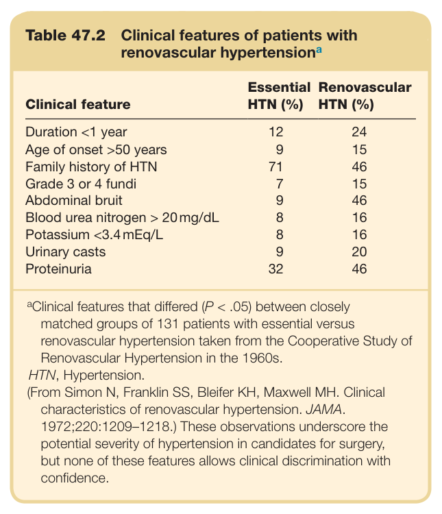

#### Table Data (CSV: [Table_47_2.csv](Table_47_2.csv))

```markdown
| Table Text (OCR) |
| :--- |
| Table 47.2  Clinical features of patients with renovascular hypertension<sup>a</sup> Clinical feature  Essential HTN (%)  Renovascular HTN (%)    Duration <1 year  12  24    Age of onset >50 years  9  15    Family history of HTN  71  46    Grade 3 or 4 fundi  7  15    Abdominal bruit  9  46    Blood urea nitrogen >20 mg/dL  8  16    Potassium <3.4 mEq/L  8  16    Urinary casts  9  20    Proteinuria  32  46 <sup>a</sup>Clinical features that differed (P < .05) between closely matched groups of 131 patients with essential versus renovascular hypertension taken from the Cooperative Study of Renovascular Hypertension in the 1960s. HTN, Hypertension. (From Simon N, Franklin SS, Bleifer KH, Maxwell MH. Clinical characteristics of renovascular hypertension. JAMA. 1972;220:1209–1218.) These observations underscore the potential severity of hypertension in candidates for surgery, but none of these features allows clinical discrimination with confidence. |
```

Table 47.2 Clinical features of patients with renovascular hypertension<sup>a</sup>

---

### Table_47_3

#### Table Image

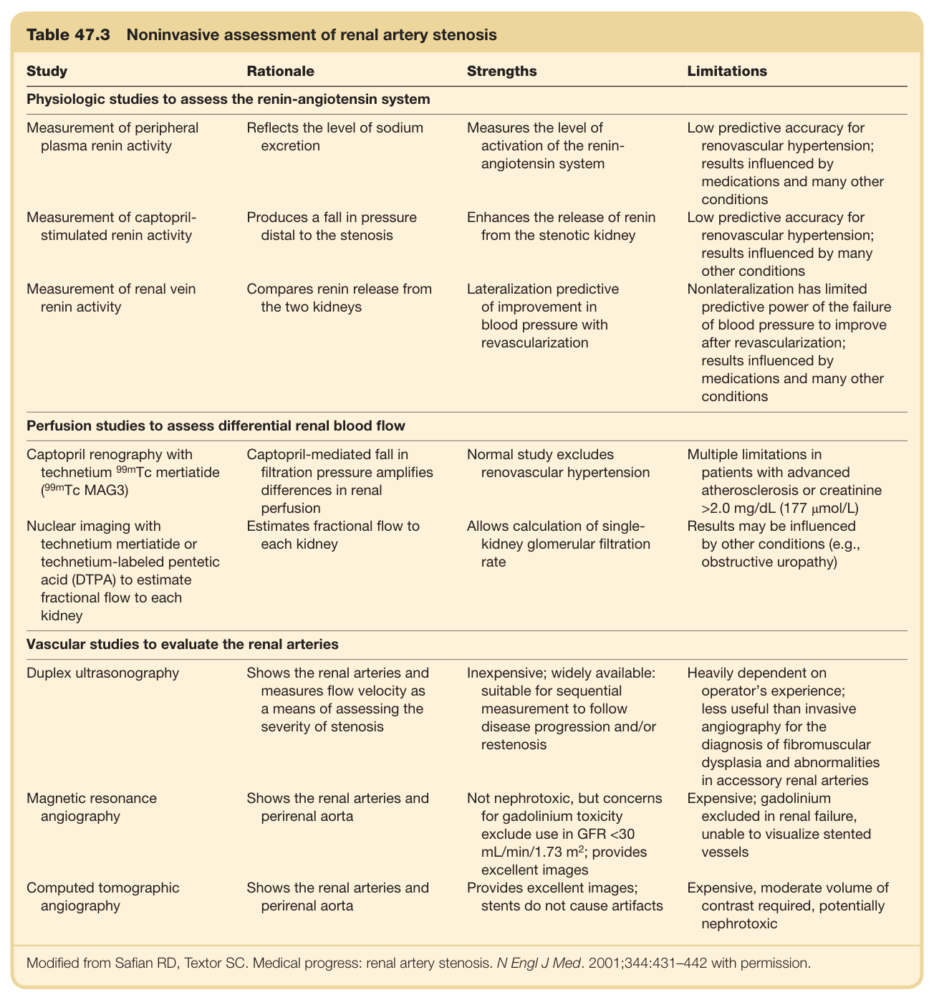

#### Table Data (CSV: [Table_47_3.csv](Table_47_3.csv))

```markdown
| Table Text (OCR) |
| :--- |
| Table 47.3  Noninvasive assessment of renal artery stenosis Study  Rationale  Strengths  Limitations    Physiologic studies to assess the renin-angiotensin system    Measurement of peripheral plasma renin activity  Reflects the level of sodium excretion  Measures the level of activation of the renin-angiotensin system  Low predictive accuracy for renovascular hypertension; results influenced by medications and many other conditions    Measurement of captopril-stimulated renin activity  Produces a fall in pressure distal to the stenosis  Enhances the release of renin from the stenotic kidney  Low predictive accuracy for renovascular hypertension; results influenced by many other conditions    Measurement of renal vein renin activity  Compares renin release from the two kidneys  Lateralization predictive of improvement in blood pressure with revascularization  Nonlateralization has limited predictive power of the failure of blood pressure to improve after revascularization; results influenced by medications and many other conditions    Perfusion studies to assess differential renal blood flow    Captopril renography with technetium  ^{99m}Tc  mertiatide ( ^{99m}Tc  MAG3)  Captopril-mediated fall in filtration pressure amplifies differences in renal perfusion  Normal study excludes renovascular hypertension  Multiple limitations in patients with advanced atherosclerosis or creatinine >2.0 mg/dL (177 μmol/L)    Nuclear imaging with technetium mertiatide or technetium-labeled pentetic acid (DTPA) to estimate fractional flow to each kidney  Estimates fractional flow to each kidney  Allows calculation of single-kidney glomerular filtration rate  Results may be influenced by other conditions (e.g., obstructive uropathy)    Vascular studies to evaluate the renal arteries    Duplex ultrasonography  Shows the renal arteries and measures flow velocity as a means of assessing the severity of stenosis  Inexpensive; widely available: suitable for sequential measurement to follow disease progression and/or restenosis  Heavily dependent on operator's experience; less useful than invasive angiography for the diagnosis of fibromuscular dysplasia and abnormalities in accessory renal arteries    Magnetic resonance angiography  Shows the renal arteries and perirenal aorta  Not nephrotoxic, but concerns for gadolinium toxicity exclude use in GFR <30 mL/min/1.73 m2; provides excellent images  Expensive; gadolinium excluded in renal failure, unable to visualize stented vessels    Computed tomographic angiography  Shows the renal arteries and perirenal aorta  Provides excellent images; stents do not cause artifacts  Expensive, moderate volume of contrast required, potentially nephrotoxic Modified from Safian RD, Textor SC. Medical progress: renal artery stenosis. N Engl J Med. 2001;344:431–442 with permission. |
```

Table 47.3 Noninvasive assessment of renal artery stenosis

---

### Table_47_4

#### Table Image

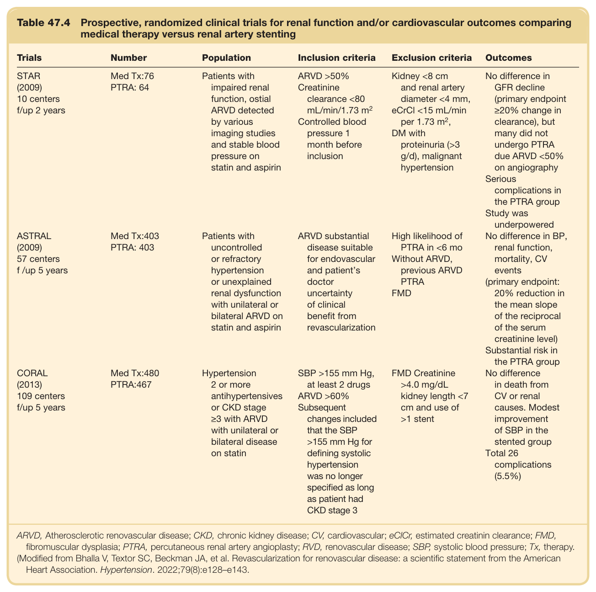

#### Table Data (CSV: [Table_47_4.csv](Table_47_4.csv))

```markdown
| Table Text (OCR) |
| :--- |
| Table 47.4 Prospective, randomized clinical trials for renal function and/or cardiovascular outcomes comparing medical therapy versus renal artery stenting Trials  Number  Population  Inclusion criteria  Exclusion criteria  Outcomes    STAR(2009)10 centersf/up 2 years  Med Tx:76PTRA: 64  Patients with impaired renal function, ostial ARVD detected by various imaging studies and stable blood pressure on statin and aspirin  ARVD >50%Creatinine clearance <80 mL/min/1.73  m^2 Controlled blood pressure 1 month before inclusion  Kidney <8 cm and renal artery diameter <4 mm, eCrCl <15 mL/min per 1.73  m^2 ,DM with proteinuria (>3 g/d), malignant hypertension  No difference in GFR decline (primary endpoint ≥20% change in clearance), but many did not undergo PTRA due ARVD <50% on angiographySerious complications in the PTRA groupStudy was underpowered    ASTRAL(2009)57 centersf /up 5 years  Med Tx:403PTRA: 403  Patients with uncontrolled or refractory hypertension or unexplained renal dysfunction with unilateral or bilateral ARVD on statin and aspirin  ARVD substantial disease suitable for endovascular and patient's doctor uncertainty of clinical benefit from revascularization  High likelihood of PTRA in <6 mo Without ARVD, previous ARVD PTRAFMD  No difference in BP, renal function, mortality, CV events (primary endpoint: 20% reduction in the mean slope of the reciprocal of the serum creatinine level)Substantial risk in the PTRA group    CORAL(2013)109 centersf/up 5 years  Med Tx:480PTRA:467  Hypertension 2 or more antihypertensives or CKD stage ≥3 with ARVD with unilateral or bilateral disease on statin  SBP >155 mm Hg, at least 2 drugs ARVD >60%Subsequent changes included that the SBP >155 mm Hg for defining systolic hypertension was no longer specified as long as patient had CKD stage 3  FMD Creatinine >4.0 mg/dL kidney length <7 cm and use of >1 stent  No difference in death from CV or renal causes. Modest improvement of SBP in the stented groupTotal 26 complications (5.5%) ARVD, Atherosclerotic renovascular disease; CKD, chronic kidney disease; CV, cardiovascular; eClCr, estimated creatinin clearance; FMD, fibromuscular dysplasia; PTRA, percutaneous renal artery angioplasty; RVD, renovascular disease; SBP, systolic blood pressure; Tx, therapy. (Modified from Bhalla V, Textor SC, Beckman JA, et al. Revascularization for renovascular disease: a scientific statement from the American Heart Association. Hypertension. 2022;79(8):e128–e143. |
```

Table 47.4 Prospective, randomized clinical trials for renal function and/or cardiovascular outcomes comparing medical therapy versus renal artery stenting

---

### Table_47_5

#### Table Image

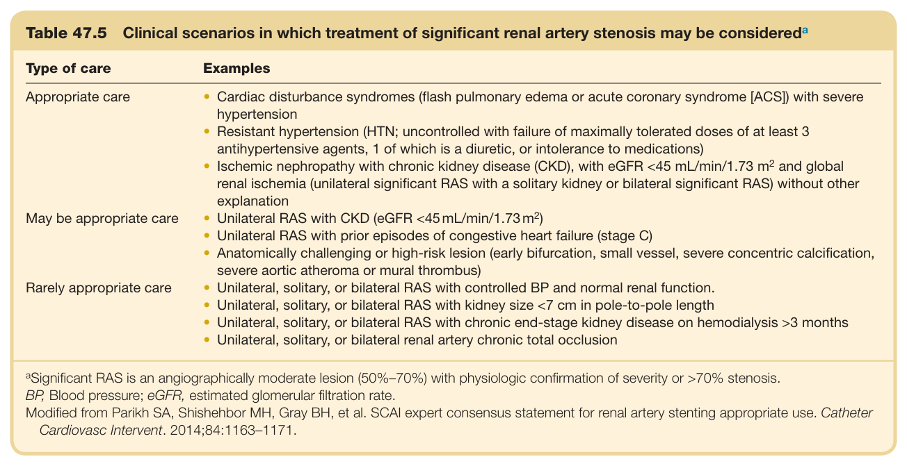

#### Table Data (CSV: [Table_47_5.csv](Table_47_5.csv))

```markdown
| Table Text (OCR) |
| :--- |
| Table 47.5  Clinical scenarios in which treatment of significant renal artery stenosis may be considered<sup>a</sup> Type of care  Examples    Appropriate care  Cardiac disturbance syndromes (flash pulmonary edema or acute coronary syndrome [ACS]) with severe hypertensionResistant hypertension (HTN; uncontrolled with failure of maximally tolerated doses of at least 3 antihypertensive agents, 1 of which is a diuretic, or intolerance to medications)Ischemic nephropathy with chronic kidney disease (CKD), with eGFR <45 mL/min/1.73  m^{2}  and global renal ischemia (unilateral significant RAS with a solitary kidney or bilateral significant RAS) without other explanation    May be appropriate care  Unilateral RAS with CKD (eGFR <45 mL/min/1.73  m^{2} )Unilateral RAS with prior episodes of congestive heart failure (stage C)Anatomically challenging or high-risk lesion (early bifurcation, small vessel, severe concentric calcification, severe aortic atheroma or mural thrombus)    Rarely appropriate care  Unilateral, solitary, or bilateral RAS with controlled BP and normal renal function.Unilateral, solitary, or bilateral RAS with kidney size <7 cm in pole-to-pole lengthUnilateral, solitary, or bilateral RAS with chronic end-stage kidney disease on hemodialysis >3 monthsUnilateral, solitary, or bilateral renal artery chronic total occlusion <sup>a</sup>Significant RAS is an angiographically moderate lesion (50%–70%) with physiologic confirmation of severity or >70% stenosis. BP, Blood pressure; eGFR, estimated glomerular filtration rate. Modified from Parikh SA, Shishehbor MH, Gray BH, et al. SCAI expert consensus statement for renal artery stenting appropriate use. Catheter Cardiovasc Intervent. 2014;84:1163–1171. |
```

Table 47.5 Clinical scenarios in which treatment of significant renal artery stenosis may be considered<sup>a</sup>

---

### Table_e47_1

#### Table Image

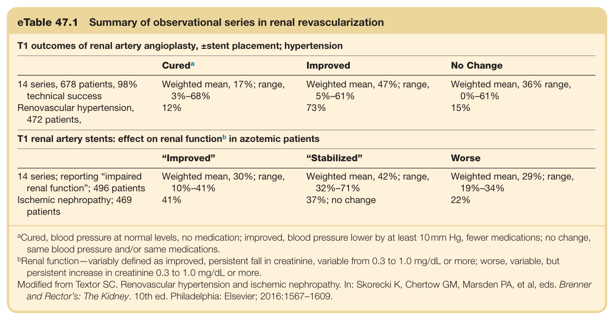

#### Table Data (CSV: [Table_e47_1.csv](Table_e47_1.csv))

```markdown
| Table Text (OCR) |
| :--- |
| eTable 47.1  Summary of observational series in renal revascularization T1 outcomes of renal artery angioplasty, ±stent placement; hypertension Cured ^{a}   Improved  No Change    14 series, 678 patients, 98% technical success  Weighted mean, 17%; range, 3%-68%  Weighted mean, 47%; range, 5%-61%  Weighted mean, 36% range, 0%-61%    Renovascular hypertension, 472 patients,  12%  73%  15% |
```

Table e47.1 Summary of observational series in renal revascularization

---

### Table_e47_2

#### Table Image

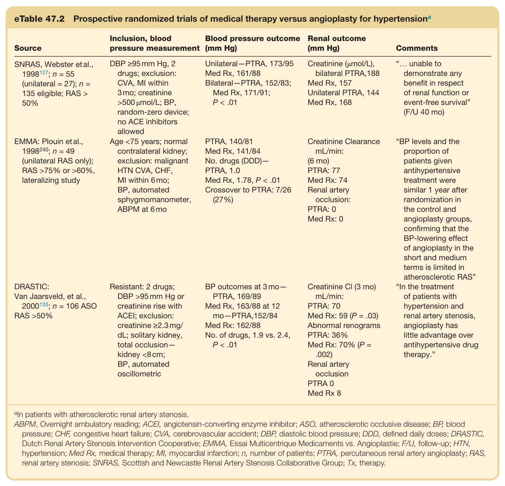

#### Table Data (CSV: [Table_e47_2.csv](Table_e47_2.csv))

```markdown
| Table Text (OCR) |
| :--- |
| eTable 47.2  Prospective randomized trials of medical therapy versus angioplasty for hypertension<sup>a</sup> Source  Inclusion, blood pressure measurement  Blood pressure outcome (mm Hg)  Renal outcome (mm Hg)  Comments    SNRAS, Webster et al.,  1998^{127} ; n = 55 (unilateral = 27); n = 135 eligible; RAS > 50%  DBP ≥95 mm Hg, 2 drugs; exclusion: CVA, MI within 3 mo; creatinine >500 μmol/L; BP, random-zero device; no ACE inhibitors allowed  Unilateral-PTRA, 173/95Med Rx, 161/88Bilateral-PTRA, 152/83; Med Rx, 171/91; P < .01  Creatinine (μmol/L), bilateral PTRA,188Med Rx, 157Unilateral PTRA, 144Med Rx, 168  “... unable to demonstrate any benefit in respect of renal function or event-free survival” (F/U 40 mo)    EMMA: Plouin et al.,  1998^{240} ; n = 49 (unilateral RAS only); RAS >75% or >60%, lateralizing study  Age <75 years; normal contralateral kidney; exclusion: malignant HTN CVA, CHF, MI within 6 mo; BP, automated sphygmomanometer, ABPM at 6 mo  PTRA, 140/81Med Rx, 141/84No. drugs (DDD)-PTRA, 1.0Med Rx, 1.78, P < .01Crossover to PTRA: 7/26 (27%)  Creatinine Clearance mL/min: (6 mo)PTRA: 77Med Rx: 74Renal artery occlusion: PTRA: 0Med Rx: 0  “BP levels and the proportion of patients given antihypertensive treatment were similar 1 year after randomization in the control and angioplasty groups, confirming that the BP-lowering effect of angioplasty in the short and medium terms is limited in atherosclerotic RAS”    DRASTIC: Van Jaarsveld, et al.,  2000^{133} ; n = 106 ASO RAS >50%  Resistant: 2 drugs; DBP >95 mm Hg or creatinine rise with ACEI; exclusion: creatinine ≥2.3 mg/dL; solitary kidney, total occlusion-kidney <8 cm; BP, automated oscillometric  BP outcomes at 3 mo-PTRA, 169/89Med Rx, 163/88 at 12 mo-PTRA,152/84Med Rx: 162/88No. of drugs, 1.9 vs. 2.4, P < .01  Creatinine CI (3 mo) mL/min: PTRA: 70Med Rx: 59 (P = .03)Abnormal renogramsPTRA: 36%Med Rx: 70% (P = .002)Renal artery occlusionPTRA 0Med Rx 8  “In the treatment of patients with hypertension and renal artery stenosis, angioplasty has little advantage over antihypertensive drug therapy.” <sup>a</sup>In patients with atherosclerotic renal artery stenosis. ABPM, Overnight ambulatory reading; ACEI, angiotensin-converting enzyme inhibitor; ASO, atherosclerotic occlusive disease; BP, blood pressure; CHF, congestive heart failure; CVA, cerebrovascular accident; DBP, diastolic blood pressure; DDD, defined daily doses; DRASTIC, Dutch Renal Artery Stenosis Intervention Cooperative; EMMA, Essai Multicentrique Medicaments vs. Angioplastie; F/U, follow-up; HTN, hypertension; Med Rx, medical therapy; MI, myocardial infarction; n, number of patients; PTRA, percutaneous renal artery angioplasty; RAS renal artery stenosis; SNRAS, Scottish and Newcastle Renal Artery Stenosis Collaborative Group; Tx, therapy. |
```

Table e47.2 Prospective randomized trials of medical therapy versus angioplasty for hypertension<sup>a</sup>

---

## Boxes

### Box_47_1

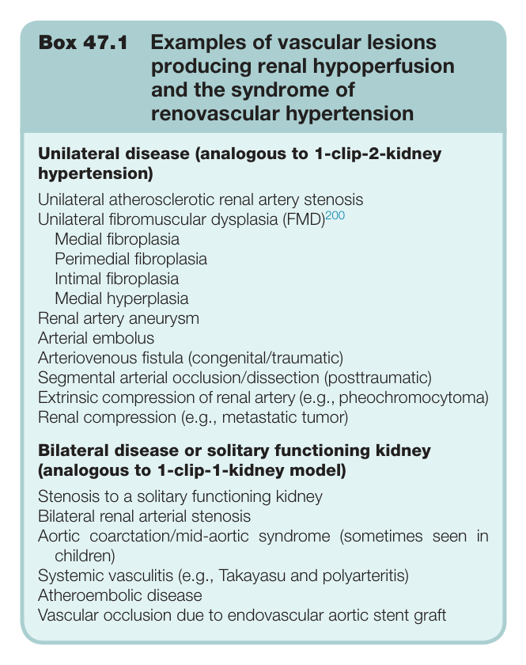

#### Box Text

```markdown
Box 47.1 Examples of vascular lesions producing renal hypoperfusion and the syndrome of renovascular hypertension Unilateral disease (analogous to 1-clip-2-kidney hypertension) Unilateral atherosclerotic renal artery stenosis Unilateral fibromuscular dysplasia (FMD)<sup>200</sup> Medial fibroplasia Perimedial fibroplasia Intimal fibroplasia Medial hyperplasia Renal artery aneurysm Arterial embolus Arteriovenous fistula (congenital/traumatic) Segmental arterial occlusion/dissection (posttraumatic) Extrinsic compression of renal artery (e.g., pheochromocytoma) Renal compression (e.g., metastatic tumor) Bilateral disease or solitary functioning kidney (analogous to 1-clip-1-kidney model) Stenosis to a solitary functioning kidney Bilateral renal arterial stenosis Aortic coarctation/mid-aortic syndrome (sometimes seen in children) Systemic vasculitis (e.g., Takayasu and polyarteritis) Atheroembolic disease Vascular occlusion due to endovascular aortic stent graf
```

Box 47.1 Examples of vascular lesions producing renal hypoperfusion and the syndrome of renovascular hypertension

---

### Box_47_2

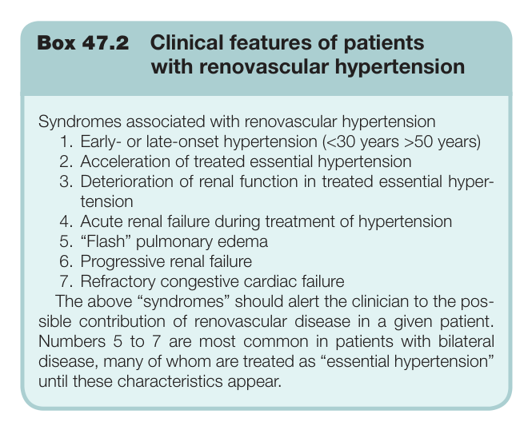

#### Box Text

```markdown
Box 47.2 Clinical features of patients with renovascular hypertension Syndromes associated with renovascular hypertension 1. Early- or late-onset hypertension (<30 years >50 years) 2. Acceleration of treated essential hypertension 3. Deterioration of renal function in treated essential hyper- tension 4. Acute renal failure during treatment of hypertension 5. “Flash” pulmonary edema 6. Progressive renal failure 7. Refractory congestive cardiac failure The above “syndromes” should alert the clinician to the pos- sible contribution of renovascular disease in a given patient. Numbers 5 to 7 are most common in patients with bilateral disease, many of whom are treated as “essential hypertension” until these characteristics appear.
```

Box 47.2 Clinical features of patients with renovascular hypertension

---

### Box_47_3

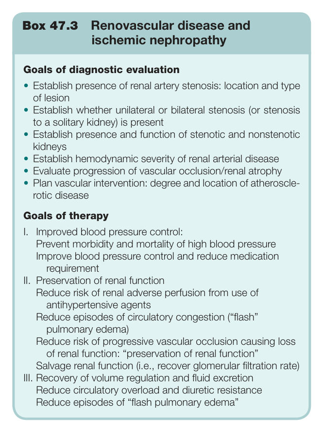

#### Box Text

```markdown
Box 47.3 Renovascular disease and ischemic nephropathy Goals of diagnostic evaluation • Establish presence of renal artery stenosis: location and type of lesion • Establish whether unilateral or bilateral stenosis (or stenosis to a solitary kidney) is present • Establish presence and function of stenotic and nonstenotic kidneys • Establish hemodynamic severity of renal arterial disease • Evaluate progression of vascular occlusion/renal atrophy • Plan vascular intervention: degree and location of atheroscle- rotic disease Goals of therapy I. Improved blood pressure control: Prevent morbidity and mortality of high blood pressure Improve blood pressure control and reduce medication requirement II. Preservation of renal function Reduce risk of renal adverse perfusion from use of antihypertensive agents Reduce episodes of circulatory congestion (“flash” pulmonary edema) Reduce risk of progressive vascular occlusion causing loss of renal function: “preservation of renal function” Salvage renal function (i.e., recover glomerular filtration rate) III. Recovery of volume regulation and fluid excretion Reduce circulatory overload and diuretic resistance Reduce episodes of “flash pulmonary edema”
```

Box 47.3 Renovascular disease and ischemic nephropathy

---

### Box_47_4

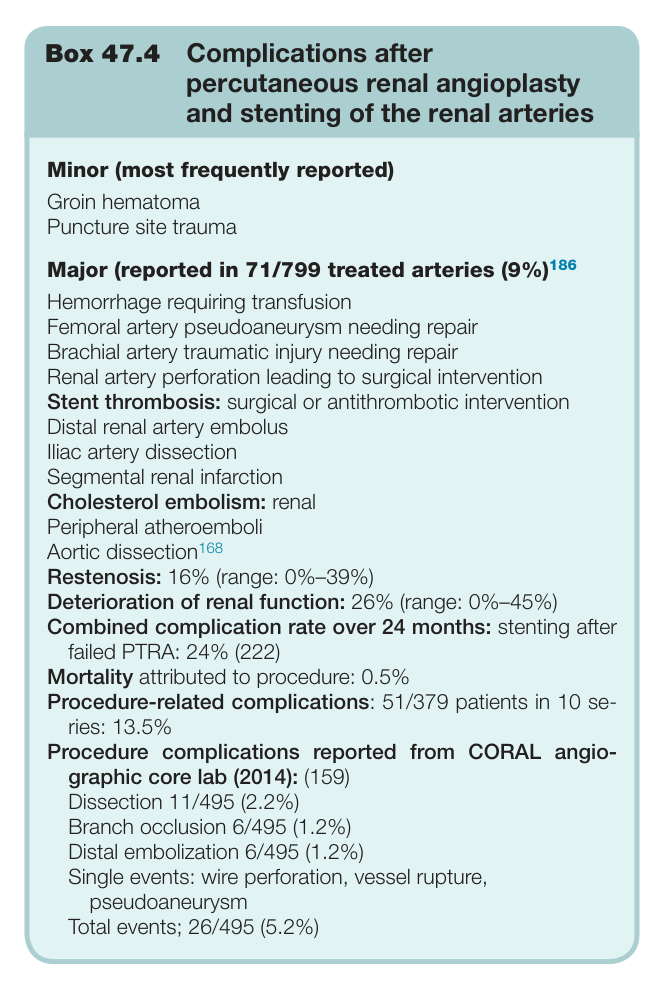

#### Box Text

```markdown
Box 47.4 Complications after percutaneous renal angioplasty and stenting of the renal arteries Minor (most frequently reported) Groin hematoma Puncture site trauma Major (reported in 71/799 treated arteries (9%)<sup>186</sup> Hemorrhage requiring transfusion Femoral artery pseudoaneurysm needing repair Brachial artery traumatic injury needing repair Renal artery perforation leading to surgical intervention Stent thrombosis: surgical or antithrombotic intervention Distal renal artery embolus Iliac artery dissection Segmental renal infarction Cholesterol embolism: renal Peripheral atheroemboli Aortic dissection<sup>168</sup> Restenosis: 16% (range: 0%–39%) Deterioration of renal function: 26% (range: 0%–45%) Combined complication rate over 24 months: stenting after failed PTRA: 24% (222) Mortality attributed to procedure: 0.5% Procedure-related complications: 51/379 patients in 10 se- ries: 13.5% Procedure complications reported from CORAL angio- graphic core lab (2014): (159) Dissection 11/495 (2.2%) Branch occlusion 6/495 (1.2%) Distal embolization 6/495 (1.2%) Single events: wire perforation, vessel rupture, pseudoaneurysm Total events; 26/495 (5.2%)
```

Box 47.4 Complications after percutaneous renal angioplasty and stenting of the renal arteries

---

### Box_47_5

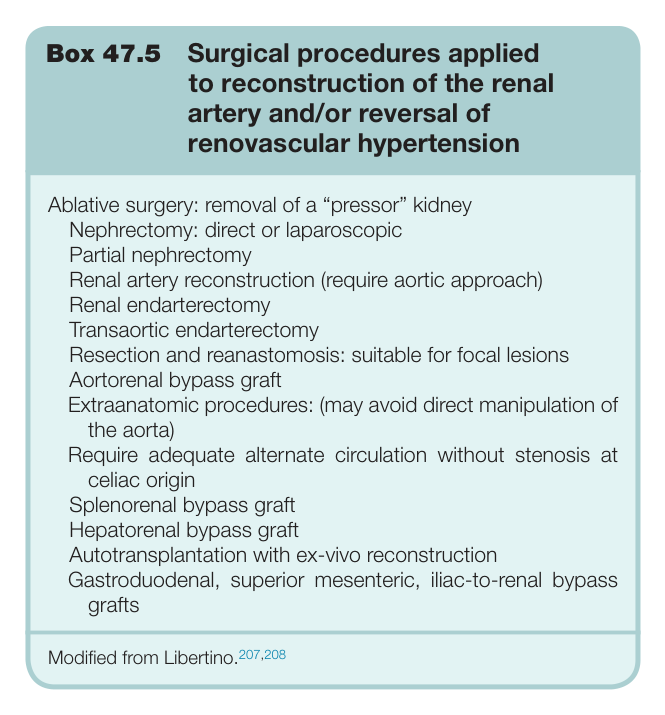

#### Box Text

```markdown
Box 47.5 Surgical procedures applied to reconstruction of the renal artery and/or reversal of renovascular hypertension Ablative surgery: removal of a “pressor” kidney Nephrectomy: direct or laparoscopic Partial nephrectomy Renal artery reconstruction (require aortic approach) Renal endarterectomy Transaortic endarterectomy Resection and reanastomosis: suitable for focal lesions Aortorenal bypass graft Extraanatomic procedures: (may avoid direct manipulation of the aorta) Require adequate alternate circulation without stenosis at celiac origin Splenorenal bypass graft Hepatorenal bypass graft Autotransplantation with ex-vivo reconstruction Gastroduodenal, superior mesenteric, iliac-to-renal bypass grafts Modified from Libertino.<sup>207,208</sup>
```

Box 47.5 Surgical procedures applied to reconstruction of the renal artery and/or reversal of renovascular hypertension

---
