# 48. Antihypertensive Therapy - Figures and Tables Index

This document lists all figures and tables extracted from `48. Antihypertensive Therapy.pdf`.

## Table of Contents
- [Figures](#figures)
- [Tables](#tables)

---

## Figures

### Fig_48_1

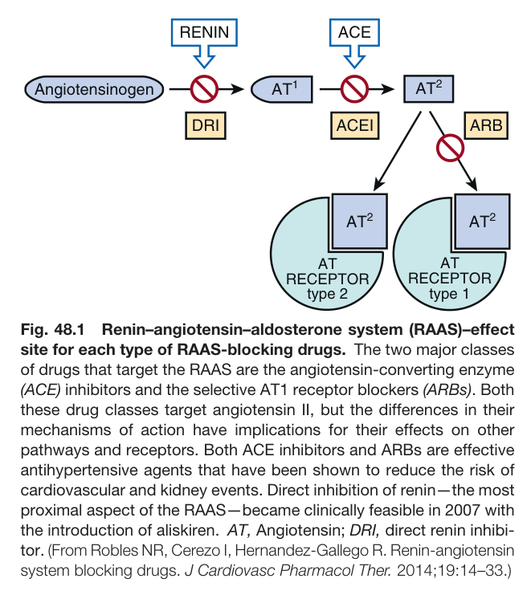

Fig. 48.1 Renin–angiotensin–aldosterone system (RAAS)–effect site for each type of RAAS-blocking drugs. The two major classes of drugs that target the RAAS are the angiotensin-converting enzyme (ACE) inhibitors and the selective AT1 receptor blockers (ARBs). Both these drug classes target angiotensin II, but the differences in their mechanisms of action have implications for their effects on other pathways and receptors. Both ACE inhibitors and ARBs are effective antihypertensive agents that have been shown to reduce the risk of cardiovascular and kidney events. Direct inhibition of renin—the most proximal aspect of the RAAS—became clinically feasible in 2007 with the introduction of aliskiren. AT, Angiotensin; DRI, direct renin inhibi- tor. (From Robles NR, Cerezo I, Hernandez-Gallego R. Renin-angiotensin system blocking drugs. J Cardiovasc Pharmacol Ther. 2014;19:14–33.)

---

### Fig_48_2

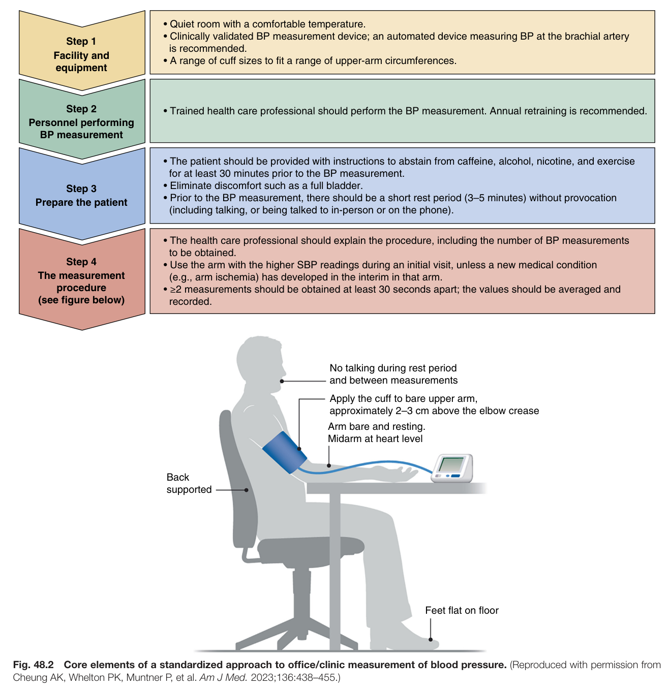

Fig. 48.2 Core elements of a standardized approach to office/clinic measurement of blood pressure. (Reproduced with permission from Cheung AK, Whelton PK, Muntner P, et al. Am J Med. 2023;136:438–455.)

---

### Fig_48_3

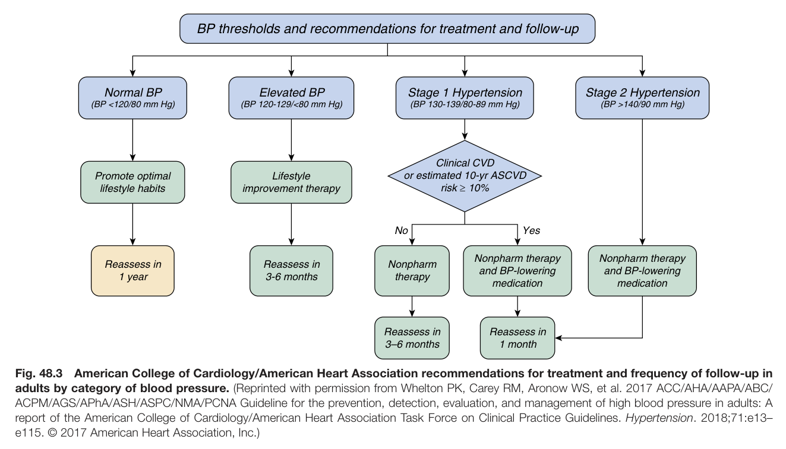

Fig. 48.3 American College of Cardiology/American Heart Association recommendations for treatment and frequency of follow-up in adults by category of blood pressure. (Reprinted with permission from Whelton PK, Carey RM, Aronow WS, et al. 2017 ACC/AHA/AAPA/ABC/ ACPM/AGS/APhA/ASH/ASPC/NMA/PCNA Guideline for the prevention, detection, evaluation, and management of high blood pressure in adults: A report of the American College of Cardiology/American Heart Association Task Force on Clinical Practice Guidelines. Hypertension. 2018;71:e13– e115. © 2017 American Heart Association, Inc.)

---

### Fig_48_4

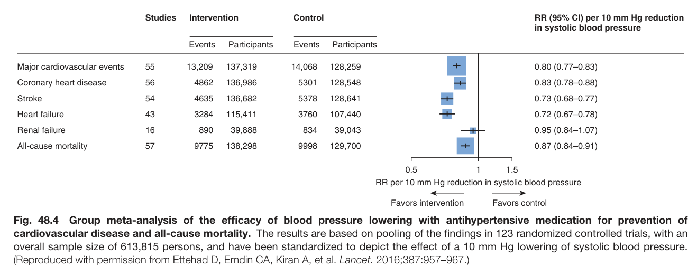

Fig. 48.4 Group meta-analysis of the efficacy of blood pressure lowering with antihypertensive medication for prevention of cardiovascular disease and all-cause mortality. The results are based on pooling of the findings in 123 randomized controlled trials, with an overall sample size of 613,815 persons, and have been standardized to depict the effect of a 10 mm Hg lowering of systolic blood pressure. (Reproduced with permission from Ettehad D, Emdin CA, Kiran A, et al. Lancet. 2016;387:957–967.)

---

### Fig_48_5

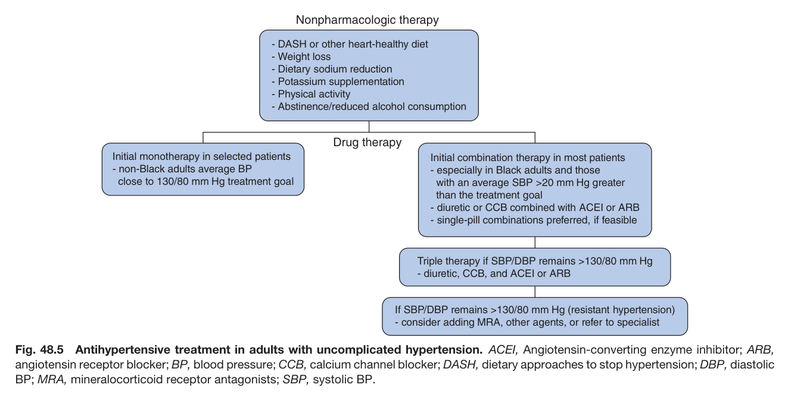

Fig. 48.5 Antihypertensive treatment in adults with uncomplicated hypertension. ACEI, Angiotensin-converting enzyme inhibitor; ARB, angiotensin receptor blocker; BP, blood pressure; CCB, calcium channel blocker; DASH, dietary approaches to stop hypertension; DBP, diastolic BP; MRA, mineralocorticoid receptor antagonists; SBP, systolic BP.

---

### Fig_48_6

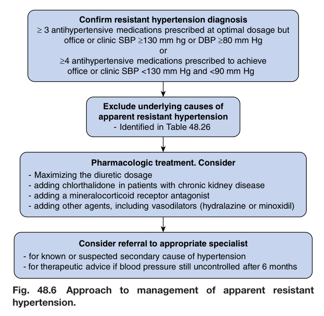

Fig. 48.6 Approach to management of apparent resistant hypertension.

---

## Tables

### Table_48_1

#### Table Image

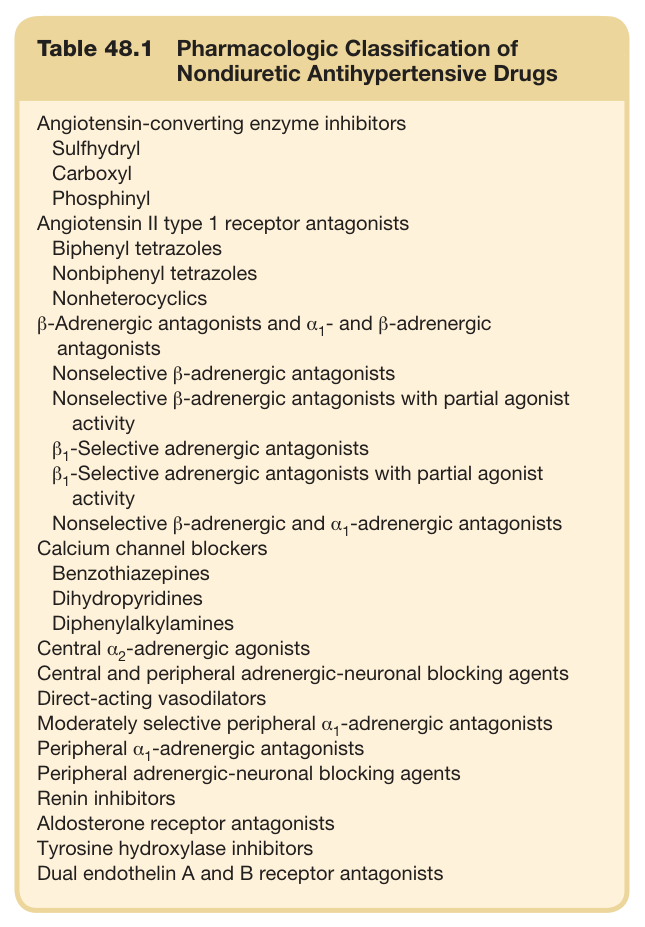

#### Table Data (CSV: [Table_48_1.csv](Table_48_1.csv))

```markdown
| Table Text (OCR) |
| :--- |
| Table 48.1 Pharmacologic Classification of Nondiuretic Antihypertensive Drugs Angiotensin-converting enzyme inhibitors    Sulfhydryl    Carboxyl    Phosphinyl    Angiotensin II type 1 receptor antagonists    Biphenyl tetrazoles    Nonbiphenyl tetrazoles    Nonheterocyclics    β-Adrenergic antagonists and  \alpha_{1} - and β-adrenergic antagonists    Nonselective β-adrenergic antagonists    Nonselective β-adrenergic antagonists with partial agonist activity     \beta_{1} -Selective adrenergic antagonists     \beta_{1} -Selective adrenergic antagonists with partial agonist activity    Nonselective β-adrenergic and  \alpha_{1} -adrenergic antagonists    Calcium channel blockers    Benzothiazepines    Dihydropyridines    Diphenylalkylamines    Central  \alpha_{2} -adrenergic agonists    Central and peripheral adrenergic-neuronal blocking agents    Direct-acting vasodilators    Moderately selective peripheral  \alpha_{1} -adrenergic antagonists    Peripheral  \alpha_{1} -adrenergic antagonists    Peripheral adrenergic-neuronal blocking agents    Renin inhibitors    Aldosterone receptor antagonists    Tyrosine hydroxylase inhibitors    Dual endothelin A and B receptor antagonists |
```

Table 48.1 Pharmacologic Classification of Nondiuretic Antihypertensive Drugs

---

### Table_48_2

#### Table Image

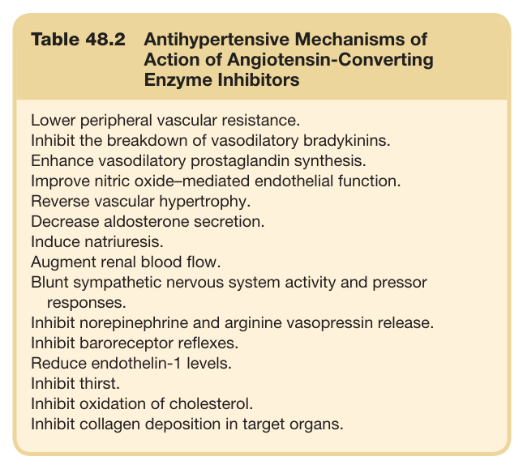

#### Table Data (CSV: [Table_48_2.csv](Table_48_2.csv))

```markdown
| Table Text (OCR) |
| :--- |
| Table 48.2  Antihypertensive Mechanisms of Action of Angiotensin-Converting Enzyme Inhibitors Lower peripheral vascular resistance.    Inhibit the breakdown of vasodilatory bradykinins.    Enhance vasodilatory prostaglandin synthesis.    Improve nitric oxide-mediated endothelial function.    Reverse vascular hypertrophy.    Decrease aldosterone secretion.    Induce natriuresis.    Augment renal blood flow.    Blunt sympathetic nervous system activity and pressor responses.    Inhibit norepinephrine and arginine vasopressin release.    Inhibit baroreceptor reflexes.    Reduce endothelin-1 levels.    Inhibit thirst.    Inhibit oxidation of cholesterol.    Inhibit collagen deposition in target organs. |
```

Table 48.2 Antihypertensive Mechanisms of Action of Angiotensin-Converting Enzyme Inhibitors

---

### Table_48_3

#### Table Image

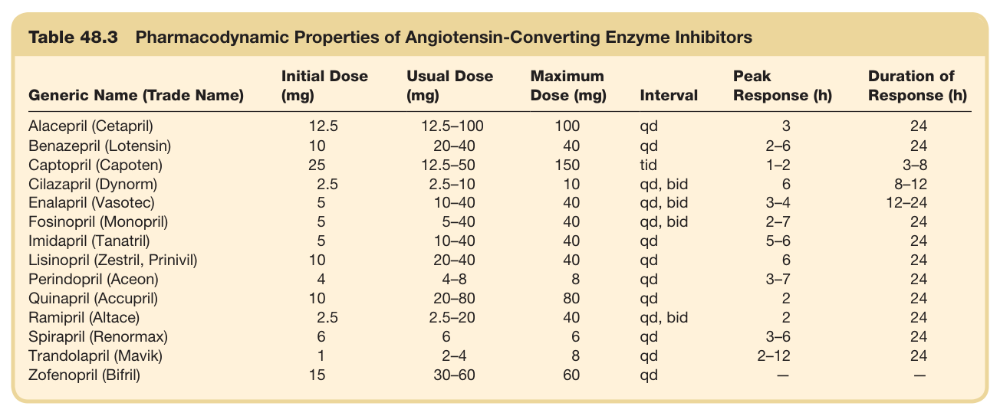

#### Table Data (CSV: [Table_48_3.csv](Table_48_3.csv))

```markdown
| Table Text (OCR) |
| :--- |
| Table 48.3 Pharmacodynamic Properties of Angiotensin-Converting Enzyme Inhibitors Generic Name (Trade Name)  Initial Dose (mg)  Usual Dose (mg)  Maximum Dose (mg)  Interval  Peak Response (h)  Duration of Response (h)    Alacepril (Cetapril)  12.5  12.5–100  100  qd  3  24    Benazepril (Lotensin)  10  20–40  40  qd  2–6  24    Captopril (Capoten)  25  12.5–50  150  tid  1–2  3–8    Cilazapril (Dynorm)  2.5  2.5–10  10  qd, bid  6  8–12    Enalapril (Vasotec)  5  10–40  40  qd, bid  3–4  12–24    Fosinopril (Monopril)  5  5–40  40  qd, bid  2–7  24    Imidapril (Tanatril)  5  10–40  40  qd  5–6  24    Lisinopril (Zestril, Prinivil)  10  20–40  40  qd  6  24    Perindopril (Aceon)  4  4–8  8  qd  3–7  24    Quinapril (Accupril)  10  20–80  80  qd  2  24    Ramipril (Altace)  2.5  2.5–20  40  qd, bid  2  24    Spirapril (Renormax)  6  6  6  qd  3–6  24    Trandolapril (Mavik)  1  2–4  8  qd  2–12  24    Zofenopril (Bifril)  15  30–60  60  qd  —  — |
```

Table 48.3 Pharmacodynamic Properties of Angiotensin-Converting Enzyme Inhibitors

---

### Table_48_4

#### Table Image

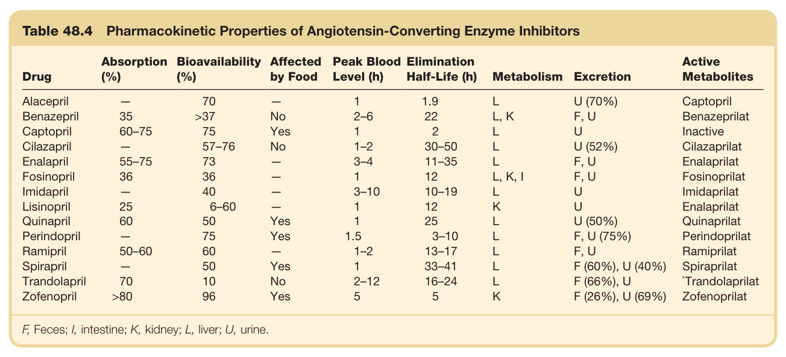

#### Table Data (CSV: [Table_48_4.csv](Table_48_4.csv))

```markdown
| Table Text (OCR) |
| :--- |
| Table 48.4  Pharmacokinetic Properties of Angiotensin-Converting Enzyme Inhibitors Drug  Absorption (%)  Bioavailability (%)  Affected by Food  Peak Blood Level (h)  Elimination Half-Life (h)  Metabolism  Excretion  Active Metabolites    Alacepril  —  70  —  1  1.9  L  U (70%)  Captopril    Benazepril  35  >37  No  2-6  22  L, K  F, U  Benazeprilat    Captopril  60-75  75  Yes  1  2  L  U  Inactive    Cilazapril  —  57-76  No  1-2  30-50  L  U (52%)  Cilazaprilat    Enalapril  55-75  73  —  3-4  11-35  L  F, U  Enalaprilat    Fosinopril  36  36  —  1  12  L, K, I  F, U  Fosinoprilat    Imidapril  —  40  —  3-10  10-19  L  U  Imidaprilat    Lisinopril  25  6-60  —  1  12  K  U  Enalaprilat    Quinapril  60  50  Yes  1  25  L  U (50%)  Quinaprilat    Perindopril  —  75  Yes  1.5  3-10  L  F, U (75%)  Perindoprilat    Ramipril  50-60  60  —  1-2  13-17  L  F, U  Ramiprilat    Spirapril  —  50  Yes  1  33-41  L  F (60%), U (40%)  Spiraprilat    Trandolapril  70  10  No  2-12  16-24  L  F (66%), U  `Trandolaprilat    Zofenopril  >80  96  Yes  5  5  K  F (26%), U (69%)  Zofenoprilat F, Feces; I, intestine; K, kidney; L, liver; U, urine. |
```

Table 48.4 Pharmacokinetic Properties of Angiotensin-Converting Enzyme Inhibitors

---

### Table_48_5

#### Table Image

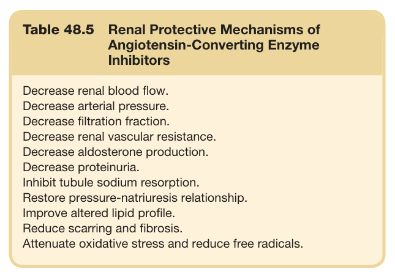

#### Table Data (CSV: [Table_48_5.csv](Table_48_5.csv))

```markdown
| Table Text (OCR) |
| :--- |
| Table 48.5  Renal Protective Mechanisms of Angiotensin-Converting Enzyme Inhibitors Decrease renal blood flow.    Decrease arterial pressure.    Decrease filtration fraction.    Decrease renal vascular resistance.    Decrease aldosterone production.    Decrease proteinuria.    Inhibit tubule sodium resorption.    Restore pressure-natriuresis relationship.    Improve altered lipid profile.    Reduce scarring and fibrosis.    Attenuate oxidative stress and reduce free radicals. |
```

Table 48.5 Renal Protective Mechanisms of Angiotensin-Converting Enzyme Inhibitors

---

### Table_48_6

#### Table Images (2 Parts)

- **Part 1 (Page 6)**:
  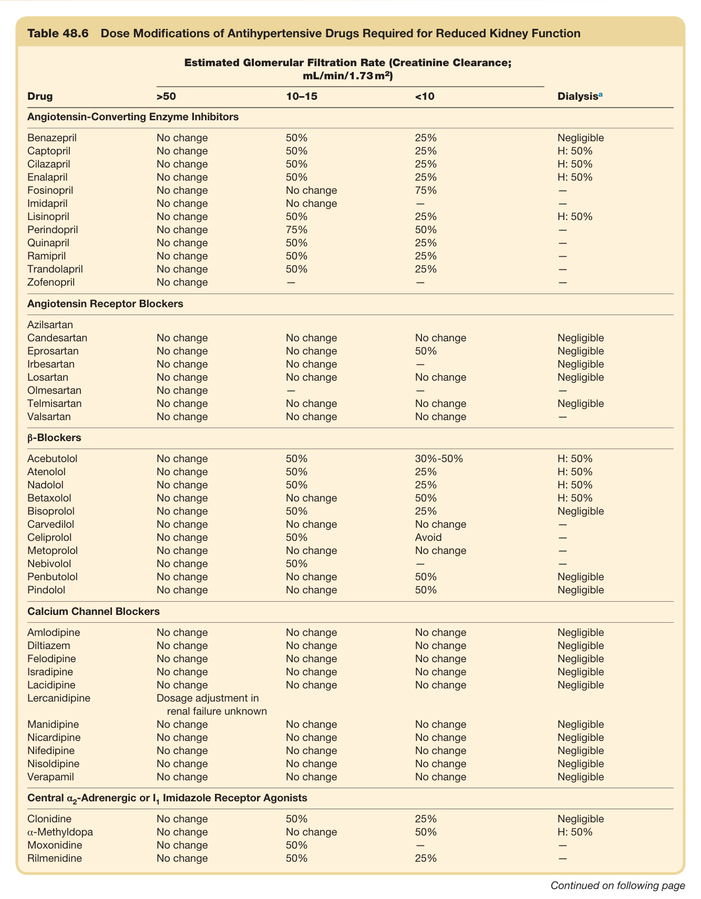

- **Part 2 (Page 7)**:
  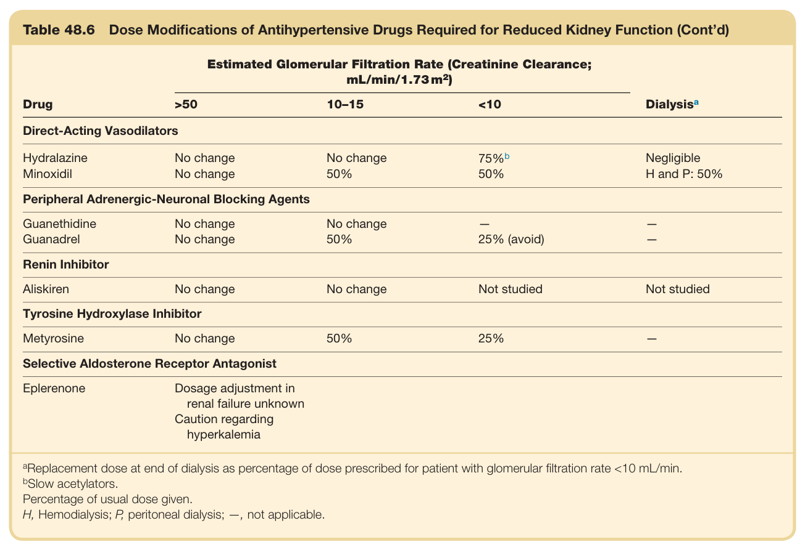

#### Table Data (CSV: [Table_48_6.csv](Table_48_6.csv))

```markdown
| Table Text (OCR) |
| :--- |
| Table 48.6 Dose Modifications of Antihypertensive Drugs Required for Reduced Kidney Function Drug  Estimated Glomerular Filtration Rate (Creatinine Clearance; mL/min/1.73 m^2 )  Dialysis ^a     >50  10-15  <10    Angiotensin-Converting Enzyme Inhibitors    Benazepril  No change  50%  25%  Negligible    Captopril  No change  50%  25%  H: 50%    Cilazapril  No change  50%  25%  H: 50%    Enalapril  No change  50%  25%  H: 50%    Fosinopril  No change  No change  75%  —    Imidapril  No change  No change  —  —    Lisinopril  No change  50%  25%  H: 50%    Perindopril  No change  75%  50%  —    Quinapril  No change  50%  25%  —    Ramipril  No change  50%  25%  —    Trandolapril  No change  50%  25%  —    Zofenopril  No change  —  —  —    Angiotensin Receptor Blockers    Azilsartan            Candesartan  No change  No change  No change  Negligible    Eprosartan  No change  No change  50%  Negligible    Irbesartan  No change  No change  —  Negligible    Losartan  No change  No change  No change  Negligible    Olmesartan  No change  —  —  —    Telmisartan  No change  No change  No change  Negligible    Valsartan  No change  No change  No change  —    β-Blockers    Acebutolol  No change  50%  30%-50%  H: 50%    Atenolol  No change  50%  25%  H: 50%    Nadolol  No change  50%  25%  H: 50%    Betaxolol  No change  No change  50%  H: 50%    Bisoprolol  No change  50%  25%  Negligible    Carvedilol  No change  No change  No change  —    Celiprolol  No change  50%  Avoid  —    Metoprolol  No change  No change  No change  —    Nebivolol  No change  50%  —  —    Penbutolol  No change  No change  50%  Negligible    Pindolol  No change  No change  50%  Negligible    Calcium Channel Blockers    Amlodipine  No change  No change  No change  Negligible    Diltiazem  No change  No change  No change  Negligible    Felodipine  No change  No change  No change  Negligible    Isradipine  No change  No change  No change  Negligible    Lacidipine  No change  No change  No change  Negligible    Lercanidipine  Dosage adjustment in renal failure unknown          Manidipine  No change  No change  No change  Negligible    Nicardipine  No change  No change  No change  Negligible    Nifedipine  No change  No change  No change  Negligible    Nisoldipine  No change  No change  No change  Negligible    Verapamil  No change  No change  No change  Negligible    Central α2-Adrenergic or I1 Imidazole Receptor Agonists    Clonidine  No change  50%  25%  Negligible    α-Methyldopa  No change  No change  50%  H: 50%    Moxonidine  No change  50%  —  —    Rilmenidine  No change  50%  25%  —    Direct-Acting Vasodilators    Hydralazine  No change  No change   75\%^b   Negligible    Minoxidil  No change  50%  50%  H and P: 50%    Peripheral Adrenergic-Neuronal Blocking Agents    Guanethidine  No change  No change  —  —    Guanadrel  No change  50%  25% (avoid)  —    Renin Inhibitor    Aliskiren  No change  No change  Not studied  Not studied    Tyrosine Hydroxylase Inhibitor    Metyrosine  No change  50%  25%  —    Selective Aldosterone Receptor Antagonist    Eplerenone  Dosage adjustment in renal failure unknownCaution regarding hyperkalemia <sup>a</sup>Replacement dose at end of dialysis as percentage of dose prescribed for patient with glomerular filtration rate <10 mL/min. <sup>b</sup>Slow acetylators. Percentage of usual dose given. H, Hemodialysis; P, peritoneal dialysis; —, not applicable. |
```

Table 48.6 Dose Modifications of Antihypertensive Drugs Required for Reduced Kidney Function

---

### Table_48_7

#### Table Image

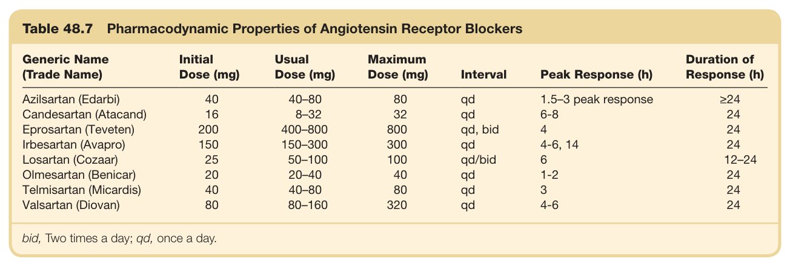

#### Table Data (CSV: [Table_48_7.csv](Table_48_7.csv))

```markdown
| Table Text (OCR) |
| :--- |
| Table 48.7  Pharmacodynamic Properties of Angiotensin Receptor Blockers Generic Name(Trade Name)  InitialDose (mg)  UsualDose (mg)  MaximumDose (mg)  Interval  Peak Response (h)  Duration ofResponse (h)    Azilsartan (Edarbi)  40  40–80  80  qd  1.5–3 peak response  ≥24    Candesartan (Atacand)  16  8–32  32  qd  6-8  24    Eprosartan (Teveten)  200  400–800  800  qd, bid  4  24    Irbesartan (Avapro)  150  150–300  300  qd  4-6, 14  24    Losartan (Cozaar)  25  50–100  100  qd/bid  6  12–24    Olmesartan (Benicar)  20  20–40  40  qd  1-2  24    Telmisartan (Micardis)  40  40–80  80  qd  3  24    Valsartan (Diovan)  80  80–160  320  qd  4-6  24 bid, Two times a day; qd, once a day. |
```

Table 48.7 Pharmacodynamic Properties of Angiotensin Receptor Blockers

---

### Table_48_8

#### Table Image

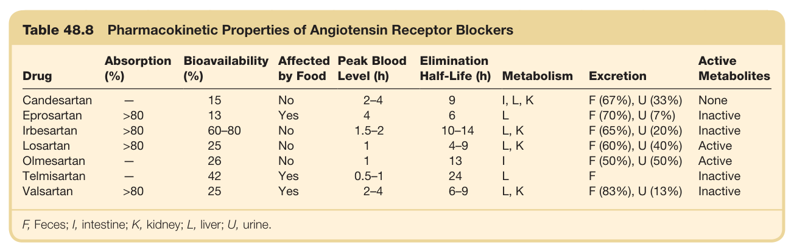

#### Table Data (CSV: [Table_48_8.csv](Table_48_8.csv))

```markdown
| Table Text (OCR) |
| :--- |
| Table 48.8  Pharmacokinetic Properties of Angiotensin Receptor Blockers Drug  Absorption (%)  Bioavailability (%)  Affected by Food  Peak Blood Level (h)  Elimination Half-Life (h)  Metabolism  Excretion  Active Metabolites    Candesartan  —  15  No  2–4  9  I, L, K  F (67%), U (33%)  None    Eprosartan  >80  13  Yes  4  6  L  F (70%), U (7%)  Inactive    Irbesartan  >80  60–80  No  1.5–2  10–14  L, K  F (65%), U (20%)  Inactive    Losartan  >80  25  No  1  4–9  L, K  F (60%), U (40%)  Active    Olmesartan  —  26  No  1  13  I  F (50%), U (50%)  Active    Telmisartan  —  42  Yes  0.5–1  24  L  F  Inactive    Valsartan  >80  25  Yes  2–4  6–9  L, K  F (83%), U (13%)  Inactive F, Feces; I, intestine; K, kidney; L, liver; U, urine. |
```

Table 48.8 Pharmacokinetic Properties of Angiotensin Receptor Blockers

---

### Table_48_9

#### Table Image

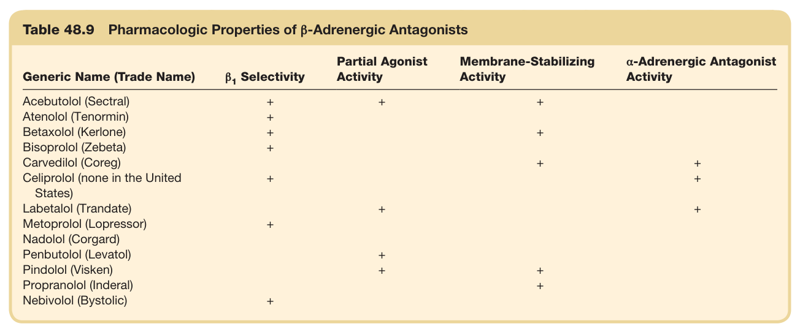

#### Table Data (CSV: [Table_48_9.csv](Table_48_9.csv))

```markdown
| Table Text (OCR) |
| :--- |
| Table 48.9 Pharmacologic Properties of β-Adrenergic Antagonists Generic Name (Trade Name)   \beta_1  Selectivity  Partial Agonist Activity  Membrane-Stabilizing Activity   \alpha -Adrenergic Antagonist Activity    Acebutolol (Sectral)  +  +  +      Atenolol (Tenormin)  +          Betaxolol (Kerlone)  +    +      Bisoprolol (Zebeta)  +          Carvedilol (Coreg)      +  +    Celiprolol (none in the United States)  +      +    Labetalol (Trandate)    +    +    Metoprolol (Lopressor)  +          Nadolol (Corgard)            Penbutolol (Levatol)    +        Pindolol (Visken)    +  +      Propranolol (Inderal)      +      Nebivolol (Bystolic)  + |
```

Table 48.9 Pharmacologic Properties of β-Adrenergic Antagonists

---

### Table_48_10

#### Table Image

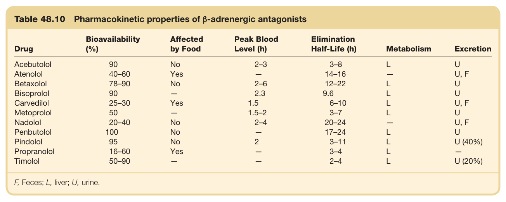

#### Table Data (CSV: [Table_48_10.csv](Table_48_10.csv))

```markdown
| Table Text (OCR) |
| :--- |
| Table 48.10  Pharmacokinetic properties of β-adrenergic antagonists Drug  Bioavailability (%)  Affected by Food  Peak Blood Level (h)  Elimination Half-Life (h)  Metabolism  Excretion    Acebutolol  90  No  2-3  3-8  L  U    Atenolol  40-60  Yes  -  14-16  -  U, F    Betaxolol  78-90  No  2-6  12-22  L  U    Bisoprolol  90  -  2.3  9.6  L  U    Carvedilol  25-30  Yes  1.5  6-10  L  U, F    Metoprolol  50  -  1.5-2  3-7  L  U    Nadolol  20-40  No  2-4  20-24  -  U, F    Penbutolol  100  No  -  17-24  L  U    Pindolol  95  No  2  3-11  L  U (40%)    Propranolol  16-60  Yes  -  3-4  L  -    Timolol  50-90  -  -  2-4  L  U (20%) F, Feces; L, liver; U, urine. |
```

Table 48.10 Pharmacokinetic properties of β-adrenergic antagonists

---

### Table_48_11

#### Table Image

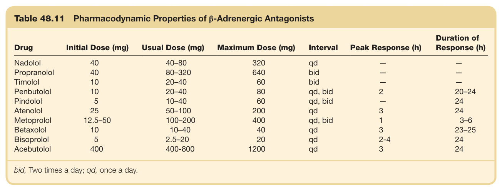

#### Table Data (CSV: [Table_48_11.csv](Table_48_11.csv))

```markdown
| Table Text (OCR) |
| :--- |
| Table 48.11 Pharmacodynamic Properties of β-Adrenergic Antagonists Drug  Initial Dose (mg)  Usual Dose (mg)  Maximum Dose (mg)  Interval  Peak Response (h)  Duration of Response (h)    Nadolol  40  40–80  320  qd  —  —    Propranolol  40  80–320  640  bid  —  —    Timolol  10  20–40  60  bid  —  —    Penbutolol  10  20–40  80  qd, bid  2  20–24    Pindolol  5  10–40  60  qd, bid  —  24    Atenolol  25  50–100  200  qd  3  24    Metoprolol  12.5–50  100–200  400  qd, bid  1  3–6    Betaxolol  10  10–40  40  qd  3  23–25    Bisoprolol  5  2.5–20  20  qd  2-4  24    Acebutolol  400  400-800  1200  qd  3  24 bid, Two times a day; qd, once a day. |
```

Table 48.11 Pharmacodynamic Properties of β-Adrenergic Antagonists

---

### Table_48_12

#### Table Image

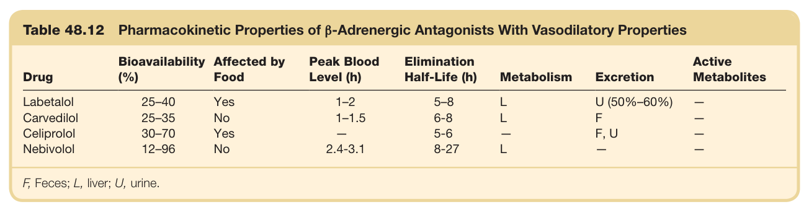

#### Table Data (CSV: [Table_48_12.csv](Table_48_12.csv))

```markdown
| Table Text (OCR) |
| :--- |
| Table 48.12 Pharmacokinetic Properties of β-Adrenergic Antagonists With Vasodilatory Properties Drug  Bioavailability (%)  Affected by Food  Peak Blood Level (h)  Elimination Half-Life (h)  Metabolism  Excretion  Active Metabolites    Labetalol  25–40  Yes  1–2  5–8  L  U (50%–60%)  —    Carvedilol  25–35  No  1–1.5  6-8  L  F  —    Celiprolol  30–70  Yes  —  5-6  —  F, U  —    Nebivolol  12–96  No  2.4-3.1  8-27  L  —  — F, Feces; L, liver; U, urine. |
```

Table 48.12 Pharmacokinetic Properties of β-Adrenergic Antagonists With Vasodilatory Properties

---

### Table_48_13

#### Table Image

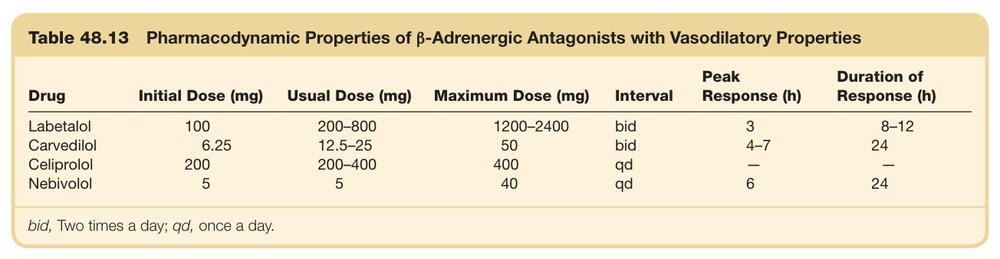

#### Table Data (CSV: [Table_48_13.csv](Table_48_13.csv))

```markdown
| Table Text (OCR) |
| :--- |
| Table 48.13  Pharmacodynamic Properties of β-Adrenergic Antagonists with Vasodilatory Properties Drug  Initial Dose (mg)  Usual Dose (mg)  Maximum Dose (mg)  Interval  Peak Response (h)  Duration of Response (h)    Labetalol  100  200–800  1200–2400  bid  3  8–12    Carvedilol  6.25  12.5–25  50  bid  4–7  24    Celiprolol  200  200–400  400  qd  —  —    Nebivolol  5  5  40  qd  6  24 bid, Two times a day; qd, once a day. |
```

Table 48.13 Pharmacodynamic Properties of β-Adrenergic Antagonists with Vasodilatory Properties

---

### Table_48_14

#### Table Image

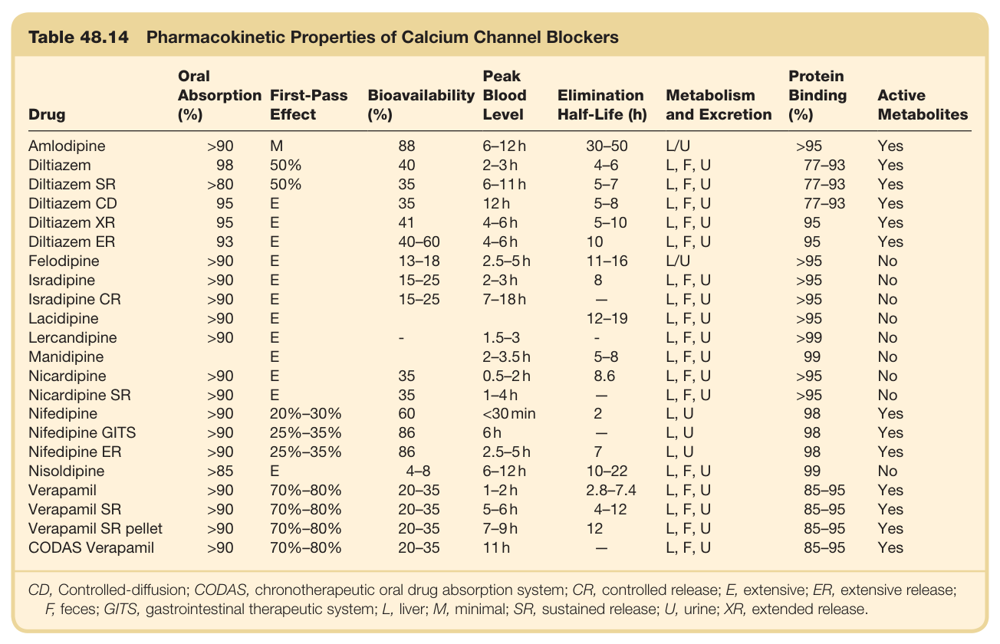

#### Table Data (CSV: [Table_48_14.csv](Table_48_14.csv))

```markdown
| Table Text (OCR) |
| :--- |
| Table 48.14 Pharmacokinetic Properties of Calcium Channel Blockers Drug  Oral Absorption (%)  First-Pass Effect  Bioavailability (%)  Peak Blood Level  Elimination Half-Life (h)  Metabolism and Excretion  Protein Binding (%)  Active Metabolites    Amlodipine  >90  M  88  6-12h  30-50  L/U  >95  Yes    Diltiazem  98  50%  40  2-3h  4-6  L, F, U  77-93  Yes    Diltiazem SR  >80  50%  35  6-11h  5-7  L, F, U  77-93  Yes    Diltiazem CD  95  E  35  12h  5-8  L, F, U  77-93  Yes    Diltiazem XR  95  E  41  4-6h  5-10  L, F, U  95  Yes    Diltiazem ER  93  E  40-60  4-6h  10  L, F, U  95  Yes    Felodipine  >90  E  13-18  2.5-5h  11-16  L/U  >95  No    Isradipine  >90  E  15-25  2-3h  8  L, F, U  >95  No    Isradipine CR  >90  E  15-25  7-18h  -  L, F, U  >95  No    Lacidipine  >90  E      12-19  L, F, U  >95  No    Lercandipine  >90  E  -  1.5-3  -  L, F, U  >99  No    Manidipine    E    2-3.5h  5-8  L, F, U  99  No    Nicardipine  >90  E  35  0.5-2h  8.6  L, F, U  >95  No    Nicardipine SR  >90  E  35  1-4h  -  L, F, U  >95  No    Nifedipine  >90  20%-30%  60  <30min  2  L, U  98  Yes    Nifedipine GITS  >90  25%-35%  86  6h  -  L, U  98  Yes    Nifedipine ER  >90  25%-35%  86  2.5-5h  7  L, U  98  Yes    Nisoldipine  >85  E  4-8  6-12h  10-22  L, F, U  99  No    Verapamil  >90  70%-80%  20-35  1-2h  2.8-7.4  L, F, U  85-95  Yes    Verapamil SR  >90  70%-80%  20-35  5-6h  4-12  L, F, U  85-95  Yes    Verapamil SR pellet  >90  70%-80%  20-35  7-9h  12  L, F, U  85-95  Yes    CODAS Verapamil  >90  70%-80%  20-35  11h  -  L, F, U  85-95  Yes CD, Controlled-diffusion; CODAS, chronotherapeutic oral drug absorption system; CR, controlled release; E, extensive; ER, extensive release; F, feces; GITS, gastrointestinal therapeutic system; L, liver; M, minimal; SR, sustained release; U, urine; XR, extended release. |
```

Table 48.14 Pharmacokinetic Properties of Calcium Channel Blockers

---

### Table_48_15

#### Table Image

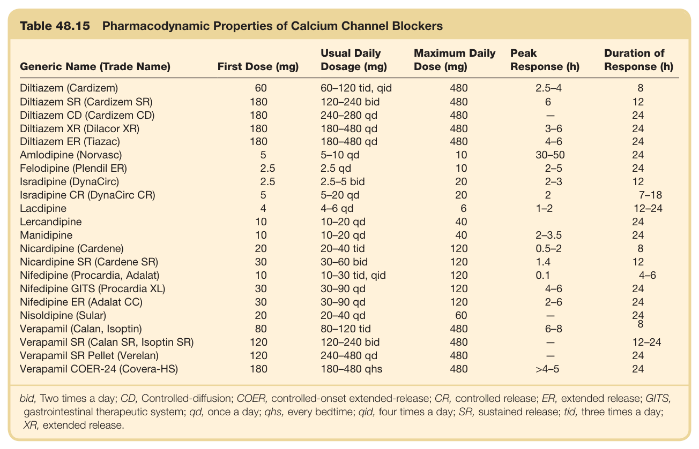

#### Table Data (CSV: [Table_48_15.csv](Table_48_15.csv))

```markdown
| Table Text (OCR) |
| :--- |
| Table 48.15  Pharmacodynamic Properties of Calcium Channel Blockers Generic Name (Trade Name)  First Dose (mg)  Usual Daily Dosage (mg)  Maximum Daily Dose (mg)  Peak Response (h)  Duration of Response (h)    Diltiazem (Cardizem)  60  60–120 tid, qid  480  2.5–4  8    Diltiazem SR (Cardizem SR)  180  120–240 bid  480  6  12    Diltiazem CD (Cardizem CD)  180  240–280 qd  480  —  24    Diltiazem XR (Dilacor XR)  180  180–480 qd  480  3–6  24    Diltiazem ER (Tiazac)  180  180–480 qd  480  4–6  24    Amlodipine (Norvasc)  5  5–10 qd  10  30–50  24    Felodipine (Plendil ER)  2.5  2.5 qd  10  2–5  24    Isradipine (DynaCirc)  2.5  2.5–5 bid  20  2–3  12    Isradipine CR (DynaCirc CR)  5  5–20 qd  20  2  7–18    Lacdipine  4  4–6 qd  6  1–2  12–24    Lercandipine  10  10–20 qd  40    24    Manidipine  10  10–20 qd  40  2–3.5  24    Nicardipine (Cardene)  20  20–40 tid  120  0.5–2  8    Nicardipine SR (Cardene SR)  30  30–60 bid  120  1.4  12    Nifedipine (Procardia, Adalat)  10  10–30 tid, qid  120  0.1  4–6    Nifedipine GITS (Procardia XL)  30  30–90 qd  120  4–6  24    Nifedipine ER (Adalat CC)  30  30–90 qd  120  2–6  24    Nisoldipine (Sular)  20  20–40 qd  60  —  24    Verapamil (Calan, Isoptin)  80  80–120 tid  480  6–8  8    Verapamil SR (Calan SR, Isoptin SR)  120  120–240 bid  480  —  12–24    Verapamil SR Pellet (Verelan)  120  240–480 qd  480  —  24    Verapamil COER-24 (Covera-HS)  180  180–480 qhs  480  >4–5  24 bid, Two times a day; CD, Controlled-diffusion; COER, controlled-onset extended-release; CR, controlled release; ER, extended release; GITS, gastrointestinal therapeutic system; qd, once a day; qhs, every bedtime; qid, four times a day; SR, sustained release; tid, three times a day; XR, extended release. |
```

Table 48.15 Pharmacodynamic Properties of Calcium Channel Blockers

---

### Table_48_16

#### Table Image

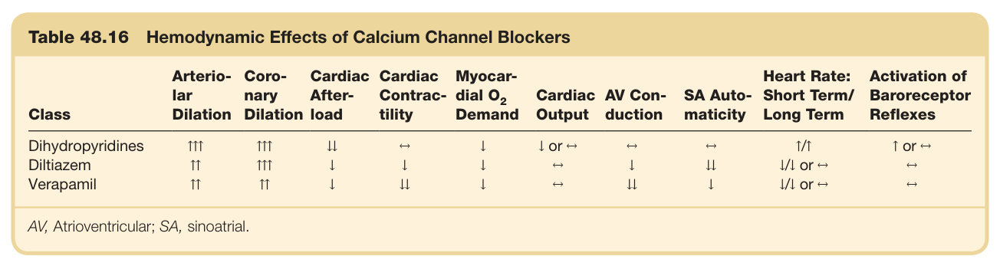

#### Table Data (CSV: [Table_48_16.csv](Table_48_16.csv))

```markdown
| Table Text (OCR) |
| :--- |
| Table 48.16  Hemodynamic Effects of Calcium Channel Blockers Class  Arterio-lar Dilation  Coro-nary Dilation  Cardiac After-load  Cardiac Contract- tility  Myocar-dial  O_2  Demand  Cardiac Output  AV Con- duction  SA Auto-maticity  Heart Rate: Short Term/ Long Term  Activation of Baroreceptor Reflexes    Dihydropyridines  ↑↑↑  ↑↑↑  ↓↓  ↔  ↓  ↓ or ↔  ↔  ↔  ↑/↑  ↑ or ↔    Diltiazem  ↑↑  ↑↑↑  ↓  ↓  ↓  ↔  ↓  ↓↓  ↓/↓ or ↔  ↔    Verapamil  ↑↑  ↑↑  ↓  ↓↓  ↓  ↔  ↓↓  ↓  ↓/↓ or ↔  ↔ AV, Atrioventricular; SA, sinoatrial. |
```

Table 48.16 Hemodynamic Effects of Calcium Channel Blockers

---

### Table_48_17

#### Table Image

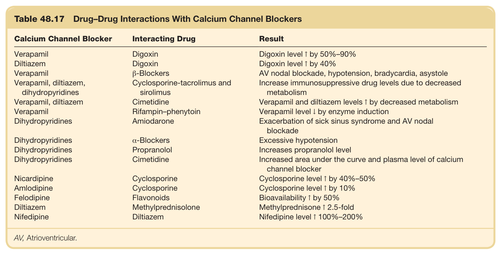

#### Table Data (CSV: [Table_48_17.csv](Table_48_17.csv))

```markdown
| Table Text (OCR) |
| :--- |
| Table 48.17  Drug–Drug Interactions With Calcium Channel Blockers Calcium Channel Blocker  Interacting Drug  Result    Verapamil  Digoxin  Digoxin level ↑ by 50%-90%    Diltiazem  Digoxin  Digoxin level ↑ by 40%    Verapamil  β-Blockers  AV nodal blockade, hypotension, bradycardia, asystole    Verapamil, diltiazem, dihydropyridines  Cyclosporine-tacrolimus and sirolimus  Increase immunosuppressive drug levels due to decreased metabolism    Verapamil, diltiazem  Cimetidine  Verapamil and diltiazem levels ↑ by decreased metabolism    Verapamil  Rifampin-phenytoin  Verapamil level ↓ by enzyme induction    Dihydropyridines  Amiodarone  Exacerbation of sick sinus syndrome and AV nodal blockade    Dihydropyridines  α-Blockers  Excessive hypotension    Dihydropyridines  Propranolol  Increases propranolol level    Dihydropyridines  Cimetidine  Increased area under the curve and plasma level of calcium channel blocker    Nicardipine  Cyclosporine  Cyclosporine level ↑ by 40%-50%    Amlodipine  Cyclosporine  Cyclosporine level ↑ by 10%    Felodipine  Flavonoids  Bioavailability ↑ by 50%    Diltiazem  Methylprednisolone  Methylprednisone ↑ 2.5-fold    Nifedipine  Diltiazem  Nifedipine level ↑ 100%-200% AV, Atrioventricular. |
```

Table 48.17 Drug–Drug Interactions With Calcium Channel Blockers

---

### Table_48_18

#### Table Image

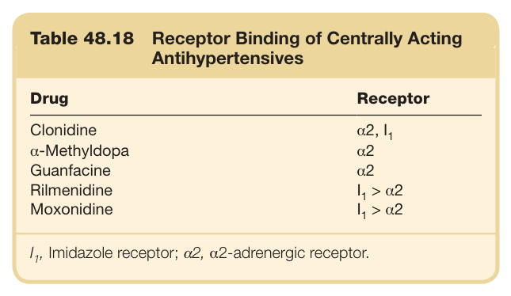

#### Table Data (CSV: [Table_48_18.csv](Table_48_18.csv))

```markdown
| Table Text (OCR) |
| :--- |
| Table 48.18  Receptor Binding of Centrally Acting Antihypertensives Drug  Receptor    Clonidine   \alpha 2, I_1      \alpha -Methyldopa   \alpha 2     Guanfacine   \alpha 2     Rilmenidine   I_1 > \alpha 2     Moxonidine   I_1 > \alpha 2 I , Imidazole receptor; α2, α2-adrenergic receptor. |
```

Table 48.18 Receptor Binding of Centrally Acting Antihypertensives

---

### Table_48_19

#### Table Image

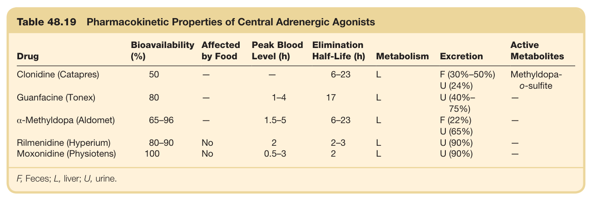

#### Table Data (CSV: [Table_48_19.csv](Table_48_19.csv))

```markdown
| Table Text (OCR) |
| :--- |
| Table 48.19  Pharmacokinetic Properties of Central Adrenergic Agonists Drug  Bioavailability (%)  Affected by Food  Peak Blood Level (h)  Elimination Half-Life (h)  Metabolism  Excretion  Active Metabolites    Clonidine (Catapres)  50  —  —  6–23  L  F (30%–50%)U (24%)  Methyldopa-o-sulfite    Guanfacine (Tonex)  80  —  1–4  17  L  U (40%–75%)  —    α-Methyldopa (Aldomet)  65–96  —  1.5–5  6–23  L  F (22%)U (65%)  —    Rilmenidine (Hyperium)  80–90  No  2  2–3  L  U (90%)  —    Moxonidine (Physiotens)  100  No  0.5–3  2  L  U (90%)  — F, Feces; L, liver; U, urine. |
```

Table 48.19 Pharmacokinetic Properties of Central Adrenergic Agonists

---

### Table_48_20

#### Table Image

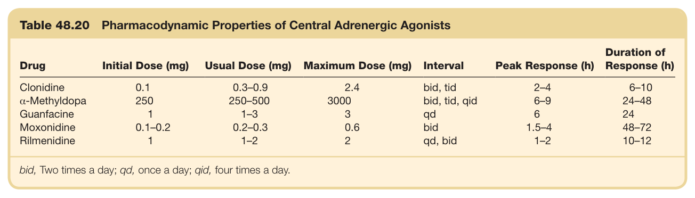

#### Table Data (CSV: [Table_48_20.csv](Table_48_20.csv))

```markdown
| Table Text (OCR) |
| :--- |
| Table 48.20 Pharmacodynamic Properties of Central Adrenergic Agonists Drug  Initial Dose (mg)  Usual Dose (mg)  Maximum Dose (mg)  Interval  Peak Response (h)  Duration of Response (h)    Clonidine  0.1  0.3–0.9  2.4  bid, tid  2–4  6–10    α-Methyldopa  250  250–500  3000  bid, tid, qid  6–9  24–48    Guanfacine  1  1–3  3  qd  6  24    Moxonidine  0.1–0.2  0.2–0.3  0.6  bid  1.5–4  48–72    Rilmenidine  1  1–2  2  qd, bid  1–2  10–12 bid, Two times a day; qd, once a day; qid, four times a day. |
```

Table 48.20 Pharmacodynamic Properties of Central Adrenergic Agonists

---

### Table_48_21

#### Table Image

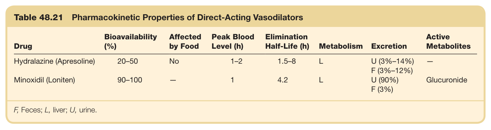

#### Table Data (CSV: [Table_48_21.csv](Table_48_21.csv))

```markdown
| Table Text (OCR) |
| :--- |
| Table 48.21  Pharmacokinetic Properties of Direct-Acting Vasodilators Drug  Bioavailability (%)  Affected by Food  Peak Blood Level (h)  Elimination Half-Life (h)  Metabolism  Excretion  Active Metabolites    Hydralazine (Apresoline)  20–50  No  1–2  1.5–8  L  U (3%–14%)F (3%–12%)  —    Minoxidil (Loniten)  90–100  —  1  4.2  L  U (90%)F (3%)  Glucuronide F, Feces; L, liver; U, urine. |
```

Table 48.21 Pharmacokinetic Properties of Direct-Acting Vasodilators

---

### Table_48_22

#### Table Image

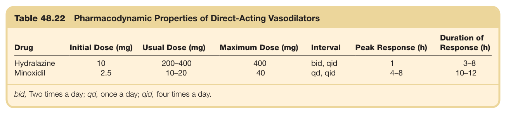

#### Table Data (CSV: [Table_48_22.csv](Table_48_22.csv))

```markdown
| Table Text (OCR) |
| :--- |
| Table 48.22  Pharmacodynamic Properties of Direct-Acting Vasodilators Drug  Initial Dose (mg)  Usual Dose (mg)  Maximum Dose (mg)  Interval  Peak Response (h)  Duration of Response (h)    Hydralazine  10  200–400  400  bid, qid  1  3–8    Minoxidil  2.5  10–20  40  qd, qid  4–8  10–12 bid, Two times a day; qd, once a day; qid, four times a day. |
```

Table 48.22 Pharmacodynamic Properties of Direct-Acting Vasodilators

---

### Table_48_23

#### Table Image

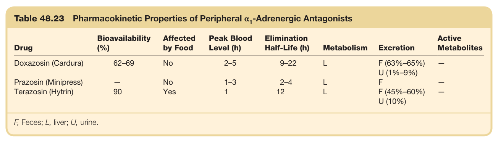

#### Table Data (CSV: [Table_48_23.csv](Table_48_23.csv))

```markdown
| Table Text (OCR) |
| :--- |
| Table 48.23 Pharmacokinetic Properties of Peripheral α -Adrenergic Antagonists Drug  Bioavailability (%)  Affected by Food  Peak Blood Level (h)  Elimination Half-Life (h)  Metabolism  Excretion  Active Metabolites    Doxazosin (Cardura)  62–69  No  2–5  9–22  L  F (63%–65%)U (1%–9%)  —    Prazosin (Minipress)  —  No  1–3  2–4  L  F  —    Terazosin (Hytrin)  90  Yes  1  12  L  F (45%–60%)U (10%)  — F, Feces; L, liver; U, urine. |
```

Table 48.23 Pharmacokinetic Properties of Peripheral α -Adrenergic Antagonists

---

### Table_48_24

#### Table Image

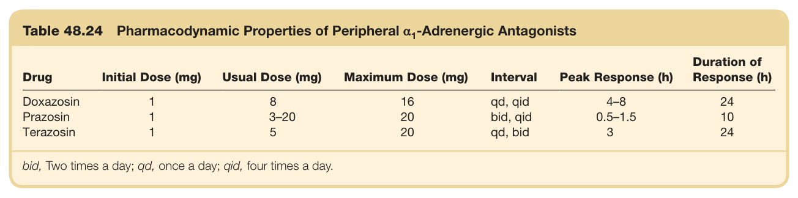

#### Table Data (CSV: [Table_48_24.csv](Table_48_24.csv))

```markdown
| Table Text (OCR) |
| :--- |
| Table 48.24  Pharmacodynamic Properties of Peripheral α -Adrenergic Antagonists Drug  Initial Dose (mg)  Usual Dose (mg)  Maximum Dose (mg)  Interval  Peak Response (h)  Duration of Response (h)    Doxazosin  1  8  16  qd, qid  4–8  24    Prazosin  1  3–20  20  bid, qid  0.5–1.5  10    Terazosin  1  5  20  qd, bid  3  24 bid, Two times a day; qd, once a day; qid, four times a day. |
```

Table 48.24 Pharmacodynamic Properties of Peripheral α -Adrenergic Antagonists

---

### Table_48_25

#### Table Image

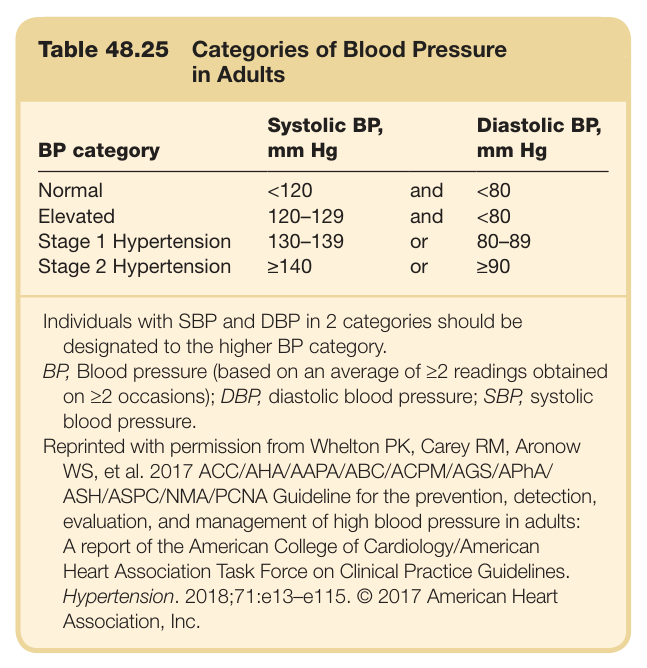

#### Table Data (CSV: [Table_48_25.csv](Table_48_25.csv))

```markdown
| Table Text (OCR) |
| :--- |
| Table 48.25  Categories of Blood Pressure in Adults BP category  Systolic BP, mm Hg  Diastolic BP, mm Hg    Normal  <120  and  <80    Elevated  120–129  and  <80    Stage 1 Hypertension  130–139  or  80–89    Stage 2 Hypertension  ≥140  or  ≥90 |
```

Table 48.25 Categories of Blood Pressure in Adults

---

### Table_48_26

#### Table Image

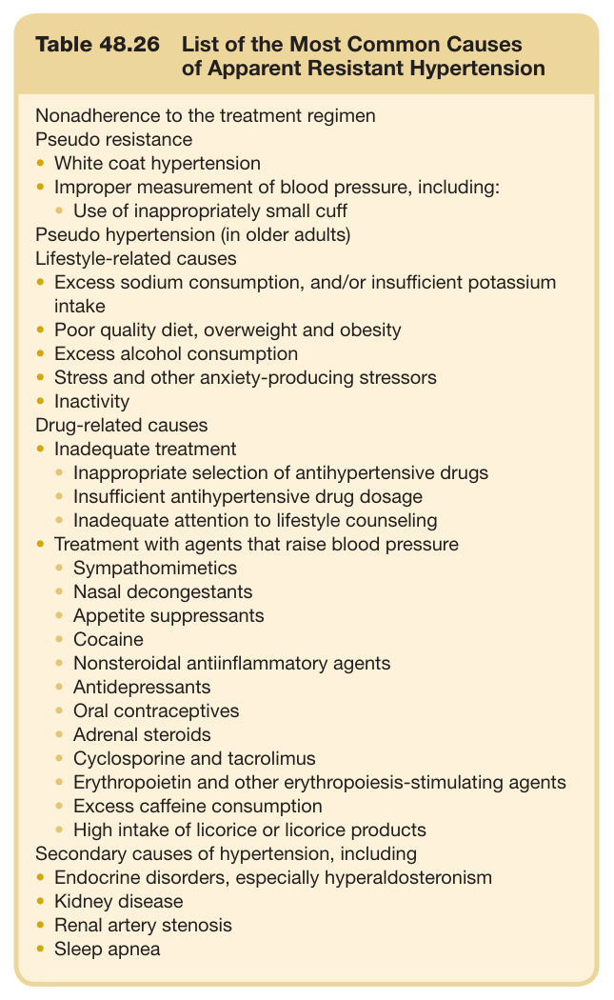

#### Table Data (CSV: [Table_48_26.csv](Table_48_26.csv))

```markdown
| Table Text (OCR) |
| :--- |
| Table 48.26 List of the Most Common Causes of Apparent Resistant Hypertension Nonadherence to the treatment regimen    Pseudo resistance    White coat hypertensionImproper measurement of blood pressure, including:Use of inappropriately small cuff    Pseudo hypertension (in older adults)    Lifestyle-related causesExcess sodium consumption, and/or insufficient potassium intakePoor quality diet, overweight and obesityExcess alcohol consumptionStress and other anxiety-producing stressorsInactivity    Drug-related causesInadequate treatmentInappropriate selection of antihypertensive drugsInsufficient antihypertensive drug dosageInadequate attention to lifestyle counselingTreatment with agents that raise blood pressureSympathomimeticsNasal decongestantsAppetite suppressantsCocaineNonsteroidal antiinflammatory agentsAntidepressantsOral contraceptivesAdrenal steroidsCyclosporine and tacrolimusErythropoietin and other erythropoiesis-stimulating agentsExcess caffeine consumptionHigh intake of licorice or licorice products    Secondary causes of hypertension, includingEndocrine disorders, especially hyperaldosteronismKidney diseaseRenal artery stenosisSleep apnea |
```

Table 48.26 List of the Most Common Causes of Apparent Resistant Hypertension

---

### Table_48_27

#### Table Image

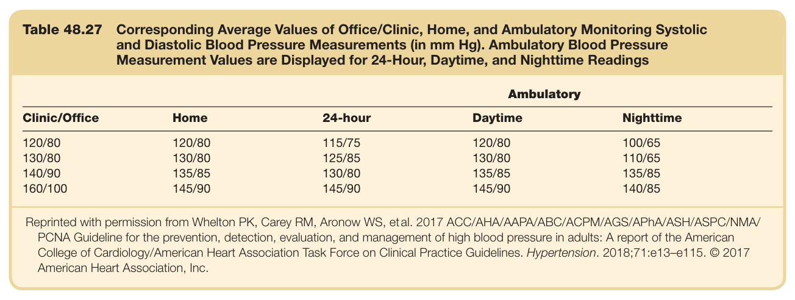

#### Table Data (CSV: [Table_48_27.csv](Table_48_27.csv))

```markdown
| Table Text (OCR) |
| :--- |
| Table 48.27 Corresponding Average Values of Office/Clinic, Home, and Ambulatory Monitoring Systolic and Diastolic Blood Pressure Measurements (in mm Hg). Ambulatory Blood Pressure Measurement Values are Displayed for 24-Hour, Daytime, and Nighttime Readings Ambulatory    Clinic/Office  Home  24-hour  Daytime  Nighttime    120/80  120/80  115/75  120/80  100/65    130/80  130/80  125/85  130/80  110/65    140/90  135/85  130/80  135/85  135/85    160/100  145/90  145/90  145/90  140/85 Reprinted with permission from Whelton PK, Carey RM, Aronow WS, etal. 2017 ACC/AHA/AAPA/ABC/ACPM/AGS/APhA/ASH/ASPC/NMA/ PCNA Guideline for the prevention, detection, evaluation, and management of high blood pressure in adults: A report of the American College of Cardiology/American Heart Association Task Force on Clinical Practice Guidelines. Hypertension. 2018;71:e13–e115. © 2017 American Heart Association, Inc. |
```

Table 48.27 Corresponding Average Values of Office/Clinic, Home, and Ambulatory Monitoring Systolic and Diastolic Blood Pressure Measurements (in mm Hg). Ambulatory Blood Pressure Measurement Values are Displayed for 24-Hour, Daytime, and Nighttime Readings

---

### Table_48_28

#### Table Image

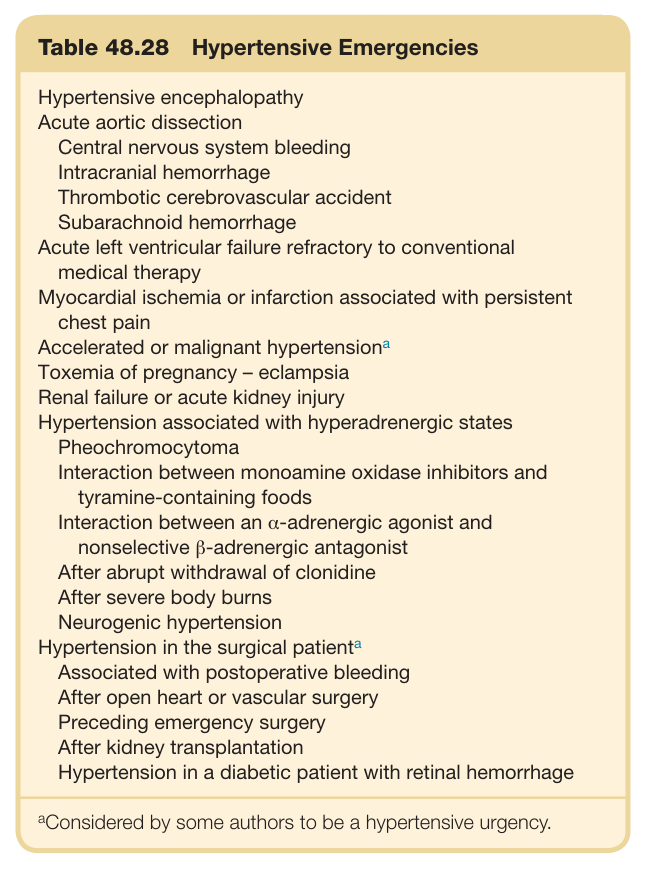

#### Table Data (CSV: [Table_48_28.csv](Table_48_28.csv))

```markdown
| Table Text (OCR) |
| :--- |
| Table 48.28  Hypertensive Emergencies Hypertensive encephalopathy    Acute aortic dissection    Central nervous system bleeding    Intracranial hemorrhage    Thrombotic cerebrovascular accident    Subarachnoid hemorrhage    Acute left ventricular failure refractory to conventional medical therapy    Myocardial ischemia or infarction associated with persistent chest pain    Accelerated or malignant  hypertension^a     Toxemia of pregnancy – eclampsia    Renal failure or acute kidney injury    Hypertension associated with hyperadrenergic states    Pheochromocytoma    Interaction between monoamine oxidase inhibitors and tyramine-containing foods    Interaction between an α-adrenergic agonist and nonselective β-adrenergic antagonist    After abrupt withdrawal of clonidine    After severe body burns    Neurogenic hypertension    Hypertension in the surgical  patient^a     Associated with postoperative bleeding    After open heart or vascular surgery    Preceding emergency surgery    After kidney transplantation    Hypertension in a diabetic patient with retinal hemorrhage <sup>a</sup>Considered by some authors to be a hypertensive urgency. |
```

Table 48.28 Hypertensive Emergencies

---

### Table_48_29

#### Table Image

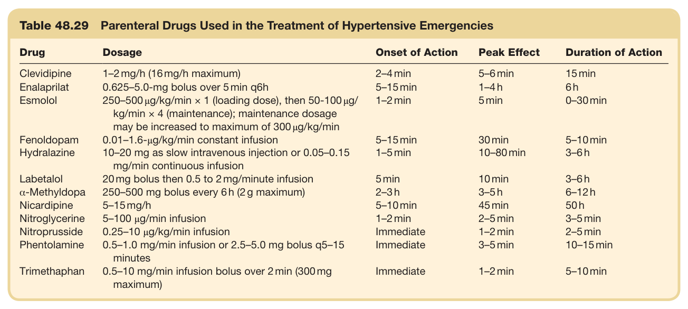

#### Table Data (CSV: [Table_48_29.csv](Table_48_29.csv))

```markdown
| Table Text (OCR) |
| :--- |
| Table 48.29  Parenteral Drugs Used in the Treatment of Hypertensive Emergencies Drug  Dosage  Onset of Action  Peak Effect  Duration of Action    Clevidipine  1-2 mg/h (16 mg/h maximum)  2-4 min  5-6 min  15 min    Enalaprilat  0.625-5.0-mg bolus over 5 min q6h  5-15 min  1-4 h  6 h    Esmolol  250-500 μg/kg/min × 1 (loading dose), then 50-100 μg/kg/min × 4 (maintenance); maintenance dosage may be increased to maximum of 300 μg/kg/min  1-2 min  5 min  0-30 min    Fenoldopam  0.01-1.6-μg/kg/min constant infusion  5-15 min  30 min  5-10 min    Hydralazine  10-20 mg as slow intravenous injection or 0.05-0.15 mg/min continuous infusion  1-5 min  10-80 min  3-6 h    Labetalol  20 mg bolus then 0.5 to 2 mg/minute infusion  5 min  10 min  3-6 h    α-Methyldopa  250-500 mg bolus every 6 h (2 g maximum)  2-3 h  3-5 h  6-12 h    Nicardipine  5-15 mg/h  5-10 min  45 min  50 h    Nitroglycerine  5-100 μg/min infusion  1-2 min  2-5 min  3-5 min    Nitroprusside  0.25-10 μg/kg/min infusion  Immediate  1-2 min  2-5 min    Phentolamine  0.5-1.0 mg/min infusion or 2.5-5.0 mg bolus q5-15 minutes  Immediate  3-5 min  10-15 min    Trimethaphan  0.5-10 mg/min infusion bolus over 2 min (300 mg maximum)  Immediate  1-2 min  5-10 min |
```

Table 48.29 Parenteral Drugs Used in the Treatment of Hypertensive Emergencies

---
