# 49. Diuretics - Figures and Tables Index

This document lists all figures, tables and boxes extracted from `49. Diuretics.pdf`.

## Table of Contents
- [Figures](#figures)
- [Tables](#tables)
- [Boxes](#boxes)

---

## Figures

### Fig_49_1

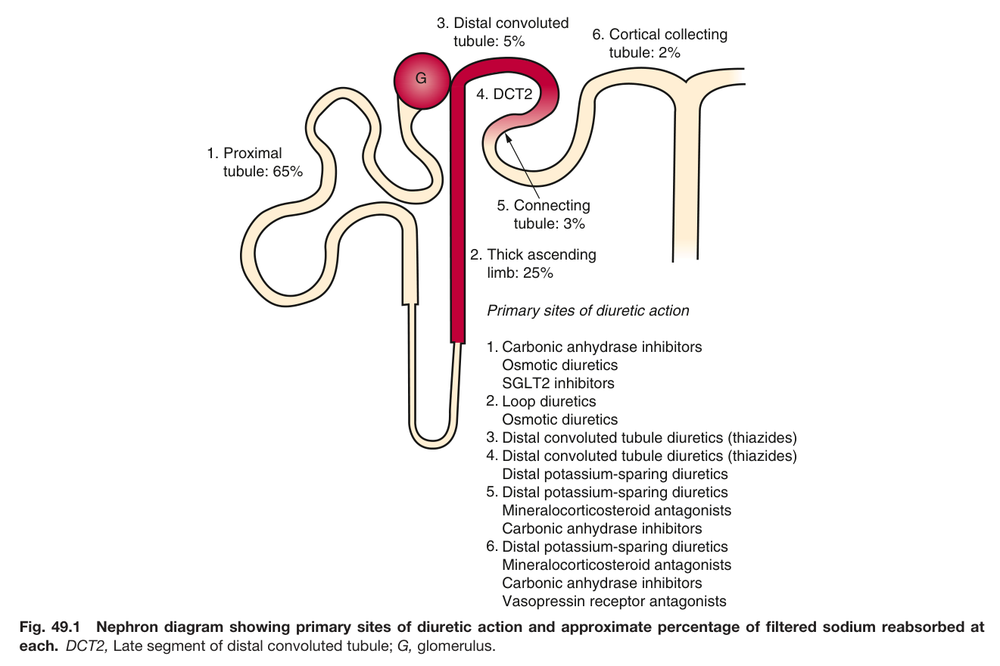

Fig. 49.1 Nephron diagram showing primary sites of diuretic action and approximate percentage of filtered sodium reabsorbed at each. DCT2, Late segment of distal convoluted tubule; G, glomerulus.

---

### Fig_49_2

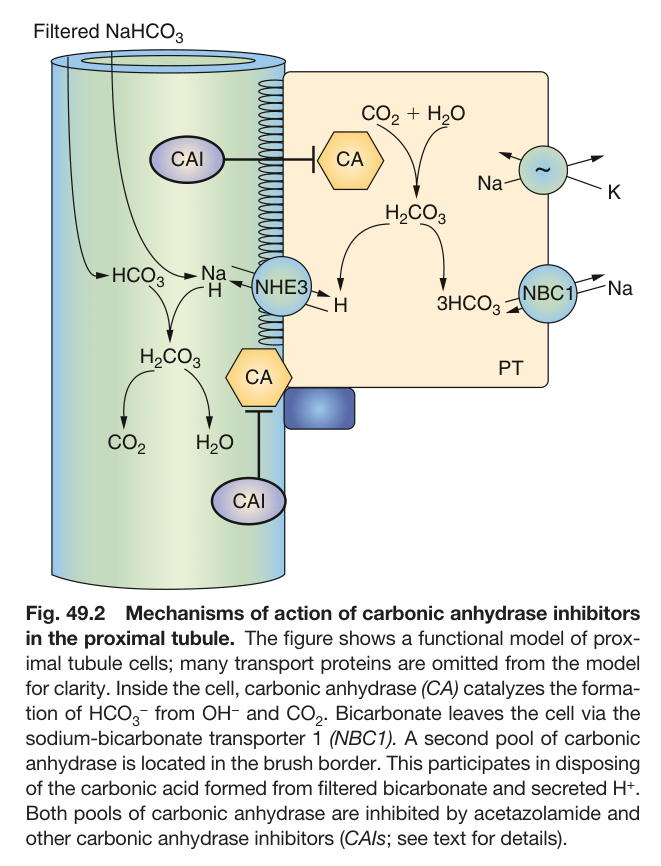

Fig. 49.2 Mechanisms of action of carbonic anhydrase inhibitors in the proximal tubule. The figure shows a functional model of prox- imal tubule cells; many transport proteins are omitted from the model for clarity. Inside the cell, carbonic anhydrase (CA) catalyzes the forma- tion of HCO <sup>−</sup> from OH<sup>−</sup> and CO . Bicarbonate leaves the cell via the sodium-bicarbonate transporter 1 (NBC1). A second pool of carbonic anhydrase is located in the brush border. This participates in disposing of the carbonic acid formed from filtered bicarbonate and secreted H<sup>+</sup>. Both pools of carbonic anhydrase are inhibited by acetazolamide and other carbonic anhydrase inhibitors (CAIs; see text for details).

---

### Fig_49_3

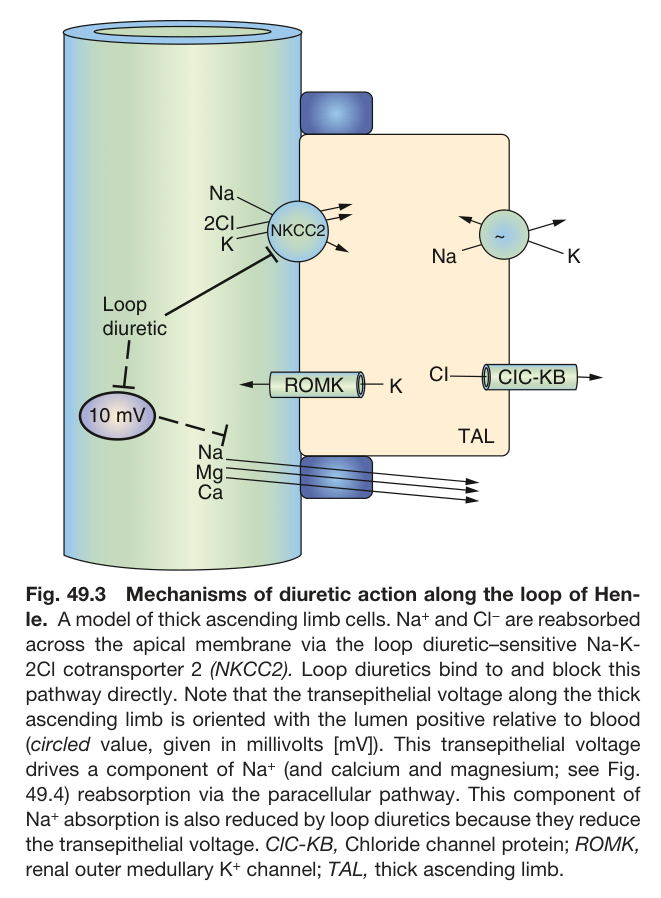

Fig. 49.3 Mechanisms of diuretic action along the loop of Hen- le. A model of thick ascending limb cells. Na<sup>+</sup> and Cl<sup>−</sup> are reabsorbed across the apical membrane via the loop diuretic–sensitive Na-K- 2Cl cotransporter 2 (NKCC2). Loop diuretics bind to and block this pathway directly. Note that the transepithelial voltage along the thick ascending limb is oriented with the lumen positive relative to blood (circled value, given in millivolts [mV]). This transepithelial voltage drives a component of Na<sup>+</sup> (and calcium and magnesium; see Fig. 49.4) reabsorption via the paracellular pathway. This component of Na<sup>+</sup> absorption is also reduced by loop diuretics because they reduce the transepithelial voltage. ClC-KB, Chloride channel protein; ROMK, renal outer medullary K<sup>+</sup> channel; TAL, thick ascending limb.

---

### Fig_49_4

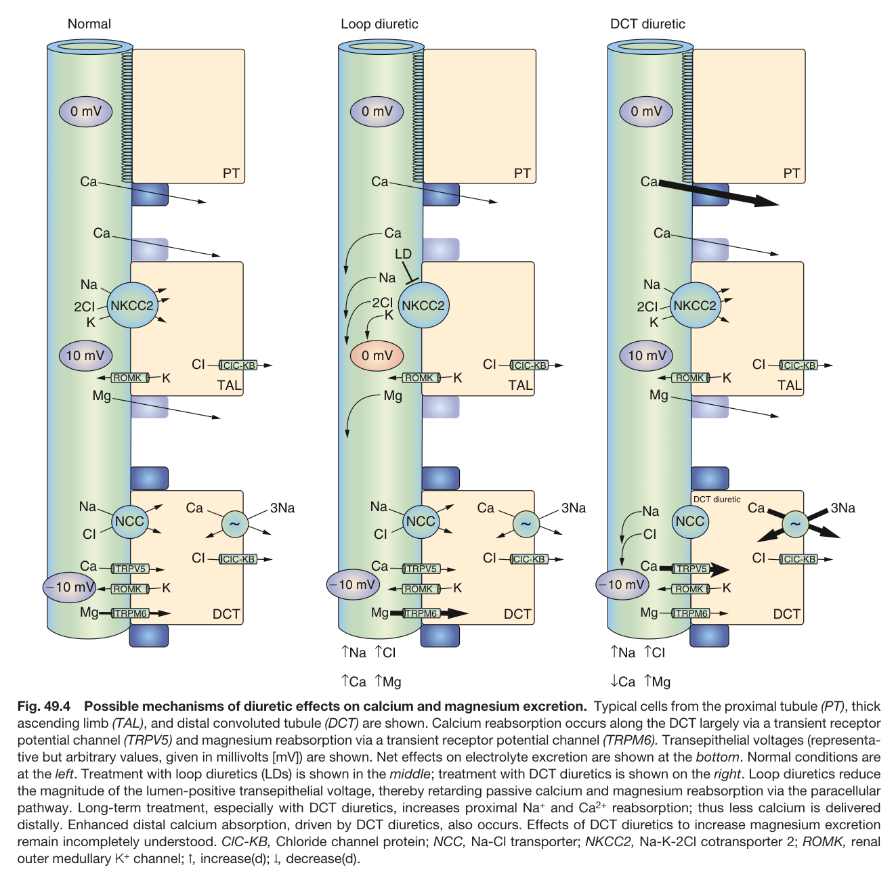

Fig. 49.4 Possible mechanisms of diuretic effects on calcium and magnesium excretion. Typical cells from the proximal tubule (PT), thick ascending limb (TAL), and distal convoluted tubule (DCT) are shown. Calcium reabsorption occurs along the DCT largely via a transient receptor potential channel (TRPV5) and magnesium reabsorption via a transient receptor potential channel (TRPM6). Transepithelial voltages (representa- tive but arbitrary values, given in millivolts [mV]) are shown. Net effects on electrolyte excretion are shown at the bottom. Normal conditions are at the left. Treatment with loop diuretics (LDs) is shown in the middle; treatment with DCT diuretics is shown on the right. Loop diuretics reduce the magnitude of the lumen-positive transepithelial voltage, thereby retarding passive calcium and magnesium reabsorption via the paracellular pathway. Long-term treatment, especially with DCT diuretics, increases proximal Na<sup>+</sup> and Ca<sup>2+</sup> reabsorption; thus less calcium is delivered distally. Enhanced distal calcium absorption, driven by DCT diuretics, also occurs. Effects of DCT diuretics to increase magnesium excretion remain incompletely understood. ClC-KB, Chloride channel protein; NCC, Na-Cl transporter; NKCC2, Na-K-2Cl cotransporter 2; ROMK, rena outer medullary K<sup>+</sup> channel; ↑, increase(d); ↓, decrease(d).

---

### Fig_49_5

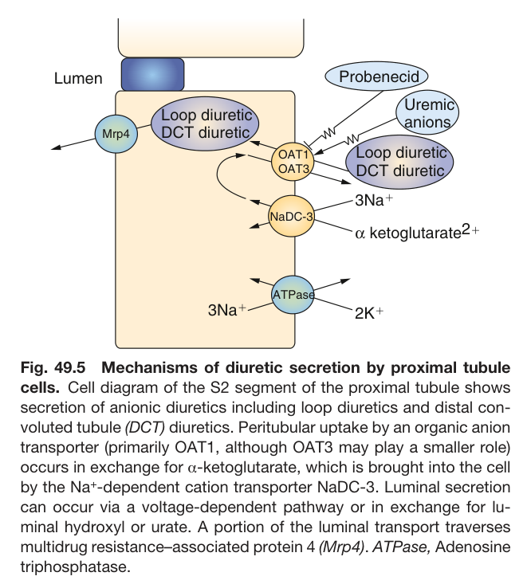

Fig. 49.5 Mechanisms of diuretic secretion by proximal tubule cells. Cell diagram of the S2 segment of the proximal tubule shows secretion of anionic diuretics including loop diuretics and distal con- voluted tubule (DCT) diuretics. Peritubular uptake by an organic anion transporter (primarily OAT1, although OAT3 may play a smaller role) occurs in exchange for α-ketoglutarate, which is brought into the cell by the Na<sup>+</sup>-dependent cation transporter NaDC-3. Luminal secretion can occur via a voltage-dependent pathway or in exchange for lu- minal hydroxyl or urate. A portion of the luminal transport traverses multidrug resistance–associated protein 4 (Mrp4). ATPase, Adenosine triphosphatase.

---

### Fig_49_6

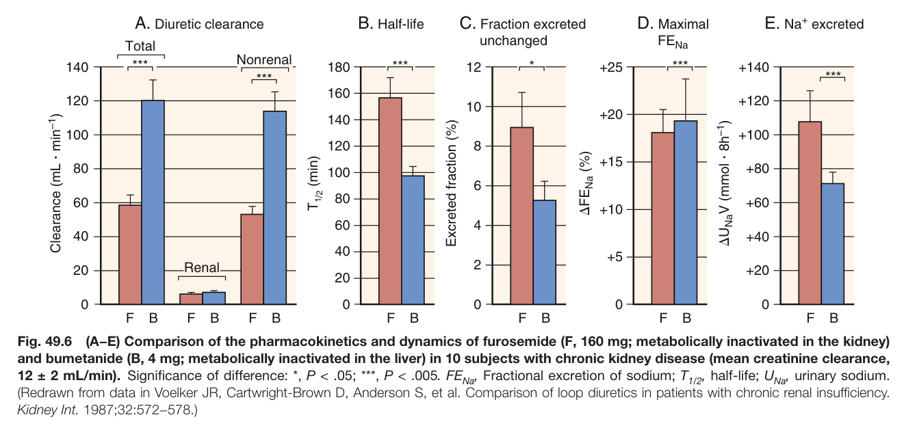

Fig. 49.6 (A−E) Comparison of the pharmacokinetics and dynamics of furosemide (F, 160 mg; metabolically inactivated in the kidney) and bumetanide (B, 4 mg; metabolically inactivated in the liver) in 10 subjects with chronic kidney disease (mean creatinine clearance, 12 ± 2 mL/min). Significance of difference: \*, P < .05; \*\*\*, P < .005. FE , Fractional excretion of sodium; T , half-life; U , urinary sodium. (Redrawn from data in Voelker JR, Cartwright-Brown D, Anderson S, et al. Comparison of loop diuretics in patients with chronic renal insufficiency. Kidney Int. 1987;32:572−578.)

---

### Fig_49_7

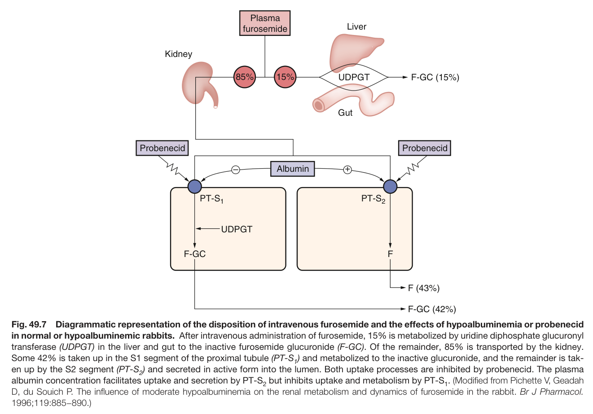

Fig. 49.7 Diagrammatic representation of the disposition of intravenous furosemide and the effects of hypoalbuminemia or probenecid in normal or hypoalbuminemic rabbits. After intravenous administration of furosemide, 15% is metabolized by uridine diphosphate glucurony transferase (UDPGT) in the liver and gut to the inactive furosemide glucuronide (F-GC). Of the remainder, 85% is transported by the kidney. Some 42% is taken up in the S1 segment of the proximal tubule (PT-S ) and metabolized to the inactive glucuronide, and the remainder is tak- en up by the S2 segment (PT-S ) and secreted in active form into the lumen. Both uptake processes are inhibited by probenecid. The plasma albumin concentration facilitates uptake and secretion by PT-S but inhibits uptake and metabolism by PT-S . (Modified from Pichette V, Geadah D, du Souich P. The influence of moderate hypoalbuminemia on the renal metabolism and dynamics of furosemide in the rabbit. Br J Pharmacol. 1996;119:885−890.)

---

### Fig_49_8

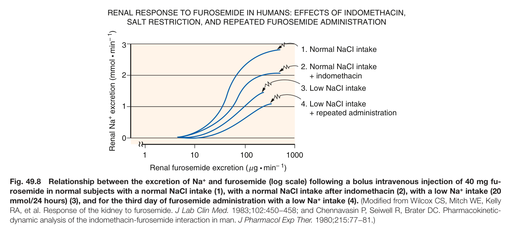

Fig. 49.8 Relationship between the excretion of Na<sup>+</sup> and furosemide (log scale) following a bolus intravenous injection of 40 mg fu- rosemide in normal subjects with a normal NaCl intake (1), with a normal NaCl intake after indomethacin (2), with a low Na<sup>+</sup> intake (20 mmol/24 hours) (3), and for the third day of furosemide administration with a low Na<sup>+</sup> intake (4). (Modified from Wilcox CS, Mitch WE, Kell RA, et al. Response of the kidney to furosemide. J Lab Clin Med. 1983;102:450−458; and Chennavasin P, Seiwell R, Brater DC. Pharmacokinetic dynamic analysis of the indomethacin-furosemide interaction in man. J Pharmacol Exp Ther. 1980;215:77−81.)

---

### Fig_49_9

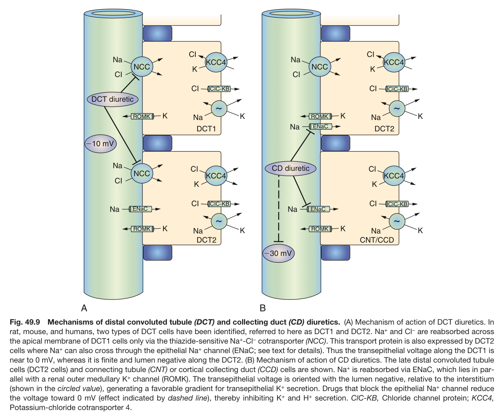

Fig. 49.9 Mechanisms of distal convoluted tubule (DCT) and collecting duct (CD) diuretics. (A) Mechanism of action of DCT diuretics. In rat, mouse, and humans, two types of DCT cells have been identified, referred to here as DCT1 and DCT2. Na<sup>+</sup> and Cl<sup>−</sup> are reabsorbed across the apical membrane of DCT1 cells only via the thiazide-sensitive Na<sup>+</sup>-Cl<sup>−</sup> cotransporter (NCC). This transport protein is also expressed by DCT2 cells where Na<sup>+</sup> can also cross through the epithelial Na<sup>+</sup> channel (ENaC; see text for details). Thus the transepithelial voltage along the DCT1 is near to 0 mV, whereas it is finite and lumen negative along the DCT2. (B) Mechanism of action of CD diuretics. The late distal convoluted tubule cells (DCT2 cells) and connecting tubule (CNT) or cortical collecting duct (CCD) cells are shown. Na<sup>+</sup> is reabsorbed via ENaC, which lies in par- allel with a renal outer medullary K<sup>+</sup> channel (ROMK). The transepithelial voltage is oriented with the lumen negative, relative to the interstitium (shown in the circled value), generating a favorable gradient for transepithelial K<sup>+</sup> secretion. Drugs that block the epithelial Na<sup>+</sup> channel reduce the voltage toward 0 mV (effect indicated by dashed line), thereby inhibiting K<sup>+</sup> and H<sup>+</sup> secretion. ClC-KB, Chloride channel protein; KCC4, Potassium-chloride cotransporter 4.

---

### Fig_49_10

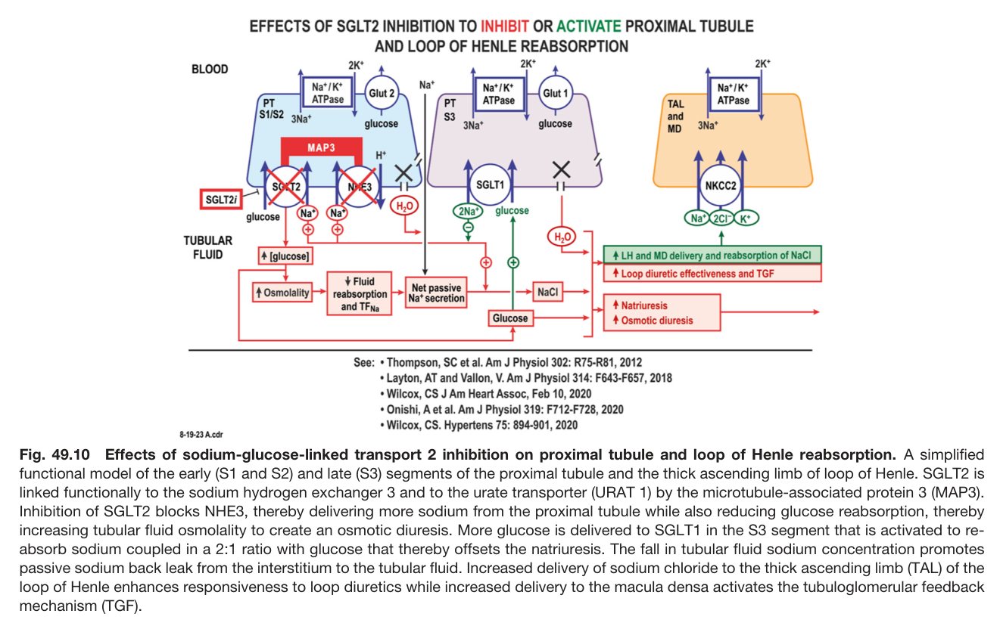

Fig. 49.10 Effects of sodium-glucose-linked transport 2 inhibition on proximal tubule and loop of Henle reabsorption. A simplified functional model of the early (S1 and S2) and late (S3) segments of the proximal tubule and the thick ascending limb of loop of Henle. SGLT2 is linked functionally to the sodium hydrogen exchanger 3 and to the urate transporter (URAT 1) by the microtubule-associated protein 3 (MAP3). Inhibition of SGLT2 blocks NHE3, thereby delivering more sodium from the proximal tubule while also reducing glucose reabsorption, thereby increasing tubular fluid osmolality to create an osmotic diuresis. More glucose is delivered to SGLT1 in the S3 segment that is activated to re- absorb sodium coupled in a 2:1 ratio with glucose that thereby offsets the natriuresis. The fall in tubular fluid sodium concentration promote passive sodium back leak from the interstitium to the tubular fluid. Increased delivery of sodium chloride to the thick ascending limb (TAL) of the loop of Henle enhances responsiveness to loop diuretics while increased delivery to the macula densa activates the tubuloglomerular feedback mechanism (TGF).

---

### Fig_49_11

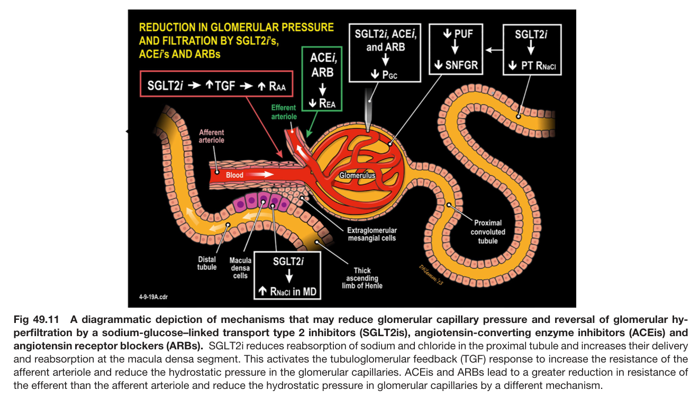

Fig. 49.11 A diagrammatic depiction of mechanisms that may reduce glomerular capillary pressure and reversal of glomerular hy- perfiltration by a sodium-glucose–linked transport type 2 inhibitors (SGLT2is), angiotensin-converting enzyme inhibitors (ACEis) and angiotensin receptor blockers (ARBs). SGLT2i reduces reabsorption of sodium and chloride in the proximal tubule and increases their delivery and reabsorption at the macula densa segment. This activates the tubuloglomerular feedback (TGF) response to increase the resistance of the afferent arteriole and reduce the hydrostatic pressure in the glomerular capillaries. ACEis and ARBs lead to a greater reduction in resistance of the efferent than the afferent arteriole and reduce the hydrostatic pressure in glomerular capillaries by a different mechanism.

---

### Fig_49_12

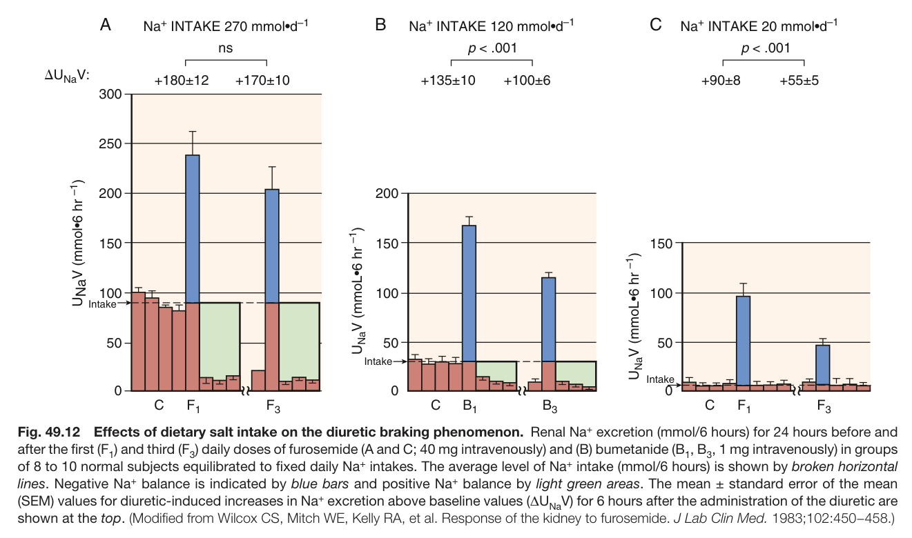

Fig. 49.12 Effects of dietary salt intake on the diuretic braking phenomenon. Renal Na<sup>+</sup> excretion (mmol/6 hours) for 24 hours before and after the first (F ) and third (F ) daily doses of furosemide (A and C; 40 mg intravenously) and (B) bumetanide (B , B , 1 mg intravenously) in groups of 8 to 10 normal subjects equilibrated to fixed daily Na<sup>+</sup> intakes. The average level of Na<sup>+</sup> intake (mmol/6 hours) is shown by broken horizontal lines. Negative Na<sup>+</sup> balance is indicated by blue bars and positive Na<sup>+</sup> balance by light green areas. The mean ± standard error of the mean (SEM) values for diuretic-induced increases in Na<sup>+</sup> excretion above baseline values (ΔU V) for 6 hours after the administration of the diuretic are shown at the top. (Modified from Wilcox CS, Mitch WE, Kelly RA, et al. Response of the kidney to furosemide. J Lab Clin Med. 1983;102:450−458.)

---

### Fig_49_13

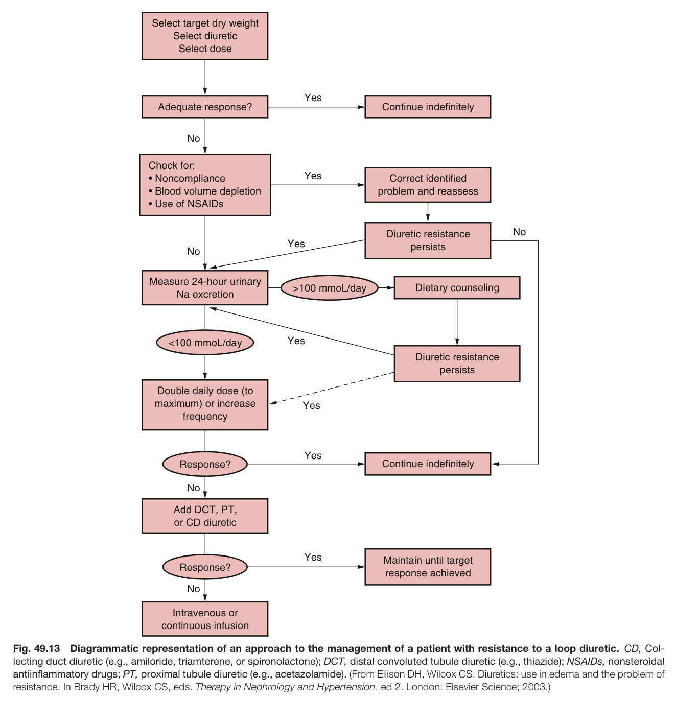

Fig. 49.13 Diagrammatic representation of an approach to the management of a patient with resistance to a loop diuretic. CD, Col- lecting duct diuretic (e.g., amiloride, triamterene, or spironolactone); DCT, distal convoluted tubule diuretic (e.g., thiazide); NSAIDs, nonsteroida antiinflammatory drugs; PT, proximal tubule diuretic (e.g., acetazolamide). (From Ellison DH, Wilcox CS. Diuretics: use in edema and the problem of resistance. In Brady HR, Wilcox CS, eds. Therapy in Nephrology and Hypertension. ed 2. London: Elsevier Science; 2003.)

---

### Fig_49_14

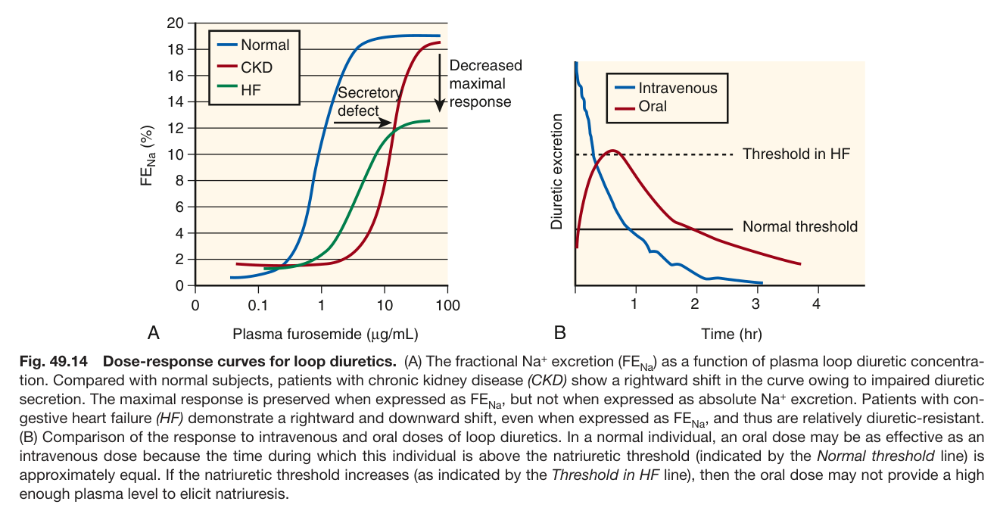

Fig. 49.14 Dose-response curves for loop diuretics. (A) The fractional Na<sup>+</sup> excretion (FE ) as a function of plasma loop diuretic concentra- tion. Compared with normal subjects, patients with chronic kidney disease (CKD) show a rightward shift in the curve owing to impaired diuretic secretion. The maximal response is preserved when expressed as FE , but not when expressed as absolute Na<sup>+</sup> excretion. Patients with con- gestive heart failure (HF) demonstrate a rightward and downward shift, even when expressed as FE , and thus are relatively diuretic-resistant. (B) Comparison of the response to intravenous and oral doses of loop diuretics. In a normal individual, an oral dose may be as effective as an intravenous dose because the time during which this individual is above the natriuretic threshold (indicated by the Normal threshold line) is approximately equal. If the natriuretic threshold increases (as indicated by the Threshold in HF line), then the oral dose may not provide a high enough plasma level to elicit natriuresis.

---

### Fig_49_15

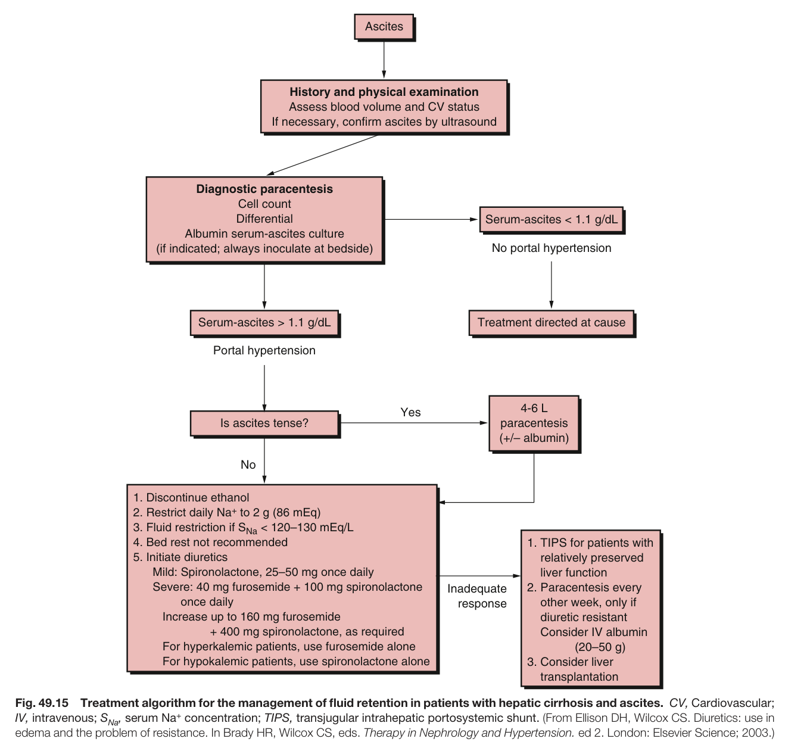

Fig. 49.15 Treatment algorithm for the management of fluid retention in patients with hepatic cirrhosis and ascites. CV, Cardiovascular; IV, intravenous; S , serum Na<sup>+</sup> concentration; TIPS, transjugular intrahepatic portosystemic shunt. (From Ellison DH, Wilcox CS. Diuretics: use in edema and the problem of resistance. In Brady HR, Wilcox CS, eds. Therapy in Nephrology and Hypertension. ed 2. London: Elsevier Science; 2003.)

---

### Fig_49_16

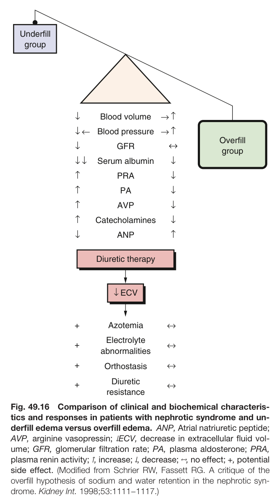

Fig. 49.16 Comparison of clinical and biochemical characteris- tics and responses in patients with nephrotic syndrome and un- derfill edema versus overfill edema. ANP, Atrial natriuretic peptide; AVP, arginine vasopressin; ↓ECV, decrease in extracellular fluid vol- ume; GFR, glomerular filtration rate; PA, plasma aldosterone; PRA, plasma renin activity; ↑, increase; ↓, decrease; ↔, no effect; +, potential side effect. (Modified from Schrier RW, Fassett RG. A critique of the overfill hypothesis of sodium and water retention in the nephrotic syn- drome. Kidney Int. 1998;53:1111−1117.)

---

### Fig_49_17

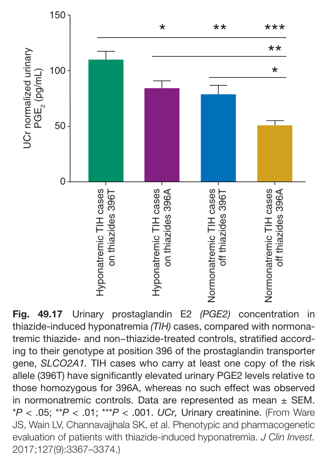

Fig. 49.17 Urinary prostaglandin E2 (PGE2) concentration in thiazide-induced hyponatremia (TIH) cases, compared with normonatremic thiazide- and non−thiazide-treated controls, stratified according to their genotype at position 396 of the prostaglandin transporter gene, SLCO2A1. TIH cases who carry at least one copy of the risk allele (396T) have significantly elevated urinary PGE2 levels relative to those homozygous for 396A, whereas no such effect was observed in normonatremic controls. Data are represented as mean ± SEM. \*P < .05; \*\*P < .01; \*\*\*P < .001. UCr, Urinary creatinine. (From Ware JS, Wain LV, Channavajjhala SK, et al. Phenotypic and pharmacogenetic evaluation of patients with thiazide-induced hyponatremia. J Clin Invest. 2017;127(9):3367–3374.)

---

### Fig_49_18

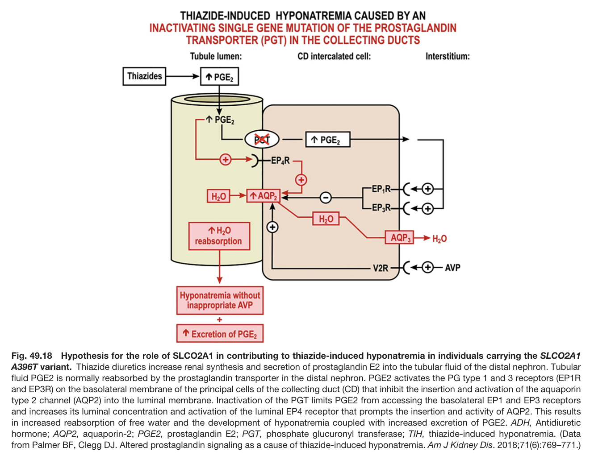

Fig. 49.18 Hypothesis for the role of SLCO2A1 in contributing to thiazide-induced hyponatremia in individuals carrying the SLCO2A1 A396T variant. Thiazide diuretics increase renal synthesis and secretion of prostaglandin E2 into the tubular fluid of the distal nephron. Tubular fluid PGE2 is normally reabsorbed by the prostaglandin transporter in the distal nephron. PGE2 activates the PG type 1 and 3 receptors (EP1R and EP3R) on the basolateral membrane of the principal cells of the collecting duct (CD) that inhibit the insertion and activation of the aquaporin type 2 channel (AQP2) into the luminal membrane. Inactivation of the PGT limits PGE2 from accessing the basolateral EP1 and EP3 receptors and increases its luminal concentration and activation of the luminal EP4 receptor that prompts the insertion and activity of AQP2. This results in increased reabsorption of free water and the development of hyponatremia coupled with increased excretion of PGE2. ADH, Antidiuretic hormone; AQP2, aquaporin-2; PGE2, prostaglandin E2; PGT, phosphate glucuronyl transferase; TIH, thiazide-induced hyponatremia. (Data from Palmer BF, Clegg DJ. Altered prostaglandin signaling as a cause of thiazide-induced hyponatremia. Am J Kidney Dis. 2018;71(6):769–771.)

---

### Fig_49_19

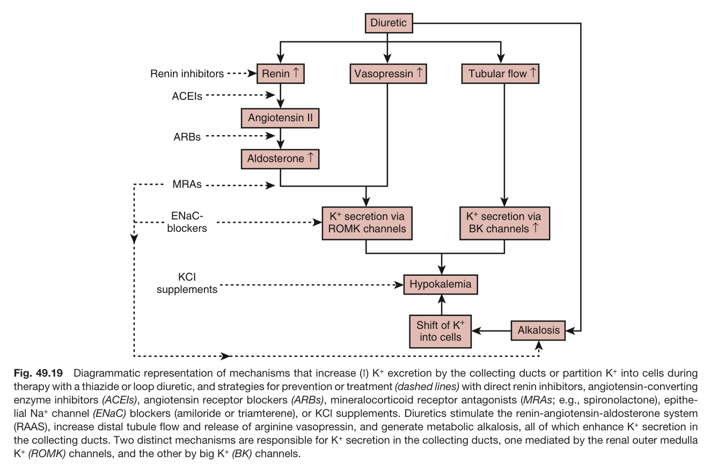

Fig. 49.19 Diagrammatic representation of mechanisms that increase (↑) K<sup>+</sup> excretion by the collecting ducts or partition K<sup>+</sup> into cells during therapy with a thiazide or loop diuretic, and strategies for prevention or treatment (dashed lines) with direct renin inhibitors, angiotensin-converting enzyme inhibitors (ACEIs), angiotensin receptor blockers (ARBs), mineralocorticoid receptor antagonists (MRAs; e.g., spironolactone), epithe- lial Na<sup>+</sup> channel (ENaC) blockers (amiloride or triamterene), or KCl supplements. Diuretics stimulate the renin-angiotensin-aldosterone system (RAAS), increase distal tubule flow and release of arginine vasopressin, and generate metabolic alkalosis, all of which enhance K<sup>+</sup> secretion in the collecting ducts. Two distinct mechanisms are responsible for K<sup>+</sup> secretion in the collecting ducts, one mediated by the renal outer medulla K<sup>+</sup> (ROMK) channels, and the other by big K<sup>+</sup> (BK) channels.

---

### Fig_49_20

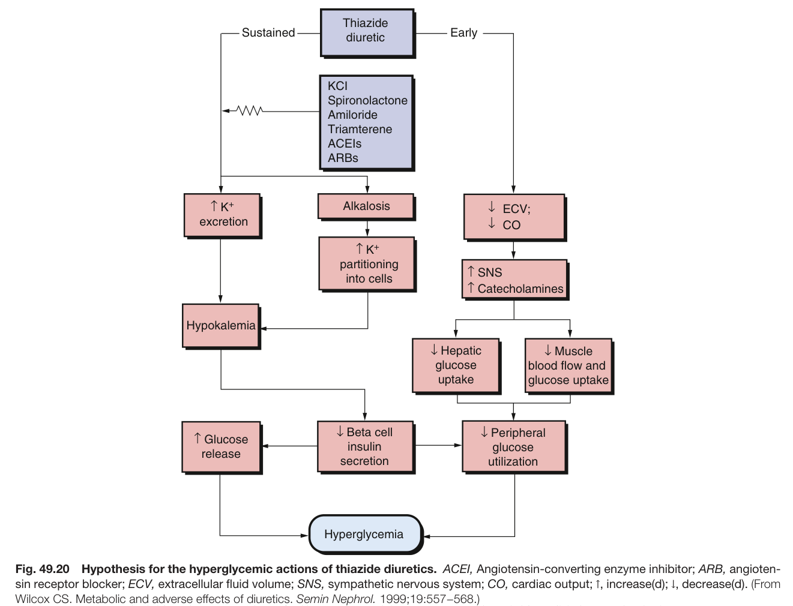

Fig. 49.20 Hypothesis for the hyperglycemic actions of thiazide diuretics. ACEI, Angiotensin-converting enzyme inhibitor; ARB, angioten- sin receptor blocker; ECV, extracellular fluid volume; SNS, sympathetic nervous system; CO, cardiac output; ↑, increase(d); ↓, decrease(d). (From Wilcox CS. Metabolic and adverse effects of diuretics. Semin Nephrol. 1999;19:557−568.)

---

## Tables

### Table_49_1

#### Table Image

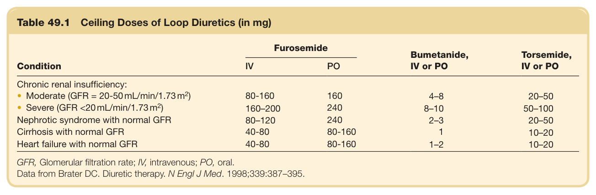

#### Table Data (CSV: [Table_49_1.csv](Table_49_1.csv))

```markdown
| Table Text (OCR) |
| :--- |
| Table 49.1  Ceiling Doses of Loop Diuretics (in mg) Condition  Furosemide  Bumetanide, IV or PO  Torsemide, IV or PO    IV  PO    Chronic renal insufficiency:    • Moderate (GFR = 20-50 mL/min/1.73  m^2 )  80-160  160  4-8  20-50    • Severe (GFR <20 mL/min/1.73  m^2 )  160-200  240  8-10  50-100    Nephrotic syndrome with normal GFR  80-120  240  2-3  20-50    Cirrhosis with normal GFR  40-80  80-160  1  10-20    Heart failure with normal GFR  40-80  80-160  1-2  10-20 GFR, Glomerular filtration rate; IV, intravenous; PO, oral. Data from Brater DC. Diuretic therapy. N Engl J Med. 1998;339:387–395. |
```

Table 49.1 Ceiling Doses of Loop Diuretics (in mg)

---

## Boxes

### Box_49_1

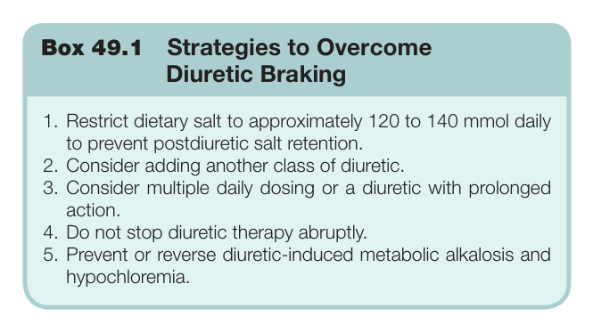

#### Box Text

```markdown
Box 49.1 Strategies to Overcome Diuretic Braking 1. Restrict dietary salt to approximately 120 to 140 mmol daily to prevent postdiuretic salt retention. 2. Consider adding another class of diuretic. 3. Consider multiple daily dosing or a diuretic with prolonged action. 4. Do not stop diuretic therapy abruptly. 5. Prevent or reverse diuretic-induced metabolic alkalosis and hypochloremia.
```

Box 49.1 Strategies to Overcome Diuretic Braking

---

### Box_49_2

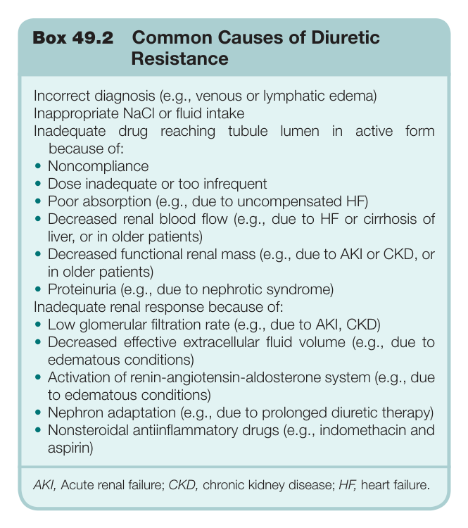

#### Box Text

```markdown
Box 49.2 Common Causes of Diuretic Resistance Incorrect diagnosis (e.g., venous or lymphatic edema) Inappropriate NaCl or fluid intake Inadequate drug reaching tubule lumen in active form because of: • Noncompliance • Dose inadequate or too infrequent • Poor absorption (e.g., due to uncompensated HF) • Decreased renal blood flow (e.g., due to HF or cirrhosis of liver, or in older patients) • Decreased functional renal mass (e.g., due to AKI or CKD, or in older patients) • Proteinuria (e.g., due to nephrotic syndrome) Inadequate renal response because of: • Low glomerular filtration rate (e.g., due to AKI, CKD) • Decreased effective extracellular fluid volume (e.g., due to edematous conditions) • Activation of renin-angiotensin-aldosterone system (e.g., due to edematous conditions) • Nephron adaptation (e.g., due to prolonged diuretic therapy) • Nonsteroidal antiinflammatory drugs (e.g., indomethacin and aspirin) AKI, Acute renal failure; CKD, chronic kidney disease; HF, heart failure.
```

Box 49.2 Common Causes of Diuretic Resistance

---
