# 50. Mechanisms of Progression in Chronic Kidney Disease - Figures and Tables Index

This document lists all figures and tables extracted from `50. Mechanisms of Progression in Chronic Kidney Disease.pdf`.

## Table of Contents
- [Figures](#figures)
- [Tables](#tables)

---

## Figures

### Fig_50_1

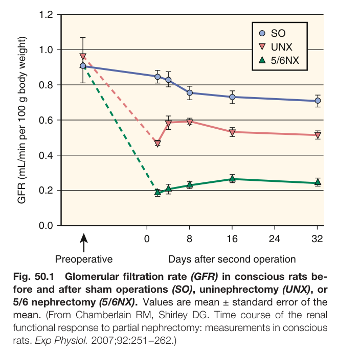

Fig. 50.1 Glomerular filtration rate (GFR) in conscious rats be- fore and after sham operations (SO), uninephrectomy (UNX), or 5/6 nephrectomy (5/6NX). Values are mean ± standard error of the mean. (From Chamberlain RM, Shirley DG. Time course of the renal functional response to partial nephrectomy: measurements in conscious rats. Exp Physiol. 2007;92:251−262.)

---

### Fig_50_2

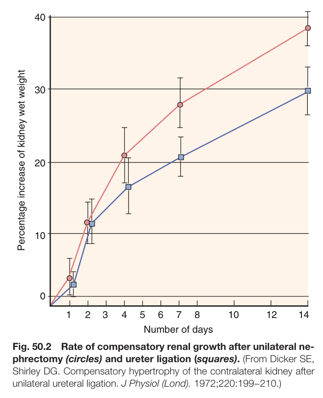

Fig. 50.2 Rate of compensatory renal growth after unilateral ne- phrectomy (circles) and ureter ligation (squares). (From Dicker SE, Shirley DG. Compensatory hypertrophy of the contralateral kidney after unilateral ureteral ligation. J Physiol (Lond). 1972;220:199−210.)

---

### Fig_50_3

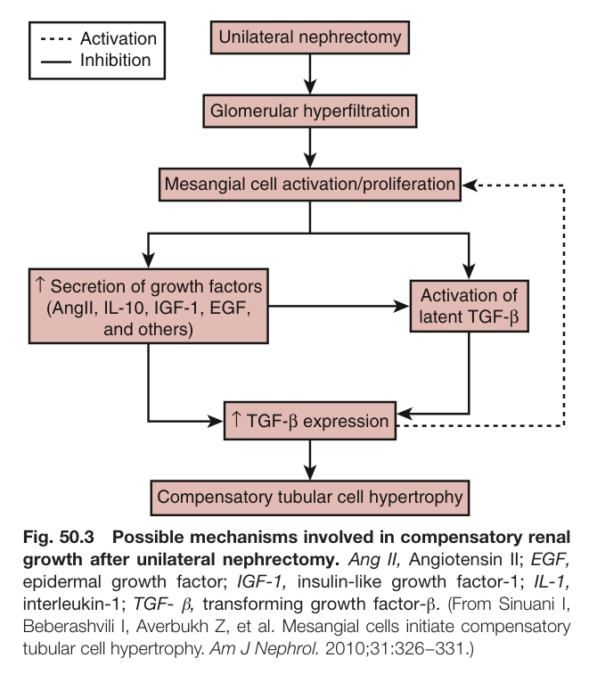

Fig. 50.3 Possible mechanisms involved in compensatory renal growth after unilateral nephrectomy. Ang II, Angiotensin II; EGF, epidermal growth factor; IGF-1, insulin-like growth factor-1; IL-1, interleukin-1; TGF- β, transforming growth factor-β. (From Sinuani I, Beberashvili I, Averbukh Z, et al. Mesangial cells initiate compensatory tubular cell hypertrophy. Am J Nephrol. 2010;31:326−331.)

---

### Fig_50_4

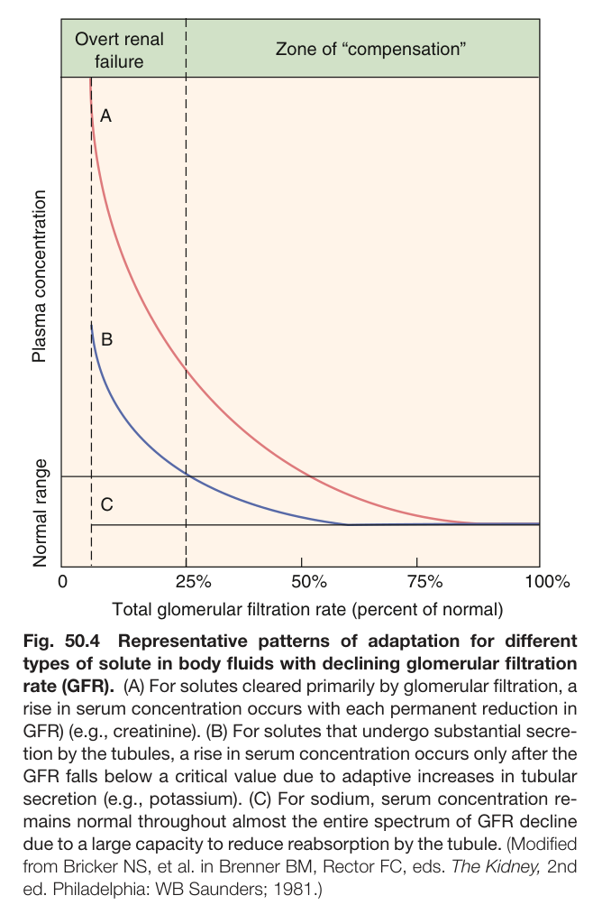

Fig. 50.4 Representative patterns of adaptation for different types of solute in body fluids with declining glomerular filtration rate (GFR). (A) For solutes cleared primarily by glomerular filtration, a rise in serum concentration occurs with each permanent reduction in GFR) (e.g., creatinine). (B) For solutes that undergo substantial secre- tion by the tubules, a rise in serum concentration occurs only after the GFR falls below a critical value due to adaptive increases in tubular secretion (e.g., potassium). (C) For sodium, serum concentration re- mains normal throughout almost the entire spectrum of GFR decline due to a large capacity to reduce reabsorption by the tubule. (Modified from Bricker NS, et al. in Brenner BM, Rector FC, eds. The Kidney, 2nd ed. Philadelphia: WB Saunders; 1981.)

---

### Fig_50_5

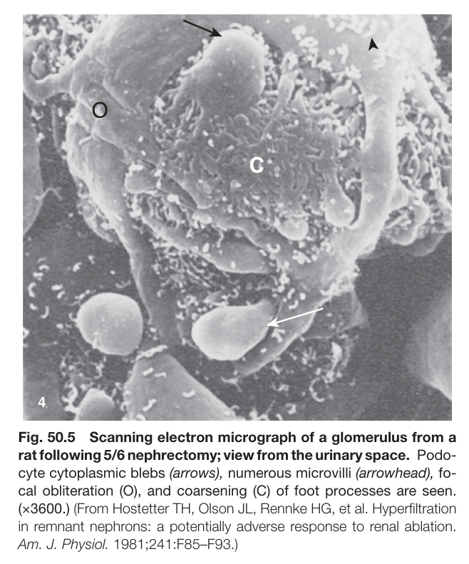

Fig. 50.5 Scanning electron micrograph of a glomerulus from a rat following 5/6 nephrectomy; view from the urinary space. Podo- cyte cytoplasmic blebs (arrows), numerous microvilli (arrowhead), fo- cal obliteration (O), and coarsening (C) of foot processes are seen. (×3600.) (From Hostetter TH, Olson JL, Rennke HG, et al. Hyperfiltration in remnant nephrons: a potentially adverse response to renal ablation. Am. J. Physiol. 1981;241:F85–F93.)

---

### Fig_50_6

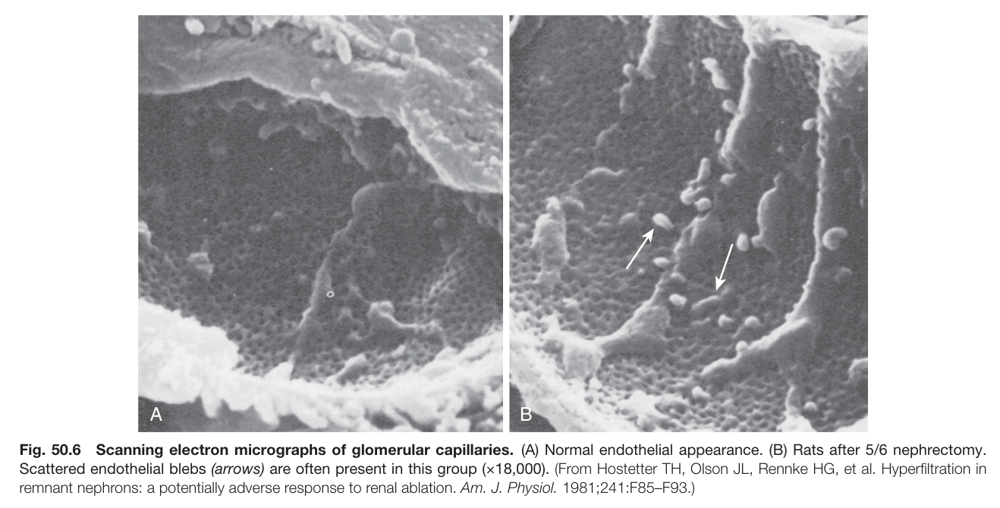

Fig. 50.6 Scanning electron micrographs of glomerular capillaries. (A) Normal endothelial appearance. (B) Rats after 5/6 nephrectomy. Scattered endothelial blebs (arrows) are often present in this group (×18,000). (From Hostetter TH, Olson JL, Rennke HG, et al. Hyperfiltration in remnant nephrons: a potentially adverse response to renal ablation. Am. J. Physiol. 1981;241:F85–F93.)

---

### Fig_50_7

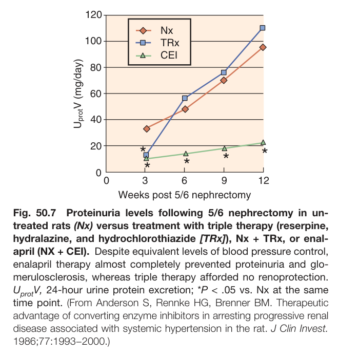

Fig. 50.7 Proteinuria levels following 5/6 nephrectomy in un- treated rats (Nx) versus treatment with triple therapy (reserpine, hydralazine, and hydrochlorothiazide [TRx]), Nx + TRx, or enal- april (NX + CEI). Despite equivalent levels of blood pressure control, enalapril therapy almost completely prevented proteinuria and glo- merulosclerosis, whereas triple therapy afforded no renoprotection. U V, 24-hour urine protein excretion; *P < .05 vs. Nx at the same time point. (From Anderson S, Rennke HG, Brenner BM. Therapeutic advantage of converting enzyme inhibitors in arresting progressive renal disease associated with systemic hypertension in the rat. J Clin Invest. 1986;77:1993−2000.)

---

### Fig_50_8

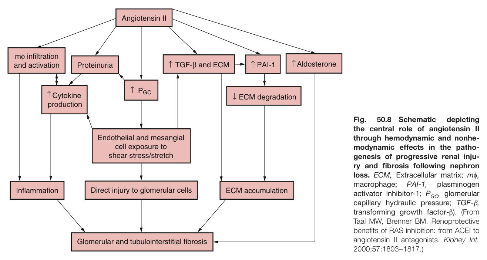

Fig. 50.8 Schematic depicting the central role of angiotensin II through hemodynamic and nonhe- modynamic effects in the patho- genesis of progressive renal inju- ry and fibrosis following nephron loss. ECM, Extracellular matrix; mϕ, macrophage; PAI-1, plasminogen activator inhibitor-1; P<sub>GC</sub>, glomerular capillary hydraulic pressure; TGF-β, transforming growth factor-β). (From Taal MW, Brenner BM. Renoprotective benefits of RAS inhibition: from ACEI to angiotensin II antagonists. Kidney Int. 2000;57:1803−1817.)

---

### Fig_50_9

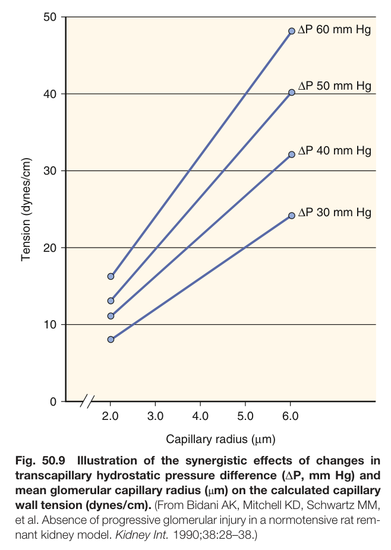

Fig. 50.9 Illustration of the synergistic effects of changes in transcapillary hydrostatic pressure difference (ΔP, mm Hg) and mean glomerular capillary radius (μm) on the calculated capillary wall tension (dynes/cm). (From Bidani AK, Mitchell KD, Schwartz MM, et al. Absence of progressive glomerular injury in a normotensive rat rem- nant kidney model. Kidney Int. 1990;38:28–38.)

---

### Fig_50_10

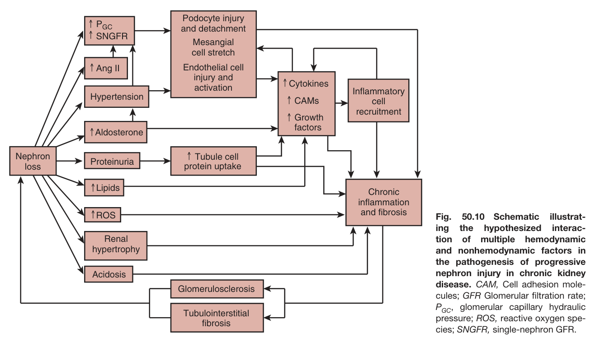

Fig. 50.10 Schematic illustrat- ing the hypothesized interac- tion of multiple hemodynamic and nonhemodynamic factors in the pathogenesis of progressive nephron injury in chronic kidney disease. CAM, Cell adhesion mole- cules; GFR Glomerular filtration rate; P , glomerular capillary hydraulic pressure; ROS, reactive oxygen spe- cies; SNGFR, single-nephron GFR.

---

### Fig_50_11

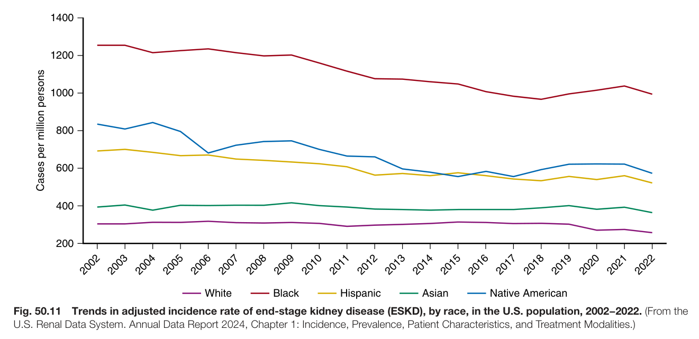

Fig. 50.11 Trends in adjusted incidence rate of end-stage kidney disease (ESKD), by race, in the U.S. population, 2002−2022. (From the U.S. Renal Data System. Annual Data Report 2024, Chapter 1: Incidence, Prevalence, Patient Characteristics, and Treatment Modalities.)

---

### Fig_50_12

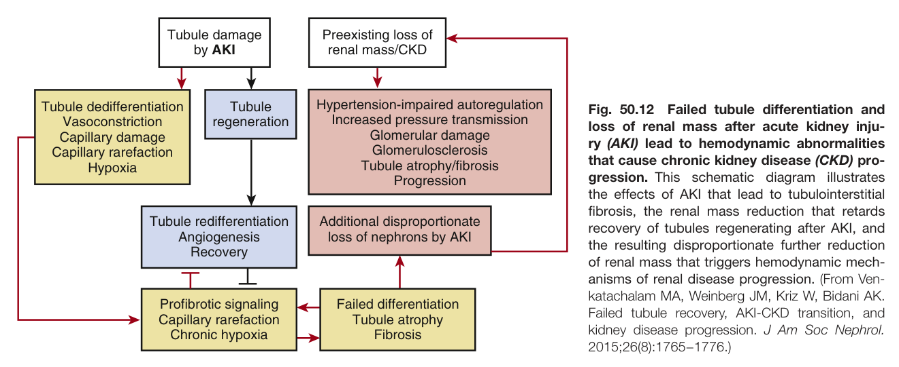

Fig. 50.12 Failed tubule differentiation and loss of renal mass after acute kidney inju- ry (AKI) lead to hemodynamic abnormalities that cause chronic kidney disease (CKD) pro- gression. This schematic diagram illustrates the effects of AKI that lead to tubulointerstitial fibrosis, the renal mass reduction that retards recovery of tubules regenerating after AKI, and the resulting disproportionate further reduction of renal mass that triggers hemodynamic mech- anisms of renal disease progression. (From Ven- katachalam MA, Weinberg JM, Kriz W, Bidani AK. Failed tubule recovery, AKI-CKD transition, and kidney disease progression. J Am Soc Nephrol. 2015;26(8):1765−1776.)

---

## Tables

### Table_50_1

#### Table Image

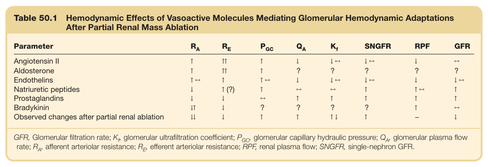

#### Table Data (CSV: [Table_50_1.csv](Table_50_1.csv))

```markdown
| Table Text (OCR) |
| :--- |
| Table 50.1 Hemodynamic Effects of Vasoactive Molecules Mediating Glomerular Hemodynamic Adaptations After Partial Renal Mass Ablation Parameter   R_A    R_E    P_{GC}    Q_A    K_f   SNGFR  RPF  GFR    Angiotensin II  ↑  ↑↑  ↑  ↓  ↓←  ↓←  ↓  ←    Aldosterone  ↑  ↑↑  ↑  ?  ?  ?  ?  ?    Endothelins  ↑←  ↑  ↑←  ↓  ↓←  ↓←  ↓  ↓←    Natriuretic peptides  ↓  ↑ (?)  ↑  ←  ←  ↑  ↑←  ↑    Prostaglandins  ↓  ↓  ←  ↑  ↑  ↑  ↑  ↑    Bradykinin  ↓↑  ↓  ?  ?  ?  ?  ↑  ←    Observed changes after partial renal ablation  ↓↓  ↓  ↑  ↑  ↑↓  ↑  -  ↓ GFR, Glomerular filtration rate; K<sub>f</sub>, glomerular ultrafiltration coefficient; P<sub>GC</sub>, glomerular capillary hydraulic pressure; Q<sub>A</sub>, glomerular plasma flow rate; R , afferent arteriolar resistance; R , efferent arteriolar resistance; RPF, renal plasma flow; SNGFR, single-nephron GFR. |
```

Table 50.1 Hemodynamic Effects of Vasoactive Molecules Mediating Glomerular Hemodynamic Adaptations After Partial Renal Mass Ablation

---
