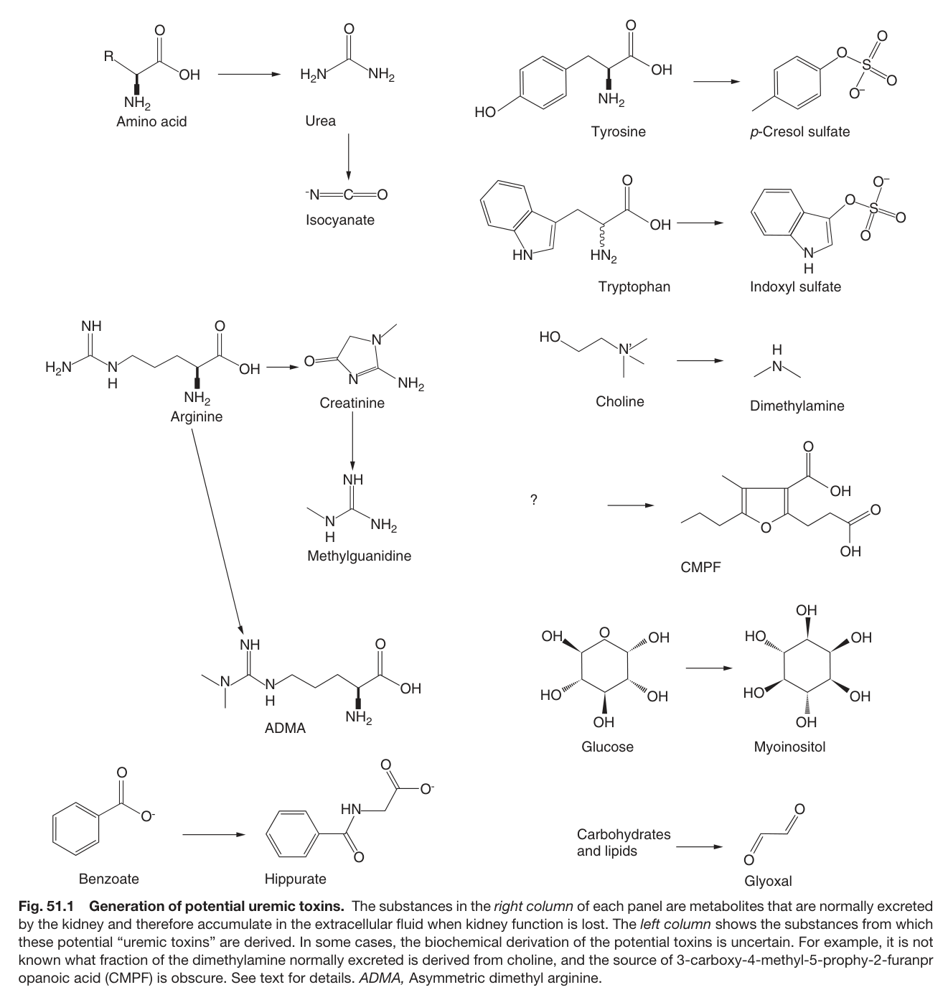
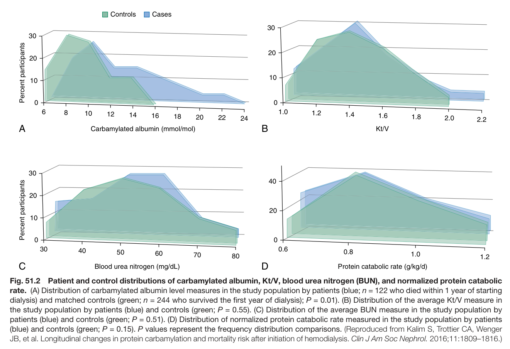
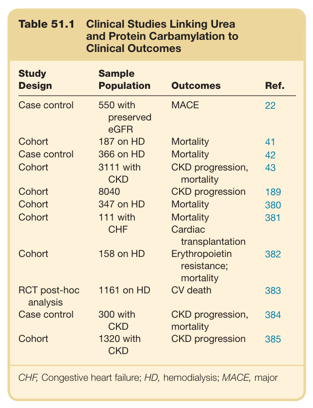
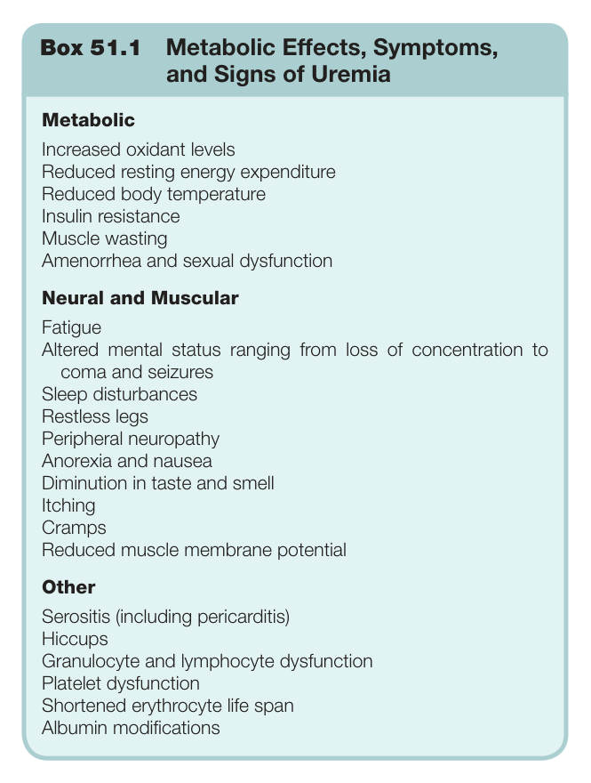
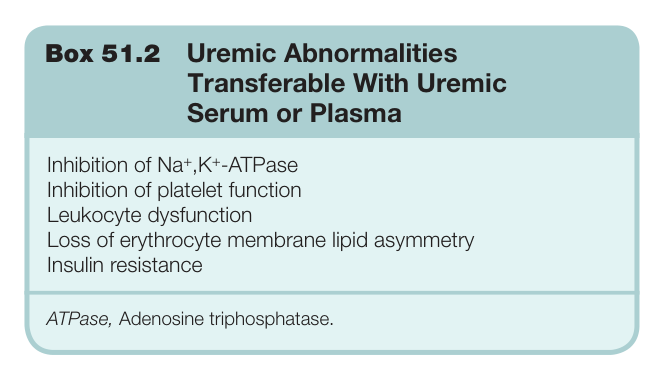
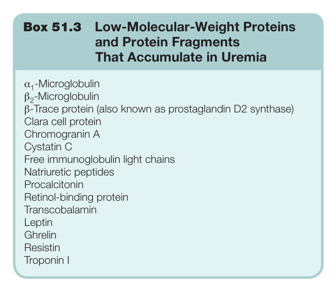

# 51. The Pathophysiology of Uremia - Figures and Tables Index

This document lists all figures, tables and boxes extracted from `51. The Pathophysiology of Uremia.pdf`.

## Table of Contents
- [Figures](#figures)
- [Tables](#tables)
- [Boxes](#boxes)

---

## Figures

### Fig_51_1



Fig. 51.1 Generation of potential uremic toxins. The substances in the right column of each panel are metabolites that are normally excreted by the kidney and therefore accumulate in the extracellular fluid when kidney function is lost. The left column shows the substances from which these potential “uremic toxins” are derived. In some cases, the biochemical derivation of the potential toxins is uncertain. For example, it is not known what fraction of the dimethylamine normally excreted is derived from choline, and the source of 3-carboxy-4-methyl-5-prophy-2-furanpr opanoic acid (CMPF) is obscure. See text for details. ADMA, Asymmetric dimethyl arginine.

---

### Fig_51_2



Fig. 51.2 Patient and control distributions of carbamylated albumin, Kt/V, blood urea nitrogen (BUN), and normalized protein catabolic rate. (A) Distribution of carbamylated albumin level measures in the study population by patients (blue; n = 122 who died within 1 year of starting dialysis) and matched controls (green; n = 244 who survived the first year of dialysis); P = 0.01). (B) Distribution of the average Kt/V measure in the study population by patients (blue) and controls (green; P = 0.55). (C) Distribution of the average BUN measure in the study population by patients (blue) and controls (green; P = 0.51). (D) Distribution of normalized protein catabolic rate measured in the study population by patients (blue) and controls (green; P = 0.15). P values represent the frequency distribution comparisons. (Reproduced from Kalim S, Trottier CA, Wenge JB, et al. Longitudinal changes in protein carbamylation and mortality risk after initiation of hemodialysis. Clin J Am Soc Nephrol. 2016;11:1809–1816.)

---

## Tables

### Table_51_1

#### Table Image



#### Table Data (CSV: [Table_51_1.csv](Table_51_1.csv))

```markdown
| Table Text (OCR) |
| :--- |
| Table 51.1 Clinical Studies Linking Urea and Protein Carbamylation to Clinical Outcomes Study Design  Sample Population  Outcomes  Ref.    Case control  550 with preserved eGFR  MACE  22    Cohort  187 on HD  Mortality  41    Case control  366 on HD  Mortality  42    Cohort  3111 with CKD  CKD progression, mortality  43    Cohort  8040  CKD progression  189    Cohort  347 on HD  Mortality  380    Cohort  111 with CHF  Mortality Cardiac transplantation  381    Cohort  158 on HD  Erythropoietin resistance; mortality  382    RCT post-hoc analysis  1161 on HD  CV death  383    Case control  300 with CKD  CKD progression, mortality  384    Cohort  1320 with CKD  CKD progression  385 CHF, Congestive heart failure; HD, hemodialysis; MACE, major |
```

Table 51.1 Clinical Studies Linking Urea and Protein Carbamylation to Clinical Outcomes

---

## Boxes

### Box_51_1



#### Box Text

```markdown
Box 51.1 Metabolic Effects, Symptoms, and Signs of Uremia Metabolic Increased oxidant levels Reduced resting energy expenditure Reduced body temperature Insulin resistance Muscle wasting Amenorrhea and sexual dysfunction Neural and Muscular Fatigue Altered mental status ranging from loss of concentration to coma and seizures Sleep disturbances Restless legs Peripheral neuropathy Anorexia and nausea Diminution in taste and smell Itching Cramps Reduced muscle membrane potential Other Serositis (including pericarditis) Hiccups Granulocyte and lymphocyte dysfunction Platelet dysfunction Shortened erythrocyte life span Albumin modifications
```

Box 51.1 Metabolic Effects, Symptoms, and Signs of Uremia

---

### Box_51_2



#### Box Text

```markdown
Box 51.2 Uremic Abnormalities Transferable With Uremic Serum or Plasma Inhibition of Na<sup>+</sup>,K<sup>+</sup>-ATPase Inhibition of platelet function Leukocyte dysfunction Loss of erythrocyte membrane lipid asymmetry Insulin resistance ATPase, Adenosine triphosphatase.
```

Box 51.2 Uremic Abnormalities Transferable With Uremic Serum or Plasma

---

### Box_51_3



#### Box Text

```markdown
Box 51.3 Low-Molecular-Weight Proteins and Protein Fragments That Accumulate in Uremia α -Microglobulin β<sub>2</sub>-Microglobulin β-Trace protein (also known as prostaglandin D2 synthase) Clara cell protein Chromogranin A Cystatin C Free immunoglobulin light chains Natriuretic peptides Procalcitonin Retinol-binding protein Transcobalamin Leptin Ghrelin Resistin Troponin I
```

Box 51.3 Low-Molecular-Weight Proteins and Protein Fragments That Accumulate in Uremia

---
