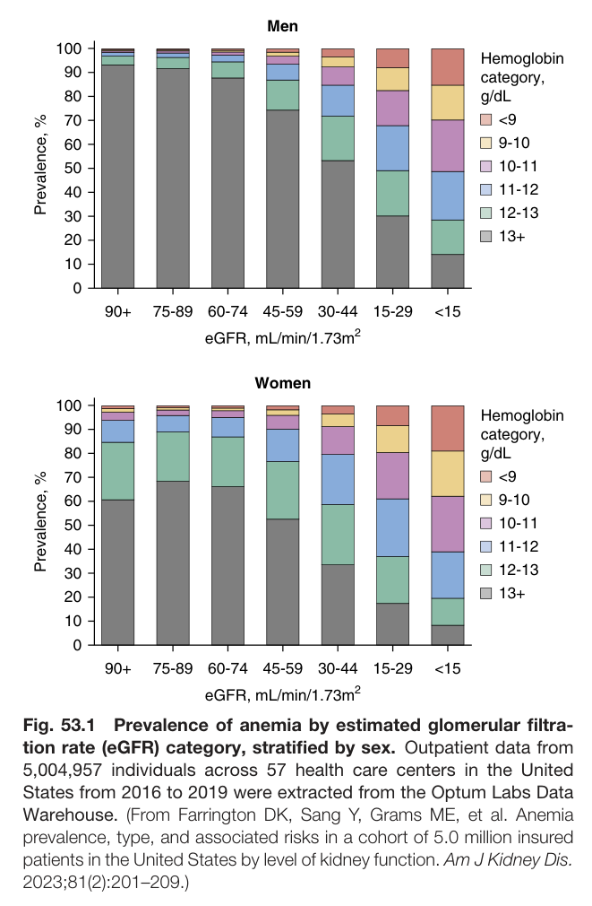
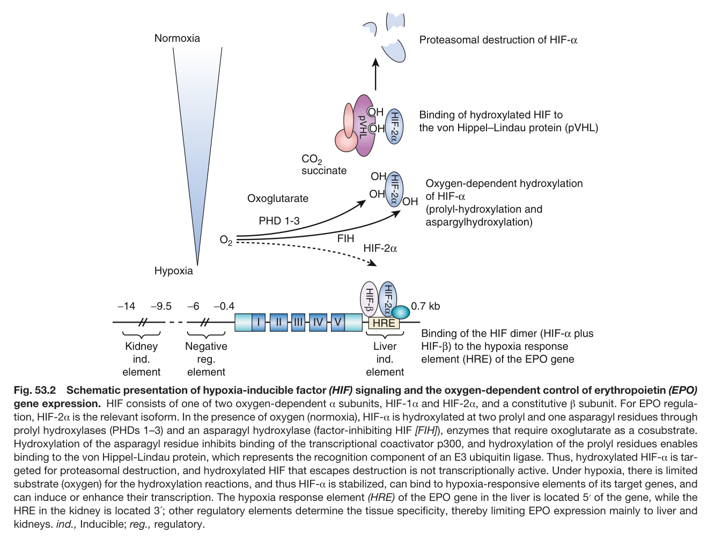
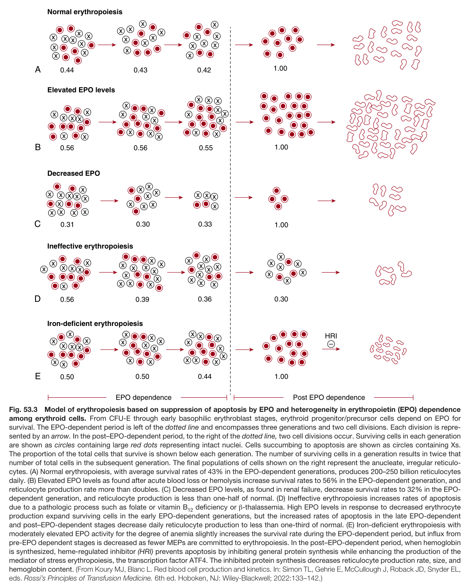
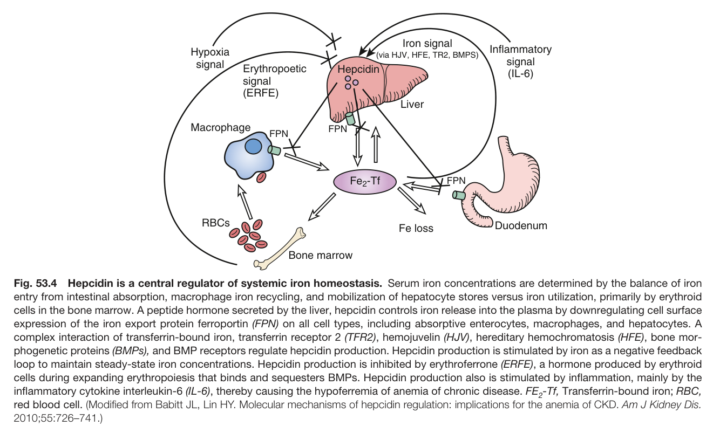
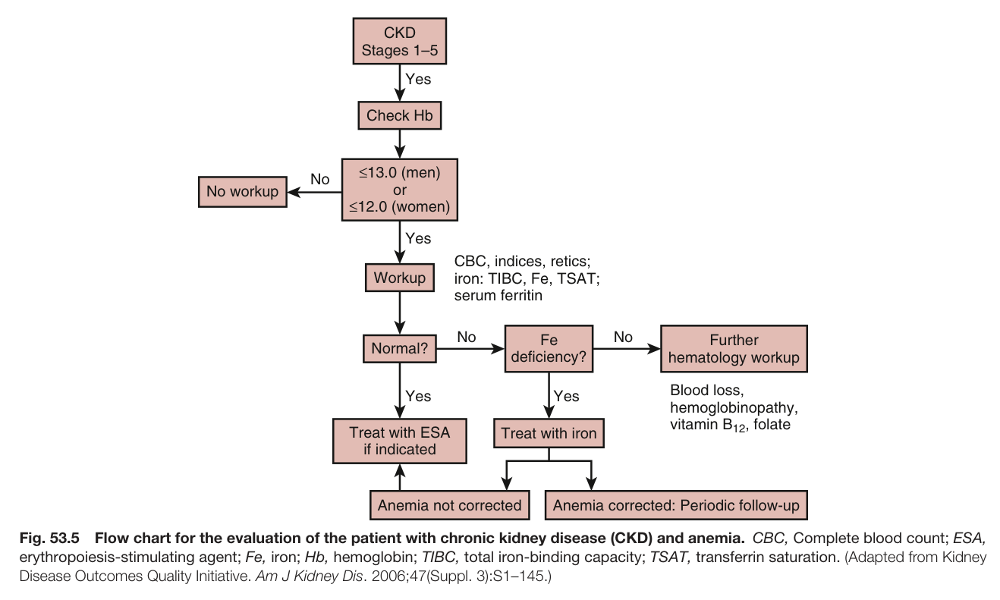
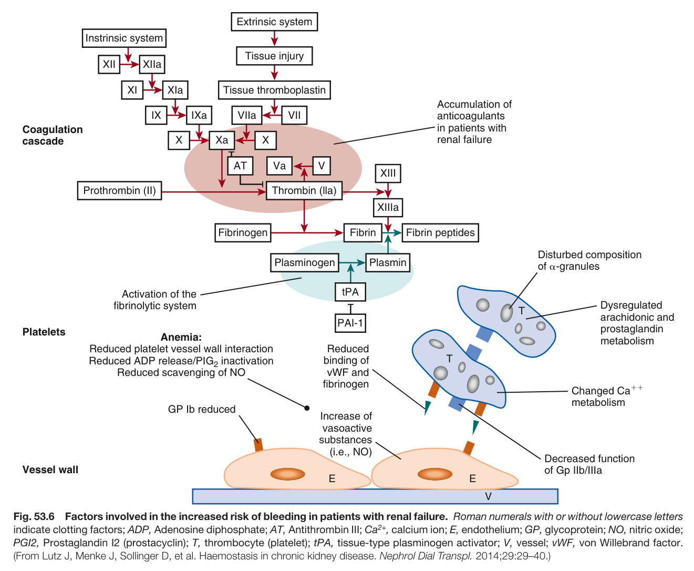
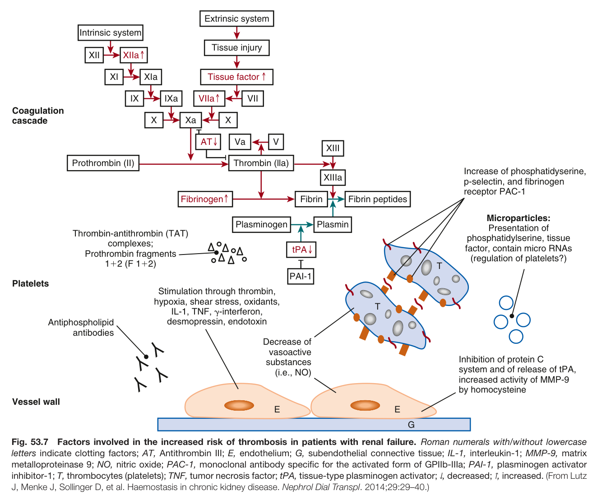
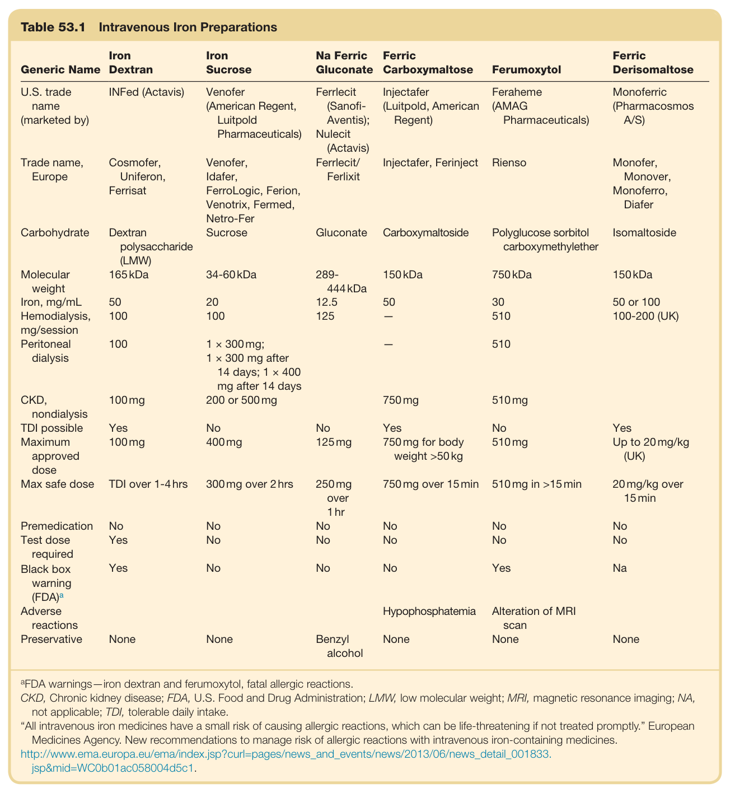

# 53. Hematologic Aspects of Kidney Disease - Figures and Tables Index

This document lists all figures and tables extracted from `53. Hematologic Aspects of Kidney Disease.pdf`.

## Table of Contents
- [Figures](#figures)
- [Tables](#tables)

---

## Figures

### Fig_53_1



Fig. 53.1 Prevalence of anemia by estimated glomerular filtra- tion rate (eGFR) category, stratified by sex. Outpatient data from 5,004,957 individuals across 57 health care centers in the United States from 2016 to 2019 were extracted from the Optum Labs Data Warehouse. (From Farrington DK, Sang Y, Grams ME, et al. Anemia prevalence, type, and associated risks in a cohort of 5.0 million insured patients in the United States by level of kidney function. Am J Kidney Dis. 2023;81(2):201–209.)

---

### Fig_53_2



Fig. 53.2 Schematic presentation of hypoxia-inducible factor (HIF) signaling and the oxygen-dependent control of erythropoietin (EPO) gene expression. HIF consists of one of two oxygen-dependent α subunits, HIF-1α and HIF-2α, and a constitutive β subunit. For EPO regula- tion, HIF-2α is the relevant isoform. In the presence of oxygen (normoxia), HIF-α is hydroxylated at two prolyl and one asparagyl residues through prolyl hydroxylases (PHDs 1–3) and an asparagyl hydroxylase (factor-inhibiting HIF [FIH]), enzymes that require oxoglutarate as a cosubstrate. Hydroxylation of the asparagyl residue inhibits binding of the transcriptional coactivator p300, and hydroxylation of the prolyl residues enables binding to the von Hippel-Lindau protein, which represents the recognition component of an E3 ubiquitin ligase. Thus, hydroxylated HIF-α is tar- geted for proteasomal destruction, and hydroxylated HIF that escapes destruction is not transcriptionally active. Under hypoxia, there is limited substrate (oxygen) for the hydroxylation reactions, and thus HIF-α is stabilized, can bind to hypoxia-responsive elements of its target genes, and can induce or enhance their transcription. The hypoxia response element (HRE) of the EPO gene in the liver is located 5′ of the gene, while the HRE in the kidney is located 3´; other regulatory elements determine the tissue specificity, thereby limiting EPO expression mainly to liver and kidneys. ind., Inducible; reg., regulatory.

---

### Fig_53_3



Fig. 53.3 Model of erythropoiesis based on suppression of apoptosis by EPO and heterogeneity in erythropoietin (EPO) dependence among erythroid cells. From CFU-E through early basophilic erythroblast stages, erythroid progenitor/precursor cells depend on EPO for survival. The EPO-dependent period is left of the dotted line and encompasses three generations and two cell divisions. Each division is repre- sented by an arrow. In the post–EPO-dependent period, to the right of the dotted line, two cell divisions occur. Surviving cells in each generation are shown as circles containing large red dots representing intact nuclei. Cells succumbing to apoptosis are shown as circles containing Xs. The proportion of the total cells that survive is shown below each generation. The number of surviving cells in a generation results in twice that number of total cells in the subsequent generation. The final populations of cells shown on the right represent the anucleate, irregular reticulo- cytes. (A) Normal erythropoiesis, with average survival rates of 43% in the EPO-dependent generations, produces 200–250 billion reticulocytes daily. (B) Elevated EPO levels as found after acute blood loss or hemolysis increase survival rates to 56% in the EPO-dependent generation, and reticulocyte production rate more than doubles. (C) Decreased EPO levels, as found in renal failure, decrease survival rates to 32% in the EPO- dependent generation, and reticulocyte production is less than one-half of normal. (D) Ineffective erythropoiesis increases rates of apoptosis due to a pathologic process such as folate or vitamin B deficiency or β-thalassemia. High EPO levels in response to decreased erythrocyte production expand surviving cells in the early EPO-dependent generations, but the increased rates of apoptosis in the late EPO-dependent and post–EPO-dependent stages decrease daily reticulocyte production to less than one-third of normal. (E) Iron-deficient erythropoiesis with moderately elevated EPO activity for the degree of anemia slightly increases the survival rate during the EPO-dependent period, but influx from pre-EPO dependent stages is decreased as fewer MEPs are committed to erythropoiesis. In the post–EPO-dependent period, when hemoglobin is synthesized, heme-regulated inhibitor (HRI) prevents apoptosis by inhibiting general protein synthesis while enhancing the production of the mediator of stress erythropoiesis, the transcription factor ATF4. The inhibited protein synthesis decreases reticulocyte production rate, size, and hemoglobin content. (From Koury MJ, Blanc L. Red blood cell production and kinetics. In: Simon TL, Gehrie E, McCullough J, Roback JD, Snyder EL, eds. Rossi’s Principles of Transfusion Medicine. 6th ed. Hoboken, NJ: Wiley-Blackwell; 2022:133–142.)

---

### Fig_53_4



Fig. 53.4 Hepcidin is a central regulator of systemic iron homeostasis. Serum iron concentrations are determined by the balance of iron entry from intestinal absorption, macrophage iron recycling, and mobilization of hepatocyte stores versus iron utilization, primarily by erythroid cells in the bone marrow. A peptide hormone secreted by the liver, hepcidin controls iron release into the plasma by downregulating cell surface expression of the iron export protein ferroportin (FPN) on all cell types, including absorptive enterocytes, macrophages, and hepatocytes. A complex interaction of transferrin-bound iron, transferrin receptor 2 (TFR2), hemojuvelin (HJV), hereditary hemochromatosis (HFE), bone mor- phogenetic proteins (BMPs), and BMP receptors regulate hepcidin production. Hepcidin production is stimulated by iron as a negative feedback loop to maintain steady-state iron concentrations. Hepcidin production is inhibited by erythroferrone (ERFE), a hormone produced by erythroid cells during expanding erythropoiesis that binds and sequesters BMPs. Hepcidin production also is stimulated by inflammation, mainly by the inflammatory cytokine interleukin-6 (IL-6), thereby causing the hypoferremia of anemia of chronic disease. FE -Tf, Transferrin-bound iron; RBC, red blood cell. (Modified from Babitt JL, Lin HY. Molecular mechanisms of hepcidin regulation: implications for the anemia of CKD. Am J Kidney Dis. 2010;55:726–741.)

---

### Fig_53_5



Fig. 53.5 Flow chart for the evaluation of the patient with chronic kidney disease (CKD) and anemia. CBC, Complete blood count; ESA, erythropoiesis-stimulating agent; Fe, iron; Hb, hemoglobin; TIBC, total iron-binding capacity; TSAT, transferrin saturation. (Adapted from Kidney Disease Outcomes Quality Initiative. Am J Kidney Dis. 2006;47(Suppl. 3):S1–145.)

---

### Fig_53_6



Fig. 53.6 Factors involved in the increased risk of bleeding in patients with renal failure. Roman numerals with or without lowercase letters indicate clotting factors; ADP, Adenosine diphosphate; AT, Antithrombin III; Ca<sup>2+</sup>, calcium ion; E, endothelium; GP, glycoprotein; NO, nitric oxide; PGI2, Prostaglandin I2 (prostacyclin); T, thrombocyte (platelet); tPA, tissue-type plasminogen activator; V, vessel; vWF, von Willebrand factor. (From Lutz J, Menke J, Sollinger D, et al. Haemostasis in chronic kidney disease. Nephrol Dial Transpl. 2014;29:29–40.)

---

### Fig_53_7



Fig. 53.7 Factors involved in the increased risk of thrombosis in patients with renal failure. Roman numerals with/without lowercase letters indicate clotting factors; AT, Antithrombin III; E, endothelium; G, subendothelial connective tissue; IL-1, interleukin-1; MMP-9, matrix metalloproteinase 9; NO, nitric oxide; PAC-1, monoclonal antibody specific for the activated form of GPIIb-IIIa; PAI-1, plasminogen activator inhibitor-1; T, thrombocytes (platelets); TNF, tumor necrosis factor; tPA, tissue-type plasminogen activator; ↓, decreased; ↑, increased. (From Lutz J, Menke J, Sollinger D, et al. Haemostasis in chronic kidney disease. Nephrol Dial Transpl. 2014;29:29–40.)

---

## Tables

### Table_53_1

#### Table Image



#### Table Data (CSV: [Table_53_1.csv](Table_53_1.csv))

```markdown
| Table Text (OCR) |
| :--- |
| Table 53.1  Intravenous Iron Preparations Generic Name  Iron Dextran  Iron Sucrose  Na Ferric Gluconate  Ferric Carboxymaltose  Ferumoxytol  Ferric Derisomaltose    U.S. trade name (marketed by)  INFed (Actavis)  Venofer (American Regent, Luitpold Pharmaceuticals)  Ferrlecit (Sanofi-Aventis); Nulecit (Actavis)  Injectafer (Luitpold, American Regent)  Feraheme (AMAG Pharmaceuticals)  Monoferric (Pharmacosmos A/S)    Trade name, Europe  Cosmofer, Uniferon, Ferrisat  Venofer, Idafer, FerroLogic, Ferion, Venotrix, Fermed, Netro-Fer  Ferrlecit/ Ferlixit  Injectafer, Ferinject  Rienso  Monofer, Monover, Monoferro, Diafer    Carbohydrate  Dextran polysaccharide (LMW)  Sucrose  Gluconate  Carboxymaltoside  Polyglucose sorbitol carboxymethylether  Isomaltoside    Molecular weight  165 kDa  34-60 kDa  289-444 kDa  150 kDa  750 kDa  150 kDa    Iron, mg/mL  50  20  12.5  50  30  50 or 100    Hemodialysis, mg/session  100  100  125  -  510  100-200 (UK)    Peritoneal dialysis  100  1 × 300 mg; 1 × 300 mg after 14 days; 1 × 400 mg after 14 days    -  510      CKD, nondialysis  100 mg  200 or 500 mg    750 mg  510 mg      TDI possible  Yes  No  No  Yes  No  Yes    Maximum approved dose  100 mg  400 mg  125 mg  750 mg for body weight >50 kg  510 mg  Up to 20 mg/kg (UK)    Max safe dose  TDI over 1-4 hrs  300 mg over 2 hrs  250 mg over 1 hr  750 mg over 15 min  510 mg in >15 min  20 mg/kg over 15 min    Premedication  No  No  No  No  No  No    Test dose required  Yes  No  No  No  No  No    Black box warning (FDA) ^a   Yes  No  No  No  Yes  Na    Adverse reactions        Hypophosphatemia  Alteration of MRI scan      Preservative  None  None  Benzyl alcohol  None  None  None <sup>a</sup>FDA warnings—iron dextran and ferumoxytol, fatal allergic reactions. CKD, Chronic kidney disease; FDA, U.S. Food and Drug Administration; LMW, low molecular weight; MRI, magnetic resonance imaging; NA, not applicable; TDI, tolerable daily intake. “All intravenous iron medicines have a small risk of causing allergic reactions, which can be life-threatening if not treated promptly.” European Medicines Agency. New recommendations to manage risk of allergic reactions with intravenous iron-containing medicines. http://www.ema.europa.eu/ema/index.jsp?curl=pages/news_and_events/news/2013/06/news_detail_001833. jsp&mid=WC0b01ac058004d5c1. |
```

Table 53.1 Intravenous Iron Preparations

---
