# 54. Classification and Management of Chronic Kidney Disease - Figures and Tables Index

This document lists all figures and tables extracted from `54. Classification and Management of Chronic Kidney Disease.pdf`.

## Table of Contents
- [Figures](#figures)
- [Tables](#tables)

---

## Figures

### Fig_54_1

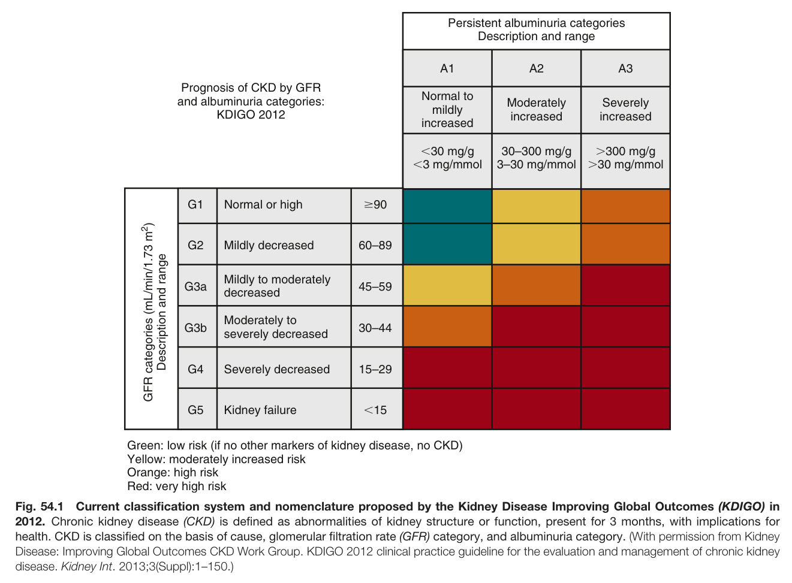

Fig. 54.1 Current classification system and nomenclature proposed by the Kidney Disease Improving Global Outcomes (KDIGO) in 2012. Chronic kidney disease (CKD) is defined as abnormalities of kidney structure or function, present for 3 months, with implications for health. CKD is classified on the basis of cause, glomerular filtration rate (GFR) category, and albuminuria category. (With permission from Kidney Disease: Improving Global Outcomes CKD Work Group. KDIGO 2012 clinical practice guideline for the evaluation and management of chronic kidne disease. Kidney Int. 2013;3(Suppl):1–150.)

---

### Fig_54_2

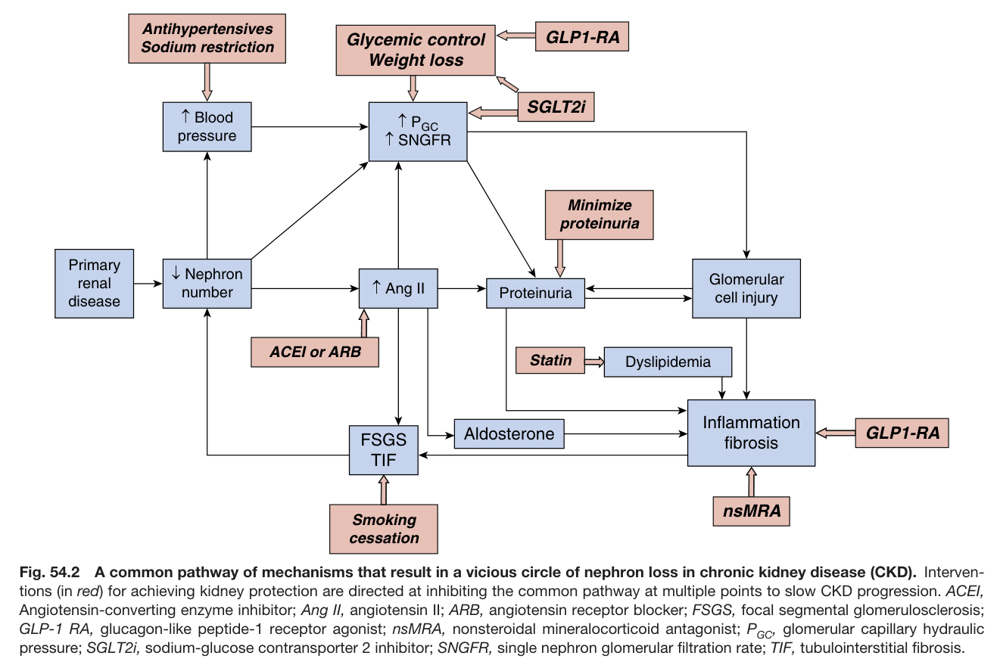

Fig. 54.2 A common pathway of mechanisms that result in a vicious circle of nephron loss in chronic kidney disease (CKD). Interven- tions (in red) for achieving kidney protection are directed at inhibiting the common pathway at multiple points to slow CKD progression. ACEI, Angiotensin-converting enzyme inhibitor; Ang II, angiotensin II; ARB, angiotensin receptor blocker; FSGS, focal segmental glomerulosclerosis; GLP-1 RA, glucagon-like peptide-1 receptor agonist; nsMRA, nonsteroidal mineralocorticoid antagonist; P<sub>GC</sub>, glomerular capillary hydraulic pressure; SGLT2i, sodium-glucose contransporter 2 inhibitor; SNGFR, single nephron glomerular filtration rate; TIF, tubulointerstitial fibrosis.

---

### Fig_54_3

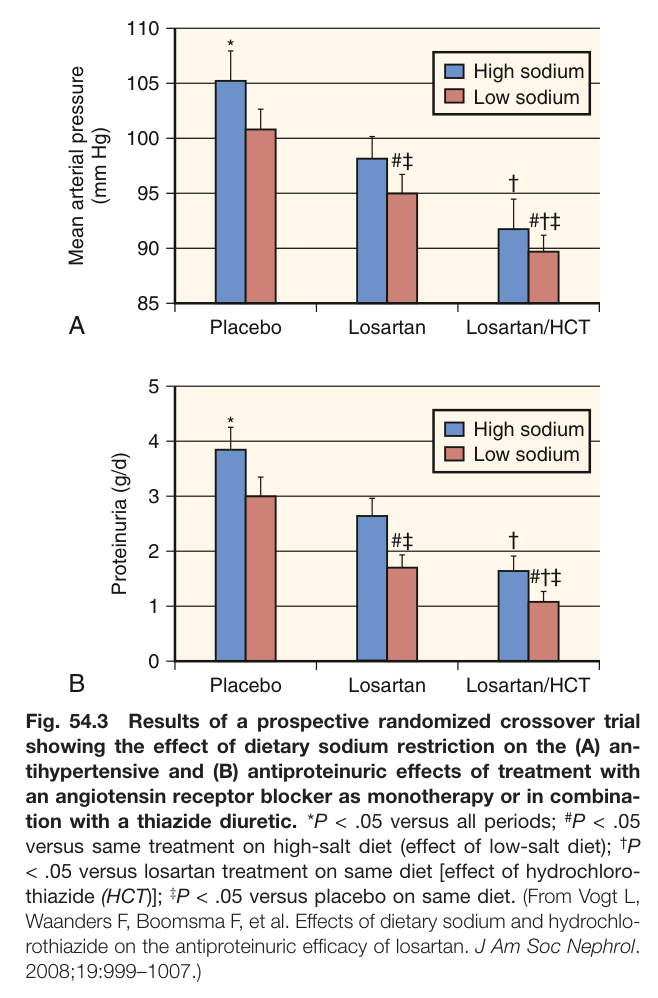

Fig. 54.3 Results of a prospective randomized crossover trial showing the effect of dietary sodium restriction on the (A) an- tihypertensive and (B) antiproteinuric effects of treatment with an angiotensin receptor blocker as monotherapy or in combina- tion with a thiazide diuretic. *P < .05 versus all periods; <sup>#</sup>P < .05 versus same treatment on high-salt diet (effect of low-salt diet); <sup>†</sup>P < .05 versus losartan treatment on same diet [effect of hydrochloro- thiazide (HCT)]; ‡P < .05 versus placebo on same diet. (From Vogt L, Waanders F, Boomsma F, et al. Effects of dietary sodium and hydrochlo- rothiazide on the antiproteinuric efficacy of losartan. J Am Soc Nephrol. 2008;19:999–1007.)

---

### Fig_54_4

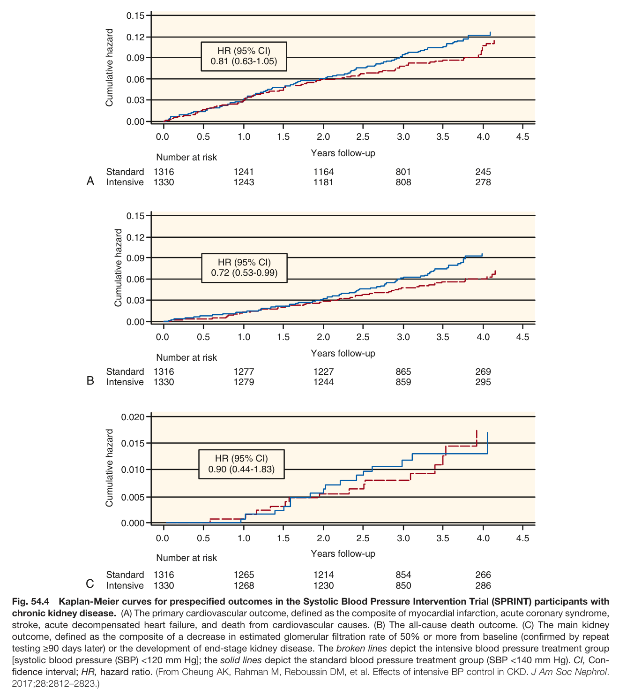

Fig. 54.4 Kaplan-Meier curves for prespecified outcomes in the Systolic Blood Pressure Intervention Trial (SPRINT) participants with chronic kidney disease. (A) The primary cardiovascular outcome, defined as the composite of myocardial infarction, acute coronary syndrome, stroke, acute decompensated heart failure, and death from cardiovascular causes. (B) The all-cause death outcome. (C) The main kidney outcome, defined as the composite of a decrease in estimated glomerular filtration rate of 50% or more from baseline (confirmed by repeat testing ≥90 days later) or the development of end-stage kidney disease. The broken lines depict the intensive blood pressure treatment group [systolic blood pressure (SBP) <120 mm Hg]; the solid lines depict the standard blood pressure treatment group (SBP <140 mm Hg). CI, Con- fidence interval; HR, hazard ratio. (From Cheung AK, Rahman M, Reboussin DM, et al. Effects of intensive BP control in CKD. J Am Soc Nephrol. 2017;28:2812–2823.)

---

### Fig_54_5

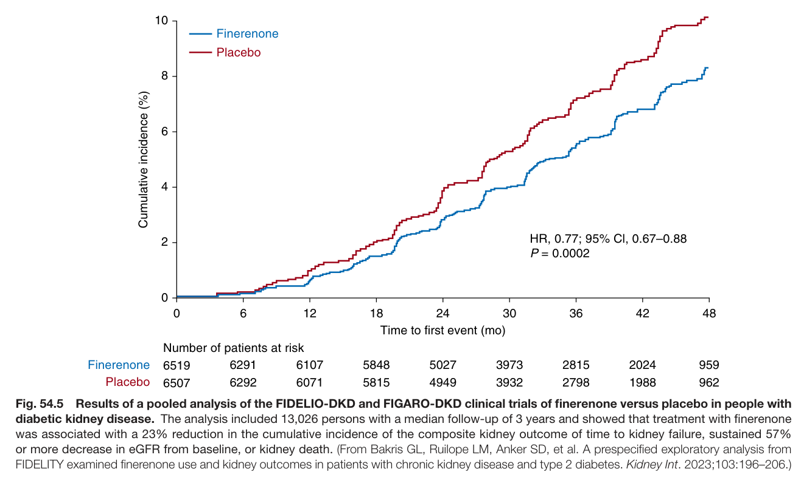

Fig. 54.5 Results of a pooled analysis of the FIDELIO-DKD and FIGARO-DKD clinical trials of finerenone versus placebo in people with diabetic kidney disease. The analysis included 13,026 persons with a median follow-up of 3 years and showed that treatment with finerenone was associated with a 23% reduction in the cumulative incidence of the composite kidney outcome of time to kidney failure, sustained 57% or more decrease in eGFR from baseline, or kidney death. (From Bakris GL, Ruilope LM, Anker SD, et al. A prespecified exploratory analysis from FIDELITY examined finerenone use and kidney outcomes in patients with chronic kidney disease and type 2 diabetes. Kidney Int. 2023;103:196–206.)

---

### Fig_54_6

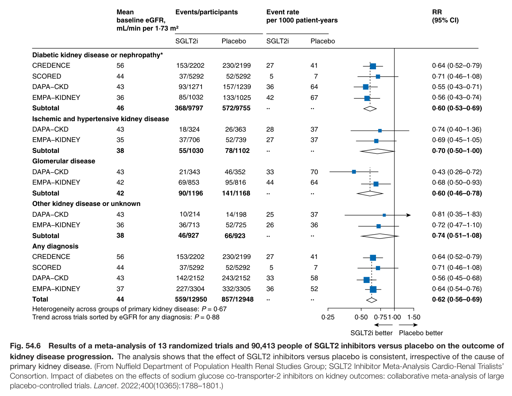

Fig. 54.6 Results of a meta-analysis of 13 randomized trials and 90,413 people of SGLT2 inhibitors versus placebo on the outcome of kidney disease progression. The analysis shows that the effect of SGLT2 inhibitors versus placebo is consistent, irrespective of the cause of primary kidney disease. (From Nuffield Department of Population Health Renal Studies Group; SGLT2 Inhibitor Meta-Analysis Cardio-Renal Trialists’ Consortion. Impact of diabetes on the effects of sodium glucose co-transporter-2 inhibitors on kidney outcomes: collaborative meta-analysis of large placebo-controlled trials. Lancet. 2022;400(10365):1788–1801.)

---

### Fig_54_7

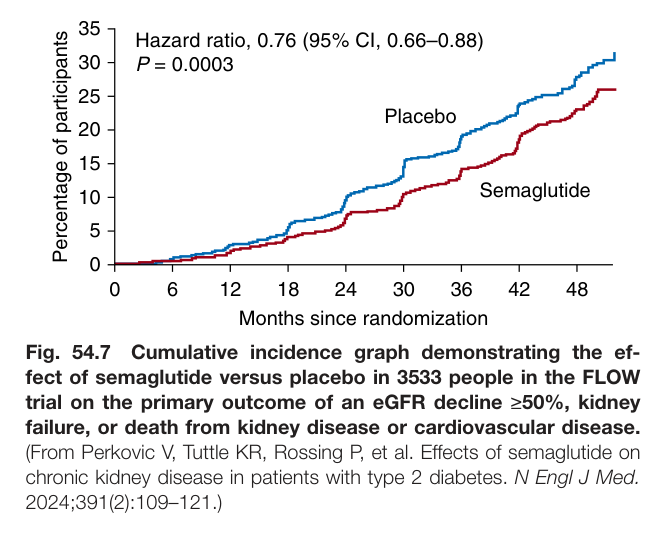

Fig. 54.7 Cumulative incidence graph demonstrating the ef- fect of semaglutide versus placebo in 3533 people in the FLOW trial on the primary outcome of an eGFR decline ≥50%, kidney failure, or death from kidney disease or cardiovascular disease. (From Perkovic V, Tuttle KR, Rossing P, et al. Effects of semaglutide on chronic kidney disease in patients with type 2 diabetes. N Engl J Med. 2024;391(2):109–121.)

---

### Fig_54_8

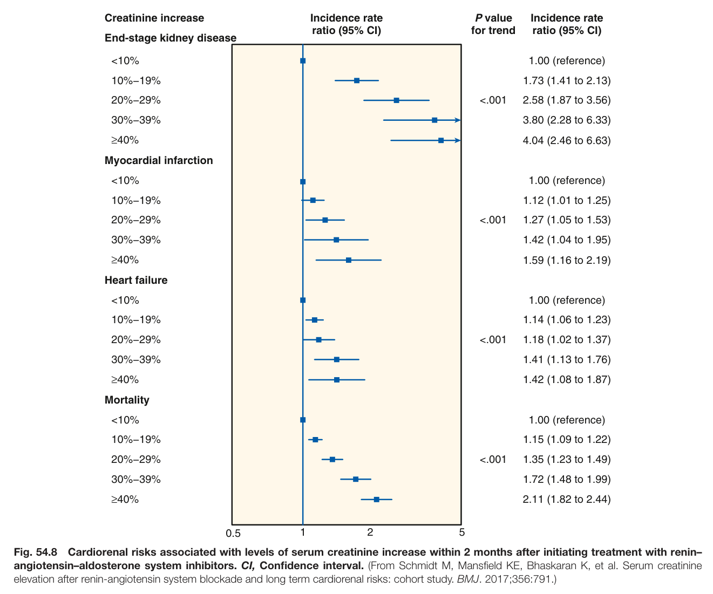

Fig. 54.8 Cardiorenal risks associated with levels of serum creatinine increase within 2 months after initiating treatment with renin– angiotensin–aldosterone system inhibitors. CI, Confidence interval. (From Schmidt M, Mansfield KE, Bhaskaran K, et al. Serum creatinine elevation after renin-angiotensin system blockade and long term cardiorenal risks: cohort study. BMJ. 2017;356:791.)

---

### Fig_54_9

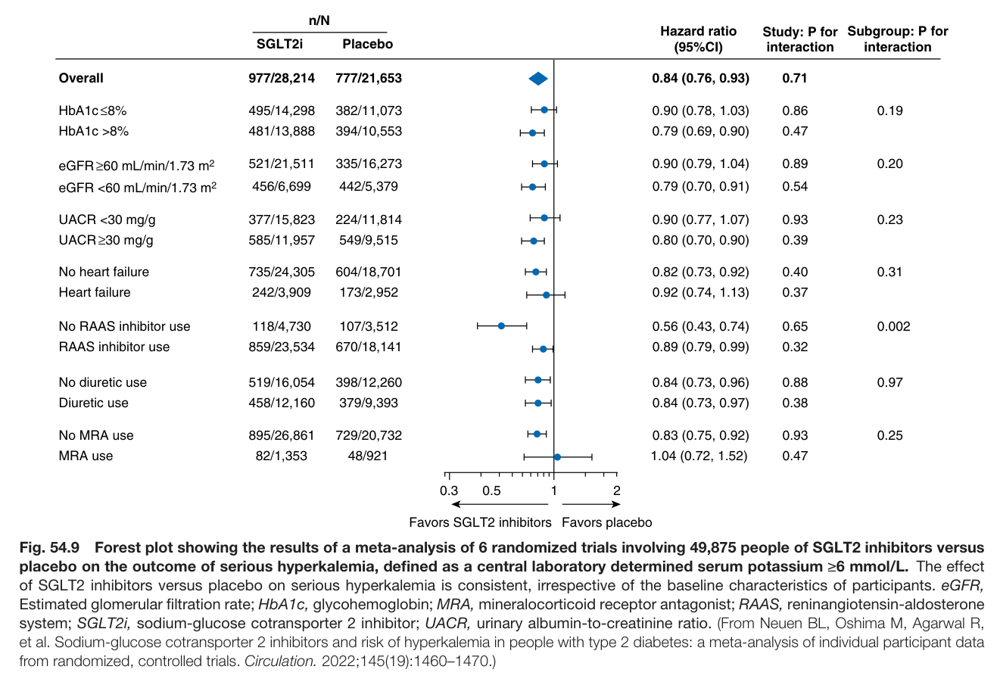

Fig. 54.9 Forest plot showing the results of a meta-analysis of 6 randomized trials involving 49,875 people of SGLT2 inhibitors versus placebo on the outcome of serious hyperkalemia, defined as a central laboratory determined serum potassium ≥6 mmol/L. The effect of SGLT2 inhibitors versus placebo on serious hyperkalemia is consistent, irrespective of the baseline characteristics of participants. eGFR, Estimated glomerular filtration rate; HbA1c, glycohemoglobin; MRA, mineralocorticoid receptor antagonist; RAAS, reninangiotensin-aldosterone system; SGLT2i, sodium-glucose cotransporter 2 inhibitor; UACR, urinary albumin-to-creatinine ratio. (From Neuen BL, Oshima M, Agarwal R, et al. Sodium-glucose cotransporter 2 inhibitors and risk of hyperkalemia in people with type 2 diabetes: a meta-analysis of individual participant data from randomized, controlled trials. Circulation. 2022;145(19):1460–1470.)

---

### Fig_54_10

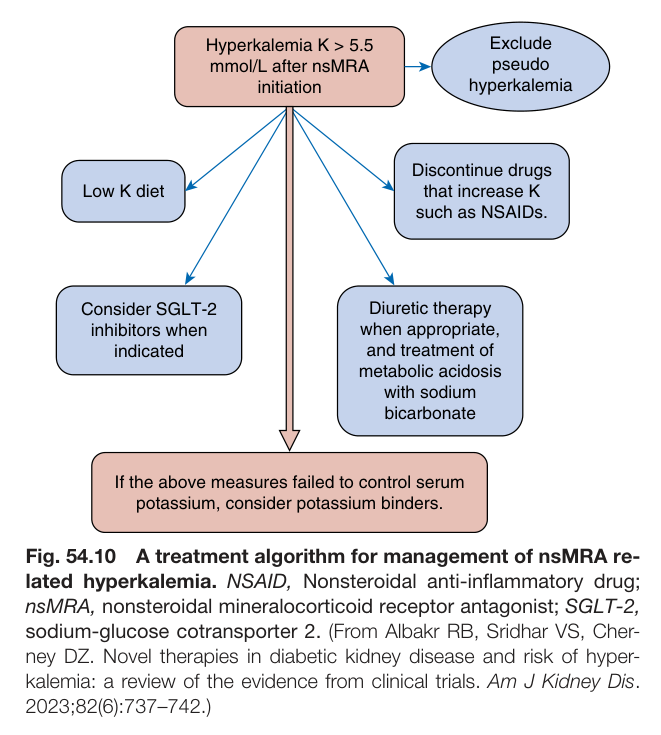

Fig. 54.10 A treatment algorithm for management of nsMRA re- lated hyperkalemia. NSAID, Nonsteroidal anti-inflammatory drug; nsMRA, nonsteroidal mineralocorticoid receptor antagonist; SGLT-2, sodium-glucose cotransporter 2. (From Albakr RB, Sridhar VS, Cher- ney DZ. Novel therapies in diabetic kidney disease and risk of hyper- kalemia: a review of the evidence from clinical trials. Am J Kidney Dis. 2023;82(6):737–742.)

---

### Fig_54_11

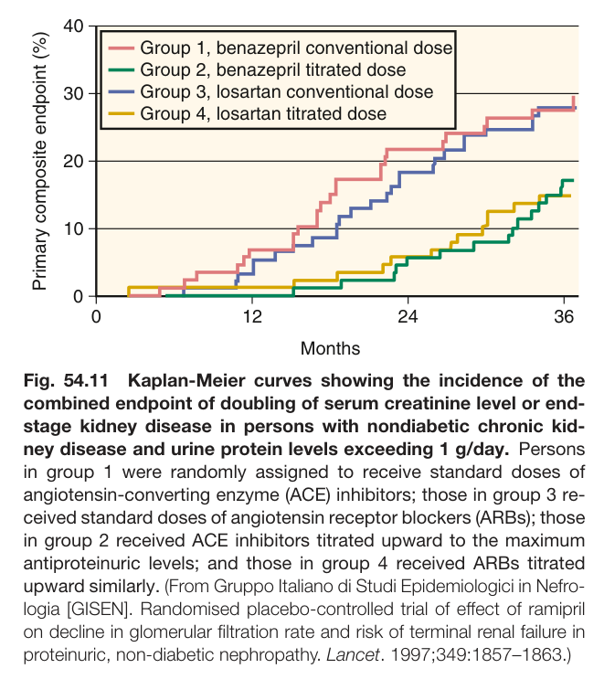

Fig. 54.11 Kaplan-Meier curves showing the incidence of the combined endpoint of doubling of serum creatinine level or end- stage kidney disease in persons with nondiabetic chronic kid- ney disease and urine protein levels exceeding 1 g/day. Persons in group 1 were randomly assigned to receive standard doses of angiotensin-converting enzyme (ACE) inhibitors; those in group 3 re- ceived standard doses of angiotensin receptor blockers (ARBs); those in group 2 received ACE inhibitors titrated upward to the maximum antiproteinuric levels; and those in group 4 received ARBs titrated upward similarly. (From Gruppo Italiano di Studi Epidemiologici in Nefro- logia [GISEN]. Randomised placebo-controlled trial of effect of ramipril on decline in glomerular filtration rate and risk of terminal renal failure in proteinuric, non-diabetic nephropathy. Lancet. 1997;349:1857–1863.)

---

### Fig_54_12

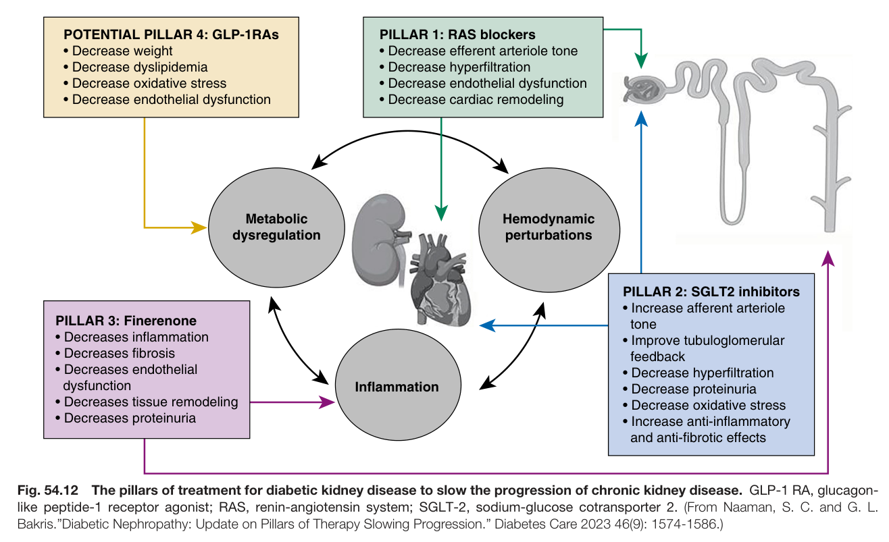

Fig. 54.12 The pillars of treatment for diabetic kidney disease to slow the progression of chronic kidney disease. GLP-1 RA, glucagon- like peptide-1 receptor agonist; RAS, renin-angiotensin system; SGLT-2, sodium-glucose cotransporter 2. (From Naaman, S. C. and G. L. Bakris.”Diabetic Nephropathy: Update on Pillars of Therapy Slowing Progression.” Diabetes Care 2023 46(9): 1574-1586.)

---

## Tables

### Table_54_1

#### Table Image

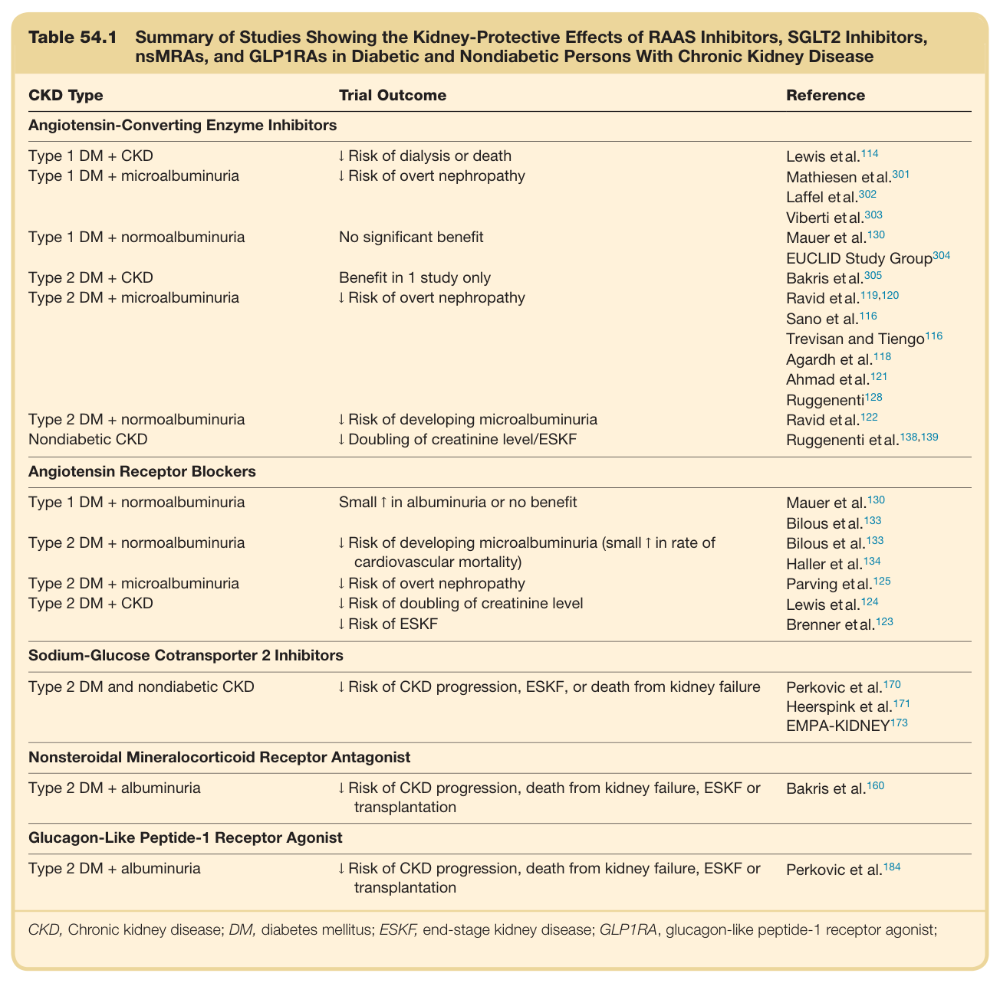

#### Table Data (CSV: [Table_54_1.csv](Table_54_1.csv))

```markdown
| Table Text (OCR) |
| :--- |
| Table 54.1  Summary of Studies Showing the Kidney-Protective Effects of RAAS Inhibitors, SGLT2 Inhibitors, nsMRAs, and GLP1RAs in Diabetic and Nondiabetic Persons With Chronic Kidney Disease CKD Type  Trial Outcome  Reference    Angiotensin-Converting Enzyme Inhibitors    Type 1 DM + CKD  ↓ Risk of dialysis or death  Lewis et al. ^{114}     Type 1 DM + microalbuminuria  ↓ Risk of overt nephropathy  Mathiesen et al. ^{301} Laffel et al. ^{302} Viberti et al. ^{303}     Type 1 DM + normoalbuminuria  No significant benefit  Mauer et al. ^{130} EUCLID Study Group ^{304}     Type 2 DM + CKD  Benefit in 1 study only  Bakris et al. ^{305}     Type 2 DM + microalbuminuria  ↓ Risk of overt nephropathy  Ravid et al. ^{119,120} Sano et al. ^{116} Trevisan and Tiengo ^{116} Agardh et al. ^{118} Ahmad et al. ^{121} Ruggenenti ^{128}     Type 2 DM + normoalbuminuria  ↓ Risk of developing microalbuminuria  Ravid et al. ^{122}     Nondiabetic CKD  ↓ Doubling of creatinine level/ESKF  Ruggenenti et al. ^{138,139}     Angiotensin Receptor Blockers    Type 1 DM + normoalbuminuria  Small ↑ in albuminuria or no benefit  Mauer et al. ^{130} Bilous et al. ^{133}     Type 2 DM + normoalbuminuria  ↓ Risk of developing microalbuminuria (small ↑ in rate of cardiovascular mortality)  Bilous et al. ^{133} Haller et al. ^{134}     Type 2 DM + microalbuminuria  ↓ Risk of overt nephropathy  Parving et al. ^{125}     Type 2 DM + CKD  ↓ Risk of doubling of creatinine level↓ Risk of ESKF  Lewis et al. ^{124} Brenner et al. ^{123}     Sodium-Glucose Cotransporter 2 Inhibitors    Type 2 DM and nondiabetic CKD  ↓ Risk of CKD progression, ESKF, or death from kidney failure  Perkovic et al. ^{170} Heerspink et al. ^{171} EMPA-KIDNEY ^{173}     Nonsteroidal Mineralocorticoid Receptor Antagonist    Type 2 DM + albuminuria  ↓ Risk of CKD progression, death from kidney failure, ESKF or transplantation  Bakris et al. ^{160}     Glucagon-Like Peptide-1 Receptor Agonist    Type 2 DM + albuminuria  ↓ Risk of CKD progression, death from kidney failure, ESKF or transplantation  Perkovic et al. ^{184} CKD, Chronic kidney disease; DM, diabetes mellitus; ESKF, end-stage kidney disease; GLP1RA, glucagon-like peptide-1 receptor agonist; |
```

Table 54.1 Summary of Studies Showing the Kidney-Protective Effects of RAAS Inhibitors, SGLT2 Inhibitors, nsMRAs, and GLP1RAs in Diabetic and Nondiabetic Persons With Chronic Kidney Disease

---

### Table_54_2

#### Table Images (2 Parts)

- **Part 1 (Page 24)**:
  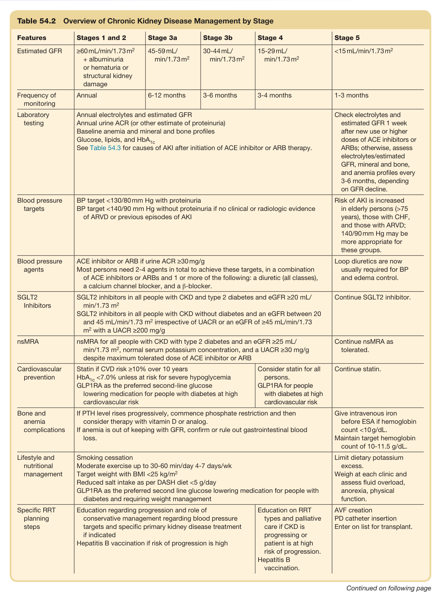

- **Part 2 (Page 25)**:
  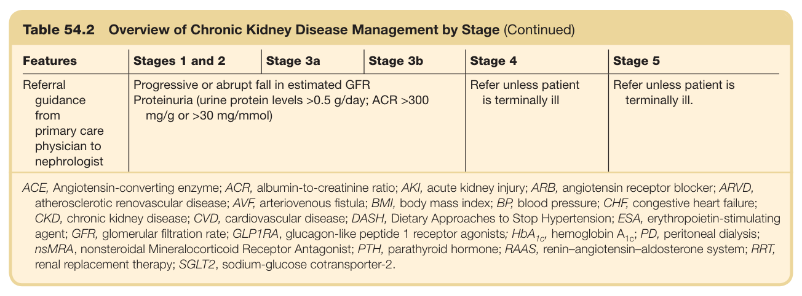

#### Table Data (CSV: [Table_54_2.csv](Table_54_2.csv))

```markdown
| Table Text (OCR) |
| :--- |
| Table 54.2  Overview of Chronic Kidney Disease Management by Stage Features  Stages 1 and 2  Stage 3a  Stage 3b  Stage 4  Stage 5    Estimated GFR   \geq 60 \text{mL/min/1.73 m}^2 + albuminuria or hematuria or structural kidney damage  45-59 mL/min/1.73 m2  30-44 mL/min/1.73 m2  15-29 mL/min/1.73 m2  <15 mL/min/1.73 m2    Frequency of monitoring  Annual  6-12 months  3-6 months  3-4 months  1-3 months    Laboratory testing  Annual electrolytes and estimated GFRAnnual urine ACR (or other estimate of proteinuria)Baseline anemia and mineral and bone profilesGlucose, lipids, and HbA _{1c} See Table 54.3 for causes of AKI after initiation of ACE inhibitor or ARB therapy.  Check electrolytes and estimated GFR 1 week after new use or higher doses of ACE inhibitors or ARBs; otherwise, assess electrolytes/estimated GFR, mineral and bone, and anemia profiles every 3-6 months, depending on GFR decline.    Blood pressure targets  BP target <130/80 mm Hg with proteinuriaBP target <140/90 mm Hg without proteinuria if no clinical or radiologic evidence of ARVD or previous episodes of AKI  Risk of AKI is increased in elderly persons (>75 years), those with CHF, and those with ARVD; 140/90 mm Hg may be more appropriate for these groups.    Blood pressure agents  ACE inhibitor or ARB if urine ACR ≥30 mg/gMost persons need 2-4 agents in total to achieve these targets, in a combination of ACE inhibitors or ARBs and 1 or more of the following: a diuretic (all classes), a calcium channel blocker, and a β-blocker.  Loop diuretics are now usually required for BP and edema control.    SGLT2 Inhibitors  SGLT2 inhibitors in all people with CKD and type 2 diabetes and eGFR ≥20 mL/min/1.73 m2SGLT2 inhibitors in all people with CKD without diabetes and an eGFR between 20 and 45 mL/min/1.73 m2 irrespective of UACR or an eGFR of ≥45 mL/min/1.73 m2 with a UACR ≥200 mg/g  Continue SGLT2 inhibitor.    nsMRA  nsMRA for all people with CKD with type 2 diabetes and an eGFR ≥25 mL/min/1.73 m2, normal serum potassium concentration, and a UACR ≥30 mg/g despite maximum tolerated dose of ACE inhibitor or ARB  Continue nsMRA as tolerated.    Cardiovascular prevention  Statin if CVD risk ≥10% over 10 yearsHbA _{1c}  <7.0% unless at risk for severe hypoglycemiaGLP1RA as the preferred second-line glucose lowering medication for people with diabetes at high cardiovascular risk  Consider statin for all persons.GLP1RA for people with diabetes at high cardiovascular risk  Continue statin.    Bone and anemia complications  If PTH level rises progressively, commence phosphate restriction and then consider therapy with vitamin D or analog.If anemia is out of keeping with GFR, confirm or rule out gastrointestinal blood loss.  Give intravenous iron before ESA if hemoglobin count <10 g/dLMaintain target hemoglobin count of 10-11.5 g/dL.    Lifestyle and nutritional management  Smoking cessationModerate exercise up to 30-60 min/day 4-7 days/wkTarget weight with BMI <25 kg/m2Reduced salt intake as per DASH diet <5 g/dayGLP1RA as the preferred second line glucose lowering medication for people with diabetes and requiring weight management  Limit dietary potassium excess.Weigh at each clinic and assess fluid overload, anorexia, physical function.    Specific RRT planning steps  Education regarding progression and role of conservative management regarding blood pressure targets and specific primary kidney disease treatment if indicatedHepatitis B vaccination if risk of progression is high  Education on RRT types and palliative care if CKD is progressing or patient is at high risk of progression.Hepatitis B vaccination.  AVF creationPD catheter insertionEnter on list for transplant.    Referral guidance from primary care physician to nephrologist  Progressive or abrupt fall in estimated GFR Proteinuria (urine protein levels >0.5 g/day; ACR >300 mg/g or >30 mg/mmol)  Refer unless patient is terminally ill  Refer unless patient is terminally ill. ACE, Angiotensin-converting enzyme; ACR, albumin-to-creatinine ratio; AKI, acute kidney injury; ARB, angiotensin receptor blocker; ARVD, atherosclerotic renovascular disease; AVF, arteriovenous fistula; BMI, body mass index; BP, blood pressure; CHF, congestive heart failure; CKD, chronic kidney disease; CVD, cardiovascular disease; DASH, Dietary Approaches to Stop Hypertension; ESA, erythropoietin-stimulating agent; GFR, glomerular filtration rate; GLP1RA, glucagon-like peptide 1 receptor agonists; HbA , hemoglobin A ; PD, peritoneal dialysis; nsMRA, nonsteroidal Mineralocorticoid Receptor Antagonist; PTH, parathyroid hormone; RAAS, renin–angiotensin–aldosterone system; RRT, renal replacement therapy; SGLT2, sodium-glucose cotransporter-2. |
```

Table 54.2 Overview of Chronic Kidney Disease Management by Stage

---

### Table_54_3

#### Table Image

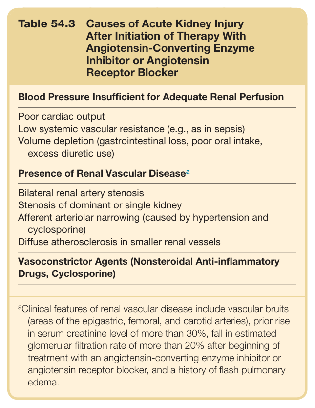

#### Table Data (CSV: [Table_54_3.csv](Table_54_3.csv))

```markdown
| Table Text (OCR) |
| :--- |
| Table 54.3 Causes of Acute Kidney Injury After Initiation of Therapy With Angiotensin-Converting Enzyme Inhibitor or Angiotensin Receptor Blocker Blood Pressure Insufficient for Adequate Renal Perfusion    Poor cardiac output    Low systemic vascular resistance (e.g., as in sepsis)    Volume depletion (gastrointestinal loss, poor oral intake, excess diuretic use)    Presence of Renal Vascular  Disease^a     Bilateral renal artery stenosis    Stenosis of dominant or single kidney    Afferent arteriolar narrowing (caused by hypertension and cyclosporine)    Diffuse atherosclerosis in smaller renal vessels    Vasoconstrictor Agents (Nonsteroidal Anti-inflammatory Drugs, Cyclosporine) <sup>a</sup>Clinical features of renal vascular disease include vascular bruits (areas of the epigastric, femoral, and carotid arteries), prior rise in serum creatinine level of more than 30%, fall in estimated glomerular filtration rate of more than 20% after beginning of treatment with an angiotensin-converting enzyme inhibitor or angiotensin receptor blocker, and a history of flash pulmonary edema. |
```

Table 54.3 Causes of Acute Kidney Injury After Initiation of Therapy With Angiotensin-Converting Enzyme Inhibitor or Angiotensin Receptor Blocker

---

### Table_54_4

#### Table Image

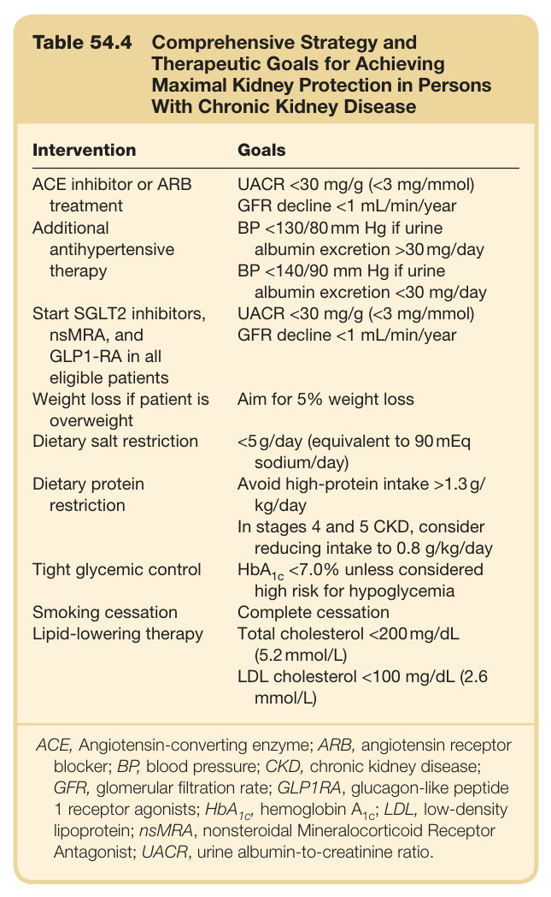

#### Table Data (CSV: [Table_54_4.csv](Table_54_4.csv))

```markdown
| Table Text (OCR) |
| :--- |
| Table 54.4  Comprehensive Strategy and Therapeutic Goals for Achieving Maximal Kidney Protection in Persons With Chronic Kidney Disease Intervention  Goals    ACE inhibitor or ARB treatment  UACR <30 mg/g (<3 mg/mmol)GFR decline <1 mL/min/year    Additional antihypertensive therapy  BP <130/80 mm Hg if urine albumin excretion >30 mg/dayBP <140/90 mm Hg if urine albumin excretion <30 mg/day    Start SGLT2 inhibitors, nsMRA, and GLP1-RA in all eligible patients  UACR <30 mg/g (<3 mg/mmol)GFR decline <1 mL/min/year    Weight loss if patient is overweight  Aim for 5% weight loss    Dietary salt restriction  <5 g/day (equivalent to 90 mEq sodium/day)    Dietary protein restriction  Avoid high-protein intake >1.3 g/kg/dayIn stages 4 and 5 CKD, consider reducing intake to 0.8 g/kg/day    Tight glycemic control   HbA_{1c}  <7.0% unless considered high risk for hypoglycemia    Smoking cessation  Complete cessation    Lipid-lowering therapy  Total cholesterol <200 mg/dL (5.2 mmol/L)LDL cholesterol <100 mg/dL (2.6 mmol/L) ACE, Angiotensin-converting enzyme; ARB, angiotensin receptor blocker; BP, blood pressure; CKD, chronic kidney disease; GFR, glomerular filtration rate; GLP1RA, glucagon-like peptide 1 receptor agonists; HbA , hemoglobin A ; LDL, low-density lipoprotein; nsMRA, nonsteroidal Mineralocorticoid Receptor Antagonist; UACR, urine albumin-to-creatinine ratio. |
```

Table 54.4 Comprehensive Strategy and Therapeutic Goals for Achieving Maximal Kidney Protection in Persons With Chronic Kidney Disease

---

### Table_54_5

#### Table Image

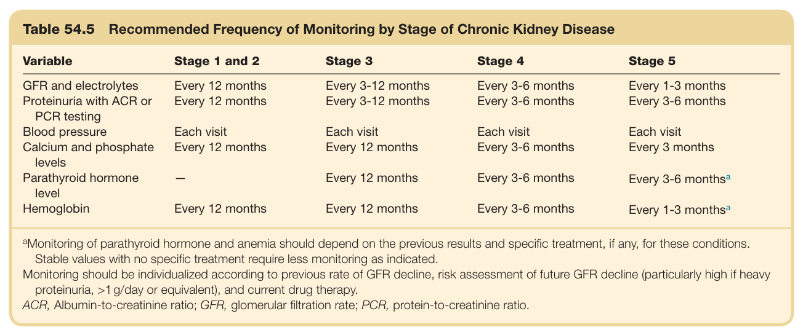

#### Table Data (CSV: [Table_54_5.csv](Table_54_5.csv))

```markdown
| Table Text (OCR) |
| :--- |
| Table 54.5  Recommended Frequency of Monitoring by Stage of Chronic Kidney Disease Variable  Stage 1 and 2  Stage 3  Stage 4  Stage 5    GFR and electrolytes  Every 12 months  Every 3-12 months  Every 3-6 months  Every 1-3 months    Proteinuria with ACR or PCR testing  Every 12 months  Every 3-12 months  Every 3-6 months  Every 3-6 months    Blood pressure  Each visit  Each visit  Each visit  Each visit    Calcium and phosphate levels  Every 12 months  Every 12 months  Every 3-6 months  Every 3 months    Parathyroid hormone level  —  Every 12 months  Every 3-6 months  Every 3-6 monthsa    Hemoglobin  Every 12 months  Every 12 months  Every 3-6 months  Every 1-3 monthsa <sup>a</sup>Monitoring of parathyroid hormone and anemia should depend on the previous results and specific treatment, if any, for these conditions. Stable values with no specific treatment require less monitoring as indicated. Monitoring should be individualized according to previous rate of GFR decline, risk assessment of future GFR decline (particularly high if heavy proteinuria, >1g/day or equivalent), and current drug therapy. ACR, Albumin-to-creatinine ratio; GFR, glomerular filtration rate; PCR, protein-to-creatinine ratio. |
```

Table 54.5 Recommended Frequency of Monitoring by Stage of Chronic Kidney Disease

---
