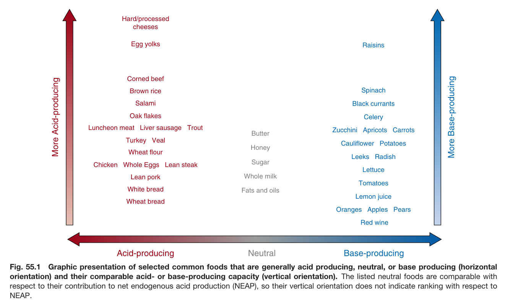
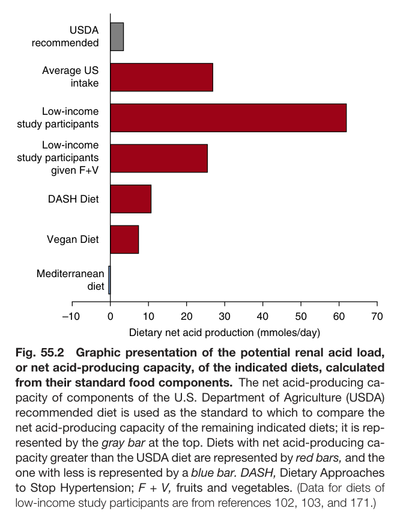
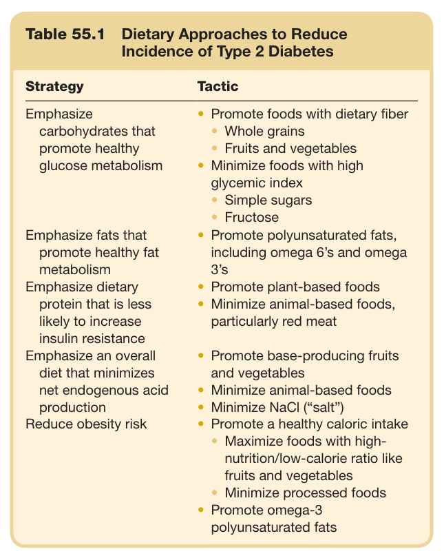
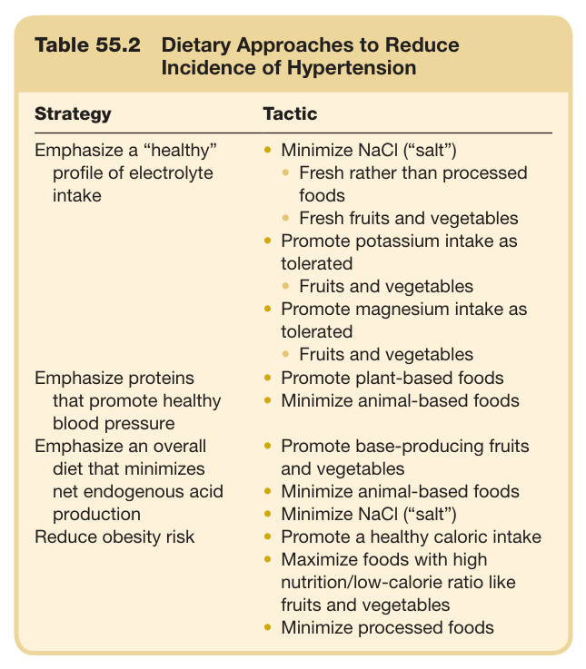
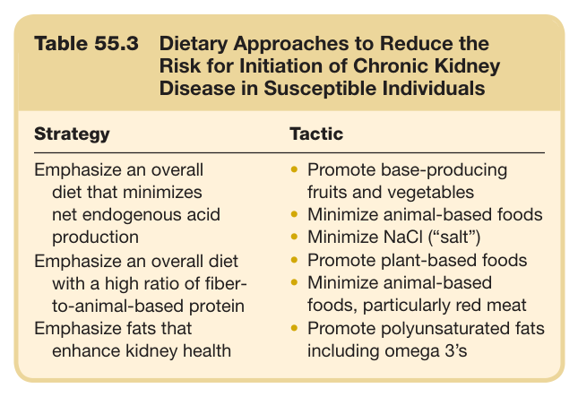
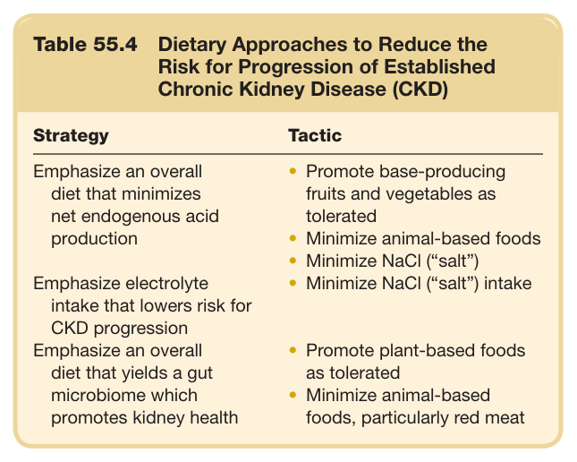
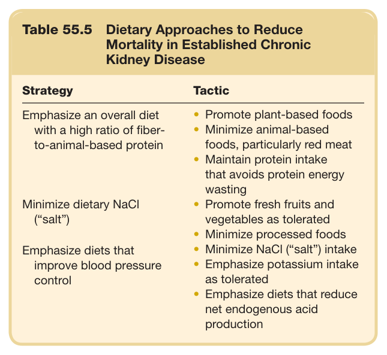
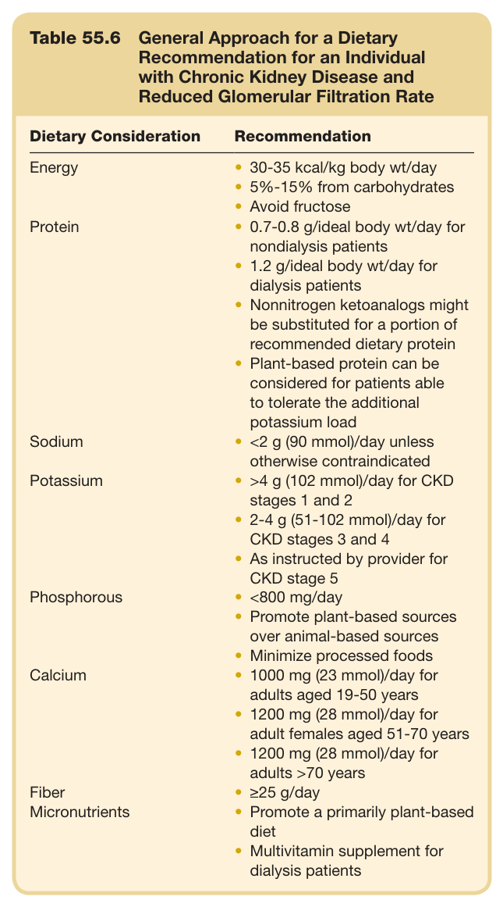
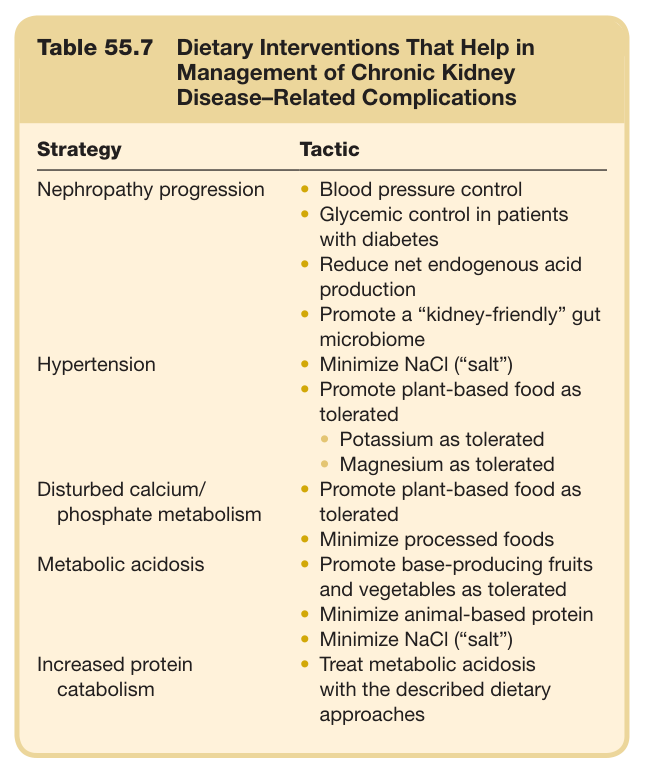
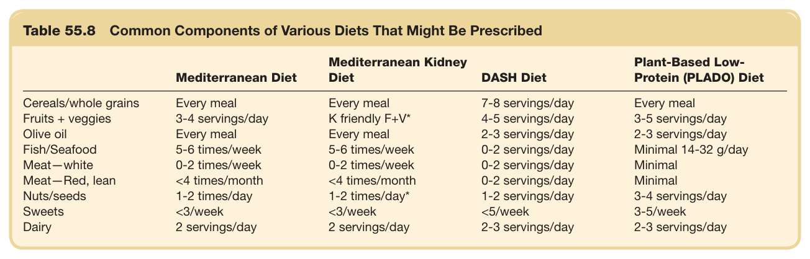

# 55. Dietary Approaches to Kidney Diseases - Figures and Tables Index

This document lists all figures and tables extracted from `55. Dietary Approaches to Kidney Diseases.pdf`.

## Table of Contents
- [Figures](#figures)
- [Tables](#tables)

---

## Figures

### Fig_55_1



Fig. 55.1 Graphic presentation of selected common foods that are generally acid producing, neutral, or base producing (horizontal orientation) and their comparable acid- or base-producing capacity (vertical orientation). The listed neutral foods are comparable with respect to their contribution to net endogenous acid production (NEAP), so their vertical orientation does not indicate ranking with respect to NEAP.

---

### Fig_55_2



Fig. 55.2 Graphic presentation of the potential renal acid load, or net acid-producing capacity, of the indicated diets, calculated from their standard food components. The net acid-producing ca- pacity of components of the U.S. Department of Agriculture (USDA) recommended diet is used as the standard to which to compare the net acid-producing capacity of the remaining indicated diets; it is rep- resented by the gray bar at the top. Diets with net acid-producing ca- pacity greater than the USDA diet are represented by red bars, and the one with less is represented by a blue bar. DASH, Dietary Approaches to Stop Hypertension; F + V, fruits and vegetables. (Data for diets of low-income study participants are from references 102, 103, and 171.)

---

## Tables

### Table_55_1

#### Table Image



#### Table Data (CSV: [Table_55_1.csv](Table_55_1.csv))

```markdown
| Table Text (OCR) |
| :--- |
| Table 55.1  Dietary Approaches to Reduce Incidence of Type 2 Diabetes Strategy  Tactic    Emphasize carbohydrates that promote healthy glucose metabolism  Promote foods with dietary fiberWhole grainsFruits and vegetablesMinimize foods with high glycemic indexSimple sugarsFructose    Emphasize fats that promote healthy fat metabolism  Promote polyunsaturated fats, including omega 6’s and omega 3’s    Emphasize dietary protein that is less likely to increase insulin resistance  Promote plant-based foodsMinimize animal-based foods, particularly red meat    Emphasize an overall diet that minimizes net endogenous acid production  Promote base-producing fruits and vegetablesMinimize animal-based foodsMinimize NaCl (“salt”)    Reduce obesity risk  Promote a healthy caloric intakeMaximize foods with high-nutrition/low-calorie ratio like fruits and vegetablesMinimize processed foodsPromote omega-3 polyunsaturated fats |
```

Table 55.1 Dietary Approaches to Reduce Incidence of Type 2 Diabetes

---

### Table_55_2

#### Table Image



#### Table Data (CSV: [Table_55_2.csv](Table_55_2.csv))

```markdown
| Table Text (OCR) |
| :--- |
| Table 55.2  Dietary Approaches to Reduce Incidence of Hypertension Strategy  Tactic    Emphasize a “healthy”profile of electrolyte intake  Minimize NaCl (“salt”)Fresh rather than processed foodsFresh fruits and vegetablesPromote potassium intake as toleratedFruits and vegetablesPromote magnesium intake as toleratedFruits and vegetables    Emphasize proteins that promote healthy blood pressure  Promote plant-based foodsMinimize animal-based foods    Emphasize an overall diet that minimizes net endogenous acid production  Promote base-producing fruits and vegetablesMinimize animal-based foodsMinimize NaCl (“salt”)    Reduce obesity risk  Promote a healthy caloric intakeMaximize foods with high nutrition/low-calorie ratio like fruits and vegetablesMinimize processed foods |
```

Table 55.2 Dietary Approaches to Reduce Incidence of Hypertension

---

### Table_55_3

#### Table Image



#### Table Data (CSV: [Table_55_3.csv](Table_55_3.csv))

```markdown
| Table Text (OCR) |
| :--- |
| Table 55.3 Dietary Approaches to Reduce the Risk for Initiation of Chronic Kidney Disease in Susceptible Individuals Strategy  Tactic    Emphasize an overall diet that minimizes net endogenous acid productionEmphasize an overall diet with a high ratio of fiber-to-animal-based proteinEmphasize fats that enhance kidney health  Promote base-producing fruits and vegetablesMinimize animal-based foodsMinimize NaCl (“salt”)Promote plant-based foodsMinimize animal-based foods, particularly red meatPromote polyunsaturated fats including omega 3’s |
```

Table 55.3 Dietary Approaches to Reduce the Risk for Initiation of Chronic Kidney Disease in Susceptible Individuals

---

### Table_55_4

#### Table Image



#### Table Data (CSV: [Table_55_4.csv](Table_55_4.csv))

```markdown
| Table Text (OCR) |
| :--- |
| Table 55.4  Dietary Approaches to Reduce the Risk for Progression of Established Chronic Kidney Disease (CKD) Strategy  Tactic    Emphasize an overall diet that minimizes net endogenous acid production  Promote base-producing fruits and vegetables as toleratedMinimize animal-based foodsMinimize NaCl (“salt”)Minimize NaCl (“salt”) intake    Emphasize electrolyte intake that lowers risk for CKD progression    Emphasize an overall diet that yields a gut microbiome which promotes kidney health  Promote plant-based foods as toleratedMinimize animal-based foods, particularly red meat |
```

Table 55.4 Dietary Approaches to Reduce the Risk for Progression of Established Chronic Kidney Disease (CKD)

---

### Table_55_5

#### Table Image



#### Table Data (CSV: [Table_55_5.csv](Table_55_5.csv))

```markdown
| Table Text (OCR) |
| :--- |
| Table 55.5 Dietary Approaches to Reduce Mortality in Established Chronic Kidney Disease Strategy  Tactic    Emphasize an overall diet with a high ratio of fiber-to-animal-based protein  Promote plant-based foodsMinimize animal-based foods, particularly red meatMaintain protein intake that avoids protein energy wasting    Minimize dietary NaCl (“salt”)  Promote fresh fruits and vegetables as toleratedMinimize processed foods    Emphasize diets that improve blood pressure control  Minimize NaCl (“salt”) intakeEmphasize potassium intake as toleratedEmphasize diets that reduce net endogenous acid production |
```

Table 55.5 Dietary Approaches to Reduce Mortality in Established Chronic Kidney Disease

---

### Table_55_6

#### Table Image



#### Table Data (CSV: [Table_55_6.csv](Table_55_6.csv))

```markdown
| Table Text (OCR) |
| :--- |
| Table 55.6  General Approach for a Dietary Recommendation for an Individual with Chronic Kidney Disease and Reduced Glomerular Filtration Rate Dietary Consideration  Recommendation    Energy  30-35 kcal/kg body wt/day5%-15% from carbohydratesAvoid fructose    Protein  0.7-0.8 g/ideal body wt/day for nondialysis patients1.2 g/ideal body wt/day for dialysis patientsNonnitrogen ketoanalogs might be substituted for a portion of recommended dietary proteinPlant-based protein can be considered for patients able to tolerate the additional potassium load    Sodium  <2 g (90 mmol)/day unless otherwise contraindicated    Potassium  >4 g (102 mmol)/day for CKD stages 1 and 22-4 g (51-102 mmol)/day for CKD stages 3 and 4As instructed by provider for CKD stage 5    Phosphorous  <800 mg/dayPromote plant-based sources over animal-based sourcesMinimize processed foods    Calcium  1000 mg (23 mmol)/day for adults aged 19-50 years1200 mg (28 mmol)/day for adult females aged 51-70 years1200 mg (28 mmol)/day for adults >70 years    Fiber  ≥25 g/day    Micronutrients  Promote a primarily plant-based dietMultivitamin supplement for dialysis patients |
```

Table 55.6 General Approach for a Dietary Recommendation for an Individual with Chronic Kidney Disease and Reduced Glomerular Filtration Rate

---

### Table_55_7

#### Table Image



#### Table Data (CSV: [Table_55_7.csv](Table_55_7.csv))

```markdown
| Table Text (OCR) |
| :--- |
| Table 55.7  Dietary Interventions That Help in Management of Chronic Kidney Disease–Related Complications Strategy  Tactic    Nephropathy progression  Blood pressure controlGlycemic control in patients with diabetesReduce net endogenous acid productionPromote a “kidney-friendly” gut microbiome    Hypertension  Minimize NaCl (“salt”)Promote plant-based food as toleratedPotassium as toleratedMagnesium as tolerated    Disturbed calcium/phosphate metabolism  Promote plant-based food as toleratedMinimize processed foods    Metabolic acidosis  Promote base-producing fruits and vegetables as toleratedMinimize animal-based proteinMinimize NaCl (“salt”)    Increased protein catabolism  Treat metabolic acidosis with the described dietary approaches |
```

Table 55.7 Dietary Interventions That Help in Management of Chronic Kidney Disease–Related Complications

---

### Table_55_8

#### Table Image



#### Table Data (CSV: [Table_55_8.csv](Table_55_8.csv))

```markdown
| Table Text (OCR) |
| :--- |
| Table 55.8 Common Components of Various Diets That Might Be Prescribed Mediterranean Diet  Mediterranean Kidney Diet  DASH Diet  Plant-Based Low-Protein (PLADO) Diet    Cereals/whole grains  Every meal  Every meal  7-8 servings/day  Every meal    Fruits + veggies  3-4 servings/day  K friendly F+V*  4-5 servings/day  3-5 servings/day    Olive oil  Every meal  Every meal  2-3 servings/day  2-3 servings/day    Fish/Seafood  5-6 times/week  5-6 times/week  0-2 servings/day  Minimal 14-32 g/day    Meat—white  0-2 times/week  0-2 times/week  0-2 servings/day  Minimal    Meat—Red, lean  <4 times/month  <4 times/month  0-2 servings/day  Minimal    Nuts/seeds  1-2 times/day  1-2 times/day*  1-2 servings/day  3-4 servings/day    Sweets  <3/week  <3/week  <5/week  3-5/week    Dairy  2 servings/day  2 servings/day  2-3 servings/day  2-3 servings/day |
```

Table 55.8 Common Components of Various Diets That Might Be Prescribed

---
