# 56. Drug Dosing Considerations in Patients With Acute Kidney Injury and Chronic Kidney Disease - Figures and Tables Index

This document lists all figures and tables extracted from `56. Drug Dosing Considerations in Patients With Acute Kidney Injury and Chronic Kidney Disease.pdf`.

## Table of Contents
- [Figures](#figures)
- [Tables](#tables)

---

## Figures

### Fig_56_1

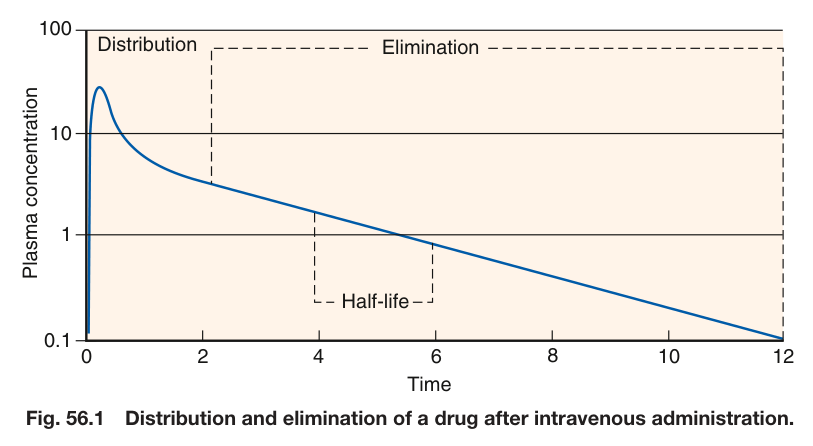

Fig. 56.1 Distribution and elimination of a drug after intravenous administration.

---

### Fig_56_2

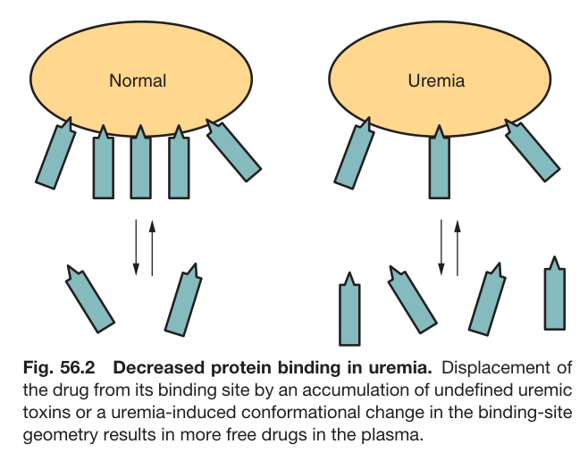

Fig. 56.2 Decreased protein binding in uremia. Displacement of the drug from its binding site by an accumulation of undefined uremic toxins or a uremia-induced conformational change in the binding-site geometry results in more free drugs in the plasma.

---

### Fig_56_3

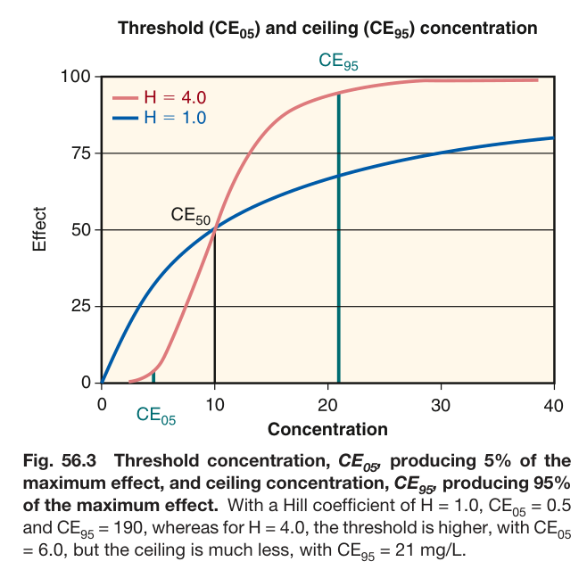

Fig. 56.3 Threshold concentration, CE , producing 5% of the maximum effect, and ceiling concentration, CE , producing 95% of the maximum effect. With a Hill coefficient of H = 1.0, CE<sub>05</sub> = 0.5 and CE<sub>95</sub> = 190, whereas for H = 4.0, the threshold is higher, with CE<sub>05</sub> = 6.0, but the ceiling is much less, with CE = 21 mg/L.

---

### Fig_56_4

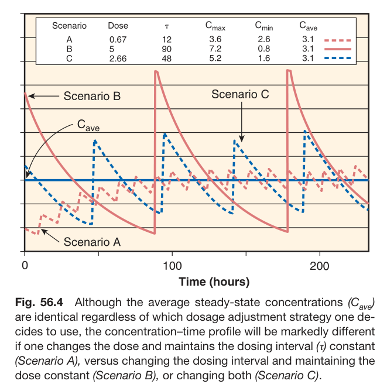

Fig. 56.4 Although the average steady-state concentrations (C ) are identical regardless of which dosage adjustment strategy one de- cides to use, the concentration–time profile will be markedly different if one changes the dose and maintains the dosing interval (τ) constant (Scenario A), versus changing the dosing interval and maintaining the dose constant (Scenario B), or changing both (Scenario C).

---

### Fig_56_5

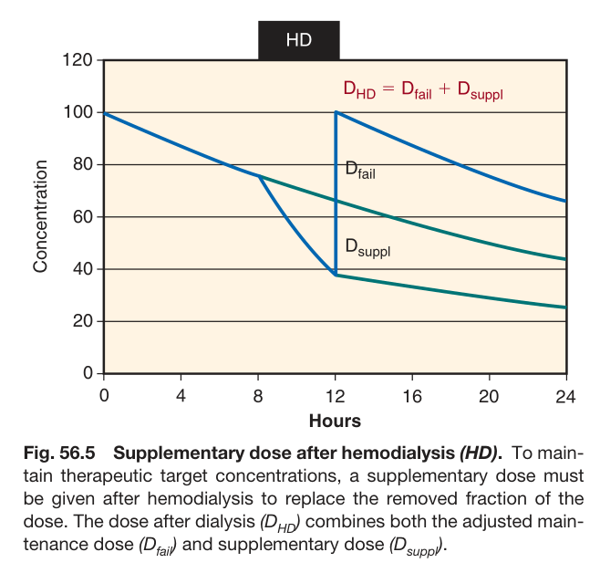

Fig. 56.5 Supplementary dose after hemodialysis (HD). To main- tain therapeutic target concentrations, a supplementary dose must be given after hemodialysis to replace the removed fraction of the dose. The dose after dialysis (D<sub>HD</sub>) combines both the adjusted main- tenance dose (D<sub>fail</sub>) and supplementary dose (D<sub>suppl</sub>).

---

## Tables

### Table_56_1

#### Table Image

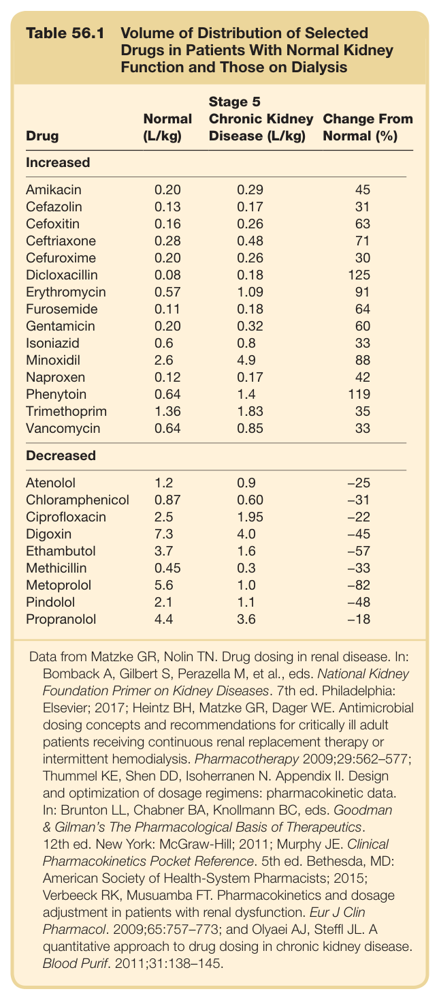

#### Table Data (CSV: [Table_56_1.csv](Table_56_1.csv))

```markdown
| Table Text (OCR) |
| :--- |
| Table 56.1  Volume of Distribution of Selected Drugs in Patients With Normal Kidney Function and Those on Dialysis Drug  Normal (L/kg)  Stage 5 Chronic Kidney Disease (L/kg)  Change From Normal (%)    Increased    Amikacin  0.20  0.29  45    Cefazolin  0.13  0.17  31    Cefoxitin  0.16  0.26  63    Ceftriaxone  0.28  0.48  71    Cefuroxime  0.20  0.26  30    Dicloxacillin  0.08  0.18  125    Erythromycin  0.57  1.09  91    Furosemide  0.11  0.18  64    Gentamicin  0.20  0.32  60    Isoniazid  0.6  0.8  33    Minoxidil  2.6  4.9  88    Naproxen  0.12  0.17  42    Phenytoin  0.64  1.4  119    Trimethoprim  1.36  1.83  35    Vancomycin  0.64  0.85  33    Decreased    Atenolol  1.2  0.9  -25    Chloramphenicol  0.87  0.60  -31    Ciprofloxacin  2.5  1.95  -22    Digoxin  7.3  4.0  -45    Ethambutol  3.7  1.6  -57    Methicillin  0.45  0.3  -33    Metoprolol  5.6  1.0  -82    Pindolol  2.1  1.1  -48    Propranolol  4.4  3.6  -18 |
```

Table 56.1 Volume of Distribution of Selected Drugs in Patients With Normal Kidney Function and Those on Dialysis

---

### Table_56_2

#### Table Image

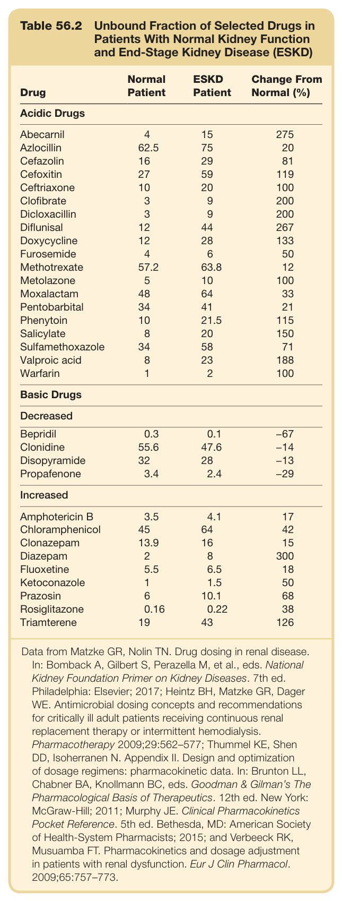

#### Table Data (CSV: [Table_56_2.csv](Table_56_2.csv))

```markdown
| Table Text (OCR) |
| :--- |
| Table 56.2  Unbound Fraction of Selected Drugs in Patients With Normal Kidney Function and End-Stage Kidney Disease (ESKD) Drug  Normal Patient  ESKD Patient  Change From Normal (%)    Acidic Drugs    Abecarnil  4  15  275    Azlocillin  62.5  75  20    Cefazolin  16  29  81    Cefoxitin  27  59  119    Ceftriaxone  10  20  100    Clofibrate  3  9  200    Dicloxacillin  3  9  200    Diflunisal  12  44  267    Doxycycline  12  28  133    Furosemide  4  6  50    Methotrexate  57.2  63.8  12    Metolazone  5  10  100    Moxalactam  48  64  33    Pentobarbital  34  41  21    Phenytoin  10  21.5  115    Salicylate  8  20  150    Sulfamethoxazole  34  58  71    Valproic acid  8  23  188    Warfarin  1  2  100    Basic Drugs    Decreased    Bepridil  0.3  0.1  -67    Clonidine  55.6  47.6  -14    Disopyramide  32  28  -13    Propafenone  3.4  2.4  -29    Increased    Amphotericin B  3.5  4.1  17    Chloramphenicol  45  64  42    Clonazepam  13.9  16  15    Diazepam  2  8  300    Fluoxetine  5.5  6.5  18    Ketoconazole  1  1.5  50    Prazosin  6  10.1  68    Rosiglitazone  0.16  0.22  38    Triamterene  19  43  126 |
```

Table 56.2 Unbound Fraction of Selected Drugs in Patients With Normal Kidney Function and End-Stage Kidney Disease (ESKD)

---

### Table_56_3

#### Table Image

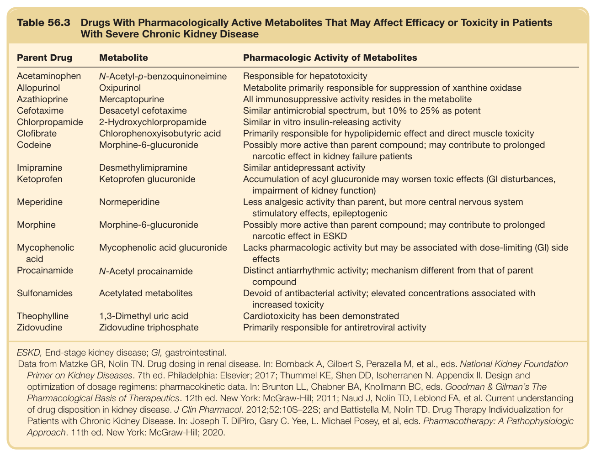

#### Table Data (CSV: [Table_56_3.csv](Table_56_3.csv))

```markdown
| Table Text (OCR) |
| :--- |
| Table 56.3 Drugs With Pharmacologically Active Metabolites That May Affect Efficacy or Toxicity in Patients With Severe Chronic Kidney Disease Parent Drug  Metabolite  Pharmacologic Activity of Metabolites    Acetaminophen  N-Acetyl-p-benzoquinoneimine  Responsible for hepatotoxicity    Allopurinol  Oxipurinol  Metabolite primarily responsible for suppression of xanthine oxidase    Azathioprine  Mercaptopurine  All immunosuppressive activity resides in the metabolite    Cefotaxime  Desacetyl cefotaxime  Similar antimicrobial spectrum, but 10% to 25% as potent    Chlorpropamide  2-Hydroxychlorpropamide  Similar in vitro insulin-releasing activity    Clofibrate  Chlorophenoxyisobutyric acid  Primarily responsible for hypolipidemic effect and direct muscle toxicity    Codeine  Morphine-6-glucuronide  Possibly more active than parent compound; may contribute to prolonged narcotic effect in kidney failure patients    Imipramine  Desmethylimipramine  Similar antidepressant activity    Ketoprofen  Ketoprofen glucuronide  Accumulation of acyl glucuronide may worsen toxic effects (GI disturbances, impairment of kidney function)    Meperidine  Normeperidine  Less analgesic activity than parent, but more central nervous system stimulatory effects, epileptogenic    Morphine  Morphine-6-glucuronide  Possibly more active than parent compound; may contribute to prolonged narcotic effect in ESKD    Mycophenolic acid  Mycophenolic acid glucuronide  Lacks pharmacologic activity but may be associated with dose-limiting (GI) side effects    Procainamide  N-Acetyl procainamide  Distinct antiarrhythmic activity; mechanism different from that of parent compound    Sulfonamides  Acetylated metabolites  Devoid of antibacterial activity; elevated concentrations associated with increased toxicity    Theophylline  1,3-Dimethyl uric acid  Cardiotoxicity has been demonstrated    Zidovudine  Zidovudine triphosphate  Primarily responsible for antiretroviral activity ESKD, End-stage kidney disease; GI, gastrointestinal. Data from Matzke GR, Nolin TN. Drug dosing in renal disease. In: Bomback A, Gilbert S, Perazella M, et al., eds. National Kidney Foundation Primer on Kidney Diseases. 7th ed. Philadelphia: Elsevier; 2017; Thummel KE, Shen DD, Isoherranen N. Appendix II. Design and optimization of dosage regimens: pharmacokinetic data. In: Brunton LL, Chabner BA, Knollmann BC, eds. Goodman & Gilman’s The Pharmacological Basis of Therapeutics. 12th ed. New York: McGraw-Hill; 2011; Naud J, Nolin TD, Leblond FA, et al. Current understanding of drug disposition in kidney disease. J Clin Pharmacol. 2012;52:10S–22S; and Battistella M, Nolin TD. Drug Therapy Individualization for Patients with Chronic Kidney Disease. In: Joseph T. DiPiro, Gary C. Yee, L. Michael Posey, et al, eds. Pharmacotherapy: A Pathophysiologic Approach. 11th ed. New York: McGraw-Hill; 2020. |
```

Table 56.3 Drugs With Pharmacologically Active Metabolites That May Affect Efficacy or Toxicity in Patients With Severe Chronic Kidney Disease

---

### Table_56_4

#### Table Image

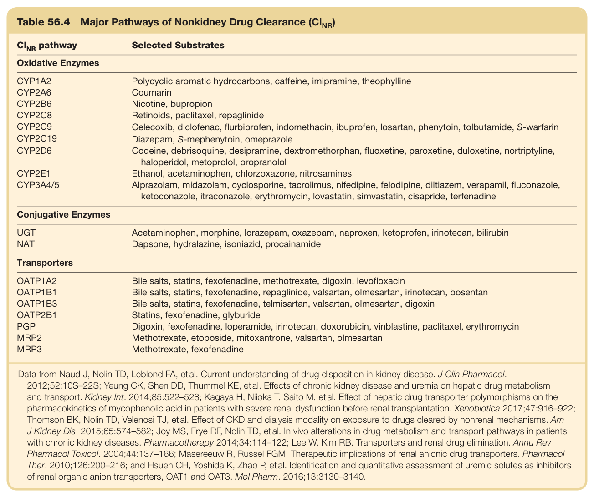

#### Table Data (CSV: [Table_56_4.csv](Table_56_4.csv))

```markdown
| Table Text (OCR) |
| :--- |
| Table 56.4  Major Pathways of Nonkidney Drug Clearance (Cl<sub>NR</sub>) CI_{NR}  pathway  Selected Substrates    Oxidative Enzymes    CYP1A2  Polycyclic aromatic hydrocarbons, caffeine, imipramine, theophylline    CYP2A6  Coumarin    CYP2B6  Nicotine, bupropion    CYP2C8  Retinoids, paclitaxel, repaglinide    CYP2C9  Celecoxib, diclofenac, flurbiprofen, indomethacin, ibuprofen, losartan, phenytoin, tolbutamide, S-warfarin    CYP2C19  Diazepam, S-mephenytoin, omeprazole    CYP2D6  Codeine, debrisoquine, desipramine, dextromethorphan, fluoxetine, paroxetine, duloxetine, nortriptyline, haloperidol, metoprolol, propranolol    CYP2E1  Ethanol, acetaminophen, chlorzoxazone, nitrosamines    CYP3A4/5  Alprazolam, midazolam, cyclosporine, tacrolimus, nifedipine, felodipine, diltiazem, verapamil, fluconazole, ketoconazole, itraconazole, erythromycin, lovastatin, simvastatin, cisapride, terfenadine    Conjugative Enzymes    UGT  Acetaminophen, morphine, lorazepam, oxazepam, naproxen, ketoprofen, irinotecan, bilirubin    NAT  Dapsone, hydralazine, isoniazid, procainamide    Transporters    OATP1A2  Bile salts, statins, fexofenadine, methotrexate, digoxin, levofloxacin    OATP1B1  Bile salts, statins, fexofenadine, repaglinide, valsartan, olmesartan, irinotecan, bosentan    OATP1B3  Bile salts, statins, fexofenadine, telmisartan, valsartan, olmesartan, digoxin    OATP2B1  Statins, fexofenadine, glyburide    PGP  Digoxin, fexofenadine, loperamide, irinotecan, doxorubicin, vinblastine, paclitaxel, erythromycin    MRP2  Methotrexate, etoposide, mitoxantrone, valsartan, olmesartan    MRP3  Methotrexate, fexofenadine    Data from Naud J, Nolin TD, Leblond FA, et al. Current understanding of drug disposition in kidney disease. J Clin Pharmacol. 2012;52:10S-22S; Yeung CK, Shen DD, Thummel KE, et al. Effects of chronic kidney disease and uremia on hepatic drug metabolism and transport. Kidney Int. 2014;85:522-528; Kagaya H, Niioka T, Saito M, et al. Effect of hepatic drug transporter polymorphisms on the pharmacokinetics of mycophenolic acid in patients with severe renal dysfunction before renal transplantation. Xenobiotica 2017;47:916-922; Thomson BK, Nolin TD, Velenosi TJ, et al. Effect of CKD and dialysis modality on exposure to drugs cleared by nonrenal mechanisms. Am J Kidney Dis. 2015;65:574-582; Joy MS, Frye RF, Nolin TD, et al. In vivo alterations in drug metabolism and transport pathways in patients with chronic kidney diseases. Pharmacotherapy 2014;34:114-122; Lee W, Kim RB. Transporters and renal drug elimination. Annu Rev Pharmacol Toxicol. 2004;44:137-166; Masereeuw R, Russel FGM. Therapeutic implications of renal anionic drug transporters. Pharmacol Ther. 2010;126:200-216; and Hsueh CH, Yoshida K, Zhao P, et al. Identification and quantitative assessment of uremic solutes as inhibitors of renal organic anion transporters, OAT1 and OAT3. Mol Pharm. 2016;13:3130-3140. |
```

Table 56.4 Major Pathways of Nonkidney Drug Clearance (Cl<sub>NR</sub>)

---

### Table_56_5

#### Table Image

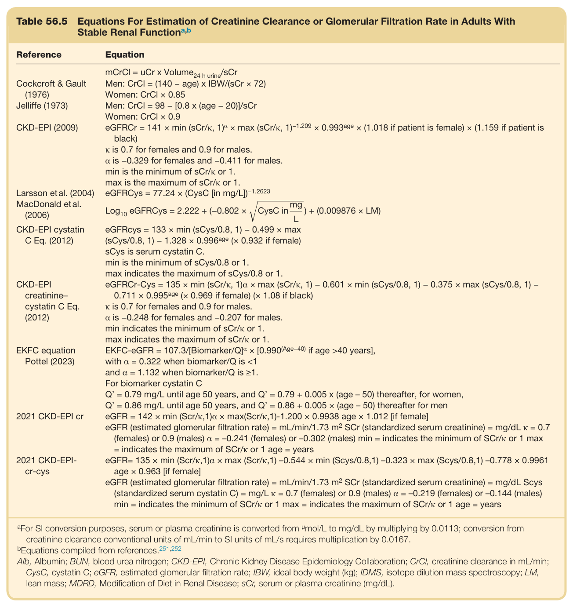

#### Table Data (CSV: [Table_56_5.csv](Table_56_5.csv))

```markdown
| Table Text (OCR) |
| :--- |
| Table 56.5 Equations For Estimation of Creatinine Clearance or Glomerular Filtration Rate in Adults With Stable Renal Function<sup>a,b</sup> Reference  Equation      mCrCl = uCr x  Volume_{24\text{h urine}}/sCr     Cockcroft & Gault(1976)  Men: CrCl = (140 - age) x IBW/(sCr × 72)    Women: CrCl × 0.85    Jelliffe (1973)  Men: CrCl = 98 - [0.8 x (age - 20)]/sCr    Women: CrCl × 0.9    CKD-EPI (2009)  eGFRCr = 141 × min (sCr/κ, 1) ^{\alpha}  × max (sCr/κ, 1) ^{-1.209}  × 0.993 ^{age}  × (1.018 if patient is female) × (1.159 if patient is black)    κ is 0.7 for females and 0.9 for males.    α is -0.329 for females and -0.411 for males.    min is the minimum of sCr/κ or 1.    max is the maximum of sCr/κ or 1.    Larsson et al. (2004)  eGFRCys = 77.24 × (CysC [in mg/L]) ^{-1.2623}     MacDonald et al.(2006)   Log_{10}  eGFRCys = 2.222 + (-0.802 ×  \sqrt{CysC\ in\ \frac{mg}{L}} ) + (0.009876 × LM)    CKD-EPI cystatinC Eq. (2012)  eGFRCys = 133 × min (sCys/0.8, 1) - 0.499 × max (sCys/0.8, 1) - 1.328 × 0.996 ^{age}  (× 0.932 if female)    sCys is serum cystatin C.    min is the minimum of sCys/0.8 or 1.    max indicates the maximum of sCys/0.8 or 1.    CKD-EPIcreatinine-cystatin C Eq.(2012)  eGFRCr-Cys = 135 × min (sCr/κ, 1)α × max (sCr/κ, 1) - 0.601 × min (sCys/0.8, 1) - 0.375 × max (sCys/0.8, 1) - 0.711 × 0.995 ^{age}  (× 0.969 if female) (× 1.08 if black)    κ is 0.7 for females and 0.9 for males.    α is -0.248 for females and -0.207 for males.    min indicates the minimum of sCr/κ or 1.    max indicates the maximum of sCr/κ or 1.    EKFC equationPottel (2023)  EKFC-eGFR = 107.3/[Biomarker/Q] ^{\alpha}  × [0.990 ^{(Age-40)}  if age >40 years],with α = 0.322 when biomarker/Q is <1and α = 1.132 when biomarker/Q is ≥1.    For biomarker cystatin C    Q' = 0.79 mg/L until age 50 years, and Q' = 0.79 + 0.005 x (age - 50) thereafter, for women,Q' = 0.86 mg/L until age 50 years, and Q' = 0.86 + 0.005 x (age - 50) thereafter for men    2021 CKD-EPI cr  eGFR = 142 × min (Scr/κ,1)α × max(Scr/κ,1)-1.200 × 0.9938 age × 1.012 [if female]    eGFR (estimated glomerular filtration rate) = mL/min/1.73 m2 SCr (standardized serum creatinine) = mg/dL κ = 0.7 (females) or 0.9 (males) α = -0.241 (females) or -0.302 (males) min = indicates the minimum of SCr/κ or 1 max = indicates the maximum of SCr/κ or 1 age = years    2021 CKD-EPI-cr-cys  eGFR= 135 × min (Scr/κ,1)α × max (Scr/κ,1) -0.544 × min (Scys/0.8,1) -0.323 × max (Scys/0.8,1) -0.778 × 0.9961 age × 0.963 [if female]    eGFR (estimated glomerular filtration rate) = mL/min/1.73 m2 SCr (standardized serum creatinine) = mg/dL Scys (standardized serum cystatin C) = mg/L κ = 0.7 (females) or 0.9 (males) α = -0.219 (females) or -0.144 (males) min = indicates the minimum of SCr/κ or 1 max = indicates the maximum of SCr/κ or 1 age = years <sup>a</sup>For SI conversion purposes, serum or plasma creatinine is converted from <sup>μ</sup>mol/L to mg/dL by multiplying by 0.0113; conversion from creatinine clearance conventional units of mL/min to SI units of mL/s requires multiplication by 0.0167. <sup>b</sup>Equations compiled from references.<sup>251,252</sup> Alb, Albumin; BUN, blood urea nitrogen; CKD-EPI, Chronic Kidney Disease Epidemiology Collaboration; CrCl, creatinine clearance in mL/min; CysC, cystatin C; eGFR, estimated glomerular filtration rate; IBW, ideal body weight (kg); IDMS, isotope dilution mass spectroscopy; LM, lean mass; MDRD, Modification of Diet in Renal Disease; sCr, serum or plasma creatinine (mg/dL). |
```

Table 56.5 Equations For Estimation of Creatinine Clearance or Glomerular Filtration Rate in Adults With Stable Renal Function<sup>a,b</sup>

---

### Table_56_6

#### Table Image

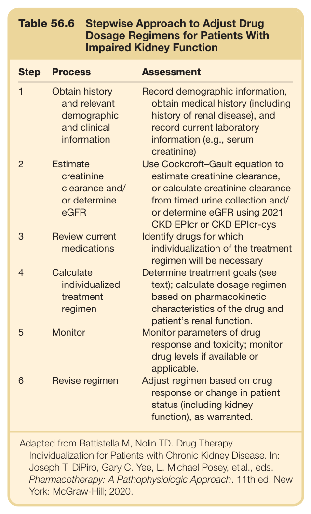

#### Table Data (CSV: [Table_56_6.csv](Table_56_6.csv))

```markdown
| Table Text (OCR) |
| :--- |
| Table 56.6  Stepwise Approach to Adjust Drug Dosage Regimens for Patients With Impaired Kidney Function Step  Process  Assessment    1  Obtain history and relevant demographic and clinical information  Record demographic information, obtain medical history (including history of renal disease), and record current laboratory information (e.g., serum creatinine)    2  Estimate creatinine clearance and/or determine eGFR  Use Cockcroft-Gault equation to estimate creatinine clearance, or calculate creatinine clearance from timed urine collection and/or determine eGFR using 2021 CKD EPIcr or CKD EPIcr-cys    3  Review current medications  Identify drugs for which individualization of the treatment regimen will be necessary    4  Calculate individualized treatment regimen  Determine treatment goals (see text); calculate dosage regimen based on pharmacokinetic characteristics of the drug and patient’s renal function.    5  Monitor  Monitor parameters of drug response and toxicity; monitor drug levels if available or applicable.    6  Revise regimen  Adjust regimen based on drug response or change in patient status (including kidney function), as warranted. Adapted from Battistella M, Nolin TD. Drug Therapy Individualization for Patients with Chronic Kidney Disease. In: Joseph T. DiPiro, Gary C. Yee, L. Michael Posey, et al., eds. Pharmacotherapy: A Pathophysiologic Approach. 11th ed. New York: McGraw-Hill; 2020. |
```

Table 56.6 Stepwise Approach to Adjust Drug Dosage Regimens for Patients With Impaired Kidney Function

---

### Table_56_7

#### Table Image

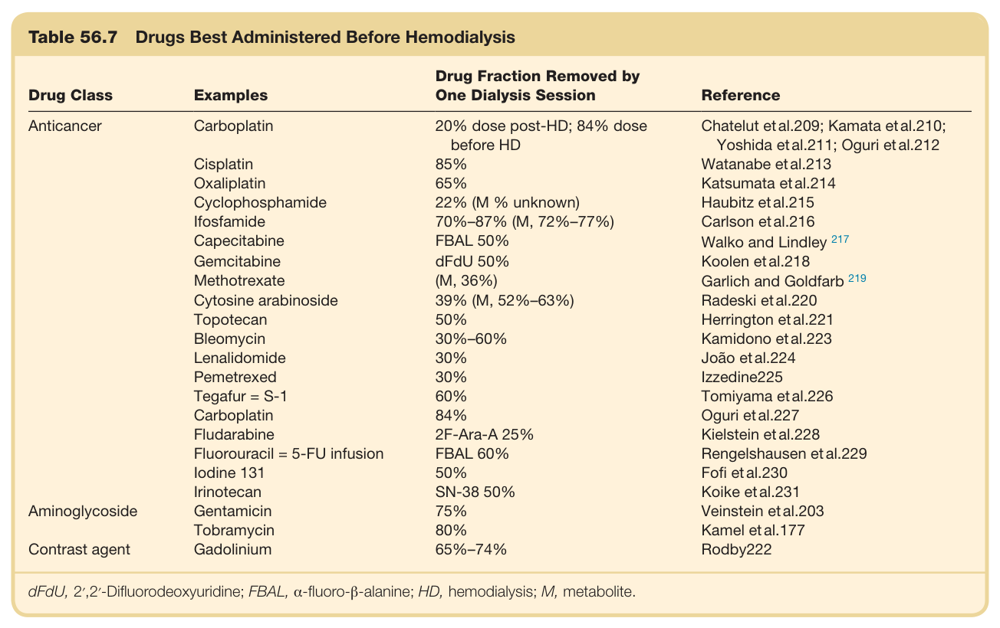

#### Table Data (CSV: [Table_56_7.csv](Table_56_7.csv))

```markdown
| Table Text (OCR) |
| :--- |
| Table 56.7  Drugs Best Administered Before Hemodialysis Drug Class  Examples  Drug Fraction Removed by One Dialysis Session  Reference    Anticancer  Carboplatin  20% dose post-HD; 84% dose before HD  Chatelut et al.209; Kamata et al.210; Yoshida et al.211; Oguri et al.212    Cisplatin  85%  Watanabe et al.213    Oxaliplatin  65%  Katsumata et al.214    Cyclophosphamide  22% (M % unknown)  Haubitz et al.215    Ifosfamide  70%-87% (M, 72%-77%)  Carlson et al.216    Capecitabine  FBAL 50%  Walko and Lindley 217    Gemcitabine  dFdU 50%  Koolen et al.218    Methotrexate  (M, 36%)  Garlich and Goldfarb 219    Cytosine arabinoside  39% (M, 52%-63%)  Radeski et al.220    Topotecan  50%  Herrington et al.221    Bleomycin  30%-60%  Kamidono et al.223    Lenalidomide  30%  João et al.224    Pemetrexed  30%  Izzedine225    Tegafur = S-1  60%  Tomiyama et al.226    Carboplatin  84%  Oguri et al.227    Fludarabine  2F-Ara-A 25%  Kielstein et al.228    Fluorouracil = 5-FU infusion  FBAL 60%  Rengelshausen et al.229    Iodine 131  50%  Fofi et al.230    Irinotecan  SN-38 50%  Koike et al.231    Aminoglycoside  Gentamicin  75%  Veinstein et al.203    Tobramycin  80%  Kamel et al.177    Contrast agent  Gadolinium  65%-74%  Rodby222 dFdU, 2′,2′-Difluorodeoxyuridine; FBAL, α-fluoro-β-alanine; HD, hemodialysis; M, metabolite. |
```

Table 56.7 Drugs Best Administered Before Hemodialysis

---

### Table_56_8

#### Table Images (6 Parts)

- **Part 1 (Page 19)**:
  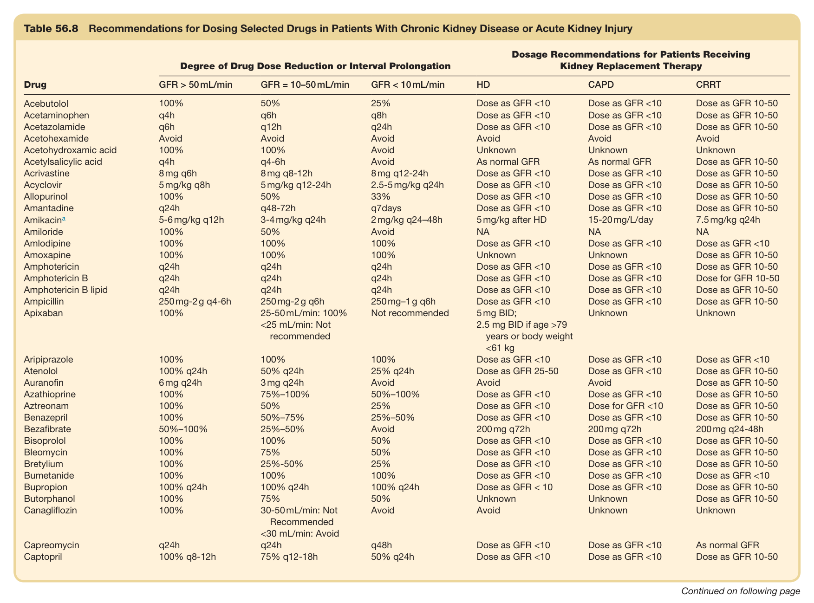

- **Part 2 (Page 20)**:
  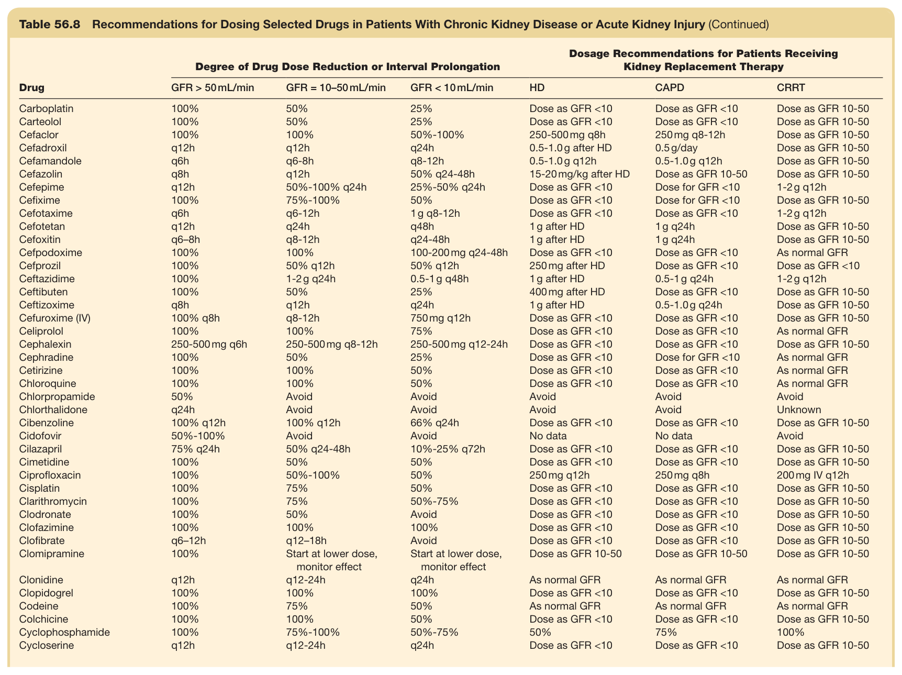

- **Part 3 (Page 21)**:
  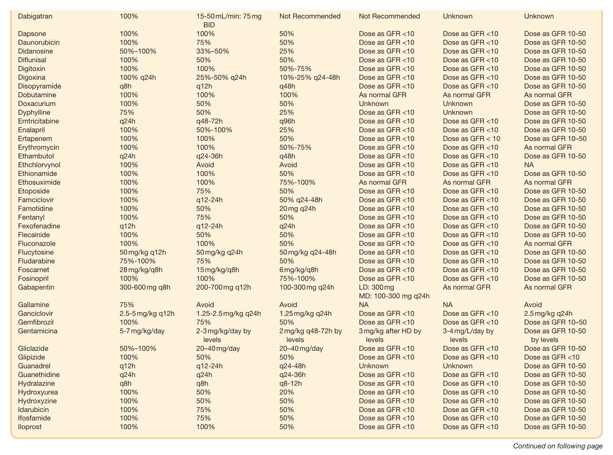

- **Part 4 (Page 22)**:
  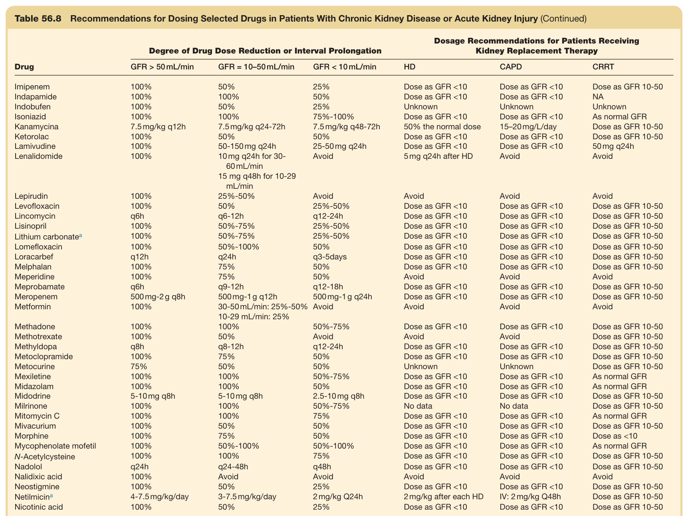

- **Part 5 (Page 23)**:
  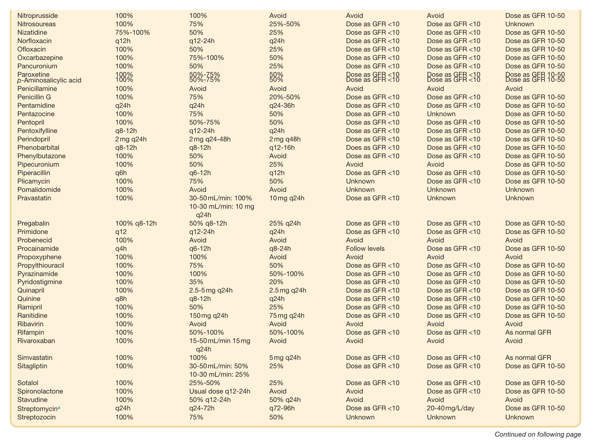

- **Part 6 (Page 24)**:
  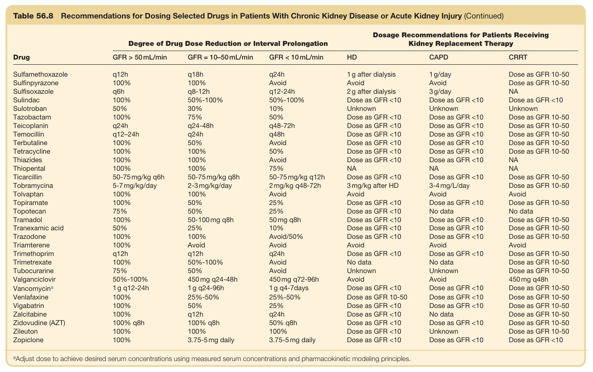

#### Table Data (CSV: [Table_56_8.csv](Table_56_8.csv))

```markdown
| Table Text (OCR) |
| :--- |
| Table 56.8Recommendations for Dosing Selected Drugs in Patients With Chronic Kidney Disease or Acute Kidney Injury Drug  Degree of Drug Dose Reduction or Interval Prolongation  Dosage Recommendations for Patients Receiving Kidney Replacement Therapy    GFR > 50 mL/min  GFR = 10-50 mL/min  GFR < 10 mL/min  HD  CAPD  CRRT    Acebutolol  100%  50%  25%  Dose as GFR <10  Dose as GFR <10  Dose as GFR 10-50    Acetaminophen  q4h  q6h  q8h  Dose as GFR <10  Dose as GFR <10  Dose as GFR 10-50    Acetazolamide  q6h  q12h  q24h  Dose as GFR <10  Dose as GFR <10  Dose as GFR 10-50    Acetohexamide  Avoid  Avoid  Avoid  Avoid  Avoid  Avoid    Acetohydroxamic acid  100%  100%  Avoid  Unknown  Unknown  Unknown    Acetylsalicylic acid  q4h  q4-6h  Avoid  As normal GFR  As normal GFR  Dose as GFR 10-50    Acrivastine  8 mg q6h  8 mg q8-12h  8 mg q12-24h  Dose as GFR <10  Dose as GFR <10  Dose as GFR 10-50    Acyclovir  5 mg/kg q8h  5 mg/kg q12-24h  2.5-5 mg/kg q24h  Dose as GFR <10  Dose as GFR <10  Dose as GFR 10-50    Allopurinol  100%  50%  33%  Dose as GFR <10  Dose as GFR <10  Dose as GFR 10-50    Amantadine  q24h  q48-72h  q7days  Dose as GFR <10  Dose as GFR <10  Dose as GFR 10-50    Amikacina  5-6 mg/kg q12h  3-4 mg/kg q24h  2 mg/kg q24-48h  5 mg/kg after HD  15-20 mg/L/day  7.5 mg/kg q24h    Amiloride  100%  50%  Avoid  NA  NA  NA    Amlodipine  100%  100%  100%  Dose as GFR <10  Dose as GFR <10  Dose as GFR <10    Amoxapine  100%  100%  100%  Unknown  Unknown  Dose as GFR 10-50    Amphotericin  q24h  q24h  q24h  Dose as GFR <10  Dose as GFR <10  Dose as GFR 10-50    Amphotericin B  q24h  q24h  q24h  Dose as GFR <10  Dose as GFR <10  Dose for GFR 10-50    Amphotericin B lipid  q24h  q24h  q24h  Dose as GFR <10  Dose as GFR <10  Dose as GFR 10-50    Ampicillin  250 mg-2 g q4-6h  250 mg-2 g q6h  250 mg-1 g q6h  Dose as GFR <10  Dose as GFR <10  Dose as GFR 10-50    Apixaban  100%  25-50 mL/min: 100%<25 mL/min: Not recommended  Not recommended  5 mg BID;2.5 mg BID if age >79 years or body weight <61 kg  Unknown  Unknown    Aripiprazole  100%  100%  100%  Dose as GFR <10  Dose as GFR <10  Dose as GFR <10    Atenolol  100% q24h  50% q24h  25% q24h  Dose as GFR 25-50  Dose as GFR <10  Dose as GFR 10-50    Auranofin  6 mg q24h  3 mg q24h  Avoid  Avoid  Avoid  Dose as GFR 10-50    Azathioprine  100%  75%-100%  50%-100%  Dose as GFR <10  Dose as GFR <10  Dose as GFR 10-50    Aztreonam  100%  50%  25%  Dose as GFR <10  Dose for GFR <10  Dose as GFR 10-50    Benazepril  100%  50%-75%  25%-50%  Dose as GFR <10  Dose as GFR <10  Dose as GFR 10-50    Bezafibrate  50%-100%  25%-50%  Avoid  200 mg q72h  200 mg q72h  200 mg q24-48h    Bisoprolol  100%  100%  50%  Dose as GFR <10  Dose as GFR <10  Dose as GFR 10-50    Bleomycin  100%  75%  50%  Dose as GFR <10  Dose as GFR <10  Dose as GFR 10-50    Bretylium  100%  25%-50%  25%  Dose as GFR <10  Dose as GFR <10  Dose as GFR 10-50    Bumetanide  100%  100%  100%  Dose as GFR <10  Dose as GFR <10  Dose as GFR <10    Bupropion  100% q24h  100% q24h  100% q24h  Dose as GFR <10  Dose as GFR <10  Dose as GFR 10-50    Butorphanol  100%  75%  50%  Unknown  Unknown  Dose as GFR 10-50    Canagliflozin  100%  30-50 mL/min: Not Recommended<30 mL/min: Avoid  Avoid  Avoid  Unknown  Unknown    Capreomycin  q24h  q24h  q48h  Dose as GFR <10  Dose as GFR <10  As normal GFR    Captopril  100% q8-12h  75% q12-18h  50% q24h  Dose as GFR <10  Dose as GFR <10  Dose as GFR 10-50    Carboplatin  100%  50%  25%  Dose as GFR <10  Dose as GFR <10  Dose as GFR 10-50    Carteolol  100%  50%  25%  Dose as GFR <10  Dose as GFR <10  Dose as GFR 10-50    Cefaclor  100%  100%  50%-100%  250-500 mg q8h  250 mg q8-12h  Dose as GFR 10-50    Cefadroxil  q12h  q12h  q24h  0.5-1.0g after HD  0.5 g/day  Dose as GFR 10-50    Cefamandole  q6h  q6-8h  q8-12h  0.5-1.0g q12h  0.5-1.0g q12h  Dose as GFR 10-50    Cefazolin  q8h  q12h  50% q24-48h  15-20 mg/kg after HD  Dose as GFR 10-50  Dose as GFR 10-50    Cefepime  q12h  50%-100% q24h  25%-50% q24h  Dose as GFR <10  Dose for GFR <10  1-2 g q12h    Cefixime  100%  75%-100%  50%  Dose as GFR <10  Dose for GFR <10  Dose as GFR 10-50    Cefotaxime  q6h  q6-12h  1 g q8-12h  Dose as GFR <10  Dose as GFR <10  1-2 g q12h    Cefotetan  q12h  q24h  q48h  1 g after HD  1 g q24h  Dose as GFR 10-50    Cefoxitin  q6-8h  q8-12h  q24-48h  1 g after HD  1 g q24h  Dose as GFR 10-50    Cefpodoxime  100%  100%  100-200 mg q24-48h  Dose as GFR <10  Dose as GFR <10  As normal GFR    Cefprozil  100%  50% q12h  50% q12h  250 mg after HD  Dose as GFR <10  Dose as GFR <10    Ceftazidime  100%  1-2 g q24h  0.5-1 g q48h  1 g after HD  0.5-1 g q24h  1-2 g q12h    Ceftibuten  100%  50%  25%  400 mg after HD  Dose as GFR <10  Dose as GFR 10-50    Ceftizoxime  q8h  q12h  q24h  1 g after HD  0.5-1.0g q24h  Dose as GFR 10-50    Cefuroxime (IV)  100% q8h  q8-12h  750 mg q12h  Dose as GFR <10  Dose as GFR <10  Dose as GFR 10-50    Celiprolol  100%  100%  75%  Dose as GFR <10  Dose as GFR <10  As normal GFR    Cephalexin  250-500 mg q6h  250-500 mg q8-12h  250-500 mg q12-24h  Dose as GFR <10  Dose as GFR <10  Dose as GFR 10-50    Cephradine  100%  50%  25%  Dose as GFR <10  Dose for GFR <10  As normal GFR    Cetirizine  100%  100%  50%  Dose as GFR <10  Dose as GFR <10  As normal GFR    Chloroquine  100%  100%  50%  Dose as GFR <10  Dose as GFR <10  As normal GFR    Chlorpropamide  50%  Avoid  Avoid  Avoid  Avoid  Avoid    Chlorthalidone  q24h  Avoid  Avoid  Avoid  Avoid  Unknown    Cibenzoline  100% q12h  100% q12h  66% q24h  Dose as GFR <10  Dose as GFR <10  Dose as GFR 10-50    Cidofovir  50%-100%  Avoid  Avoid  No data  No data  Avoid    Cilazapril  75% q24h  50% q24-48h  10%-25% q72h  Dose as GFR <10  Dose as GFR <10  Dose as GFR 10-50    Cimetidine  100%  50%  50%  Dose as GFR <10  Dose as GFR <10  Dose as GFR 10-50    Ciprofloxacin  100%  50%-100%  50%  250 mg q12h  250 mg q8h  200 mg IV q12h    Cisplatin  100%  75%  50%  Dose as GFR <10  Dose as GFR <10  Dose as GFR 10-50    Clarithromycin  100%  75%  50%-75%  Dose as GFR <10  Dose as GFR <10  Dose as GFR 10-50    Clodronate  100%  50%  Avoid  Dose as GFR <10  Dose as GFR <10  Dose as GFR 10-50    Clofazimine  100%  100%  100%  Dose as GFR <10  Dose as GFR <10  Dose as GFR 10-50    Clofibrate  q6-12h  q12-18h  Avoid  Dose as GFR <10  Dose as GFR <10  Dose as GFR 10-50    Clomipramine  100%  Start at lower dose, monitor effect  Start at lower dose, monitor effect  Dose as GFR 10-50  Dose as GFR 10-50  Dose as GFR 10-50    Clonidine  q12h  q12-24h  q24h  As normal GFR  As normal GFR  As normal GFR    Clopidogrel  100%  100%  100%  Dose as GFR <10  Dose as GFR <10  Dose as GFR 10-50    Codeine  100%  75%  50%  As normal GFR  As normal GFR  As normal GFR    Colchicine  100%  100%  50%  Dose as GFR <10  Dose as GFR <10  Dose as GFR 10-50    Cyclophosphamide  100%  75%-100%  50%-75%  50%  75%  100%    Cycloserine  q12h  q12-24h  q24h  Dose as GFR <10  Dose as GFR <10  Dose as GFR 10-50    Dabigatran  100%  15-50mL/min: 75mg BID  Not Recommended  Not Recommended  Unknown  Unknown    Dapsone  100%  100%  50%  Dose as GFR <10  Dose as GFR <10  Dose as GFR 10-50    Daunorubicin  100%  75%  50%  Dose as GFR <10  Dose as GFR <10  Dose as GFR 10-50    Didanosine  50%-100%  33%-50%  25%  Dose as GFR <10  Dose as GFR <10  Dose as GFR 10-50    Diflunisal  100%  50%  50%  Dose as GFR <10  Dose as GFR <10  Dose as GFR 10-50    Digitoxin  100%  100%  50%-75%  Dose as GFR <10  Dose as GFR <10  Dose as GFR 10-50    Digoxina  100% q24h  25%-50% q24h  10%-25% q24-48h  Dose as GFR <10  Dose as GFR <10  Dose as GFR 10-50    Disopyramide  q8h  q12h  q48h  Dose as GFR <10  Dose as GFR <10  Dose as GFR 10-50    Dobutamine  100%  100%  100%  As normal GFR  As normal GFR  As normal GFR    Doxacurium  100%  50%  50%  Unknown  Unknown  Dose as GFR 10-50    Dyphylline  75%  50%  25%  Dose as GFR <10  Unknown  Dose as GFR 10-50    Emtricitabine  q24h  q48-72h  q96h  Dose as GFR <10  Dose as GFR <10  Dose as GFR 10-50    Enalapril  100%  50%-100%  25%  Dose as GFR <10  Dose as GFR <10  Dose as GFR 10-50    Ertapenem  100%  100%  50%  Dose as GFR <10  Dose as GFR <10  Dose as GFR 10-50    Erythromycin  100%  100%  50%-75%  Dose as GFR <10  Dose as GFR <10  As normal GFR    Ethambutol  q24h  q24-36h  q48h  Dose as GFR <10  Dose as GFR <10  Dose as GFR 10-50    Ethchlorvynol  100%  Avoid  Avoid  Dose as GFR <10  Dose as GFR <10  NA    Ethionamide  100%  100%  50%  Dose as GFR <10  Dose as GFR <10  Dose as GFR 10-50    Ethosuximide  100%  100%  75%-100%  As normal GFR  As normal GFR  As normal GFR    Etoposide  100%  75%  50%  Dose as GFR <10  Dose as GFR <10  Dose as GFR 10-50    Famciclovir  100%  q12-24h  50% q24-48h  Dose as GFR <10  Dose as GFR <10  Dose as GFR 10-50    Famotidine  100%  50%  20mg q24h  Dose as GFR <10  Dose as GFR <10  Dose as GFR 10-50    Fentanyl  100%  75%  50%  Dose as GFR <10  Dose as GFR <10  Dose as GFR 10-50    Fexofenadine  q12h  q12-24h  q24h  Dose as GFR <10  Dose as GFR <10  Dose as GFR 10-50    Flecainide  100%  50%  50%  Dose as GFR <10  Dose as GFR <10  Dose as GFR 10-50    Fluconazole  100%  100%  50%  Dose as GFR <10  Dose as GFR <10  As normal GFR    Flucytosine  50mg/kg q12h  50mg/kg q24h  50mg/kg q24-48h  Dose as GFR <10  Dose as GFR <10  Dose as GFR 10-50    Fludarabine  75%-100%  75%  50%  Dose as GFR <10  Dose as GFR <10  Dose as GFR 10-50    Foscarnet  28mg/kg/q8h  15mg/kg/q8h  6mg/kg/q8h  Dose as GFR <10  Dose as GFR <10  Dose as GFR 10-50    Fosinopril  100%  100%  75%-100%  Dose as GFR <10  Dose as GFR <10  Dose as GFR 10-50    Gabapentin  300-600mg q8h  200-700mg q12h  100-300mg q24h  LD: 300mg MD: 100-300 mg q24h  As normal GFR  As normal GFR    Gallamine  75%  Avoid  Avoid  NA  NA  Avoid    Ganciclovir  2.5-5mg/kg q12h  1.25-2.5mg/kg q24h  1.25mg/kg q24h  Dose as GFR <10  Dose as GFR <10  2.5mg/kg q24h    Gemfibrozil  100%  75%  50%  Dose as GFR <10  Dose as GFR <10  Dose as GFR 10-50    Gentamicina  5-7mg/kg/day  2-3mg/kg/day by levels  2mg/kg q48-72h by levels  3mg/kg after HD by levels  3-4mg/L/day by levels  Dose as GFR 10-50 by levels    Gliclazide  50%-100%  20-40mg/day  20-40mg/day  Dose as GFR <10  Dose as GFR <10  Dose as GFR 10-50    Glipizide  100%  50%  50%  Dose as GFR <10  Dose as GFR <10  Dose as GFR <10    Guanadrel  q12h  q12-24h  q24-48h  Unknown  Unknown  Dose as GFR 10-50    Guanethidine  q24h  q24h  q24-36h  Dose as GFR <10  Dose as GFR <10  Dose as GFR 10-50    Hydralazine  q8h  q8h  q8-12h  Dose as GFR <10  Dose as GFR <10  Dose as GFR 10-50    Hydroxyurea  100%  50%  20%  Dose as GFR <10  Dose as GFR <10  Dose as GFR 10-50    Hydroxyzine  100%  50%  50%  Dose as GFR <10  Dose as GFR <10  Dose as GFR 10-50    Idarubicin  100%  75%  50%  Dose as GFR <10  Dose as GFR <10  Dose as GFR 10-50    Ifosfamide  100%  75%  50%  Dose as GFR <10  Dose as GFR <10  Dose as GFR 10-50    Iloprost  100%  100%  50%  Dose as GFR <10  Dose as GFR <10  Dose as GFR 10-50    Drug  Degree of Drug Dose Reduction or Interval Prolongation  Dosage Recommendations for Patients Receiving Kidney Replacement Therapy    GFR > 50 mL/min  GFR = 10-50 mL/min  GFR < 10 mL/min  HD  CAPD  CRRT    Imipenem  100%  50%  25%  Dose as GFR <10  Dose as GFR <10  Dose as GFR 10-50    Indapamide  100%  100%  50%  Dose as GFR <10  Dose as GFR <10  NA    Indobufen  100%  50%  25%  Unknown  Unknown  Unknown    Isoniazid  100%  100%  75%-100%  Dose as GFR <10  Dose as GFR <10  As normal GFR    Kanamycina  7.5mg/kg q12h  7.5mg/kg q24-72h  7.5mg/kg q48-72h  50% the normal dose  15-20mg/L/day  Dose as GFR 10-50    Ketorolac  100%  50%  50%  Dose as GFR <10  Dose as GFR <10  Dose as GFR 10-50    Lamivudine  100%  50-150 mg q24h  25-50 mg q24h  Dose as GFR <10  Dose as GFR <10  50mg q24h    Lenalidomide  100%  10mg q24h for 30-60mL/min15 mg q48h for 10-29mL/min  Avoid  5mg q24h after HD  Avoid  Avoid    Lepirudin  100%  25%-50%  Avoid  Avoid  Avoid  Avoid    Levofloxacin  100%  50%  25%-50%  Dose as GFR <10  Dose as GFR <10  Dose as GFR 10-50    Lincomycin  q6h  q6-12h  q12-24h  Dose as GFR <10  Dose as GFR <10  Dose as GFR 10-50    Lisinopril  100%  50%-75%  25%-50%  Dose as GFR <10  Dose as GFR <10  Dose as GFR 10-50    Lithium carbonatea  100%  50%-75%  25%-50%  Dose as GFR <10  Dose as GFR <10  Dose as GFR 10-50    Lomefloxacin  100%  50%-100%  50%  Dose as GFR <10  Dose as GFR <10  Dose as GFR 10-50    Loracarbef  q12h  q24h  q3-5days  Dose as GFR <10  Dose as GFR <10  Dose as GFR 10-50    Melphalan  100%  75%  50%  Dose as GFR <10  Dose as GFR <10  Dose as GFR 10-50    Meperidine  100%  75%  50%  Avoid  Avoid  Avoid    Meprobamate  q6h  q9-12h  q12-18h  Dose as GFR <10  Dose as GFR <10  Dose as GFR 10-50    Meropenem  500mg-2g q8h  500mg-1g q12h  500mg-1g q24h  Dose as GFR <10  Dose as GFR <10  Dose as GFR 10-50    Metformin  100%  30-50mL/min: 25%-50%10-29 mL/min: 25%  Avoid  Avoid  Avoid  Avoid    Methadone  100%  100%  50%-75%  Dose as GFR <10  Dose as GFR <10  Dose as GFR 10-50    Methotrexate  100%  50%  Avoid  Avoid  Avoid  Dose as GFR 10-50    Methyldopa  q8h  q8-12h  q12-24h  Dose as GFR <10  Dose as GFR <10  Dose as GFR 10-50    Metoclopramide  100%  75%  50%  Dose as GFR <10  Dose as GFR <10  Dose as GFR 10-50    Metocurine  75%  50%  50%  Unknown  Unknown  Dose as GFR 10-50    Mexiletine  100%  100%  50%-75%  Dose as GFR <10  Dose as GFR <10  As normal GFR    Midazolam  100%  100%  50%  Dose as GFR <10  Dose as GFR <10  As normal GFR    Midodrine  5-10mg q8h  5-10mg q8h  2.5-10mg q8h  Dose as GFR <10  Dose as GFR <10  Dose as GFR 10-50    Milrinone  100%  100%  50%-75%  No data  No data  Dose as GFR 10-50    Mitomycin C  100%  100%  75%  Dose as GFR <10  Dose as GFR <10  As normal GFR    Mivacurium  100%  50%  50%  Dose as GFR <10  Dose as GFR <10  Dose as GFR 10-50    Morphine  100%  75%  50%  Dose as GFR <10  Dose as GFR <10  Dose as <10    Mycophenolate mofetil  100%  50%-100%  50%-100%  Dose as GFR <10  Dose as GFR <10  As normal GFR    N-Acetylcysteine  100%  100%  75%  Dose as GFR <10  Dose as GFR <10  Dose as GFR 10-50    Nadolol  q24h  q24-48h  q48h  Dose as GFR <10  Dose as GFR <10  Dose as GFR 10-50    Nalidixic acid  100%  Avoid  Avoid  Avoid  Avoid  Avoid    Neostigmine  100%  50%  25%  Dose as GFR <10  Dose as GFR <10  Dose as GFR 10-50    Netilmicina  4-7.5mg/kg/day  3-7.5mg/kg/day  2mg/kg Q24h  2mg/kg after each HD  IV: 2mg/kg Q48h  Dose as GFR 10-50    Nicotinic acid  100%  50%  25%  Dose as GFR <10  Dose as GFR <10  Dose as GFR 10-50    Nitroprusside  100%  100%  Avoid  Avoid  Avoid  Dose as GFR 10-50    Nitrosoureas  100%  75%  25%-50%  Dose as GFR <10  Dose as GFR <10  Unknown    Nizatidine  75%-100%  50%  25%  Dose as GFR <10  Dose as GFR <10  Dose as GFR 10-50    Norfloxacin  q12h  q12-24h  q24h  Dose as GFR <10  Dose as GFR <10  Dose as GFR 10-50    Ofloxacin  100%  50%  25%  Dose as GFR <10  Dose as GFR <10  Dose as GFR 10-50    Oxcarbazepine  100%  75%-100%  50%  Dose as GFR <10  Dose as GFR <10  Dose as GFR 10-50    Pancuronium  100%  50%  25%  Dose as GFR <10  Dose as GFR <10  Dose as GFR 10-50    Paroxetine  100%  50%-75%  50%  Dose as GFR <10  Dose as GFR <10  Dose as GFR 10-50    p-Aminosalicylic acid  100%  50%-75%  50%  Dose as GFR <10  Dose as GFR <10  Dose as GFR 10-50    Penicillamine  100%  Avoid  Avoid  Avoid  Avoid  Avoid    Penicillin G  100%  75%  20%-50%  Dose as GFR <10  Dose as GFR <10  Dose as GFR 10-50    Pentamidine  q24h  q24h  q24-36h  Dose as GFR <10  Dose as GFR <10  Dose as GFR 10-50    Pentazocine  100%  75%  50%  Dose as GFR <10  Unknown  Dose as GFR 10-50    Pentopril  100%  50%-75%  50%  Dose as GFR <10  Dose as GFR <10  Dose as GFR 10-50    Pentoxifylline  q8-12h  q12-24h  q24h  Dose as GFR <10  Dose as GFR <10  Dose as GFR 10-50    Perindopril  2mg q24h  2mg q24-48h  2mg q48h  Dose as GFR <10  Dose as GFR <10  Dose as GFR 10-50    Phenobarbital  q8-12h  q8-12h  q12-16h  Does as GFR <10  Dose as GFR <10  Dose as GFR 10-50    Phenylbutazone  100%  50%  Avoid  Dose as GFR <10  Dose as GFR <10  Dose as GFR 10-50    Pipecuronium  100%  50%  25%  Avoid  Avoid  Dose as GFR 10-50    Piperacillin  q6h  q6-12h  q12h  Dose as GFR <10  Dose as GFR <10  Dose as GFR 10-50    Plicamycin  100%  75%  50%  Unknown  Dose as GFR <10  Dose as GFR 10-50    Pomalidomide  100%  Avoid  Avoid  Unknown  Unknown  Unknown    Pravastatin  100%  30-50 mL/min: 100%10-30 mL/min: 10 mgq24h  10mg q24h  Dose as GFR <10  Unknown  Unknown    Pregabalin  100% q8-12h  50% q8-12h  25% q24h  Dose as GFR <10  Dose as GFR <10  Dose as GFR 10-50    Primidone  q12  q12-24h  q24h  Dose as GFR <10  Dose as GFR <10  Dose as GFR 10-50    Probenecid  100%  Avoid  Avoid  Avoid  Avoid  Avoid    Procainamide  q4h  q6-12h  q8-24h  Follow levels  Dose as GFR <10  Dose as GFR 10-50    Propoxyphene  100%  100%  Avoid  Avoid  Avoid  Avoid    Propylthiouracil  100%  75%  50%  Dose as GFR <10  Dose as GFR <10  Dose as GFR 10-50    Pyrazinamide  100%  100%  50%-100%  Dose as GFR <10  Dose as GFR <10  Dose as GFR 10-50    Pyridostigmine  100%  35%  20%  Dose as GFR <10  Dose as GFR <10  Dose as GFR 10-50    Quinapril  100%  2.5-5mg q24h  2.5mg q24h  Dose as GFR <10  Dose as GFR <10  Dose as GFR 10-50    Quinine  q8h  q8-12h  q24h  Dose as GFR <10  Dose as GFR <10  Dose as GFR 10-50    Ramipril  100%  50%  25%  Dose as GFR <10  Dose as GFR <10  Dose as GFR 10-50    Ranitidine  100%  150mg q24h  75mg q24h  Dose as GFR <10  Dose as GFR <10  Dose as GFR 10-50    Ribavirin  100%  Avoid  Avoid  Avoid  Avoid  Avoid    Rifampin  100%  50%-100%  50%-100%  Dose as GFR <10  Dose as GFR <10  As normal GFR    Rivaroxaban  100%  15-50mL/min 15mgq24h  Avoid  Avoid  Avoid  Avoid    Simvastatin  100%  100%  5mg q24h  Dose as GFR <10  Dose as GFR <10  As normal GFR    Sitagliptin  100%  30-50mL/min: 50%10-30 mL/min: 25%  25%  Dose as GFR <10  Dose as GFR <10  Dose as GFR 10-50    Sotalol  100%  25%-50%  25%  Dose as GFR <10  Dose as GFR <10  Dose as GFR 10-50    Spironolactone  100%  Usual dose q12-24h  Avoid  Avoid  Dose as GFR <10  Dose as GFR 10-50    Stavudine  100%  50% q12-24h  50% q24h  Avoid  Avoid  Avoid    Streptomycina  q24h  q24-72h  q72-96h  Dose as GFR <10  20-40 mg/L/day  Dose as GFR 10-50    Streptozocin  100%  75%  50%  Unknown  Unknown  Unknown Continued on following page |
```

Table 56.8 Recommendations for Dosing Selected Drugs in Patients With Chronic Kidney Disease or Acute Kidney Injury (Continued)

---
