# 57. Onconephrology_ Kidney Disease and Cancer - Figures and Tables Index

This document lists all figures and tables extracted from `57. Onconephrology_ Kidney Disease and Cancer.pdf`.

## Table of Contents
- [Figures](#figures)
- [Tables](#tables)

---

## Figures

### Fig_57_1

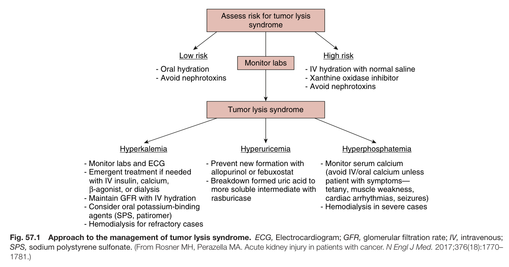

Fig. 57.1 Approach to the management of tumor lysis syndrome. ECG, Electrocardiogram; GFR, glomerular filtration rate; IV, intravenous; SPS, sodium polystyrene sulfonate. (From Rosner MH, Perazella MA. Acute kidney injury in patients with cancer. N Engl J Med. 2017;376(18):1770– 1781.)

---

### Fig_57_2

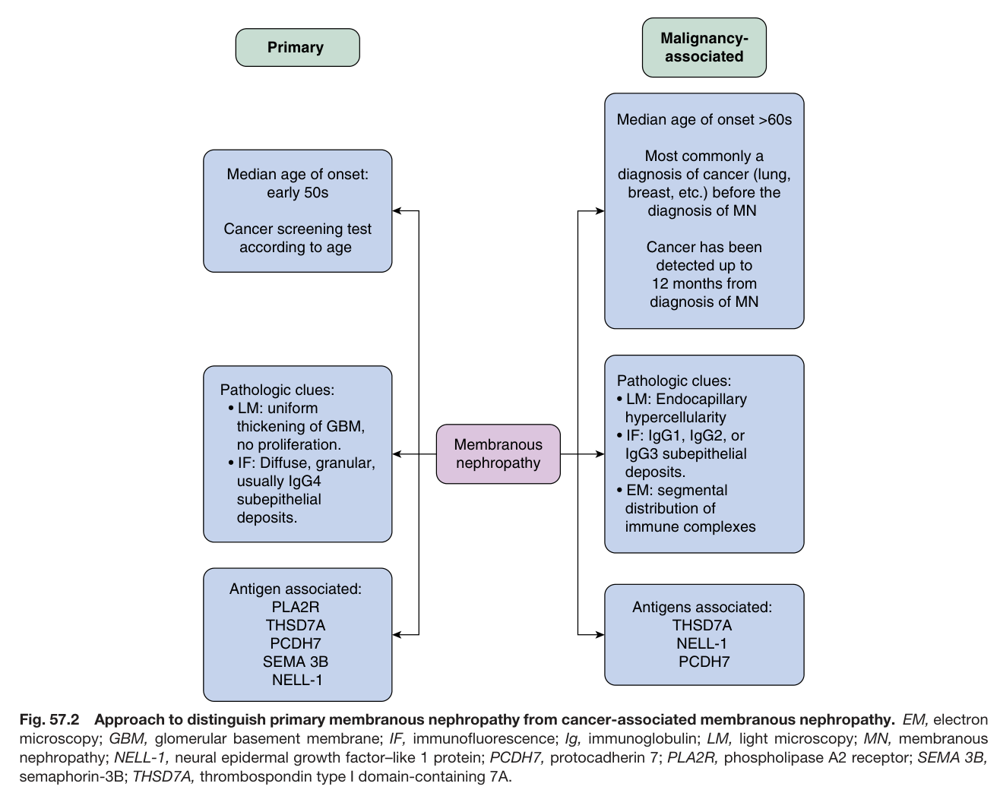

Fig. 57.2 Approach to distinguish primary membranous nephropathy from cancer-associated membranous nephropathy. EM, electron microscopy; GBM, glomerular basement membrane; IF, immunofluorescence; Ig, immunoglobulin; LM, light microscopy; MN, membranous nephropathy; NELL-1, neural epidermal growth factor–like 1 protein; PCDH7, protocadherin 7; PLA2R, phospholipase A2 receptor; SEMA 3B, semaphorin-3B; THSD7A, thrombospondin type I domain-containing 7A.

---

### Fig_57_3

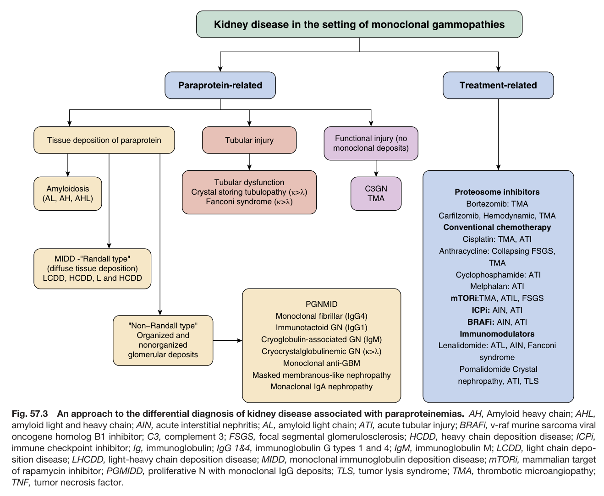

Fig. 57.3 An approach to the differential diagnosis of kidney disease associated with paraproteinemias. AH, Amyloid heavy chain; AHL, amyloid light and heavy chain; AIN, acute interstitial nephritis; AL, amyloid light chain; ATI, acute tubular injury; BRAFi, v-raf murine sarcoma vira oncogene homolog B1 inhibitor; C3, complement 3; FSGS, focal segmental glomerulosclerosis; HCDD, heavy chain deposition disease; ICPi, immune checkpoint inhibitor; Ig, immunoglobulin; IgG 1&4, immunoglobulin G types 1 and 4; IgM, immunoglobulin M; LCDD, light chain depo- sition disease; LHCDD, light-heavy chain deposition disease; MIDD, monoclonal immunoglobulin deposition disease; mTORi, mammalian target of rapamycin inhibitor; PGMIDD, proliferative N with monoclonal IgG deposits; TLS, tumor lysis syndrome; TMA, thrombotic microangiopathy; TNF, tumor necrosis factor.

---

### Fig_57_4

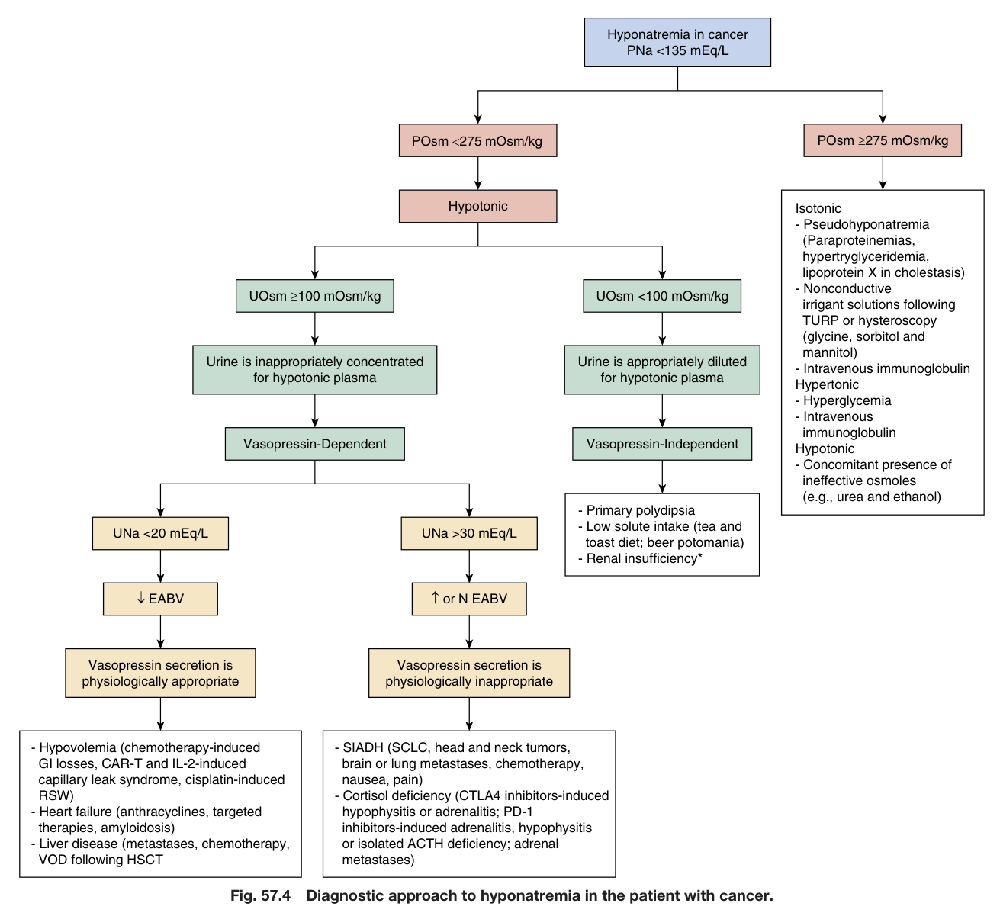

Fig. 57.4 Diagnostic approach to hyponatremia in the patient with cancer.

---

### Fig_57_5

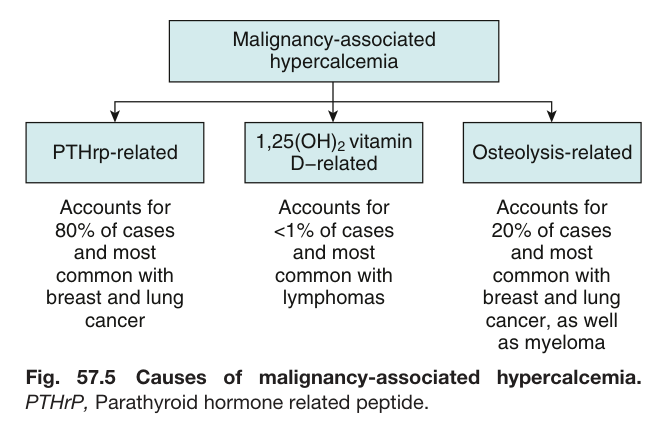

Fig. 57.5 Causes of malignancy-associated hypercalcemia. PTHrP, Parathyroid hormone related peptide.

---

### Fig_57_6

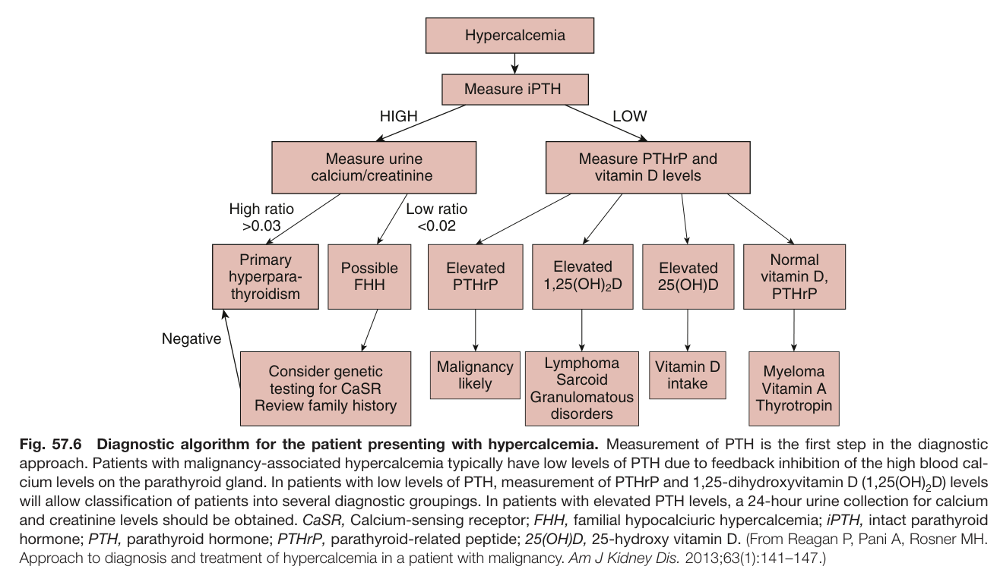

Fig. 57.6 Diagnostic algorithm for the patient presenting with hypercalcemia. Measurement of PTH is the first step in the diagnostic approach. Patients with malignancy-associated hypercalcemia typically have low levels of PTH due to feedback inhibition of the high blood cal- cium levels on the parathyroid gland. In patients with low levels of PTH, measurement of PTHrP and 1,25-dihydroxyvitamin D (1,25(OH) D) levels will allow classification of patients into several diagnostic groupings. In patients with elevated PTH levels, a 24-hour urine collection for calcium and creatinine levels should be obtained. CaSR, Calcium-sensing receptor; FHH, familial hypocalciuric hypercalcemia; iPTH, intact parathyroid hormone; PTH, parathyroid hormone; PTHrP, parathyroid-related peptide; 25(OH)D, 25-hydroxy vitamin D. (From Reagan P, Pani A, Rosner MH. Approach to diagnosis and treatment of hypercalcemia in a patient with malignancy. Am J Kidney Dis. 2013;63(1):141–147.)

---

### Fig_57_7

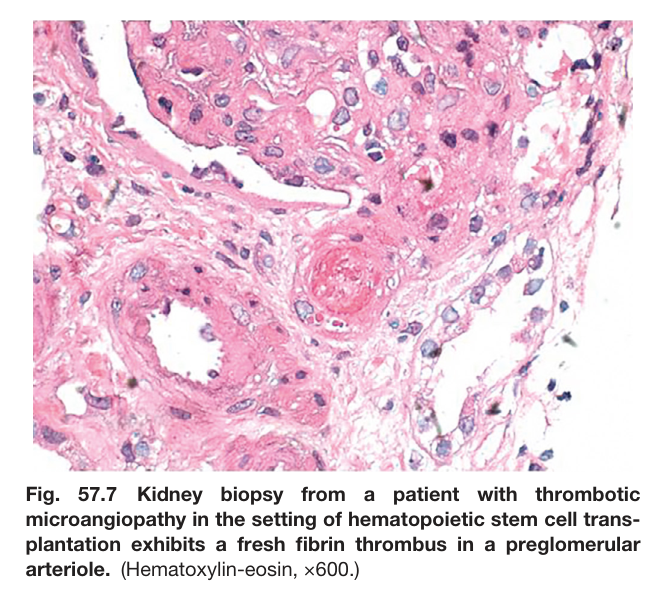

Fig. 57.7 Kidney biopsy from a patient with thrombotic microangiopathy in the setting of hematopoietic stem cell trans- plantation exhibits a fresh fibrin thrombus in a preglomerular arteriole. (Hematoxylin-eosin, ×600.)

---

### Fig_57_8

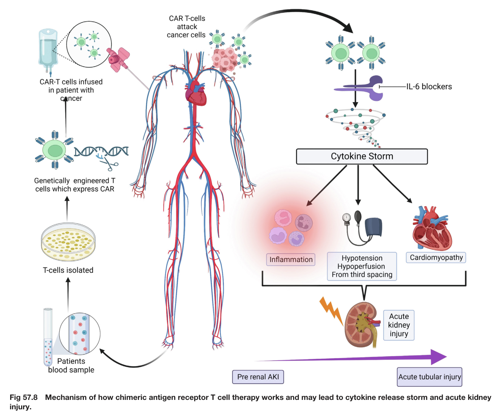

Fig. 57.8 Mechanism of how chimeric antigen receptor T cell therapy works and may lead to cytokine release storm and acute kidney injury.

---

## Tables

### Table_57_1

#### Table Image

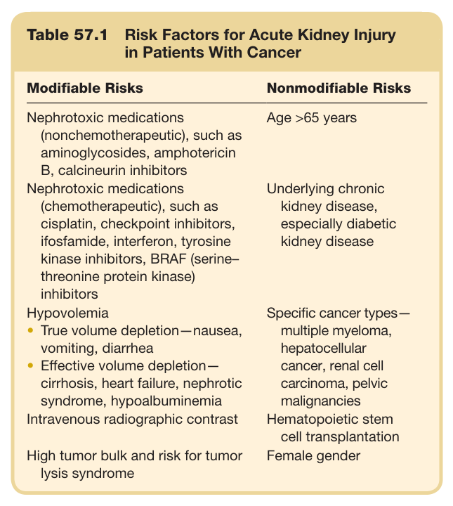

#### Table Data (CSV: [Table_57_1.csv](Table_57_1.csv))

```markdown
| Table Text (OCR) |
| :--- |
| Table 57.1  Risk Factors for Acute Kidney Injury in Patients With Cancer Modifiable Risks  Nonmodifiable Risks    Nephrotoxic medications(nonchemotherapeutic), such asaminoglycosides, amphotericinB, calcineurin inhibitors  Age >65 years    Nephrotoxic medications(chemotherapeutic), such ascisplatin, checkpoint inhibitors,ifosfamide, interferon, tyrosinekinase inhibitors, BRAF (serine-threonine protein kinase)inhibitors  Underlying chronickidney disease,especially diabetickidney disease    HypovolemiaTrue volume depletion—nausea,vomiting, diarrheaEffective volume depletion—cirrhosis, heart failure, nephroticsyndrome, hypoalbuminemia  Specific cancer types—multiple myeloma,hepatocellularcancer, renal cellcarcinoma, pelvicmalignancies    Intravenous radiographic contrast  Hematopoietic stemcell transplantation    High tumor bulk and risk for tumorlysis syndrome  Female gender |
```

Table 57.1 Risk Factors for Acute Kidney Injury in Patients With Cancer

---

### Table_57_2

#### Table Image

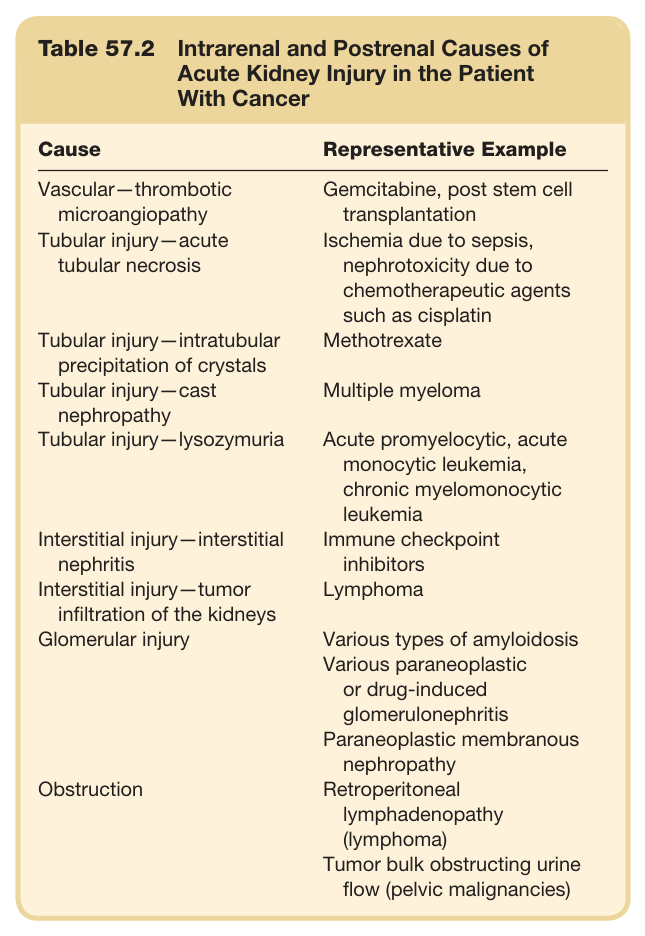

#### Table Data (CSV: [Table_57_2.csv](Table_57_2.csv))

```markdown
| Table Text (OCR) |
| :--- |
| Table 57.2 Intrarenal and Postrenal Causes of Acute Kidney Injury in the Patient With Cancer Cause  Representative Example    Vascular—thrombotic microangiopathy  Gemcitabine, post stem cell transplantation    Tubular injury—acute tubular necrosis  Ischemia due to sepsis, nephrotoxicity due to chemotherapeutic agents such as cisplatin    Tubular injury—intratubular precipitation of crystals  Methotrexate    Tubular injury—cast nephropathy  Multiple myeloma    Tubular injury—lysozymuria  Acute promyelocytic, acute monocytic leukemia, chronic myelomonocytic leukemia    Interstitial injury—interstitial nephritis  Immune checkpoint inhibitors    Interstitial injury—tumor infiltration of the kidneys  Lymphoma    Glomerular injury  Various types of amyloidosisVarious paraneoplastic or drug-induced glomerulonephritisParaneoplastic membranous nephropathy    Obstruction  Retroperitoneal lymphadenopathy (lymphoma)Tumor bulk obstructing urine flow (pelvic malignancies) |
```

Table 57.2 Intrarenal and Postrenal Causes of Acute Kidney Injury in the Patient With Cancer

---

### Table_57_3

#### Table Image

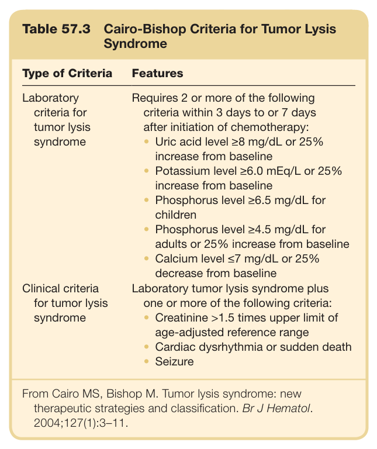

#### Table Data (CSV: [Table_57_3.csv](Table_57_3.csv))

```markdown
| Table Text (OCR) |
| :--- |
| Table 57.3  Cairo-Bishop Criteria for Tumor Lysis Syndrome Type of Criteria  Features    Laboratory criteria for tumor lysis syndrome  Requires 2 or more of the following criteria within 3 days to or 7 days after initiation of chemotherapy:Uric acid level  \geq 8  mg/dL or 25% increase from baselinePotassium level  \geq 6.0  mEq/L or 25% increase from baselinePhosphorus level  \geq 6.5  mg/dL for childrenPhosphorus level  \geq 4.5  mg/dL for adults or 25% increase from baselineCalcium level  \leq 7  mg/dL or 25% decrease from baseline    Clinical criteria for tumor lysis syndrome  Laboratory tumor lysis syndrome plus one or more of the following criteria:Creatinine  >1.5  times upper limit of age-adjusted reference rangeCardiac dysrhythmia or sudden deathSeizure From Cairo MS, Bishop M. Tumor lysis syndrome: new therapeutic strategies and classification. Br J Hematol. 2004;127(1):3–11. |
```

Table 57.3 Cairo-Bishop Criteria for Tumor Lysis Syndrome

---

### Table_57_4

#### Table Image

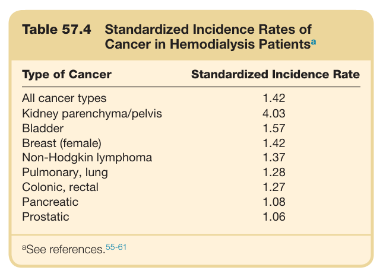

#### Table Data (CSV: [Table_57_4.csv](Table_57_4.csv))

```markdown
| Table Text (OCR) |
| :--- |
| Table 57.4  Standardized Incidence Rates of Cancer in Hemodialysis Patients<sup>a</sup> Type of Cancer  Standardized Incidence Rate    All cancer types  1.42    Kidney parenchyma/pelvis  4.03    Bladder  1.57    Breast (female)  1.42    Non-Hodgkin lymphoma  1.37    Pulmonary, lung  1.28    Colonic, rectal  1.27    Pancreatic  1.08    Prostatic  1.06     ^{a} See references. ^{55-61} |
```

Table 57.4 Standardized Incidence Rates of Cancer in Hemodialysis Patients<sup>a</sup>

---

### Table_57_5

#### Table Image

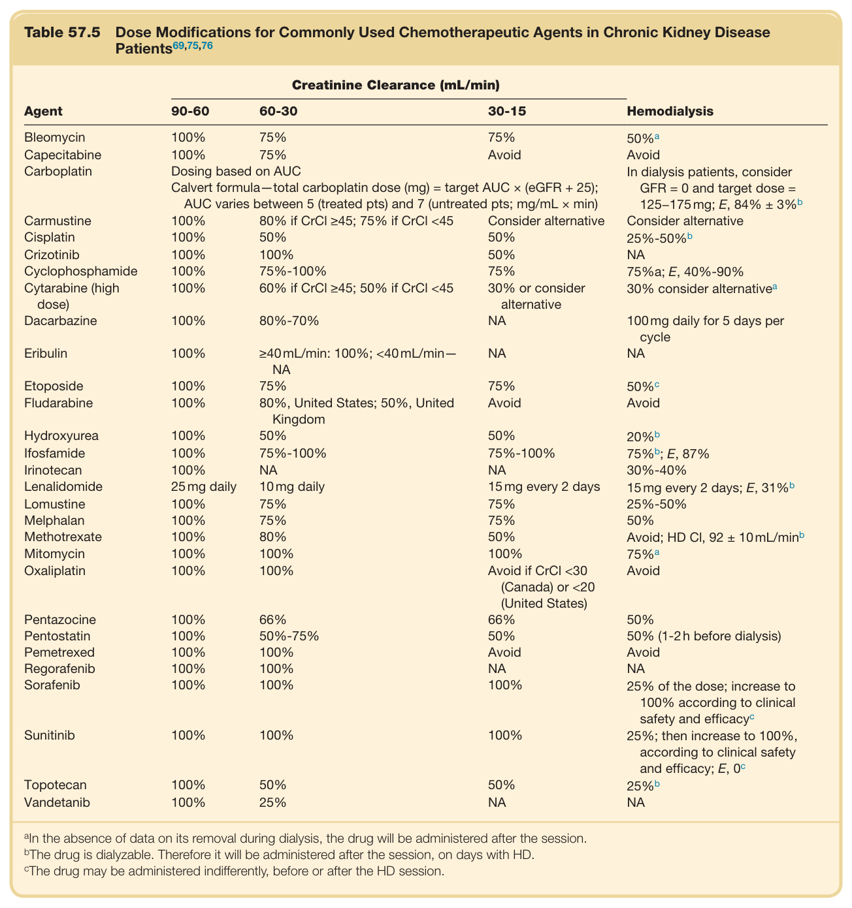

#### Table Data (CSV: [Table_57_5.csv](Table_57_5.csv))

```markdown
| Table Text (OCR) |
| :--- |
| Table 57.5  Dose Modifications for Commonly Used Chemotherapeutic Agents in Chronic Kidney Disease Patients<sup>69,75,76</sup> Agent  Creatinine Clearance (mL/min)    90-60  60-30  30-15  Hemodialysis    Bleomycin  100%  75%  75%   50\%^a     Capecitabine  100%  75%  Avoid  Avoid    Carboplatin  Dosing based on AUC  In dialysis patients, consider GFR = 0 and target dose = 125-175 mg; E, 84% ±  3\%^b     Calvert formula-total carboplatin dose (mg) = target AUC × (eGFR + 25); AUC varies between 5 (treated pts) and 7 (untreated pts; mg/mL × min)    Carmustine  100%  80% if CrCl ≥45; 75% if CrCl <45  Consider alternative  Consider alternative    Cisplatin  100%  50%  50%   25\%-50\%^b     Crizotinib  100%  100%  50%  NA    Cyclophosphamide  100%  75%-100%  75%  75%a; E, 40%-90%    Cytarabine (high dose)  100%  60% if CrCl ≥45; 50% if CrCl <45  30% or consider alternative   30\%  consider  alternative^a     Dacarbazine  100%  80%-70%  NA  100mg daily for 5 days per cycle    Eribulin  100%  ≥40 mL/min: 100%; <40 mL/min-NA  NA  NA    Etoposide  100%  75%  75%   50\%^c     Fludarabine  100%  80%, United States; 50%, United Kingdom  Avoid  Avoid    Hydroxyurea  100%  50%  50%   20\%^b     Ifosfamide  100%  75%-100%  75%-100%   75\%^b ; E, 87%    Irinotecan  100%  NA  NA  30%-40%    Lenalidomide  25 mg daily  10 mg daily  15 mg every 2 days  15 mg every 2 days; E,  31\%^b     Lomustine  100%  75%  75%  25%-50%    Melphalan  100%  75%  75%  50%    Methotrexate  100%  80%  50%  Avoid; HD CI, 92 ± 10 mL/minb    Mitomycin  100%  100%  100%   75\%^a     Oxaliplatin  100%  100%  Avoid if CrCl <30 (Canada) or <20 (United States)  Avoid    Pentazocine  100%  66%  66%  50%    Pentostatin  100%  50%-75%  50%  50% (1-2 h before dialysis)    Pemetrexed  100%  100%  Avoid  Avoid    Regorafenib  100%  100%  NA  NA    Sorafenib  100%  100%  100%  25% of the dose; increase to 100% according to clinical safety and  efficacy^c     Sunitinib  100%  100%  100%  25%; then increase to 100%, according to clinical safety and efficacy; E,  0^c     Topotecan  100%  50%  50%   25\%^b     Vandetanib  100%  25%  NA  NA <sup>a</sup>In the absence of data on its removal during dialysis, the drug will be administered after the session. <sup>b</sup>The drug is dialyzable. Therefore it will be administered after the session, on days with HD. <sup>c</sup>The drug may be administered indifferently, before or after the HD session. |
```

Table 57.5 Dose Modifications for Commonly Used Chemotherapeutic Agents in Chronic Kidney Disease Patients<sup>69,75,76</sup>

---

### Table_57_6

#### Table Image

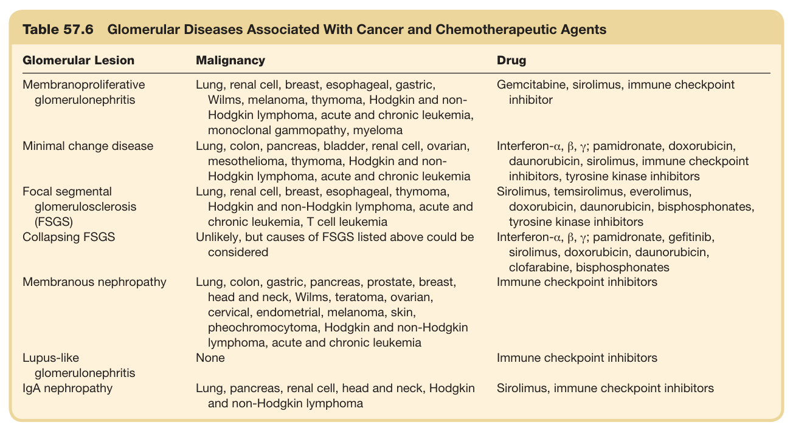

#### Table Data (CSV: [Table_57_6.csv](Table_57_6.csv))

```markdown
| Table Text (OCR) |
| :--- |
| Table 57.6  Glomerular Diseases Associated With Cancer and Chemotherapeutic Agents Glomerular Lesion  Malignancy  Drug    Membranoproliferative glomerulonephritis  Lung, renal cell, breast, esophageal, gastric, Wilms, melanoma, thymoma, Hodgkin and non-Hodgkin lymphoma, acute and chronic leukemia, monoclonal gammopathy, myeloma  Gemcitabine, sirolimus, immune checkpoint inhibitor    Minimal change disease  Lung, colon, pancreas, bladder, renal cell, ovarian, mesothelioma, thymoma, Hodgkin and non-Hodgkin lymphoma, acute and chronic leukemia  Interferon-α, β, γ; pamidronate, doxorubicin, daunorubicin, sirolimus, immune checkpoint inhibitors, tyrosine kinase inhibitors    Focal segmental glomerulosclerosis (FSGS)  Lung, renal cell, breast, esophageal, thymoma, Hodgkin and non-Hodgkin lymphoma, acute and chronic leukemia, T cell leukemia  Sirolimus, temsirolimus, everolimus, doxorubicin, daunorubicin, bisphosphonates, tyrosine kinase inhibitors    Collapsing FSGS  Unlikely, but causes of FSGS listed above could be considered  Interferon-α, β, γ; pamidronate, gefitinib, sirolimus, doxorubicin, daunorubicin, clofarabine, bisphosphonates    Membranous nephropathy  Lung, colon, gastric, pancreas, prostate, breast, head and neck, Wilms, teratoma, ovarian, cervical, endometrial, melanoma, skin, pheochromocytoma, Hodgkin and non-Hodgkin lymphoma, acute and chronic leukemia  Immune checkpoint inhibitors    Lupus-like glomerulonephritis  None  Immune checkpoint inhibitors    IgA nephropathy  Lung, pancreas, renal cell, head and neck, Hodgkin and non-Hodgkin lymphoma  Sirolimus, immune checkpoint inhibitors |
```

Table 57.6 Glomerular Diseases Associated With Cancer and Chemotherapeutic Agents

---

### Table_57_7

#### Table Image

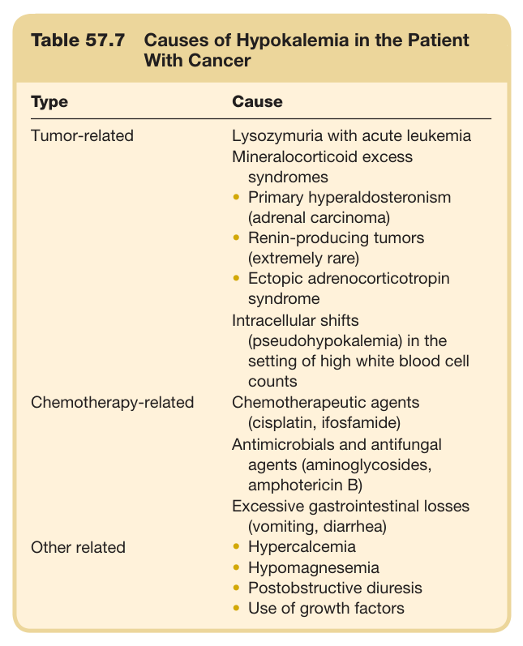

#### Table Data (CSV: [Table_57_7.csv](Table_57_7.csv))

```markdown
| Table Text (OCR) |
| :--- |
| Table 57.7  Causes of Hypokalemia in the Patient With Cancer Type  Cause    Tumor-related  Lysozymuria with acute leukemiaMineralocorticoid excess syndromesPrimary hyperaldosteronism(adrenal carcinoma)Renin-producing tumors(extremely rare)Ectopic adrenocorticotropin syndromeIntracellular shifts(pseudohypokalemia) in the setting of high white blood cell counts    Chemotherapy-related  Chemotherapeutic agents(cisplatin, ifosfamide)Antimicrobials and antifungal agents (aminoglycosides, amphotericin B)Excessive gastrointestinal losses(vomiting, diarrhea)    Other related  HypercalcemiaHypomagnesemiaPostobstructive diuresisUse of growth factors |
```

Table 57.7 Causes of Hypokalemia in the Patient With Cancer

---

### Table_57_8

#### Table Image

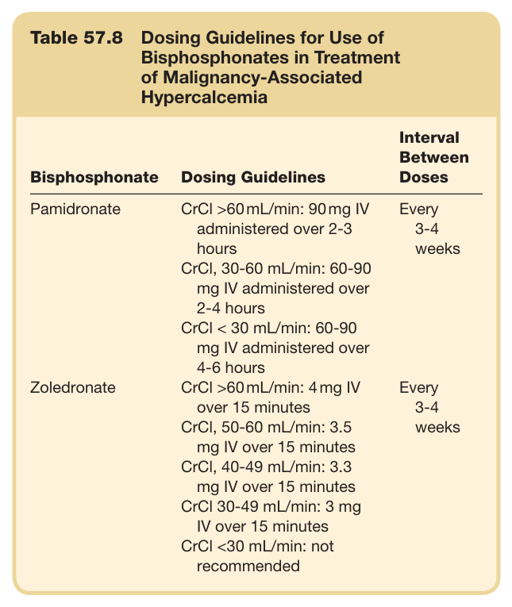

#### Table Data (CSV: [Table_57_8.csv](Table_57_8.csv))

```markdown
| Table Text (OCR) |
| :--- |
| Table 57.8 Dosing Guidelines for Use of Bisphosphonates in Treatment of Malignancy-Associated Hypercalcemia Bisphosphonate  Dosing Guidelines  Interval Between Doses    Pamidronate  CrCl >60 mL/min: 90 mg IV administered over 2-3 hoursCrCl, 30-60 mL/min: 60-90 mg IV administered over 2-4 hoursCrCl < 30 mL/min: 60-90 mg IV administered over 4-6 hours  Every3-4weeks    Zoledronate  CrCl >60 mL/min: 4 mg IV over 15 minutesCrCl, 50-60 mL/min: 3.5 mg IV over 15 minutesCrCl, 40-49 mL/min: 3.3 mg IV over 15 minutesCrCl 30-49 mL/min: 3 mg IV over 15 minutesCrCl <30 mL/min: not recommended  Every3-4weeks |
```

Table 57.8 Dosing Guidelines for Use of Bisphosphonates in Treatment of Malignancy-Associated Hypercalcemia

---

### Table_57_9

#### Table Image

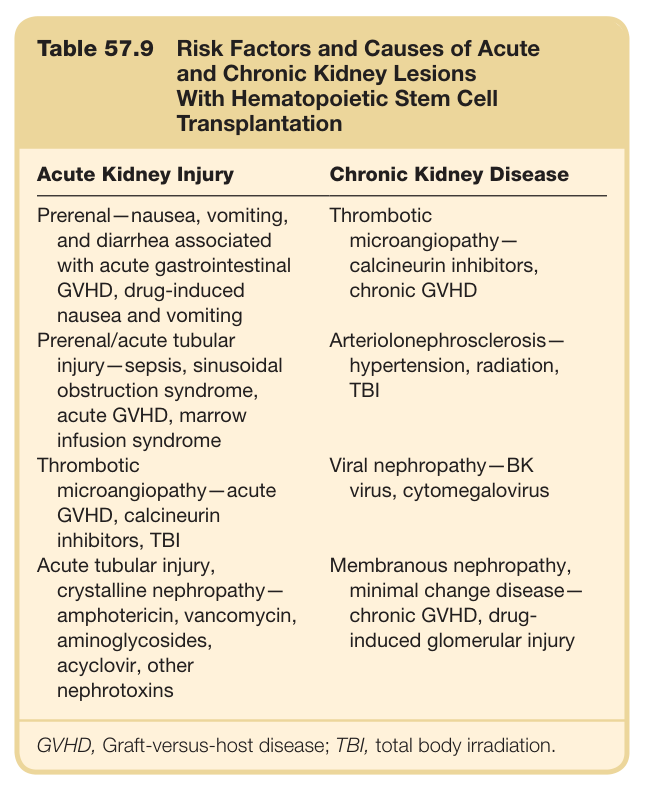

#### Table Data (CSV: [Table_57_9.csv](Table_57_9.csv))

```markdown
| Table Text (OCR) |
| :--- |
| Table 57.9 Risk Factors and Causes of Acute and Chronic Kidney Lesions With Hematopoietic Stem Cell Transplantation Acute Kidney Injury  Chronic Kidney Disease    Prerenal—nausea, vomiting, and diarrhea associated with acute gastrointestinal GVHD, drug-induced nausea and vomiting  Thrombotic microangiopathy—calcineurin inhibitors, chronic GVHD    Prerenal/acute tubular injury—sepsis, sinusoidal obstruction syndrome, acute GVHD, marrow infusion syndrome  Arteriolonephrosclerosis—hypertension, radiation, TBI    Thrombotic microangiopathy—acute GVHD, calcineurin inhibitors, TBI  Viral nephropathy—BK virus, cytomegalovirus    Acute tubular injury, crystalline nephropathy—amphotericin, vancomycin, aminoglycosides, acyclovir, other nephrotoxins  Membranous nephropathy, minimal change disease—chronic GVHD, drug-induced glomerular injury GVHD, Graft-versus-host disease; TBI, total body irradiation. |
```

Table 57.9 Risk Factors and Causes of Acute and Chronic Kidney Lesions With Hematopoietic Stem Cell Transplantation

---

### Table_57_10

#### Table Image

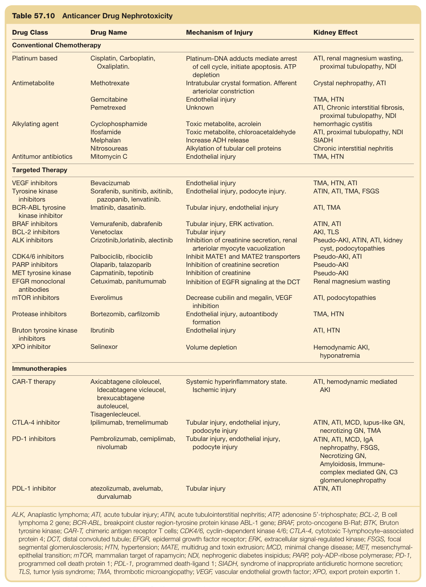

#### Table Data (CSV: [Table_57_10.csv](Table_57_10.csv))

```markdown
| Table Text (OCR) |
| :--- |
| Table 57.10  Anticancer Drug Nephrotoxicity Drug Class  Drug Name  Mechanism of Injury  Kidney Effect    Conventional Chemotherapy    Platinum based  Cisplatin, Carboplatin, Oxaliplatin.  Platinum-DNA adducts mediate arrest of cell cycle, initiate apoptosis. ATP depletion  ATI, renal magnesium wasting, proximal tubulopathy, NDI    Antimetabolite  Methotrexate  Intratubular crystal formation. Afferent arteriolar constriction  Crystal nephropathy, ATI    Gemcitabine  Endothelial injury  TMA, HTN    Pemetrexed  Unknown  ATI, Chronic interstitial fibrosis, proximal tubulopathy, NDI    Alkylating agent  Cyclophosphamide  Toxic metabolite, acrolein  hemorrhagic cystitis    Ifosfamide  Toxic metabolite, chloroacetaldehyde  ATI, proximal tubulopathy, NDI    Melphalan  Increase ADH release  SIADH    Nitrosoureas  Alkylation of tubular cell proteins  Chronic interstitial nephritis    Antitumor antibiotics  Mitomycin C  Endothelial injury  TMA, HTN    Targeted Therapy    VEGF inhibitors  Bevacizumab  Endothelial injury  TMA, HTN, ATI    Tyrosine kinase inhibitors  Sorafenib, sunitinib, axitinib, pazopanib, lenvatinib.  Endothelial injury, podocyte injury.  ATIN, ATI, TMA, FSGS    BCR-ABL tyrosine kinase inhibitor  Imatinib, dasatinib.  Tubular injury, endothelial injury  ATI, TMA    BRAF inhibitors  Vemurafenib, dabrafenib  Tubular injury, ERK activation.  ATIN, ATI    BCL-2 inhibitors  Venetoclax  Tubular injury  AKI, TLS    ALK inhibitors  Crizotinib, lorlatinib, alectinib  Inhibition of creatinine secretion, renal arteriolar myocyte vacuolization  Pseudo-AKI, ATIN, ATI, kidney cyst, podocytopathies    CDK4/6 inhibitors  Palbociclib, ribociclib  Inhibit MATE1 and MATE2 transporters  Pseudo-AKI, ATI    PARP inhibitors  Olaparib, talazoparib  Inhibition of creatinine secretion  Pseudo-AKI    MET tyrosine kinase  Capmatinib, tepotinib  Inhibition of creatinine  Pseudo-AKI    EFGR monoclonal antibodies  Cetuximab, panitumumab  Inhibition of EGFR signaling at the DCT  Renal magnesium wasting    mTOR inhibitors  Everolimus  Decrease cubilin and megalin, VEGF inhibition  ATI, podocytopathies    Protease inhibitors  Bortezomib, carfilzomib  Endothelial injury, autoantibody formation  TMA, HTN    Bruton tyrosine kinase inhibitors  Ibrutinib  Endothelial injury  ATI, HTN    XPO inhibitor  Selinexor  Volume depletion  Hemodynamic AKI, hyponatremia    Immunotherapies    CAR-T therapy  Axicabtagene ciloleucel, Idecabtagene vicleucel, brexucabtagene autoleucel, Tisagenlecleucel.  Systemic hyperinflammatory state. Ischemic injury  ATI, hemodynamic mediated AKI    CTLA-4 inhibitor  Ipilimumab, tremelimumab  Tubular injury, endothelial injury, podocyte injury  ATIN, ATI, MCD, lupus-like GN, necrotizing GN, TMA    PD-1 inhibitors  Pembrolizumab, cemiplimab, nivolumab  Tubular injury, endothelial injury, podocyte injury  ATIN, ATI, MCD, IgA nephropathy, FSGS, Necrotizing GN, Amyloidosis, Immune- complex mediated GN, C3 glomerulonephropathy    PDL-1 inhibitor  atezolizumab, avelumab, durvalumab  Tubular injury  ATIN, ATI ALK, Anaplastic lymphoma; ATI, acute tubular injury; ATIN, acute tubulointerstitial nephritis; ATP, adenosine 5’-triphosphate; BCL-2, B cell lymphoma 2 gene; BCR-ABL, breakpoint cluster region-tyrosine protein kinase ABL-1 gene; BRAF, proto-oncogene B-Raf; BTK, Bruton tyrosine kinase; CAR-T, chimeric antigen receptor T cells; CDK4/6, cyclin-dependent kinase 4/6; CTLA-4, cytotoxic T-lymphocyte–associated protein 4; DCT, distal convoluted tubule; EFGR, epidermal growth factor receptor; ERK, extracellular signal-regulated kinase; FSGS, focal segmental glomerulosclerosis; HTN, hypertension; MATE, multidrug and toxin extrusion; MCD, minimal change disease; MET, mesenchymal- epithelial transition; mTOR, mammalian target of rapamycin; NDI, nephrogenic diabetes insipidus; PARP, poly-ADP-ribose polymerase; PD-1, programmed cell death protein 1; PDL-1, programmed death-ligand 1; SIADH, syndrome of inappropriate antidiuretic hormone secretion; TLS, tumor lysis syndrome; TMA, thrombotic microangiopathy; VEGF, vascular endothelial growth factor; XPO, export protein exportin 1. |
```

Table 57.10 Anticancer Drug Nephrotoxicity

---

### Table_57_11

#### Table Image

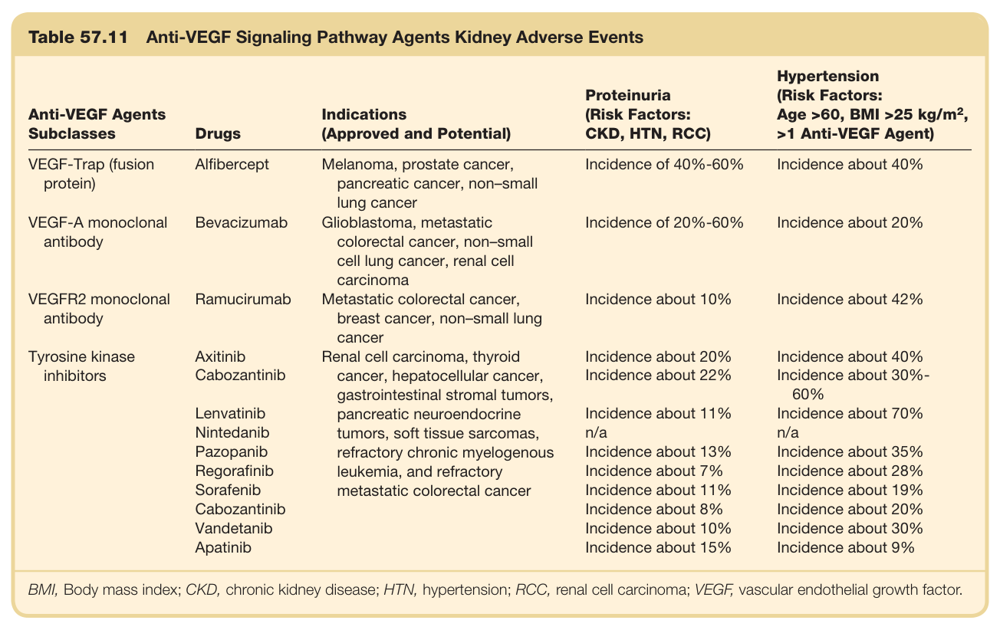

#### Table Data (CSV: [Table_57_11.csv](Table_57_11.csv))

```markdown
| Table Text (OCR) |
| :--- |
| Table 57.11  Anti-VEGF Signaling Pathway Agents Kidney Adverse Events Anti-VEGF Agents Subclasses  Drugs  Indications (Approved and Potential)  Proteinuria (Risk Factors: CKD, HTN, RCC)  Hypertension (Risk Factors: Age >60, BMI >25  kg/m^2 , >1 Anti-VEGF Agent)    VEGF-Trap (fusion protein)  Alfibercept  Melanoma, prostate cancer, pancreatic cancer, non-small lung cancer  Incidence of 40%-60%  Incidence about 40%    VEGF-A monoclonal antibody  Bevacizumab  Glioblastoma, metastatic colorectal cancer, non-small cell lung cancer, renal cell carcinoma  Incidence of 20%-60%  Incidence about 20%    VEGFR2 monoclonal antibody  Ramucirumab  Metastatic colorectal cancer, breast cancer, non-small lung cancer  Incidence about 10%  Incidence about 42%    Tyrosine kinase inhibitors  Axitinib  Renal cell carcinoma, thyroid cancer, hepatocellular cancer, gastrointestinal stromal tumors, pancreatic neuroendocrine tumors, soft tissue sarcomas, refractory chronic myelogenous leukemia, and refractory metastatic colorectal cancer  Incidence about 20%  Incidence about 40%    Cabozantinib  Incidence about 22%  Incidence about 30%-60%    Lenvatinib  Incidence about 11%  Incidence about 70%    Nintedanib  n/a  n/a    Pazopanib  Incidence about 13%  Incidence about 35%    Regorafinib  Incidence about 7%  Incidence about 28%    Sorafenib  Incidence about 11%  Incidence about 19%    Cabozantinib  Incidence about 8%  Incidence about 20%    Vandetanib  Incidence about 10%  Incidence about 30%    Apatinib  Incidence about 15%  Incidence about 9% BMI, Body mass index; CKD, chronic kidney disease; HTN, hypertension; RCC, renal cell carcinoma; VEGF, vascular endothelial growth factor. |
```

Table 57.11 Anti-VEGF Signaling Pathway Agents Kidney Adverse Events

---
