# 58. Pregnancy and Kidney Disease - Figures and Tables Index

This document lists all figures and tables extracted from `58. Pregnancy and Kidney Disease.pdf`.

## Table of Contents
- [Figures](#figures)
- [Tables](#tables)

---

## Figures

### Fig_58_1

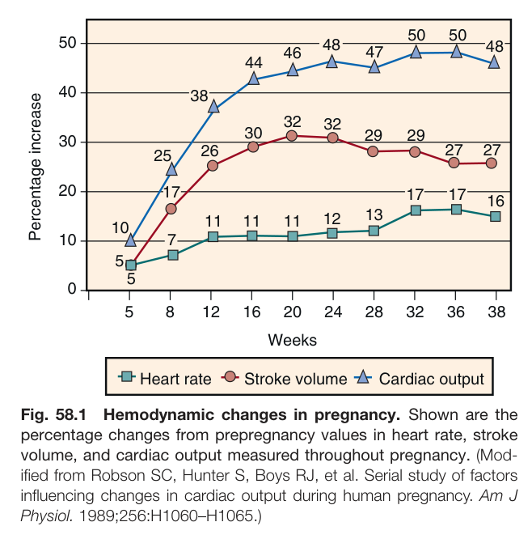

Fig. 58.1 Hemodynamic changes in pregnancy. Shown are the percentage changes from prepregnancy values in heart rate, stroke volume, and cardiac output measured throughout pregnancy. (Mod- ified from Robson SC, Hunter S, Boys RJ, et al. Serial study of factors influencing changes in cardiac output during human pregnancy. Am J Physiol. 1989;256:H1060–H1065.)

---

### Fig_58_2

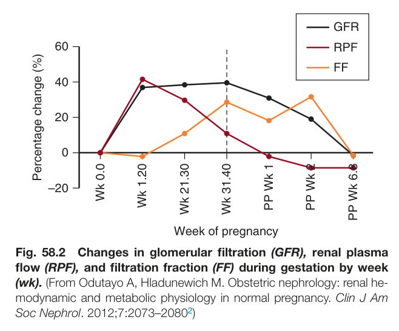

Fig. 58.2 Changes in glomerular filtration (GFR), renal plasma flow (RPF), and filtration fraction (FF) during gestation by week (wk). (From Odutayo A, Hladunewich M. Obstetric nephrology: renal he- modynamic and metabolic physiology in normal pregnancy. Clin J Am Soc Nephrol. 2012;7:2073–2080<sup>2</sup>)

---

### Fig_58_3

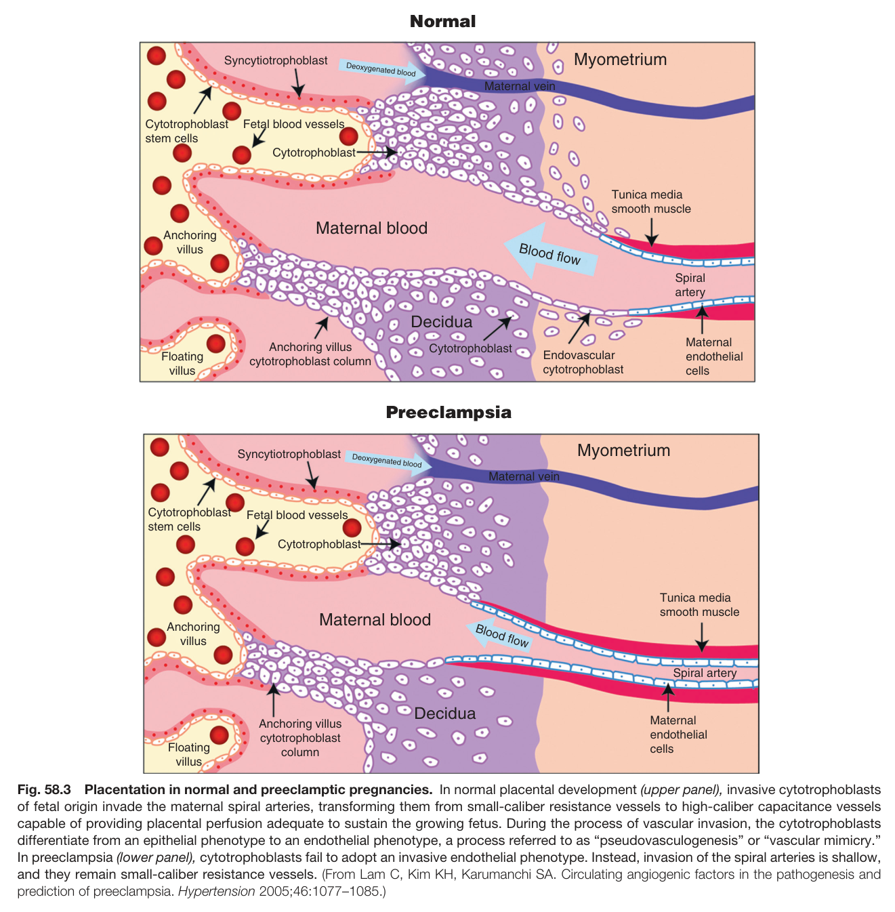

Fig. 58.3 Placentation in normal and preeclamptic pregnancies. In normal placental development (upper panel), invasive cytotrophoblasts of fetal origin invade the maternal spiral arteries, transforming them from small-caliber resistance vessels to high-caliber capacitance vessels capable of providing placental perfusion adequate to sustain the growing fetus. During the process of vascular invasion, the cytotrophoblasts differentiate from an epithelial phenotype to an endothelial phenotype, a process referred to as “pseudovasculogenesis” or “vascular mimicry.” In preeclampsia (lower panel), cytotrophoblasts fail to adopt an invasive endothelial phenotype. Instead, invasion of the spiral arteries is shallow, and they remain small-caliber resistance vessels. (From Lam C, Kim KH, Karumanchi SA. Circulating angiogenic factors in the pathogenesis and prediction of preeclampsia. Hypertension 2005;46:1077–1085.)

---

### Fig_58_4

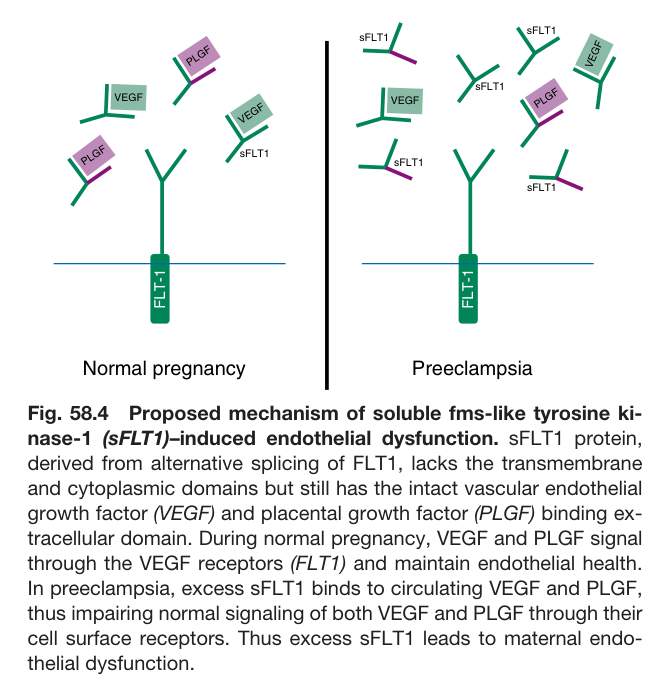

Fig. 58.4 Proposed mechanism of soluble fms-like tyrosine ki- nase-1 (sFLT1)–induced endothelial dysfunction. sFLT1 protein, derived from alternative splicing of FLT1, lacks the transmembrane and cytoplasmic domains but still has the intact vascular endothelial growth factor (VEGF) and placental growth factor (PLGF) binding ex- tracellular domain. During normal pregnancy, VEGF and PLGF signal through the VEGF receptors (FLT1) and maintain endothelial health. In preeclampsia, excess sFLT1 binds to circulating VEGF and PLGF, thus impairing normal signaling of both VEGF and PLGF through their cell surface receptors. Thus excess sFLT1 leads to maternal endo- thelial dysfunction.

---

### Fig_58_5

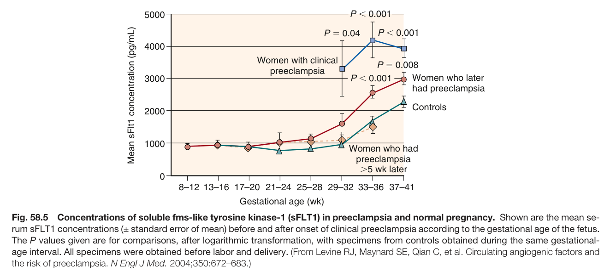

Fig. 58.5 Concentrations of soluble fms-like tyrosine kinase-1 (sFLT1) in preeclampsia and normal pregnancy. Shown are the mean se- rum sFLT1 concentrations (± standard error of mean) before and after onset of clinical preeclampsia according to the gestational age of the fetus. The P values given are for comparisons, after logarithmic transformation, with specimens from controls obtained during the same gestational- age interval. All specimens were obtained before labor and delivery. (From Levine RJ, Maynard SE, Qian C, et al. Circulating angiogenic factors and the risk of preeclampsia. N Engl J Med. 2004;350:672–683.)

---

### Fig_58_6

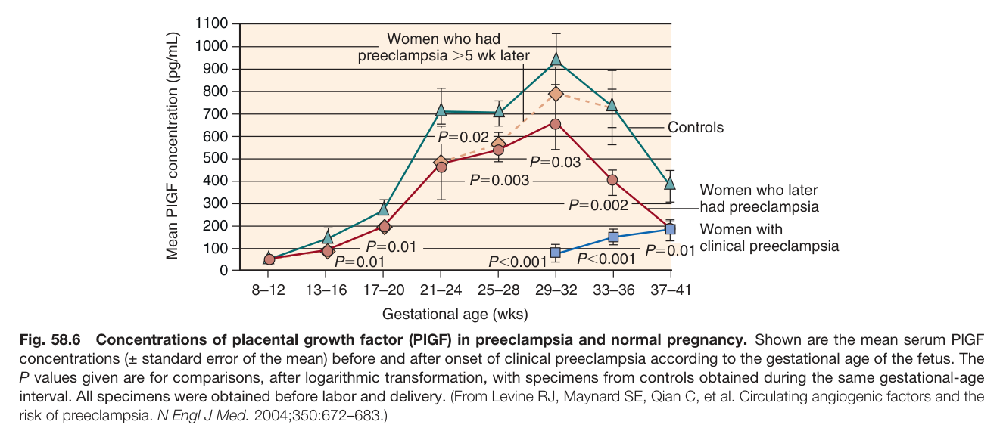

Fig. 58.6 Concentrations of placental growth factor (PlGF) in preeclampsia and normal pregnancy. Shown are the mean serum PlGF concentrations (± standard error of the mean) before and after onset of clinical preeclampsia according to the gestational age of the fetus. The P values given are for comparisons, after logarithmic transformation, with specimens from controls obtained during the same gestational-age interval. All specimens were obtained before labor and delivery. (From Levine RJ, Maynard SE, Qian C, et al. Circulating angiogenic factors and the risk of preeclampsia. N Engl J Med. 2004;350:672–683.)

---

### Fig_58_7

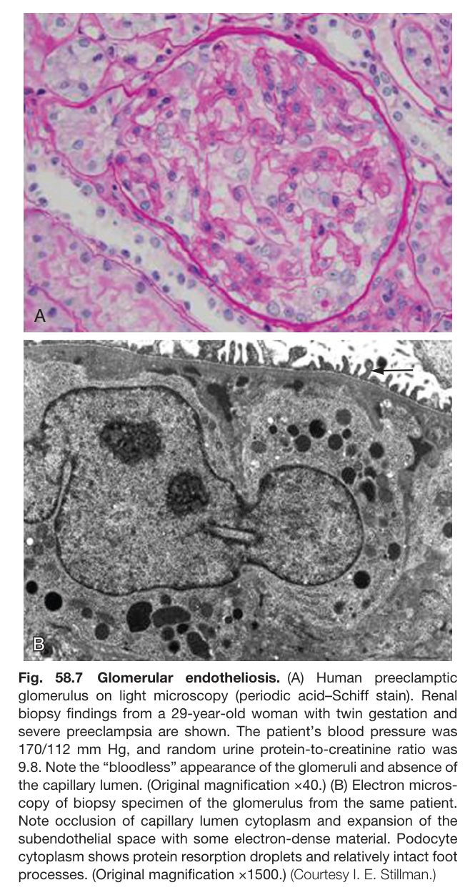

Fig. 58.7 Glomerular endotheliosis. (A) Human preeclamptic glomerulus on light microscopy (periodic acid–Schiff stain). Renal biopsy findings from a 29-year-old woman with twin gestation and severe preeclampsia are shown. The patient’s blood pressure was 170/112 mm Hg, and random urine protein-to-creatinine ratio was 9.8. Note the “bloodless” appearance of the glomeruli and absence of the capillary lumen. (Original magnification ×40.) (B) Electron micros- copy of biopsy specimen of the glomerulus from the same patient. Note occlusion of capillary lumen cytoplasm and expansion of the subendothelial space with some electron-dense material. Podocyte cytoplasm shows protein resorption droplets and relatively intact foot processes. (Original magnification ×1500.) (Courtesy I. E. Stillman.)

---

### Fig_58_8

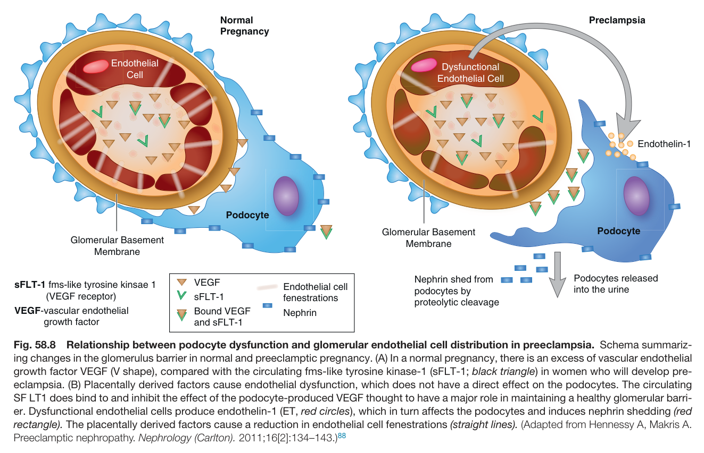

Fig. 58.8 Relationship between podocyte dysfunction and glomerular endothelial cell distribution in preeclampsia. Schema summariz- ing changes in the glomerulus barrier in normal and preeclamptic pregnancy. (A) In a normal pregnancy, there is an excess of vascular endothelia growth factor VEGF (V shape), compared with the circulating fms-like tyrosine kinase-1 (sFLT-1; black triangle) in women who will develop pre- eclampsia. (B) Placentally derived factors cause endothelial dysfunction, which does not have a direct effect on the podocytes. The circulating SF LT1 does bind to and inhibit the effect of the podocyte-produced VEGF thought to have a major role in maintaining a healthy glomerular barri- er. Dysfunctional endothelial cells produce endothelin-1 (ET, red circles), which in turn affects the podocytes and induces nephrin shedding (red rectangle). The placentally derived factors cause a reduction in endothelial cell fenestrations (straight lines). (Adapted from Hennessy A, Makris A. Preeclamptic nephropathy. Nephrology (Carlton). 2011;16[2]:134–143.)<sup>88</sup>

---

### Fig_58_9

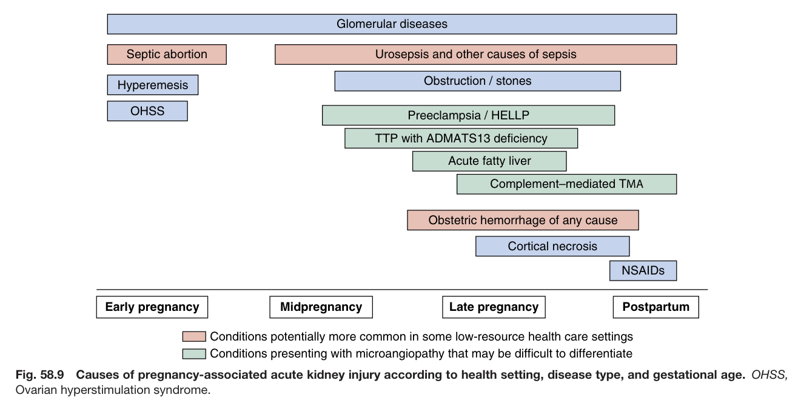

Fig. 58.9 Causes of pregnancy-associated acute kidney injury according to health setting, disease type, and gestational age. OHSS, Ovarian hyperstimulation syndrome.

---

### Fig_58_10

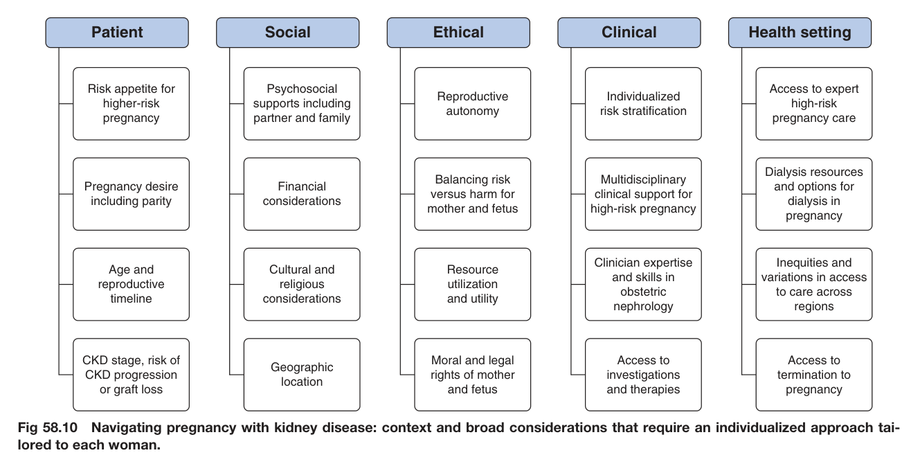

Fig. 58.10 Navigating pregnancy with kidney disease: context and broad considerations that require an individualized approach tai lored to each woman.

---

### Fig_58_11

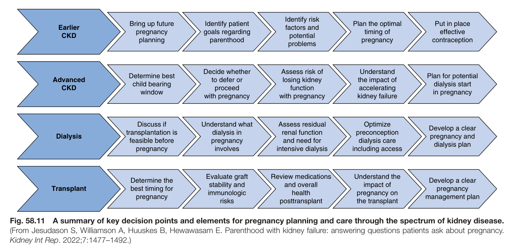

Fig. 58.11 A summary of key decision points and elements for pregnancy planning and care through the spectrum of kidney disease. (From Jesudason S, Williamson A, Huuskes B, Hewawasam E. Parenthood with kidney failure: answering questions patients ask about pregnancy. Kidney Int Rep. 2022;7:1477–1492.)

---

### Fig_58_12

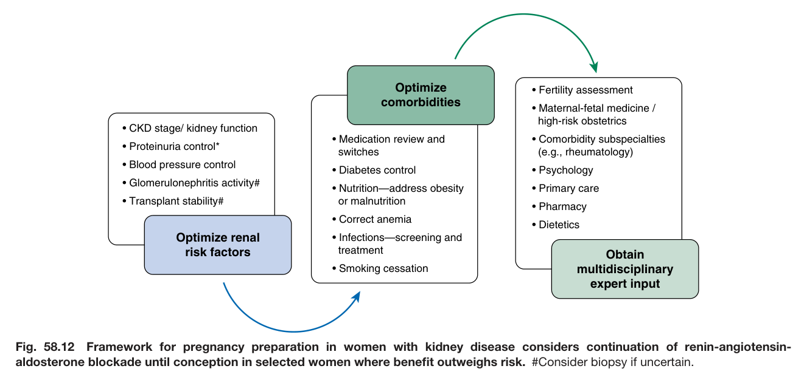

Fig. 58.12 Framework for pregnancy preparation in women with kidney disease considers continuation of renin-angiotensin- aldosterone blockade until conception in selected women where benefit outweighs risk. #Consider biopsy if uncertain.

---

### Fig_58_13

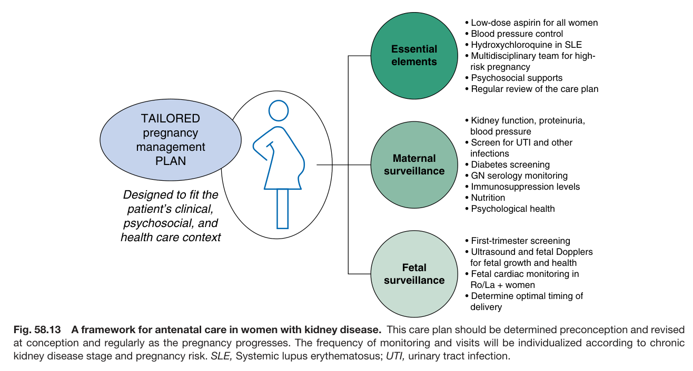

Fig. 58.13 A framework for antenatal care in women with kidney disease. This care plan should be determined preconception and revised at conception and regularly as the pregnancy progresses. The frequency of monitoring and visits will be individualized according to chronic kidney disease stage and pregnancy risk. SLE, Systemic lupus erythematosus; UTI, urinary tract infection.

---

### Fig_58_14

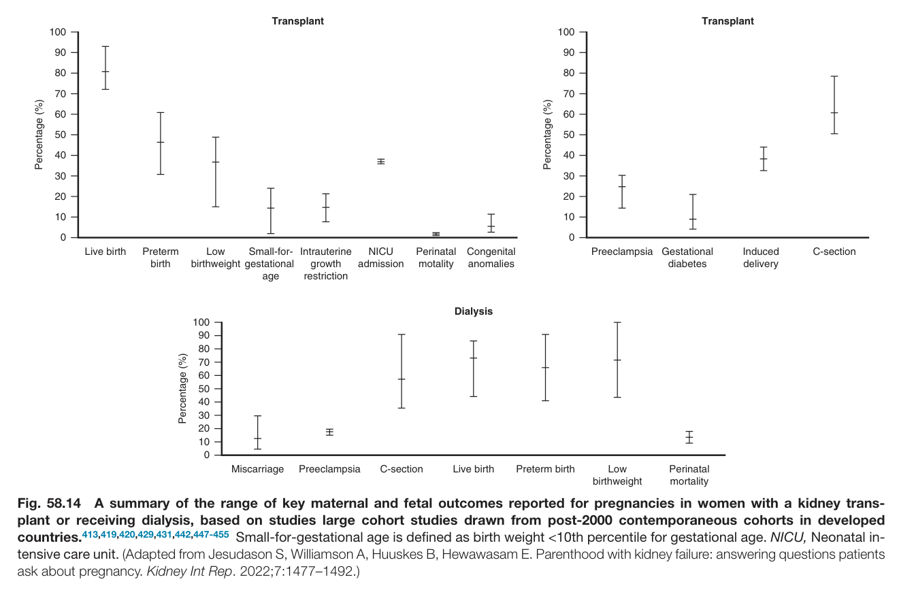

Fig. 58.14 A summary of the range of key maternal and fetal outcomes reported for pregnancies in women with a kidney trans- plant or receiving dialysis, based on studies large cohort studies drawn from post-2000 contemporaneous cohorts in developed countries.<sup>413,419,420,429,431,442,447-455</sup> Small-for-gestational age is defined as birth weight <10th percentile for gestational age. NICU, Neonatal in- tensive care unit. (Adapted from Jesudason S, Williamson A, Huuskes B, Hewawasam E. Parenthood with kidney failure: answering questions patients ask about pregnancy. Kidney Int Rep. 2022;7:1477–1492.)

---

## Tables

### Table_58_1

#### Table Image

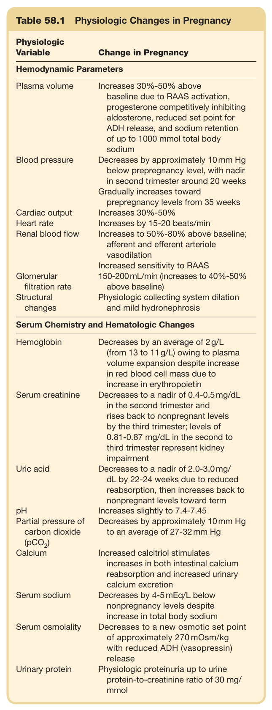

#### Table Data (CSV: [Table_58_1.csv](Table_58_1.csv))

```markdown
| Table Text (OCR) |
| :--- |
| Table 58.1  Physiologic Changes in Pregnancy Physiologic Variable  Change in Pregnancy    Hemodynamic Parameters    Plasma volume  Increases 30%-50% above baseline due to RAAS activation, progesterone competitively inhibiting aldosterone, reduced set point for ADH release, and sodium retention of up to 1000 mmol total body sodium    Blood pressure  Decreases by approximately 10 mm Hg below prepregnancy level, with nadir in second trimester around 20 weeks Gradually increases toward prepregnancy levels from 35 weeks    Cardiac output  Increases 30%-50%    Heart rate  Increases by 15-20 beats/min    Renal blood flow  Increases to 50%-80% above baseline; afferent and efferent arteriole vasodilation    Glomerular filtration rate  Increased sensitivity to RAAS 150-200mL/min (increases to 40%-50% above baseline)    Structural changes  Physiologic collecting system dilation and mild hydronephrosis    Serum Chemistry and Hematologic Changes    Hemoglobin  Decreases by an average of 2 g/L (from 13 to 11 g/L) owing to plasma volume expansion despite increase in red blood cell mass due to increase in erythropoietin    Serum creatinine  Decreases to a nadir of 0.4-0.5 mg/dL in the second trimester and rises back to nonpregnant levels by the third trimester; levels of 0.81-0.87 mg/dL in the second to third trimester represent kidney impairment    Uric acid  Decreases to a nadir of 2.0-3.0 mg/dL by 22-24 weeks due to reduced reabsorption, then increases back to nonpregnant levels toward term    pH  Increases slightly to 7.4-7.45    Partial pressure of carbon dioxide (pCO2)  Decreases by approximately 10 mm Hg to an average of 27-32 mm Hg    Calcium  Increased calcitriol stimulates increases in both intestinal calcium reabsorption and increased urinary calcium excretion    Serum sodium  Decreases by 4-5 mEq/L below nonpregnancy levels despite increase in total body sodium    Serum osmolality  Decreases to a new osmotic set point of approximately 270 mOsm/kg with reduced ADH (vasopressin) release    Urinary protein  Physiologic proteinuria up to urine protein-to-creatinine ratio of 30 mg/mmol |
```

Table 58.1 Physiologic Changes in Pregnancy

---

### Table_58_2

#### Table Image

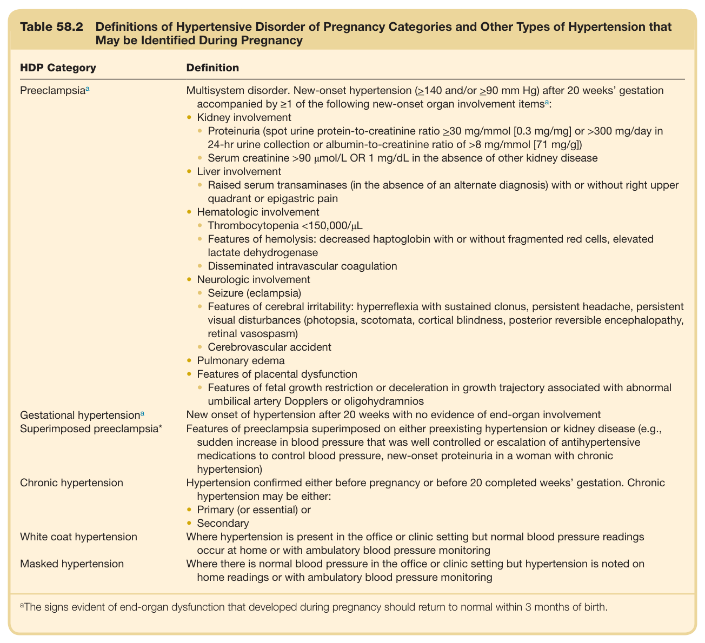

#### Table Data (CSV: [Table_58_2.csv](Table_58_2.csv))

```markdown
| Table Text (OCR) |
| :--- |
| Table 58.2 Definitions of Hypertensive Disorder of Pregnancy Categories and Other Types of Hypertension that May be Identified During Pregnancy HDP Category  Definition    Preeclampsia ^{a}   Multisystem disorder. New-onset hypertension ( \geq 140  and/or  \geq 90  mm Hg) after 20 weeks' gestation accompanied by  \geq 1  of the following new-onset organ involvement items ^{a} :Kidney involvementProteinuria (spot urine protein-to-creatinine ratio  \geq 30  mg/mmol [0.3 mg/mg] or >300 mg/day in 24-hr urine collection or albumin-to-creatinine ratio of >8 mg/mmol [71 mg/g])Serum creatinine >90  \mu mol/L OR 1 mg/dL in the absence of other kidney diseaseLiver involvementRaised serum transaminases (in the absence of an alternate diagnosis) with or without right upper quadrant or epigastric painHematologic involvementThrombocytopenia <150,000/ \mu LFeatures of hemolysis: decreased haptoglobin with or without fragmented red cells, elevated lactate dehydrogenaseDisseminated intravascular coagulationNeurologic involvementSeizure (eclampsia)Features of cerebral irritability: hyperreflexia with sustained clonus, persistent headache, persistent visual disturbances (photopsia, scotomata, cortical blindness, posterior reversible encephalopathy, retinal vasospasm)Cerebrovascular accidentPulmonary edemaFeatures of placental dysfunctionFeatures of fetal growth restriction or deceleration in growth trajectory associated with abnormal umbilical artery Dopplers or oligohydramnios    Gestational hypertension ^{a} Superimposed preeclampsia*  New onset of hypertension after 20 weeks with no evidence of end-organ involvementFeatures of preeclampsia superimposed on either preexisting hypertension or kidney disease (e.g., sudden increase in blood pressure that was well controlled or escalation of antihypertensive medications to control blood pressure, new-onset proteinuria in a woman with chronic hypertension)    Chronic hypertension  Hypertension confirmed either before pregnancy or before 20 completed weeks' gestation. Chronic hypertension may be either:Primary (or essential) orSecondary    White coat hypertension  Where hypertension is present in the office or clinic setting but normal blood pressure readings occur at home or with ambulatory blood pressure monitoring    Masked hypertension  Where there is normal blood pressure in the office or clinic setting but hypertension is noted on home readings or with ambulatory blood pressure monitoring <sup>a</sup>The signs evident of end-organ dysfunction that developed during pregnancy should return to normal within 3 months of birth. |
```

Table 58.2 Definitions of Hypertensive Disorder of Pregnancy Categories and Other Types of Hypertension that May be Identified During Pregnancy

---

### Table_58_3

#### Table Image

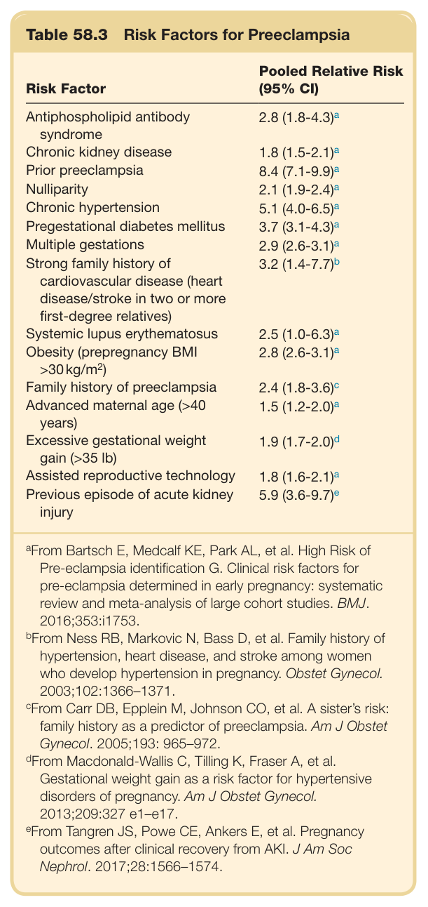

#### Table Data (CSV: [Table_58_3.csv](Table_58_3.csv))

```markdown
| Table Text (OCR) |
| :--- |
| Table 58.3  Risk Factors for Preeclampsia Risk Factor  Pooled Relative Risk (95% CI)    Antiphospholipid antibody syndrome  2.8 (1.8-4.3)a    Chronic kidney disease  1.8 (1.5-2.1)a    Prior preeclampsia  8.4 (7.1-9.9)a    Nulliparity  2.1 (1.9-2.4)a    Chronic hypertension  5.1 (4.0-6.5)a    Pregestational diabetes mellitus  3.7 (3.1-4.3)a    Multiple gestations  2.9 (2.6-3.1)a    Strong family history of cardiovascular disease (heart disease/stroke in two or more first-degree relatives)  3.2 (1.4-7.7)b    Systemic lupus erythematosus  2.5 (1.0-6.3)a    Obesity (prepregnancy BMI >30 kg/m2)  2.8 (2.6-3.1)a    Family history of preeclampsia  2.4 (1.8-3.6)c    Advanced maternal age (>40 years)  1.5 (1.2-2.0)a    Excessive gestational weight gain (>35 lb)  1.9 (1.7-2.0)d    Assisted reproductive technology  1.8 (1.6-2.1)a    Previous episode of acute kidney injury  5.9 (3.6-9.7)e <sup>a</sup>From Bartsch E, Medcalf KE, Park AL, et al. High Risk of Pre-eclampsia identification G. Clinical risk factors for pre-eclampsia determined in early pregnancy: systematic review and meta-analysis of large cohort studies. BMJ. 2016;353:i1753. <sup>b</sup>From Ness RB, Markovic N, Bass D, et al. Family history of hypertension, heart disease, and stroke among women who develop hypertension in pregnancy. Obstet Gynecol. 2003;102:1366–1371. <sup>c</sup>From Carr DB, Epplein M, Johnson CO, et al. A sister’s risk: family history as a predictor of preeclampsia. Am J Obstet Gynecol. 2005;193: 965–972. <sup>d</sup>From Macdonald-Wallis C, Tilling K, Fraser A, et al. Gestational weight gain as a risk factor for hypertensive disorders of pregnancy. Am J Obstet Gynecol. 2013;209:327 e1–e17. <sup>e</sup>From Tangren JS, Powe CE, Ankers E, et al. Pregnancy outcomes after clinical recovery from AKI. J Am Soc Nephrol. 2017;28:1566–1574. |
```

Table 58.3 Risk Factors for Preeclampsia

---

### Table_58_4

#### Table Image

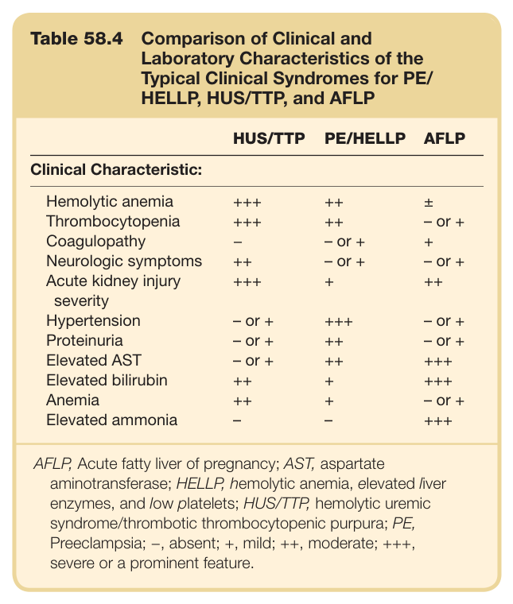

#### Table Data (CSV: [Table_58_4.csv](Table_58_4.csv))

```markdown
| Table Text (OCR) |
| :--- |
| Table 58.4 Comparison of Clinical and Laboratory Characteristics of the Typical Clinical Syndromes for PE/ HELLP, HUS/TTP, and AFLP HUS/TTP  PE/HELLP  AFLP    Clinical Characteristic:    Hemolytic anemia  +++  ++  ±    Thrombocytopenia  +++  ++  - or +    Coagulopathy  -  - or +  +    Neurologic symptoms  ++  - or +  - or +    Acute kidney injury severity  +++  +  ++    Hypertension  - or +  +++  - or +    Proteinuria  - or +  ++  - or +    Elevated AST  - or +  ++  +++    Elevated bilirubin  ++  +  +++    Anemia  ++  +  - or +    Elevated ammonia  -  -  +++ AFLP, Acute fatty liver of pregnancy; AST, aspartate aminotransferase; HELLP, hemolytic anemia, elevated liver enzymes, and low platelets; HUS/TTP, hemolytic uremic syndrome/thrombotic thrombocytopenic purpura; PE, Preeclampsia; −, absent; +, mild; ++, moderate; +++, severe or a prominent feature. |
```

Table 58.4 Comparison of Clinical and Laboratory Characteristics of the Typical Clinical Syndromes for PE/ HELLP, HUS/TTP, and AFLP

---

### Table_58_5

#### Table Image

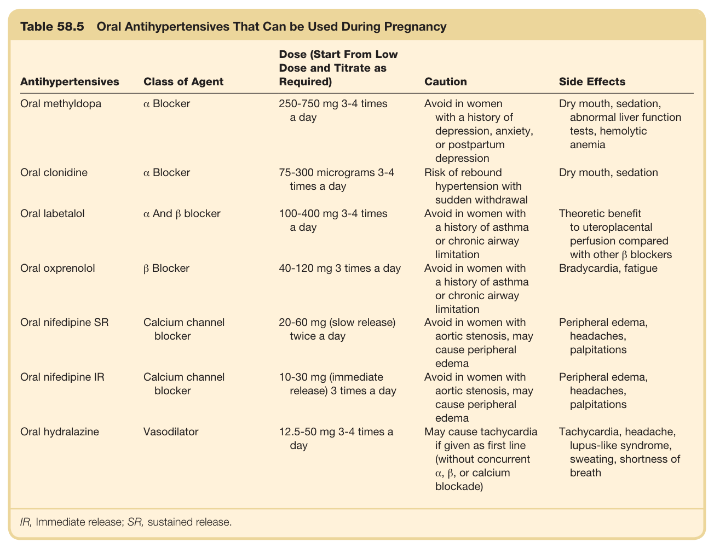

#### Table Data (CSV: [Table_58_5.csv](Table_58_5.csv))

```markdown
| Table Text (OCR) |
| :--- |
| Table 58.5  Oral Antihypertensives That Can be Used During Pregnancy Antihypertensives  Class of Agent  Dose (Start From Low Dose and Titrate as Required)  Caution  Side Effects    Oral methyldopa  α Blocker  250-750 mg 3-4 times a day  Avoid in women with a history of depression, anxiety, or postpartum depression  Dry mouth, sedation, abnormal liver function tests, hemolytic anemia    Oral clonidine  α Blocker  75-300 micrograms 3-4 times a day  Risk of rebound hypertension with sudden withdrawal  Dry mouth, sedation    Oral labetalol  α And β blocker  100-400 mg 3-4 times a day  Avoid in women with a history of asthma or chronic airway limitation  Theoretic benefit to uteroplacental perfusion compared with other β blockers    Oral oxprenolol  β Blocker  40-120 mg 3 times a day  Avoid in women with a history of asthma or chronic airway limitation  Bradycardia, fatigue    Oral nifedipine SR  Calcium channel blocker  20-60 mg (slow release) twice a day  Avoid in women with aortic stenosis, may cause peripheral edema  Peripheral edema, headaches, palpitations    Oral nifedipine IR  Calcium channel blocker  10-30 mg (immediate release) 3 times a day  Avoid in women with aortic stenosis, may cause peripheral edema  Peripheral edema, headaches, palpitations    Oral hydralazine  Vasodilator  12.5-50 mg 3-4 times a day  May cause tachycardia if given as first line (without concurrent α, β, or calcium blockade)  Tachycardia, headache, lupus-like syndrome, sweating, shortness of breath IR, Immediate release; SR, sustained release. |
```

Table 58.5 Oral Antihypertensives That Can be Used During Pregnancy

---

### Table_58_6

#### Table Image

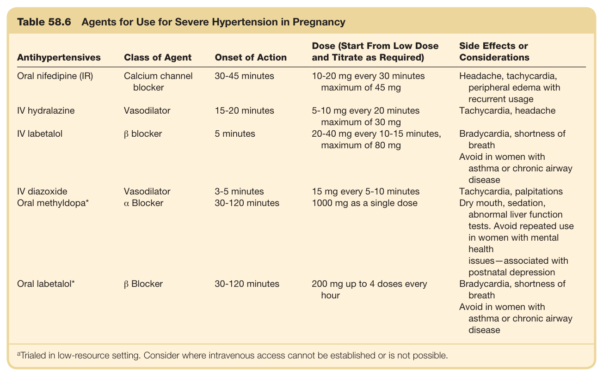

#### Table Data (CSV: [Table_58_6.csv](Table_58_6.csv))

```markdown
| Table Text (OCR) |
| :--- |
| Table 58.6  Agents for Use for Severe Hypertension in Pregnancy Antihypertensives  Class of Agent  Onset of Action  Dose (Start From Low Dose and Titrate as Required)  Side Effects or Considerations    Oral nifedipine (IR)  Calcium channel blocker  30-45 minutes  10-20 mg every 30 minutes maximum of 45 mg  Headache, tachycardia, peripheral edema with recurrent usage    IV hydralazine  Vasodilator  15-20 minutes  5-10 mg every 20 minutes maximum of 30 mg  Tachycardia, headache    IV labetalol  β blocker  5 minutes  20-40 mg every 10-15 minutes, maximum of 80 mg  Bradycardia, shortness of breathAvoid in women with asthma or chronic airway disease    IV diazoxide  Vasodilator  3-5 minutes  15 mg every 5-10 minutes  Tachycardia, palpitations    Oral methyldopa*  α Blocker  30-120 minutes  1000 mg as a single dose  Dry mouth, sedation, abnormal liver function tests. Avoid repeated use in women with mental health issues—associated with postnatal depression    Oral labetalol*  β Blocker  30-120 minutes  200 mg up to 4 doses every hour  Bradycardia, shortness of breathAvoid in women with asthma or chronic airway disease <sup>a</sup>Trialed in low-resource setting. Consider where intravenous access cannot be established or is not possible. |
```

Table 58.6 Agents for Use for Severe Hypertension in Pregnancy

---

### Table_58_7

#### Table Image

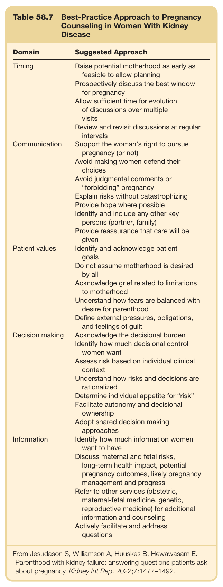

#### Table Data (CSV: [Table_58_7.csv](Table_58_7.csv))

```markdown
| Table Text (OCR) |
| :--- |
| Table 58.7  Best-Practice Approach to Pregnancy Counseling in Women With Kidney Disease Domain  Suggested Approach    Timing  Raise potential motherhood as early as feasible to allow planningProspectively discuss the best window for pregnancyAllow sufficient time for evolution of discussions over multiple visitsReview and revisit discussions at regular intervals    Communication  Support the woman's right to pursue pregnancy (or not)Avoid making women defend their choicesAvoid judgmental comments or “forbidding” pregnancyExplain risks without catastrophizingProvide hope where possibleIdentify and include any other key persons (partner, family)Provide reassurance that care will be given    Patient values  Identify and acknowledge patient goalsDo not assume motherhood is desired by allAcknowledge grief related to limitations to motherhoodUnderstand how fears are balanced with desire for parenthoodDefine external pressures, obligations, and feelings of guilt    Decision making  Acknowledge the decisional burdenIdentify how much decisional control women wantAssess risk based on individual clinical contextUnderstand how risks and decisions are rationalizedDetermine individual appetite for “risk”Facilitate autonomy and decisional ownershipAdopt shared decision making approaches    Information  Identify how much information women want to haveDiscuss maternal and fetal risks,long-term health impact, potential pregnancy outcomes, likely pregnancy management and progressRefer to other services (obstetric, maternal-fetal medicine, genetic, reproductive medicine) for additional information and counselingActively facilitate and address questions From Jesudason S, Williamson A, Huuskes B, Hewawasam E. Parenthood with kidney failure: answering questions patients ask about pregnancy. Kidney Int Rep. 2022;7:1477–1492. |
```

Table 58.7 Best-Practice Approach to Pregnancy Counseling in Women With Kidney Disease

---

### Table_58_8

#### Table Image

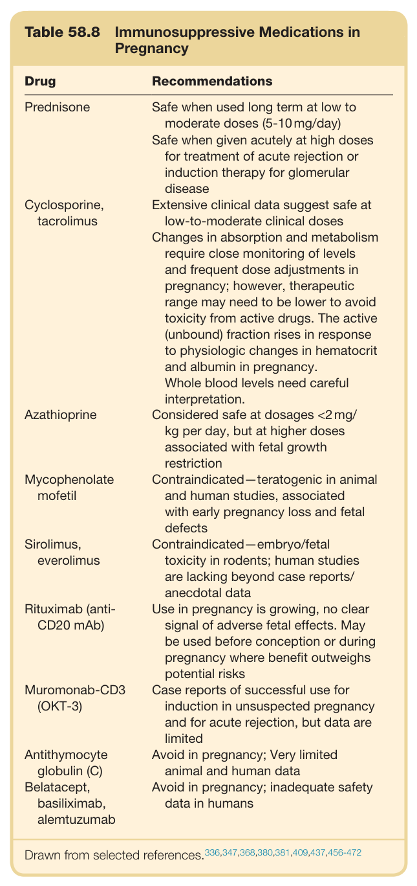

#### Table Data (CSV: [Table_58_8.csv](Table_58_8.csv))

```markdown
| Table Text (OCR) |
| :--- |
| Table 58.8 Immunosuppressive Medications in Pregnancy Drug  Recommendations    Prednisone  Safe when used long term at low to moderate doses (5-10 mg/day)Safe when given acutely at high doses for treatment of acute rejection or induction therapy for glomerular disease    Cyclosporine, tacrolimus  Extensive clinical data suggest safe at low-to-moderate clinical dosesChanges in absorption and metabolism require close monitoring of levels and frequent dose adjustments in pregnancy; however, therapeutic range may need to be lower to avoid toxicity from active drugs. The active (unbound) fraction rises in response to physiologic changes in hematocrit and albumin in pregnancy.Whole blood levels need careful interpretation.    Azathioprine  Considered safe at dosages <2 mg/kg per day, but at higher doses associated with fetal growth restriction    Mycophenolate mofetil  Contraindicated—teratogenic in animal and human studies, associated with early pregnancy loss and fetal defects    Sirolimus, everolimus  Contraindicated—embryo/fetal toxicity in rodents; human studies are lacking beyond case reports/anecdotal data    Rituximab (anti-CD20 mAb)  Use in pregnancy is growing, no clear signal of adverse fetal effects. May be used before conception or during pregnancy where benefit outweighs potential risks    Muromonab-CD3 (OKT-3)  Case reports of successful use for induction in unsuspected pregnancy and for acute rejection, but data are limited    Antithymocyte globulin (C)  Avoid in pregnancy; Very limited animal and human data    Belatacept, basiliximab, alemtuzumab  Avoid in pregnancy; inadequate safety data in humans Drawn from selected references.<sup>336,347,368,380,381,409,437,456-472</sup> |
```

Table 58.8 Immunosuppressive Medications in Pregnancy

---

### Table_58_9

#### Table Images (2 Parts)

- **Part 1 (Page 30)**:
  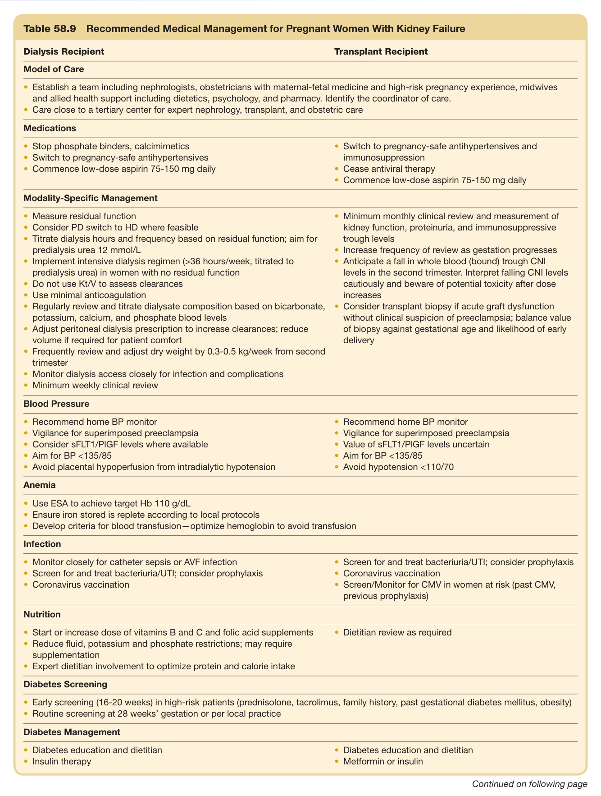

- **Part 2 (Page 31)**:
  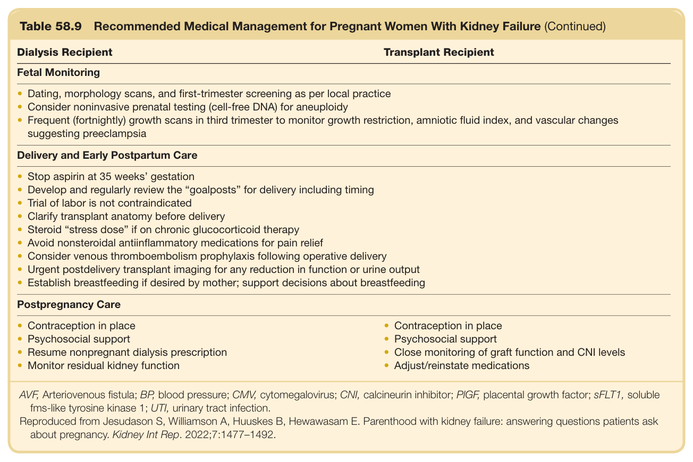

#### Table Data (CSV: [Table_58_9.csv](Table_58_9.csv))

```markdown
| Table Text (OCR) |
| :--- |
| Table 58.9 Recommended Medical Management for Pregnant Women With Kidney Failure Dialysis Recipient  Transplant Recipient    Model of Care    Establish a team including nephrologists, obstetricians with maternal-fetal medicine and high-risk pregnancy experience, midwives and allied health support including dietetics, psychology, and pharmacy. Identify the coordinator of care.Care close to a tertiary center for expert nephrology, transplant, and obstetric care    Medications    Stop phosphate binders, calcimimeticsSwitch to pregnancy-safe antihypertensivesCommence low-dose aspirin 75-150 mg daily  Switch to pregnancy-safe antihypertensives and immunosuppressionCease antiviral therapyCommence low-dose aspirin 75-150 mg daily    Modality-Specific Management    Measure residual functionConsider PD switch to HD where feasibleTitrate dialysis hours and frequency based on residual function; aim for predialysis urea 12 mmol/LImplement intensive dialysis regimen (>36 hours/week, titrated to predialysis urea) in women with no residual functionDo not use Kt/V to assess clearancesUse minimal anticoagulationRegularly review and titrate dialysate composition based on bicarbonate, potassium, calcium, and phosphate blood levelsAdjust peritoneal dialysis prescription to increase clearances; reduce volume if required for patient comfortFrequently review and adjust dry weight by 0.3-0.5 kg/week from second trimesterMonitor dialysis access closely for infection and complicationsMinimum weekly clinical review  Minimum monthly clinical review and measurement of kidney function, proteinuria, and immunosuppressive trough levelsIncrease frequency of review as gestation progressesAnticipate a fall in whole blood (bound) trough CNI levels in the second trimester. Interpret falling CNI levels cautiously and beware of potential toxicity after dose increasesConsider transplant biopsy if acute graft dysfunction without clinical suspicion of preeclampsia; balance value of biopsy against gestational age and likelihood of early delivery    Blood Pressure    Recommend home BP monitorVigilance for superimposed preeclampsiaConsider sFLT1/PIGF levels where availableAim for BP <135/85Avoid placental hypoperfusion from intradialytic hypotension  Recommend home BP monitorVigilance for superimposed preeclampsiaValue of sFLT1/PIGF levels uncertainAim for BP <135/85Avoid hypotension <110/70    Anemia    Use ESA to achieve target Hb 110 g/dLEnsure iron stored is replete according to local protocolsDevelop criteria for blood transfusion—optimize hemoglobin to avoid transfusion    Infection    Monitor closely for catheter sepsis or AVF infectionScreen for and treat bacteriuria/UTI; consider prophylaxisCoronavirus vaccination  Screen for and treat bacteriuria/UTI; consider prophylaxisCoronavirus vaccinationScreen/Monitor for CMV in women at risk (past CMV, previous prophylaxis)    Nutrition    Start or increase dose of vitamins B and C and folic acid supplementsReduce fluid, potassium and phosphate restrictions; may require supplementationExpert dietitian involvement to optimize protein and calorie intake  Dietitian review as required    Diabetes Screening    Early screening (16-20 weeks) in high-risk patients (prednisolone, tacrolimus, family history, past gestational diabetes mellitus, obesity)Routine screening at 28 weeks' gestation or per local practice    Diabetes Management    Diabetes education and dietitianInsulin therapy  Diabetes education and dietitianMetformin or insulin    Fetal Monitoring    Dating, morphology scans, and first-trimester screening as per local practiceConsider noninvasive prenatal testing (cell-free DNA) for aneuploidyFrequent (fortnightly) growth scans in third trimester to monitor growth restriction, amniotic fluid index, and vascular changes suggesting preeclampsia    Delivery and Early Postpartum Care    Stop aspirin at 35 weeks' gestationDevelop and regularly review the “goalposts” for delivery including timingTrial of labor is not contraindicatedClarify transplant anatomy before deliverySteroid “stress dose” if on chronic glucocorticoid therapyAvoid nonsteroidal antiinflammatory medications for pain reliefConsider venous thromboembolism prophylaxis following operative deliveryUrgent postdelivery transplant imaging for any reduction in function or urine outputEstablish breastfeeding if desired by mother; support decisions about breastfeeding    Postpregnancy Care    Contraception in placePsychosocial supportResume nonpregnant dialysis prescriptionMonitor residual kidney function  Contraception in placePsychosocial supportClose monitoring of graft function and CNI levelsAdjust/reinstate medications    AVF, Arteriovenous fistula;BP, blood pressure;CMV, cytomegalovirus;CNI, calcineurin inhibitor;PIGF, placental growth factor;sFLT1, soluble fms-like tyrosine kinase 1;UTI, urinary tract infection.Reproduced from Jesudason S, Williamson A, Huuskes B, Hewawasam E. Parenthood with kidney failure: answering questions patients ask about pregnancy.Kidney Int Rep. 2022;7:1477-1492. |
```

Table 58.9 Recommended Medical Management for Pregnant Women With Kidney Failure

---
