# 59. Infectious Diseases and the Kidney - Figures and Tables Index

This document lists all figures and tables extracted from `59. Infectious Diseases and the Kidney.pdf`.

## Table of Contents
- [Figures](#figures)
- [Tables](#tables)

---

## Figures

### Fig_59_1

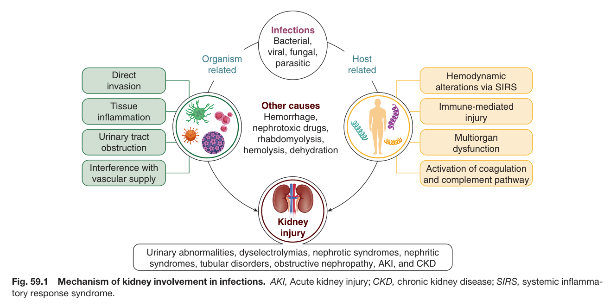

Fig. 59.1 Mechanism of kidney involvement in infections. AKI, Acute kidney injury; CKD, chronic kidney disease; SIRS, systemic inflamma- tory response syndrome.

---

### Fig_59_2

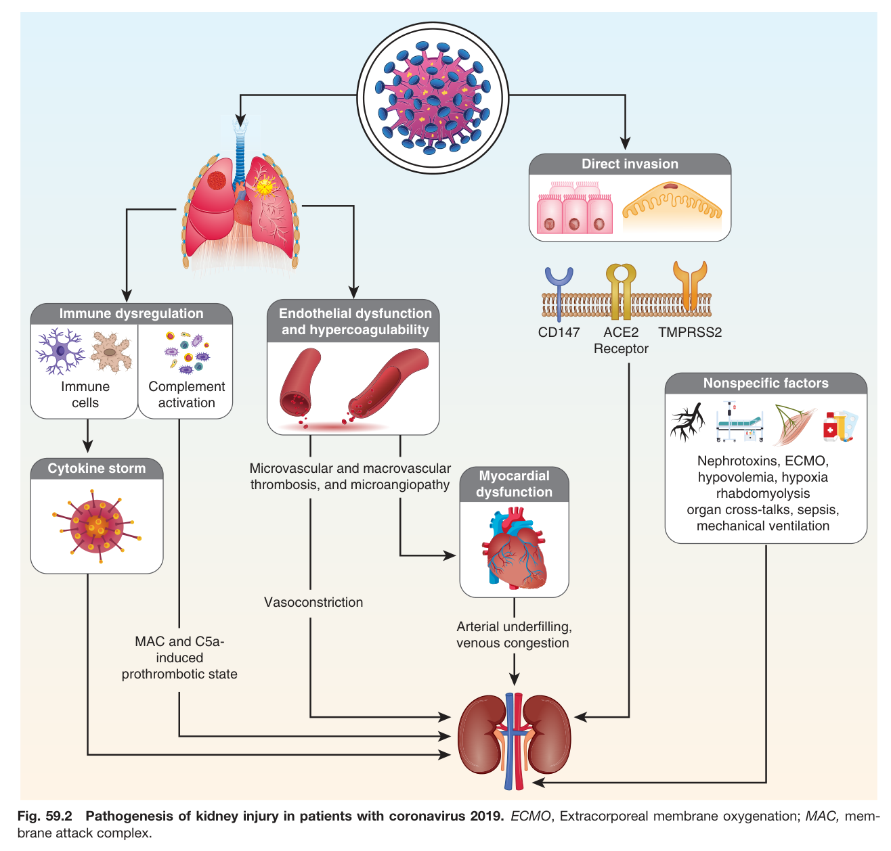

Fig. 59.2 Pathogenesis of kidney injury in patients with coronavirus 2019. ECMO, Extracorporeal membrane oxygenation; MAC, mem brane attack complex.

---

### Fig_59_3

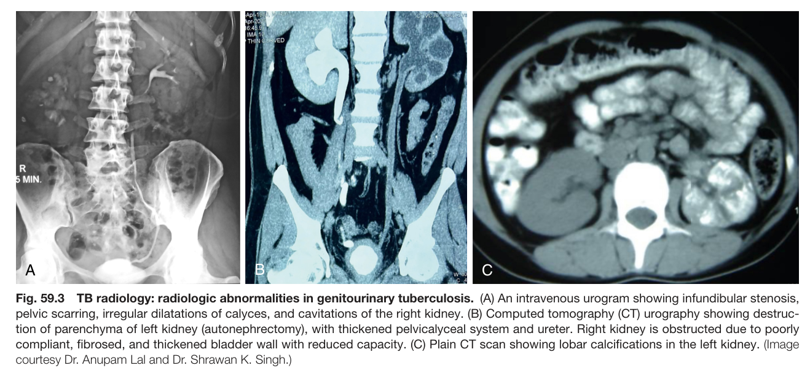

Fig. 59.3 TB radiology: radiologic abnormalities in genitourinary tuberculosis. (A) An intravenous urogram showing infundibular stenosis, pelvic scarring, irregular dilatations of calyces, and cavitations of the right kidney. (B) Computed tomography (CT) urography showing destruc tion of parenchyma of left kidney (autonephrectomy), with thickened pelvicalyceal system and ureter. Right kidney is obstructed due to poorl compliant, fibrosed, and thickened bladder wall with reduced capacity. (C) Plain CT scan showing lobar calcifications in the left kidney. (Image courtesy Dr. Anupam Lal and Dr. Shrawan K. Singh.)

---

### Fig_59_4

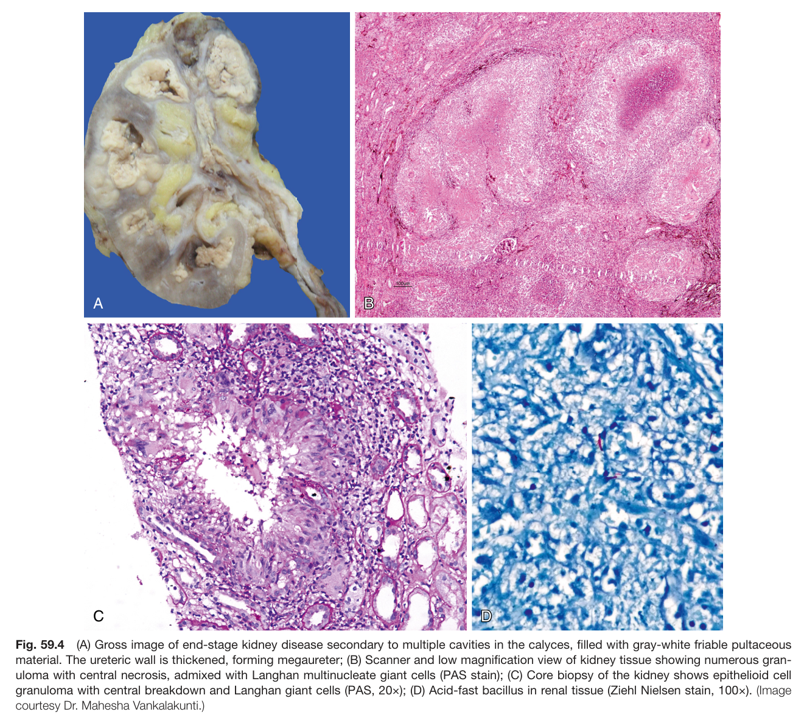

Fig. 59.4 (A) Gross image of end-stage kidney disease secondary to multiple cavities in the calyces, filled with gray-white friable pultaceous material. The ureteric wall is thickened, forming megaureter; (B) Scanner and low magnification view of kidney tissue showing numerous gran- uloma with central necrosis, admixed with Langhan multinucleate giant cells (PAS stain); (C) Core biopsy of the kidney shows epithelioid cel granuloma with central breakdown and Langhan giant cells (PAS, 20×); (D) Acid-fast bacillus in renal tissue (Ziehl Nielsen stain, 100×). (Image courtesy Dr. Mahesha Vankalakunti.)

---

### Fig_59_5

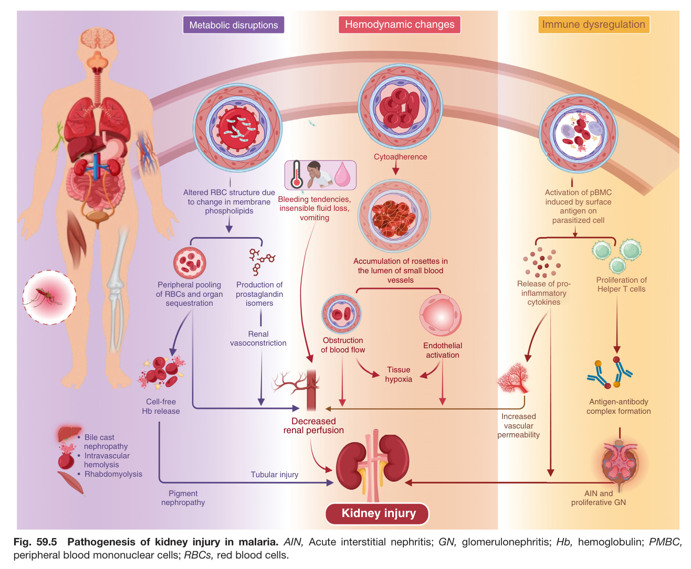

Fig. 59.5 Pathogenesis of kidney injury in malaria. AIN, Acute interstitial nephritis; GN, glomerulonephritis; Hb, hemoglobulin; PMBC, peripheral blood mononuclear cells; RBCs, red blood cells.

---

### Fig_59_6

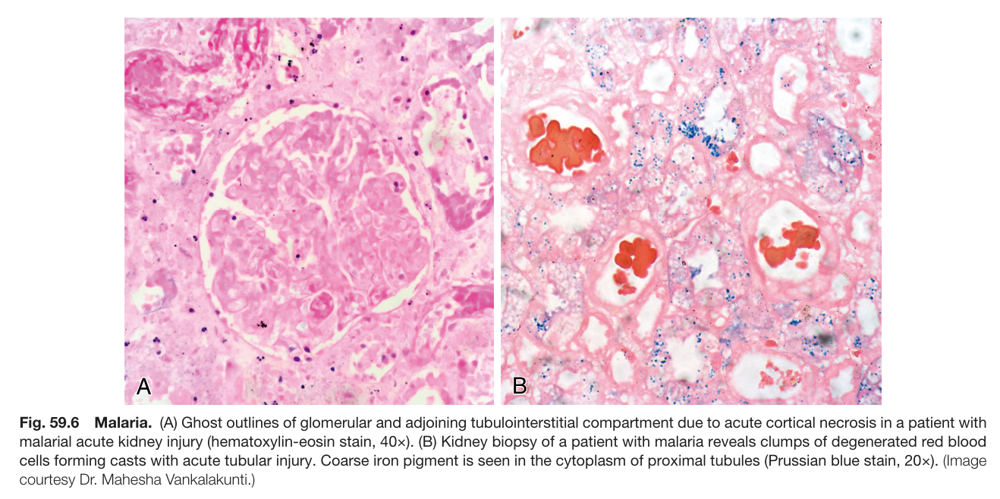

Fig. 59.6 Malaria. (A) Ghost outlines of glomerular and adjoining tubulointerstitial compartment due to acute cortical necrosis in a patient with malarial acute kidney injury (hematoxylin-eosin stain, 40×). (B) Kidney biopsy of a patient with malaria reveals clumps of degenerated red blood cells forming casts with acute tubular injury. Coarse iron pigment is seen in the cytoplasm of proximal tubules (Prussian blue stain, 20×). (Image courtesy Dr. Mahesha Vankalakunti.)

---

### Fig_59_7

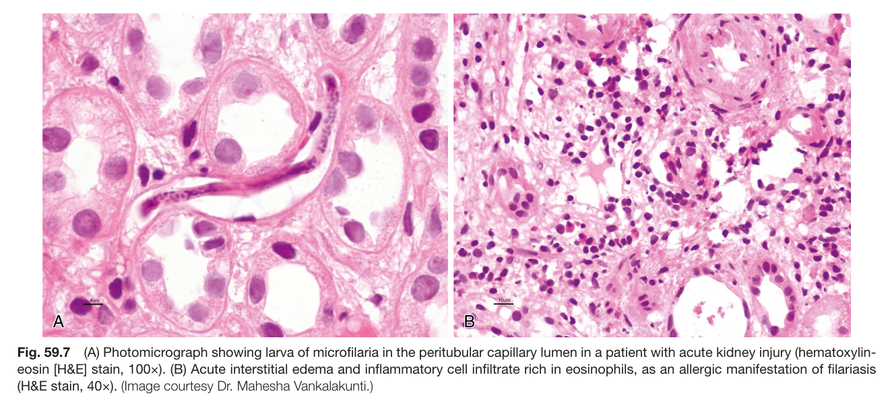

Fig. 59.7 (A) Photomicrograph showing larva of microfilaria in the peritubular capillary lumen in a patient with acute kidney injury (hematoxylin- eosin [H&E] stain, 100×). (B) Acute interstitial edema and inflammatory cell infiltrate rich in eosinophils, as an allergic manifestation of filariasis (H&E stain, 40×). (Image courtesy Dr. Mahesha Vankalakunti.)

---

### Fig_59_8

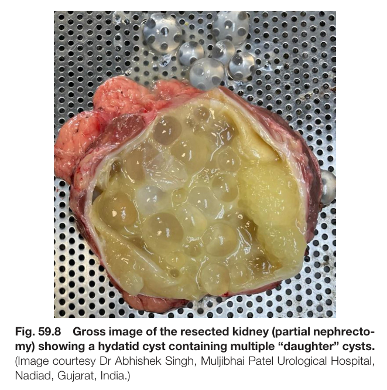

Fig. 59.8 Gross image of the resected kidney (partial nephrecto- my) showing a hydatid cyst containing multiple “daughter” cysts. (Image courtesy Dr Abhishek Singh, Muljibhai Patel Urological Hospital, Nadiad, Gujarat, India.)

---

### Fig_59_9

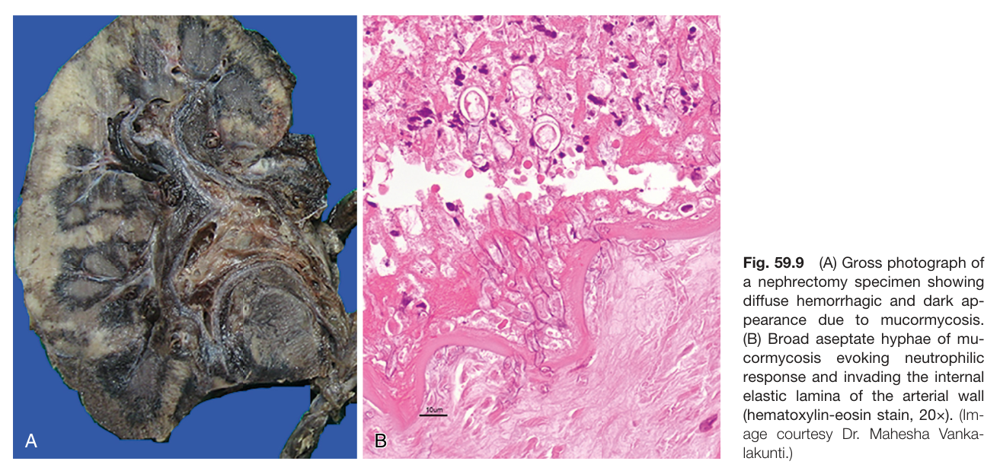

Fig. 59.9 (A) Gross photograph of a nephrectomy specimen showing diffuse hemorrhagic and dark ap- pearance due to mucormycosis. (B) Broad aseptate hyphae of mu- cormycosis evoking neutrophilic response and invading the internal elastic lamina of the arterial wall (hematoxylin-eosin stain, 20×). (Im- age courtesy Dr. Mahesha Vanka- lakunti.)

---

### Fig_59_10

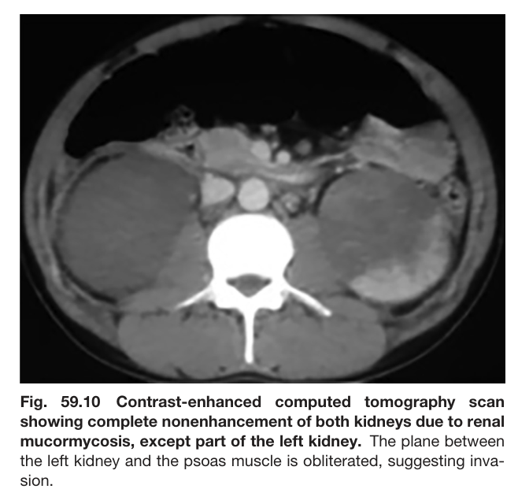

Fig. 59.10 Contrast-enhanced computed tomography scan showing complete nonenhancement of both kidneys due to renal mucormycosis, except part of the left kidney. The plane between the left kidney and the psoas muscle is obliterated, suggesting inva- sion.

---

## Tables

### Table_59_1

#### Table Image

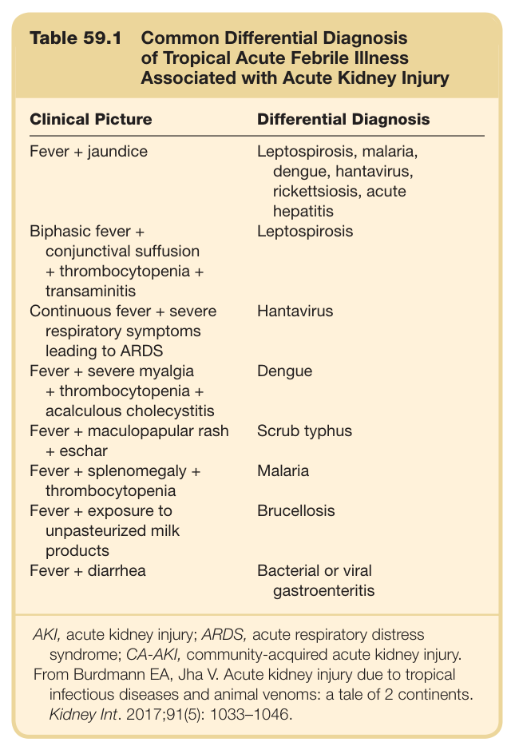

#### Table Data (CSV: [Table_59_1.csv](Table_59_1.csv))

```markdown
| Table Text (OCR) |
| :--- |
| Table 59.1  Common Differential Diagnosis of Tropical Acute Febrile Illness Associated with Acute Kidney Injury Clinical Picture  Differential Diagnosis    Fever + jaundice  Leptospirosis, malaria, dengue, hantavirus, rickettsiosis, acute hepatitis    Biphasic fever + conjunctival suffusion + thrombocytopenia + transaminitis  Leptospirosis    Continuous fever + severe respiratory symptoms leading to ARDS  Hantavirus    Fever + severe myalgia + thrombocytopenia + acalculous cholecystitis  Dengue    Fever + maculopapular rash + eschar  Scrub typhus    Fever + splenomegaly + thrombocytopenia  Malaria    Fever + exposure to unpasteurized milk products  Brucellosis    Fever + diarrhea  Bacterial or viral gastroenteritis AKI, acute kidney injury; ARDS, acute respiratory distress syndrome; CA-AKI, community-acquired acute kidney injury. From Burdmann EA, Jha V. Acute kidney injury due to tropical infectious diseases and animal venoms: a tale of 2 continents. Kidney Int. 2017;91(5): 1033–1046. |
```

Table 59.1 Common Differential Diagnosis of Tropical Acute Febrile Illness Associated with Acute Kidney Injury

---

### Table_59_2

#### Table Images (2 Parts)

- **Part 1 (Page 5)**:
  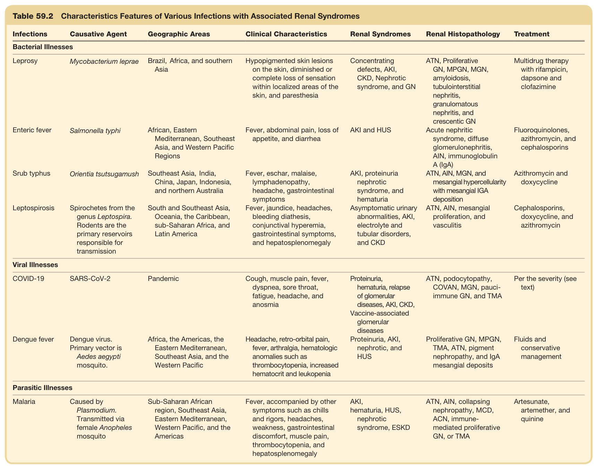

- **Part 2 (Page 6)**:
  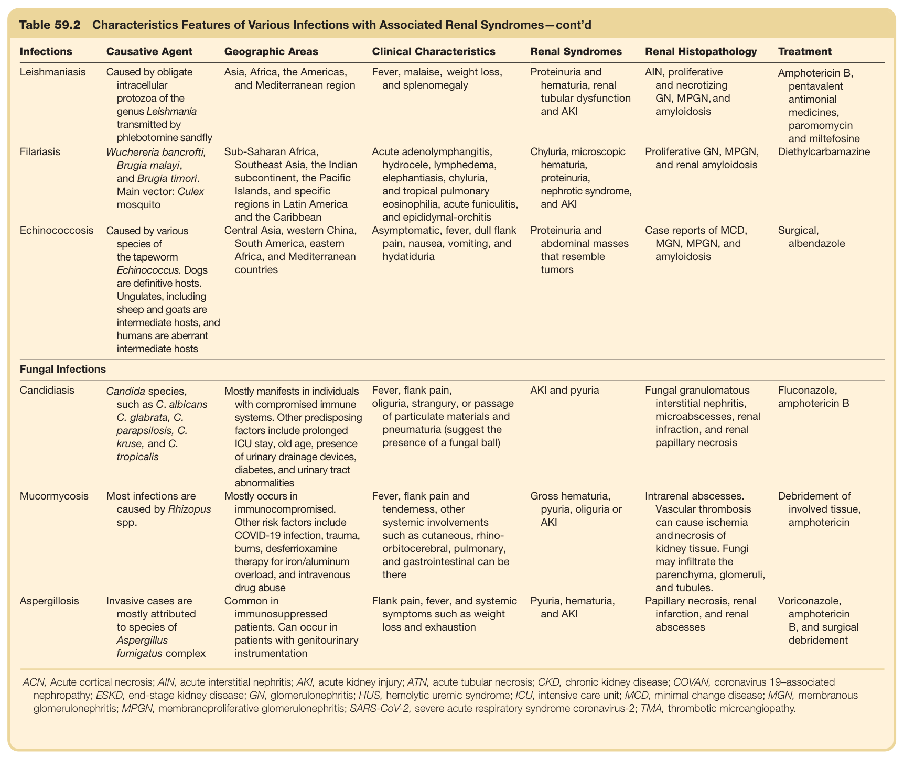

#### Table Data (CSV: [Table_59_2.csv](Table_59_2.csv))

```markdown
| Table Text (OCR) |
| :--- |
| Table 59.2Characteristics Features of Various Infections with Associated Renal Syndromes Infections  Causative Agent  Geographic Areas  Clinical Characteristics  Renal Syndromes  Renal Histopathology  Treatment    Bacterial Illnesses    Leprosy  Mycobacterium leprae  Brazil, Africa, and southern Asia  Hypopigmented skin lesions on the skin, diminished or complete loss of sensation within localized areas of the skin, and paresthesia  Concentrating defects, AKI, CKD, Nephrotic syndrome, and GN  ATN, Proliferative GN, MPGN, MGN, amyloidosis, tubulointerstitial nephritis, granulomatous nephritis, and crescentic GN  Multidrug therapy with rifampicin, dapsone and clofazimine    Enteric fever  Salmonella typhi  African, Eastern Mediterranean, Southeast Asia, and Western Pacific Regions  Fever, abdominal pain, loss of appetite, and diarrhea  AKI and HUS  Acute nephritic syndrome, diffuse glomerulonephritis, AIN, immunoglobulin A (IgA)  Fluoroquinolones, azithromycin, and cephalosporins    Srub typhus  Orientia tsutsugamush  Southeast Asia, India, China, Japan, Indonesia, and northern Australia  Fever, eschar, malaise, lymphadenopathy, headache, gastrointestinal symptoms  AKI, proteinuria nephrotic syndrome, and hematuria  ATN, AIN, MGN, and mesangial hypercellularity with mesangial IGA deposition  Azithromycin and doxycycline    Leptospirosis  Spirochetes from the genus Leptospira. Rodents are the primary reservoirs responsible for transmission  South and Southeast Asia, Oceania, the Caribbean, sub-Saharan Africa, and Latin America  Fever, jaundice, headaches, bleeding diathesis, conjunctival hyperemia, gastrointestinal symptoms, and hepatosplenomegaly  Asymptomatic urinary abnormalities, AKI, electrolyte and tubular disorders, and CKD  ATN, AIN, mesangial proliferation, and vasculitis  Cephalosporins, doxycycline, and azithromycin    Viral Illnesses    COVID-19  SARS-CoV-2  Pandemic  Cough, muscle pain, fever, dyspnea, sore throat, fatigue, headache, and anosmia  Proteinuria, hematuria, relapse of glomerular diseases, AKI, CKD, Vaccine-associated glomerular diseases  ATN, podocytopathy, COVAN, MGN, pauci-immune GN, and TMA  Per the severity (see text)    Dengue fever  Dengue virus. Primary vector is Aedes aegypti mosquito.  Africa, the Americas, the Eastern Mediterranean, Southeast Asia, and the Western Pacific  Headache, retro-orbital pain, fever, arthralgia, hematologic anomalies such as thrombocytopenia, increased hematocrit and leukopenia  Proteinuria, AKI, nephrotic, and HUS  Proliferative GN, MPGN, TMA, ATN, pigment nephropathy, and IgA mesangial deposits  Fluids and conservative management    Parasitic Illnesses    Malaria  Caused by Plasmodium. Transmitted via female Anopheles mosquito  Sub-Saharan African region, Southeast Asia, Eastern Mediterranean, Western Pacific, and the Americas  Fever, accompanied by other symptoms such as chills and rigors, headaches, weakness, gastrointestinal discomfort, muscle pain, thrombocytopenia, and hepatosplenomegaly  AKI, hematuria, HUS, nephrotic syndrome, ESKD  ATN, AIN, collapsing nephropathy, MCD, ACN, immune-mediated proliferative GN, or TMA  Artesunate, artemether, and quinine |
```

Table 59.2 Characteristics Features of Various Infections with Associated Renal Syndromes—cont’d

---
