# 60. Care of the Older Adult With Chronic Kidney Disease - Figures and Tables Index

This document lists all figures and tables extracted from `60. Care of the Older Adult With Chronic Kidney Disease.pdf`.

## Table of Contents
- [Figures](#figures)
- [Tables](#tables)

---

## Figures

### Fig_60_1

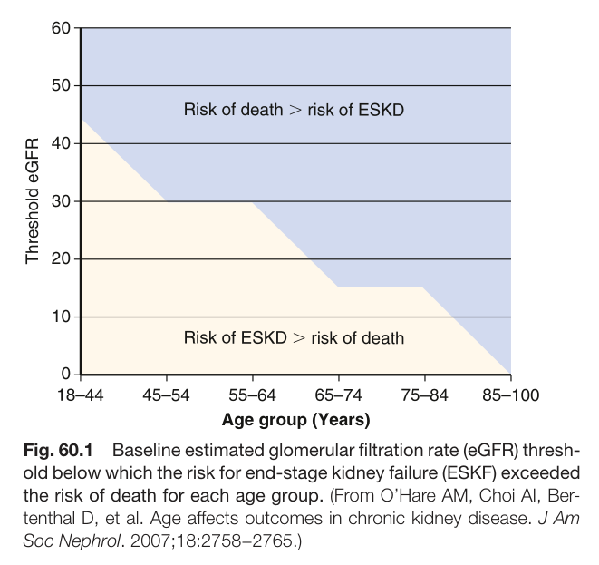

Fig. 60.1 Baseline estimated glomerular filtration rate (eGFR) thresh- old below which the risk for end-stage kidney failure (ESKF) exceeded the risk of death for each age group. (From O’Hare AM, Choi AI, Ber- tenthal D, et al. Age affects outcomes in chronic kidney disease. J Am Soc Nephrol. 2007;18:2758−2765.)

---

### Fig_60_2

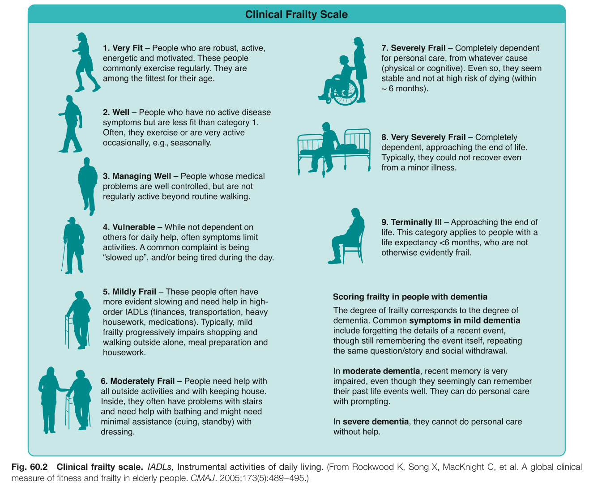

Fig. 60.2 Clinical frailty scale. IADLs, Instrumental activities of daily living. (From Rockwood K, Song X, MacKnight C, et al. A global clinica measure of fitness and frailty in elderly people. CMAJ. 2005;173(5):489−495.)

---

### Fig_60_3

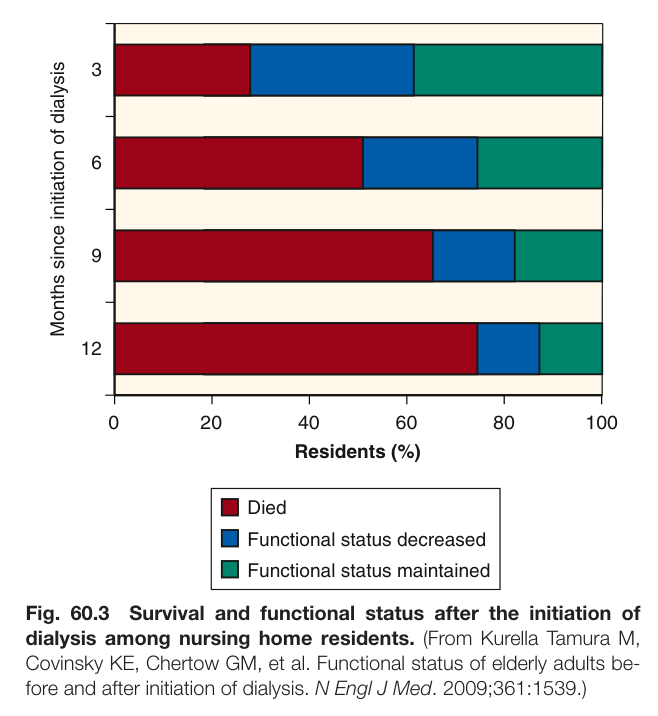

Fig. 60.3 Survival and functional status after the initiation of dialysis among nursing home residents. (From Kurella Tamura M, Covinsky KE, Chertow GM, et al. Functional status of elderly adults be- fore and after initiation of dialysis. N Engl J Med. 2009;361:1539.)

---

### Fig_60_4

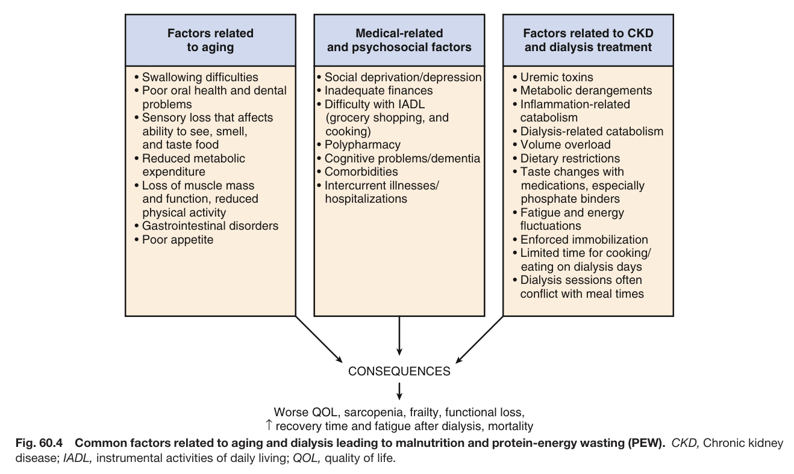

Fig. 60.4 Common factors related to aging and dialysis leading to malnutrition and protein-energy wasting (PEW). CKD, Chronic kidney disease; IADL, instrumental activities of daily living; QOL, quality of life.

---

### Fig_60_5

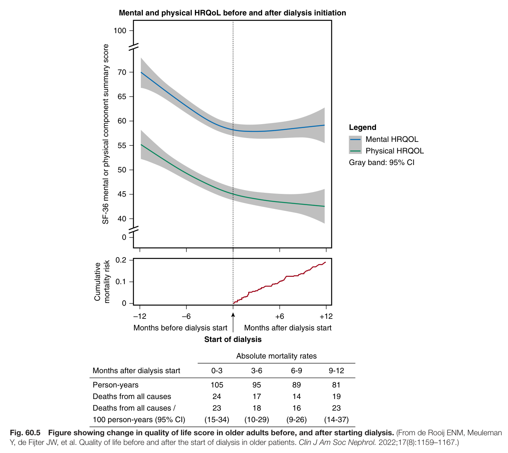

Fig. 60.5 Figure showing change in quality of life score in older adults before, and after starting dialysis. (From de Rooij ENM, Meuleman Y, de Fijter JW, et al. Quality of life before and after the start of dialysis in older patients. Clin J Am Soc Nephrol. 2022;17(8):1159–1167.)

---

### Fig_60_6

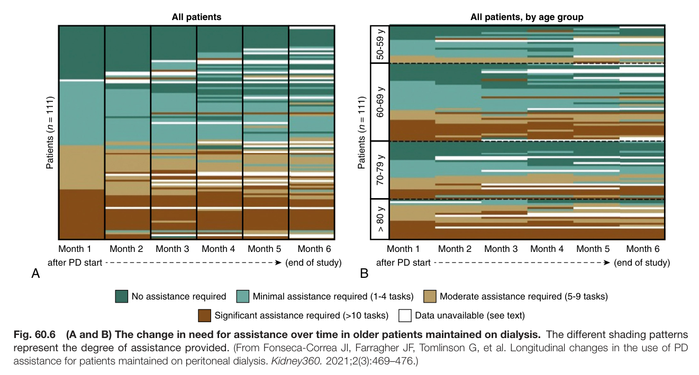

Fig. 60.6 (A and B) The change in need for assistance over time in older patients maintained on dialysis. The different shading patterns represent the degree of assistance provided. (From Fonseca-Correa JI, Farragher JF, Tomlinson G, et al. Longitudinal changes in the use of PD assistance for patients maintained on peritoneal dialysis. Kidney360. 2021;2(3):469–476.)

---

### Fig_60_7

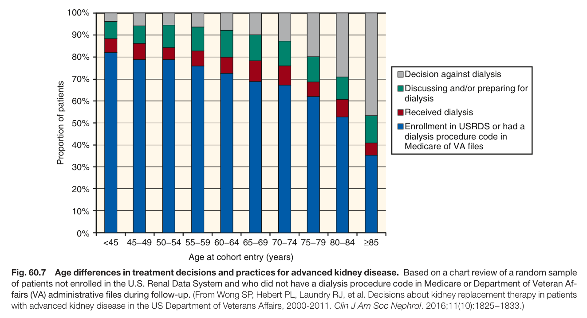

Fig. 60.7 Age differences in treatment decisions and practices for advanced kidney disease. Based on a chart review of a random sample of patients not enrolled in the U.S. Renal Data System and who did not have a dialysis procedure code in Medicare or Department of Veteran Af- fairs (VA) administrative files during follow-up. (From Wong SP, Hebert PL, Laundry RJ, et al. Decisions about kidney replacement therapy in patients with advanced kidney disease in the US Department of Veterans Affairs, 2000-2011. Clin J Am Soc Nephrol. 2016;11(10):1825−1833.)

---

### Fig_60_8

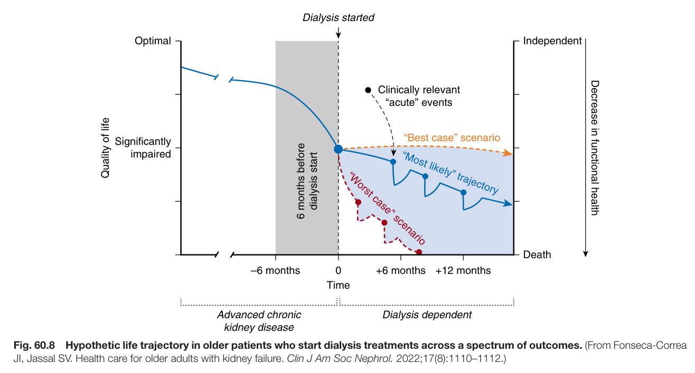

Fig. 60.8 Hypothetic life trajectory in older patients who start dialysis treatments across a spectrum of outcomes. (From Fonseca-Correa JI, Jassal SV. Health care for older adults with kidney failure. Clin J Am Soc Nephrol. 2022;17(8):1110–1112.)

---

### Fig_60_9

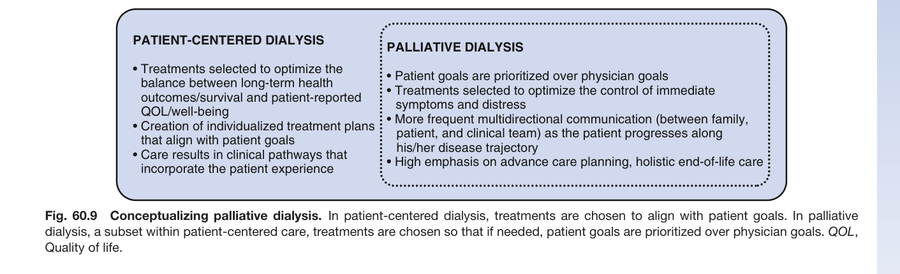

Fig. 60.9 Conceptualizing palliative dialysis. In patient-centered dialysis, treatments are chosen to align with patient goals. In palliative dialysis, a subset within patient-centered care, treatments are chosen so that if needed, patient goals are prioritized over physician goals. QOL, Quality of life.

---

## Tables

### Table_60_1

#### Table Image

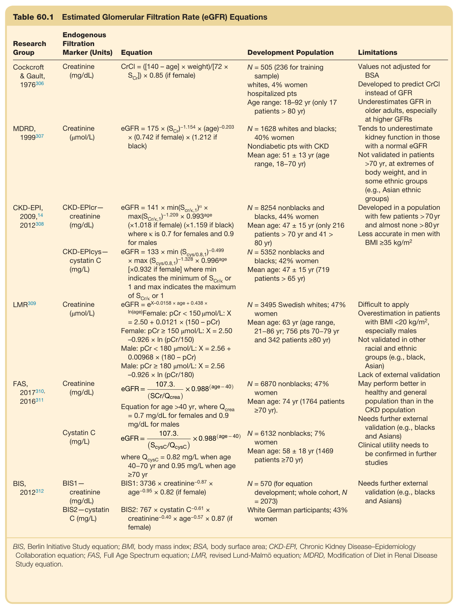

#### Table Data (CSV: [Table_60_1.csv](Table_60_1.csv))

```markdown
| Table Text (OCR) |
| :--- |
| Table 60.1  Estimated Glomerular Filtration Rate (eGFR) Equations Research Group  Endogenous Filtration Marker (Units)  Equation  Development Population  Limitations    Cockcroft & Gault, 1976306  Creatinine (mg/dL)   CrCl = ([140 - age] \times weight)/[72 \times S_{Cr}) \times 0.85  (if female)  N = 505 (236 for training sample)whites, 4% women hospitalized ptsAge range: 18–92 yr (only 17 patients > 80 yr)  Values not adjusted for BSADeveloped to predict CrCl instead of GFRUnderestimates GFR in older adults, especially at higher GFRs    MDRD, 1999307  Creatinine (μmol/L)   eGFR = 175 \times (S_{Cr})^{-1.154} \times (age)^{-0.203} \times (0.742 \text{ if female}) \times (1.212 \text{ if black})   N = 1628 whites and blacks; 40% womenNondiabetic pts with CKDMean age: 51 ± 13 yr (age range, 18–70 yr)  Tends to underestimate kidney function in those with a normal eGFRNot validated in patients >70 yr, at extremes of body weight, and in some ethnic groups (e.g., Asian ethnic groups)    CKD-EPI, 2009,142012308  CKD-EPIcr- creatinine (mg/dL)   eGFR = 141 \times \min(S_{Cr/k,1})^{\alpha} \times \max(S_{Cr/k,1})^{-1.209} \times 0.993^{age} \times (1.018 \text{ if female}) \times (1.159 \text{ if black})  where κ is 0.7 for females and 0.9 for males  N = 8254 nonblacks and blacks, 44% womenMean age: 47 ± 15 yr (only 216 patients > 70 yr and 41 > 80 yr)  Developed in a population with few patients >70 yr and almost none >80 yrLess accurate in men with BMI ≥35 kg/m2    CKD-EPIcys- cystatin C (mg/L)   eGFR = 133 \times \min(S_{cys/0.8,1})^{-0.499} \times \max(S_{cys/0.8,1})^{-1.328} \times 0.996^{age} \times (0.932 \text{ if female})  where min indicates the minimum of  S_{Cr/k}  or 1 and max indicates the maximum of  S_{Cr/k}  or 1  N = 5352 nonblacks and blacks; 42% womenMean age: 47 ± 15 yr (719 patients > 65 yr)    LMR309  Creatinine (μmol/L)   eGFR = e^{X-0.0158 \times age + 0.438 \times ln(age)} Female: pCr < 150 μmol/L: X = 2.50 + 0.0121 × (150 - pCr)Female: pCr ≥ 150 μmol/L: X = 2.50 -0.926 × ln (pCr/150)Male: pCr < 180 μmol/L: X = 2.56 + 0.00968 × (180 - pCr)Male: pCr ≥ 180 μmol/L: X = 2.56 -0.926 × ln (pCr/180)  N = 3495 Swedish whites; 47% womenMean age: 63 yr (age range, 21–86 yr; 756 pts 70–79 yr and 342 patients ≥80 yr)  Difficult to applyOverestimation in patients with BMI <20 kg/m2, especially malesNot validated in other racial and ethnic groups (e.g., black, Asian)Lack of external validation    FAS, 2017310, 2016311  Creatinine (mg/dL)   eGFR = \frac{107.3.}{(SCr/Q_{crea})} \times 0.988^{(age - 40)} Equation for age >40 yr, where  Q_{crea}  = 0.7 mg/dL for females and 0.9 mg/dL for males  N = 6870 nonblacks; 47% womenMean age: 74 yr (1764 patients ≥70 yr).  May perform better in healthy and general population than in the CKD populationNeeds further external validation (e.g., blacks and Asians)Clinical utility needs to be confirmed in further studies    Cystatin C (mg/L)   eGFR = \frac{107.3.}{(ScysC/Q_{cysC})} \times 0.988^{(age - 40)} where  Q_{cysC}  = 0.82 mg/L when age 40–70 yr and 0.95 mg/L when age ≥70 yr  N = 6132 nonblacks; 7% womenMean age: 58 ± 18 yr (1469 patients ≥70 yr)    BIS, 2012312  BIS1- creatinine (mg/dL)   BIS1: 3736 \times creatinine^{-0.87} \times age^{-0.95} \times 0.82  (if female)  N = 570 (for equation development; whole cohort, N = 2073)  Needs further external validation (e.g., blacks and Asians)    BIS2-cystatin C (mg/L)   BIS2: 767 \times cystatin C^{-0.61} \times creatinine^{-0.40} \times age^{-0.57} \times 0.87  (if female)  White German participants; 43% women BIS, Berlin Initiative Study equation; BMI, body mass index; BSA, body surface area; CKD-EPI, Chronic Kidney Disease–Epidemiology Collaboration equation; FAS, Full Age Spectrum equation; LMR, revised Lund-Malmö equation; MDRD, Modification of Diet in Renal Disease Study equation. |
```

Table 60.1 Estimated Glomerular Filtration Rate (eGFR) Equations

---

### Table_60_2

#### Table Image

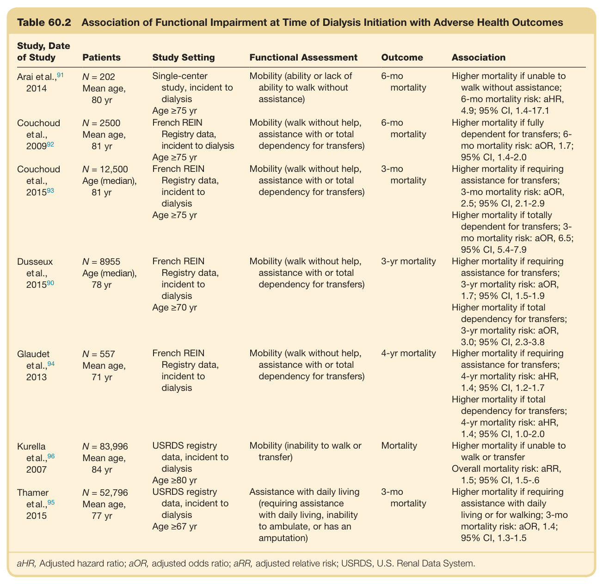

#### Table Data (CSV: [Table_60_2.csv](Table_60_2.csv))

```markdown
| Table Text (OCR) |
| :--- |
| Table 60.2 Association of Functional Impairment at Time of Dialysis Initiation with Adverse Health Outcomes Study, Date of Study  Patients  Study Setting  Functional Assessment  Outcome  Association    Arai et al., ^{91} 2014  N = 202Mean age,80 yr  Single-center study, incident to dialysisAge ≥75 yr  Mobility (ability or lack of ability to walk without assistance)  6-momortality  Higher mortality if unable to walk without assistance;6-mo mortality risk: aHR, 4.9; 95% CI, 1.4-17.1    Couchoud et al., 2009^{92}   N = 2500Mean age,81 yr  French REINRegistry data, incident to dialysisAge ≥75 yr  Mobility (walk without help, assistance with or total dependency for transfers)  6-momortality  Higher mortality if fully dependent for transfers; 6-mo mortality risk: aOR, 1.7; 95% CI, 1.4-2.0    Couchoud et al., 2015^{93}   N = 12,500Age (median),81 yr  French REINRegistry data, incident to dialysisAge ≥75 yr  Mobility (walk without help, assistance with or total dependency for transfers)  3-momortality  Higher mortality if requiring assistance for transfers;3-mo mortality risk: aOR, 2.5; 95% CI, 2.1-2.9Higher mortality if totally dependent for transfers; 3-mo mortality risk: aOR, 6.5; 95% CI, 5.4-7.9    Dusseux et al., 2015^{90}   N = 8955Age (median),78 yr  French REINRegistry data, incident to dialysisAge ≥70 yr  Mobility (walk without help, assistance with or total dependency for transfers)  3-yr mortality  Higher mortality if requiring assistance for transfers;3-yr mortality risk: aOR, 1.7; 95% CI, 1.5-1.9Higher mortality if total dependency for transfers;3-yr mortality risk: aOR, 3.0; 95% CI, 2.3-3.8    Glaudet et al., ^{94} 2013  N = 557Mean age,71 yr  French REINRegistry data, incident to dialysis  Mobility (walk without help, assistance with or total dependency for transfers)  4-yr mortality  Higher mortality if requiring assistance for transfers;4-yr mortality risk: aHR, 1.4; 95% CI, 1.2-1.7Higher mortality if total dependency for transfers;4-yr mortality risk: aHR, 1.4; 95% CI, 1.0-2.0    Kurella et al., ^{96} 2007  N = 83,996Mean age,84 yr  USRDS registry data, incident to dialysisAge ≥80 yr  Mobility (inability to walk or transfer)  Mortality  Higher mortality if unable to walk or transferOverall mortality risk: aRR, 1.5; 95% CI, 1.5-.6    Thamer et al., ^{95} 2015  N = 52,796Mean age,77 yr  USRDS registry data, incident to dialysisAge ≥67 yr  Assistance with daily living (requiring assistance with daily living, inability to ambulate, or has an amputation)  3-momortality  Higher mortality if requiring assistance with daily living or for walking; 3-momortality risk: aOR, 1.4; 95% CI, 1.3-1.5 aHR, Adjusted hazard ratio; aOR, adjusted odds ratio; aRR, adjusted relative risk; USRDS, U.S. Renal Data System. |
```

Table 60.2 Association of Functional Impairment at Time of Dialysis Initiation with Adverse Health Outcomes

---

### Table_60_3

#### Table Image

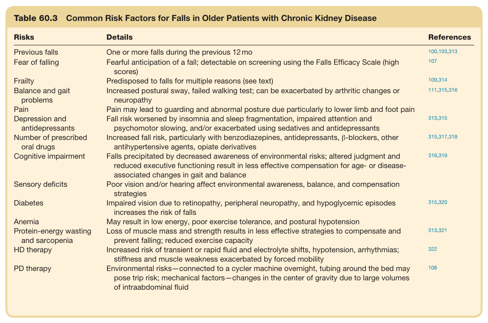

#### Table Data (CSV: [Table_60_3.csv](Table_60_3.csv))

```markdown
| Table Text (OCR) |
| :--- |
| Table 60.3 Common Risk Factors for Falls in Older Patients with Chronic Kidney Disease Risks  Details  References    Previous falls  One or more falls during the previous 12 mo  100,103,313    Fear of falling  Fearful anticipation of a fall; detectable on screening using the Falls Efficacy Scale (high scores)  107    Frailty  Predisposed to falls for multiple reasons (see text)  109,314    Balance and gait problems  Increased postural sway, failed walking test; can be exacerbated by arthritic changes or neuropathy  111,315,316    Pain  Pain may lead to guarding and abnormal posture due particularly to lower limb and foot pain      Depression and antidepressants  Fall risk worsened by insomnia and sleep fragmentation, impaired attention and psychomotor slowing, and/or exacerbated using sedatives and antidepressants  313,315    Number of prescribed oral drugs  Increased fall risk, particularly with benzodiazepines, antidepressants, β-blockers, other antihypertensive agents, opiate derivatives  315,317,318    Cognitive impairment  Falls precipitated by decreased awareness of environmental risks; altered judgment and reduced executive functioning result in less effective compensation for age- or disease-associated changes in gait and balance  316,319    Sensory deficits  Poor vision and/or hearing affect environmental awareness, balance, and compensation strategies      Diabetes  Impaired vision due to retinopathy, peripheral neuropathy, and hypoglycemic episodes increases the risk of falls  315,320    Anemia  May result in low energy, poor exercise tolerance, and postural hypotension      Protein-energy wasting and sarcopenia  Loss of muscle mass and strength results in less effective strategies to compensate and prevent falling; reduced exercise capacity  313,321    HD therapy  Increased risk of transient or rapid fluid and electrolyte shifts, hypotension, arrhythmias; stiffness and muscle weakness exacerbated by forced mobility  322    PD therapy  Environmental risks—connected to a cycler machine overnight, tubing around the bed may pose trip risk; mechanical factors—changes in the center of gravity due to large volumes of intraabdominal fluid  108 |
```

Table 60.3 Common Risk Factors for Falls in Older Patients with Chronic Kidney Disease

---

### Table_60_4

#### Table Images (2 Parts)

- **Part 1 (Page 10)**:
  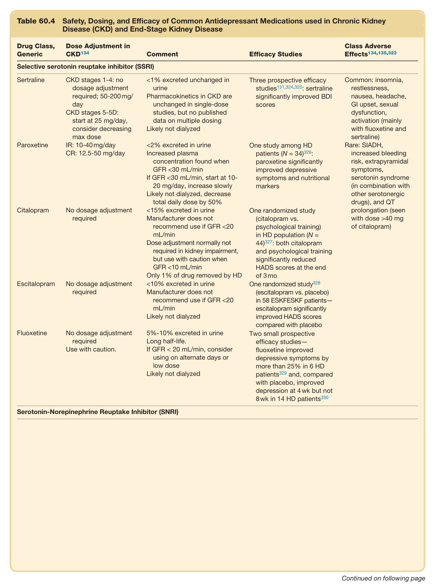

- **Part 2 (Page 11)**:
  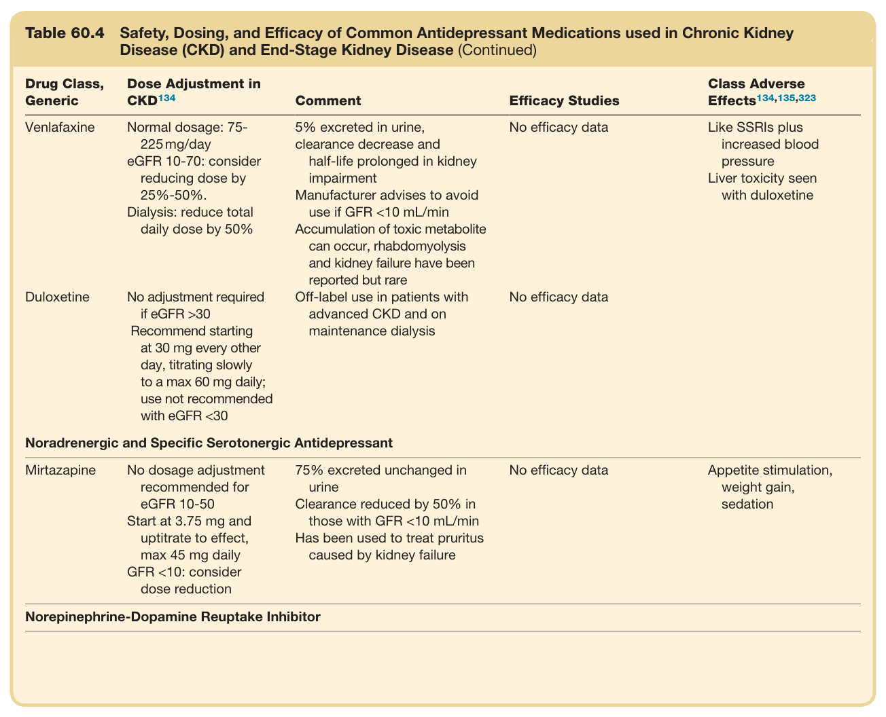

#### Table Data (CSV: [Table_60_4.csv](Table_60_4.csv))

```markdown
| Table Text (OCR) |
| :--- |
| Table 60.4  Safety, Dosing, and Efficacy of Common Antidepressant Medications used in Chronic Kidney Disease (CKD) and End-Stage Kidney Disease Drug Class, Generic  Dose Adjustment in CKD ^{134}   Comment  Efficacy Studies  Class Adverse Effects ^{134,135,323}     Selective serotonin reuptake inhibitor (SSRI)    Sertraline  CKD stages 1-4: no dosage adjustment required; 50-200 mg/dayCKD stages 5-5D: start at 25 mg/day, consider decreasing max dose  <1% excreted unchanged in urinePharmacokinetics in CKD are unchanged in single-dose studies, but no published data on multiple dosingLikely not dialyzed  Three prospective efficacy studies ^{131,324,325} : sertraline significantly improved BDI scores  Common: insomnia, restlessness, nausea, headache, GI upset, sexual dysfunction, activation (mainly with fluoxetine and sertraline)    Paroxetine  IR: 10-40 mg/dayCR: 12.5-50 mg/day  <2% excreted in urineIncreased plasma concentration found when GFR <30 mL/minIf GFR <30 mL/min, start at 10-20 mg/day, increase slowlyLikely not dialyzed, decrease total daily dose by 50%  One study among HD patients (N = 34) ^{326} : paroxetine significantly improved depressive symptoms and nutritional markers  Rare: SIADH, increased bleeding risk, extrapyramidal symptoms, serotonin syndrome (in combination with other serotonergic drugs), and QT prolongation (seen with dose >40 mg of citalopram)    Citalopram  No dosage adjustment required  <15% excreted in urineManufacturer does not recommend use if GFR <20 mL/minDose adjustment normally not required in kidney impairment, but use with caution when GFR <10 mL/minOnly 1% of drug removed by HD  One randomized study (citalopram vs. psychological training) in HD population (N = 44) ^{327} : both citalopram and psychological training significantly reduced HADS scores at the end of 3 mo      Escitalopram  No dosage adjustment required  <10% excreted in urineManufacturer does not recommend use if GFR <20 mL/minLikely not dialyzed  One randomized study ^{328} (escitalopram vs. placebo) in 58 ESKFESKF patients—escitalopram significantly improved HADS scores compared with placebo      Fluoxetine  No dosage adjustment requiredUse with caution.  5%-10% excreted in urineLong half-life.If GFR < 20 mL/min, consider using on alternate days or low doseLikely not dialyzed  Two small prospective efficacy studies—fluoxetine improved depressive symptoms by more than 25% in 6 HD patients ^{329}  and, compared with placebo, improved depression at 4 wk but not 8 wk in 14 HD patients ^{330}       Venlafaxine  Normal dosage: 75-225 mg/dayeGFR 10-70: consider reducing dose by 25%-50%.Dialysis: reduce total daily dose by 50%  5% excreted in urine, clearance decrease and half-life prolonged in kidney impairmentManufacturer advises to avoid use if GFR <10 mL/minAccumulation of toxic metabolite can occur, rhabdomyolysis and kidney failure have been reported but rare  No efficacy data  Like SSRIs plus increased blood pressureLiver toxicity seen with duloxetine    Duloxetine  No adjustment required if eGFR >30Recommend starting at 30 mg every other day, titrating slowly to a max 60 mg daily; use not recommended with eGFR <30  Off-label use in patients with advanced CKD and on maintenance dialysis  No efficacy data      Noradrenergic and Specific Serotonergic Antidepressant    Mirtazapine  No dosage adjustment recommended for eGFR 10-50Start at 3.75 mg and uptitrate to effect, max 45 mg dailyGFR <10: consider dose reduction  75% excreted unchanged in urineClearance reduced by 50% in those with GFR <10 mL/minHas been used to treat pruritus caused by kidney failure  No efficacy data  Appetite stimulation, weight gain, sedation    Norepinephrine-Dopamine Reuptake Inhibitor |
```

Table 60.4 Safety, Dosing, and Efficacy of Common Antidepressant Medications used in Chronic Kidney Disease (CKD) and End-Stage Kidney Disease

---

### Table_60_5

#### Table Image

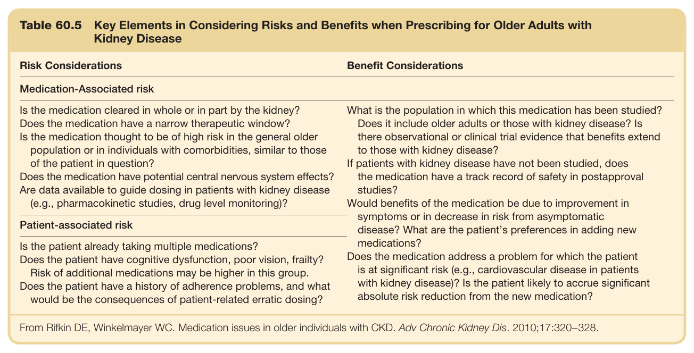

#### Table Data (CSV: [Table_60_5.csv](Table_60_5.csv))

```markdown
| Table Text (OCR) |
| :--- |
| Table 60.5 Key Elements in Considering Risks and Benefits when Prescribing for Older Adults with Kidney Disease Risk Considerations  Benefit Considerations    Medication-Associated risk    Is the medication cleared in whole or in part by the kidney?Does the medication have a narrow therapeutic window?Is the medication thought to be of high risk in the general older population or in individuals with comorbidities, similar to those of the patient in question?Does the medication have potential central nervous system effects?Are data available to guide dosing in patients with kidney disease (e.g., pharmacokinetic studies, drug level monitoring)?  What is the population in which this medication has been studied?Does it include older adults or those with kidney disease? Is there observational or clinical trial evidence that benefits extend to those with kidney disease?If patients with kidney disease have not been studied, does the medication have a track record of safety in postapproval studies?Would benefits of the medication be due to improvement in symptoms or in decrease in risk from asymptomatic disease? What are the patient's preferences in adding new medications?Does the medication address a problem for which the patient is at significant risk (e.g., cardiovascular disease in patients with kidney disease)? Is the patient likely to accrue significant absolute risk reduction from the new medication?    Patient-associated risk    Is the patient already taking multiple medications?Does the patient have cognitive dysfunction, poor vision, frailty?Risk of additional medications may be higher in this group.Does the patient have a history of adherence problems, and what would be the consequences of patient-related erratic dosing? From Rifkin DE, Winkelmayer WC. Medication issues in older individuals with CKD. Adv Chronic Kidney Dis. 2010;17:320−328. |
```

Table 60.5 Key Elements in Considering Risks and Benefits when Prescribing for Older Adults with Kidney Disease

---
