# 61. Kidney Supportive Care in Advanced Chronic Kidney Disease - Figures and Tables Index

This document lists all figures, tables and boxes extracted from `61. Kidney Supportive Care in Advanced Chronic Kidney Disease.pdf`.

## Table of Contents
- [Figures](#figures)
- [Tables](#tables)
- [Boxes](#boxes)

---

## Figures

### Fig_61_1

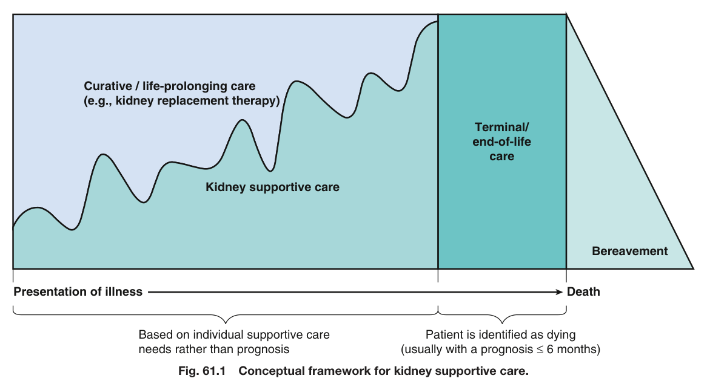

Fig. 61.1 Conceptual framework for kidney supportive care.

---

### Fig_61_2

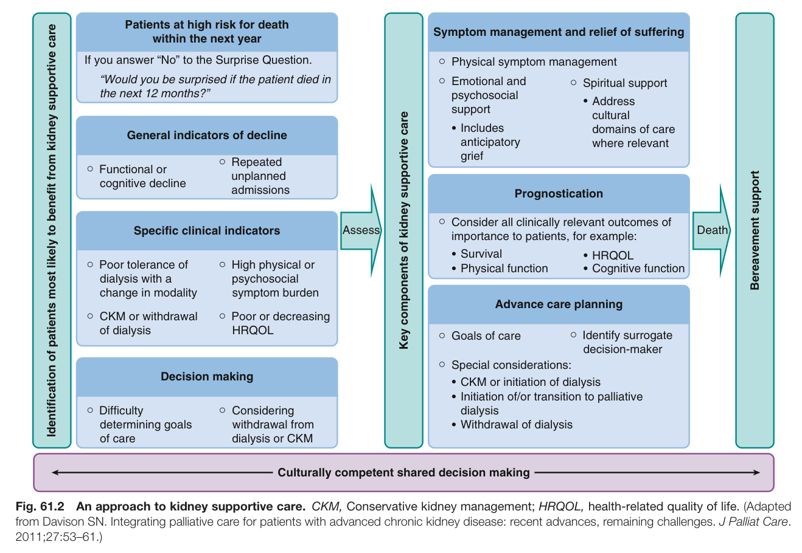

Fig. 61.2 An approach to kidney supportive care. CKM, Conservative kidney management; HRQOL, health-related quality of life. (Adapted from Davison SN. Integrating palliative care for patients with advanced chronic kidney disease: recent advances, remaining challenges. J Palliat Care. 2011;27:53–61.)

---

### Fig_61_3

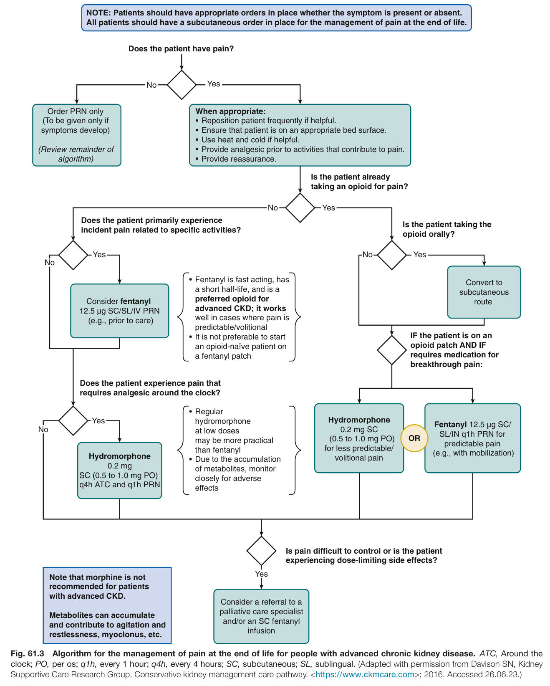

Fig. 61.3 Algorithm for the management of pain at the end of life for people with advanced chronic kidney disease. ATC, Around the clock; PO, per os; q1h, every 1 hour; q4h, every 4 hours; SC, subcutaneous; SL, sublingual. (Adapted with permission from Davison SN, Kidney Supportive Care Research Group. Conservative kidney management care pathway. <https://www.ckmcare.com>; 2016. Accessed 26.06.23.)

---

### Fig_61_4

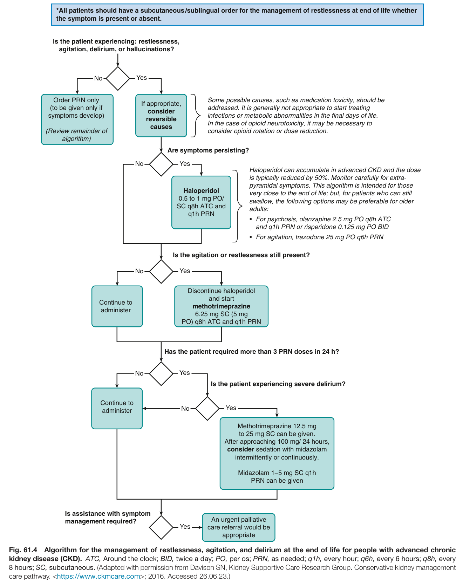

Fig. 61.4 Algorithm for the management of restlessness, agitation, and delirium at the end of life for people with advanced chronic kidney disease (CKD). ATC, Around the clock; BID, twice a day; PO, per os; PRN, as needed; q1h, every hour; q6h, every 6 hours; q8h, every 8 hours; SC, subcutaneous. (Adapted with permission from Davison SN, Kidney Supportive Care Research Group. Conservative kidney management care pathway. <https://www.ckmcare.com>; 2016. Accessed 26.06.23.)

---

### Fig_61_5

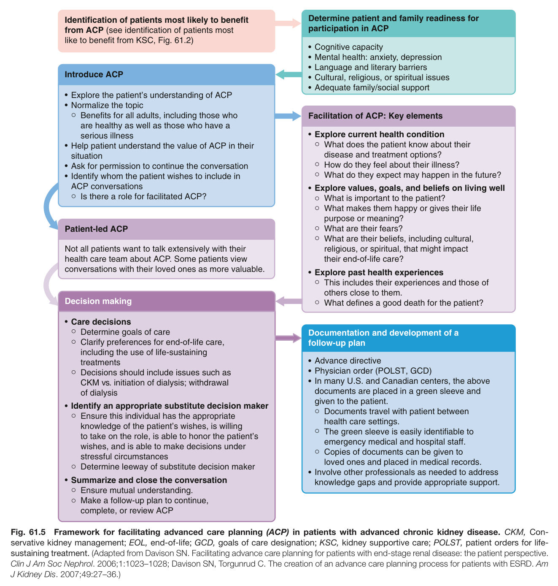

Fig. 61.5 Framework for facilitating advanced care planning (ACP) in patients with advanced chronic kidney disease. CKM, Con- servative kidney management; EOL, end-of-life; GCD, goals of care designation; KSC, kidney supportive care; POLST, patient orders for life- sustaining treatment. (Adapted from Davison SN. Facilitating advance care planning for patients with end-stage renal disease: the patient perspective. Clin J Am Soc Nephrol. 2006;1:1023–1028; Davison SN, Torgunrud C. The creation of an advance care planning process for patients with ESRD. Am J Kidney Dis. 2007;49:27–36.)

---

### Fig_61_6

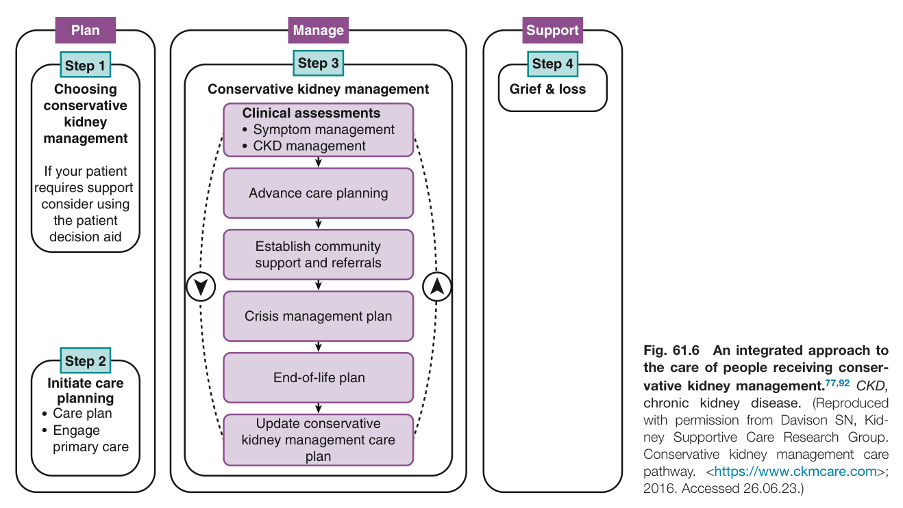

Fig. 61.6 An integrated approach to the care of people receiving conser- vative kidney management.<sup>77,92</sup> CKD, chronic kidney disease. (Reproduced with permission from Davison SN, Kid- ney Supportive Care Research Group. Conservative kidney management care pathway. <https://www.ckmcare.com>; 2016. Accessed 26.06.23.)

---

### Fig_61_7

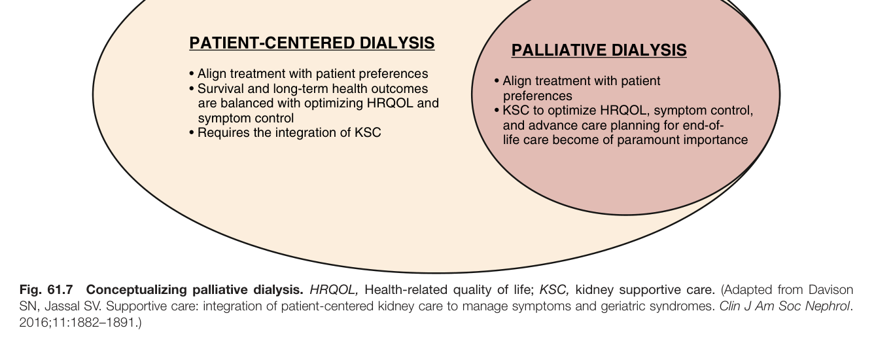

Fig. 61.7 Conceptualizing palliative dialysis. HRQOL, Health-related quality of life; KSC, kidney supportive care. (Adapted from Davison SN, Jassal SV. Supportive care: integration of patient-centered kidney care to manage symptoms and geriatric syndromes. Clin J Am Soc Nephrol. 2016;11:1882–1891.)

---

## Tables

### Table_61_1

#### Table Image

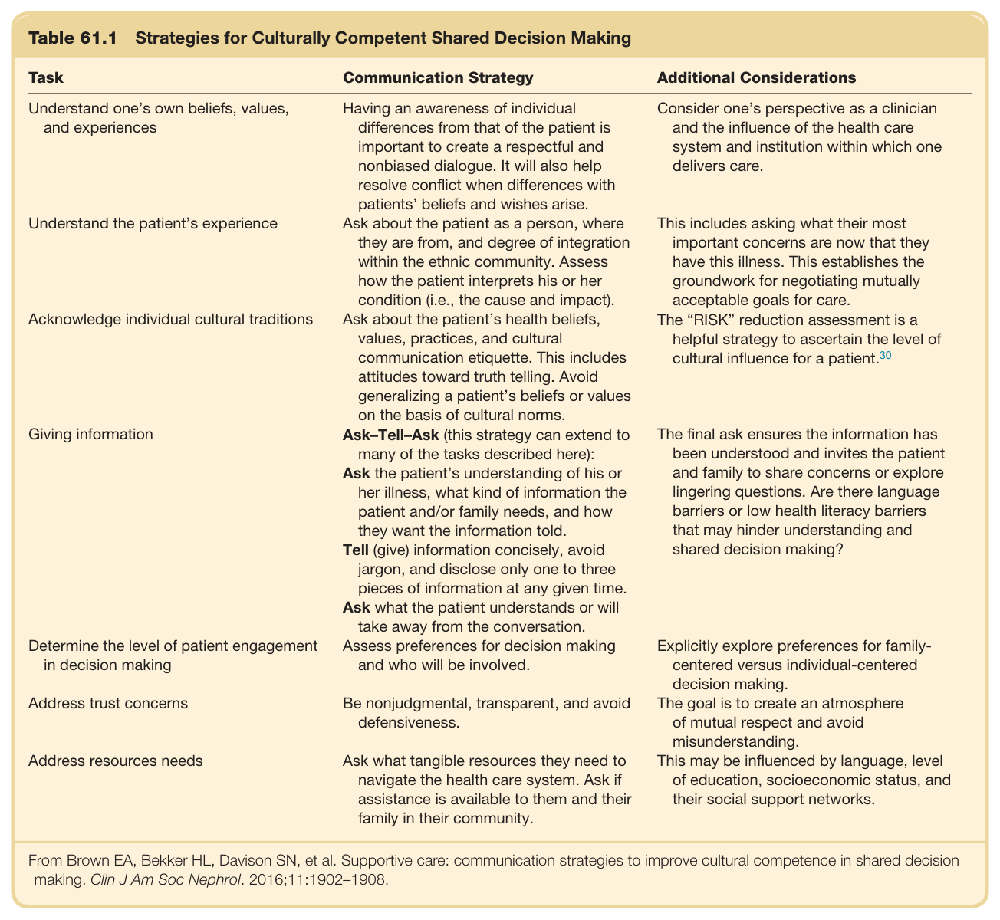

#### Table Data (CSV: [Table_61_1.csv](Table_61_1.csv))

```markdown
| Table Text (OCR) |
| :--- |
| Table 61.1  Strategies for Culturally Competent Shared Decision Making Task  Communication Strategy  Additional Considerations    Understand one's own beliefs, values, and experiences  Having an awareness of individual differences from that of the patient is important to create a respectful and nonbiased dialogue. It will also help resolve conflict when differences with patients' beliefs and wishes arise.  Consider one's perspective as a clinician and the influence of the health care system and institution within which one delivers care.    Understand the patient's experience  Ask about the patient as a person, where they are from, and degree of integration within the ethnic community. Assess how the patient interprets his or her condition (i.e., the cause and impact).  This includes asking what their most important concerns are now that they have this illness. This establishes the groundwork for negotiating mutually acceptable goals for care.    Acknowledge individual cultural traditions  Ask about the patient's health beliefs, values, practices, and cultural communication etiquette. This includes attitudes toward truth telling. Avoid generalizing a patient's beliefs or values on the basis of cultural norms.  The "RISK" reduction assessment is a helpful strategy to ascertain the level of cultural influence for a patient. ^{30}     Giving information  Ask-Tell-Ask (this strategy can extend to many of the tasks described here):Ask the patient's understanding of his or her illness, what kind of information the patient and/or family needs, and how they want the information told.Tell (give) information concisely, avoid jargon, and disclose only one to three pieces of information at any given time.Ask what the patient understands or will take away from the conversation.  The final ask ensures the information has been understood and invites the patient and family to share concerns or explore lingering questions. Are there language barriers or low health literacy barriers that may hinder understanding and shared decision making?    Determine the level of patient engagement in decision making  Assess preferences for decision making and who will be involved.  Explicitly explore preferences for family-centered versus individual-centered decision making.    Address trust concerns  Be nonjudgmental, transparent, and avoid defensiveness.  The goal is to create an atmosphere of mutual respect and avoid misunderstanding.    Address resources needs  Ask what tangible resources they need to navigate the health care system. Ask if assistance is available to them and their family in their community.  This may be influenced by language, level of education, socioeconomic status, and their social support networks. From Brown EA, Bekker HL, Davison SN, et al. Supportive care: communication strategies to improve cultural competence in shared decision making. Clin J Am Soc Nephrol. 2016;11:1902–1908. |
```

Table 61.1 Strategies for Culturally Competent Shared Decision Making

---

### Table_61_2

#### Table Image

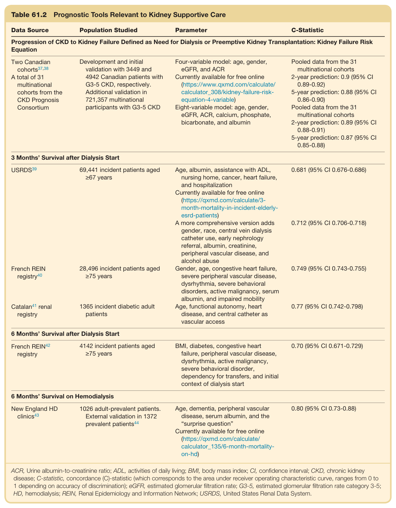

#### Table Data (CSV: [Table_61_2.csv](Table_61_2.csv))

```markdown
| Table Text (OCR) |
| :--- |
| Table 61.2  Prognostic Tools Relevant to Kidney Supportive Care Data Source  Population Studied  Parameter  C-Statistic    Progression of CKD to Kidney Failure Defined as Need for Dialysis or Preemptive Kidney Transplantation: Kidney Failure Risk Equation    Two Canadian cohorts37,38A total of 31 multinational cohorts from the CKD Prognosis Consortium  Development and initial validation with 3449 and 4942 Canadian patients with G3-5 CKD, respectively.Additional validation in 721,357 multinational participants with G3-5 CKD  Four-variable model: age, gender, eGFR, and ACRCurrently available for free online (https://www.qxmd.com/calculate/calculator_308/kidney-failure-risk-equation-4-variable)Eight-variable model: age, gender, eGFR, ACR, calcium, phosphate, bicarbonate, and albumin  Pooled data from the 31 multinational cohorts2-year prediction: 0.9 (95% CI 0.89-0.92)5-year prediction: 0.88 (95% CI 0.86-0.90)Pooled data from the 31 multinational cohorts2-year prediction: 0.89 (95% CI 0.88-0.91)5-year prediction: 0.87 (95% CI 0.85-0.88)    3 Months' Survival after Dialysis Start    USRDS39  69,441 incident patients aged ≥67 years  Age, albumin, assistance with ADL, nursing home, cancer, heart failure, and hospitalizationCurrently available for free online (https://qxmd.com/calculate/3-month-mortality-in-incident-elderly-esrd-patients)A more comprehensive version adds gender, race, central vein dialysis catheter use, early nephrology referral, albumin, creatinine, peripheral vascular disease, and alcohol abuse  0.681 (95% CI 0.676-0.686)    French REIN registry40  28,496 incident patients aged ≥75 years  Gender, age, congestive heart failure, severe peripheral vascular disease, dysrhythmia, severe behavioral disorders, active malignancy, serum albumin, and impaired mobility  0.712 (95% CI 0.706-0.718)    Catalan41 renal registry  1365 incident diabetic adult patients  Age, functional autonomy, heart disease, and central catheter as vascular access  0.77 (95% CI 0.742-0.798)    6 Months' Survival after Dialysis Start    French REIN42 registry  4142 incident patients aged ≥75 years  BMI, diabetes, congestive heart failure, peripheral vascular disease, dysrhythmia, active malignancy, severe behavioral disorder, dependency for transfers, and initial context of dialysis start  0.70 (95% CI 0.671-0.729)    6 Months' Survival on Hemodialysis    New England HD clinics43  1026 adult-prevalent patients. External validation in 1372 prevalent patients44  Age, dementia, peripheral vascular disease, serum albumin, and the "surprise question"Currently available for free online (https://qxmd.com/calculate/calculator_135/6-month-mortality-on-hd)  0.80 (95% CI 0.73-0.88) ACR, Urine albumin-to-creatinine ratio; ADL, activities of daily living; BMI, body mass index; CI, confidence interval; CKD, chronic kidney disease; C-statistic, concordance (C)-statistic (which corresponds to the area under receiver operating characteristic curve, ranges from 0 to 1 depending on accuracy of discrimination); eGFR, estimated glomerular filtration rate; G3-5, estimated glomerular filtration rate category 3-5; HD, hemodialysis; REIN, Renal Epidemiology and Information Network; USRDS, United States Renal Data System. |
```

Table 61.2 Prognostic Tools Relevant to Kidney Supportive Care

---

### Table_61_3

#### Table Image

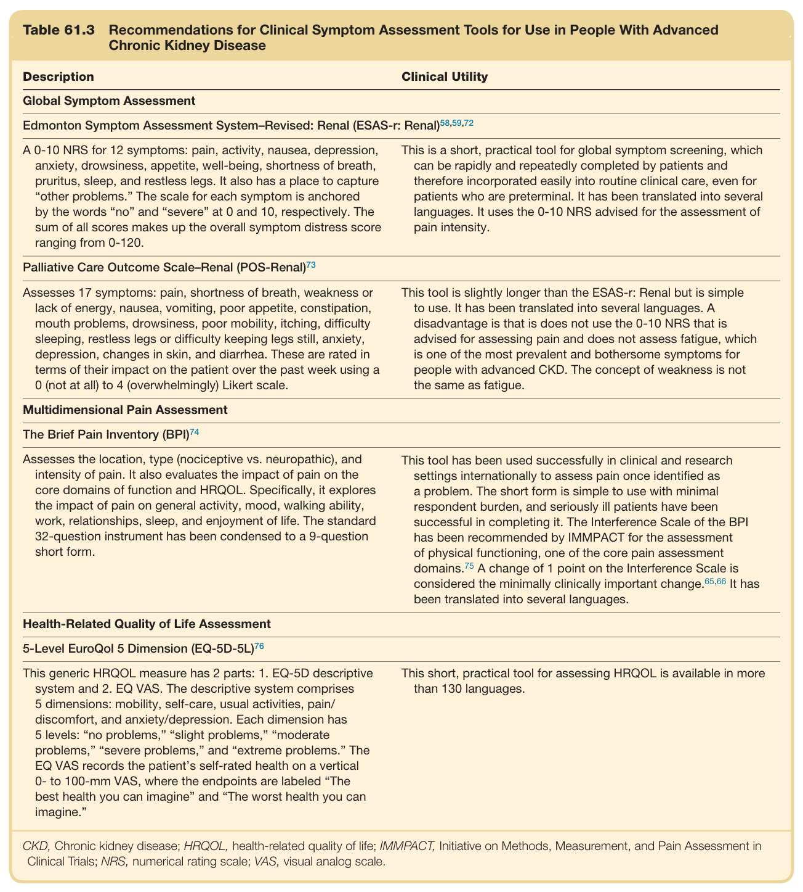

#### Table Data (CSV: [Table_61_3.csv](Table_61_3.csv))

```markdown
| Table Text (OCR) |
| :--- |
| Table 61.3  Recommendations for Clinical Symptom Assessment Tools for Use in People With Advanced Chronic Kidney Disease Description  Clinical Utility    Global Symptom Assessment    Edmonton Symptom Assessment System-Revised: Renal (ESAS-r: Renal) ^{58,59,72}     A 0-10 NRS for 12 symptoms: pain, activity, nausea, depression, anxiety, drowsiness, appetite, well-being, shortness of breath, pruritus, sleep, and restless legs. It also has a place to capture “other problems.” The scale for each symptom is anchored by the words “no” and “severe” at 0 and 10, respectively. The sum of all scores makes up the overall symptom distress score ranging from 0-120.  This is a short, practical tool for global symptom screening, which can be rapidly and repeatedly completed by patients and therefore incorporated easily into routine clinical care, even for patients who are preterminal. It has been translated into several languages. It uses the 0-10 NRS advised for the assessment of pain intensity.    Palliative Care Outcome Scale-Renal (POS-Renal) ^{73}     Assesses 17 symptoms: pain, shortness of breath, weakness or lack of energy, nausea, vomiting, poor appetite, constipation, mouth problems, drowsiness, poor mobility, itching, difficulty sleeping, restless legs or difficulty keeping legs still, anxiety, depression, changes in skin, and diarrhea. These are rated in terms of their impact on the patient over the past week using a 0 (not at all) to 4 (overwhelmingly) Likert scale.  This tool is slightly longer than the ESAS-r: Renal but is simple to use. It has been translated into several languages. A disadvantage is that is does not use the 0-10 NRS that is advised for assessing pain and does not assess fatigue, which is one of the most prevalent and bothersome symptoms for people with advanced CKD. The concept of weakness is not the same as fatigue.    Multidimensional Pain Assessment    The Brief Pain Inventory (BPI) ^{74}     Assesses the location, type (nociceptive vs. neuropathic), and intensity of pain. It also evaluates the impact of pain on the core domains of function and HRQOL. Specifically, it explores the impact of pain on general activity, mood, walking ability, work, relationships, sleep, and enjoyment of life. The standard 32-question instrument has been condensed to a 9-question short form.  This tool has been used successfully in clinical and research settings internationally to assess pain once identified as a problem. The short form is simple to use with minimal respondent burden, and seriously ill patients have been successful in completing it. The Interference Scale of the BPI has been recommended by IMMPACT for the assessment of physical functioning, one of the core pain assessment domains. ^{75}  A change of 1 point on the Interference Scale is considered the minimally clinically important change. ^{65,66}  It has been translated into several languages.    Health-Related Quality of Life Assessment    5-Level EuroQol 5 Dimension (EQ-5D-5L) ^{76}     This generic HRQOL measure has 2 parts: 1. EQ-5D descriptive system and 2. EQ VAS. The descriptive system comprises 5 dimensions: mobility, self-care, usual activities, pain/discomfort, and anxiety/depression. Each dimension has 5 levels: “no problems,” “slight problems,” “moderate problems,” “severe problems,” and “extreme problems.” The EQ VAS records the patient’s self-rated health on a vertical 0- to 100-mm VAS, where the endpoints are labeled “The best health you can imagine” and “The worst health you can imagine.”  This short, practical tool for assessing HRQOL is available in more than 130 languages.    CKD, Chronic kidney disease; HRQOL, health-related quality of life; IMMPACT, Initiative on Methods, Measurement, and Pain Assessment in Clinical Trials; NRS, numerical rating scale; VAS, visual analog scale. |
```

Table 61.3 Recommendations for Clinical Symptom Assessment Tools for Use in People With Advanced Chronic Kidney Disease

---

### Table_61_4

#### Table Images (3 Parts)

- **Part 1 (Page 9)**:
  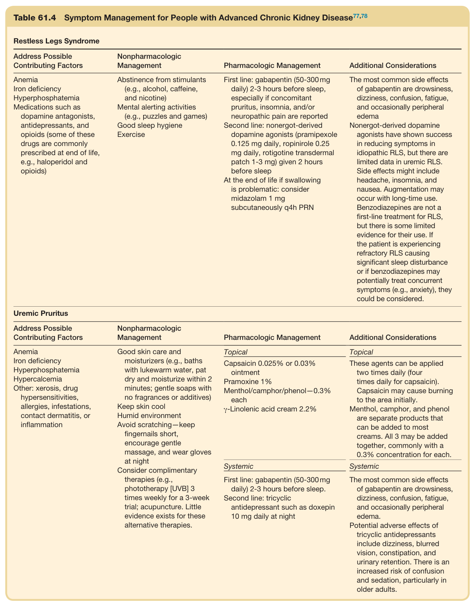

- **Part 2 (Page 10)**:
  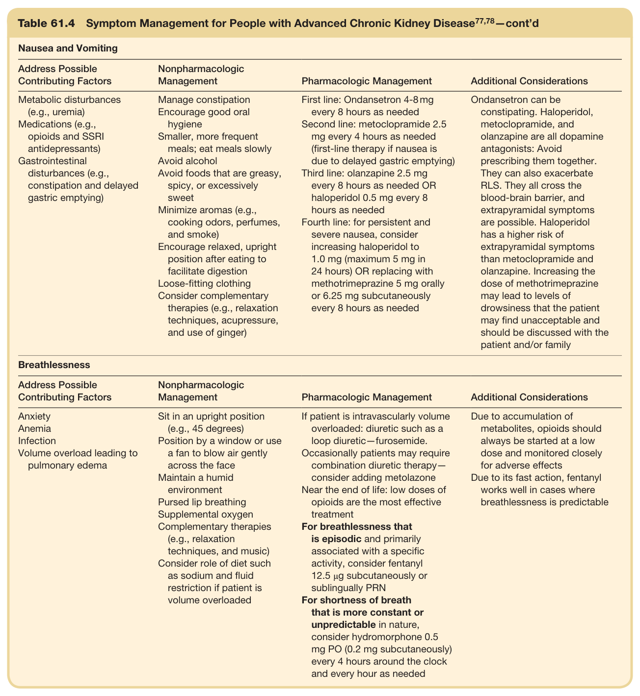

- **Part 3 (Page 11)**:
  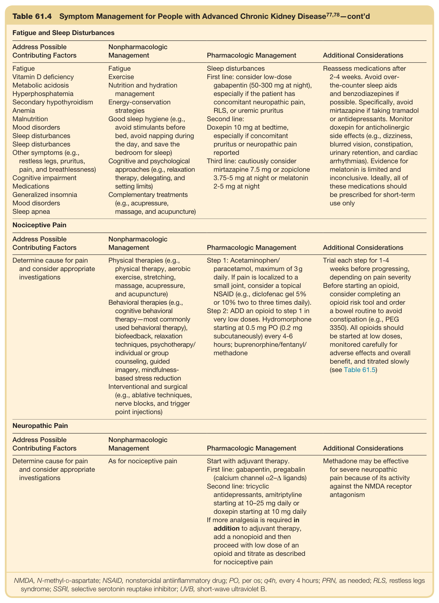

#### Table Data (CSV: [Table_61_4.csv](Table_61_4.csv))

```markdown
| Table Text (OCR) |
| :--- |
| Table 61.4 Symptom Management for People with Advanced Chronic Kidney Disease<sup>77,78</sup> Restless Legs Syndrome Address Possible Contributing Factors  Nonpharmacologic Management  Pharmacologic Management  Additional Considerations    AnemiaIron deficiencyHyperphosphatemiaMedications such as dopamine antagonists, antidepressants, and opioids (some of these drugs are commonly prescribed at end of life, e.g., haloperidol and opioids)  Abstinence from stimulants (e.g., alcohol, caffeine, and nicotine)Mental alerting activities (e.g., puzzles and games)Good sleep hygieneExercise  First line: gabapentin (50-300 mg daily) 2-3 hours before sleep, especially if concomitant pruritus, insomnia, and/or neuropathic pain are reportedSecond line: nonergot-derived dopamine agonists (pramipexole 0.125 mg daily, ropinirole 0.25 mg daily, rotigotine transdermal patch 1-3 mg) given 2 hours before sleepAt the end of life if swallowing is problematic: consider midazolam 1 mg subcutaneously q4h PRN  The most common side effects of gabapentin are drowsiness, dizziness, confusion, fatigue, and occasionally peripheral edemaNonergot-derived dopamine agonists have shown success in reducing symptoms in idiopathic RLS, but there are limited data in uremic RLS. Side effects might include headache, insomnia, and nausea. Augmentation may occur with long-time use. Benzodiazepines are not a first-line treatment for RLS, but there is some limited evidence for their use. If the patient is experiencing refractory RLS causing significant sleep disturbance or if benzodiazepines may potentially treat concurrent symptoms (e.g., anxiety), they could be considered. |
```

Table 61.4 Symptom Management for People with Advanced Chronic Kidney Disease<sup>77,78</sup>—cont’d

---

### Table_61_5

#### Table Image

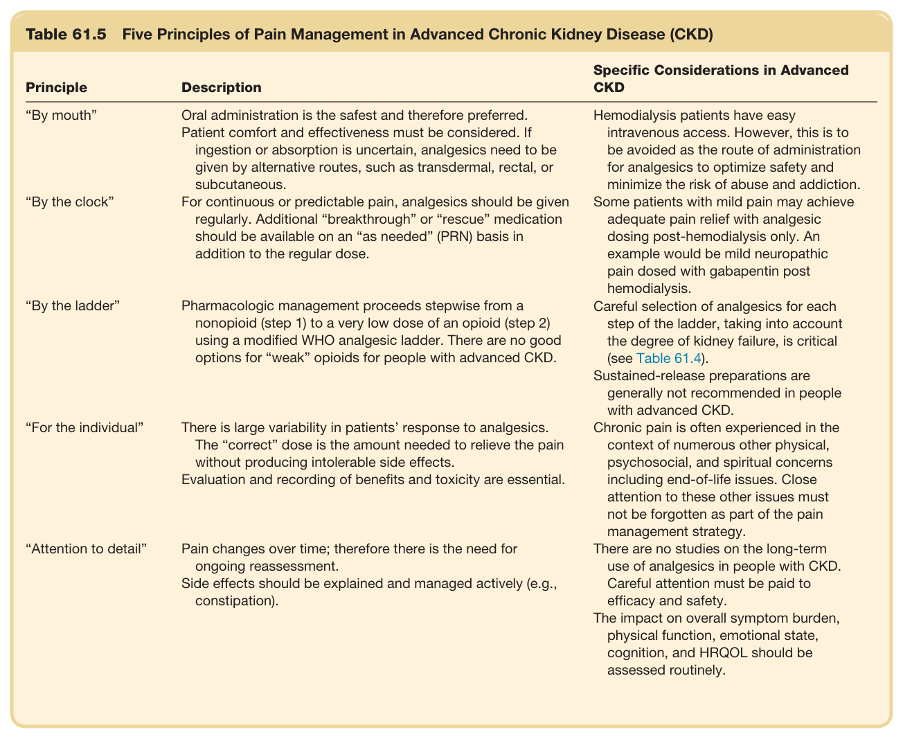

#### Table Data (CSV: [Table_61_5.csv](Table_61_5.csv))

```markdown
| Table Text (OCR) |
| :--- |
| Table 61.5  Five Principles of Pain Management in Advanced Chronic Kidney Disease (CKD) Principle  Description  Specific Considerations in Advanced CKD    “By mouth”  Oral administration is the safest and therefore preferred.Patient comfort and effectiveness must be considered. If ingestion or absorption is uncertain, analgesics need to be given by alternative routes, such as transdermal, rectal, or subcutaneous.  Hemodialysis patients have easy intravenous access. However, this is to be avoided as the route of administration for analgesics to optimize safety and minimize the risk of abuse and addiction.    “By the clock”  For continuous or predictable pain, analgesics should be given regularly. Additional “breakthrough” or “rescue” medication should be available on an “as needed” (PRN) basis in addition to the regular dose.  Some patients with mild pain may achieve adequate pain relief with analgesic dosing post-hemodialysis only. An example would be mild neuropathic pain dosed with gabapentin post hemodialysis.    “By the ladder”  Pharmacologic management proceeds stepwise from a nonopioid (step 1) to a very low dose of an opioid (step 2) using a modified WHO analgesic ladder. There are no good options for “weak” opioids for people with advanced CKD.  Careful selection of analgesics for each step of the ladder, taking into account the degree of kidney failure, is critical (see Table 61.4).Sustained-release preparations are generally not recommended in people with advanced CKD.    “For the individual”  There is large variability in patients’ response to analgesics.The “correct” dose is the amount needed to relieve the pain without producing intolerable side effects.Evaluation and recording of benefits and toxicity are essential.  Chronic pain is often experienced in the context of numerous other physical, psychosocial, and spiritual concerns including end-of-life issues. Close attention to these other issues must not be forgotten as part of the pain management strategy.    “Attention to detail”  Pain changes over time; therefore there is the need for ongoing reassessment.Side effects should be explained and managed actively (e.g., constipation).  There are no studies on the long-term use of analgesics in people with CKD.Careful attention must be paid to efficacy and safety.The impact on overall symptom burden, physical function, emotional state, cognition, and HRQOL should be assessed routinely. |
```

Table 61.5 Five Principles of Pain Management in Advanced Chronic Kidney Disease (CKD)

---

### Table_61_6

#### Table Image

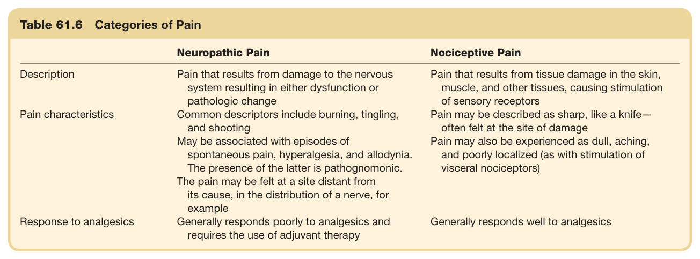

#### Table Data (CSV: [Table_61_6.csv](Table_61_6.csv))

```markdown
| Table Text (OCR) |
| :--- |
| Table 61.6 Categories of Pain Neuropathic Pain  Nociceptive Pain    Description  Pain that results from damage to the nervous system resulting in either dysfunction or pathologic change  Pain that results from tissue damage in the skin, muscle, and other tissues, causing stimulation of sensory receptors    Pain characteristics  Common descriptors include burning, tingling, and shootingMay be associated with episodes of spontaneous pain, hyperalgesia, and allodynia.The presence of the latter is pathognomonic.The pain may be felt at a site distant from its cause, in the distribution of a nerve, for example  Pain may be described as sharp, like a knife—often felt at the site of damagePain may also be experienced as dull, aching, and poorly localized (as with stimulation of visceral nociceptors)    Response to analgesics  Generally responds poorly to analgesics and requires the use of adjuvant therapy  Generally responds well to analgesics |
```

Table 61.6 Categories of Pain

---

### Table_61_7

#### Table Image

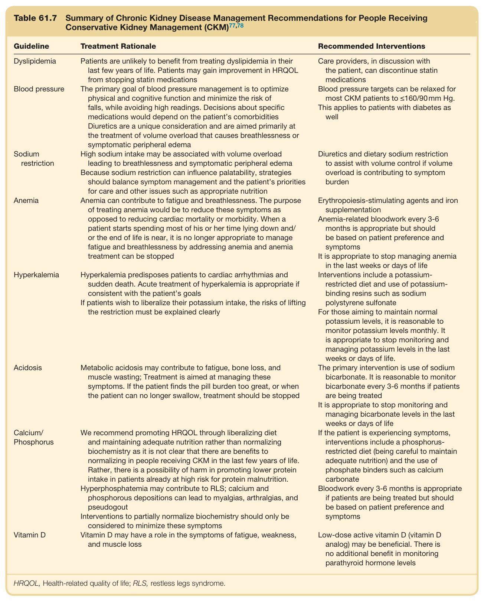

#### Table Data (CSV: [Table_61_7.csv](Table_61_7.csv))

```markdown
| Table Text (OCR) |
| :--- |
| Table 61.7 Summary of Chronic Kidney Disease Management Recommendations for People Receiving Conservative Kidney Management (CKM)<sup>77,78</sup> Guideline  Treatment Rationale  Recommended Interventions    Dyslipidemia  Patients are unlikely to benefit from treating dyslipidemia in their last few years of life. Patients may gain improvement in HRQOL from stopping statin medications  Care providers, in discussion with the patient, can discontinue statin medications    Blood pressure  The primary goal of blood pressure management is to optimize physical and cognitive function and minimize the risk of falls, while avoiding high readings. Decisions about specific medications would depend on the patient's comorbiditiesDiuretics are a unique consideration and are aimed primarily at the treatment of volume overload that causes breathlessness or symptomatic peripheral edema  Blood pressure targets can be relaxed for most CKM patients to ≤160/90 mm Hg.This applies to patients with diabetes as well    Sodium restriction  High sodium intake may be associated with volume overload leading to breathlessness and symptomatic peripheral edemaBecause sodium restriction can influence palatability, strategies should balance symptom management and the patient's priorities for care and other issues such as appropriate nutrition  Diuretics and dietary sodium restriction to assist with volume control if volume overload is contributing to symptom burden    Anemia  Anemia can contribute to fatigue and breathlessness. The purpose of treating anemia would be to reduce these symptoms as opposed to reducing cardiac mortality or morbidity. When a patient starts spending most of his or her time lying down and/or the end of life is near, it is no longer appropriate to manage fatigue and breathlessness by addressing anemia and anemia treatment can be stopped  Erythropoiesis-stimulating agents and iron supplementationAnemia-related bloodwork every 3-6 months is appropriate but should be based on patient preference and symptomsIt is appropriate to stop managing anemia in the last weeks or days of life    Hyperkalemia  Hyperkalemia predisposes patients to cardiac arrhythmias and sudden death. Acute treatment of hyperkalemia is appropriate if consistent with the patient's goalsIf patients wish to liberalize their potassium intake, the risks of lifting the restriction must be explained clearly  Interventions include a potassium-restricted diet and use of potassium-binding resins such as sodium polystyrene sulfonateFor those aiming to maintain normal potassium levels, it is reasonable to monitor potassium levels monthly. It is appropriate to stop monitoring and managing potassium levels in the last weeks or days of life.    Acidosis  Metabolic acidosis may contribute to fatigue, bone loss, and muscle wasting; Treatment is aimed at managing these symptoms. If the patient finds the pill burden too great, or when the patient can no longer swallow, treatment should be stopped  The primary intervention is use of sodium bicarbonate. It is reasonable to monitor bicarbonate every 3-6 months if patients are being treatedIt is appropriate to stop monitoring and managing bicarbonate levels in the last weeks or days of life    Calcium/Phosphorus  We recommend promoting HRQOL through liberalizing diet and maintaining adequate nutrition rather than normalizing biochemistry as it is not clear that there are benefits to normalizing in people receiving CKM in the last few years of life. Rather, there is a possibility of harm in promoting lower protein intake in patients already at high risk for protein malnutrition.Hyperphosphatemia may contribute to RLS; calcium and phosphorous depositions can lead to myalgias, arthralgias, and pseudogoutInterventions to partially normalize biochemistry should only be considered to minimize these symptoms  If the patient is experiencing symptoms, interventions include a phosphorus-restricted diet (being careful to maintain adequate nutrition) and the use of phosphate binders such as calcium carbonateBloodwork every 3-6 months is appropriate if patients are being treated but should be based on patient preference and symptoms    Vitamin D  Vitamin D may have a role in the symptoms of fatigue, weakness, and muscle loss  Low-dose active vitamin D (vitamin D analog) may be beneficial. There is no additional benefit in monitoring parathyroid hormone levels HRQOL, Health-related quality of life; RLS, restless legs syndrome. |
```

Table 61.7 Summary of Chronic Kidney Disease Management Recommendations for People Receiving Conservative Kidney Management (CKM)<sup>77,78</sup>

---

## Boxes

### Box_61_1

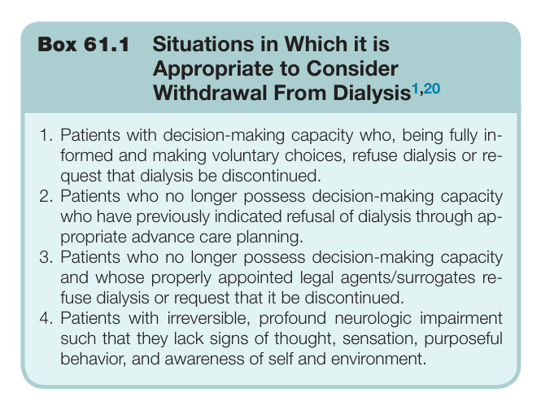

#### Box Text

```markdown
Box 61.1 Situations in Which it is Appropriate to Consider Withdrawal From Dialysis<sup>1,20</sup> 1. Patients with decision-making capacity who, being fully in- formed and making voluntary choices, refuse dialysis or re- quest that dialysis be discontinued. 2. Patients who no longer possess decision-making capacity who have previously indicated refusal of dialysis through ap- propriate advance care planning. 3. Patients who no longer possess decision-making capacity and whose properly appointed legal agents/surrogates re- fuse dialysis or request that it be discontinued. 4. Patients with irreversible, profound neurologic impairment such that they lack signs of thought, sensation, purposefu behavior, and awareness of self and environment.
```

Box 61.1 Situations in Which it is Appropriate to Consider Withdrawal From Dialysis<sup>1,20</sup>

---
