# 62. Hemodialysis - Figures and Tables Index

This document lists all figures, tables and boxes extracted from `62. Hemodialysis.pdf`.

## Table of Contents
- [Figures](#figures)
- [Tables](#tables)
- [Boxes](#boxes)

---

## Figures

### Fig_62_1

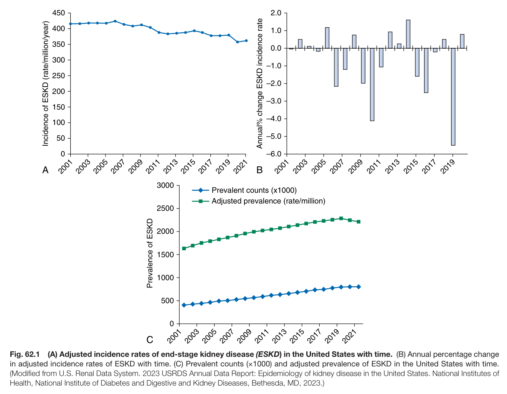

Fig. 62.1 (A) Adjusted incidence rates of end-stage kidney disease (ESKD) in the United States with time. (B) Annual percentage change in adjusted incidence rates of ESKD with time. (C) Prevalent counts (×1000) and adjusted prevalence of ESKD in the United States with time. (Modified from U.S. Renal Data System. 2023 USRDS Annual Data Report: Epidemiology of kidney disease in the United States. National Institutes of Health, National Institute of Diabetes and Digestive and Kidney Diseases, Bethesda, MD, 2023.)

---

### Fig_62_2

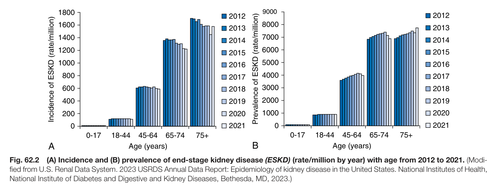

Fig. 62.2 (A) Incidence and (B) prevalence of end-stage kidney disease (ESKD) (rate/million by year) with age from 2012 to 2021. (Modi- fied from U.S. Renal Data System. 2023 USRDS Annual Data Report: Epidemiology of kidney disease in the United States. National Institutes of Health, National Institute of Diabetes and Digestive and Kidney Diseases, Bethesda, MD, 2023.)

---

### Fig_62_3

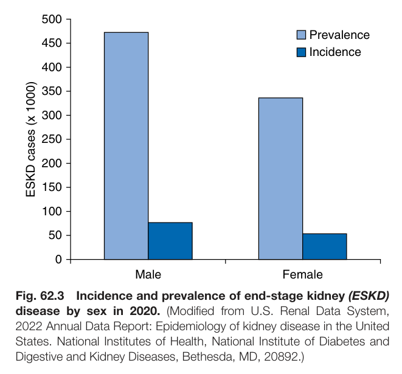

Fig. 62.3 Incidence and prevalence of end-stage kidney (ESKD) disease by sex in 2020. (Modified from U.S. Renal Data System, 2022 Annual Data Report: Epidemiology of kidney disease in the United States. National Institutes of Health, National Institute of Diabetes and Digestive and Kidney Diseases, Bethesda, MD, 20892.)

---

### Fig_62_4

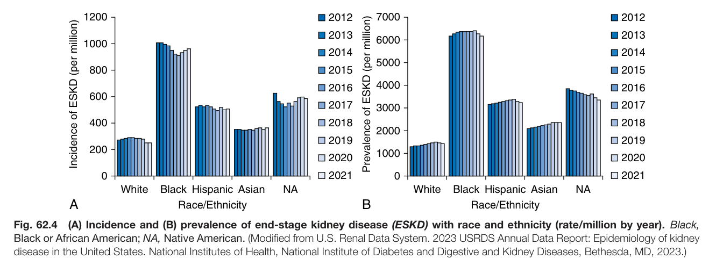

Fig. 62.4 (A) Incidence and (B) prevalence of end-stage kidney disease (ESKD) with race and ethnicity (rate/million by year). Black, Black or African American; NA, Native American. (Modified from U.S. Renal Data System. 2023 USRDS Annual Data Report: Epidemiology of kidney disease in the United States. National Institutes of Health, National Institute of Diabetes and Digestive and Kidney Diseases, Bethesda, MD, 2023.)

---

### Fig_62_5

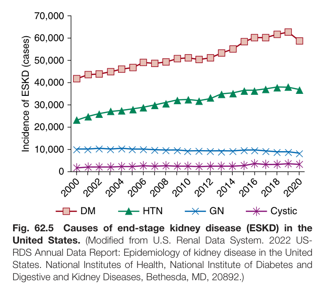

Fig. 62.5 Causes of end-stage kidney disease (ESKD) in the United States. (Modified from U.S. Renal Data System. 2022 US- RDS Annual Data Report: Epidemiology of kidney disease in the United States. National Institutes of Health, National Institute of Diabetes and Digestive and Kidney Diseases, Bethesda, MD, 20892.)

---

### Fig_62_6

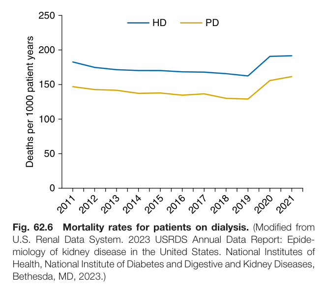

Fig. 62.6 Mortality rates for patients on dialysis. (Modified from U.S. Renal Data System. 2023 USRDS Annual Data Report: Epide- miology of kidney disease in the United States. National Institutes of Health, National Institute of Diabetes and Digestive and Kidney Diseases, Bethesda, MD, 2023.)

---

### Fig_62_7

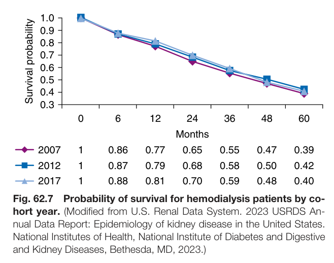

Fig. 62.7 Probability of survival for hemodialysis patients by co- hort year. (Modified from U.S. Renal Data System. 2023 USRDS An- nual Data Report: Epidemiology of kidney disease in the United States. National Institutes of Health, National Institute of Diabetes and Digestive and Kidney Diseases, Bethesda, MD, 2023.)

---

### Fig_62_8

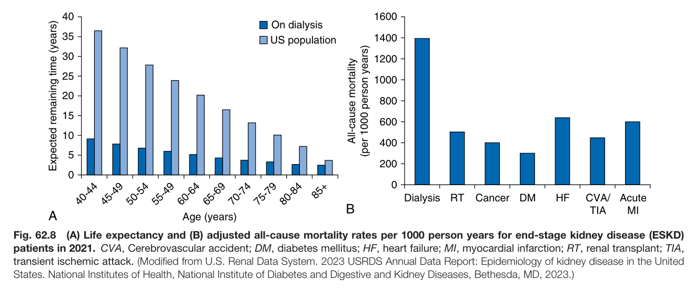

Fig. 62.8 (A) Life expectancy and (B) adjusted all-cause mortality rates per 1000 person years for end-stage kidney disease (ESKD) patients in 2021. CVA, Cerebrovascular accident; DM, diabetes mellitus; HF, heart failure; MI, myocardial infarction; RT, renal transplant; TIA, transient ischemic attack. (Modified from U.S. Renal Data System. 2023 USRDS Annual Data Report: Epidemiology of kidney disease in the United States. National Institutes of Health, National Institute of Diabetes and Digestive and Kidney Diseases, Bethesda, MD, 2023.)

---

### Fig_62_9

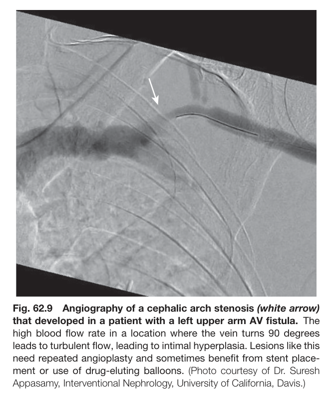

Fig. 62.9 Angiography of a cephalic arch stenosis (white arrow) that developed in a patient with a left upper arm AV fistula. The high blood flow rate in a location where the vein turns 90 degrees leads to turbulent flow, leading to intimal hyperplasia. Lesions like this need repeated angioplasty and sometimes benefit from stent place- ment or use of drug-eluting balloons. (Photo courtesy of Dr. Suresh Appasamy, Interventional Nephrology, University of California, Davis.)

---

### Fig_62_10

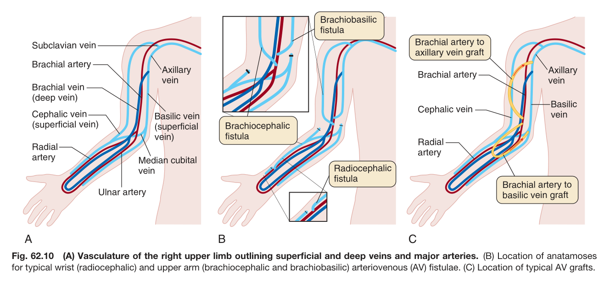

Fig. 62.10 (A) Vasculature of the right upper limb outlining superficial and deep veins and major arteries. (B) Location of anatamoses for typical wrist (radiocephalic) and upper arm (brachiocephalic and brachiobasilic) arteriovenous (AV) fistulae. (C) Location of typical AV grafts.

---

### Fig_62_11

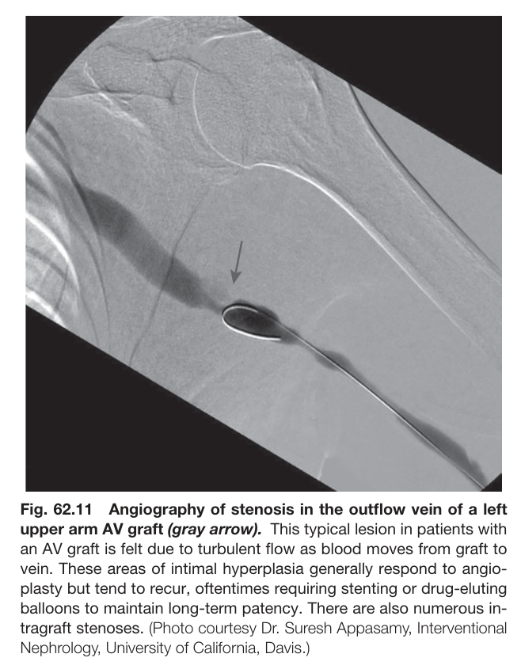

Fig. 62.11 Angiography of stenosis in the outflow vein of a left upper arm AV graft (gray arrow). This typical lesion in patients with an AV graft is felt due to turbulent flow as blood moves from graft to vein. These areas of intimal hyperplasia generally respond to angio- plasty but tend to recur, oftentimes requiring stenting or drug-eluting balloons to maintain long-term patency. There are also numerous in- tragraft stenoses. (Photo courtesy Dr. Suresh Appasamy, Interventiona Nephrology, University of California, Davis.)

---

### Fig_62_12

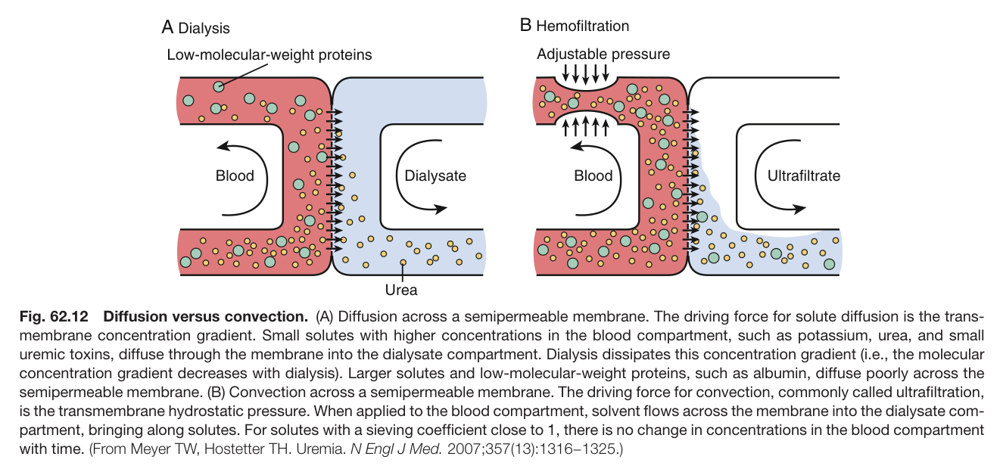

Fig. 62.12 Diffusion versus convection. (A) Diffusion across a semipermeable membrane. The driving force for solute diffusion is the trans- membrane concentration gradient. Small solutes with higher concentrations in the blood compartment, such as potassium, urea, and smal uremic toxins, diffuse through the membrane into the dialysate compartment. Dialysis dissipates this concentration gradient (i.e., the molecular concentration gradient decreases with dialysis). Larger solutes and low-molecular-weight proteins, such as albumin, diffuse poorly across the semipermeable membrane. (B) Convection across a semipermeable membrane. The driving force for convection, commonly called ultrafiltration, is the transmembrane hydrostatic pressure. When applied to the blood compartment, solvent flows across the membrane into the dialysate com- partment, bringing along solutes. For solutes with a sieving coefficient close to 1, there is no change in concentrations in the blood compartment with time. (From Meyer TW, Hostetter TH. Uremia. N Engl J Med. 2007;357(13):1316−1325.)

---

### Fig_62_13

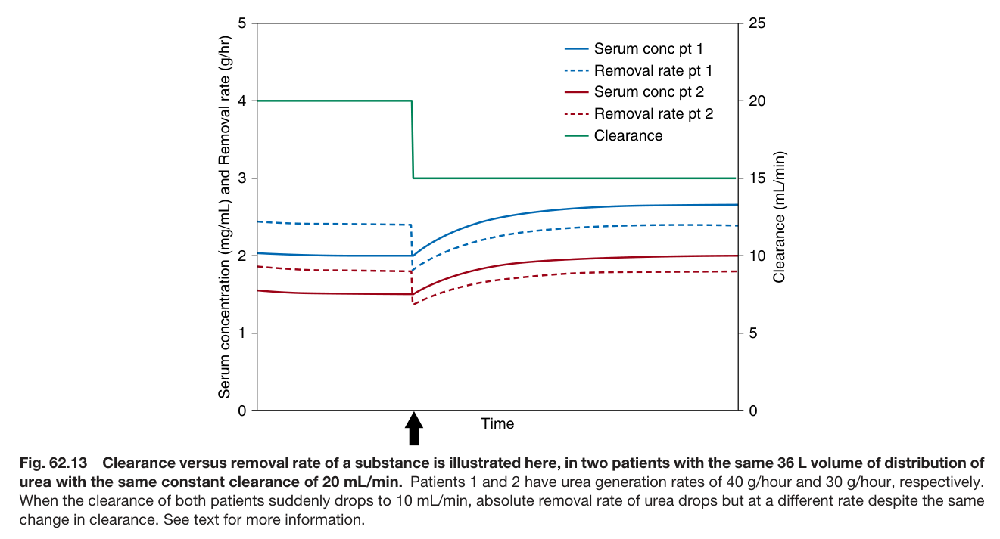

Fig. 62.13 Clearance versus removal rate of a substance is illustrated here, in two patients with the same 36 L volume of distribution of urea with the same constant clearance of 20 mL/min. Patients 1 and 2 have urea generation rates of 40 g/hour and 30 g/hour, respectively. When the clearance of both patients suddenly drops to 10 mL/min, absolute removal rate of urea drops but at a different rate despite the same change in clearance. See text for more information.

---

### Fig_62_14

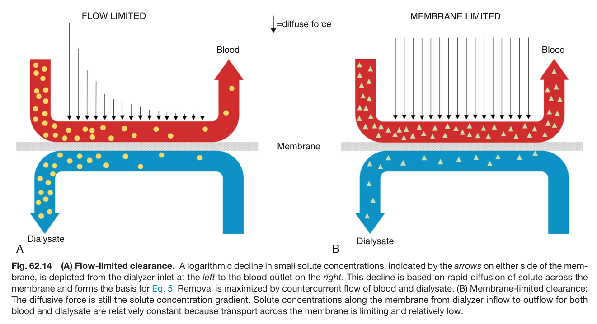

Fig. 62.14 (A) Flow-limited clearance. A logarithmic decline in small solute concentrations, indicated by the arrows on either side of the mem- brane, is depicted from the dialyzer inlet at the left to the blood outlet on the right. This decline is based on rapid diffusion of solute across the membrane and forms the basis for Eq. 5. Removal is maximized by countercurrent flow of blood and dialysate. (B) Membrane-limited clearance: The diffusive force is still the solute concentration gradient. Solute concentrations along the membrane from dialyzer inflow to outflow for both blood and dialysate are relatively constant because transport across the membrane is limiting and relatively low.

---

### Fig_62_15

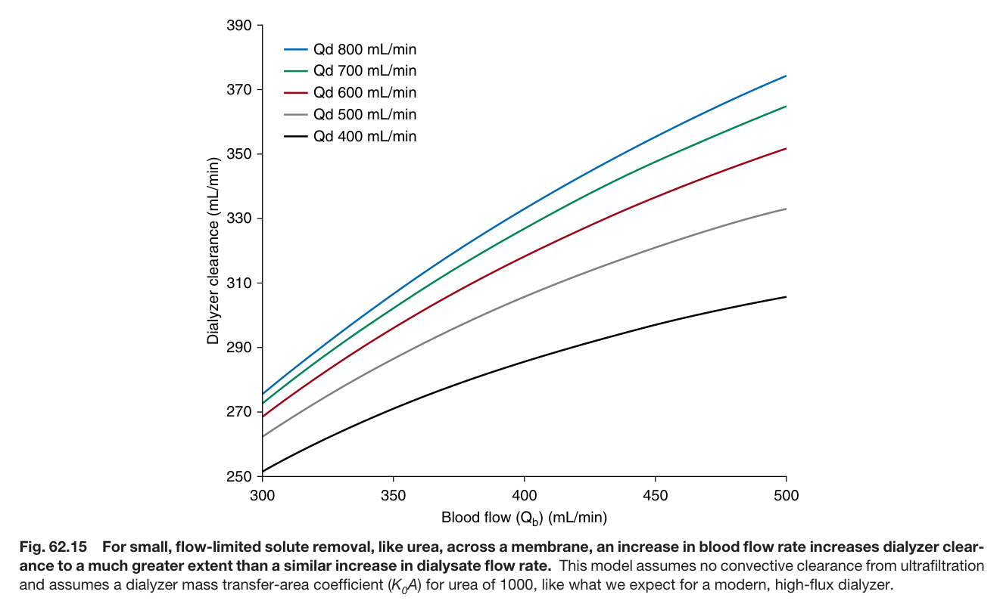

Fig. 62.15 For small, flow-limited solute removal, like urea, across a membrane, an increase in blood flow rate increases dialyzer clear- ance to a much greater extent than a similar increase in dialysate flow rate. This model assumes no convective clearance from ultrafiltration and assumes a dialyzer mass transfer-area coefficient (K A) for urea of 1000, like what we expect for a modern, high-flux dialyzer.

---

### Fig_62_16

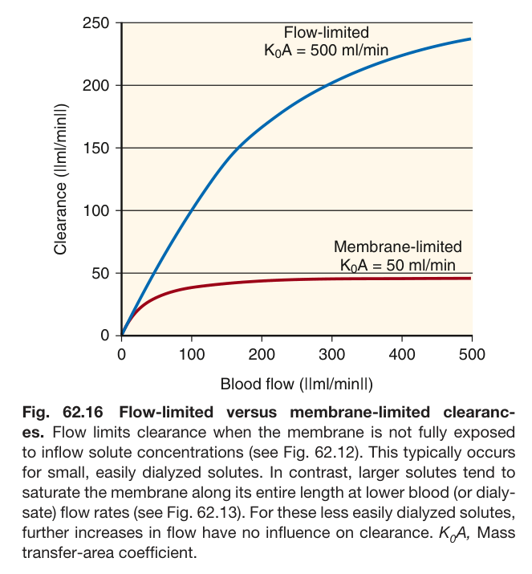

Fig. 62.16 Flow-limited versus membrane-limited clearanc- es. Flow limits clearance when the membrane is not fully exposed to inflow solute concentrations (see Fig. 62.12). This typically occurs for small, easily dialyzed solutes. In contrast, larger solutes tend to saturate the membrane along its entire length at lower blood (or dialy- sate) flow rates (see Fig. 62.13). For these less easily dialyzed solutes, further increases in flow have no influence on clearance. K A, Mass transfer-area coefficient.

---

### Fig_62_17

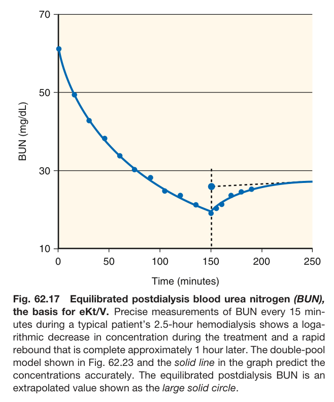

Fig. 62.17 Equilibrated postdialysis blood urea nitrogen (BUN), the basis for eKt/V. Precise measurements of BUN every 15 min- utes during a typical patient’s 2.5-hour hemodialysis shows a loga- rithmic decrease in concentration during the treatment and a rapid rebound that is complete approximately 1 hour later. The double-pool model shown in Fig. 62.23 and the solid line in the graph predict the concentrations accurately. The equilibrated postdialysis BUN is an extrapolated value shown as the large solid circle.

---

### Fig_62_18

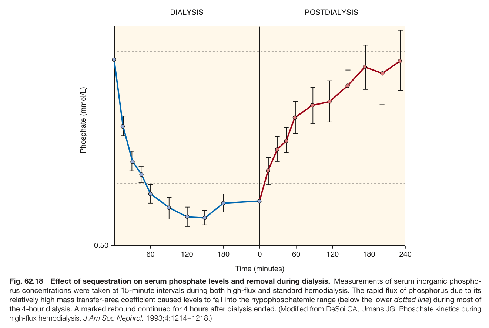

Fig. 62.18 Effect of sequestration on serum phosphate levels and removal during dialysis. Measurements of serum inorganic phospho- rus concentrations were taken at 15-minute intervals during both high-flux and standard hemodialysis. The rapid flux of phosphorus due to it relatively high mass transfer-area coefficient caused levels to fall into the hypophosphatemic range (below the lower dotted line) during most of the 4-hour dialysis. A marked rebound continued for 4 hours after dialysis ended. (Modified from DeSoi CA, Umans JG. Phosphate kinetics during high-flux hemodialysis. J Am Soc Nephrol. 1993;4:1214−1218.)

---

### Fig_62_19

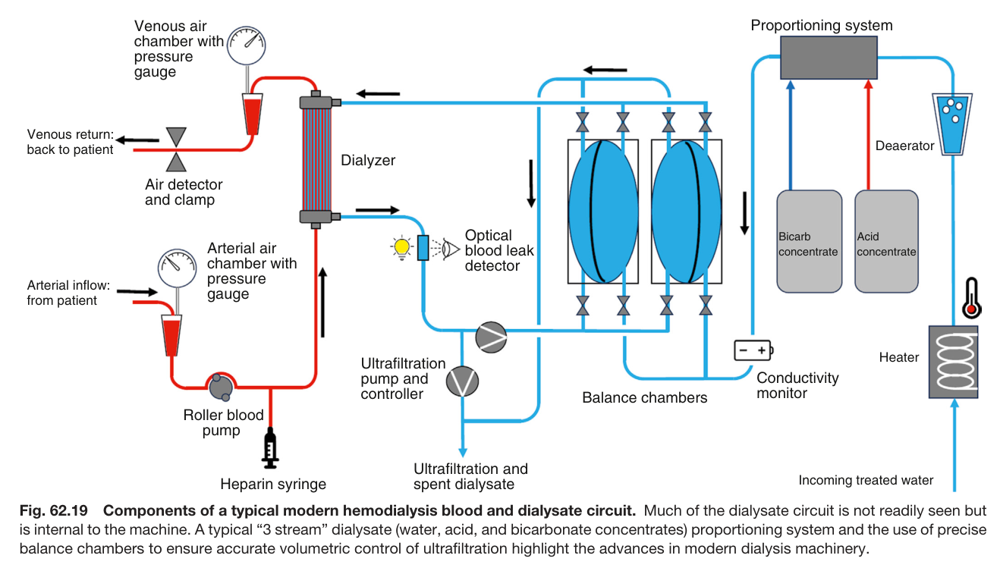

Fig. 62.19 Components of a typical modern hemodialysis blood and dialysate circuit. Much of the dialysate circuit is not readily seen but is internal to the machine. A typical “3 stream” dialysate (water, acid, and bicarbonate concentrates) proportioning system and the use of precise balance chambers to ensure accurate volumetric control of ultrafiltration highlight the advances in modern dialysis machinery.

---

### Fig_62_20

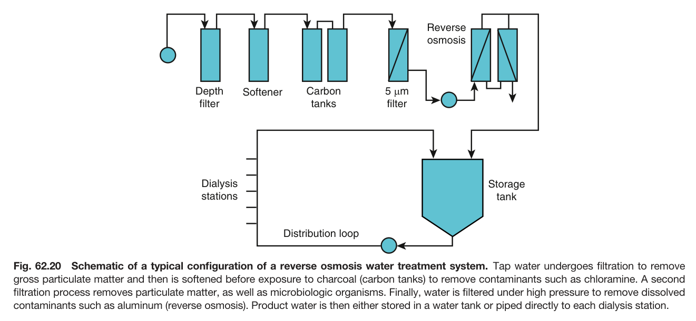

Fig. 62.20 Schematic of a typical configuration of a reverse osmosis water treatment system. Tap water undergoes filtration to remove gross particulate matter and then is softened before exposure to charcoal (carbon tanks) to remove contaminants such as chloramine. A second filtration process removes particulate matter, as well as microbiologic organisms. Finally, water is filtered under high pressure to remove dissolved contaminants such as aluminum (reverse osmosis). Product water is then either stored in a water tank or piped directly to each dialysis station.

---

### Fig_62_21

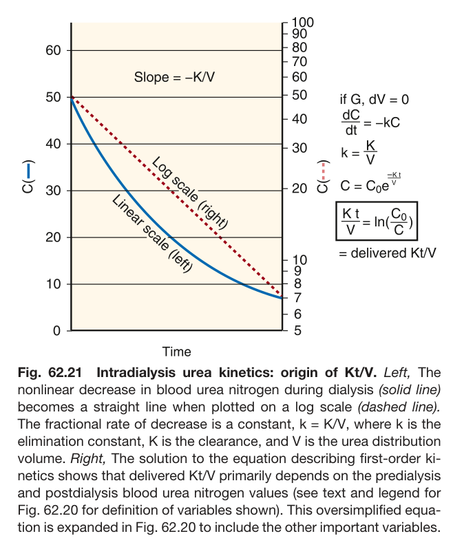

Fig. 62.21 Intradialysis urea kinetics: origin of Kt/V. Left, The nonlinear decrease in blood urea nitrogen during dialysis (solid line) becomes a straight line when plotted on a log scale (dashed line). The fractional rate of decrease is a constant, k = K/V, where k is the elimination constant, K is the clearance, and V is the urea distribution volume. Right, The solution to the equation describing first-order ki- netics shows that delivered Kt/V primarily depends on the predialysis and postdialysis blood urea nitrogen values (see text and legend for Fig. 62.20 for definition of variables shown). This oversimplified equa- tion is expanded in Fig. 62.20 to include the other important variables.

---

### Fig_62_22

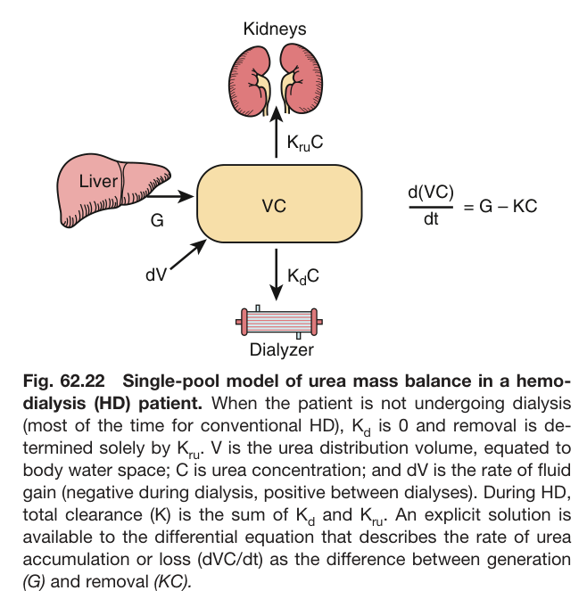

Fig. 62.22 Single-pool model of urea mass balance in a hemo- dialysis (HD) patient. When the patient is not undergoing dialysis (most of the time for conventional HD), K is 0 and removal is de- termined solely by K . V is the urea distribution volume, equated to body water space; C is urea concentration; and dV is the rate of fluid gain (negative during dialysis, positive between dialyses). During HD, total clearance (K) is the sum of K and K . An explicit solution is available to the differential equation that describes the rate of urea accumulation or loss (dVC/dt) as the difference between generation (G) and removal (KC).

---

### Fig_62_23

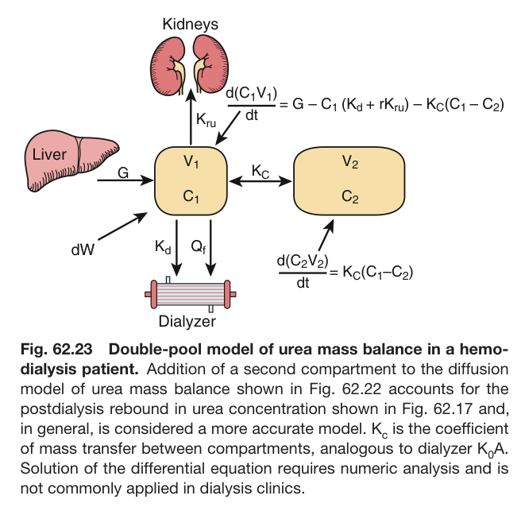

Fig. 62.23 Double-pool model of urea mass balance in a hemo- dialysis patient. Addition of a second compartment to the diffusion model of urea mass balance shown in Fig. 62.22 accounts for the postdialysis rebound in urea concentration shown in Fig. 62.17 and, in general, is considered a more accurate model. K is the coefficient of mass transfer between compartments, analogous to dialyzer K A. Solution of the differential equation requires numeric analysis and is not commonly applied in dialysis clinics.

---

### Fig_62_24

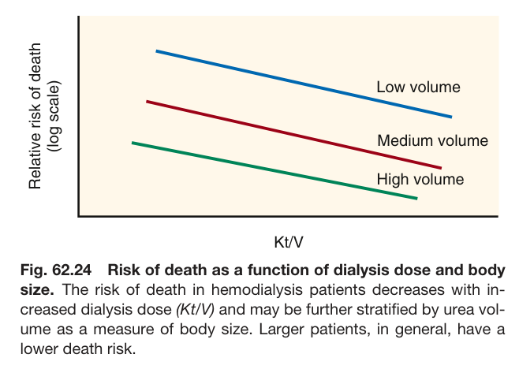

Fig. 62.24 Risk of death as a function of dialysis dose and body size. The risk of death in hemodialysis patients decreases with in- creased dialysis dose (Kt/V) and may be further stratified by urea vol- ume as a measure of body size. Larger patients, in general, have a lower death risk.

---

### Fig_62_25

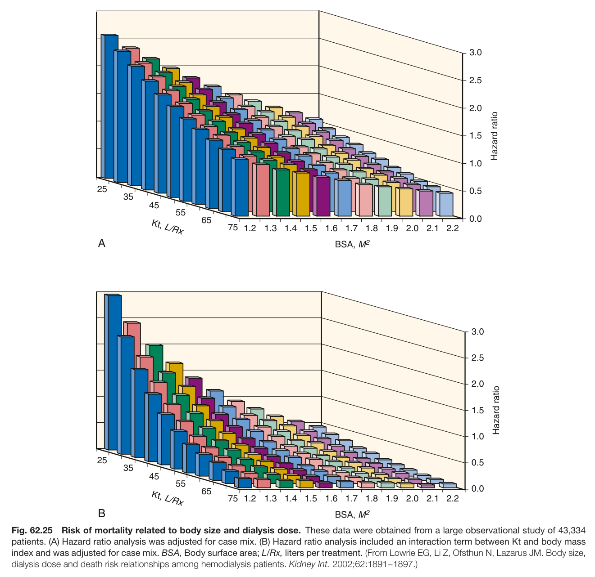

Fig. 62.25 Risk of mortality related to body size and dialysis dose. These data were obtained from a large observational study of 43,334 patients. (A) Hazard ratio analysis was adjusted for case mix. (B) Hazard ratio analysis included an interaction term between Kt and body mass index and was adjusted for case mix. BSA, Body surface area; L/Rx, liters per treatment. (From Lowrie EG, Li Z, Ofsthun N, Lazarus JM. Body size, dialysis dose and death risk relationships among hemodialysis patients. Kidney Int. 2002;62:1891−1897.)

---

### Fig_62_26

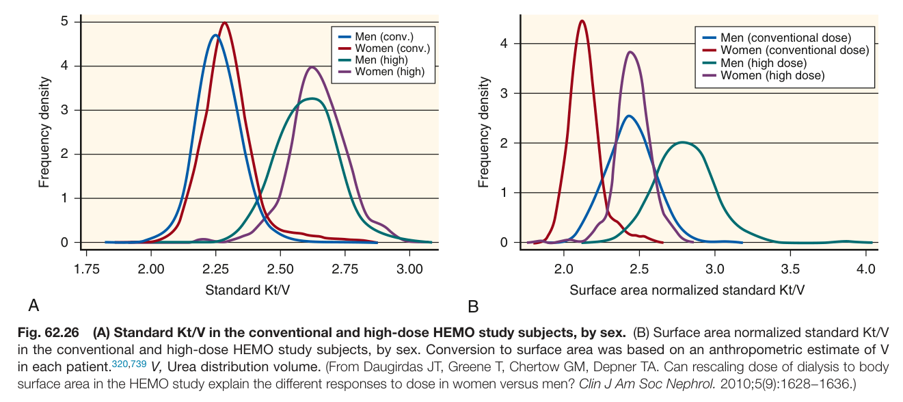

Fig. 62.26 (A) Standard Kt/V in the conventional and high-dose HEMO study subjects, by sex. (B) Surface area normalized standard Kt/V in the conventional and high-dose HEMO study subjects, by sex. Conversion to surface area was based on an anthropometric estimate of V in each patient.<sup>320,739</sup> V, Urea distribution volume. (From Daugirdas JT, Greene T, Chertow GM, Depner TA. Can rescaling dose of dialysis to body surface area in the HEMO study explain the different responses to dose in women versus men? Clin J Am Soc Nephrol. 2010;5(9):1628−1636.)

---

### Fig_62_27

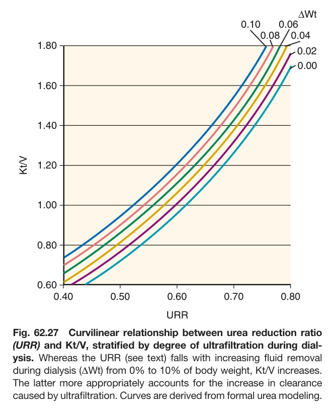

Fig. 62.27 Curvilinear relationship between urea reduction ratio (URR) and Kt/V, stratified by degree of ultrafiltration during dial- ysis. Whereas the URR (see text) falls with increasing fluid removal during dialysis (ΔWt) from 0% to 10% of body weight, Kt/V increases. The latter more appropriately accounts for the increase in clearance caused by ultrafiltration. Curves are derived from formal urea modeling.

---

### Fig_62_28

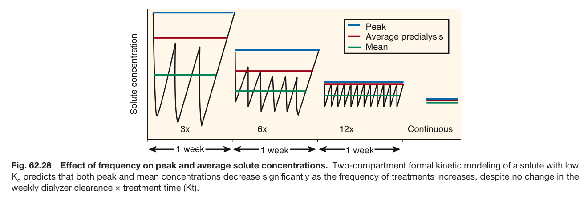

Fig. 62.28 Effect of frequency on peak and average solute concentrations. Two-compartment formal kinetic modeling of a solute with low K predicts that both peak and mean concentrations decrease significantly as the frequency of treatments increases, despite no change in the weekly dialyzer clearance × treatment time (Kt)

---

### Fig_62_29

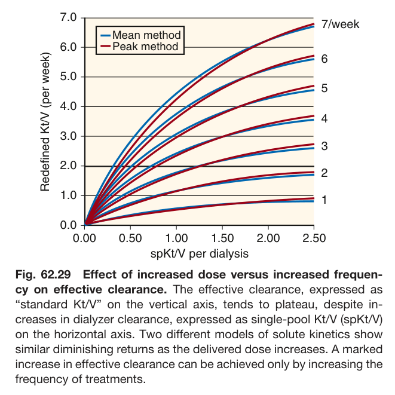

Fig. 62.29 Effect of increased dose versus increased frequen- cy on effective clearance. The effective clearance, expressed as “standard Kt/V” on the vertical axis, tends to plateau, despite in- creases in dialyzer clearance, expressed as single-pool Kt/V (spKt/V) on the horizontal axis. Two different models of solute kinetics show similar diminishing returns as the delivered dose increases. A marked increase in effective clearance can be achieved only by increasing the frequency of treatments.

---

## Tables

### Table_62_1

#### Table Image

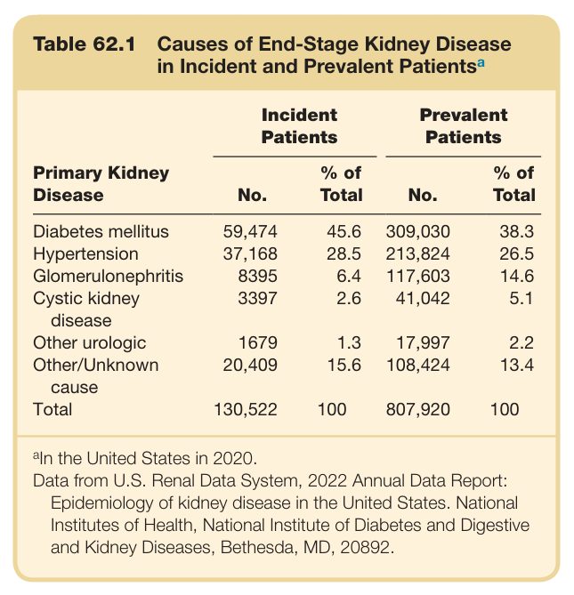

#### Table Data (CSV: [Table_62_1.csv](Table_62_1.csv))

```markdown
| Table Text (OCR) |
| :--- |
| Table 62.1  Causes of End-Stage Kidney Disease in Incident and Prevalent Patients<sup>a</sup> Primary Kidney Disease  Incident Patients  Prevalent Patients    No.  % of Total  No.  % of Total    Diabetes mellitus  59,474  45.6  309,030  38.3    Hypertension  37,168  28.5  213,824  26.5    Glomerulonephritis  8395  6.4  117,603  14.6    Cystic kidney disease  3397  2.6  41,042  5.1    Other urologic  1679  1.3  17,997  2.2    Other/Unknown cause  20,409  15.6  108,424  13.4    Total  130,522  100  807,920  100 <sup>a</sup>In the United States in 2020. Data from U.S. Renal Data System, 2022 Annual Data Report: Epidemiology of kidney disease in the United States. National Institutes of Health, National Institute of Diabetes and Digestive and Kidney Diseases, Bethesda, MD, 20892. |
```

Table 62.1 Causes of End-Stage Kidney Disease in Incident and Prevalent Patients<sup>a</sup>

---

### Table_62_2

#### Table Image

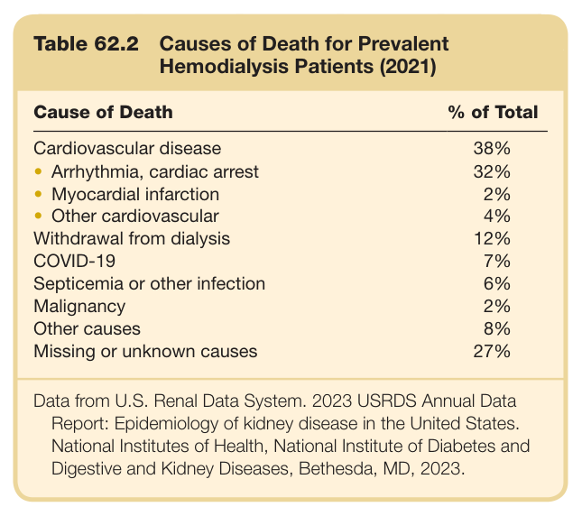

#### Table Data (CSV: [Table_62_2.csv](Table_62_2.csv))

```markdown
| Table Text (OCR) |
| :--- |
| Table 62.2 Causes of Death for Prevalent Hemodialysis Patients (2021) Cause of Death  % of Total    Cardiovascular disease  38%    • Arrhythmia, cardiac arrest  32%    • Myocardial infarction  2%    • Other cardiovascular  4%    Withdrawal from dialysis  12%    COVID-19  7%    Septicemia or other infection  6%    Malignancy  2%    Other causes  8%    Missing or unknown causes  27% Data from U.S. Renal Data System. 2023 USRDS Annual Data Report: Epidemiology of kidney disease in the United States. National Institutes of Health, National Institute of Diabetes and Digestive and Kidney Diseases, Bethesda, MD, 2023. |
```

Table 62.2 Causes of Death for Prevalent Hemodialysis Patients (2021)

---

### Table_62_3

#### Table Image

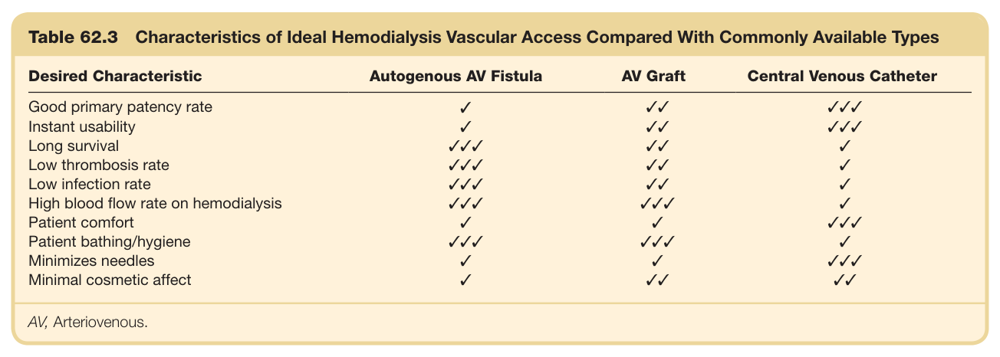

#### Table Data (CSV: [Table_62_3.csv](Table_62_3.csv))

```markdown
| Table Text (OCR) |
| :--- |
| Table 62.3 Characteristics of Ideal Hemodialysis Vascular Access Compared With Commonly Available Types Desired Characteristic  Autogenous AV Fistula  AV Graft  Central Venous Catheter    Good primary patency rate  ✓  ✓✓  ✓✓✓    Instant usability  ✓  ✓✓  ✓✓✓    Long survival  ✓✓✓  ✓✓  ✓    Low thrombosis rate  ✓✓✓  ✓✓  ✓    Low infection rate  ✓✓✓  ✓✓  ✓    High blood flow rate on hemodialysis  ✓✓✓  ✓✓✓  ✓    Patient comfort  ✓  ✓  ✓✓✓    Patient bathing/hygiene  ✓✓✓  ✓✓✓  ✓    Minimizes needles  ✓  ✓  ✓✓✓    Minimal cosmetic affect  ✓  ✓✓  ✓✓ AV, Arteriovenous. |
```

Table 62.3 Characteristics of Ideal Hemodialysis Vascular Access Compared With Commonly Available Types

---

### Table_62_4

#### Table Image

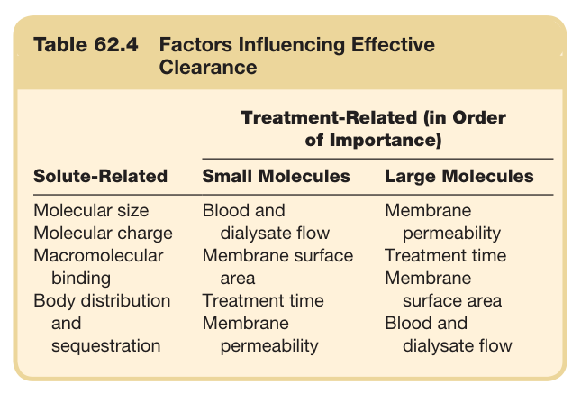

#### Table Data (CSV: [Table_62_4.csv](Table_62_4.csv))

```markdown
| Table Text (OCR) |
| :--- |
| Table 62.4  Factors Influencing Effective Clearance Solute-Related  Treatment-Related (in Order of Importance)    Small Molecules  Large Molecules    Molecular size  Blood and dialysate flow  Membrane permeability    Molecular charge    Macromolecular binding  Membrane surface area  Treatment time Membrane surface area    Body distribution and sequestration  Treatment time Membrane permeability  Blood and dialysate flow |
```

Table 62.4 Factors Influencing Effective Clearance

---

### Table_62_5

#### Table Image

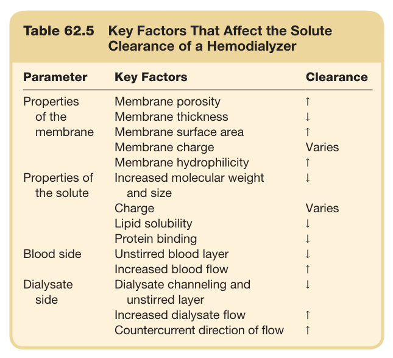

#### Table Data (CSV: [Table_62_5.csv](Table_62_5.csv))

```markdown
| Table Text (OCR) |
| :--- |
| Table 62.5  Key Factors That Affect the Solute Clearance of a Hemodialyzer Parameter  Key Factors  Clearance    Properties of the membrane  Membrane porosity  ↑    Membrane thickness  ↓    Membrane surface area  ↑    Membrane charge  Varies    Membrane hydrophilicity  ↑    Properties of the solute  Increased molecular weight and size  ↓    Charge  Varies    Lipid solubility  ↓    Protein binding  ↓    Blood side  Unstirred blood layer  ↓    Increased blood flow  ↑    Dialysate side  Dialysate channeling and unstirred layer  ↓    Increased dialysate flow  ↑    Countercurrent direction of flow  ↑ |
```

Table 62.5 Key Factors That Affect the Solute Clearance of a Hemodialyzer

---

### Table_62_6

#### Table Image

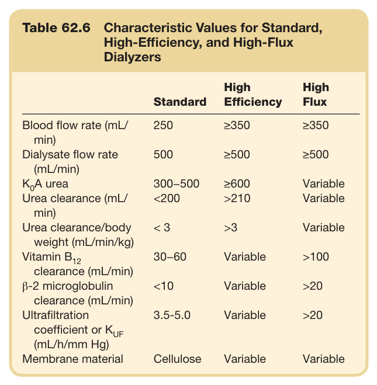

#### Table Data (CSV: [Table_62_6.csv](Table_62_6.csv))

```markdown
| Table Text (OCR) |
| :--- |
| Table 62.6 Characteristic Values for Standard, High-Efficiency, and High-Flux Dialyzers Standard  High Efficiency  High Flux    Blood flow rate (mL/min)  250  ≥350  ≥350    Dialysate flow rate (mL/min)  500  ≥500  ≥500     K_0A  urea  300–500  ≥600  Variable    Urea clearance (mL/min)  <200  >210  Variable    Urea clearance/body weight (mL/min/kg)  <3  >3  Variable    Vitamin  B_{12}  clearance (mL/min)  30–60  Variable  >100    β-2 microglobulin clearance (mL/min)  <10  Variable  >20    Ultrafiltration coefficient or  K_{UF}  (mL/h/mm Hg)  3.5-5.0  Variable  >20    Membrane material  Cellulose  Variable  Variable |
```

Table 62.6 Characteristic Values for Standard, High-Efficiency, and High-Flux Dialyzers

---

### Table_62_7

#### Table Image

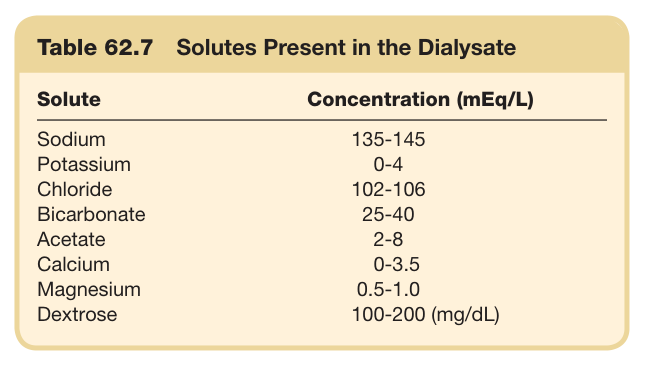

#### Table Data (CSV: [Table_62_7.csv](Table_62_7.csv))

```markdown
| Table Text (OCR) |
| :--- |
| Table 62.7  Solutes Present in the Dialysate Solute  Concentration (mEq/L)    Sodium  135-145    Potassium  0-4    Chloride  102-106    Bicarbonate  25-40    Acetate  2-8    Calcium  0-3.5    Magnesium  0.5-1.0    Dextrose  100-200 (mg/dL) |
```

Table 62.7 Solutes Present in the Dialysate

---

### Table_62_8

#### Table Image

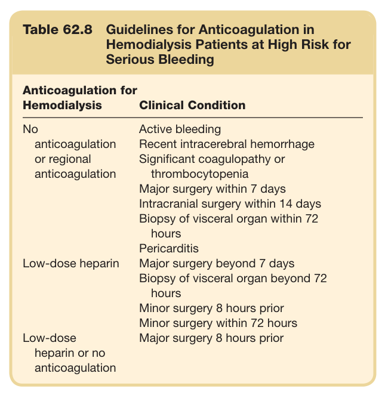

#### Table Data (CSV: [Table_62_8.csv](Table_62_8.csv))

```markdown
| Table Text (OCR) |
| :--- |
| Table 62.8 Guidelines for Anticoagulation in Hemodialysis Patients at High Risk for Serious Bleeding Anticoagulation for Hemodialysis  Clinical Condition    No  Active bleeding    anticoagulation or regional anticoagulation  Recent intracerebral hemorrhageSignificant coagulopathy or thrombocytopeniaMajor surgery within 7 daysIntracranial surgery within 14 daysBiopsy of visceral organ within 72 hoursPericarditis    Low-dose heparin  Major surgery beyond 7 daysBiopsy of visceral organ beyond 72 hoursMinor surgery 8 hours priorMinor surgery within 72 hours    Low-dose heparin or no anticoagulation  Major surgery 8 hours prior |
```

Table 62.8 Guidelines for Anticoagulation in Hemodialysis Patients at High Risk for Serious Bleeding

---

## Boxes

### Box_62_1

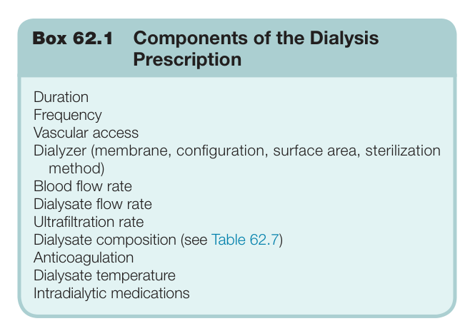

#### Box Text

```markdown
Box 62.1 Components of the Dialysis Prescription Duration Frequency Vascular access Dialyzer (membrane, configuration, surface area, sterilization method) Blood flow rate Dialysate flow rate Ultrafiltration rate Dialysate composition (see Table 62.7) Anticoagulation Dialysate temperature Intradialytic medications
```

Box 62.1 Components of the Dialysis Prescription

---

### Box_62_2

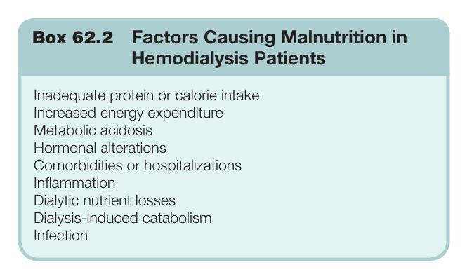

#### Box Text

```markdown
Box 62.2 Factors Causing Malnutrition in Hemodialysis Patients Inadequate protein or calorie intake Increased energy expenditure Metabolic acidosis Hormonal alterations Comorbidities or hospitalizations Inflammation Dialytic nutrient losses Dialysis-induced catabolism Infection
```

Box 62.2 Factors Causing Malnutrition in Hemodialysis Patients

---

### Box_62_2a

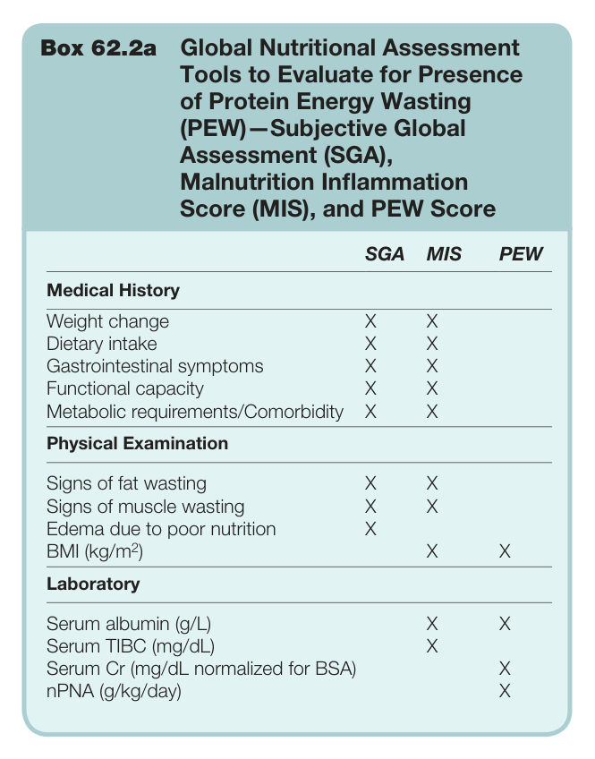

#### Box Text

```markdown
Box 62.2a Global Nutritional Assessment Tools to Evaluate for Presence of Protein Energy Wasting (PEW)—Subjective Global Assessment (SGA), Malnutrition Inflammation Score (MIS), and PEW Score
```

Box 62.2a Global Nutritional Assessment Tools to Evaluate for Presence of Protein Energy Wasting (PEW)—Subjective Global Assessment (SGA), Malnutrition Inflammation Score (MIS), and PEW Score

---

### Box_62_3

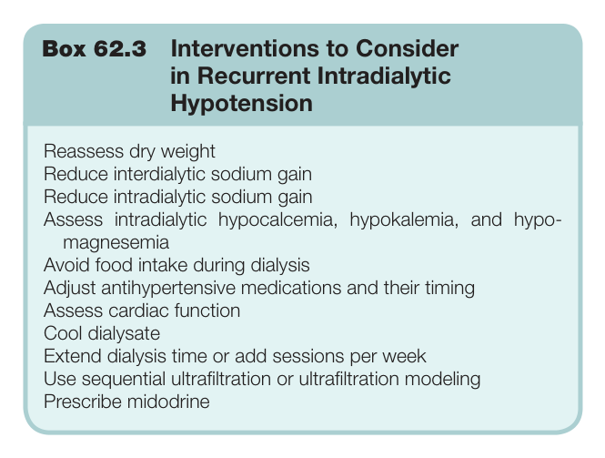

#### Box Text

```markdown
Box 62.3 Interventions to Consider in Recurrent Intradialytic Hypotension Reassess dry weight Reduce interdialytic sodium gain Reduce intradialytic sodium gain Assess intradialytic hypocalcemia, hypokalemia, and hypo- magnesemia Avoid food intake during dialysis Adjust antihypertensive medications and their timing Assess cardiac function Cool dialysate Extend dialysis time or add sessions per week Use sequential ultrafiltration or ultrafiltration modeling Prescribe midodrine
```

Box 62.3 Interventions to Consider in Recurrent Intradialytic Hypotension

---
