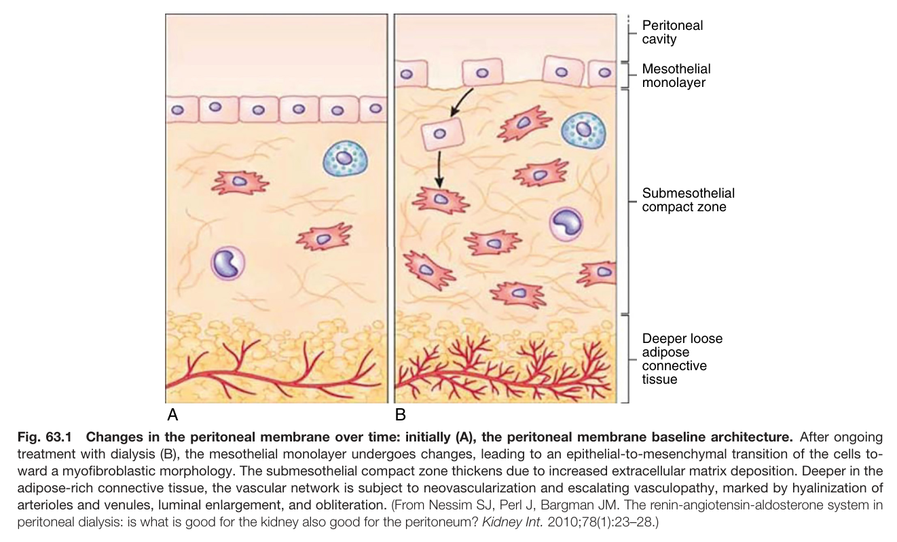
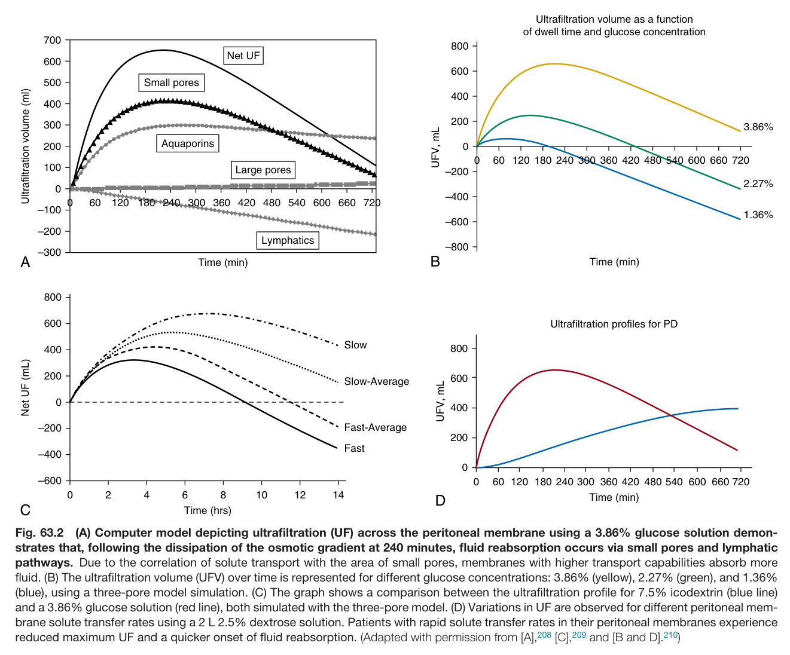
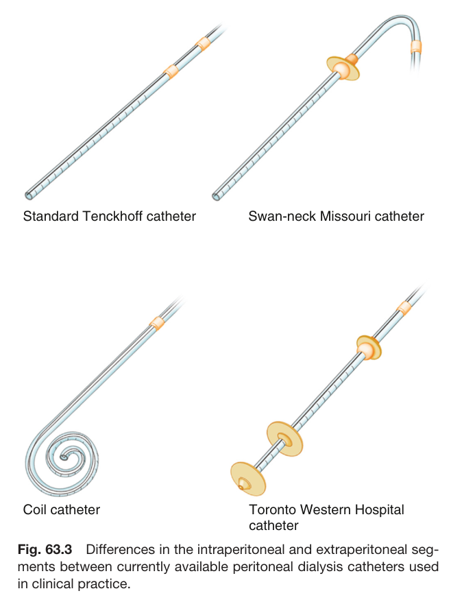
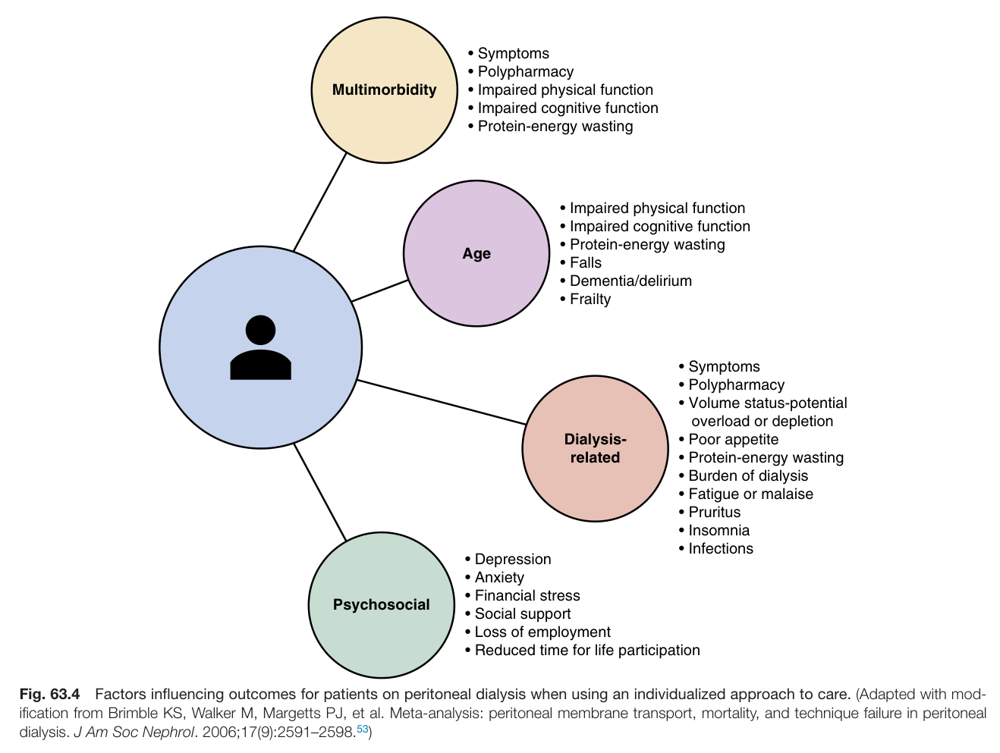
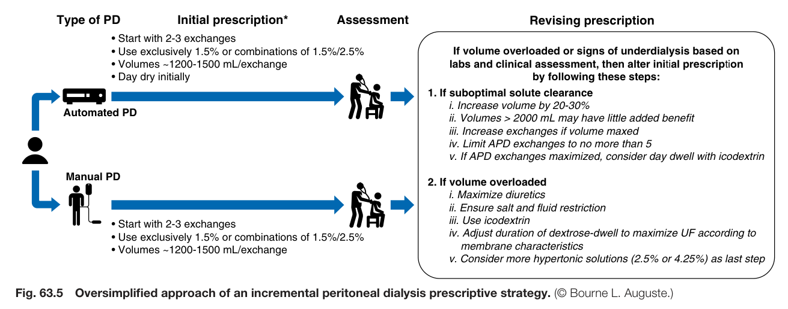
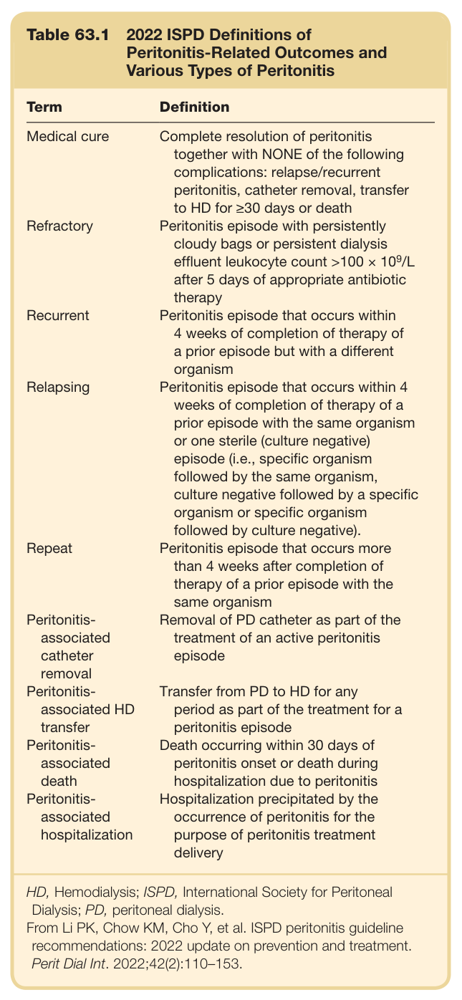
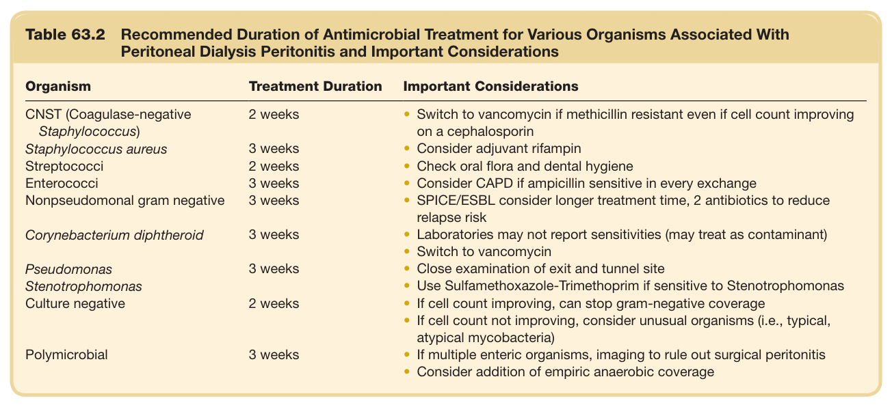

# 63. Peritoneal Dialysis - Figures and Tables Index

This document lists all figures and tables extracted from `63. Peritoneal Dialysis.pdf`.

## Table of Contents
- [Figures](#figures)
- [Tables](#tables)

---

## Figures

### Fig_63_1



Fig. 63.1 Changes in the peritoneal membrane over time: initially (A), the peritoneal membrane baseline architecture. After ongoing treatment with dialysis (B), the mesothelial monolayer undergoes changes, leading to an epithelial-to-mesenchymal transition of the cells to- ward a myofibroblastic morphology. The submesothelial compact zone thickens due to increased extracellular matrix deposition. Deeper in the adipose-rich connective tissue, the vascular network is subject to neovascularization and escalating vasculopathy, marked by hyalinization of arterioles and venules, luminal enlargement, and obliteration. (From Nessim SJ, Perl J, Bargman JM. The renin-angiotensin-aldosterone system in peritoneal dialysis: is what is good for the kidney also good for the peritoneum? Kidney Int. 2010;78(1):23–28.)

---

### Fig_63_2



Fig. 63.2 (A) Computer model depicting ultrafiltration (UF) across the peritoneal membrane using a 3.86% glucose solution demon- strates that, following the dissipation of the osmotic gradient at 240 minutes, fluid reabsorption occurs via small pores and lymphatic pathways. Due to the correlation of solute transport with the area of small pores, membranes with higher transport capabilities absorb more fluid. (B) The ultrafiltration volume (UFV) over time is represented for different glucose concentrations: 3.86% (yellow), 2.27% (green), and 1.36% (blue), using a three-pore model simulation. (C) The graph shows a comparison between the ultrafiltration profile for 7.5% icodextrin (blue line) and a 3.86% glucose solution (red line), both simulated with the three-pore model. (D) Variations in UF are observed for different peritoneal mem- brane solute transfer rates using a 2 L 2.5% dextrose solution. Patients with rapid solute transfer rates in their peritoneal membranes experience reduced maximum UF and a quicker onset of fluid reabsorption. (Adapted with permission from [A],<sup>208</sup> [C],<sup>209</sup> and [B and D].<sup>210</sup>)

---

### Fig_63_3



Fig. 63.3 Differences in the intraperitoneal and extraperitoneal seg- ments between currently available peritoneal dialysis catheters used in clinical practice.

---

### Fig_63_4



Fig. 63.4 Factors influencing outcomes for patients on peritoneal dialysis when using an individualized approach to care. (Adapted with mod- ification from Brimble KS, Walker M, Margetts PJ, et al. Meta-analysis: peritoneal membrane transport, mortality, and technique failure in peritonea dialysis. J Am Soc Nephrol. 2006;17(9):2591–2598.<sup>53</sup>)

---

### Fig_63_5



Fig. 63.5 Oversimplified approach of an incremental peritoneal dialysis prescriptive strategy. (© Bourne L. Auguste.)

---

## Tables

### Table_63_1

#### Table Image



#### Table Data (CSV: [Table_63_1.csv](Table_63_1.csv))

```markdown
| Table Text (OCR) |
| :--- |
| Table 63.1 2022 ISPD Definitions of Peritonitis-Related Outcomes and Various Types of Peritonitis Term  Definition    Medical cure  Complete resolution of peritonitis together with NONE of the following complications: relapse/recurrent peritonitis, catheter removal, transfer to HD for ≥30 days or death    Refractory  Peritonitis episode with persistently cloudy bags or persistent dialysis effluent leukocyte count  >100 \times 10^{9} /L after 5 days of appropriate antibiotic therapy    Recurrent  Peritonitis episode that occurs within 4 weeks of completion of therapy of a prior episode but with a different organism    Relapsing  Peritonitis episode that occurs within 4 weeks of completion of therapy of a prior episode with the same organism or one sterile (culture negative) episode (i.e., specific organism followed by the same organism, culture negative followed by a specific organism or specific organism followed by culture negative).    Repeat  Peritonitis episode that occurs more than 4 weeks after completion of therapy of a prior episode with the same organism    Peritonitis-associated catheter removal  Removal of PD catheter as part of the treatment of an active peritonitis episode    Peritonitis-associated HD transfer  Transfer from PD to HD for any period as part of the treatment for a peritonitis episode    Peritonitis-associated death  Death occurring within 30 days of peritonitis onset or death during hospitalization due to peritonitis    Peritonitis-associated hospitalization  Hospitalization precipitated by the occurrence of peritonitis for the purpose of peritonitis treatment delivery HD, Hemodialysis; ISPD, International Society for Peritoneal Dialysis; PD, peritoneal dialysis. From Li PK, Chow KM, Cho Y, et al. ISPD peritonitis guideline recommendations: 2022 update on prevention and treatment. Perit Dial Int. 2022;42(2):110–153. |
```

Table 63.1 2022 ISPD Definitions of Peritonitis-Related Outcomes and Various Types of Peritonitis

---

### Table_63_2

#### Table Image



#### Table Data (CSV: [Table_63_2.csv](Table_63_2.csv))

```markdown
| Table Text (OCR) |
| :--- |
| Table 63.2 Recommended Duration of Antimicrobial Treatment for Various Organisms Associated With Peritoneal Dialysis Peritonitis and Important Considerations Organism  Treatment Duration  Important Considerations    CNST (Coagulase-negative Staphylococcus)  2 weeks  Switch to vancomycin if methicillin resistant even if cell count improving on a cephalosporin    Staphylococcus aureus  3 weeks  Consider adjuvant rifampin    Streptococci  2 weeks  Check oral flora and dental hygiene    Enterococci  3 weeks  Consider CAPD if ampicillin sensitive in every exchange    Nonpseudomonal gram negative  3 weeks  SPICE/ESBL consider longer treatment time, 2 antibiotics to reduce relapse risk    Corynebacterium diphtheroid  3 weeks  Laboratories may not report sensitivities (may treat as contaminant)Switch to vancomycin    Pseudomonas  3 weeks  Close examination of exit and tunnel site    Stenotrophomonas    Use Sulfamethoxazole-Trimethoprim if sensitive to Stenotrophomonas    Culture negative  2 weeks  If cell count improving, can stop gram-negative coverageIf cell count not improving, consider unusual organisms (i.e., typical, atypical mycobacteria)    Polymicrobial  3 weeks  If multiple enteric organisms, imaging to rule out surgical peritonitisConsider addition of empiric anaerobic coverage |
```

Table 63.2 Recommended Duration of Antimicrobial Treatment for Various Organisms Associated With Peritoneal Dialysis Peritonitis and Important Considerations

---
