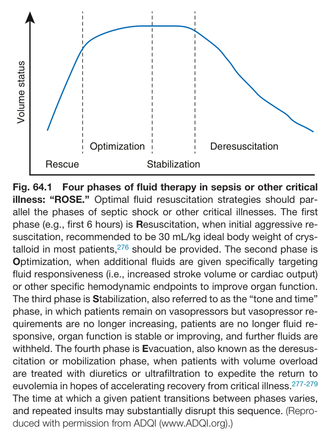
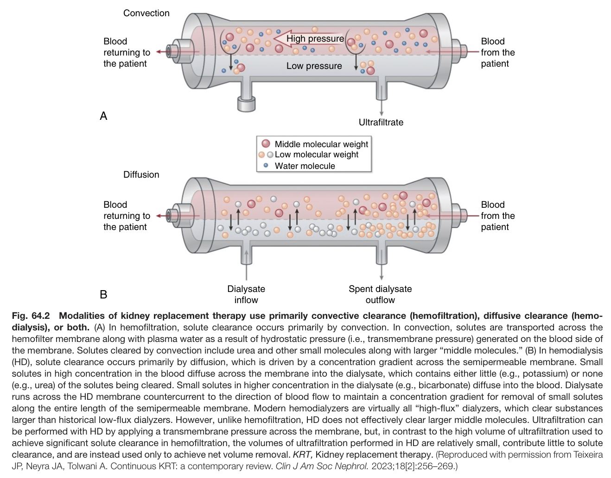
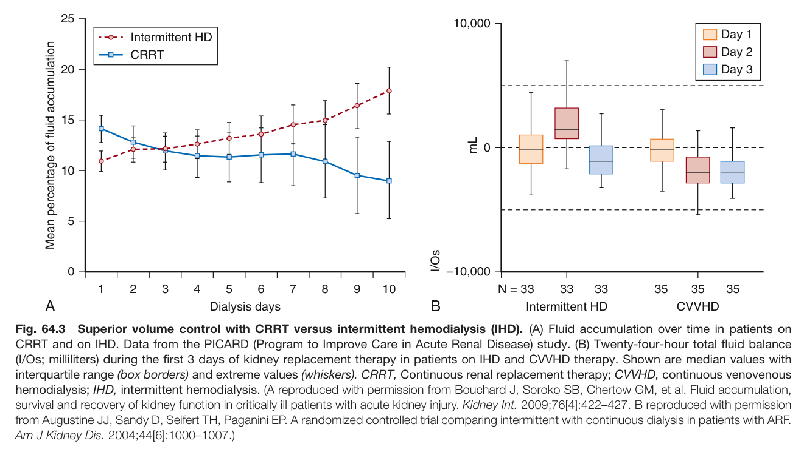
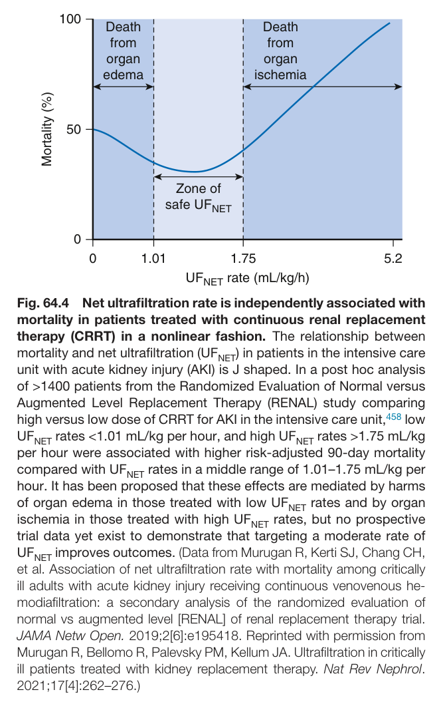
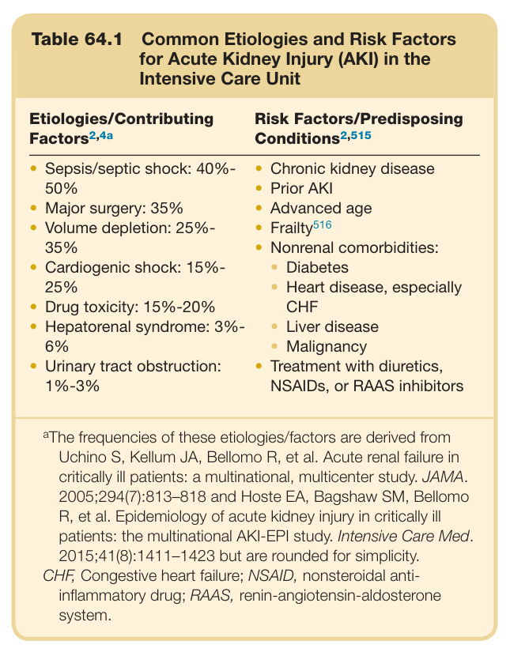
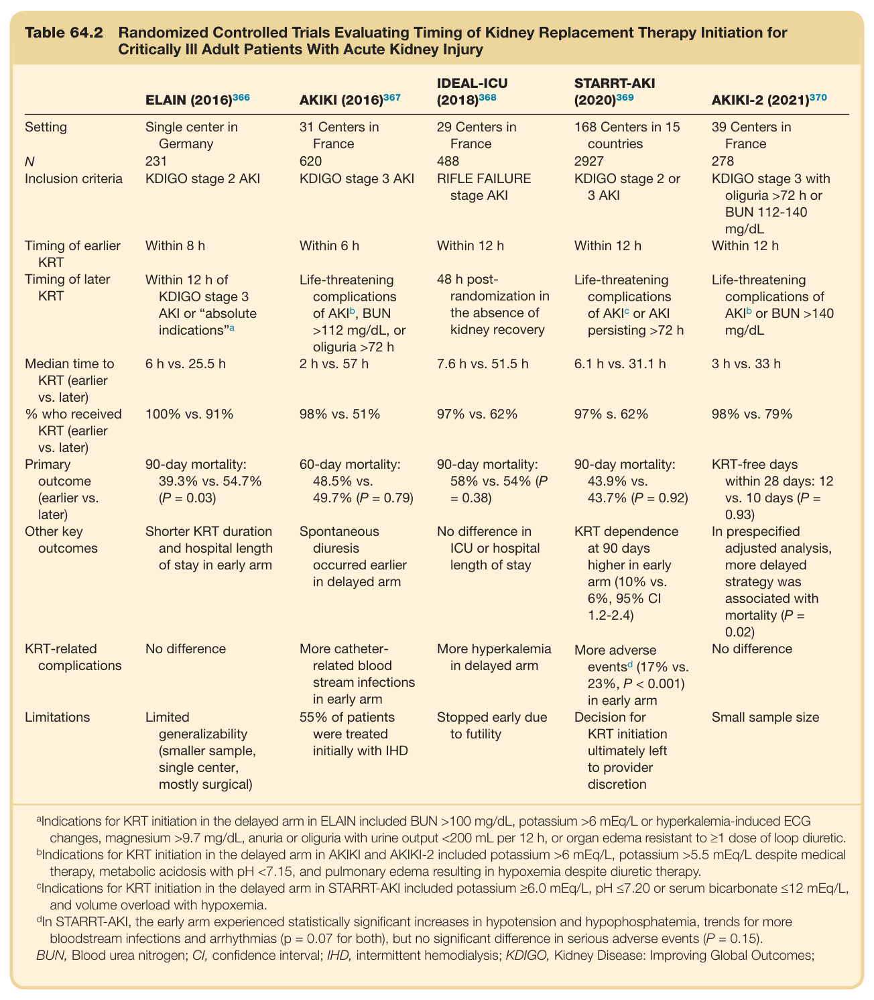
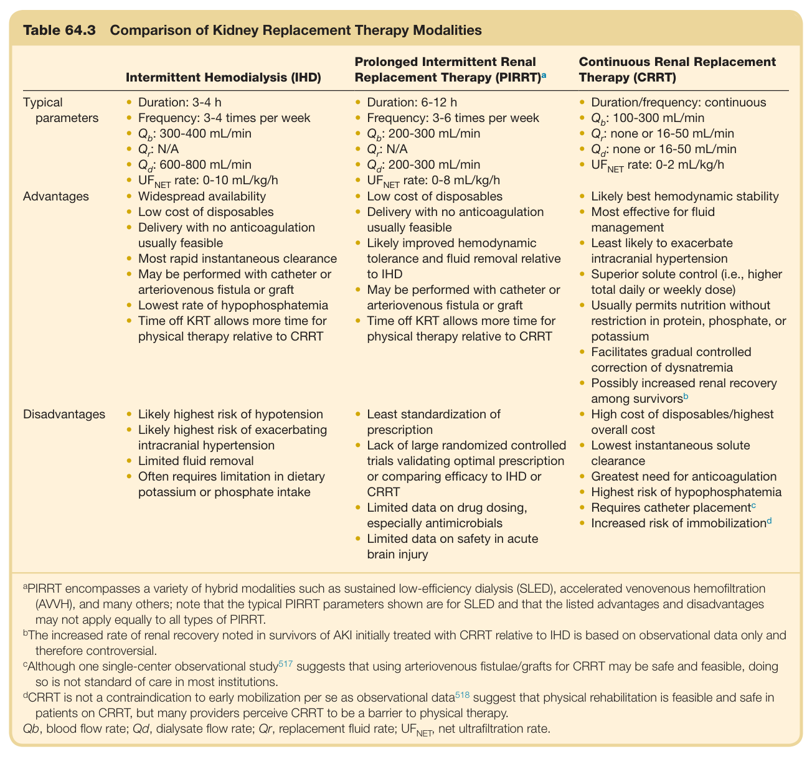
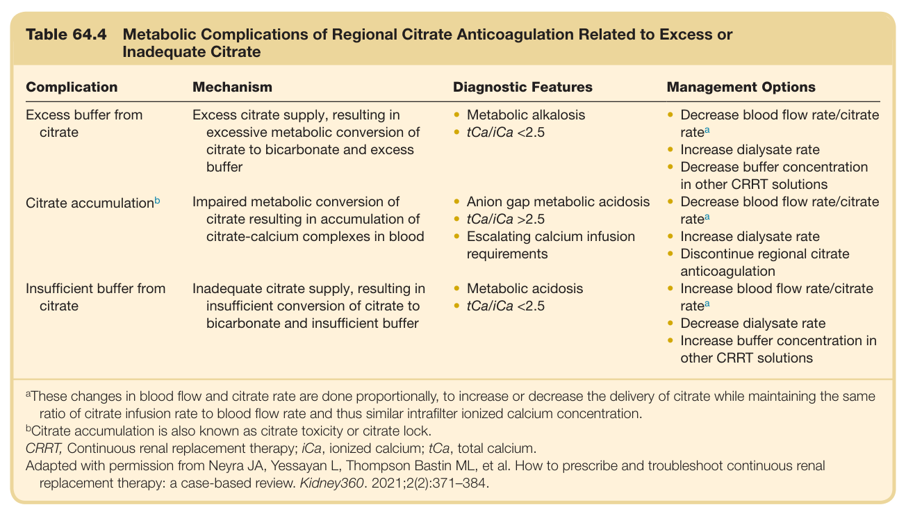
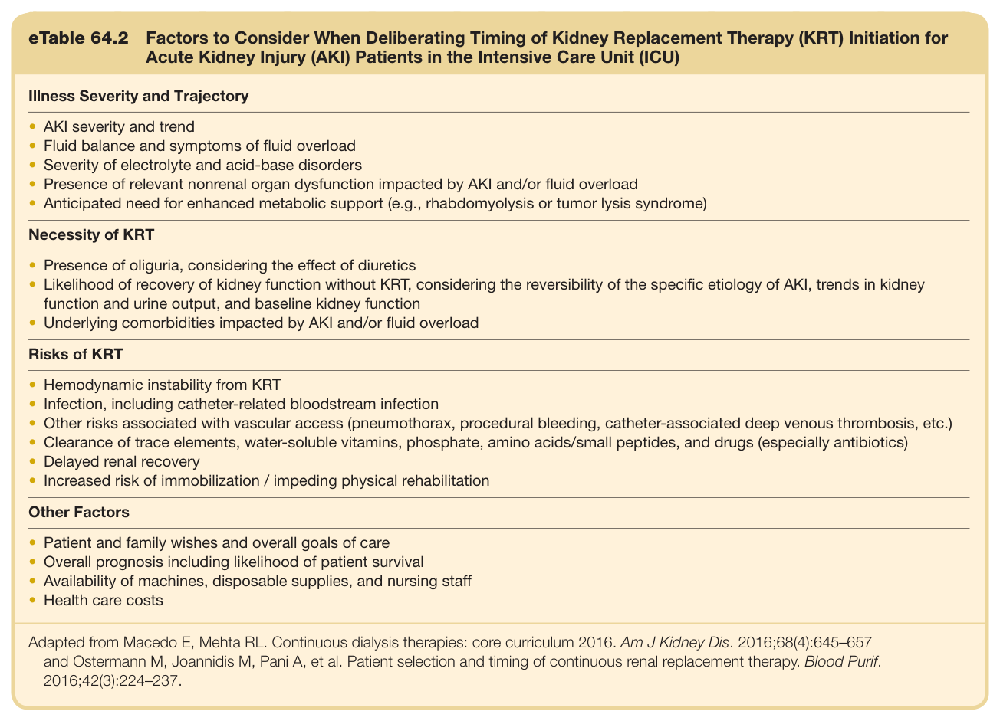

# 64. Critical Care Nephrology - Figures and Tables Index

This document lists all figures and tables extracted from `64. Critical Care Nephrology.pdf`.

## Table of Contents
- [Figures](#figures)
- [Tables](#tables)

---

## Figures

### Fig_64_1



Fig. 64.1 Four phases of fluid therapy in sepsis or other critical illness: “ROSE.” Optimal fluid resuscitation strategies should par- allel the phases of septic shock or other critical illnesses. The first phase (e.g., first 6 hours) is Resuscitation, when initial aggressive re- suscitation, recommended to be 30 mL/kg ideal body weight of crys- talloid in most patients,<sup>276</sup> should be provided. The second phase is Optimization, when additional fluids are given specifically targeting fluid responsiveness (i.e., increased stroke volume or cardiac output) or other specific hemodynamic endpoints to improve organ function. The third phase is Stabilization, also referred to as the “tone and time” phase, in which patients remain on vasopressors but vasopressor re- quirements are no longer increasing, patients are no longer fluid re- sponsive, organ function is stable or improving, and further fluids are withheld. The fourth phase is Evacuation, also known as the deresus- citation or mobilization phase, when patients with volume overload are treated with diuretics or ultrafiltration to expedite the return to euvolemia in hopes of accelerating recovery from critical illness.<sup>277-279</sup> The time at which a given patient transitions between phases varies, and repeated insults may substantially disrupt this sequence. (Repro- duced with permission from ADQI (www.ADQI.org).)

---

### Fig_64_2



Fig. 64.2 Modalities of kidney replacement therapy use primarily convective clearance (hemofiltration), diffusive clearance (hemo dialysis), or both. (A) In hemofiltration, solute clearance occurs primarily by convection. In convection, solutes are transported across the hemofilter membrane along with plasma water as a result of hydrostatic pressure (i.e., transmembrane pressure) generated on the blood side of the membrane. Solutes cleared by convection include urea and other small molecules along with larger “middle molecules.” (B) In hemodialysis (HD), solute clearance occurs primarily by diffusion, which is driven by a concentration gradient across the semipermeable membrane. Smal solutes in high concentration in the blood diffuse across the membrane into the dialysate, which contains either little (e.g., potassium) or none (e.g., urea) of the solutes being cleared. Small solutes in higher concentration in the dialysate (e.g., bicarbonate) diffuse into the blood. Dialysate runs across the HD membrane countercurrent to the direction of blood flow to maintain a concentration gradient for removal of small solutes along the entire length of the semipermeable membrane. Modern hemodialyzers are virtually all “high-flux” dialyzers, which clear substances larger than historical low-flux dialyzers. However, unlike hemofiltration, HD does not effectively clear larger middle molecules. Ultrafiltration can be performed with HD by applying a transmembrane pressure across the membrane, but, in contrast to the high volume of ultrafiltration used to achieve significant solute clearance in hemofiltration, the volumes of ultrafiltration performed in HD are relatively small, contribute little to solute clearance, and are instead used only to achieve net volume removal. KRT, Kidney replacement therapy. (Reproduced with permission from Teixeira JP, Neyra JA, Tolwani A. Continuous KRT: a contemporary review. Clin J Am Soc Nephrol. 2023;18[2]:256–269.)

---

### Fig_64_3



Fig. 64.3 Superior volume control with CRRT versus intermittent hemodialysis (IHD). (A) Fluid accumulation over time in patients on CRRT and on IHD. Data from the PICARD (Program to Improve Care in Acute Renal Disease) study. (B) Twenty-four-hour total fluid balance (I/Os; milliliters) during the first 3 days of kidney replacement therapy in patients on IHD and CVVHD therapy. Shown are median values with interquartile range (box borders) and extreme values (whiskers). CRRT, Continuous renal replacement therapy; CVVHD, continuous venovenous hemodialysis; IHD, intermittent hemodialysis. (A reproduced with permission from Bouchard J, Soroko SB, Chertow GM, et al. Fluid accumulation, survival and recovery of kidney function in critically ill patients with acute kidney injury. Kidney Int. 2009;76[4]:422–427. B reproduced with permission from Augustine JJ, Sandy D, Seifert TH, Paganini EP. A randomized controlled trial comparing intermittent with continuous dialysis in patients with ARF. Am J Kidney Dis. 2004;44[6]:1000–1007.)

---

### Fig_64_4



Fig. 64.4 Net ultrafiltration rate is independently associated with mortality in patients treated with continuous renal replacement therapy (CRRT) in a nonlinear fashion. The relationship between mortality and net ultrafiltration (UF ) in patients in the intensive care unit with acute kidney injury (AKI) is J shaped. In a post hoc analysis of >1400 patients from the Randomized Evaluation of Normal versus Augmented Level Replacement Therapy (RENAL) study comparing high versus low dose of CRRT for AKI in the intensive care unit,<sup>458</sup> low UF rates <1.01 mL/kg per hour, and high UF rates >1.75 mL/kg per hour were associated with higher risk-adjusted 90-day mortality compared with UF<sub>NET</sub> rates in a middle range of 1.01–1.75 mL/kg per hour. It has been proposed that these effects are mediated by harms of organ edema in those treated with low UF rates and by organ ischemia in those treated with high UF rates, but no prospective trial data yet exist to demonstrate that targeting a moderate rate of UF<sub>NET</sub> improves outcomes. (Data from Murugan R, Kerti SJ, Chang CH, et al. Association of net ultrafiltration rate with mortality among critically ill adults with acute kidney injury receiving continuous venovenous he- modiafiltration: a secondary analysis of the randomized evaluation of normal vs augmented level [RENAL] of renal replacement therapy trial. JAMA Netw Open. 2019;2[6]:e195418. Reprinted with permission from Murugan R, Bellomo R, Palevsky PM, Kellum JA. Ultrafiltration in critically ill patients treated with kidney replacement therapy. Nat Rev Nephrol. 2021;17[4]:262–276.)

---

## Tables

### Table_64_1

#### Table Image



#### Table Data (CSV: [Table_64_1.csv](Table_64_1.csv))

```markdown
| Table Text (OCR) |
| :--- |
| Table 64.1 Common Etiologies and Risk Factors for Acute Kidney Injury (AKI) in the Intensive Care Unit Etiologies/Contributing Factors2,4a  Risk Factors/Predisposing Conditions2,515    Sepsis/septic shock: 40%-50%Major surgery: 35%Volume depletion: 25%-35%Cardiogenic shock: 15%-25%Drug toxicity: 15%-20%Hepatorenal syndrome: 3%-6%Urinary tract obstruction: 1%-3%  Chronic kidney diseasePrior AKIAdvanced ageFrailty516Nonrenal comorbidities:DiabetesHeart disease, especially CHFLiver diseaseMalignancyTreatment with diuretics, NSAIDs, or RAAS inhibitors |
```

Table 64.1 Common Etiologies and Risk Factors for Acute Kidney Injury (AKI) in the Intensive Care Unit

---

### Table_64_2

#### Table Image



#### Table Data (CSV: [Table_64_2.csv](Table_64_2.csv))

```markdown
| Table Text (OCR) |
| :--- |
| Table 64.2  Randomized Controlled Trials Evaluating Timing of Kidney Replacement Therapy Initiation for Critically Ill Adult Patients With Acute Kidney Injury ELAIN (2016) ^{366}   AKIKI (2016) ^{367}   IDEAL-ICU (2018) ^{368}   STARRT-AKI (2020) ^{369}   AKIKI-2 (2021) ^{370}     Setting  Single center in Germany  31 Centers in France  29 Centers in France  168 Centers in 15 countries  39 Centers in France    N  231  620  488  2927  278    Inclusion criteria  KDIGO stage 2 AKI  KDIGO stage 3 AKI  RIFLE FAILURE stage AKI  KDIGO stage 2 or 3 AKI  KDIGO stage 3 with oliguria >72 h or BUN 112-140 mg/dL    Timing of earlier KRT  Within 8 h  Within 6 h  Within 12 h  Within 12 h  Within 12 h    Timing of later KRT  Within 12 h of KDIGO stage 3 AKI or “absolute indications” ^{a}   Life-threatening complications of AKI ^{b} , BUN >112 mg/dL, or oliguria >72 h  48 h post-randomization in the absence of kidney recovery  Life-threatening complications of AKI ^{c}  or AKI persisting >72 h  Life-threatening complications of AKI ^{b}  or BUN >140 mg/dL    Median time to KRT (earlier vs. later)  6 h vs. 25.5 h  2 h vs. 57 h  7.6 h vs. 51.5 h  6.1 h vs. 31.1 h  3 h vs. 33 h    % who received KRT (earlier vs. later)  100% vs. 91%  98% vs. 51%  97% vs. 62%  97% s. 62%  98% vs. 79%    Primary outcome (earlier vs. later)  90-day mortality: 39.3% vs. 54.7% (P = 0.03)  60-day mortality: 48.5% vs. 49.7% (P = 0.79)  90-day mortality: 58% vs. 54% (P = 0.38)  90-day mortality: 43.9% vs. 43.7% (P = 0.92)  KRT-free days within 28 days: 12 vs. 10 days (P = 0.93)    Other key outcomes  Shorter KRT duration and hospital length of stay in early arm  Spontaneous diuresis occurred earlier in delayed arm  No difference in ICU or hospital length of stay  KRT dependence at 90 days higher in early arm (10% vs. 6%, 95% CI 1.2-2.4)  In prespecified adjusted analysis, more delayed strategy was associated with mortality (P = 0.02)    KRT-related complications  No difference  More catheter-related blood stream infections in early arm  More hyperkalemia in delayed arm  More adverse events ^{d}  (17% vs. 23%, P < 0.001) in early arm  No difference    Limitations  Limited generalizability (smaller sample, single center, mostly surgical)  55% of patients were treated initially with IHD  Stopped early due to futility  Decision for KRT initiation ultimately left to provider discretion  Small sample size <sup>a</sup>Indications for KRT initiation in the delayed arm in ELAIN included BUN >100 mg/dL, potassium >6 mEq/L or hyperkalemia-induced ECG changes, magnesium >9.7 mg/dL, anuria or oliguria with urine output <200 mL per 12 h, or organ edema resistant to ≥1 dose of loop diuretic. <sup>b</sup>Indications for KRT initiation in the delayed arm in AKIKI and AKIKI-2 included potassium >6 mEq/L, potassium >5.5 mEq/L despite medical therapy, metabolic acidosis with pH <7.15, and pulmonary edema resulting in hypoxemia despite diuretic therapy. <sup>c</sup>Indications for KRT initiation in the delayed arm in STARRT-AKI included potassium ≥6.0 mEq/L, pH ≤7.20 or serum bicarbonate ≤12 mEq/L, and volume overload with hypoxemia. <sup>d</sup>In STARRT-AKI, the early arm experienced statistically significant increases in hypotension and hypophosphatemia, trends for more bloodstream infections and arrhythmias (p = 0.07 for both), but no significant difference in serious adverse events (P = 0.15). BUN, Blood urea nitrogen; CI, confidence interval; IHD, intermittent hemodialysis; KDIGO, Kidney Disease: Improving Global Outcomes; |
```

Table 64.2 Randomized Controlled Trials Evaluating Timing of Kidney Replacement Therapy Initiation for Critically Ill Adult Patients With Acute Kidney Injury

---

### Table_64_3

#### Table Image



#### Table Data (CSV: [Table_64_3.csv](Table_64_3.csv))

```markdown
| Table Text (OCR) |
| :--- |
| Table 64.3  Comparison of Kidney Replacement Therapy Modalities Intermittent Hemodialysis (IHD)  Prolonged Intermittent Renal Replacement Therapy (PIRRT) ^{a}   Continuous Renal Replacement Therapy (CRRT)    Typical parameters  Duration: 3-4 hFrequency: 3-4 times per week Q_b : 300-400 mL/min Q_r : N/A Q_d : 600-800 mL/min UF_{NET}  rate: 0-10 mL/kg/h  Duration: 6-12 hFrequency: 3-6 times per week Q_b : 200-300 mL/min Q_r : N/A Q_d : 200-300 mL/min UF_{NET}  rate: 0-8 mL/kg/h  Duration/frequency: continuous Q_b : 100-300 mL/min Q_r : none or 16-50 mL/min Q_d : none or 16-50 mL/min UF_{NET}  rate: 0-2 mL/kg/h    Advantages  Widespread availabilityLow cost of disposablesDelivery with no anticoagulation usually feasibleMost rapid instantaneous clearanceMay be performed with catheter or arteriovenous fistula or graftLowest rate of hypophosphatemiaTime off KRT allows more time for physical therapy relative to CRRT  Low cost of disposablesDelivery with no anticoagulation usually feasibleLikely improved hemodynamic tolerance and fluid removal relative to IHDMay be performed with catheter or arteriovenous fistula or graftTime off KRT allows more time for physical therapy relative to CRRT  Likely best hemodynamic stabilityMost effective for fluid managementLeast likely to exacerbate intracranial hypertensionSuperior solute control (i.e., higher total daily or weekly dose)Usually permits nutrition without restriction in protein, phosphate, or potassiumFacilitates gradual controlled correction of dysnatremiaPossibly increased renal recovery among survivors ^{b}     Disadvantages  Likely highest risk of hypotensionLikely highest risk of exacerbating intracranial hypertensionLimited fluid removalOften requires limitation in dietary potassium or phosphate intake  Least standardization of prescriptionLack of large randomized controlled trials validating optimal prescription or comparing efficacy to IHD or CRRTLimited data on drug dosing, especially antimicrobialsLimited data on safety in acute brain injury  High cost of disposables/highest overall costLowest instantaneous solute clearanceGreatest need for anticoagulationHighest risk of hypophosphatemiaRequires catheter placement ^{c} Increased risk of immobilization ^{d} <sup>a</sup>PIRRT encompasses a variety of hybrid modalities such as sustained low-efficiency dialysis (SLED), accelerated venovenous hemofiltration (AVVH), and many others; note that the typical PIRRT parameters shown are for SLED and that the listed advantages and disadvantages may not apply equally to all types of PIRRT. <sup>b</sup>The increased rate of renal recovery noted in survivors of AKI initially treated with CRRT relative to IHD is based on observational data only and therefore controversial. <sup>c</sup>Although one single-center observational study<sup>517</sup> suggests that using arteriovenous fistulae/grafts for CRRT may be safe and feasible, doing so is not standard of care in most institutions. <sup>d</sup>CRRT is not a contraindication to early mobilization per se as observational data<sup>518</sup> suggest that physical rehabilitation is feasible and safe in patients on CRRT, but many providers perceive CRRT to be a barrier to physical therapy. Qb, blood flow rate; Qd, dialysate flow rate; Qr, replacement fluid rate; UF , net ultrafiltration rate. |
```

Table 64.3 Comparison of Kidney Replacement Therapy Modalities

---

### Table_64_4

#### Table Image



#### Table Data (CSV: [Table_64_4.csv](Table_64_4.csv))

```markdown
| Table Text (OCR) |
| :--- |
| Table 64.4 Metabolic Complications of Regional Citrate Anticoagulation Related to Excess or Inadequate Citrate Complication  Mechanism  Diagnostic Features  Management Options    Excess buffer from citrate  Excess citrate supply, resulting in excessive metabolic conversion of citrate to bicarbonate and excess buffer  Metabolic alkalosis tCa/iCa <2.5   Decrease blood flow rate/citrate rateaIncrease dialysate rateDecrease buffer concentration in other CRRT solutions    Citrate accumulationb  Impaired metabolic conversion of citrate resulting in accumulation of citrate-calcium complexes in blood  Anion gap metabolic acidosis tCa/iCa >2.5 Escalating calcium infusion requirements  Decrease blood flow rate/citrate rateaIncrease dialysate rateDiscontinue regional citrate anticoagulation    Insufficient buffer from citrate  Inadequate citrate supply, resulting in insufficient conversion of citrate to bicarbonate and insufficient buffer  Metabolic acidosis tCa/iCa <2.5   Increase blood flow rate/citrate rateaDecrease dialysate rateIncrease buffer concentration in other CRRT solutions <sup>a</sup>These changes in blood flow and citrate rate are done proportionally, to increase or decrease the delivery of citrate while maintaining the same ratio of citrate infusion rate to blood flow rate and thus similar intrafilter ionized calcium concentration. <sup>b</sup>Citrate accumulation is also known as citrate toxicity or citrate lock. CRRT, Continuous renal replacement therapy; iCa, ionized calcium; tCa, total calcium. Adapted with permission from Neyra JA, Yessayan L, Thompson Bastin ML, et al. How to prescribe and troubleshoot continuous renal replacement therapy: a case-based review. Kidney360. 2021;2(2):371–384. |
```

Table 64.4 Metabolic Complications of Regional Citrate Anticoagulation Related to Excess or Inadequate Citrate

---

### Table_e64_2

#### Table Image



#### Table Data (CSV: [Table_e64_2.csv](Table_e64_2.csv))

```markdown
| Table Text (OCR) |
| :--- |
| eTable 64.2 Factors to Consider When Deliberating Timing of Kidney Replacement Therapy (KRT) Initiation for Acute Kidney Injury (AKI) Patients in the Intensive Care Unit (ICU) Illness Severity and Trajectory AKI severity and trendFluid balance and symptoms of fluid overloadSeverity of electrolyte and acid-base disordersPresence of relevant nonrenal organ dysfunction impacted by AKI and/or fluid overloadAnticipated need for enhanced metabolic support (e.g., rhabdomyolysis or tumor lysis syndrome) |
```

Table e64.2 Factors to Consider When Deliberating Timing of Kidney Replacement Therapy (KRT) Initiation for Acute Kidney Injury (AKI) Patients in the Intensive Care Unit (ICU)

---
