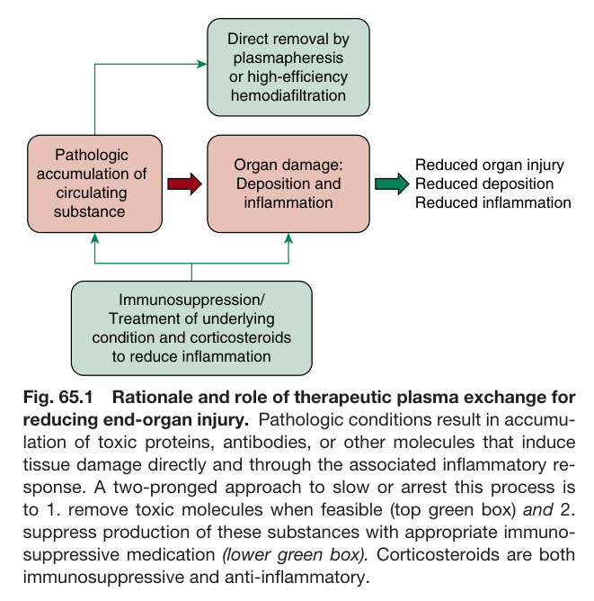
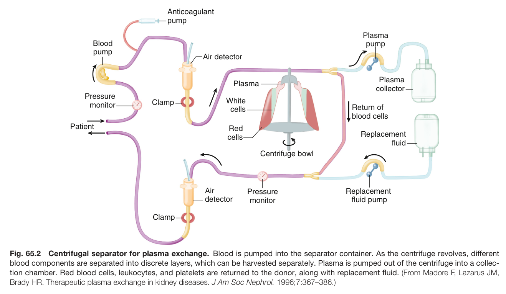
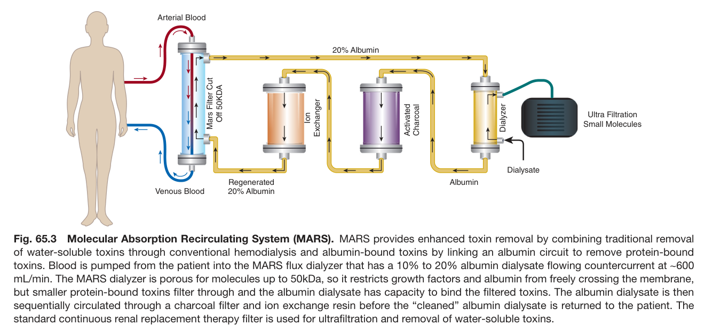
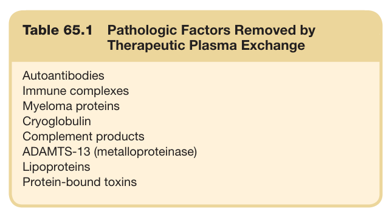
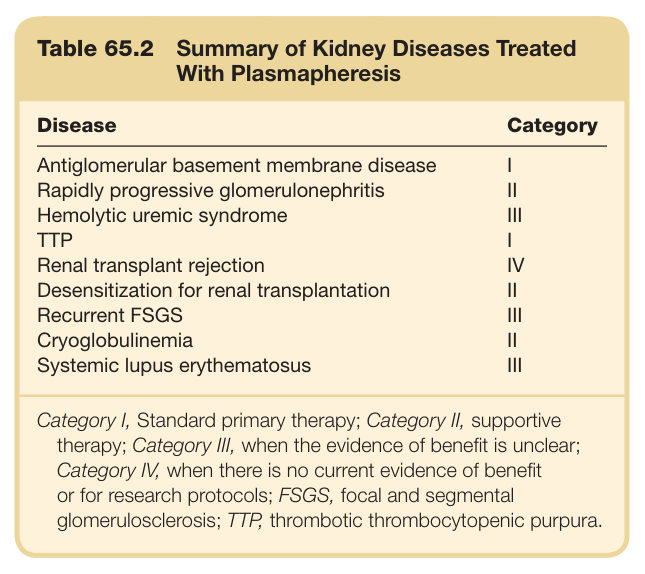
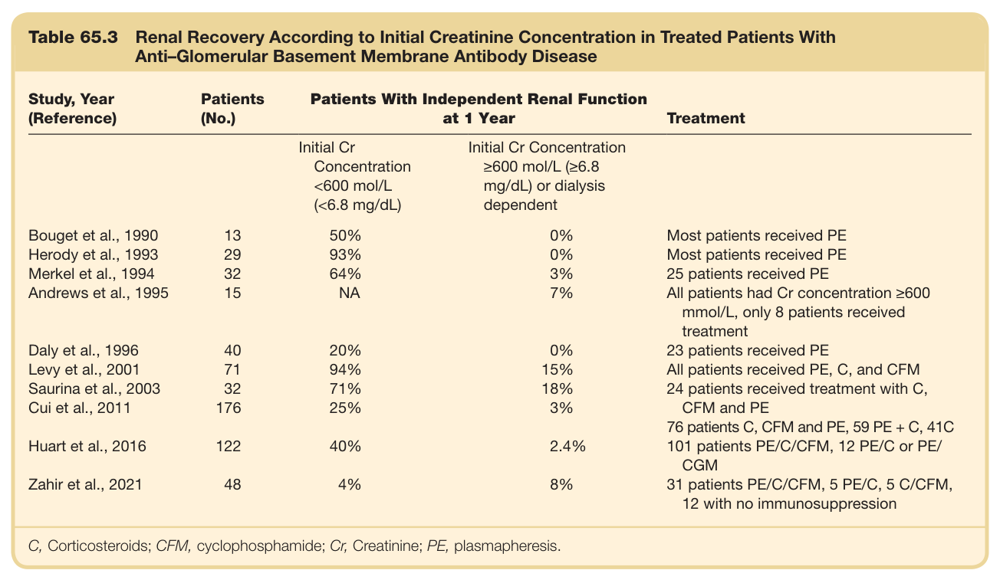
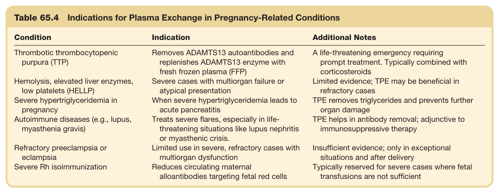

# 65. Therapeutic Plasma Exchange and Other Extracorporeal Treatments in Management of Kidney and Related Diseases - Figures and Tables Index

This document lists all figures and tables extracted from `65. Therapeutic Plasma Exchange and Other Extracorporeal Treatments in Management of Kidney and Related Diseases.pdf`.

## Table of Contents
- [Figures](#figures)
- [Tables](#tables)

---

## Figures

### Fig_65_1



Fig. 65.1 Rationale and role of therapeutic plasma exchange for reducing end-organ injury. Pathologic conditions result in accumu- lation of toxic proteins, antibodies, or other molecules that induce tissue damage directly and through the associated inflammatory re- sponse. A two-pronged approach to slow or arrest this process is to 1. remove toxic molecules when feasible (top green box) and 2. suppress production of these substances with appropriate immuno- suppressive medication (lower green box). Corticosteroids are both immunosuppressive and anti-inflammatory.

---

### Fig_65_2



Fig. 65.2 Centrifugal separator for plasma exchange. Blood is pumped into the separator container. As the centrifuge revolves, different blood components are separated into discrete layers, which can be harvested separately. Plasma is pumped out of the centrifuge into a collec- tion chamber. Red blood cells, leukocytes, and platelets are returned to the donor, along with replacement fluid. (From Madore F, Lazarus JM, Brady HR. Therapeutic plasma exchange in kidney diseases. J Am Soc Nephrol. 1996;7:367–386.)

---

### Fig_65_3



Fig. 65.3 Molecular Absorption Recirculating System (MARS). MARS provides enhanced toxin removal by combining traditional removal of water-soluble toxins through conventional hemodialysis and albumin-bound toxins by linking an albumin circuit to remove protein-bound toxins. Blood is pumped from the patient into the MARS flux dialyzer that has a 10% to 20% albumin dialysate flowing countercurrent at ∼600 mL/min. The MARS dialyzer is porous for molecules up to 50kDa, so it restricts growth factors and albumin from freely crossing the membrane, but smaller protein-bound toxins filter through and the albumin dialysate has capacity to bind the filtered toxins. The albumin dialysate is then sequentially circulated through a charcoal filter and ion exchange resin before the “cleaned” albumin dialysate is returned to the patient. The standard continuous renal replacement therapy filter is used for ultrafiltration and removal of water-soluble toxins.

---

## Tables

### Table_65_1

#### Table Image



#### Table Data (CSV: [Table_65_1.csv](Table_65_1.csv))

```markdown
| Table Text (OCR) |
| :--- |
| Table 65.1  Pathologic Factors Removed by Therapeutic Plasma Exchange Autoantibodies    Immune complexes    Myeloma proteins    Cryoglobulin    Complement products    ADAMTS-13 (metalloproteinase)    Lipoproteins    Protein-bound toxins |
```

Table 65.1 Pathologic Factors Removed by Therapeutic Plasma Exchange

---

### Table_65_2

#### Table Image



#### Table Data (CSV: [Table_65_2.csv](Table_65_2.csv))

```markdown
| Table Text (OCR) |
| :--- |
| Table 65.2  Summary of Kidney Diseases Treated With Plasmapheresis Disease  Category    Antiglomerular basement membrane disease  I    Rapidly progressive glomerulonephritis  II    Hemolytic uremic syndrome  III    TTP  I    Renal transplant rejection  IV    Desensitization for renal transplantation  II    Recurrent FSGS  III    Cryoglobulinemia  II    Systemic lupus erythematosus  III Category I, Standard primary therapy; Category II, supportive therapy; Category III, when the evidence of benefit is unclear; Category IV, when there is no current evidence of benefit or for research protocols; FSGS, focal and segmental glomerulosclerosis; TTP, thrombotic thrombocytopenic purpura. |
```

Table 65.2 Summary of Kidney Diseases Treated With Plasmapheresis

---

### Table_65_3

#### Table Image



#### Table Data (CSV: [Table_65_3.csv](Table_65_3.csv))

```markdown
| Table Text (OCR) |
| :--- |
| Table 65.3  Renal Recovery According to Initial Creatinine Concentration in Treated Patients With Anti–Glomerular Basement Membrane Antibody Disease Study, Year (Reference)  Patients (No.)  Patients With Independent Renal Function at 1 Year  Treatment        Initial Cr Concentration <600 mol/L (<6.8 mg/dL)  Initial Cr Concentration ≥600 mol/L (≥6.8 mg/dL) or dialysis dependent      Bouget et al., 1990  13  50%  0%  Most patients received PE    Herody et al., 1993  29  93%  0%  Most patients received PE    Merkel et al., 1994  32  64%  3%  25 patients received PE    Andrews et al., 1995  15  NA  7%  All patients had Cr concentration ≥600 mmol/L, only 8 patients received treatment    Daly et al., 1996  40  20%  0%  23 patients received PE    Levy et al., 2001  71  94%  15%  All patients received PE, C, and CFM    Saurina et al., 2003  32  71%  18%  24 patients received treatment with C, CFM and PE    Cui et al., 2011  176  25%  3%  76 patients C, CFM and PE, 59 PE + C, 41C    Huart et al., 2016  122  40%  2.4%  101 patients PE/C/CFM, 12 PE/C or PE/ CGM    Zahir et al., 2021  48  4%  8%  31 patients PE/C/CFM, 5 PE/C, 5 C/CFM, 12 with no immunosuppression C, Corticosteroids; CFM, cyclophosphamide; Cr, Creatinine; PE, plasmapheresis. |
```

Table 65.3 Renal Recovery According to Initial Creatinine Concentration in Treated Patients With Anti–Glomerular Basement Membrane Antibody Disease

---

### Table_65_4

#### Table Image



#### Table Data (CSV: [Table_65_4.csv](Table_65_4.csv))

```markdown
| Table Text (OCR) |
| :--- |
| Table 65.4  Indications for Plasma Exchange in Pregnancy-Related Conditions Condition  Indication  Additional Notes    Thrombotic thrombocytopenic purpura (TTP)  Removes ADAMTS13 autoantibodies and replenishes ADAMTS13 enzyme with fresh frozen plasma (FFP)  A life-threatening emergency requiring prompt treatment. Typically combined with corticosteroids    Hemolysis, elevated liver enzymes, low platelets (HELLP)  Severe cases with multiorgan failure or atypical presentation  Limited evidence; TPE may be beneficial in refractory cases    Severe hypertriglyceridemia in pregnancy  When severe hypertriglyceridemia leads to acute pancreatitis  TPE removes triglycerides and prevents further organ damage    Autoimmune diseases (e.g., lupus, myasthenia gravis)  Treats severe flares, especially in life-threatening situations like lupus nephritis or myasthenic crisis.  TPE helps in antibody removal; adjunctive to immunosuppressive therapy    Refractory preeclampsia or eclampsia  Limited use in severe, refractory cases with multiorgan dysfunction  Insufficient evidence; only in exceptional situations and after delivery    Severe Rh isoimmunization  Reduces circulating maternal alloantibodies targeting fetal red cells  Typically reserved for severe cases where fetal transfusions are not sufficient |
```

Table 65.4 Indications for Plasma Exchange in Pregnancy-Related Conditions

---
