# 66. Enhanced Elimination of Poisons - Figures and Tables Index

This document lists all figures and tables extracted from `66. Enhanced Elimination of Poisons.pdf`.

## Table of Contents
- [Figures](#figures)
- [Tables](#tables)

---

## Figures

### Fig_66_1

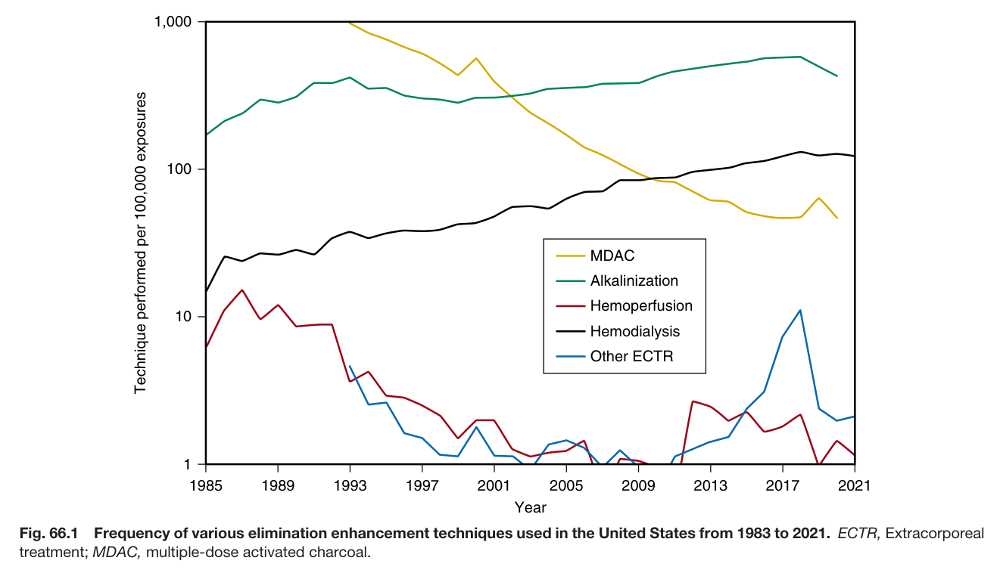

Fig. 66.1 Frequency of various elimination enhancement techniques used in the United States from 1983 to 2021. ECTR, Extracorporea treatment; MDAC, multiple-dose activated charcoal.

---

### Fig_66_2

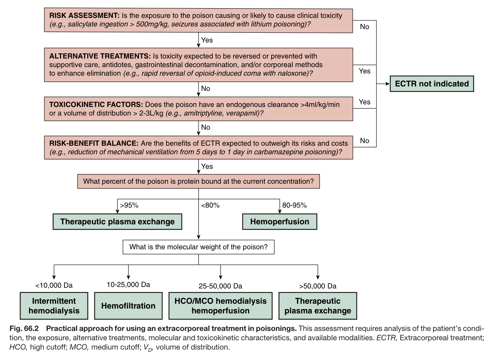

Fig. 66.2 Practical approach for using an extracorporeal treatment in poisonings. This assessment requires analysis of the patient’s condi- tion, the exposure, alternative treatments, molecular and toxicokinetic characteristics, and available modalities. ECTR, Extracorporeal treatment; HCO, high cutoff; MCO, medium cutoff; V , volume of distribution.

---

### Fig_66_3

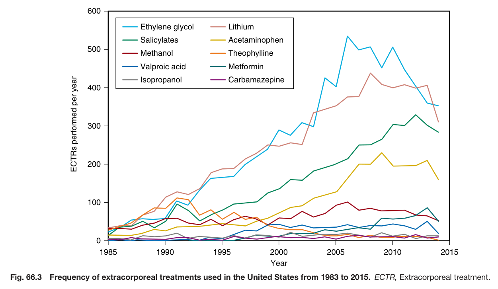

Fig. 66.3 Frequency of extracorporeal treatments used in the United States from 1983 to 2015. ECTR, Extracorporeal treatment.

---

### Fig_66_4

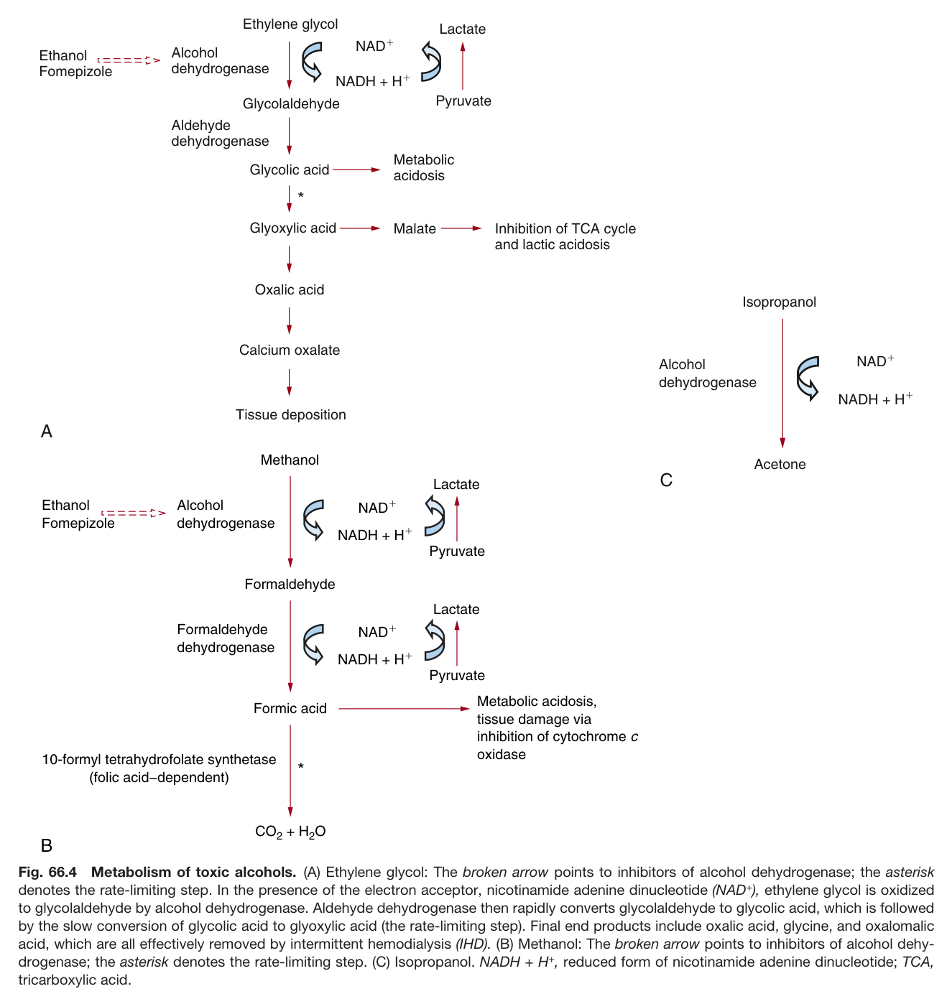

Fig. 66.4 Metabolism of toxic alcohols. (A) Ethylene glycol: The broken arrow points to inhibitors of alcohol dehydrogenase; the asterisk denotes the rate-limiting step. In the presence of the electron acceptor, nicotinamide adenine dinucleotide (NAD<sup>+</sup>), ethylene glycol is oxidized to glycolaldehyde by alcohol dehydrogenase. Aldehyde dehydrogenase then rapidly converts glycolaldehyde to glycolic acid, which is followed by the slow conversion of glycolic acid to glyoxylic acid (the rate-limiting step). Final end products include oxalic acid, glycine, and oxalomalic acid, which are all effectively removed by intermittent hemodialysis (IHD). (B) Methanol: The broken arrow points to inhibitors of alcohol dehy drogenase; the asterisk denotes the rate-limiting step. (C) Isopropanol. NADH + H<sup>+</sup>, reduced form of nicotinamide adenine dinucleotide; TCA, tricarboxylic acid.

---

## Tables

### Table_66_1

#### Table Image

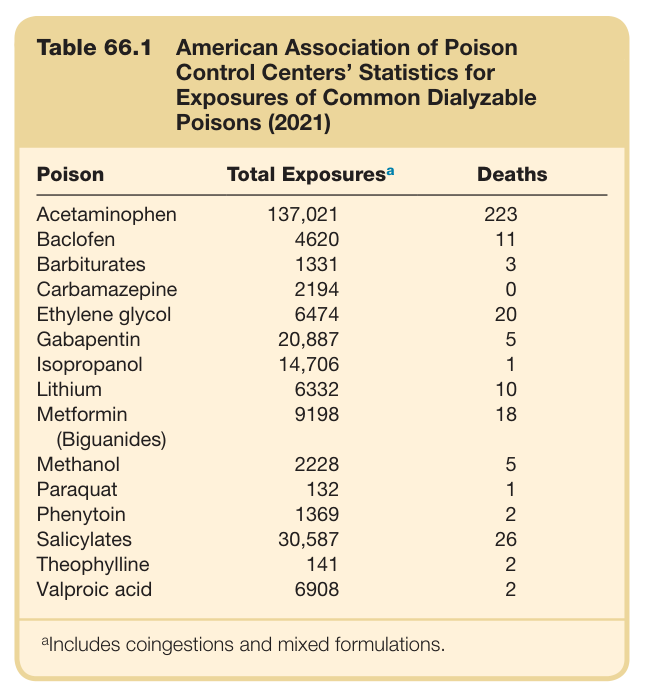

#### Table Data (CSV: [Table_66_1.csv](Table_66_1.csv))

```markdown
| Table Text (OCR) |
| :--- |
| Table 66.1  American Association of Poison Control Centers’ Statistics for Exposures of Common Dialyzable Poisons (2021) Poison  Total Exposuresa  Deaths    Acetaminophen  137,021  223    Baclofen  4620  11    Barbiturates  1331  3    Carbamazepine  2194  0    Ethylene glycol  6474  20    Gabapentin  20,887  5    Isopropanol  14,706  1    Lithium  6332  10    Metformin (Biguanides)  9198  18    Methanol  2228  5    Paraquat  132  1    Phenytoin  1369  2    Salicylates  30,587  26    Theophylline  141  2    Valproic acid  6908  2 <sup>a</sup>Includes coingestions and mixed formulations. |
```

Table 66.1 American Association of Poison Control Centers’ Statistics for Exposures of Common Dialyzable Poisons (2021)

---

### Table_66_2

#### Table Image

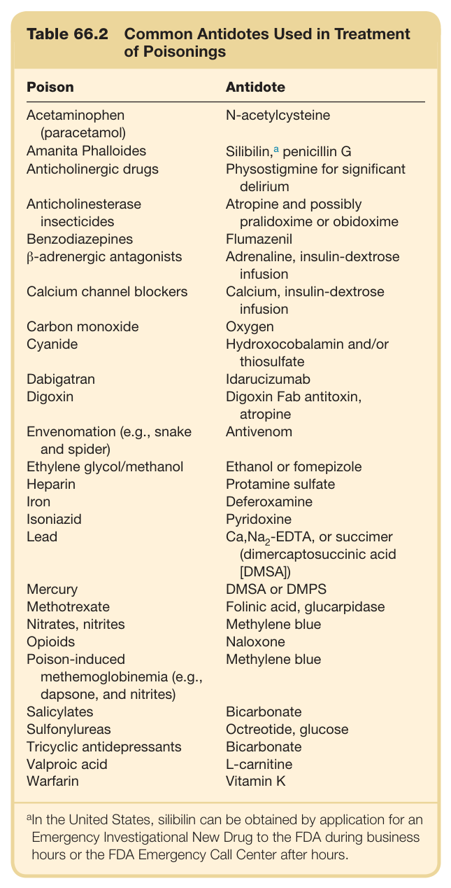

#### Table Data (CSV: [Table_66_2.csv](Table_66_2.csv))

```markdown
| Table Text (OCR) |
| :--- |
| Table 66.2  Common Antidotes Used in Treatment of Poisonings Poison  Antidote    Acetaminophen (paracetamol)  N-acetylcysteine    Amanita Phalloides  Silibilin, ^{a}  penicillin G    Anticholinergic drugs  Physostigmine for significant delirium    Anticholinesterase insecticides  Atropine and possibly pralidoxime or obidoxime    Benzodiazepines  Flumazenil    β-adrenergic antagonists  Adrenaline, insulin-dextrose infusion    Calcium channel blockers  Calcium, insulin-dextrose infusion    Carbon monoxide  Oxygen    Cyanide  Hydroxocobalamin and/or thiosulfate    Dabigatran  Idarucizumab    Digoxin  Digoxin Fab antitoxin, atropine    Envenomation (e.g., snake and spider)  Antivenom    Ethylene glycol/methanol  Ethanol or fomepizole    Heparin  Protamine sulfate    Iron  Deferoxamine    Isoniazid  Pyridoxine    Lead   Ca,Na_{2}-EDTA , or succimer (dimercaptosuccinic acid [DMSA])    Mercury  DMSA or DMPS    Methotrexate  Folinic acid, glucarpidase    Nitrates, nitrites  Methylene blue    Opioids  Naloxone    Poison-induced methemoglobinemia (e.g., dapsone, and nitrites)  Methylene blue    Salicylates  Bicarbonate    Sulfonylureas  Octreotide, glucose    Tricyclic antidepressants  Bicarbonate    Valproic acid  L-carnitine    Warfarin  Vitamin K <sup>a</sup>In the United States, silibilin can be obtained by application for an Emergency Investigational New Drug to the FDA during business hours or the FDA Emergency Call Center after hours. |
```

Table 66.2 Common Antidotes Used in Treatment of Poisonings

---

### Table_66_3

#### Table Image

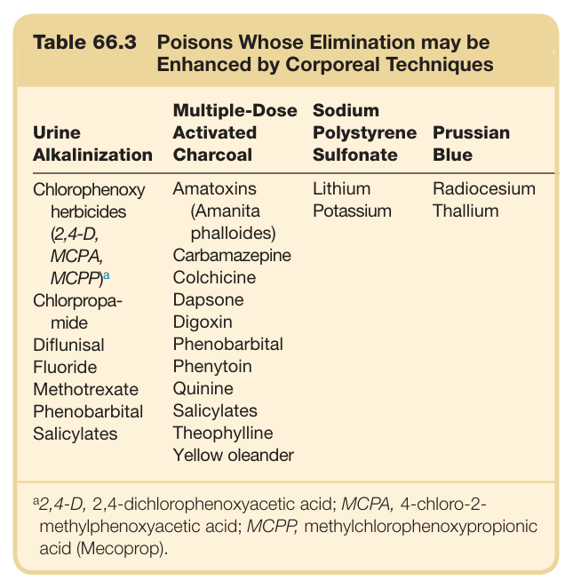

#### Table Data (CSV: [Table_66_3.csv](Table_66_3.csv))

```markdown
| Table Text (OCR) |
| :--- |
| Table 66.3  Poisons Whose Elimination may be Enhanced by Corporeal Techniques Urine Alkalinization  Multiple-Dose Activated Charcoal  Sodium Polystyrene Sulfonate  Prussian Blue    Chlorophenoxy herbicides (2,4-D, MCPA,  MCPP)^a   Amatoxins (Amanita phalloides)  Lithium Potassium  Radiocesium Thallium    Carbamazepine    Colchicine    Chlorpropamide  Dapsone    Digoxin    Diflunisal  Phenobarbital    Fluoride  Phenytoin    Methotrexate  Quinine    Phenobarbital  Salicylates    Salicylates  Theophylline      Yellow oleander <sup>a</sup>2,4-D, 2,4-dichlorophenoxyacetic acid; MCPA, 4-chloro-2- methylphenoxyacetic acid; MCPP, methylchlorophenoxypropionic acid (Mecoprop). |
```

Table 66.3 Poisons Whose Elimination may be Enhanced by Corporeal Techniques

---

### Table_66_4

#### Table Image

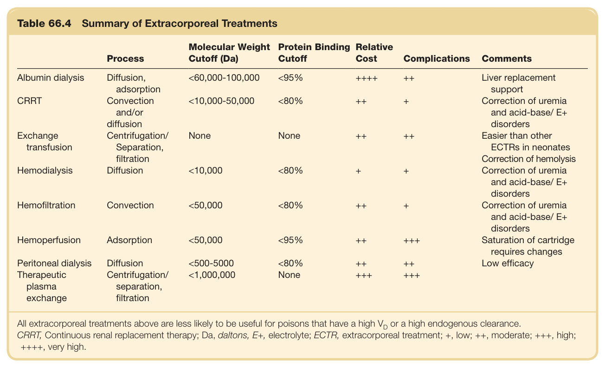

#### Table Data (CSV: [Table_66_4.csv](Table_66_4.csv))

```markdown
| Table Text (OCR) |
| :--- |
| Table 66.4 Summary of Extracorporeal Treatments Process  Molecular Weight Cutoff (Da)  Protein Binding Cutoff  Relative Cost  Complications  Comments    Albumin dialysis  Diffusion, adsorption  <60,000-100,000  <95%  ++++  ++  Liver replacement support    CRRT  Convection and/or diffusion  <10,000-50,000  <80%  ++  +  Correction of uremia and acid-base/ E+ disorders    Exchange transfusion  Centrifugation/ Separation, filtration  None  None  ++  ++  Easier than other ECTRs in neonates Correction of hemolysis    Hemodialysis  Diffusion  <10,000  <80%  +  +  Correction of uremia and acid-base/ E+ disorders    Hemofiltration  Convection  <50,000  <80%  ++  +  Correction of uremia and acid-base/ E+ disorders    Hemoperfusion  Adsorption  <50,000  <95%  ++  +++  Saturation of cartridge requires changes    Peritoneal dialysis  Diffusion  <500-5000  <80%  ++  ++  Low efficacy    Therapeutic plasma exchange  Centrifugation/ separation, filtration  <1,000,000  None  +++  +++ All extracorporeal treatments above are less likely to be useful for poisons that have a high V or a high endogenous clearance. CRRT, Continuous renal replacement therapy; Da, daltons, E+, electrolyte; ECTR, extracorporeal treatment; +, low; ++, moderate; +++, high; ++++, very high. |
```

Table 66.4 Summary of Extracorporeal Treatments

---

### Table_66_5

#### Table Image

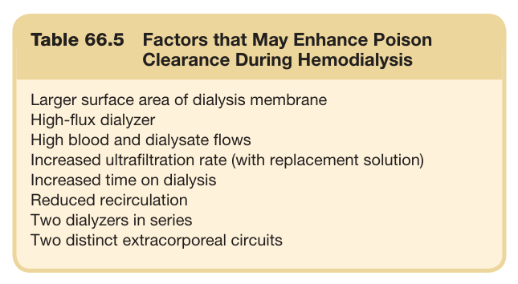

#### Table Data (CSV: [Table_66_5.csv](Table_66_5.csv))

```markdown
| Table Text (OCR) |
| :--- |
| Table 66.5  Factors that May Enhance Poison Clearance During Hemodialysis Larger surface area of dialysis membrane High-flux dialyzer High blood and dialysate flows Increased ultrafiltration rate (with replacement solution) Increased time on dialysis Reduced recirculation Two dialyzers in series Two distinct extracorporeal circuits |
```

Table 66.5 Factors that May Enhance Poison Clearance During Hemodialysis

---

### Table_66_6

#### Table Image

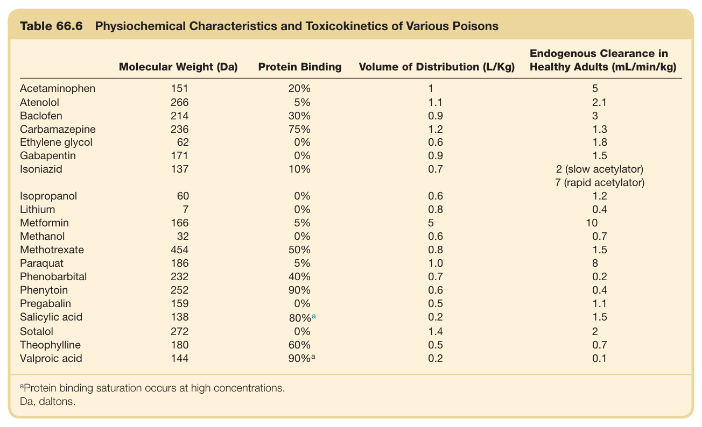

#### Table Data (CSV: [Table_66_6.csv](Table_66_6.csv))

```markdown
| Table Text (OCR) |
| :--- |
| Table 66.6  Physiochemical Characteristics and Toxicokinetics of Various Poisons Molecular Weight (Da)  Protein Binding  Volume of Distribution (L/Kg)  Endogenous Clearance in Healthy Adults (mL/min/kg)    Acetaminophen  151  20%  1  5    Atenolol  266  5%  1.1  2.1    Baclofen  214  30%  0.9  3    Carbamazepine  236  75%  1.2  1.3    Ethylene glycol  62  0%  0.6  1.8    Gabapentin  171  0%  0.9  1.5    Isoniazid  137  10%  0.7  2 (slow acetylator)7 (rapid acetylator)    Isopropanol  60  0%  0.6  1.2    Lithium  7  0%  0.8  0.4    Metformin  166  5%  5  10    Methanol  32  0%  0.6  0.7    Methotrexate  454  50%  0.8  1.5    Paraquat  186  5%  1.0  8    Phenobarbital  232  40%  0.7  0.2    Phenytoin  252  90%  0.6  0.4    Pregabalin  159  0%  0.5  1.1    Salicylic acid  138   80\%^a   0.2  1.5    Sotalol  272  0%  1.4  2    Theophylline  180  60%  0.5  0.7    Valproic acid  144   90\%^a   0.2  0.1 <sup>a</sup>Protein binding saturation occurs at high concentrations. Da, daltons. |
```

Table 66.6 Physiochemical Characteristics and Toxicokinetics of Various Poisons

---

### Table_66_7

#### Table Image

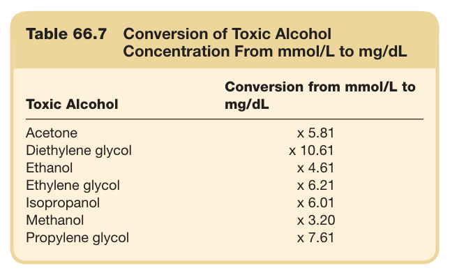

#### Table Data (CSV: [Table_66_7.csv](Table_66_7.csv))

```markdown
| Table Text (OCR) |
| :--- |
| Table 66.7  Conversion of Toxic Alcohol Concentration From mmol/L to mg/dL Toxic Alcohol  Conversion from mmol/L to mg/dL    Acetone  x 5.81    Diethylene glycol  x 10.61    Ethanol  x 4.61    Ethylene glycol  x 6.21    Isopropanol  x 6.01    Methanol  x 3.20    Propylene glycol  x 7.61 |
```

Table 66.7 Conversion of Toxic Alcohol Concentration From mmol/L to mg/dL

---

### Table_66_8

#### Table Image

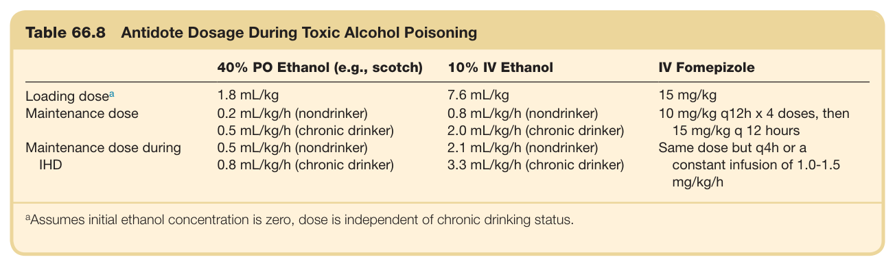

#### Table Data (CSV: [Table_66_8.csv](Table_66_8.csv))

```markdown
| Table Text (OCR) |
| :--- |
| Table 66.8  Antidote Dosage During Toxic Alcohol Poisoning 40% PO Ethanol (e.g., scotch)  10% IV Ethanol  IV Fomepizole    Loading  dose^a   1.8 mL/kg  7.6 mL/kg  15 mg/kg    Maintenance dose  0.2 mL/kg/h (nondrinker)  0.8 mL/kg/h (nondrinker)  10 mg/kg q12h x 4 doses, then 15 mg/kg q 12 hours    0.5 mL/kg/h (chronic drinker)  2.0 mL/kg/h (chronic drinker)    Maintenance dose during IHD  0.5 mL/kg/h (nondrinker)  2.1 mL/kg/h (nondrinker)  Same dose but q4h or a constant infusion of 1.0-1.5 mg/kg/h    0.8 mL/kg/h (chronic drinker)  3.3 mL/kg/h (chronic drinker) <sup>a</sup>Assumes initial ethanol concentration is zero, dose is independent of chronic drinking status. |
```

Table 66.8 Antidote Dosage During Toxic Alcohol Poisoning

---
