# 67. Interventional Nephrology_ Managing Dialysis Access and Kidney Biopsy - Figures and Tables Index

This document lists all figures and tables extracted from `67. Interventional Nephrology_ Managing Dialysis Access and Kidney Biopsy.pdf`.

## Table of Contents
- [Figures](#figures)
- [Tables](#tables)

---

## Figures

### Fig_67_1

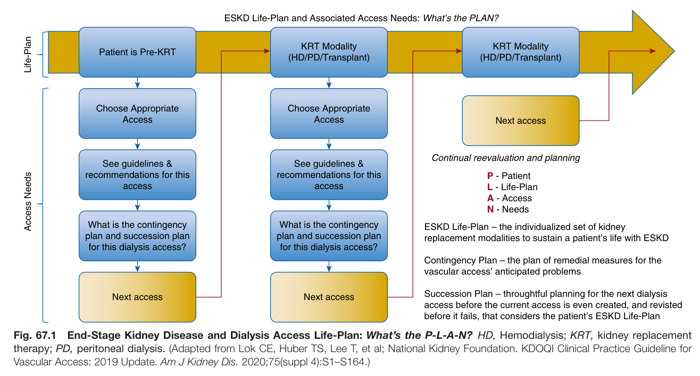

Fig. 67.1 End-Stage Kidney Disease and Dialysis Access Life-Plan: What’s the P-L-A-N? HD, Hemodialysis; KRT, kidney replacement therapy; PD, peritoneal dialysis. (Adapted from Lok CE, Huber TS, Lee T, et al; National Kidney Foundation. KDOQI Clinical Practice Guideline for Vascular Access: 2019 Update. Am J Kidney Dis. 2020;75(suppl 4):S1–S164.)

---

### Fig_67_2

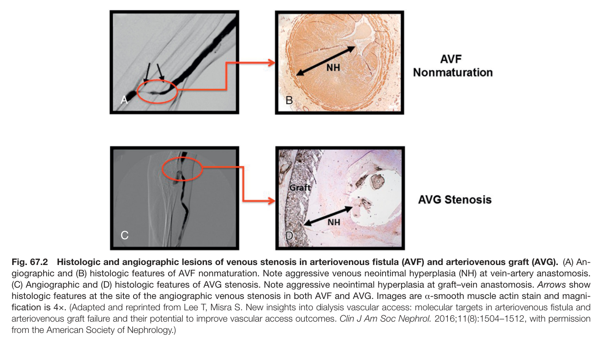

Fig. 67.2 Histologic and angiographic lesions of venous stenosis in arteriovenous fistula (AVF) and arteriovenous graft (AVG). (A) An giographic and (B) histologic features of AVF nonmaturation. Note aggressive venous neointimal hyperplasia (NH) at vein-artery anastomosis. (C) Angiographic and (D) histologic features of AVG stenosis. Note aggressive neointimal hyperplasia at graft–vein anastomosis. Arrows show histologic features at the site of the angiographic venous stenosis in both AVF and AVG. Images are α-smooth muscle actin stain and magni- fication is 4×. (Adapted and reprinted from Lee T, Misra S. New insights into dialysis vascular access: molecular targets in arteriovenous fistula and arteriovenous graft failure and their potential to improve vascular access outcomes. Clin J Am Soc Nephrol. 2016;11(8):1504–1512, with permission from the American Society of Nephrology.)

---

### Fig_67_3

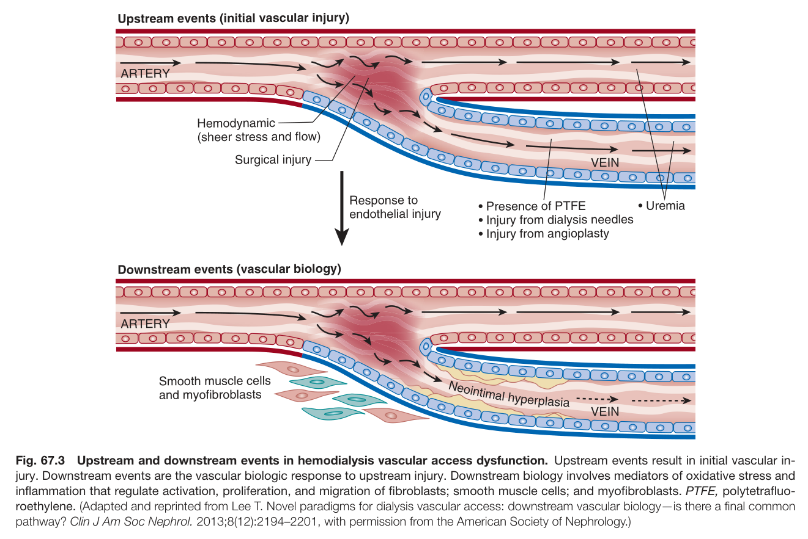

Fig. 67.3 Upstream and downstream events in hemodialysis vascular access dysfunction. Upstream events result in initial vascular in- jury. Downstream events are the vascular biologic response to upstream injury. Downstream biology involves mediators of oxidative stress and inflammation that regulate activation, proliferation, and migration of fibroblasts; smooth muscle cells; and myofibroblasts. PTFE, polytetrafluo- roethylene. (Adapted and reprinted from Lee T. Novel paradigms for dialysis vascular access: downstream vascular biology—is there a final common pathway? Clin J Am Soc Nephrol. 2013;8(12):2194–2201, with permission from the American Society of Nephrology.)

---

### Fig_67_4

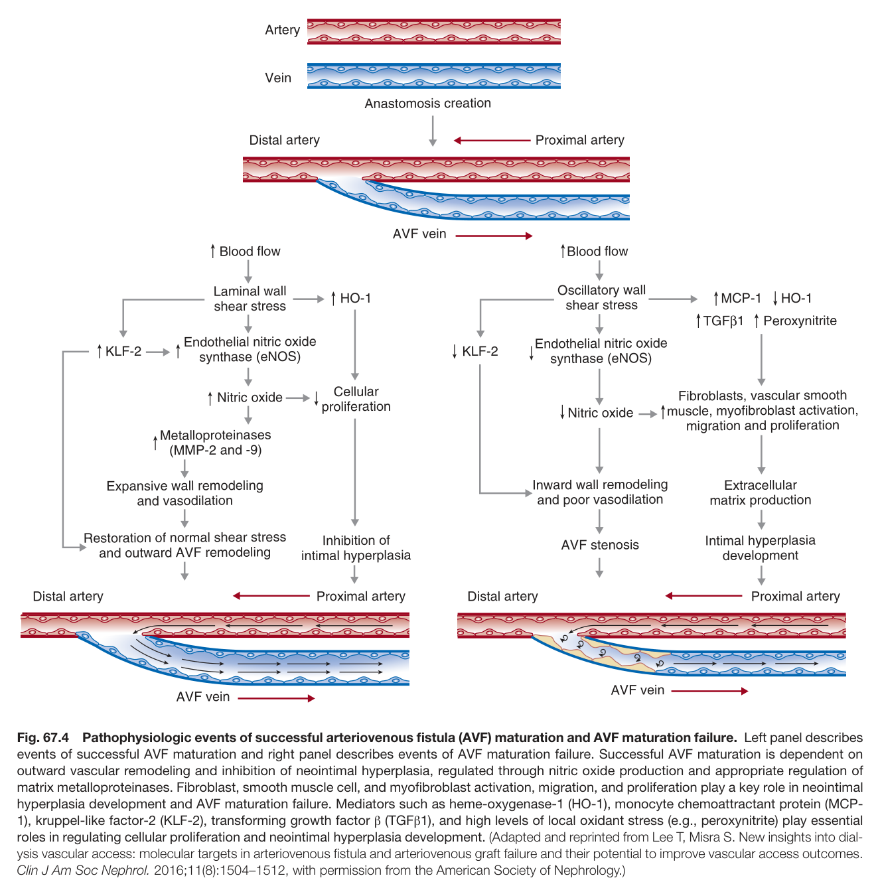

Fig. 67.4 Pathophysiologic events of successful arteriovenous fistula (AVF) maturation and AVF maturation failure. Left panel describes events of successful AVF maturation and right panel describes events of AVF maturation failure. Successful AVF maturation is dependent on outward vascular remodeling and inhibition of neointimal hyperplasia, regulated through nitric oxide production and appropriate regulation of matrix metalloproteinases. Fibroblast, smooth muscle cell, and myofibroblast activation, migration, and proliferation play a key role in neointima hyperplasia development and AVF maturation failure. Mediators such as heme-oxygenase-1 (HO-1), monocyte chemoattractant protein (MCP- 1), kruppel-like factor-2 (KLF-2), transforming growth factor β (TGFβ1), and high levels of local oxidant stress (e.g., peroxynitrite) play essentia roles in regulating cellular proliferation and neointimal hyperplasia development. (Adapted and reprinted from Lee T, Misra S. New insights into dial ysis vascular access: molecular targets in arteriovenous fistula and arteriovenous graft failure and their potential to improve vascular access outcomes. Clin J Am Soc Nephrol. 2016;11(8):1504–1512, with permission from the American Society of Nephrology.)

---

### Fig_67_5

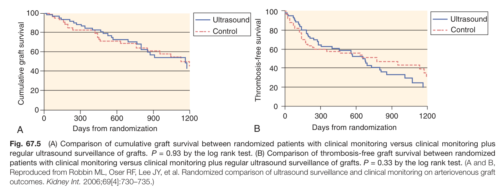

Fig. 67.5 (A) Comparison of cumulative graft survival between randomized patients with clinical monitoring versus clinical monitoring plus regular ultrasound surveillance of grafts. P = 0.93 by the log rank test. (B) Comparison of thrombosis-free graft survival between randomized patients with clinical monitoring versus clinical monitoring plus regular ultrasound surveillance of grafts. P = 0.33 by the log rank test. (A and B, Reproduced from Robbin ML, Oser RF, Lee JY, et al. Randomized comparison of ultrasound surveillance and clinical monitoring on arteriovenous graft outcomes. Kidney Int. 2006;69[4]:730–735.)

---

### Fig_67_6

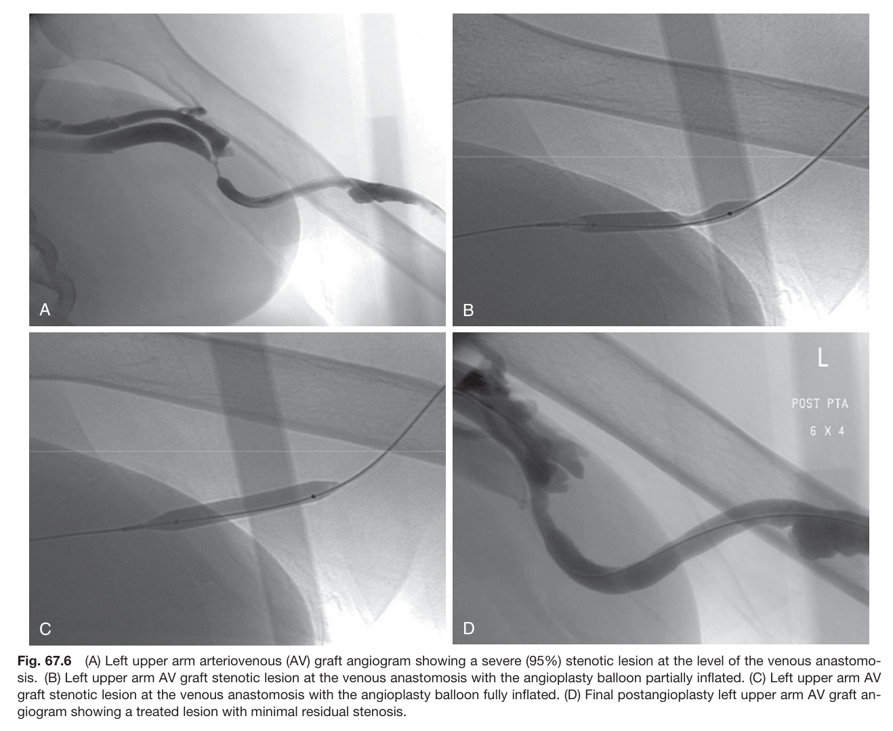

Fig. 67.6 (A) Left upper arm arteriovenous (AV) graft angiogram showing a severe (95%) stenotic lesion at the level of the venous anastomo- sis. (B) Left upper arm AV graft stenotic lesion at the venous anastomosis with the angioplasty balloon partially inflated. (C) Left upper arm AV graft stenotic lesion at the venous anastomosis with the angioplasty balloon fully inflated. (D) Final postangioplasty left upper arm AV graft an- giogram showing a treated lesion with minimal residual stenosis.

---

### Fig_67_7

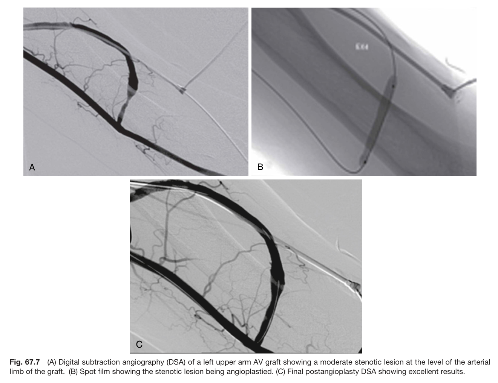

Fig. 67.7 (A) Digital subtraction angiography (DSA) of a left upper arm AV graft showing a moderate stenotic lesion at the level of the arteria limb of the graft. (B) Spot film showing the stenotic lesion being angioplastied. (C) Final postangioplasty DSA showing excellent results.

---

### Fig_67_8

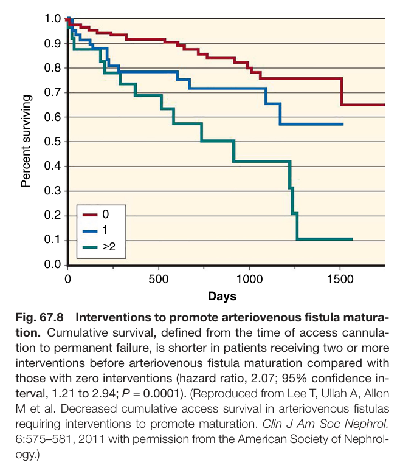

Fig. 67.8 Interventions to promote arteriovenous fistula matura- tion. Cumulative survival, defined from the time of access cannula- tion to permanent failure, is shorter in patients receiving two or more interventions before arteriovenous fistula maturation compared with those with zero interventions (hazard ratio, 2.07; 95% confidence in- terval, 1.21 to 2.94; P = 0.0001). (Reproduced from Lee T, Ullah A, Allon M et al. Decreased cumulative access survival in arteriovenous fistulas requiring interventions to promote maturation. Clin J Am Soc Nephrol. 6:575–581, 2011 with permission from the American Society of Nephrol- ogy.)

---

### Fig_67_9

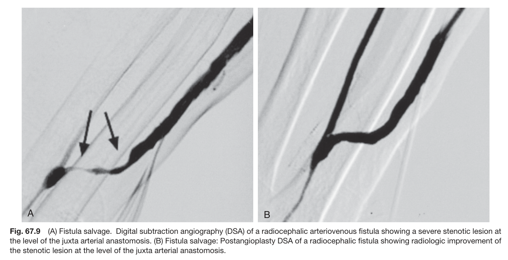

Fig. 67.9 (A) Fistula salvage. Digital subtraction angiography (DSA) of a radiocephalic arteriovenous fistula showing a severe stenotic lesion at the level of the juxta arterial anastomosis. (B) Fistula salvage: Postangioplasty DSA of a radiocephalic fistula showing radiologic improvement of the stenotic lesion at the level of the juxta arterial anastomosis

---

### Fig_67_10

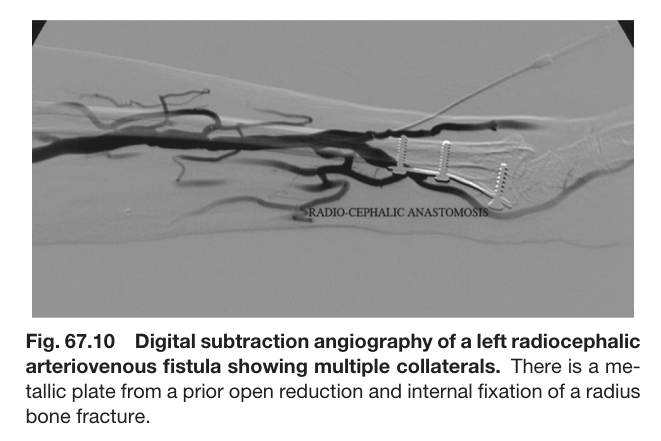

Fig. 67.10 Digital subtraction angiography of a left radiocephalic arteriovenous fistula showing multiple collaterals. There is a me- tallic plate from a prior open reduction and internal fixation of a radius bone fracture.

---

### Fig_67_11

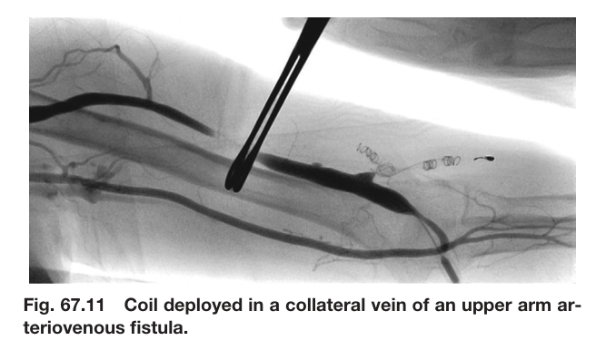

Fig. 67.11 Coil deployed in a collateral vein of an upper arm ar- teriovenous fistula.

---

### Fig_67_12

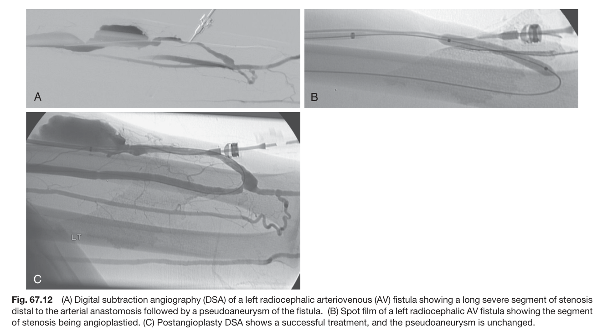

Fig. 67.12 (A) Digital subtraction angiography (DSA) of a left radiocephalic arteriovenous (AV) fistula showing a long severe segment of stenosis distal to the arterial anastomosis followed by a pseudoaneurysm of the fistula. (B) Spot film of a left radiocephalic AV fistula showing the segment of stenosis being angioplastied. (C) Postangioplasty DSA shows a successful treatment, and the pseudoaneurysm is unchanged.

---

### Fig_67_13

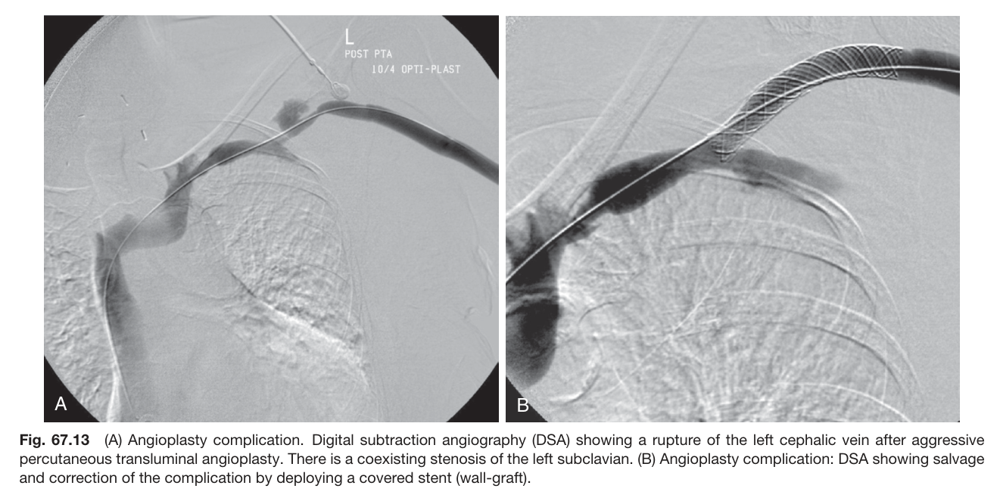

Fig. 67.13 (A) Angioplasty complication. Digital subtraction angiography (DSA) showing a rupture of the left cephalic vein after aggressive percutaneous transluminal angioplasty. There is a coexisting stenosis of the left subclavian. (B) Angioplasty complication: DSA showing salvage and correction of the complication by deploying a covered stent (wall-graft).

---

### Fig_67_14

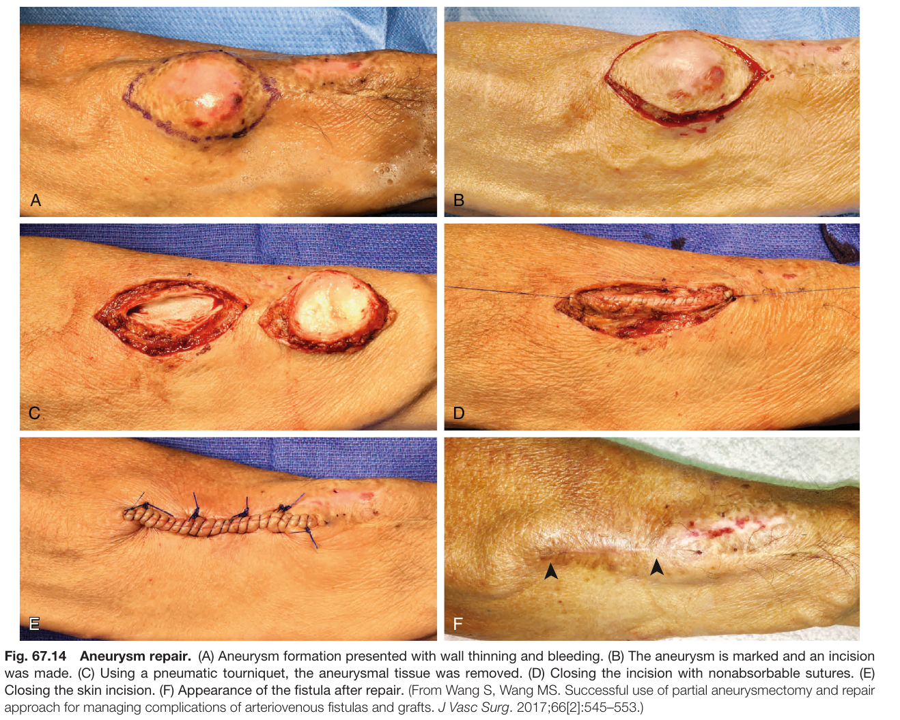

Fig. 67.14 Aneurysm repair. (A) Aneurysm formation presented with wall thinning and bleeding. (B) The aneurysm is marked and an incision was made. (C) Using a pneumatic tourniquet, the aneurysmal tissue was removed. (D) Closing the incision with nonabsorbable sutures. (E) Closing the skin incision. (F) Appearance of the fistula after repair. (From Wang S, Wang MS. Successful use of partial aneurysmectomy and repair approach for managing complications of arteriovenous fistulas and grafts. J Vasc Surg. 2017;66[2]:545–553.)

---

### Fig_67_15

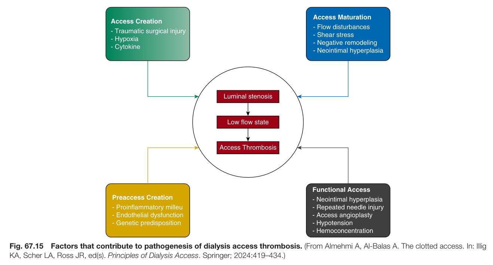

Fig. 67.15 Factors that contribute to pathogenesis of dialysis access thrombosis. (From Almehmi A, Al-Balas A. The clotted access. In: Illig KA, Scher LA, Ross JR, ed(s). Principles of Dialysis Access. Springer; 2024:419–434.)

---

### Fig_67_16

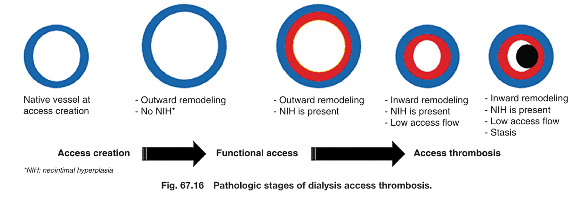

Fig. 67.16 Pathologic stages of dialysis access thrombosis.

---

### Fig_67_17

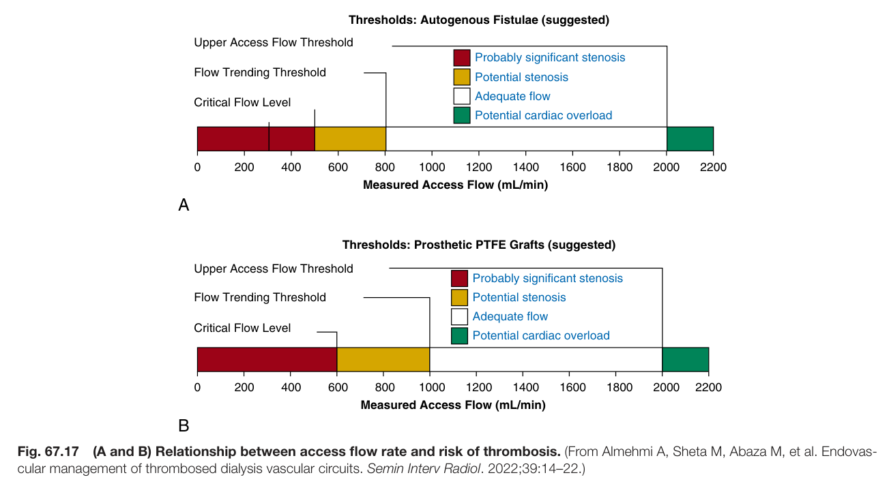

Fig. 67.17 (A and B) Relationship between access flow rate and risk of thrombosis. (From Almehmi A, Sheta M, Abaza M, et al. Endovas- cular management of thrombosed dialysis vascular circuits. Semin Interv Radiol. 2022;39:14–22.)

---

### Fig_67_18

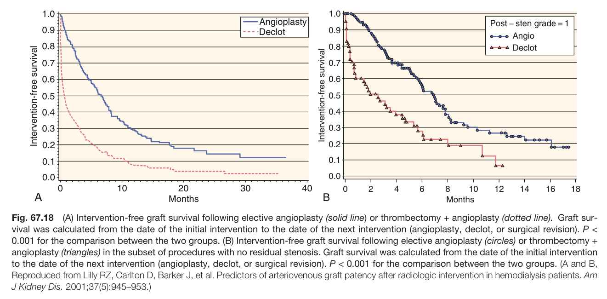

Fig. 67.18 (A) Intervention-free graft survival following elective angioplasty (solid line) or thrombectomy + angioplasty (dotted line). Graft sur- vival was calculated from the date of the initial intervention to the date of the next intervention (angioplasty, declot, or surgical revision). P < 0.001 for the comparison between the two groups. (B) Intervention-free graft survival following elective angioplasty (circles) or thrombectomy + angioplasty (triangles) in the subset of procedures with no residual stenosis. Graft survival was calculated from the date of the initial intervention to the date of the next intervention (angioplasty, declot, or surgical revision). P < 0.001 for the comparison between the two groups. (A and B, Reproduced from Lilly RZ, Carlton D, Barker J, et al. Predictors of arteriovenous graft patency after radiologic intervention in hemodialysis patients. Am J Kidney Dis. 2001;37(5):945–953.)

---

### Fig_67_19

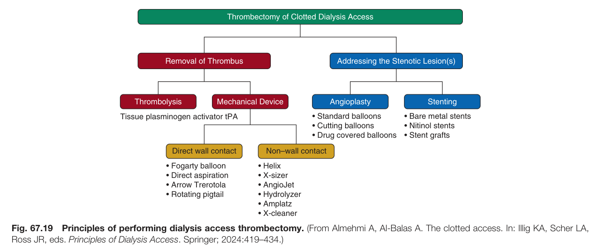

Fig. 67.19 Principles of performing dialysis access thrombectomy. (From Almehmi A, Al-Balas A. The clotted access. In: Illig KA, Scher LA, Ross JR, eds. Principles of Dialysis Access. Springer; 2024:419–434.)

---

### Fig_67_20

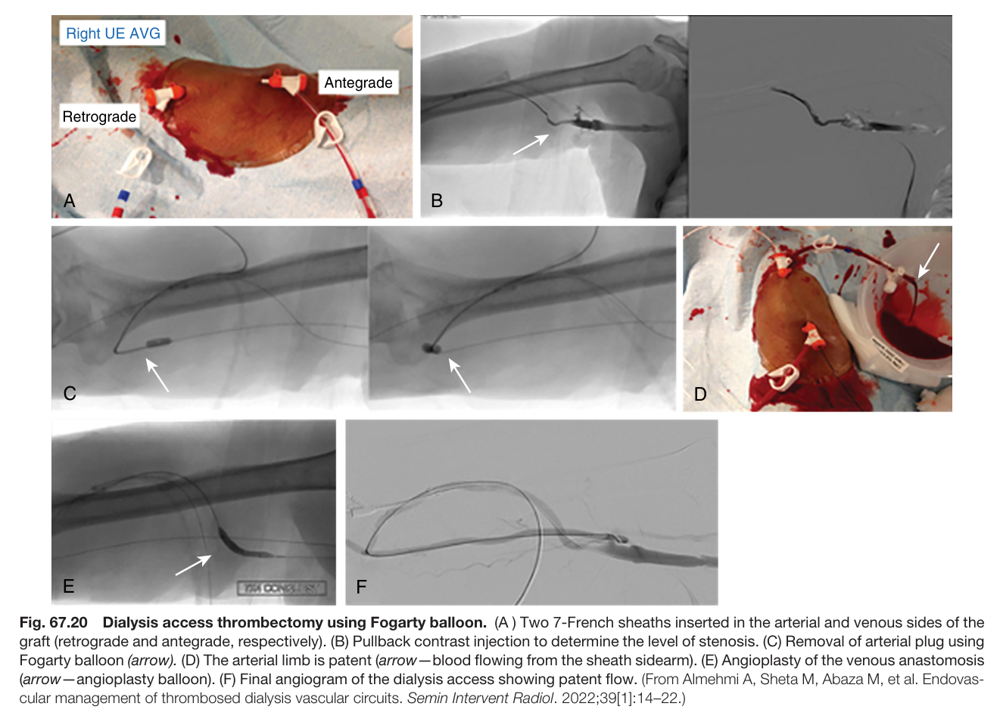

Fig. 67.20 Dialysis access thrombectomy using Fogarty balloon. (A ) Two 7-French sheaths inserted in the arterial and venous sides of the graft (retrograde and antegrade, respectively). (B) Pullback contrast injection to determine the level of stenosis. (C) Removal of arterial plug using Fogarty balloon (arrow). (D) The arterial limb is patent (arrow—blood flowing from the sheath sidearm). (E) Angioplasty of the venous anastomosis (arrow—angioplasty balloon). (F) Final angiogram of the dialysis access showing patent flow. (From Almehmi A, Sheta M, Abaza M, et al. Endovas cular management of thrombosed dialysis vascular circuits. Semin Intervent Radiol. 2022;39[1]:14–22.)

---

### Fig_67_21

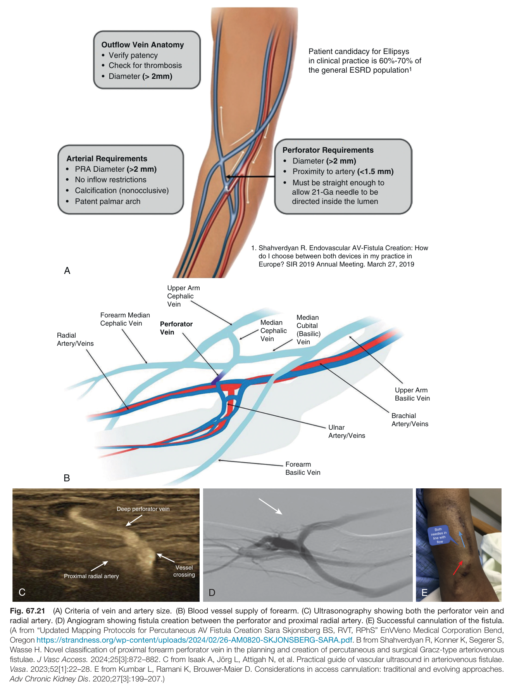

Fig. 67.21 (A) Criteria of vein and artery size. (B) Blood vessel supply of forearm. (C) Ultrasonography showing both the perforator vein and radial artery. (D) Angiogram showing fistula creation between the perforator and proximal radial artery. (E) Successful cannulation of the fistula. (A from “Updated Mapping Protocols for Percutaneous AV Fistula Creation Sara Skjonsberg BS, RVT, RPhS” EnVVeno Medical Corporation Bend, Oregon https://strandness.org/wp-content/uploads/2024/02/26-AM0820-SKJONSBERG-SARA.pdf. B from Shahverdyan R, Konner K, Segerer S, Wasse H. Novel classification of proximal forearm perforator vein in the planning and creation of percutaneous and surgical Gracz-type arteriovenous fistulae. J Vasc Access. 2024;25[3]:872–882. C from Isaak A, Jörg L, Attigah N, et al. Practical guide of vascular ultrasound in arteriovenous fistulae. Vasa. 2023;52[1]:22–28. E from Kumbar L, Ramani K, Brouwer-Maier D. Considerations in access cannulation: traditional and evolving approaches. Adv Chronic Kidney Dis. 2020;27[3]:199–207.)

---

### Fig_67_22

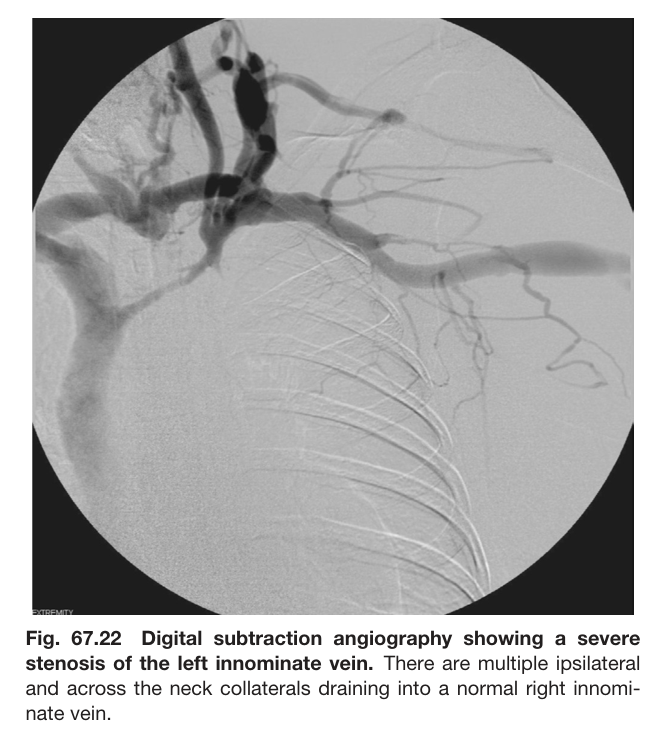

Fig. 67.22 Digital subtraction angiography showing a severe stenosis of the left innominate vein. There are multiple ipsilateral and across the neck collaterals draining into a normal right innomi- nate vein.

---

### Fig_67_23

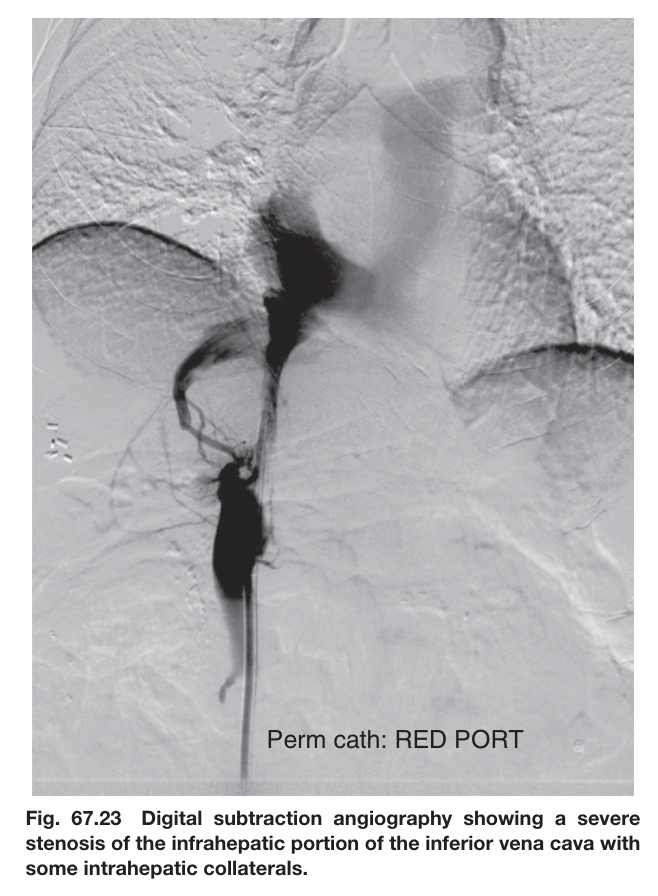

Fig. 67.23 Digital subtraction angiography showing a severe stenosis of the infrahepatic portion of the inferior vena cava with some intrahepatic collaterals.

---

### Fig_67_24

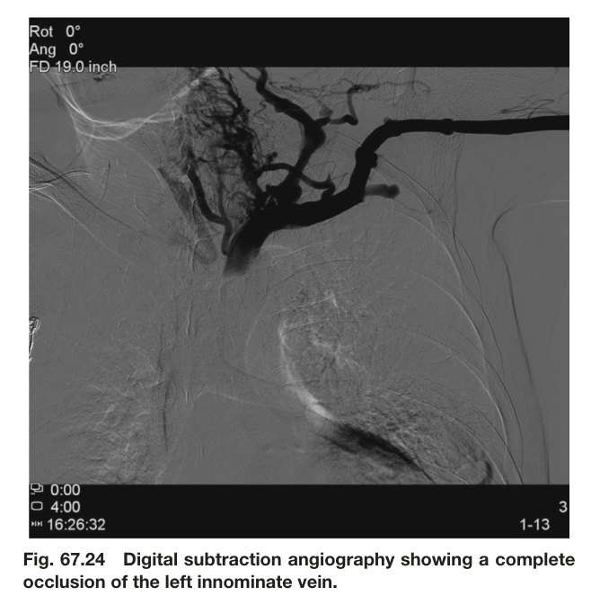

Fig. 67.24 Digital subtraction angiography showing a complete occlusion of the left innominate vein.

---

### Fig_67_25

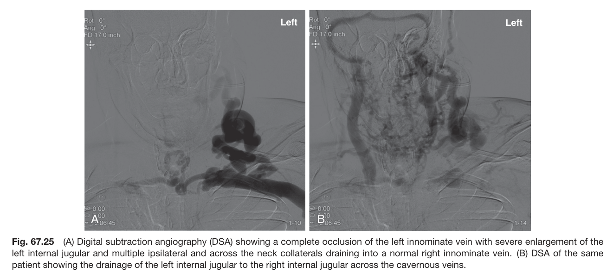

Fig. 67.25 (A) Digital subtraction angiography (DSA) showing a complete occlusion of the left innominate vein with severe enlargement of the left internal jugular and multiple ipsilateral and across the neck collaterals draining into a normal right innominate vein. (B) DSA of the same patient showing the drainage of the left internal jugular to the right internal jugular across the cavernous veins.

---

### Fig_67_26

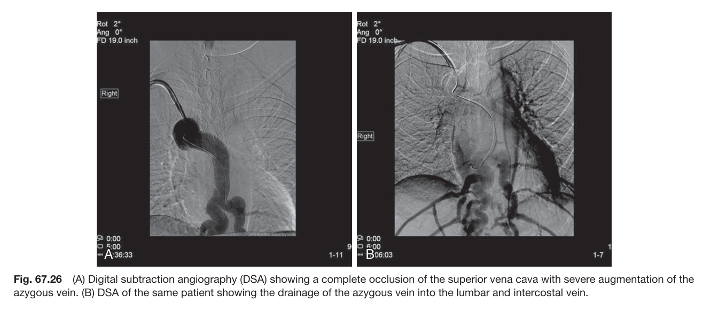

Fig. 67.26 (A) Digital subtraction angiography (DSA) showing a complete occlusion of the superior vena cava with severe augmentation of the azygous vein. (B) DSA of the same patient showing the drainage of the azygous vein into the lumbar and intercostal vein.

---

### Fig_67_27

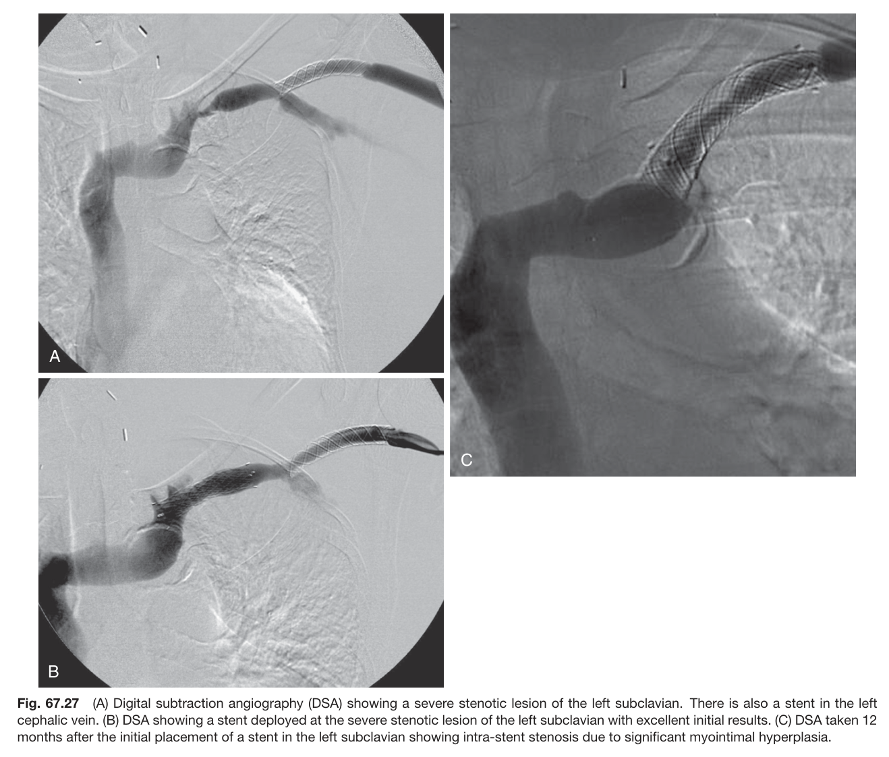

Fig. 67.27 (A) Digital subtraction angiography (DSA) showing a severe stenotic lesion of the left subclavian. There is also a stent in the left cephalic vein. (B) DSA showing a stent deployed at the severe stenotic lesion of the left subclavian with excellent initial results. (C) DSA taken 12 months after the initial placement of a stent in the left subclavian showing intra-stent stenosis due to significant myointimal hyperplasia.

---

### Fig_67_28

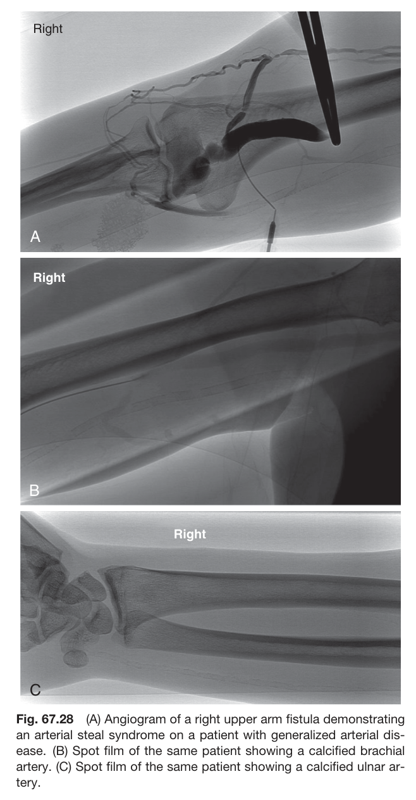

Fig. 67.28 (A) Angiogram of a right upper arm fistula demonstrating an arterial steal syndrome on a patient with generalized arterial dis- ease. (B) Spot film of the same patient showing a calcified brachia artery. (C) Spot film of the same patient showing a calcified ulnar ar- tery.

---

### Fig_67_29

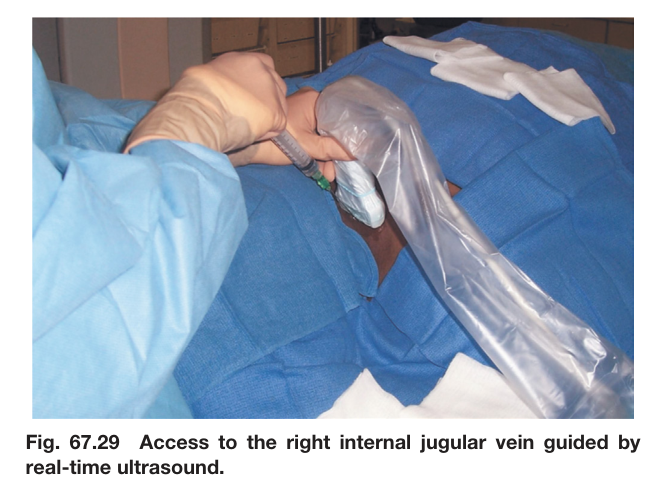

Fig. 67.29 Access to the right internal jugular vein guided by real-time ultrasound.

---

### Fig_67_30

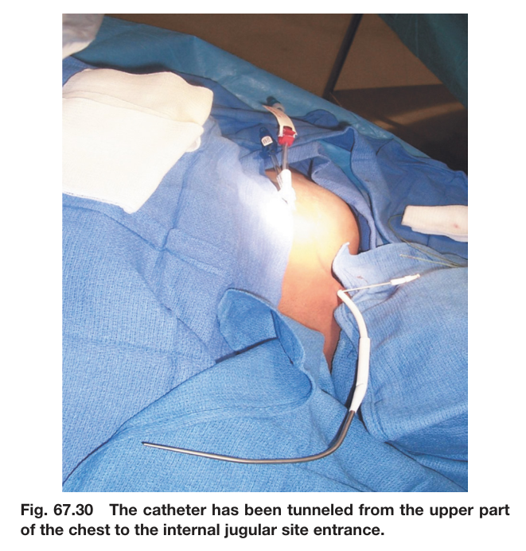

Fig. 67.30 The catheter has been tunneled from the upper part of the chest to the internal jugular site entrance.

---

### Fig_67_31

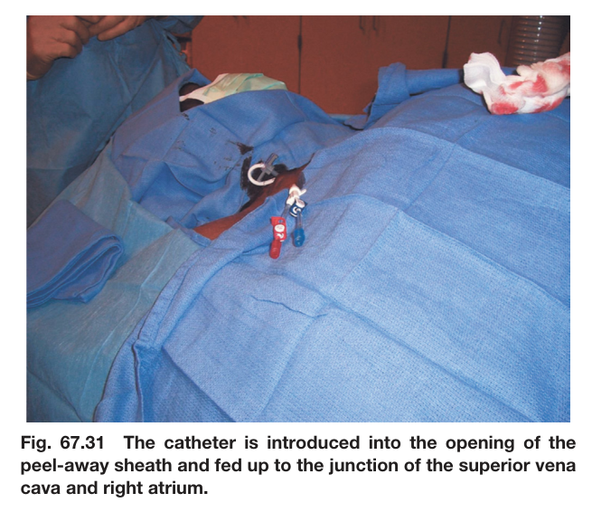

Fig. 67.31 The catheter is introduced into the opening of the peel-away sheath and fed up to the junction of the superior vena cava and right atrium.

---

### Fig_67_32

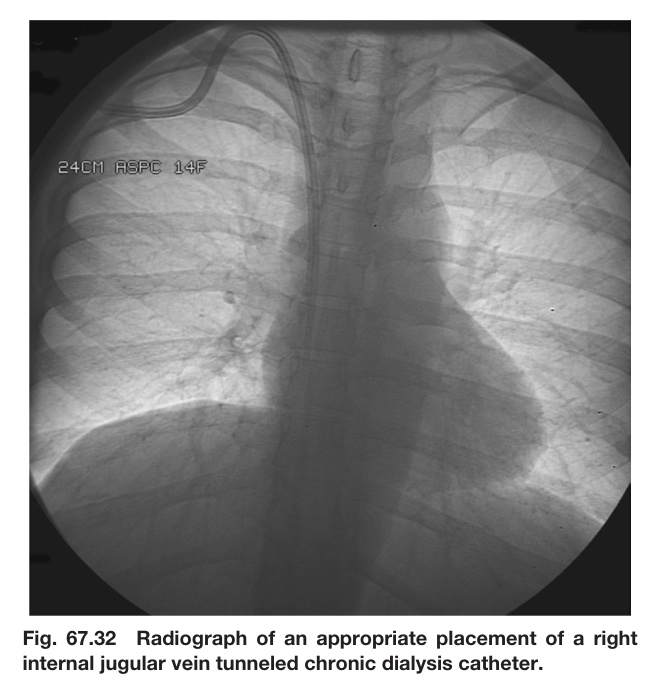

Fig. 67.32 Radiograph of an appropriate placement of a right internal jugular vein tunneled chronic dialysis catheter.

---

### Fig_67_33

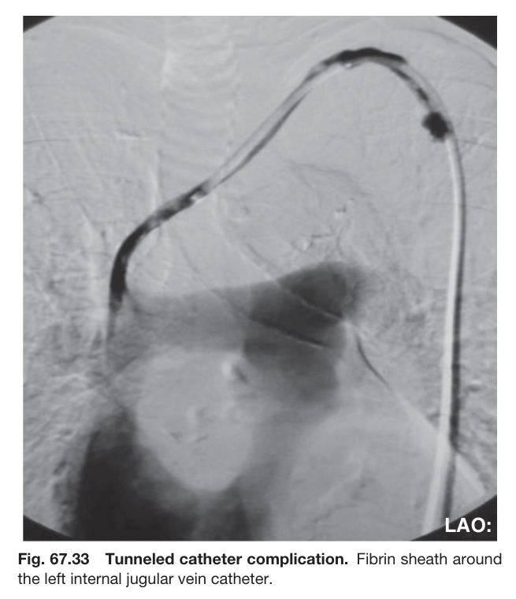

Fig. 67.33 Tunneled catheter complication. Fibrin sheath around the left internal jugular vein catheter.

---

### Fig_67_34

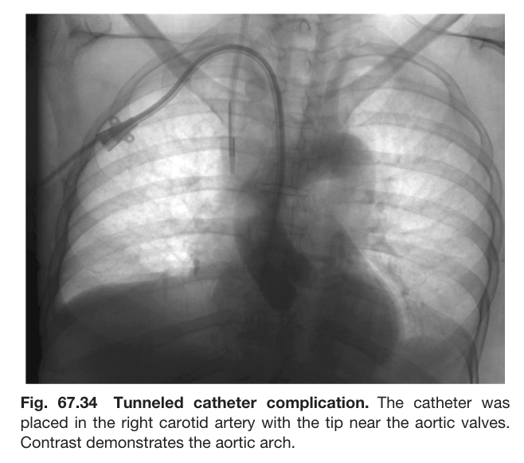

Fig. 67.34 Tunneled catheter complication. The catheter was placed in the right carotid artery with the tip near the aortic valves. Contrast demonstrates the aortic arch.

---

### Fig_67_35

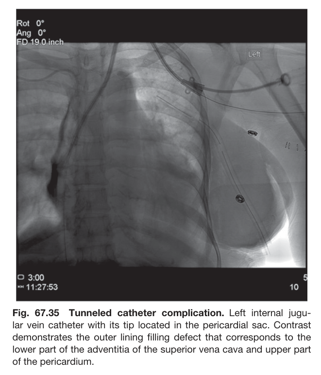

Fig. 67.35 Tunneled catheter complication. Left internal jugu- lar vein catheter with its tip located in the pericardial sac. Contrast demonstrates the outer lining filling defect that corresponds to the lower part of the adventitia of the superior vena cava and upper part of the pericardium.

---

### Fig_67_36

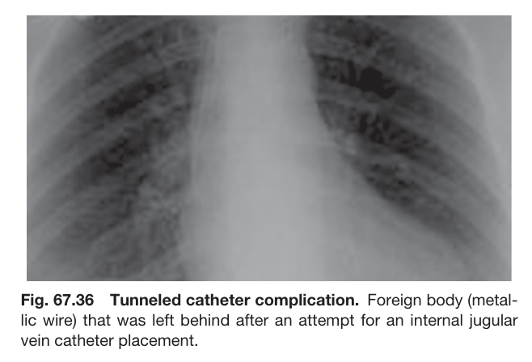

Fig. 67.36 Tunneled catheter complication. Foreign body (metal- lic wire) that was left behind after an attempt for an internal jugular vein catheter placement.

---

### Fig_67_37

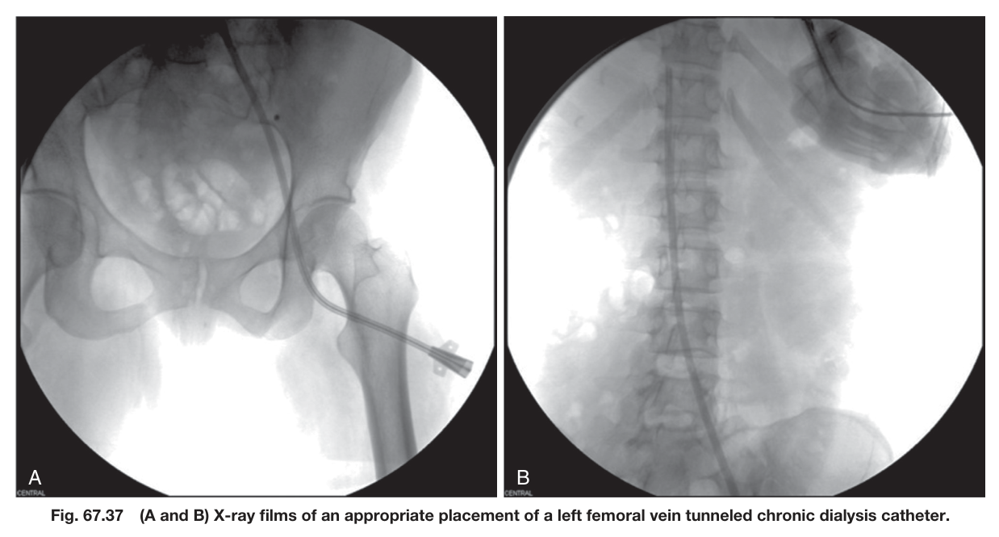

Fig. 67.37 (A and B) X-ray films of an appropriate placement of a left femoral vein tunneled chronic dialysis catheter.

---

### Fig_67_38

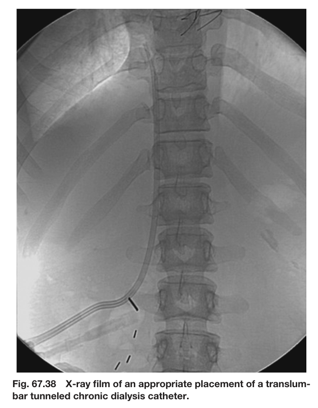

Fig. 67.38 X-ray film of an appropriate placement of a translum- bar tunneled chronic dialysis catheter.

---

### Fig_67_39

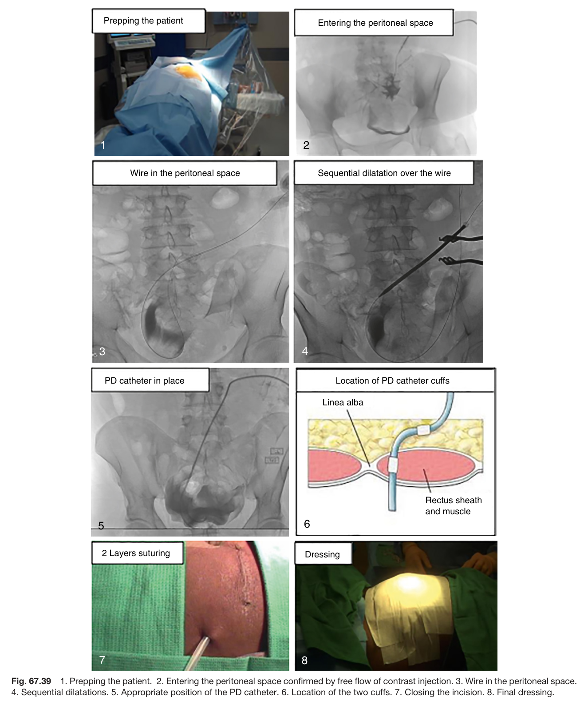

Fig. 67.39 1. Prepping the patient. 2. Entering the peritoneal space confirmed by free flow of contrast injection. 3. Wire in the peritoneal space. 4. Sequential dilatations. 5. Appropriate position of the PD catheter. 6. Location of the two cuffs. 7. Closing the incision. 8. Final dressing.

---

### Fig_67_40

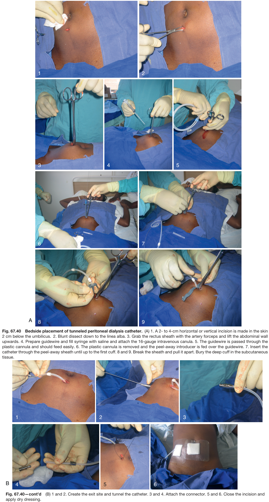

Fig. 67.40 Bedside placement of tunneled peritoneal dialysis catheter. (A) 1. A 2- to 4-cm horizontal or vertical incision is made in the skin 2 cm below the umbilicus. 2. Blunt dissect down to the linea alba. 3. Grab the rectus sheath with the artery forceps and lift the abdominal wal upwards. 4. Prepare guidewire and fill syringe with saline and attach the 16-gauge intravenous canula. 5. The guidewire is passed through the plastic cannula and should feed easily. 6. The plastic cannula is removed and the peel-away introducer is fed over the guidewire. 7. Insert the catheter through the peel-away sheath until up to the first cuff. 8 and 9. Break the sheath and pull it apart. Bury the deep cuff in the subcutaneous tissue.

---

### Fig_67_41

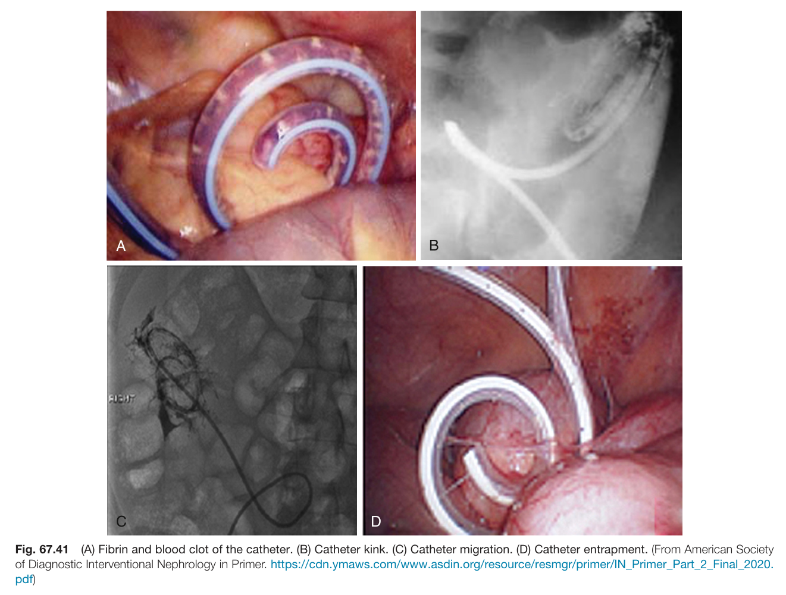

Fig. 67.41 (A) Fibrin and blood clot of the catheter. (B) Catheter kink. (C) Catheter migration. (D) Catheter entrapment. (From American Society of Diagnostic Interventional Nephrology in Primer. https://cdn.ymaws.com/www.asdin.org/resource/resmgr/primer/IN\_Primer\_Part\_2\_Final\_2020. pdf)

---

### Fig_67_42

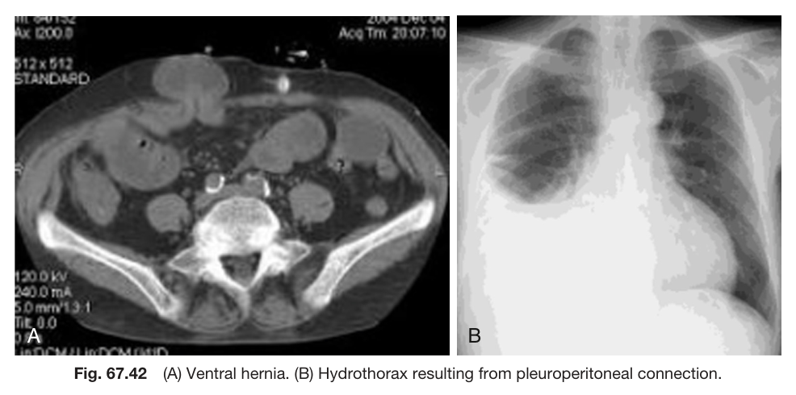

Fig. 67.42 (A) Ventral hernia. (B) Hydrothorax resulting from pleuroperitoneal connection.

---

### Fig_67_43

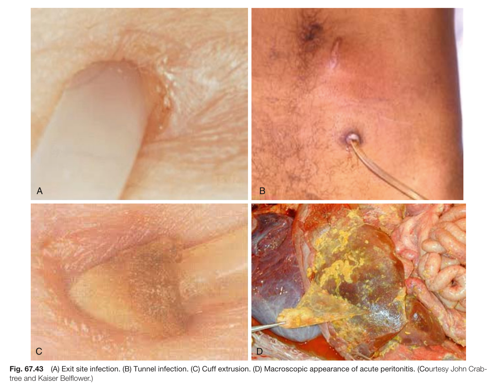

Fig. 67.43 (A) Exit site infection. (B) Tunnel infection. (C) Cuff extrusion. (D) Macroscopic appearance of acute peritonitis. (Courtesy John Crab- tree and Kaiser Belflower.)

---

### Fig_67_44

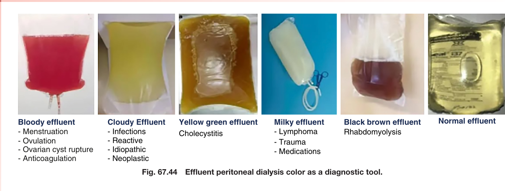

Fig. 67.44 Effluent peritoneal dialysis color as a diagnostic tool.

---

### Fig_67_45

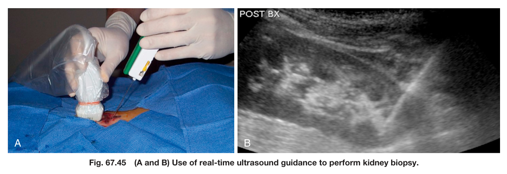

Fig. 67.45 (A and B) Use of real-time ultrasound guidance to perform kidney biopsy.

---

### Fig_67_46

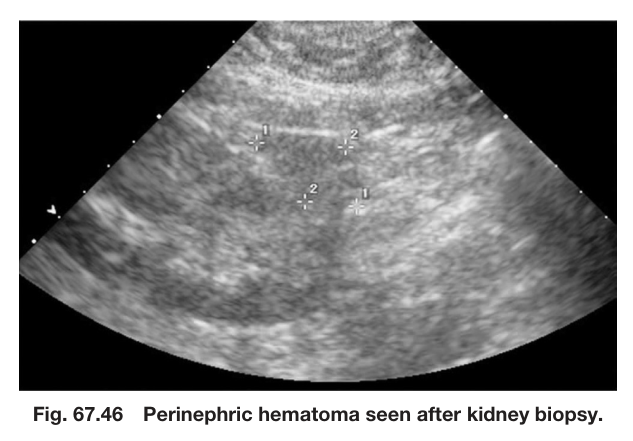

Fig. 67.46 Perinephric hematoma seen after kidney biopsy.

---

### Fig_67_47

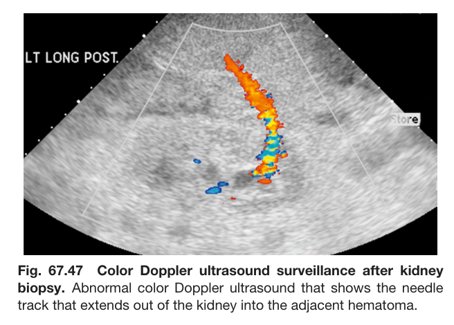

Fig. 67.47 Color Doppler ultrasound surveillance after kidney biopsy. Abnormal color Doppler ultrasound that shows the needle track that extends out of the kidney into the adjacent hematoma.

---

## Tables

### Table_67_1

#### Table Image

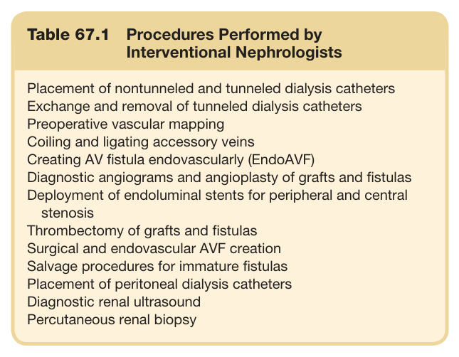

#### Table Data (CSV: [Table_67_1.csv](Table_67_1.csv))

```markdown
| Table Text (OCR) |
| :--- |
| Table 67.1  Procedures Performed by Interventional Nephrologists Placement of nontunneled and tunneled dialysis catheters Exchange and removal of tunneled dialysis catheters Preoperative vascular mapping Coiling and ligating accessory veins Creating AV fistula endovascularly (EndoAVF) Diagnostic angiograms and angioplasty of grafts and fistulas Deployment of endoluminal stents for peripheral and central stenosis Thrombectomy of grafts and fistulas Surgical and endovascular AVF creation Salvage procedures for immature fistulas Placement of peritoneal dialysis catheters Diagnostic renal ultrasound Percutaneous renal biopsy having dedicated vascular access coordinators who maintain prospective, computerized records of all procedures performed and follow patients up regularly.<sup>15</sup> Vascular access procedures and their subsequent complications represent a major cause of anxiety, morbidity, hospitalization, and cost for patients on maintenance hemodialysis.<sup>16-20</sup> In an early publication from 1996, more than 20% of hospitalizations in U.S. hemodialysis patients were vascular access related, and the annual cost of vascular access morbidity is close to 1 billion U.S. dollars.<sup>19</sup> Thamer and colleagues<sup>21</sup> reported that Medicare paid 2.8 billion U.S. dollars for dialysis vascular access services in the United States. Complications that occur commonly with AV fistulas and grafts are stenosis and thrombosis, which contribute to the rising costs of vascular access care and patient morbidity. AV grafts are prone to recurrent stenosis and thrombosis and often require multiple interventions to ensure long-term patency. On the other hand, AV fistulas have a much lower incidence of stenosis and thrombosis than AV grafts that require fewer interventions.<sup>19,20,22</sup> |
```

Table 67.1 Procedures Performed by Interventional Nephrologists

---

### Table_67_2

#### Table Image

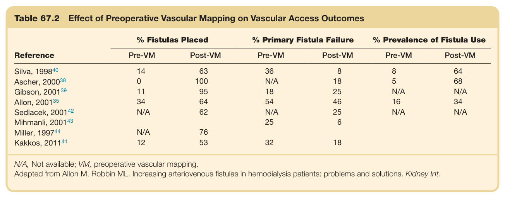

#### Table Data (CSV: [Table_67_2.csv](Table_67_2.csv))

```markdown
| Table Text (OCR) |
| :--- |
| Table 67.2 Effect of Preoperative Vascular Mapping on Vascular Access Outcomes Reference  % Fistulas Placed  % Primary Fistula Failure  % Prevalence of Fistula Use    Pre-VM  Post-VM  Pre-VM  Post-VM  Pre-VM  Post-VM    Silva, 199840  14  63  36  8  8  64    Ascher, 200038  0  100  N/A  18  5  68    Gibson, 200139  11  95  18  25  N/A  N/A    Allon, 200135  34  64  54  46  16  34    Sedlacek, 200142  N/A  62  N/A  25  N/A  N/A    Mihmanli, 200143      25  6        Miller, 199744  N/A  76            Kakkos, 201141  12  53  32  18 N/A, Not available; VM, preoperative vascular mapping. Adapted from Allon M, Robbin ML. Increasing arteriovenous fistulas in hemodialysis patients: problems and solutions. Kidney Int. |
```

Table 67.2 Effect of Preoperative Vascular Mapping on Vascular Access Outcomes

---

### Table_67_3

#### Table Image

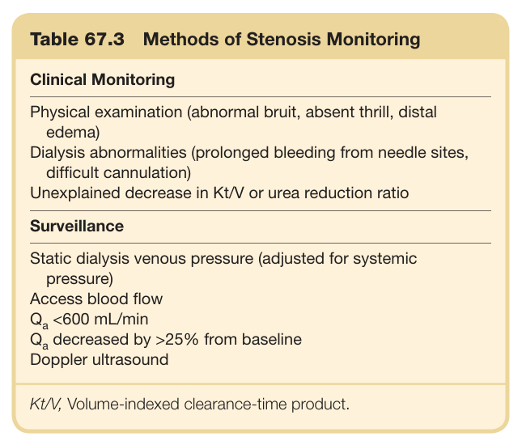

#### Table Data (CSV: [Table_67_3.csv](Table_67_3.csv))

```markdown
| Table Text (OCR) |
| :--- |
| Table 67.3  Methods of Stenosis Monitoring Clinical Monitoring Physical examination (abnormal bruit, absent thrill, distal edema)    Dialysis abnormalities (prolonged bleeding from needle sites, difficult cannulation)    Unexplained decrease in Kt/V or urea reduction ratio |
```

Table 67.3 Methods of Stenosis Monitoring

---

### Table_67_4

#### Table Image

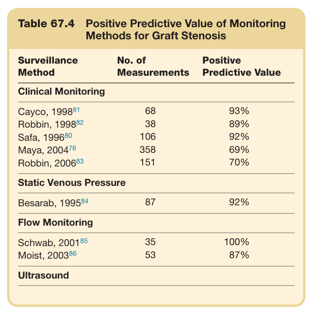

#### Table Data (CSV: [Table_67_4.csv](Table_67_4.csv))

```markdown
| Table Text (OCR) |
| :--- |
| Table 67.4  Positive Predictive Value of Monitoring Methods for Graft Stenosis Surveillance Method  No. of Measurements  Positive Predictive Value    Clinical Monitoring    Cayco, 199881  68  93%    Robbin, 199882  38  89%    Safa, 199680  106  92%    Maya, 200476  358  69%    Robbin, 200683  151  70%    Static Venous Pressure    Besarab, 199584  87  92%    Flow Monitoring    Schwab, 200185  35  100%    Moist, 200386  53  87%    Ultrasound |
```

Table 67.4 Positive Predictive Value of Monitoring Methods for Graft Stenosis

---

### Table_67_5

#### Table Image

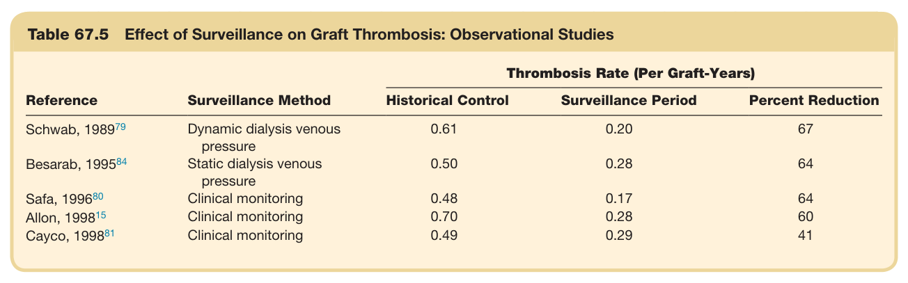

#### Table Data (CSV: [Table_67_5.csv](Table_67_5.csv))

```markdown
| Table Text (OCR) |
| :--- |
| Table 67.5  Effect of Surveillance on Graft Thrombosis: Observational Studies Reference  Surveillance Method  Thrombosis Rate (Per Graft-Years)    Historical Control  Surveillance Period  Percent Reduction    Schwab, 198979  Dynamic dialysis venous pressure  0.61  0.20  67    Besarab, 199584  Static dialysis venous pressure  0.50  0.28  64    Safa, 199680  Clinical monitoring  0.48  0.17  64    Allon, 199815  Clinical monitoring  0.70  0.28  60    Cayco, 199881  Clinical monitoring  0.49  0.29  41 |
```

Table 67.5 Effect of Surveillance on Graft Thrombosis: Observational Studies

---

### Table_67_6

#### Table Image

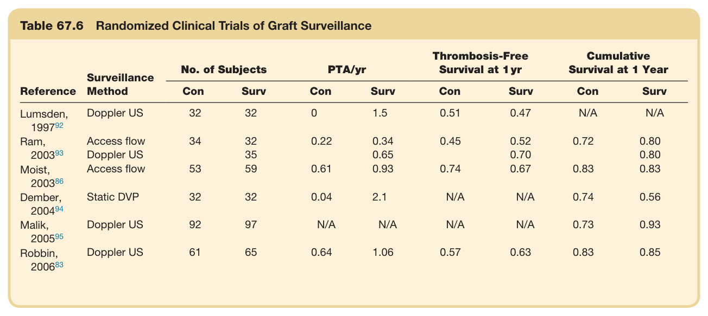

#### Table Data (CSV: [Table_67_6.csv](Table_67_6.csv))

```markdown
| Table Text (OCR) |
| :--- |
| Table 67.6 Randomized Clinical Trials of Graft Surveillance Reference  Surveillance Method  No. of Subjects  PTA/yr  Thrombosis-Free Survival at 1 yr  Cumulative Survival at 1 Year    Con  Surv  Con  Surv  Con  Surv  Con  Surv    Lumsden, 199792  Doppler US  32  32  0  1.5  0.51  0.47  N/A  N/A    Ram, 200393  Access flow  34  32  0.22  0.34  0.45  0.52  0.72  0.80    Doppler US    35    0.65    0.70    0.80    Moist, 200386  Access flow  53  59  0.61  0.93  0.74  0.67  0.83  0.83    Dember, 200494  Static DVP  32  32  0.04  2.1  N/A  N/A  0.74  0.56    Malik, 200595  Doppler US  92  97  N/A  N/A  N/A  N/A  0.73  0.93    Robbin, 200683  Doppler US  61  65  0.64  1.06  0.57  0.63  0.83  0.85 |
```

Table 67.6 Randomized Clinical Trials of Graft Surveillance

---

### Table_67_7

#### Table Image

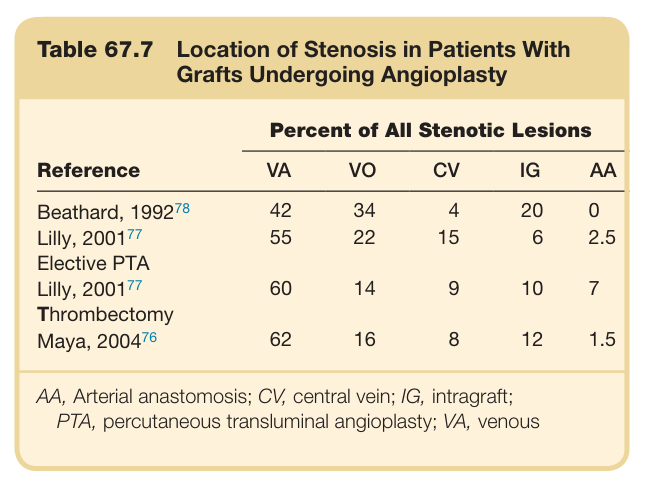

#### Table Data (CSV: [Table_67_7.csv](Table_67_7.csv))

```markdown
| Table Text (OCR) |
| :--- |
| Table 67.7  Location of Stenosis in Patients With Grafts Undergoing Angioplasty Reference  Percent of All Stenotic Lesions    VA  VO  CV  IG  AA    Beathard, 199278  42  34  4  20  0    Lilly, 200177  55  22  15  6  2.5    Elective PTA              Lilly, 200177  60  14  9  10  7    Thrombectomy Maya, 200476  62  16  8  12  1.5 AA, Arterial anastomosis; CV, central vein; IG, intragraft; PTA, percutaneous transluminal angioplasty; VA, venous |
```

Table 67.7 Location of Stenosis in Patients With Grafts Undergoing Angioplasty

---

### Table_67_8

#### Table Image

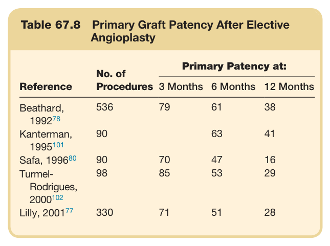

#### Table Data (CSV: [Table_67_8.csv](Table_67_8.csv))

```markdown
| Table Text (OCR) |
| :--- |
| Table 67.8  Primary Graft Patency After Elective Angioplasty Reference  No. of Procedures  Primary Patency at:    3 Months  6 Months  12 Months    Beathard, 199278  536  79  61  38    Kanterman, 1995101  90    63  41    Safa, 199680  90  70  47  16    Turmel-Rodrigues, 2000102  98  85  53  29    Lilly, 200177  330  71  51  28 |
```

Table 67.8 Primary Graft Patency After Elective Angioplasty

---

### Table_67_9

#### Table Image

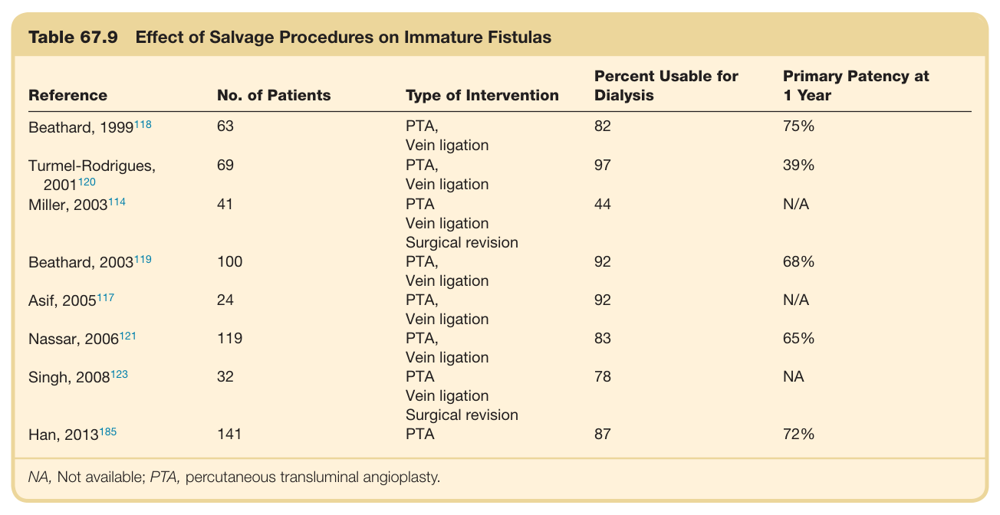

#### Table Data (CSV: [Table_67_9.csv](Table_67_9.csv))

```markdown
| Table Text (OCR) |
| :--- |
| Table 67.9  Effect of Salvage Procedures on Immature Fistulas Reference  No. of Patients  Type of Intervention  Percent Usable for Dialysis  Primary Patency at 1 Year    Beathard, 1999118  63  PTA, Vein ligation  82  75%    Turmel-Rodrigues, 2001120  69  PTA, Vein ligation  97  39%    Miller, 2003114  41  PTA Vein ligation Surgical revision  44  N/A    Beathard, 2003119  100  PTA, Vein ligation  92  68%    Asif, 2005117  24  PTA, Vein ligation  92  N/A    Nassar, 2006121  119  PTA, Vein ligation  83  65%    Singh, 2008123  32  PTA Vein ligation Surgical revision  78  NA    Han, 2013185  141  PTA  87  72% NA, Not available; PTA, percutaneous transluminal angioplasty. |
```

Table 67.9 Effect of Salvage Procedures on Immature Fistulas

---

### Table_67_10

#### Table Image

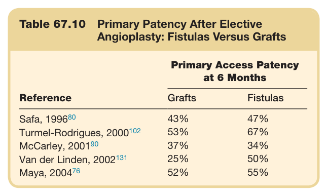

#### Table Data (CSV: [Table_67_10.csv](Table_67_10.csv))

```markdown
| Table Text (OCR) |
| :--- |
| Table 67.10  Primary Patency After Elective Angioplasty: Fistulas Versus Grafts Reference  Primary Access Patency at 6 Months    Grafts  Fistulas    Safa, 199680  43%  47%    Turmel-Rodrigues, 2000102  53%  67%    McCarley, 200190  37%  34%    Van der Linden, 2002131  25%  50%    Maya, 200476  52%  55% |
```

Table 67.10 Primary Patency After Elective Angioplasty: Fistulas Versus Grafts

---

### Table_67_11

#### Table Image

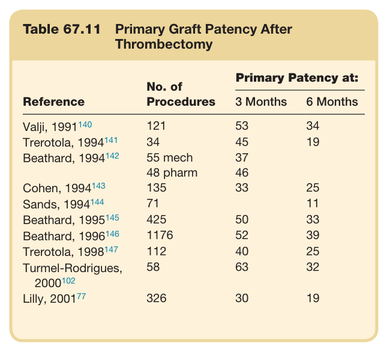

#### Table Data (CSV: [Table_67_11.csv](Table_67_11.csv))

```markdown
| Table Text (OCR) |
| :--- |
| Table 67.11  Primary Graft Patency After Thrombectomy Reference  No. of Procedures  Primary Patency at:    3 Months  6 Months    Valji, 1991140  121  53  34    Trerotola, 1994141  34  45  19    Beathard, 1994142  55 mech  37      48 pharm  46      Cohen, 1994143  135  33  25    Sands, 1994144  71    11    Beathard, 1995145  425  50  33    Beathard, 1996146  1176  52  39    Trerotola, 1998147  112  40  25    Turmel-Rodrigues, 2000102  58  63  32    Lilly, 200177  326  30  19 |
```

Table 67.11 Primary Graft Patency After Thrombectomy

---

### Table_67_12

#### Table Image

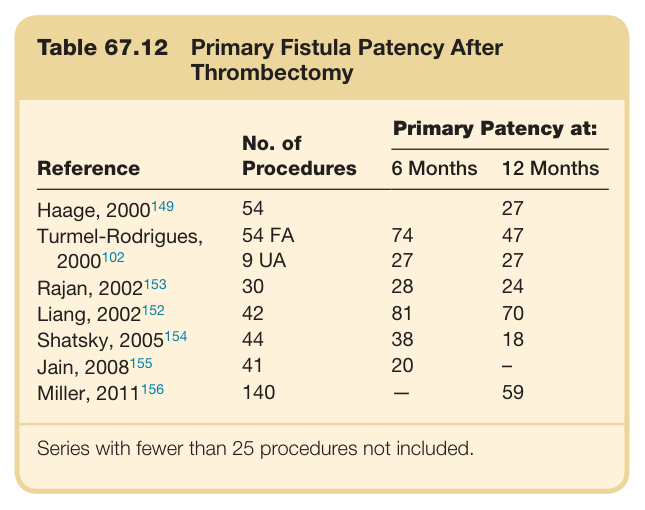

#### Table Data (CSV: [Table_67_12.csv](Table_67_12.csv))

```markdown
| Table Text (OCR) |
| :--- |
| Table 67.12  Primary Fistula Patency After Thrombectomy Reference  No. of Procedures  Primary Patency at:    6 Months  12 Months    Haage, 2000149  54    27    Turmel-Rodrigues, 2000102  54 FA  74  47    9 UA  27  27    Rajan, 2002153  30  28  24    Liang, 2002152  42  81  70    Shatsky, 2005154  44  38  18    Jain, 2008155  41  20  -    Miller, 2011156  140  -  59 Series with fewer than 25 procedures not included. |
```

Table 67.12 Primary Fistula Patency After Thrombectomy

---

### Table_67_13

#### Table Image

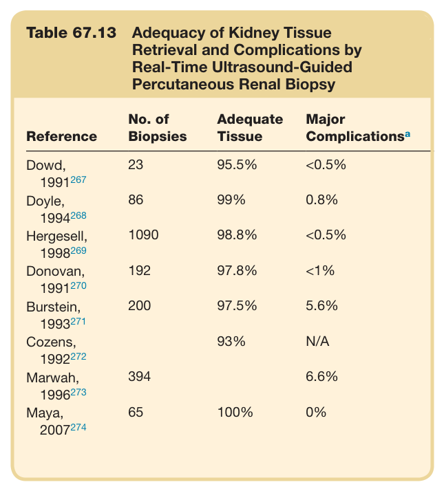

#### Table Data (CSV: [Table_67_13.csv](Table_67_13.csv))

```markdown
| Table Text (OCR) |
| :--- |
| Table 67.13 Adequacy of Kidney Tissue Retrieval and Complications by Real-Time Ultrasound-Guided Percutaneous Renal Biopsy Reference  No. of Biopsies  Adequate Tissue  Major Complications ^{a}     Dowd, 1991 ^{267}   23  95.5%  <0.5%    Doyle, 1994 ^{268}   86  99%  0.8%    Hergesell, 1998 ^{269}   1090  98.8%  <0.5%    Donovan, 1991 ^{270}   192  97.8%  <1%    Burstein, 1993 ^{271}   200  97.5%  5.6%    Cozens, 1992 ^{272}     93%  N/A    Marwah, 1996 ^{273}   394    6.6%    Maya, 2007 ^{274}   65  100%  0% |
```

Table 67.13 Adequacy of Kidney Tissue Retrieval and Complications by Real-Time Ultrasound-Guided Percutaneous Renal Biopsy

---
