# 68. The Immunobiology of Transplantation - Figures and Tables Index

This document lists all figures and tables extracted from `68. The Immunobiology of Transplantation.pdf`.

## Table of Contents
- [Figures](#figures)
- [Tables](#tables)

---

## Figures

### Fig_68_1

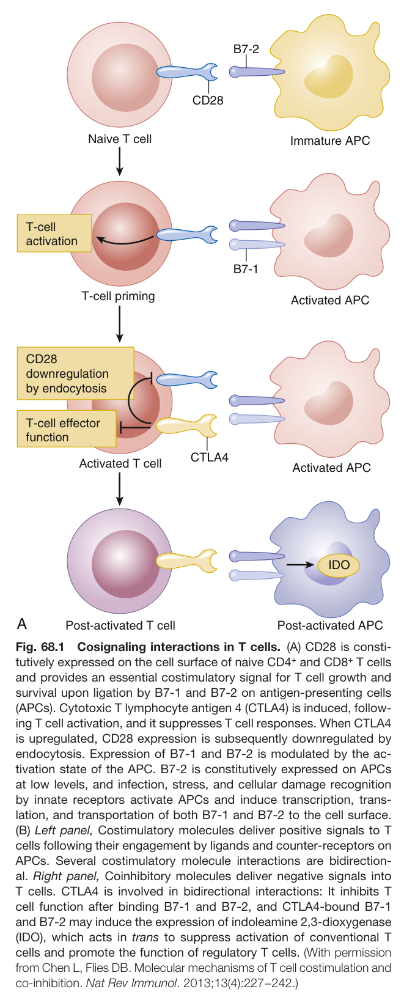

Fig. 68.1 Cosignaling interactions in T cells. (A) CD28 is consti- tutively expressed on the cell surface of naive CD4<sup>+</sup> and CD8<sup>+</sup> T cells and provides an essential costimulatory signal for T cell growth and survival upon ligation by B7-1 and B7-2 on antigen-presenting cells (APCs). Cytotoxic T lymphocyte antigen 4 (CTLA4) is induced, follow- ing T cell activation, and it suppresses T cell responses. When CTLA4 is upregulated, CD28 expression is subsequently downregulated by endocytosis. Expression of B7-1 and B7-2 is modulated by the ac- tivation state of the APC. B7-2 is constitutively expressed on APCs at low levels, and infection, stress, and cellular damage recognition by innate receptors activate APCs and induce transcription, trans- lation, and transportation of both B7-1 and B7-2 to the cell surface. (B) Left panel, Costimulatory molecules deliver positive signals to T cells following their engagement by ligands and counter-receptors on APCs. Several costimulatory molecule interactions are bidirection- al. Right panel, Coinhibitory molecules deliver negative signals into T cells. CTLA4 is involved in bidirectional interactions: It inhibits T cell function after binding B7-1 and B7-2, and CTLA4-bound B7-1 and B7-2 may induce the expression of indoleamine 2,3-dioxygenase (IDO), which acts in trans to suppress activation of conventional T cells and promote the function of regulatory T cells. (With permission from Chen L, Flies DB. Molecular mechanisms of T cell costimulation and co-inhibition. Nat Rev Immunol. 2013;13(4):227−242.)

---

### Fig_68_2

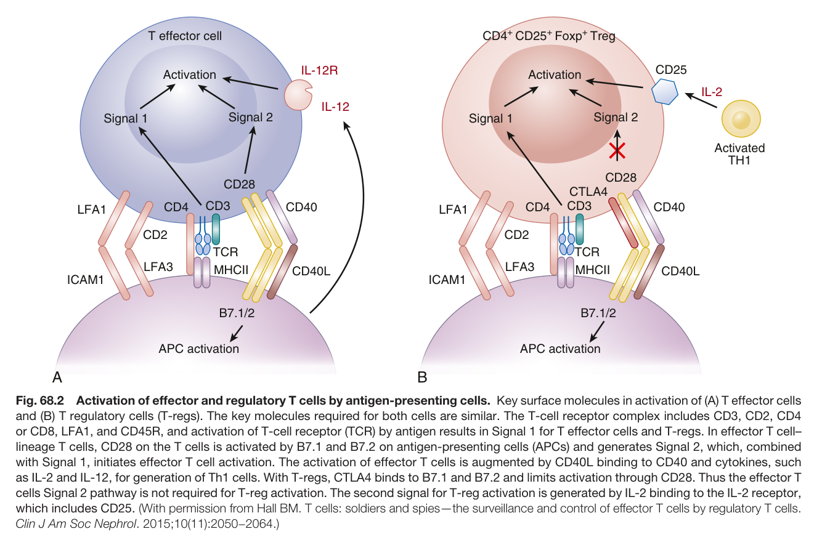

Fig. 68.2 Activation of effector and regulatory T cells by antigen-presenting cells. Key surface molecules in activation of (A) T effector cells and (B) T regulatory cells (T-regs). The key molecules required for both cells are similar. The T-cell receptor complex includes CD3, CD2, CD4 or CD8, LFA1, and CD45R, and activation of T-cell receptor (TCR) by antigen results in Signal 1 for T effector cells and T-regs. In effector T cell– lineage T cells, CD28 on the T cells is activated by B7.1 and B7.2 on antigen-presenting cells (APCs) and generates Signal 2, which, combined with Signal 1, initiates effector T cell activation. The activation of effector T cells is augmented by CD40L binding to CD40 and cytokines, such as IL-2 and IL-12, for generation of Th1 cells. With T-regs, CTLA4 binds to B7.1 and B7.2 and limits activation through CD28. Thus the effector T cells Signal 2 pathway is not required for T-reg activation. The second signal for T-reg activation is generated by IL-2 binding to the IL-2 receptor, which includes CD25. (With permission from Hall BM. T cells: soldiers and spies—the surveillance and control of effector T cells by regulatory T cells. Clin J Am Soc Nephrol. 2015;10(11):2050−2064.)

---

### Fig_68_3

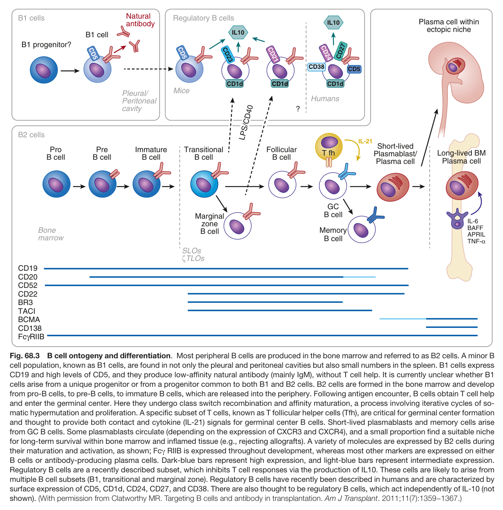

Fig. 68.3 B cell ontogeny and differentiation. Most peripheral B cells are produced in the bone marrow and referred to as B2 cells. A minor B cell population, known as B1 cells, are found in not only the pleural and peritoneal cavities but also small numbers in the spleen. B1 cells express CD19 and high levels of CD5, and they produce low-affinity natural antibody (mainly IgM), without T cell help. It is currently unclear whether B1 cells arise from a unique progenitor or from a progenitor common to both B1 and B2 cells. B2 cells are formed in the bone marrow and develop from pro-B cells, to pre-B cells, to immature B cells, which are released into the periphery. Following antigen encounter, B cells obtain T cell help and enter the germinal center. Here they undergo class switch recombination and affinity maturation, a process involving iterative cycles of so- matic hypermutation and proliferation. A specific subset of T cells, known as T follicular helper cells (Tfh), are critical for germinal center formation and thought to provide both contact and cytokine (IL-21) signals for germinal center B cells. Short-lived plasmablasts and memory cells arise from GC B cells. Some plasmablasts circulate (depending on the expression of CXCR3 and CXCR4), and a small proportion find a suitable niche for long-term survival within bone marrow and inflamed tissue (e.g., rejecting allografts). A variety of molecules are expressed by B2 cells during their maturation and activation, as shown; Fcγ RIIB is expressed throughout development, whereas most other markers are expressed on either B cells or antibody-producing plasma cells. Dark-blue bars represent high expression, and light-blue bars represent intermediate expression. Regulatory B cells are a recently described subset, which inhibits T cell responses via the production of IL10. These cells are likely to arise from multiple B cell subsets (B1, transitional and marginal zone). Regulatory B cells have recently been described in humans and are characterized by surface expression of CD5, CD1d, CD24, CD27, and CD38. There are also thought to be regulatory B cells, which act independently of IL-10 (not shown). (With permission from Clatworthy MR. Targeting B cells and antibody in transplantation. Am J Transplant. 2011;11(7):1359−1367.)

---

### Fig_68_4

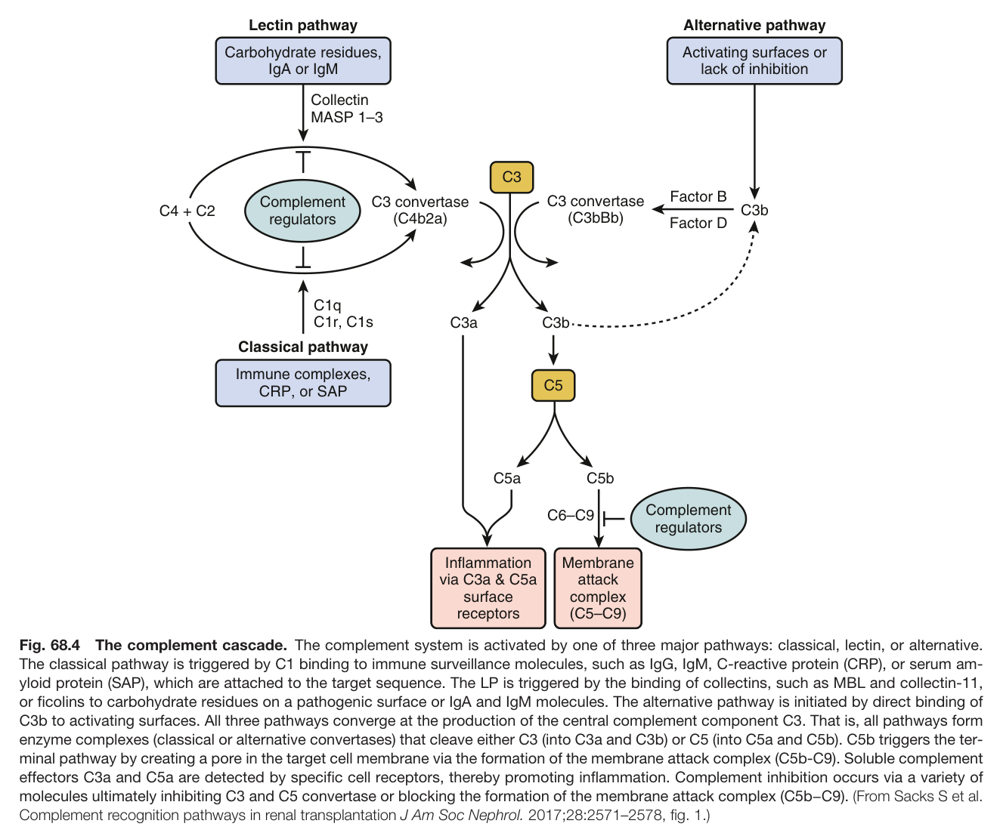

Fig. 68.4 The complement cascade. The complement system is activated by one of three major pathways: classical, lectin, or alternative. The classical pathway is triggered by C1 binding to immune surveillance molecules, such as IgG, IgM, C-reactive protein (CRP), or serum am- yloid protein (SAP), which are attached to the target sequence. The LP is triggered by the binding of collectins, such as MBL and collectin-11, or ficolins to carbohydrate residues on a pathogenic surface or IgA and IgM molecules. The alternative pathway is initiated by direct binding of C3b to activating surfaces. All three pathways converge at the production of the central complement component C3. That is, all pathways form enzyme complexes (classical or alternative convertases) that cleave either C3 (into C3a and C3b) or C5 (into C5a and C5b). C5b triggers the ter- minal pathway by creating a pore in the target cell membrane via the formation of the membrane attack complex (C5b-C9). Soluble complement effectors C3a and C5a are detected by specific cell receptors, thereby promoting inflammation. Complement inhibition occurs via a variety of molecules ultimately inhibiting C3 and C5 convertase or blocking the formation of the membrane attack complex (C5b−C9). (From Sacks S et al. Complement recognition pathways in renal transplantation J Am Soc Nephrol. 2017;28:2571–2578, fig. 1.)

---

### Fig_68_5

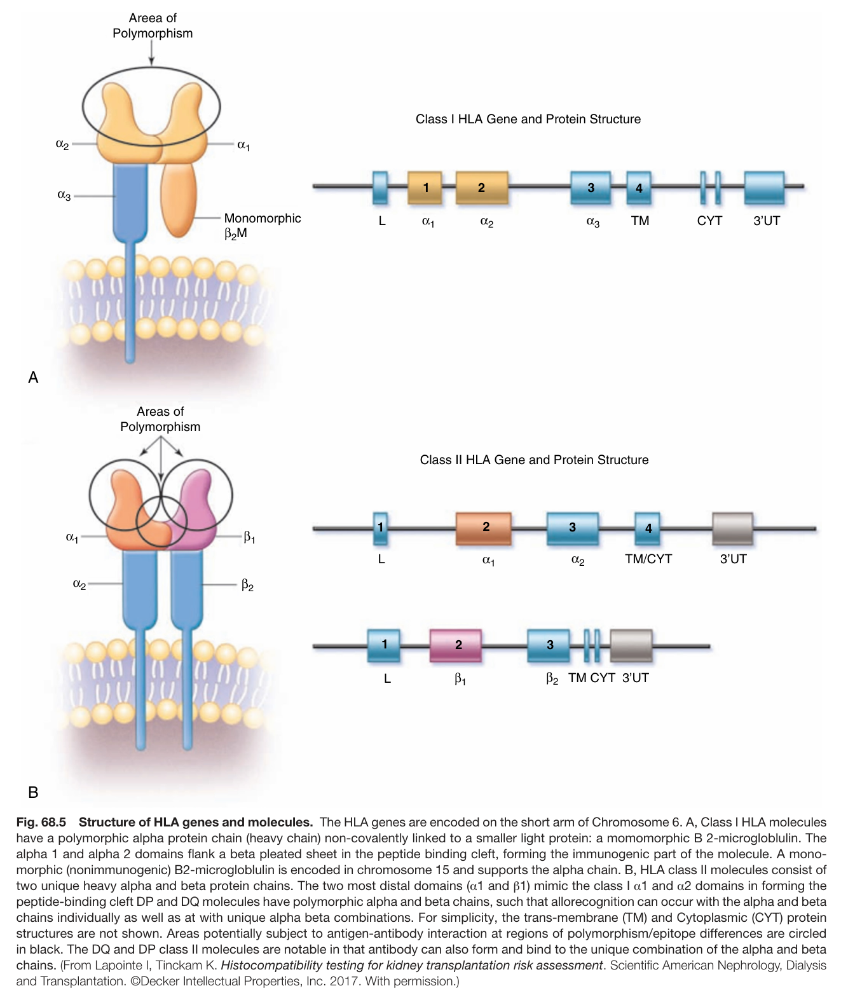

Fig. 68.5 Structure of HLA genes and molecules. The HLA genes are encoded on the short arm of Chromosome 6. A, Class I HLA molecules have a polymorphic alpha protein chain (heavy chain) non-covalently linked to a smaller light protein: a momomorphic B 2-microgloblulin. The alpha 1 and alpha 2 domains flank a beta pleated sheet in the peptide binding cleft, forming the immunogenic part of the molecule. A mono- morphic (nonimmunogenic) B2-microgloblulin is encoded in chromosome 15 and supports the alpha chain. B, HLA class II molecules consist of two unique heavy alpha and beta protein chains. The two most distal domains (α1 and β1) mimic the class I α1 and α2 domains in forming the peptide-binding cleft DP and DQ molecules have polymorphic alpha and beta chains, such that allorecognition can occur with the alpha and beta chains individually as well as at with unique alpha beta combinations. For simplicity, the trans-membrane (TM) and Cytoplasmic (CYT) protein structures are not shown. Areas potentially subject to antigen-antibody interaction at regions of polymorphism/epitope differences are circled in black. The DQ and DP class II molecules are notable in that antibody can also form and bind to the unique combination of the alpha and beta chains. (From Lapointe I, Tinckam K. Histocompatibility testing for kidney transplantation risk assessment. Scientific American Nephrology, Dialysi and Transplantation. ©Decker Intellectual Properties, Inc. 2017. With permission.)

---

### Fig_68_6

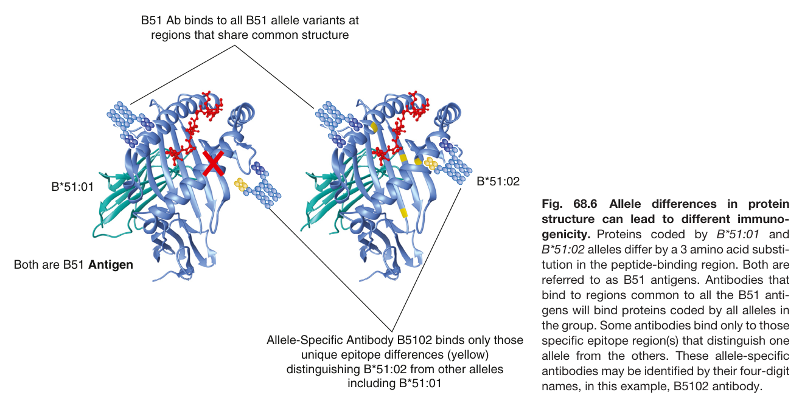

Fig. 68.6 Allele differences in protein structure can lead to different immuno- genicity. Proteins coded by B*51:01 and B*51:02 alleles differ by a 3 amino acid substi- tution in the peptide-binding region. Both are referred to as B51 antigens. Antibodies that bind to regions common to all the B51 anti- gens will bind proteins coded by all alleles in the group. Some antibodies bind only to those specific epitope region(s) that distinguish one allele from the others. These allele-specific antibodies may be identified by their four-digit names, in this example, B5102 antibody.

---

### Fig_68_7

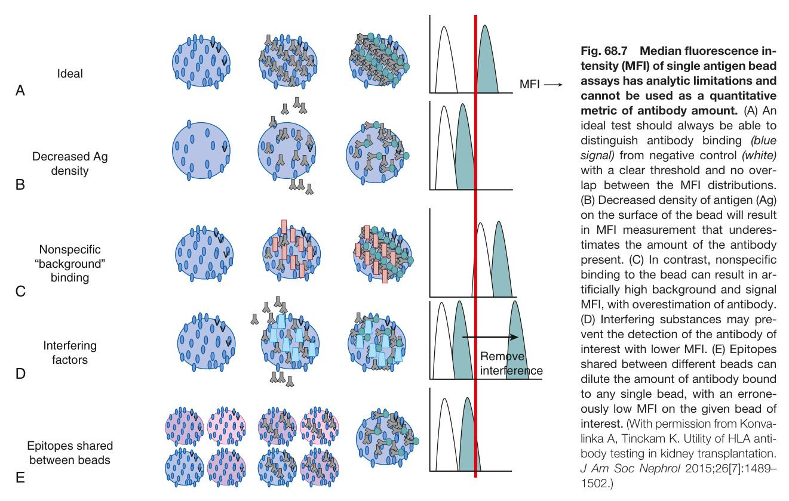

Fig. 68.7 Median fluorescence in- tensity (MFI) of single antigen bead assays has analytic limitations and cannot be used as a quantitative metric of antibody amount. (A) An ideal test should always be able to distinguish antibody binding (blue signal) from negative control (white) with a clear threshold and no over- lap between the MFI distributions. (B) Decreased density of antigen (Ag) on the surface of the bead will result in MFI measurement that underes- timates the amount of the antibody present. (C) In contrast, nonspecific binding to the bead can result in ar- tificially high background and signal MFI, with overestimation of antibody. (D) Interfering substances may pre- vent the detection of the antibody of interest with lower MFI. (E) Epitopes shared between different beads can dilute the amount of antibody bound to any single bead, with an errone- ously low MFI on the given bead of interest. (With permission from Konva- linka A, Tinckam K. Utility of HLA anti- body testing in kidney transplantation. J Am Soc Nephrol 2015;26[7]:1489– 1502.)

---

### Fig_68_8

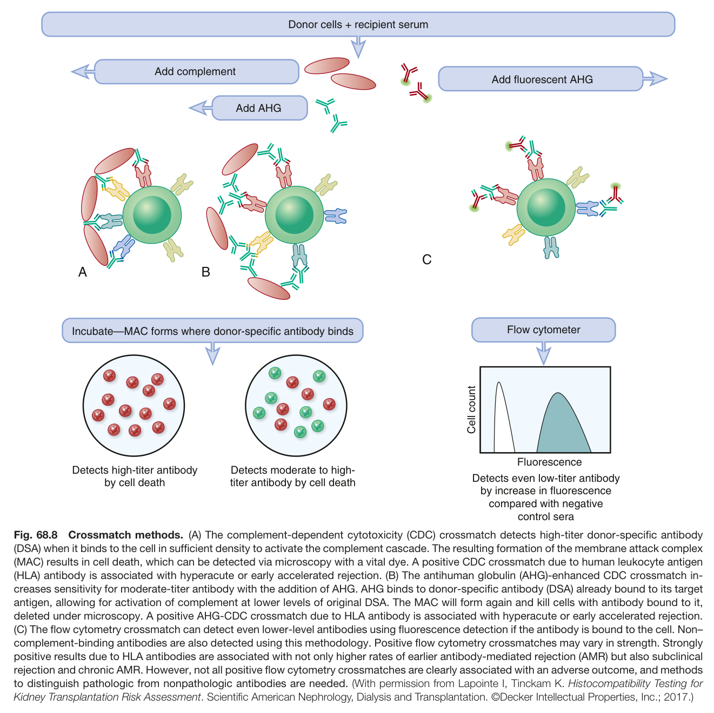

Fig. 68.8 Crossmatch methods. (A) The complement-dependent cytotoxicity (CDC) crossmatch detects high-titer donor-specific antibody (DSA) when it binds to the cell in sufficient density to activate the complement cascade. The resulting formation of the membrane attack complex (MAC) results in cell death, which can be detected via microscopy with a vital dye. A positive CDC crossmatch due to human leukocyte antigen (HLA) antibody is associated with hyperacute or early accelerated rejection. (B) The antihuman globulin (AHG)-enhanced CDC crossmatch in- creases sensitivity for moderate-titer antibody with the addition of AHG. AHG binds to donor-specific antibody (DSA) already bound to its target antigen, allowing for activation of complement at lower levels of original DSA. The MAC will form again and kill cells with antibody bound to it, deleted under microscopy. A positive AHG-CDC crossmatch due to HLA antibody is associated with hyperacute or early accelerated rejection. (C) The flow cytometry crossmatch can detect even lower-level antibodies using fluorescence detection if the antibody is bound to the cell. Non– complement-binding antibodies are also detected using this methodology. Positive flow cytometry crossmatches may vary in strength. Strongly positive results due to HLA antibodies are associated with not only higher rates of earlier antibody-mediated rejection (AMR) but also subclinica rejection and chronic AMR. However, not all positive flow cytometry crossmatches are clearly associated with an adverse outcome, and methods to distinguish pathologic from nonpathologic antibodies are needed. (With permission from Lapointe I, Tinckam K. Histocompatibility Testing for Kidney Transplantation Risk Assessment. Scientific American Nephrology, Dialysis and Transplantation. ©Decker Intellectual Properties, Inc.; 2017.)

---

### Fig_68_9

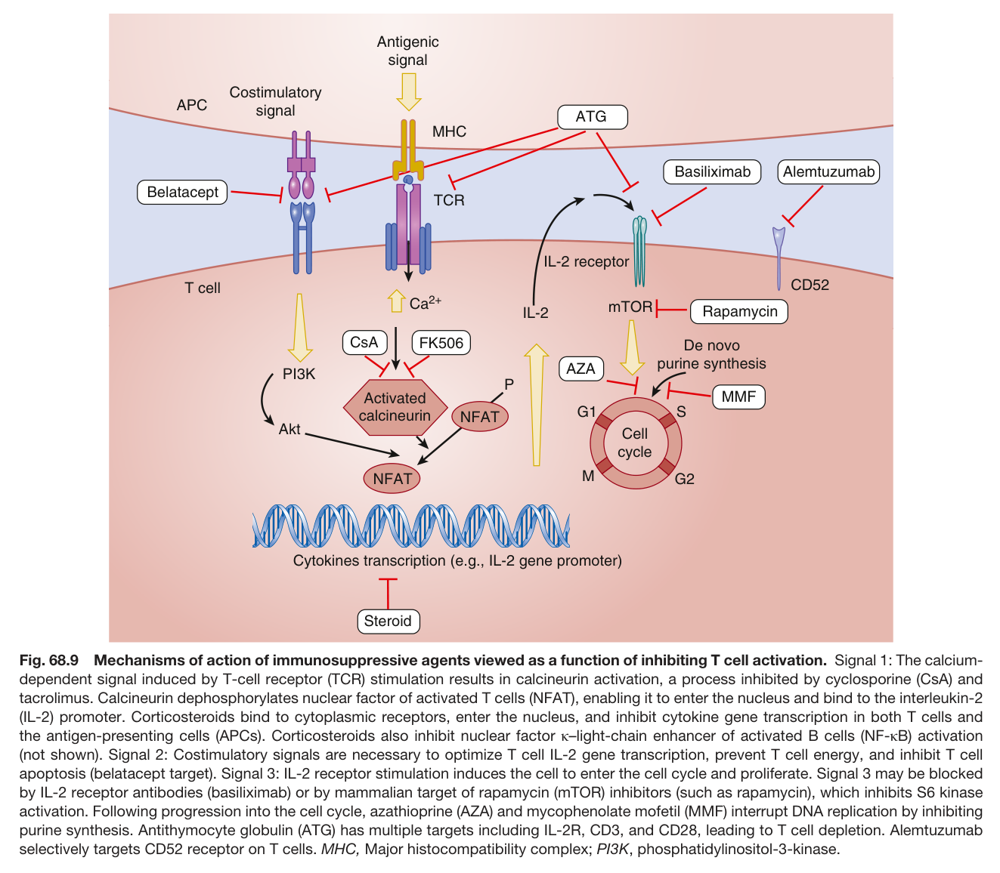

Fig. 68.9 Mechanisms of action of immunosuppressive agents viewed as a function of inhibiting T cell activation. Signal 1: The calcium- dependent signal induced by T-cell receptor (TCR) stimulation results in calcineurin activation, a process inhibited by cyclosporine (CsA) and tacrolimus. Calcineurin dephosphorylates nuclear factor of activated T cells (NFAT), enabling it to enter the nucleus and bind to the interleukin-2 (IL-2) promoter. Corticosteroids bind to cytoplasmic receptors, enter the nucleus, and inhibit cytokine gene transcription in both T cells and the antigen-presenting cells (APCs). Corticosteroids also inhibit nuclear factor κ–light-chain enhancer of activated B cells (NF-κB) activation (not shown). Signal 2: Costimulatory signals are necessary to optimize T cell IL-2 gene transcription, prevent T cell energy, and inhibit T cel apoptosis (belatacept target). Signal 3: IL-2 receptor stimulation induces the cell to enter the cell cycle and proliferate. Signal 3 may be blocked by IL-2 receptor antibodies (basiliximab) or by mammalian target of rapamycin (mTOR) inhibitors (such as rapamycin), which inhibits S6 kinase activation. Following progression into the cell cycle, azathioprine (AZA) and mycophenolate mofetil (MMF) interrupt DNA replication by inhibiting purine synthesis. Antithymocyte globulin (ATG) has multiple targets including IL-2R, CD3, and CD28, leading to T cell depletion. Alemtuzumab selectively targets CD52 receptor on T cells. MHC, Major histocompatibility complex; PI3K, phosphatidylinositol-3-kinase.

---

## Tables

### Table_68_1

#### Table Image

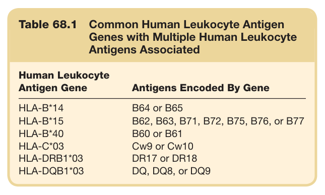

#### Table Data (CSV: [Table_68_1.csv](Table_68_1.csv))

```markdown
| Table Text (OCR) |
| :--- |
| Table 68.1  Common Human Leukocyte Antigen Genes with Multiple Human Leukocyte Antigens Associated Human Leukocyte Antigen Gene  Antigens Encoded By Gene    HLA-B*14  B64 or B65    HLA-B*15  B62, B63, B71, B72, B75, B76, or B77    HLA-B*40  B60 or B61    HLA-C*03  Cw9 or Cw10    HLA-DRB1*03  DR17 or DR18    HLA-DQB1*03  DQ, DQ8, or DQ9 |
```

Table 68.1 Common Human Leukocyte Antigen Genes with Multiple Human Leukocyte Antigens Associated

---

### Table_68_2

#### Table Image

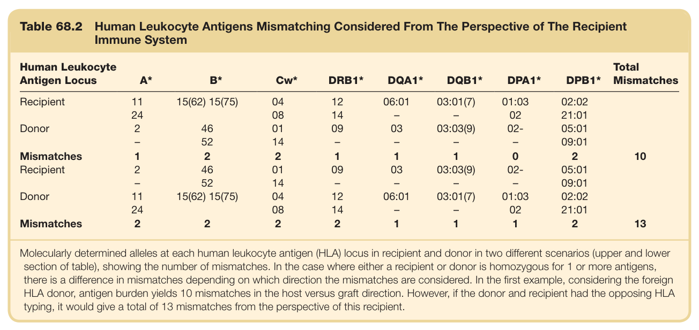

#### Table Data (CSV: [Table_68_2.csv](Table_68_2.csv))

```markdown
| Table Text (OCR) |
| :--- |
| Table 68.2 Human Leukocyte Antigens Mismatching Considered From The Perspective of The Recipient Immune System Human Leukocyte Antigen Locus  A*  B*  Cw*  DRB1*  DQA1*  DQB1*  DPA1*  DPB1*  Total Mismatches    Recipient  11  15(62) 15(75)  04  12  06:01  03:01(7)  01:03  02:02      24    08  14  -  -  02  21:01      Donor  2  46  01  09  03  03:03(9)  02-  05:01      -  52  14  -  -  -  -  09:01      Mismatches  1  2  2  1  1  1  0  2  10    Recipient  2  46  01  09  03  03:03(9)  02-  05:01      -  52  14  -  -  -  -  09:01      Donor  11  15(62) 15(75)  04  12  06:01  03:01(7)  01:03  02:02      24    08  14  -  -  02  21:01      Mismatches  2  2  2  2  1  1  1  2  13 |
```

Table 68.2 Human Leukocyte Antigens Mismatching Considered From The Perspective of The Recipient Immune System

---

### Table_68_3

#### Table Image

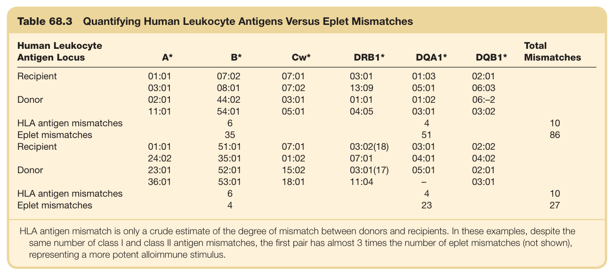

#### Table Data (CSV: [Table_68_3.csv](Table_68_3.csv))

```markdown
| Table Text (OCR) |
| :--- |
| Table 68.3 Quantifying Human Leukocyte Antigens Versus Eplet Mismatches Human Leukocyte Antigen Locus  A*  B*  Cw*  DRB1*  DQA1*  DQB1*  Total Mismatches    Recipient  01:01  07:02  07:01  03:01  01:03  02:01      03:01  08:01  07:02  13:09  05:01  06:03      Donor  02:01  44:02  03:01  01:01  01:02  06:-2      11:01  54:01  05:01  04:05  03:01  03:02      HLA antigen mismatches    6      4    10    Eplet mismatches    35      51    86    Recipient  01:01  51:01  07:01  03:02(18)  03:01  02:02      24:02  35:01  01:02  07:01  04:01  04:02      Donor  23:01  52:01  15:02  03:01(17)  05:01  02:01      36:01  53:01  18:01  11:04  -  03:01      HLA antigen mismatches    6      4    10    Eplet mismatches    4      23    27 HLA antigen mismatch is only a crude estimate of the degree of mismatch between donors and recipients. In these examples, despite the same number of class I and class II antigen mismatches, the first pair has almost 3 times the number of eplet mismatches (not shown), representing a more potent alloimmune stimulus. |
```

Table 68.3 Quantifying Human Leukocyte Antigens Versus Eplet Mismatches

---

### Table_68_4

#### Table Image

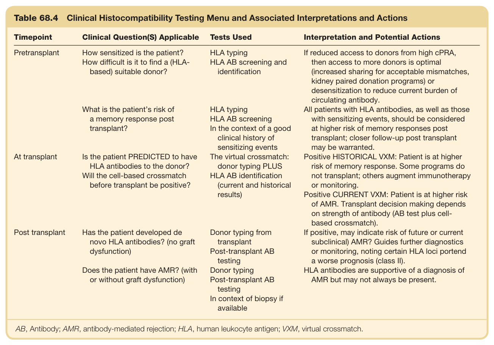

#### Table Data (CSV: [Table_68_4.csv](Table_68_4.csv))

```markdown
| Table Text (OCR) |
| :--- |
| Table 68.4 Clinical Histocompatibility Testing Menu and Associated Interpretations and Actions Timepoint  Clinical Question(S) Applicable  Tests Used  Interpretation and Potential Actions    Pretransplant  How sensitized is the patient?How difficult is it to find a (HLA-based) suitable donor?  HLA typingHLA AB screening and identification  If reduced access to donors from high cPRA, then access to more donors is optimal (increased sharing for acceptable mismatches, kidney paired donation programs) or desensitization to reduce current burden of circulating antibody.    What is the patient's risk of a memory response post transplant?  HLA typingHLA AB screeningIn the context of a good clinical history of sensitizing events  All patients with HLA antibodies, as well as those with sensitizing events, should be considered at higher risk of memory responses post transplant; closer follow-up post transplant may be warranted.    At transplant  Is the patient PREDICTED to have HLA antibodies to the donor?Will the cell-based crossmatch before transplant be positive?  The virtual crossmatch: donor typing PLUSHLA AB identification (current and historical results)  Positive HISTORICAL VXM: Patient is at higher risk of memory response. Some programs do not transplant; others augment immunotherapy or monitoring.Positive CURRENT VXM: Patient is at higher risk of AMR. Transplant decision making depends on strength of antibody (AB test plus cell-based crossmatch).    Post transplant  Has the patient developed de novo HLA antibodies? (no graft dysfunction)  Donor typing from transplantPost-transplant AB testing  If positive, may indicate risk of future or current subclinical) AMR? Guides further diagnostics or monitoring, noting certain HLA loci portend a worse prognosis (class II).    Does the patient have AMR? (with or without graft dysfunction)  Donor typingPost-transplant AB testingIn context of biopsy if available  HLA antibodies are supportive of a diagnosis of AMR but may not always be present. AB, Antibody; AMR, antibody-mediated rejection; HLA, human leukocyte antigen; VXM, virtual crossmatch. |
```

Table 68.4 Clinical Histocompatibility Testing Menu and Associated Interpretations and Actions

---
