# 69. Clinical Management of the Adult Kidney Transplant Recipient - Figures and Tables Index

This document lists all figures and tables extracted from `69. Clinical Management of the Adult Kidney Transplant Recipient.pdf`.

## Table of Contents
- [Figures](#figures)
- [Tables](#tables)

---

## Figures

### Fig_69_1

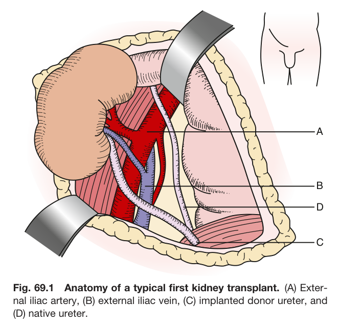

Fig. 69.1 Anatomy of a typical first kidney transplant. (A) Exter- nal iliac artery, (B) external iliac vein, (C) implanted donor ureter, and (D) native ureter.

---

### Fig_69_2

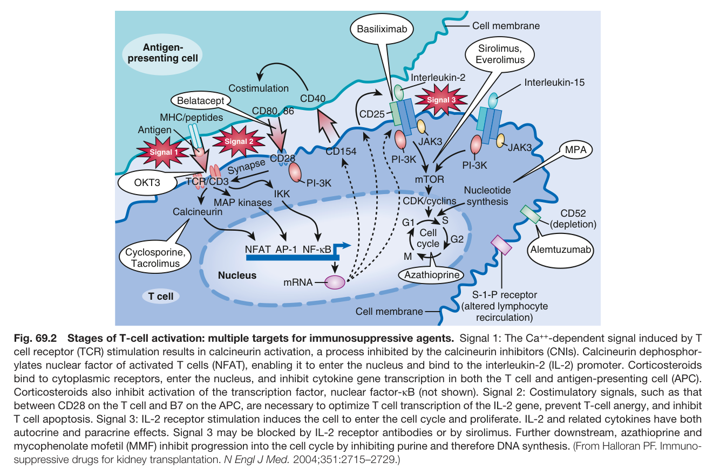

Fig. 69.2 Stages of T-cell activation: multiple targets for immunosuppressive agents. Signal 1: The Ca<sup>++</sup>-dependent signal induced by T cell receptor (TCR) stimulation results in calcineurin activation, a process inhibited by the calcineurin inhibitors (CNIs). Calcineurin dephosphor- ylates nuclear factor of activated T cells (NFAT), enabling it to enter the nucleus and bind to the interleukin-2 (IL-2) promoter. Corticosteroids bind to cytoplasmic receptors, enter the nucleus, and inhibit cytokine gene transcription in both the T cell and antigen-presenting cell (APC). Corticosteroids also inhibit activation of the transcription factor, nuclear factor-κB (not shown). Signal 2: Costimulatory signals, such as that between CD28 on the T cell and B7 on the APC, are necessary to optimize T cell transcription of the IL-2 gene, prevent T-cell anergy, and inhibit T cell apoptosis. Signal 3: IL-2 receptor stimulation induces the cell to enter the cell cycle and proliferate. IL-2 and related cytokines have both autocrine and paracrine effects. Signal 3 may be blocked by IL-2 receptor antibodies or by sirolimus. Further downstream, azathioprine and mycophenolate mofetil (MMF) inhibit progression into the cell cycle by inhibiting purine and therefore DNA synthesis. (From Halloran PF. Immuno suppressive drugs for kidney transplantation. N Engl J Med. 2004;351:2715–2729.)

---

### Fig_69_3

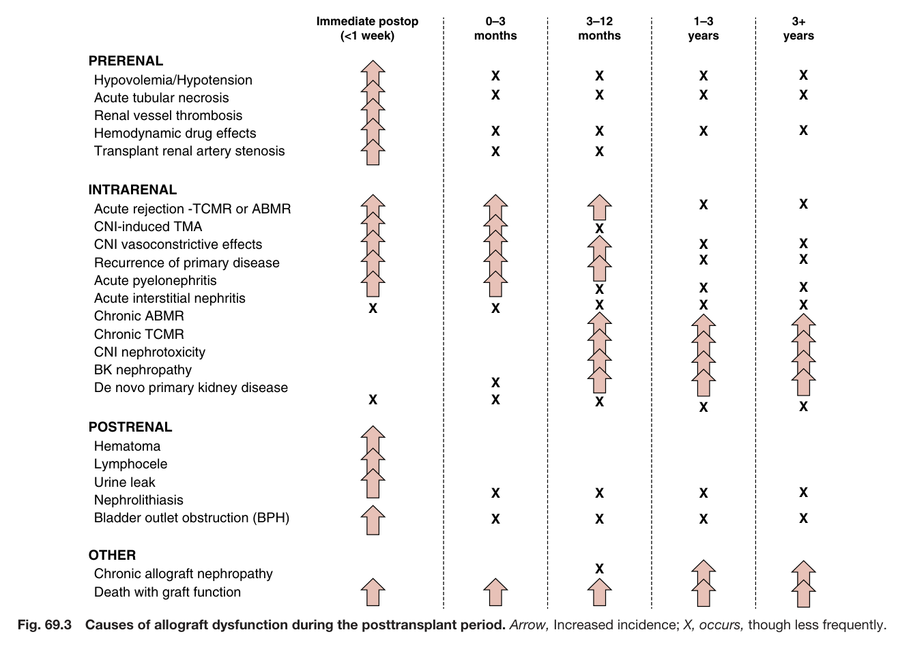

Fig. 69.3 Causes of allograft dysfunction during the posttransplant period. Arrow, Increased incidence; X, occurs, though less frequently.

---

### Fig_69_4

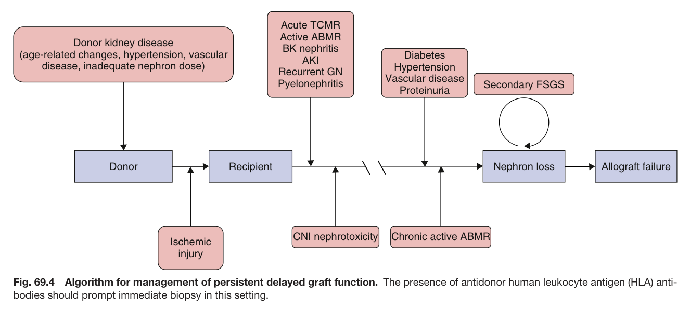

Fig. 69.4 Algorithm for management of persistent delayed graft function. The presence of antidonor human leukocyte antigen (HLA) anti- bodies should prompt immediate biopsy in this setting.

---

### Fig_69_5

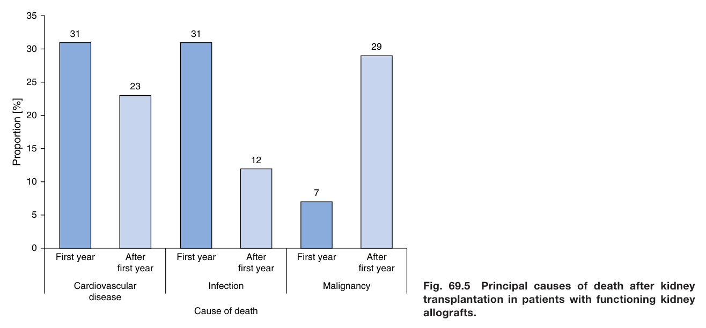

Fig. 69.5 Principal causes of death after kidney transplantation in patients with functioning kidney allografts.

---

### Fig_69_6

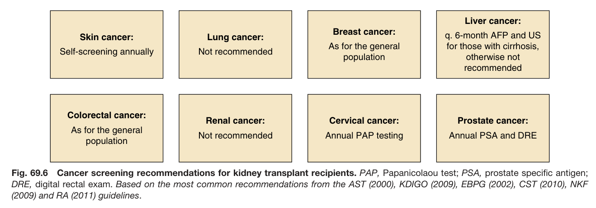

Fig. 69.6 Cancer screening recommendations for kidney transplant recipients. PAP, Papanicolaou test; PSA, prostate specific antigen; DRE, digital rectal exam. Based on the most common recommendations from the AST (2000), KDIGO (2009), EBPG (2002), CST (2010), NKF (2009) and RA (2011) guidelines.

---

### Fig_69_7

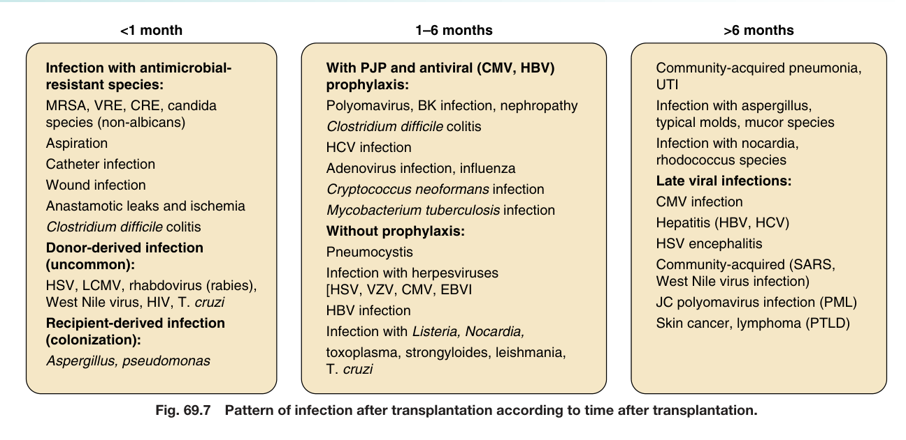

Fig. 69.7 Pattern of infection after transplantation according to time after transplantation.

---

## Tables

### Table_69_1

#### Table Image

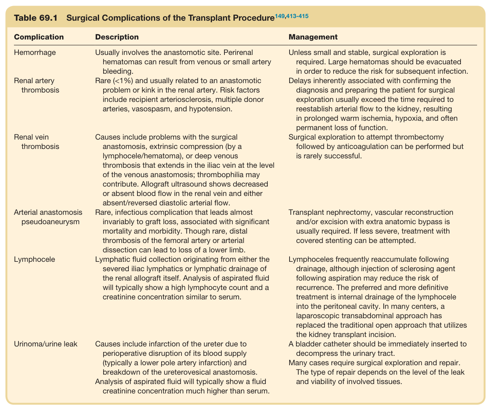

#### Table Data (CSV: [Table_69_1.csv](Table_69_1.csv))

```markdown
| Table Text (OCR) |
| :--- |
| Table 69.1 Surgical Complications of the Transplant Procedure<sup>149,413-415</sup> Complication  Description  Management    Hemorrhage  Usually involves the anastomotic site. Perirenal hematomas can result from venous or small artery bleeding.  Unless small and stable, surgical exploration is required. Large hematomas should be evacuated in order to reduce the risk for subsequent infection.    Renal artery thrombosis  Rare (<1%) and usually related to an anastomotic problem or kink in the renal artery. Risk factors include recipient arteriosclerosis, multiple donor arteries, vasospasm, and hypotension.  Delays inherently associated with confirming the diagnosis and preparing the patient for surgical exploration usually exceed the time required to reestablish arterial flow to the kidney, resulting in prolonged warm ischemia, hypoxia, and often permanent loss of function.    Renal vein thrombosis  Causes include problems with the surgical anastomosis, extrinsic compression (by a lymphocele/hematoma), or deep venous thrombosis that extends in the iliac vein at the level of the venous anastomosis; thrombophilia may contribute. Allograft ultrasound shows decreased or absent blood flow in the renal vein and either absent/reversed diastolic arterial flow.  Surgical exploration to attempt thrombectomy followed by anticoagulation can be performed but is rarely successful.    Arterial anastomosis pseudoaneurysm  Rare, infectious complication that leads almost invariably to graft loss, associated with significant mortality and morbidity. Though rare, distal thrombosis of the femoral artery or arterial dissection can lead to loss of a lower limb.  Transplant nephrectomy, vascular reconstruction and/or excision with extra anatomic bypass is usually required. If less severe, treatment with covered stenting can be attempted.    Lymphocele  Lymphatic fluid collection originating from either the severed iliac lymphatics or lymphatic drainage of the renal allograft itself. Analysis of aspirated fluid will typically show a high lymphocyte count and a creatinine concentration similar to serum.  Lymphoceles frequently reaccumulate following drainage, although injection of sclerosing agent following aspiration may reduce the risk of recurrence. The preferred and more definitive treatment is internal drainage of the lymphocele into the peritoneal cavity. In many centers, a laparoscopic transabdominal approach has replaced the traditional open approach that utilizes the kidney transplant incision.    Urinoma/urine leak  Causes include infarction of the ureter due to perioperative disruption of its blood supply (typically a lower pole artery infarction) and breakdown of the ureterovesical anastomosis. Analysis of aspirated fluid will typically show a fluid creatinine concentration much higher than serum.  A bladder catheter should be immediately inserted to decompress the urinary tract.Many cases require surgical exploration and repair. The type of repair depends on the level of the leak and viability of involved tissues. |
```

Table 69.1 Surgical Complications of the Transplant Procedure<sup>149,413-415</sup>

---

### Table_69_2

#### Table Image

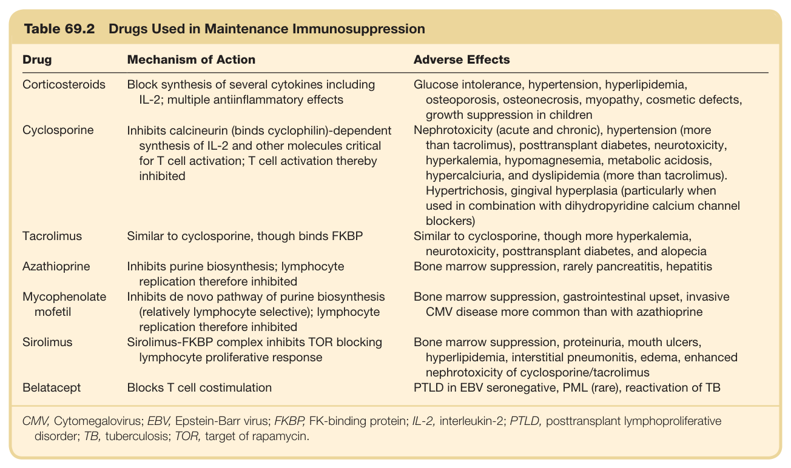

#### Table Data (CSV: [Table_69_2.csv](Table_69_2.csv))

```markdown
| Table Text (OCR) |
| :--- |
| Table 69.2  Drugs Used in Maintenance Immunosuppression Drug  Mechanism of Action  Adverse Effects    Corticosteroids  Block synthesis of several cytokines including IL-2; multiple antiinflammatory effects  Glucose intolerance, hypertension, hyperlipidemia, osteoporosis, osteonecrosis, myopathy, cosmetic defects, growth suppression in children    Cyclosporine  Inhibits calcineurin (binds cyclophilin)-dependent synthesis of IL-2 and other molecules critical for T cell activation; T cell activation thereby inhibited  Nephrotoxicity (acute and chronic), hypertension (more than tacrolimus), posttransplant diabetes, neurotoxicity, hyperkalemia, hypomagnesemia, metabolic acidosis, hypercalciuria, and dyslipidemia (more than tacrolimus). Hypertrichosis, gingival hyperplasia (particularly when used in combination with dihydropyridine calcium channel blockers)    Tacrolimus  Similar to cyclosporine, though binds FKBP  Similar to cyclosporine, though more hyperkalemia, neurotoxicity, posttransplant diabetes, and alopecia    Azathioprine  Inhibits purine biosynthesis; lymphocyte replication therefore inhibited  Bone marrow suppression, rarely pancreatitis, hepatitis    Mycophenolate mofetil  Inhibits de novo pathway of purine biosynthesis (relatively lymphocyte selective); lymphocyte replication therefore inhibited  Bone marrow suppression, gastrointestinal upset, invasive CMV disease more common than with azathioprine    Sirolimus  Sirolimus-FKBP complex inhibits TOR blocking lymphocyte proliferative response  Bone marrow suppression, proteinuria, mouth ulcers, hyperlipidemia, interstitial pneumonitis, edema, enhanced nephrotoxicity of cyclosporine/tacrolimus    Belatacept  Blocks T cell costimulation  PTLD in EBV seronegative, PML (rare), reactivation of TB CMV, Cytomegalovirus; EBV, Epstein-Barr virus; FKBP, FK-binding protein; IL-2, interleukin-2; PTLD, posttransplant lymphoproliferative disorder; TB, tuberculosis; TOR, target of rapamycin. |
```

Table 69.2 Drugs Used in Maintenance Immunosuppression

---

### Table_69_3

#### Table Image

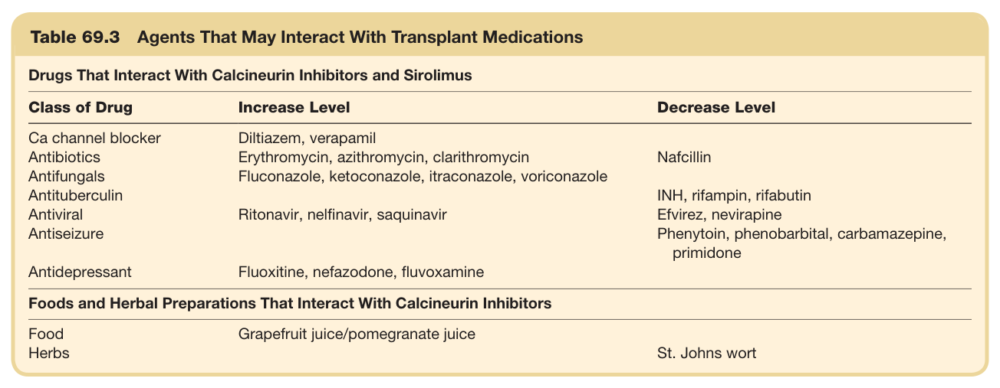

#### Table Data (CSV: [Table_69_3.csv](Table_69_3.csv))

```markdown
| Table Text (OCR) |
| :--- |
| Table 69.3  Agents That May Interact With Transplant Medications Drugs That Interact With Calcineurin Inhibitors and Sirolimus Class of Drug  Increase Level  Decrease Level    Ca channel blocker  Diltiazem, verapamil      Antibiotics  Erythromycin, azithromycin, clarithromycin  Nafcillin    Antifungals  Fluconazole, ketoconazole, itraconazole, voriconazole      Antituberculin    INH, rifampin, rifabutin    Antiviral  Ritonavir, nelfinavir, saquinavir  Efvirez, nevirapine    Antiseizure    Phenytoin, phenobarbital, carbamazepine, primidone    Antidepressant  Fluoxetine, nefazodone, fluvoxamine      Foods and Herbal Preparations That Interact With Calcineurin Inhibitors    Food  Grapefruit juice/pomegranate juice      Herbs    St. Johns wort |
```

Table 69.3 Agents That May Interact With Transplant Medications

---

### Table_69_4

#### Table Image

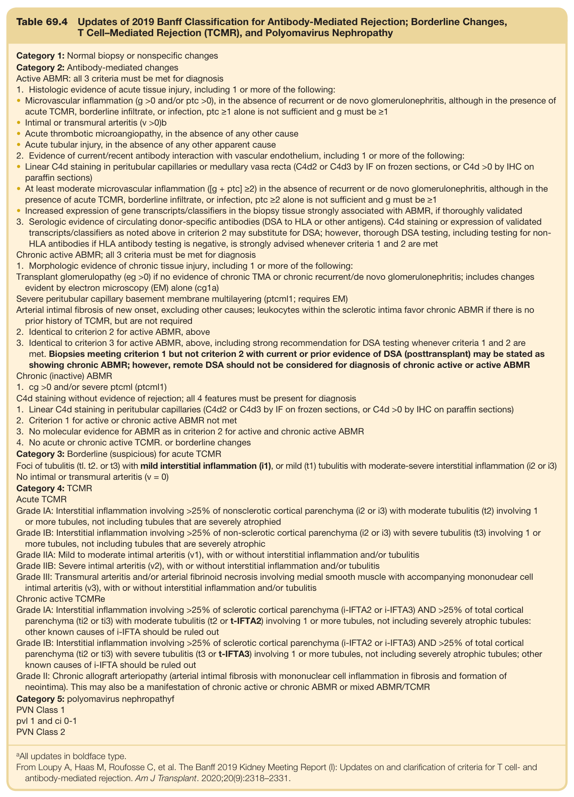

#### Table Data (CSV: [Table_69_4.csv](Table_69_4.csv))

```markdown
| Table Text (OCR) |
| :--- |
| Table 69.4  Updates of 2019 Banff Classification for Antibody-Mediated Rejection; Borderline Changes, T Cell–Mediated Rejection (TCMR), and Polyomavirus Nephropathy Category 1: Normal biopsy or nonspecific changes Category 2: Antibody-mediated changes Active ABMR: all 3 criteria must be met for diagnosis 1. Histologic evidence of acute tissue injury, including 1 or more of the following: •	 Microvascular inflammation (g >0 and/or ptc >0), in the absence of recurrent or de novo glomerulonephritis, although in the presence of acute TCMR, borderline infiltrate, or infection, ptc ≥1 alone is not sufficient and g must be ≥1 •	 Intimal or transmural arteritis (v >0)b •	 Acute thrombotic microangiopathy, in the absence of any other cause •	 Acute tubular injury, in the absence of any other apparent cause 2. Evidence of current/recent antibody interaction with vascular endothelium, including 1 or more of the following: •	 Linear C4d staining in peritubular capillaries or medullary vasa recta (C4d2 or C4d3 by IF on frozen sections, or C4d >0 by IHC on paraffin sections) •	 At least moderate microvascular inflammation ([g + ptc] ≥2) in the absence of recurrent or de novo glomerulonephritis, although in the presence of acute TCMR, borderline infiltrate, or infection, ptc ≥2 alone is not sufficient and g must be ≥1 •	 Increased expression of gene transcripts/classifiers in the biopsy tissue strongly associated with ABMR, if thoroughly validated 3. Serologic evidence of circulating donor-specific antibodies (DSA to HLA or other antigens). C4d staining or expression of validated transcripts/classifiers as noted above in criterion 2 may substitute for DSA; however, thorough DSA testing, including testing for non- HLA antibodies if HLA antibody testing is negative, is strongly advised whenever criteria 1 and 2 are met Chronic active ABMR; all 3 criteria must be met for diagnosis 1. Morphologic evidence of chronic tissue injury, including 1 or more of the following: Transplant glomerulopathy (eg >0) if no evidence of chronic TMA or chronic recurrent/de novo glomerulonephritis; includes changes evident by electron microscopy (EM) alone (cg1a) Severe peritubular capillary basement membrane multilayering (ptcml1; requires EM) Arterial intimal fibrosis of new onset, excluding other causes; leukocytes within the sclerotic intima favor chronic ABMR if there is no prior history of TCMR, but are not required 2. Identical to criterion 2 for active ABMR, above 3. Identical to criterion 3 for active ABMR, above, including strong recommendation for DSA testing whenever criteria 1 and 2 are met. Biopsies meeting criterion 1 but not criterion 2 with current or prior evidence of DSA (posttransplant) may be stated as showing chronic ABMR; however, remote DSA should not be considered for diagnosis of chronic active or active ABMR Chronic (inactive) ABMR 1. cg >0 and/or severe ptcml (ptcml1) C4d staining without evidence of rejection; all 4 features must be present for diagnosis 1. Linear C4d staining in peritubular capillaries (C4d2 or C4d3 by IF on frozen sections, or C4d >0 by IHC on paraffin sections) 2. Criterion 1 for active or chronic active ABMR not met 3. No molecular evidence for ABMR as in criterion 2 for active and chronic active ABMR 4. No acute or chronic active TCMR. or borderline changes Category 3: Borderline (suspicious) for acute TCMR Foci of tubulitis (tl. t2. or t3) with mild interstitial inflammation (i1), or mild (t1) tubulitis with moderate-severe interstitial inflammation (i2 or i3) No intimal or transmural arteritis (v = 0) Category 4: TCMR Acute TCMR Grade IA: Interstitial inflammation involving >25% of nonsclerotic cortical parenchyma (i2 or i3) with moderate tubulitis (t2) involving 1 or more tubules, not including tubules that are severely atrophied Grade IB: Interstitial inflammation involving >25% of non-sclerotic cortical parenchyma (i2 or i3) with severe tubulitis (t3) involving 1 or more tubules, not including tubules that are severely atrophic Grade IIA: Mild to moderate intimal arteritis (v1), with or without interstitial inflammation and/or tubulitis Grade IIB: Severe intimal arteritis (v2), with or without interstitial inflammation and/or tubulitis Grade III: Transmural arteritis and/or arterial fibrinoid necrosis involving medial smooth muscle with accompanying mononudear cell intimal arteritis (v3), with or without interstitial inflammation and/or tubulitis Chronic active TCMRe Grade IA: Interstitial inflammation involving >25% of sclerotic cortical parenchyma (i-IFTA2 or i-IFTA3) AND >25% of total cortical parenchyma (ti2 or ti3) with moderate tubulitis (t2 or t-IFTA2) involving 1 or more tubules, not including severely atrophic tubules: other known causes of i-IFTA should be ruled out Grade IB: Interstitial inflammation involving >25% of sclerotic cortical parenchyma (i-IFTA2 or i-IFTA3) AND >25% of total cortical parenchyma (ti2 or ti3) with severe tubulitis (t3 or t-IFTA3) involving 1 or more tubules, not including severely atrophic tubules; other known causes of i-IFTA should be ruled out Grade II: Chronic allograft arteriopathy (arterial intimal fibrosis with mononuclear cell inflammation in fibrosis and formation of neointima). This may also be a manifestation of chronic active or chronic ABMR or mixed ABMR/TCMR Category 5: polyomavirus nephropathyf PVN Class 1 pvl 1 and ci 0-1 PVN Class 2 <sup>a</sup>All updates in boldface type. From Loupy A, Haas M, Roufosse C, et al. The Banff 2019 Kidney Meeting Report (I): Updates on and clarification of criteria for T cell- and antibody-mediated rejection. Am J Transplant. 2020;20(9):2318–2331. |
```

Table 69.4 Updates of 2019 Banff Classification for Antibody-Mediated Rejection; Borderline Changes, T Cell–Mediated Rejection (TCMR), and Polyomavirus Nephropathy

---

### Table_69_5

#### Table Images (2 Parts)

- **Part 1 (Page 21)**:
  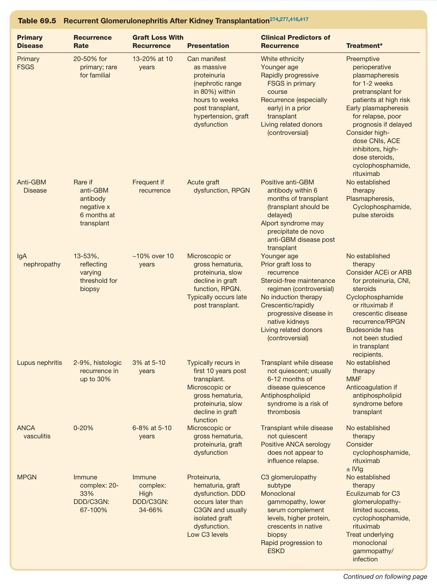

- **Part 2 (Page 22)**:
  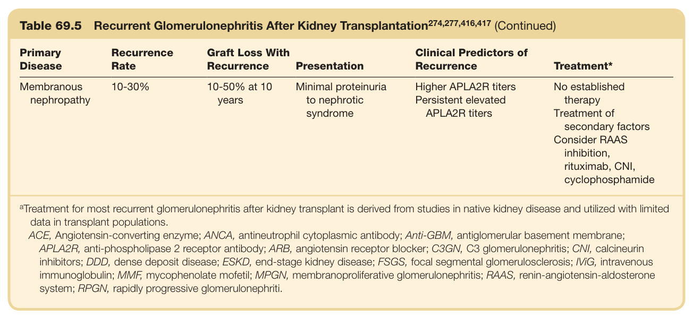

#### Table Data (CSV: [Table_69_5.csv](Table_69_5.csv))

```markdown
| Table Text (OCR) |
| :--- |
| Table 69.5 Recurrent Glomerulonephritis After Kidney Transplantation<sup>274,277,416,417</sup> Primary Disease  Recurrence Rate  Graft Loss With Recurrence  Presentation  Clinical Predictors of Recurrence  Treatment*    Primary FSGS  20-50% for primary; rare for familial  13-20% at 10 years  Can manifest as massive proteinuria (nephrotic range in 80%) within hours to weeks post transplant, hypertension, graft dysfunction  White ethnicityYounger ageRapidly progressive FSGS in primary courseRecurrence (especially early) in a prior transplantLiving related donors (controversial)  Preemptive perioperative plasmapheresis for 1-2 weeks pretransplant for patients at high riskEarly plasmapheresis for relapse, poor prognosis if delayedConsider high-dose CNIs, ACE inhibitors, high-dose steroids, cyclophosphamide, rituximab    Anti-GBM Disease  Rare if anti-GBM antibody negative x 6 months at transplant  Frequent if recurrence  Acute graft dysfunction, RPGN  Positive anti-GBM antibody within 6 months of transplant (transplant should be delayed)Alport syndrome may precipitate de novo anti-GBM disease post transplant  No established therapyPlasmapheresis, Cyclophosphamide, pulse steroids    IgA nephropathy  13-53%, reflecting varying threshold for biopsy  ~10% over 10 years  Microscopic or gross hematuria, proteinuria, slow decline in graft function, RPGN.Typically occurs late post transplant.  Younger agePrior graft loss to recurrenceSteroid-free maintenance regimen (controversial)No induction therapyCrescentic/rapidly progressive disease in native kidneysLiving related donors (controversial)  No established therapyConsider ACEi or ARB for proteinuria, CNI, steroidsCyclophosphamide or rituximab if crescentic disease recurrence/RPGNBudesonide has not been studied in transplant recipients.    Lupus nephritis  2-9%, histologic recurrence in up to 30%  3% at 5-10 years  Typically recurs in first 10 years post transplant.Microscopic or gross hematuria, proteinuria, slow decline in graft function  Transplant while disease not quiescent; usually 6-12 months of disease quiescenceAntiphospholipid syndrome is a risk of thrombosis  No established therapyMMFAnticoagulation if antiphospholipid syndrome before transplant    ANCA vasculitis  0-20%  6-8% at 5-10 years  Microscopic or gross hematuria, proteinuria, graft dysfunction  Transplant while disease not quiescentPositive ANCA serology does not appear to influence relapse.  No established therapyConsider cyclophosphamide, rituximab ± IVIg    MPGN  Immune complex: 20-33%DDD/C3GN: 67-100%  Immune complex: HighDDD/C3GN: 34-66%  Proteinuria, hematuria, graft dysfunction. DDD occurs later than C3GN and usually isolated graft dysfunction.Low C3 levels  C3 glomerulopathy subtypeMonoclonal gammopathy, lower serum complement levels, higher protein, crescents in native biopsyRapid progression to ESKD  No established therapyEculizumab for C3 glomerulopathy-limited success, cyclophosphamide, rituximabTreat underlying monoclonal gammopathy/infection    Membranous nephropathy  10-30%  10-50% at 10 years  Minimal proteinuria to nephrotic syndrome  Higher APLA2R titersPersistent elevated APLA2R titers  No established therapyTreatment of secondary factorsConsider RAAS inhibition, rituximab, CNI, cyclophosphamide <sup>a</sup>Treatment for most recurrent glomerulonephritis after kidney transplant is derived from studies in native kidney disease and utilized with limited data in transplant populations. ACE, Angiotensin-converting enzyme; ANCA, antineutrophil cytoplasmic antibody; Anti-GBM, antiglomerular basement membrane; APLA2R, anti-phospholipase 2 receptor antibody; ARB, angiotensin receptor blocker; C3GN, C3 glomerulonephritis; CNI, calcineurin inhibitors; DDD, dense deposit disease; ESKD, end-stage kidney disease; FSGS, focal segmental glomerulosclerosis; IViG, intravenous immunoglobulin; MMF, mycophenolate mofetil; MPGN, membranoproliferative glomerulonephritis; RAAS, renin-angiotensin-aldosterone system; RPGN, rapidly progressive glomerulonephriti. |
```

Table 69.5 Recurrent Glomerulonephritis After Kidney Transplantation<sup>274,277,416,417</sup>

---

### Table_69_6

#### Table Image

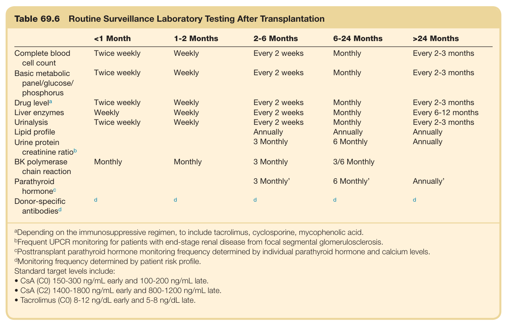

#### Table Data (CSV: [Table_69_6.csv](Table_69_6.csv))

```markdown
| Table Text (OCR) |
| :--- |
| Table 69.6  Routine Surveillance Laboratory Testing After Transplantation <1 Month  1-2 Months  2-6 Months  6-24 Months  >24 Months    Complete blood cell count  Twice weekly  Weekly  Every 2 weeks  Monthly  Every 2-3 months    Basic metabolic panel/glucose/phosphorus  Twice weekly  Weekly  Every 2 weeks  Monthly  Every 2-3 months    Drug levela  Twice weekly  Weekly  Every 2 weeks  Monthly  Every 2-3 months    Liver enzymes  Weekly  Weekly  Every 2 weeks  Monthly  Every 6-12 months    Urinalysis  Twice weekly  Weekly  Every 2 weeks  Monthly  Every 2-3 months    Lipid profile      Annually  Annually  Annually    Urine protein creatinine  ratio^b       3 Monthly  6 Monthly  Annually    BK polymerase chain reaction  Monthly  Monthly  3 Monthly  3/6 Monthly      Parathyroid  hormone^c       3 Monthly'  6 Monthly'  Annually'    Donor-specific  antibodies^d   d  d  d  d  d <sup>a</sup>Depending on the immunosuppressive regimen, to include tacrolimus, cyclosporine, mycophenolic acid. <sup>b</sup>Frequent UPCR monitoring for patients with end-stage renal disease from focal segmental glomerulosclerosis. <sup>c</sup>Posttransplant parathyroid hormone monitoring frequency determined by individual parathyroid hormone and calcium levels. <sup>d</sup>Monitoring frequency determined by patient risk profile. Standard target levels include: • CsA (C0) 150-300 ng/mL early and 100-200 ng/mL late. • CsA (C2) 1400-1800 ng/mL early and 800-1200 ng/mL late. • Tacrolimus (C0) 8-12 ng/dL early and 5-8 ng/dL late. |
```

Table 69.6 Routine Surveillance Laboratory Testing After Transplantation

---

### Table_69_7

#### Table Image

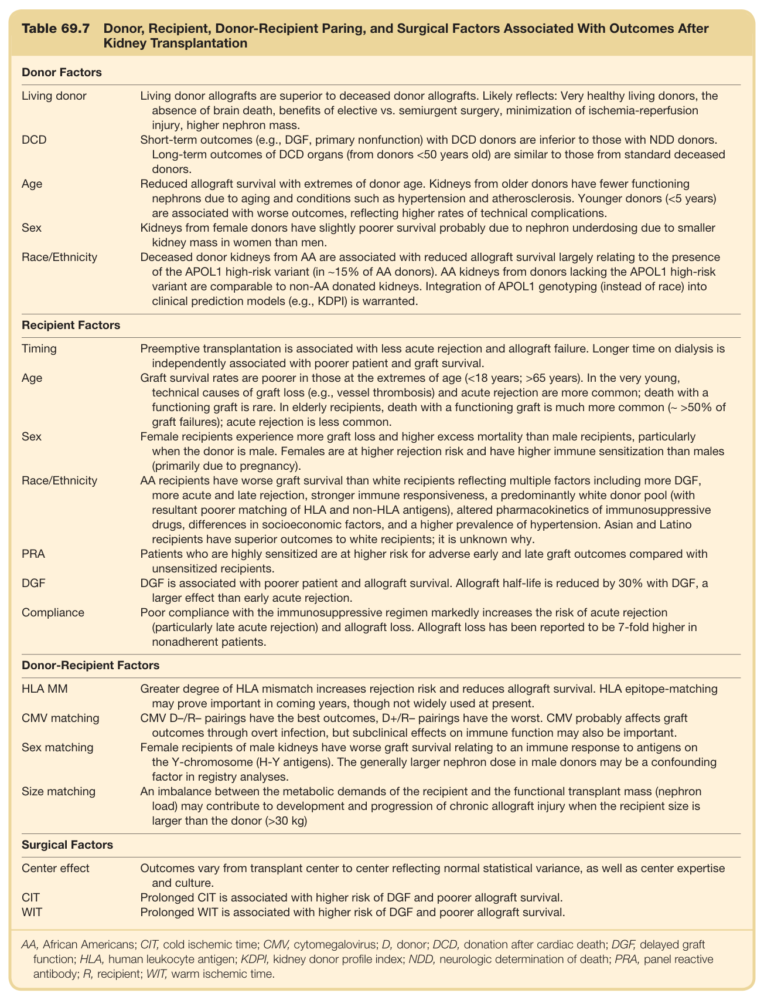

#### Table Data (CSV: [Table_69_7.csv](Table_69_7.csv))

```markdown
| Table Text (OCR) |
| :--- |
| Table 69.7  Donor, Recipient, Donor-Recipient Paring, and Surgical Factors Associated With Outcomes After Kidney Transplantation Donor Factors Living donor  Living donor allografts are superior to deceased donor allografts. Likely reflects: Very healthy living donors, the absence of brain death, benefits of elective vs. semiurgent surgery, minimization of ischemia-reperfusion injury, higher nephron mass.    DCD  Short-term outcomes (e.g., DGF, primary nonfunction) with DCD donors are inferior to those with NDD donors. Long-term outcomes of DCD organs (from donors <50 years old) are similar to those from standard deceased donors.    Age  Reduced allograft survival with extremes of donor age. Kidneys from older donors have fewer functioning nephrons due to aging and conditions such as hypertension and atherosclerosis. Younger donors (<5 years) are associated with worse outcomes, reflecting higher rates of technical complications.    Sex  Kidneys from female donors have slightly poorer survival probably due to nephron underdosing due to smaller kidney mass in women than men.    Race/Ethnicity  Deceased donor kidneys from AA are associated with reduced allograft survival largely relating to the presence of the APOL1 high-risk variant (in ~15% of AA donors). AA kidneys from donors lacking the APOL1 high-risk variant are comparable to non-AA donated kidneys. Integration of APOL1 genotyping (instead of race) into clinical prediction models (e.g., KDPI) is warranted. |
```

Table 69.7 Donor, Recipient, Donor-Recipient Paring, and Surgical Factors Associated With Outcomes After Kidney Transplantation

---

### Table_69_8

#### Table Image

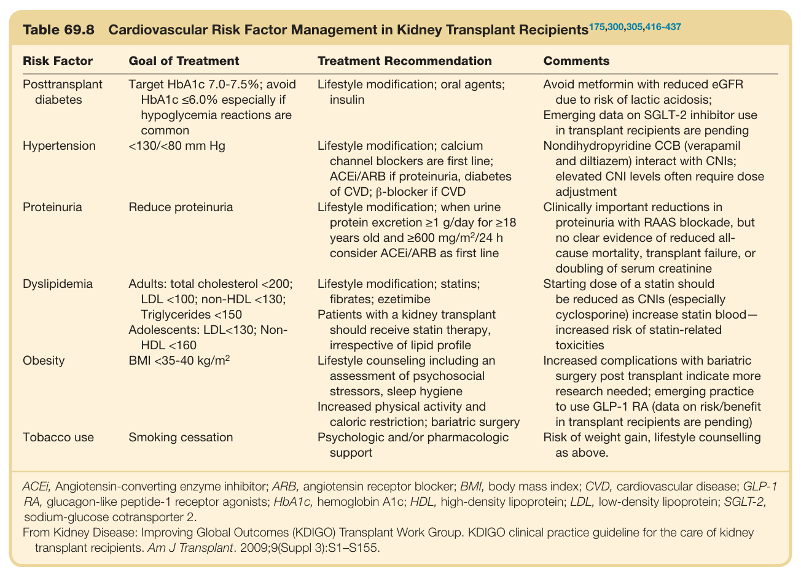

#### Table Data (CSV: [Table_69_8.csv](Table_69_8.csv))

```markdown
| Table Text (OCR) |
| :--- |
| Table 69.8 Cardiovascular Risk Factor Management in Kidney Transplant Recipients<sup>175,300,305,416-437</sup> Risk Factor  Goal of Treatment  Treatment Recommendation  Comments    Posttransplant diabetes  Target HbA1c 7.0-7.5%; avoid HbA1c ≤6.0% especially if hypoglycemia reactions are common  Lifestyle modification; oral agents; insulin  Avoid metformin with reduced eGFR due to risk of lactic acidosis;Emerging data on SGLT-2 inhibitor use in transplant recipients are pending    Hypertension  <130/<80 mm Hg  Lifestyle modification; calcium channel blockers are first line; ACEi/ARB if proteinuria, diabetes of CVD; β-blocker if CVD  Nondihydropyridine CCB (verapamil and diltiazem) interact with CNIs; elevated CNI levels often require dose adjustment    Proteinuria  Reduce proteinuria  Lifestyle modification; when urine protein excretion ≥1 g/day for ≥18 years old and ≥600 mg/m2/24 h consider ACEi/ARB as first line  Clinically important reductions in proteinuria with RAAS blockade, but no clear evidence of reduced all-cause mortality, transplant failure, or doubling of serum creatinine    Dyslipidemia  Adults: total cholesterol <200; LDL <100; non-HDL <130; Triglycerides <150Adolescents: LDL<130; Non-HDL <160  Lifestyle modification; statins; fibrates; ezetimibePatients with a kidney transplant should receive statin therapy, irrespective of lipid profile  Starting dose of a statin should be reduced as CNIs (especially cyclosporine) increase statin blood-increased risk of statin-related toxicities    Obesity  BMI <35-40 kg/m2  Lifestyle counseling including an assessment of psychosocial stressors, sleep hygieneIncreased physical activity and caloric restriction; bariatric surgery  Increased complications with bariatric surgery post transplant indicate more research needed; emerging practice to use GLP-1 RA (data on risk/benefit in transplant recipients are pending)    Tobacco use  Smoking cessation  Psychologic and/or pharmacologic support  Risk of weight gain, lifestyle counselling as above. ACEi, Angiotensin-converting enzyme inhibitor; ARB, angiotensin receptor blocker; BMI, body mass index; CVD, cardiovascular disease; GLP-1 RA, glucagon-like peptide-1 receptor agonists; HbA1c, hemoglobin A1c; HDL, high-density lipoprotein; LDL, low-density lipoprotein; SGLT-2, sodium-glucose cotransporter 2. From Kidney Disease: Improving Global Outcomes (KDIGO) Transplant Work Group. KDIGO clinical practice guideline for the care of kidney transplant recipients. Am J Transplant. 2009;9(Suppl 3):S1–S155. |
```

Table 69.8 Cardiovascular Risk Factor Management in Kidney Transplant Recipients<sup>175,300,305,416-437</sup>

---

### Table_69_9

#### Table Image

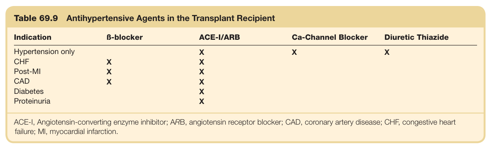

#### Table Data (CSV: [Table_69_9.csv](Table_69_9.csv))

```markdown
| Table Text (OCR) |
| :--- |
| Table 69.9  Antihypertensive Agents in the Transplant Recipient Indication  β-blocker  ACE-I/ARB  Ca-Channel Blocker  Diuretic Thiazide    Hypertension only    X  X  X    CHF  X  X        Post-MI  X  X        CAD  X  X        Diabetes    X        Proteinuria    X ACE-I, Angiotensin-converting enzyme inhibitor; ARB, angiotensin receptor blocker; CAD, coronary artery disease; CHF, congestive heart failure; Ml, myocardial infarction. |
```

Table 69.9 Antihypertensive Agents in the Transplant Recipient

---

### Table_69_10

#### Table Image

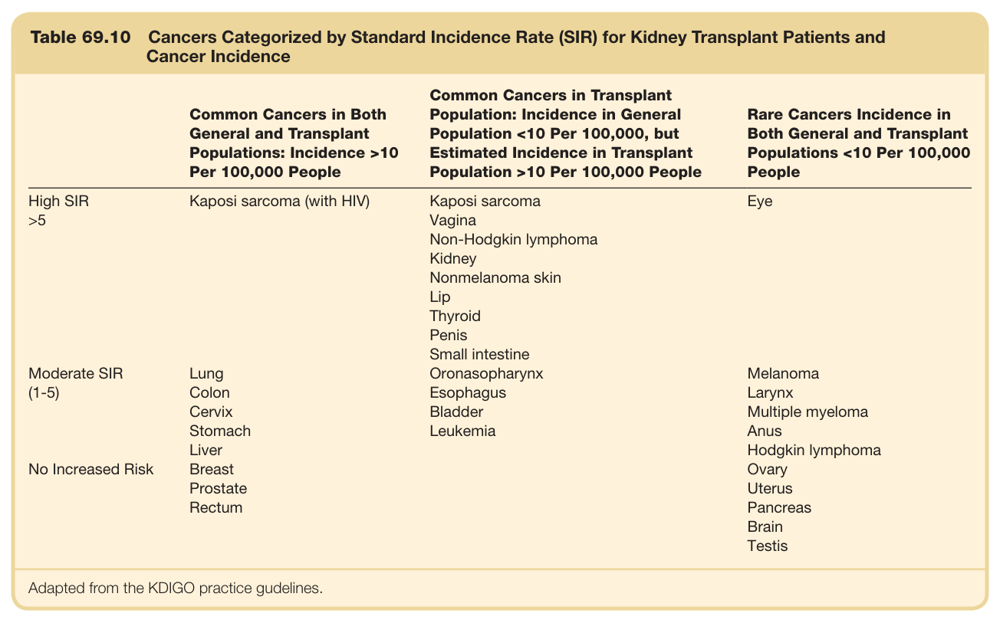

#### Table Data (CSV: [Table_69_10.csv](Table_69_10.csv))

```markdown
| Table Text (OCR) |
| :--- |
| Table 69.10 Cancers Categorized by Standard Incidence Rate (SIR) for Kidney Transplant Patients and Cancer Incidence Common Cancers in Both General and Transplant Populations: Incidence >10 Per 100,000 People  Common Cancers in Transplant Population: Incidence in General Population <10 Per 100,000, but Estimated Incidence in Transplant Population >10 Per 100,000 People  Rare Cancers Incidence in Both General and Transplant Populations <10 Per 100,000 People    High SIR >5  Kaposi sarcoma (with HIV)  Kaposi sarcomaVaginaNon-Hodgkin lymphomaKidneyNonmelanoma skinLipThyroidPenisSmall intestine  Eye    Moderate SIR (1-5)  LungColonCervixStomachLiver  OronasopharynxEsophagusBladderLeukemia  MelanomaLarynxMultiple myelomaAnusHodgkin lymphoma    No Increased Risk  BreastProstateRectum    OvaryUterusPancreasBrainTestis Adapted from the KDIGO practice gudelines. |
```

Table 69.10 Cancers Categorized by Standard Incidence Rate (SIR) for Kidney Transplant Patients and Cancer Incidence

---

### Table_69_11

#### Table Image

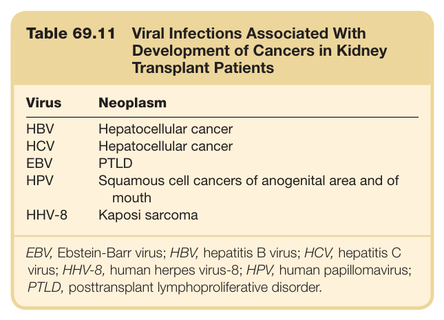

#### Table Data (CSV: [Table_69_11.csv](Table_69_11.csv))

```markdown
| Table Text (OCR) |
| :--- |
| Table 69.11  Viral Infections Associated With Development of Cancers in Kidney Transplant Patients Virus  Neoplasm    HBV  Hepatocellular cancer    HCV  Hepatocellular cancer    EBV  PTLD    HPV  Squamous cell cancers of anogenital area and of mouth    HHV-8  Kaposi sarcoma    EBV, Ebstein-Barr virus; HBV, hepatitis B virus; HCV, hepatitis C virus; HHV-8, human herpes virus-8; HPV, human papillomavirus; PTLD, posttransplant lymphoproliferative disorder. |
```

Table 69.11 Viral Infections Associated With Development of Cancers in Kidney Transplant Patients

---

### Table_69_12

#### Table Image

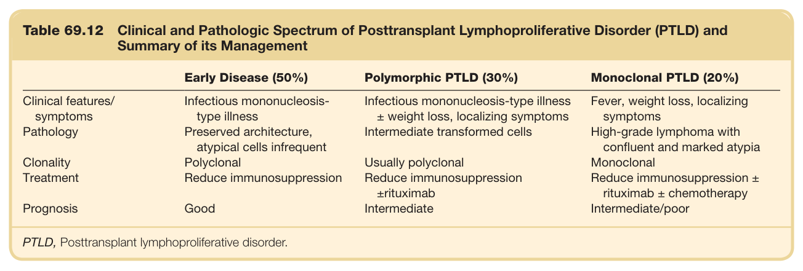

#### Table Data (CSV: [Table_69_12.csv](Table_69_12.csv))

```markdown
| Table Text (OCR) |
| :--- |
| Table 69.12  Clinical and Pathologic Spectrum of Posttransplant Lymphoproliferative Disorder (PTLD) and Summary of its Management Early Disease (50%)  Polymorphic PTLD (30%)  Monoclonal PTLD (20%)    Clinical features/symptoms  Infectious mononucleosis-type illness  Infectious mononucleosis-type illness ± weight loss, localizing symptoms  Fever, weight loss, localizing symptoms    Pathology  Preserved architecture, atypical cells infrequent  Intermediate transformed cells  High-grade lymphoma with confluent and marked atypia    Clonality  Polyclonal  Usually polyclonal  Monoclonal    Treatment  Reduce immunosuppression  Reduce immunosuppression ±rituximab  Reduce immunosuppression ± rituximab ± chemotherapy    Prognosis  Good  Intermediate  Intermediate/poor PTLD, Posttransplant lymphoproliferative disorder. |
```

Table 69.12 Clinical and Pathologic Spectrum of Posttransplant Lymphoproliferative Disorder (PTLD) and Summary of its Management

---

### Table_69_13

#### Table Image

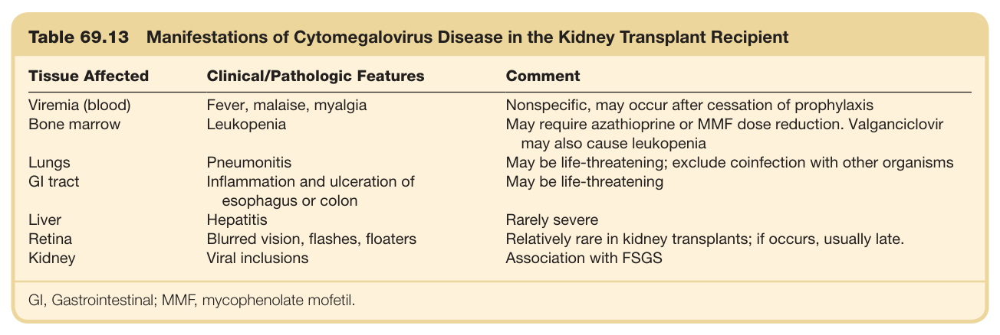

#### Table Data (CSV: [Table_69_13.csv](Table_69_13.csv))

```markdown
| Table Text (OCR) |
| :--- |
| Table 69.13  Manifestations of Cytomegalovirus Disease in the Kidney Transplant Recipient Tissue Affected  Clinical/Pathologic Features  Comment    Viremia (blood)  Fever, malaise, myalgia  Nonspecific, may occur after cessation of prophylaxis    Bone marrow  Leukopenia  May require azathioprine or MMF dose reduction. Valganciclovir may also cause leukopenia    Lungs  Pneumonitis  May be life-threatening; exclude coinfection with other organisms    GI tract  Inflammation and ulceration of esophagus or colon  May be life-threatening    Liver  Hepatitis  Rarely severe    Retina  Blurred vision, flashes, floaters  Relatively rare in kidney transplants; if occurs, usually late.    Kidney  Viral inclusions  Association with FSGS GI, Gastrointestinal; MMF, mycophenolate mofetil. |
```

Table 69.13 Manifestations of Cytomegalovirus Disease in the Kidney Transplant Recipient

---

### Table_69_14

#### Table Image

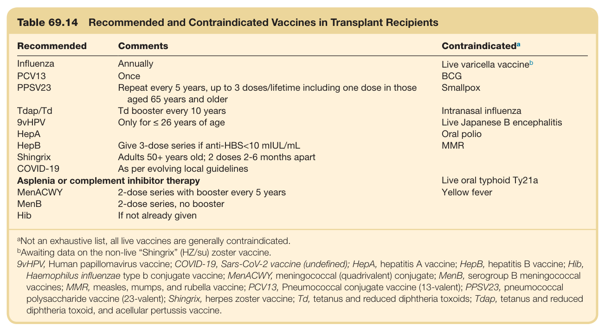

#### Table Data (CSV: [Table_69_14.csv](Table_69_14.csv))

```markdown
| Table Text (OCR) |
| :--- |
| Table 69.14  Recommended and Contraindicated Vaccines in Transplant Recipients Recommended  Comments  Contraindicated ^{a}     Influenza  Annually  Live varicella vaccine ^{b}     PCV13  Once  BCG    PPSV23  Repeat every 5 years, up to 3 doses/lifetime including one dose in those aged 65 years and older  Smallpox    Tdap/Td  Td booster every 10 years  Intranasal influenza    9vHPV  Only for ≤ 26 years of age  Live Japanese B encephalitis    HepA    Oral polio    HepB  Give 3-dose series if anti-HBS<10 mIUL/mL  MMR    Shingrix  Adults 50+ years old; 2 doses 2-6 months apart      COVID-19  As per evolving local guidelines      Asplenia or complement inhibitor therapy  Live oral typhoid Ty21a    MenACWY  2-dose series with booster every 5 years  Yellow fever    MenB  2-dose series, no booster      Hib  If not already given <sup>a</sup>Not an exhaustive list, all live vaccines are generally contraindicated. <sup>b</sup>Awaiting data on the non-live “Shingrix” (HZ/su) zoster vaccine. 9vHPV, Human papillomavirus vaccine; COVID-19, Sars-CoV-2 vaccine (undefined); HepA, hepatitis A vaccine; HepB, hepatitis B vaccine; Hib, Haemophilus influenzae type b conjugate vaccine; MenACWY, meningococcal (quadrivalent) conjugate; MenB, serogroup B meningococcal vaccines; MMR, measles, mumps, and rubella vaccine; PCV13, Pneumococcal conjugate vaccine (13-valent); PPSV23, pneumococca polysaccharide vaccine (23-valent); Shingrix, herpes zoster vaccine; Td, tetanus and reduced diphtheria toxoids; Tdap, tetanus and reduced diphtheria toxoid, and acellular pertussis vaccine. |
```

Table 69.14 Recommended and Contraindicated Vaccines in Transplant Recipients

---

### Table_e69_1

#### Table Image

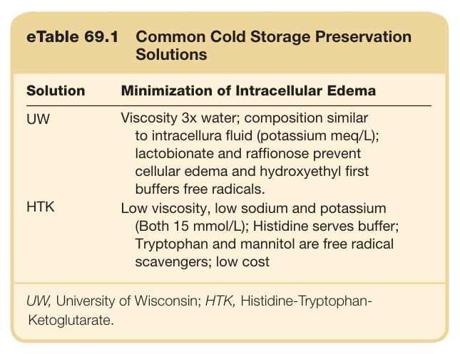

#### Table Data (CSV: [Table_e69_1.csv](Table_e69_1.csv))

```markdown
| Table Text (OCR) |
| :--- |
| eTable 69.1  Common Cold Storage Preservation Solutions Solution  Minimization of Intracellular Edema    UW  Viscosity 3x water; composition similar to intracellura fluid (potassium meq/L); lactobionate and raffionose prevent cellular edema and hydroxyethyl first buffers free radicals.    HTK  Low viscosity, low sodium and potassium (Both 15 mmol/L); Histidine serves buffer; Tryptophan and mannitol are free radical scavengers; low cost    UW, University of Wisconsin; HTK, Histidine-Tryptophan-Ketoglutarate. |
```

Table e69.1 Common Cold Storage Preservation Solutions

---

### Table_e69_2

#### Table Image

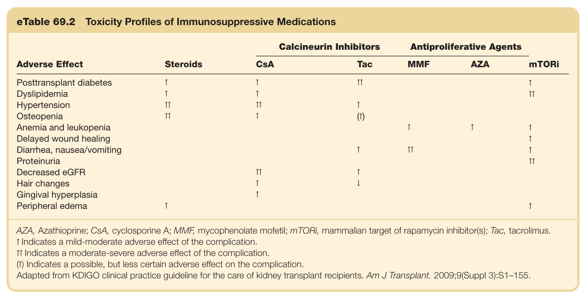

#### Table Data (CSV: [Table_e69_2.csv](Table_e69_2.csv))

```markdown
| Table Text (OCR) |
| :--- |
| eTable 69.2  Toxicity Profiles of Immunosuppressive Medications Adverse Effect  Steroids  Calcineurin Inhibitors  Antiproliferative Agents    CsA  Tac  MMF  AZA  mTORi    Posttransplant diabetes  ↑  ↑  ↑↑      ↑    Dyslipidemia  ↑  ↑        ↑↑    Hypertension  ↑↑  ↑↑  ↑          Osteopenia  ↑↑  ↑  (1)          Anemia and leukopenia        ↑  ↑  ↑    Delayed wound healing            ↑    Diarrhea, nausea/vomiting      ↑  ↑↑    ↑    Proteinuria            ↑↑    Decreased eGFR    ↑↑  ↑          Hair changes    ↑  ↓          Gingival hyperplasia    ↑            Peripheral edema  ↑          ↑ AZA, Azathioprine; CsA, cyclosporine A; MMF, mycophenolate mofetil; mTORi, mammalian target of rapamycin inhibitor(s); Tac, tacrolimus. ↑ Indicates a mild-moderate adverse effect of the complication. ↑↑ Indicates a moderate-severe adverse effect of the complication. (↑) Indicates a possible, but less certain adverse effect on the complication. Adapted from KDIGO clinical practice guideline for the care of kidney transplant recipients. Am J Transplant. 2009;9(Suppl 3):S1–155. |
```

Table e69.2 Toxicity Profiles of Immunosuppressive Medications

---

### Table_e69_3

#### Table Image

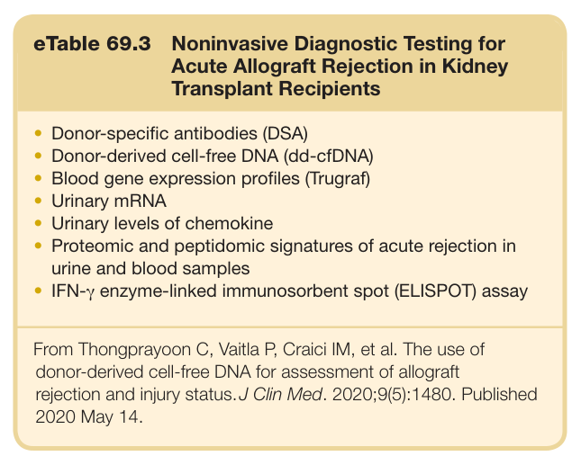

#### Table Data (CSV: [Table_e69_3.csv](Table_e69_3.csv))

```markdown
| Table Text (OCR) |
| :--- |
| eTable 69.3  Noninvasive Diagnostic Testing for Acute Allograft Rejection in Kidney Transplant Recipients •	 Donor-specific antibodies (DSA) •	 Donor-derived cell-free DNA (dd-cfDNA) •	 Blood gene expression profiles (Trugraf) •	 Urinary mRNA •	 Urinary levels of chemokine Proteomic and peptidomic signatures of acute rejection in urine and blood samples •	 IFN-γ enzyme-linked immunosorbent spot (ELISPOT) assay From Thongprayoon C, Vaitla P, Craici IM, et al. The use of donor-derived cell-free DNA for assessment of allograft rejection and injury status.J Clin Med. 2020;9(5):1480. Published 2020 May 14. |
```

Table e69.3 Noninvasive Diagnostic Testing for Acute Allograft Rejection in Kidney Transplant Recipients

---

### Table_e69_4

#### Table Image

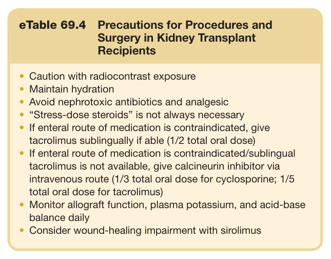

#### Table Data (CSV: [Table_e69_4.csv](Table_e69_4.csv))

```markdown
| Table Text (OCR) |
| :--- |
| eTable 69.4  Precautions for Procedures and Surgery in Kidney Transplant Recipients •	 Caution with radiocontrast exposure •	 Maintain hydration •	 Avoid nephrotoxic antibiotics and analgesic •	 “Stress-dose steroids” is not always necessary •	 If enteral route of medication is contraindicated, give tacrolimus sublingually if able (1/2 total oral dose) If enteral route of medication is contraindicated/sublingual tacrolimus is not available, give calcineurin inhibitor via intravenous route (1/3 total oral dose for cyclosporine; 1/5 total oral dose for tacrolimus) •	 Monitor allograft function, plasma potassium, and acid-base balance daily •	 Consider wound-healing impairment with sirolimus |
```

Table e69.4 Precautions for Procedures and Surgery in Kidney Transplant Recipients

---
