# 70. Considerations in Living Kidney Donation - Figures and Tables Index

This document lists all figures and tables extracted from `70. Considerations in Living Kidney Donation.pdf`.

## Table of Contents
- [Figures](#figures)
- [Tables](#tables)

---

## Figures

### Fig_70_1

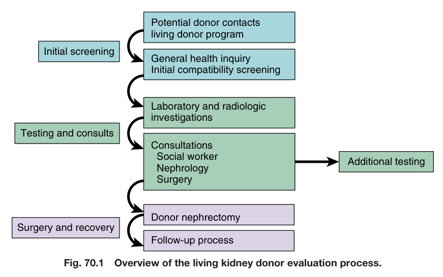

Fig. 70.1 Overview of the living kidney donor evaluation process.

---

### Fig_70_2

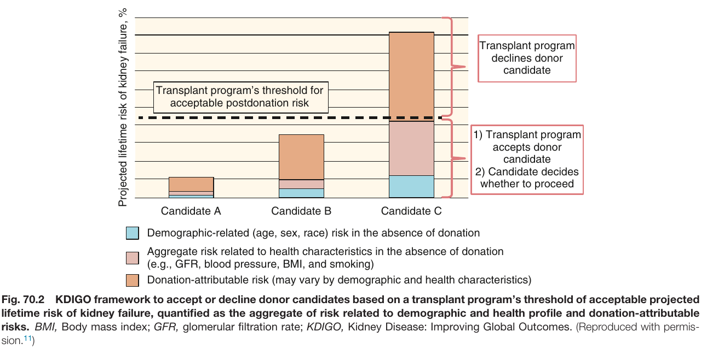

Fig. 70.2 KDIGO framework to accept or decline donor candidates based on a transplant program’s threshold of acceptable projected lifetime risk of kidney failure, quantified as the aggregate of risk related to demographic and health profile and donation-attributable risks. BMI, Body mass index; GFR, glomerular filtration rate; KDIGO, Kidney Disease: Improving Global Outcomes. (Reproduced with permis- sion.<sup>11</sup>)

---

### Fig_70_3

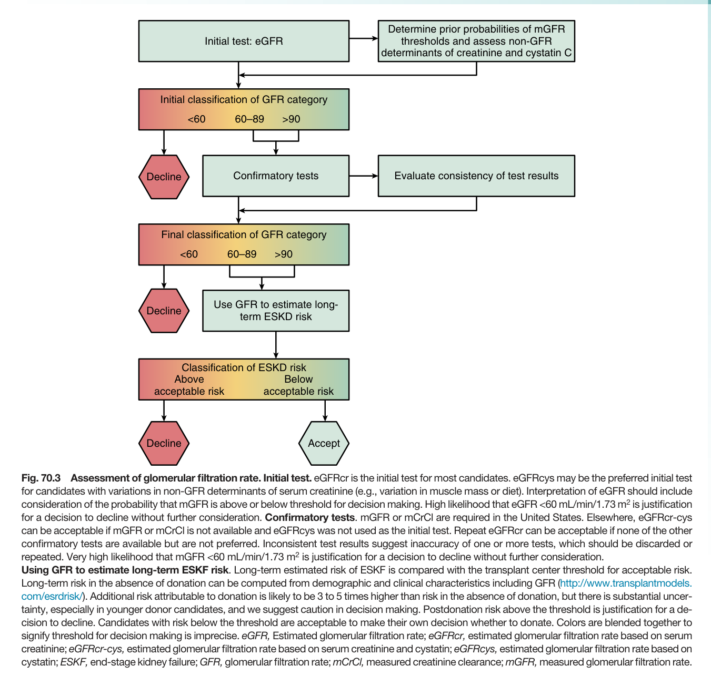

Fig. 70.3 Assessment of glomerular filtration rate. Initial test. eGFRcr is the initial test for most candidates. eGFRcys may be the preferred initial test for candidates with variations in non-GFR determinants of serum creatinine (e.g., variation in muscle mass or diet). Interpretation of eGFR should include consideration of the probability that mGFR is above or below threshold for decision making. High likelihood that eGFR <60 mL/min/1.73 m<sup>2</sup> is justification for a decision to decline without further consideration. Confirmatory tests. mGFR or mCrCl are required in the United States. Elsewhere, eGFRcr-cys can be acceptable if mGFR or mCrCl is not available and eGFRcys was not used as the initial test. Repeat eGFRcr can be acceptable if none of the other confirmatory tests are available but are not preferred. Inconsistent test results suggest inaccuracy of one or more tests, which should be discarded or repeated. Very high likelihood that mGFR <60 mL/min/1.73 m<sup>2</sup> is justification for a decision to decline without further consideration.

---

### Fig_70_4

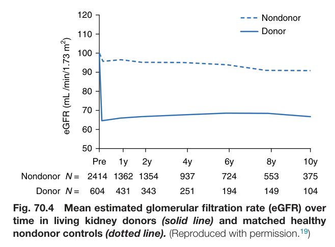

Fig. 70.4 Mean estimated glomerular filtration rate (eGFR) over time in living kidney donors (solid line) and matched healthy nondonor controls (dotted line). (Reproduced with permission.<sup>19</sup>)

---

### Fig_70_5

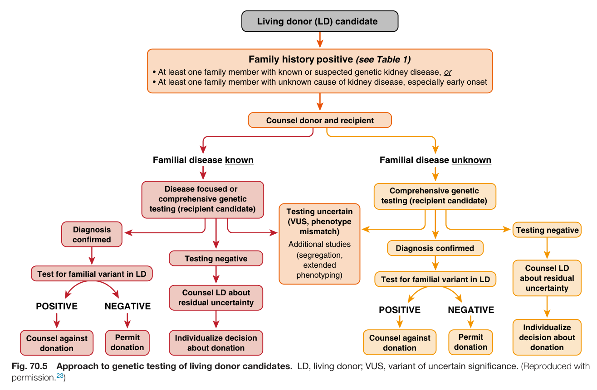

Fig. 70.5 Approach to genetic testing of living donor candidates. LD, living donor; VUS, variant of uncertain significance. (Reproduced with permission.<sup>23</sup>)

---

### Fig_70_6

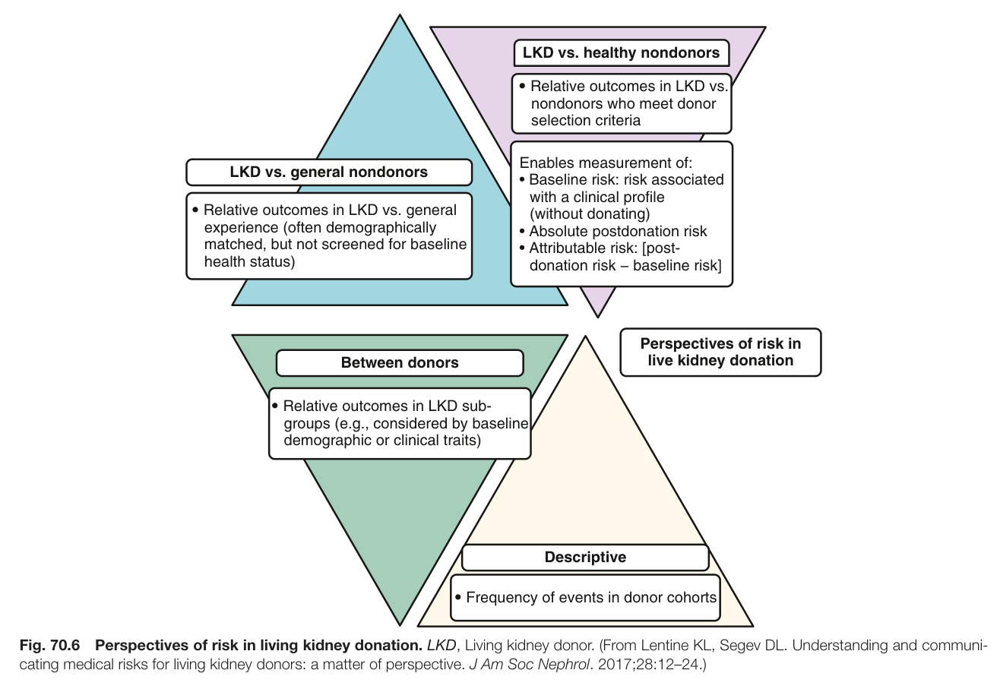

Fig. 70.6 Perspectives of risk in living kidney donation. LKD, Living kidney donor. (From Lentine KL, Segev DL. Understanding and communi cating medical risks for living kidney donors: a matter of perspective. J Am Soc Nephrol. 2017;28:12–24.)

---

## Tables

### Table_70_1

#### Table Image

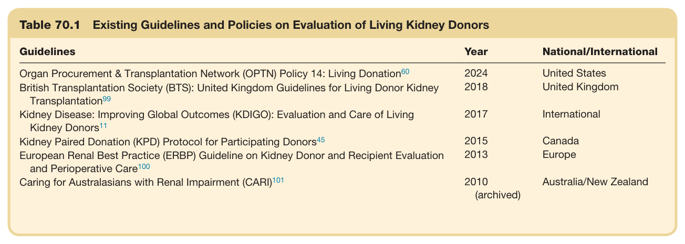

#### Table Data (CSV: [Table_70_1.csv](Table_70_1.csv))

```markdown
| Table Text (OCR) |
| :--- |
| Table 70.1 Existing Guidelines and Policies on Evaluation of Living Kidney Donors Guidelines  Year  National/International    Organ Procurement & Transplantation Network (OPTN) Policy 14: Living  Donation^{60}   2024  United States    British Transplantation Society (BTS): United Kingdom Guidelines for Living Donor Kidney  Transplantation^{99}   2018  United Kingdom    Kidney Disease: Improving Global Outcomes (KDIGO): Evaluation and Care of Living Kidney  Donors^{11}   2017  International    Kidney Paired Donation (KPD) Protocol for Participating  Donors^{45}   2015  Canada    European Renal Best Practice (ERBP) Guideline on Kidney Donor and Recipient Evaluation and Perioperative  Care^{100}   2013  Europe    Caring for Australasians with Renal Impairment (CARI) ^{101}   2010(archived)  Australia/New Zealand |
```

Table 70.1 Existing Guidelines and Policies on Evaluation of Living Kidney Donors

---

### Table_70_2

#### Table Images (3 Parts)

- **Part 1 (Page 4)**:
  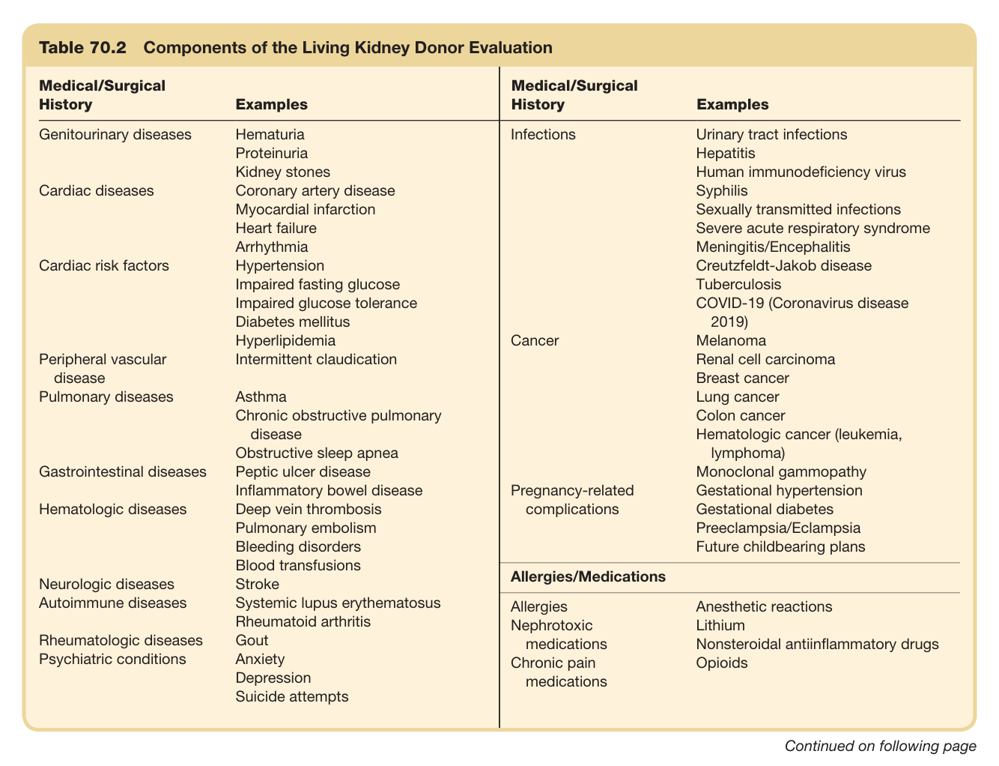

- **Part 2 (Page 5)**:
  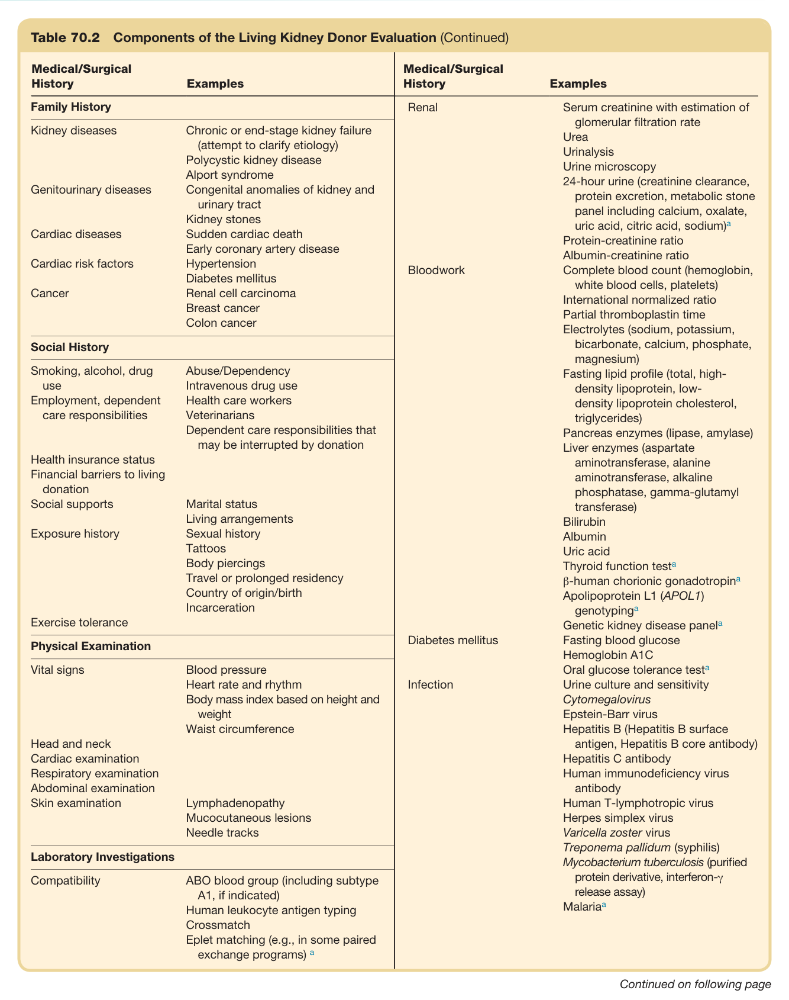

- **Part 3 (Page 6)**:
  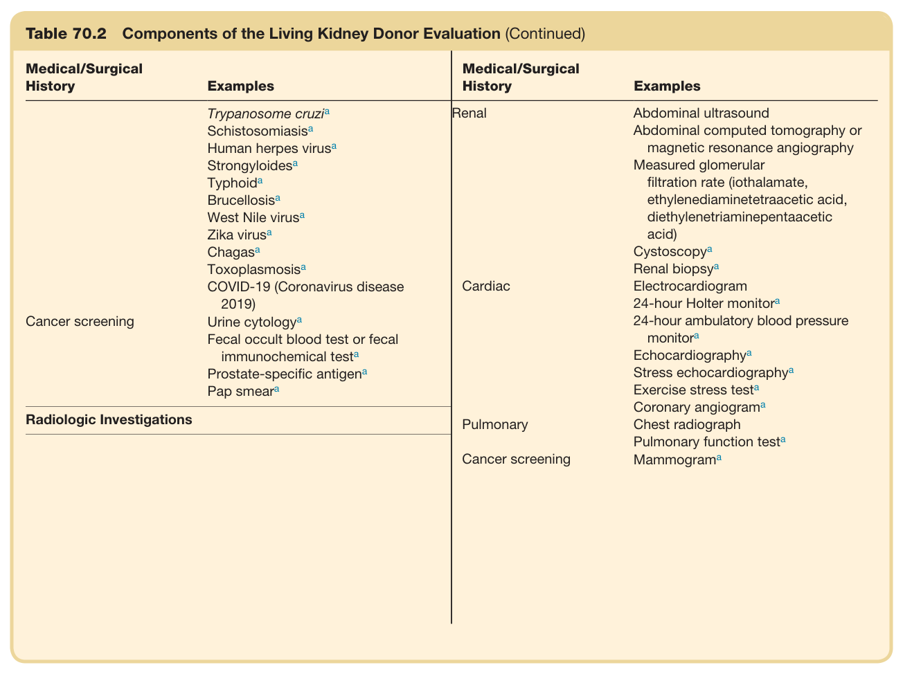

#### Table Data (CSV: [Table_70_2.csv](Table_70_2.csv))

```markdown
| Table Text (OCR) |
| :--- |
| Fig. 70.2 KDIGO framework to accept or decline donor candidates based on a transplant program’s threshold of acceptable projected lifetime risk of kidney failure, quantified as the aggregate of risk related to demographic and health profile and donation-attributable risks. BMI, Body mass index; GFR, glomerular filtration rate; KDIGO, Kidney Disease: Improving Global Outcomes. (Reproduced with permis- sion.<sup>11</sup>) Table 70.2  Components of the Living Kidney Donor Evaluation Medical/Surgical History  Examples  Medical/Surgical History  Examples    Genitourinary diseases  Hematuria  Infections  Urinary tract infections    Proteinuria  Hepatitis    Kidney stones  Human immunodeficiency virus    Cardiac diseases  Coronary artery disease  Syphilis    Myocardial infarction  Sexually transmitted infections    Heart failure  Severe acute respiratory syndrome    Arrhythmia  Meningitis/Encephalitis    Cardiac risk factors  Hypertension  Creutzfeldt-Jakob disease    Impaired fasting glucose  Tuberculosis    Impaired glucose tolerance  COVID-19 (Coronavirus disease 2019)    Diabetes mellitus    Hyperlipidemia  Cancer  Melanoma    Peripheral vascular disease  Intermittent claudication  Renal cell carcinoma    Breast cancer    Pulmonary diseases  Asthma  Lung cancer    Chronic obstructive pulmonary disease  Colon cancer    Obstructive sleep apnea  Hematologic cancer (leukemia, lymphoma)    Gastrointestinal diseases  Peptic ulcer disease  Monoclonal gammopathy    Inflammatory bowel disease  Pregnancy-related complications  Gestational hypertension    Hematologic diseases  Deep vein thrombosis  Gestational diabetes    Pulmonary embolism  Preeclampsia/Eclampsia    Bleeding disorders  Future childbearing plans    Blood transfusions    Neurologic diseases  Stroke  Allergies/Medications    Autoimmune diseases  Systemic lupus erythematosus  Allergies  Anesthetic reactions    Rheumatoid arthritis  Nephrotoxic medications  Lithium    Rheumatologic diseases  Gout  Nonsteroidal antiinflammatory drugs    Psychiatric conditions  Anxiety  Chronic pain medications  Opioids    Depression    Suicide attempts |
```

Table 70.2 Components of the Living Kidney Donor Evaluation (Continued)

---

### Table_70_3

#### Table Image

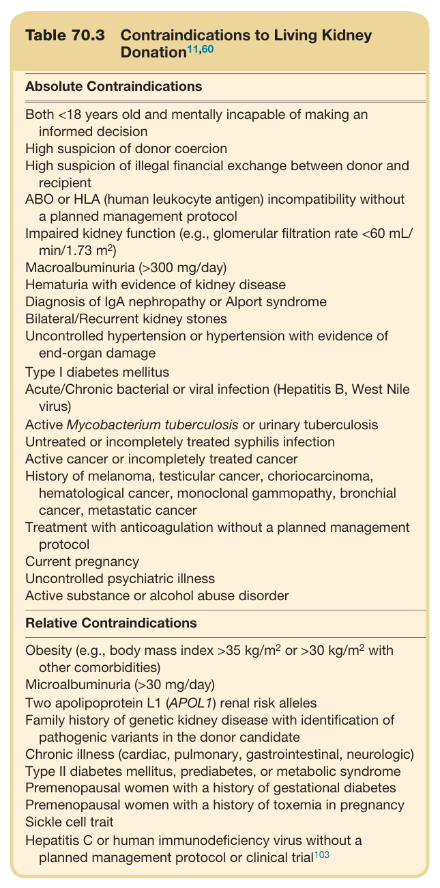

#### Table Data (CSV: [Table_70_3.csv](Table_70_3.csv))

```markdown
| Table Text (OCR) |
| :--- |
| Table 70.3  Contraindications to Living Kidney Donation<sup>11,60</sup> Absolute Contraindications Both <18 years old and mentally incapable of making an informed decision    High suspicion of donor coercion    High suspicion of illegal financial exchange between donor and recipient    ABO or HLA (human leukocyte antigen) incompatibility without a planned management protocol    Impaired kidney function (e.g., glomerular filtration rate <60 mL/min/1.73 m2)    Macroalbuminuria (>300 mg/day)    Hematuria with evidence of kidney disease    Diagnosis of IgA nephropathy or Alport syndrome    Bilateral/Recurrent kidney stones    Uncontrolled hypertension or hypertension with evidence of end-organ damage    Type I diabetes mellitus    Acute/Chronic bacterial or viral infection (Hepatitis B, West Nile virus)    Active Mycobacterium tuberculosis or urinary tuberculosis    Untreated or incompletely treated syphilis infection    Active cancer or incompletely treated cancer    History of melanoma, testicular cancer, choriocarcinoma, hematological cancer, monoclonal gammopathy, bronchial cancer, metastatic cancer    Treatment with anticoagulation without a planned management protocol    Current pregnancy    Uncontrolled psychiatric illness    Active substance or alcohol abuse disorder |
```

Table 70.3 Contraindications to Living Kidney Donation<sup>11,60</sup>

---

### Table_70_4

#### Table Images (2 Parts)

- **Part 1 (Page 13)**:
  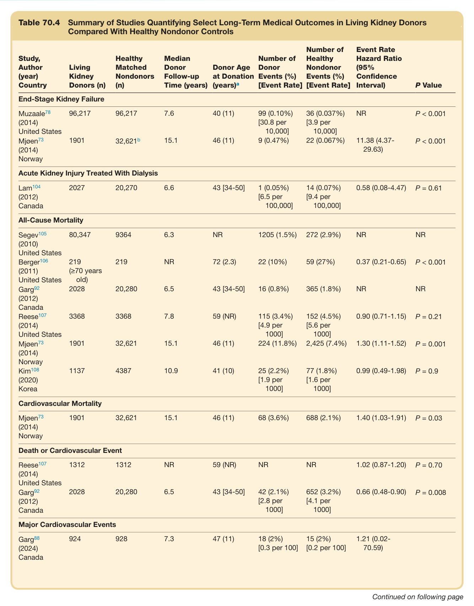

- **Part 2 (Page 14)**:
  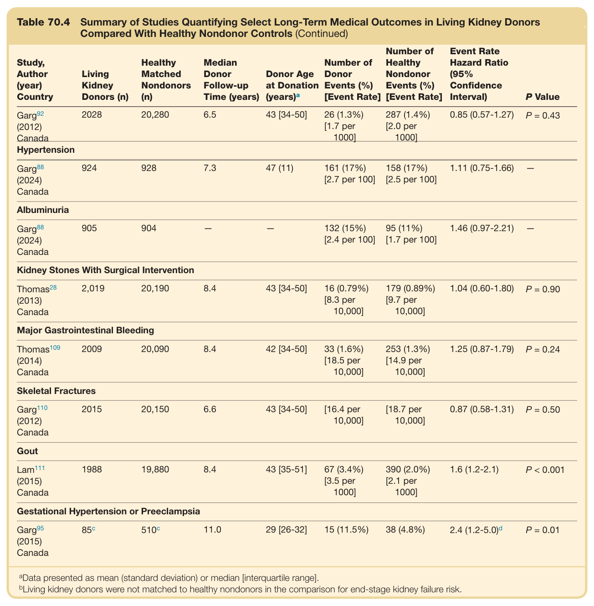

#### Table Data (CSV: [Table_70_4.csv](Table_70_4.csv))

```markdown
| Table Text (OCR) |
| :--- |
| Table 70.4  Summary of Studies Quantifying Select Long-Term Medical Outcomes in Living Kidney Donors Compared With Healthy Nondonor Controls Study, Author (year) Country  Living Kidney Donors (n)  Healthy Matched Nondonors (n)  Median Donor Follow-up Time (years)  Donor Age at Donation (years) ^a   Number of Donor Events (%) [Event Rate]  Number of Healthy Nondonor Events (%) [Event Rate]  Event Rate Hazard Ratio (95% Confidence Interval)  P Value    End-Stage Kidney Failure     Muzaale^{78} (2014)  96,217  96,217  7.6  40 (11)  99 (0.10%) [30.8 per 10,000]  36 (0.037%) [3.9 per 10,000]  NR  P < 0.001    United States Mjøen^{73} (2014)Norway  1901   32,621^b   15.1  46 (11)  9 (0.47%)  22 (0.067%)  11.38 (4.37-29.63)  P < 0.001    Acute Kidney Injury Treated With Dialysis     Lam^{104} (2012)Canada  2027  20,270  6.6  43 [34-50]  1 (0.05%) [6.5 per 100,000]  14 (0.07%) [9.4 per 100,000]  0.58 (0.08-4.47)  P = 0.61    All-Cause Mortality     Segev^{105} (2010)United States  80,347  9364  6.3  NR  1205 (1.5%)  272 (2.9%)  NR  NR     Berger^{106} (2011)United States  219(≥70 years old)  219  NR  72 (2.3)  22 (10%)  59 (27%)  0.37 (0.21-0.65)  P < 0.001     Garg^{92} (2012)Canada  2028  20,280  6.5  43 [34-50]  16 (0.8%)  365 (1.8%)  NR  NR     Reese^{107} (2014)United States  3368  3368  7.8  59 (NR)  115 (3.4%) [4.9 per 1000]  152 (4.5%) [5.6 per 1000]  0.90 (0.71-1.15)  P = 0.21     Mjøen^{73} (2014)Norway  1901  32,621  15.1  46 (11)  224 (11.8%)  2,425 (7.4%)  1.30 (1.11-1.52)  P = 0.001     Kim^{108} (2020)Korea  1137  4387  10.9  41 (10)  25 (2.2%) [1.9 per 1000]  77 (1.8%) [1.6 per 1000]  0.99 (0.49-1.98)  P = 0.9    Cardiovascular Mortality     Mjøen^{73} (2014)Norway  1901  32,621  15.1  46 (11)  68 (3.6%)  688 (2.1%)  1.40 (1.03-1.91)  P = 0.03    Death or Cardiovascular Event     Reese^{107} (2014)United States  1312  1312  NR  59 (NR)  NR  NR  1.02 (0.87-1.20)  P = 0.70     Garg^{92} (2012)Canada  2028  20,280  6.5  43 [34-50]  42 (2.1%) [2.8 per 1000]  652 (3.2%) [4.1 per 1000]  0.66 (0.48-0.90)  P = 0.008    Major Cardiovascular Events     Garg^{88} (2024)Canada  924  928  7.3  47 (11)  18 (2%) [0.3 per 100]  15 (2%) [0.2 per 100]  1.21 (0.02-70.59) |
```

Table 70.4 Summary of Studies Quantifying Select Long-Term Medical Outcomes in Living Kidney Donors Compared With Healthy Nondonor Controls (Continued)

---
