# 71. Childhood Kidney Disease - Figures and Tables Index

This document lists all figures and tables extracted from `71. Childhood Kidney Disease.pdf`.

## Table of Contents
- [Figures](#figures)
- [Tables](#tables)

---

## Figures

### Fig_71_1

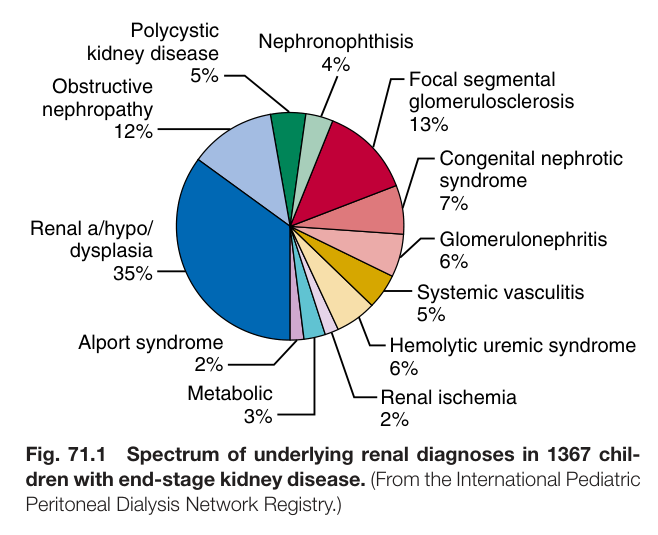

Fig. 71.1 Spectrum of underlying renal diagnoses in 1367 chil- dren with end-stage kidney disease. (From the International Pediatric Peritoneal Dialysis Network Registry.)

---

### Fig_71_2

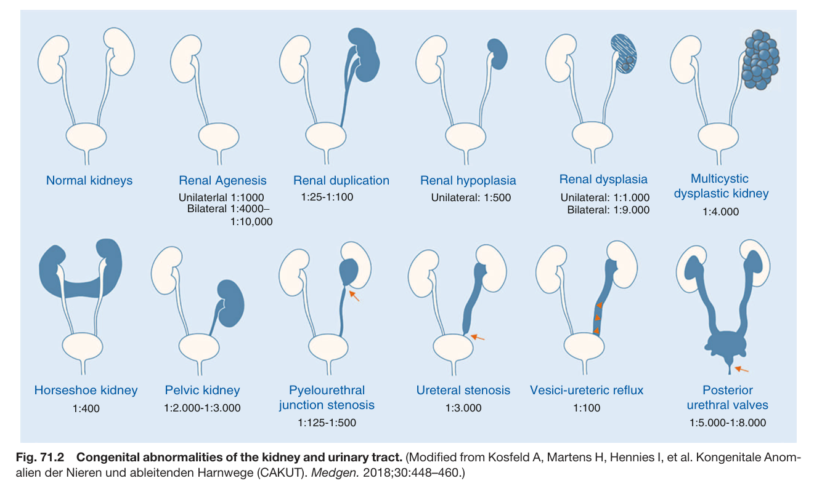

Fig. 71.2 Congenital abnormalities of the kidney and urinary tract. (Modified from Kosfeld A, Martens H, Hennies I, et al. Kongenitale Anom- alien der Nieren und ableitenden Harnwege (CAKUT). Medgen. 2018;30:448–460.)

---

### Fig_71_3

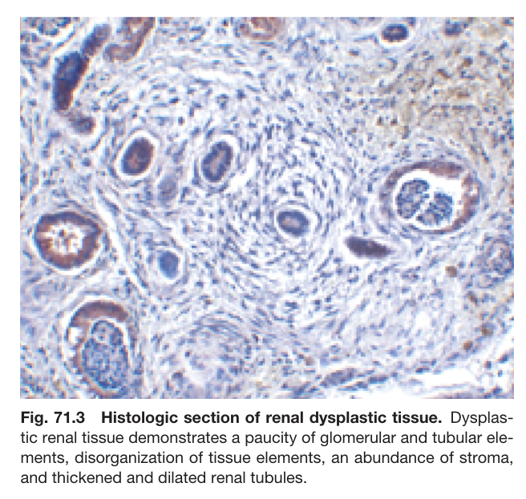

Fig. 71.3 Histologic section of renal dysplastic tissue. Dysplas- tic renal tissue demonstrates a paucity of glomerular and tubular ele- ments, disorganization of tissue elements, an abundance of stroma, and thickened and dilated renal tubules.

---

### Fig_71_4

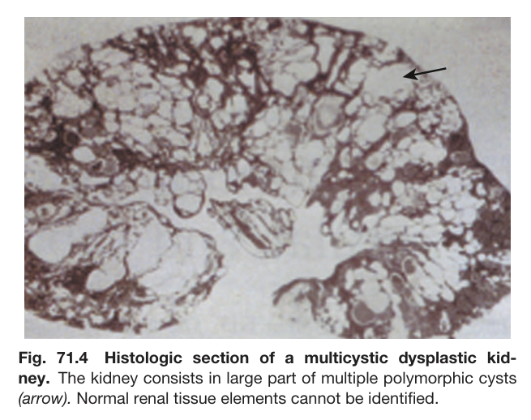

Fig. 71.4 Histologic section of a multicystic dysplastic kid- ney. The kidney consists in large part of multiple polymorphic cysts (arrow). Normal renal tissue elements cannot be identified.

---

### Fig_71_5

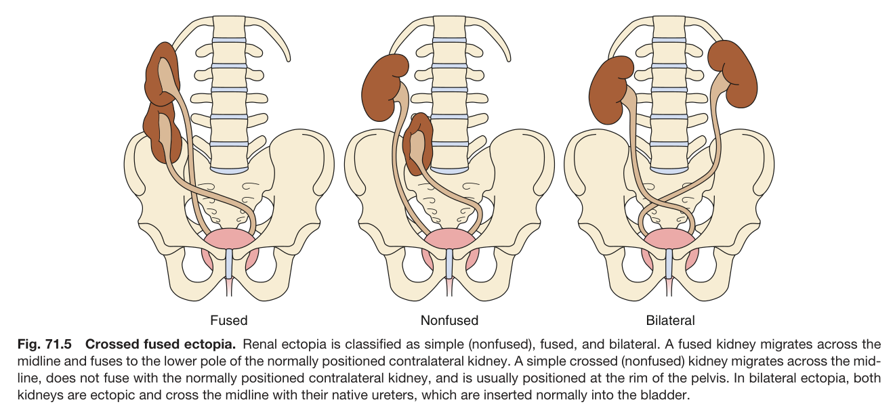

Fig. 71.5 Crossed fused ectopia. Renal ectopia is classified as simple (nonfused), fused, and bilateral. A fused kidney migrates across the midline and fuses to the lower pole of the normally positioned contralateral kidney. A simple crossed (nonfused) kidney migrates across the mid- line, does not fuse with the normally positioned contralateral kidney, and is usually positioned at the rim of the pelvis. In bilateral ectopia, both kidneys are ectopic and cross the midline with their native ureters, which are inserted normally into the bladder.

---

### Fig_71_6

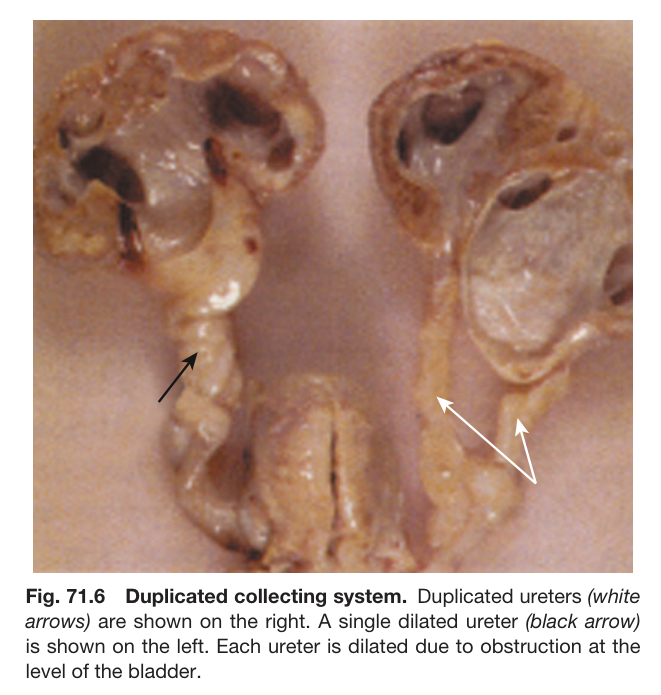

Fig. 71.6 Duplicated collecting system. Duplicated ureters (white arrows) are shown on the right. A single dilated ureter (black arrow) is shown on the left. Each ureter is dilated due to obstruction at the level of the bladder.

---

### Fig_71_7

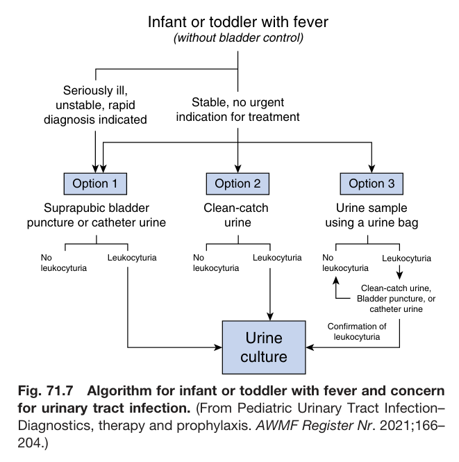

Fig. 71.7 Algorithm for infant or toddler with fever and concern for urinary tract infection. (From Pediatric Urinary Tract Infection– Diagnostics, therapy and prophylaxis. AWMF Register Nr. 2021;166– 204.)

---

### Fig_71_8

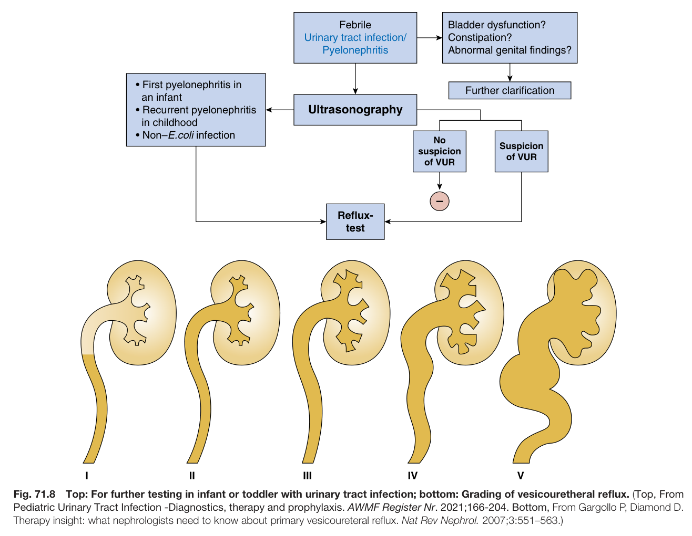

Fig. 71.8 Top: For further testing in infant or toddler with urinary tract infection; bottom: Grading of vesicouretheral reflux. (Top, From Pediatric Urinary Tract Infection -Diagnostics, therapy and prophylaxis. AWMF Register Nr. 2021;166-204. Bottom, From Gargollo P, Diamond D. Therapy insight: what nephrologists need to know about primary vesicoureteral reflux. Nat Rev Nephrol. 2007;3:551–563.)

---

### Fig_71_9

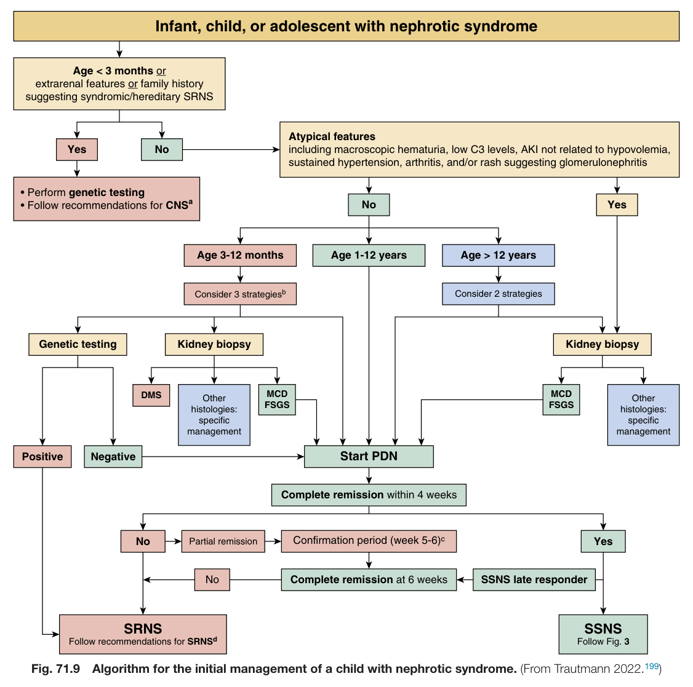

Fig. 71.9 Algorithm for the initial management of a child with nephrotic syndrome. (From Trautmann 2022.<sup>199</sup>)

---

### Fig_71_10

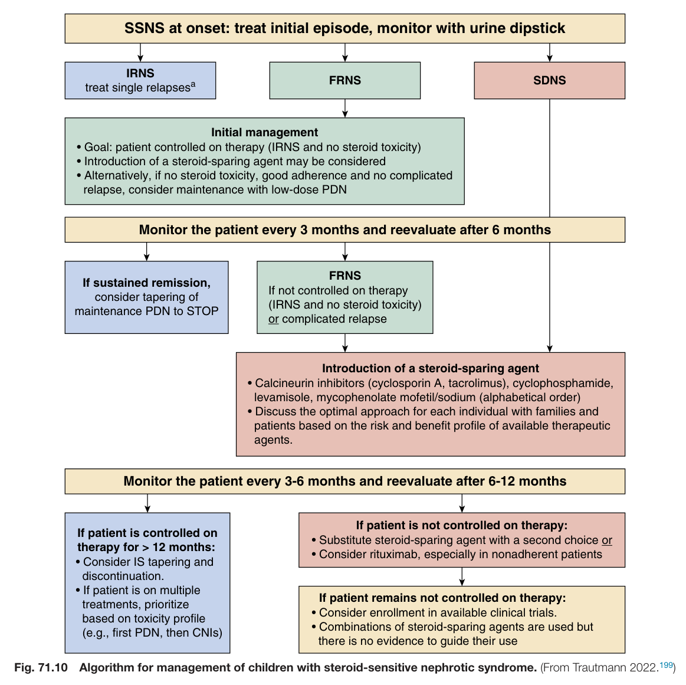

Fig. 71.10 Algorithm for management of children with steroid-sensitive nephrotic syndrome. (From Trautmann 2022.<sup>199</sup>)

---

### Fig_71_11

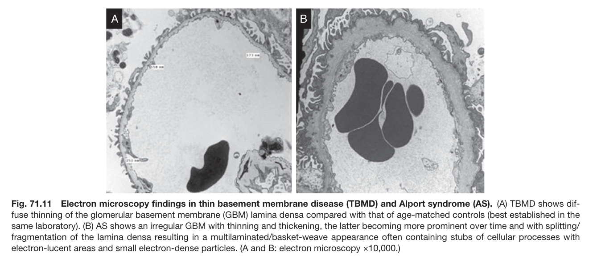

Fig. 71.11 Electron microscopy findings in thin basement membrane disease (TBMD) and Alport syndrome (AS). (A) TBMD shows dif- fuse thinning of the glomerular basement membrane (GBM) lamina densa compared with that of age-matched controls (best established in the same laboratory). (B) AS shows an irregular GBM with thinning and thickening, the latter becoming more prominent over time and with splitting/ fragmentation of the lamina densa resulting in a multilaminated/basket-weave appearance often containing stubs of cellular processes with electron-lucent areas and small electron-dense particles. (A and B: electron microscopy ×10,000.)

---

### Fig_71_12

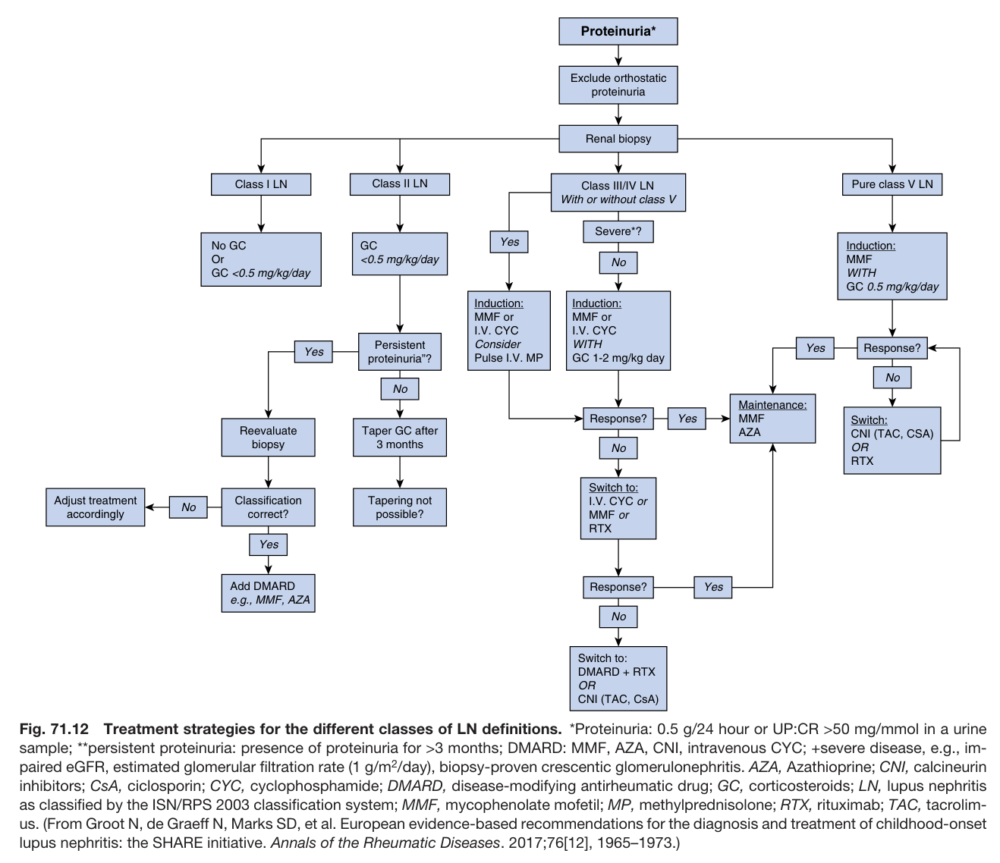

Fig. 71.12 Treatment strategies for the different classes of LN definitions. *Proteinuria: 0.5 g/24 hour or UP:CR >50 mg/mmol in a urine sample; **persistent proteinuria: presence of proteinuria for >3 months; DMARD: MMF, AZA, CNI, intravenous CYC; +severe disease, e.g., im- paired eGFR, estimated glomerular filtration rate (1 g/m<sup>2</sup>/day), biopsy-proven crescentic glomerulonephritis. AZA, Azathioprine; CNI, calcineurin inhibitors; CsA, ciclosporin; CYC, cyclophosphamide; DMARD, disease-modifying antirheumatic drug; GC, corticosteroids; LN, lupus nephritis as classified by the ISN/RPS 2003 classification system; MMF, mycophenolate mofetil; MP, methylprednisolone; RTX, rituximab; TAC, tacrolim- us. (From Groot N, de Graeff N, Marks SD, et al. European evidence-based recommendations for the diagnosis and treatment of childhood-onset lupus nephritis: the SHARE initiative. Annals of the Rheumatic Diseases. 2017;76[12], 1965–1973.)

---

### Fig_71_13

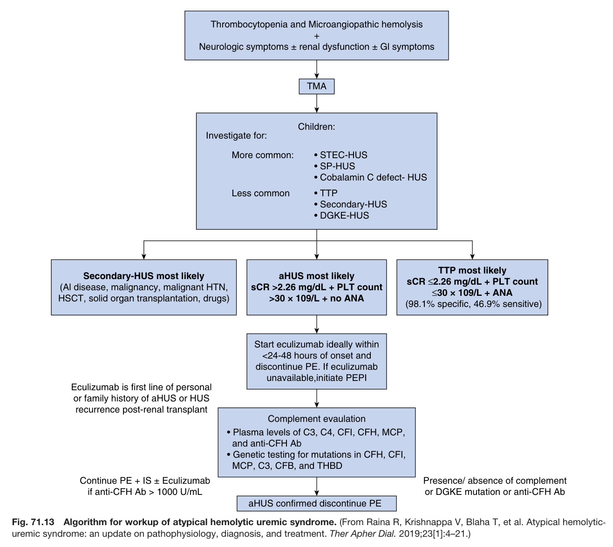

Fig. 71.13 Algorithm for workup of atypical hemolytic uremic syndrome. (From Raina R, Krishnappa V, Blaha T, et al. Atypical hemolytic- uremic syndrome: an update on pathophysiology, diagnosis, and treatment. Ther Apher Dial. 2019;23[1]:4–21.)

---

## Tables

### Table_71_1

#### Table Image

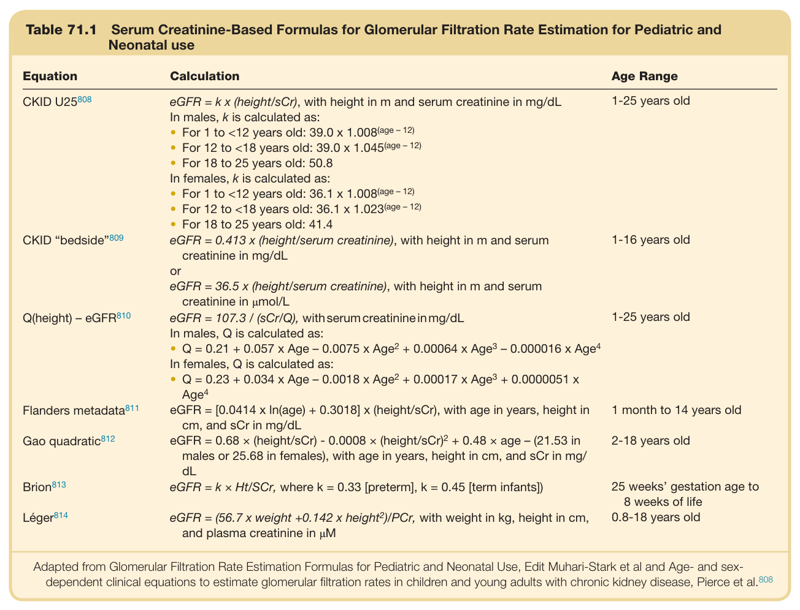

#### Table Data (CSV: [Table_71_1.csv](Table_71_1.csv))

```markdown
| Table Text (OCR) |
| :--- |
| Table 71.1 Serum Creatinine-Based Formulas for Glomerular Filtration Rate Estimation for Pediatric and Neonatal use Equation  Calculation  Age Range    CKID U25 ^{808}    eGFR = k \times (height/sCr) , with height in m and serum creatinine in mg/dLIn males,  k  is calculated as:For 1 to <12 years old:  39.0 \times 1.008^{(age-12)} For 12 to <18 years old:  39.0 \times 1.045^{(age-12)} For 18 to 25 years old: 50.8In females,  k  is calculated as:For 1 to <12 years old:  36.1 \times 1.008^{(age-12)} For 12 to <18 years old:  36.1 \times 1.023^{(age-12)} For 18 to 25 years old: 41.4  1-25 years old    CKID “bedside” ^{809}    eGFR = 0.413 \times (height/serum creatinine) , with height in m and serum creatinine in mg/dLore eGFR = 36.5 \times (height/serum creatinine) , with height in m and serum creatinine in μmol/L  1-16 years old    Q(height) – eGFR ^{810}    eGFR = 107.3 / (sCr/Q) , with serum creatinine in mg/dLIn males, Q is calculated as:Q = 0.21 + 0.057 x Age – 0.0075 x Age ^{2}  + 0.00064 x Age ^{3}  – 0.000016 x Age ^{4} In females, Q is calculated as:Q = 0.23 + 0.034 x Age – 0.0018 x Age ^{2}  + 0.00017 x Age ^{3}  + 0.0000051 x Age ^{4}   1-25 years old    Flanders metadata ^{811}    eGFR = [0.0414 \times ln(age) + 0.3018] \times (height/sCr) , with age in years, height in cm, and sCr in mg/dL  1 month to 14 years old    Gao quadratic ^{812}    eGFR = 0.68 \times (height/sCr) - 0.0008 \times (height/sCr)^{2} + 0.48 \times age - (21.53 in males or 25.68 in females) , with age in years, height in cm, and sCr in mg/dL  2-18 years old    Brion ^{813}    eGFR = k \times Ht/SCr , where k = 0.33 [preterm], k = 0.45 [term infants])  25 weeks’ gestation age to 8 weeks of life    Léger ^{814}    eGFR = (56.7 \times weight +0.142 \times height^{2})/PCr , with weight in kg, height in cm, and plasma creatinine in μM  0.8-18 years old Adapted from Glomerular Filtration Rate Estimation Formulas for Pediatric and Neonatal Use, Edit Muhari-Stark et al and Age- and sex- dependent clinical equations to estimate glomerular filtration rates in children and young adults with chronic kidney disease, Pierce et al.<sup>808</sup> |
```

Table 71.1 Serum Creatinine-Based Formulas for Glomerular Filtration Rate Estimation for Pediatric and Neonatal use

---

### Table_71_2

#### Table Image

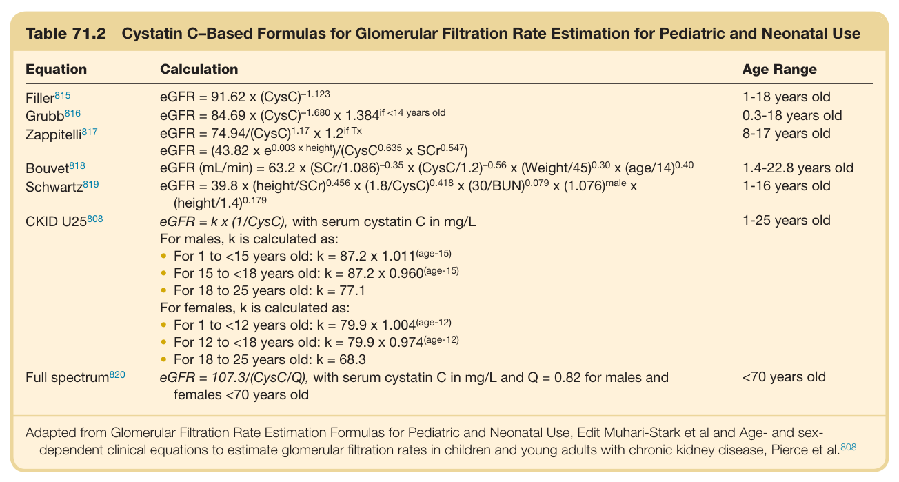

#### Table Data (CSV: [Table_71_2.csv](Table_71_2.csv))

```markdown
| Table Text (OCR) |
| :--- |
| Table 71.2  Cystatin C–Based Formulas for Glomerular Filtration Rate Estimation for Pediatric and Neonatal Use Equation  Calculation  Age Range    Filler ^{815}   eGFR = 91.62 x (CysC) ^{-1.123}   1-18 years old    Grubb ^{816}   eGFR = 84.69 x (CysC) ^{-1.680}  x 1.384 ^{if <14 years old}   0.3-18 years old    Zappitelli ^{817}   eGFR = 74.94/(CysC) ^{1.17}  x 1.2 ^{if Tx} eGFR = (43.82 x e ^{0.003}  x height)/(CysC ^{0.635}  x SCr ^{0.547} )  8-17 years old    Bouvet ^{818}   eGFR (mL/min) = 63.2 x (SCr/1.086) ^{-0.35}  x (CysC/1.2) ^{-0.56}  x (Weight/45) ^{0.30}  x (age/14) ^{0.40}   1.4-22.8 years old    Schwartz ^{819}   eGFR = 39.8 x (height/SCr) ^{0.456}  x (1.8/CysC) ^{0.418}  x (30/BUN) ^{0.079}  x (1.076) ^{male}  x (height/1.4) ^{0.179}   1-16 years old    CKID U25 ^{808}   eGFR = k x (1/CysC), with serum cystatin C in mg/LFor males, k is calculated as:For 1 to <15 years old: k = 87.2 x 1.011 ^{(age-15)} For 15 to <18 years old: k = 87.2 x 0.960 ^{(age-15)} For 18 to 25 years old: k = 77.1For females, k is calculated as:For 1 to <12 years old: k = 79.9 x 1.004 ^{(age-12)} For 12 to <18 years old: k = 79.9 x 0.974 ^{(age-12)} For 18 to 25 years old: k = 68.3  1-25 years old    Full spectrum ^{820}   eGFR = 107.3/(CysC/Q), with serum cystatin C in mg/L and Q = 0.82 for males and females <70 years old  <70 years old Adapted from Glomerular Filtration Rate Estimation Formulas for Pediatric and Neonatal Use, Edit Muhari-Stark et al and Age- and sex- dependent clinical equations to estimate glomerular filtration rates in children and young adults with chronic kidney disease, Pierce et al.<sup>808</sup> |
```

Table 71.2 Cystatin C–Based Formulas for Glomerular Filtration Rate Estimation for Pediatric and Neonatal Use

---

### Table_71_3

#### Table Image

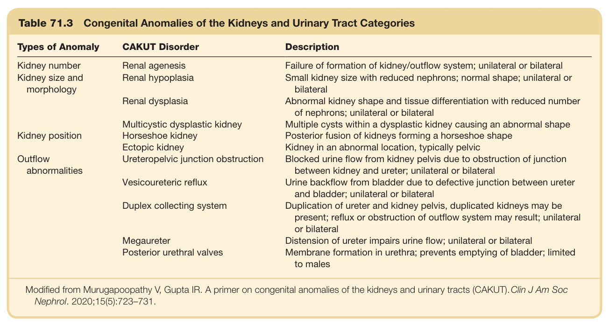

#### Table Data (CSV: [Table_71_3.csv](Table_71_3.csv))

```markdown
| Table Text (OCR) |
| :--- |
| Table 71.3  Congenital Anomalies of the Kidneys and Urinary Tract Categories Types of Anomaly  CAKUT Disorder  Description    Kidney number  Renal agenesis  Failure of formation of kidney/outflow system; unilateral or bilateral    Kidney size and morphology  Renal hypoplasia  Small kidney size with reduced nephrons; normal shape; unilateral or bilateral    Renal dysplasia  Abnormal kidney shape and tissue differentiation with reduced number of nephrons; unilateral or bilateral    Multicystic dysplastic kidney  Multiple cysts within a dysplastic kidney causing an abnormal shape    Kidney position  Horseshoe kidney  Posterior fusion of kidneys forming a horseshoe shape    Ectopic kidney  Kidney in an abnormal location, typically pelvic    Outflow abnormalities  Ureteropelvic junction obstruction  Blocked urine flow from kidney pelvis due to obstruction of junction between kidney and ureter; unilateral or bilateral    Vesicoureteric reflux  Urine backflow from bladder due to defective junction between ureter and bladder; unilateral or bilateral    Duplex collecting system  Duplication of ureter and kidney pelvis, duplicated kidneys may be present; reflux or obstruction of outflow system may result; unilateral or bilateral    Megaureter  Distension of ureter impairs urine flow; unilateral or bilateral    Posterior urethral valves  Membrane formation in urethra; prevents emptying of bladder; limited to males Modified from Murugapoopathy V, Gupta IR. A primer on congenital anomalies of the kidneys and urinary tracts (CAKUT).Clin J Am Soc Nephrol. 2020;15(5):723–731. |
```

Table 71.3 Congenital Anomalies of the Kidneys and Urinary Tract Categories

---

### Table_71_4

#### Table Image

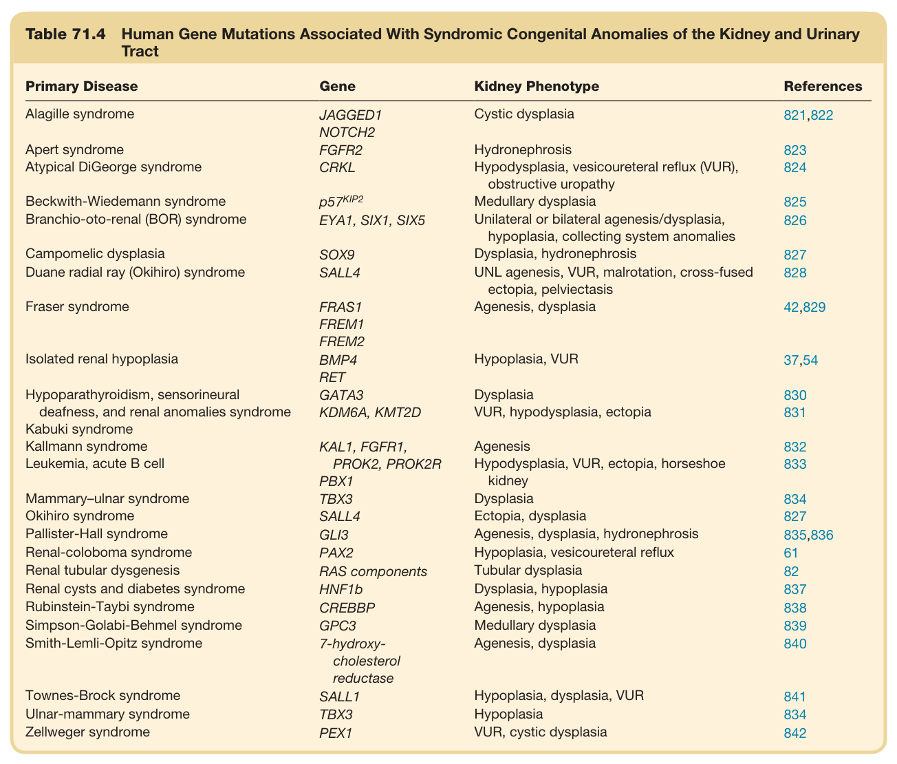

#### Table Data (CSV: [Table_71_4.csv](Table_71_4.csv))

```markdown
| Table Text (OCR) |
| :--- |
| Table 71.4  Human Gene Mutations Associated With Syndromic Congenital Anomalies of the Kidney and Urinary Tract Primary Disease  Gene  Kidney Phenotype  References    Alagille syndrome  JAGGED1NOTCH2  Cystic dysplasia  821,822    Apert syndrome  FGFR2  Hydronephrosis  823    Atypical DiGeorge syndrome  CRKL  Hypodysplasia, vesicoureteral reflux (VUR), obstructive uropathy  824    Beckwith-Wiedemann syndrome  p57 ^{KIP2}   Medullary dysplasia  825    Branchio-oto-renal (BOR) syndrome  EYA1, SIX1, SIX5  Unilateral or bilateral agenesis/dysplasia, hypoplasia, collecting system anomalies  826    Campomelic dysplasia  SOX9  Dysplasia, hydronephrosis  827    Duane radial ray (Okihiro) syndrome  SALL4  UNL agenesis, VUR, malrotation, cross-fused ectopia, pelviectasis  828    Fraser syndrome  FRAS1FREM1FREM2  Agenesis, dysplasia  42,829    Isolated renal hypoplasia  BMP4RET  Hypoplasia, VUR  37,54    Hypoparathyroidism, sensorineural deafness, and renal anomalies syndrome  GATA3KDM6A, KMT2D  DysplasiaVUR, hypodysplasia, ectopia  830831    Kabuki syndrome          Kallmann syndrome  KAL1, FGFR1,PROK2, PROK2RPBX1  AgenesisHypodysplasia, VUR, ectopia, horseshoe kidney  832833    Leukemia, acute B cell          Mammary-ulnar syndrome  TBX3  Dysplasia  834    Okihiro syndrome  SALL4  Ectopia, dysplasia  827    Pallister-Hall syndrome  GLI3  Agenesis, dysplasia, hydronephrosis  835,836    Renal-coloboma syndrome  PAX2  Hypoplasia, vesicoureteral reflux  61    Renal tubular dysgenesis  RAS components  Tubular dysplasia  82    Renal cysts and diabetes syndrome  HNF1b  Dysplasia, hypoplasia  837    Rubinstein-Taybi syndrome  CREBBP  Agenesis, hypoplasia  838    Simpson-Golabi-Behmel syndrome  GPC3  Medullary dysplasia  839    Smith-Lemli-Opitz syndrome  7-hydroxy-cholesterol reductase  Agenesis, dysplasia  840    Townes-Brock syndrome  SALL1  Hypoplasia, dysplasia, VUR  841    Ulnar-mammary syndrome  TBX3  Hypoplasia  834    Zellweger syndrome  PEX1  VUR, cystic dysplasia  842 |
```

Table 71.4 Human Gene Mutations Associated With Syndromic Congenital Anomalies of the Kidney and Urinary Tract

---

### Table_71_5

#### Table Image

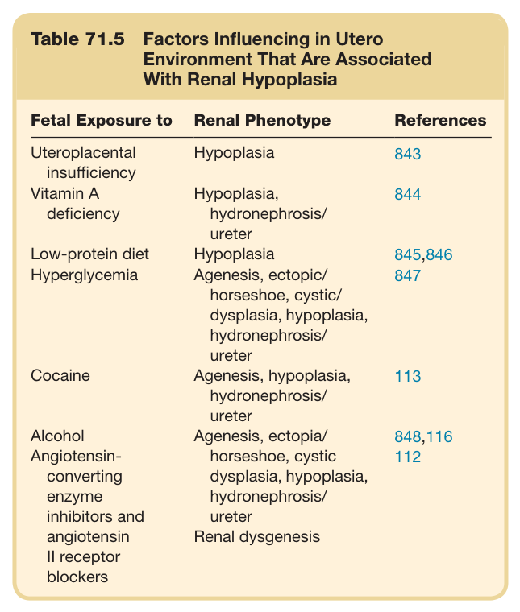

#### Table Data (CSV: [Table_71_5.csv](Table_71_5.csv))

```markdown
| Table Text (OCR) |
| :--- |
| Table 71.5  Factors Influencing in Utero Environment That Are Associated With Renal Hypoplasia Fetal Exposure to  Renal Phenotype  References    Uteroplacental insufficiency  Hypoplasia  843    Vitamin A deficiency  Hypoplasia, hydronephrosis/ ureter  844    Low-protein diet  Hypoplasia  845,846    Hyperglycemia  Agenesis, ectopic/ horseshoe, cystic/ dysplasia, hypoplasia, hydronephrosis/ ureter  847    Cocaine  Agenesis, hypoplasia, hydronephrosis/ ureter  113    Alcohol  Agenesis, ectopia/ horseshoe, cystic  848,116    Angiotensin- converting enzyme inhibitors and angiotensin II receptor blockers  dysplasia, hypoplasia, hydronephrosis/ ureter Renal dysgenesis  112 |
```

Table 71.5 Factors Influencing in Utero Environment That Are Associated With Renal Hypoplasia

---

### Table_71_6

#### Table Image

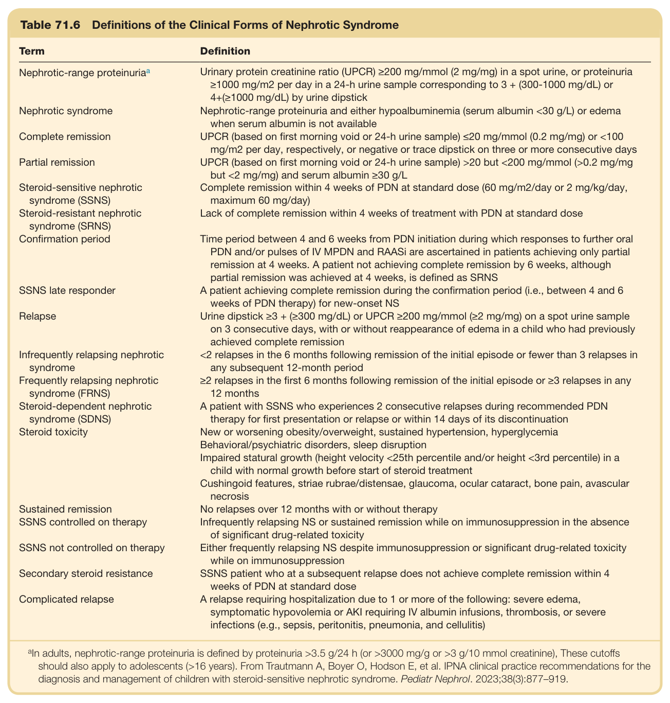

#### Table Data (CSV: [Table_71_6.csv](Table_71_6.csv))

```markdown
| Table Text (OCR) |
| :--- |
| Table 71.6  Definitions of the Clinical Forms of Nephrotic Syndrome Term  Definition    Nephrotic-range proteinuriaa  Urinary protein creatinine ratio (UPCR) ≥200 mg/mmol (2 mg/mg) in a spot urine, or proteinuria ≥1000 mg/m2 per day in a 24-h urine sample corresponding to 3 + (300-1000 mg/dL) or 4+(≥1000 mg/dL) by urine dipstick    Nephrotic syndrome  Nephrotic-range proteinuria and either hypoalbuminemia (serum albumin <30 g/L) or edema when serum albumin is not available    Complete remission  UPCR (based on first morning void or 24-h urine sample) ≤20 mg/mmol (0.2 mg/mg) or <100 mg/m2 per day, respectively, or negative or trace dipstick on three or more consecutive days    Partial remission  UPCR (based on first morning void or 24-h urine sample) >20 but <200 mg/mmol (>0.2 mg/mg but <2 mg/mg) and serum albumin ≥30 g/L    Steroid-sensitive nephrotic syndrome (SSNS)  Complete remission within 4 weeks of PDN at standard dose (60 mg/m2/day or 2 mg/kg/day, maximum 60 mg/day)    Steroid-resistant nephrotic syndrome (SRNS)  Lack of complete remission within 4 weeks of treatment with PDN at standard dose    Confirmation period  Time period between 4 and 6 weeks from PDN initiation during which responses to further oral PDN and/or pulses of IV MPDN and RAASi are ascertained in patients achieving only partial remission at 4 weeks. A patient not achieving complete remission by 6 weeks, although partial remission was achieved at 4 weeks, is defined as SRNS    SSNS late responder  A patient achieving complete remission during the confirmation period (i.e., between 4 and 6 weeks of PDN therapy) for new-onset NS    Relapse  Urine dipstick ≥3 + (≥300 mg/dL) or UPCR ≥200 mg/mmol (≥2 mg/mg) on a spot urine sample on 3 consecutive days, with or without reappearance of edema in a child who had previously achieved complete remission    Infrequently relapsing nephrotic syndrome  <2 relapses in the 6 months following remission of the initial episode or fewer than 3 relapses in any subsequent 12-month period    Frequently relapsing nephrotic syndrome (FRNS)  ≥2 relapses in the first 6 months following remission of the initial episode or ≥3 relapses in any 12 months    Steroid-dependent nephrotic syndrome (SDNS)  A patient with SSNS who experiences 2 consecutive relapses during recommended PDN therapy for first presentation or relapse or within 14 days of its discontinuation    Steroid toxicity  New or worsening obesity/overweight, sustained hypertension, hyperglycemiaBehavioral/psychiatric disorders, sleep disruptionImpaired statural growth (height velocity <25th percentile and/or height <3rd percentile) in a child with normal growth before start of steroid treatmentCushingoid features, striae rubrae/distensae, glaucoma, ocular cataract, bone pain, avascular necrosis    Sustained remission  No relapses over 12 months with or without therapy    SSNS controlled on therapy  Infrequently relapsing NS or sustained remission while on immunosuppression in the absence of significant drug-related toxicity    SSNS not controlled on therapy  Either frequently relapsing NS despite immunosuppression or significant drug-related toxicity while on immunosuppression    Secondary steroid resistance  SSNS patient who at a subsequent relapse does not achieve complete remission within 4 weeks of PDN at standard dose    Complicated relapse  A relapse requiring hospitalization due to 1 or more of the following: severe edema, symptomatic hypovolemia or AKI requiring IV albumin infusions, thrombosis, or severe infections (e.g., sepsis, peritonitis, pneumonia, and cellulitis) <sup>a</sup>In adults, nephrotic-range proteinuria is defined by proteinuria >3.5 g/24 h (or >3000 mg/g or >3 g/10 mmol creatinine), These cutoffs should also apply to adolescents (>16 years). From Trautmann A, Boyer O, Hodson E, et al. IPNA clinical practice recommendations for the diagnosis and management of children with steroid-sensitive nephrotic syndrome. Pediatr Nephrol. 2023;38(3):877–919. |
```

Table 71.6 Definitions of the Clinical Forms of Nephrotic Syndrome

---

### Table_71_7

#### Table Image

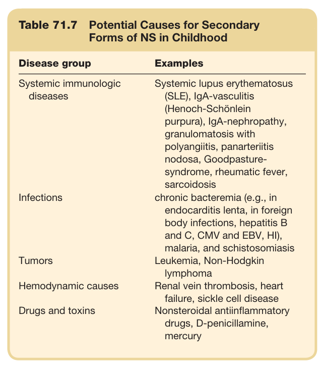

#### Table Data (CSV: [Table_71_7.csv](Table_71_7.csv))

```markdown
| Table Text (OCR) |
| :--- |
| Table 71.7  Potential Causes for Secondary Forms of NS in Childhood Disease group  Examples    Systemic immunologic diseases  Systemic lupus erythematosus (SLE), IgA-vasculitis (Henoch-Schönlein purpura), IgA-nephropathy, granulomatosis with polyangiitis, panarteriitis nodosa, Goodpasture-syndrome, rheumatic fever, sarcoidosis    Infections  chronic bacteremia (e.g., in endocarditis lenta, in foreign body infections, hepatitis B and C, CMV and EBV, HI), malaria, and schistosomiasis    Tumors  Leukemia, Non-Hodgkin lymphoma    Hemodynamic causes  Renal vein thrombosis, heart failure, sickle cell disease    Drugs and toxins  Nonsteroidal antiinflammatory drugs, D-penicillamine, mercury |
```

Table 71.7 Potential Causes for Secondary Forms of NS in Childhood

---

### Table_71_8

#### Table Images (2 Parts)

- **Part 1 (Page 21)**:
  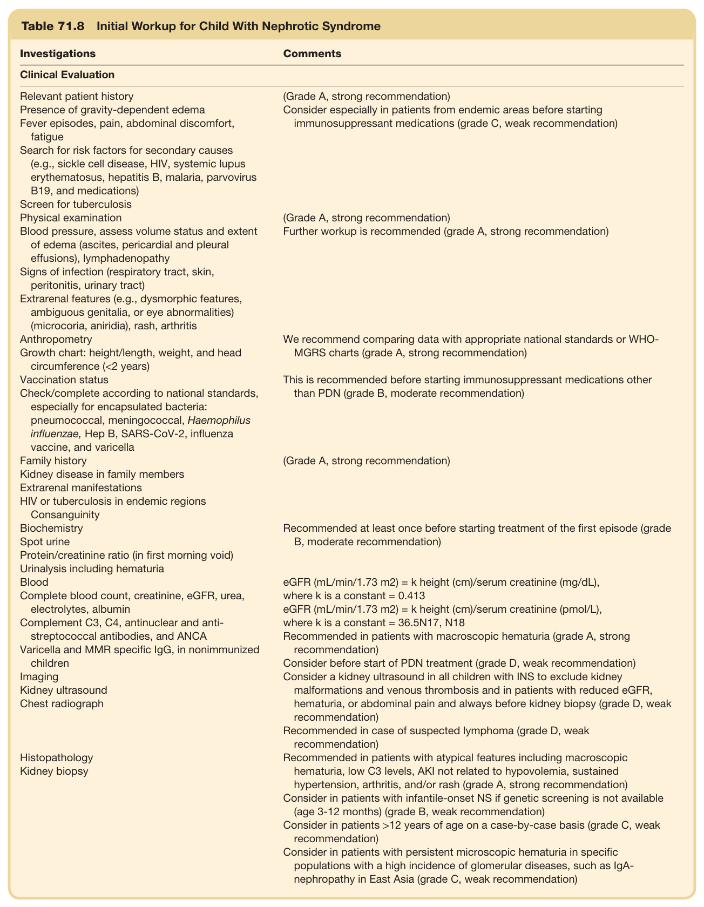

- **Part 2 (Page 22)**:
  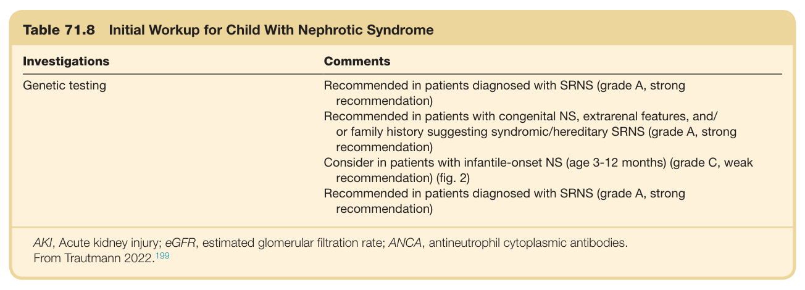

#### Table Data (CSV: [Table_71_8.csv](Table_71_8.csv))

```markdown
| Table Text (OCR) |
| :--- |
| Table 71.8  Initial Workup for Child With Nephrotic Syndrome Investigations  Comments    Clinical Evaluation    Relevant patient history  (Grade A, strong recommendation)    Presence of gravity-dependent edema  Consider especially in patients from endemic areas before starting immunosuppressant medications (grade C, weak recommendation)    Fever episodes, pain, abdominal discomfort, fatigue      Search for risk factors for secondary causes (e.g., sickle cell disease, HIV, systemic lupus erythematosus, hepatitis B, malaria, parvovirus B19, and medications)      Screen for tuberculosis      Physical examination  (Grade A, strong recommendation)    Blood pressure, assess volume status and extent of edema (ascites, pericardial and pleural effusions), lymphadenopathy  Further workup is recommended (grade A, strong recommendation)    Signs of infection (respiratory tract, skin, peritonitis, urinary tract)      Extrarenal features (e.g., dysmorphic features, ambiguous genitalia, or eye abnormalities) (microcoria, aniridia), rash, arthritis      Anthropometry  We recommend comparing data with appropriate national standards or WHO-MGRS charts (grade A, strong recommendation)    Growth chart: height/length, weight, and head circumference (<2 years)      Vaccination status  This is recommended before starting immunosuppressant medications other than PDN (grade B, moderate recommendation)    Check/complete according to national standards, especially for encapsulated bacteria: pneumococcal, meningococcal, Haemophilus influenzae, Hep B, SARS-CoV-2, influenza vaccine, and varicella      Family history  (Grade A, strong recommendation)    Kidney disease in family members      Extrarenal manifestations      HIV or tuberculosis in endemic regions Consanguinity      Biochemistry  Recommended at least once before starting treatment of the first episode (grade B, moderate recommendation)    Spot urine      Protein/creatinine ratio (in first morning void)      Urinalysis including hematuria      Blood  eGFR (mL/min/1.73 m2) = k height (cm)/serum creatinine (mg/dL), where k is a constant = 0.413    Complete blood count, creatinine, eGFR, urea, electrolytes, albumin  eGFR (mL/min/1.73 m2) = k height (cm)/serum creatinine (pmol/L), where k is a constant = 36.5N17, N18    Complement C3, C4, antinuclear and anti-streptococcal antibodies, and ANCA  Recommended in patients with macroscopic hematuria (grade A, strong recommendation)    Varicella and MMR specific IgG, in nonimmunized children  Consider before start of PDN treatment (grade D, weak recommendation)    Imaging  Consider a kidney ultrasound in all children with INS to exclude kidney malformations and venous thrombosis and in patients with reduced eGFR, hematuria, or abdominal pain and always before kidney biopsy (grade D, weak recommendation)    Kidney ultrasound      Chest radiograph  Recommended in case of suspected lymphoma (grade D, weak recommendation)    Histopathology  Recommended in patients with atypical features including macroscopic hematuria, low C3 levels, AKI not related to hypovolemia, sustained hypertension, arthritis, and/or rash (grade A, strong recommendation)    Kidney biopsy  Consider in patients with infantile-onset NS if genetic screening is not available (age 3-12 months) (grade B, weak recommendation)      Consider in patients >12 years of age on a case-by-case basis (grade C, weak recommendation)      Consider in patients with persistent microscopic hematuria in specific populations with a high incidence of glomerular diseases, such as IgA-nephropathy in East Asia (grade C, weak recommendation) |
```

Table 71.8 Initial Workup for Child With Nephrotic Syndrome

---

### Table_71_9

#### Table Image

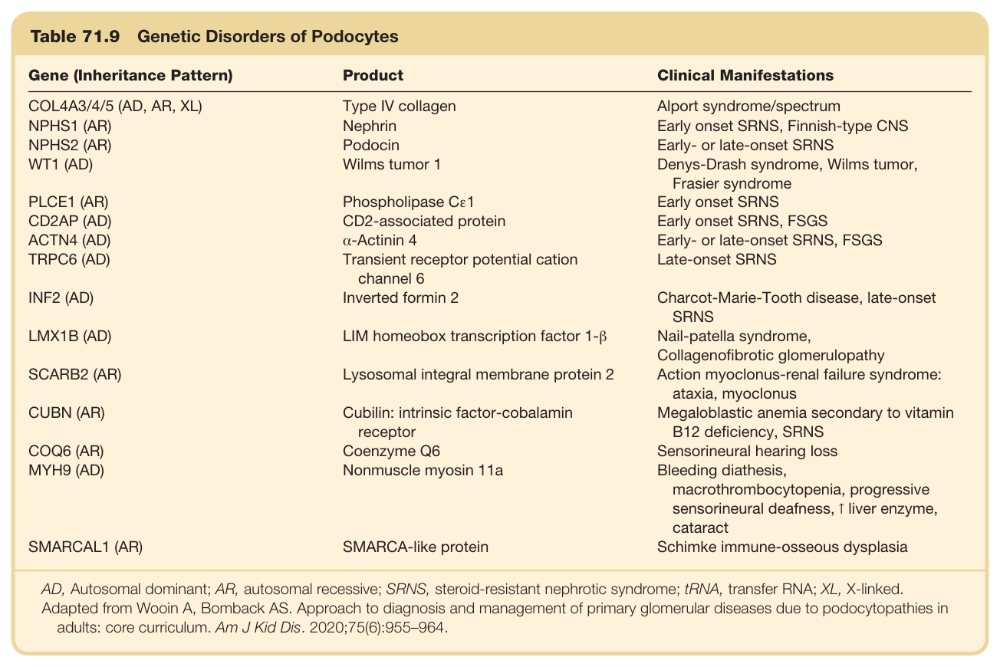

#### Table Data (CSV: [Table_71_9.csv](Table_71_9.csv))

```markdown
| Table Text (OCR) |
| :--- |
| Table 71.9  Genetic Disorders of Podocytes Gene (Inheritance Pattern)  Product  Clinical Manifestations    COL4A3/4/5 (AD, AR, XL)  Type IV collagen  Alport syndrome/spectrum    NPHS1 (AR)  Nephrin  Early onset SRNS, Finnish-type CNS    NPHS2 (AR)  Podocin  Early- or late-onset SRNS    WT1 (AD)  Wilms tumor 1  Denys-Drash syndrome, Wilms tumor, Frasier syndrome    PLCE1 (AR)  Phospholipase Cε1  Early onset SRNS    CD2AP (AD)  CD2-associated protein  Early onset SRNS, FSGS    ACTN4 (AD)  α-Actinin 4  Early- or late-onset SRNS, FSGS    TRPC6 (AD)  Transient receptor potential cation channel 6  Late-onset SRNS    INF2 (AD)  Inverted formin 2  Charcot-Marie-Tooth disease, late-onset SRNS    LMX1B (AD)  LIM homeobox transcription factor 1-β  Nail-patella syndrome, Collagenofibrotic glomerulopathy    SCARB2 (AR)  Lysosomal integral membrane protein 2  Action myoclonus-renal failure syndrome: ataxia, myoclonus    CUBN (AR)  Cubilin: intrinsic factor-cobalamin receptor  Megaloblastic anemia secondary to vitamin B12 deficiency, SRNS    COQ6 (AR)  Coenzyme Q6  Sensorineural hearing loss    MYH9 (AD)  Nonmuscle myosin 11a  Bleeding diathesis, macrothrombocytopenia, progressive sensorineural deafness, ↑ liver enzyme, cataract    SMARCAL1 (AR)  SMARCA-like protein  Schimke immune-osseous dysplasia AD, Autosomal dominant; AR, autosomal recessive; SRNS, steroid-resistant nephrotic syndrome; tRNA, transfer RNA; XL, X-linked. Adapted from Wooin A, Bomback AS. Approach to diagnosis and management of primary glomerular diseases due to podocytopathies in adults: core curriculum. Am J Kid Dis. 2020;75(6):955–964. |
```

Table 71.9 Genetic Disorders of Podocytes

---

### Table_71_10

#### Table Image

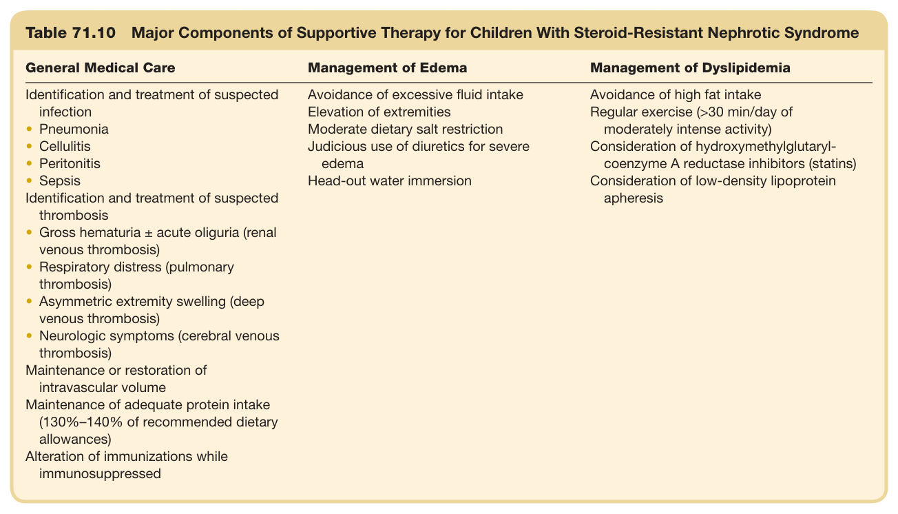

#### Table Data (CSV: [Table_71_10.csv](Table_71_10.csv))

```markdown
| Table Text (OCR) |
| :--- |
| Table 71.10  Major Components of Supportive Therapy for Children With Steroid-Resistant Nephrotic Syndrome General Medical Care  Management of Edema  Management of Dyslipidemia    Identification and treatment of suspected infectionPneumoniaCellulitisPeritonitisSepsisIdentification and treatment of suspected thrombosisGross hematuria ± acute oliguria (renal venous thrombosis)Respiratory distress (pulmonary thrombosis)Asymmetric extremity swelling (deep venous thrombosis)Neurologic symptoms (cerebral venous thrombosis)Maintenance or restoration of intravascular volumeMaintenance of adequate protein intake (130%-140% of recommended dietary allowances)Alteration of immunizations while immunosuppressed  Avoidance of excessive fluid intakeElevation of extremitiesModerate dietary salt restrictionJudicious use of diuretics for severe edemaHead-out water immersion  Avoidance of high fat intakeRegular exercise (>30 min/day of moderately intense activity)Consideration of hydroxymethylglutaryl-coenzyme A reductase inhibitors (statins)Consideration of low-density lipoprotein apheresis |
```

Table 71.10 Major Components of Supportive Therapy for Children With Steroid-Resistant Nephrotic Syndrome

---

### Table_71_11

#### Table Image

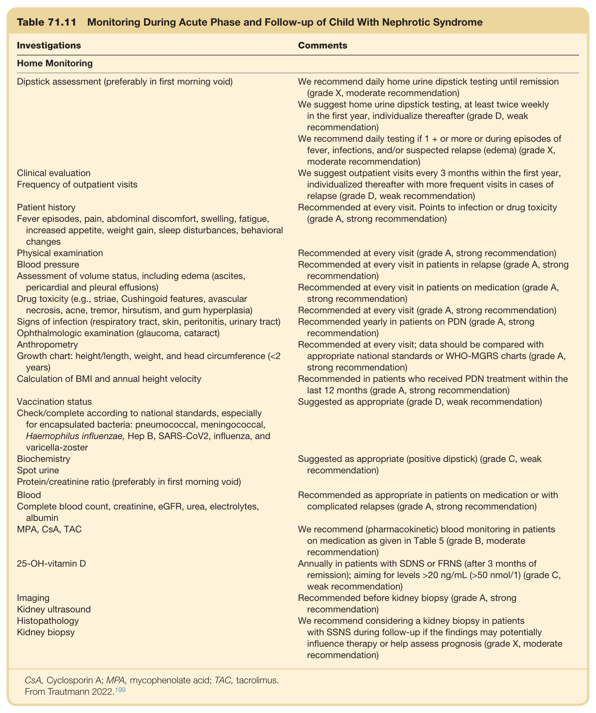

#### Table Data (CSV: [Table_71_11.csv](Table_71_11.csv))

```markdown
| Table Text (OCR) |
| :--- |
| Table 71.11  Monitoring During Acute Phase and Follow-up of Child With Nephrotic Syndrome Investigations  Comments    Home Monitoring    Dipstick assessment (preferably in first morning void)  We recommend daily home urine dipstick testing until remission (grade X, moderate recommendation)We suggest home urine dipstick testing, at least twice weekly in the first year, individualize thereafter (grade D, weak recommendation)We recommend daily testing if 1 + or more or during episodes of fever, infections, and/or suspected relapse (edema) (grade X, moderate recommendation)    Clinical evaluationFrequency of outpatient visits  We suggest outpatient visits every 3 months within the first year, individualized thereafter with more frequent visits in cases of relapse (grade D, weak recommendation)    Patient historyFever episodes, pain, abdominal discomfort, swelling, fatigue, increased appetite, weight gain, sleep disturbances, behavioral changes  Recommended at every visit. Points to infection or drug toxicity (grade A, strong recommendation)    Physical examinationBlood pressureAssessment of volume status, including edema (ascites, pericardial and pleural effusions)Drug toxicity (e.g., striae, Cushingoid features, avascular necrosis, acne, tremor, hirsutism, and gum hyperplasia)Signs of infection (respiratory tract, skin, peritonitis, urinary tract)Ophthalmologic examination (glaucoma, cataract)AnthropometryGrowth chart: height/length, weight, and head circumference (<2 years)Calculation of BMI and annual height velocity  Recommended at every visit (grade A, strong recommendation)Recommended at every visit in patients in relapse (grade A, strong recommendation)Recommended at every visit in patients on medication (grade A, strong recommendation)Recommended at every visit (grade A, strong recommendation)Recommended yearly in patients on PDN (grade A, strong recommendation)Recommended at every visit; data should be compared with appropriate national standards or WHO-MGRS charts (grade A, strong recommendation)Recommended in patients who received PDN treatment within the last 12 months (grade A, strong recommendation)Suggested as appropriate (grade D, weak recommendation)    Vaccination statusCheck/complete according to national standards, especially for encapsulated bacteria: pneumococcal, meningococcal, Haemophilus influenzae, Hep B, SARS-CoV2, influenza, and varicella-zosterBiochemistrySpot urineProtein/creatinine ratio (preferably in first morning void)BloodComplete blood count, creatinine, eGFR, urea, electrolytes, albuminMPA, CsA, TAC25-OH-vitamin DImagingKidney ultrasoundHistopathologyKidney biopsy  Suggested as appropriate (positive dipstick) (grade C, weak recommendation)Recommended as appropriate in patients on medication or with complicated relapses (grade A, strong recommendation)We recommend (pharmacokinetic) blood monitoring in patients on medication as given in Table 5 (grade B, moderate recommendation)Annually in patients with SDNS or FRNS (after 3 months of remission); aiming for levels >20 ng/mL (>50 nmol/1) (grade C, weak recommendation)Recommended before kidney biopsy (grade A, strong recommendation)We recommend considering a kidney biopsy in patients with SSNS during follow-up if the findings may potentially influence therapy or help assess prognosis (grade X, moderate recommendation)    CsA, Cyclosporin A; MPA, mycophenolate acid; TAC, tacrolimus. From Trautmann 2022.199 |
```

Table 71.11 Monitoring During Acute Phase and Follow-up of Child With Nephrotic Syndrome

---

### Table_71_12

#### Table Image

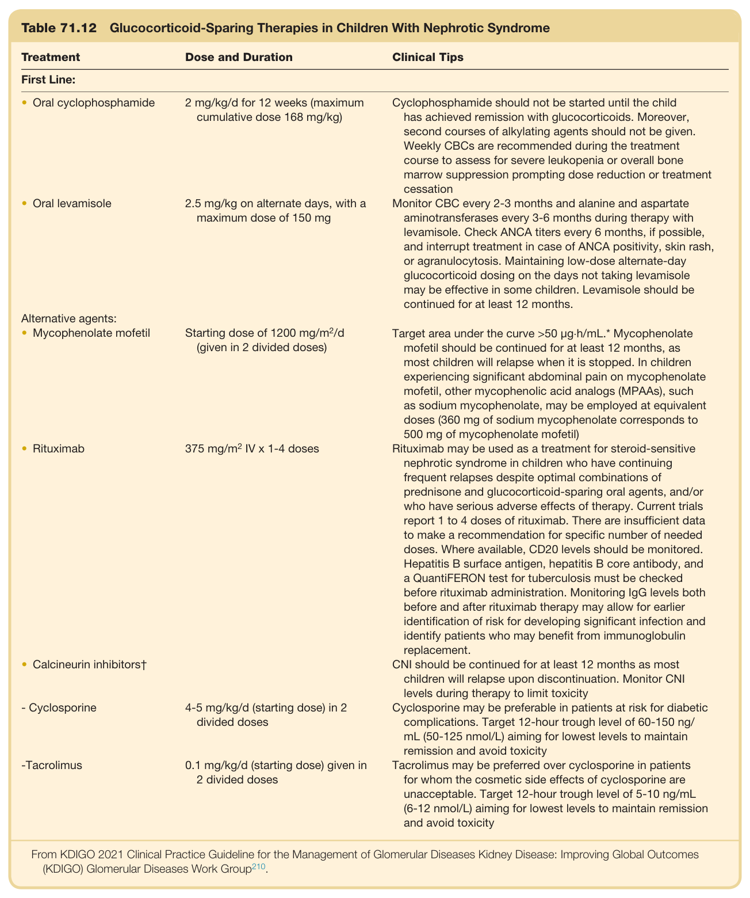

#### Table Data (CSV: [Table_71_12.csv](Table_71_12.csv))

```markdown
| Table Text (OCR) |
| :--- |
| Table 71.12  Glucocorticoid-Sparing Therapies in Children With Nephrotic Syndrome Treatment  Dose and Duration  Clinical Tips    First Line:    Oral cyclophosphamide  2 mg/kg/d for 12 weeks (maximum cumulative dose 168 mg/kg)  Cyclophosphamide should not be started until the child has achieved remission with glucocorticoids. Moreover, second courses of alkylating agents should not be given. Weekly CBCs are recommended during the treatment course to assess for severe leukopenia or overall bone marrow suppression prompting dose reduction or treatment cessation    Oral levamisole  2.5 mg/kg on alternate days, with a maximum dose of 150 mg  Monitor CBC every 2-3 months and alanine and aspartate aminotransferases every 3-6 months during therapy with levamisole. Check ANCA titers every 6 months, if possible, and interrupt treatment in case of ANCA positivity, skin rash, or agranulocytosis. Maintaining low-dose alternate-day glucocorticoid dosing on the days not taking levamisole may be effective in some children. Levamisole should be continued for at least 12 months.    Alternative agents:    Mycophenolate mofetil  Starting dose of 1200 mg/m2/d (given in 2 divided doses)  Target area under the curve >50 μg·h/mL.* Mycophenolate mofetil should be continued for at least 12 months, as most children will relapse when it is stopped. In children experiencing significant abdominal pain on mycophenolate mofetil, other mycophenolic acid analogs (MPAAs), such as sodium mycophenolate, may be employed at equivalent doses (360 mg of sodium mycophenolate corresponds to 500 mg of mycophenolate mofetil)    Rituximab  375 mg/m2IV x 1-4 doses  Rituximab may be used as a treatment for steroid-sensitive nephrotic syndrome in children who have continuing frequent relapses despite optimal combinations of prednisone and glucocorticoid-sparing oral agents, and/or who have serious adverse effects of therapy. Current trials report 1 to 4 doses of rituximab. There are insufficient data to make a recommendation for specific number of needed doses. Where available, CD20 levels should be monitored. Hepatitis B surface antigen, hepatitis B core antibody, and a QuantiFERON test for tuberculosis must be checked before rituximab administration. Monitoring IgG levels both before and after rituximab therapy may allow for earlier identification of risk for developing significant infection and identify patients who may benefit from immunoglobulin replacement.    Calcineurin inhibitors†    CNI should be continued for at least 12 months as most children will relapse upon discontinuation. Monitor CNI levels during therapy to limit toxicity    - Cyclosporine  4-5 mg/kg/d (starting dose) in 2 divided doses  Cyclosporine may be preferable in patients at risk for diabetic complications. Target 12-hour trough level of 60-150 ng/mL (50-125 nmol/L) aiming for lowest levels to maintain remission and avoid toxicity    -Tacrolimus  0.1 mg/kg/d (starting dose) given in 2 divided doses  Tacrolimus may be preferred over cyclosporine in patients for whom the cosmetic side effects of cyclosporine are unacceptable. Target 12-hour trough level of 5-10 ng/mL (6-12 nmol/L) aiming for lowest levels to maintain remission and avoid toxicity From KDIGO 2021 Clinical Practice Guideline for the Management of Glomerular Diseases Kidney Disease: Improving Global Outcomes (KDIGO) Glomerular Diseases Work Group<sup>210</sup>. |
```

Table 71.12 Glucocorticoid-Sparing Therapies in Children With Nephrotic Syndrome

---

### Table_71_13

#### Table Image

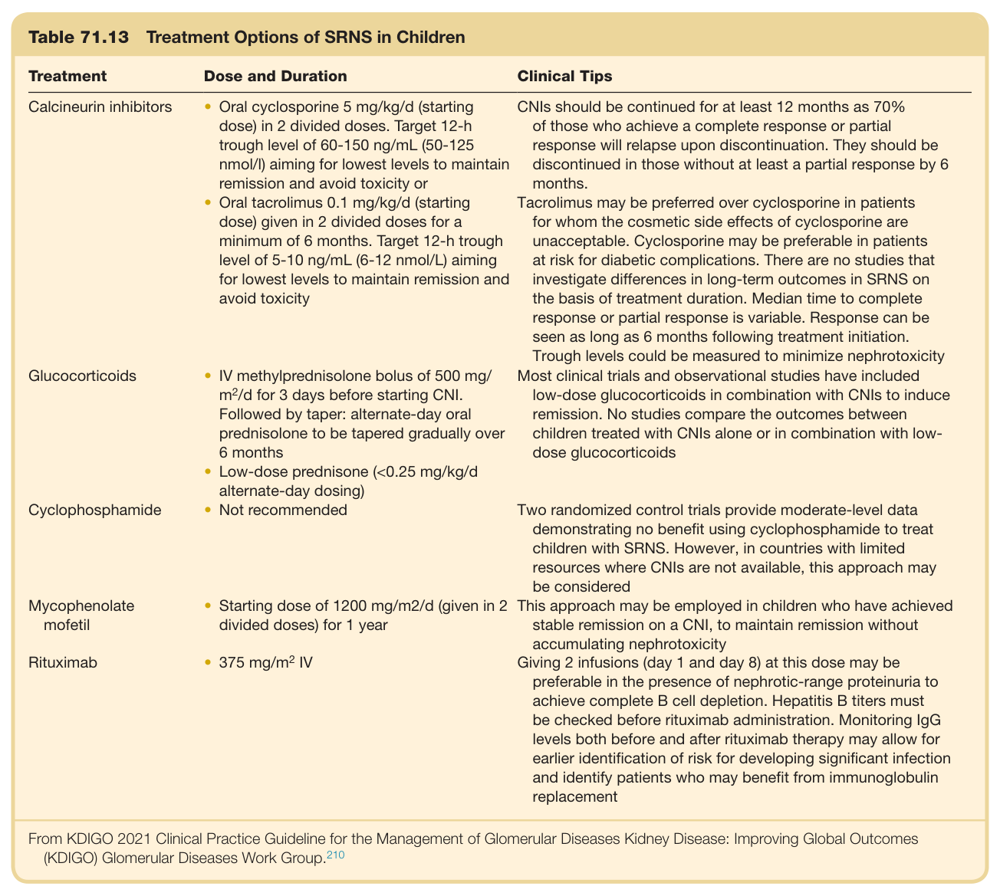

#### Table Data (CSV: [Table_71_13.csv](Table_71_13.csv))

```markdown
| Table Text (OCR) |
| :--- |
| Table 71.13  Treatment Options of SRNS in Children Treatment  Dose and Duration  Clinical Tips    Calcineurin inhibitors  Oral cyclosporine 5 mg/kg/d (starting dose) in 2 divided doses. Target 12-h trough level of 60-150 ng/mL (50-125 nmol/l) aiming for lowest levels to maintain remission and avoid toxicity orOral tacrolimus 0.1 mg/kg/d (starting dose) given in 2 divided doses for a minimum of 6 months. Target 12-h trough level of 5-10 ng/mL (6-12 nmol/L) aiming for lowest levels to maintain remission and avoid toxicity  CNIs should be continued for at least 12 months as 70% of those who achieve a complete response or partial response will relapse upon discontinuation. They should be discontinued in those without at least a partial response by 6 months.Tacrolimus may be preferred over cyclosporine in patients for whom the cosmetic side effects of cyclosporine are unacceptable. Cyclosporine may be preferable in patients at risk for diabetic complications. There are no studies that investigate differences in long-term outcomes in SRNS on the basis of treatment duration. Median time to complete response or partial response is variable. Response can be seen as long as 6 months following treatment initiation.Trough levels could be measured to minimize nephrotoxicity    Glucocorticoids  IV methylprednisolone bolus of 500 mg/ m^{2}/d  for 3 days before starting CNI.Followed by taper: alternate-day oral prednisolone to be tapered gradually over 6 monthsLow-dose prednisone (<0.25 mg/kg/d alternate-day dosing)  Most clinical trials and observational studies have included low-dose glucocorticoids in combination with CNIs to induce remission. No studies compare the outcomes between children treated with CNIs alone or in combination with low-dose glucocorticoids    Cyclophosphamide  Not recommended  Two randomized control trials provide moderate-level data demonstrating no benefit using cyclophosphamide to treat children with SRNS. However, in countries with limited resources where CNIs are not available, this approach may be considered    Mycophenolate mofetil  Starting dose of 1200 mg/ m^{2}/d  (given in 2 divided doses) for 1 year  This approach may be employed in children who have achieved stable remission on a CNI, to maintain remission without accumulating nephrotoxicity    Rituximab  375  mg/m^{2}  IV  Giving 2 infusions (day 1 and day 8) at this dose may be preferable in the presence of nephrotic-range proteinuria to achieve complete B cell depletion. Hepatitis B titers must be checked before rituximab administration. Monitoring IgG levels both before and after rituximab therapy may allow for earlier identification of risk for developing significant infection and identify patients who may benefit from immunoglobulin replacement From KDIGO 2021 Clinical Practice Guideline for the Management of Glomerular Diseases Kidney Disease: Improving Global Outcomes (KDIGO) Glomerular Diseases Work Group.<sup>210</sup> |
```

Table 71.13 Treatment Options of SRNS in Children

---

### Table_71_14

#### Table Image

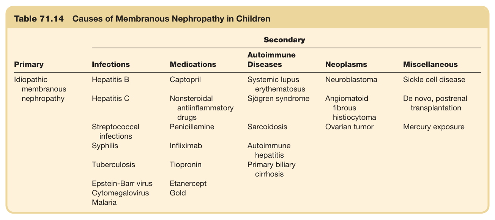

#### Table Data (CSV: [Table_71_14.csv](Table_71_14.csv))

```markdown
| Table Text (OCR) |
| :--- |
| Table 71.14  Causes of Membranous Nephropathy in Children Primary  Secondary    Infections  Medications  Autoimmune Diseases  Neoplasms  Miscellaneous    Idiopathic membranous nephropathy  Hepatitis B  Captopril  Systemic lupus erythematosus  Neuroblastoma  Sickle cell disease    Hepatitis C  Nonsteroidal antiinflammatory drugs  Sjögren syndrome  Angiomatoid fibrous histiocytoma  De novo, postrenal transplantation    Streptococcal infections  Penicillamine  Sarcoidosis  Ovarian tumor  Mercury exposure    Syphilis  Infliximab  Autoimmune hepatitis        Tuberculosis  Tiopronin  Primary biliary cirrhosis        Epstein-Barr virus  Etanercept          Cytomegalovirus  Gold          Malaria |
```

Table 71.14 Causes of Membranous Nephropathy in Children

---

### Table_71_15

#### Table Image

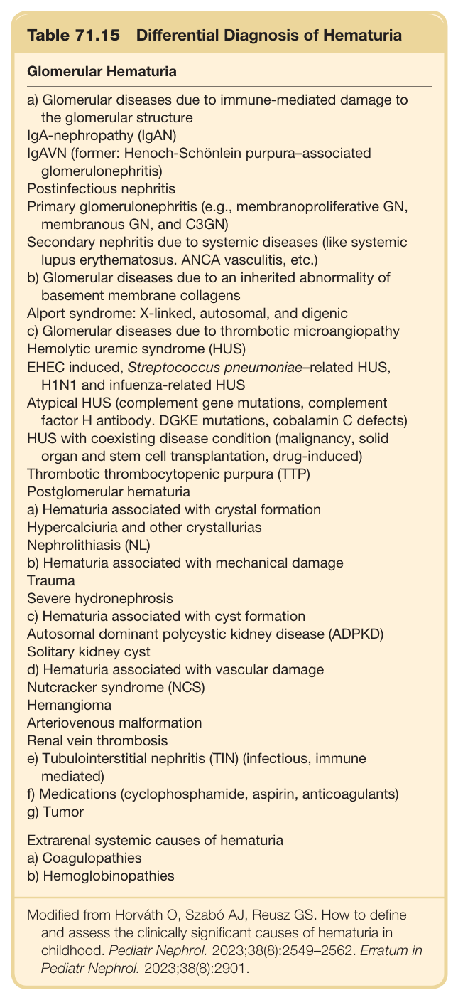

#### Table Data (CSV: [Table_71_15.csv](Table_71_15.csv))

```markdown
| Table Text (OCR) |
| :--- |
| Table 71.15  Differential Diagnosis of Hematuria Glomerular Hematuria a) Glomerular diseases due to immune-mediated damage to the glomerular structure    IgA-nephropathy (IgAN)    IgAVN (former: Henoch-Schönlein purpura-associated glomerulonephritis)    Postinfectious nephritis    Primary glomerulonephritis (e.g., membranoproliferative GN, membranous GN, and C3GN)    Secondary nephritis due to systemic diseases (like systemic lupus erythematosus. ANCA vasculitis, etc.)    b) Glomerular diseases due to an inherited abnormality of basement membrane collagens    Alport syndrome: X-linked, autosomal, and digenic    c) Glomerular diseases due to thrombotic microangiopathy    Hemolytic uremic syndrome (HUS)    EHEC induced, Streptococcus pneumoniae-related HUS, H1N1 and influenza-related HUS    Atypical HUS (complement gene mutations, complement factor H antibody. DGKE mutations, cobalamin C defects)    HUS with coexisting disease condition (malignancy, solid organ and stem cell transplantation, drug-induced)    Thrombotic thrombocytopenic purpura (TTP)    Postglomerular hematuria    a) Hematuria associated with crystal formation    Hypercalciuria and other crystallurias    Nephrolithiasis (NL)    b) Hematuria associated with mechanical damage    Trauma    Severe hydronephrosis    c) Hematuria associated with cyst formation    Autosomal dominant polycystic kidney disease (ADPKD)    Solitary kidney cyst    d) Hematuria associated with vascular damage    Nutcracker syndrome (NCS)    Hemangioma    Arteriovenous malformation    Renal vein thrombosis    e) Tubulointerstitial nephritis (TIN) (infectious, immune mediated)    f) Medications (cyclophosphamide, aspirin, anticoagulants)    g) Tumor    Extrarenal systemic causes of hematuria    a) Coagulopathies    b) Hemoglobinopathies Modified from Horváth O, Szabó AJ, Reusz GS. How to define and assess the clinically significant causes of hematuria in childhood. Pediatr Nephrol. 2023;38(8):2549–2562. Erratum in Pediatr Nephrol. 2023;38(8):2901. |
```

Table 71.15 Differential Diagnosis of Hematuria

---

### Table_71_16

#### Table Image

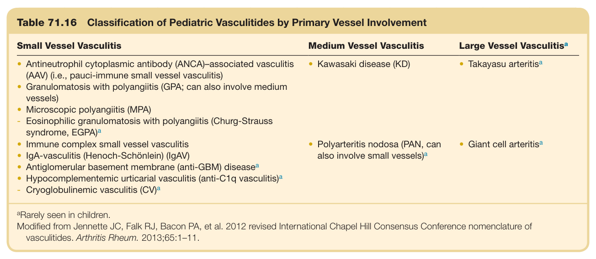

#### Table Data (CSV: [Table_71_16.csv](Table_71_16.csv))

```markdown
| Table Text (OCR) |
| :--- |
| Table 71.16  Classification of Pediatric Vasculitides by Primary Vessel Involvement Small Vessel Vasculitis  Medium Vessel Vasculitis  Large Vessel Vasculitisa    Antineutrophil cytoplasmic antibody (ANCA)-associated vasculitis (AAV) (i.e., pauci-immune small vessel vasculitis)Granulomatosis with polyangiitis (GPA; can also involve medium vessels)Microscopic polyangiitis (MPA)- Eosinophilic granulomatosis with polyangiitis (Churg-Strauss syndrome, EGPA)aImmune complex small vessel vasculitisIgA-vasculitis (Henoch-Schönlein) (IgAV)Antiglomerular basement membrane (anti-GBM) diseaseaHypocomplementemic urticarial vasculitis (anti-C1q vasculitis)a- Cryoglobulinemic vasculitis (CV)a  Kawasaki disease (KD)Polyarteritis nodosa (PAN, can also involve small vessels)a  Takayasu arteritisaGiant cell arteritisa <sup>a</sup>Rarely seen in children. Modified from Jennette JC, Falk RJ, Bacon PA, et al. 2012 revised International Chapel Hill Consensus Conference nomenclature of vasculitides. Arthritis Rheum. 2013;65:1–11. |
```

Table 71.16 Classification of Pediatric Vasculitides by Primary Vessel Involvement

---

### Table_71_17

#### Table Image

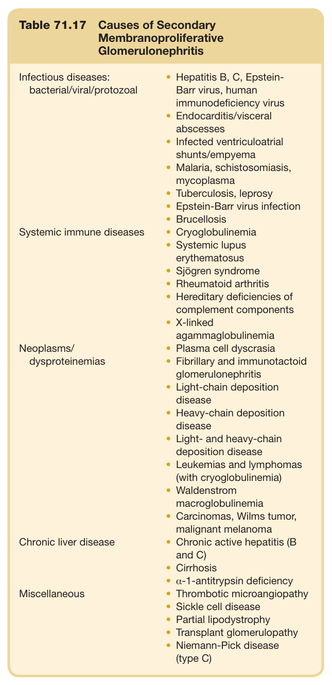

#### Table Data (CSV: [Table_71_17.csv](Table_71_17.csv))

```markdown
| Table Text (OCR) |
| :--- |
| Table 71.17 Causes of Secondary Membranoproliferative Glomerulonephritis Infectious diseases:bacterial/viral/protozoal  Hepatitis B, C, Epstein-Barr virus, human immunodeficiency virusEndocarditis/visceral abscessesInfected ventriculoatrial shunts/empyemaMalaria, schistosomiasis, mycoplasmaTuberculosis, leprosyEpstein-Barr virus infectionBrucellosis    Systemic immune diseases  CryoglobulinemiaSystemic lupus erythematosusSjögren syndromeRheumatoid arthritisHereditary deficiencies of complement componentsX-linked agammaglobulinemia    Neoplasms/dysproteinemias  Plasma cell dyscrasiaFibrillary and immunotactoid glomerulonephritisLight-chain deposition diseaseHeavy-chain deposition diseaseLight- and heavy-chain deposition diseaseLeukemias and lymphomas (with cryoglobulinemia)Waldenstrom macroglobulinemiaCarcinomas, Wilms tumor, malignant melanoma    Chronic liver disease  Chronic active hepatitis (B and C)Cirrhosis \alpha -1-antitrypsin deficiency    Miscellaneous  Thrombotic microangiopathySickle cell diseasePartial lipodystrophyTransplant glomerulopathyNiemann-Pick disease (type C) |
```

Table 71.17 Causes of Secondary Membranoproliferative Glomerulonephritis

---

### Table_71_18

#### Table Image

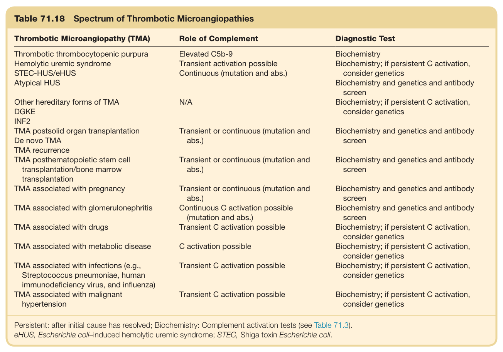

#### Table Data (CSV: [Table_71_18.csv](Table_71_18.csv))

```markdown
| Table Text (OCR) |
| :--- |
| Table 71.18  Spectrum of Thrombotic Microangiopathies Thrombotic Microangiopathy (TMA)  Role of Complement  Diagnostic Test    Thrombotic thrombocytopenic purpura  Elevated C5b-9  Biochemistry    Hemolytic uremic syndrome  Transient activation possible  Biochemistry; if persistent C activation, consider genetics    STEC-HUS/eHUS  Continuous (mutation and abs.)  Biochemistry and genetics and antibody screen    Atypical HUS        Other hereditary forms of TMA  N/A  Biochemistry; if persistent C activation, consider genetics    DGKE        INF2        TMA postsolid organ transplantation  Transient or continuous (mutation and abs.)  Biochemistry and genetics and antibody screen    De novo TMA        TMA recurrence        TMA posthematopoietic stem cell transplantation/bone marrow transplantation  Transient or continuous (mutation and abs.)  Biochemistry and genetics and antibody screen    TMA associated with pregnancy  Transient or continuous (mutation and abs.)  Biochemistry and genetics and antibody screen    TMA associated with glomerulonephritis  Continuous C activation possible (mutation and abs.)  Biochemistry and genetics and antibody screen    TMA associated with drugs  Transient C activation possible  Biochemistry; if persistent C activation, consider genetics    TMA associated with metabolic disease  C activation possible  Biochemistry; if persistent C activation, consider genetics    TMA associated with infections (e.g., Streptococcus pneumoniae, human immunodeficiency virus, and influenza)  Transient C activation possible  Biochemistry; if persistent C activation, consider genetics    TMA associated with malignant hypertension  Transient C activation possible  Biochemistry; if persistent C activation, consider genetics Persistent: after initial cause has resolved; Biochemistry: Complement activation tests (see Table 71.3). eHUS, Escherichia coli–induced hemolytic uremic syndrome; STEC, Shiga toxin Escherichia coli. |
```

Table 71.18 Spectrum of Thrombotic Microangiopathies

---

### Table_71_19

#### Table Image

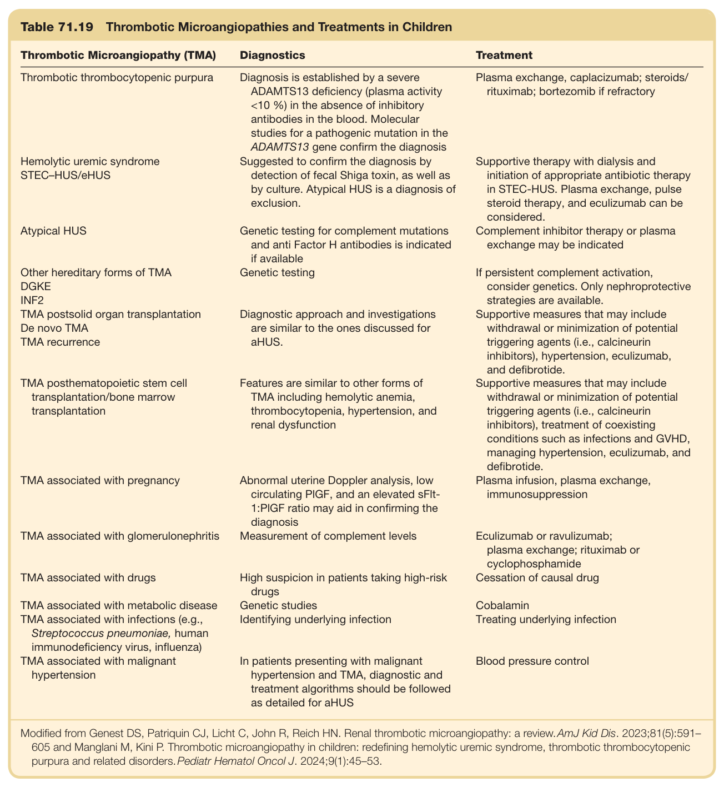

#### Table Data (CSV: [Table_71_19.csv](Table_71_19.csv))

```markdown
| Table Text (OCR) |
| :--- |
| Table 71.19  Thrombotic Microangiopathies and Treatments in Children Thrombotic Microangiopathy (TMA)  Diagnostics  Treatment    Thrombotic thrombocytopenic purpura  Diagnosis is established by a severe ADAMTS13 deficiency (plasma activity <10 %) in the absence of inhibitory antibodies in the blood. Molecular studies for a pathogenic mutation in the ADAMTS13 gene confirm the diagnosis  Plasma exchange, caplacizumab; steroids/rituximab; bortezomib if refractory    Hemolytic uremic syndromeSTEC-HUS/eHUS  Suggested to confirm the diagnosis by detection of fecal Shiga toxin, as well as by culture. Atypical HUS is a diagnosis of exclusion.  Supportive therapy with dialysis and initiation of appropriate antibiotic therapy in STEC-HUS. Plasma exchange, pulse steroid therapy, and eculizumab can be considered.    Atypical HUS  Genetic testing for complement mutations and anti Factor H antibodies is indicated if available  Complement inhibitor therapy or plasma exchange may be indicated    Other hereditary forms of TMADGKEINF2  Genetic testing  If persistent complement activation, consider genetics. Only nephroprotective strategies are available.    TMA postsolid organ transplantationDe novo TMATMA recurrence  Diagnostic approach and investigations are similar to the ones discussed for aHUS.  Supportive measures that may include withdrawal or minimization of potential triggering agents (i.e., calcineurin inhibitors), hypertension, eculizumab, and defibrotide.    TMA posthematopoietic stem cell transplantation/bone marrow transplantation  Features are similar to other forms of TMA including hemolytic anemia, thrombocytopenia, hypertension, and renal dysfunction  Supportive measures that may include withdrawal or minimization of potential triggering agents (i.e., calcineurin inhibitors), treatment of coexisting conditions such as infections and GVHD, managing hypertension, eculizumab, and defibrotide.    TMA associated with pregnancy  Abnormal uterine Doppler analysis, low circulating PIGF, and an elevated sFlt-1:PIGF ratio may aid in confirming the diagnosis  Plasma infusion, plasma exchange, immunosuppression    TMA associated with glomerulonephritis  Measurement of complement levels  Eculizumab or ravulizumab; plasma exchange; rituximab or cyclophosphamide    TMA associated with drugs  High suspicion in patients taking high-risk drugs  Cessation of causal drug    TMA associated with metabolic diseaseTMA associated with infections (e.g., Streptococcus pneumoniae, human immunodeficiency virus, influenza)  Genetic studiesIdentifying underlying infection  CobalaminTreating underlying infection    TMA associated with malignant hypertension  In patients presenting with malignant hypertension and TMA, diagnostic and treatment algorithms should be followed as detailed for aHUS  Blood pressure control Modified from Genest DS, Patriquin CJ, Licht C, John R, Reich HN. Renal thrombotic microangiopathy: a review.AmJ Kid Dis. 2023;81(5):591– 605 and Manglani M, Kini P. Thrombotic microangiopathy in children: redefining hemolytic uremic syndrome, thrombotic thrombocytopenic purpura and related disorders.Pediatr Hematol Oncol J. 2024;9(1):45–53. |
```

Table 71.19 Thrombotic Microangiopathies and Treatments in Children

---

### Table_71_20

#### Table Image

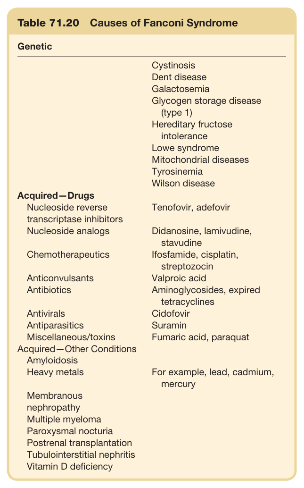

#### Table Data (CSV: [Table_71_20.csv](Table_71_20.csv))

```markdown
| Table Text (OCR) |
| :--- |
| Table 71.20  Causes of Fanconi Syndrome Genetic CystinosisDent diseaseGalactosemiaGlycogen storage disease (type 1)Hereditary fructose intoleranceLowe syndromeMitochondrial diseasesTyrosinemiaWilson disease    Acquired—Drugs    Nucleoside reverse transcriptase inhibitors  Tenofovir, adefovir    Nucleoside analogs  Didanosine, lamivudine, stavudine    Chemotherapeutics  Ifosfamide, cisplatin, streptozocin    Anticonvulsants  Valproic acid    Antibiotics  Aminoglycosides, expired tetracyclines    Antivirals  Cidofovir    Antiparasitics  Suramin    Miscellaneous/toxins  Fumaric acid, paraquat    Acquired—Other Conditions Amyloidosis      Heavy metals  For example, lead, cadmium, mercury    Membranous nephropathy      Multiple myeloma      Paroxysmal nocturia      Postrenal transplantation      Tubulointerstitial nephritis      Vitamin D deficiency |
```

Table 71.20 Causes of Fanconi Syndrome

---

### Table_71_21

#### Table Image

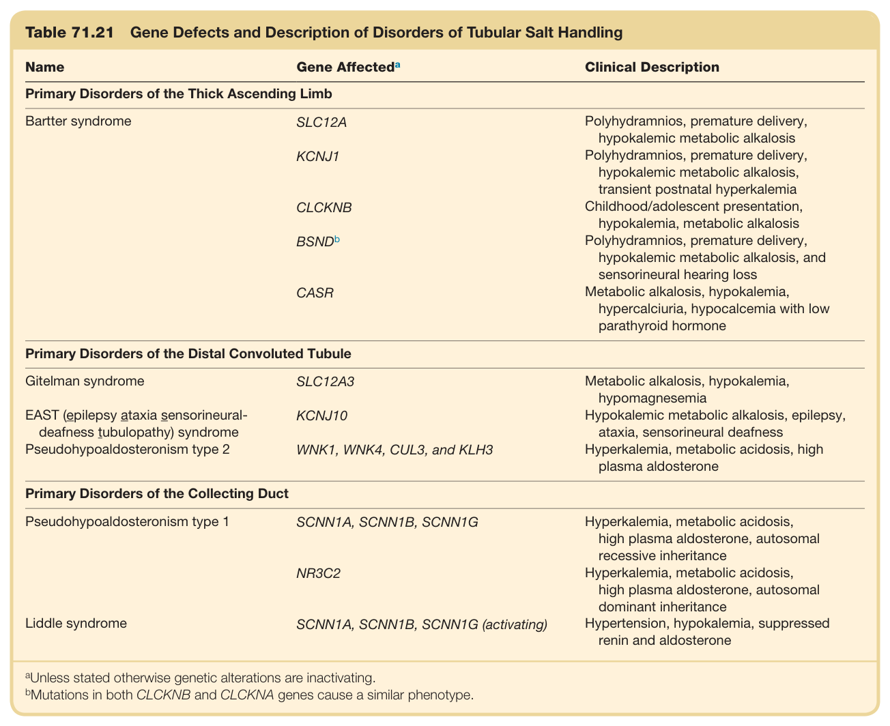

#### Table Data (CSV: [Table_71_21.csv](Table_71_21.csv))

```markdown
| Table Text (OCR) |
| :--- |
| Table 71.21  Gene Defects and Description of Disorders of Tubular Salt Handling Name  Gene Affecteda  Clinical Description    Primary Disorders of the Thick Ascending Limb    Bartter syndrome  SLC12A  Polyhydramnios, premature delivery, hypokalemic metabolic alkalosis    KCNJ1  Polyhydramnios, premature delivery, hypokalemic metabolic alkalosis, transient postnatal hyperkalemia    CLCKNB  Childhood/adolescent presentation, hypokalemia, metabolic alkalosis     BSND^b   Polyhydramnios, premature delivery, hypokalemic metabolic alkalosis, and sensorineural hearing loss    CASR  Metabolic alkalosis, hypokalemia, hypercalciuria, hypocalcemia with low parathyroid hormone    Primary Disorders of the Distal Convoluted Tubule    Gitelman syndrome  SLC12A3  Metabolic alkalosis, hypokalemia, hypomagnesemia    EAST (epilepsy ataxia sensorineural-deafness tubulopathy) syndrome  KCNJ10  Hypokalemic metabolic alkalosis, epilepsy, ataxia, sensorineural deafness    Pseudohypoaldosteronism type 2  WNK1, WNK4, CUL3, and KLH3  Hyperkalemia, metabolic acidosis, high plasma aldosterone    Primary Disorders of the Collecting Duct    Pseudohypoaldosteronism type 1  SCNN1A, SCNN1B, SCNN1G  Hyperkalemia, metabolic acidosis, high plasma aldosterone, autosomal recessive inheritance    NR3C2  Hyperkalemia, metabolic acidosis, high plasma aldosterone, autosomal dominant inheritance    Liddle syndrome  SCNN1A, SCNN1B, SCNN1G (activating)  Hypertension, hypokalemia, suppressed renin and aldosterone <sup>a</sup>Unless stated otherwise genetic alterations are inactivating. <sup>b</sup>Mutations in both CLCKNB and CLCKNA genes cause a similar phenotype. |
```

Table 71.21 Gene Defects and Description of Disorders of Tubular Salt Handling

---

### Table_71_22

#### Table Image

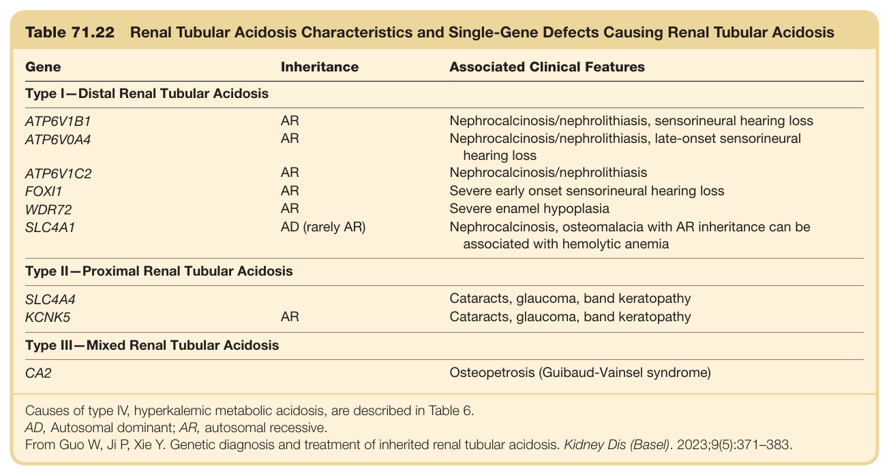

#### Table Data (CSV: [Table_71_22.csv](Table_71_22.csv))

```markdown
| Table Text (OCR) |
| :--- |
| Table 71.22  Renal Tubular Acidosis Characteristics and Single-Gene Defects Causing Renal Tubular Acidosis Gene  Inheritance  Associated Clinical Features    Type I—Distal Renal Tubular Acidosis    ATP6V1B1  AR  Nephrocalcinosis/nephrolithiasis, sensorineural hearing loss    ATP6V0A4  AR  Nephrocalcinosis/nephrolithiasis, late-onset sensorineural hearing loss    ATP6V1C2  AR  Nephrocalcinosis/nephrolithiasis    FOXI1  AR  Severe early onset sensorineural hearing loss    WDR72  AR  Severe enamel hypoplasia    SLC4A1  AD (rarely AR)  Nephrocalcinosis, osteomalacia with AR inheritance can be associated with hemolytic anemia    Type II—Proximal Renal Tubular Acidosis    SLC4A4    Cataracts, glaucoma, band keratopathy    KCNK5  AR  Cataracts, glaucoma, band keratopathy    Type III—Mixed Renal Tubular Acidosis    CA2    Osteopetrosis (Guibaud-Vainsel syndrome) Causes of type IV, hyperkalemic metabolic acidosis, are described in Table 6. AD, Autosomal dominant; AR, autosomal recessive. From Guo W, Ji P, Xie Y. Genetic diagnosis and treatment of inherited renal tubular acidosis. Kidney Dis (Basel). 2023;9(5):371–383. |
```

Table 71.22 Renal Tubular Acidosis Characteristics and Single-Gene Defects Causing Renal Tubular Acidosis

---

### Table_71_23

#### Table Image

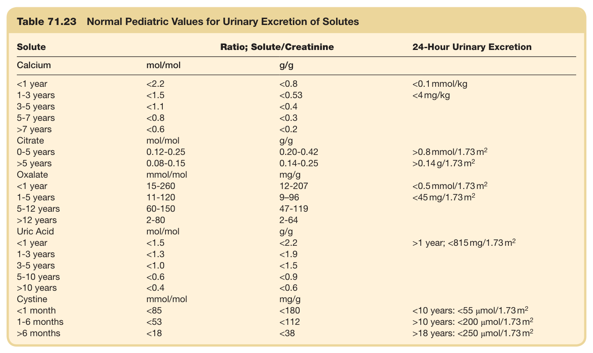

#### Table Data (CSV: [Table_71_23.csv](Table_71_23.csv))

```markdown
| Table Text (OCR) |
| :--- |
| Table 71.23  Normal Pediatric Values for Urinary Excretion of Solutes Solute  Ratio; Solute/Creatinine  24-Hour Urinary Excretion    Calcium  mol/mol  g/g      <1 year  <2.2  <0.8  <0.1 mmol/kg    1-3 years  <1.5  <0.53  <4 mg/kg    3-5 years  <1.1  <0.4      5-7 years  <0.8  <0.3      >7 years  <0.6  <0.2      Citrate  mol/mol  g/g      0-5 years  0.12-0.25  0.20-0.42  >0.8 mmol/1.73  m^{2}     >5 years  0.08-0.15  0.14-0.25  >0.14 g/1.73  m^{2}     Oxalate  mmol/mol  mg/g      <1 year  15-260  12-207  <0.5 mmol/1.73  m^{2}     1-5 years  11-120  9-96  <45 mg/1.73  m^{2}     5-12 years  60-150  47-119      >12 years  2-80  2-64      Uric Acid  mol/mol  g/g      <1 year  <1.5  <2.2  >1 year; <815 mg/1.73  m^{2}     1-3 years  <1.3  <1.9      3-5 years  <1.0  <1.5      5-10 years  <0.6  <0.9      >10 years  <0.4  <0.6      Cystine  mmol/mol  mg/g      <1 month  <85  <180  <10 years: <55  \mu mol/1.73 m^{2}     1-6 months  <53  <112  >10 years: <200  \mu mol/1.73 m^{2}     >6 months  <18  <38  >18 years: <250  \mu mol/1.73 m^{2} |
```

Table 71.23 Normal Pediatric Values for Urinary Excretion of Solutes

---

### Table_71_24

#### Table Images (2 Parts)

- **Part 1 (Page 58)**:
  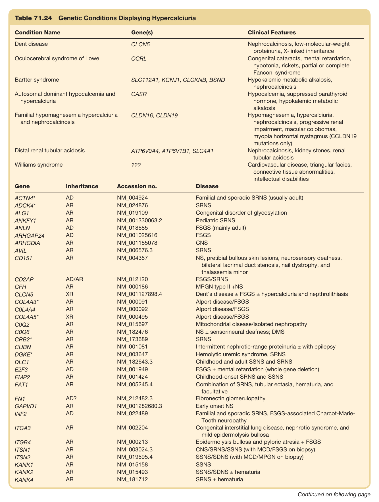

- **Part 2 (Page 59)**:
  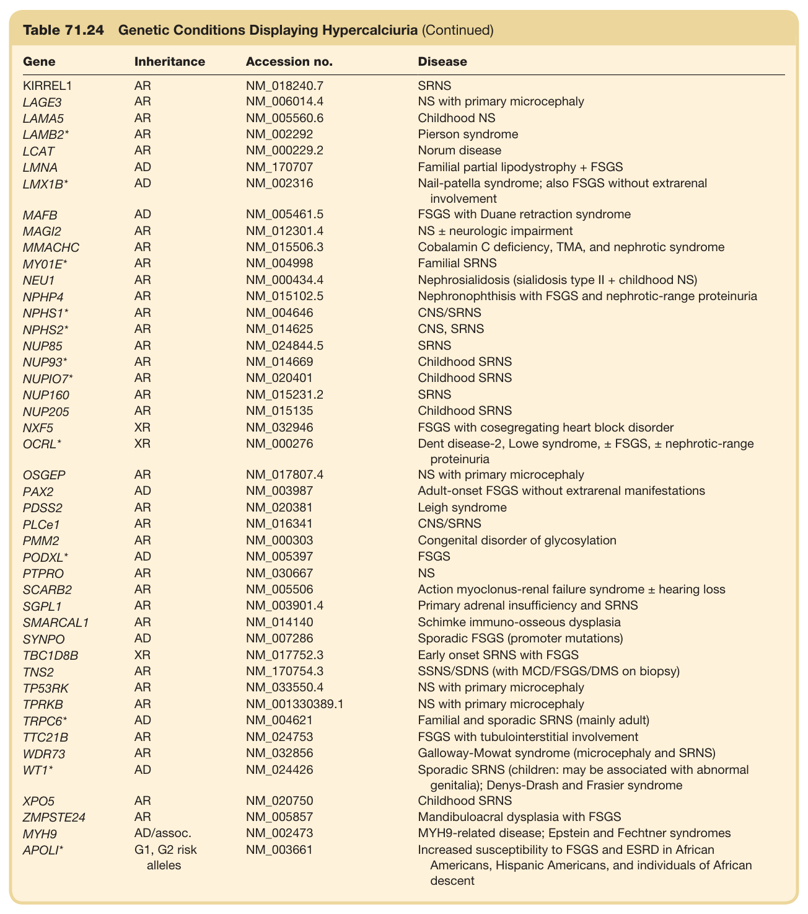

#### Table Data (CSV: [Table_71_24.csv](Table_71_24.csv))

```markdown
| Table Text (OCR) |
| :--- |
| Table 71.24  Genetic Conditions Displaying Hypercalciuria Condition Name  Gene(s)  Clinical Features    Dent disease  CLCN5  Nephrocalcinosis, low-molecular-weight proteinuria, X-linked inheritance    Oculocerebral syndrome of Lowe  OCRL  Congenital cataracts, mental retardation, hypotonia, rickets, partial or complete Fanconi syndrome    Bartter syndrome  SLC112A1, KCNJ1, CLCKNB, BSND  Hypokalemic metabolic alkalosis, nephrocalcinosis    Autosomal dominant hypocalcemia and hypercalciuria  CASR  Hypocalcemia, suppressed parathyroid hormone, hypokalemic metabolic alkalosis    Familial hypomagnesemia hypercalciuria and nephrocalcinosis  CLDN16, CLDN19  Hypomagnesemia, hypercalciuria, nephrocalcinosis, progressive renal impairment, macular colobomas, myopia horizontal nystagmus (CCLDN19 mutations only)    Distal renal tubular acidosis  ATP6V0A4, ATP6V1B1, SLC4A1  Nephrocalcinosis, kidney stones, renal tubular acidosis    Williams syndrome  ???  Cardiovascular disease, triangular facies, connective tissue abnormalities, intellectual disabilities    Gene  Inheritance  Accession no.  Disease      ACTN4*  AD  NM_004924  Familial and sporadic SRNS (usually adult)    ADCK4*  AR  NM_024876  SRNS    ALG1  AR  NM_019109  Congenital disorder of glycosylation    ANKFY1  AR  NM_001330063.2  Pediatric SRNS    ANLN  AD  NM_018685  FSGS (mainly adult)    ARHGAP24  AD  NM_001025616  FSGS    ARHGDIA  AR  NM_001185078  CNS    AVIL  AR  NM_006576.3  SRNS    CD151  AR  NM_004357  NS, pretibial bullous skin lesions, neurosensory deafness, bilateral lacrimal duct stenosis, nail dystrophy, and thalassemia minor    CD2AP  AD/AR  NM_012120  FSGS/SRNS    CFH  AR  NM_000186  MPGN type II +NS    CLCN5  XR  NM_001127898.4  Dent's disease ± FSGS ± hypercalciuria and nephrolithiasis    COL4A3*  AR  NM_000091  Alport disease/FSGS    COL4A4  AR  NM_000092  Alport disease/FSGS    COL4A5*  XR  NM_000495  Alport disease/FSGS    C0Q2  AR  NM_015697  Mitochondrial disease/isolated nephropathy    C0Q6  AR  NM_182476  NS ± sensorineural deafness; DMS    CRB2*  AR  NM_173689  SRNS    CUBN  AR  NM_001081  Intermittent nephrotic-range proteinuria ± with epilepsy    DGKE*  AR  NM_003647  Hemolytic uremic syndrome, SRNS    DLC1  AR  NM_182643.3  Childhood and adult SSNS and SRNS    E2F3  AD  NM_001949  FSGS + mental retardation (whole gene deletion)    EMP2  AR  NM_001424  Childhood-onset SRNS and SSNS    FAT1  AR  NM_005245.4  Combination of SRNS, tubular ectasia, hematuria, and facultative    FN1  AD?  NM_212482.3  Fibronectin glomerulopathy    GAPVD1  AR  NM_001282680.3  Early onset NS    INF2  AD  NM_022489  Familial and sporadic SRNS, FSGS-associated Charcot-Marie-Tooth neuropathy    ITGA3  AR  NM_002204  Congenital interstitial lung disease, nephrotic syndrome, and mild epidermolysis bullosa    ITGB4  AR  NM_000213  Epidermolysis bullosa and pyloric atresia + FSGS    ITSN1  AR  NM_003024.3  CNS/SRNS/SSNS (with MCD/FSGS on biopsy)    ITSN2  AR  NM_019595.4  SSNS/SDNS (with MCD/MPGN on biopsy)    KANK1  AR  NM_015158  SSNS    KANK2  AR  NM_015493  SSNS/SDNS ± hematuria    KANK4  AR  NM_181712  SRNS + hematuria |
```

Table 71.24 Genetic Conditions Displaying Hypercalciuria (Continued)

---
