# 72. Kidney Replacement Therapy (Dialysis and Transplantation) in Children - Figures and Tables Index

This document lists all figures and tables extracted from `72. Kidney Replacement Therapy (Dialysis and Transplantation) in Children.pdf`.

## Table of Contents
- [Figures](#figures)
- [Tables](#tables)

---

## Figures

### Fig_72_1

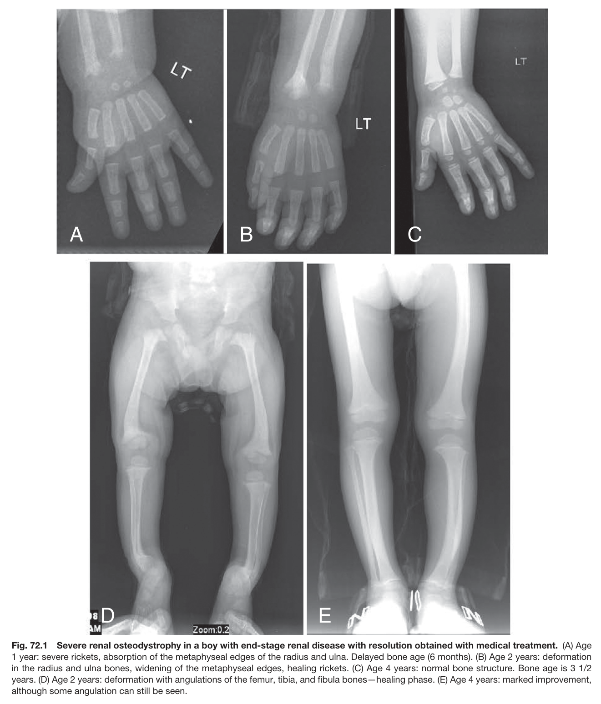

Fig. 72.1 Severe renal osteodystrophy in a boy with end-stage renal disease with resolution obtained with medical treatment. (A) Age 1 year: severe rickets, absorption of the metaphyseal edges of the radius and ulna. Delayed bone age (6 months). (B) Age 2 years: deformation in the radius and ulna bones, widening of the metaphyseal edges, healing rickets. (C) Age 4 years: normal bone structure. Bone age is 3 1/2 years. (D) Age 2 years: deformation with angulations of the femur, tibia, and fibula bones—healing phase. (E) Age 4 years: marked improvement, although some angulation can still be seen.

---

### Fig_72_2

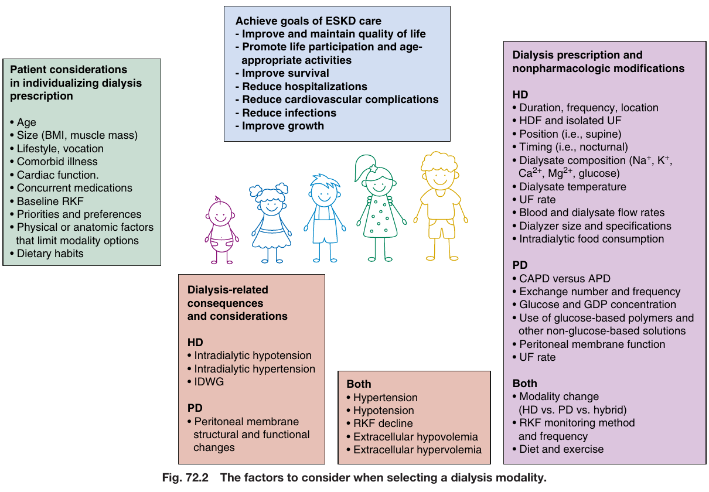

Fig. 72.2 The factors to consider when selecting a dialysis modality.

---

### Fig_72_3

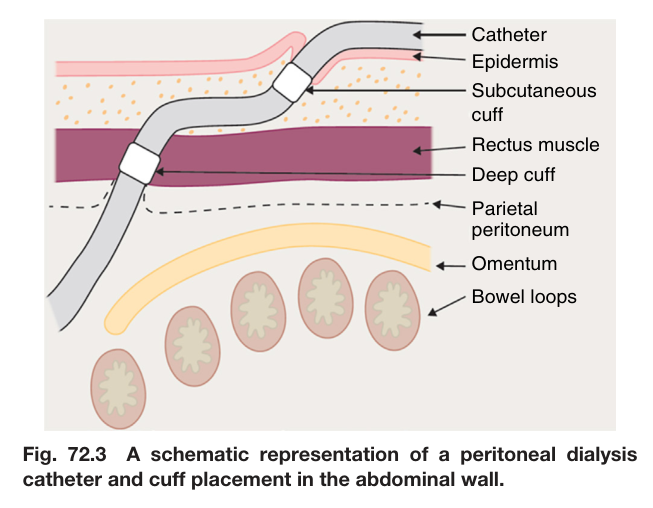

Fig. 72.3 A schematic representation of a peritoneal dialysis catheter and cuff placement in the abdominal wall.

---

### Fig_72_4

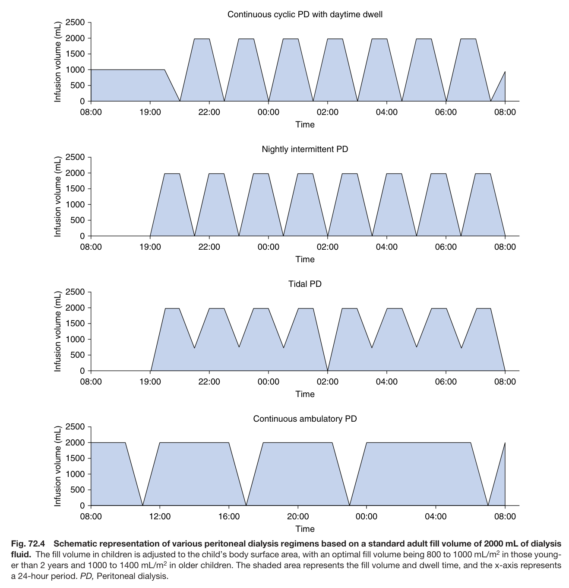

Fig. 72.4 Schematic representation of various peritoneal dialysis regimens based on a standard adult fill volume of 2000 mL of dialysis fluid. The fill volume in children is adjusted to the child’s body surface area, with an optimal fill volume being 800 to 1000 mL/m<sup>2</sup> in those young- er than 2 years and 1000 to 1400 mL/m<sup>2</sup> in older children. The shaded area represents the fill volume and dwell time, and the x-axis represents a 24-hour period. PD, Peritoneal dialysis.

---

### Fig_72_5

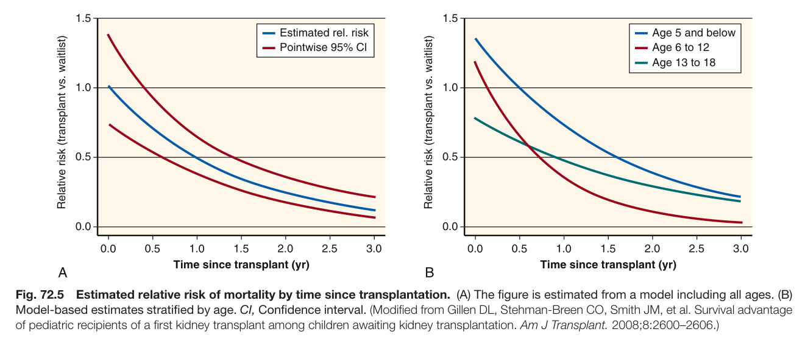

Fig. 72.5 Estimated relative risk of mortality by time since transplantation. (A) The figure is estimated from a model including all ages. (B) Model-based estimates stratified by age. CI, Confidence interval. (Modified from Gillen DL, Stehman-Breen CO, Smith JM, et al. Survival advantage of pediatric recipients of a first kidney transplant among children awaiting kidney transplantation. Am J Transplant. 2008;8:2600–2606.)

---

### Fig_72_6

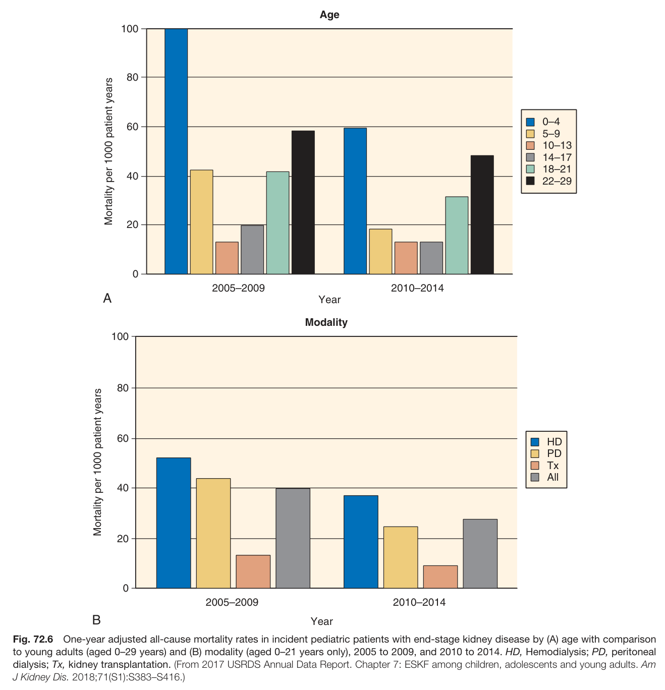

Fig. 72.6 One-year adjusted all-cause mortality rates in incident pediatric patients with end-stage kidney disease by (A) age with comparison to young adults (aged 0–29 years) and (B) modality (aged 0–21 years only), 2005 to 2009, and 2010 to 2014. HD, Hemodialysis; PD, peritonea dialysis; Tx, kidney transplantation. (From 2017 USRDS Annual Data Report. Chapter 7: ESKF among children, adolescents and young adults. Am J Kidney Dis. 2018;71(S1):S383–S416.)

---

## Tables

### Table_72_1

#### Table Image

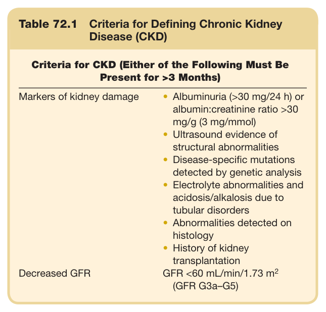

#### Table Data (CSV: [Table_72_1.csv](Table_72_1.csv))

```markdown
| Table Text (OCR) |
| :--- |
| Table 72.1  Criteria for Defining Chronic Kidney Disease (CKD) Criteria for CKD (Either of the Following Must Be Present for >3 Months)    Markers of kidney damage  Albuminuria (>30 mg/24 h) or albumin:creatinine ratio >30 mg/g (3 mg/mmol)Ultrasound evidence of structural abnormalitiesDisease-specific mutations detected by genetic analysisElectrolyte abnormalities and acidosis/alkalosis due to tubular disordersAbnormalities detected on histologyHistory of kidney transplantation    Decreased GFR  GFR <60 mL/min/1.73  m^{2}  (GFR G3a–G5) |
```

Table 72.1 Criteria for Defining Chronic Kidney Disease (CKD)

---

### Table_72_2

#### Table Image

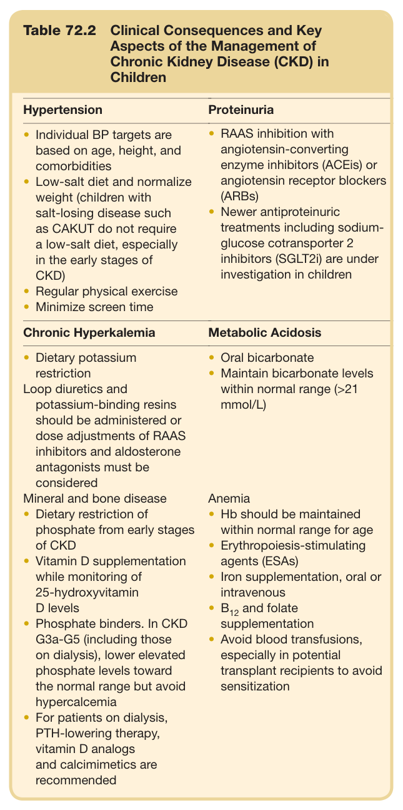

#### Table Data (CSV: [Table_72_2.csv](Table_72_2.csv))

```markdown
| Table Text (OCR) |
| :--- |
| Table 72.2 Clinical Consequences and Key Aspects of the Management of Chronic Kidney Disease (CKD) in Children Hypertension  Proteinuria    Individual BP targets are based on age, height, and comorbiditiesLow-salt diet and normalize weight (children with salt-losing disease such as CAKUT do not require a low-salt diet, especially in the early stages of CKD)Regular physical exerciseMinimize screen time  RAAS inhibition with angiotensin-converting enzyme inhibitors (ACEis) or angiotensin receptor blockers (ARBs)Newer antiproteinuric treatments including sodium-glucose cotransporter 2 inhibitors (SGLT2i) are under investigation in children    Chronic Hyperkalemia  Metabolic Acidosis    Dietary potassium restrictionLoop diuretics and potassium-binding resins should be administered or dose adjustments of RAAS inhibitors and aldosterone antagonists must be considered  Oral bicarbonateMaintain bicarbonate levels within normal range (>21 mmol/L)    Mineral and bone diseaseDietary restriction of phosphate from early stages of CKDVitamin D supplementation while monitoring of 25-hydroxyvitamin D levelsPhosphate binders. In CKD G3a-G5 (including those on dialysis), lower elevated phosphate levels toward the normal range but avoid hypercalcemiaFor patients on dialysis, PTH-lowering therapy, vitamin D analogs and calcimimetics are recommended  AnemiaHb should be maintained within normal range for ageErythropoiesis-stimulating agents (ESAs)Iron supplementation, oral or intravenous B_{12}  and folate supplementationAvoid blood transfusions, especially in potential transplant recipients to avoid sensitization |
```

Table 72.2 Clinical Consequences and Key Aspects of the Management of Chronic Kidney Disease (CKD) in Children

---

### Table_72_3

#### Table Image

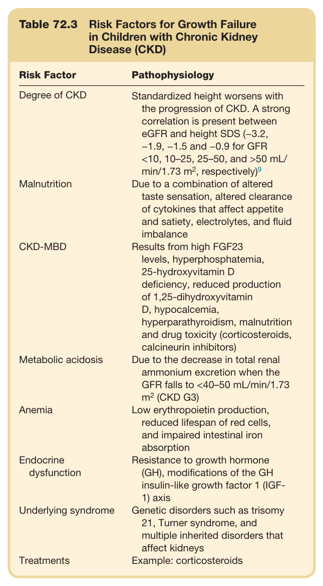

#### Table Data (CSV: [Table_72_3.csv](Table_72_3.csv))

```markdown
| Table Text (OCR) |
| :--- |
| Table 72.3  Risk Factors for Growth Failure in Children with Chronic Kidney Disease (CKD) Risk Factor  Pathophysiology    Degree of CKD  Standardized height worsens with the progression of CKD. A strong correlation is present between eGFR and height SDS (-3.2, -1.9, -1.5 and -0.9 for GFR <10, 10–25, 25–50, and >50 mL/min/1.73  m^{2} , respectively) ^{9}     Malnutrition  Due to a combination of altered taste sensation, altered clearance of cytokines that affect appetite and satiety, electrolytes, and fluid imbalance    CKD-MBD  Results from high FGF23 levels, hyperphosphatemia, 25-hydroxyvitamin D deficiency, reduced production of 1,25-dihydroxyvitamin D, hypocalcemia, hyperparathyroidism, malnutrition and drug toxicity (corticosteroids, calcineurin inhibitors)    Metabolic acidosis  Due to the decrease in total renal ammonium excretion when the GFR falls to <40–50 mL/min/1.73  m^{2}  (CKD G3)    Anemia  Low erythropoietin production, reduced lifespan of red cells, and impaired intestinal iron absorption    Endocrine dysfunction  Resistance to growth hormone (GH), modifications of the GH insulin-like growth factor 1 (IGF-1) axis    Underlying syndrome  Genetic disorders such as trisomy 21, Turner syndrome, and multiple inherited disorders that affect kidneys    Treatments  Example: corticosteroids |
```

Table 72.3 Risk Factors for Growth Failure in Children with Chronic Kidney Disease (CKD)

---

### Table_72_4

#### Table Image

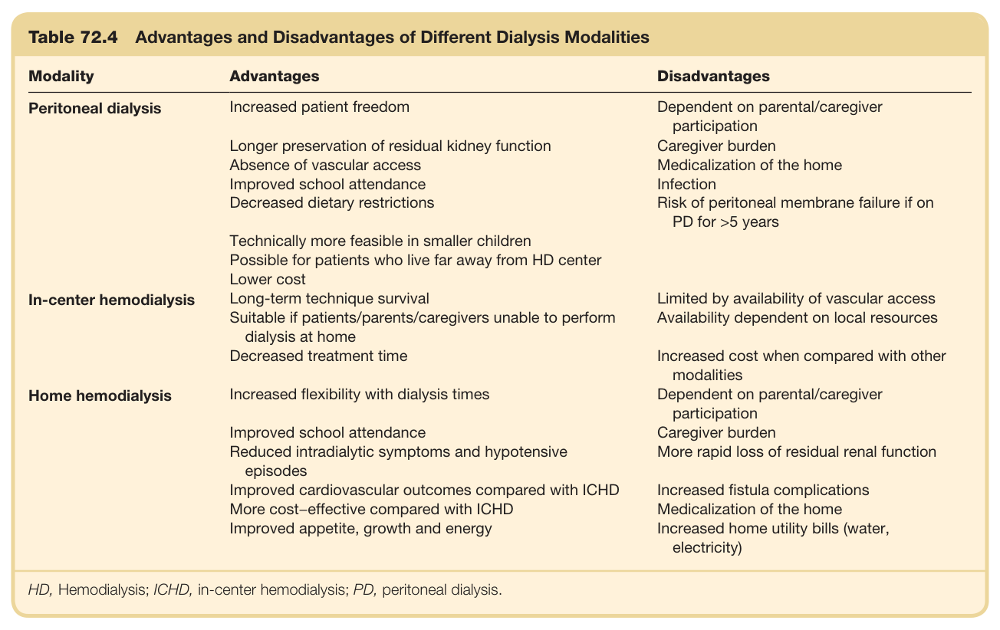

#### Table Data (CSV: [Table_72_4.csv](Table_72_4.csv))

```markdown
| Table Text (OCR) |
| :--- |
| Table 72.4  Advantages and Disadvantages of Different Dialysis Modalities Modality  Advantages  Disadvantages    Peritoneal dialysis  Increased patient freedom  Dependent on parental/caregiver participation    Longer preservation of residual kidney function  Caregiver burden    Absence of vascular access  Medicalization of the home    Improved school attendance  Infection    Decreased dietary restrictions  Risk of peritoneal membrane failure if on PD for >5 years    Technically more feasible in smaller children      Possible for patients who live far away from HD center      Lower cost      In-center hemodialysis  Long-term technique survival  Limited by availability of vascular access    Suitable if patients/parents/caregivers unable to perform dialysis at home  Availability dependent on local resources    Decreased treatment time  Increased cost when compared with other modalities    Home hemodialysis  Increased flexibility with dialysis times  Dependent on parental/caregiver participation    Improved school attendance  Caregiver burden    Reduced intradialytic symptoms and hypotensive episodes  More rapid loss of residual renal function    Improved cardiovascular outcomes compared with ICHD  Increased fistula complications    More cost-effective compared with ICHD  Medicalization of the home    Improved appetite, growth and energy  Increased home utility bills (water, electricity) HD, Hemodialysis; ICHD, in-center hemodialysis; PD, peritoneal dialysis. |
```

Table 72.4 Advantages and Disadvantages of Different Dialysis Modalities

---

### Table_72_5

#### Table Image

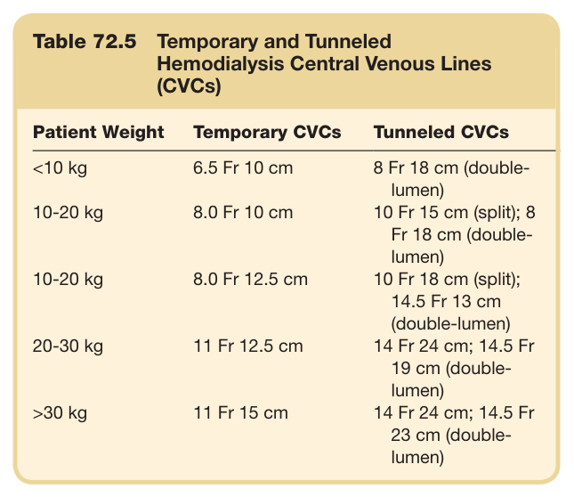

#### Table Data (CSV: [Table_72_5.csv](Table_72_5.csv))

```markdown
| Table Text (OCR) |
| :--- |
| Table 72.5 Temporary and Tunneled Hemodialysis Central Venous Lines (CVCs) Patient Weight  Temporary CVCs  Tunneled CVCs    <10 kg  6.5 Fr 10 cm  8 Fr 18 cm (double-lumen)    10-20 kg  8.0 Fr 10 cm  10 Fr 15 cm (split); 8 Fr 18 cm (double-lumen)    10-20 kg  8.0 Fr 12.5 cm  10 Fr 18 cm (split); 14.5 Fr 13 cm (double-lumen)    20-30 kg  11 Fr 12.5 cm  14 Fr 24 cm; 14.5 Fr 19 cm (double-lumen)    >30 kg  11 Fr 15 cm  14 Fr 24 cm; 14.5 Fr 23 cm (double-lumen) |
```

Table 72.5 Temporary and Tunneled Hemodialysis Central Venous Lines (CVCs)

---

### Table_72_6

#### Table Image

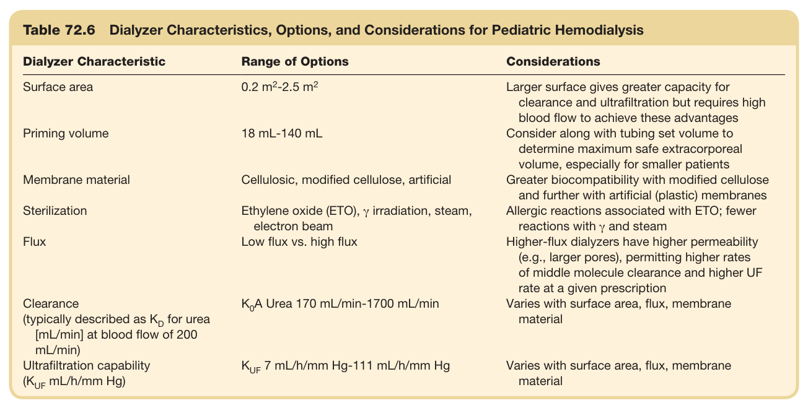

#### Table Data (CSV: [Table_72_6.csv](Table_72_6.csv))

```markdown
| Table Text (OCR) |
| :--- |
| Table 72.6 Dialyzer Characteristics, Options, and Considerations for Pediatric Hemodialysis Dialyzer Characteristic  Range of Options  Considerations    Surface area   0.2 \, \text{m}^{2} - 2.5 \, \text{m}^{2}   Larger surface gives greater capacity for clearance and ultrafiltration but requires high blood flow to achieve these advantages    Priming volume  18 mL-140 mL  Consider along with tubing set volume to determine maximum safe extracorporeal volume, especially for smaller patients    Membrane material  Cellulosic, modified cellulose, artificial  Greater biocompatibility with modified cellulose and further with artificial (plastic) membranes    Sterilization  Ethylene oxide (ETO),  \gamma  irradiation, steam, electron beam  Allergic reactions associated with ETO; fewer reactions with  \gamma  and steam    Flux  Low flux vs. high flux  Higher-flux dialyzers have higher permeability (e.g., larger pores), permitting higher rates of middle molecule clearance and higher UF rate at a given prescription    Clearance (typically described as  K_{D}  for urea [mL/min] at blood flow of 200 mL/min)   K_{0}A  Urea 170 mL/min-1700 mL/min  Varies with surface area, flux, membrane material    Ultrafiltration capability ( K_{UF}  mL/h/mm Hg)   K_{UF}  7 mL/h/mm Hg-111 mL/h/mm Hg  Varies with surface area, flux, membrane material |
```

Table 72.6 Dialyzer Characteristics, Options, and Considerations for Pediatric Hemodialysis

---

### Table_72_7

#### Table Image

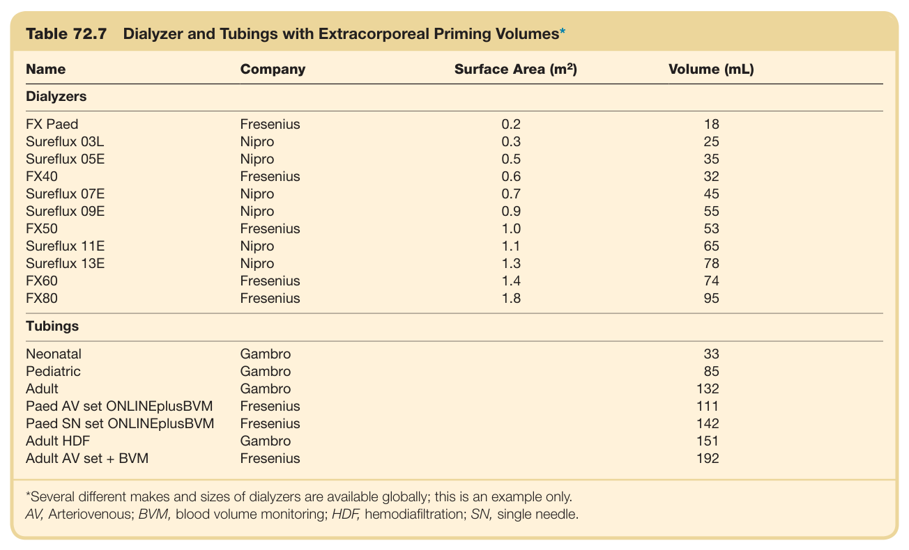

#### Table Data (CSV: [Table_72_7.csv](Table_72_7.csv))

```markdown
| Table Text (OCR) |
| :--- |
| Table 72.7  Dialyzer and Tubings with Extracorporeal Priming Volumes* Name  Company  Surface Area (m2)  Volume (mL)    Dialyzers    FX Paed  Fresenius  0.2  18    Sureflux 03L  Nipro  0.3  25    Sureflux 05E  Nipro  0.5  35    FX40  Fresenius  0.6  32    Sureflux 07E  Nipro  0.7  45    Sureflux 09E  Nipro  0.9  55    FX50  Fresenius  1.0  53    Sureflux 11E  Nipro  1.1  65    Sureflux 13E  Nipro  1.3  78    FX60  Fresenius  1.4  74    FX80  Fresenius  1.8  95    Tubings    Neonatal  Gambro    33    Pediatric  Gambro    85    Adult  Gambro    132    Paed AV set ONLINEplusBVM  Fresenius    111    Paed SN set ONLINEplusBVM  Fresenius    142    Adult HDF  Gambro    151    Adult AV set + BVM  Fresenius    192 *Several different makes and sizes of dialyzers are available globally; this is an example only. AV, Arteriovenous; BVM, blood volume monitoring; HDF, hemodiafiltration; SN, single needle. |
```

Table 72.7 Dialyzer and Tubings with Extracorporeal Priming Volumes\*

---

### Table_72_8

#### Table Image

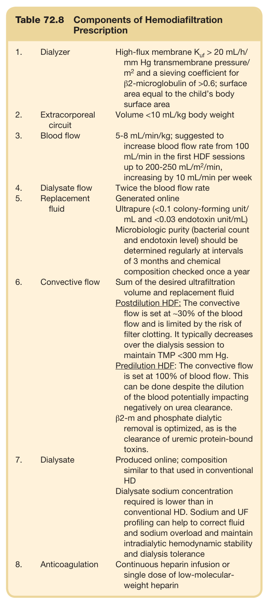

#### Table Data (CSV: [Table_72_8.csv](Table_72_8.csv))

```markdown
| Table Text (OCR) |
| :--- |
| Table 72.8  Components of Hemodiafiltration Prescription 1.  Dialyzer  High-flux membrane  K_{uf} > 20  mL/h/mm Hg transmembrane pressure/ m^{2}  and a sieving coefficient for  \beta 2 -microglobulin of  >0.6 ; surface area equal to the child’s body surface area    2.  Extracorporeal circuit  Volume  <10  mL/kg body weight    3.  Blood flow  5-8 mL/min/kg; suggested to increase blood flow rate from 100 mL/min in the first HDF sessions up to 200-250  mL/m^{2} /min, increasing by 10 mL/min per week    4.  Dialysate flow  Twice the blood flow rate    5.  Replacement fluid  Generated onlineUltrapure ( <0.1  colony-forming unit/mL and  <0.03  endotoxin unit/mL)Microbiologic purity (bacterial count and endotoxin level) should be determined regularly at intervals of 3 months and chemical composition checked once a year    6.  Convective flow  Sum of the desired ultrafiltration volume and replacement fluidPostdilution HDF:The convective flow is set at  \sim 30\%  of the blood flow and is limited by the risk of filter clotting. It typically decreases over the dialysis session to maintain TMP  <300  mm Hg.Predilution HDF:The convective flow is set at 100% of blood flow. This can be done despite the dilution of the blood potentially impacting negatively on urea clearance. \beta 2 -m and phosphate dialytic removal is optimized, as is the clearance of uremic protein-bound toxins.    7.  Dialysate  Produced online; composition similar to that used in conventional HDDialysate sodium concentration required is lower than in conventional HD. Sodium and UF profiling can help to correct fluid and sodium overload and maintain intradialytic hemodynamic stability and dialysis tolerance    8.  Anticoagulation  Continuous heparin infusion or single dose of low-molecular-weight heparin |
```

Table 72.8 Components of Hemodiafiltration Prescription

---

### Table_72_9

#### Table Image

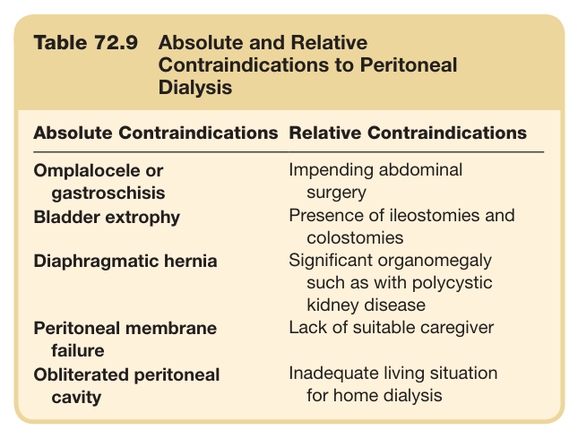

#### Table Data (CSV: [Table_72_9.csv](Table_72_9.csv))

```markdown
| Table Text (OCR) |
| :--- |
| Table 72.9 Absolute and Relative Contraindications to Peritoneal Dialysis Absolute Contraindications  Relative Contraindications    Omplalocele or gastroschisis  Impending abdominal surgery    Bladder extrophy  Presence of ileostomies and colostomies    Diaphragmatic hernia  Significant organomegaly such as with polycystic kidney disease    Peritoneal membrane failure  Lack of suitable caregiver    Obliterated peritoneal cavity  Inadequate living situation for home dialysis |
```

Table 72.9 Absolute and Relative Contraindications to Peritoneal Dialysis

---

### Table_72_10

#### Table Image

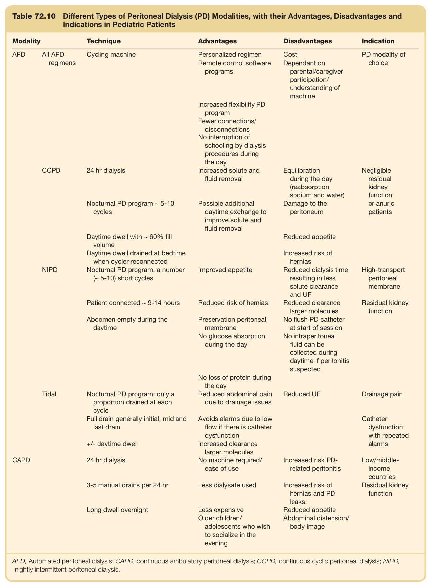

#### Table Data (CSV: [Table_72_10.csv](Table_72_10.csv))

```markdown
| Table Text (OCR) |
| :--- |
| Table 72.10 Different Types of Peritoneal Dialysis (PD) Modalities, with their Advantages, Disadvantages and Indications in Pediatric Patients Modality  Technique  Advantages  Disadvantages  Indication    APD  All APD regimens  Cycling machine  Personalized regimenRemote control software programs  CostDependant on parental/caregiver participation/understanding of machine  PD modality of choice    Increased flexibility PD programFewer connections/disconnectionsNo interruption of schooling by dialysis procedures during the day    CCPD  24 hr dialysis  Increased solute and fluid removal  Equilibration during the day (reabsorption sodium and water)  Negligible residual kidney function or anuric patients    Nocturnal PD program ~ 5-10 cycles  Possible additional daytime exchange to improve solute and fluid removal  Damage to the peritoneum    Daytime dwell with ~ 60% fill volume    Reduced appetite      Daytime dwell drained at bedtime when cycler reconnected    Increased risk of hernias      NIPD  Nocturnal PD program: a number (~ 5-10) short cycles  Improved appetite  Reduced dialysis time resulting in less solute clearance and UF  High-transport peritoneal membrane    Patient connected ~ 9-14 hours  Reduced risk of hernias  Reduced clearance larger molecules  Residual kidney function    Abdomen empty during the daytime  Preservation peritoneal membraneNo glucose absorption during the day  No flush PD catheter at start of sessionNo intraperitoneal fluid can be collected during daytime if peritonitis suspected    No loss of protein during the day    Tidal  Nocturnal PD program: only a proportion drained at each cycle  Reduced abdominal pain due to drainage issues  Reduced UF  Drainage pain    Full drain generally initial, mid and last drain  Avoids alarms due to low flow if there is catheter dysfunction    Catheter dysfunction with repeated alarms    +/- daytime dwell  Increased clearance larger molecules      CAPD  24 hr dialysis  No machine required/ ease of use  Increased risk PD-related peritonitis  Low/middle-income countries    3-5 manual drains per 24 hr  Less dialysate used  Increased risk of hernias and PD leaks  Residual kidney function    Long dwell overnight  Less expensiveOlder children/ adolescents who wish to socialize in the evening  Reduced appetiteAbdominal distension/ body image APD, Automated peritoneal dialysis; CAPD, continuous ambulatory peritoneal dialysis; CCPD, continuous cyclic peritoneal dialysis; NIPD, nightly intermittent peritoneal dialysis. |
```

Table 72.10 Different Types of Peritoneal Dialysis (PD) Modalities, with their Advantages, Disadvantages and Indications in Pediatric Patients

---

### Table_72_11

#### Table Image

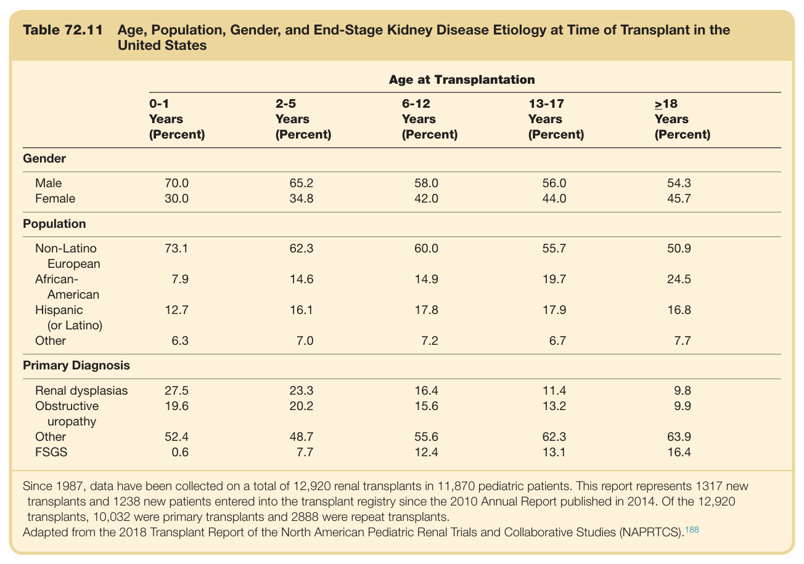

#### Table Data (CSV: [Table_72_11.csv](Table_72_11.csv))

```markdown
| Table Text (OCR) |
| :--- |
| Table 72.11  Age, Population, Gender, and End-Stage Kidney Disease Etiology at Time of Transplant in the United States Age at Transplantation    0-1 Years (Percent)  2-5 Years (Percent)  6-12 Years (Percent)  13-17 Years (Percent)  ≥18 Years (Percent)    Gender    Male  70.0  65.2  58.0  56.0  54.3    Female  30.0  34.8  42.0  44.0  45.7    Population    Non-Latino European  73.1  62.3  60.0  55.7  50.9    African-American  7.9  14.6  14.9  19.7  24.5    Hispanic (or Latino)  12.7  16.1  17.8  17.9  16.8    Other  6.3  7.0  7.2  6.7  7.7    Primary Diagnosis    Renal dysplasias  27.5  23.3  16.4  11.4  9.8    Obstructive uropathy  19.6  20.2  15.6  13.2  9.9    Other  52.4  48.7  55.6  62.3  63.9    FSGS  0.6  7.7  12.4  13.1  16.4 Since 1987, data have been collected on a total of 12,920 renal transplants in 11,870 pediatric patients. This report represents 1317 new transplants and 1238 new patients entered into the transplant registry since the 2010 Annual Report published in 2014. Of the 12,920 transplants, 10,032 were primary transplants and 2888 were repeat transplants. Adapted from the 2018 Transplant Report of the North American Pediatric Renal Trials and Collaborative Studies (NAPRTCS).<sup>188</sup> |
```

Table 72.11 Age, Population, Gender, and End-Stage Kidney Disease Etiology at Time of Transplant in the United States

---

### Table_72_12

#### Table Image

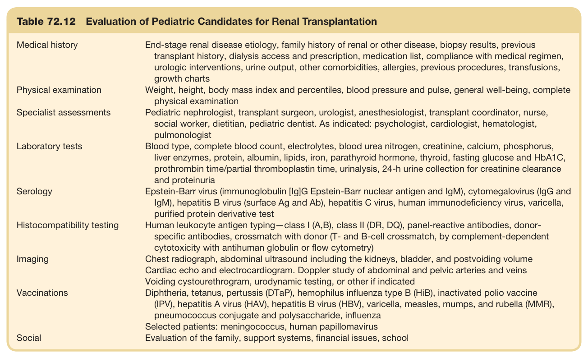

#### Table Data (CSV: [Table_72_12.csv](Table_72_12.csv))

```markdown
| Table Text (OCR) |
| :--- |
| Table 72.12  Evaluation of Pediatric Candidates for Renal Transplantation Medical history  End-stage renal disease etiology, family history of renal or other disease, biopsy results, previous transplant history, dialysis access and prescription, medication list, compliance with medical regimen, urologic interventions, urine output, other comorbidities, allergies, previous procedures, transfusions, growth charts    Physical examination  Weight, height, body mass index and percentiles, blood pressure and pulse, general well-being, complete physical examination    Specialist assessments  Pediatric nephrologist, transplant surgeon, urologist, anesthesiologist, transplant coordinator, nurse, social worker, dietitian, pediatric dentist. As indicated: psychologist, cardiologist, hematologist, pulmonologist    Laboratory tests  Blood type, complete blood count, electrolytes, blood urea nitrogen, creatinine, calcium, phosphorus, liver enzymes, protein, albumin, lipids, iron, parathyroid hormone, thyroid, fasting glucose and HbA1C, prothrombin time/partial thromboplastin time, urinalysis, 24-h urine collection for creatinine clearance and proteinuria    Serology  Epstein-Barr virus (immunoglobulin [Ig]G Epstein-Barr nuclear antigen and IgM), cytomegalovirus (IgG and IgM), hepatitis B virus (surface Ag and Ab), hepatitis C virus, human immunodeficiency virus, varicella, purified protein derivative test    Histocompatibility testing  Human leukocyte antigen typing—class I (A,B), class II (DR, DQ), panel-reactive antibodies, donor-specific antibodies, crossmatch with donor (T- and B-cell crossmatch, by complement-dependent cytotoxicity with antihuman globulin or flow cytometry)    Imaging  Chest radiograph, abdominal ultrasound including the kidneys, bladder, and postvoiding volumeCardiac echo and electrocardiogram. Doppler study of abdominal and pelvic arteries and veinsVoiding cystourethrogram, urodynamic testing, or other if indicated    Vaccinations  Diphtheria, tetanus, pertussis (DTaP), hemophilus influenza type B (HiB), inactivated polio vaccine (IPV), hepatitis A virus (HAV), hepatitis B virus (HBV), varicella, measles, mumps, and rubella (MMR), pneumococcus conjugate and polysaccharide, influenzaSelected patients: meningococcus, human papillomavirus    Social  Evaluation of the family, support systems, financial issues, school |
```

Table 72.12 Evaluation of Pediatric Candidates for Renal Transplantation

---
